# Architecture

> **KUKULCAN.SharedKernel**
>
> **Architecture Handbook**
>
> **Status: **Stable
> Version: **1.0.0-beta1**
---

# Table of Contents

1. [Introduction](#1-introduction)
2. [Architectural Vision](#2-architectural-vision)
3. [Design Principles](#3-design-principles)
4. [Architectural Goals](#4-architectural-goals)
5. [Architectural Style and Structure](#5-architectural-style-and-structure)
6. [High-Level Architecture](#6-high-level-architecture)
7. [Module Catalogue and Responsibilities](#7-module-catalogue-and-responsibilities)
8. [Dependency Model and Architectural Constraints](#8-dependency-model-and-architectural-constraints)
9. [Layering Rules](#9-layering-rules)
10. [Cross-Cutting Concepts](#10-cross-cutting-concepts)
11. [Core Building Blocks](#11-core-building-blocks)
12. [Architectural Decisions](#12-architectural-decisions)
13. [Public API Philosophy](#13-public-api-philosophy)
14. [Extensibility Model](#14-extensibility-model)
15. [Stability Model](#15-stability-model)
16. [Performance Philosophy](#16-performance-philosophy)
17. [Thread Safety](#17-thread-safety)
18. [Testing Strategy](#18-testing-strategy)
19. [Future Evolution](#19-future-evolution)
20. [References](#20-references)

---

# 1. Introduction

## Purpose

This document is the authoritative architectural reference for **KUKULCAN.SharedKernel**.

Rather than documenting individual APIs, this handbook explains the architectural philosophy, structural organization and long-term evolution strategy of the framework.

Its primary objective is to answer three fundamental questions:

- **Why** was the framework designed this way?
- **How** are its modules expected to interact?
- **Which rules** must be respected to preserve architectural consistency over time?

Whenever implementation details appear to conflict with this document, the architectural principles described here should be considered authoritative.

---

## Scope

This handbook describes:

- Architectural vision.
- Design philosophy.
- Module organization.
- Dependency rules.
- Stability guarantees.
- Public API principles.
- Evolution strategy.

Detailed implementation information is intentionally delegated to the module-specific documentation:

- `results.md`
- `validation.md`
- `domain-events.md`
- `specifications.md`
- `globalization.md`
- `versioning.md`

This separation keeps the architecture documentation focused on *structure* rather than implementation details.

---

## Intended Audience

This document targets:

- Framework maintainers.
- Contributors.
- Software architects.
- Library authors.
- Enterprise developers.

Readers are expected to be familiar with:

- C#
- Object-Oriented Design
- SOLID Principles
- Domain-Driven Design (DDD)
- Clean Architecture

Knowledge of CQRS and Event-Driven Design is recommended but not mandatory.

---

## Architectural Philosophy

KUKULCAN.SharedKernel was never intended to become a miscellaneous utility library.

Instead, it serves as the architectural core of the KUKULCAN ecosystem.

Every public type exists because it contributes to one or more architectural goals.

Features are added only when they strengthen the architecture.

The framework deliberately favors:

- explicit modelling;
- strong typing;
- immutability;
- low coupling;
- high cohesion;
- long-term maintainability.

This philosophy can be summarized by one guiding principle:

> **Architecture is a long-term investment, not a short-term optimization.**

---

## Development Lifecycle

Every module in KUKULCAN.SharedKernel follows the same engineering lifecycle.

```text
Architecture Design
        ↓
Implementation
        ↓
Architectural Audit
        ↓
Refactoring
        ↓
Module Freeze
        ↓
Maintenance
```

No module is considered complete until it has passed a full architectural audit.

Once frozen, modules are expected to evolve conservatively, preserving API stability whenever possible.

---

## Architectural Baseline

Current architectural baseline:

```
v1.0.0-beta1
```

This handbook documents the architecture corresponding to that release.

Future releases will preserve these principles unless explicitly superseded by a future major version.

---

## Document Conventions

Throughout this handbook:

- **Module** refers to a logical subsystem within the Shared Kernel.
- **Public API** refers to all publicly accessible types and members.
- **Frozen Module** refers to a module whose public surface has been declared stable.
- **ADR** denotes an *Architectural Decision Record*, explaining the rationale behind significant design decisions.

---

## Reading Order

Although each chapter can be read independently, the recommended reading order is:

1. Introduction
2. Architectural Vision
3. Design Principles
4. High-Level Architecture
5. Module Catalog
6. Dependency Model

Only after understanding these concepts should readers continue to the implementation-specific documentation.

---

## Relationship with Other Documents

This handbook occupies the highest level in the project's documentation hierarchy.

```
README
        │
        ▼
architecture.md
        │
        ├── results.md
        ├── validation.md
        ├── domain-events.md
        ├── specifications.md
        ├── globalization.md
        └── versioning.md
```

The README explains **how to use** the framework.

This handbook explains **how the framework is built**.

The remaining documents explain **how each subsystem works internally**.

# 2. Architectural Vision

## Why KUKULCAN.SharedKernel Exists

Enterprise software rarely fails because of algorithms.

It usually fails because its architecture slowly degrades over time.

As applications grow, developers often duplicate concepts, introduce inconsistent abstractions, mix responsibilities and gradually lose the architectural clarity that originally existed.

The purpose of **KUKULCAN.SharedKernel** is to prevent that degradation by providing a stable architectural foundation that can be shared across every application within the KUKULCAN ecosystem.

Rather than solving business problems directly, the Shared Kernel solves architectural problems.

Its objective is to ensure that every application starts from the same architectural baseline.

---

## Architectural Mission

The mission of KUKULCAN.SharedKernel is:

> **To provide a stable, reusable and framework-independent architectural foundation for enterprise software.**

The framework intentionally avoids becoming a collection of utilities or helper methods.

Every component included in the Shared Kernel must exist because it reinforces the architectural model.

If a component does not improve the architecture, it does not belong in the Shared Kernel.

---

## Long-Term Vision

The framework has been designed with a long-term perspective.

The objective is not merely to support the next application, but to provide an architectural foundation capable of supporting many applications over many years.

Consequently, architectural decisions are evaluated according to their long-term consequences rather than their short-term convenience.

Whenever two solutions exist, the framework consistently prefers the one that is:

- easier to maintain;
- easier to understand;
- easier to extend;
- less coupled;
- more explicit.

---

## Architectural Priorities

The following priorities guided every design decision.

1. Architectural consistency.
2. Explicit modelling.
3. Strong typing.
4. Simplicity.
5. Maintainability.
6. Testability.
7. Extensibility.
8. Performance.

Notice that performance appears after maintainability.

This ordering is intentional.

Micro-optimizations should never compromise architectural quality.

---

## Enterprise First

KUKULCAN.SharedKernel has been designed primarily for enterprise software.

Typical characteristics of the target applications include:

- Long life cycles.
- Multiple development teams.
- Continuous evolution.
- Large code bases.
- Complex business domains.
- High maintainability requirements.

The framework intentionally favors readability and explicitness over compact code.

---

## A Foundation, Not a Framework

Although the Shared Kernel provides reusable building blocks, it deliberately avoids controlling application flow.

It is **not**:

- an application framework;
- a web framework;
- an ORM;
- a dependency injection container;
- a logging framework.

Instead, it provides the architectural primitives upon which those technologies can be integrated.

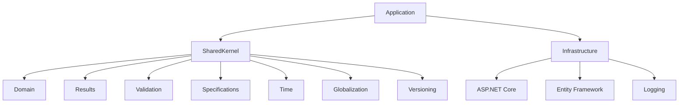

The Shared Kernel sits at the center of the domain model while remaining completely independent of infrastructure concerns.

---

## Framework Independence

One of the fundamental architectural decisions is complete framework independence.

The domain model should never depend directly on:

- ASP.NET Core;
- Entity Framework;
- JSON serializers;
- Logging libraries;
- Message brokers;
- Databases.

This independence provides several benefits:

- improved portability;
- easier testing;
- lower coupling;
- longer software lifespan.

Infrastructure evolves much faster than business domains.

The Shared Kernel therefore isolates the domain from technological change.

---

## Domain-Centric Design

The framework places the business domain at the center of the architecture.

Everything else exists to support the domain.

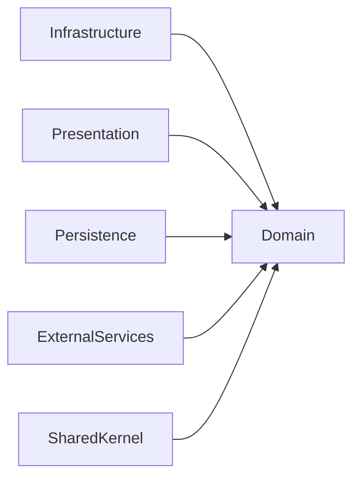

Business rules should never become dependent on infrastructure technologies.

Instead, infrastructure adapts itself to the domain model.

---

## Architectural Consistency

Consistency is considered one of the highest architectural values.

Developers should encounter the same patterns throughout the framework.

For example:

- expected failures return `Result`;
- optional values use `Maybe`;
- validation uses `ValidationResult`;
- business identity uses strongly typed identifiers;
- equality is structural for Value Objects;
- entities encapsulate identity.

Learning one module should naturally facilitate understanding every other module.

---

## Minimal Public Surface

Every public member becomes part of the framework contract.

For this reason, the Shared Kernel intentionally exposes a relatively small public API.

New public types are introduced conservatively.

Whenever possible, implementation details remain internal.

This philosophy reduces:

- maintenance cost;
- breaking changes;
- cognitive load.

---

## Evolution Through Stability

The framework follows a deliberate evolution strategy.

Instead of continuously redesigning its architecture, modules progress through a controlled lifecycle.

```text
Design
      ↓
Implementation
      ↓
Architectural Audit
      ↓
Freeze
      ↓
Maintenance
```

Once a module reaches the **Frozen** state, future changes become incremental rather than structural.

This greatly improves predictability for framework consumers.

---

## Quality Over Quantity

The objective is not to maximize the number of APIs.

The objective is to maximize the quality of the APIs that exist.

A coherent API containing fifty carefully designed types is considered preferable to an inconsistent API containing five hundred types.

Every public component should justify its existence.

---

## Architectural Success Criteria

The success of KUKULCAN.SharedKernel is not measured by:

- number of classes;
- number of APIs;
- number of modules.

Instead, success is measured by the following questions:

- Is the architecture understandable?
- Is the public API coherent?
- Can modules evolve independently?
- Can applications remain maintainable after many years?
- Can developers easily predict framework behavior?

If the answer to these questions remains **yes**, then the architectural vision has been achieved.

---

## Architectural Decision Record

### ADR-001 — Architecture Before Functionality

**Decision**

Architectural consistency has priority over feature growth.

**Rationale**

Enterprise software typically lives for many years.

Poor architectural decisions accumulate technical debt much faster than missing features.

A stable architecture provides significantly greater long-term value than a rapidly expanding API.

**Consequences**

- Smaller public API.
- Better documentation.
- Fewer breaking changes.
- Greater maintainability.
- Easier onboarding for new developers.

# 3. Design Principles

The architecture of **KUKULCAN.SharedKernel** is governed by a small set of fundamental principles.

These principles influence every architectural decision, every public API and every module contained within the framework.

Whenever implementation details appear to contradict one of these principles, the implementation should be reconsidered.

---

# Design Philosophy

The framework is based on a simple observation.

Enterprise software rarely becomes difficult because of business logic.

It becomes difficult because architectural decisions accumulate over time.

The purpose of these principles is therefore not merely to improve the current implementation, but to preserve architectural quality for many years.

The following principles are considered non-negotiable.

---

# Principle 1 — Architecture Before Functionality

Architecture is always considered more important than feature count.

Adding new APIs is easy.

Maintaining them for the next ten years is considerably more difficult.

Consequently, functionality should only be introduced when it strengthens the architectural model.

Features that merely increase convenience without improving the architecture should generally remain outside the Shared Kernel.

---

## Architectural Decision Record

### ADR-002

**Decision**

Architecture takes precedence over feature growth.

**Motivation**

Enterprise software lives much longer than individual features.

Maintaining a coherent architecture provides greater long-term value than continuously expanding the public API.

---

# Principle 2 — Explicit Modeling

The domain should explicitly model concepts.

Primitive values rarely communicate intent.

Instead of exposing:

```csharp
Guid
```

the framework prefers:

```csharp
CustomerId
```

Instead of:

```csharp
string
```

the framework encourages:

```csharp
Email
```

Explicit modeling improves:

- readability;
- discoverability;
- correctness;
- maintainability.

---

# Principle 3 — Strong Typing

Compile-time correctness is preferred over runtime validation.

Whenever the compiler can prevent an error, runtime validation becomes unnecessary.

For this reason, the framework strongly favors:

- Strongly Typed Identifiers;
- Value Objects;
- Immutable models;
- Explicit Result types.

The compiler should become the first line of defense.

---

# Principle 4 — Immutability

Immutable objects are easier to:

- understand;
- reason about;
- test;
- share safely.

Therefore:

- Value Objects are immutable.
- SemanticVersion is immutable.
- SupportedCulture is immutable.
- Most public models avoid mutable state.

Mutability should exist only where business identity requires it.

---

# Principle 5 — High Cohesion

Every module should solve one problem.

Modules should never become collections of unrelated functionality.

For example:

| Module         | Responsibility          |
|----------------|-------------------------|
| Results        | Functional result model |
| Validation     | Validation model        |
| Domain         | Domain abstractions     |
| Specifications | Business predicates     |
| Time           | Time abstractions       |
| Globalization  | Culture abstractions    |

This separation reduces complexity while improving discoverability.

---

# Principle 6 — Low Coupling

Modules should know as little as possible about each other.

Dependencies must always be intentional.

The preferred dependency graph resembles a directed acyclic graph rather than a network of cyclic references.

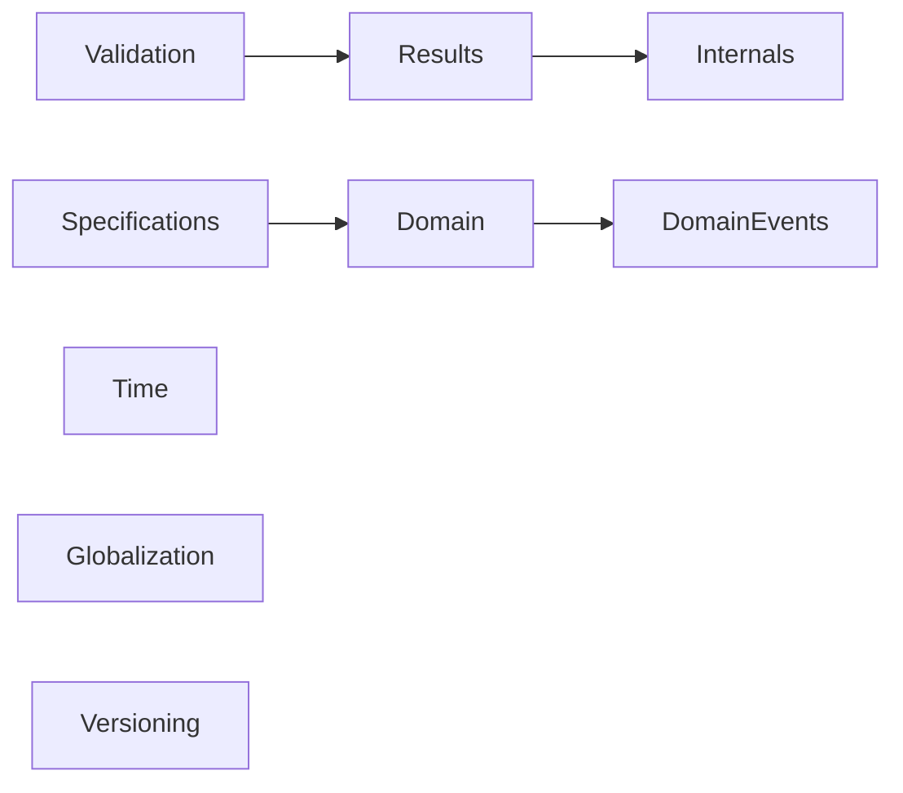

Each dependency should have a clear architectural justification.

---

# Principle 7 — Framework Independence

Business concepts should never depend upon infrastructure.

The Shared Kernel intentionally avoids direct dependencies on:

- ASP.NET Core
- Entity Framework
- Logging frameworks
- Serialization libraries
- Databases
- Message brokers

Infrastructure changes more frequently than business domains.

The architecture therefore isolates business rules from technological evolution.

---

# Principle 8 — Public API Minimalism

Every public type becomes part of the framework contract.

Consequently, every public API introduces a permanent maintenance cost.

The framework therefore exposes only APIs that are considered architecturally essential.

Whenever possible:

```csharp
internal
```

is preferred over:

```csharp
public
```

Public surface area should remain intentionally small.

---

# Principle 9 — Predictability

Developers should not need to guess framework behavior.

The same architectural patterns should appear consistently throughout every module.

Examples include:

Expected failure:

```csharp
Result
```

Optional value:

```csharp
Maybe<T>
```

Validation:

```csharp
ValidationResult
```

Business identity:

```csharp
CustomerId
```

The same problem should always have the same architectural solution.

---

# Principle 10 — Separation of Concerns

Responsibilities should never overlap.

Business rules belong in the domain.

Validation belongs in Validation.

Failure modeling belongs in Results.

Time belongs in Time.

Localization belongs in Globalization.

Each subsystem remains focused on its own concern.

---

# Principle 11 — Testability

Every component should be independently testable.

Architectural decisions should reduce testing complexity rather than increase it.

Examples include:

- FakeClock
- Immutable Value Objects
- Strongly Typed Identifiers
- Stateless Specifications

The architecture intentionally favors deterministic behavior.

---

# Principle 12 — Evolution Through Stability

Architectural evolution follows a controlled process.

```text
Design
      ↓
Implementation
      ↓
Architectural Audit
      ↓
Refactoring
      ↓
Freeze
      ↓
Maintenance
```

After a module has been frozen, structural modifications become exceptional.

This allows applications depending on the Shared Kernel to evolve with confidence.

---

# Principle 13 — Documentation as Code

Documentation is considered part of the implementation.

Every public API should include XML documentation.

Every subsystem should include dedicated architectural documentation.

Architecture documentation evolves together with the source code.

Outdated documentation is treated as a defect.

---

# Principle 14 — Simplicity

Simple architectures tend to survive.

Complex architectures tend to require continuous redesign.

Whenever multiple solutions exist, the framework consistently prefers the simplest solution capable of solving the problem correctly.

Simplicity should never be confused with lack of functionality.

Rather, simplicity is considered a consequence of good architectural design.

---

# Principle 15 — Long-Term Maintainability

Every architectural decision should answer one question:

> **Will this still be understandable ten years from now?**

If the answer is uncertain, the design should be reconsidered.

Maintainability remains the ultimate objective of the Shared Kernel.

---

# Architectural Summary

The design principles described above collectively define the architectural identity of KUKULCAN.SharedKernel.

They are not independent rules.

Instead, they reinforce one another.

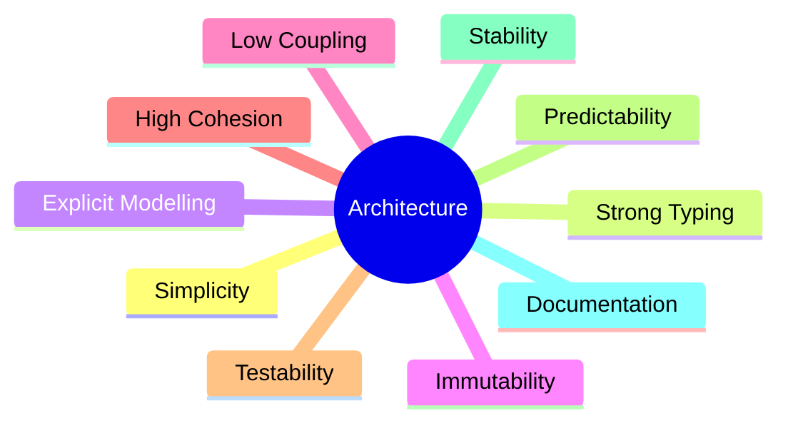

Together, these principles provide a coherent foundation upon which every module of the Shared Kernel has been designed.

Future modules should continue following these same principles to preserve architectural consistency across the entire framework.

# 4. Architectural Goals

The architecture of **KUKULCAN.SharedKernel** has not evolved accidentally.

Every module, abstraction and public API exists because it contributes to one or more explicit architectural goals.

These goals define what the framework attempts to achieve and provide objective criteria for evaluating future architectural decisions.

Whenever new functionality is proposed, it should contribute to one or more of the goals described below.

If it does not, it most likely does not belong in the Shared Kernel.

---

# Goal 1 — Consistency

Consistency is the most important architectural objective.

Developers should encounter the same concepts, naming conventions and design patterns throughout the framework.

Examples include:

- Expected failures always use `Result`.
- Optional values always use `Maybe<T>`.
- Validation always produces `ValidationResult`.
- Business identity is always represented by Strongly Typed Identifiers.
- Equality for Value Objects is always structural.

Consistency reduces cognitive load and allows developers to predict framework behavior without reading implementation details.

---

## Why It Matters

Inconsistent APIs force developers to continuously switch mental models.

A consistent framework becomes easier to learn, easier to use and easier to maintain.

---

# Goal 2 — Maintainability

The Shared Kernel has been designed to remain understandable for many years.

Maintainability takes precedence over convenience.

This objective influences decisions such as:

- Small public API surface.
- High cohesion.
- Low coupling.
- Explicit modelling.
- Conservative evolution.

The cost of maintaining an API is always considered before introducing new functionality.

---

# Goal 3 — Reusability

The framework should provide reusable architectural building blocks rather than application-specific behavior.

Examples include:

- Result
- ValueObject
- AggregateRoot
- Specification
- SemanticVersion
- SupportedCulture

Conversely, business-specific concepts should remain outside the Shared Kernel.

---

# Goal 4 — Framework Independence

Business architecture should remain independent of infrastructure technologies.

The Shared Kernel intentionally avoids dependencies on:

- ASP.NET Core
- Entity Framework
- Logging frameworks
- Databases
- HTTP stacks
- Serialization libraries

This objective allows applications to evolve technologically without affecting the business model.

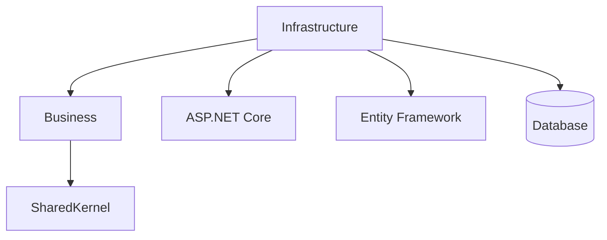

---

# Goal 5 — Explicit Domain Modeling

Business concepts should be represented explicitly.

Primitive values rarely communicate intent.

Instead of:

```csharp
Guid
```

the framework encourages:

```csharp
CustomerId
```

Instead of:

```csharp
string
```

it encourages:

```csharp
Email
```

Explicit models improve:

- readability;
- discoverability;
- correctness;
- validation.

---

# Goal 6 — API Stability

Public APIs are long-term contracts.

The framework therefore follows a conservative evolution model.

Every module passes through the following lifecycle:

```text
Design
      ↓
Implementation
      ↓
Architectural Audit
      ↓
Freeze
      ↓
Maintenance
```

Once frozen, public APIs evolve carefully, prioritizing backward compatibility.

---

# Goal 7 — Testability

Architectural components should be independently testable.

Examples include:

- FakeClock
- Immutable Value Objects
- Stateless Specifications
- Explicit Result types

The architecture intentionally avoids hidden state and implicit dependencies.

---

# Goal 8 — Extensibility

Applications should be able to extend the Shared Kernel without modifying it.

Examples include:

- Custom Specifications.
- Custom Value Objects.
- Custom Strongly Typed Identifiers.
- Additional globalization providers.
- New domain abstractions.

Extension should occur through composition rather than modification.

---

# Goal 9 — Separation of Concerns

Every module has a clearly defined responsibility.

| Module         | Primary Responsibility           |
|----------------|----------------------------------|
| Results        | Functional success/failure model |
| Validation     | Validation infrastructure        |
| Domain         | Domain abstractions              |
| DomainEvents   | Domain Event model               |
| Specifications | Business predicates              |
| Time           | Time abstraction                 |
| Globalization  | Culture and formatting           |
| Versioning     | Semantic version representation  |

This separation improves maintainability and prevents architectural erosion.

---

# Goal 10 — Predictability

Developers should never need to guess framework behavior.

Given a familiar problem, the solution should always be consistent.

Examples:

Expected failure → `Result`

Optional value → `Maybe<T>`

Validation → `ValidationResult`

Business identity → Strongly Typed Identifier

This predictability significantly reduces onboarding time for new developers.

---

# Goal 11 — Documentation

Documentation is considered part of the architecture.

Every public API should include XML documentation.

Every subsystem should include dedicated technical documentation.

Architecture documentation should evolve together with the implementation.

Outdated documentation is considered an architectural defect.

---

# Goal 12 — Long-Term Evolution

The Shared Kernel is expected to evolve for many years.

Future evolution should primarily consist of:

- bug fixes;
- documentation improvements;
- performance optimisations;
- carefully reviewed architectural enhancements.

Large-scale redesigns should become increasingly rare as the framework matures.

---

# Relationship Between Goals

The architectural goals reinforce one another.

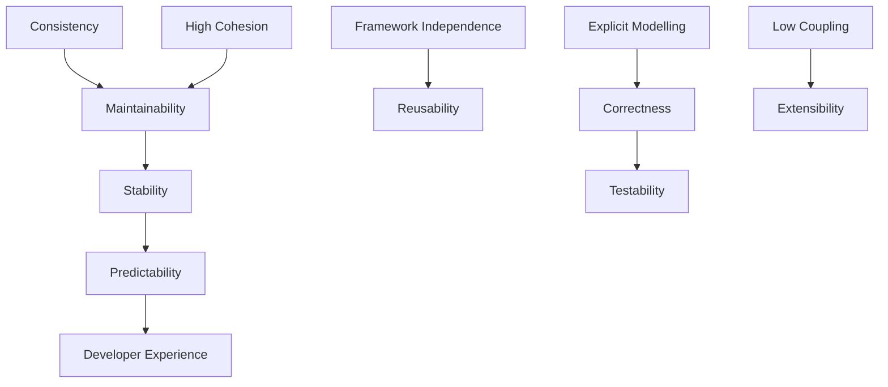

No single goal should be considered in isolation.

Architectural decisions should seek the best overall balance.

---

# Measuring Success

The architecture is considered successful when:

- APIs remain coherent.
- Modules remain independent.
- Public contracts remain stable.
- Documentation remains accurate.
- Developers can easily predict framework behavior.
- New contributors can understand the framework without studying its implementation.

These indicators provide a more meaningful measure of quality than the number of features or classes contained within the framework.

---

# Architectural Decision Record

## ADR-003 — Goals Before Features

### Decision

Architectural goals define the evolution of the framework.

Features exist only to support those goals.

### Motivation

Without explicit objectives, software tends to grow inconsistently over time.

By defining architectural goals first, every future proposal can be evaluated objectively.

### Consequences

- More coherent architecture.
- Smaller public API.
- Easier long-term maintenance.
- Greater architectural stability.
- Reduced technical debt.

# 5. Architectural Style and Structure

The architecture of **KUKULCAN.SharedKernel** is deliberately conservative.

Rather than inventing a new architectural paradigm, the framework combines several well-established architectural patterns into a coherent whole.

The objective is not originality.

The objective is long-term maintainability.

---

# Architectural Foundations

The Shared Kernel is primarily inspired by:

- Domain-Driven Design (DDD)
- Clean Architecture
- SOLID Principles
- Functional Error Handling
- Composition over Inheritance
- Explicit Domain Modeling

None of these patterns is followed dogmatically.

Instead, each one is adopted only where it strengthens the architectural model.

---

# Domain-Centric Architecture

The business domain occupies the center of the architecture.

Everything else exists to support it.

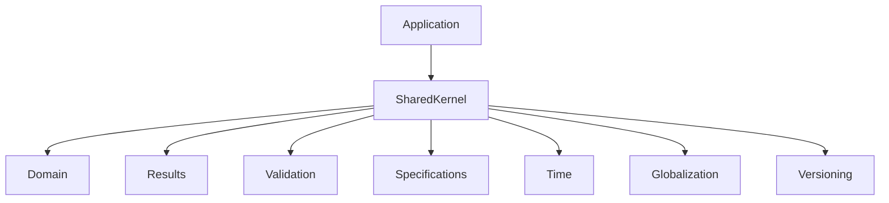

The architecture deliberately avoids allowing infrastructure concerns to influence the domain model.

---

# Why a Shared Kernel?

Within Domain-Driven Design, the Shared Kernel represents the common language shared by multiple bounded contexts.

In KUKULCAN, the Shared Kernel provides reusable architectural building blocks that remain independent of any particular application.

It intentionally contains:

- abstractions;
- primitives;
- architectural patterns;
- cross-cutting domain concepts.

It intentionally excludes:

- business logic;
- persistence;
- networking;
- presentation;
- infrastructure.

---

# Clean Architecture Alignment

The Shared Kernel naturally occupies the innermost part of a Clean Architecture.

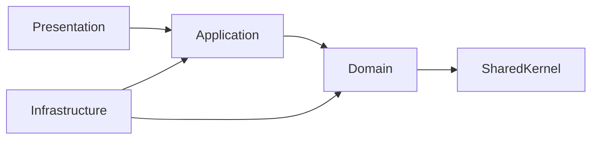

Notice that the Shared Kernel depends on nothing.

Everything else depends on it.

This dependency direction is intentional.

---

# Dependency Direction

The framework follows a strict dependency rule.

Dependencies always point towards more fundamental concepts.

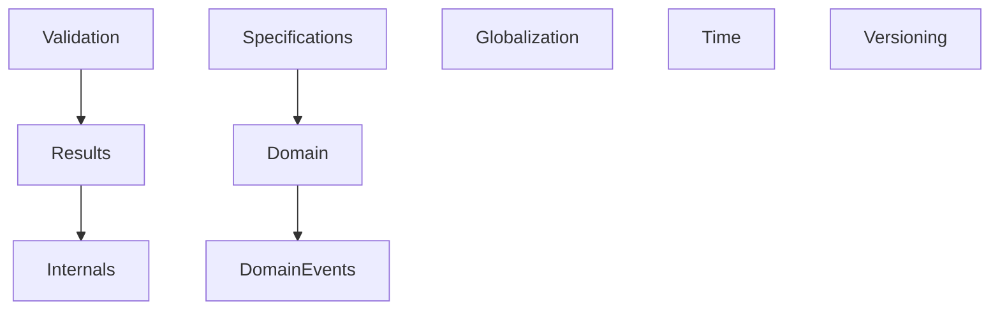

No dependency should ever point in the opposite direction.

This guarantees the absence of architectural cycles.

---

# Layer Responsibilities

Although the Shared Kernel is distributed as a single library, it can be understood as several conceptual layers.

```text
+-----------------------------------------+
| Public APIs                             |
+-----------------------------------------+
| Domain Building Blocks                  |
+-----------------------------------------+
| Cross-Cutting Architectural Components  |
+-----------------------------------------+
| Internal Infrastructure                 |
+-----------------------------------------+
```

Each layer exposes only what is necessary to the layer above.

---

# Architectural Modules

Every module has exactly one primary responsibility.

| Module         | Responsibility                       |
|----------------|--------------------------------------|
| Results        | Functional result model              |
| Validation     | Validation model                     |
| Domain         | Core domain abstractions             |
| DomainEvents   | Domain event infrastructure          |
| Specifications | Business predicates                  |
| Time           | Time abstraction                     |
| Globalization  | Culture abstraction                  |
| Versioning     | Semantic version representation      |
| Collections    | Collection helpers                   |
| Guards         | Defensive programming                |
| Identifiers    | Strongly Typed Identifiers           |
| Exceptions     | Framework exceptions                 |
| Internals      | Shared implementation infrastructure |

This separation is one of the defining characteristics of the architecture.

---

# Module Independence

Modules should remain as independent as possible.

Whenever a dependency exists, it must satisfy one of the following conditions:

- Architectural necessity.
- Shared abstraction.
- Domain relationship.

Convenience alone is never considered a sufficient reason.

---

# Public vs Internal Components

The framework distinguishes between two categories of types.

## Public

Public types define the framework contract.

Examples include:

- Result
- Maybe
- ValueObject
- AggregateRoot
- SemanticVersion
- SupportedCulture

These APIs evolve conservatively.

---

## Internal

Internal components exist exclusively to support the public APIs.

Examples include:

- StructuralComparer
- DictionaryComparer
- EnumerableComparer
- ObjectFormatter

Consumers should never depend upon these implementation details.

---

# Functional Error Handling

Expected failures are modeled explicitly.

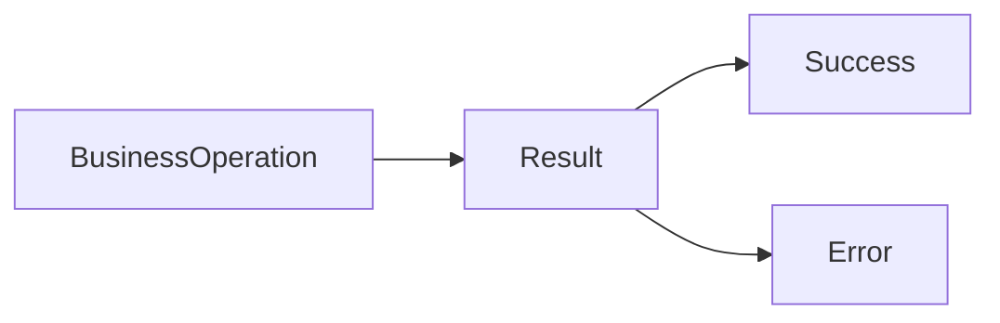

Expected failures never require exceptions.

This significantly improves API predictability.

---

# Explicit Validation

Validation is treated as an independent architectural concern.

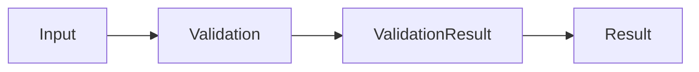

Validation remains completely separated from business behavior.

---

# Time Isolation

Time is considered an external dependency.

Instead of directly calling:

```csharp
DateTime.UtcNow
```

the architecture encourages:

```csharp
IClock
```

This enables deterministic testing while reducing hidden dependencies.

---

# Globalization Isolation

Localization concerns remain outside the business model.

Business logic should never directly manipulate cultures or formatting.

Instead:


Applications remain free to introduce additional globalization providers without affecting the domain model.

---

# Semantic Versioning

Version information is modeled as a Value Object.

```text
SemanticVersion

Major
Minor
Patch
Prerelease
Build Metadata
```

Rather than treating versions as strings, the framework models them explicitly.

---

# Architectural Characteristics

The architecture intentionally exhibits the following characteristics.

| Characteristic        | Status  |
|-----------------------|:-------:|
| Strongly Typed        |   ✅    |
| Immutable by Default  |   ✅    |
| Framework Independent |   ✅    |
| Explicit APIs         |   ✅    |
| High Cohesion         |   ✅    |
| Low Coupling          |   ✅    |
| Testable              |   ✅    |
| Modular               |   ✅    |
| Stable                |   ✅    |

---

# Architectural Constraints

Every future module should respect the following constraints.

- One primary responsibility.
- Minimal public surface.
- No cyclic dependencies.
- Framework independence.
- XML documentation.
- Deterministic behaviour.
- Backward compatibility.

Modules violating these constraints should not be introduced.

---

# Architectural Decision Record

## ADR-004 — Modular Monolith Architecture

### Decision

The Shared Kernel is implemented as a modular architecture rather than a collection of unrelated utilities.

### Motivation

Grouping related architectural concepts into cohesive modules significantly improves:

- discoverability;
- maintainability;
- documentation;
- long-term evolution.

### Consequences

- Clear module boundaries.
- Predictable dependencies.
- Easier architectural auditing.
- Better scalability of the codebase.

---

# Summary

The architectural style of KUKULCAN.SharedKernel combines Domain-Driven Design, Clean Architecture and explicit domain modeling into a modular, strongly typed and framework-independent foundation.

Every module contributes to a single architectural objective.

Together they form a cohesive ecosystem designed to remain stable and maintainable over many years.

# 6. High-Level Architecture

The purpose of this chapter is to present the overall structure of **KUKULCAN.SharedKernel**.

Rather than focusing on implementation details, it provides a high-level view of how the different architectural modules relate to one another.

Understanding this chapter should allow a developer to navigate the codebase without prior knowledge of its implementation.

---

# Architectural Overview

The Shared Kernel is organized as a collection of highly cohesive architectural modules.

Each module owns a single architectural responsibility while collaborating with other modules through carefully controlled dependencies.

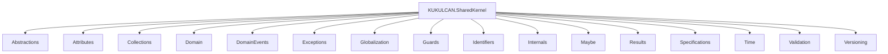

The modules are conceptually independent even though they are distributed as a single assembly.

---

# Complete Module Structure

```text
KUKULCAN.SharedKernel

├── Abstractions
├── Attributes
├── Collections
├── Domain
├── DomainEvents
├── Exceptions
├── Globalization
├── Guards
├── Identifiers
├── Internals
├── Maybe
├── Results
├── Specifications
├── Time
├── Validation
└── Versioning
```

This structure has remained intentionally compact.

Future modules should only be introduced when they represent a genuinely new architectural concern.

---

# Module Classification

The framework can be divided into four conceptual categories.

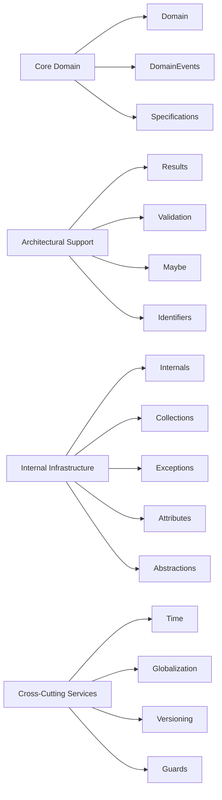

Each category serves a different architectural purpose.

---

# Core Domain Layer

The Core Domain layer contains the abstractions required to model business domains.

Modules include:

| Module         | Purpose                                  |
|----------------|------------------------------------------|
| Domain         | Entities, Value Objects, Aggregate Roots |
| DomainEvents   | Domain Event infrastructure              |
| Specifications | Business rule composition                |

These modules form the conceptual center of the Shared Kernel.

---

# Functional Programming Layer

The framework adopts several ideas from functional programming to improve explicitness.

Modules include:

| Module     | Purpose                       |
|------------|-------------------------------|
| Results    | Success / Failure modelling   |
| Maybe      | Optional value representation |
| Validation | Validation result modelling   |

Together these modules replace many traditional uses of exceptions and null values.

---

# Cross-Cutting Layer

Cross-cutting concerns are intentionally isolated.

| Module        | Purpose                |
|---------------|------------------------|
| Time          | Time abstraction       |
| Globalization | Culture abstraction    |
| Versioning    | Semantic Version model |
| Guards        | Defensive programming  |

These modules support every application layer without introducing infrastructure dependencies.

---

# Infrastructure Support Layer

Several modules exist exclusively to support the public architecture.

| Module       | Purpose                              |
|--------------|--------------------------------------|
| Internals    | Shared implementation infrastructure |
| Collections  | Collection utilities                 |
| Attributes   | Framework attributes                 |
| Exceptions   | Framework exception hierarchy        |
| Abstractions | Common interfaces                    |

Most consumers will interact with these modules only indirectly.

---

# Dependency Overview

The dependency graph has been intentionally designed as a Directed Acyclic Graph (DAG).

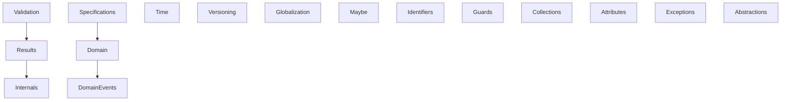

Notice that:

- no dependency cycles exist;
- dependency direction is always intentional;
- modules remain independently maintainable.

---

# Public API Distribution

Not every module contributes equally to the public API.

The primary public surface consists of:

```text
Results
Maybe
Domain
Specifications
Validation
Time
Globalization
Versioning
Identifiers
```

The remaining modules primarily provide implementation support.

---

# Communication Between Modules

Modules communicate exclusively through well-defined public contracts.

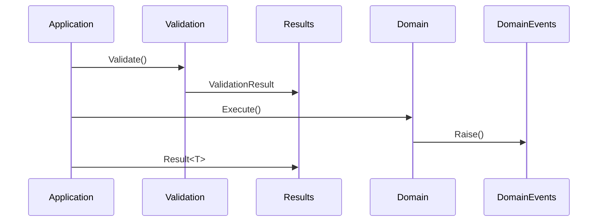

No module is allowed to depend upon another module's implementation details.

---

# Architectural Flow

A typical business operation follows the architecture below.

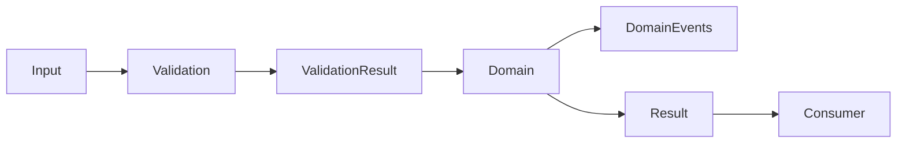

This flow illustrates the intended separation between validation, business behavior and error modeling.

---

# Module Lifecycle

Every module follows the same governance model.

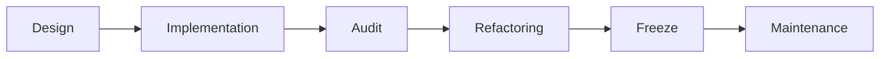

This lifecycle ensures that architectural quality improves before stability is declared.

---

# Architectural Characteristics

The complete architecture exhibits the following properties.

| Characteristic         | Status  |
|------------------------|:-------:|
| Modular                |   ✅    |
| Layered                |   ✅    |
| Framework Independent  |   ✅    |
| Strongly Typed         |   ✅    |
| Immutable by Default   |   ✅    |
| Explicit Failure Model |   ✅    |
| No Cyclic Dependencies |   ✅    |
| High Cohesion          |   ✅    |
| Low Coupling           |   ✅    |
| Testable               |   ✅    |

---

# Architectural Decision Record

## ADR-005 — Single Shared Assembly

### Decision

All architectural modules are distributed within a single assembly.

### Motivation

The modules are highly cohesive and designed to evolve together.

Splitting them into multiple NuGet packages would:

- complicate dependency management;
- increase versioning complexity;
- provide little practical benefit.

### Consequences

Advantages:

- Simpler dependency graph.
- Single version number.
- Easier adoption.
- Easier maintenance.

Trade-offs:

- Larger assembly.
- All modules are deployed together.

The benefits were considered to outweigh the disadvantages.

---

# Summary

The high-level architecture of KUKULCAN.SharedKernel intentionally favors **clarity over complexity**.

Each module has a single architectural responsibility, dependencies are carefully controlled, and every component contributes to a coherent architectural ecosystem.

Subsequent chapters will progressively examine each of these architectural aspects in greater detail, beginning with the complete catalogue of modules and their individual responsibilities.

# 7. Module Catalogue and Responsibilities

The architecture of **KUKULCAN.SharedKernel** is intentionally modular.

Every module represents a single architectural responsibility and contributes to the overall coherence of the framework.

This chapter provides the authoritative catalogue of all architectural modules together with their responsibilities, dependency rules and implementation status.

---

# Module Overview

| Module         | Responsibility                 | Frozen  | Detailed Documentation    |
|----------------|--------------------------------|:-------:|---------------------------|
| Abstractions   | Common framework contracts     |   ✅    | —                         |
| Attributes     | Shared attributes              |   ✅    | —                         |
| Collections    | Collection infrastructure      |   ✅    | —                         |
| Domain         | Domain abstractions            |   ✅    | domain.md *(future)*      |
| DomainEvents   | Domain Event infrastructure    |   ✅    | domain-events.md          |
| Exceptions     | Framework exception hierarchy  |   ✅    | —                         |
| Globalization  | Globalization abstractions     |   ✅    | globalization.md          |
| Guards         | Defensive programming          |   ✅    | —                         |
| Identifiers    | Strongly Typed Identifiers     |   ✅    | identifiers.md *(future)* |
| Internals      | Internal shared infrastructure |   ✅    | —                         |
| Maybe          | Optional value model           |   ✅    | maybe.md *(future)*       |
| Results        | Functional Result model        |   ✅    | results.md                |
| Specifications | Specification Pattern          |   ✅    | specifications.md         |
| Time           | Time abstraction               |   ✅    | time.md *(future)*        |
| Validation     | Validation model               |   ✅    | validation.md             |
| Versioning     | Semantic Version model         |   ✅    | versioning.md             |

---

# Architectural Relationships

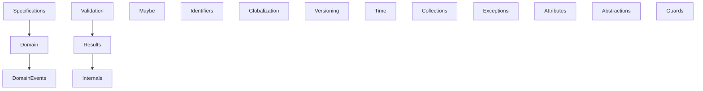

Dependencies not shown in this diagram are intentionally absent.

---

# Module Responsibilities

## Abstractions

### Purpose

Defines reusable framework contracts shared by multiple modules.

### Examples

- Common interfaces.
- Marker interfaces.
- Generic architectural contracts.

### Responsibilities

- Provide common abstractions.
- Avoid implementation details.
- Remain infrastructure independent.

### Must Not

- Contain business logic.
- Depend upon concrete implementations.

---

## Attributes

### Purpose

Provides reusable custom attributes used throughout the framework.

### Responsibilities

- Declarative metadata.
- Framework annotations.

### Must Not

- Implement business behavior.
- Introduce runtime dependencies.

---

## Collections

### Purpose

Provides reusable collection-related infrastructure.

### Responsibilities

- Collection helpers.
- Equality support.
- Internal collection utilities.

### Must Not

- Replace the .NET Base Class Library.
- Become a generic utility's module.

---

## Domain

### Purpose

Represents the architectural center of the Shared Kernel.

### Responsibilities

- Entity.
- AggregateRoot.
- ValueObject.
- Enumeration.

### Depends On

- DomainEvents (event abstraction only).

### Must Not

- Depend on infrastructure.
- Perform persistence.
- Perform validation.
- Know about ASP.NET Core.

---

## DomainEvents

### Purpose

Provides infrastructure for Domain Events.

### Responsibilities

- Event abstraction.
- Event collection.
- Event lifecycle.

### Must Not

- Publish events.
- Contain messaging infrastructure.

---

## Exceptions

### Purpose

Defines framework-specific exception types.

### Responsibilities

- Exceptional programming errors.
- Framework diagnostics.

### Must Not

- Represent business failures.

Business failures always use Result.

---

## Globalization

### Purpose

Provides globalization abstractions.

### Responsibilities

- SupportedCulture.
- Formatting contracts.
- Localized models.

### Must Not

- Translate resources.
- Depend upon external localization providers.

---

## Guards

### Purpose

Provides defensive programming helpers.

### Responsibilities

- Argument validation.
- Preconditions.

### Must Not

- Replace Validation.
- Perform business validation.

---

## Identifiers

### Purpose

Provides Strongly Typed Identifier infrastructure.

### Responsibilities

- Type safety.
- Explicit identity.

### Must Not

- Expose primitive identifiers unnecessarily.

---

## Internals

### Purpose

Contains reusable implementation infrastructure.

### Responsibilities

- Structural comparison.
- Object formatting.
- Internal helpers.

### Visibility

Internal.

Consumers should never depend directly on these types.

---

## Maybe

### Purpose

Represents optional values explicitly.

### Responsibilities

- Eliminate null semantics.
- Improve API clarity.

### Must Not

- Replace Result.

Use Result for failure.

Use Maybe for absence.

---

## Results

### Purpose

Provides the functional success/failure model.

### Responsibilities

- Result.
- Result<T>.
- Error.
- CommonErrors.
- CommonErrorCodes.

### Architectural Role

Central cross-cutting subsystem.

### Used By

- Validation.
- Domain.
- Applications.

---

## Specifications

### Purpose

Encapsulates reusable business predicates.

### Responsibilities

- Business rules.
- Predicate composition.
- Query abstraction.

### Depends On

Domain.

### Must Not

- Access infrastructure.

---

## Time

### Purpose

Abstracts time.

### Responsibilities

- IClock.
- SystemClock.
- FakeClock.

### Architectural Benefit

Deterministic testing.

---

## Validation

### Purpose

Represents validation independently of business behavior.

### Responsibilities

- ValidationResult.
- ValidationFailure.
- ValidationException.

### Depends On

Results.

### Must Not

Contain business rules.

Validation checks correctness.

Business rules belong to the Domain.

---

## Versioning

### Purpose

Provides Semantic Version representation.

### Responsibilities

- SemanticVersion.
- Version comparison.
- SemVer parsing.

### Must Not

Represent package management.

---

# Frozen Modules

Every module listed above has successfully completed the following lifecycle.

```text
Design
      ↓
Implementation
      ↓
Architectural Audit
      ↓
Refactoring
      ↓
Freeze
```

Frozen modules should evolve conservatively.

---

# Cross-Module Rules

Every module must satisfy the following rules.

- Single responsibility.
- High cohesion.
- Low coupling.
- No cyclic dependencies.
- Explicit public API.
- XML documentation.
- Backward compatibility.

---

# Architectural Decision Record

## ADR-006 — Single Responsibility per Module

### Decision

Every architectural module owns exactly one primary responsibility.

### Motivation

Smaller modules are easier to:

- understand;
- audit;
- document;
- maintain;
- evolve.

### Consequences

Advantages:

- Better documentation.
- Predictable architecture.
- Easier onboarding.
- Clear ownership.

Trade-offs:

- More modules.
- More namespaces.

The architectural benefits significantly outweigh the additional organizational complexity.

---

# Summary

The module catalogue represents the architectural map of KUKULCAN.SharedKernel.

Every subsystem has a clearly defined responsibility, explicit dependency rules and a stable public contract.

The following chapters will progressively examine how these modules collaborate while preserving the architectural principles described throughout this handbook.

# 8. Dependency Model and Architectural Constraints

The long-term maintainability of **KUKULCAN.SharedKernel** depends primarily on one factor:

**Dependency control.**

Modules that begin to depend arbitrarily upon one another inevitably become tightly coupled, difficult to understand and increasingly expensive to maintain.

For this reason, dependency management is considered a first-class architectural concern.

This chapter defines the dependency model that governs every module contained within the Shared Kernel.

These rules should be considered mandatory.

---

# Architectural Objective

The dependency model pursues four primary objectives.

- Prevent cyclic dependencies.
- Preserve module independence.
- Maintain high cohesion.
- Enable independent evolution.

Every dependency introduced into the framework should contribute to one or more of these objectives.

---

# Architectural Dependency Graph

The dependency graph intentionally forms a **Directed Acyclic Graph (DAG)**.

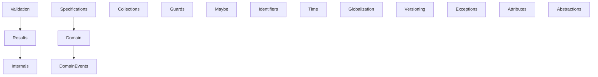

Every arrow represents an intentional architectural dependency.

No reverse dependency should exist.

---

# Dependency Direction

Dependencies should always point toward more fundamental concepts.

Conceptually:

```text
Higher-Level Concepts
        │
        ▼
Lower-Level Concepts
```

Never the opposite.

This ensures that more abstract concepts remain stable while higher-level modules evolve independently.

---

# Dependency Levels

The architecture can be viewed as four dependency levels.

```text
Level 4

Applications

────────────────────────

Level 3

Validation
Specifications

────────────────────────

Level 2

Domain
Results

────────────────────────

Level 1

Internals
Collections
Attributes
Abstractions
Exceptions
Guards
Time
Versioning
Globalization
Identifiers
Maybe
```

Lower levels must never depend upon higher levels.

---

# Allowed Dependencies

The following dependencies are explicitly allowed.

| Source         | Target       |
|----------------|--------------|
| Validation     | Results      |
| Specifications | Domain       |
| Domain         | DomainEvents |
| Results        | Internals    |

All remaining modules are intentionally independent.

---

# Forbidden Dependencies

The following dependency categories are explicitly prohibited.

## Validation → Domain

Validation must verify correctness.

Business rules belong to the Domain.

---

## Domain → Validation

The Domain should never perform validation.

Entities assume that validated data has already entered the model.

---

## Domain → Results

Business entities should not depend upon functional result modeling.

Applications may use Results.

The Domain should remain independent.

---

## Results → Validation

Results form a lower-level abstraction.

Reverse dependencies would introduce architectural inversion.

---

## Internals → Public Modules

Internals should never depend upon public architectural modules.

Implementation infrastructure should remain reusable.

---

## Cross Dependencies

The following pattern is forbidden.

```text
A → B

B → A
```

Cyclic dependencies are never acceptable.

---

# Architectural Independence

Several modules intentionally have no dependencies whatsoever.

These include:

- Time
- Maybe
- Versioning
- Globalization
- Guards
- Identifiers
- Collections
- Exceptions
- Attributes
- Abstractions

These modules are entirely self-contained.

This greatly simplifies maintenance.

---

# Dependency Matrix

| Module         | Allowed Dependencies  |
|----------------|-----------------------|
| Abstractions   | None                  |
| Attributes     | None                  |
| Collections    | None                  |
| Domain         | DomainEvents          |
| DomainEvents   | None                  |
| Exceptions     | None                  |
| Globalization  | None                  |
| Guards         | None                  |
| Identifiers    | None                  |
| Internals      | None                  |
| Maybe          | None                  |
| Results        | Internals             |
| Specifications | Domain                |
| Time           | None                  |
| Validation     | Results               |
| Versioning     | None                  |

This table represents the authoritative dependency model of the framework.

---

# Why So Few Dependencies?

One of the design objectives of the Shared Kernel has been to minimize architectural coupling.

Small independent modules provide several advantages.

- Easier understanding.
- Better documentation.
- Independent testing.
- Reduced regression risk.
- Easier auditing.
- Greater long-term stability.

Dependencies therefore remain exceptional rather than routine.

---

# Dependency Review Checklist

Before introducing any new dependency, the following questions should be answered.

## Responsibility

Does the dependency reflect a genuine architectural relationship?

---

## Direction

Is the dependency pointing toward a lower architectural level?

---

## Necessity

Can the dependency be removed through better design?

---

## Stability

Will the dependency remain valid over many years?

---

## Simplicity

Does the dependency simplify the architecture?

If any answer is negative, the dependency should be reconsidered.

---

# Detecting Architectural Smells

The following situations should immediately trigger an architectural review.

## Cyclic Dependencies

```
A

↓

B

↓

A
```

Always prohibited.

---

## Bidirectional Relationships

```
A ↔ B
```

Usually indicates poor separation of concerns.

---

## Utility Module Syndrome

Modules depending upon almost everything.

Usually indicates that the module has become a miscellaneous utility's collection.

---

## God Module

A module responsible for many unrelated concepts.

High coupling usually follows shortly afterward.

---

## Hidden Infrastructure

Business abstractions unexpectedly depending upon infrastructure technologies.

Always prohibited.

---

# Dependency Evolution

Dependencies should become **more stable** over time.

The expected evolution is:

```text
Initial Design

↓

Architectural Audit

↓

Dependency Simplification

↓

Freeze

↓

Maintenance
```

Dependencies should never increase simply because doing so is convenient.

---

# Architectural Constraints

The following constraints are considered mandatory.

- No cyclic dependencies.
- No bidirectional dependencies.
- No infrastructure dependencies.
- No dependency inversions.
- No hidden runtime coupling.
- Minimal public API.
- One responsibility per module.

Violating any of these constraints should be considered an architectural defect.

---

# Architectural Decision Record

## ADR-007 — Directed Acyclic Module Graph

### Decision

All architectural modules must form a Directed Acyclic Graph.

### Motivation

Acyclic architectures are significantly easier to:

- understand;
- document;
- maintain;
- refactor;
- test.

They also reduce architectural erosion over time.

### Consequences

Advantages:

- Independent evolution.
- Stable module boundaries.
- Better architectural audits.
- Lower maintenance cost.

Trade-offs:

- Requires stricter design discipline.
- Sometimes introduces additional abstractions.

The long-term benefits overwhelmingly justify these trade-offs.

---

# Summary

The dependency model described in this chapter represents one of the most important architectural assets of KUKULCAN.SharedKernel.

By maintaining a small, acyclic and carefully controlled dependency graph, the framework remains understandable, testable and maintainable even as it evolves.

Every future architectural decision should preserve this model unless an explicit Architectural Decision Record states otherwise.

# 9. Layering Rules

Although **KUKULCAN.SharedKernel** is distributed as a single assembly, it has been designed as a layered architecture.

These layers are conceptual rather than physical.

Their purpose is to organize responsibilities, control dependencies and preserve architectural consistency.

Every class contained within the Shared Kernel belongs to one—and only one—architectural layer.

---

# Layer Overview

The architecture is organized into four conceptual layers.

```text
┌──────────────────────────────────────────────┐
│          Public Architectural APIs           │
├──────────────────────────────────────────────┤
│         Domain Building Blocks               │
├──────────────────────────────────────────────┤
│      Cross-Cutting Architectural Services    │
├──────────────────────────────────────────────┤
│      Internal Infrastructure Components      │
└──────────────────────────────────────────────┘
```

Each layer has different responsibilities and different dependency rules.

---

# Layer 1 — Internal Infrastructure

The lowest architectural layer contains implementation support shared by the rest of the framework.

Examples include:

- Internals
- Collections
- Attributes
- Abstractions
- Exceptions

These modules should contain no business concepts.

Their purpose is to support higher layers while remaining reusable.

---

## Responsibilities

- Internal implementation helpers.
- Equality infrastructure.
- Formatting infrastructure.
- Internal abstractions.
- Common utility components.

---

## Must Not

- Contain business rules.
- Depend upon higher layers.
- Expose unnecessary public APIs.

---

# Layer 2 — Domain Building Blocks

This layer contains the architectural concepts required to model business domains.

Modules include:

- Domain
- DomainEvents
- Specifications
- Identifiers

These modules define the language used by applications.

---

## Responsibilities

- Entity modelling.
- Aggregate modelling.
- Value Objects.
- Domain Events.
- Specifications.
- Strongly Typed Identifiers.

---

## Must Not

- Depend on infrastructure.
- Perform persistence.
- Perform validation.
- Access HTTP.
- Access databases.

---

# Layer 3 — Cross-Cutting Architectural Services

This layer provides services that support every application independently of its business domain.

Modules include:

- Results
- Validation
- Maybe
- Time
- Globalization
- Versioning
- Guards

These modules improve architectural quality without becoming part of the business model itself.

---

## Responsibilities

- Functional error handling.
- Validation.
- Optional values.
- Time abstraction.
- Semantic versioning.
- Culture abstraction.
- Defensive programming.

---

## Must Not

- Introduce infrastructure dependencies.
- Perform application behavior.
- Know about business entities.

---

# Layer 4 — Public Architectural APIs

The uppermost conceptual layer corresponds to the public contracts consumed by applications.

Examples include:

```csharp
Result<T>

Maybe<T>

Entity<TId>

AggregateRoot<TId>

Specification<T>

SemanticVersion

SupportedCulture

IClock
```

These types define the public face of the framework.

They evolve conservatively.

---

# Layer Relationships

The following diagram illustrates the conceptual relationships between layers.

```mermaid
flowchart TD
PublicAPI
PublicAPI --> CrossCutting
CrossCutting --> Domain
Domain --> Infrastructure
Infrastructure
```

Dependencies always flow downward.

Reverse dependencies are prohibited.

---

# Layer Responsibilities Matrix

| Layer          | Primary Responsibility  |
|----------------|-------------------------|
| Public API     | Framework contracts     |
| Domain         | Business modelling      |
| Cross-Cutting  | Architectural services  |
| Infrastructure | Internal implementation |

Each layer owns exactly one architectural concern.

---

# Layer Independence

Layers communicate exclusively through public contracts.

Implementation details should never leak across architectural boundaries.

For example:

```
Validation
        ↓
ValidationResult
        ↓
Application
```

The Validation module never exposes its internal implementation.

---

# Layer Isolation

Each layer should remain independently understandable.

Developers working on:

- SemanticVersion

should not need to understand:

- ValidationException

Likewise:

- FakeClock

should not depend upon:

- AggregateRoot

This separation significantly improves maintainability.

---

# Public API Boundary

Only carefully reviewed types should cross the public boundary.

```text
Internal

↓

Architectural Review

↓

Public API

↓

Frozen Contract
```

Every public type becomes part of the framework contract.

---

# Internal Boundary

Internal implementation components should remain replaceable.

Examples include:

- StructuralComparer
- DictionaryComparer
- EnumerableComparer
- ObjectFormatter

Applications should never depend directly upon these types.

---

# Layer Evolution

Each layer evolves differently.

| Layer          | Evolution Policy   |
|----------------|--------------------|
| Public API     | Very Conservative  |
| Domain         | Conservative       |
| Cross-Cutting  | Moderate           |
| Infrastructure | Flexible           |

This policy minimizes breaking changes while allowing implementation improvements.

---

# Architectural Smells

The following situations indicate that layer boundaries are deteriorating.

## Infrastructure Leakage

Business abstractions depending upon implementation details.

---

## Layer Inversion

Lower layers depending upon higher layers.

---

## Responsibility Leakage

Classes performing responsibilities that belong to another layer.

---

## Public Surface Growth

Large numbers of new public types without architectural justification.

---

# Layer Checklist

Before introducing a new class, answer the following questions.

- Which architectural layer owns this responsibility?
- Does this class introduce a new dependency?
- Can it remain internal?
- Does it violate any layering rule?
- Does another module already solve this problem?

If any answer is unclear, the design should be reconsidered.

---

# Architectural Decision Record

## ADR-008 — Conceptual Layering

### Decision

The Shared Kernel adopts conceptual layering despite being distributed as a single assembly.

### Motivation

Physical separation is not required to achieve architectural separation.

Conceptual layers provide:

- clearer responsibilities;
- easier maintenance;
- better documentation;
- lower coupling.

### Consequences

Advantages:

- Clear architectural organization.
- Easier onboarding.
- Better auditing.
- Stable public contracts.

Trade-offs:

- Requires architectural discipline.
- Layers are enforced by convention rather than assemblies.

The benefits significantly outweigh these limitations.

---

# Summary

The conceptual layering model provides an additional level of organization above individual modules.

By separating public contracts, domain abstractions, cross-cutting services and implementation infrastructure, the Shared Kernel remains understandable, maintainable and scalable while preserving its architectural integrity.

# 10. Cross-Cutting Concepts

The architectural modules described in the previous chapters are independent of one another.

However, several concepts appear consistently throughout the entire framework.

These concepts are not owned by a single module.

Instead, they represent architectural ideas that influence every subsystem of **KUKULCAN.SharedKernel**.

This chapter describes those concepts.

---

# Cross-Cutting Philosophy

Cross-cutting concepts provide architectural consistency.

Rather than introducing isolated implementation techniques, they define common behaviors that every module follows.

These concepts include:

- Strong Typing
- Immutability
- Explicit Modeling
- Functional Error Handling
- Equality
- Deterministic Behavior
- XML Documentation
- Module Freeze Policy

Together they define the architectural identity of the framework.

---

# Strong Typing

One of the most important principles of the Shared Kernel is that **types communicate intent**.

Primitive values rarely describe business meaning.

For example:

Instead of

```csharp
Guid
```

the framework encourages

```csharp
CustomerId
```

Instead of

```csharp
string
```

it encourages

```csharp
Email
```

Instead of

```csharp
string
```

for versions:

```csharp
SemanticVersion
```

The compiler becomes capable of preventing entire categories of errors.

---

## Benefits

- Compile-time safety.
- Explicit APIs.
- Better IntelliSense.
- Fewer runtime errors.
- Easier refactoring.

---

# Immutability

Immutable objects are easier to understand and considerably safer to use.

Whenever possible, architectural models are immutable.

Examples include:

- SemanticVersion
- SupportedCulture
- Value Objects
- Strongly Typed Identifiers
- Error
- ValidationFailure

Immutable objects:

- never change state;
- are thread-safe;
- simplify reasoning;
- simplify testing.

---

# Explicit Modeling

The Shared Kernel avoids hiding concepts inside primitive values.

Business concepts should appear explicitly within the domain model.

Examples include:

| Primitive   | Explicit Model   |
|-------------|------------------|
| Guid        | CustomerId       |
| string      | Email            |
| string      | SemanticVersion  |
| string      | SupportedCulture |

This approach significantly improves readability.

---

# Functional Error Handling

Expected failures are modeled explicitly.

```mermaid
flowchart LR
Operation --> Result
Result --> Success
Result --> Failure
```

Exceptions are reserved for exceptional situations.

Business failures should always use:

```csharp
Result
```

This principle applies consistently throughout the framework.

---

# Optional Values

The absence of information is considered different from failure.

Consequently:

Failure

↓

```csharp
Result<T>
```

Absence

↓

```csharp
Maybe<T>
```

Null values should rarely appear within the public API.

---

# Equality

The Shared Kernel distinguishes between two kinds of equality.

## Identity Equality

Entities compare identity.

```text
Customer

CustomerId
```

Two entities having the same identity represent the same conceptual object.

---

## Structural Equality

Value Objects compare structure.

```text
Money

Amount
Currency
```

Two Value Objects containing the same values are considered equal.

This distinction appears consistently throughout the framework.

---

# Deterministic Behavior

Architectural components should behave deterministically.

External dependencies should therefore be abstracted.

Examples include:

Time

↓

```csharp
IClock
```

instead of

```csharp
DateTime.UtcNow
```

This greatly simplifies automated testing.

---

# Separation of Concerns

Responsibilities remain isolated.

Examples include:

Validation

↓

Validation

Business Rules

↓

Domain

Expected Failures

↓

Results

Optional Values

↓

Maybe

No module attempts to solve another module's responsibility.

---

# Framework Independence

Business abstractions should remain independent of infrastructure.

The Shared Kernel intentionally avoids direct dependencies on:

- ASP.NET Core
- Entity Framework
- JSON serializers
- Databases
- Logging frameworks

This ensures long-term architectural stability.

---

# XML Documentation

Documentation is considered part of the implementation.

Every public type should include XML documentation.

Examples include:

- Classes
- Records
- Interfaces
- Enumerations
- Public methods
- Public properties

Documentation should evolve together with the implementation.

---

# Consistent Naming

Naming conventions are intentionally consistent across every module.

Examples include:

Interfaces

```text
IClock
```

Strongly Typed Identifiers

```text
CustomerId
```

Value Objects

```text
SemanticVersion
```

Collections

```text
DomainEventCollection
```

Consistency significantly reduces cognitive load.

---

# Conservative Public APIs

Every public API becomes part of the framework contract.

Consequently, public APIs evolve much more slowly than internal implementation.

```text
Internal

↓

Architectural Audit

↓

Public

↓

Frozen
```

This policy minimizes breaking changes.

---

# Module Freeze Policy

Every architectural module follows the same lifecycle.

```mermaid
flowchart LR
    Design --> Implementation
    Implementation --> Audit
    Audit --> Refactoring
    Refactoring --> Freeze
    Freeze --> Maintenance
```

After freezing, modules evolve conservatively.

Large structural changes become exceptional.

---

# Backward Compatibility

The framework values API stability.

Whenever possible:

- existing behavior is preserved;
- existing contracts remain valid;
- breaking changes are avoided.

If breaking changes become unavoidable, they should occur only during major version increments.

---

# Architectural Consistency

Every subsystem should answer the same architectural questions in the same way.

Expected failure?

→ Result

Optional value?

→ Maybe

Business identity?

→ Strongly Typed Identifier

Equality?

→ Structural or Identity

Time?

→ IClock

Version?

→ SemanticVersion

Culture?

→ SupportedCulture

This consistency is one of the defining characteristics of the Shared Kernel.

---

# Architectural Invariants

The following invariants apply to the entire framework.

| Identifier   | Invariant                                           |
|--------------|-----------------------------------------------------|
| INV-001      | Modules form a Directed Acyclic Graph.              |
| INV-002      | Domain never depends on infrastructure.             |
| INV-003      | Validation never performs business logic.           |
| INV-004      | Results model expected failures.                    |
| INV-005      | Maybe models optional values.                       |
| INV-006      | Value Objects are structurally equal.               |
| INV-007      | Entities compare identity.                          |
| INV-008      | Public APIs are XML documented.                     |
| INV-009      | Frozen modules evolve conservatively.               |
| INV-010      | Every module owns one architectural responsibility. |

These invariants should remain true throughout the lifetime of the framework.

---

# Architectural Decision Record

## ADR-009 — Cross-Cutting Architectural Concepts

### Decision

Architectural concepts that influence multiple modules should be defined once and applied consistently throughout the framework.

### Motivation

Duplicating architectural decisions across modules inevitably produces inconsistencies.

Documenting shared concepts explicitly improves:

- consistency;
- maintainability;
- onboarding;
- documentation quality.

### Consequences

Advantages:

- Unified architectural language.
- Reduced duplication.
- Better long-term evolution.
- More predictable APIs.

Trade-offs:

- Requires stronger architectural discipline.
- Future modules must conform to these concepts rather than invent new patterns.

---

# Summary

Although KUKULCAN.SharedKernel is organized into independent modules, those modules are unified by a common architectural philosophy.

Strong typing, explicit modeling, immutability, deterministic behavior, functional error handling and architectural consistency collectively define the identity of the framework.

Every future module should preserve these concepts in order to maintain the coherence of the Shared Kernel over time.

# 11. Core Building Blocks

The architecture of **KUKULCAN.SharedKernel** is built upon a relatively small number of fundamental concepts.

These concepts, referred to throughout this document as **Core Building Blocks**, provide the vocabulary used to model domains, express business rules, represent failures and build applications in a consistent manner.

Unlike infrastructure components or implementation details, Core Building Blocks represent stable architectural abstractions that remain valid regardless of the application domain or the underlying technology stack.

They form the foundation upon which every module of the Shared Kernel has been designed.

---

# Purpose

Core Building Blocks exist to solve recurring architectural problems using explicit, reusable and well-defined abstractions.

Rather than forcing developers to repeatedly reinvent common concepts such as identifiers, value objects or result types, the Shared Kernel provides a carefully designed set of reusable building blocks.

These abstractions pursue several objectives:

- Promote explicit domain modeling.
- Eliminate primitive obsession.
- Increase compile-time safety.
- Encourage consistency across solutions.
- Reduce architectural duplication.
- Improve readability.
- Simplify maintenance.

Every architectural module introduced throughout this handbook ultimately builds upon these foundations.

---

# Architectural Classification

The Core Building Blocks can be grouped into four major architectural families.

```mermaid
flowchart TD
A["Core Building Blocks"]
A --> B["Domain Building Blocks"]
A --> C["Behaviour Building Blocks"]
A --> D["Cross-Cutting Building Blocks"]
A --> E["Infrastructure Building Blocks"]
```

Each family addresses a different architectural concern while remaining consistent with the principles described in previous chapters.

---

# Building Block Taxonomy

The following table summarizes the primary building blocks available within the Shared Kernel.

| Building Block        | Primary Module  | Purpose                                       |
|-----------------------|-----------------|-----------------------------------------------|
| Entity                | Domain          | Represents an object with identity.           |
| AggregateRoot         | Domain          | Defines transactional consistency boundaries. |
| ValueObject           | Domain          | Represents immutable values without identity. |
| EntityId<T>           | Identifiers     | Strongly typed identifiers.                   |
| Enumeration           | Domain          | Rich enumeration pattern.                     |
| DomainEvent           | DomainEvents    | Represents a business event.                  |
| DomainEventCollection | DomainEvents    | Stores pending domain events.                 |
| Specification<T>      | Specifications  | Encapsulates reusable business predicates.    |
| Result / Result<T>    | Results         | Represents success or failure.                |
| Error                 | Results         | Represents a functional error.                |
| Maybe<T>              | Maybe           | Represents optional values.                   |
| ValidationResult      | Validation      | Represents validation outcomes.               |
| ValidationFailure     | Validation      | Represents a single validation error.         |
| SemanticVersion       | Versioning      | Represents a Semantic Version 2.0 value.      |
| SupportedCulture      | Globalization   | Represents a supported culture.               |
| IClock                | Time            | Abstraction over system time.                 |

These building blocks constitute the architectural vocabulary of the framework.

---

# Design Philosophy

Every Core Building Block follows the same design philosophy.

## Explicitness

Every architectural concept should be represented by its own type.

For example:

Instead of:

```csharp
Guid customerId;
```

the framework encourages:

```csharp
CustomerId customerId;
```

The resulting code communicates intent more clearly while reducing accidental misuse.

---

## Immutability

Whenever possible, building blocks are immutable.

Examples include:

- Value Objects
- SemanticVersion
- SupportedCulture
- ValidationFailure
- Error
- EntityId<T>

Immutable types are inherently thread-safe and easier to reason about.

---

## Strong Typing

Primitive values rarely communicate business meaning.

The Shared Kernel therefore favors strongly typed models.

Examples include:

| Primitive  | Strongly Typed Model         |
|------------|------------------------------|
| Guid       | CustomerId                   |
| string     | SemanticVersion              |
| string     | SupportedCulture             |
| string     | Email (application-specific) |

Strong typing allows the compiler to detect errors that would otherwise remain hidden until runtime.

---

## Separation of Responsibilities

Each building block solves exactly one architectural concern.

For example:

| Building Block   | Responsibility      |
|------------------|---------------------|
| Entity           | Identity            |
| ValueObject      | Structural equality |
| Result           | Expected failures   |
| Maybe            | Optional values     |
| Specification    | Business predicates |
| Validation       | Input correctness   |

No building block attempts to solve multiple unrelated concerns.

---

# Relationships Between Building Blocks

Although each building block has a clearly defined responsibility, they collaborate to build complete domain models.

The following conceptual diagram illustrates these relationships.

```mermaid
flowchart TD
Entity --> EntityId
AggregateRoot --> Entity
AggregateRoot --> DomainEvent
Specification --> Entity
Validation --> Result
Result --> Error
Maybe
SemanticVersion
SupportedCulture
IClock
```

The relationships shown above represent architectural collaboration rather than implementation dependencies.

As described in Chapter 8, dependency direction remains carefully controlled to avoid cyclic references.

---

# Building Blocks versus Modules

A building block should not be confused with an architectural module.

A module represents a collection of related concepts.

A building block represents one specific architectural abstraction.

For example:

| Module        | Building Blocks                                 |
|---------------|-------------------------------------------------|
| Domain        | Entity, AggregateRoot, ValueObject, Enumeration |
| Results       | Result, Result<T>, Error                        |
| Validation    | ValidationResult, ValidationFailure             |
| Versioning    | SemanticVersion                                 |
| Globalization | SupportedCulture                                |
| Time          | IClock                                          |

Understanding this distinction helps maintain clear architectural boundaries throughout the framework.

---

# Architectural Characteristics

Every Core Building Block should satisfy the following characteristics.

| Characteristic           | Required  |
|--------------------------|:---------:|
| Single Responsibility    |    ✅     |
| Explicit Purpose         |    ✅     |
| Immutable where possible |    ✅     |
| XML Documented           |    ✅     |
| Independently Testable   |    ✅     |
| Framework Independent    |    ✅     |
| Public API Reviewed      |    ✅     |

These characteristics ensure that each abstraction remains predictable, reusable and stable over time.

---

# Summary

Core Building Blocks provide the architectural language used throughout **KUKULCAN.SharedKernel**.

Rather than exposing isolated utilities, the framework offers a coherent collection of carefully designed abstractions that model identity, value, behavior, failure, validation, localization and versioning in a consistent manner.

The following sections examine each family of building blocks in greater detail, beginning with the **Domain Building Blocks**, which form the conceptual heart of the Shared Kernel.

## 11.1 Introduction to Building Blocks

Modern software architectures are built upon recurring concepts.

Regardless of the business domain, applications repeatedly require mechanisms to represent identity, model values, express business rules, communicate failures, validate data and encapsulate behavior.

Rather than solving these problems independently in every project, **KUKULCAN.SharedKernel** provides a carefully designed collection of reusable architectural abstractions known as **Core Building Blocks**.

These building blocks constitute the architectural vocabulary of the framework.

They are intentionally generic, technology-independent and domain-agnostic.

Their purpose is not to implement business logic, but to provide the fundamental concepts upon which business models can be constructed.

---

### What is a Building Block?

A Building Block is a reusable architectural abstraction that represents a fundamental software concept.

Unlike helper classes or utility libraries, Building Blocks model ideas that appear consistently across every application regardless of industry or business domain.

Examples include:

- Identity
- Value
- Failure
- Validation
- Optionality
- Time
- Localization
- Versioning

Each of these concepts is represented explicitly within the Shared Kernel by a dedicated architectural abstraction.

---

### Why Building Blocks?

Without common architectural abstractions, software projects tend to reinvent the same concepts repeatedly.

Typical examples include:

- Every project creates its own Result class.
- Every project implements a different Entity base class.
- Every project invents its own Identifier pattern.
- Every project handles validation differently.
- Every project represents errors differently.

This duplication increases maintenance costs, reduces consistency and makes architectural evolution considerably more difficult.

The Shared Kernel eliminates this duplication by providing a unified architectural model.

---

### Architectural Vocabulary

One of the principal objectives of the Shared Kernel is to establish a common language across every solution.

Instead of discussing implementation details, developers communicate using architectural concepts.

For example:

| Architectural Concept   | Shared Kernel Building Block  |
|-------------------------|-------------------------------|
| Business Identity       | `EntityId<T>`                 |
| Business Entity         | `Entity<TId>`                 |
| Aggregate Boundary      | `AggregateRoot<TId>`          |
| Immutable Value         | `ValueObject`                 |
| Functional Failure      | `Result`                      |
| Error Description       | `Error`                       |
| Optional Value          | `Maybe<T>`                    |
| Business Predicate      | `Specification<T>`            |
| Validation Outcome      | `ValidationResult`            |
| Domain Event            | `DomainEvent`                 |
| Supported Culture       | `SupportedCulture`            |
| Semantic Version        | `SemanticVersion`             |

Using a shared vocabulary improves communication between developers, architects and reviewers while significantly reducing ambiguity.

---

### Technology Independence

Building Blocks are intentionally independent of any particular technology.

They should not depend upon:

- ASP.NET Core
- Entity Framework Core
- JSON serializers
- Databases
- Messaging frameworks
- Dependency Injection containers

This architectural independence allows the Shared Kernel to remain reusable across multiple application types, including:

- REST APIs
- Console applications
- Background services
- Desktop applications
- Cloud-native services
- Microservices

Technology choices belong to higher architectural layers.

---

### Domain Independence

Core Building Blocks do not contain business logic.

Instead, they provide the language required to express business logic.

For example:

The Shared Kernel provides:

```text
Entity<TId>
```

It does **not** provide:

```text
Customer
Invoice
Order
Product
```

Those concepts belong to the application domain rather than the framework itself.

This separation preserves the generic nature of the Shared Kernel.

---

### Consistency by Design

Every Building Block follows the same architectural principles described in previous chapters.

Specifically:

- Single Responsibility
- Strong Typing
- Immutability where appropriate
- Explicit Modeling
- Framework Independence
- Deterministic Behavior
- XML Documentation
- Stable Public APIs

Applying these principles consistently across every abstraction produces a framework that behaves predictably and remains easy to understand.

---

### Evolution Strategy

Building Blocks are intended to remain stable over long periods of time.

New application requirements should normally be addressed by composing existing abstractions rather than modifying them.

Only when a genuinely new architectural concept emerges should an additional Building Block be introduced.

This conservative evolution strategy protects existing applications while allowing the framework to grow in a controlled manner.

---

### Relationship with the Shared Kernel

The Shared Kernel can be viewed as a collection of cooperating Building Blocks.

```mermaid
flowchart TD
SK["KUKULCAN.SharedKernel"]
SK --> Domain["Domain"]
SK --> Results["Results"]
SK --> Validation["Validation"]
SK --> Specifications["Specifications"]
SK --> Globalization["Globalization"]
SK --> Versioning["Versioning"]
SK --> Time["Time"]
Domain --> Entity["Entity"]
Domain --> Aggregate["AggregateRoot"]
Domain --> Value["ValueObject"]
Results --> Result["Result"]
Results --> Error["Error"]
Validation --> ValidationResult["ValidationResult"]
Versioning --> SemanticVersion["SemanticVersion"]
Globalization --> SupportedCulture["SupportedCulture"]
Time --> IClock["IClock"]
```

Each module contributes one or more Building Blocks to the overall architectural model.

Together they form the conceptual foundation upon which every solution using **KUKULCAN.SharedKernel** is built.

---

### Summary

Core Building Blocks represent the architectural language of **KUKULCAN.SharedKernel**.

Rather than providing isolated utility classes, the framework offers a coherent set of reusable abstractions that model the concepts common to virtually every modern software system.

The following sections examine each Building Block family in detail, beginning with the Domain Building Blocks that define identity, value and business behavior.

## 11.2 Taxonomy of Building Blocks

Although every Building Block contributes to the overall architecture of **KUKULCAN.SharedKernel**, not all of them fulfil the same role.

Each Building Block belongs to a well-defined architectural category according to the responsibility it provides.

This classification improves:

- architectural consistency;
- discoverability;
- module organisation;
- long-term maintainability.

Rather than viewing the Shared Kernel as a collection of unrelated classes, it should be understood as a hierarchy of cooperating architectural abstractions.

---

### Architectural Taxonomy

The Shared Kernel organizes its Building Blocks into four major families.

```mermaid
flowchart TD
BB["Core Building Blocks"]
BB --> D["Domain Building Blocks"]
BB --> B["Behaviour Building Blocks"]
BB --> C["Cross-Cutting Building Blocks"]
BB --> I["Infrastructure Building Blocks"]
```

Each family solves a different architectural concern.

---

## Domain Building Blocks

Domain Building Blocks represent the concepts used to model business domains.

These abstractions originate directly from Domain-Driven Design (DDD) and constitute the conceptual heart of the framework.

Typical examples include:

| Building Block        | Purpose                                       |
|-----------------------|-----------------------------------------------|
| Entity                | Represents business identity.                 |
| AggregateRoot         | Defines transactional consistency boundaries. |
| ValueObject           | Represents immutable conceptual values.       |
| EntityId<T>           | Strongly typed identifiers.                   |
| Enumeration           | Rich domain enumerations.                     |
| DomainEvent           | Represents business events.                   |
| DomainEventCollection | Stores pending domain events.                 |

These abstractions should be used to express business concepts rather than technical implementation details.

---

## Behavior Building Blocks

Behavior Building Blocks encapsulate reusable application behavior.

Rather than modeling data, they model decisions.

Examples include:

| Building Block      | Purpose                          |
|---------------------|----------------------------------|
| Specification<T>    | Business predicates.             |
| ValidationResult    | Validation outcomes.             |
| ValidationFailure   | Individual validation errors.    |
| ValidationException | Exceptional validation failures. |

These abstractions allow behavior to be composed independently of business entities.

---

## Cross-Cutting Building Blocks

Cross-Cutting Building Blocks provide architectural services that appear throughout every application.

They are independent of any particular business domain.

Examples include:

| Building Block   | Purpose                           |
|------------------|-----------------------------------|
| Result           | Functional success/failure model. |
| Result<T>        | Typed functional results.         |
| Error            | Functional error representation.  |
| Maybe<T>         | Optional values.                  |
| SemanticVersion  | Semantic Versioning model.        |
| SupportedCulture | Supported culture abstraction.    |
| IClock           | Time abstraction.                 |

Unlike Domain Building Blocks, these abstractions solve recurring technical and architectural concerns rather than business modeling problems.

---

## Infrastructure Building Blocks

Infrastructure Building Blocks support the internal implementation of the Shared Kernel itself.

Most of these types remain internal.

Examples include:

| Building Block     | Purpose                             |
|--------------------|-------------------------------------|
| StructuralComparer | Structural equality infrastructure. |
| DictionaryComparer | Dictionary equality support.        |
| EnumerableComparer | Collection equality support.        |
| ObjectFormatter    | Internal formatting infrastructure. |

Applications should never depend directly upon these components.

Their implementation may evolve without affecting the public API.

---

## Building Block Hierarchy

The following diagram illustrates how the different families cooperate.

```mermaid
flowchart TD
Infrastructure["Infrastructure Building Blocks"]
Domain["Domain Building Blocks"]
Behaviour["Behaviour Building Blocks"]
Cross["Cross-Cutting Building Blocks"]

Infrastructure --> Domain
Infrastructure --> Behaviour
Infrastructure --> Cross
Domain --> Behaviour
Behaviour --> Cross
```

The diagram represents conceptual collaboration rather than physical dependencies.

Actual compile-time dependencies remain governed by the architectural rules defined in Chapter 8.

---

## Responsibility Matrix

Every Building Block family owns a specific architectural responsibility.

| Family         | Responsibility                  | Example            |
|----------------|---------------------------------|--------------------|
| Domain         | Business modelling              | Entity             |
| Behaviour      | Business behaviour              | Specification<T>   |
| Cross-Cutting  | Shared architectural services   | Result<T>          |
| Infrastructure | Internal implementation support | StructuralComparer |

No family should assume responsibilities belonging to another family.

---

## Why this Classification Matters

Maintaining a clear taxonomy offers several advantages.

### Better Discoverability

Developers immediately know where new concepts belong.

---

### Lower Coupling

Responsibilities remain isolated.

Modules evolve independently.

---

### Architectural Consistency

Every new abstraction follows an established architectural pattern.

---

### Easier Maintenance

Future contributors can understand the framework much more quickly.

---

## Classification Rules

Every new Building Block should satisfy the following questions before being introduced.

1. Does it model business concepts?
    - **Domain Building Block**

2. Does it encapsulate reusable business behavior?
    - **Behaviour Building Block**

3. Does it solve a shared architectural concern?
    - **Cross-Cutting Building Block**

4. Does it support framework implementation?
    - **Infrastructure Building Block**

If none of these answers applies, the abstraction probably does not belong inside the Shared Kernel.

---

## Architectural Invariant

A Building Block must belong to exactly one architectural family.

Multiple responsibilities indicate poor architectural cohesion.

This invariant considerably simplifies both the framework and its documentation.

---

## Summary

The taxonomy presented in this section provides a conceptual map of the entire Shared Kernel.

Rather than treating every abstraction equally, it distinguishes between domain modeling, behavioral modeling, shared architectural services and implementation infrastructure.

Understanding this classification greatly simplifies navigation throughout the remainder of this handbook, where each family of Building Blocks will be examined in detail.

## 11.3 Domain Building Blocks

Domain Building Blocks form the conceptual foundation of every domain model built upon **KUKULCAN.SharedKernel**.

They represent the architectural abstractions responsible for modeling business concepts, preserving consistency and expressing the ubiquitous language defined by the domain.

Unlike infrastructure or application services, Domain Building Blocks model **what the business is**, not **how the application works**.

They are therefore considered the heart of the Shared Kernel.

---

### Overview

The Domain module provides a cohesive set of abstractions that model identity, value, consistency boundaries and business events.

```mermaid
flowchart TD
EntityId["EntityId&lt;T&gt;"]
Entity["Entity&lt;TId&gt;"]
Aggregate["AggregateRoot&lt;TId&gt;"]
Value["ValueObject"]
Enumeration["Enumeration"]
DomainEvent["DomainEvent"]
Events["DomainEventCollection"]

EntityId --> Entity
Entity --> Aggregate
Aggregate --> DomainEvent
Aggregate --> Events
Value
Enumeration
```

Each abstraction has a clearly defined architectural responsibility.

---

## Design Philosophy

The Domain module follows the principles established by Domain-Driven Design.

Its primary objectives are:

- Explicit modelling.
- Rich domain models.
- Strong typing.
- Behaviour-oriented design.
- High cohesion.
- Low coupling.

Rather than representing business concepts using primitive values, the Shared Kernel provides specialized abstractions capable of expressing business intent directly.

---

## Entity

Entities represent business objects possessing identity.

Unlike Value Objects, Entities are distinguished by **who they are**, rather than by **what they contain**.

Examples include:

- Customer
- Product
- Order
- Invoice

Two Entity instances with the same identity represent the same conceptual business object, regardless of differences in their current state.

Conceptually:

```text
Identity

+

Behaviour

+

Lifecycle
```

Entities should encapsulate behavior instead of exposing mutable data structures.

---

## Aggregate Root

Aggregate Roots define transactional consistency boundaries.

Every aggregate exposes exactly one public entry point through which modifications may occur.

```mermaid
flowchart LR
    C["Client"] --> AR["AggregateRoot<TId>"]
    AR --> E["Entity<TId>"]
    AR --> VO["ValueObject"]
    AR --> DE["DomainEvent"]
```

External components should never modify child entities directly.

This guarantees that business invariants remain protected.

---

## EntityId<T>

Entity identifiers are represented using Strongly Typed Identifiers rather than primitive values.

Instead of:

```csharp
Guid customerId;
```

the framework encourages:

```csharp
CustomerId customerId;
```

This approach provides:

- compile-time safety;
- explicit APIs;
- improved readability;
- elimination of accidental identifier mixing.

Strongly Typed Identifiers constitute one of the defining characteristics of the Shared Kernel.

---

## Value Objects

Value Objects represent immutable concepts without identity.

Equality depends entirely upon contained values.

Typical examples include:

- Money
- Address
- Coordinates
- DateRange
- Percentage

Conceptually:

```text
Meaning

=

Contained Values
```

Rather than:

```text
Meaning

=

Identity
```

Value Objects should remain immutable throughout their lifetime.

---

## Enumeration

Enumerations model finite business concepts while providing richer behavior than language-level enums.

Examples include:

- CustomerType
- PaymentStatus
- Country
- Currency

Unlike traditional enumerations, rich Enumerations may include:

- behaviour;
- metadata;
- validation;
- ordering;
- localisation support.

They combine the readability of enumerations with the expressiveness of Value Objects.

---

## Domain Events

Domain Events represent facts that have already occurred within the business domain.

Examples include:

- CustomerRegistered
- InvoicePaid
- OrderCancelled

Events describe the past.

Consequently, Domain Events are immutable.

Their purpose is communication rather than behavior.

---

## DomainEventCollection

Aggregate Roots accumulate Domain Events during their lifecycle.

Rather than publishing events immediately, they are collected internally.

```mermaid
flowchart LR
    BO["Business Operation"] --> AR["AggregateRoot<TId>"]
    AR --> DEC["DomainEventCollection"]
    DEC --> DISP["Dispatcher"]
```

This separation allows infrastructure concerns to remain outside the domain model.

---

## Collaboration Model

The Domain Building Blocks cooperate to express business concepts.

```mermaid
flowchart TD
    ID["EntityId<T>"] --> E["Entity<TId>"]
    E --> AR["AggregateRoot<TId>"]
    AR --> DEC["DomainEventCollection"]
    DEC --> DE["DomainEvent"]
    E --> VO["ValueObject"]
    E --> EN["Enumeration"]
```

The diagram above represents conceptual relationships rather than implementation inheritance.

---

## Design Principles

Every Domain Building Block follows the same architectural principles.

| Principle                       | Description                                          |
|---------------------------------|------------------------------------------------------|
| Identity is explicit            | Every Entity owns a strongly typed identifier.       |
| Values are immutable            | Value Objects never change after creation.           |
| Behaviour belongs to the model  | Business logic remains inside domain objects.        |
| Aggregates protect invariants   | Aggregate Roots enforce consistency.                 |
| Events describe completed facts | Domain Events communicate past business occurrences. |

These principles remain invariant across every domain model built using the Shared Kernel.

---

## Dependency Rules

Domain Building Blocks deliberately avoid infrastructure concerns.

They never depend directly upon:

- databases;
- HTTP;
- serialization frameworks;
- dependency injection;
- logging frameworks;
- messaging systems.

This independence allows domain models to remain portable and testable.

---

## Architectural Characteristics

The following table summarizes the primary characteristics of each Domain Building Block.

| Building Block  | Mutable  | Identity  | Equality   |
|-----------------|:--------:|:---------:|------------|
| Entity          |    ✔    |    ✔     | Identity   |
| AggregateRoot   |    ✔    |    ✔     | Identity   |
| EntityId<T>     |    ✘    |    ✔     | Structural |
| ValueObject     |    ✘    |    ✘     | Structural |
| Enumeration     |    ✘    |    ✘     | Structural |
| DomainEvent     |    ✘    | Optional  | Structural |

This distinction between identity and structural equality is fundamental to the architecture of the Shared Kernel.

---

## Architectural Decision Record

### ADR-012 — Rich Domain Model

#### Decision

The Shared Kernel adopts a Rich Domain Model centred on explicit architectural abstractions rather than primitive data structures.

#### Motivation

Primitive values are unable to express business intent.

Specialised Building Blocks provide:

- stronger modelling;
- safer APIs;
- greater expressiveness;
- improved maintainability.

#### Consequences

Advantages:

- Explicit domain language.
- Strong typing.
- Better encapsulation.
- Easier evolution.
- Higher architectural consistency.

Trade-offs:

- Additional abstraction layers.
- Slightly larger object model.
- Higher initial learning curve.

The long-term architectural benefits significantly outweigh these costs.

---

## Summary

Domain Building Blocks provide the conceptual language used to model business systems within **KUKULCAN.SharedKernel**.

Together, Entities, Aggregate Roots, Value Objects, Strongly Typed Identifiers, Enumerations and Domain Events establish a rich and expressive modeling environment capable of representing complex business domains while preserving consistency, maintainability and architectural integrity.

The next section explores the **Behavior Building Blocks**, responsible for modeling reusable business behavior independently of domain entities.

## 11.4 Cross-Cutting Building Blocks

While the Domain Building Blocks define business concepts, every software system also requires a set of architectural abstractions that transcend the business domain itself.

These abstractions are referred to throughout this handbook as **Cross-Cutting Building Blocks**.

Unlike Entities or Value Objects, Cross-Cutting Building Blocks are not responsible for modeling the business.

Instead, they provide common architectural services used consistently across every module of the framework.

They form the architectural glue that connects the various subsystems while preserving loose coupling and maintaining a consistent programming model.

---

### Purpose

Cross-Cutting Building Blocks address architectural concerns that appear repeatedly in virtually every application.

Typical examples include:

- Representing success and failure.
- Expressing optional values.
- Modeling supported cultures.
- Representing semantic versions.
- Abstracting time.
- Providing deterministic behavior.

Without these abstractions, every solution would inevitably implement slightly different versions of the same concepts.

The Shared Kernel centralizes these concerns into a unified architectural model.

---

### Architectural Overview

The principal Cross-Cutting Building Blocks are illustrated below.

```mermaid
flowchart TD
    CC["Cross-Cutting Building Blocks"]
    CC --> R["Result<T>"]
    CC --> E["Error"]
    CC --> M["Maybe<T>"]
    CC --> SV["SemanticVersion"]
    CC --> SC["SupportedCulture"]
    CC --> CL["IClock"]
```

Unlike Domain Building Blocks, these abstractions are independent of business modeling and can therefore be reused across every architectural layer.

---

## Functional Results

The Results subsystem provides a functional alternative to exception-based control flow.

Expected outcomes are represented explicitly.

Instead of:

```csharp
throw new ValidationException(...);
```

the framework encourages:

```csharp
Result<Customer>
```

This approach makes failures visible in method signatures while encouraging explicit error handling.

---

### Error

Every failed Result contains an Error.

An Error is not an Exception.

Instead, it represents structured business information describing why an operation could not be completed successfully.

Typical information includes:

- error code;
- message;
- metadata;
- category.

Errors remain immutable throughout their lifetime.

---

### Result<T>

Result<T> communicates one of two possible outcomes.

Success

↓

Contains a valid value.

Failure

↓

Contains an Error.

Conceptually:

```mermaid
flowchart LR
    O["Operation"]
    O --> S["Success"]
    O --> F["Failure"]
    S --> V["Result<T>"]
    F --> ERR["Error"]
```

This programming model encourages explicit decision-making while eliminating large categories of runtime exceptions.

---

## Optional Values

Not every absence of data represents an error.

For this reason the Shared Kernel distinguishes between:

Failure

↓

Result<T>

Absence

↓

Maybe<T>

This distinction significantly improves API clarity.

Examples include:

```csharp
Maybe<Customer>
```

instead of

```csharp
Customer?
```

Optional values therefore become explicit architectural concepts rather than implicit null references.

---

## Semantic Version

Versioning constitutes another recurring architectural concern.

Rather than representing versions as strings, the framework introduces:

```text
SemanticVersion
```

This abstraction implements the Semantic Versioning 2.0 specification while providing:

- structural equality;
- parsing;
- validation;
- comparison;
- ordering.

Applications therefore manipulate versions as domain concepts rather than textual values.

---

## SupportedCulture

Localization appears in virtually every enterprise application.

Instead of using arbitrary strings such as:

```text
"en-US"
```

the framework provides:

```text
SupportedCulture
```

This abstraction guarantees:

- validation;
- normalisation;
- comparison;
- compile-time discoverability.

SupportedCulture therefore becomes part of the architectural model instead of remaining a primitive string.

---

## Time Abstraction

System time should never be obtained directly from:

```csharp
DateTime.UtcNow
```

Instead, the Shared Kernel introduces:

```csharp
IClock
```

Time therefore becomes injectable, deterministic and easily testable.

Example:

```csharp
public sealed class InvoiceService
{
    private readonly IClock _clock;

    public InvoiceService(IClock clock)
    {
        _clock = clock;
    }
}
```

This simple abstraction greatly simplifies automated testing.

---

## Collaboration

Cross-Cutting Building Blocks collaborate with almost every architectural module.

```mermaid
flowchart TD
    Domain["Domain"]
    Validation["Validation"]
    Specifications["Specifications"]
    Versioning["Versioning"]
    Globalization["Globalization"]
    Results["Results"]
    Maybe["Maybe"]
    Time["Time"]

    Domain --> Results
    Domain --> Maybe
    Validation --> Results
    Specifications --> Results
    Versioning --> Results
    Globalization --> Results
    Time --> Results
```

Notice that these abstractions remain independent of the business domain while providing services to multiple modules.

---

## Architectural Characteristics

Cross-Cutting Building Blocks share a common set of characteristics.

| Characteristic           | Required  |
|--------------------------|:---------:|
| Immutable where possible |    ✅     |
| Strongly Typed           |    ✅     |
| Framework Independent    |    ✅     |
| XML Documented           |    ✅     |
| Public API Reviewed      |    ✅     |
| Independently Testable   |    ✅     |

These characteristics ensure that every abstraction behaves consistently regardless of the application consuming it.

---

## Design Rules

Cross-Cutting Building Blocks follow several architectural rules.

- They never contain business logic.
- They remain reusable across domains.
- They expose stable public APIs.
- They minimise external dependencies.
- They favor deterministic behavior.
- They encourage explicit programming models.

These rules guarantee long-term architectural stability.

---

## Architectural Decision Record

### ADR-013 — Cross-Cutting Architectural Services

#### Decision

Architectural services common to multiple modules should be implemented as reusable Cross-Cutting Building Blocks.

#### Motivation

Repeated implementation of functional results, localization, versioning or time abstractions inevitably produces inconsistencies across applications.

Centralizing these concepts promotes architectural uniformity while significantly reducing duplication.

#### Consequences

Advantages:

- Consistent programming model.
- Lower maintenance costs.
- Improved discoverability.
- Higher architectural cohesion.
- Simplified testing.

Trade-offs:

- Slightly larger Shared Kernel.
- Additional abstractions for new developers to learn.

These trade-offs are considered acceptable given the long-term architectural benefits.

---

## Summary

Cross-Cutting Building Blocks provide the shared architectural services upon which every module of **KUKULCAN.SharedKernel** depends.

Rather than modeling business concepts, they model recurring software concepts such as functional failures, optional values, localization, versioning and time.

Together they establish a consistent programming model that remains independent of both the application domain and the underlying technology stack.

## 11.5 Infrastructure Building Blocks

While the Shared Kernel primarily exposes architectural abstractions intended to be consumed by applications, it also contains a number of internal components whose sole responsibility is to support the implementation of those public abstractions.

These components are collectively referred to as **Infrastructure Building Blocks**.

Unlike Domain or Cross-Cutting Building Blocks, Infrastructure Building Blocks are **implementation-oriented**.

They are not intended to model business concepts, nor are they considered part of the public programming model.

Instead, they provide the internal services required for the framework itself to operate consistently.

---

### Purpose

Infrastructure Building Blocks exist to support the implementation of the Shared Kernel without exposing unnecessary complexity to its consumers.

Typical responsibilities include:

- structural comparison;
- collection comparison;
- object formatting;
- internal helper algorithms;
- implementation support.

Applications should rarely, if ever, interact with these components directly.

---

### Architectural Overview

Infrastructure Building Blocks provide services to the framework rather than to business applications.

```mermaid
flowchart TD
    INF["Infrastructure Building Blocks"]

    INF --> SC["StructuralComparer"]
    INF --> DC["DictionaryComparer"]
    INF --> EC["EnumerableComparer"]
    INF --> OF["ObjectFormatter"]
```

These components remain internal implementation details.

---

## StructuralComparer

StructuralComparer provides the comparison engine used by multiple Value Objects.

Rather than forcing every Value Object to implement comparison logic independently, equality is centralized into a reusable infrastructure component.

Responsibilities include:

- recursive comparison;
- nested object comparison;
- collection comparison;
- dictionary comparison;
- deterministic equality.

Consumers should never depend directly upon this class.

---

## DictionaryComparer

DictionaryComparer provides structural equality for dictionary-based objects.

It ensures that:

- keys are compared consistently;
- values are compared recursively;
- ordering does not affect equality.

This behavior allows dictionaries to participate naturally in structural equality operations.

---

## EnumerableComparer

EnumerableComparer provides comparison support for ordered collections.

Typical supported types include:

- arrays;
- lists;
- immutable collections;
- enumerable sequences.

Comparison remains deterministic and element-based.

---

## ObjectFormatter

ObjectFormatter provides a consistent textual representation of Value Objects.

Its responsibilities include:

- formatting nested values;
- formatting collections;
- formatting dictionaries;
- producing deterministic string representations.

Although invisible to consumers, ObjectFormatter contributes significantly to debugging and diagnostics.

---

## Internal Collaboration

Infrastructure Building Blocks cooperate internally to support higher-level abstractions.

```mermaid
flowchart TD
    VO["ValueObject"]
    SC["StructuralComparer"]
    DC["DictionaryComparer"]
    EC["EnumerableComparer"]
    OF["ObjectFormatter"]

    VO --> SC
    SC --> DC
    SC --> EC
    VO --> OF
```

Notice that dependency direction always points towards the infrastructure.

The infrastructure never depends upon business concepts.

---

## Visibility

Infrastructure Building Blocks should normally remain **internal**.

Only in exceptional situations should they become part of the public API.

The following rule applies throughout the Shared Kernel.

| Type               | Visibility  |
|--------------------|-------------|
| Entity             | Public      |
| ValueObject        | Public      |
| Result             | Public      |
| SemanticVersion    | Public      |
| StructuralComparer | Internal    |
| DictionaryComparer | Internal    |
| EnumerableComparer | Internal    |
| ObjectFormatter    | Internal    |

Reducing the public surface area simplifies long-term maintenance.

---

## Design Principles

Infrastructure Building Blocks follow several architectural principles.

### Invisible Infrastructure

Infrastructure should remain invisible to consumers.

Applications should interact only with public architectural abstractions.

---

### Reusability

Internal services should be reused whenever possible.

Duplicated comparison algorithms should be avoided.

---

### Deterministic Behavior

Infrastructure components should always produce identical results given identical inputs.

Determinism greatly simplifies debugging and automated testing.

---

### Isolation

Infrastructure must never contain business rules.

Its purpose is purely technical.

Business behavior belongs exclusively to Domain Building Blocks.

---

## Architectural Characteristics

Infrastructure Building Blocks share the following characteristics.

| Characteristic         | Required  |
|------------------------|:---------:|
| Internal visibility    |    ✅     |
| Deterministic          |    ✅     |
| Independently testable |    ✅     |
| Reusable               |    ✅     |
| Framework-independent  |    ✅     |
| Business-agnostic      |    ✅     |

---

## Evolution Policy

Unlike public Building Blocks, Infrastructure Building Blocks may evolve more freely.

Possible changes include:

- performance improvements;
- algorithmic optimisation;
- internal refactoring;
- implementation replacement.

As long as the public API remains unchanged, these modifications do not constitute breaking changes.

---

## Architectural Decision Record

### ADR-014 — Internal Infrastructure Layer

#### Decision

Reusable implementation services shall remain isolated inside dedicated Infrastructure Building Blocks.

#### Motivation

Comparison engines, object formatting and helper algorithms should not pollute the public API.

Keeping these services internal reduces coupling while allowing implementation improvements without affecting consumers.

#### Consequences

Advantages:

- Smaller public API.
- Easier maintenance.
- Greater implementation flexibility.
- Improved internal reuse.

Trade-offs:

- Additional internal abstractions.
- Slightly more complex framework implementation.

These trade-offs are acceptable because they preserve the long-term stability of the Shared Kernel.

---

## Summary

Infrastructure Building Blocks provide the technical foundation upon which the public abstractions of **KUKULCAN.SharedKernel** are implemented.

Although invisible to application developers, they play a fundamental role in ensuring consistent behavior, deterministic equality, reusable algorithms and a clean separation between architectural contracts and implementation details.

By remaining internal, these components allow the framework to evolve without compromising backward compatibility or expanding its public surface unnecessarily.

## 11.6 Relationships Between Building Blocks

The individual Building Blocks described throughout this chapter should not be considered isolated architectural components.

Their true value emerges from the way they collaborate to form a coherent architectural model.

Each Building Block owns a specific responsibility, yet every one of them participates in a larger ecosystem that collectively defines the programming model of **KUKULCAN.SharedKernel**.

Understanding these relationships is considerably more important than understanding the implementation of any individual abstraction.

---

### Architectural Collaboration

The following diagram presents the conceptual relationships between the principal Building Block families.

```mermaid
flowchart TD
    D["Domain Building Blocks"]
    B["Behaviour Building Blocks"]
    C["Cross-CCutting Building Blocks"]
    I["Infrastructure Building Blocks"]

    D --> B
    D --> C
    B --> C
    I --> D
    I --> B
    I --> C
```

This diagram represents **architectural collaboration**, not implementation inheritance.

Each family remains responsible for its own concerns while relying upon shared architectural services when appropriate.

---

## Domain Relationships

Domain Building Blocks collaborate internally to model business concepts.

```mermaid
flowchart TD
    ID["EntityId<T>"]
    E["Entity<TId>"]
    AR["AggregateRoot<TId>"]
    VO["ValueObject"]
    EN["Enumeration"]
    DEC["DomainEventCollection"]
    DE["DomainEvent"]

    ID --> E
    E --> AR
    E --> VO
    E --> EN
    AR --> DEC
    DEC --> DE
```

The Aggregate Root acts as the consistency boundary for the entire aggregate.

Entities own identity.

Value Objects provide immutable concepts.

Domain Events communicate completed business facts.

---

## Behavior Relationships

Behavior Building Blocks cooperate independently of business entities.

```mermaid
flowchart TD
    SPEC["Specification<T>"]
    VALID["Validation"]
    RESULT["ValidationResult"]
    FAILURE["ValidationFailure"]

    SPEC --> VALID
    VALID --> RESULT
    RESULT --> FAILURE
```

Specifications determine whether business rules are satisfied.

Validation translates those rules into explicit validation results.

---

## Cross-Cutting Relationships

Cross-Cutting Building Blocks collaborate to provide a unified programming model.

```mermaid
flowchart TD
    RESULT["Result<T>"]
    ERROR["Error"]
    MAYBE["Maybe<T>"]
    VERSION["SemanticVersion"]
    CULTURE["SupportedCulture"]
    CLOCK["IClock"]

    RESULT --> ERROR
```

Notice that these abstractions remain largely independent of one another.

Only Result directly depends upon Error.

The remaining abstractions represent orthogonal architectural concepts.

---

## Infrastructure Relationships

Infrastructure components remain invisible to application developers.

```mermaid
flowchart TD
    SC["StructuralComparer"]
    DC["DictionaryComparer"]
    EC["EnumerableComparer"]
    OF["ObjectFormatter"]

    SC --> DC
    SC --> EC
    SC --> OF
```

Infrastructure exists solely to support the implementation of higher-level abstractions.

---

## Dependency Direction

One of the fundamental architectural principles of the Shared Kernel is controlled dependency direction.

Dependencies always flow towards more stable abstractions.

The following rule applies throughout the framework.

| From           | May depend on            |
|----------------|--------------------------|
| Domain         | Cross-Cutting            |
| Behaviour      | Cross-Cutting            |
| Infrastructure | Internal Infrastructure  |
| Public API     | Stable abstractions only |

Reverse dependencies should never occur.

---

## Forbidden Relationships

Certain relationships are intentionally prohibited.

Examples include:

| Forbidden Dependency         | Reason                     |
|------------------------------|----------------------------|
| Domain → ASP.NET Core        | Framework Independence     |
| Domain → Entity Framework    | Persistence Ignorance      |
| ValueObject → Infrastructure | Layer Violation            |
| Result → Validation          | Circular dependency        |
| Error → Domain               | Cross-cutting independence |

Violating these rules compromises the architectural integrity of the Shared Kernel.

---

## Architectural Stability

Not every Building Block evolves at the same rate.

The following diagram illustrates the relative stability of the principal abstractions.

```mermaid
flowchart LR
    A["Infrastructure"]
    B["Cross-Cutting"]
    C["Behaviour"]
    D["Domain"]

    A --> B --> C --> D
```

Moving towards the right, abstractions become increasingly stable and should therefore change less frequently.

This follows the Stable Dependencies Principle.

---

## Composition Instead of Inheritance

Relationships between Building Blocks favour composition over inheritance.

For example:

```csharp
public sealed class Customer : AggregateRoot<CustomerId>
{
    private readonly List<Address> _addresses;

    ...
}
```

The Aggregate Root **contains** Value Objects.

It does not inherit from them.

Composition reduces coupling while improving flexibility.

---

## Architectural Invariants

The following invariants apply throughout the Shared Kernel.

- Every Entity owns exactly one strongly typed identifier.
- Every Aggregate Root is an Entity.
- Every Domain Event belongs to one aggregate.
- Every failed Result contains exactly one Error.
- Every Value Object is immutable.
- Infrastructure never contains business rules.

These invariants should never be violated.

---

## Architectural Decision Record

### ADR-015 — Building Block Collaboration

#### Decision

Building Blocks collaborate through explicit architectural contracts while preserving clear responsibility boundaries.

#### Motivation

Large frameworks become difficult to maintain when architectural concepts overlap or depend upon one another arbitrarily.

Explicit collaboration rules preserve cohesion while minimising coupling.

#### Consequences

Advantages:

- Predictable dependency graph.
- Easier maintenance.
- Better modularity.
- Improved architectural consistency.

Trade-offs:

- Additional architectural discipline.
- Slightly higher design effort.

The resulting architecture is considerably easier to evolve over long periods of time.

---

## Summary

The Shared Kernel should be understood as an ecosystem of cooperating Building Blocks rather than a collection of independent classes.

Each abstraction fulfils a precise architectural responsibility while collaborating with others through well-defined contracts.

This disciplined relationship model ensures that the framework remains cohesive, extensible and maintainable without sacrificing simplicity or architectural clarity.

## 11.7 Design Rules

The long-term quality of **KUKULCAN.SharedKernel** depends not only upon the quality of its individual Building Blocks, but also upon the consistency with which new Building Blocks are designed.

For this reason, every Building Block introduced into the Shared Kernel must comply with a common set of architectural rules.

These rules define the minimum quality standard expected throughout the framework.

---

## Design Objectives

Every Building Block should satisfy the following objectives.

- Explicit purpose.
- Single responsibility.
- High cohesion.
- Low coupling.
- Framework independence.
- Predictable behaviour.
- Long-term maintainability.

No Building Block should compromise these objectives.

---

## Rule 1 — Single Responsibility

Each Building Block shall model exactly one architectural concept.

Examples include:

| Building Block   | Responsibility      |
|------------------|---------------------|
| Entity           | Business identity   |
| ValueObject      | Immutable value     |
| Result           | Functional outcome  |
| Specification    | Business predicate  |
| SemanticVersion  | Semantic Versioning |
| SupportedCulture | Supported culture   |

Multiple unrelated responsibilities indicate poor architectural cohesion.

---

## Rule 2 — Explicit Modeling

Architectural concepts should always be represented explicitly.

Instead of:

```csharp
Guid customerId;
```

prefer:

```csharp
CustomerId customerId;
```

Instead of:

```csharp
string version;
```

prefer:

```csharp
SemanticVersion version;
```

Explicit modeling improves readability while reducing accidental misuse.

---

## Rule 3 — Strong Typing

Primitive values should not represent architectural concepts.

The Shared Kernel strongly favors:

- Strongly Typed Identifiers;
- Value Objects;
- Rich Enumerations;
- Dedicated abstractions.

Compile-time safety should always be preferred over runtime validation.

---

## Rule 4 — Immutability

Whenever possible, Building Blocks should remain immutable.

Typical immutable abstractions include:

- EntityId<T>
- ValueObject
- SemanticVersion
- SupportedCulture
- Error
- ValidationFailure

Immutability provides:

- thread safety;
- deterministic behaviour;
- easier testing;
- simpler reasoning.

---

## Rule 5 — Behavior over Data

Building Blocks should encapsulate behavior rather than exposing mutable data.

Instead of acting as data containers, they should protect their own invariants.

Example:

```text
Correct

Customer.ChangeAddress()

Incorrect

customer.Address = ...
```

Business rules belong inside the model.

---

## Rule 6 — Composition over Inheritance

Building Blocks should favor composition whenever possible.

Example:

```csharp
Order

contains

Money

Address

CustomerId
```

rather than inheriting implementation unnecessarily.

Inheritance should represent genuine "is-a" relationships.

---

## Rule 7 — Framework Independence

Building Blocks must remain independent of infrastructure technologies.

Forbidden dependencies include:

- ASP.NET Core
- Entity Framework Core
- SQL Server
- Redis
- RabbitMQ
- Dependency Injection frameworks

The Domain should remain persistence-ignorant.

---

## Rule 8 — Deterministic Behavior

Given identical inputs, every Building Block should always produce identical outputs.

Examples include:

- equality;
- comparison;
- formatting;
- validation;
- parsing.

Deterministic behavior greatly simplifies debugging and automated testing.

---

## Rule 9 — Stable Public APIs

Public APIs should evolve conservatively.

Before exposing any public member, ask:

- Is it architecturally necessary?
- Can it remain stable?
- Will consumers depend upon it?
- Can it evolve safely?

Smaller public APIs are significantly easier to maintain.

---

## Rule 10 — Documentation First

Every public abstraction should be documented.

Documentation should include:

- XML Documentation;
- architectural documentation;
- usage examples;
- design rationale.

Documentation is considered part of the implementation.

---

## Rule 11 — Testability

Every Building Block should be independently testable.

Characteristics include:

- deterministic behaviour;
- explicit dependencies;
- immutable state;
- no hidden infrastructure.

Testing should not require external services.

---

## Rule 12 — Reusability

Building Blocks should solve recurring architectural problems.

They should never contain application-specific business logic.

If an abstraction cannot be reused across multiple solutions, it probably does not belong inside the Shared Kernel.

---

## Rule 13 — Internal Simplicity

Internal implementation may be sophisticated.

Public APIs should remain simple.

Consumers should never be forced to understand implementation details.

Complexity belongs inside the framework, never outside it.

---

## Rule 14 — Minimal Public Surface

Only concepts that provide genuine architectural value should become public.

Implementation helpers should remain internal.

Examples include:

| Public          | Internal           |
|-----------------|--------------------|
| Entity          | StructuralComparer |
| Result          | DictionaryComparer |
| ValueObject     | EnumerableComparer |
| SemanticVersion | ObjectFormatter    |

Reducing the public surface significantly simplifies long-term evolution.

---

## Rule 15 — Architectural Consistency

Every new Building Block should resemble existing Building Blocks.

Naming conventions.

Documentation.

XML comments.

Exception strategy.

Namespace organisation.

Coding style.

Architectural consistency is considered more valuable than individual optimization.

---

## Building Block Checklist

Before introducing a new Building Block, the following checklist should be completed.

| Question                       | Required  |
|--------------------------------|:---------:|
| Single Responsibility?         |    ✅     |
| Explicit Purpose?              |    ✅     |
| Strongly Typed?                |    ✅     |
| Immutable where possible?      |    ✅     |
| Framework Independent?         |    ✅     |
| XML Documented?                |    ✅     |
| Independently Testable?        |    ✅     |
| Public API Reviewed?           |    ✅     |
| Architectural Audit Completed? |    ✅     |

Only after satisfying every criterion should a Building Block become part of the Shared Kernel.

---

## Architectural Decision Record

### ADR-016 — Uniform Building Block Design

#### Decision

Every Building Block introduced into **KUKULCAN.SharedKernel** shall comply with a common set of architectural design rules.

#### Motivation

Architectural consistency reduces maintenance costs, improves readability and significantly simplifies future evolution.

Without explicit rules, architectural quality inevitably degrades over time.

#### Consequences

Advantages:

- Consistent programming model.
- Predictable APIs.
- Easier reviews.
- Improved maintainability.
- Lower technical debt.

Trade-offs:

- Higher design discipline.
- Slightly longer implementation phase.

These trade-offs are considered acceptable because they maximize the long-term stability of the Shared Kernel.

---

## Summary

The design rules presented in this section establish the architectural quality standard expected throughout **KUKULCAN.SharedKernel**.

Every Building Block, regardless of its responsibility, should comply with these principles to preserve consistency, maintainability and architectural integrity.

Together, these rules ensure that the Shared Kernel remains a coherent architectural foundation capable of evolving safely over many years.

## 11.8 Architectural Decision Record

The design of the Core Building Blocks has been driven by a series of explicit Architectural Decision Records (ADRs).

Rather than allowing the architecture to evolve implicitly, every significant design choice is documented, justified and preserved as part of the framework knowledge base.

Architectural decisions are therefore considered first-class artifacts of the Shared Kernel.

---

## Purpose

Architectural Decision Records provide long-term traceability.

Every important architectural decision should answer four fundamental questions:

- What decision has been made?
- Why was it made?
- Which alternatives were considered?
- What are the long-term consequences?

Documenting these answers greatly simplifies future maintenance and architectural evolution.

---

## Why ADRs?

Architectures naturally evolve over time.

Without explicit documentation, the reasoning behind previous decisions is gradually lost.

This often leads to:

- duplicated discussions;
- inconsistent implementations;
- accidental regressions;
- unnecessary redesign.

Architectural Decision Records preserve the rationale behind the architecture.

---

## ADR Structure

Every ADR within **KUKULCAN.SharedKernel** follows a common structure.

| Section      | Purpose                                      |
|--------------|----------------------------------------------|
| Identifier   | Unique ADR number                            |
| Title        | Short description of the decision            |
| Status       | Proposed, Accepted, Superseded or Deprecated |
| Context      | Problem being solved                         |
| Decision     | Selected solution                            |
| Alternatives | Other considered approaches                  |
| Consequences | Advantages and trade-offs                    |

This uniform structure makes ADRs easier to navigate and review.

---

## ADR Lifecycle

Architectural decisions evolve according to a controlled lifecycle.

```mermaid
flowchart LR
    P["Proposed"]
    R["Review"]
    A["Accepted"]
    I["Implemented"]
    F["Frozen"]

    P --> R
    R --> A
    A --> I
    I --> F
```

Once a decision reaches the **Frozen** state it should remain stable unless a significant architectural reason justifies its revision.

---

## ADRs Introduced in this Chapter

The following Architectural Decision Records have been introduced throughout Chapter 11.

| ADR     | Decision                             |
|---------|--------------------------------------|
| ADR-012 | Rich Domain Model                    |
| ADR-013 | Cross-Cutting Architectural Services |
| ADR-014 | Internal Infrastructure Layer        |
| ADR-015 | Building Block Collaboration         |
| ADR-016 | Uniform Building Block Design        |

Together these ADRs define the architectural philosophy governing every Building Block within the Shared Kernel.

---

## Relationship with the Architecture

Architectural Decision Records do not replace the architecture.

Instead, they explain **why** the architecture has been designed in its current form.

Conceptually:

```mermaid
flowchart TD
    ADR["Architectural Decision Records"]
    ADR --> Principles["Architectural Principles"]
    Principles --> BuildingBlocks["Core Building Blocks"]
    BuildingBlocks --> Implementation["Implementation"]
```

Architecture describes **what exists**.

ADRs explain **why it exists**.

Both are equally important.

---

## Decision Stability

Not every architectural decision evolves at the same pace.

The Shared Kernel follows a conservative evolution policy.

The following categories are considered highly stable:

- Entity model.
- Value Object model.
- Result model.
- Strongly Typed Identifiers.
- Semantic Versioning.
- Localization abstractions.

Changes affecting these concepts require an explicit architectural review.

---

## When should a new ADR be created?

A new ADR should be introduced whenever a decision:

- affects multiple modules;
- changes public APIs;
- modifies dependency direction;
- introduces a new architectural abstraction;
- alters long-term framework behavior.

Minor implementation details should not generate new ADRs.

---

## Architectural Governance

Architectural governance within the Shared Kernel is based upon three principles.

1. Decisions are documented.
2. Decisions are reviewed.
3. Decisions are preserved.

This process guarantees that the architecture evolves intentionally rather than accidentally.

---

## Summary

Architectural Decision Records preserve the reasoning behind the Core Building Blocks and ensure that the architectural knowledge of **KUKULCAN.SharedKernel** remains explicit, reviewable and maintainable.

By documenting every significant architectural decision, the Shared Kernel establishes a durable foundation that allows future contributors to understand not only how the framework has been built, but also why each design choice has been made.

## 11.9 Summary

Throughout this chapter we have explored the architectural foundations upon which **KUKULCAN.SharedKernel** has been designed.

Rather than introducing isolated classes or independent utilities, the framework provides a coherent ecosystem of **Core Building Blocks**, each one representing a fundamental architectural concept with a clearly defined responsibility.

Together, these abstractions establish a common architectural language that enables every solution built upon the Shared Kernel to remain consistent, expressive and maintainable.

---

### Architectural Perspective

The Core Building Blocks should never be considered individual implementation artifacts.

Instead, they constitute a unified architectural model.

Each Building Block contributes a specific responsibility:

| Building Block Family   | Architectural Responsibility                                        |
|-------------------------|---------------------------------------------------------------------|
| Domain                  | Models business concepts and domain behaviour.                      |
| Behaviour               | Encapsulates reusable business rules and validation.                |
| Cross-Cutting           | Provides common architectural services shared across the framework. |
| Infrastructure          | Supports the internal implementation of the Shared Kernel.          |

Understanding these responsibilities is considerably more important than memorizing individual APIs.

---

### Architectural Principles Revisited

Every Building Block introduced in this chapter follows the architectural principles established throughout this handbook.

Specifically:

- Explicit modelling.
- Strong typing.
- Single Responsibility Principle.
- Composition over inheritance.
- Immutability where appropriate.
- Framework independence.
- Stable public APIs.
- Deterministic behaviour.

These principles collectively define the architectural identity of **KUKULCAN.SharedKernel**.

---

### Long-Term Stability

One of the primary objectives of the Shared Kernel is architectural longevity.

For this reason, Core Building Blocks are expected to evolve very conservatively.

Once introduced into the public programming model, a Building Block should remain stable unless a significant architectural justification exists for its modification.

Architectural stability always takes precedence over short-term convenience.

---

### Architectural Governance

The Building Blocks presented throughout this chapter are governed by explicit architectural rules and documented Architectural Decision Records.

This governance model ensures that:

- architectural knowledge remains explicit;
- future evolution remains controlled;
- public APIs remain predictable;
- architectural consistency is preserved over time.

The Shared Kernel therefore evolves intentionally rather than accidentally.

---

### Relationship with the Remaining Documentation

This chapter provides the conceptual overview of the Shared Kernel.

The remaining technical documentation expands each Building Block family in detail.

| Document          | Purpose                       |
|-------------------|-------------------------------|
| domain.md         | Domain modelling abstractions |
| domain-events.md  | Domain Event infrastructure   |
| results.md        | Functional Result model       |
| validation.md     | Validation architecture       |
| specifications.md | Specification Pattern         |
| globalization.md  | Localization abstractions     |
| versioning.md     | Semantic Versioning model     |

Readers seeking implementation details, public APIs or advanced usage examples should continue with the corresponding specialized documents.

---

### Final Remarks

The architectural quality of a Shared Kernel is determined not by the number of abstractions it contains, but by the clarity, consistency and discipline with which those abstractions have been designed.

Every Core Building Block presented throughout this chapter contributes to a single architectural objective:

> **To provide a stable, expressive and technology-independent foundation upon which complex enterprise applications can be designed with confidence.**

This philosophy permeates every module of **KUKULCAN.SharedKernel** and serves as the architectural reference for all future evolution of the framework.

With the Core Building Blocks fully established, the following chapter examines the architectural decisions that shaped the framework, documenting not only *what* has been built, but also *why* those decisions were made.

# 12. Architectural Decisions

Software architecture is ultimately defined by the decisions that shape it.

Every architectural pattern, abstraction, dependency or design principle adopted within **KUKULCAN.SharedKernel** exists because a deliberate decision was made at a particular point in time.

Understanding those decisions is essential to understanding the architecture itself.

For this reason, **KUKULCAN.SharedKernel** treats Architectural Decisions as first-class architectural artifacts rather than informal design notes.

Each significant decision has been explicitly documented, reviewed and incorporated into the architectural knowledge of the framework.

This chapter describes the decision-making process that governs the evolution of the Shared Kernel, the standards used to document architectural decisions and the collection of Architectural Decision Records (ADRs) that justify the current design.

---

## Objectives

The primary objectives of this chapter are:

- Explain the role of Architectural Decision Records (ADRs).
- Describe the architectural governance model adopted by the Shared Kernel.
- Document the major decisions that define the framework.
- Preserve the rationale behind those decisions.
- Establish a repeatable decision-making process for future evolution.

Rather than focusing on implementation details, this chapter concentrates on the architectural reasoning that explains **why** the framework has been designed in its current form.

---

## Why Architectural Decisions Matter

Architectural quality is determined not only by the correctness of the implementation, but also by the quality of the decisions that produced it.

Without explicit documentation, architectural knowledge gradually disappears as projects evolve.

This frequently results in:

- duplicated discussions;
- inconsistent implementations;
- contradictory design choices;
- unnecessary refactoring;
- accidental architectural degradation.

Documenting architectural decisions transforms implicit knowledge into permanent project documentation.

---

## Architecture as a Living System

The architecture of **KUKULCAN.SharedKernel** should never be considered static.

It evolves continuously in response to:

- new business requirements;
- technological evolution;
- architectural discoveries;
- performance improvements;
- maintainability concerns.

However, architectural evolution must always occur in a controlled and traceable manner.

Every significant change should therefore be supported by an explicit Architectural Decision Record.

---

## Relationship with Previous Chapters

The previous chapters described:

- the architectural vision;
- the design principles;
- the module organization;
- the dependency model;
- the Core Building Blocks.

This chapter explains the rationale behind those architectural choices.

Conceptually:

```mermaid
flowchart LR
    V["Architectural Vision"]
    P["Design Principles"]
    D["Architectural Decisions"]
    A["Architecture"]
    I["Implementation"]

    V --> P
    P --> D
    D --> A
    A --> I
```

Architectural Decisions form the bridge between architectural principles and software implementation.

---

## Scope of this Chapter

This chapter covers:

- Architectural Decision Records (ADR);
- decision lifecycle;
- decision classification;
- accepted architectural decisions;
- governance model;
- review process;
- evolution strategy;
- architectural stability.

Together these sections define the decision-making framework that governs every future evolution of **KUKULCAN.SharedKernel**.

---

## Guiding Principle

One of the fundamental principles adopted throughout the Shared Kernel is:

> **Architecture should never depend on undocumented decisions.**

Every significant architectural choice should be:

- explicit;
- reviewable;
- reproducible;
- historically traceable.

This philosophy ensures that the architecture remains understandable not only to its original authors, but also to every future contributor.

---

## Transition

With the context established, the following section introduces the concept of an **Architectural Decision**, explaining what constitutes an architectural decision, when one should be recorded and how Architectural Decision Records are used throughout the Shared Kernel.

## 12.1 Introduction

Every software architecture is ultimately the result of a sequence of decisions.

Some decisions concern technology.

Others define programming models, dependency structures, public APIs or long-term maintenance strategies.

Collectively, these decisions shape the identity of the framework.

For this reason, **KUKULCAN.SharedKernel** treats architectural decisions as permanent architectural assets rather than temporary implementation notes.

The framework is therefore not only defined by its source code, but also by the reasoning that explains why the code has been designed in its current form.

---

### From Architecture to Decisions

Previous chapters described the architecture from several complementary perspectives:

- architectural vision;
- design principles;
- module organisation;
- dependency rules;
- Core Building Blocks.

These chapters answer the question:

> **What has been built?**

This chapter answers a different question:

> **Why has it been built this way?**

Understanding both perspectives is essential for maintaining architectural consistency over time.

---

### Decision-Driven Architecture

The architecture of **KUKULCAN.SharedKernel** follows a decision-driven approach.

Architectural evolution is never accidental.

Every significant modification should originate from an explicit architectural decision that has been:

- analysed;
- reviewed;
- documented;
- accepted.

Only after completing this process should the architecture evolve.

This approach minimizes arbitrary changes while preserving long-term consistency.

---

### Architecture as Organizational Knowledge

Architectural knowledge should never exist solely in the minds of its original authors.

Instead, it should become part of the permanent documentation of the project.

Documenting architectural decisions provides several long-term benefits.

| Benefit         | Description                                           |
|-----------------|-------------------------------------------------------|
| Traceability    | Every important decision has a documented origin.     |
| Consistency     | Similar problems receive similar solutions.           |
| Maintainability | Future contributors understand previous decisions.    |
| Reviewability   | Decisions can be challenged and improved objectively. |
| Stability       | Architectural evolution becomes predictable.          |

Architecture therefore becomes shared organizational knowledge rather than personal experience.

---

### Scope of Architectural Decisions

Not every implementation detail deserves an architectural decision.

Architectural Decisions should be reserved for choices that significantly influence the long-term structure of the framework.

Typical examples include:

- adopting Strongly Typed Identifiers;
- introducing the Result pattern;
- separating Domain and Infrastructure;
- defining the Building Block taxonomy;
- freezing public APIs;
- introducing Semantic Versioning.

Minor implementation details should remain implementation details.

---

### Decision Hierarchy

Architectural decisions exist at different levels of abstraction.

```mermaid
flowchart TD
    V["Architectural Vision"]
    P["Architectural Principles"]
    D["Architectural Decisions"]
    S["Software Structure"]
    I["Implementation"]

    V --> P
    P --> D
    D --> S
    S --> I
```

The higher the decision appears within the hierarchy, the greater its long-term impact.

Consequently, higher-level decisions should evolve more conservatively.

---

### Decision Ownership

Architectural Decisions belong to the architecture rather than to individual developers.

Once accepted, they become part of the architectural contract of the framework.

Future contributors are encouraged to improve the implementation whenever appropriate.

However, changing an architectural decision requires a corresponding architectural review and an updated Architectural Decision Record.

This distinction preserves architectural stability while allowing implementation to evolve.

---

### Architectural Philosophy

The Shared Kernel follows one fundamental philosophy throughout this chapter.

> **Every significant architectural decision should be explicit, justified, reviewable and historically traceable.**

This principle ensures that architectural evolution remains intentional rather than reactive.

---

### Transition

Having established the importance of architectural decisions, the following section formally defines what constitutes an Architectural Decision, how such decisions are identified and why only a subset of technical choices deserve to become Architectural Decision Records.

## 12.2 What is an Architectural Decision?

An **Architectural Decision** is a significant design choice that influences the long-term structure, behaviour or evolution of a software system.

Unlike ordinary implementation decisions, Architectural Decisions define characteristics that remain relevant throughout the lifetime of the project.

These decisions shape the architecture itself and therefore deserve explicit documentation.

---

## Definition

Within **KUKULCAN.SharedKernel**, an Architectural Decision is defined as:

> **A deliberate design choice that significantly affects the long-term architecture, maintainability, extensibility or public behaviour of the framework.**

Architectural Decisions establish constraints that guide future development.

They are not implementation details.

They are architectural commitments.

---

## Characteristics

An Architectural Decision typically exhibits one or more of the following characteristics.

| Characteristic          | Description                                              |
|-------------------------|----------------------------------------------------------|
| Long-term impact        | Influences the framework for years rather than days.     |
| Broad scope             | Affects multiple modules or architectural layers.        |
| Difficult to reverse    | Reverting the decision would require significant effort. |
| Architectural relevance | Defines the structure or behaviour of the system.        |
| Strategic importance    | Influences future design decisions.                      |

The more characteristics a decision satisfies, the more likely it should become an Architectural Decision Record (ADR).

---

## Architectural vs Implementation Decisions

One of the most common sources of confusion is the distinction between architectural and implementation decisions.

The following examples illustrate the difference.

| Architectural Decision         | Implementation Decision              |
|--------------------------------|--------------------------------------|
| Use Strongly Typed Identifiers | Rename a private variable            |
| Adopt the Result Pattern       | Optimise a LINQ query                |
| Introduce Domain Events        | Replace a foreach loop               |
| Freeze Public APIs             | Refactor a method body               |
| Adopt Semantic Versioning      | Reorder method parameters internally |

Implementation decisions improve the code.

Architectural Decisions define the architecture.

---

## Decision Scope

Architectural Decisions generally operate at one of several levels.

```mermaid
flowchart TD
    V["Vision"]
    A["Architecture"]
    M["Modules"]
    API["Public APIs"]
    CODE["Implementation"]

    V --> A
    A --> M
    M --> API
    API --> CODE
```

Architectural Decisions usually influence one or more of the upper four levels.

Routine implementation changes normally affect only the implementation layer.

---

## Examples within KUKULCAN.SharedKernel

The following decisions are considered architectural.

| Decision                   | Why it is Architectural                            |
|----------------------------|----------------------------------------------------|
| Rich Domain Model          | Defines the modelling philosophy of the framework. |
| Strongly Typed Identifiers | Changes the public programming model.              |
| Result Pattern             | Defines functional error handling.                 |
| Semantic Versioning        | Governs version compatibility.                     |
| Framework Independence     | Defines dependency boundaries.                     |
| Building Block Taxonomy    | Organises the architectural model.                 |

Each of these decisions affects multiple modules and influences future development.

---

## What is *Not* an Architectural Decision?

Many technical choices should **not** become ADRs.

Examples include:

- renaming variables;
- formatting code;
- replacing one algorithm with another equivalent implementation;
- reorganising private methods;
- changing internal helper classes.

These decisions may improve the implementation but do not alter the architecture.

---

## Decision Criteria

Before classifying a decision as architectural, the following questions should be considered.

| Question                                     | Yes  | No  |
|----------------------------------------------|:----:|:---:|
| Does it affect multiple modules?             |  ✅  | ❌  |
| Does it influence future development?        |  ✅  | ❌  |
| Does it change the public programming model? |  ✅  | ❌  |
| Would reversing it be expensive?             |  ✅  | ❌  |
| Does it modify architectural constraints?    |  ✅  | ❌  |

If the majority of answers are **Yes**, the decision is likely architectural.

---

## Architectural Significance

Architectural Decisions establish the rules that future implementations must follow.

They therefore become part of the architectural contract of the framework.

Once accepted, an Architectural Decision should not be modified casually.

Instead, any proposed change should be justified through a new review process and, when appropriate, a new Architectural Decision Record.

---

## Relationship with ADRs

Not every discussion results in an Architectural Decision.

Likewise, not every Architectural Decision immediately becomes an ADR.

The process is:

```mermaid
flowchart LR
    P["Problem"]
    A["Analysis"]
    D["Decision"]
    R["ADR"]
    I["Implementation"]

    P --> A
    A --> D
    D --> R
    R --> I
```

The ADR documents the decision.

The implementation applies the decision.

This distinction ensures that architectural reasoning remains independent from source code.

---

## Architectural Invariant

The Shared Kernel adopts the following invariant.

> **Architecture evolves through explicit decisions, never through undocumented implementation changes.**

This principle guarantees that architectural evolution remains transparent, reviewable and historically traceable.

---

## Summary

An Architectural Decision is far more than a technical choice.

It represents a long-term commitment that shapes the structure, behaviour and evolution of the framework.

By distinguishing architectural decisions from ordinary implementation decisions, **KUKULCAN.SharedKernel** preserves architectural clarity, reduces unnecessary documentation and ensures that only strategically significant decisions become part of its permanent architectural record.

The following section introduces the **Architectural Decision Record (ADR) Standard** adopted by the Shared Kernel, defining the structure, lifecycle and documentation rules used for every accepted architectural decision.

## 12.3 Architectural Decision Record (ADR) Standard

Once an Architectural Decision has been identified as strategically significant, it shall be documented using an **Architectural Decision Record (ADR)**.

Within **KUKULCAN.SharedKernel**, ADRs constitute the official mechanism for preserving architectural knowledge.

Every accepted architectural decision is expected to remain understandable many years after its original implementation.

Consequently, ADRs are written for future maintainers rather than for the developers who originally created them.

---

## Purpose

An Architectural Decision Record serves several complementary objectives.

- Preserve architectural knowledge.
- Document design rationale.
- Explain rejected alternatives.
- Provide historical traceability.
- Support future architectural reviews.

The objective of an ADR is **not** to document the implementation.

Its objective is to document the reasoning behind the implementation.

---

## Design Principles

Every ADR produced for the Shared Kernel follows several principles.

### Clarity

The decision should be understandable without reading the implementation.

### Conciseness

The document should remain focused on the architectural problem.

### Objectivity

Arguments should be technical rather than subjective.

### Permanence

An ADR should remain valid for many years.

### Traceability

Every ADR should be uniquely identifiable.

---

## Standard Structure

Every ADR within **KUKULCAN.SharedKernel** follows the same structure.

| Section      | Description                       |
|--------------|-----------------------------------|
| Identifier   | Unique ADR number                 |
| Title        | Short descriptive title           |
| Status       | Current lifecycle state           |
| Date         | Approval date                     |
| Context      | Problem being solved              |
| Decision     | Selected architectural solution   |
| Alternatives | Considered alternatives           |
| Consequences | Benefits and trade-offs           |
| Related ADRs | References to dependent decisions |

Maintaining a consistent structure considerably improves readability and navigation.

---

## Identifier Convention

Architectural Decision Records are numbered sequentially.

Example:

```text
ADR-001
ADR-002
ADR-003
...
ADR-016
```

Identifiers are never reused.

If an ADR becomes obsolete, its identifier remains reserved permanently.

---

## ADR Status

Every Architectural Decision Record has exactly one status.

| Status     | Meaning                               |
|------------|---------------------------------------|
| Proposed   | Under discussion                      |
| Accepted   | Official architectural decision       |
| Superseded | Replaced by another ADR               |
| Deprecated | No longer recommended                 |
| Rejected   | Evaluated but intentionally discarded |

The current status should always appear near the beginning of the ADR.

---

## Decision Template

The following template is used throughout the Shared Kernel.

```text
ADR-XXX — Title

Status

Date

Context

Decision

Alternatives Considered

Consequences

Related ADRs
```

Every ADR should follow this template without modification.

Consistency is more valuable than individual formatting preferences.

---

## Decision Lifecycle

Architectural decisions evolve through a controlled review process.

```mermaid
flowchart LR
    P["Proposed"]
    A["Analysis"]
    R["Review"]
    AC["Accepted"]
    I["Implemented"]
    F["Frozen"]

    P --> A
    A --> R
    R --> AC
    AC --> I
    I --> F
```

Only **Accepted** ADRs become part of the official architecture.

---

## Relationships Between ADRs

Architectural decisions rarely exist in isolation.

Many decisions depend upon previous architectural choices.

Example:

```text
ADR-003

depends on

ADR-001

supports

ADR-006
```

Recording these relationships greatly simplifies architectural navigation.

---

## When to Create an ADR

An ADR should be created whenever a decision:

- affects multiple architectural modules;
- changes dependency direction;
- introduces a new programming model;
- modifies public APIs;
- alters long-term architectural strategy;
- changes architectural governance.

Routine implementation improvements should never generate ADRs.

---

## Writing Guidelines

Every ADR should satisfy the following recommendations.

- Use objective language.
- Explain the problem before the solution.
- Describe rejected alternatives.
- Record both advantages and disadvantages.
- Avoid implementation details.
- Prefer architectural terminology.
- Keep the document concise.

The primary audience of an ADR is the future architect rather than the current developer.

---

## Quality Checklist

Before an ADR is accepted, the following checklist should be completed.

| Requirement                | Required  |
|----------------------------|:---------:|
| Architectural relevance    |    ✅     |
| Unique identifier          |    ✅     |
| Context documented         |    ✅     |
| Decision justified         |    ✅     |
| Alternatives analysed      |    ✅     |
| Consequences described     |    ✅     |
| Technical review completed |    ✅     |
| Approval recorded          |    ✅     |

Only after satisfying these criteria should the ADR become part of the official architecture.

---

## Architectural Governance

Architectural Decision Records form part of the governance process of **KUKULCAN.SharedKernel**.

Once an ADR has been accepted:

- its identifier remains permanent;
- its historical context is preserved;
- future architectural changes reference the ADR rather than replacing it.

This approach guarantees complete historical traceability throughout the lifetime of the framework.

---

## Architectural Philosophy

The Shared Kernel adopts the following principle.

> **Architectural knowledge should be preserved with the same level of discipline as source code.**

Code explains **how** the framework behaves.

ADRs explain **why** it behaves that way.

Both are equally important.

---

## Summary

Architectural Decision Records constitute the permanent memory of **KUKULCAN.SharedKernel**.

By documenting every significant architectural decision using a common standard, the framework ensures that future contributors understand not only the current architecture, but also the reasoning that produced it.

The following section introduces the complete lifecycle through which every Architectural Decision evolves, from its initial proposal to its eventual implementation and long-term maintenance.

## 12.4 Decision Lifecycle

Architectural Decisions are not static documents.

Like the architecture they describe, they evolve over time through a controlled and repeatable process.

For this reason, **KUKULCAN.SharedKernel** adopts a formal decision lifecycle that governs how Architectural Decision Records (ADRs) are proposed, reviewed, accepted, implemented and maintained.

This lifecycle ensures that architectural evolution remains intentional, transparent and historically traceable.

---

## Lifecycle Overview

Every Architectural Decision progresses through a well-defined sequence of stages.

```mermaid
flowchart LR
    P["Proposed"]
    A["Analysis"]
    R["Review"]
    AC["Accepted"]
    I["Implemented"]
    F["Frozen"]

    P --> A
    A --> R
    R --> AC
    AC --> I
    I --> F
```

Each stage has a specific objective and exit criteria.

Skipping stages is strongly discouraged.

---

## Stage 1 — Proposed

The lifecycle begins when an architectural problem or opportunity is identified.

Typical triggers include:

- new architectural requirements;
- recurring implementation problems;
- performance limitations;
- maintainability concerns;
- technological evolution.

At this stage, no decision has yet been made.

The objective is simply to document the existence of the problem.

### Deliverables

- Problem statement.
- Initial proposal.
- Scope definition.

---

## Stage 2 — Analysis

During the analysis stage, the proposed decision is investigated.

The objective is to understand:

- the underlying problem;
- possible solutions;
- technical implications;
- architectural impact.

Alternative approaches should be evaluated objectively.

The preferred solution should not be selected until sufficient analysis has been completed.

### Typical Activities

- Technical research.
- Proof of concept.
- Risk assessment.
- Dependency analysis.
- Compatibility evaluation.

---

## Stage 3 — Review

The proposed decision is reviewed from an architectural perspective.

The review focuses on questions such as:

- Does the proposal align with the architectural vision?
- Does it violate existing design principles?
- Does it introduce unnecessary complexity?
- Is the public API affected?
- Can the decision remain stable over time?

Architectural review should always prioritise long-term maintainability over short-term convenience.

---

## Stage 4 — Accepted

Once the review has been completed successfully, the proposal becomes an accepted Architectural Decision.

At this point:

- the ADR receives its official identifier;
- its status changes to **Accepted**;
- the decision becomes part of the architectural baseline.

Only accepted ADRs are considered authoritative.

---

## Stage 5 — Implemented

After acceptance, implementation work may begin.

Implementation should faithfully follow the documented decision.

If implementation reveals significant architectural issues, the ADR should be revised before proceeding further.

Implementation should never silently diverge from the accepted architectural decision.

---

## Stage 6 — Frozen

Once implementation has been completed, reviewed and validated, the decision enters the **Frozen** state.

Frozen decisions represent stable architectural knowledge.

They should remain unchanged unless a compelling architectural reason justifies their revision.

This stage aligns with the overall freeze policy adopted throughout **KUKULCAN.SharedKernel**.

---

## Exceptional States

Although the normal lifecycle ends with a Frozen decision, additional states may occur during the lifetime of the framework.

### Superseded

A newer ADR replaces the previous decision.

The original ADR remains available for historical traceability.

### Deprecated

The decision is no longer recommended for future development but remains supported for compatibility reasons.

### Rejected

The proposal was analysed but intentionally discarded.

Rejected ADRs may still provide valuable historical context.

---

## Lifecycle States

| State       | Purpose                          |
|-------------|----------------------------------|
| Proposed    | Problem identified               |
| Analysis    | Alternatives evaluated           |
| Review      | Architectural validation         |
| Accepted    | Official architectural decision  |
| Implemented | Decision applied to the codebase |
| Frozen      | Stable architectural baseline    |
| Superseded  | Replaced by a newer decision     |
| Deprecated  | Retained for compatibility       |
| Rejected    | Proposal intentionally discarded |

---

## Decision Gates

Each transition between lifecycle stages requires explicit validation.

```mermaid
flowchart TD
    Proposed -->|"Problem identified"| Analysis
    Analysis -->|"Technical evaluation completed"| Review
    Review -->|"Architecture approved"| Accepted
    Accepted -->|"Implementation completed"| Implemented
    Implemented -->|"Validation completed"| Frozen
```

No transition should occur without satisfying the corresponding validation criteria.

---

## Traceability

Every lifecycle transition should remain historically traceable.

Typical recorded information includes:

- decision date;
- reviewers;
- approval status;
- related ADRs;
- implementation references.

Historical traceability significantly simplifies future architectural reviews.

---

## Decision Evolution

Architectural Decisions are expected to evolve much more slowly than source code.

Implementation may change frequently.

Architecture should evolve conservatively.

This distinction preserves long-term architectural stability while allowing continuous implementation improvements.

---

## Governance Principles

The decision lifecycle follows four fundamental governance principles.

1. Every significant decision is documented.
2. Every documented decision is reviewed.
3. Every accepted decision is implemented consistently.
4. Every implemented decision becomes part of the architectural baseline.

These principles ensure that architectural evolution remains disciplined and predictable.

---

## Relationship with the Freeze Policy

The final stage of the lifecycle is directly connected to the freeze policy adopted throughout the Shared Kernel.

A Frozen Architectural Decision:

- should not be modified casually;
- requires explicit justification before revision;
- serves as a stable architectural reference for future development.

This policy protects the architectural integrity of the framework over long periods of time.

---

## Summary

The Architectural Decision Lifecycle provides a disciplined process for transforming architectural ideas into stable architectural knowledge.

By progressing through clearly defined stages—from proposal to freeze—each decision becomes transparent, reviewable and historically traceable.

This lifecycle ensures that the architecture of **KUKULCAN.SharedKernel** evolves deliberately rather than reactively, preserving consistency, maintainability and long-term stability across the entire framework.

## 12.5 Decision Classification

Architectural Decisions are not homogeneous.

Some decisions define the long-term architectural identity of the framework, while others address specific implementation strategies or technological concerns.

To better understand their scope and impact, **KUKULCAN.SharedKernel** classifies Architectural Decisions into several categories.

This classification improves traceability, simplifies architectural reviews and helps determine the level of governance required for each decision.

---

## Purpose

Decision classification serves several objectives.

- Identify the scope of a decision.
- Estimate its long-term impact.
- Define the appropriate review process.
- Simplify architectural navigation.
- Improve documentation consistency.

Not every decision requires the same level of architectural scrutiny.

---

## Classification Overview

Architectural Decisions are classified according to their primary responsibility.

```mermaid
flowchart TD
    ADR["Architectural Decision"]
    ADR --> STR["Strategic"]
    ADR --> ARC["Architectural"]
    ADR --> API["Public API"]
    ADR --> DOM["Domain"]
    ADR --> TEC["Technology"]
    ADR --> GOV["Governance"]
```

Each category represents a different level of architectural responsibility.

---

# Strategic Decisions

Strategic Decisions define the long-term direction of the framework.

They are the most stable decisions and should rarely change.

Examples include:

- adopting Clean Architecture;
- framework independence;
- freeze policy;
- modular architecture.

Strategic decisions influence every other architectural choice.

### Characteristics

| Characteristic      | Value              |
|---------------------|--------------------|
| Scope               | Entire framework   |
| Stability           | Very High          |
| Frequency of change | Very Low           |
| Review required     | Architecture Board |

---

# Architectural Decisions

Architectural Decisions define the internal structure of the framework.

Examples include:

- Building Block taxonomy;
- dependency rules;
- Domain Event model;
- Result pattern;
- Specification Pattern.

These decisions determine how the framework is organised internally.

### Characteristics

| Characteristic      | Value               |
|---------------------|---------------------|
| Scope               | Multiple modules    |
| Stability           | High                |
| Frequency of change | Low                 |
| Review required     | Architecture Review |

---

# Public API Decisions

Public API Decisions define the programming model exposed to consumers.

Examples include:

- public interfaces;
- extension methods;
- naming conventions;
- API compatibility rules;
- semantic versioning policy.

Because these decisions affect external consumers, they require careful review.

### Characteristics

| Characteristic   | Value          |
|------------------|----------------|
| Scope            | Public surface |
| Stability        | Very High      |
| Breaking changes | Discouraged    |

---

# Domain Decisions

Domain Decisions affect the business modelling philosophy.

Typical examples include:

- Rich Domain Model;
- Strongly Typed Identifiers;
- Aggregate Root design;
- Entity identity;
- Value Object semantics.

These decisions define how business concepts are represented.

### Characteristics

| Characteristic   | Value               |
|------------------|---------------------|
| Scope            | Domain Model        |
| Stability        | High                |
| Review required  | Domain Architecture |

---

# Technology Decisions

Technology Decisions concern implementation technologies.

Examples include:

- .NET version;
- serialization libraries;
- build tooling;
- testing frameworks;
- CI/CD technologies.

Unlike Strategic Decisions, technology decisions may evolve more frequently.

### Characteristics

| Characteristic  | Value          |
|-----------------|----------------|
| Scope           | Infrastructure |
| Stability       | Medium         |
| Evolution       | Expected       |

---

# Governance Decisions

Governance Decisions define how the architecture itself is managed.

Examples include:

- ADR policy;
- freeze policy;
- review process;
- contribution workflow;
- documentation standards.

These decisions ensure architectural consistency throughout the lifetime of the framework.

### Characteristics

| Characteristic  | Value               |
|-----------------|---------------------|
| Scope           | Development Process |
| Stability       | High                |
| Review required | Project Governance  |

---

## Decision Impact Matrix

The following matrix illustrates the relative impact of each category.

| Category      | Scope               | Expected Lifetime  | Breaking Change Risk   |
|---------------|---------------------|--------------------|------------------------|
| Strategic     | Entire framework    | Very Long          | Very High              |
| Architectural | Multiple modules    | Long               | High                   |
| Public API    | External consumers  | Very Long          | Very High              |
| Domain        | Business model      | Long               | High                   |
| Technology    | Infrastructure      | Medium             | Low                    |
| Governance    | Development process | Long               | Medium                 |

---

## Classification Hierarchy

Not all decision categories have the same architectural weight.

```mermaid
flowchart TD
    STR["Strategic"]
    ARC["Architectural"]
    DOM["Domain"]
    API["Public API"]
    TEC["Technology"]
    GOV["Governance"]

    STR --> ARC
    ARC --> DOM
    ARC --> API
    ARC --> TEC
    STR --> GOV
```

Higher-level decisions constrain lower-level decisions.

Lower-level decisions should never contradict higher-level architectural principles.

---

## Multiple Classification

Some Architectural Decisions belong to more than one category.

For example:

| ADR                        | Categories                 |
|----------------------------|----------------------------|
| Rich Domain Model          | Strategic · Domain         |
| Result Pattern             | Architectural · Public API |
| Strongly Typed Identifiers | Domain · Public API        |
| Freeze Policy              | Strategic · Governance     |
| Semantic Versioning        | Public API · Governance    |

Multiple classification improves architectural navigation without duplicating documentation.

---

## Review Priority

Review effort should be proportional to architectural impact.

| Category      | Review Priority  |
|---------------|:----------------:|
| Strategic     |     Critical     |
| Architectural |       High       |
| Public API    |       High       |
| Domain        |       High       |
| Governance    |      Medium      |
| Technology    |      Medium      |

Strategic Decisions always require the highest level of architectural review.

---

## Architectural Principle

The Shared Kernel adopts the following principle.

> **The broader the architectural impact of a decision, the greater the level of governance it requires.**

This principle ensures that architectural effort is focused where it provides the greatest long-term value.

---

## Summary

Decision Classification provides a structured framework for understanding the different kinds of Architectural Decisions that shape **KUKULCAN.SharedKernel**.

By distinguishing Strategic, Architectural, Public API, Domain, Technology and Governance decisions, the framework establishes proportional governance, improves traceability and facilitates future architectural evolution.

With the classification model established, the following section presents the catalogue of **Accepted Architectural Decisions**, documenting the specific ADRs that define the current architecture of the Shared Kernel.

## 12.6 Accepted Architectural Decisions

Over the course of its evolution, **KUKULCAN.SharedKernel** has accumulated a set of architectural decisions that collectively define its identity, programming model and long-term evolution strategy.

These decisions have been formally reviewed, documented and accepted as part of the architectural baseline of the framework.

Unlike temporary implementation choices, Accepted Architectural Decisions constitute stable architectural commitments.

Every significant architectural concept implemented throughout the Shared Kernel can be traced back to one or more Architectural Decision Records.

This section presents the complete catalogue of accepted ADRs together with a brief description of their architectural purpose.

Each decision is described in detail in the following subsections.

---

## Purpose

The objective of maintaining an official catalogue of Accepted Architectural Decisions is to:

- preserve architectural knowledge;
- improve long-term traceability;
- avoid contradictory design choices;
- facilitate architectural reviews;
- provide a single authoritative architectural reference.

Collectively, these decisions define the architectural contract of **KUKULCAN.SharedKernel**.

---

## Accepted ADR Catalogue

| ADR     | Title                                | Primary Classificatio      |
|---------|--------------------------------------|----------------------------|
| ADR-001 | Clean Architecture                   | Strategic                  |
| ADR-002 | Framework Independence               | Strategic                  |
| ADR-003 | Rich Domain Model                    | Domain                     |
| ADR-004 | Strongly Typed Identifiers           | Domain · Public API        |
| ADR-005 | Result Pattern                       | Architectural · Public API |
| ADR-006 | Validation Architecture              | Architectural              |
| ADR-007 | Specification Pattern                | Architectural              |
| ADR-008 | Domain Events                        | Domain                     |
| ADR-009 | Globalization Model                  | Architectural              |
| ADR-010 | Semantic Versioning                  | Public API                 |
| ADR-011 | Time Abstractions                    | Architectural              |
| ADR-012 | Building Block Taxonomy              | Architectural              |
| ADR-013 | Cross-Cutting Architectural Services | Architectural              |
| ADR-014 | Internal Infrastructure Layer        | Architectural              |
| ADR-015 | Building Block Collaboration         | Architectural              |
| ADR-016 | Uniform Building Block Design        | Governance                 |

---

## Relationship Between Decisions

Architectural Decisions are not independent.

Many decisions establish the foundation upon which later decisions have been built.

```mermaid
flowchart TD
    ADR1["ADR-001<br/>Clean Architecture"]
    ADR2["ADR-002<br/>Framework Independence"]
    ADR3["ADR-003<br/>Rich Domain Model"]
    ADR4["ADR-004<br/>Strongly Typed Identifiers"]
    ADR5["ADR-005<br/>Result Pattern"]
    ADR6["ADR-006<br/>Validation"]
    ADR7["ADR-007<br/>Specification Pattern"]
    ADR8["ADR-008<br/>Domain Events"]
    ADR12["ADR-012<br/>Building Block Taxonomy"]
    ADR13["ADR-013<br/>Cross-Cutting Services"]
    ADR14["ADR-014<br/>Infrastructure Layer"]
    ADR15["ADR-015<br/>Building Block Collaboration"]
    ADR16["ADR-016<br/>Uniform Design"]

    ADR1 --> ADR2
    ADR2 --> ADR3
    ADR3 --> ADR4
    ADR3 --> ADR8
    ADR5 --> ADR6
    ADR6 --> ADR7
    ADR3 --> ADR12
    ADR12 --> ADR13
    ADR13 --> ADR14
    ADR14 --> ADR15
    ADR15 --> ADR16
```

The diagram above illustrates conceptual dependencies rather than implementation dependencies.

Earlier decisions establish architectural constraints that guide later ones.

---

## Architectural Coverage

Taken together, the Accepted Architectural Decisions define every major aspect of the Shared Kernel.

| Architectural Area           | Covered By                            |
|------------------------------|---------------------------------------|
| Overall Architecture         | ADR-001 · ADR-002                     |
| Domain Model                 | ADR-003 · ADR-004 · ADR-008           |
| Functional Programming Model | ADR-005 · ADR-006 · ADR-007           |
| Cross-Cutting Services       | ADR-009 · ADR-010 · ADR-011           |
| Building Block Model         | ADR-012 · ADR-013 · ADR-014 · ADR-015 |
| Architectural Governance     | ADR-016                               |

No significant architectural concern exists without an associated Architectural Decision.

---

## Decision Status

Every Architectural Decision included in this catalogue currently has the status:

| Status   | Meaning                  |
|----------|--------------------------|
| Accepted | Approved and implemented |

Future revisions will never modify an existing Accepted ADR directly.

Instead, new ADRs will supersede previous decisions while preserving the complete architectural history of the framework.

This approach guarantees full traceability throughout the lifetime of the project.

---

## Reading Guide

Although the ADRs may be read independently, the recommended reading order follows their historical evolution.

1. Foundational architecture.
2. Domain modelling.
3. Functional programming model.
4. Cross-Cutting services.
5. Building Block architecture.
6. Architectural governance.

This progression mirrors the evolution of the framework itself.

---

## Architectural Philosophy

The Shared Kernel adopts the following principle.

> **Every significant architectural characteristic of the framework shall be justified by an explicit Architectural Decision.**

Nothing in the architecture should exist merely because it "seemed like a good idea".

Every major architectural concept should have a documented rationale.

---

## Transition

The following subsections examine each Accepted Architectural Decision individually.

For every ADR, the documentation includes:

- Context.
- Problem Statement.
- Decision.
- Alternatives Considered.
- Consequences.
- Related ADRs.
- Architectural Rationale.

Together these records constitute the permanent architectural memory of **KUKULCAN.SharedKernel**.

### 12.6.1 ADR-001 — Clean Architecture

| Property           | Value                              |
|--------------------|------------------------------------|
| **Identifier**     | ADR-001                            |
| **Title**          | Adoption of Clean Architecture     |
| **Status**         | Accepted                           |
| **Classification** | Strategic                          |
| **Impact**         | Entire Framework                   |
| **Date**           | 2026                               |
| **Related ADRs**   | ADR-002, ADR-003, ADR-005, ADR-012 |

---

# Context

One of the earliest architectural decisions taken during the design of **KUKULCAN.SharedKernel** concerned the overall architectural style of the framework.

Because the Shared Kernel is intended to become the common foundation for multiple enterprise applications, its architecture must remain:

- stable;
- maintainable;
- extensible;
- technology independent;
- testable.

Traditional layered architectures frequently evolve into tightly coupled systems where the Domain depends upon persistence frameworks, dependency injection containers or presentation technologies.

Such coupling significantly reduces maintainability and complicates long-term evolution.

A different architectural approach was therefore required.

---

# Problem Statement

How should the framework be organised so that:

- business rules remain independent of infrastructure;
- technologies can evolve independently;
- testing remains simple;
- architectural boundaries remain explicit;
- public APIs remain stable over many years?

---

# Decision

**KUKULCAN.SharedKernel adopts Clean Architecture as its fundamental architectural model.**

Business concepts are placed at the centre of the architecture.

All dependencies point towards the Domain.

Infrastructure becomes replaceable.

Frameworks become implementation details.

The Domain remains completely unaware of external technologies.

---

# Architectural Model

```mermaid
flowchart TD
    APP["Application"]
    DOMAIN["Domain"]
    INFRA["Infrastructure"]
    EXT["External Technologies"]

    APP --> DOMAIN
    INFRA --> DOMAIN
    EXT --> INFRA
```

Dependency direction always points towards the most stable abstractions.

---

# Architectural Principles

The adoption of Clean Architecture establishes several mandatory principles.

## Dependency Rule

Dependencies always point inward.

No domain object may depend upon:

- ASP.NET Core;
- Entity Framework;
- SQL Server;
- Dependency Injection;
- Messaging frameworks.

---

## Framework Independence

The Domain must compile independently of any external framework.

Frameworks should be replaceable without modifying business rules.

---

## Persistence Ignorance

Entities must not contain persistence concerns.

Examples of forbidden concepts include:

- database annotations;
- ORM attributes;
- persistence interfaces.

---

## Technology Independence

Business logic must never depend upon technological choices.

Changing a persistence provider or messaging platform should not require modifications to the Domain.

---

# Alternatives Considered

## Traditional Layered Architecture

Advantages:

- Simple to understand.
- Familiar to many developers.

Disadvantages:

- Bidirectional dependencies.
- Tight coupling.
- Difficult testing.
- Domain leakage.

Rejected.

---

## Onion Architecture

Advantages:

- Similar dependency model.
- Strong separation of concerns.

Disadvantages:

- Less emphasis on application use cases.
- Less explicit programming model.

Considered acceptable.

---

## Hexagonal Architecture

Advantages:

- Excellent port abstraction.
- Strong isolation.

Disadvantages:

- Higher complexity for a Shared Kernel.

Rejected for this project.

---

# Rationale

Clean Architecture provides the best balance between:

- maintainability;
- modularity;
- testability;
- simplicity;
- long-term evolution.

Its dependency model aligns naturally with the goals of **KUKULCAN.SharedKernel**.

---

# Consequences

## Positive

- Clear dependency direction.
- High testability.
- Stable Domain Model.
- Framework independence.
- Replaceable infrastructure.
- Long-term maintainability.
- Better modularity.

---

## Negative

- Higher initial design effort.
- Additional abstractions.
- Slightly steeper learning curve.

These disadvantages are considered acceptable given the expected lifetime of the framework.

---

# Constraints

The following architectural constraints become mandatory.

- Domain never depends on Infrastructure.
- Infrastructure always depends on Domain.
- Public APIs remain technology independent.
- Cross-Cutting services remain framework neutral.
- Business logic never references implementation technologies.

These constraints apply to every module of the Shared Kernel.

---

# Impact

This decision directly influences:

- namespace organisation;
- dependency rules;
- project structure;
- Building Block taxonomy;
- public API design;
- testing strategy.

Nearly every subsequent ADR depends upon ADR-001.

---

# Related Decisions

| ADR     | Relationship                                   |
|---------|------------------------------------------------|
| ADR-002 | Extends framework independence                 |
| ADR-003 | Applies Clean Architecture to the Domain Model |
| ADR-005 | Introduces functional programming concepts     |
| ADR-012 | Defines the Building Block architecture        |

---

# Architectural Invariant

> **Business rules shall never depend upon implementation technologies.**

This invariant is considered fundamental to the architecture of **KUKULCAN.SharedKernel**.

---

# Summary

The adoption of Clean Architecture establishes the architectural foundation upon which the entire Shared Kernel is built.

By enforcing inward dependency direction, technology independence and clear separation of concerns, this decision guarantees that business concepts remain stable while implementation technologies are free to evolve.

Every subsequent Architectural Decision presented in this handbook assumes the existence of ADR-001 and should therefore be interpreted within the context of this foundational architectural principle.

### 12.6.2 ADR-002 — Framework Independence

| Property           | Value                                       |
|--------------------|---------------------------------------------|
| **Identifier**     | ADR-002                                     |
| **Title**          | Framework Independence                      |
| **Status**         | Accepted                                    |
| **Classification** | Strategic                                   |
| **Impact**         | Entire Framework                            |
| **Date**           | 2026                                        |
| **Related ADRs**   | ADR-001, ADR-003, ADR-005, ADR-009, ADR-011 |

---

# Context

One of the fundamental objectives of **KUKULCAN.SharedKernel** is to provide a stable architectural foundation that can be reused across multiple applications regardless of their technological stack.

Enterprise software typically evolves for many years.

During its lifetime, technologies inevitably change:

- .NET versions;
- ORM frameworks;
- Dependency Injection containers;
- Messaging systems;
- Serialization libraries;
- Web frameworks.

If the Domain depends directly upon those technologies, every technological migration becomes an architectural migration.

This significantly increases maintenance costs and technical debt.

---

# Problem Statement

How can the Shared Kernel remain stable while allowing implementation technologies to evolve independently?

More specifically:

- How can business rules survive framework migrations?
- How can infrastructure be replaced without modifying the Domain?
- How can the programming model remain stable despite technological evolution?

---

# Decision

**The Domain and all public abstractions of KUKULCAN.SharedKernel shall remain completely independent from external frameworks and implementation technologies.**

External technologies are considered implementation details.

The architecture owns the technology.

Technology never owns the architecture.

---

# Architectural Principle

Frameworks provide services.

The Domain provides business knowledge.

Consequently:

> **Business knowledge shall never depend upon framework implementations.**

---

# Dependency Model

```mermaid
flowchart TD
    DOMAIN["Domain"]
    SHARED["Shared Kernel"]
    INFRA["Infrastructure"]
    EF["Entity Framework"]
    ASP["ASP.NET Core"]
    SQL["SQL Server"]
    REDIS["Redis"]

    DOMAIN --> SHARED
    INFRA --> DOMAIN
    EF --> INFRA
    ASP --> INFRA
    SQL --> INFRA
    REDIS --> INFRA
```

The Domain knows nothing about external technologies.

---

# Allowed Dependencies

The following dependencies are considered acceptable.

| Source         | Allowed Dependency         |
|----------------|----------------------------|
| Domain         | Shared Kernel abstractions |
| Application    | Domain                     |
| Infrastructure | Domain                     |
| Infrastructure | External frameworks        |

---

# Forbidden Dependencies

The following dependencies are explicitly prohibited.

| Forbidden Dependency          | Reason                      |
|-------------------------------|-----------------------------|
| Domain → Entity Framework     | Persistence coupling        |
| Domain → ASP.NET Core         | Presentation coupling       |
| Domain → Dependency Injection | Framework coupling          |
| Domain → SQL Client           | Infrastructure leakage      |
| Domain → Redis                | Cache dependency            |
| Domain → HTTP APIs            | External service dependency |

Violating these rules constitutes an architectural violation.

---

# Examples

## Correct

```csharp
public sealed class Customer : AggregateRoot<CustomerId>
{
}
```

The entity depends only upon Shared Kernel abstractions.

---

## Incorrect

```csharp
[Table("Customers")]
public sealed class Customer
{
}
```

Persistence annotations introduce a dependency upon Entity Framework.

Such dependencies are prohibited.

---

## Correct

```csharp
public interface IClock
{
    DateTimeOffset UtcNow { get; }
}
```

The abstraction belongs to the Domain.

---

## Incorrect

```csharp
DateTime.UtcNow
```

The Domain now depends upon a concrete framework implementation.

---

# Alternatives Considered

## Entity Framework Attributes

Advantages

- Simple mapping.

Disadvantages

- Persistence leakage.
- Framework dependency.
- Reduced portability.

Rejected.

---

## ASP.NET Model Attributes

Advantages

- Less boilerplate.

Disadvantages

- Presentation concerns inside Domain.
- Framework coupling.

Rejected.

---

## Infrastructure Interfaces Inside Domain

Advantages

- Easy access.

Disadvantages

- Hidden dependencies.
- Architectural leakage.

Rejected.

---

# Consequences

## Positive

- Complete framework independence.
- Easier migrations.
- Better testability.
- Replaceable infrastructure.
- Stable public APIs.
- Reduced technical debt.

---

## Negative

- Additional mapping code.
- More architectural abstractions.
- Slightly higher initial implementation effort.

These trade-offs are considered acceptable for long-lived enterprise software.

---

# Architectural Constraints

Every module of the Shared Kernel must satisfy the following constraints.

- No framework attributes.
- No persistence annotations.
- No HTTP abstractions.
- No Dependency Injection references.
- No logging frameworks.
- No configuration frameworks.

Infrastructure remains external to the Domain.

---

# Impact

This decision directly affects:

- Domain model.
- Building Blocks.
- Public APIs.
- Validation.
- Specifications.
- Domain Events.
- Time abstractions.
- Globalization model.

Every architectural module benefits from complete technological independence.

---

# Relationship with ADR-001

ADR-001 defines **Clean Architecture**.

ADR-002 operationalises that decision.

Without Framework Independence, Clean Architecture cannot be fully realised.

ADR-002 therefore reinforces and extends ADR-001.

---

# Architectural Invariant

> **No public abstraction within KUKULCAN.SharedKernel shall expose, require or depend upon a concrete external framework.**

This invariant is considered mandatory.

---

# Summary

Framework Independence ensures that **KUKULCAN.SharedKernel** remains a technology-neutral architectural foundation.

By isolating business concepts from implementation technologies, the framework achieves long-term maintainability, improved portability and significantly lower migration costs.

This decision strengthens the architectural boundaries established by ADR-001 and guarantees that future technological evolution never compromises the integrity of the Domain Model.

### 12.6.3 ADR-003 — Rich Domain Model

| Property           | Value                                       |
|--------------------|---------------------------------------------|
| **Identifier**     | ADR-003                                     |
| **Title**          | Adoption of a Rich Domain Model             |
| **Status**         | Accepted                                    |
| **Classification** | Domain                                      |
| **Impact**         | Entire Domain Layer                         |
| **Date**           | 2026                                        |
| **Related ADRs**   | ADR-001, ADR-002, ADR-004, ADR-005, ADR-008 |

---

# Context

The Domain Model represents the business knowledge of the system.

It is the central component of **KUKULCAN.SharedKernel** and therefore requires an architectural approach that promotes correctness, maintainability and long-term evolution.

Many enterprise systems gradually evolve towards an **Anemic Domain Model**, where entities become little more than data containers while business rules are scattered across services, controllers or application layers.

Although initially simple, this approach usually results in duplicated logic, weak encapsulation and increasing maintenance costs.

The Shared Kernel adopts a different philosophy.

---

# Problem Statement

How should business concepts be modelled so that:

- business rules remain encapsulated;
- invariants are always protected;
- behaviour evolves together with data;
- the Domain becomes the authoritative source of business knowledge?

---

# Decision

**KUKULCAN.SharedKernel adopts the Rich Domain Model as its standard modelling approach.**

Business objects are responsible for:

- protecting their own invariants;
- validating state transitions;
- exposing meaningful business behaviour;
- encapsulating implementation details.

The Domain owns both **state** and **behaviour**.

---

# Architectural Principle

The Domain Model should describe **what the business does**, not merely **what the business stores**.

Business logic belongs inside business objects.

---

# Rich vs Anemic Domain Model

The distinction between both approaches is fundamental.

| Rich Domain Model               | Anemic Domain Model           |
|---------------------------------|-------------------------------|
| Behaviour inside entities       | Behaviour inside services     |
| Invariants protected internally | Invariants checked externally |
| Encapsulation                   | Data exposure                 |
| High cohesion                   | Low cohesion                  |
| Explicit business language      | Procedural logic              |

The Shared Kernel always favours the Rich Domain Model.

---

# Architectural Model

```mermaid
flowchart TD
    AGG["Aggregate Root"]
    ENT["Entities"]
    VO["Value Objects"]
    RULES["Business Rules"]
    EVENTS["Domain Events"]

    AGG --> ENT
    AGG --> VO
    AGG --> RULES
    AGG --> EVENTS
```

Business behaviour is centred around Aggregate Roots.

---

# Characteristics

Every Rich Domain object should:

- own its state;
- expose meaningful behaviour;
- validate every state transition;
- prevent invalid construction;
- maintain consistency throughout its lifetime.

The object itself is responsible for remaining valid.

---

# Examples

## Correct

```csharp
public sealed class Customer : AggregateRoot<CustomerId>
{
    public void ChangeEmail(Email newEmail)
    {
        if (Email == newEmail)
            return;

        Email = newEmail;

        RaiseDomainEvent(new CustomerEmailChanged(Id, newEmail));
    }
}
```

The entity protects its own business rules.

---

## Incorrect

```csharp
public sealed class Customer
{
    public Email Email { get; set; }
}
```

This object merely stores data.

Business behaviour must now be implemented elsewhere.

---

# Alternatives Considered

## Anemic Domain Model

Advantages

- Simpler entities.
- Lower initial complexity.

Disadvantages

- Business logic fragmentation.
- Poor encapsulation.
- Duplicate validation.
- Difficult maintenance.

Rejected.

---

## Transaction Script

Advantages

- Easy to implement.

Disadvantages

- Procedural business logic.
- Weak modelling.
- Limited scalability.

Rejected.

---

# Consequences

## Positive

- Strong encapsulation.
- Better cohesion.
- Explicit business language.
- Improved maintainability.
- Easier evolution.
- Reduced duplication.
- Better domain discoverability.

---

## Negative

- Slightly richer object model.
- More initial design effort.
- Developers require stronger domain modelling skills.

These trade-offs are considered beneficial for enterprise applications.

---

# Architectural Constraints

Every Domain object should respect the following rules.

- State cannot become invalid.
- Constructors establish valid objects.
- State transitions validate themselves.
- Public setters are discouraged.
- Business rules belong inside the Domain.

Application Services coordinate behaviour.

They do not implement business rules.

---

# Relationship with Other Building Blocks

The Rich Domain Model collaborates naturally with several architectural concepts.

| Building Block  | Relationship                 |
|-----------------|------------------------------|
| Aggregate Roots | Primary behavioural boundary |
| Entities        | Behaviour and identity       |
| Value Objects   | Immutable business concepts  |
| Domain Events   | Behaviour notifications      |
| Results         | Behaviour outcomes           |
| Specifications  | Behaviour validation         |

Together these abstractions define the business language of the framework.

---

# Relationship with Other ADRs

ADR-003 depends upon:

- ADR-001 — Clean Architecture
- ADR-002 — Framework Independence

It directly supports:

- ADR-004 — Strongly Typed Identifiers
- ADR-005 — Result Pattern
- ADR-008 — Domain Events

---

# Architectural Invariant

> **Business behaviour shall always be implemented inside the Domain Model whenever it belongs to the business itself.**

This invariant guarantees that the Domain remains the authoritative source of business knowledge.

---

# Summary

The adoption of a Rich Domain Model ensures that business knowledge remains encapsulated within the Domain Layer rather than being scattered across services or infrastructure.

By combining state, behaviour and business rules within cohesive domain objects, **KUKULCAN.SharedKernel** achieves a model that is expressive, maintainable and resilient to long-term evolution.

This decision establishes the modelling philosophy upon which all subsequent domain abstractions—including Strongly Typed Identifiers, Domain Events and Specifications—are built.

### 12.6.4 ADR-004 — Strongly Typed Identifiers

| Property           | Value                                  |
|--------------------|----------------------------------------|
| **Identifier**     | ADR-004                                |
| **Title**          | Adoption of Strongly Typed Identifiers |
| **Status**         | Accepted                               |
| **Classification** | Domain · Public API                    |
| **Impact**         | Domain Model, Public APIs              |
| **Date**           | 2026                                   |
| **Related ADRs**   | ADR-001, ADR-002, ADR-003, ADR-005     |

---

# Context

One of the most common sources of defects in enterprise software is the incorrect use of primitive data types to represent domain identities.

Using primitive identifiers such as:

- `Guid`
- `int`
- `long`
- `string`

allows identifiers belonging to completely different business concepts to be exchanged accidentally.

For example:

```csharp
Customer customer = repository.Get(orderId);
```

Although this code compiles successfully, it is semantically incorrect.

Primitive identifiers carry no business meaning.

As enterprise systems grow, these mistakes become increasingly frequent and difficult to detect.

---

# Problem Statement

How can domain identities become:

- self-descriptive;
- type-safe;
- impossible to interchange accidentally;
- expressive within the ubiquitous language?

---

# Decision

**Every domain identity exposed by KUKULCAN.SharedKernel shall be represented by a Strongly Typed Identifier.**

Each identifier represents exactly one business concept.

Identifiers are no longer primitive values.

They become explicit domain types.

---

# Architectural Principle

An identifier is not merely a value.

It is part of the business language.

Consequently:

> **Different business concepts shall never share the same identifier type.**

---

# Primitive Identifier Problem

Primitive identifiers provide no semantic information.

```csharp
Guid customerId;
Guid orderId;
Guid productId;
```

From the compiler's perspective, these three values are identical.

Nothing prevents accidental misuse.

---

# Strongly Typed Identifier Solution

Each business identity becomes its own immutable type.

```csharp
CustomerId
OrderId
ProductId
InvoiceId
```

The compiler now enforces semantic correctness.

---

# Architectural Model

```mermaid
flowchart TD
    GUID["Guid"]
    CUSTOMER["CustomerId"]
    ORDER["OrderId"]
    PRODUCT["ProductId"]

    GUID --> CUSTOMER
    GUID --> ORDER
    GUID --> PRODUCT
```

The underlying primitive remains hidden behind a meaningful business abstraction.

---

# Benefits

Strongly Typed Identifiers provide several architectural advantages.

| Benefit            | Description                              |
|--------------------|------------------------------------------|
| Type Safety        | Prevents identifier confusion.           |
| Expressiveness     | Improves code readability.               |
| Self-Documentation | The identifier explains its own purpose. |
| Refactoring Safety | Compiler detects incorrect usage.        |
| Domain Language    | Reinforces ubiquitous language.          |

---

# Examples

## Correct

```csharp
CustomerId customerId;

Customer customer = repository.Get(customerId);
```

The API clearly communicates the expected business concept.

---

## Incorrect

```csharp
Guid customerId;

Customer customer = repository.Get(customerId);
```

The compiler cannot distinguish whether the Guid represents:

- Customer
- Order
- Invoice
- Product

The meaning exists only in the developer's mind.

---

# Compile-Time Safety

Consider the following example.

```csharp
OrderId orderId;

Customer customer = repository.Get(orderId);
```

With Strongly Typed Identifiers:

- compilation fails;
- the error is detected immediately;
- no runtime validation is required.

The architecture prevents the defect before execution.

---

# Alternatives Considered

## Primitive Types

Advantages

- Simplicity.
- Less code.

Disadvantages

- Weak typing.
- Identifier confusion.
- Poor readability.
- Runtime defects.

Rejected.

---

## Aliases

Example:

```csharp
using CustomerId = Guid;
```

Advantages

- Minimal syntax.

Disadvantages

- No type safety.
- Alias disappears after compilation.

Rejected.

---

## Wrapper Classes without Value Semantics

Advantages

- Explicit type.

Disadvantages

- Mutable.
- Equality inconsistencies.
- Additional allocations.

Rejected.

---

# Design Constraints

Strongly Typed Identifiers must satisfy several architectural requirements.

- Immutable.
- Value Object semantics.
- Explicit equality.
- No public setters.
- Serializable.
- Lightweight.
- Comparable.
- Suitable for persistence.

Every identifier should behave exactly like a business value.

---

# Public API Impact

Public APIs should expose Strongly Typed Identifiers rather than primitive values.

Example:

```csharp
Task<Customer> GetAsync(CustomerId id);
```

instead of:

```csharp
Task<Customer> GetAsync(Guid id);
```

The API becomes significantly more expressive.

---

# Relationship with Value Objects

Strongly Typed Identifiers are specialised Value Objects.

They inherit the same characteristics.

- immutability;
- structural equality;
- deterministic behaviour;
- explicit business meaning.

They therefore integrate naturally with the Domain Model.

---

# Relationship with Other ADRs

ADR-004 depends upon:

- ADR-001 — Clean Architecture
- ADR-002 — Framework Independence
- ADR-003 — Rich Domain Model

It directly supports:

- ADR-005 — Result Pattern
- ADR-008 — Domain Events

---

# Architectural Consequences

## Positive

- Eliminates identifier confusion.
- Improves compiler assistance.
- Better IntelliSense.
- Better readability.
- Stronger domain language.
- Safer refactoring.
- More expressive APIs.

---

## Negative

- Additional identifier types.
- Slight increase in source code.
- Learning curve for developers unfamiliar with DDD.

These disadvantages are considered negligible compared with the architectural benefits.

---

# Architectural Invariant

> **Every business identity shall be represented by its own explicit Strongly Typed Identifier.**

Primitive identifiers shall never cross the public boundaries of the Domain Model.

---

# Summary

Strongly Typed Identifiers transform primitive values into meaningful domain concepts.

Rather than treating identities as interchangeable `Guid` or `int` values, the architecture models them as immutable business abstractions that reinforce the ubiquitous language, improve type safety and eliminate an entire class of programming errors at compile time.

This decision strengthens the Rich Domain Model established by ADR-003 and contributes directly to the long-term stability, expressiveness and correctness of **KUKULCAN.SharedKernel**.

### 12.6.5 ADR-005 — Result Pattern

| Property           | Value                                       |
|--------------------|---------------------------------------------|
| **Identifier**     | ADR-005                                     |
| **Title**          | Adoption of the Result Pattern              |
| **Status**         | Accepted                                    |
| **Classification** | Architectural · Public API                  |
| **Impact**         | Entire Public Programming Model             |
| **Date**           | 2026                                        |
| **Related ADRs**   | ADR-001, ADR-002, ADR-003, ADR-004, ADR-006 |

---

# Context

One of the earliest design decisions taken during the development of **KUKULCAN.SharedKernel** concerned how operations should communicate success and failure.

Traditional .NET applications frequently rely on exceptions to represent every kind of error, including expected business validation failures.

While exceptions are appropriate for exceptional situations, using them as a general control-flow mechanism introduces several problems:

- implicit execution paths;
- hidden failure conditions;
- poor API discoverability;
- unnecessary runtime overhead;
- difficult testing.

The Shared Kernel therefore required a more explicit and deterministic mechanism for representing operation outcomes.

---

# Problem Statement

How can business operations communicate:

- success;
- validation failures;
- business rule violations;
- domain conflicts;
- authorization failures;
- infrastructure errors;

without relying on exceptions as part of normal program flow?

---

# Decision

**KUKULCAN.SharedKernel adopts the Result Pattern as the standard mechanism for representing operation outcomes.**

Every operation that may legitimately fail should return either:

- `Result`
- `Result<T>`

rather than throwing exceptions for expected business conditions.

Exceptions remain reserved for truly exceptional or unrecoverable situations.

---

# Architectural Principle

Business failures are part of the domain.

They should therefore be represented explicitly within the programming model.

> **Expected failures are values, not exceptions.**

---

# Programming Model

The Result Pattern represents two possible outcomes.

```mermaid
flowchart LR
    OP["Operation"]
    OK["Result.Success"]
    FAIL["Result.Failure"]

    OP --> OK
    OP --> FAIL
```

Every operation returns one—and only one—deterministic outcome.

---

# Result Hierarchy

The Shared Kernel exposes two primary result types.

```mermaid
flowchart TD
    RESULT["Result"]
    RESULTT["Result<T>"]

    RESULT --> RESULTT
```

- `Result` represents operations without a return value.
- `Result<T>` represents operations that produce a value on success.

---

# Example

## Correct

```csharp
Result<Customer> customer = Customer.Create(name);

if (customer.IsFailure)
    return customer.Error;
```

Failure is explicit and immediately visible.

---

## Incorrect

```csharp
Customer customer = Customer.Create(name);
```

The caller has no indication that creation may fail.

Failure becomes implicit.

---

# Business Errors

The Result Pattern integrates naturally with the Shared Kernel Error model.

```mermaid
flowchart LR
    OP["Operation"]
    RESULT["Result"]
    ERROR["Error"]

    OP --> RESULT
    RESULT --> ERROR
```

Every failure contains structured error information.

This enables:

- localization;
- machine-readable error codes;
- metadata;
- validation aggregation.

---

# Alternatives Considered

## Exceptions

Advantages

- Native language feature.
- Familiar programming model.

Disadvantages

- Hidden control flow.
- Expensive for expected failures.
- Difficult to compose.
- Difficult to reason about.

Rejected for business failures.

---

## Nullable Return Values

Advantages

- Simple.

Disadvantages

- No failure information.
- Ambiguous semantics.
- No diagnostics.

Rejected.

---

## Boolean Return Values

Advantages

- Lightweight.

Disadvantages

- No contextual information.
- No error metadata.
- No localization.

Rejected.

---

# Architectural Consequences

## Positive

- Explicit failure model.
- Deterministic APIs.
- Better readability.
- Easier testing.
- Better functional composition.
- Improved error propagation.
- Reduced exception misuse.

---

## Negative

- Slightly more verbose APIs.
- Developers must handle Result explicitly.
- Learning curve for teams unfamiliar with functional programming.

These trade-offs are considered acceptable for enterprise-grade software.

---

# Integration with the Shared Kernel

The Result Pattern collaborates with several architectural modules.

| Module        | Purpose                         |
|---------------|---------------------------------|
| Results       | Functional outcome model        |
| Errors        | Structured error representation |
| Validation    | Validation failures             |
| Domain        | Business rule violations        |
| Globalization | Localized error messages        |

The Result Pattern therefore becomes the central mechanism through which business operations communicate outcomes.

---

# Public API Guidelines

Public APIs should expose Result types whenever an operation may legitimately fail.

Example:

```csharp
Result<Customer> Create(CustomerName name);
```

instead of:

```csharp
Customer Create(CustomerName name);
```

The former communicates failure explicitly.

The latter relies on undocumented behaviour.

---

# Exception Policy

Exceptions remain valid for situations such as:

- corrupted program state;
- programming errors;
- unrecoverable infrastructure failures;
- operating system failures;
- unexpected runtime conditions.

Expected business failures should **never** be represented by exceptions.

---

# Relationship with Other ADRs

ADR-005 depends upon:

- ADR-001 — Clean Architecture
- ADR-002 — Framework Independence
- ADR-003 — Rich Domain Model
- ADR-004 — Strongly Typed Identifiers

It directly supports:

- ADR-006 — Validation Architecture

---

# Architectural Invariant

> **Every expected business failure shall be represented explicitly through the Result Pattern rather than by throwing exceptions.**

This invariant applies to every public API within **KUKULCAN.SharedKernel**.

---

# Summary

The Result Pattern establishes a deterministic and expressive programming model for representing operation outcomes.

By replacing exception-driven business logic with explicit success and failure objects, **KUKULCAN.SharedKernel** improves API clarity, enhances testability, simplifies functional composition and provides a consistent foundation for validation, domain rules and structured error handling.

This decision forms one of the core architectural pillars of the Shared Kernel and directly supports the Validation Architecture introduced in the following ADR.

### 12.6.6 ADR-006 — Validation Architecture

| Property           | Value                                         |
|--------------------|-----------------------------------------------|
| **Identifier**     | ADR-006                                       |
| **Title**          | Adoption of a Unified Validation Architecture |
| **Status**         | Accepted                                      |
| **Classification** | Architectural                                 |
| **Impact**         | Entire Framework                              |
| **Date**           | 2026                                          |
| **Related ADRs**   | ADR-003, ADR-005, ADR-007                     |

---

# Context

Validation is a fundamental concern in every enterprise application.

Without a consistent validation strategy, business rules become duplicated across multiple architectural layers, leading to inconsistent behaviour, poor maintainability and increased technical debt.

Typical enterprise applications often perform validation in several different places:

- User Interface
- Controllers
- Application Services
- Domain Services
- Database Constraints

As a consequence:

- the same rule is implemented multiple times;
- different layers produce different error messages;
- validation behaviour becomes unpredictable.

The Shared Kernel required a single architectural model capable of representing validation consistently throughout the entire system.

---

# Problem Statement

How can validation be implemented so that:

- business rules are defined only once;
- validation errors are represented consistently;
- validation remains independent of presentation technologies;
- error reporting is deterministic;
- validation integrates naturally with the Result Pattern?

---

# Decision

**KUKULCAN.SharedKernel adopts a unified Validation Architecture based on explicit validation results rather than exceptions or framework-specific mechanisms.**

Validation becomes a first-class architectural concern.

Validation is:

- framework independent;
- deterministic;
- composable;
- reusable;
- strongly typed.

---

# Architectural Principle

Validation protects business correctness.

It should therefore be explicit and independent from any particular technology.

> **Validation belongs to the architecture, not to the user interface.**

---

# Validation Flow

Validation follows a predictable execution model.

```mermaid
flowchart LR
    INPUT["Input"]
    VALIDATOR["Validator"]
    RESULT["ValidationResult"]
    SUCCESS["Success"]
    FAILURE["ValidationFailure"]

    INPUT --> VALIDATOR
    VALIDATOR --> RESULT
    RESULT --> SUCCESS
    RESULT --> FAILURE
```

Every validation operation produces an explicit result.

---

# Validation Components

The Shared Kernel Validation Architecture is composed of several collaborating building blocks.

```mermaid
flowchart TD
    VALIDATOR["Validator"]
    RESULT["ValidationResult"]
    FAILURE["ValidationFailure"]
    ERROR["ValidationError"]

    VALIDATOR --> RESULT
    RESULT --> FAILURE
    FAILURE --> ERROR
```

Each component has a single architectural responsibility.

---

# Validation Philosophy

Validation is considered a business concern.

Therefore:

- validation rules belong to the business model;
- validation outcomes belong to the Result model;
- validation messages belong to the Globalization model.

No validation logic should depend upon presentation technologies.

---

# Validation Layers

Different validation concerns exist within the architecture.

| Layer                   | Responsibility         |
|-------------------------|------------------------|
| Input Validation        | Structural correctness |
| Business Validation     | Domain rules           |
| Invariant Validation    | Aggregate consistency  |
| Cross-Entity Validation | Business relationships |

Each layer validates different aspects of the system.

---

# Validation Rules

Validation rules should satisfy several architectural requirements.

- Deterministic.
- Independent.
- Side-effect free.
- Repeatable.
- Composable.
- Testable.

Validation should never modify application state.

---

# Examples

## Correct

```csharp
ValidationResult validation = validator.Validate(command);

if (!validation.IsValid)
    return Result.Failure(validation.Errors);
```

Validation remains explicit.

---

## Incorrect

```csharp
validator.Validate(command);

SaveChanges();
```

Failure becomes implicit.

---

# Validation Failures

Every validation failure contains structured information.

Typical information includes:

- error code;
- property name;
- attempted value;
- localized message;
- metadata.

This information allows consumers to produce meaningful diagnostics.

---

# Alternatives Considered

## Exceptions

Advantages

- Familiar.

Disadvantages

- Hidden control flow.
- Expensive.
- Difficult composition.

Rejected.

---

## Data Annotation Attributes

Advantages

- Simple.

Disadvantages

- Framework dependency.
- Limited extensibility.
- UI-oriented.

Rejected.

---

## Framework-Specific Validators

Advantages

- Rich ecosystem.

Disadvantages

- External dependency.
- Reduced portability.
- Technology coupling.

Rejected.

---

# Relationship with the Result Pattern

Validation integrates directly with ADR-005.

```mermaid
flowchart LR
    VALIDATION["Validation"]
    RESULT["Result"]
    ERROR["Error"]

    VALIDATION --> RESULT
    RESULT --> ERROR
```

Validation failures become structured Results rather than exceptions.

---

# Architectural Consequences

## Positive

- Unified validation model.
- Consistent diagnostics.
- Better testability.
- Framework independence.
- Deterministic execution.
- Easy localization.
- Functional composition.

---

## Negative

- Additional abstractions.
- Slightly richer programming model.

These trade-offs are considered acceptable.

---

# Architectural Constraints

The following architectural rules apply.

- Validation never throws exceptions for expected failures.
- Validation never modifies business state.
- Validation rules remain framework independent.
- Validation must be deterministic.
- Validation messages are localizable.

---

# Relationship with Other ADRs

ADR-006 depends upon:

- ADR-003 — Rich Domain Model
- ADR-005 — Result Pattern

It directly supports:

- ADR-007 — Specification Pattern

---

# Architectural Invariant

> **Every business validation shall produce an explicit ValidationResult and integrate naturally with the Result Pattern.**

Validation shall never depend upon presentation frameworks or infrastructure technologies.

---

# Summary

The Validation Architecture establishes a unified, deterministic and technology-independent model for representing validation throughout **KUKULCAN.SharedKernel**.

By treating validation as a first-class architectural concern and integrating it with the Result Pattern, the framework achieves consistent business rule enforcement, reusable validation components and predictable error reporting across every architectural layer.

This decision prepares the foundation for the Specification Pattern, where complex business rules can be composed, reused and evaluated consistently throughout the Domain Model.

### 12.6.7 ADR-007 — Specification Pattern

| Property           | Value                                 |
|--------------------|---------------------------------------|
| **Identifier**     | ADR-007                               |
| **Title**          | Adoption of the Specification Pattern |
| **Status**         | Accepted                              |
| **Classification** | Architectural · Domain                |
| **Impact**         | Domain Model                          |
| **Date**           | 2026                                  |
| **Related ADRs**   | ADR-003, ADR-005, ADR-006, ADR-008    |

---

# Context

As enterprise applications evolve, business rules become increasingly complex.

Many of these rules are:

- reusable;
- composable;
- queryable;
- independent from specific entities.

Without an architectural abstraction, these rules tend to be duplicated across:

- repositories;
- services;
- application layers;
- controllers.

Duplicated business rules inevitably diverge over time, producing inconsistent behaviour.

The Shared Kernel therefore requires a mechanism capable of expressing reusable business predicates independently from infrastructure concerns.

---

# Problem Statement

How can business rules be represented so that they are:

- reusable;
- composable;
- testable;
- technology independent;
- expressive within the ubiquitous language?

Furthermore:

How can the same business rule be evaluated both:

- in memory;
- by persistence providers?

without duplicating its implementation?

---

# Decision

**KUKULCAN.SharedKernel adopts the Specification Pattern as the standard mechanism for representing reusable business rules.**

A Specification encapsulates a single business criterion that can be:

- evaluated;
- composed;
- reused;
- translated into queries.

Specifications become reusable business objects rather than isolated boolean expressions.

---

# Architectural Principle

Business rules should be represented as explicit domain concepts.

Rather than asking:

> "Is this object valid?"

the Domain asks:

> "Does this object satisfy this Specification?"

---

# Specification Model

Specifications encapsulate business predicates.

```mermaid
flowchart LR
    ENTITY["Entity"]
    SPEC["Specification"]
    RESULT["Boolean Result"]

    ENTITY --> SPEC
    SPEC --> RESULT
```

Every Specification evaluates exactly one business rule.

---

# Composition Model

Specifications may be combined to build more sophisticated business logic.

```mermaid
flowchart TD
    SPEC1["Specification A"]
    SPEC2["Specification B"]
    SPEC3["Specification C"]
    AND["AND"]
    OR["OR"]
    NOT["NOT"]

    SPEC1 --> AND
    SPEC2 --> AND
    SPEC2 --> OR
    SPEC3 --> OR
    SPEC1 --> NOT
```

Business rules become composable without duplication.

---

# Specification Responsibilities

Every Specification should:

- represent exactly one business concept;
- remain immutable;
- contain no side effects;
- be independently testable;
- expose a deterministic evaluation.

Specifications should never modify application state.

---

# Examples

## Correct

```csharp
CustomerIsActiveSpecification
```

Represents one explicit business concept.

---

## Correct

```csharp
PremiumCustomerSpecification
```

Another independent business rule.

---

## Correct Composition

```text
ActiveCustomer

AND

PremiumCustomer
```

Complex behaviour emerges through composition rather than duplication.

---

## Incorrect

```csharp
if(customer.IsActive &&
   customer.Orders.Count > 10 &&
   customer.Country == "ES")
{
    ...
}
```

Business rules become embedded inside procedural code.

They cannot be reused.

---

# Evaluation Context

Specifications should remain independent from infrastructure.

The same Specification should be usable:

| Context             | Supported   |
|---------------------|-------------|
| Domain              | ✅          |
| Application         | ✅          |
| Unit Tests          | ✅          |
| Persistence Queries | ✅          |

Business rules are written once and reused everywhere.

---

# Alternatives Considered

## Inline Boolean Expressions

Advantages

- Simple.

Disadvantages

- Duplication.
- Poor readability.
- Difficult testing.
- Impossible reuse.

Rejected.

---

## Repository Filters

Advantages

- Centralised queries.

Disadvantages

- Business rules become persistence rules.
- Poor domain modelling.

Rejected.

---

## Service-Based Validation

Advantages

- Easy to implement.

Disadvantages

- Behaviour scattered across services.
- Weak encapsulation.

Rejected.

---

# Architectural Consequences

## Positive

- Reusable business rules.
- Better readability.
- Functional composition.
- Easier testing.
- Better domain language.
- Infrastructure independence.
- Reduced duplication.

---

## Negative

- Additional abstraction.
- Larger domain model.
- Slightly higher learning curve.

These disadvantages are considered acceptable for enterprise-grade domain models.

---

# Relationship with Validation

Specifications complement Validation.

Validation answers:

> Is the object valid?

Specifications answer:

> Does the object satisfy a business rule?

Both concepts are complementary.

Validation protects correctness.

Specifications model business intent.

---

# Relationship with Repositories

Repositories consume Specifications.

```mermaid
flowchart LR
    SPEC["Specification"]
    REPO["Repository"]
    ENTITY["Entities"]

    SPEC --> REPO
    REPO --> ENTITY
```

Repositories should evaluate Specifications.

Specifications should never depend upon repositories.

---

# Architectural Constraints

Every Specification must satisfy the following rules.

- Immutable.
- Stateless.
- Side-effect free.
- Deterministic.
- Technology independent.
- Independently testable.

Specifications must never contain persistence logic.

---

# Relationship with Other ADRs

ADR-007 depends upon:

- ADR-003 — Rich Domain Model
- ADR-005 — Result Pattern
- ADR-006 — Validation Architecture

It directly supports:

- ADR-008 — Domain Events

---

# Architectural Invariant

> **Business rules that are reusable or composable shall be represented as Specifications rather than duplicated boolean logic.**

Specifications constitute reusable business knowledge.

---

# Summary

The Specification Pattern provides **KUKULCAN.SharedKernel** with a reusable, composable and technology-independent mechanism for representing business rules.

By encapsulating predicates as explicit domain concepts, the architecture improves readability, eliminates duplicated logic and enables the same business rules to be evaluated consistently across the Domain, Application and Infrastructure layers.

This decision complements the Validation Architecture and prepares the Domain Model for the event-driven behaviour introduced in the following Architectural Decision concerning Domain Events.

### 12.6.8 ADR-008 — Domain Events

| Property           | Value                              |
|--------------------|------------------------------------|
| **Identifier**     | ADR-008                            |
| **Title**          | Adoption of Domain Events          |
| **Status**         | Accepted                           |
| **Classification** | Domain                             |
| **Impact**         | Domain Layer                       |
| **Date**           | 2026                               |
| **Related ADRs**   | ADR-003, ADR-005, ADR-007, ADR-013 |

---

# Context

Enterprise systems frequently contain business operations whose consequences extend beyond the aggregate that initiated them.

Examples include:

- a customer registration triggering a welcome email;
- an invoice payment updating customer status;
- an order shipment notifying external logistics systems;
- an account deactivation revoking active sessions.

If these secondary actions are implemented directly inside the Aggregate Root, business objects gradually become tightly coupled to infrastructure concerns and unrelated business processes.

This violates both the Single Responsibility Principle and the architectural boundaries established by ADR-001.

A mechanism was therefore required to communicate important business occurrences without coupling aggregates to their consumers.

---

# Problem Statement

How can a Domain Model communicate significant business events while remaining:

- independent from infrastructure;
- highly cohesive;
- loosely coupled;
- extensible;
- testable?

Furthermore, how can additional business behaviours be introduced without modifying existing aggregates?

---

# Decision

**KUKULCAN.SharedKernel adopts Domain Events as the standard mechanism for communicating significant business occurrences.**

Whenever an Aggregate Root performs an operation that produces an observable business consequence, it publishes one or more Domain Events.

The Aggregate does **not** know:

- who will receive the event;
- how many handlers exist;
- what actions will eventually be executed.

It simply reports that something important has happened.

---

# Architectural Principle

Aggregates own business decisions.

Other components own business reactions.

> **An Aggregate announces facts.  
> It never orchestrates consequences.**

---

# Event Flow

```mermaid
flowchart LR
    AGG["Aggregate Root"]
    EVENTS["Domain Events"]
    DISPATCHER["Dispatcher"]
    HANDLER1["Handler A"]
    HANDLER2["Handler B"]
    HANDLER3["Handler C"]

    AGG --> EVENTS
    EVENTS --> DISPATCHER
    DISPATCHER --> HANDLER1
    DISPATCHER --> HANDLER2
    DISPATCHER --> HANDLER3
```

The Aggregate remains completely unaware of the event consumers.

---

# Domain Event Lifecycle

```mermaid
flowchart TD
    ACTION["Business Operation"]
    EVENT["Raise Domain Event"]
    STORE["Store Inside Aggregate"]
    COMMIT["Persistence Completed"]
    DISPATCH["Dispatcher"]
    HANDLERS["Event Handlers"]

    ACTION --> EVENT
    EVENT --> STORE
    STORE --> COMMIT
    COMMIT --> DISPATCH
    DISPATCH --> HANDLERS
```

Events are raised immediately but dispatched only after the business transaction has completed successfully.

---

# Responsibilities

A Domain Event represents:

- something that already happened;
- a business fact;
- an immutable historical record.

A Domain Event is **not**:

- a command;
- a request;
- an instruction;
- a service invocation.

Events describe the past.

Commands describe the future.

---

# Characteristics

Every Domain Event must satisfy the following properties.

- Immutable.
- Serializable.
- Timestamped.
- Business-oriented.
- Technology independent.
- Self-descriptive.

Once created, a Domain Event shall never change.

---

# Examples

## Correct

```csharp
CustomerRegistered

OrderPaid

InvoiceCancelled

ProductDiscontinued
```

Each event describes a completed business fact.

---

## Incorrect

```csharp
SendWelcomeEmail

GenerateInvoice

UpdateDatabase
```

These represent commands or technical operations rather than business events.

---

# Aggregate Interaction

Aggregate Roots publish Domain Events internally.

```csharp
RaiseDomainEvent(
    new CustomerRegistered(Id));
```

The Aggregate does not dispatch the event.

It merely records that the business fact occurred.

---

# Event Handling

Event Handlers are responsible for reacting to published events.

Typical responsibilities include:

- updating read models;
- notifying other bounded contexts;
- sending notifications;
- publishing integration events;
- triggering additional business workflows.

Handlers remain outside the Aggregate.

---

# Alternatives Considered

## Direct Service Invocation

Advantages

- Simple implementation.

Disadvantages

- Tight coupling.
- Poor extensibility.
- Difficult testing.

Rejected.

---

## Infrastructure Callbacks

Advantages

- Automatic execution.

Disadvantages

- Hidden behaviour.
- Technology dependency.
- Poor traceability.

Rejected.

---

## Observer Pattern

Advantages

- Loose coupling.

Disadvantages

- Oriented toward object collaboration rather than business semantics.

Rejected in favour of explicit Domain Events.

---

# Architectural Consequences

## Positive

- Loose coupling.
- High cohesion.
- Better extensibility.
- Explicit business history.
- Improved testability.
- Event-driven architecture.
- Easier integration.

---

## Negative

- Additional abstractions.
- More architectural components.
- Event ordering requires attention.

These trade-offs are considered acceptable for enterprise architectures.

---

# Architectural Constraints

Every Domain Event must satisfy the following rules.

- Represent a completed business fact.
- Never contain infrastructure dependencies.
- Never perform business logic.
- Never mutate application state.
- Never reference external frameworks.
- Remain immutable after creation.

---

# Relationship with Aggregate Roots

Aggregate Roots own Domain Events.

```mermaid
flowchart TD
    AGG["Aggregate Root"]
    COLLECTION["DomainEventCollection"]
    EVENT1["Domain Event"]
    EVENT2["Domain Event"]

    AGG --> COLLECTION
    COLLECTION --> EVENT1
    COLLECTION --> EVENT2
```

The collection represents the pending business facts generated during the current transaction.

---

# Relationship with Other ADRs

ADR-008 depends upon:

- ADR-003 — Rich Domain Model
- ADR-005 — Result Pattern
- ADR-007 — Specification Pattern

It directly supports:

- ADR-013 — Cross-Cutting Architectural Services

---

# Architectural Invariant

> **Business facts shall be communicated through immutable Domain Events rather than direct collaboration between aggregates or infrastructure services.**

This invariant guarantees loose coupling while preserving rich business semantics.

---

# Summary

The adoption of Domain Events enables **KUKULCAN.SharedKernel** to model business occurrences as explicit architectural concepts.

Rather than coupling aggregates to infrastructure or application services, the architecture communicates completed business facts through immutable events that can be processed independently.

This approach improves cohesion, promotes extensibility, facilitates event-driven architectures and preserves the purity of the Domain Model while remaining fully aligned with the principles established by Clean Architecture and the Rich Domain Model.

### 12.6.9 ADR-009 — Globalization Model

| Property           | Value                                                    |
|--------------------|----------------------------------------------------------|
| **Identifier**     | ADR-009                                                  |
| **Title**          | Adoption of a Technology-Independent Globalization Model |
| **Status**         | Accepted                                                 |
| **Classification** | Architectural                                            |
| **Impact**         | Entire Framework                                         |
| **Date**           | 2026                                                     |
| **Related ADRs**   | ADR-002, ADR-005, ADR-006, ADR-010                       |

---

# Context

Modern enterprise software is rarely developed for a single language or geographical region.

Business applications are expected to support:

- multiple languages;
- multiple countries;
- multiple regional conventions;
- multiple cultural formats.

Traditional localization approaches often couple the Domain directly to framework-specific resource systems, making internationalization difficult to evolve and almost impossible to test independently.

Furthermore, many systems incorrectly assume that globalization only concerns translated text, when in reality it also includes:

- cultural conventions;
- country-specific business rules;
- regional formats;
- legal identifiers;
- localization strategies.

The Shared Kernel therefore required a globalization model capable of supporting international applications without introducing dependencies on specific frameworks.

---

# Problem Statement

How can globalization become an architectural capability that:

- remains framework independent;
- supports multiple cultures;
- allows localization without modifying business logic;
- adapts to different countries;
- scales across future markets?

---

# Decision

**KUKULCAN.SharedKernel adopts a technology-independent Globalization Model based on abstractions rather than framework-specific localization mechanisms.**

Localization is considered an architectural service.

Business logic never depends directly upon:

- `.resx` resources;
- ASP.NET localization;
- UI localization frameworks;
- operating system culture providers.

Instead, the Domain communicates through stable abstractions.

---

# Architectural Principle

Business rules should express meaning.

Localization determines how that meaning is presented.

> **The Domain defines what is communicated.  
> The Globalization layer determines how it is communicated.**

---

# Architectural Model

```mermaid
flowchart TD
    DOMAIN["Domain"]
    GLOBAL["Globalization"]
    PROVIDER["Localization Provider"]
    CULTURE["Culture Resources"]

    DOMAIN --> GLOBAL
    GLOBAL --> PROVIDER
    PROVIDER --> CULTURE
```

Business logic remains completely isolated from localization technologies.

---

# Scope of Globalization

Within the Shared Kernel, globalization includes much more than translated strings.

| Concern                            | Included               |
|------------------------------------|------------------------|
| Localization                       | ✅                     |
| Cultures                           | ✅                     |
| Regions                            | ✅                     |
| Country-specific business concepts | ✅                     |
| Localized validation messages      | ✅                     |
| Localized errors                   | ✅                     |
| Formatting abstractions            | ✅                     |
| National identifiers               | Future country modules |

Globalization is treated as an architectural capability rather than a presentation concern.

---

# Responsibilities

The Globalization Model is responsible for:

- resolving localized messages;
- abstracting cultural information;
- supporting multilingual applications;
- enabling country-specific extensions;
- remaining independent of UI technologies.

It is **not** responsible for:

- rendering user interfaces;
- formatting HTML;
- presentation logic.

---

# Localization Flow

```mermaid
flowchart LR
    ERROR["Business Error"]
    MESSAGE["Message Key"]
    I18N["Localization Service"]
    TEXT["Localized Text"]

    ERROR --> MESSAGE
    MESSAGE --> I18N
    I18N --> TEXT
```

Business logic produces message identifiers.

Localization resolves user-facing text.

---

# Examples

## Correct

```csharp
CommonErrorCodes.Required
```

The business layer communicates an error code.

Localization determines the final language.

---

## Incorrect

```csharp
"The customer name is required."
```

Business logic becomes language dependent.

Localization becomes impossible without modifying the Domain.

---

# Country Independence

Globalization also supports country-specific implementations.

```mermaid
flowchart TD
    SHARED["Shared Kernel"]
    COUNTRY["Country Abstractions"]
    ES["Spain"]
    MX["Mexico"]
    US["United States"]

    SHARED --> COUNTRY
    COUNTRY --> ES
    COUNTRY --> MX
    COUNTRY --> US
```

The Shared Kernel defines common abstractions.

Each country implements its own business conventions independently.

---

# Alternatives Considered

## Resource Files Inside Domain

Advantages

- Simple.

Disadvantages

- Framework dependency.
- Poor testability.
- Difficult replacement.

Rejected.

---

## UI Localization Only

Advantages

- Easy implementation.

Disadvantages

- Business errors remain untranslated.
- Validation inconsistencies.
- Limited reuse.

Rejected.

---

## Hardcoded Messages

Advantages

- Minimal implementation.

Disadvantages

- No localization.
- Poor maintainability.
- Impossible internationalization.

Rejected.

---

# Architectural Consequences

## Positive

- Framework independence.
- Complete localization support.
- Reusable business messages.
- Better maintainability.
- Country extensibility.
- Consistent error reporting.
- Easier testing.

---

## Negative

- Additional abstraction layer.
- Localization infrastructure required.
- Slightly richer programming model.

These trade-offs are acceptable for international enterprise systems.

---

# Architectural Constraints

Every module must satisfy the following rules.

- No hardcoded user-facing messages.
- No direct resource access from the Domain.
- Business logic produces message identifiers.
- Localization occurs outside the Domain.
- Country-specific rules belong to country implementations.

---

# Relationship with Other ADRs

ADR-009 depends upon:

- ADR-002 — Framework Independence
- ADR-005 — Result Pattern
- ADR-006 — Validation Architecture

It directly supports:

- ADR-010 — Semantic Versioning

It also provides the architectural foundation for future country-specific modules within the KUKULCAN ecosystem.

---

# Architectural Invariant

> **The Domain shall communicate through culture-neutral abstractions, while localization shall be delegated to the Globalization Model.**

Business logic must never depend upon a specific language or regional implementation.

---

# Summary

The Globalization Model establishes **KUKULCAN.SharedKernel** as an international-ready architectural foundation.

By separating business meaning from localized representation, the framework supports multilingual applications, country-specific extensions and long-term international growth without compromising the purity of the Domain Model or introducing dependencies on presentation technologies.

This decision ensures that globalization becomes a reusable architectural capability rather than an implementation detail.

### 12.6.10 ADR-010 — Semantic Versioning

| Property           | Value                           |
|--------------------|---------------------------------|
| **Identifier**     | ADR-010                         |
| **Title**          | Adoption of Semantic Versioning |
| **Status**         | Accepted                        |
| **Classification** | Public API · Governance         |
| **Impact**         | Entire Framework                |
| **Date**           | 2026                            |
| **Related ADRs**   | ADR-002, ADR-005, ADR-016       |

---

# Context

One of the primary responsibilities of a Shared Kernel is to provide a stable and predictable programming model for every application that depends upon it.

Because **KUKULCAN.SharedKernel** is intended to become a long-lived architectural foundation, consumers must be able to upgrade confidently without fear of unexpected behavioural changes.

Without a well-defined versioning strategy, every release becomes a potential source of uncertainty.

Developers cannot easily determine:

- whether an upgrade is safe;
- whether breaking changes have been introduced;
- whether recompilation is sufficient;
- whether application code requires modification.

The framework therefore requires a formal versioning policy that communicates architectural compatibility.

---

# Problem Statement

How can every release communicate:

- compatibility;
- stability;
- breaking changes;
- feature additions;
- maintenance updates;

in a way that is deterministic, predictable and universally understood?

---

# Decision

**KUKULCAN.SharedKernel adopts Semantic Versioning (SemVer 2.0.0) as the official versioning model for all public releases.**

Every released version follows the format:

```
MAJOR.MINOR.PATCH
```

where each component has a precise architectural meaning.

---

# Architectural Principle

Version numbers are part of the public architectural contract.

They communicate compatibility rather than chronology.

> **A version number shall describe the architectural impact of a release rather than its implementation size.**

---

# Version Structure

```mermaid
flowchart LR
    VERSION["MAJOR.MINOR.PATCH"]
    MAJOR["Breaking Changes"]
    MINOR["New Compatible Features"]
    PATCH["Bug Fixes"]

    VERSION --> MAJOR
    VERSION --> MINOR
    VERSION --> PATCH
```

Each component evolves independently according to the nature of the changes introduced.

---

# Version Meaning

## MAJOR

Incremented when incompatible public API changes are introduced.

Typical examples include:

- removed public APIs;
- modified method signatures;
- incompatible behavioural changes;
- architectural redesign.

Example:

```
1.8.5 → 2.0.0
```

---

## MINOR

Incremented when new functionality is added while preserving backward compatibility.

Examples:

- new modules;
- additional overloads;
- new extension methods;
- optional features.

Example:

```
2.1.0 → 2.2.0
```

---

## PATCH

Incremented when corrections are applied without changing public behaviour.

Examples:

- bug fixes;
- documentation corrections;
- performance improvements;
- internal optimisations.

Example:

```
2.2.3 → 2.2.4
```

---

# Compatibility Model

```mermaid
flowchart TD
    PATCH["PATCH"]
    MINOR["MINOR"]
    MAJOR["MAJOR"]

    PATCH -->|"Compatible"| PATCH
    MINOR -->|"Compatible"| PATCH
    MAJOR -->|"May Break"| PATCH
```

Only MAJOR releases may introduce breaking changes.

---

# Public API Contract

Semantic Versioning applies exclusively to the **public architectural surface**.

This includes:

- public classes;
- public interfaces;
- public records;
- public enumerations;
- public methods;
- extension methods.

Internal implementation details are excluded.

---

# Examples

## Compatible Feature Addition

```text
3.1.0

↓

3.2.0
```

New APIs are introduced.

Existing APIs continue to work unchanged.

---

## Bug Fix

```text
3.2.4

↓

3.2.5
```

Only internal behaviour changes.

Public compatibility is preserved.

---

## Breaking Change

```text
3.8.2

↓

4.0.0
```

Existing consumer code may require modification.

---

# Release Policy

Every release shall be accompanied by:

- Release Notes;
- CHANGELOG updates;
- API compatibility review;
- documentation updates.

Version numbers shall never be modified retroactively.

Released versions are immutable.

---

# Alternatives Considered

## Calendar Versioning

Example:

```
2026.07
```

Advantages

- Chronological ordering.

Disadvantages

- No compatibility information.
- Architectural impact unknown.

Rejected.

---

## Build Number Versioning

Example:

```
145.87.12
```

Advantages

- Easy automation.

Disadvantages

- Meaningless to consumers.
- No compatibility semantics.

Rejected.

---

## Manual Versioning

Advantages

- Flexible.

Disadvantages

- Inconsistent.
- Unpredictable.
- Difficult governance.

Rejected.

---

# Architectural Consequences

## Positive

- Predictable upgrades.
- Explicit compatibility guarantees.
- Better dependency management.
- Easier CI/CD automation.
- Clear release expectations.
- Professional release governance.

---

## Negative

- Breaking changes require MAJOR releases.
- Public API evolution must be carefully reviewed.

These constraints intentionally promote architectural stability.

---

# Relationship with CHANGELOG

Semantic Versioning and the CHANGELOG are complementary.

```mermaid
flowchart LR
    VERSION["Semantic Version"]
    CHANGELOG["CHANGELOG"]
    RELEASE["Release"]

    VERSION --> RELEASE
    CHANGELOG --> RELEASE
```

The version communicates compatibility.

The CHANGELOG explains the changes.

---

# Relationship with Other ADRs

ADR-010 depends upon:

- ADR-002 — Framework Independence
- ADR-005 — Result Pattern

It directly supports:

- ADR-016 — Architectural Governance

---

# Architectural Constraints

Every release must satisfy the following rules.

- Version numbers are immutable.
- Breaking changes require a MAJOR increment.
- Compatible features require a MINOR increment.
- Corrections require a PATCH increment.
- Public APIs must undergo compatibility review before release.

---

# Architectural Invariant

> **Every released version shall communicate its compatibility guarantees through Semantic Versioning.**

Consumers should be able to determine upgrade risk simply by inspecting the version number.

---

# Summary

Semantic Versioning establishes a predictable and industry-standard release strategy for **KUKULCAN.SharedKernel**.

By associating version numbers with architectural compatibility rather than chronological order, the framework provides consumers with clear upgrade expectations, simplifies dependency management and reinforces the long-term stability expected from a Shared Kernel.

This decision forms an essential part of the governance model of the framework and ensures that architectural evolution remains transparent, controlled and professionally managed.

### 12.6.11 ADR-011 — Time Abstractions

| Property           | Value                              |
|--------------------|------------------------------------|
| **Identifier**     | ADR-011                            |
| **Title**          | Adoption of Time Abstractions      |
| **Status**         | Accepted                           |
| **Classification** | Architectural                      |
| **Impact**         | Entire Framework                   |
| **Date**           | 2026                               |
| **Related ADRs**   | ADR-002, ADR-003, ADR-005, ADR-006 |

---

# Context

Time is one of the most frequently used dependencies in enterprise software.

Business logic often depends upon concepts such as:

- current date;
- current time;
- elapsed time;
- expiration dates;
- scheduling;
- validity periods;
- timestamps.

The most common implementation approach is to directly access the operating system clock through APIs such as:

```csharp
DateTime.Now
DateTime.UtcNow
DateTimeOffset.UtcNow
```

Although simple, this introduces a hidden infrastructure dependency inside the Domain Model.

Business behaviour becomes dependent upon the system clock, making deterministic testing extremely difficult.

The Shared Kernel therefore required an architectural abstraction capable of separating business time from system time.

---

# Problem Statement

How can business logic obtain temporal information while remaining:

- deterministic;
- testable;
- framework independent;
- reproducible;
- free from infrastructure dependencies?

---

# Decision

**KUKULCAN.SharedKernel adopts explicit Time Abstractions as the only supported mechanism for accessing the current time inside business logic.**

The Domain never accesses the operating system clock directly.

Instead, temporal information is provided through abstractions such as:

- `IClock`
- `FakeClock`

Business logic depends upon time abstractions rather than concrete implementations.

---

# Architectural Principle

Time is an external dependency.

The Domain should depend upon abstractions rather than system services.

> **Business logic never asks the operating system what time it is.**

---

# Architectural Model

```mermaid
flowchart TD
    DOMAIN["Domain"]
    ICLOCK["IClock"]
    SYSTEM["System Clock"]
    FAKE["FakeClock"]

    DOMAIN --> ICLOCK
    ICLOCK --> SYSTEM
    ICLOCK --> FAKE
```

The Domain depends exclusively upon `IClock`.

---

# Time Flow

```mermaid
flowchart LR
    BUSINESS["Business Logic"]
    CLOCK["IClock"]
    TIME["Current Time"]

    BUSINESS --> CLOCK
    CLOCK --> TIME
```

The business layer never knows where the time originates.

---

# Responsibilities

The Time module is responsible for:

- obtaining the current instant;
- abstracting time sources;
- enabling deterministic testing;
- supporting simulated time;
- avoiding direct framework dependencies.

It is **not** responsible for:

- scheduling;
- timers;
- background execution;
- task orchestration.

---

# Examples

## Correct

```csharp
DateTimeOffset now = clock.UtcNow;
```

Business logic depends only upon the abstraction.

---

## Incorrect

```csharp
DateTime.UtcNow
```

The Domain now depends directly upon framework infrastructure.

---

# Testing

One of the principal motivations for this decision is deterministic testing.

Using a `FakeClock`, tests become completely reproducible.

```mermaid
flowchart LR
    TEST["Unit Test"]
    FAKE["FakeClock"]
    DOMAIN["Domain"]

    TEST --> FAKE
    FAKE --> DOMAIN
```

Time may now be:

- frozen;
- advanced;
- rewound;
- simulated.

No waiting is required during tests.

---

# Benefits

Time Abstractions provide several important architectural advantages.

| Benefit                | Description                              |
|------------------------|------------------------------------------|
| Deterministic Tests    | No dependency on real time.              |
| Framework Independence | Domain remains technology neutral.       |
| Simulation             | Time may be controlled explicitly.       |
| Maintainability        | Easier evolution of temporal behaviour.  |
| Reproducibility        | Identical execution across environments. |

---

# Alternatives Considered

## Direct DateTime Usage

Advantages

- Simple.
- Familiar.

Disadvantages

- Hidden dependency.
- Poor testability.
- Non-deterministic behaviour.

Rejected.

---

## Static Time Providers

Advantages

- Centralised.

Disadvantages

- Global mutable state.
- Difficult testing.
- Thread-safety concerns.

Rejected.

---

## Framework Time Services

Advantages

- Existing implementations.

Disadvantages

- Framework coupling.
- Reduced portability.

Rejected.

---

# Architectural Consequences

## Positive

- Deterministic behaviour.
- Improved testing.
- Better dependency inversion.
- Infrastructure independence.
- Reusable abstractions.
- Explicit temporal dependencies.

---

## Negative

- Additional abstraction.
- Slightly more constructor injection.

These trade-offs are considered insignificant compared with the long-term architectural benefits.

---

# Architectural Constraints

Every module shall respect the following rules.

- The Domain never accesses `DateTime.Now`.
- The Domain never accesses `DateTime.UtcNow`.
- The Domain never accesses `DateTimeOffset.UtcNow`.
- Time shall always be obtained through `IClock`.
- Tests shall use `FakeClock` whenever deterministic time is required.

---

# Relationship with Other ADRs

ADR-011 depends upon:

- ADR-002 — Framework Independence
- ADR-003 — Rich Domain Model
- ADR-005 — Result Pattern
- ADR-006 — Validation Architecture

Although independent from the Domain model itself, it provides an essential infrastructure abstraction used throughout business logic.

---

# Architectural Invariant

> **Every temporal dependency within the Domain shall be obtained through Time Abstractions rather than directly from the operating system clock.**

This invariant guarantees deterministic behaviour and complete framework independence.

---

# Summary

Time Abstractions establish a clean separation between business logic and the operating system clock.

By introducing abstractions such as `IClock` and deterministic implementations such as `FakeClock`, **KUKULCAN.SharedKernel** achieves reproducible testing, framework independence and explicit temporal dependencies without sacrificing simplicity.

This decision reinforces the Dependency Inversion Principle established by ADR-001 and ADR-002 while providing a robust foundation for all time-dependent business behaviour throughout the framework.

### 12.6.12 ADR-012 — Building Block Taxonomy

| Property           | Value                                       |
|--------------------|---------------------------------------------|
| **Identifier**     | ADR-012                                     |
| **Title**          | Adoption of a Building Block Taxonomy       |
| **Status**         | Accepted                                    |
| **Classification** | Architectural                               |
| **Impact**         | Entire Shared Kernel                        |
| **Date**           | 2026                                        |
| **Related ADRs**   | ADR-001, ADR-003, ADR-004, ADR-013, ADR-016 |

---

# Context

As **KUKULCAN.SharedKernel** continued to evolve, the number of architectural components steadily increased.

Initially, these components appeared as isolated abstractions:

- Entity
- Value Object
- Result
- Error
- Domain Event
- Specification
- Validation
- Time
- Versioning

Although each abstraction was individually well designed, there was no unified architectural language describing how these components related to one another.

Without a formal taxonomy:

- architectural boundaries become blurred;
- responsibilities overlap;
- naming conventions diverge;
- future modules become inconsistent.

The architecture therefore required a formal classification system capable of organising every architectural concept into a coherent and extensible structure.

---

# Problem Statement

How can every architectural component be classified so that:

- responsibilities remain explicit;
- architectural consistency is maintained;
- new modules can be introduced predictably;
- developers share a common architectural vocabulary?

---

# Decision

**KUKULCAN.SharedKernel adopts a formal Building Block Taxonomy that classifies every architectural component according to its responsibility.**

Every public type belongs to exactly one Building Block category.

The taxonomy becomes part of the architectural contract.

---

# Architectural Principle

Architecture should describe **concepts**, not merely source code.

Every architectural concept must belong to a well-defined category.

> **Every public abstraction shall have one—and only one—architectural responsibility.**

---

# Building Block Categories

The Shared Kernel classifies its architectural components into four major categories.

```mermaid
flowchart TD
    BB["Building Blocks"]
    DOMAIN["Domain"]
    CROSS["Cross-Cutting"]
    INFRA["Infrastructure"]
    SUPPORT["Supporting"]

    BB --> DOMAIN
    BB --> CROSS
    BB --> INFRA
    BB --> SUPPORT
```

These categories collectively describe the entire architectural surface of the framework.

---

# Domain Building Blocks

Domain Building Blocks model business concepts.

Examples include:

| Building Block    | Responsibility                |
|-------------------|-------------------------------|
| Aggregate Root    | Business consistency boundary |
| Entity            | Business identity             |
| Value Object      | Immutable business value      |
| Enumeration       | Domain classification         |
| Domain Event      | Business occurrence           |
| Entity Identifier | Strongly typed identity       |

These abstractions define the ubiquitous language.

---

# Cross-Cutting Building Blocks

Cross-Cutting Building Blocks provide architectural services shared across the framework.

| Building Block   | Responsibility            |
|------------------|---------------------------|
| Result           | Functional outcome        |
| Error            | Structured failures       |
| Validation       | Validation model          |
| Specification    | Business predicates       |
| Globalization    | Localization abstractions |
| Versioning       | Semantic version model    |
| Time             | Temporal abstractions     |

These services remain independent from any specific business domain.

---

# Infrastructure Building Blocks

Infrastructure Building Blocks support architectural execution without introducing framework dependencies into the Domain.

Examples include:

| Building Block        | Responsibility           |
|-----------------------|--------------------------|
| Dispatcher            | Event dispatching        |
| Clock Implementations | Time providers           |
| Internal Helpers      | Framework infrastructure |
| Internal Services     | Technical support        |

Infrastructure exists to support the Domain—not the opposite.

---

# Supporting Building Blocks

Supporting Building Blocks improve maintainability and architectural consistency.

Examples include:

- Guard helpers;
- Internal comparers;
- Formatting utilities;
- Reflection helpers;
- Metadata abstractions.

These components exist to simplify implementation while remaining invisible to consumers.

---

# Architectural Relationships

Building Blocks collaborate according to explicit dependency rules.

```mermaid
flowchart LR
    DOMAIN["Domain"]
    CROSS["Cross-Cutting"]
    INFRA["Infrastructure"]
    SUPPORT["Supporting"]

    DOMAIN --> CROSS
    INFRA --> DOMAIN
    INFRA --> CROSS
    SUPPORT --> DOMAIN
    SUPPORT --> CROSS
```

No category may violate the dependency direction established by Clean Architecture.

---

# Classification Rules

Every Building Block must satisfy the following rules.

- One responsibility.
- One architectural category.
- Explicit ownership.
- Stable public purpose.
- Technology independence.

No abstraction may simultaneously belong to multiple categories.

---

# Naming Conventions

Building Blocks follow consistent naming conventions.

Examples include:

```
AggregateRoot
Entity
ValueObject
DomainEvent

Result
ValidationResult
ValidationFailure

Specification

IClock
SemanticVersion
```

Naming should immediately communicate architectural intent.

---

# Alternatives Considered

## Folder-Based Organisation

Advantages

- Simple.

Disadvantages

- No architectural semantics.
- Poor scalability.

Rejected.

---

## Namespace-Only Organisation

Advantages

- Familiar.

Disadvantages

- Weak conceptual model.
- Difficult architectural evolution.

Rejected.

---

## Feature-Based Classification

Advantages

- Business-oriented.

Disadvantages

- Weak architectural consistency.

Rejected.

---

# Architectural Consequences

## Positive

- Unified architectural vocabulary.
- Explicit responsibilities.
- Better discoverability.
- Easier onboarding.
- Consistent module evolution.
- Predictable framework growth.

---

## Negative

- Initial classification effort.
- Architectural reviews required for new modules.

These constraints intentionally preserve long-term architectural quality.

---

# Relationship with Other ADRs

ADR-012 depends upon:

- ADR-001 — Clean Architecture
- ADR-003 — Rich Domain Model
- ADR-004 — Strongly Typed Identifiers

It directly supports:

- ADR-013 — Cross-Cutting Architectural Services
- ADR-016 — Architectural Governance

---

# Architectural Invariant

> **Every public abstraction within KUKULCAN.SharedKernel shall belong to one explicit Building Block category with one clearly defined architectural responsibility.**

This invariant guarantees consistency throughout the evolution of the framework.

---

# Summary

The Building Block Taxonomy establishes a common architectural language for **KUKULCAN.SharedKernel**.

Rather than viewing the framework as a collection of unrelated classes, the taxonomy organises every public abstraction into a coherent hierarchy of architectural concepts with clearly defined responsibilities and dependency rules.

This decision provides the structural foundation upon which future modules can be introduced while preserving architectural consistency, discoverability and long-term maintainability.

### 12.6.13 ADR-013 — Cross-Cutting Services

| Property           | Value                                                         |
|--------------------|---------------------------------------------------------------|
| **Identifier**     | ADR-013                                                       |
| **Title**          | Adoption of Cross-Cutting Architectural Services              |
| **Status**         | Accepted                                                      |
| **Classification** | Architectural                                                 |
| **Impact**         | Entire Framework                                              |
| **Date**           | 2026                                                          |
| **Related ADRs**   | ADR-001, ADR-002, ADR-005, ADR-006, ADR-009, ADR-011, ADR-012 |

---

# Context

Enterprise applications contain a number of services that are required across almost every business domain.

Examples include:

- time access;
- localization;
- validation;
- error generation;
- version management;
- event dispatching;
- result creation.

Although these capabilities are not part of the business model itself, they are essential to its correct operation.

Historically, many systems implemented these concerns directly inside infrastructure frameworks or duplicated them across multiple projects.

This approach leads to:

- duplicated implementations;
- inconsistent behaviour;
- framework coupling;
- reduced maintainability.

The Shared Kernel therefore required a unified architectural model for reusable services that are independent from any particular business domain.

---

# Problem Statement

How can common architectural capabilities be provided so that they are:

- reusable;
- technology independent;
- consistent;
- discoverable;
- available throughout the framework;

without introducing dependencies into the Domain Model?

---

# Decision

**KUKULCAN.SharedKernel adopts a dedicated set of Cross-Cutting Services that provide reusable architectural capabilities independently of business domains and implementation technologies.**

Cross-Cutting Services are treated as architectural building blocks.

They are neither infrastructure frameworks nor business objects.

They represent reusable architectural capabilities.

---

# Architectural Principle

Business domains should consume architectural services.

They should never implement them repeatedly.

> **Cross-Cutting concerns shall be implemented once, centrally, and reused consistently throughout the framework.**

---

# Architectural Model

```mermaid
flowchart TD
    DOMAIN["Domain"]
    SERVICES["Cross-Cutting Services"]
    INFRA["Infrastructure"]

    DOMAIN --> SERVICES
    INFRA --> SERVICES
```

Cross-Cutting Services remain independent from both business domains and infrastructure technologies.

---

# Service Catalogue

The Shared Kernel defines several Cross-Cutting Services.

| Service       | Responsibility                |
|---------------|-------------------------------|
| Result        | Functional operation outcomes |
| Validation    | Validation model              |
| Globalization | Localization abstractions     |
| Time          | Temporal abstractions         |
| Versioning    | Semantic version management   |
| Domain Events | Event infrastructure          |
| Error Model   | Structured failures           |

Each service represents a reusable architectural capability.

---

# Characteristics

Every Cross-Cutting Service must satisfy the following characteristics.

- Framework independent.
- Reusable.
- Stateless whenever possible.
- Deterministic.
- Technology neutral.
- Independently testable.

Cross-Cutting Services should never contain business-specific logic.

---

# Architectural Responsibilities

Cross-Cutting Services exist to provide common behaviour.

They do **not**:

- implement business rules;
- replace Domain Services;
- perform infrastructure operations.

Instead, they provide common architectural functionality consumed by multiple modules.

---

# Examples

## Correct

```
Result

Validation

Time

Globalization
```

These abstractions are reusable across every business domain.

---

## Incorrect

```
CustomerDiscountService

InvoiceCalculator

ShippingRules
```

These are business services and therefore do not belong to the Cross-Cutting layer.

---

# Service Interaction

Cross-Cutting Services collaborate but remain loosely coupled.

```mermaid
flowchart LR
    VALIDATION["Validation"]
    RESULT["Result"]
    ERROR["Error"]
    GLOBAL["Globalization"]

    VALIDATION --> RESULT
    RESULT --> ERROR
    ERROR --> GLOBAL
```

Each service has a single responsibility while cooperating through explicit contracts.

---

# Alternatives Considered

## Duplicate Implementations

Advantages

- Local autonomy.

Disadvantages

- Code duplication.
- Inconsistent behaviour.
- Higher maintenance cost.

Rejected.

---

## Framework-Specific Services

Advantages

- Existing implementations.

Disadvantages

- Vendor lock-in.
- Poor portability.
- Technology coupling.

Rejected.

---

## Domain-Specific Implementations

Advantages

- Immediate availability.

Disadvantages

- Business logic pollution.
- Difficult reuse.

Rejected.

---

# Architectural Consequences

## Positive

- Consistent behaviour.
- Reduced duplication.
- Better maintainability.
- Technology independence.
- Easier testing.
- Reusable architecture.

---

## Negative

- Additional architectural abstractions.
- More explicit dependency management.

These disadvantages are acceptable given the increased architectural consistency.

---

# Relationship with Building Block Taxonomy

ADR-013 operationalises the Building Block Taxonomy defined in ADR-012.

Cross-Cutting Services become one of the principal Building Block categories.

```mermaid
flowchart TD
    TAXONOMY["Building Block Taxonomy"]
    CROSS["Cross-Cutting Services"]
    RESULT["Result"]
    VALIDATION["Validation"]
    TIME["Time"]
    GLOBAL["Globalization"]

    TAXONOMY --> CROSS
    CROSS --> RESULT
    CROSS --> VALIDATION
    CROSS --> TIME
    CROSS --> GLOBAL
```

The taxonomy defines the category.

ADR-013 defines its architectural purpose.

---

# Architectural Constraints

Every Cross-Cutting Service must satisfy the following rules.

- No business logic.
- No infrastructure dependencies.
- Public API stability.
- Single architectural responsibility.
- Reusable across multiple domains.

---

# Relationship with Other ADRs

ADR-013 depends upon:

- ADR-001 — Clean Architecture
- ADR-002 — Framework Independence
- ADR-005 — Result Pattern
- ADR-006 — Validation Architecture
- ADR-009 — Globalization Model
- ADR-011 — Time Abstractions
- ADR-012 — Building Block Taxonomy

It directly supports:

- ADR-014 — Internal Infrastructure Layer

---

# Architectural Invariant

> **Architectural capabilities shared across multiple domains shall be implemented as reusable Cross-Cutting Services rather than duplicated or embedded within business modules.**

This invariant guarantees consistency, reuse and long-term maintainability.

---

# Summary

Cross-Cutting Services establish a unified architectural layer responsible for providing reusable capabilities that transcend individual business domains.

By centralising concerns such as validation, results, globalization, time and error management, **KUKULCAN.SharedKernel** eliminates duplication, reinforces framework independence and provides a consistent programming model across the entire architecture.

This decision completes the Building Block model introduced in ADR-012 and prepares the framework for the internal infrastructure abstractions defined in the following Architectural Decision.

### 12.6.14 ADR-014 — Internal Infrastructure Layer

| Property           | Value                                        |
|--------------------|----------------------------------------------|
| **Identifier**     | ADR-014                                      |
| **Title**          | Adoption of an Internal Infrastructure Layer |
| **Status**         | Accepted                                     |
| **Classification** | Architectural                                |
| **Impact**         | Internal Framework Architecture              |
| **Date**           | 2026                                         |
| **Related ADRs**   | ADR-001, ADR-002, ADR-012, ADR-013, ADR-015  |

---

# Context

Although **KUKULCAN.SharedKernel** is primarily a Domain-oriented framework, it still requires a number of technical components that support its internal operation.

Examples include:

- object comparison;
- reflection helpers;
- formatting utilities;
- metadata management;
- internal caching;
- dispatching helpers;
- implementation utilities.

These components are necessary for the framework itself but have no business meaning.

If exposed publicly, they would unnecessarily increase the public API surface and introduce maintenance burdens.

Conversely, embedding them within Domain modules would violate the architectural separation established by Clean Architecture.

A dedicated architectural layer was therefore required.

---

# Problem Statement

How can the framework provide technical implementation services while ensuring that:

- business concepts remain isolated;
- public APIs remain minimal;
- implementation details remain replaceable;
- consumers cannot depend upon internal mechanics?

---

# Decision

**KUKULCAN.SharedKernel adopts an Internal Infrastructure Layer dedicated exclusively to supporting the internal operation of the framework.**

This layer contains implementation details that are not part of the public architectural contract.

Its existence is intentional, but its visibility is restricted.

---

# Architectural Principle

Implementation details should remain hidden.

Consumers should depend upon architectural abstractions rather than framework internals.

> **Internal infrastructure exists to support the framework—not to extend its public API.**

---

# Architectural Model

```mermaid
flowchart TD
    PUBLIC["Public API"]
    DOMAIN["Domain"]
    INTERNAL["Internal Infrastructure"]
    RUNTIME[".NET Runtime"]

    PUBLIC --> DOMAIN
    INTERNAL --> DOMAIN
    INTERNAL --> RUNTIME
```

The Internal Infrastructure Layer supports the Domain while remaining invisible to framework consumers.

---

# Responsibilities

The Internal Infrastructure Layer is responsible for:

- internal technical services;
- implementation helpers;
- reusable internal algorithms;
- reflection utilities;
- formatting support;
- metadata processing;
- internal dispatching mechanisms.

It is **not** responsible for:

- business rules;
- public APIs;
- application logic;
- infrastructure integration.

---

# Typical Components

Examples of components that belong to this layer include:

| Component            | Responsibility           |
|----------------------|--------------------------|
| StructuralComparer   | Value comparison         |
| ObjectFormatter      | Object formatting        |
| Reflection Helpers   | Internal metadata access |
| Internal Collections | Technical optimisations  |
| Dispatcher Helpers   | Event dispatch support   |
| Internal Extensions  | Implementation utilities |

These components support the framework but are not architectural concepts themselves.

---

# Visibility Rules

The Internal Infrastructure Layer should expose as little surface as possible.

```mermaid
flowchart LR
    CONSUMER["Framework Consumer"]
    API["Public API"]
    INTERNAL["Internal Infrastructure"]

    CONSUMER --> API
    INTERNAL -. Hidden .-> CONSUMER
```

Consumers interact only with the Public API.

Internal Infrastructure remains inaccessible.

---

# Design Characteristics

Every internal infrastructure component should be:

- implementation-oriented;
- technology neutral whenever possible;
- independently testable;
- replaceable;
- hidden from consumers.

These components optimise implementation without affecting architectural semantics.

---

# Examples

## Correct

```
Internals/
    StructuralComparer
    ObjectFormatter
    ReflectionExtensions
```

These are implementation utilities.

---

## Incorrect

```
Internals/
    Customer
    Order
    AggregateRoot
```

Business concepts shall never reside within the Internal Infrastructure Layer.

---

# Alternatives Considered

## Public Helper Library

Advantages

- Easy reuse.

Disadvantages

- Public API pollution.
- Compatibility obligations.
- Larger maintenance burden.

Rejected.

---

## Embedding Helpers into Domain Modules

Advantages

- Fewer projects.

Disadvantages

- Mixed responsibilities.
- Architectural leakage.
- Reduced maintainability.

Rejected.

---

## Framework-Specific Utility Libraries

Advantages

- Existing implementations.

Disadvantages

- Vendor dependency.
- Limited portability.

Rejected.

---

# Architectural Consequences

## Positive

- Smaller public API.
- Better encapsulation.
- Cleaner architecture.
- Easier internal evolution.
- Reduced compatibility constraints.
- Better separation of concerns.

---

## Negative

- Additional architectural layer.
- Internal implementation requires governance.

These trade-offs are considered essential for maintaining a stable Shared Kernel.

---

# Relationship with Cross-Cutting Services

The Internal Infrastructure Layer supports Cross-Cutting Services without becoming part of the public architecture.

```mermaid
flowchart TD
    CROSS["Cross-Cutting Services"]
    INTERNAL["Internal Infrastructure"]
    DOMAIN["Domain"]

    INTERNAL --> CROSS
    CROSS --> DOMAIN
```

Cross-Cutting Services define architectural capabilities.

Internal Infrastructure provides technical implementation.

---

# Relationship with Building Block Taxonomy

ADR-014 complements ADR-012.

The Building Block Taxonomy defines the architectural concepts.

The Internal Infrastructure Layer provides the technical mechanisms that support those concepts while remaining outside the architectural vocabulary.

---

# Architectural Constraints

Every internal component must satisfy the following rules.

- Not part of the public API.
- No business logic.
- No consumer dependencies.
- Replaceable implementation.
- Single technical responsibility.

Internal implementation may evolve freely provided public behaviour remains unchanged.

---

# Relationship with Other ADRs

ADR-014 depends upon:

- ADR-001 — Clean Architecture
- ADR-002 — Framework Independence
- ADR-012 — Building Block Taxonomy
- ADR-013 — Cross-Cutting Services

It directly supports:

- ADR-015 — API Stability Model

---

# Architectural Invariant

> **Implementation details shall remain isolated within the Internal Infrastructure Layer and shall never become part of the public architectural contract.**

This invariant preserves encapsulation, minimises compatibility obligations and enables long-term internal evolution.

---

# Summary

The Internal Infrastructure Layer provides the technical foundation required for the operation of **KUKULCAN.SharedKernel** without exposing implementation details to framework consumers.

By separating architectural concepts from implementation mechanics, the framework maintains a clean public programming model while retaining complete freedom to optimise and evolve its internal implementation over time.

This decision reinforces the architectural boundaries established by Clean Architecture and prepares the framework for the API stability guarantees defined in the following Architectural Decision.

### 12.6.15 ADR-015 — Building Block Collaboration

| Property           | Value                                                         |
|--------------------|---------------------------------------------------------------|
| **Identifier**     | ADR-015                                                       |
| **Title**          | Building Block Collaboration Model                            |
| **Status**         | Accepted                                                      |
| **Classification** | Architectural                                                 |
| **Impact**         | Entire Framework                                              |
| **Date**           | 2026                                                          |
| **Related ADRs**   | ADR-003, ADR-004, ADR-005, ADR-007, ADR-008, ADR-012, ADR-013 |

---

# Context

The previous Architectural Decisions define the individual Building Blocks that compose **KUKULCAN.SharedKernel**.

These include:

- Aggregate Roots;
- Entities;
- Value Objects;
- Strongly Typed Identifiers;
- Results;
- Errors;
- Validation;
- Specifications;
- Domain Events;
- Time Abstractions.

Although each Building Block has a clearly defined responsibility, architecture is determined not only by individual components but also by the way those components collaborate.

Without explicit collaboration rules:

- dependencies become arbitrary;
- responsibilities overlap;
- coupling gradually increases;
- architectural consistency deteriorates.

The framework therefore requires a formal collaboration model describing how Building Blocks are allowed to interact.

---

# Problem Statement

How can the framework ensure that:

- Building Blocks collaborate consistently;
- dependency direction remains predictable;
- responsibilities remain isolated;
- architectural integrity is preserved over time?

---

# Decision

**KUKULCAN.SharedKernel adopts an explicit Building Block Collaboration Model that defines the permitted interactions between architectural Building Blocks.**

Every collaboration must follow predefined dependency rules.

Building Blocks collaborate through well-defined contracts rather than arbitrary references.

---

# Architectural Principle

Architecture is defined by collaboration.

A Building Block is characterised not only by its own behaviour but also by the relationships it maintains with other Building Blocks.

> **Every collaboration shall reinforce architectural boundaries rather than weaken them.**

---

# Collaboration Model

```mermaid
flowchart TD
    AGG["Aggregate Root"]
    ENTITY["Entity"]
    VALUE["Value Object"]
    RESULT["Result"]
    EVENT["Domain Event"]
    SPEC["Specification"]
    VALID["Validation"]

    AGG --> ENTITY
    AGG --> VALUE
    AGG --> EVENT
    AGG --> RESULT
    SPEC --> AGG
    VALID --> RESULT
```

Every dependency follows the direction established by the architectural model.

---

# Primary Collaborations

The following collaborations are considered fundamental.

| Building Block  | Collaborates With                          |
|-----------------|--------------------------------------------|
| Aggregate Root  | Entity, Value Object, Domain Event, Result |
| Entity          | Value Object                               |
| Specification   | Aggregate Root, Entity                     |
| Validation      | Result, Error                              |
| Result          | Error                                      |
| Domain Event    | Aggregate Root                             |
| Time            | Domain                                     |
| Globalization   | Error, Validation                          |

Each collaboration has a clearly defined purpose.

---

# Collaboration Philosophy

Building Blocks should collaborate through abstractions rather than implementation details.

For example:

- Aggregate Roots raise Domain Events.
- Validation produces Results.
- Results contain Errors.
- Specifications evaluate Aggregates.
- Globalization resolves Messages.

Each collaboration expresses an architectural relationship.

---

# Forbidden Collaborations

Certain collaborations are explicitly prohibited.

| Forbidden Collaboration       | Reason                   |
|-------------------------------|--------------------------|
| Entity → Repository           | Infrastructure leakage   |
| Value Object → Aggregate      | Reverse dependency       |
| Domain Event → Infrastructure | Framework coupling       |
| Validation → Persistence      | Architectural violation  |
| Result → Domain Services      | Responsibility inversion |

These restrictions preserve architectural consistency.

---

# Examples

## Correct

```text
Aggregate Root

↓

Raises Domain Event

↓

Dispatcher

↓

Handler
```

The Aggregate communicates through events.

---

## Correct

```text
Validator

↓

ValidationResult

↓

Result
```

Validation integrates naturally with the Result Pattern.

---

## Incorrect

```text
Entity

↓

Database

↓

SQL
```

Business objects must never collaborate directly with persistence technologies.

---

# Collaboration Layers

Building Block collaboration follows a layered model.

```mermaid
flowchart TD
    DOMAIN["Domain"]
    CROSS["Cross-Cutting"]
    INTERNAL["Internal Infrastructure"]

    DOMAIN --> CROSS
    INTERNAL --> DOMAIN
    INTERNAL --> CROSS
```

Collaboration always respects the dependency direction established by ADR-001.

---

# Alternatives Considered

## Free Collaboration

Advantages

- Maximum flexibility.

Disadvantages

- High coupling.
- Architectural erosion.
- Difficult maintenance.

Rejected.

---

## Framework-Driven Collaboration

Advantages

- Rapid implementation.

Disadvantages

- Vendor dependency.
- Weak architectural control.

Rejected.

---

## Service Locator Collaboration

Advantages

- Dynamic resolution.

Disadvantages

- Hidden dependencies.
- Poor discoverability.
- Difficult testing.

Rejected.

---

# Architectural Consequences

## Positive

- Explicit dependency graph.
- Strong architectural consistency.
- Reduced coupling.
- Easier maintenance.
- Better discoverability.
- Predictable framework evolution.

---

## Negative

- Additional design constraints.
- Architectural reviews required when introducing new Building Blocks.

These constraints intentionally preserve long-term architectural quality.

---

# Relationship with the Building Block Taxonomy

ADR-012 classifies the Building Blocks.

ADR-015 defines how those Building Blocks interact.

Together they establish:

- **what** each Building Block is;
- **how** each Building Block collaborates.

---

# Relationship with Other ADRs

ADR-015 depends upon:

- ADR-003 — Rich Domain Model
- ADR-004 — Strongly Typed Identifiers
- ADR-005 — Result Pattern
- ADR-007 — Specification Pattern
- ADR-008 — Domain Events
- ADR-012 — Building Block Taxonomy
- ADR-013 — Cross-Cutting Services

It directly supports:

- ADR-016 — Architectural Governance

---

# Architectural Constraints

Every collaboration shall satisfy the following rules.

- Explicit responsibility.
- Unidirectional dependency.
- Technology independence.
- No circular dependencies.
- No hidden runtime coupling.
- No business logic inside technical services.

Every new collaboration introduced into the framework should be evaluated as part of the architectural review process.

---

# Architectural Invariant

> **Every interaction between Building Blocks shall follow the officially defined collaboration model and shall never violate the dependency direction established by the architecture.**

This invariant guarantees that architectural consistency is preserved as the framework evolves.

---

# Summary

The Building Block Collaboration Model defines the architectural relationships that govern **KUKULCAN.SharedKernel**.

Rather than allowing arbitrary dependencies between components, the framework establishes explicit collaboration rules that reinforce Clean Architecture, preserve the Rich Domain Model and maintain long-term architectural integrity.

This decision completes the definition of the Building Block architecture and prepares the framework for the governance policies that ensure these collaboration rules remain consistent throughout future releases.

### 12.6.16 ADR-016 — Uniform Building Block Design

| Property           | Value                                                         |
|--------------------|---------------------------------------------------------------|
| **Identifier**     | ADR-016                                                       |
| **Title**          | Adoption of a Uniform Building Block Design                   |
| **Status**         | Accepted                                                      |
| **Classification** | Architectural                                                 |
| **Impact**         | Entire Framework                                              |
| **Date**           | 2026                                                          |
| **Related ADRs**   | ADR-003, ADR-004, ADR-005, ADR-007, ADR-008, ADR-012, ADR-015 |

---

# Context

As the number of Building Blocks within **KUKULCAN.SharedKernel** increased, another architectural challenge became evident.

Although every Building Block fulfilled a clearly defined responsibility, they had gradually evolved using slightly different design conventions.

Examples included differences in:

- naming conventions;
- constructor design;
- immutability rules;
- equality implementation;
- validation strategies;
- factory methods;
- serialization behaviour;
- documentation style.

Individually these inconsistencies appeared insignificant.

Collectively they increased the cognitive load required to understand and maintain the framework.

The architecture therefore required a unified design philosophy applicable to every Building Block.

---

# Problem Statement

How can every Building Block be designed so that:

- developers immediately recognise its structure;
- architectural consistency is preserved;
- maintenance becomes simpler;
- new Building Blocks naturally follow existing conventions?

---

# Decision

**KUKULCAN.SharedKernel adopts a Uniform Building Block Design that defines common design principles shared by every architectural Building Block.**

Uniformity is considered an architectural quality attribute.

Every new Building Block shall follow the same design philosophy.

---

# Architectural Principle

Consistency improves architecture.

A predictable framework is easier to understand than a collection of individually optimised components.

> **Building Blocks shall feel different because of their responsibilities—not because of their implementation style.**

---

# Uniform Design Model

```mermaid
flowchart TD
    DESIGN["Uniform Design"]
    NAMING["Naming"]
    IMMUTABILITY["Immutability"]
    EQUALITY["Equality"]
    VALIDATION["Validation"]
    DOCUMENTATION["Documentation"]

    DESIGN --> NAMING
    DESIGN --> IMMUTABILITY
    DESIGN --> EQUALITY
    DESIGN --> VALIDATION
    DESIGN --> DOCUMENTATION
```

Every Building Block shares the same architectural design philosophy.

---

# Design Objectives

Uniform design pursues several goals.

- Predictability.
- Readability.
- Discoverability.
- Maintainability.
- Architectural consistency.
- Long-term evolution.

The objective is not identical implementation.

The objective is consistent architectural behaviour.

---

# Common Characteristics

Every Building Block should, whenever applicable:

- expose a single responsibility;
- be immutable where possible;
- provide explicit equality semantics;
- avoid public mutable state;
- document its public behaviour;
- follow established naming conventions;
- integrate naturally with the Result model.

---

# Naming Rules

Building Blocks should use names that communicate architectural intent.

Examples include:

```
CustomerId

ValidationResult

DomainEvent

AggregateRoot

Specification

SemanticVersion
```

Names should describe concepts rather than implementations.

---

# Construction Rules

Construction should always produce valid objects.

Preferred techniques include:

- constructors enforcing invariants;
- static factory methods;
- explicit creation methods.

Invalid instances should never exist.

---

# Equality Rules

Whenever equality has business meaning:

- equality shall be explicit;
- equality shall be deterministic;
- equality shall be documented.

Value semantics should remain consistent throughout the framework.

---

# Immutability Rules

Whenever possible, Building Blocks should be immutable.

Benefits include:

- thread safety;
- simpler reasoning;
- deterministic behaviour;
- easier testing.

Mutable state should exist only where business requirements justify it.

---

# Documentation Rules

Every public Building Block shall provide:

- XML documentation;
- architectural intent;
- behavioural description;
- usage guidance.

Documentation is considered part of the public contract.

---

# Examples

## Correct

```text
CustomerId

↓

Immutable

↓

Value Equality

↓

Documented

↓

Single Responsibility
```

Every characteristic follows the architectural conventions.

---

## Incorrect

```text
Mutable Object

↓

Hidden Behaviour

↓

Undocumented APIs

↓

Multiple Responsibilities
```

Such designs reduce predictability and increase maintenance costs.

---

# Alternatives Considered

## Component-Specific Design Styles

Advantages

- Local optimisation.

Disadvantages

- Inconsistent framework.
- Difficult onboarding.
- Poor discoverability.

Rejected.

---

## Framework-Driven Conventions

Advantages

- Existing patterns.

Disadvantages

- Technology dependency.
- Architectural inconsistency.

Rejected.

---

## No Design Standard

Advantages

- Maximum flexibility.

Disadvantages

- Architectural entropy.
- Reduced maintainability.

Rejected.

---

# Architectural Consequences

## Positive

- Consistent framework experience.
- Faster onboarding.
- Easier reviews.
- Better maintainability.
- Predictable APIs.
- Higher architectural quality.

---

## Negative

- Additional design discipline.
- Architectural reviews become mandatory for new Building Blocks.

These constraints intentionally preserve long-term consistency.

---

# Relationship with Other ADRs

Uniform Building Block Design reinforces every previous architectural decision.

It provides common implementation principles for:

- Aggregate Roots;
- Entities;
- Value Objects;
- Results;
- Errors;
- Specifications;
- Domain Events;
- Validation;
- Time;
- Globalization.

Rather than introducing new architectural concepts, ADR-016 standardises how existing concepts should be implemented.

---

# Relationship with Building Block Taxonomy

ADR-012 defines **what** Building Blocks exist.

ADR-015 defines **how** they collaborate.

ADR-016 defines **how they should be designed**.

Together they establish a complete architectural model.

```mermaid
flowchart LR
    TAXONOMY["ADR-012\nTaxonomy"]
    COLLAB["ADR-015\nCollaboration"]
    DESIGN["ADR-016\nUniform Design"]

    TAXONOMY --> COLLAB
    COLLAB --> DESIGN
```

These three Architectural Decisions form the structural foundation of the Shared Kernel.

---

# Architectural Constraints

Every new Building Block introduced into the framework shall:

- follow naming conventions;
- respect immutability guidelines;
- expose explicit responsibilities;
- integrate with existing architectural patterns;
- preserve public API consistency;
- include complete documentation.

Architectural reviews shall verify compliance before the Building Block becomes part of the framework.

---

# Architectural Invariant

> **All Building Blocks within KUKULCAN.SharedKernel shall follow a common architectural design philosophy, ensuring consistency, predictability and long-term maintainability across the entire framework.**

This invariant guarantees that the framework evolves as a coherent architectural system rather than as a collection of unrelated components.

---

# Summary

The Uniform Building Block Design establishes a common design language for every architectural abstraction within **KUKULCAN.SharedKernel**.

By standardising construction, immutability, equality, documentation and naming conventions, the framework becomes easier to understand, maintain and extend while preserving the architectural consistency established by the previous ADRs.

Together with the Building Block Taxonomy (ADR-012) and the Building Block Collaboration Model (ADR-015), this decision completes the architectural definition of the Shared Kernel's core design philosophy.

## 12.7 Design Trade-offs

Architecture is the discipline of making decisions under constraints.

Every architectural decision introduces advantages while simultaneously accepting certain compromises.

There is no architecture that maximises every desirable quality attribute at the same time.

Improving one characteristic frequently implies sacrificing another.

Rather than attempting to eliminate trade-offs, **KUKULCAN.SharedKernel** embraces them explicitly and documents the rationale behind every major architectural decision.

This transparency allows future contributors to understand not only **what** decisions were made, but **why** they were made.

---

### Architectural Philosophy

The framework consistently prioritises:

- correctness over convenience;
- explicitness over implicit behaviour;
- maintainability over short-term productivity;
- consistency over local optimisation;
- long-term evolution over immediate simplicity.

These priorities guide every architectural decision documented throughout this book.

---

## Primary Trade-offs

### Rich Domain Model vs Simplicity

The framework deliberately adopts a Rich Domain Model.

Advantages include:

- stronger encapsulation;
- explicit business language;
- protected invariants;
- reduced business logic duplication.

Accepted disadvantages:

- richer object model;
- additional abstractions;
- steeper learning curve.

The increased modelling effort is considered acceptable because business software evolves for many years.

---

### Strong Typing vs Development Speed

Strongly Typed Identifiers introduce additional classes.

Instead of writing:

```csharp
Guid customerId;
```

developers write:

```csharp
CustomerId customerId;
```

Advantages:

- compiler safety;
- explicit semantics;
- easier refactoring;
- fewer runtime defects.

Accepted disadvantages:

- additional source files;
- slightly more verbose code.

The architecture intentionally prefers correctness over brevity.

---

### Result Pattern vs Exception-Based Flow

The framework uses explicit Result objects instead of exceptions for expected business failures.

Advantages:

- deterministic APIs;
- explicit control flow;
- improved testability;
- functional composition.

Accepted disadvantages:

- additional Result handling;
- more explicit branching.

The architecture values predictability over implicit execution.

---

### Specifications vs Inline Logic

Business predicates are encapsulated inside Specifications.

Advantages:

- reusable rules;
- composability;
- improved readability;
- better testing.

Accepted disadvantages:

- additional abstraction layer;
- more architectural concepts.

This cost is offset by dramatically improved maintainability.

---

### Domain Events vs Direct Collaboration

Aggregates communicate through Domain Events.

Advantages:

- loose coupling;
- high cohesion;
- extensibility;
- event-driven architecture.

Accepted disadvantages:

- additional infrastructure;
- asynchronous execution complexity;
- event ordering considerations.

The architecture intentionally favours loose coupling.

---

### Framework Independence vs Convenience

Business code never depends directly on external frameworks.

Advantages:

- portability;
- long-term stability;
- easier testing;
- vendor independence.

Accepted disadvantages:

- additional abstractions;
- adapters required for integration.

This decision protects the longevity of the Domain Model.

---

### Time Abstractions vs Direct System Access

Business logic consumes `IClock` instead of `DateTime.UtcNow`.

Advantages:

- deterministic testing;
- reproducible behaviour;
- infrastructure independence.

Accepted disadvantages:

- constructor injection;
- additional abstraction.

The improvement in testability largely outweighs the implementation cost.

---

### Uniform Design vs Local Optimisation

Every Building Block follows common architectural conventions.

Advantages:

- consistency;
- discoverability;
- predictable APIs;
- simpler maintenance.

Accepted disadvantages:

- reduced implementation freedom;
- architectural review overhead.

Uniformity is considered a strategic investment.

---

## Trade-off Matrix

| Architectural Decision   | Gain                   | Accepted Cost               |
|--------------------------|------------------------|-----------------------------|
| Clean Architecture       | Separation of concerns | Additional layers           |
| Rich Domain Model        | Better encapsulation   | Richer object model         |
| Strongly Typed IDs       | Type safety            | Additional types            |
| Result Pattern           | Explicit failures      | More verbose APIs           |
| Specification Pattern    | Rule reuse             | More abstractions           |
| Domain Events            | Loose coupling         | Event infrastructure        |
| Validation Architecture  | Consistency            | Additional components       |
| Time Abstractions        | Testability            | Dependency injection        |
| Globalization Model      | Internationalisation   | Localization infrastructure |
| Uniform Design           | Consistency            | Design constraints          |

---

## Why These Trade-offs Were Accepted

The framework targets enterprise software with a lifecycle measured in years rather than months.

During such long periods, the primary maintenance costs are rarely caused by:

- writing code;
- compiling code;
- deploying code.

Instead, they originate from:

- understanding existing code;
- modifying existing behaviour;
- introducing new features safely;
- avoiding regressions.

Consequently, architectural decisions consistently favour long-term maintainability over short-term implementation speed.

---

## Architectural Balance

The Shared Kernel deliberately seeks equilibrium between several competing forces.

```mermaid
flowchart TD
    CORRECTNESS["Correctness"]
    MAINTAINABILITY["Maintainability"]
    PERFORMANCE["Performance"]
    SIMPLICITY["Simplicity"]
    FLEXIBILITY["Flexibility"]

    CORRECTNESS --- MAINTAINABILITY
    MAINTAINABILITY --- FLEXIBILITY
    FLEXIBILITY --- PERFORMANCE
    PERFORMANCE --- SIMPLICITY
    SIMPLICITY --- CORRECTNESS
```

No single quality attribute dominates the architecture.

Instead, each architectural decision attempts to maintain an appropriate balance between competing concerns.

---

## Long-Term Vision

The design philosophy of **KUKULCAN.SharedKernel** assumes that:

- requirements will evolve;
- business rules will change;
- additional countries will be supported;
- new technologies will emerge;
- developers will join and leave projects.

Therefore, every accepted trade-off is evaluated according to one fundamental question:

> **Will this decision reduce the total cost of ownership over the next ten years?**

If the answer is affirmative, the trade-off is generally considered worthwhile.

---

## Summary

Every architectural decision documented throughout this book represents a conscious balance between competing quality attributes.

Rather than optimising for immediate implementation convenience, **KUKULCAN.SharedKernel** consistently prioritises correctness, maintainability, explicitness and long-term architectural stability.

The documented trade-offs form an essential part of the architectural knowledge of the framework and provide future contributors with the rationale required to preserve its design integrity as it continues to evolve.

## 12.8 Architectural Governance

Architecture is not a static artefact.

It is a living asset that evolves together with the software it supports.

Without explicit governance, even the best-designed architecture gradually deteriorates through:

- inconsistent implementations;
- duplicated concepts;
- undocumented decisions;
- architectural drift;
- uncontrolled public APIs.

For this reason, **KUKULCAN.SharedKernel** adopts an explicit Architectural Governance model whose objective is to preserve the architectural integrity of the framework throughout its entire lifecycle.

Architecture is therefore treated as a continuously managed product rather than a document written once and forgotten.

---

### Architectural Principle

Architecture is preserved through discipline rather than intention.

> **Every architectural change shall be deliberate, documented, reviewed and justified.**

---

# Governance Objectives

The governance model pursues six strategic objectives.

1. Preserve architectural consistency.
2. Protect public API stability.
3. Prevent architectural erosion.
4. Document every significant decision.
5. Enable controlled evolution.
6. Reduce long-term maintenance costs.

These objectives influence every architectural review performed within the project.

---

# Governance Model

```mermaid
flowchart TD
    IDEA["Architectural Change"]
    REVIEW["Architectural Review"]
    ADR["Architectural Decision Record"]
    IMPLEMENT["Implementation"]
    AUDIT["Architectural Audit"]
    FREEZE["Module Freeze"]
    MAINTAIN["Maintenance"]

    IDEA --> REVIEW
    REVIEW --> ADR
    ADR --> IMPLEMENT
    IMPLEMENT --> AUDIT
    AUDIT --> FREEZE
    FREEZE --> MAINTAIN
```

Every architectural modification follows the same lifecycle.

No architectural change bypasses this process.

---

# Architectural Ownership

Architecture belongs to the project rather than to individual developers.

Every contributor is responsible for preserving architectural quality.

However, significant architectural decisions require formal review before becoming part of the framework.

Ownership therefore becomes collective rather than personal.

---

# Governance Levels

Architectural governance operates at several levels.

| Level       | Scope                           |
|-------------|---------------------------------|
| Strategic   | Overall architectural direction |
| Tactical    | Module design                   |
| Operational | Daily implementation            |
| Maintenance | Evolution and compatibility     |

Each level applies different review criteria while pursuing the same architectural objectives.

---

# Architectural Review Process

Every significant architectural modification should answer the following questions.

- Why is the change necessary?
- Which ADR supports the change?
- Does it preserve Clean Architecture?
- Does it affect public APIs?
- Does it introduce new dependencies?
- Can it be implemented without breaking compatibility?

Only after these questions have been answered should implementation begin.

---

# Architectural Decision Records

All significant architectural changes shall be documented through ADRs.

An ADR becomes mandatory whenever a decision affects:

- architectural structure;
- public APIs;
- dependency rules;
- Building Blocks;
- module responsibilities;
- compatibility guarantees.

Architectural knowledge must never exist solely inside source code.

---

# Module Lifecycle

Every architectural module follows a controlled lifecycle.

```mermaid
flowchart LR
    DESIGN["Design"]
    IMPLEMENT["Implementation"]
    REVIEW["Review"]
    AUDIT["Audit"]
    FREEZE["Freeze"]
    EVOLUTION["Evolution"]

    DESIGN --> IMPLEMENT
    IMPLEMENT --> REVIEW
    REVIEW --> AUDIT
    AUDIT --> FREEZE
    FREEZE --> EVOLUTION
```

The **Freeze** stage indicates that a module has reached architectural maturity.

Future modifications become exceptional rather than routine.

---

# Freeze Policy

A module is considered frozen when:

- its responsibilities are stable;
- public APIs are complete;
- documentation is finished;
- architectural review has been completed;
- known issues have been resolved.

Frozen does **not** mean immutable.

It means:

> Changes require architectural justification.

---

# Public API Governance

Public APIs constitute part of the architectural contract.

Every API modification requires evaluation according to:

- Semantic Versioning;
- compatibility guarantees;
- consumer impact;
- documentation updates.

Breaking changes require:

- a new major version;
- migration guidance;
- updated Release Notes.

---

# Dependency Governance

Dependencies are introduced conservatively.

Every new dependency should satisfy the following criteria.

- Clear architectural benefit.
- Long-term maintainability.
- Active maintenance.
- Minimal coupling.
- Appropriate licensing.

The preferred architectural dependency remains:

> **No dependency unless there is a compelling reason.**

---

# Documentation Governance

Documentation evolves together with the architecture.

Every architectural modification should update the corresponding documentation.

Examples include:

- Architecture Guide;
- ADR catalogue;
- CHANGELOG;
- API Guidelines;
- Roadmap;
- Release Notes.

Documentation is considered part of the implementation.

---

# Architectural Audits

Regular architectural audits verify that:

- dependency rules remain respected;
- Building Block responsibilities remain clear;
- public APIs remain consistent;
- documentation reflects implementation;
- no architectural erosion has occurred.

Audits focus on architectural quality rather than code style.

---

# Quality Gates

Before accepting a significant architectural change, the following quality gates should be satisfied.

| Quality Gate                  | Required  |
|-------------------------------|-----------|
| ADR documented                | ✅        |
| Public API reviewed           | ✅        |
| Documentation updated         | ✅        |
| Tests completed               | ✅        |
| Architectural review approved | ✅        |
| Compatibility verified        | ✅        |

Only after passing every quality gate should the change become part of the framework.

---

# Governance Responsibilities

The governance model distinguishes several responsibilities.

| Responsibility  | Objective                          |
|-----------------|------------------------------------|
| Contributors    | Preserve architectural consistency |
| Reviewers       | Verify compliance                  |
| Architects      | Approve structural decisions       |
| Maintainers     | Preserve long-term stability       |

Architecture becomes a shared responsibility.

---

# Architectural Evolution

Architecture should evolve continuously but predictably.

```mermaid
flowchart TD
    CURRENT["Current Architecture"]
    CHANGE["Controlled Change"]
    REVIEW["Architectural Review"]
    IMPROVED["Improved Architecture"]

    CURRENT --> CHANGE
    CHANGE --> REVIEW
    REVIEW --> IMPROVED
```

Evolution is encouraged.

Architectural drift is not.

---

# Relationship with Previous ADRs

Architectural Governance provides the operational framework that protects every previous Architectural Decision.

It ensures the continued enforcement of:

- Clean Architecture;
- Rich Domain Model;
- Building Block Taxonomy;
- Collaboration Rules;
- Uniform Building Block Design;
- Semantic Versioning.

Without governance, architectural principles eventually become recommendations rather than guarantees.

---

# Architectural Constraints

Every architectural change shall satisfy the following rules.

- Architectural rationale documented.
- Dependency direction preserved.
- Public API reviewed.
- Documentation updated.
- Compatibility evaluated.
- ADR created when appropriate.

These rules apply equally to new modules and modifications of existing ones.

---

# Architectural Invariant

> **No architectural change shall become part of KUKULCAN.SharedKernel without undergoing formal architectural governance.**

This invariant protects the long-term integrity, consistency and stability of the framework.

---

# Summary

Architectural Governance establishes the processes, responsibilities and quality gates required to preserve the architectural integrity of **KUKULCAN.SharedKernel** over time.

Rather than relying on informal conventions, the framework adopts a disciplined governance model in which every significant architectural decision is reviewed, documented and evaluated before implementation.

This governance process transforms architecture from a static design document into a continuously managed asset, ensuring that the framework can evolve for many years without sacrificing consistency, maintainability or architectural quality.

## 12.9 Decision Review Process

Architectural decisions are not immutable.

Although every Architectural Decision Record (ADR) documents the best decision available at a given point in time, software architecture continuously evolves in response to changing business requirements, technological advances and accumulated operational experience.

For this reason, **KUKULCAN.SharedKernel** adopts a formal Decision Review Process that governs how existing architectural decisions may be re-evaluated, revised or superseded.

The objective is to ensure that architectural evolution remains intentional, transparent and fully documented.

---

### Architectural Principle

Architectural decisions should be stable, but never unquestionable.

> **Every architectural decision may be reviewed, but no architectural decision shall be changed without explicit architectural justification.**

---

# Purpose

The Decision Review Process exists to ensure that:

- architectural evolution remains controlled;
- previous decisions remain traceable;
- changes are properly justified;
- historical rationale is preserved;
- architectural consistency is maintained.

The process protects the architecture from arbitrary modifications while allowing continuous improvement.

---

# Review Lifecycle

Every architectural review follows the same lifecycle.

```mermaid
flowchart TD
    ISSUE["Need for Review"]
    ANALYSIS["Architectural Analysis"]
    REVIEW["Technical Review"]
    DECISION["Architectural Decision"]
    ADR["Update or New ADR"]
    IMPLEMENT["Implementation"]
    AUDIT["Architectural Audit"]

    ISSUE --> ANALYSIS
    ANALYSIS --> REVIEW
    REVIEW --> DECISION
    DECISION --> ADR
    ADR --> IMPLEMENT
    IMPLEMENT --> AUDIT
```

No architectural decision may bypass this process.

---

# When a Review Is Required

An architectural review should be initiated whenever one or more of the following conditions occur.

## Business Changes

Examples include:

- new functional requirements;
- changes in business rules;
- expansion into new countries;
- new regulatory requirements.

---

## Technical Evolution

Examples include:

- new platform capabilities;
- framework evolution;
- language improvements;
- infrastructure changes.

---

## Quality Improvements

Examples include:

- performance bottlenecks;
- maintainability concerns;
- excessive complexity;
- duplicated architectural concepts.

---

## Architectural Defects

Examples include:

- inconsistent dependencies;
- responsibility violations;
- architectural erosion;
- incompatible APIs.

---

# Review Criteria

Every proposed modification should be evaluated according to a common set of architectural questions.

| Question                                  | Required  |
|-------------------------------------------|-----------|
| Does the current ADR remain valid?        | ✅        |
| Is the problem architectural?             | ✅        |
| Are alternatives available?               | ✅        |
| Does the change improve the architecture? | ✅        |
| Does it preserve compatibility?           | ✅        |
| Does it introduce new dependencies?       | ✅        |

Only after these questions have been answered should implementation proceed.

---

# Possible Outcomes

An architectural review may produce one of four outcomes.

```mermaid
flowchart LR
    REVIEW["Review"]
    KEEP["Keep"]
    UPDATE["Update"]
    SUPERSEDE["Supersede"]
    REJECT["Reject"]

    REVIEW --> KEEP
    REVIEW --> UPDATE
    REVIEW --> SUPERSEDE
    REVIEW --> REJECT
```

---

## Keep

The existing ADR remains valid.

No architectural modification is required.

---

## Update

Minor clarifications or documentation improvements are applied.

The original architectural intent remains unchanged.

---

## Supersede

A new ADR replaces the previous one.

The previous ADR is retained for historical traceability but marked as **Superseded**.

---

## Reject

The proposed change is rejected because the existing architectural decision remains the most appropriate.

---

# ADR Status Evolution

Architectural Decision Records evolve through well-defined lifecycle states.

```mermaid
flowchart LR
    PROPOSED["Proposed"]
    ACCEPTED["Accepted"]
    SUPERSEDED["Superseded"]
    DEPRECATED["Deprecated"]

    PROPOSED --> ACCEPTED
    ACCEPTED --> SUPERSEDED
    ACCEPTED --> DEPRECATED
```

Historical ADRs are never deleted.

They remain part of the architectural history of the framework.

---

# Review Responsibilities

Architectural reviews involve several participants.

| Role        | Responsibility                 |
|-------------|--------------------------------|
| Contributor | Propose improvements           |
| Reviewer    | Validate technical quality     |
| Architect   | Evaluate architectural impact  |
| Maintainer  | Preserve long-term consistency |

Significant architectural changes should always receive architectural approval before implementation.

---

# Decision Documentation

Every reviewed decision should record:

- reason for the review;
- evaluated alternatives;
- final outcome;
- compatibility impact;
- affected modules;
- related ADRs.

Architectural knowledge must remain fully traceable.

---

# Compatibility Evaluation

Every architectural review includes an explicit compatibility assessment.

The following questions should always be answered.

- Does the public API change?
- Are consumers affected?
- Is a major version required?
- Is migration documentation necessary?
- Are Release Notes required?

Compatibility is considered before implementation begins.

---

# Architectural Audits

Following implementation, architectural audits verify that:

- the approved decision has been implemented correctly;
- no unintended architectural consequences have been introduced;
- dependency rules remain respected;
- documentation reflects the implementation.

The review process concludes only after the audit has been completed successfully.

---

# Relationship with Architectural Governance

The Decision Review Process is a core activity within the Architectural Governance model.

```mermaid
flowchart TD
    GOVERNANCE["Architectural Governance"]
    REVIEW["Decision Review"]
    ADR["Architectural Decision"]
    EVOLUTION["Controlled Evolution"]

    GOVERNANCE --> REVIEW
    REVIEW --> ADR
    ADR --> EVOLUTION
```

Governance defines the policy.

The Decision Review Process defines the operational workflow.

---

# Architectural Constraints

Every decision review shall satisfy the following rules.

- Existing ADR analysed.
- Alternatives documented.
- Compatibility evaluated.
- Architectural rationale recorded.
- Review outcome documented.
- Historical traceability preserved.

These rules ensure that architectural evolution remains transparent and reproducible.

---

# Architectural Invariant

> **Every modification to an accepted architectural decision shall undergo the formal Decision Review Process before implementation.**

This invariant guarantees that architecture evolves deliberately rather than accidentally.

---

# Summary

The Decision Review Process provides a disciplined mechanism for evaluating and evolving the architectural decisions of **KUKULCAN.SharedKernel**.

Rather than treating ADRs as immutable documents, the framework recognises that architecture evolves over time while ensuring that every modification is reviewed, justified, documented and audited.

This process preserves historical knowledge, protects architectural consistency and enables continuous improvement without compromising the long-term stability of the framework.

## 12.10 Architectural Evolution Strategy

Architecture is not a destination.

It is a continuous process of adaptation that must balance innovation with stability.

An architecture that never changes eventually becomes obsolete.

Conversely, an architecture that changes continuously without control rapidly loses consistency.

For this reason, **KUKULCAN.SharedKernel** adopts an explicit Architectural Evolution Strategy that governs how the framework grows while preserving the principles established throughout this document.

Architectural evolution is therefore considered an intentional activity rather than an accidental consequence of software development.

---

### Architectural Principle

Architecture must evolve deliberately.

> **Evolution shall preserve architectural integrity while enabling continuous improvement.**

---

# Objectives

The Architectural Evolution Strategy pursues the following long-term objectives.

- Preserve architectural consistency.
- Enable controlled growth.
- Maintain backward compatibility whenever possible.
- Encourage continuous improvement.
- Prevent architectural erosion.
- Protect long-term maintainability.

These objectives define the strategic direction of the Shared Kernel.

---

# Evolution Model

The framework evolves through controlled iterations.

```mermaid
flowchart TD
    CURRENT["Current Architecture"]
    ANALYSIS["Architectural Analysis"]
    PROPOSAL["Improvement Proposal"]
    REVIEW["Architectural Review"]
    IMPLEMENT["Implementation"]
    AUDIT["Architectural Audit"]
    RELEASE["Stable Release"]

    CURRENT --> ANALYSIS
    ANALYSIS --> PROPOSAL
    PROPOSAL --> REVIEW
    REVIEW --> IMPLEMENT
    IMPLEMENT --> AUDIT
    AUDIT --> RELEASE
```

Every architectural improvement follows the same lifecycle.

---

# Evolution Drivers

Architectural evolution may be triggered by several factors.

## Business Evolution

Examples include:

- new business capabilities;
- new customer requirements;
- international expansion;
- new regulatory constraints.

---

## Technical Evolution

Examples include:

- new .NET platform features;
- language improvements;
- tooling enhancements;
- performance opportunities.

---

## Architectural Improvement

Examples include:

- simplification;
- abstraction refinement;
- API consistency;
- improved modularity.

---

## Operational Experience

Examples include:

- production feedback;
- developer experience;
- architectural audits;
- maintenance observations.

---

# Evolution Principles

Every architectural evolution should respect the following principles.

### Preserve Existing Concepts

Existing architectural concepts should evolve rather than be replaced whenever possible.

Incremental evolution is preferred over redesign.

---

### Minimise Breaking Changes

Backward compatibility should always be considered first.

Breaking changes require strong architectural justification.

---

### Prefer Extension Over Modification

New capabilities should extend existing abstractions whenever possible.

This follows the Open/Closed Principle.

---

### Protect the Public Contract

Public APIs represent long-term commitments.

Internal implementation may evolve freely.

Public behaviour should remain stable.

---

# Evolution Categories

Not every change has the same architectural impact.

```mermaid
flowchart LR
    CHANGE["Architectural Change"]
    PATCH["Improvement"]
    FEATURE["Extension"]
    REFACTOR["Refactoring"]
    BREAKING["Breaking Change"]

    CHANGE --> PATCH
    CHANGE --> FEATURE
    CHANGE --> REFACTOR
    CHANGE --> BREAKING
```

Each category follows different governance and versioning rules.

---

## Improvements

Characteristics:

- bug fixes;
- documentation improvements;
- internal optimisations.

These changes do not modify architectural behaviour.

---

## Extensions

Characteristics:

- new modules;
- additional Building Blocks;
- new services;
- optional capabilities.

Existing behaviour remains unchanged.

---

## Refactorings

Characteristics:

- internal restructuring;
- implementation simplification;
- improved maintainability.

Public contracts remain identical.

---

## Breaking Changes

Characteristics:

- incompatible APIs;
- modified architectural contracts;
- removed functionality.

These changes require:

- ADR review;
- Semantic Versioning major release;
- migration guidance.

---

# Architectural Growth Strategy

The Shared Kernel grows horizontally rather than vertically.

```mermaid
flowchart TD
    CORE["Shared Kernel"]
    RESULTS["Results"]
    VALIDATION["Validation"]
    GLOBAL["Globalization"]
    TIME["Time"]
    FUTURE["Future Modules"]

    CORE --> RESULTS
    CORE --> VALIDATION
    CORE --> GLOBAL
    CORE --> TIME
    CORE --> FUTURE
```

Growth occurs through independent architectural modules rather than monolithic expansion.

---

# Architectural Stability Zones

Not every architectural area evolves at the same rate.

| Zone                    | Expected Stability   |
|-------------------------|----------------------|
| Core Domain Concepts    | Very High            |
| Public APIs             | High                 |
| Cross-Cutting Services  | High                 |
| Internal Infrastructure | Medium               |
| Internal Helpers        | Lower                |

Stable concepts evolve slowly.

Implementation details evolve more frequently.

---

# Compatibility Strategy

Architectural evolution follows a compatibility-first approach.

Priority order:

1. Preserve compatibility.
2. Extend existing behaviour.
3. Introduce optional capabilities.
4. Remove obsolete behaviour only when necessary.

Compatibility is always evaluated before implementation.

---

# Continuous Architectural Improvement

Architectural quality should improve continuously.

Typical improvement activities include:

- simplifying abstractions;
- reducing coupling;
- improving documentation;
- clarifying responsibilities;
- eliminating duplication;
- refining Building Blocks.

Continuous improvement is preferred over large architectural rewrites.

---

# Relationship with Governance

Architectural evolution is governed by the Architectural Governance process.

```mermaid
flowchart LR
    EVOLUTION["Evolution"]
    GOVERNANCE["Governance"]
    ADR["ADR"]
    RELEASE["Release"]

    EVOLUTION --> GOVERNANCE
    GOVERNANCE --> ADR
    ADR --> RELEASE
```

Evolution never bypasses governance.

---

# Relationship with Previous ADRs

The Architectural Evolution Strategy protects every architectural decision defined throughout this chapter.

It ensures the long-term preservation of:

- Clean Architecture;
- Rich Domain Model;
- Result Pattern;
- Validation Architecture;
- Specification Pattern;
- Domain Events;
- Building Block Taxonomy;
- Uniform Building Block Design;
- Cross-Cutting Services.

Architectural evolution builds upon existing principles rather than replacing them.

---

# Architectural Constraints

Every architectural evolution shall satisfy the following rules.

- Architectural motivation documented.
- Existing ADRs evaluated.
- Backward compatibility considered.
- Public API reviewed.
- Documentation updated.
- Architectural audit completed.

No architectural evolution is considered complete until every constraint has been satisfied.

---

# Long-Term Vision

The Shared Kernel is designed to remain relevant over many years.

Its architecture therefore assumes:

- changing technologies;
- evolving business domains;
- expanding international support;
- growing ecosystems;
- continuous contributor participation.

The architecture is intentionally designed to accommodate change without sacrificing coherence.

---

# Architectural Invariant

> **Architectural evolution shall preserve the foundational principles of KUKULCAN.SharedKernel while enabling controlled, incremental and fully governed improvement.**

This invariant ensures that growth strengthens the architecture rather than compromising it.

---

# Summary

The Architectural Evolution Strategy establishes the long-term roadmap for the controlled growth of **KUKULCAN.SharedKernel**.

By combining incremental improvement, strict governance, compatibility-first thinking and disciplined architectural reviews, the framework ensures that future evolution remains predictable, sustainable and aligned with the principles documented throughout this Architecture Guide.

Rather than resisting change, the architecture embraces continuous evolution while protecting the consistency, stability and maintainability that define the Shared Kernel.

## 12.11 Decision Stability Model

Architectural decisions are not all expected to evolve at the same rate.

Some decisions constitute the immutable foundation of the architecture, while others naturally evolve as technologies, business requirements or implementation strategies change.

Treating every decision as equally stable leads to either excessive rigidity or uncontrolled architectural evolution.

For this reason, **KUKULCAN.SharedKernel** defines an explicit **Decision Stability Model** that classifies every Architectural Decision Record (ADR) according to its expected lifetime and probability of change.

The objective is to make architectural evolution predictable while preserving the long-term integrity of the framework.

---

### Architectural Principle

Not every architectural decision has the same expected lifespan.

> **The stability of a decision shall determine the cost of changing it.**

---

# Objectives

The Decision Stability Model pursues several goals.

- Classify architectural decisions according to stability.
- Clarify which decisions are expected to remain permanent.
- Distinguish implementation evolution from architectural evolution.
- Reduce unnecessary architectural modifications.
- Protect the architectural foundation of the Shared Kernel.

---

# Stability Hierarchy

Architectural decisions are organised into four stability levels.

```mermaid
flowchart TD
    CORE["Core Decisions"]
    STRATEGIC["Strategic Decisions"]
    TACTICAL["Tactical Decisions"]
    OPERATIONAL["Operational Decisions"]

    CORE --> STRATEGIC
    STRATEGIC --> TACTICAL
    TACTICAL --> OPERATIONAL
```

The higher the level, the greater the architectural stability expected.

---

# Stability Levels

## Level 1 — Core Decisions

Core Decisions define the identity of the architecture.

Examples include:

- Clean Architecture
- Framework Independence
- Rich Domain Model
- Building Block Taxonomy

These decisions should rarely change.

Changing one of them usually implies redesigning the framework itself.

---

## Level 2 — Strategic Decisions

Strategic Decisions define long-term architectural direction.

Examples include:

- Result Pattern
- Validation Architecture
- Domain Events
- Specification Pattern
- Globalization Model

These decisions may evolve, but only after careful architectural review.

---

## Level 3 — Tactical Decisions

Tactical Decisions concern implementation strategies.

Examples include:

- Building Block Collaboration
- Uniform Building Block Design
- Internal Infrastructure
- Cross-Cutting Services

These decisions evolve occasionally as the framework matures.

---

## Level 4 — Operational Decisions

Operational Decisions concern implementation details.

Examples include:

- helper classes;
- internal optimisations;
- formatting utilities;
- internal algorithms.

These decisions may evolve frequently provided architectural contracts remain unchanged.

---

# Stability Matrix

| Stability Level   | Typical Lifetime  | Expected Change Frequency   |
|-------------------|-------------------|-----------------------------|
| Core              | Very Long         | Extremely Rare              |
| Strategic         | Long              | Rare                        |
| Tactical          | Medium            | Occasional                  |
| Operational       | Short             | Frequent                    |

The stability level determines the expected review frequency.

---

# Architectural Impact

Not every modification has the same architectural cost.

```mermaid
flowchart LR
    OP["Operational"]
    TAC["Tactical"]
    STR["Strategic"]
    CORE["Core"]

    OP --> TAC
    TAC --> STR
    STR --> CORE
```

Moving upward in the hierarchy significantly increases:

- architectural risk;
- review effort;
- compatibility concerns;
- governance requirements.

---

# Review Requirements

Each stability level requires a different review process.

| Level       | ADR Review   | Compatibility Review   | Governance   |
|-------------|--------------|------------------------|--------------|
| Core        | Mandatory    | Mandatory              | Full         |
| Strategic   | Mandatory    | Required               | Full         |
| Tactical    | Recommended  | Required               | Standard     |
| Operational | Optional     | Usually Not Required   | Lightweight  |

This proportional governance model prevents unnecessary bureaucracy while protecting the architectural core.

---

# Examples

## Core Decision

```
ADR-001

Clean Architecture
```

Expected lifetime:

Years or decades.

---

## Strategic Decision

```
ADR-005

Result Pattern
```

Expected lifetime:

Long-term.

Evolution is possible but uncommon.

---

## Tactical Decision

```
ADR-015

Building Block Collaboration
```

Expected lifetime:

Medium.

Improvements may occur as the framework evolves.

---

## Operational Decision

```
Internal Formatter

Reflection Helper

StructuralComparer
```

Expected lifetime:

Flexible.

Implementation may change without affecting architecture.

---

# Decision Promotion

Occasionally an operational concept becomes strategically important.

```mermaid
flowchart TD
    OP["Operational"]
    TAC["Tactical"]
    STR["Strategic"]

    OP --> TAC
    TAC --> STR
```

Such promotions require:

- architectural review;
- ADR update;
- governance approval.

---

# Decision Demotion

The opposite may also occur.

Implementation details previously considered strategic may become routine once architectural uncertainty disappears.

The stability model therefore supports both promotion and demotion while preserving historical traceability.

---

# Alternatives Considered

## Uniform Stability

Advantages

- Simple.

Disadvantages

- Unrealistic.
- Excessive governance.
- Poor flexibility.

Rejected.

---

## No Stability Classification

Advantages

- Maximum freedom.

Disadvantages

- Architectural drift.
- Inconsistent reviews.
- Unpredictable evolution.

Rejected.

---

## Technology-Based Classification

Advantages

- Easy categorisation.

Disadvantages

- Ignores architectural importance.

Rejected.

---

# Architectural Consequences

## Positive

- Better governance.
- Predictable evolution.
- Reduced architectural drift.
- Clear review expectations.
- Improved long-term planning.
- Better risk management.

---

## Negative

- Additional architectural metadata.
- Review process becomes slightly more structured.

These trade-offs are considered negligible compared with the benefits obtained.

---

# Relationship with Architectural Governance

The Decision Stability Model complements the Architectural Governance process.

```mermaid
flowchart LR
    STABILITY["Decision Stability"]
    GOVERNANCE["Architectural Governance"]
    REVIEW["Decision Review"]
    EVOLUTION["Controlled Evolution"]

    STABILITY --> GOVERNANCE
    GOVERNANCE --> REVIEW
    REVIEW --> EVOLUTION
```

Governance determines *how* decisions are reviewed.

The Stability Model determines *how much review* each decision requires.

---

# Relationship with Previous Sections

This model complements:

- **12.8 Architectural Governance**
- **12.9 Decision Review Process**
- **12.10 Architectural Evolution Strategy**

Together these sections define:

- how architecture is governed;
- how decisions are reviewed;
- how architecture evolves;
- which decisions are expected to remain stable.

---

# Architectural Constraints

Every ADR shall declare its architectural stability level.

Changes affecting Core Decisions require:

- complete architectural review;
- compatibility assessment;
- governance approval;
- updated architectural documentation.

Operational decisions may evolve without affecting architectural contracts.

---

# Architectural Invariant

> **The expected stability of every architectural decision shall be explicitly identified and shall determine the level of governance required for its future evolution.**

This invariant allows the architecture to remain both stable and adaptable over the lifetime of the framework.

---

# Summary

The Decision Stability Model provides **KUKULCAN.SharedKernel** with a structured mechanism for classifying architectural decisions according to their expected longevity and strategic importance.

Rather than applying identical governance to every decision, the framework recognises that different architectural choices require different levels of protection.

This model enables controlled architectural evolution while preserving the integrity of the foundational principles upon which the Shared Kernel is built.

## 12.12 Summary

This chapter has defined the architectural decision framework that governs the design, evolution and long-term stability of **KUKULCAN.SharedKernel**.

Where previous chapters established the architectural principles and structural organisation of the framework, this chapter explains **why** those principles exist, **how** they were selected and **how** they will be preserved throughout the lifetime of the project.

The collection of Architectural Decision Records (ADRs) documented in this chapter transforms architectural knowledge from informal experience into an explicit, traceable and maintainable asset.

Every significant architectural choice is therefore:

- intentional;
- justified;
- documented;
- reviewable;
- historically traceable.

---

# Architectural Decision Landscape

The architectural decisions presented throughout this chapter can be viewed as complementary layers that progressively construct the framework.

```mermaid
flowchart TD
    FOUNDATION["Architectural Foundations"]
    BUILDING["Building Blocks"]
    SERVICES["Cross-Cutting Services"]
    COLLAB["Collaboration"]
    DESIGN["Uniform Design"]
    GOVERNANCE["Governance"]
    EVOLUTION["Evolution"]

    FOUNDATION --> BUILDING
    BUILDING --> SERVICES
    SERVICES --> COLLAB
    COLLAB --> DESIGN
    DESIGN --> GOVERNANCE
    GOVERNANCE --> EVOLUTION
```

Each decision builds upon previous ones, forming a coherent and internally consistent architectural system.

---

# Evolution of the ADR Catalogue

The Architectural Decision Records collectively define the identity of the framework.

The early ADRs establish immutable architectural foundations.

Subsequent ADRs define:

- architectural patterns;
- Building Block taxonomy;
- collaboration rules;
- governance;
- evolution strategy.

Together they form a complete architectural knowledge base rather than a collection of isolated technical decisions.

---

# Key Architectural Outcomes

The decisions documented throughout this chapter provide several long-term benefits.

## Architectural Consistency

Every future architectural change is evaluated against a documented set of principles.

Consistency becomes measurable rather than subjective.

---

## Shared Vocabulary

Developers no longer communicate only through source code.

They also share:

- architectural terminology;
- design patterns;
- Building Block concepts;
- governance rules;
- review processes.

This common vocabulary significantly improves collaboration.

---

## Controlled Evolution

Architecture is expected to evolve.

However, every evolution now follows a disciplined process based upon:

- Architectural Governance;
- Decision Review;
- Evolution Strategy;
- Stability Model.

Architectural change becomes predictable rather than reactive.

---

## Long-Term Maintainability

The architectural decisions recorded here reduce the long-term maintenance cost of the framework by ensuring that:

- responsibilities remain explicit;
- dependencies remain controlled;
- public APIs remain stable;
- implementation details remain encapsulated.

The result is an architecture capable of supporting continuous growth over many years.

---

# Relationship with Previous Chapters

The Architecture Guide now contains two complementary perspectives.

The previous chapters describe:

- architectural principles;
- module organisation;
- layering;
- Building Blocks;
- architectural philosophy.

This chapter complements them by documenting:

- why architectural decisions were made;
- which alternatives were considered;
- how those decisions are governed;
- how they may evolve in the future.

Together they provide both the structural and historical dimensions of the architecture.

---

# Relationship with Subsequent Documentation

The Architectural Decisions documented in this chapter provide the foundation for the remaining technical documentation.

Subsequent documents—including:

- **results.md**
- **validation.md**
- **globalization.md**
- **versioning.md**
- **domain-events.md**
- **specifications.md**

derive their design principles directly from the ADRs presented here.

This guarantees consistency across the entire documentation set.

---

# Architectural Vision

The architecture of **KUKULCAN.SharedKernel** is intentionally conservative regarding its foundations while remaining progressive in its capacity to evolve.

The framework is designed according to several enduring principles:

- business-first design;
- framework independence;
- explicit architectural contracts;
- modular growth;
- predictable evolution;
- disciplined governance.

These principles are expected to remain valid regardless of future technologies or implementation details.

---

# Closing Statement

Architecture is not measured by the number of diagrams, patterns or abstractions that it contains.

Its true value lies in its ability to enable software to evolve safely over long periods of time without losing coherence.

The Architectural Decisions documented in this chapter represent the collective design knowledge of **KUKULCAN.SharedKernel**.

They provide a stable foundation upon which future contributors can continue to build with confidence, knowing that every significant architectural choice is supported by explicit rationale, governed by disciplined processes and aligned with a coherent long-term vision.

---

> **"Good architecture is not the absence of change. Good architecture is the ability to embrace change without losing its identity."**

# 13. Public API Philosophy

A framework is ultimately consumed through its Public API.

Regardless of the quality of its internal implementation, consumers interact exclusively with the architectural contract exposed by its public types, methods and abstractions.

For this reason, **KUKULCAN.SharedKernel** considers its Public API to be one of its most valuable architectural assets.

Unlike internal implementation details, the Public API represents a long-term commitment to every application that depends upon the framework.

Consequently, API design is treated as an architectural discipline rather than merely a programming activity.

---

## Architectural Principle

The Public API is the architectural contract between the Shared Kernel and every consumer.

> **Public APIs shall be intentionally designed, carefully reviewed and evolved conservatively.**

---

## Objectives

The Public API philosophy pursues several long-term objectives.

- Stability.
- Predictability.
- Discoverability.
- Consistency.
- Simplicity.
- Long-term compatibility.

Every public abstraction introduced into the framework should contribute to these objectives.

---

## The Public API as an Architectural Contract

The Public API defines:

- what consumers may use;
- what behaviours are guaranteed;
- what compatibility is expected across versions.

It deliberately does **not** expose:

- implementation details;
- internal optimisation strategies;
- framework mechanics;
- technical infrastructure.

Consumers should depend only upon stable architectural concepts.

---

## API Philosophy

The Public API is designed according to five fundamental principles.

1. Explicitness.
2. Minimalism.
3. Consistency.
4. Stability.
5. Evolvability.

These principles govern every public type introduced into **KUKULCAN.SharedKernel**.

---

## Architectural Scope

The Public API includes:

- public classes;
- public interfaces;
- public records;
- public enumerations;
- extension methods;
- public delegates;
- public attributes intended for consumers.

Everything else belongs to the internal implementation.

---

## Public vs Internal

```mermaid
flowchart TD
    CONSUMER["Framework Consumer"]
    API["Public API"]
    INTERNAL["Internal Infrastructure"]

    CONSUMER --> API
    API -. Hidden Implementation .-> INTERNAL
```

Consumers interact exclusively with the Public API.

The internal architecture remains fully encapsulated.

---

## Relationship with Previous Chapters

The following chapters define:

- **what** architectural concepts exist;
- **how** they collaborate;
- **why** they exist.

This chapter defines **how those concepts are exposed to framework consumers**.

The distinction between architectural design and API design is intentional.

Architecture defines the internal model.

The Public API defines the external contract.

---

## Long-Term Vision

The Public API of **KUKULCAN.SharedKernel** is expected to remain stable over many years.

Every public member introduced today should be evaluated according to the following question:

> **Would we still be comfortable supporting this API ten years from now?**

If the answer is uncertain, the API is not yet ready for publication.

---

## Summary

The Public API is more than a collection of public types.

It is the formal architectural contract between **KUKULCAN.SharedKernel** and every application built upon it.

For this reason, API design receives the same level of architectural attention as module design, Building Blocks and Architectural Decisions.

The following sections define the principles, conventions and design rules that govern every public API exposed by the framework.

# 14. Extensibility Model

Software frameworks are valuable not because they solve today's problems, but because they provide a stable foundation upon which tomorrow's requirements can be implemented.

A Shared Kernel that cannot evolve eventually becomes an obstacle rather than an enabler.

For this reason, **KUKULCAN.SharedKernel** has been designed from its inception with extensibility as a primary architectural quality attribute.

Rather than encouraging modification of existing components, the framework promotes the addition of new capabilities through well-defined extension points and stable architectural abstractions.

This philosophy enables the framework to grow organically while preserving architectural integrity and backward compatibility.

---

## Architectural Principle

The architecture should grow through extension rather than modification.

> **Existing architectural components should remain stable while new behaviour is introduced through explicit extension mechanisms.**

---

## Objectives

The Extensibility Model pursues several strategic objectives.

- Preserve existing behaviour.
- Enable future growth.
- Reduce breaking changes.
- Encourage modular development.
- Protect architectural consistency.
- Support domain-specific customisation.

These objectives guide every extensibility mechanism implemented within the Shared Kernel.

---

## Extensibility Philosophy

The framework follows the Open/Closed Principle at the architectural level.

Architectural components should be:

- **open for extension;**
- **closed for modification.**

Instead of modifying existing Building Blocks, developers should extend the architecture through predefined extension mechanisms.

---

## Extensibility Layers

Extensibility exists at several architectural levels.

```mermaid
flowchart TD
    API["Public API"]
    BUILDING["Building Blocks"]
    SERVICES["Cross-Cutting Services"]
    MODULES["Modules"]
    APPLICATION["Applications"]

    API --> BUILDING
    BUILDING --> SERVICES
    SERVICES --> MODULES
    MODULES --> APPLICATION
```

Each layer provides different extensibility opportunities while preserving architectural boundaries.

---

## Architectural Extension Points

The Shared Kernel intentionally exposes extension points in areas where future evolution is expected.

Typical extension points include:

- Specifications;
- Domain Events;
- Validation Rules;
- Result Extensions;
- Globalization Providers;
- Time Providers;
- Version Providers;
- Country-specific implementations.

These extension points are explicitly documented and considered part of the architectural contract.

---

## Extension Mechanisms

The framework supports several extensibility mechanisms.

| Mechanism            | Purpose                   |
|----------------------|---------------------------|
| Interfaces           | Behaviour abstraction     |
| Inheritance          | Controlled specialisation |
| Composition          | Behaviour aggregation     |
| Extension Methods    | API enrichment            |
| Generic Types        | Type-safe flexibility     |
| Dependency Injection | Runtime composition       |

Each mechanism is selected according to the architectural responsibility being extended.

---

## Preferred Extension Strategy

The preferred order of extensibility is:

1. Composition
2. Interfaces
3. Generic abstractions
4. Extension methods
5. Inheritance

Inheritance is intentionally the least preferred option because it introduces stronger coupling between architectural components.

---

## Example Extension Model

```mermaid
flowchart LR
    CONTRACT["Public Contract"]
    EXTENSION["Custom Extension"]
    APPLICATION["Application"]

    CONTRACT --> EXTENSION
    EXTENSION --> APPLICATION
```

Applications extend architectural contracts rather than modifying framework implementations.

---

## Domain Extensibility

Business domains should extend the Shared Kernel by introducing new domain concepts rather than modifying existing ones.

Examples include:

- new Aggregate Roots;
- new Value Objects;
- new Specifications;
- new Domain Events;
- new Validation Rules.

The Shared Kernel provides the architectural infrastructure.

Applications provide the business model.

---

## Cross-Cutting Extensibility

Cross-Cutting Services are also designed for extension.

Typical examples include:

- custom localization providers;
- alternative clock implementations;
- additional validation rules;
- specialised Result factories.

Existing services remain unchanged while new behaviour is introduced externally.

---

## Country-Based Extensibility

One of the principal extensibility goals of **KUKULCAN.SharedKernel** is international growth.

```mermaid
flowchart TD
    SHARED["Shared Kernel"]
    COUNTRY["Country Abstractions"]
    ES["Spain"]
    MX["Mexico"]
    US["United States"]
    BR["Brazil"]

    SHARED --> COUNTRY
    COUNTRY --> ES
    COUNTRY --> MX
    COUNTRY --> US
    COUNTRY --> BR
```

The architectural model allows country-specific implementations without modifying the Shared Kernel itself.

This strategy supports long-term internationalisation while preserving a stable core architecture.

---

## Module Extensibility

Modules should evolve independently.

The addition of a new module must not require modifications to existing modules unless an explicit architectural review determines otherwise.

This modular evolution strategy significantly reduces coupling and simplifies long-term maintenance.

---

## Public API Extensibility

Public APIs should expose extension points intentionally.

Examples include:

- interfaces instead of concrete implementations;
- extension methods rather than helper classes;
- generic abstractions;
- immutable contracts.

Consumers should be able to enrich behaviour without replacing framework components.

---

## Architectural Constraints

Every extensibility mechanism shall satisfy the following rules.

- Preserve backward compatibility.
- Respect dependency direction.
- Avoid framework coupling.
- Maintain architectural consistency.
- Follow the Building Block taxonomy.
- Integrate naturally with existing patterns.

Extension should never compromise architectural integrity.

---

## Relationship with Previous Chapters

The Extensibility Model builds directly upon:

- Building Block Taxonomy;
- Cross-Cutting Services;
- Uniform Building Block Design;
- Architectural Governance;
- Public API Philosophy.

These chapters define the architectural rules that extension mechanisms must respect.

---

## Architectural Invariant

> **Every new capability introduced into KUKULCAN.SharedKernel shall extend the existing architecture through explicit architectural extension points rather than modifying stable architectural components.**

This invariant preserves long-term stability while enabling continuous growth.

---

## Summary

The Extensibility Model establishes the strategy through which **KUKULCAN.SharedKernel** evolves over time.

By favouring composition, abstraction and modular extension over direct modification, the framework achieves one of its principal architectural goals: **continuous evolution without architectural erosion**.

The following chapter builds upon this foundation by defining the framework's **Stability Model**, explaining which architectural elements are expected to remain stable and how compatibility is preserved across future releases.

# 15. Stability Model

Long-lived software is built upon stable foundations.

While implementation details naturally evolve over time, the architectural concepts that define the identity of a framework must remain stable in order to preserve compatibility, predictability and developer confidence.

For this reason, **KUKULCAN.SharedKernel** adopts an explicit Stability Model that defines which architectural elements are expected to remain stable, which may evolve and how stability is preserved throughout the lifetime of the framework.

The Stability Model complements the Architectural Governance and Evolution Strategy presented in previous chapters by establishing clear expectations regarding the permanence of architectural concepts.

---

## Architectural Principle

Architectural stability is intentional.

> **The most fundamental architectural concepts shall evolve more slowly than the implementation that supports them.**

---

## Objectives

The Stability Model pursues several long-term objectives.

- Preserve architectural identity.
- Protect public APIs.
- Maintain backward compatibility.
- Reduce upgrade risk.
- Enable predictable evolution.
- Minimise architectural drift.

These objectives ensure that applications built upon the Shared Kernel remain maintainable for many years.

---

## Stability Philosophy

The framework distinguishes between two very different kinds of change.

- **Architectural evolution**, which is expected to be slow and deliberate.
- **Implementation evolution**, which is expected to occur continuously.

Architecture should remain recognisable across major versions, even though its internal implementation may evolve considerably.

---

## Stability Layers

Different architectural elements exhibit different stability expectations.

```mermaid
flowchart TD
    CORE["Core Architecture"]
    API["Public API"]
    BUILDING["Building Blocks"]
    SERVICES["Cross-Cutting Services"]
    INTERNAL["Internal Infrastructure"]
    IMPLEMENTATION["Implementation Details"]

    CORE --> API
    API --> BUILDING
    BUILDING --> SERVICES
    SERVICES --> INTERNAL
    INTERNAL --> IMPLEMENTATION
```

Moving downward through the hierarchy increases implementation flexibility while decreasing architectural permanence.

---

## Stability Categories

The framework classifies architectural elements into four stability categories.

| Category                  | Stability  |
|---------------------------|------------|
| Architectural Foundations | Very High  |
| Public Contracts          | High       |
| Internal Architecture     | Medium     |
| Internal Implementation   | Flexible   |

Each category follows different governance and compatibility rules.

---

## Architectural Foundations

The following concepts constitute the permanent identity of the framework.

Examples include:

- Clean Architecture;
- Rich Domain Model;
- Framework Independence;
- Building Block Taxonomy;
- Open/Closed Principle;
- Dependency Inversion Principle.

These concepts are expected to remain stable across multiple major versions.

Changing one of them would fundamentally alter the identity of the framework.

---

## Public API Stability

Public APIs represent contractual obligations toward framework consumers.

Every public API should satisfy the following characteristics.

- Predictable.
- Documented.
- Backward compatible whenever possible.
- Independently testable.
- Semantically stable.

Public APIs evolve conservatively.

Breaking changes require explicit architectural justification.

---

## Building Block Stability

Building Blocks represent long-term architectural concepts.

Examples include:

- Aggregate Root;
- Entity;
- Value Object;
- Domain Event;
- Result;
- Specification;
- Validation.

Their responsibilities should remain stable even if their implementation evolves.

---

## Cross-Cutting Stability

Cross-Cutting Services are expected to remain stable because they are consumed by multiple architectural layers.

Examples include:

- Result Pattern;
- Validation;
- Time;
- Globalization;
- Versioning.

Enhancements are encouraged.

Behavioural incompatibilities are discouraged.

---

## Internal Stability

Internal Infrastructure evolves more frequently.

Typical examples include:

- helper classes;
- reflection utilities;
- formatting algorithms;
- internal caches;
- optimisation mechanisms.

These components are intentionally hidden from consumers.

Therefore they may evolve without affecting architectural stability.

---

## Stability Hierarchy

```mermaid
flowchart LR
    VERYHIGH["Very High"]
    HIGH["High"]
    MEDIUM["Medium"]
    LOW["Flexible"]

    VERYHIGH --> HIGH
    HIGH --> MEDIUM
    MEDIUM --> LOW
```

Architectural review effort increases as stability increases.

---

## Stability Rules

Every architectural component should clearly indicate:

- whether it belongs to the public contract;
- whether it is considered stable;
- whether it may evolve freely;
- which compatibility guarantees apply.

Architectural uncertainty should never exist regarding the stability of an exposed abstraction.

---

## Compatibility Relationship

The Stability Model works together with Semantic Versioning.

```mermaid
flowchart TD
    STABILITY["Stability Model"]
    SEMVER["Semantic Versioning"]
    RELEASE["Release"]

    STABILITY --> SEMVER
    SEMVER --> RELEASE
```

Stable architectural elements require stronger compatibility guarantees.

Implementation details do not.

---

## Examples

### Stable

```
AggregateRoot

Result

ValidationResult

IClock

SemanticVersion
```

These concepts define the architectural identity of the framework.

---

### Flexible

```
ObjectFormatter

StructuralComparer

ReflectionUtilities

InternalCollections
```

These components may evolve internally without affecting consumers.

---

## Alternatives Considered

### Uniform Stability

Advantages

- Simple.

Disadvantages

- Unrealistic.
- Restricts implementation improvements.

Rejected.

---

### No Stability Model

Advantages

- Complete flexibility.

Disadvantages

- Unpredictable evolution.
- API instability.
- Architectural drift.

Rejected.

---

### Version-Based Stability

Advantages

- Easy to understand.

Disadvantages

- Ignores architectural importance.
- Weak governance.

Rejected.

---

## Architectural Consequences

### Positive

- Predictable upgrades.
- Better consumer confidence.
- Clear compatibility expectations.
- Reduced architectural erosion.
- Simpler maintenance planning.
- Improved release governance.

---

### Negative

- More disciplined API management.
- Additional architectural reviews for highly stable components.

These costs are considered necessary to preserve the long-term integrity of the framework.

---

## Relationship with Previous Chapters

The Stability Model complements:

- Architectural Decisions;
- Public API Philosophy;
- Extensibility Model;
- Architectural Governance;
- Evolution Strategy.

Together these chapters define:

- what may evolve;
- how it may evolve;
- how stability is preserved.

---

## Architectural Constraints

Every stable architectural component shall satisfy the following rules.

- Public behaviour remains predictable.
- Compatibility is evaluated before modification.
- Breaking changes require architectural approval.
- Documentation remains synchronised with implementation.
- Architectural intent is preserved across releases.

---

## Long-Term Vision

The Shared Kernel is intended to become a foundational library supporting multiple products over many years.

Its architecture therefore values:

- stability over novelty;
- compatibility over convenience;
- predictability over rapid change.

Innovation is encouraged, but architectural identity must remain recognisable across successive generations of the framework.

---

## Architectural Invariant

> **Architectural concepts that form the identity of KUKULCAN.SharedKernel shall remain substantially stable across future releases, while implementation details may evolve freely provided the public architectural contract is preserved.**

This invariant protects both framework consumers and future contributors by ensuring that long-term evolution never compromises architectural consistency.

---

## Summary

The Stability Model establishes the long-term preservation strategy for **KUKULCAN.SharedKernel**.

By distinguishing stable architectural concepts from flexible implementation details, the framework achieves an appropriate balance between innovation and compatibility.

This model ensures that the Shared Kernel can continue evolving for many years while preserving the trust, predictability and architectural consistency expected from an enterprise-grade foundation library.

# 16. Performance Philosophy

Performance is an essential quality attribute of every software framework.

However, performance must never be pursued at the expense of architectural clarity, maintainability or correctness.

Many systems become unnecessarily complex because they optimise for hypothetical performance problems that never materialise.

**KUKULCAN.SharedKernel** adopts a pragmatic performance philosophy based upon measurement, evidence and long-term maintainability rather than premature optimisation.

The framework is therefore designed to be **efficient by design**, while avoiding unnecessary complexity introduced solely for speculative performance gains.

---

## Architectural Principle

Performance should be measured, not assumed.

> **Optimise only after correctness, maintainability and architectural consistency have been achieved.**

---

## Objectives

The Performance Philosophy pursues several strategic objectives.

- Maintain predictable performance.
- Minimise unnecessary allocations.
- Preserve architectural simplicity.
- Optimise only where justified.
- Avoid hidden performance costs.
- Maintain scalability across long-term evolution.

Performance is considered an architectural quality attribute rather than an isolated implementation concern.

---

## Performance Philosophy

The framework follows several fundamental principles.

- Correctness before optimisation.
- Simplicity before micro-optimisation.
- Measurement before assumptions.
- Readability before cleverness.
- Stable algorithms before premature tuning.

These principles apply throughout the Shared Kernel.

---

## Performance Priorities

Architectural priorities are intentionally ordered.

```mermaid
flowchart TD
    CORRECTNESS["Correctness"]
    MAINTAINABILITY["Maintainability"]
    READABILITY["Readability"]
    PERFORMANCE["Performance"]
    OPTIMISATION["Optimisation"]

    CORRECTNESS --> MAINTAINABILITY
    MAINTAINABILITY --> READABILITY
    READABILITY --> PERFORMANCE
    PERFORMANCE --> OPTIMISATION
```

Performance optimisation begins only after higher architectural priorities have been satisfied.

---

## Efficient by Design

Rather than relying on aggressive optimisation techniques, the framework seeks efficiency through good architectural design.

Examples include:

- immutable Value Objects;
- explicit Result types;
- strongly typed identifiers;
- predictable object lifetimes;
- reduced coupling;
- simple dependency graphs.

Good architecture naturally produces good performance.

---

## Allocation Strategy

Memory allocations should be intentional.

Whenever practical, the framework prefers:

- immutable objects;
- reusable collections;
- lazy evaluation when appropriate;
- value semantics where beneficial.

Unnecessary allocations should be avoided, particularly inside frequently executed architectural components.

---

## Object Lifetime

Architectural components should have well-defined lifetimes.

```mermaid
flowchart LR
    CREATE["Creation"]
    USE["Usage"]
    RELEASE["Release"]

    CREATE --> USE
    USE --> RELEASE
```

Predictable object lifecycles reduce memory pressure and improve runtime efficiency.

---

## Algorithm Selection

Algorithms should prioritise:

- clarity;
- determinism;
- scalability.

Only when multiple algorithms provide comparable readability should performance become the deciding factor.

Algorithmic complexity is considered more important than micro-optimisation.

---

## Reflection Usage

Reflection is a powerful capability but introduces runtime cost.

The Shared Kernel therefore applies the following principles.

Reflection is acceptable when:

- performed during startup;
- cached internally;
- hidden behind abstractions;
- not part of critical execution paths.

Reflection should not become the default implementation strategy.

---

## Exception Usage

Exceptions represent exceptional situations.

They should not be used for ordinary business flow.

Instead:

- expected failures return `Result`;
- unexpected failures throw exceptions.

This approach improves both readability and runtime behaviour.

---

## Collection Philosophy

Collection selection should match the problem being solved.

Examples include:

| Scenario              | Preferred Collection                    |
|-----------------------|-----------------------------------------|
| Ordered data          | `List<T>`                               |
| Fast lookup           | `Dictionary<TKey,TValue>`               |
| Immutable state       | Immutable collections where appropriate |
| Sequential processing | Enumerables                             |

Collections should never be selected purely because they appear more sophisticated.

---

## Lazy Evaluation

Lazy evaluation is beneficial when:

- expensive computation may never be required;
- deferred execution improves scalability;
- resource creation can be postponed.

However, unnecessary laziness introduces complexity and should be avoided.

---

## Caching Philosophy

Caching is an optimisation strategy rather than an architectural requirement.

The framework therefore follows these principles.

- Cache only when measurements justify it.
- Cache should remain transparent.
- Cache invalidation rules must be explicit.
- Caching should never change observable behaviour.

Correctness always takes precedence over performance.

---

## Performance Measurement

Architectural optimisation requires evidence.

```mermaid
flowchart TD
    MEASURE["Measure"]
    ANALYSE["Analyse"]
    OPTIMISE["Optimise"]
    VERIFY["Verify"]

    MEASURE --> ANALYSE
    ANALYSE --> OPTIMISE
    OPTIMISE --> VERIFY
```

Every optimisation should be validated through measurable improvement.

---

## Performance Anti-Patterns

The framework explicitly discourages:

- premature optimisation;
- unnecessary object pooling;
- speculative caching;
- reflection inside tight loops;
- hidden allocations;
- unnecessary asynchronous execution.

These techniques frequently increase complexity while providing little measurable benefit.

---

## Relationship with Previous Chapters

The Performance Philosophy reinforces:

- Clean Architecture;
- Uniform Building Block Design;
- Public API Philosophy;
- Stability Model.

Performance improvements must always preserve architectural consistency.

---

## Architectural Constraints

Every performance optimisation shall satisfy the following rules.

- Behaviour remains unchanged.
- Readability is preserved.
- Complexity is justified.
- Measurable improvement exists.
- Documentation is updated where appropriate.

Optimisation should never compromise architectural quality.

---

## Long-Term Vision

The Shared Kernel is expected to support applications ranging from small business systems to large enterprise platforms.

Its performance strategy therefore focuses on:

- predictable scalability;
- efficient algorithms;
- stable memory behaviour;
- maintainable implementations.

Rather than becoming the fastest possible framework under synthetic benchmarks, the objective is to become one of the most predictable and sustainable frameworks under real-world workloads.

---

## Architectural Invariant

> **Performance optimisations shall never compromise correctness, architectural consistency, maintainability or the long-term stability of KUKULCAN.SharedKernel.**

This invariant ensures that performance remains an architectural quality attribute rather than an isolated optimisation objective.

---

## Summary

The Performance Philosophy of **KUKULCAN.SharedKernel** is based upon disciplined engineering rather than premature optimisation.

By prioritising correctness, simplicity and architectural quality before performance tuning, the framework achieves predictable and sustainable performance characteristics while remaining maintainable over many years.

Performance is therefore treated not as a goal in isolation, but as the natural consequence of a well-designed architecture.

# 17. Thread Safety

Modern software increasingly operates in highly concurrent environments.

Cloud-native applications, distributed systems, asynchronous programming models and multi-core processors have made concurrent execution the default rather than the exception.

Although **KUKULCAN.SharedKernel** is not a concurrency framework, it provides many foundational building blocks that are expected to execute safely in multi-threaded environments.

For this reason, thread safety is considered an architectural concern rather than merely an implementation detail.

The framework adopts a design philosophy that minimises shared mutable state, favours immutability and ensures predictable behaviour under concurrent execution.

---

## Architectural Principle

Concurrency should not compromise correctness.

> **Architectural components shall be designed to minimise shared mutable state and maximise deterministic behaviour under concurrent execution.**

---

## Objectives

The Thread Safety model pursues several strategic objectives.

- Enable safe concurrent execution.
- Minimise race conditions.
- Reduce shared mutable state.
- Promote immutability.
- Preserve deterministic behaviour.
- Simplify reasoning about concurrent code.

Thread safety is achieved primarily through architectural design rather than synchronisation primitives.

---

## Thread Safety Philosophy

The Shared Kernel follows several fundamental principles.

- Immutability before locking.
- Isolation before synchronisation.
- Stateless services whenever possible.
- Explicit ownership of mutable state.
- Predictable execution.

Good architecture naturally reduces concurrency problems.

---

## Architectural Strategy

The framework reduces concurrency risks by limiting mutable shared state.

```mermaid
flowchart TD
    IMMUTABLE["Immutable Objects"]
    STATELESS["Stateless Services"]
    LOCAL["Local State"]
    THREADSAFE["Thread-Safe Architecture"]

    IMMUTABLE --> THREADSAFE
    STATELESS --> THREADSAFE
    LOCAL --> THREADSAFE
```

Rather than protecting mutable objects with locks, the architecture avoids creating shared mutable objects whenever possible.

---

## Immutability

Immutability is the primary mechanism used to achieve thread safety.

Examples include:

- Value Objects;
- Strongly Typed Identifiers;
- Semantic Versions;
- Results;
- Errors.

Immutable objects may be safely shared between multiple threads without synchronisation.

---

## Stateless Components

Whenever possible, framework services are designed to be stateless.

Examples include:

- validators;
- specifications;
- formatters;
- converters;
- extension methods.

Stateless services naturally support concurrent execution because they maintain no internal mutable state.

---

## Mutable State

Mutable state is permitted only when it is explicitly required by the business model.

When mutable state exists:

- ownership should be clear;
- lifetime should be controlled;
- visibility should be minimised.

Shared mutable state should always be treated as an architectural exception.

---

## Aggregate Consistency

Aggregate Roots preserve consistency boundaries.

```mermaid
flowchart LR
    CLIENT["Application"]
    AGG["Aggregate Root"]
    ENTITY["Entities"]
    VALUE["Value Objects"]

    CLIENT --> AGG
    AGG --> ENTITY
    AGG --> VALUE
```

Concurrency management belongs outside the Aggregate.

Aggregates guarantee business consistency but do not provide thread synchronisation.

---

## Shared Objects

Objects shared across threads should satisfy at least one of the following conditions.

- Immutable.
- Stateless.
- Properly synchronised externally.

The Shared Kernel deliberately avoids internal synchronisation mechanisms except where technically unavoidable.

---

## Locking Philosophy

The framework intentionally avoids exposing locking primitives.

It does **not** provide:

- mutex abstractions;
- monitor wrappers;
- synchronisation utilities;
- thread coordinators.

Thread coordination belongs to higher architectural layers.

The Shared Kernel focuses on modelling rather than execution control.

---

## Dependency Injection

Services registered through dependency injection should respect their intended lifetime.

Typical guidelines include:

| Lifetime  | Thread Safety Expectation  |
|-----------|----------------------------|
| Singleton | Must be thread-safe        |
| Scoped    | Safe within scope          |
| Transient | Independent instances      |

The Shared Kernel itself remains agnostic regarding the dependency injection container.

---

## Domain Events

Domain Events are immutable messages describing completed business actions.

Because Domain Events are immutable, they may be safely transported between execution contexts without additional synchronisation.

Their dispatch mechanism is responsible for execution ordering, not the event itself.

---

## Collections

Concurrent access to collections should follow these principles.

- Prefer immutable collections for shared data.
- Avoid exposing mutable internal collections.
- Return read-only views whenever possible.
- Protect invariants through encapsulation.

Collection safety is achieved through ownership rather than locking.

---

## Exception Safety

Operations should remain exception-safe under concurrent execution.

Architectural components should avoid leaving partially modified state after unexpected failures.

Immutable objects naturally satisfy this requirement.

---

## Thread Safety Matrix

| Component                  | Thread Safe                  |
|----------------------------|------------------------------|
| Value Objects              | ✅ Yes                       |
| Strongly Typed Identifiers | ✅ Yes                       |
| Results                    | ✅ Yes                       |
| Errors                     | ✅ Yes                       |
| Semantic Versions          | ✅ Yes                       |
| Specifications             | ✅ Yes (Stateless)           |
| Validators                 | ✅ Yes (Stateless)           |
| Aggregate Roots            | ⚠ Depends on external usage |
| Internal Helpers           | Depends on implementation    |

Thread safety is determined primarily by immutability and ownership rather than by implementation complexity.

---

## Concurrency Anti-Patterns

The framework explicitly discourages:

- global mutable state;
- static mutable variables;
- hidden caches;
- implicit synchronisation;
- thread-local business state;
- mutable singleton services.

These patterns frequently introduce subtle concurrency defects.

---

## Relationship with Previous Chapters

The Thread Safety model reinforces:

- Rich Domain Model;
- Uniform Building Block Design;
- Performance Philosophy;
- Stability Model.

Immutability simultaneously improves:

- correctness;
- performance;
- maintainability;
- concurrency.

---

## Architectural Constraints

Every architectural component should satisfy the following rules whenever practical.

- Prefer immutable state.
- Minimise mutable shared data.
- Keep services stateless.
- Avoid hidden synchronisation.
- Clearly document concurrency assumptions.

These principles apply throughout the Shared Kernel.

---

## Long-Term Vision

The Shared Kernel is expected to operate in environments ranging from traditional desktop applications to highly concurrent cloud-native systems.

Its architectural model therefore assumes that:

- multiple threads may execute simultaneously;
- asynchronous programming is common;
- scalability requirements will increase over time.

By embracing immutability and explicit ownership, the framework remains naturally compatible with modern concurrent execution models.

---

## Architectural Invariant

> **Architectural components within KUKULCAN.SharedKernel shall achieve thread safety primarily through immutability, stateless design and explicit ownership of mutable state rather than through pervasive synchronisation mechanisms.**

This invariant preserves simplicity, scalability and deterministic behaviour under concurrent execution.

---

## Summary

Thread Safety within **KUKULCAN.SharedKernel** is achieved through architectural discipline rather than extensive synchronisation.

By favouring immutable Building Blocks, stateless services and well-defined ownership boundaries, the framework minimises concurrency risks while remaining simple, predictable and highly maintainable.

This philosophy aligns naturally with the broader architectural goals of correctness, stability and long-term evolution established throughout this Architecture Guide.

# 18. Testing Strategy

A software architecture can only be considered reliable if its behaviour can be verified continuously.

Testing is therefore not an activity performed after development has finished, but an architectural capability that must be supported from the very beginning of the design.

**KUKULCAN.SharedKernel** has been designed to be inherently testable through dependency inversion, immutability, deterministic behaviour and clear separation of responsibilities.

Rather than treating testing as an implementation concern, the framework incorporates testability as one of its fundamental architectural quality attributes.

---

## Architectural Principle

Testability is an architectural responsibility.

> **Every architectural component shall be designed so that its behaviour can be verified independently, deterministically and automatically.**

---

## Objectives

The Testing Strategy pursues several long-term objectives.

- Ensure architectural correctness.
- Enable deterministic testing.
- Facilitate isolated unit testing.
- Verify architectural contracts.
- Prevent regressions.
- Support continuous evolution.

Testing protects both implementation quality and architectural integrity.

---

## Testing Philosophy

The Shared Kernel follows several fundamental testing principles.

- Test behaviour rather than implementation.
- Prefer deterministic tests.
- Isolate dependencies.
- Avoid hidden state.
- Minimise mocking.
- Automate verification.

Tests should describe architectural behaviour rather than implementation details.

---

## Testing Pyramid

The framework follows a layered testing strategy.

```mermaid
flowchart TD
    E2E["End-to-End Tests"]
    INTEGRATION["Integration Tests"]
    CONTRACT["Contract Tests"]
    UNIT["Unit Tests"]

    UNIT --> CONTRACT
    CONTRACT --> INTEGRATION
    INTEGRATION --> E2E
```

The majority of tests should remain at the Unit level.

Higher testing levels verify architectural integration rather than individual components.

---

## Unit Testing

Unit Tests verify the behaviour of individual Building Blocks in complete isolation.

Typical candidates include:

- Value Objects;
- Results;
- Specifications;
- Validators;
- Strongly Typed Identifiers;
- Domain Services.

A Unit Test should execute without requiring external infrastructure.

---

## Integration Testing

Integration Tests verify collaboration between architectural components.

Typical scenarios include:

- Building Block interaction;
- Domain Event dispatching;
- Validation pipelines;
- Result propagation;
- Time abstractions;
- Globalization services.

Integration Tests ensure architectural consistency.

---

## Contract Testing

Public APIs represent architectural contracts.

Contract Tests verify that these contracts remain stable across releases.

Typical examples include:

- public method behaviour;
- exception contracts;
- Result semantics;
- validation behaviour;
- serialization compatibility.

Contract Tests are particularly important for backward compatibility.

---

## Architectural Testing

Architecture itself should be continuously verified.

```mermaid
flowchart TD
    RULES["Architectural Rules"]
    TESTS["Architecture Tests"]
    REPORT["Verification"]

    RULES --> TESTS
    TESTS --> REPORT
```

Architecture Tests verify:

- dependency direction;
- module boundaries;
- layering rules;
- namespace organisation;
- forbidden dependencies.

These tests prevent architectural erosion.

---

## Deterministic Behaviour

Reliable tests require deterministic execution.

The framework therefore avoids:

- direct system time;
- random behaviour;
- hidden global state;
- implicit dependencies.

Instead it provides abstractions such as:

- `IClock`;
- immutable objects;
- explicit dependencies.

This enables repeatable test execution.

---

## Dependency Injection

Architectural components expose dependencies explicitly.

```mermaid
flowchart LR
    TEST["Test"]
    MOCK["Fake Implementation"]
    CONTRACT["Interface"]
    COMPONENT["Component"]

    TEST --> MOCK
    MOCK --> CONTRACT
    CONTRACT --> COMPONENT
```

Dependencies may therefore be replaced by:

- test doubles;
- fakes;
- stubs;
- in-memory implementations.

No architectural component depends directly on infrastructure.

---

## Immutability and Testing

Immutable Building Blocks greatly simplify testing.

Advantages include:

- no shared mutable state;
- deterministic assertions;
- easier equality comparison;
- thread-safe execution;
- simplified fixtures.

Immutability naturally improves both correctness and testability.

---

## Test Data

Test data should be:

- minimal;
- explicit;
- meaningful;
- deterministic.

Complex fixture generation should be avoided unless it significantly improves readability.

---

## Mocking Philosophy

Mocking should remain limited.

Preferred order:

1. Real Value Objects.
2. Fake implementations.
3. In-memory implementations.
4. Stubs.
5. Mocks.

Heavy mocking often indicates excessive coupling.

The architecture should reduce the need for mocks.

---

## Coverage Philosophy

High code coverage is desirable.

Meaningful behavioural verification is essential.

The framework values:

- behavioural correctness;
- architectural verification;
- regression detection;

over raw coverage percentages.

Coverage is a metric, not a goal.

---

## Regression Testing

Every architectural defect should produce a regression test.

The preferred workflow is:

```mermaid
flowchart TD
    BUG["Bug"]
    TEST["Regression Test"]
    FIX["Implementation"]
    VERIFY["Verification"]

    BUG --> TEST
    TEST --> FIX
    FIX --> VERIFY
```

The defect should never reappear once the regression test has been added.

---

## Performance Testing

Performance-sensitive architectural components should be benchmarked separately.

Examples include:

- Result creation;
- validation pipelines;
- identifier generation;
- object formatting;
- collection algorithms.

Performance testing complements functional testing rather than replacing it.

---

## Testing Matrix

| Component           | Unit   | Integration   | Contract  | Architecture   |
|---------------------|--------|---------------|-----------|----------------|
| Value Objects       | ✅     | —             | —         | —              |
| Results             | ✅     | ✅            | ✅        | —              |
| Specifications      | ✅     | ✅            | —         | —              |
| Validators          | ✅     | ✅            | —         | —              |
| Domain Events       | ✅     | ✅            | ✅        | —              |
| Public API          | —      | ✅            | ✅        | —              |
| Module Dependencies | —      | —             | —         | ✅             |

Each testing level verifies a different architectural concern.

---

## Continuous Integration

Testing is expected to execute automatically within the Continuous Integration pipeline.

Typical execution stages include:

1. Compilation.
2. Unit Tests.
3. Architecture Tests.
4. Integration Tests.
5. Contract Tests.
6. Packaging.

Automated verification ensures architectural quality remains continuously enforced.

---

## Relationship with Previous Chapters

The Testing Strategy reinforces:

- Public API Philosophy;
- Stability Model;
- Performance Philosophy;
- Thread Safety;
- Architectural Governance.

Testing acts as the verification mechanism for every architectural principle defined throughout this guide.

---

## Architectural Constraints

Every architectural component shall satisfy the following testing requirements.

- Independently testable.
- Deterministic behaviour.
- Explicit dependencies.
- Minimal shared state.
- Behaviour fully verifiable.

Architectural decisions should improve testability rather than complicate it.

---

## Long-Term Vision

As the Shared Kernel evolves, its test suite becomes part of its architectural documentation.

Tests not only verify correctness but also describe:

- expected behaviour;
- architectural invariants;
- compatibility guarantees;
- design intentions.

The test suite therefore becomes a living specification of the framework.

---

## Architectural Invariant

> **Every public architectural component of KUKULCAN.SharedKernel shall be independently testable through deterministic, automated and repeatable tests without requiring external infrastructure.**

This invariant ensures that quality remains measurable throughout the lifetime of the framework.

---

## Summary

The Testing Strategy establishes testing as a first-class architectural concern within **KUKULCAN.SharedKernel**.

By combining deterministic design, explicit dependencies, immutable Building Blocks and multiple complementary testing levels, the framework enables comprehensive verification of both implementation and architecture.

Testing therefore becomes more than a quality assurance activity—it becomes the primary mechanism for preserving the correctness, stability and long-term evolution of the Shared Kernel.

# 19. Future Evolution

Software architecture is successful not because it perfectly models today's requirements, but because it continues to support tomorrow's requirements without losing coherence.

The purpose of **KUKULCAN.SharedKernel** is therefore not to provide a fixed collection of reusable components, but to establish a stable architectural foundation capable of evolving over many years.

This chapter describes the long-term vision for the framework and the architectural principles that will guide its future evolution.

Rather than defining a rigid roadmap, it establishes the strategic direction that future architectural decisions should follow.

---

## Architectural Principle

Architecture should evolve continuously without compromising its identity.

> **Future evolution shall preserve the architectural foundations of KUKULCAN.SharedKernel while enabling new capabilities through controlled extension.**

---

## Objectives

The Future Evolution strategy pursues several long-term objectives.

- Preserve architectural coherence.
- Support continuous innovation.
- Enable incremental growth.
- Protect existing consumers.
- Encourage modular expansion.
- Extend the framework without redesign.

The framework should evolve through architectural maturity rather than architectural replacement.

---

## Long-Term Vision

The long-term vision of **KUKULCAN.SharedKernel** is to become the common architectural foundation for every product within the KUKULCAN ecosystem.

Its role is expected to expand beyond a traditional Shared Kernel into a complete architectural platform providing:

- common Building Blocks;
- domain abstractions;
- cross-cutting services;
- architectural conventions;
- governance rules;
- reusable design patterns.

The Shared Kernel should remain the architectural centre of the ecosystem.

---

## Evolution Philosophy

Architectural evolution should always be incremental.

```mermaid
flowchart TD
    FOUNDATION["Stable Foundation"]
    EXTENSION["Incremental Extension"]
    IMPROVEMENT["Continuous Improvement"]
    MATURITY["Architectural Maturity"]

    FOUNDATION --> EXTENSION
    EXTENSION --> IMPROVEMENT
    IMPROVEMENT --> MATURITY
```

Large architectural rewrites are considered a last resort.

Continuous refinement is preferred.

---

## Expected Areas of Growth

The architecture has been intentionally designed to support future expansion in several strategic areas.

Examples include:

- additional Building Blocks;
- new Cross-Cutting Services;
- advanced validation capabilities;
- richer globalization services;
- additional country implementations;
- domain modelling utilities;
- architectural analyzers;
- source generators.

These capabilities should integrate naturally into the existing architecture.

---

## International Expansion

One of the principal strategic goals is internationalisation.

```mermaid
flowchart TD
    SHARED["Shared Kernel"]
    COUNTRY["Country Layer"]
    ES["Spain"]
    MX["Mexico"]
    US["United States"]
    BR["Brazil"]
    EU["European Union"]

    SHARED --> COUNTRY
    COUNTRY --> ES
    COUNTRY --> MX
    COUNTRY --> US
    COUNTRY --> BR
    COUNTRY --> EU
```

Country-specific functionality should continue to be implemented through extension rather than modification of the Shared Kernel.

---

## Architectural Platform

The Shared Kernel is expected to become an architectural platform upon which additional specialised libraries may be built.

Potential future modules include:

- Security;
- Messaging;
- Auditing;
- Event Sourcing;
- CQRS support;
- Workflow abstractions;
- Domain Policies;
- Distributed Transactions.

These modules should depend upon the Shared Kernel while remaining architecturally independent from one another.

---

## Tooling Evolution

Future architectural growth may include dedicated tooling.

Examples include:

- Roslyn analyzers;
- Source Generators;
- Code Fix Providers;
- Architecture validation tools;
- Documentation generators;
- Project templates.

These tools should reinforce architectural consistency rather than introduce new architectural concepts.

---

## API Evolution

Public APIs will continue evolving conservatively.

Future API growth should follow these principles.

- Extend before replacing.
- Deprecate before removing.
- Preserve compatibility whenever practical.
- Document every behavioural change.

The Public API should remain predictable across successive releases.

---

## Technology Evolution

The architecture intentionally avoids dependence on specific implementation technologies.

Consequently, future versions may adopt:

- newer .NET capabilities;
- compiler improvements;
- runtime optimisations;
- language features;
- tooling enhancements.

Provided that architectural principles remain unchanged.

Technology may evolve.

Architecture should endure.

---

## Architectural Maturity

The architecture is expected to evolve through increasing maturity.

```mermaid
flowchart LR
    INITIAL["Initial"]
    STABLE["Stable"]
    MATURE["Mature"]
    PLATFORM["Platform"]

    INITIAL --> STABLE
    STABLE --> MATURE
    MATURE --> PLATFORM
```

Each stage represents increased architectural completeness rather than increased architectural complexity.

---

## Innovation Strategy

Innovation is encouraged when it:

- simplifies the architecture;
- improves developer experience;
- reduces maintenance costs;
- increases consistency;
- enhances extensibility.

Innovation that merely introduces novelty without architectural value should be avoided.

---

## Architectural Constraints

Future evolution shall always respect the following architectural constraints.

- Preserve Clean Architecture.
- Preserve Framework Independence.
- Preserve Building Block Taxonomy.
- Preserve Public API Philosophy.
- Preserve Architectural Governance.
- Preserve Semantic Versioning.

These constraints define the permanent architectural identity of the framework.

---

## Relationship with Previous Chapters

The Future Evolution strategy builds upon:

- Architectural Decisions;
- Extensibility Model;
- Stability Model;
- Public API Philosophy;
- Testing Strategy;
- Architectural Governance.

Together they define not only the current architecture, but also the principles governing its future development.

---

## Risks

Future evolution introduces several architectural risks.

Examples include:

- excessive abstraction;
- architectural drift;
- uncontrolled module growth;
- compatibility fragmentation;
- duplicated concepts.

The governance model described in previous chapters exists specifically to mitigate these risks.

---

## Success Criteria

The long-term success of the Shared Kernel will not be measured by:

- the number of classes;
- the number of modules;
- the number of APIs.

Instead it will be measured by:

- architectural consistency;
- consumer confidence;
- ease of extension;
- long-term maintainability;
- successful adoption across products.

Architecture succeeds when it remains useful for many years.

---

## Architectural Invariant

> **Future evolution of KUKULCAN.SharedKernel shall strengthen the existing architectural foundations through incremental improvement, disciplined governance and controlled extensibility rather than through disruptive redesign.**

This invariant ensures that architectural identity remains recognisable regardless of future technological or business evolution.

---

## Summary

The Future Evolution strategy establishes the long-term architectural direction of **KUKULCAN.SharedKernel**.

Rather than prescribing specific future implementations, it defines the principles that will govern architectural growth over the lifetime of the framework.

By combining stability, extensibility, disciplined governance and continuous improvement, the Shared Kernel is positioned to evolve from a reusable library into a comprehensive architectural platform capable of supporting an expanding ecosystem of enterprise applications for many years to come.

# 20. References

The architecture of **KUKULCAN.SharedKernel** has not been designed in isolation.

Its principles, patterns and architectural decisions are based upon decades of accumulated software engineering knowledge originating from Domain-Driven Design, Clean Architecture, Object-Oriented Design, Enterprise Integration, Software Architecture and modern .NET development.

Rather than following a single methodology, the framework combines well-established architectural practices that have consistently demonstrated their value in large-scale enterprise software systems.

This chapter lists the primary references that influenced the architectural philosophy documented throughout this guide.

---

# Architectural References

## Domain-Driven Design

Eric Evans

**Domain-Driven Design: Tackling Complexity in the Heart of Software**

Addison-Wesley Professional, 2003

Influenced:

- Rich Domain Model
- Aggregate Roots
- Value Objects
- Entities
- Domain Services
- Ubiquitous Language
- Bounded Contexts

---

## Implementing Domain-Driven Design

Vaughn Vernon

**Implementing Domain-Driven Design**

Addison-Wesley Professional, 2013

Influenced:

- Aggregate consistency
- Repository design
- Domain Events
- Specifications
- Identity modelling

---

## Clean Architecture

Robert C. Martin

**Clean Architecture — A Craftsman's Guide to Software Structure and Design**

Prentice Hall, 2017

Influenced:

- Layering
- Dependency Rule
- Framework Independence
- Architectural boundaries
- SOLID principles

---

## Agile Software Development

Robert C. Martin

**Agile Software Development — Principles, Patterns and Practices**

Prentice Hall, 2002

Influenced:

- SOLID
- Object-oriented design
- Maintainability
- Dependency Inversion

---

## Patterns of Enterprise Application Architecture

Martin Fowler

**Patterns of Enterprise Application Architecture**

Addison-Wesley Professional, 2002

Influenced:

- Repository
- Unit of Work
- Identity Map
- Service Layer
- Architectural layering

---

## Refactoring

Martin Fowler

**Refactoring — Improving the Design of Existing Code**

Second Edition

Addison-Wesley Professional, 2018

Influenced:

- Continuous improvement
- Architectural evolution
- Code quality
- Design refinement

---

## Enterprise Integration Patterns

Gregor Hohpe

Bobby Woolf

**Enterprise Integration Patterns**

Addison-Wesley Professional, 2003

Influenced:

- Messaging
- Domain Events
- Integration architecture
- Event-driven design

---

## Working Effectively with Legacy Code

Michael Feathers

Prentice Hall, 2004

Influenced:

- Testability
- Architectural evolution
- Refactoring strategies
- Dependency isolation

---

# Design Principles

The framework explicitly adopts the following design principles.

---

## SOLID Principles

Robert C. Martin

- Single Responsibility Principle
- Open/Closed Principle
- Liskov Substitution Principle
- Interface Segregation Principle
- Dependency Inversion Principle

These principles appear throughout every architectural layer.

---

## GRASP Patterns

Craig Larman

Applying UML and Patterns

Influenced:

- Responsibility assignment
- Low coupling
- High cohesion
- Controller
- Creator
- Information Expert

---

## Object-Oriented Design

Bertrand Meyer

Object-Oriented Software Construction

Influenced:

- Design by Contract
- Information hiding
- Stable abstractions
- Reusable software components

---

# .NET Design References

The framework follows Microsoft's official design recommendations wherever they align with the architectural philosophy of the Shared Kernel.

Primary references include:

- .NET Design Guidelines
- Framework Design Guidelines
- Microsoft Learn
- C# Language Specification
- .NET Runtime Documentation

These references influence:

- naming conventions;
- exception design;
- API consistency;
- asynchronous programming;
- generic design.

---

# Semantic Versioning

Semantic Versioning Specification

Version 2.0.0

https://semver.org

Influenced:

- API compatibility
- Release strategy
- Version evolution
- Breaking change policy

---

# Markdown

Markdown Guide

https://www.markdownguide.org

Influenced:

- Documentation structure
- Portable documentation
- Readability
- Long-term maintainability

---

# Mermaid

Mermaid Documentation

https://mermaid.js.org

Influenced:

- Architectural diagrams
- Dependency visualisation
- Process modelling
- Building Block relationships

---

# RFC References

Several architectural concepts follow established Internet standards.

Examples include:

- RFC 3986 — URI Generic Syntax
- RFC 7807 — Problem Details for HTTP APIs
- RFC 9110 — HTTP Semantics

These RFCs influence future interoperability with distributed systems.

---

# Architectural Concepts

The following architectural concepts are intentionally reflected throughout the framework.

- Clean Architecture
- Onion Architecture
- Hexagonal Architecture
- Domain-Driven Design
- CQRS (where appropriate)
- Event-Driven Architecture
- Immutable Object Design
- Composition over Inheritance

The Shared Kernel selectively adopts concepts that strengthen architectural consistency while avoiding unnecessary complexity.

---

# Internal References

The following documents complement this Architecture Guide.

- **results.md**
- **validation.md**
- **globalization.md**
- **versioning.md**
- **time.md**
- **domain-events.md**
- **specifications.md**
- **building-blocks.md**

Together these documents provide the complete architectural documentation of **KUKULCAN.SharedKernel**.

---

# Guiding Philosophy

No single book, framework or methodology completely defines the architecture of **KUKULCAN.SharedKernel**.

Instead, the framework represents the convergence of multiple proven architectural disciplines, combined through practical experience and adapted to the specific needs of long-lived enterprise software.

Architectural decisions are therefore guided by principles rather than trends, favouring simplicity, consistency and maintainability over novelty.

---

# Final Statement

The architecture documented throughout this guide is intended to remain useful long after the technologies used to implement it have evolved.

Its enduring value lies not in any specific framework, language or platform, but in the timeless engineering principles upon which it has been built.

> **"Technology changes. Good architecture endures."**
