# DOMAIN-EVENTS.md

> **KUKULCAN.SharedKernel**
>
> **Domain Events Architecture**
>
> **Status: **Stable
> Version: **1.0.0-beta1**
---

# Table of Contents

1. [Introduction](#1-introduction)
2. [Philosophy](#2-philosophy)
3. [Design Goals](#3-design-goals)
4. [Architectural Goals](#4-architectural-goals)
5. [Domain Event Fundamentals](#5-domain-event-fundamentals)
6. [Domain Event Taxonomy](#6-domain-event-taxonomy)
7. [Core Components](#7-core-components)
    - 7.1. [IDomainEvent](#71-idomainevent)
    - 7.2. [DomainEvent](#72-domainevent)
    - 7.3. [AggregateRoot](#73-aggregateroot)
    - 7.4. [DomainEventCollection](#74-domaineventcollection)
    - 7.5. [EventDispatcher](#75-eventdispatcher)
    - 7.6. [EventPublisher](#76-eventpublisher)
    - 7.7. [DomainEventHandler](#77-domaineventhandler)
    - 7.8. [DomainEventContext](#78-domaineventcontext)
8. [Event Lifecycle](#8-event-lifecycle)
9. [Event Dispatching](#9-event-dispatching)
10. [Event Publication Model](#10-event-publication-model)
11. [Aggregate Integration](#11-aggregate-integration)
12. [Transaction Boundaries](#12-transaction-boundaries)
13. [Event Ordering](#13-event-ordering)
14. [Event Consistency](#14-event-consistency)
15. [Asynchronous Dispatch](#15-asynchronous-dispatch)
16. [Performance Philosophy](#16-performance-philosophy)
17. [Thread Safety](#17-thread-safety)
18. [Best Practices](#18-best-practices)
19. [Anti-Patterns](#19-anti-patterns)
20. [Versioning](#20-versioning)
21. [Examples](#21-examples)
22. [References](#22-references)
23. [Summary](#23-summary)

# 1. Introduction

The Domain Events subsystem of **KUKULCAN.SharedKernel** provides the architectural foundation for representing and communicating significant business events within the domain model.

A Domain Event captures something that **has already occurred** and is considered meaningful from a business perspective. Unlike commands, which express an intention to perform an action, Domain Events describe immutable business facts that become part of the domain's history.

Within **KUKULCAN.SharedKernel**, Domain Events are first-class architectural elements. They enable aggregates, entities, and domain services to communicate through explicit business events while preserving encapsulation, reducing coupling, and promoting a clear separation of responsibilities.

The subsystem is designed to integrate naturally with the remaining Shared Kernel components, particularly with:

- **Results**, for representing explicit operation outcomes.
- **Validation**, for ensuring business correctness before events are raised.
- **AggregateRoot**, for collecting and managing pending Domain Events.
- Event dispatching infrastructure responsible for publishing, persisting, or propagating events.

---

## Architectural Context

Domain Events occupy a central position within the domain execution flow.

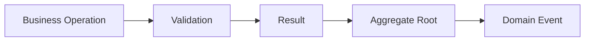

Only successful business operations may generate Domain Events.

Validation failures and unsuccessful Results never produce events.

---

# Domain Events as Business Facts

A Domain Event represents a business fact that has already occurred.

Typical examples include:

- CustomerRegistered
- OrderPlaced
- InvoicePaid
- ProductDiscontinued
- UserPasswordChanged

Each event describes a completed business occurrence rather than an intention, request, or command.

---

# Explicit Domain Communication

Rather than allowing aggregates or domain services to invoke one another directly, Domain Events provide an explicit communication mechanism.

This architectural approach offers several important advantages:

- reduced coupling;
- improved modularity;
- clearer business workflows;
- greater extensibility;
- improved testability.

Business behavior remains localized while significant domain changes become observable through well-defined events.

---

# Immutable Business History

Every Domain Event is immutable.

Once an event has been created, its data shall never change.

This immutability reflects the fundamental nature of business history:

> What has already occurred cannot be modified?

Immutable events also provide:

- deterministic behavior;
- thread safety;
- reliable auditing;
- reproducible business history;
- predictable event processing.

---

# Domain-Centric Design

The Domain Events subsystem belongs entirely to the Domain layer.

It does not depend on:

- messaging systems;
- event buses;
- message brokers;
- queues;
- infrastructure frameworks;
- transport technologies.

Its sole responsibility is to represent business events.

Infrastructure concerns such as publishing, serialization, routing, or persistence remain outside the Shared Kernel.

---

# Architectural Independence

The Domain Events model is intentionally independent of any implementation technology.

Whether an application eventually publishes events through:

- MediatR;
- RabbitMQ;
- Azure Service Bus;
- Apache Kafka;
- MassTransit;
- custom messaging infrastructure;

the architectural model remains unchanged.

The Shared Kernel defines the event abstraction—not its delivery mechanism.

---

# Relationship with Aggregate Roots

Aggregate Roots are the natural producers of Domain Events.

Instead of immediately publishing events, aggregates collect pending events during business execution.

Conceptually:

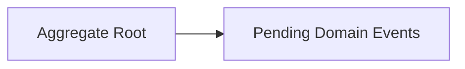

Event generation and event publication are intentionally separated responsibilities.

This separation preserves domain purity while allowing infrastructure to determine how and when events are dispatched.

---

# Architectural Objectives

The Domain Events subsystem has been designed to achieve the following objectives.

- Represent business facts explicitly.
- Preserve aggregate encapsulation.
- Minimize coupling between domain components.
- Support deterministic execution.
- Enable future extensibility.
- Remain completely framework independent.
- Integrate seamlessly with the Results subsystem.
- Support multiple event publication strategies.

These objectives guide every architectural decision presented throughout this document.

---

# Scope

This document defines the complete architecture of the Domain Events subsystem, including:

- event abstractions;
- aggregate integration;
- event lifecycle;
- event dispatching;
- publication models;
- ordering guarantees;
- consistency strategies;
- asynchronous execution;
- versioning;
- best practices.

Implementation-specific concerns belonging to infrastructure layers are intentionally outside the scope of this document.

---

# Intended Audience

This document is intended for:

- software architects;
- domain architects;
- backend developers;
- Shared Kernel maintainers;
- contributors to **KUKULCAN.SharedKernel**.

Readers are expected to have a working knowledge of:

- Domain-Driven Design (DDD);
- Clean Architecture;
- the Results subsystem;
- the Validation subsystem.

---

# Architectural Invariant

> **The Domain Events subsystem within KUKULCAN.SharedKernel shall provide a framework-independent, immutable, and explicit representation of significant business events, enabling aggregates to communicate domain changes through deterministic and reusable event abstractions while preserving encapsulation, architectural consistency, and long-term maintainability.**

This invariant defines the fundamental architectural purpose of the Domain Events subsystem.

---

# Summary

The Domain Events subsystem establishes the architectural foundation for representing business events throughout **KUKULCAN.SharedKernel**.

By treating Domain Events as immutable business facts owned entirely by the domain model, the subsystem enables explicit communication between aggregates and the rest of the application while remaining completely independent of infrastructure technologies. Through its integration with the Validation and Results subsystems, Domain Events become a central mechanism for building scalable, maintainable, and highly decoupled enterprise applications.

# 2. Philosophy

The philosophy of the Domain Events subsystem is founded on a simple but powerful architectural principle:

> **The domain should explicitly communicate what has happened, never how other components should react.**

A Domain Event is **not** a command, a notification, or an implementation detail.

It is an immutable representation of a significant business fact that has already occurred within the domain model.

By elevating business events to first-class architectural concepts, **KUKULCAN.SharedKernel** enables a domain model that is expressive, loosely coupled, and capable of evolving without introducing unnecessary dependencies between aggregates, services, or infrastructure.

---

## Architectural Principle

Business events should describe completed facts rather than intended actions.

> **Domain Events communicate "what happened," never "what should happen."**

This distinction is fundamental to maintaining a clean separation between the Domain and the Application layers.

---

# Business Facts Over Technical Events

A Domain Event represents something that is meaningful to the business.

Examples include:

- CustomerRegistered
- OrderSubmitted
- InvoicePaid
- ProductBackOrdered
- PasswordChanged

These events describe business reality.

They do **not** describe technical operations such as:

- DatabaseUpdated
- CacheRefreshed
- EmailSent
- MessagePublished

Technical events belong to the infrastructure layer and are outside the scope of the Shared Kernel.

---

# Explicit Domain Communication

Traditional object-oriented systems often rely on direct method invocations between domain objects.

Although simple, this approach introduces tight coupling.

The Domain Events philosophy replaces implicit communication with explicit business events.

Conceptually:

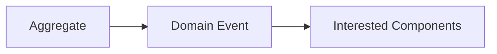

The aggregate publishes the fact.

Other components decide whether they are interested.

---

# Separation of Responsibilities

The aggregate is responsible only for:

- enforcing business rules;
- maintaining consistency;
- producing Domain Events.

It is **not** responsible for:

- dispatching events;
- publishing messages;
- invoking handlers;
- coordinating workflows.

These concerns belong to higher architectural layers.

---

# Events Represent the Past

Commands express intent.

Domain Events represent history.

Conceptually:

```text
Command

↓

Business Execution

↓

Domain Event
```

The command requests an action.

The Domain Event confirms that the action successfully occurred.

---

# Immutability

A Domain Event is immutable by design.

Once created, its contents shall never change.

Immutability guarantees:

- deterministic behavior;
- reproducible execution;
- reliable auditing;
- safe concurrent processing.

Business history cannot be rewritten.

---

# Domain Ownership

Only the Domain is allowed to create Domain Events.

Infrastructure never creates business events.

Instead:

- aggregates raise events;
- application services coordinate execution;
- infrastructure dispatches or transports events.

This preserves the ownership of business knowledge within the Domain.

---

# Low Coupling

The Domain Events philosophy minimizes dependencies between business components.

Without Domain Events:

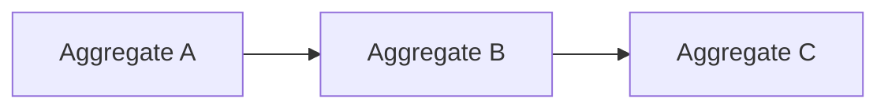

With Domain Events:

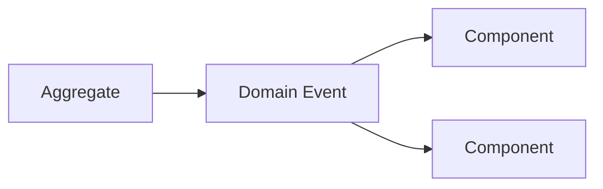

The aggregate remains unaware of its consumers.

---

# High Cohesion

Aggregates remain highly cohesive because they focus exclusively on their own business responsibilities.

They do not coordinate other business objects.

They simply state:

> "This business event occurred."

This philosophy produces smaller, cleaner domain models.

---

# Eventual Extensibility

One of the greatest strengths of Domain Events is extensibility.

New consumers may be introduced without modifying existing aggregates.

For example:

Today:

```text
CustomerRegistered
```

Tomorrow:

- Send welcome email.
- Create CRM profile.
- Notify analytics.
- Publish integration event.

The aggregate remains unchanged.

---

# Framework Independence

The philosophy deliberately avoids dependence upon:

- MediatR;
- messaging libraries;
- brokers;
- cloud services;
- event buses.

These technologies implement event delivery.

They do not define the business event itself.

The Shared Kernel owns the event abstraction.

---

# Domain Language

Domain Events contribute directly to the Ubiquitous Language.

Names such as:

- OrderCanceled
- PaymentAuthorized
- ShipmentDelivered

are immediately understandable by:

- developers;
- architects;
- business analysts;
- domain experts.

This shared language improves communication across the entire project.

---

# Architectural Characteristics

The Domain Events philosophy is characterized by:

- explicit communication;
- immutable business facts;
- low coupling;
- high cohesion;
- framework independence;
- deterministic behavior;
- domain ownership.

These characteristics define the identity of the subsystem.

---

# Philosophical Constraints

Every Domain Event should satisfy the following principles.

- Represent a completed business fact.
- Be immutable.
- Be meaningful to the business.
- Be owned by the Domain.
- Avoid infrastructure concerns.
- Preserve aggregate encapsulation.
- Remain framework independent.

These constraints define what qualifies as a true Domain Event.

---

# Architectural Invariant

> **Within KUKULCAN.SharedKernel, every Domain Event shall represent an immutable and explicit business fact produced exclusively by the Domain model, communicating completed business behavior without prescribing implementation details, execution mechanisms, or infrastructure responsibilities, thereby preserving low coupling, high cohesion, and complete architectural independence.**

This invariant governs the philosophical foundation of the Domain Events subsystem.

---

# Summary

The philosophy of the Domain Events subsystem is centered on representing business history through explicit, immutable events that belong exclusively to the Domain.

By separating business facts from technical implementation concerns, **KUKULCAN.SharedKernel** enables a domain model that is expressive, extensible, loosely coupled, and fully independent of messaging technologies or infrastructure frameworks. This philosophy establishes Domain Events as one of the primary mechanisms for achieving a clean, scalable, and maintainable enterprise architecture.

# 3. Design Goals

The Domain Events subsystem has been designed to provide a robust, scalable, and framework-independent mechanism for representing significant business events throughout **KUKULCAN.SharedKernel**.

Its purpose extends beyond simple event notification.

The subsystem establishes a consistent architectural model for expressing business facts, coordinating domain behavior, and enabling future extensibility while preserving the integrity of the Domain model.

Every design decision described in this document supports one or more of the architectural goals presented in this chapter.

---

## Architectural Principle

Domain Events should simplify the evolution of the domain model without increasing coupling.

> **Business events should make systems easier to extend, never harder to maintain.**

---

# Primary Design Goals

The Domain Events subsystem has been designed to achieve the following primary objectives.

- Represent business facts explicitly.
- Preserve aggregate encapsulation.
- Reduce coupling between domain components.
- Support long-term extensibility.
- Remain independent of infrastructure technologies.
- Enable deterministic execution.
- Integrate seamlessly with the Results and Validation subsystems.

Together, these goals define the architectural purpose of the subsystem.

---

# Explicit Business Communication

Business events should always be represented explicitly.

Rather than relying on implicit object interactions, the architecture promotes well-defined Domain Events that communicate meaningful business changes.

Benefits include:

- improved readability;
- better domain modeling;
- clearer business workflows;
- simplified maintenance.

---

# Preserve Aggregate Integrity

Aggregates remain responsible for enforcing their own consistency boundaries.

The Domain Events subsystem must never encourage aggregates to expose or delegate internal business decisions.

Instead, aggregates simply publish completed business facts after their invariants have been satisfied.

---

# Minimize Coupling

One of the principal design objectives is minimizing dependencies between business components.

Domain Events eliminate unnecessary direct communication between:

- aggregates;
- domain services;
- application services.

Instead, communication occurs through explicit business events.

This significantly improves modularity.

---

# Promote High Cohesion

Each aggregate should focus exclusively on its own business responsibilities.

It should never coordinate unrelated business processes.

The Domain Events model allows aggregates to remain cohesive while still informing the rest of the system about important business occurrences.

---

# Enable Extensibility

The architecture should allow new business capabilities to be introduced without modifying existing aggregates.

For example, introducing a new event handler should never require changes to:

- AggregateRoot;
- existing Domain Events;
- previously implemented business logic.

This follows the Open/Closed Principle.

---

# Support Domain Evolution

Business models evolve continuously.

The Domain Events subsystem must accommodate:

- new event types;
- additional event metadata;
- new consumers;
- new publication strategies.

These extensions should occur through addition rather than modification.

---

# Framework Independence

The subsystem must remain completely independent of implementation technologies.

Its architecture shall not require knowledge of:

- MediatR;
- RabbitMQ;
- Kafka;
- Azure Service Bus;
- MassTransit;
- cloud platforms.

These technologies belong to the infrastructure layer.

---

# Infrastructure Agnosticism

Domain Events describe business behavior only.

They should not contain infrastructure concepts such as:

- routing;
- serialization;
- transport protocols;
- delivery guarantees;
- broker configuration.

The Shared Kernel owns the event abstraction—not its delivery mechanism.

---

# Deterministic Execution

Identical business operations should always produce identical Domain Events.

Given identical:

- business input;
- aggregate state;
- business rules;

the generated Domain Events should always be the same.

Deterministic behavior simplifies:

- testing;
- debugging;
- auditing;
- reproducibility.

---

# Immutability

Every Domain Event should be immutable.

Immutability guarantees:

- thread safety;
- reliable auditing;
- predictable execution;
- historical correctness.

Business history must remain unchanged after an event has been created.

---

# Results Integration

The Domain Events subsystem has been designed to integrate naturally with the Results subsystem.

Conceptually:

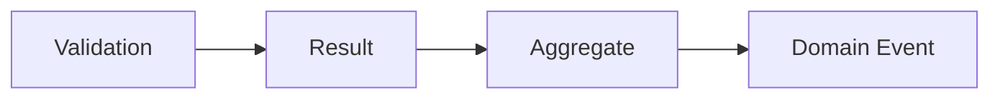

Only successful business operations may generate Domain Events.

---

# Validation Integration

Validation protects the Domain before events are created.

The expected execution flow is:

```text
Validation

↓

Business Execution

↓

Domain Event Generation
```

Validation failures prevent Domain Events from being produced.

---

# Scalability

The architecture should scale naturally across:

- monolithic applications;
- modular monoliths;
- distributed systems;
- cloud-native architectures.

Scalability is achieved through loose coupling rather than distributed infrastructure.

---

# Testability

The Domain Events model should simplify automated testing.

Domain Events are easy to verify because they are:

- immutable;
- deterministic;
- explicit;
- framework independent.

Business tests can assert generated events directly without requiring infrastructure.

---

# Architectural Characteristics

The design goals collectively produce a subsystem that is:

- explicit;
- deterministic;
- immutable;
- loosely coupled;
- highly cohesive;
- extensible;
- scalable;
- framework independent.

These characteristics define the quality attributes of the Domain Events architecture.

---

# Design Constraints

Every implementation of the Domain Events subsystem shall satisfy the following constraints.

- Preserve aggregate encapsulation.
- Represent only completed business facts.
- Avoid infrastructure dependencies.
- Maintain immutable event objects.
- Favor extension over modification.
- Support deterministic behavior.
- Integrate consistently with Results and Validation.

These constraints guide every architectural decision.

---

# Architectural Invariant

> **The Domain Events subsystem within KUKULCAN.SharedKernel shall provide an explicit, immutable, deterministic, and framework-independent representation of significant business events, enabling aggregates to communicate completed business facts while preserving encapsulation, minimizing coupling, maximizing extensibility, and integrating consistently with the Validation and Results subsystems.**

This invariant defines the design objectives that govern the entire subsystem.

---

# Summary

The Domain Events subsystem has been designed to enable explicit business communication while preserving the architectural integrity of the Domain model.

By emphasizing immutability, deterministic execution, low coupling, aggregate encapsulation, and complete framework independence, **KUKULCAN.SharedKernel** provides a flexible and future-proof event architecture capable of supporting enterprise applications throughout their long-term evolution without sacrificing maintainability or architectural consistency.

# 4. Architectural Goals

The architectural goals of the Domain Events subsystem define the quality attributes that every implementation within **KUKULCAN.SharedKernel** must preserve.

While the design goals describe *what* the subsystem intends to accomplish, the architectural goals define *how* those objectives are achieved from an architectural perspective.

These goals establish the long-term direction of the subsystem and serve as the criteria against which future architectural decisions should be evaluated.

---

## Architectural Principle

Architectural decisions should optimize domain integrity rather than implementation convenience.

> **The architecture exists to preserve the Domain model, not to simplify infrastructure.**

---

# Architectural Vision

The Domain Events subsystem provides a consistent architectural model for communicating significant business events while maintaining complete separation between:

- domain behavior;
- application orchestration;
- infrastructure concerns.

The architecture ensures that business knowledge remains entirely within the Domain layer.

---

# Preserve Domain Purity

The primary architectural objective is preserving the purity of the Domain model.

Aggregates should never depend upon:

- messaging frameworks;
- event buses;
- transport protocols;
- serialization libraries;
- infrastructure services.

The Domain owns the event.

Infrastructure owns the delivery.

This separation is fundamental.

---

# Preserve Aggregate Encapsulation

Aggregate boundaries define business consistency boundaries.

Domain Events should strengthen—not weaken—those boundaries.

Aggregates must never expose internal state merely to facilitate event publication.

Instead, they publish immutable business facts after their invariants have been satisfied.

---

# Promote Explicit Communication

Business communication should always be visible and intentional.

Instead of hidden dependencies:

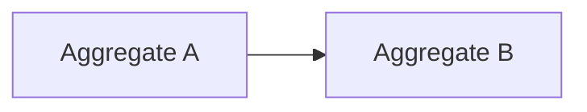

The architecture promotes explicit communication:

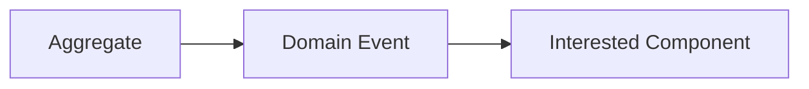

Every significant business interaction becomes observable.

---

# Support Loose Coupling

One of the most important architectural goals is minimizing dependencies between domain components.

Aggregates should remain completely unaware of:

- event handlers;
- subscribers;
- external integrations;
- future consumers.

The event itself becomes the only contract.

This allows the architecture to evolve without modifying existing business logic.

---

# Encourage High Cohesion

Every aggregate should remain focused on a single business responsibility.

It should never coordinate workflows outside its consistency boundary.

Domain Events allow aggregates to communicate completed business facts while maintaining high internal cohesion.

---

# Enable Incremental Evolution

The architecture should support continuous evolution without requiring invasive modifications.

Future additions may include:

- new Domain Events;
- additional handlers;
- integration events;
- auditing;
- notifications;
- analytics.

Existing aggregates should remain unchanged.

---

# Infrastructure Independence

The Shared Kernel defines the business event model independently of infrastructure technologies.

Conceptually:

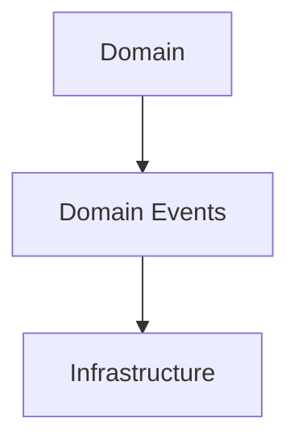

The infrastructure consumes Domain Events.

It does not define them.

---

# Deterministic Business History

The architecture treats Domain Events as immutable records of completed business activity.

Given identical:

- business input;
- aggregate state;
- business rules;

the resulting Domain Events should always be identical.

This deterministic behavior improves:

- reproducibility;
- debugging;
- auditing;
- automated testing.

---

# Support Eventual Consistency

The architecture should naturally support eventual consistency across bounded contexts.

Conceptually:

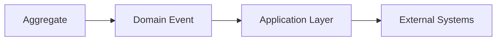

The Domain remains unaware of how other systems react.

---

# Integrate with Results

Domain Events are generated only after successful business execution.

Expected flow:

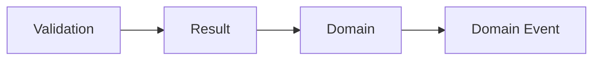

Validation failures or unsuccessful Results terminate execution before any event is raised.

---

# Support Multiple Dispatch Models

The architecture should remain compatible with multiple event delivery strategies.

Examples include:

- synchronous dispatch;
- asynchronous dispatch;
- in-process messaging;
- distributed messaging;
- event sourcing projections.

These mechanisms remain external to the Shared Kernel.

---

# Promote Testability

Domain Events should be straightforward to verify during automated testing.

Their characteristics naturally support testing because they are:

- immutable;
- deterministic;
- framework independent;
- explicit.

Business tests should validate emitted events without requiring messaging infrastructure.

---

# Ensure Long-Term Maintainability

Every architectural decision should favor maintainability over short-term convenience.

This includes:

- explicit abstractions;
- clear responsibilities;
- reusable components;
- stable contracts;
- minimal dependencies.

Maintainability is considered a first-class architectural concern.

---

# Architectural Characteristics

The Domain Events architecture is intentionally designed to be:

- explicit;
- deterministic;
- immutable;
- loosely coupled;
- highly cohesive;
- extensible;
- maintainable;
- framework independent.

These quality attributes collectively define the subsystem.

---

# Architectural Constraints

Every implementation of the Domain Events subsystem shall satisfy the following constraints.

- Preserve aggregate encapsulation.
- Represent only completed business facts.
- Avoid infrastructure dependencies.
- Favor immutable event objects.
- Minimize coupling.
- Maximize extensibility.
- Support deterministic execution.
- Integrate consistently with Results and Validation.

These constraints apply regardless of implementation technology.

---

# Architectural Invariant

> **The Domain Events subsystem within KUKULCAN.SharedKernel shall preserve domain purity by providing a framework-independent architecture in which immutable business events communicate completed domain behavior through explicit and deterministic abstractions, maintaining aggregate encapsulation, minimizing coupling, enabling long-term extensibility, and supporting consistent integration with the Results and Validation subsystems without introducing infrastructure concerns into the Domain layer.**

This invariant governs every architectural decision within the subsystem.

---

# Summary

The architectural goals presented in this chapter define the quality attributes that shape the Domain Events subsystem.

By emphasizing explicit communication, immutable business history, aggregate encapsulation, loose coupling, deterministic execution, and complete infrastructure independence, **KUKULCAN.SharedKernel** establishes a Domain Events architecture capable of supporting complex enterprise domains while remaining stable, extensible, and maintainable over many years of continuous evolution.

# 5. Domain Event Fundamentals

The Domain Events subsystem is built upon a small set of fundamental concepts that collectively define how business events are represented, generated, collected, and ultimately processed throughout **KUKULCAN.SharedKernel**.

Understanding these concepts is essential before examining the individual architectural components presented in later chapters.

The principles described here establish the conceptual model upon which every Domain Event implementation is based.

---

## Architectural Principle

A Domain Event represents a completed business fact produced by the Domain model.

> **Events describe business history, not business intent.**

This distinction separates Domain Events from commands, requests, notifications, and infrastructure messages.

---

# What Is a Domain Event?

A Domain Event is an immutable object that represents a significant business occurrence.

Conceptually:

```text
Business Action

↓

Business Rules Satisfied

↓

Domain Event Created
```

A Domain Event exists because something important has already happened within the domain.

It is **never** created to request that something happen.

---

# Characteristics of a Domain Event

Every Domain Event within **KUKULCAN.SharedKernel** shares the following characteristics.

- Immutable.
- Explicit.
- Domain-owned.
- Business-oriented.
- Deterministic.
- Serializable.
- Framework independent.

These characteristics remain true regardless of the implementation technology.

---

# Business Meaning

A Domain Event should always have meaning to domain experts.

Good examples include:

- CustomerRegistered
- PaymentAuthorized
- SubscriptionExpired
- InvoiceCanceled
- InventoryReserved

Poor examples include:

- SaveCompleted
- DatabaseUpdated
- CacheInvalidated
- EmailSent

The event name should describe a business fact rather than a technical operation.

---

# Past Tense Naming

Domain Events represent completed actions.

Therefore, event names should always use the past tense.

Preferred:

```text
CustomerRegistered

InvoicePaid

OrderCanceled
```

Avoid:

```text
RegisterCustomer

PayInvoice

CancelOrder
```

Commands express intent.

Domain Events express completed history.

---

# Event Creation

Domain Events originate exclusively from successful domain behavior.

Conceptually:

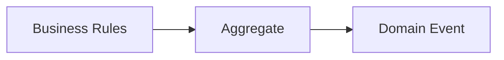

The aggregate determines when an event should be created.

External components must never create business events on behalf of the domain.

---

# Event Ownership

Domain Events belong to the aggregate that generated them.

Ownership includes responsibility for:

- creation;
- collection;
- business meaning.

Ownership does **not** include:

- dispatching;
- publication;
- persistence;
- transportation.

These responsibilities belong to higher architectural layers.

---

# Aggregate Responsibility

Aggregates are responsible for maintaining business consistency.

Once consistency has been achieved, they record the business fact by raising a Domain Event.

Conceptually:

```text
Modify State

↓

Verify Invariants

↓

Raise Domain Event
```

The event becomes part of the aggregate's pending event collection.

---

# Event Collection

Domain Events are not immediately dispatched.

Instead, aggregates collect pending events until the surrounding unit of work completes.

Conceptually:

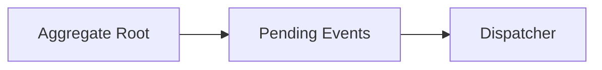

This separation prevents infrastructure concerns from leaking into the Domain model.

---

# Immutability

Every Domain Event is immutable after construction.

Its contents should never change.

Immutability guarantees:

- consistent auditing;
- deterministic execution;
- safe concurrent processing;
- reliable replay.

Business history cannot be rewritten.

---

# Event Identity

Each Domain Event represents one unique business occurrence.

Although two events may contain identical data, they still represent different moments in business history.

Consequently, every event should possess its own identity.

Typical identity information may include:

- Event Identifier.
- Occurrence Timestamp.
- Aggregate Identifier.
- Aggregate Version.

These concepts are discussed in greater detail later in this document.

---

# Event Metadata

In addition to business-specific information, Domain Events may contain metadata describing the context in which they occurred.

Typical metadata includes:

- occurrence time;
- aggregate identifier;
- correlation identifier;
- causation identifier;
- event version.

Business data and metadata should remain clearly separated.

---

# Domain vs Infrastructure Events

The architecture distinguishes between Domain Events and Infrastructure Events.

| Domain Event          | Infrastructure Event    |
|-----------------------|-------------------------|
| Business fact         | Technical notification  |
| Owned by Domain       | Owned by Infrastructure |
| Immutable             | May be transformed      |
| Framework independent | Technology dependent    |
| Business language     | Technical language      |

Infrastructure events may be derived from Domain Events, but they are not the same architectural concept.

---

# Event Lifecycle

Every Domain Event follows the same conceptual lifecycle.

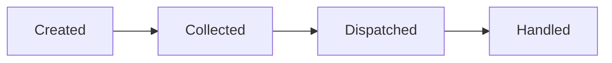

Each stage has a distinct architectural responsibility.

---

# Deterministic Behavior

Given identical:

- aggregate state;
- business rules;
- input;

the resulting Domain Events should always be identical.

This deterministic behavior enables:

- reproducible testing;
- reliable auditing;
- predictable execution;
- event replay.

---

# Framework Independence

The Domain Events model intentionally avoids assumptions about:

- event buses;
- messaging systems;
- serialization libraries;
- cloud platforms;
- transport protocols.

The Shared Kernel defines only the business event abstraction.

Everything else belongs to infrastructure.

---

# Relationship with Results

Domain Events are generated only after successful business execution.

Expected execution flow:


Failures terminate execution before any Domain Event is created.

---

# Fundamental Concepts

The Domain Events subsystem is based on the following core concepts.

- Business facts.
- Aggregate ownership.
- Immutability.
- Explicit communication.
- Pending event collection.
- Deterministic execution.
- Framework independence.

Every architectural component introduced later in this document builds upon these concepts.

---

# Architectural Characteristics

The fundamental architecture of Domain Events exhibits the following characteristics.

- Explicit.
- Immutable.
- Deterministic.
- Domain-centric.
- Loosely coupled.
- Extensible.
- Framework independent.

These characteristics define the conceptual identity of the subsystem.

---

# Architectural Invariant

> **Every Domain Event within KUKULCAN.SharedKernel shall represent a unique, immutable, and explicit business fact generated exclusively by a successful domain operation, owned by the originating aggregate, collected independently of infrastructure concerns, and processed through deterministic architectural mechanisms that preserve domain integrity, framework independence, and long-term maintainability.**

This invariant establishes the conceptual foundation upon which the entire Domain Events subsystem is built.

---

# Summary

The concepts introduced in this chapter define the fundamental architectural model of Domain Events within **KUKULCAN.SharedKernel**.

By treating Domain Events as immutable business facts owned by aggregates and collected independently of infrastructure, the architecture establishes a consistent foundation for event generation, collection, dispatching, and future extensibility while preserving the purity, consistency, and independence of the Domain model.

# 6. Domain Event Taxonomy

The Domain Events subsystem classifies business events according to their architectural role rather than their implementation details.

A well-defined taxonomy promotes consistency, simplifies reasoning about business behavior, and establishes a common language for architects, developers, and domain experts.

Unlike infrastructure messages, Domain Events are categorized exclusively by their business semantics and their relationship to the Domain model.

---

## Architectural Principle

Domain Events should be classified according to business meaning, not technical implementation.

> **Business semantics determine the event category; infrastructure determines only its delivery.**

---

# Purpose

The Domain Event taxonomy exists to:

- establish consistent event classification;
- improve architectural readability;
- simplify event discovery;
- support long-term evolution;
- encourage consistent modeling across bounded contexts.

A shared taxonomy reduces ambiguity throughout the system.

---

# Taxonomy Overview

Within **KUKULCAN.SharedKernel**, Domain Events may be classified into the following conceptual categories.

| Category                     | Purpose                                                |
|------------------------------|--------------------------------------------------------|
| Entity Events                | Describe changes affecting individual entities         |
| Aggregate Events             | Describe changes affecting aggregate state             |
| Lifecycle Events             | Describe creation, modification, or removal            |
| Business Process Events      | Describe significant business milestones               |
| State Transition Events      | Describe changes between business states               |
| Integration Candidate Events | Domain Events that may later become Integration Events |

These categories are conceptual rather than inheritance hierarchies.

---

# Entity Events

Entity Events represent significant business changes affecting a single entity.

Examples include:

- CustomerEmailChanged
- UserPasswordChanged
- ProductPriceUpdated

Entity Events remain meaningful only within the context of their owning aggregate.

---

# Aggregate Events

Aggregate Events represent changes that affect the aggregate as a whole.

Examples include:

- OrderSubmitted
- InvoiceApproved
- SubscriptionActivated

These events typically indicate that the aggregate has reached a new consistent business state.

---

# Lifecycle Events

Lifecycle Events describe the lifecycle of business objects.

Typical examples include:

- CustomerRegistered
- ProductCreated
- ContractExpired
- EmployeeTerminated

These events represent significant milestones in the existence of domain objects.

---

# Business Process Events

Business Process Events represent important milestones within larger business workflows.

Examples include:

- PaymentAuthorized
- ShipmentDelivered
- RefundCompleted
- MembershipRenewed

These events often trigger additional business processes while remaining independent of their consumers.

---

# State Transition Events

Many business processes are naturally modeled as state transitions.

Examples include:

```text
Pending

↓

Approved

↓

Completed
```

Corresponding Domain Events may include:

- OrderApproved
- InvoiceRejected
- ReservationCanceled

Each event represents a completed transition between valid business states.

---

# Integration Candidate Events

Some Domain Events may later be transformed into Integration Events.

Conceptually:

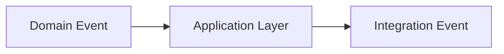

The Domain Event itself remains purely business-oriented.

Transformation into an Integration Event belongs to the Application or Infrastructure layers.

---

# Business Granularity

Domain Events should represent meaningful business milestones.

Avoid events that are either:

Too fine-grained:

- AddressLineUpdated
- CacheReloaded
- RowInserted

Or too coarse-grained:

- EverythingChanged
- BusinessUpdated

Good Domain Events capture meaningful business significance.

---

# Event Scope

Domain Events should remain scoped to a single bounded context.

For example:

```text
Sales

↓

OrderPlaced
```

may differ from:

```text
Shipping

↓

ShipmentCreated
```

Although related, each bounded context owns its own Domain Events.

---

# Event Frequency

Not every business action deserves a Domain Event.

An event should be raised only when:

- business history changes;
- another business capability may become interested;
- the occurrence has lasting business significance.

Excessive event generation reduces clarity.

---

# Naming Guidelines

Every Domain Event name should satisfy the following rules.

- Use past tense.
- Describe a completed business fact.
- Be understandable by domain experts.
- Avoid technical terminology.
- Be concise.

Preferred examples:

- CustomerRegistered
- PaymentCompleted
- ProductArchived

Avoid:

- RegisterCustomer
- ExecutePayment
- SaveChanges

---

# Event Classification Rules

Every newly introduced Domain Event should satisfy the following questions.

1. Does it describe a completed business fact?
→ Domain Event.

2. Does it represent a significant business milestone?
→ Candidate Domain Event.

3. Does it describe only a technical operation?
→ Infrastructure Event.

4. Does it request future work?
→ Command.

5. Does it coordinate application behavior?
→ Application Concern.

6. Does it notify external systems?
→ Integration Event.

If none of these classifications apply, reconsider whether a Domain Event is actually required.

---

# Architectural Characteristics

The Domain Event taxonomy is intentionally:

- business-oriented;
- implementation independent;
- extensible;
- deterministic;
- framework independent;
- bounded-context aware.

These characteristics ensure consistency across the entire platform.

---

# Architectural Constraints

Every Domain Event shall satisfy the following constraints.

- Represent a completed business fact.
- Belong to exactly one bounded context.
- Use business terminology.
- Avoid technical implementation details.
- Remain immutable.
- Preserve aggregate ownership.

These constraints maintain a coherent event model.

---

# Architectural Invariant

> **Every Domain Event within KUKULCAN.SharedKernel shall belong to a well-defined business category determined exclusively by its business meaning, represent a completed and significant business fact within a single bounded context, and remain independent of technical implementation, infrastructure mechanisms, and delivery strategies, thereby preserving semantic consistency, architectural clarity, and long-term maintainability.**

This invariant defines the classification model for all Domain Events.

---

# Summary

The Domain Event taxonomy provides a consistent classification system for representing business events throughout **KUKULCAN.SharedKernel**.

By categorizing events according to business semantics rather than implementation details, the taxonomy improves architectural consistency, strengthens the ubiquitous language, and provides a scalable foundation for future domain evolution while preserving complete independence from infrastructure technologies.

# 7. Core Components

The Domain Events subsystem is composed of a small set of core architectural components that collectively provide a complete and framework-independent model for representing, collecting, dispatching, and processing business events.

Each component has a single, clearly defined responsibility.

Together they establish the foundation upon which every Domain Event implementation within **KUKULCAN.SharedKernel** is built.

The subsystem deliberately follows the **Single Responsibility Principle (SRP)** and the **Dependency Inversion Principle (DIP)** to maximize maintainability, extensibility, and architectural clarity.

---

## Architectural Principle

Every core component should own exactly one architectural responsibility.

> **Complex event systems emerge from the composition of simple, focused components.**

---

# Purpose

The Core Components defined in this chapter exist to:

- represent business events;
- establish common event contracts;
- collect pending events within aggregates;
- separate event generation from event publication;
- enable framework-independent dispatching;
- support future infrastructure implementations.

Together they define the public architecture of the Domain Events subsystem.

---

# Component Overview

The Domain Events subsystem consists of the following primary components.

| Component                 | Responsibility                                              |
|---------------------------|-------------------------------------------------------------|
| **IDomainEvent**          | Defines the common contract for all Domain Events           |
| **DomainEvent**           | Provides the abstract base implementation for Domain Events |
| **AggregateRoot**         | Collects and manages pending Domain Events                  |
| **DomainEventCollection** | Stores pending events generated by an aggregate             |
| **EventDispatcher**       | Dispatches collected events to interested handlers          |
| **EventPublisher**        | Publishes dispatched events through infrastructure          |
| **DomainEventHandler**    | Processes individual Domain Events                          |
| **DomainEventContext**    | Supplies contextual information during event processing     |

Each component is discussed in detail in its own dedicated section.

---

# Architectural Relationships

The core components collaborate through well-defined responsibilities.

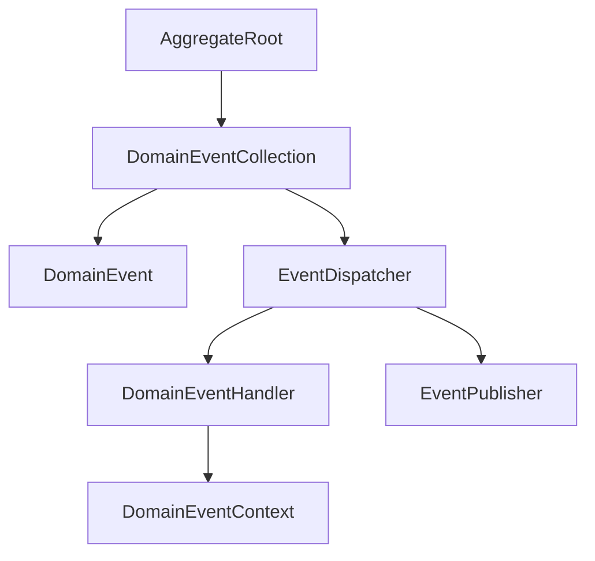

Notice that the aggregate never communicates directly with handlers or publishers.

---

# Separation of Responsibilities

Each component owns exactly one responsibility.

For example:

- **DomainEvent** represents business facts.
- **AggregateRoot** raises events.
- **DomainEventCollection** stores pending events.
- **EventDispatcher** coordinates dispatching.
- **EventPublisher** communicates with infrastructure.
- **DomainEventHandler** executes business reactions.

No component performs multiple unrelated tasks.

---

# Dependency Direction

The dependency flow follows Clean Architecture principles.

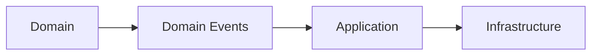

Dependencies always point outward.

Infrastructure depends on the Domain—not the opposite.

---

# Aggregate-Centered Architecture

Aggregate Roots remain the only producers of Domain Events.

They interact exclusively with the event collection.

Conceptually:

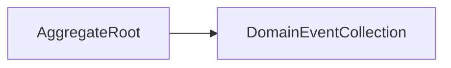

The aggregate never dispatches or publishes its own events.

---

# Event Processing Pipeline

After business execution completes, the remaining components participate in event processing.

Conceptually:

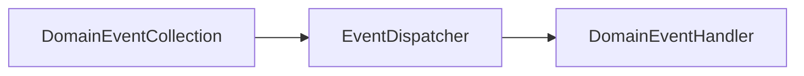

The pipeline remains independent of any messaging technology.

---

# Extensibility

The architecture is intentionally open for extension.

New implementations may introduce:

- specialized dispatchers;
- custom publishers;
- additional handlers;
- monitoring components;
- auditing services.

Existing abstractions remain unchanged.

---

# Framework Independence

None of the Core Components require:

- MediatR;
- RabbitMQ;
- Kafka;
- Azure Service Bus;
- MassTransit;
- ASP.NET Core.

These technologies may provide implementations, but they do not define the architecture.

---

# Results Integration

The Core Components operate after successful business execution.

Conceptually:

```mermaid
flowchart LR

    RESULT["Result"]

    AGGREGATE["AggregateRoot"]

    EVENTS["DomainEventCollection"]

    RESULT --> AGGREGATE
    AGGREGATE --> EVENTS
```

Only successful operations may populate the event collection.

---

# Validation Integration

Validation precedes Domain Event generation.

```text
Validation

↓

Business Execution

↓

Raise Domain Events

↓

Collect Pending Events
```

Invalid business operations never produce Domain Events.

---

# Component Independence

Every component is designed to be independently testable.

This is achieved through:

- immutable event objects;
- interface-based abstractions;
- explicit dependencies;
- stateless processing components.

Testing one component does not require the others.

---

# Architectural Characteristics

The Core Components collectively exhibit the following characteristics.

- Explicit.
- Modular.
- Immutable.
- Reusable.
- Loosely coupled.
- Highly cohesive.
- Extensible.
- Framework independent.

These characteristics define the architecture of the subsystem.

---

# Architectural Constraints

Every Core Component shall satisfy the following constraints.

- Own a single architectural responsibility.
- Avoid infrastructure dependencies.
- Preserve aggregate encapsulation.
- Favor immutable data structures.
- Support deterministic execution.
- Integrate consistently with Results and Validation.

These constraints apply to every future extension of the subsystem.

---

# Next Sections

The following sections describe each component individually.

- **7.1 IDomainEvent**
- **7.2 DomainEvent**
- **7.3 AggregateRoot**
- **7.4 DomainEventCollection**
- **7.5 EventDispatcher**
- **7.6 EventPublisher**
- **7.7 DomainEventHandler**
- **7.8 DomainEventContext**

Each section examines the architectural purpose, responsibilities, relationships, design decisions, and best practices associated with that component.

---

# Architectural Invariant

> **The Core Components of the Domain Events subsystem within KUKULCAN.SharedKernel shall collectively provide a modular, immutable, framework-independent, and responsibility-driven architecture in which each component owns a single architectural concern, collaborates exclusively through explicit abstractions, and contributes to a deterministic event processing model while preserving aggregate encapsulation, low coupling, and long-term maintainability.**

This invariant governs the architecture of every component introduced in the following sections.

---

# Summary

The Core Components presented in this chapter establish the architectural backbone of the Domain Events subsystem.

By decomposing event generation, collection, dispatching, publication, and processing into specialized responsibilities, **KUKULCAN.SharedKernel** achieves a clean, extensible, and framework-independent architecture that remains faithful to the principles of Domain-Driven Design and Clean Architecture while providing a robust foundation for future evolution.

# 7.1. IDomainEvent

`IDomainEvent` defines the fundamental contract that every Domain Event within **KUKULCAN.SharedKernel** must implement.

It represents the smallest possible abstraction required to identify an object as a Domain Event.

The interface intentionally contains only the information that is universally applicable to every business event, allowing the architecture to remain simple, extensible, and completely independent of implementation technologies.

---

## Architectural Principle

Every Domain Event should implement a single common contract.

> **A shared contract establishes architectural consistency without imposing unnecessary implementation details.**

---

# Purpose

`IDomainEvent` exists to:

- identify Domain Events;
- establish a common architectural contract;
- enable polymorphic event processing;
- support framework-independent dispatching;
- provide a stable abstraction for future extensions.

It is the root abstraction of the Domain Events subsystem.

---

# Architectural Responsibility

`IDomainEvent` is responsible only for defining what constitutes a Domain Event.

It is **not** responsible for:

- event dispatching;
- event publication;
- serialization;
- persistence;
- routing;
- infrastructure integration.

Those responsibilities belong to other architectural components.

---

# Position Within the Architecture

`IDomainEvent` occupies the highest abstraction level within the Domain Events subsystem.

Conceptually:

```mermaid
flowchart TD

    IDOMAINEVENT["IDomainEvent"]

    DOMAINEVENT["DomainEvent"]

    CUSTOMER["CustomerRegistered"]

    ORDER["OrderPlaced"]

    PAYMENT["PaymentCompleted"]

    IDOMAINEVENT --> DOMAINEVENT
    DOMAINEVENT --> CUSTOMER
    DOMAINEVENT --> ORDER
    DOMAINEVENT --> PAYMENT
```

Every concrete Domain Event ultimately derives from this contract.

---

# Minimal Contract

The interface should expose only information that is universally valid for every Domain Event.

Typical members include:

- Event identifier.
- Occurred timestamp.

Future implementations may expose additional metadata through derived abstractions rather than expanding the base contract unnecessarily.

---

# Event Identity

Every Domain Event represents one unique business occurrence.

Therefore, each implementation should expose a unique identifier.

This identifier enables:

- event correlation;
- auditing;
- traceability;
- replay;
- diagnostics.

Identity belongs to the event itself—not to its transport mechanism.

---

# Occurrence Time

Every Domain Event records the moment at which the business event occurred.

The occurrence timestamp represents:

- business history;
- event ordering;
- auditing;
- reproducibility.

It should always represent UTC time.

---

# Immutability

Every implementation of `IDomainEvent` shall be immutable.

After construction:

- identifiers do not change;
- timestamps do not change;
- business data does not change.

Immutability guarantees deterministic behavior throughout the system.

---

# Framework Independence

`IDomainEvent` deliberately avoids dependencies upon:

- MediatR;
- messaging libraries;
- serialization frameworks;
- cloud SDKs;
- infrastructure APIs.

The interface belongs entirely to the Domain layer.

---

# Business Independence

The interface contains no business-specific information.

It does **not** define properties such as:

- CustomerId;
- OrderNumber;
- ProductCode;
- PaymentAmount.

Those belong to individual Domain Event implementations.

The interface defines only the universal event contract.

---

# Polymorphic Processing

Because every Domain Event implements the same interface, dispatchers and publishers can process events polymorphically.

Conceptually:

```mermaid
flowchart LR

    EVENT1["CustomerRegistered"]

    EVENT2["InvoicePaid"]

    EVENT3["OrderCanceled"]

    IDOMAINEVENT["IDomainEvent"]

    EVENT1 --> IDOMAINEVENT
    EVENT2 --> IDOMAINEVENT
    EVENT3 --> IDOMAINEVENT
```

The dispatcher depends only upon the abstraction.

---

# Versioning

The `IDomainEvent` contract should remain highly stable.

Future evolution should favor:

- derived interfaces;
- additional abstractions;
- optional metadata.

Breaking changes to the base contract should be avoided whenever possible.

---

# Relationship with DomainEvent

Although every Domain Event implements `IDomainEvent`, most implementations should inherit from the abstract `DomainEvent` base class.

Conceptually:

```text
IDomainEvent

↓

DomainEvent

↓

Concrete Domain Event
```

The interface defines the contract.

The abstract class provides the reusable implementation.

---

# Design Guidelines

Every implementation of `IDomainEvent` should:

- be immutable;
- represent one business fact;
- expose a unique identifier;
- expose an occurrence timestamp;
- remain framework independent.

These guidelines ensure architectural consistency.

---

# Architectural Characteristics

`IDomainEvent` exhibits the following characteristics.

- Minimal.
- Stable.
- Immutable.
- Framework independent.
- Extensible.
- Domain-owned.
- Polymorphic.

These characteristics define the foundation of the Domain Events architecture.

---

# Architectural Constraints

Every implementation of `IDomainEvent` shall satisfy the following constraints.

- Represent exactly one business occurrence.
- Remain immutable.
- Expose a unique identity.
- Record the occurrence time.
- Avoid infrastructure dependencies.
- Avoid business-specific assumptions.

These constraints preserve the integrity of the abstraction.

---

# Architectural Invariant

> **Every Domain Event within KUKULCAN.SharedKernel shall implement the IDomainEvent contract, providing a stable, immutable, and framework-independent representation of a unique business occurrence while exposing only the universally applicable characteristics required for consistent identification, ordering, and processing throughout the Domain Events architecture.**

This invariant governs every implementation of the `IDomainEvent` abstraction.

---

# Summary

`IDomainEvent` establishes the fundamental contract upon which the entire Domain Events subsystem is built.

By defining the smallest possible abstraction for representing immutable business events, it enables consistent event processing, preserves framework independence, and provides a stable architectural foundation that supports future evolution while maintaining compatibility across the Shared Kernel.

# 7.2. DomainEvent

`DomainEvent` is the abstract base class that provides the common implementation shared by every Domain Event within **KUKULCAN.SharedKernel**.

While `IDomainEvent` defines the architectural contract, `DomainEvent` supplies the reusable behavior that every concrete business event requires.

Its purpose is to eliminate duplication, guarantee consistency, and centralize the implementation of universally applicable event functionality.

Concrete Domain Events should inherit from this class rather than implementing `IDomainEvent` directly.

---

## Architectural Principle

Common event behavior should be implemented once and reused consistently.

> **Shared behavior belongs in the abstract base class; business meaning belongs in the concrete event.**

---

# Purpose

`DomainEvent` exists to:

- implement the `IDomainEvent` contract;
- centralize common event behavior;
- eliminate duplicated implementations;
- provide immutable event metadata;
- establish a consistent event foundation.

Every concrete Domain Event inherits these capabilities automatically.

---

# Architectural Responsibility

`DomainEvent` is responsible only for behavior common to every Domain Event.

Typical responsibilities include:

- maintaining the event identifier;
- recording the occurrence timestamp;
- exposing common event metadata.

It is **not** responsible for:

- business logic;
- event dispatching;
- event publication;
- persistence;
- serialization.

These concerns belong elsewhere in the architecture.

---

# Position Within the Architecture

`DomainEvent` sits between the interface abstraction and concrete business events.

Conceptually:

```mermaid
flowchart TD

    IDOMAINEVENT["IDomainEvent"]

    DOMAINEVENT["DomainEvent"]

    CUSTOMER["CustomerRegistered"]

    ORDER["OrderPlaced"]

    PAYMENT["PaymentCompleted"]

    IDOMAINEVENT --> DOMAINEVENT
    DOMAINEVENT --> CUSTOMER
    DOMAINEVENT --> ORDER
    DOMAINEVENT --> PAYMENT
```

The class provides reusable functionality while allowing individual events to define their own business data.

---

# Abstract Nature

`DomainEvent` should always be abstract.

It is never instantiated directly.

Only concrete business events such as:

- CustomerRegistered
- OrderSubmitted
- InvoicePaid

should be created during business execution.

---

# Common Metadata

Every Domain Event shares a common set of metadata.

Typical metadata includes:

- Event Identifier.
- Occurred Timestamp.

Additional metadata may be introduced in future versions without affecting existing business events.

---

# Event Identifier

Each Domain Event represents one unique business occurrence.

The event identifier allows:

- event tracking;
- auditing;
- correlation;
- diagnostics;
- replay.

The identifier belongs to the event itself rather than to any transport mechanism.

---

# Occurred Timestamp

Every Domain Event records the moment at which the business event occurred.

The timestamp should always:

- represent UTC time;
- remain immutable;
- be assigned during construction.

The occurrence time reflects business history—not publication time.

---

# Immutability

The `DomainEvent` base class is immutable by design.

After construction:

- identifiers cannot change;
- timestamps cannot change;
- inherited metadata cannot change.

Concrete business events should preserve this same immutability.

---

# Business Data

The base class intentionally contains no business-specific information.

For example, it should **not** define:

- CustomerId;
- OrderId;
- InvoiceNumber;
- PaymentAmount.

Business data belongs exclusively to the derived event.

Example:

```text
DomainEvent

↓

OccurredOnUtc

↓

CustomerRegistered

↓

CustomerId
Email
RegistrationSource
```

This separation keeps the base class reusable.

---

# Construction

Concrete Domain Events initialize the base class during construction.

Conceptually:

```text
Create Event

↓

Initialize Common Metadata

↓

Initialize Business Data

↓

Immutable Domain Event
```

All required information is available immediately after construction.

---

# Equality

Each Domain Event represents a unique historical occurrence.

Even if two events contain identical business data, they should still be treated as distinct events because they represent different points in business history.

Therefore, event identity should be based on the event identifier rather than on business properties.

---

# Relationship with AggregateRoot

Aggregate Roots create concrete Domain Events.

The base class itself has no knowledge of aggregates.

Conceptually:

```mermaid
flowchart LR

    AGGREGATE["AggregateRoot"]

    EVENT["DomainEvent"]

    AGGREGATE --> EVENT
```

This preserves separation of responsibilities.

---

# Extensibility

Future versions of `DomainEvent` may introduce additional metadata such as:

- Correlation Identifier.
- Causation Identifier.
- Aggregate Identifier.
- Aggregate Version.
- Event Version.

Such additions should preserve backward compatibility whenever possible.

---

# Framework Independence

`DomainEvent` deliberately avoids references to:

- MediatR;
- messaging frameworks;
- brokers;
- cloud SDKs;
- transport libraries.

It belongs entirely to the Domain layer.

---

# Design Guidelines

Every concrete Domain Event derived from `DomainEvent` should:

- remain immutable;
- expose meaningful business data;
- represent one completed business fact;
- avoid infrastructure concerns;
- avoid mutable collections whenever possible.

These guidelines maintain architectural consistency.

---

# Architectural Characteristics

`DomainEvent` exhibits the following characteristics.

- Abstract.
- Immutable.
- Reusable.
- Stable.
- Framework independent.
- Metadata-oriented.
- Domain-owned.

These characteristics make it suitable as the common base for every business event.

---

# Architectural Constraints

Every implementation derived from `DomainEvent` shall satisfy the following constraints.

- Represent exactly one business occurrence.
- Preserve immutability.
- Avoid business logic.
- Avoid infrastructure dependencies.
- Expose only completed business facts.
- Extend rather than modify the base implementation.

These constraints preserve the integrity of the Domain Events architecture.

---

# Architectural Invariant

> **Every concrete Domain Event within KUKULCAN.SharedKernel shall inherit from the abstract DomainEvent base class, reusing its immutable implementation of common event metadata while defining only business-specific information, thereby ensuring architectural consistency, eliminating duplicated behavior, preserving framework independence, and maintaining a uniform event model across the entire Shared Kernel.**

This invariant governs every concrete implementation derived from `DomainEvent`.

---

# Summary

`DomainEvent` provides the reusable implementation shared by every Domain Event in **KUKULCAN.SharedKernel**.

By centralizing immutable metadata, implementing the common event contract, and separating shared behavior from business-specific information, it establishes a consistent and extensible foundation upon which all concrete business events are built while preserving the architectural principles of Domain-Driven Design and Clean Architecture.

# 7.3. AggregateRoot

`AggregateRoot` is the architectural component responsible for managing the lifecycle of Domain Events within an aggregate.

It serves as the boundary between business state changes and event generation by collecting every Domain Event produced during the execution of business operations.

The Aggregate Root **does not publish or dispatch events**. Its responsibility is limited to recording the business facts that occurred while preserving the consistency and integrity of the aggregate.

This design follows the principles of **Domain-Driven Design (DDD)** by ensuring that every business event originates from the aggregate that owns the corresponding business invariants.

---

## Architectural Principle

Aggregate Roots own the creation of Domain Events but never their delivery.

> **Aggregates record business history; infrastructure communicates it.**

---

# Purpose

`AggregateRoot` exists to:

- own aggregate consistency boundaries;
- generate Domain Events;
- collect pending Domain Events;
- preserve aggregate encapsulation;
- isolate the Domain from event infrastructure.

It represents the authoritative source of business events within the Domain model.

---

# Architectural Responsibility

The Aggregate Root is responsible for:

- enforcing business invariants;
- modifying aggregate state;
- raising Domain Events;
- maintaining the pending event collection.

It is **not** responsible for:

- dispatching events;
- publishing messages;
- invoking handlers;
- coordinating workflows;
- interacting with infrastructure.

These responsibilities belong to higher architectural layers.

---

# Position Within the Architecture

The Aggregate Root occupies a central position inside the Domain model.

Conceptually:

```mermaid
flowchart TD

    COMMAND["Business Operation"]

    AGGREGATE["AggregateRoot"]

    EVENTS["DomainEventCollection"]

    COMMAND --> AGGREGATE
    AGGREGATE --> EVENTS
```

Every Domain Event originates from an Aggregate Root.

---

# Aggregate Consistency Boundary

The Aggregate Root defines the consistency boundary of the aggregate.

All business rules are evaluated before any Domain Event is created.

Conceptually:

```text
Business Operation

↓

Business Rules

↓

State Modification

↓

Raise Domain Event
```

Only successful state transitions generate Domain Events.

---

# Raising Domain Events

Whenever a significant business change occurs, the Aggregate Root raises a Domain Event.

Typical examples include:

```text
CustomerRegistered

OrderSubmitted

InvoiceApproved

SubscriptionCanceled
```

The event represents the completed business fact—not the operation that caused it.

---

# Event Collection

Raised events are stored internally until the surrounding transaction completes.

Conceptually:

```mermaid
flowchart LR

    AGGREGATE["AggregateRoot"]

    EVENT1["Event A"]

    EVENT2["Event B"]

    COLLECTION["Pending Events"]

    AGGREGATE --> EVENT1
    AGGREGATE --> EVENT2

    EVENT1 --> COLLECTION
    EVENT2 --> COLLECTION
```

The collection remains internal to the aggregate.

---

# Pending Events

Pending Domain Events represent business history that has not yet been dispatched.

Typical lifecycle:

```text
Raise Event

↓

Store Event

↓

Commit Transaction

↓

Dispatcher Processes Events

↓

Clear Collection
```

This separation prevents infrastructure concerns from leaking into the Domain.

---

# Encapsulation

Only the Aggregate Root may add Domain Events to its internal collection.

External components cannot:

- inject events;
- modify pending events;
- remove events.

This guarantees that every event corresponds to a legitimate business state transition.

---

# Event Ordering

Domain Events should be stored in the order in which they were generated.

Example:

```text
CustomerRegistered

↓

CustomerActivated

↓

MembershipAssigned
```

Preserving chronological order simplifies:

- replay;
- auditing;
- diagnostics;
- event processing.

---

# Clearing Events

Once the Application layer has successfully dispatched all pending events, the Aggregate Root clears its internal collection.

Conceptually:

```mermaid
flowchart LR

    COLLECTION["Pending Events"]

    DISPATCH["Dispatcher"]

    CLEAR["Clear Events"]

    COLLECTION --> DISPATCH
    DISPATCH --> CLEAR
```

The Aggregate Root should never retain events that have already been processed.

---

# Transaction Boundary

The Aggregate Root is unaware of transaction management.

It simply records business events.

Whether those events are eventually committed, discarded, retried, or persisted depends upon the surrounding unit of work.

This separation preserves Domain purity.

---

# Results Integration

The Aggregate Root generates Domain Events only after successful business execution.

Conceptually:

```mermaid
flowchart LR

    RESULT["Result.Success"]

    AGGREGATE["AggregateRoot"]

    EVENTS["Pending Events"]

    RESULT --> AGGREGATE
    AGGREGATE --> EVENTS
```

Failed Results never generate Domain Events.

---

# Validation Integration

Validation occurs before aggregate execution.

Execution flow:

```text
Validation

↓

Business Logic

↓

Aggregate State Updated

↓

Raise Domain Event
```

Invalid operations terminate before reaching the aggregate.

---

# Thread Safety

Aggregate Roots are not intended to be accessed concurrently.

Instead:

- one aggregate instance;
- one execution flow;
- one pending event collection.

Concurrency is handled through aggregate versioning rather than internal synchronization.

---

# Extensibility

Future versions of `AggregateRoot` may support:

- event versioning;
- aggregate version tracking;
- correlation information;
- causation information;
- auditing metadata.

Such enhancements should preserve backward compatibility.

---

# Design Guidelines

Every Aggregate Root should:

- own its business invariants;
- raise Domain Events explicitly;
- maintain an internal event collection;
- avoid infrastructure dependencies;
- avoid publishing events directly.

These guidelines preserve aggregate integrity.

---

# Architectural Characteristics

`AggregateRoot` exhibits the following characteristics.

- Domain-owned.
- Highly cohesive.
- Loosely coupled.
- Deterministic.
- Framework independent.
- Encapsulated.
- Event-producing.

These characteristics define its architectural role.

---

# Architectural Constraints

Every Aggregate Root shall satisfy the following constraints.

- Raise only legitimate business events.
- Preserve aggregate consistency.
- Maintain event ordering.
- Hide the pending event collection.
- Never publish events directly.
- Avoid infrastructure dependencies.

These constraints preserve the integrity of the Domain model.

---

# Architectural Invariant

> **Every AggregateRoot within KUKULCAN.SharedKernel shall act as the exclusive producer and owner of the Domain Events generated by its aggregate, collecting immutable business events only after successful enforcement of aggregate invariants while preserving encapsulation, deterministic behavior, event ordering, and complete independence from dispatching, publication, transaction management, and infrastructure technologies.**

This invariant defines the architectural role of every Aggregate Root.

---

# Summary

`AggregateRoot` serves as the authoritative source of Domain Events within **KUKULCAN.SharedKernel**.

By enforcing business consistency, recording immutable business facts, maintaining an internal collection of pending events, and remaining completely independent of infrastructure concerns, it establishes a clean separation between domain behavior and event processing while preserving the principles of Domain-Driven Design and Clean Architecture.

# 7.4. DomainEventCollection

`DomainEventCollection` is the architectural component responsible for storing the pending Domain Events generated by an `AggregateRoot` during the execution of a business operation.

It provides an isolated, ordered, and deterministic collection that temporarily records business events until they are dispatched by the Application layer.

The collection is an implementation detail of the aggregate lifecycle and is **never** responsible for event publication, persistence, or processing.

---

## Architectural Principle

Business events should be collected before they are communicated.

> **The Domain records events; the Application decides when to dispatch them.**

---

# Purpose

`DomainEventCollection` exists to:

- store pending Domain Events;
- preserve event ordering;
- isolate event generation from event dispatching;
- support transactional consistency;
- simplify aggregate implementation.

It acts as the temporary repository of business history produced during aggregate execution.

---

# Architectural Responsibility

`DomainEventCollection` is responsible only for:

- storing Domain Events;
- preserving insertion order;
- exposing pending events;
- clearing processed events.

It is **not** responsible for:

- validating events;
- dispatching events;
- publishing messages;
- invoking handlers;
- interacting with infrastructure.

Its responsibility is intentionally minimal.

---

# Position Within the Architecture

`DomainEventCollection` belongs entirely to the Aggregate Root.

Conceptually:

```mermaid
flowchart LR

    AGGREGATE["AggregateRoot"]

    COLLECTION["DomainEventCollection"]

    EVENTS["Domain Events"]

    AGGREGATE --> COLLECTION
    COLLECTION --> EVENTS
```

External components never manipulate the collection directly.

---

# Aggregate Ownership

Every Aggregate Root owns exactly one Domain Event collection.

Conceptually:

```text
AggregateRoot

↓

DomainEventCollection

↓

Pending Domain Events
```

The collection is private to the aggregate and should never be shared.

---

# Temporary Storage

The collection stores events only during the lifetime of a business operation.

Typical lifecycle:

```text
Business Execution

↓

Raise Events

↓

Store Events

↓

Dispatch

↓

Clear Collection
```

After successful dispatch, the collection becomes empty.

---

# Ordered Collection

Domain Events are stored in chronological order.

Example:

```text
CustomerRegistered

↓

CustomerActivated

↓

MembershipAssigned
```

Maintaining insertion order guarantees deterministic event processing.

---

# Collection Semantics

The collection behaves as a logical queue of pending business events.

Events are:

- appended when raised;
- processed in order;
- removed only after successful dispatch.

Previously processed events must never remain in the collection.

---

# Transactional Consistency

The collection supports transactional consistency by separating:

- event creation;
- event dispatch.

Conceptually:

```mermaid
flowchart LR

    STATE["Aggregate State"]

    EVENTS["DomainEventCollection"]

    COMMIT["Transaction Commit"]

    STATE --> EVENTS
    EVENTS --> COMMIT
```

Events remain pending until the transaction successfully completes.

---

# Isolation

Each Aggregate Root maintains its own independent collection.

Collections are never shared across:

- aggregates;
- bounded contexts;
- application services.

This preserves aggregate autonomy.

---

# Encapsulation

The internal collection should remain encapsulated.

External components may:

- read pending events;
- request collection clearing.

External components should **not**:

- insert events;
- reorder events;
- remove individual events;
- modify stored events.

Only the Aggregate Root controls event creation.

---

# Immutability

The collection stores immutable Domain Events.

Although the collection itself changes over time, the events contained within it never change.

This distinction is important:

- Collection → mutable lifecycle.
- Event → immutable business fact.

---

# Duplicate Events

The collection should allow multiple events of the same type.

Example:

```text
InventoryAdjusted

InventoryAdjusted

InventoryAdjusted
```

Each event represents a different business occurrence and therefore remains unique.

---

# Event Visibility

Pending events remain invisible outside the aggregate until business execution completes.

Conceptually:

```mermaid
flowchart LR

    AGGREGATE["Aggregate"]

    COLLECTION["Pending Events"]

    APPLICATION["Application Layer"]

    AGGREGATE --> COLLECTION
    COLLECTION --> APPLICATION
```

The Application layer decides when the events become visible to the rest of the system.

---

# Results Integration

Only successful business operations populate the collection.

Execution flow:

```mermaid
flowchart LR

    RESULT["Result.Success"]

    AGGREGATE["AggregateRoot"]

    COLLECTION["DomainEventCollection"]

    RESULT --> AGGREGATE
    AGGREGATE --> COLLECTION
```

Failed Results leave the collection unchanged.

---

# Validation Integration

Validation always precedes event collection.

Execution sequence:

```text
Validation

↓

Business Execution

↓

Raise Event

↓

Store Event
```

Validation failures prevent the collection from receiving new events.

---

# Thread Safety

`DomainEventCollection` is not intended for concurrent access.

It belongs to a single Aggregate Root during a single execution context.

Concurrency is handled through aggregate versioning rather than synchronized collections.

---

# Performance Considerations

The collection is expected to remain relatively small.

Most business operations generate only a limited number of Domain Events.

Therefore, the architecture prioritizes:

- simplicity;
- deterministic ordering;
- readability;

over highly optimized collection algorithms.

---

# Design Guidelines

Every `DomainEventCollection` should:

- preserve insertion order;
- expose read-only access externally;
- clear events only after successful dispatch;
- contain immutable Domain Events;
- remain owned by a single Aggregate Root.

These guidelines ensure predictable behavior.

---

# Architectural Characteristics

`DomainEventCollection` exhibits the following characteristics.

- Aggregate-owned.
- Ordered.
- Deterministic.
- Encapsulated.
- Temporary.
- Framework independent.
- Transaction aware.

These characteristics define its architectural role.

---

# Architectural Constraints

Every implementation of `DomainEventCollection` shall satisfy the following constraints.

- Store immutable Domain Events.
- Preserve chronological ordering.
- Remain private to the owning aggregate.
- Prevent external modification.
- Support transactional consistency.
- Avoid infrastructure dependencies.

These constraints preserve the integrity of the event lifecycle.

---

# Architectural Invariant

> **Every DomainEventCollection within KUKULCAN.SharedKernel shall provide an ordered, encapsulated, and aggregate-owned repository of immutable pending Domain Events, preserving chronological event generation, transactional consistency, deterministic processing, and complete independence from dispatching, publication, and infrastructure mechanisms while serving exclusively as the temporary collection of business events produced during aggregate execution.**

This invariant governs the architectural behavior of every Domain Event collection.

---

# Summary

`DomainEventCollection` provides the temporary, ordered repository that stores the immutable business events generated by an Aggregate Root.

By separating event generation from event dispatching, preserving aggregate ownership, and maintaining deterministic ordering, it establishes a clean and framework-independent mechanism for managing pending Domain Events throughout the business transaction lifecycle while remaining fully aligned with the principles of Domain-Driven Design and Clean Architecture.

# 7.5. EventDispatcher

`EventDispatcher` is the architectural component responsible for coordinating the delivery of pending Domain Events from an `AggregateRoot` to the corresponding `DomainEventHandler` implementations.

It acts as the bridge between the Domain layer and the Application layer by orchestrating event processing without introducing infrastructure concerns into the Domain model.

Unlike an event bus or message broker, the dispatcher **does not transport events**. Its responsibility is limited to coordinating their execution within the application's execution flow.

---

## Architectural Principle

Domain Events should be dispatched only after successful business execution.

> **The dispatcher coordinates event processing; it never owns business behavior.**

---

# Purpose

`EventDispatcher` exists to:

- retrieve pending Domain Events;
- coordinate event processing;
- invoke the appropriate handlers;
- preserve event ordering;
- isolate dispatching logic from aggregates.

It provides a single architectural entry point for Domain Event processing.

---

# Architectural Responsibility

`EventDispatcher` is responsible only for:

- receiving pending Domain Events;
- determining the execution sequence;
- invoking registered handlers;
- coordinating event processing.

It is **not** responsible for:

- generating Domain Events;
- publishing messages;
- business validation;
- aggregate consistency;
- infrastructure transport.

Its responsibility is orchestration—not business execution.

---

# Position Within the Architecture

`EventDispatcher` operates between the Domain and Application layers.

Conceptually:

```mermaid
flowchart LR

    AGGREGATE["AggregateRoot"]

    COLLECTION["DomainEventCollection"]

    DISPATCHER["EventDispatcher"]

    HANDLER["DomainEventHandler"]

    AGGREGATE --> COLLECTION
    COLLECTION --> DISPATCHER
    DISPATCHER --> HANDLER
```

The dispatcher never modifies aggregate state.

---

# Dispatch Lifecycle

The dispatcher follows a deterministic execution sequence.

```text
Retrieve Pending Events

↓

Process Events Sequentially

↓

Invoke Matching Handlers

↓

Complete Dispatch

↓

Clear Event Collection
```

Every dispatch operation follows the same lifecycle.

---

# Event Ordering

Events should be dispatched in the same order in which they were raised.

Example:

```text
CustomerRegistered

↓

CustomerActivated

↓

MembershipAssigned
```

Maintaining event order guarantees predictable business behavior.

---

# Handler Resolution

The dispatcher locates every handler capable of processing a given Domain Event.

Conceptually:

```mermaid
flowchart LR

    EVENT["Domain Event"]

    DISPATCHER["EventDispatcher"]

    HANDLER1["Handler A"]

    HANDLER2["Handler B"]

    EVENT --> DISPATCHER
    DISPATCHER --> HANDLER1
    DISPATCHER --> HANDLER2
```

The dispatcher remains independent of the actual handler implementations.

---

# Aggregate Independence

Aggregates never invoke the dispatcher directly.

Instead:

```text
Aggregate

↓

Raise Event

↓

Store Event

↓

Application Layer

↓

Dispatcher
```

This separation preserves aggregate purity.

---

# Framework Independence

The dispatcher abstraction deliberately avoids dependencies upon:

- MediatR;
- event buses;
- RabbitMQ;
- Kafka;
- Azure Service Bus;
- MassTransit.

Those technologies may implement dispatching, but they do not define the architecture.

---

# Synchronous Dispatch

The dispatcher may coordinate synchronous event execution.

Conceptually:

```mermaid
sequenceDiagram

    Aggregate->>Dispatcher: Pending Events

    Dispatcher->>Handler A: Handle()

    Handler A-->>Dispatcher: Complete

    Dispatcher->>Handler B: Handle()

    Handler B-->>Dispatcher: Complete
```

Each handler completes before the next begins.

---

# Asynchronous Dispatch

The architecture also supports asynchronous implementations.

Conceptually:

```mermaid
flowchart LR

    EVENTS["Pending Events"]

    DISPATCHER["Async Dispatcher"]

    HANDLERS["Handlers"]

    EVENTS --> DISPATCHER
    DISPATCHER --> HANDLERS
```

Whether execution is synchronous or asynchronous is an implementation concern rather than an architectural one.

---

# Error Handling

The dispatcher coordinates event processing but does not determine business recovery strategies.

Possible concerns include:

- retry policies;
- logging;
- compensation;
- dead-letter processing.

These belong to infrastructure or application services.

The dispatcher remains focused on coordination.

---

# Transaction Boundary

Domain Event dispatch typically occurs after successful transaction completion.

Conceptually:

```text
Business Transaction

↓

Commit

↓

Dispatch Events
```

This ordering prevents consumers from observing business events for transactions that ultimately fail.

---

# Results Integration

The dispatcher operates only after successful Results.

Conceptually:

```mermaid
flowchart LR

    RESULT["Result.Success"]

    EVENTS["Pending Events"]

    DISPATCHER["EventDispatcher"]

    RESULT --> EVENTS
    EVENTS --> DISPATCHER
```

Unsuccessful operations never reach the dispatcher.

---

# Validation Integration

Validation always completes before event dispatch.

Execution sequence:

```text
Validation

↓

Business Logic

↓

Raise Events

↓

Dispatch Events
```

Validation failures terminate execution before dispatch begins.

---

# Extensibility

Future dispatcher implementations may support:

- parallel dispatch;
- batching;
- prioritization;
- retry strategies;
- monitoring;
- metrics.

These enhancements should preserve the dispatcher abstraction.

---

# Testability

The dispatcher is straightforward to test because it:

- depends upon abstractions;
- contains no business logic;
- operates deterministically;
- remains framework independent.

Its behavior can be verified independently of messaging infrastructure.

---

# Architectural Characteristics

`EventDispatcher` exhibits the following characteristics.

- Deterministic.
- Stateless.
- Framework independent.
- Coordinating.
- Extensible.
- Reusable.
- Infrastructure agnostic.

These characteristics define its architectural role.

---

# Architectural Constraints

Every implementation of `EventDispatcher` shall satisfy the following constraints.

- Preserve event ordering.
- Avoid business logic.
- Avoid infrastructure assumptions.
- Coordinate rather than execute business behavior.
- Operate through abstractions.
- Remain stateless whenever possible.

These constraints ensure predictable event processing.

---

# Architectural Invariant

> **Every EventDispatcher within KUKULCAN.SharedKernel shall coordinate the deterministic processing of pending Domain Events after successful business execution by preserving event ordering, invoking the appropriate DomainEventHandler abstractions, remaining completely independent of infrastructure technologies, and avoiding ownership of business logic, transaction management, or message transportation while serving exclusively as the orchestration mechanism of the Domain Events architecture.**

This invariant governs every implementation of the dispatcher abstraction.

---

# Summary

`EventDispatcher` provides the architectural coordination layer responsible for processing pending Domain Events generated by Aggregate Roots.

By separating event orchestration from business behavior, preserving deterministic ordering, and remaining completely independent of messaging frameworks and infrastructure technologies, it establishes a clean and extensible mechanism for connecting the Domain model with the Application layer while remaining fully aligned with the architectural principles of **KUKULCAN.SharedKernel**.

# 7.6. EventPublisher

`EventPublisher` is the architectural component responsible for publishing Domain Events outside the boundaries of the Domain model after they have been successfully dispatched.

Unlike `EventDispatcher`, which coordinates the execution of in-process `DomainEventHandler` implementations, `EventPublisher` represents the abstraction through which Domain Events may be propagated to external systems, messaging infrastructure, integration services, or other bounded contexts.

The Domain model remains completely unaware of this component.

Its existence enables the Shared Kernel to support future messaging strategies without introducing infrastructure dependencies into the Domain layer.

---

## Architectural Principle

Business events may be published after they have been processed, but publication is never the responsibility of the Domain.

> **The Domain creates events; the publisher communicates them.**

---

# Purpose

`EventPublisher` exists to:

- publish Domain Events outside the Domain model;
- isolate publication infrastructure;
- support multiple messaging technologies;
- provide a stable publication abstraction;
- enable future distributed architectures.

It represents the architectural boundary between business events and external communication.

---

# Architectural Responsibility

`EventPublisher` is responsible only for:

- publishing Domain Events;
- forwarding events to external infrastructure;
- abstracting publication mechanisms.

It is **not** responsible for:

- creating Domain Events;
- dispatching handlers;
- enforcing business rules;
- aggregate consistency;
- validation.

Publication begins only after business execution has successfully completed.

---

# Position Within the Architecture

`EventPublisher` belongs to the outer layers of the architecture.

Conceptually:

```mermaid
flowchart LR

    DOMAIN["Domain"]

    DISPATCHER["EventDispatcher"]

    PUBLISHER["EventPublisher"]

    INFRASTRUCTURE["Infrastructure"]

    DOMAIN --> DISPATCHER
    DISPATCHER --> PUBLISHER
    PUBLISHER --> INFRASTRUCTURE
```

The Domain never references the publisher directly.

---

# Publication Flow

The typical publication sequence is:

```text
Business Execution

↓

Raise Domain Events

↓

Dispatch Domain Events

↓

Publish Domain Events

↓

External Consumers
```

Publication always occurs after dispatching.

---

# Separation from EventDispatcher

Although closely related, `EventDispatcher` and `EventPublisher` have different architectural responsibilities.

| EventDispatcher                 | EventPublisher                 |
|---------------------------------|--------------------------------|
| Coordinates in-process handlers | Publishes events externally    |
| Application concern             | Infrastructure boundary        |
| Executes business reactions     | Communicates business events   |
| Never transports messages       | May use messaging technologies |

The two components complement one another but should never be combined.

---

# Publication Targets

An Event Publisher may publish Domain Events to:

- message brokers;
- integration services;
- cloud messaging platforms;
- audit systems;
- monitoring services;
- external bounded contexts.

The Shared Kernel intentionally makes no assumptions about the target technology.

---

# Framework Independence

The abstraction deliberately avoids dependencies upon:

- RabbitMQ;
- Apache Kafka;
- Azure Service Bus;
- Amazon SNS/SQS;
- MassTransit;
- NServiceBus;
- MediatR.

Concrete implementations may depend on these technologies.

The abstraction never does.

---

# Infrastructure Ownership

Publication belongs exclusively to the Infrastructure layer.

Conceptually:

```mermaid
flowchart LR

    DOMAIN["Domain"]

    APPLICATION["Application"]

    PUBLISHER["EventPublisher"]

    BROKER["Message Broker"]

    DOMAIN --> APPLICATION
    APPLICATION --> PUBLISHER
    PUBLISHER --> BROKER
```

This preserves the dependency direction required by Clean Architecture.

---

# Domain Independence

The Domain model has no knowledge of:

- queues;
- exchanges;
- topics;
- routing keys;
- serialization;
- transport protocols.

Those concerns belong exclusively to publication infrastructure.

---

# Publication Strategies

The architecture intentionally supports multiple publication strategies.

Examples include:

- immediate publication;
- deferred publication;
- transactional outbox;
- batch publication;
- asynchronous publication.

These strategies remain implementation details behind the publisher abstraction.

---

# Reliability

The publisher abstraction allows infrastructure implementations to provide reliability mechanisms such as:

- retries;
- circuit breakers;
- dead-letter queues;
- duplicate detection;
- delivery confirmation.

The Shared Kernel does not prescribe these mechanisms.

---

# Event Transformation

A published message is not necessarily identical to the original Domain Event.

In many systems:

```text
Domain Event

↓

Transformation

↓

Integration Event

↓

Publication
```

Transformation belongs to the Application or Infrastructure layer.

The Domain Event itself remains unchanged.

---

# Results Integration

Only successful business execution may reach the publisher.

Conceptually:

```mermaid
flowchart LR

    RESULT["Result.Success"]

    EVENTS["Domain Events"]

    PUBLISHER["EventPublisher"]

    RESULT --> EVENTS
    EVENTS --> PUBLISHER
```

Failures never produce published events.

---

# Validation Integration

Validation prevents invalid business operations from generating publishable events.

Execution flow:

```text
Validation

↓

Business Execution

↓

Raise Events

↓

Dispatch

↓

Publish
```

Validation failures terminate the process before publication begins.

---

# Extensibility

Future implementations may support:

- cloud-native messaging;
- event streaming;
- distributed tracing;
- event encryption;
- event compression;
- telemetry integration.

The abstraction remains stable while implementations evolve.

---

# Testability

Because `EventPublisher` is defined as an abstraction, business tests remain independent of messaging infrastructure.

Unit tests may verify:

- publication requests;
- event sequences;
- invocation order.

No external messaging systems are required.

---

# Architectural Characteristics

`EventPublisher` exhibits the following characteristics.

- Infrastructure-oriented.
- Framework independent.
- Stateless.
- Extensible.
- Replaceable.
- Reusable.
- Technology agnostic.

These characteristics define its architectural role.

---

# Architectural Constraints

Every implementation of `EventPublisher` shall satisfy the following constraints.

- Never generate Domain Events.
- Never modify Domain Events.
- Avoid business logic.
- Operate only after successful dispatch.
- Hide infrastructure details.
- Depend exclusively on abstractions.

These constraints preserve the separation between the Domain and Infrastructure layers.

---

# Architectural Invariant

> **Every EventPublisher within KUKULCAN.SharedKernel shall provide a framework-independent abstraction for communicating successfully dispatched Domain Events beyond the boundaries of the Domain model while remaining completely isolated from business logic, aggregate behavior, event generation, and validation, thereby preserving the dependency direction required by Clean Architecture and enabling interchangeable publication mechanisms without impacting the Domain layer.**

This invariant governs every implementation of the publisher abstraction.

---

# Summary

`EventPublisher` establishes the architectural boundary between the Domain model and external communication mechanisms.

By abstracting the publication of Domain Events while remaining completely independent of messaging technologies, transport protocols, and infrastructure implementations, it enables **KUKULCAN.SharedKernel** to support monolithic, distributed, and cloud-native architectures without compromising Domain purity or violating the principles of Domain-Driven Design and Clean Architecture.

# 7.7. DomainEventHandler

`DomainEventHandler` is the architectural component responsible for reacting to a specific `DomainEvent`.

It encapsulates the business behavior that should occur **because a business event has already happened**.

Unlike the `AggregateRoot`, which generates Domain Events, a `DomainEventHandler` consumes them.

Unlike the `EventDispatcher`, which coordinates event execution, a `DomainEventHandler` implements the actual business reaction associated with a particular event.

Each handler has a single responsibility and processes exactly one type of Domain Event.

---

## Architectural Principle

A Domain Event Handler reacts to business history without changing the meaning of that history.

> **Handlers consume business facts; they never redefine them.**

---

# Purpose

`DomainEventHandler` exists to:

- react to Domain Events;
- encapsulate post-event business behavior;
- isolate event-driven business logic;
- support multiple independent reactions;
- promote loose coupling between business components.

Handlers allow the system to evolve by adding behavior instead of modifying existing aggregates.

---

# Architectural Responsibility

A `DomainEventHandler` is responsible only for:

- receiving a specific Domain Event;
- executing the associated business behavior;
- completing its processing deterministically.

It is **not** responsible for:

- creating Domain Events;
- dispatching events;
- publishing messages;
- enforcing aggregate invariants;
- coordinating transactions.

Its responsibility begins only after the Domain Event has already been produced.

---

# Position Within the Architecture

A handler participates in the event processing pipeline after dispatch.

Conceptually:

```mermaid
flowchart LR

    AGGREGATE["AggregateRoot"]

    EVENT["DomainEvent"]

    DISPATCHER["EventDispatcher"]

    HANDLER["DomainEventHandler"]

    AGGREGATE --> EVENT
    EVENT --> DISPATCHER
    DISPATCHER --> HANDLER
```

The Aggregate Root remains unaware of every handler.

---

# Single Event Responsibility

Each handler processes one specific Domain Event type.

Conceptually:

```text
CustomerRegistered

↓

CustomerRegisteredHandler
```

A handler should never process unrelated event types.

This preserves:

- readability;
- maintainability;
- separation of responsibilities.

---

# Multiple Handlers

A single Domain Event may have multiple independent handlers.

Example:

```mermaid
flowchart LR

    EVENT["CustomerRegistered"]

    H1["CreateCustomerProfile"]

    H2["GenerateWelcomeBenefits"]

    H3["AuditRegistration"]

    EVENT --> H1
    EVENT --> H2
    EVENT --> H3
```

Each handler remains completely independent.

---

# Independence

Handlers should never communicate directly with one another.

Instead:

```text
Domain Event

↓

Dispatcher

↓

Independent Handlers
```

This architecture minimizes coupling and maximizes extensibility.

---

# Business Focus

Handlers should contain business behavior rather than infrastructure behavior.

Examples of appropriate responsibilities:

- create related business entities;
- initialize business workflows;
- update read models;
- trigger additional business processes.

Examples of inappropriate responsibilities:

- sending emails directly;
- publishing broker messages directly;
- writing transport logs;
- configuring queues.

Infrastructure concerns belong elsewhere.

---

# Idempotency

Whenever possible, handlers should be designed to be idempotent.

Repeated execution should not produce inconsistent business results.

Benefits include:

- retry safety;
- distributed execution;
- failure recovery;
- operational resilience.

---

# Deterministic Execution

Given the same Domain Event and identical business state, a handler should always produce identical behavior.

Deterministic processing simplifies:

- automated testing;
- debugging;
- auditing;
- replay scenarios.

---

# Event Chaining

A handler may trigger additional business behavior.

However, it should avoid directly invoking unrelated aggregates.

Instead:

```text
Handle Event

↓

Business Logic

↓

Raise New Domain Event
```

This preserves the event-driven architecture.

---

# Error Handling

A handler should report failures through the application's error-handling mechanisms.

It should avoid:

- swallowing exceptions;
- hiding failures;
- modifying the original Domain Event.

The original business fact remains immutable regardless of handler success.

---

# Transaction Awareness

Handlers should not assume ownership of transactions.

Whether handlers execute:

- inside a transaction;
- after commit;
- asynchronously;

depends upon the application's execution model.

The handler remains independent of transaction management.

---

# Framework Independence

The `DomainEventHandler` abstraction deliberately avoids dependencies upon:

- MediatR;
- messaging frameworks;
- dependency injection containers;
- cloud SDKs;
- infrastructure libraries.

The handler belongs to the Application architecture rather than to any framework.

---

# Results Integration

Handlers execute only after successful business execution.

Conceptually:

```mermaid
flowchart LR

    RESULT["Result.Success"]

    EVENT["DomainEvent"]

    HANDLER["DomainEventHandler"]

    RESULT --> EVENT
    EVENT --> HANDLER
```

Failed business operations never invoke handlers.

---

# Validation Integration

Validation completes before Domain Events are raised.

Therefore, handlers can assume that:

- business validation has already succeeded;
- aggregate invariants have already been enforced.

Handlers should not repeat aggregate validation logic.

---

# Extensibility

The architecture allows unlimited new handlers to be introduced without modifying:

- aggregates;
- Domain Events;
- existing handlers.

This directly supports the Open/Closed Principle.

---

# Testability

Handlers are naturally easy to test because they:

- process one event type;
- expose deterministic behavior;
- depend upon abstractions;
- remain independent of infrastructure.

Each handler can be tested in complete isolation.

---

# Architectural Characteristics

`DomainEventHandler` exhibits the following characteristics.

- Single-purpose.
- Deterministic.
- Loosely coupled.
- Extensible.
- Testable.
- Framework independent.
- Event-driven.

These characteristics define the architectural identity of every handler.

---

# Architectural Constraints

Every implementation of `DomainEventHandler` shall satisfy the following constraints.

- Process exactly one Domain Event type.
- Avoid infrastructure concerns.
- Avoid aggregate modification through direct coupling.
- Preserve deterministic behavior.
- Favor idempotent execution whenever practical.
- Operate independently of other handlers.

These constraints ensure predictable event processing.

---

# Architectural Invariant

> **Every DomainEventHandler within KUKULCAN.SharedKernel shall react exclusively to a single Domain Event type by implementing deterministic, isolated, and framework-independent business behavior after successful event dispatch while remaining independent of aggregate generation, event publication, transaction ownership, and infrastructure technologies, thereby preserving loose coupling, high cohesion, and long-term extensibility throughout the event-driven architecture.**

This invariant governs every implementation of a Domain Event handler.

---

# Summary

`DomainEventHandler` provides the execution point for business behavior triggered by completed Domain Events.

By processing one event type through deterministic, isolated, and extensible logic while remaining independent of infrastructure, aggregate generation, and event dispatching, it enables **KUKULCAN.SharedKernel** to implement scalable event-driven business workflows that fully respect the principles of Domain-Driven Design and Clean Architecture.

# 7.8. DomainEventContext

`DomainEventContext` is the architectural component that provides the execution context associated with the processing of a `DomainEvent`.

It encapsulates contextual information that may be required during event handling without polluting the `DomainEvent` itself with infrastructure- or execution-specific data.

This separation preserves the purity of the Domain model while allowing the Application layer to supply additional information required during event processing.

The Domain Event represents **what happened**.

The Domain Event Context represents **the environment in which the event is being processed**.

---

## Architectural Principle

Business facts and execution context are separate architectural concepts.

> **The event describes history; the context describes execution.**

---

# Purpose

`DomainEventContext` exists to:

- provide contextual execution information;
- separate business data from processing metadata;
- support event correlation;
- support diagnostics and observability;
- preserve Domain Event immutability.

It complements the Domain Event without becoming part of it.

---

# Architectural Responsibility

`DomainEventContext` is responsible only for exposing execution context.

Typical responsibilities include:

- correlation information;
- causation information;
- processing identifiers;
- execution metadata.

It is **not** responsible for:

- business data;
- aggregate state;
- validation;
- dispatching;
- publication.

Its purpose is purely contextual.

---

# Position Within the Architecture

The context accompanies the Domain Event during processing.

Conceptually:

```mermaid
flowchart LR

    EVENT["DomainEvent"]

    CONTEXT["DomainEventContext"]

    HANDLER["DomainEventHandler"]

    EVENT --> HANDLER
    CONTEXT --> HANDLER
```

The Domain Event and its execution context remain independent objects.

---

# Separation of Concerns

Business information belongs inside the Domain Event.

Execution information belongs inside the Domain Event Context.

Example:

| Domain Event   | Domain Event Context  |
|----------------|-----------------------|
| CustomerId     | CorrelationId         |
| OrderNumber    | RequestId             |
| PaymentAmount  | ExecutionTimestamp    |
| Business State | TenantId              |

This separation avoids mixing business semantics with infrastructure metadata.

---

# Typical Context Information

Depending on the application architecture, a `DomainEventContext` may contain information such as:

- Correlation Identifier.
- Causation Identifier.
- Request Identifier.
- Tenant Identifier.
- User Identifier.
- Processing Timestamp.
- Execution Environment.
- Trace Identifier.

These values describe the execution environment—not the business event.

---

# Correlation

Correlation identifiers enable multiple Domain Events to be associated with the same business workflow.

Conceptually:

```text
Request

↓

CorrelationId

↓

Multiple Domain Events
```

This greatly simplifies distributed tracing and diagnostics.

---

# Causation

Causation identifiers describe the origin of an event.

Example:

```text
OrderPlaced

↓

OrderConfirmed

↓

InvoiceGenerated
```

Each event may reference the event that directly caused it.

Causation is distinct from correlation.

---

# Traceability

The context enables complete processing traceability without modifying the immutable Domain Event.

Benefits include:

- diagnostics;
- distributed tracing;
- auditing;
- operational monitoring.

The Domain Event remains unchanged throughout the entire process.

---

# Immutability

Like the Domain Event itself, the Domain Event Context should be immutable.

After creation:

- identifiers remain unchanged;
- timestamps remain unchanged;
- execution metadata remains unchanged.

Immutable context guarantees consistent processing.

---

# Lifetime

A `DomainEventContext` exists only during event processing.

Conceptually:

```text
Create Context

↓

Dispatch Event

↓

Execute Handlers

↓

Dispose Context
```

It should never become part of aggregate state.

---

# Aggregate Independence

Aggregate Roots have no knowledge of the Domain Event Context.

Execution flow:

```mermaid
flowchart LR

    AGGREGATE["AggregateRoot"]

    EVENT["DomainEvent"]

    APPLICATION["Application Layer"]

    CONTEXT["DomainEventContext"]

    HANDLER["Handler"]

    AGGREGATE --> EVENT
    EVENT --> APPLICATION
    APPLICATION --> CONTEXT
    CONTEXT --> HANDLER
```

The context is introduced outside the Domain.

---

# Framework Independence

The abstraction deliberately avoids dependencies upon:

- HTTP requests;
- ASP.NET Core;
- message brokers;
- cloud SDKs;
- tracing libraries.

Concrete implementations may populate the context from those sources.

The abstraction itself remains framework independent.

---

# Results Integration

The Domain Event Context is created only after successful business execution.

Conceptually:

```mermaid
flowchart LR

    RESULT["Result.Success"]

    EVENT["DomainEvent"]

    CONTEXT["DomainEventContext"]

    RESULT --> EVENT
    EVENT --> CONTEXT
```

Business failures never require event contexts.

---

# Validation Integration

Validation completes before context creation.

Execution sequence:

```text
Validation

↓

Business Execution

↓

Raise Event

↓

Create Context

↓

Dispatch
```

Validation remains entirely independent of the execution context.

---

# Extensibility

Future implementations may extend the context with additional execution metadata, including:

- localization information;
- distributed tracing identifiers;
- execution policies;
- retry counters;
- tenant configuration.

These additions should preserve backward compatibility.

---

# Testability

The context abstraction simplifies testing by allowing handlers to receive deterministic execution information without requiring infrastructure.

Unit tests may construct lightweight contexts that contain only the metadata required for the scenario under test.

---

# Architectural Characteristics

`DomainEventContext` exhibits the following characteristics.

- Immutable.
- Contextual.
- Framework independent.
- Lightweight.
- Extensible.
- Execution-oriented.
- Non-business.

These characteristics distinguish it from the Domain Event itself.

---

# Architectural Constraints

Every implementation of `DomainEventContext` shall satisfy the following constraints.

- Remain immutable.
- Contain only execution metadata.
- Avoid business state.
- Avoid aggregate references.
- Avoid infrastructure dependencies.
- Preserve separation from Domain Events.

These constraints maintain a clear architectural boundary.

---

# Architectural Invariant

> **Every DomainEventContext within KUKULCAN.SharedKernel shall provide an immutable, framework-independent representation of the execution environment associated with the processing of a Domain Event while remaining completely separate from business semantics, aggregate state, and event data, thereby enabling traceability, correlation, diagnostics, and contextual execution without compromising the purity, immutability, or architectural integrity of the Domain model.**

This invariant governs every implementation of the Domain Event Context abstraction.

---

# Summary

`DomainEventContext` complements the Domain Events architecture by providing immutable execution metadata without contaminating the Domain Event itself.

By separating business facts from execution context, **KUKULCAN.SharedKernel** preserves the purity of the Domain model while enabling advanced capabilities such as correlation, causation, diagnostics, distributed tracing, and contextual processing in a clean, extensible, and framework-independent manner.

# 8. Event Lifecycle

The Domain Events subsystem defines a deterministic lifecycle that governs how every Domain Event is created, collected, dispatched, processed, published, and ultimately discarded.

This lifecycle ensures that business events are generated only after successful business state transitions, processed in a predictable order, and communicated without violating aggregate consistency or architectural boundaries.

Every Domain Event follows the same lifecycle regardless of its business purpose.

---

## Architectural Principle

A Domain Event represents an immutable business fact that progresses through a well-defined processing lifecycle.

> **Events evolve through the system; their meaning never changes.**

---

# Purpose

The Event Lifecycle exists to:

- define the complete lifecycle of every Domain Event;
- separate business execution from event processing;
- preserve transactional consistency;
- establish deterministic event ordering;
- provide a common execution model across the entire platform.

A consistent lifecycle improves correctness, maintainability, and observability.

---

# Lifecycle Overview

Every Domain Event progresses through the following stages.

```text
Business Operation

↓

Business Validation

↓

Aggregate State Change

↓

Raise Domain Event

↓

Store in DomainEventCollection

↓

Commit Transaction

↓

Dispatch Event

↓

Execute DomainEventHandlers

↓

Publish Event

↓

Clear Collection
```

Each stage has a clearly defined architectural responsibility.

---

# Lifecycle Diagram

The complete lifecycle can be visualized as follows.

```mermaid
flowchart TD

    OPERATION["Business Operation"]

    VALIDATION["Validation"]

    AGGREGATE["AggregateRoot"]

    EVENT["DomainEvent"]

    COLLECTION["DomainEventCollection"]

    COMMIT["Transaction Commit"]

    DISPATCHER["EventDispatcher"]

    HANDLER["DomainEventHandler"]

    PUBLISHER["EventPublisher"]

    COMPLETE["Processing Complete"]

    OPERATION --> VALIDATION
    VALIDATION --> AGGREGATE
    AGGREGATE --> EVENT
    EVENT --> COLLECTION
    COLLECTION --> COMMIT
    COMMIT --> DISPATCHER
    DISPATCHER --> HANDLER
    HANDLER --> PUBLISHER
    PUBLISHER --> COMPLETE
```

The sequence remains identical for every Domain Event.

---

# Stage 1 — Business Operation

The lifecycle begins with a business operation initiated by the application.

Examples include:

- Register Customer
- Submit Order
- Approve Invoice
- Activate Subscription

At this stage, no Domain Events yet exist.

---

# Stage 2 — Validation

Before modifying business state, all validation must complete successfully.

Validation may include:

- input validation;
- business rule validation;
- authorization;
- aggregate invariant checks.

If validation fails:

```text
Business Operation

↓

Validation Failed

↓

No Domain Event
```

Invalid operations never produce Domain Events.

---

# Stage 3 — Aggregate State Change

After validation succeeds, the Aggregate Root modifies its internal state.

Only successful business state changes may generate Domain Events.

State changes always precede event creation.

---

# Stage 4 — Raise Domain Event

Once the aggregate reaches a new consistent business state, it raises one or more Domain Events.

Example:

```text
Order Submitted

↓

OrderSubmitted Domain Event
```

The event records the completed business fact.

---

# Stage 5 — Store Pending Events

Newly created Domain Events are stored inside the aggregate's `DomainEventCollection`.

Conceptually:

```text
AggregateRoot

↓

DomainEventCollection

↓

Pending Events
```

Events remain private to the aggregate during this stage.

---

# Stage 6 — Transaction Commit

Pending events are not processed until the surrounding business transaction has completed successfully.

Typical sequence:

```text
Business State

↓

Transaction Commit

↓

Events Become Eligible
```

Failed transactions discard pending events.

---

# Stage 7 — Event Dispatch

After the transaction commits, the `EventDispatcher` retrieves every pending Domain Event.

Events are dispatched:

- sequentially;
- deterministically;
- in creation order.

The dispatcher coordinates execution without implementing business logic.

---

# Stage 8 — Event Handling

Each dispatched Domain Event is delivered to every compatible `DomainEventHandler`.

Example:

```mermaid
flowchart LR

    EVENT["OrderSubmitted"]

    H1["ReserveInventory"]

    H2["CreateShipment"]

    H3["GenerateInvoice"]

    EVENT --> H1
    EVENT --> H2
    EVENT --> H3
```

Handlers remain independent of one another.

---

# Stage 9 — Event Publication

After successful handling, events may optionally be published to external systems.

Conceptually:

```text
Domain Event

↓

EventPublisher

↓

Integration Infrastructure
```

Publication belongs entirely to the outer architectural layers.

---

# Stage 10 — Collection Cleanup

Once processing completes successfully, the aggregate clears its pending event collection.

Conceptually:

```text
Pending Events

↓

Successfully Processed

↓

Collection Cleared
```

Previously processed events should never remain pending.

---

# Transactional Behavior

The lifecycle guarantees that Domain Events are processed only after successful business execution.

Conceptually:

```text
Validation

↓

Business Success

↓

Commit

↓

Dispatch
```

This ordering prevents consumers from observing events representing failed transactions.

---

# Event Ordering

The lifecycle preserves the order in which Domain Events were raised.

Example:

```text
CustomerRegistered

↓

CustomerActivated

↓

MembershipAssigned
```

Maintaining event order guarantees deterministic execution.

---

# Failure During Handling

If a handler fails, the original Domain Event remains a valid business fact.

Possible recovery strategies include:

- retries;
- compensation;
- dead-letter processing;
- monitoring.

Recovery belongs to the Application or Infrastructure layers—not to the Domain.

---

# Event Immutability Throughout the Lifecycle

The Domain Event never changes during processing.

Its lifecycle affects only:

- processing state;
- execution context;
- publication status.

Its business meaning remains immutable.

---

# Results Integration

Only successful `Result` instances initiate the Domain Event lifecycle.

Conceptually:

```mermaid
flowchart LR

    RESULT["Result.Success"]

    EVENT["DomainEvent Lifecycle"]

    RESULT --> EVENT
```

Failed Results terminate execution before event creation.

---

# Validation Integration

Validation is always the first gate in the lifecycle.

Execution order:

```text
Validation

↓

Aggregate Execution

↓

Raise Event
```

Validation failures prevent the remainder of the lifecycle.

---

# Lifecycle Characteristics

The Event Lifecycle is intentionally:

- deterministic;
- transactional;
- ordered;
- immutable;
- framework independent;
- aggregate-driven;
- infrastructure agnostic.

These characteristics guarantee predictable behavior.

---

# Architectural Constraints

Every Domain Event lifecycle shall satisfy the following constraints.

- Validation precedes event creation.
- Aggregate state changes precede event generation.
- Events remain immutable.
- Dispatch occurs after successful transaction completion.
- Publication occurs after dispatch.
- Pending collections are cleared after successful processing.

These constraints preserve architectural integrity.

---

# Architectural Invariant

> **Every Domain Event within KUKULCAN.SharedKernel shall progress through a deterministic lifecycle in which validation precedes aggregate state modification, aggregate state modification precedes immutable event generation, successful transaction completion precedes event dispatch, dispatch precedes optional publication, and completed processing concludes with the removal of pending events, thereby preserving transactional consistency, deterministic execution, aggregate integrity, and complete separation between the Domain model and infrastructure concerns.**

This invariant governs the complete lifecycle of every Domain Event.

---

# Summary

The Event Lifecycle establishes the complete execution model for Domain Events within **KUKULCAN.SharedKernel**.

By defining a deterministic sequence from business execution through validation, event generation, collection, dispatching, handling, publication, and cleanup, the lifecycle guarantees transactional consistency, preserves aggregate encapsulation, maintains event immutability, and provides a scalable foundation for event-driven architectures that fully comply with Domain-Driven Design and Clean Architecture principles.

# 9. Event Dispatching

Event Dispatching is the architectural process responsible for delivering pending `DomainEvent` instances from an `AggregateRoot` to the appropriate `DomainEventHandler` implementations after successful business execution.

Within **KUKULCAN.SharedKernel**, dispatching represents the transition between **recording business history** and **executing business reactions**.

The dispatching mechanism is deliberately isolated from the Domain model, ensuring that aggregates remain unaware of application services, infrastructure, dependency injection containers, messaging frameworks, or transport technologies.

---

## Architectural Principle

Domain Events are dispatched after successful business execution and transaction completion.

> **Business operations create events; dispatching activates the behaviors that respond to them.**

---

# Purpose

The Event Dispatching subsystem exists to:

- deliver pending Domain Events;
- preserve deterministic processing order;
- invoke every compatible handler;
- isolate aggregates from consumers;
- coordinate event-driven workflows.

Dispatching represents orchestration rather than business behavior.

---

# Architectural Responsibilities

The Event Dispatching subsystem is responsible for:

- retrieving pending Domain Events;
- preserving chronological ordering;
- locating matching handlers;
- coordinating handler execution;
- completing the processing pipeline.

It is **not** responsible for:

- generating Domain Events;
- enforcing business rules;
- modifying aggregate state;
- publishing external messages;
- transaction management.

---

# Position Within the Architecture

Dispatching occurs between the Domain layer and the Application layer.

Conceptually:

```mermaid
flowchart LR

    AGGREGATE["AggregateRoot"]

    COLLECTION["DomainEventCollection"]

    DISPATCHER["EventDispatcher"]

    HANDLERS["DomainEventHandlers"]

    AGGREGATE --> COLLECTION
    COLLECTION --> DISPATCHER
    DISPATCHER --> HANDLERS
```

The Aggregate Root never communicates directly with handlers.

---

# Dispatch Lifecycle

Every dispatch operation follows the same sequence.

```text
Retrieve Pending Events

↓

Order Events

↓

Resolve Handlers

↓

Execute Handlers

↓

Complete Processing
```

The sequence is deterministic and repeatable.

---

# Dispatch Sequence Diagram

```mermaid
sequenceDiagram

    participant Aggregate
    participant Dispatcher
    participant Handler

    Aggregate->>Dispatcher: Pending Domain Events

    Dispatcher->>Handler: Handle(Event)

    Handler-->>Dispatcher: Processing Complete

    Dispatcher-->>Aggregate: Dispatch Finished
```

The dispatcher coordinates execution without containing business logic.

---

# Event Ordering

Domain Events are always dispatched in the order in which they were raised.

Example:

```text
CustomerRegistered

↓

CustomerActivated

↓

MembershipAssigned
```

Preserving event order guarantees deterministic execution.

---

# Handler Resolution

For every Domain Event, the dispatcher resolves every compatible `DomainEventHandler`.

Conceptually:

```mermaid
flowchart LR

    EVENT["DomainEvent"]

    DISPATCHER["Dispatcher"]

    HANDLER1["Handler A"]

    HANDLER2["Handler B"]

    HANDLER3["Handler C"]

    EVENT --> DISPATCHER

    DISPATCHER --> HANDLER1
    DISPATCHER --> HANDLER2
    DISPATCHER --> HANDLER3
```

Handlers remain independent of one another.

---

# Multiple Handlers

A single Domain Event may be processed by multiple handlers.

Example:

```text
CustomerRegistered

↓

CreateProfile

↓

InitializeRewards

↓

AuditRegistration
```

The dispatcher coordinates every handler.

The Aggregate Root remains unaware of all of them.

---

# Single Responsibility

The dispatcher coordinates processing only.

It never:

- validates business rules;
- changes aggregate state;
- creates Domain Events;
- publishes integration events.

This strict separation preserves Clean Architecture.

---

# Synchronous Dispatch

The default dispatching model is sequential.

```mermaid
flowchart TD

    EVENT1["Event"]

    HANDLER1["Handler 1"]

    HANDLER2["Handler 2"]

    EVENT1 --> HANDLER1
    HANDLER1 --> HANDLER2
```

Each handler completes before the next begins.

---

# Asynchronous Dispatch

The architecture also supports asynchronous implementations.

Possible execution model:

```mermaid
flowchart LR

    EVENT["Domain Event"]

    DISPATCHER["Async Dispatcher"]

    HANDLERS["Handlers"]

    EVENT --> DISPATCHER
    DISPATCHER --> HANDLERS
```

Whether dispatching is synchronous or asynchronous remains an implementation detail.

---

# Transaction Boundary

Dispatching should occur only after successful transaction completion.

Execution sequence:

```text
Business Execution

↓

Commit Transaction

↓

Dispatch Events
```

Consumers should never observe events representing failed business operations.

---

# Failure Handling

If handler execution fails, the dispatcher reports the failure to the Application layer.

Possible recovery strategies include:

- retries;
- compensation;
- logging;
- monitoring;
- dead-letter queues.

Recovery policies belong outside the dispatcher itself.

---

# Idempotency

Because distributed systems may require retries, handlers invoked by the dispatcher should preferably be idempotent.

Benefits include:

- retry safety;
- duplicate tolerance;
- predictable behavior;
- operational resilience.

The dispatcher assumes handlers support repeated execution whenever appropriate.

---

# Framework Independence

The dispatching abstraction deliberately avoids dependencies upon:

- MediatR;
- RabbitMQ;
- Kafka;
- Azure Service Bus;
- MassTransit;
- NServiceBus.

Concrete implementations may integrate those technologies.

The Shared Kernel does not.

---

# Results Integration

Dispatching occurs only after successful Results.

Conceptually:

```mermaid
flowchart LR

    RESULT["Result.Success"]

    EVENTS["Pending Events"]

    DISPATCHER["Dispatcher"]

    RESULT --> EVENTS
    EVENTS --> DISPATCHER
```

Failed Results terminate execution before dispatch begins.

---

# Validation Integration

Validation completes before dispatching becomes possible.

Execution flow:

```text
Validation

↓

Business Execution

↓

Raise Events

↓

Dispatch
```

Validation failures prevent the dispatcher from receiving events.

---

# Extensibility

Future dispatcher implementations may support:

- batching;
- parallel execution;
- prioritization;
- distributed dispatching;
- execution metrics;
- tracing.

These capabilities remain implementation concerns.

---

# Testability

The dispatcher is naturally testable because it:

- depends only upon abstractions;
- contains no business rules;
- produces deterministic execution;
- remains infrastructure independent.

Its behavior can be verified without external systems.

---

# Architectural Characteristics

The Event Dispatching subsystem exhibits the following characteristics.

- Deterministic.
- Stateless.
- Extensible.
- Framework independent.
- Coordinating.
- Ordered.
- Reusable.

These characteristics define its architectural behavior.

---

# Architectural Constraints

Every Event Dispatching implementation shall satisfy the following constraints.

- Preserve event ordering.
- Operate after transaction completion.
- Avoid business logic.
- Avoid infrastructure assumptions.
- Execute through abstractions.
- Remain deterministic.

These constraints preserve the architectural integrity of the subsystem.

---

# Architectural Invariant

> **Every Event Dispatching implementation within KUKULCAN.SharedKernel shall coordinate the deterministic delivery of pending Domain Events after successful transaction completion by preserving chronological ordering, invoking all compatible DomainEventHandler implementations exclusively through architectural abstractions, remaining independent of infrastructure technologies, and avoiding ownership of business behavior, aggregate state, transaction management, or external message transportation, thereby ensuring predictable, extensible, and framework-independent event processing.**

This invariant governs every dispatcher implementation.

---

# Summary

Event Dispatching provides the orchestration layer that transforms recorded business history into executable business reactions.

By retrieving pending Domain Events, preserving event ordering, resolving the appropriate handlers, and coordinating deterministic execution while remaining completely independent of infrastructure technologies and business logic, the dispatching subsystem enables **KUKULCAN.SharedKernel** to implement scalable event-driven architectures fully aligned with the principles of Domain-Driven Design and Clean Architecture.

# 10. Event Publication Model

The Event Publication Model defines the architectural rules governing how `DomainEvent` instances become visible outside the boundaries of the Domain layer.

Within **KUKULCAN.SharedKernel**, publication is considered a separate architectural concern from event generation and event dispatching.

A Domain Event represents an immutable business fact.

Publishing that fact to external systems is an infrastructure concern that occurs only after successful business execution and successful in-process event handling.

This separation preserves Domain purity while enabling scalable integration with distributed systems.

---

## Architectural Principle

Business facts originate in the Domain, but communication belongs to Infrastructure.

> **The Domain owns events; Infrastructure owns their publication.**

---

# Purpose

The Event Publication Model exists to:

- define when Domain Events may be published;
- separate business execution from external communication;
- isolate messaging technologies from the Domain;
- support multiple publication strategies;
- provide a stable architectural abstraction.

Publication extends the visibility of business events without modifying the Domain model.

---

# Architectural Responsibilities

The publication subsystem is responsible for:

- publishing processed Domain Events;
- communicating with external systems;
- abstracting transport mechanisms;
- preserving architectural isolation.

It is **not** responsible for:

- creating Domain Events;
- dispatching handlers;
- executing business logic;
- aggregate consistency;
- transaction management.

---

# Position Within the Architecture

Publication occurs after dispatching.

Conceptually:

```mermaid
flowchart LR

    DOMAIN["Domain"]

    DISPATCH["EventDispatcher"]

    PUBLISH["EventPublisher"]

    EXTERNAL["External Systems"]

    DOMAIN --> DISPATCH
    DISPATCH --> PUBLISH
    PUBLISH --> EXTERNAL
```

The Domain layer has no knowledge of publication.

---

# Publication Lifecycle

The publication stage begins only after the entire in-process event pipeline has completed successfully.

```text
Business Execution

↓

Raise Domain Events

↓

Store Events

↓

Commit Transaction

↓

Dispatch Handlers

↓

Publish Events
```

This sequence prevents external systems from observing events that originate from failed transactions.

---

# Publication Timing

Domain Events should never be published before:

- validation succeeds;
- aggregate state becomes consistent;
- the transaction commits;
- in-process handlers complete.

Publishing earlier may expose inconsistent business state.

---

# Publication Flow

The complete publication flow is illustrated below.

```mermaid
flowchart TD

    OPERATION["Business Operation"]

    EVENT["Domain Event"]

    COLLECTION["Pending Events"]

    DISPATCH["Dispatch"]

    HANDLERS["Handlers"]

    PUBLISHER["EventPublisher"]

    BROKER["External Infrastructure"]

    OPERATION --> EVENT
    EVENT --> COLLECTION
    COLLECTION --> DISPATCH
    DISPATCH --> HANDLERS
    HANDLERS --> PUBLISHER
    PUBLISHER --> BROKER
```

Each stage has a clearly defined architectural responsibility.

---

# Publication Targets

An `EventPublisher` may publish Domain Events to numerous destinations.

Typical examples include:

- message brokers;
- integration buses;
- cloud messaging services;
- audit platforms;
- monitoring systems;
- other bounded contexts.

The Shared Kernel intentionally makes no assumptions about the destination.

---

# Domain Event vs Integration Event

A published message is not necessarily identical to the original Domain Event.

A common architecture introduces an intermediate Integration Event.

Conceptually:

```text
Domain Event

↓

Transformation

↓

Integration Event

↓

Publication
```

This transformation isolates internal business models from external contracts.

---

# Publication Strategies

Different applications may choose different publication strategies.

Examples include:

- immediate publication;
- deferred publication;
- transactional outbox;
- batch publication;
- scheduled publication;
- asynchronous publication.

The publication abstraction supports all of these strategies.

---

# Transactional Outbox Pattern

Large distributed systems commonly implement the Transactional Outbox pattern.

Conceptually:

```mermaid
flowchart LR

    DOMAIN["Domain Event"]

    OUTBOX["Outbox Storage"]

    PUBLISHER["Publisher"]

    BROKER["Message Broker"]

    DOMAIN --> OUTBOX
    OUTBOX --> PUBLISHER
    PUBLISHER --> BROKER
```

The Shared Kernel does not implement this pattern but fully supports it through abstraction.

---

# Reliability

Infrastructure implementations may provide reliability mechanisms such as:

- retries;
- exponential backoff;
- duplicate detection;
- dead-letter queues;
- delivery confirmation;
- persistence.

These capabilities belong to Infrastructure rather than to the Domain model.

---

# Ordering Guarantees

Whenever ordering is required, publication should preserve the same chronological order established during event generation.

Example:

```text
CustomerRegistered

↓

CustomerActivated

↓

MembershipAssigned
```

Chronological publication simplifies downstream processing.

---

# Event Immutability

Publication never modifies the Domain Event.

The event remains immutable from creation until archival.

Any transport-specific transformation should generate a separate Integration Event rather than altering the original Domain Event.

---

# Framework Independence

The publication abstraction deliberately avoids dependencies upon:

- RabbitMQ;
- Kafka;
- Azure Service Bus;
- Amazon SNS/SQS;
- MassTransit;
- NServiceBus;
- MediatR.

Concrete implementations may integrate any of these technologies.

The Shared Kernel remains completely technology-agnostic.

---

# Results Integration

Publication begins only after successful Results.

Conceptually:

```mermaid
flowchart LR

    RESULT["Result.Success"]

    EVENT["Domain Event"]

    PUBLISH["Publication"]

    RESULT --> EVENT
    EVENT --> PUBLISH
```

Failed Results terminate execution before publication becomes possible.

---

# Validation Integration

Validation precedes publication indirectly.

Execution sequence:

```text
Validation

↓

Business Execution

↓

Dispatch

↓

Publish
```

Validation failures prevent publication because no Domain Event is ever produced.

---

# Security Considerations

Published events should expose only the information required by consumers.

Sensitive business information should:

- remain inside the Domain;
- be removed during transformation;
- follow organizational security policies.

The publication model encourages explicit data ownership.

---

# Extensibility

Future publication implementations may support:

- cloud-native event streaming;
- event version negotiation;
- distributed tracing;
- encryption;
- compression;
- multi-region publication.

These enhancements should remain transparent to the Domain model.

---

# Testability

The publication abstraction allows unit testing without requiring:

- message brokers;
- cloud infrastructure;
- external queues;
- distributed systems.

Mock implementations can verify publication behavior deterministically.

---

# Architectural Characteristics

The Event Publication Model exhibits the following characteristics.

- Framework independent.
- Infrastructure oriented.
- Extensible.
- Technology agnostic.
- Replaceable.
- Deterministic.
- Scalable.

These characteristics define its architectural role.

---

# Architectural Constraints

Every Event Publication implementation shall satisfy the following constraints.

- Publish only completed Domain Events.
- Never modify Domain Events.
- Avoid business logic.
- Preserve architectural boundaries.
- Depend exclusively upon abstractions.
- Support interchangeable infrastructure implementations.

These constraints preserve Domain purity.

---

# Architectural Invariant

> **Every Event Publication implementation within KUKULCAN.SharedKernel shall communicate successfully processed Domain Events beyond the boundaries of the Domain model exclusively through framework-independent abstractions after successful business execution, transaction completion, and event dispatching while preserving Domain Event immutability, maintaining complete separation between business semantics and communication infrastructure, and enabling interchangeable publication technologies without impacting the Domain layer or violating the dependency direction defined by Clean Architecture.**

This invariant governs every implementation of the Event Publication Model.

---

# Summary

The Event Publication Model defines the architectural boundary between the Domain model and external communication mechanisms.

By ensuring that publication occurs only after successful business execution, preserving Domain Event immutability, supporting transformation into Integration Events, and remaining completely independent of messaging technologies, **KUKULCAN.SharedKernel** provides a scalable and technology-agnostic foundation for integrating event-driven Domain models with distributed systems while fully respecting the principles of Domain-Driven Design and Clean Architecture.

# 11. Aggregate Integration

Aggregate Integration defines how `AggregateRoot` instances interact with the Domain Events subsystem throughout their lifecycle.

Within **KUKULCAN.SharedKernel**, the Aggregate Root is the exclusive producer of Domain Events. It owns their creation, maintains the pending event collection, and guarantees that every generated event represents a successful and consistent business state transition.

The integration between aggregates and Domain Events is intentionally unidirectional:

- Aggregates generate events.
- They never dispatch events.
- They never publish events.
- They never communicate directly with handlers.

This separation preserves the consistency boundaries established by Domain-Driven Design.

---

## Architectural Principle

Only an Aggregate Root may generate Domain Events that describe changes to its own business state.

> **Aggregates own business consistency; Domain Events communicate completed business facts.**

---

# Purpose

Aggregate Integration exists to:

- define the relationship between aggregates and Domain Events;
- preserve aggregate consistency;
- establish clear ownership of event generation;
- prevent infrastructure leakage into the Domain;
- provide deterministic business behavior.

The Aggregate Root remains the authoritative source of business events.

---

# Architectural Responsibilities

The Aggregate Root is responsible for:

- enforcing business invariants;
- modifying aggregate state;
- generating Domain Events;
- storing pending Domain Events.

It is **not** responsible for:

- dispatching events;
- publishing messages;
- invoking handlers;
- coordinating workflows;
- interacting with infrastructure.

Those responsibilities belong to higher architectural layers.

---

# Aggregate Ownership

Every Domain Event belongs to exactly one Aggregate Root.

Conceptually:

```mermaid
flowchart LR

    AGGREGATE["AggregateRoot"]

    EVENT1["Domain Event"]

    EVENT2["Domain Event"]

    AGGREGATE --> EVENT1
    AGGREGATE --> EVENT2
```

The Aggregate Root remains the single source of truth for its business events.

---

# Aggregate Lifecycle

The interaction between an Aggregate Root and the Domain Events subsystem follows a deterministic lifecycle.

```text
Business Operation

↓

Validate Business Rules

↓

Modify Aggregate State

↓

Raise Domain Event

↓

Store Pending Event

↓

Commit Transaction
```

Every generated Domain Event represents the completion of a successful business transition.

---

# Aggregate State Before Event Generation

Aggregate state must always become consistent before a Domain Event is raised.

Conceptually:

```text
Old State

↓

Business Rules

↓

New Consistent State

↓

Raise Domain Event
```

Events never describe incomplete or intermediate states.

---

# Aggregate Event Collection

Every Aggregate Root maintains its own `DomainEventCollection`.

Conceptually:

```mermaid
flowchart LR

    AGGREGATE["AggregateRoot"]

    COLLECTION["DomainEventCollection"]

    EVENTS["Pending Events"]

    AGGREGATE --> COLLECTION
    COLLECTION --> EVENTS
```

The collection remains private to the aggregate.

---

# Multiple Events

A single business operation may generate multiple Domain Events.

Example:

```text
CustomerRegistered

↓

CustomerActivated

↓

MembershipAssigned
```

Each event represents a distinct completed business fact.

---

# Event Ordering

Events raised by an Aggregate Root preserve insertion order.

Chronological ordering guarantees:

- deterministic dispatching;
- reproducible execution;
- predictable workflows;
- reliable auditing.

---

# Aggregate Encapsulation

External components cannot:

- create Domain Events on behalf of an aggregate;
- insert events into the collection;
- remove pending events;
- modify existing events.

Only the Aggregate Root controls its own business history.

---

# Aggregate Independence

Aggregates remain completely independent of:

- EventDispatcher;
- EventPublisher;
- DomainEventHandler;
- messaging frameworks;
- dependency injection;
- infrastructure services.

This preserves Domain purity.

---

# Aggregate Consistency Boundary

The Aggregate Root defines the transactional consistency boundary.

Everything inside the aggregate:

- executes atomically;
- validates business rules;
- generates events.

Everything outside the aggregate:

- reacts to events.

---

# Nested Aggregates

Aggregates should never directly manipulate the Domain Events of another aggregate.

Instead:

```text
Aggregate A

↓

Raise Domain Event

↓

Handler

↓

Aggregate B
```

This preserves aggregate autonomy.

---

# Results Integration

Aggregate execution is closely integrated with the Results subsystem.

Conceptually:

```mermaid
flowchart LR

    RESULT["Result.Success"]

    AGGREGATE["AggregateRoot"]

    EVENT["DomainEvent"]

    RESULT --> AGGREGATE
    AGGREGATE --> EVENT
```

Only successful Results produce Domain Events.

---

# Validation Integration

Validation precedes every aggregate modification.

Execution sequence:

```text
Validation

↓

Aggregate Execution

↓

Raise Domain Event
```

Validation failures prevent aggregate state changes and event generation.

---

# Event Dispatch Independence

Aggregate Roots never invoke the dispatcher.

Conceptually:

```text
Aggregate

↓

Pending Events

↓

Application Layer

↓

Dispatcher
```

Dispatching remains an Application concern.

---

# Event Publication Independence

Aggregate Roots never publish events.

Publication belongs exclusively to Infrastructure.

Conceptually:

```text
Aggregate

↓

Dispatcher

↓

Publisher

↓

Infrastructure
```

This separation maintains Clean Architecture dependency rules.

---

# Transaction Awareness

The Aggregate Root has no knowledge of transaction management.

It simply records business facts.

Whether events are committed, discarded, retried, or published depends entirely upon the surrounding application infrastructure.

---

# Extensibility

Future Aggregate implementations may support:

- aggregate versioning;
- optimistic concurrency;
- event sourcing;
- auditing metadata;
- business snapshots.

These extensions should preserve aggregate ownership of Domain Events.

---

# Testability

Aggregate integration is straightforward to test because:

- aggregates expose deterministic behavior;
- events remain immutable;
- infrastructure dependencies are absent;
- business rules remain isolated.

Unit tests can verify:

- state transitions;
- generated Domain Events;
- event ordering.

No infrastructure is required.

---

# Architectural Characteristics

Aggregate Integration exhibits the following characteristics.

- Aggregate-owned.
- Deterministic.
- Transactional.
- Encapsulated.
- Framework independent.
- Event-driven.
- Highly cohesive.

These characteristics define the interaction between aggregates and Domain Events.

---

# Architectural Constraints

Every Aggregate Root shall satisfy the following constraints.

- Generate only legitimate Domain Events.
- Raise events only after successful state transitions.
- Preserve event ordering.
- Maintain its own pending event collection.
- Avoid dispatching events.
- Avoid infrastructure dependencies.

These constraints preserve aggregate consistency.

---

# Architectural Invariant

> **Every AggregateRoot within KUKULCAN.SharedKernel shall act as the exclusive owner and producer of the Domain Events associated with its business state, generating immutable events only after successful enforcement of aggregate invariants, maintaining a private ordered collection of pending events, and remaining completely independent of event dispatching, publication, infrastructure technologies, transaction management, and external consumers while preserving aggregate consistency and the dependency direction defined by Domain-Driven Design and Clean Architecture.**

This invariant governs the architectural integration between Aggregate Roots and the Domain Events subsystem.

---

# Summary

Aggregate Integration establishes the architectural relationship between `AggregateRoot` instances and the Domain Events subsystem.

By assigning complete ownership of Domain Event generation to the Aggregate Root while isolating dispatching, publication, and infrastructure concerns, **KUKULCAN.SharedKernel** preserves aggregate consistency, guarantees deterministic business behavior, and provides a robust foundation for scalable event-driven architectures fully aligned with the principles of Domain-Driven Design and Clean Architecture.

# 12. Transaction Boundaries

Transaction Boundaries define the architectural rules that govern when business state changes become permanent and when `DomainEvent` instances become eligible for processing.

Within **KUKULCAN.SharedKernel**, transactions establish the consistency boundary between the Domain model and the rest of the application.

A Domain Event may only be dispatched or published after the transaction that produced it has completed successfully.

This guarantees that every processed event represents a committed and consistent business fact.

---

## Architectural Principle

Business events must never escape the boundaries of an uncommitted transaction.

> **Only committed business facts may become observable.**

---

# Purpose

Transaction Boundaries exist to:

- preserve aggregate consistency;
- prevent premature event processing;
- guarantee transactional integrity;
- separate business execution from event propagation;
- establish deterministic event visibility.

They ensure that external components observe only successful business operations.

---

# Architectural Responsibilities

Transaction management is responsible for:

- defining the consistency boundary;
- committing successful business operations;
- rolling back failed operations;
- determining when pending Domain Events become eligible for dispatch.

It is **not** responsible for:

- generating Domain Events;
- executing handlers;
- publishing messages;
- enforcing business rules.

Those concerns belong to other architectural components.

---

# Transaction Scope

A transaction encompasses the complete execution of a business operation.

Conceptually:

```text
Validation

↓

Business Rules

↓

Aggregate State Changes

↓

Raise Domain Events

↓

Commit Transaction
```

Only after a successful commit does process continue.

---

# Relationship with AggregateRoot

The Aggregate Root performs business execution entirely within the transaction boundary.

Conceptually:

```mermaid
flowchart LR

    TRANSACTION["Transaction"]

    AGGREGATE["AggregateRoot"]

    EVENTS["Pending Domain Events"]

    TRANSACTION --> AGGREGATE
    AGGREGATE --> EVENTS
```

The Aggregate Root remains unaware of transaction implementation details.

---

# Pending Events

During transaction execution, Domain Events remain pending.

Conceptually:

```text
Business Execution

↓

Pending DomainEventCollection

↓

Commit Pending
```

Pending events are invisible outside the transaction.

---

# Commit Phase

After successful business execution, the transaction commits.

Conceptually:

```text
Business Success

↓

Commit

↓

Transaction Completed
```

Only committed transactions may produce observable Domain Events.

---

# Dispatch Eligibility

A committed transaction makes pending Domain Events eligible for dispatch.

Conceptually:

```text
Pending Events

↓

Transaction Commit

↓

Dispatch Eligible
```

Commit is the gateway between business execution and event processing.

---

# Rollback Behavior

If a transaction fails, all pending Domain Events are discarded.

Execution flow:

```text
Business Failure

↓

Rollback

↓

Discard Pending Events
```

Failed transactions never produce observable business events.

---

# Complete Transaction Flow

The entire transaction lifecycle can be visualized below.

```mermaid
flowchart TD

    VALIDATE["Validation"]

    EXECUTE["Business Execution"]

    EVENTS["Pending Events"]

    COMMIT["Commit"]

    DISPATCH["Dispatch"]

    PUBLISH["Publish"]

    VALIDATE --> EXECUTE
    EXECUTE --> EVENTS
    EVENTS --> COMMIT
    COMMIT --> DISPATCH
    DISPATCH --> PUBLISH
```

This ordering is fundamental to the architecture.

---

# Atomicity

Business state and Domain Event generation are atomic.

Either:

- both succeed,

or

- neither exists.

This guarantees complete business consistency.

---

# Consistency

Aggregate consistency must exist before transaction completion.

Conceptually:

```text
Aggregate Validation

↓

Consistent Aggregate

↓

Commit
```

Transactions never commit inconsistent aggregates.

---

# Isolation

Transactions isolate in-progress business operations from external observation.

During execution:

- aggregate state is private;
- Domain Events remain pending;
- handlers cannot execute.

Isolation prevents consumers from observing incomplete business workflows.

---

# Durability

Once committed:

- aggregate state becomes permanent;
- Domain Events become valid historical facts.

From this point onward, event processing may safely begin.

---

# Nested Transactions

The Shared Kernel makes no assumptions regarding nested transaction support.

If nested transactions exist, the outermost successful commit determines when Domain Events become eligible for processing.

---

# Long-Running Processes

Long-running workflows should not keep transactions open while waiting for external systems.

Instead:

```text
Commit

↓

Dispatch

↓

Publish

↓

Continue Workflow
```

Transactions remain short-lived and deterministic.

---

# Event Ordering

Transaction completion preserves the order in which Domain Events were generated.

Example:

```text
CustomerRegistered

↓

CustomerActivated

↓

MembershipAssigned
```

Dispatching begins with the first generated event.

---

# Results Integration

Transactions integrate naturally with the Results subsystem.

Conceptually:

```mermaid
flowchart LR

    RESULT["Result.Success"]

    TRANSACTION["Commit"]

    EVENTS["Dispatch"]

    RESULT --> TRANSACTION
    TRANSACTION --> EVENTS
```

Failed Results prevent transaction completion.

---

# Validation Integration

Validation always occurs before transactional execution.

Execution sequence:

```text
Validation

↓

Transaction

↓

Commit
```

Invalid operations never enter the commit phase.

---

# Event Dispatch Integration

Dispatching begins only after successful transaction completion.

Execution flow:

```text
Commit

↓

Dispatcher

↓

Handlers
```

This guarantees that handlers observe committed business state.

---

# Event Publication Integration

Publication always follows successful dispatch.

Execution sequence:

```text
Commit

↓

Dispatch

↓

Publish
```

External systems never observe rolled-back transactions.

---

# Framework Independence

Transaction Boundaries are defined architecturally rather than technologically.

The Shared Kernel deliberately avoids assumptions regarding:

- Entity Framework;
- NHibernate;
- Dapper;
- SQL databases;
- distributed transactions.

Any persistence technology may implement these boundaries.

---

# Extensibility

Future implementations may support:

- transactional outbox;
- distributed transactions;
- optimistic concurrency;
- event sourcing;
- multi-database coordination.

These enhancements should preserve the same architectural transaction boundary.

---

# Testability

Transaction boundaries are straightforward to verify because the lifecycle is deterministic.

Typical tests verify:

- events remain pending before commit;
- rollback discards pending events;
- commit enables dispatch;
- publication occurs after dispatch.

Infrastructure is unnecessary for these architectural tests.

---

# Architectural Characteristics

Transaction Boundaries exhibit the following characteristics.

- Deterministic.
- Atomic.
- Consistent.
- Isolated.
- Durable.
- Framework independent.
- Event-driven.

These characteristics define their architectural behavior.

---

# Architectural Constraints

Every transaction boundary shall satisfy the following constraints.

- Validation precedes transaction execution.
- Aggregate consistency precedes commit.
- Domain Events remain pending before commit.
- Rollback discards pending events.
- Dispatch follows successful commit.
- Publication follows successful dispatch.

These constraints guarantee consistent business behavior.

---

# Architectural Invariant

> **Every transaction boundary within KUKULCAN.SharedKernel shall ensure that aggregate state modifications and Domain Event generation occur atomically within a single business consistency boundary, that pending Domain Events remain invisible until successful transaction completion, that rolled-back transactions never produce observable events, and that dispatching and publication occur exclusively after a successful commit, thereby preserving aggregate consistency, transactional integrity, deterministic event processing, and complete separation between business execution and external communication.**

This invariant governs every transactional interaction within the Domain Events architecture.

---

# Summary

Transaction Boundaries establish the consistency model that connects Aggregate execution with the Domain Events lifecycle.

By ensuring that Domain Events remain pending until successful transaction completion, discarding events generated by rolled-back operations, and enabling dispatching and publication only after a successful commit, **KUKULCAN.SharedKernel** guarantees that every observable business event corresponds to a valid, durable, and consistent business state while fully adhering to the principles of Domain-Driven Design and Clean Architecture.

# 13. Event Ordering

Event Ordering defines the architectural rules that guarantee the deterministic processing sequence of `DomainEvent` instances throughout their lifecycle.

Within **KUKULCAN.SharedKernel**, Domain Events are processed in the exact order in which they were generated by their originating `AggregateRoot`.

Preserving event ordering is fundamental for maintaining business consistency, reproducible execution, reliable auditing, and predictable event-driven workflows.

Event ordering is considered an architectural invariant rather than an implementation detail.

---

## Architectural Principle

Business history is chronological and must remain chronological during processing.

> **Events shall be observed in the same order in which business facts occurred.**

---

# Purpose

Event Ordering exists to:

- preserve chronological business history;
- guarantee deterministic processing;
- maintain workflow consistency;
- simplify diagnostics and auditing;
- prevent inconsistent event-driven behavior.

A predictable ordering model improves correctness across every architectural layer.

---

# Architectural Responsibilities

The Event Ordering subsystem is responsible for:

- preserving insertion order;
- maintaining dispatch order;
- guaranteeing publication order whenever required;
- preventing reordering during normal processing.

It is **not** responsible for:

- generating Domain Events;
- executing handlers;
- transaction management;
- infrastructure transport.

Ordering governs processing, not business behavior.

---

# Ordering Origin

The ordering of Domain Events begins inside the `AggregateRoot`.

Each event is appended to the aggregate's `DomainEventCollection` immediately after the corresponding business state transition succeeds.

Conceptually:

```text
Business State Change

↓

Raise Domain Event

↓

Append to Collection
```

Insertion order defines chronological order.

---

# Aggregate Ordering

Each Aggregate Root owns its own independent event sequence.

Conceptually:

```mermaid
flowchart LR
    AGGREGATE["AggregateRoot"]
    EVENT1["Event 1"]
    EVENT2["Event 2"]
    EVENT3["Event 3"]

    AGGREGATE --> EVENT1
    EVENT1 --> EVENT2
    EVENT2 --> EVENT3
```

Ordering is local to the Aggregate Root.

---

# Dispatch Ordering

The `EventDispatcher` retrieves pending events in insertion order.

Execution sequence:

```text
Pending Events

↓

Event 1

↓

Event 2

↓

Event 3
```

Handlers always receive events in this deterministic sequence.

---

# Publication Ordering

When events are published externally, publication should preserve the same ordering established during generation.

Conceptually:

```text
Generated

↓

Dispatched

↓

Published
```

Maintaining consistent ordering simplifies downstream processing.

---

# Deterministic Execution

Given identical business execution, the same Domain Events should always be processed in the same order.

Benefits include:

- reproducible behavior;
- deterministic testing;
- reliable debugging;
- predictable workflows.

Determinism is essential for event-driven architectures.

---

# Multiple Events

A single business operation may generate multiple Domain Events.

Example:

```text
CustomerRegistered

↓

CustomerActivated

↓

MembershipAssigned
```

Each event is processed according to its creation order.

---

# Multiple Handlers

Ordering applies to Domain Events—not necessarily to handlers.

Conceptually:

```text
Event A

↓

Handler 1

Handler 2

↓

Event B

↓

Handler 1

Handler 2
```

The architecture guarantees event order.

Handler execution strategy may vary depending on the application.

---

# Aggregate Independence

Ordering is guaranteed only within the scope of a single Aggregate Root.

Example:

```text
Aggregate A

Event 1

Event 2

Aggregate B

Event 1

Event 2
```

The architecture makes no assumptions regarding the relative ordering of events originating from different aggregates.

---

# Transaction Relationship

Event ordering is preserved only after successful transaction completion.

Execution sequence:

```text
Generate Events

↓

Commit

↓

Dispatch

↓

Publish
```

Rolled-back transactions never affect ordering because their events never become observable.

---

# Event Collection Behavior

`DomainEventCollection` preserves insertion order throughout the lifetime of the transaction.

Conceptually:

```text
Add(Event 1)

↓

Add(Event 2)

↓

Add(Event 3)

↓

Dispatch in Same Order
```

No internal reordering should occur.

---

# Parallel Processing

Parallel execution should never violate event ordering.

If parallelism is introduced, it must preserve the chronological sequence of observable business events.

Possible implementation strategies include:

- ordered scheduling;
- partitioned execution;
- sequential publication.

Ordering remains an architectural requirement.

---

# Event Immutability

Ordering concerns processing sequence only.

Domain Events themselves remain immutable regardless of processing order.

Changing ordering must never require modifying event contents.

---

# Results Integration

Only successful Results participate in ordered processing.

Conceptually:

```mermaid
flowchart LR

    RESULT["Result.Success"]

    ORDER["Ordered Events"]

    RESULT --> ORDER
```

Failed Results terminate execution before ordering becomes relevant.

---

# Validation Integration

Validation precedes event generation.

Execution sequence:

```text
Validation

↓

Generate Ordered Events

↓

Dispatch
```

Validation failures produce no events and therefore no ordering.

---

# Event Publication Integration

Publication should preserve dispatch ordering whenever business semantics require chronological consistency.

Conceptually:

```text
Dispatch Order

↓

Publication Order

↓

External Consumers
```

External systems should observe the same business chronology whenever possible.

---

# Auditing Benefits

Stable event ordering greatly improves:

- business auditing;
- compliance reporting;
- historical reconstruction;
- event replay;
- debugging.

Chronological business history becomes reliable and reproducible.

---

# Framework Independence

The Event Ordering model deliberately avoids assumptions regarding:

- messaging frameworks;
- queue implementations;
- databases;
- transport protocols.

Ordering is an architectural guarantee rather than a technology feature.

---

# Extensibility

Future implementations may support:

- distributed ordering;
- partition-aware ordering;
- priority scheduling;
- replay sequencing;
- event stream reconstruction.

These enhancements should preserve chronological business history.

---

# Testability

Ordering is easily verifiable through deterministic unit tests.

Typical tests verify:

- insertion order;
- dispatch order;
- publication order;
- collection cleanup.

No messaging infrastructure is required.

---

# Architectural Characteristics

Event Ordering exhibits the following characteristics.

- Deterministic.
- Chronological.
- Stable.
- Predictable.
- Framework independent.
- Aggregate-owned.
- Auditable.

These characteristics define the architectural behavior of event sequencing.

---

# Architectural Constraints

Every Event Ordering implementation shall satisfy the following constraints.

- Preserve insertion order.
- Preserve dispatch order.
- Avoid internal reordering.
- Respect transaction boundaries.
- Preserve chronological business history.
- Remain deterministic.

These constraints guarantee reliable event processing.

---

# Architectural Invariant

> **Every Domain Event sequence within KUKULCAN.SharedKernel shall preserve the exact chronological order established by its originating AggregateRoot throughout collection, dispatching, and, whenever required by business semantics, publication, thereby ensuring deterministic execution, reproducible business history, reliable auditing, predictable event-driven workflows, and complete consistency between aggregate state transitions and observable business events without introducing framework-specific ordering assumptions.**

This invariant governs the ordering of every Domain Event processed within the Shared Kernel.

---

# Summary

Event Ordering guarantees that Domain Events are observed in the same sequence in which the corresponding business facts occurred.

By preserving chronological ordering from event generation through dispatching and publication while remaining independent of infrastructure technologies, **KUKULCAN.SharedKernel** ensures deterministic behavior, reliable auditing, reproducible execution, and consistent event-driven workflows fully aligned with the principles of Domain-Driven Design and Clean Architecture.

# 14. Event Consistency

Event Consistency defines the architectural guarantees that ensure every `DomainEvent` accurately represents a valid, committed, and immutable business fact.

Within **KUKULCAN.SharedKernel**, consistency is established before a Domain Event is created and preserved throughout its entire lifecycle.

A Domain Event is never considered an instruction, a request, or a prediction.

It is the immutable representation of something that has already occurred successfully within the business domain.

Maintaining event consistency is essential for preserving aggregate integrity, deterministic processing, reliable auditing, and trustworthy communication between bounded contexts.

---

## Architectural Principle

A Domain Event shall never describe an inconsistent business state.

> **Every published business fact must already be true.**

---

# Purpose

Event Consistency exists to:

- guarantee that every Domain Event represents a valid business fact;
- prevent inconsistent business history;
- preserve aggregate integrity;
- enable deterministic event processing;
- provide reliable communication across architectural boundaries.

Consistency is a prerequisite for every stage of the Domain Events lifecycle.

---

# Architectural Responsibilities

The Event Consistency model is responsible for ensuring that:

- aggregate invariants are satisfied before event creation;
- events describe committed business state;
- immutable business facts remain unchanged;
- event consumers observe consistent business history.

It is **not** responsible for:

- validating user input;
- transaction management;
- dispatching;
- publication;
- infrastructure reliability.

---

# Consistency Lifecycle

Consistency is established before a Domain Event exists.

```text
Validation

↓

Business Rules

↓

Aggregate Consistency

↓

Raise Domain Event

↓

Commit Transaction

↓

Dispatch

↓

Publish
```

Every subsequent stage depends on the consistency established by the aggregate.

---

# Aggregate Consistency

The Aggregate Root is the authoritative source of business consistency.

Before raising a Domain Event, the aggregate must satisfy:

- business invariants;
- entity relationships;
- state transitions;
- domain rules.

Only then may an event be generated.

---

# Business Fact Consistency

A Domain Event represents a completed business fact.

Examples:

✔ Customer Registered

✔ Order Submitted

✔ Payment Approved

Examples that should **not** become Domain Events:

✘ Customer Registration Requested

✘ Payment Might Be Approved

✘ Order Validation Pending

Events describe completed history rather than future intentions.

---

# Transactional Consistency

A Domain Event becomes observable only after successful transaction completion.

Conceptually:

```text
Business Success

↓

Commit

↓

Consistent Domain Event
```

Rolled-back operations never produce consistent events.

---

# Immutable Consistency

After creation, a Domain Event never changes.

Its consistency therefore remains permanent.

Conceptually:

```text
Create Event

↓

Immutable

↓

Process

↓

Publish
```

Business facts are permanent historical records.

---

# Event Collection Consistency

Pending Domain Events remain associated with the Aggregate Root until the surrounding transaction completes.

During this stage:

- aggregate state is consistent;
- event ordering is preserved;
- events remain private.

The pending collection protects consistency until dispatch becomes possible.

---

# Dispatch Consistency

The dispatcher assumes every received Domain Event is already valid.

It does not:

- verify business rules;
- revalidate aggregates;
- modify event contents.

Consistency is inherited from the Aggregate Root.

---

# Handler Consistency

`DomainEventHandler` implementations may safely assume:

- the business operation succeeded;
- aggregate consistency has already been established;
- the event accurately represents business history.

Handlers should never repeat aggregate validation.

---

# Publication Consistency

Published events must remain identical in business meaning to the original Domain Event.

Even if transformed into Integration Events, they must preserve the same business fact.

Transformation may change:

- structure;
- transport format;
- serialization.

It must never change business semantics.

---

# Cross-Aggregate Consistency

The Shared Kernel guarantees consistency only within an individual Aggregate Root.

Consistency across multiple aggregates is achieved through event-driven workflows rather than shared transactions.

Example:

```text
Aggregate A

↓

Domain Event

↓

Handler

↓

Aggregate B
```

Each aggregate preserves its own consistency boundary.

---

# Eventual Consistency

Distributed systems frequently rely on eventual consistency.

Conceptually:

```mermaid
flowchart LR

    AGGREGATE["Aggregate A"]

    EVENT["Domain Event"]

    HANDLER["Handler"]

    AGGREGATE2["Aggregate B"]

    AGGREGATE --> EVENT
    EVENT --> HANDLER
    HANDLER --> AGGREGATE2
```

Each aggregate remains internally consistent while the overall system converges over time.

---

# Results Integration

Only successful Results produce consistent Domain Events.

Conceptually:

```mermaid
flowchart LR

    RESULT["Result.Success"]

    EVENT["Consistent Domain Event"]

    RESULT --> EVENT
```

Failure Results terminate execution before event generation.

---

# Validation Integration

Validation establishes the foundation for consistency.

Execution sequence:

```text
Validation

↓

Aggregate Execution

↓

Consistent Event
```

Validation failures prevent inconsistent business history.

---

# Event Ordering Integration

Consistency and ordering are complementary.

First:

- consistency guarantees correctness.

Then:

- ordering guarantees chronology.

Both are required for reliable event-driven systems.

---

# Auditing

Because every Domain Event is consistent:

- audit logs remain trustworthy;
- historical reconstruction becomes reliable;
- replay operations become deterministic.

Business history accurately reflects completed business operations.

---

# Framework Independence

Event Consistency is entirely architectural.

It does not depend upon:

- databases;
- messaging systems;
- ORM frameworks;
- cloud platforms.

Consistency originates exclusively from the Domain model.

---

# Extensibility

Future implementations may extend consistency through:

- optimistic concurrency;
- event sourcing;
- snapshot validation;
- distributed consistency policies;
- transactional outbox.

These mechanisms should preserve the same architectural guarantees.

---

# Testability

Consistency rules are naturally testable.

Typical tests verify:

- events are generated only after valid state transitions;
- invalid operations generate no events;
- immutable events remain unchanged;
- rolled-back operations discard pending events.

Infrastructure is unnecessary for these tests.

---

# Architectural Characteristics

Event Consistency exhibits the following characteristics.

- Deterministic.
- Immutable.
- Aggregate-driven.
- Transactional.
- Framework independent.
- Reliable.
- Auditable.

These characteristics define its architectural role.

---

# Architectural Constraints

Every Domain Event shall satisfy the following consistency constraints.

- Represent a completed business fact.
- Be generated only after successful aggregate execution.
- Preserve immutable business semantics.
- Never represent failed transactions.
- Never require post-generation correction.
- Remain consistent throughout its entire lifecycle.

These constraints preserve trustworthy business history.

---

# Architectural Invariant

> **Every Domain Event within KUKULCAN.SharedKernel shall represent an immutable, committed, and internally consistent business fact generated exclusively after successful enforcement of aggregate invariants and successful transaction completion, remaining semantically unchanged throughout dispatching, handling, transformation, and publication while preserving deterministic business history, aggregate integrity, and complete architectural separation between business consistency and infrastructure concerns.**

This invariant governs the consistency model of every Domain Event.

---

# Summary

Event Consistency guarantees that every Domain Event processed within **KUKULCAN.SharedKernel** accurately represents a completed and committed business fact.

By establishing consistency before event generation, preserving immutability throughout the entire lifecycle, and maintaining clear aggregate consistency boundaries while supporting eventual consistency across distributed workflows, the architecture provides a trustworthy foundation for scalable event-driven systems fully aligned with the principles of Domain-Driven Design and Clean Architecture.

# 15. Asynchronous Dispatch

Asynchronous Dispatch defines the architectural model in which `DomainEvent` processing is decoupled from the synchronous execution flow of the originating business operation.

Within **KUKULCAN.SharedKernel**, asynchronous dispatch is considered an optional execution strategy rather than a different Domain Events model.

The Domain remains completely unaware of whether events are dispatched synchronously or asynchronously.

From the perspective of the Domain model:

- a business operation completes;
- one or more `DomainEvent` instances are raised;
- the Application layer determines how and when those events are dispatched.

This architectural separation allows the execution strategy to evolve without affecting business behavior.

---

## Architectural Principle

The Domain defines **what happened**.

The Application determines **when and how it is processed**.

> **Execution strategy is an application concern, not a domain concern.**

---

# Purpose

Asynchronous Dispatch exists to:

- improve scalability;
- reduce request latency;
- support long-running business processes;
- isolate expensive event handlers;
- enable distributed event processing.

It changes the execution model without changing the business semantics.

---

# Architectural Responsibilities

The Asynchronous Dispatch subsystem is responsible for:

- scheduling Domain Event execution;
- preserving event ordering where required;
- coordinating asynchronous processing;
- isolating background execution from business execution.

It is **not** responsible for:

- generating Domain Events;
- validating business rules;
- enforcing aggregate consistency;
- publishing external messages.

---

# Position Within the Architecture

Asynchronous dispatch extends the normal dispatching pipeline.

Conceptually:

```mermaid
flowchart LR

    AGGREGATE["AggregateRoot"]

    EVENTS["Pending Events"]

    COMMIT["Commit"]

    QUEUE["Dispatch Queue"]

    DISPATCHER["Async Dispatcher"]

    HANDLERS["DomainEventHandlers"]

    AGGREGATE --> EVENTS
    EVENTS --> COMMIT
    COMMIT --> QUEUE
    QUEUE --> DISPATCHER
    DISPATCHER --> HANDLERS
```

The Aggregate Root remains completely unaware of asynchronous execution.

---

# Execution Model

The synchronous business operation finishes before asynchronous processing begins.

```text
Business Operation

↓

Validation

↓

Aggregate State Change

↓

Raise Domain Events

↓

Commit Transaction

↓

Schedule Dispatch

↓

Background Processing
```

This separation prevents long-running handlers from delaying user-facing operations.

---

# Architectural Independence

The Aggregate Root does not know whether dispatching is:

- synchronous;
- asynchronous;
- delayed;
- distributed.

Its responsibility ends after recording pending Domain Events.

---

# Dispatch Scheduling

After successful transaction completion, pending Domain Events become eligible for scheduling.

Conceptually:

```text
Commit

↓

Schedule

↓

Background Execution
```

Scheduling is an Application concern.

---

# Ordering

Asynchronous execution should preserve chronological event ordering whenever business semantics require it.

Example:

```text
CustomerRegistered

↓

CustomerActivated

↓

MembershipAssigned
```

Even when processing occurs in the background, chronological ordering should remain deterministic.

---

# Handler Isolation

Handlers executing asynchronously should remain completely independent.

Conceptually:

```mermaid
flowchart LR

    EVENT["Domain Event"]

    H1["Handler A"]

    H2["Handler B"]

    H3["Handler C"]

    EVENT --> H1
    EVENT --> H2
    EVENT --> H3
```

Each handler should execute without assuming knowledge of the others.

---

# Eventual Consistency

Asynchronous dispatch naturally supports eventual consistency.

Conceptually:

```text
Aggregate A

↓

Domain Event

↓

Background Processing

↓

Aggregate B
```

Each aggregate remains immediately consistent while the overall system converges over time.

---

# Failure Handling

Background execution introduces additional failure scenarios.

Typical recovery strategies include:

- retries;
- exponential backoff;
- dead-letter queues;
- monitoring;
- compensation.

These mechanisms belong to the Application or Infrastructure layers rather than to the Shared Kernel.

---

# Idempotency

Asynchronous processing may execute the same handler more than once.

Therefore, handlers should preferably be idempotent.

Benefits include:

- retry safety;
- duplicate tolerance;
- operational resilience;
- predictable recovery.

Idempotency is strongly recommended for asynchronous workflows.

---

# Long-Running Operations

Expensive business reactions are ideal candidates for asynchronous execution.

Examples include:

- report generation;
- notification delivery;
- external integrations;
- search indexing;
- analytics processing.

Such operations should not delay transaction completion.

---

# Transaction Relationship

Asynchronous dispatch begins only after successful transaction completion.

Execution flow:

```text
Commit

↓

Schedule

↓

Execute
```

No background handler should observe uncommitted business state.

---

# Publication Relationship

Asynchronous dispatch may be combined with asynchronous publication.

Conceptually:

```text
Dispatch

↓

Publish

↓

External Consumers
```

The two concerns remain independent.

---

# Results Integration

Only successful Results schedule asynchronous dispatch.

Conceptually:

```mermaid
flowchart LR

    RESULT["Result.Success"]

    EVENTS["Pending Events"]

    SCHEDULER["Async Scheduler"]

    RESULT --> EVENTS
    EVENTS --> SCHEDULER
```

Failed Results terminate execution before scheduling.

---

# Validation Integration

Validation always completes before asynchronous scheduling.

Execution sequence:

```text
Validation

↓

Business Execution

↓

Commit

↓

Schedule
```

Validation failures prevent scheduling because no Domain Event is produced.

---

# Framework Independence

The Shared Kernel deliberately avoids assumptions regarding:

- message queues;
- background workers;
- cloud schedulers;
- hosted services;
- broker technologies.

Possible implementations include:

- RabbitMQ;
- Kafka;
- Azure Service Bus;
- Amazon SQS;
- Hangfire;
- Quartz.NET.

These technologies belong exclusively to Infrastructure.

---

# Observability

Asynchronous execution benefits from additional diagnostics.

Typical metadata includes:

- CorrelationId;
- CausationId;
- TraceId;
- RetryCount;
- ProcessingTimestamp.

Such information belongs inside `DomainEventContext`, not inside the Domain Event itself.

---

# Scalability

Asynchronous dispatch improves scalability by allowing event processing to be distributed across:

- worker processes;
- background services;
- multiple machines;
- cloud infrastructure.

The Domain model remains unchanged regardless of deployment topology.

---

# Testability

The asynchronous execution strategy remains easy to test because scheduling is abstracted.

Typical unit tests verify:

- events are scheduled after commit;
- failed transactions schedule nothing;
- handlers remain deterministic;
- ordering is preserved.

No background infrastructure is required.

---

# Architectural Characteristics

Asynchronous Dispatch exhibits the following characteristics.

- Non-blocking.
- Scalable.
- Eventually consistent.
- Framework independent.
- Extensible.
- Deterministic where required.
- Infrastructure isolated.

These characteristics define its architectural role.

---

# Architectural Constraints

Every asynchronous dispatch implementation shall satisfy the following constraints.

- Schedule only committed Domain Events.
- Preserve event immutability.
- Respect transaction boundaries.
- Avoid business logic.
- Preserve ordering whenever business semantics require it.
- Execute exclusively through abstractions.

These constraints maintain architectural consistency.

---

# Architectural Invariant

> **Every Asynchronous Dispatch implementation within KUKULCAN.SharedKernel shall schedule only successfully committed Domain Events for background processing through framework-independent abstractions while preserving event immutability, aggregate consistency, transaction boundaries, deterministic ordering whenever required by business semantics, and complete separation between business execution and execution strategy, thereby enabling scalable and eventually consistent event-driven architectures without impacting the Domain model.**

This invariant governs every asynchronous dispatch implementation.

---

# Summary

Asynchronous Dispatch extends the Domain Events architecture by allowing committed Domain Events to be processed outside the synchronous execution path while preserving the same business semantics, aggregate consistency, and architectural guarantees.

By isolating scheduling and background execution from the Domain model, **KUKULCAN.SharedKernel** enables scalable, resilient, and eventually consistent event-driven systems while remaining fully compliant with the principles of Domain-Driven Design and Clean Architecture.

# 16. Performance Philosophy

Performance within the Domain Events subsystem is not measured solely by throughput or execution speed.

Within **KUKULCAN.SharedKernel**, performance is understood as the ability to process Domain Events efficiently while preserving correctness, determinism, consistency, maintainability, and architectural integrity.

Business correctness always has priority over raw performance.

The subsystem is therefore designed around predictable execution, low coupling, and scalability rather than premature optimization.

---

## Architectural Principle

Correctness is the first optimization.

> **A fast system that produces inconsistent business history is slower than a correct system that scales predictably.**

---

# Performance Objectives

The Domain Events subsystem is designed to achieve the following objectives.

- Minimize unnecessary allocations.
- Maintain deterministic execution.
- Preserve aggregate consistency.
- Support horizontal scalability.
- Avoid blocking operations.
- Minimize infrastructure dependencies.
- Enable efficient asynchronous processing.

Performance improvements must never compromise architectural correctness.

---

# Performance Hierarchy

Optimization priorities are intentionally ordered.

```text
Correctness

↓

Consistency

↓

Determinism

↓

Maintainability

↓

Scalability

↓

Execution Speed
```

This hierarchy governs every architectural decision.

---

# Event Generation

Generating a Domain Event should be extremely lightweight.

A Domain Event should simply:

- capture immutable business data;
- store metadata;
- enter the pending event collection.

It should never:

- perform I/O;
- access infrastructure;
- execute business workflows;
- allocate unnecessary resources.

---

# Aggregate Efficiency

Aggregate Roots should generate only the Domain Events that are genuinely required.

Avoid:

- duplicate events;
- redundant state transitions;
- unnecessary event generation.

Every generated event should represent meaningful business history.

---

# Event Collection Performance

`DomainEventCollection` should provide:

- constant-time insertion;
- predictable iteration;
- minimal allocations;
- efficient clearing after dispatch.

Insertion order should naturally preserve chronological ordering without additional sorting.

---

# Dispatch Performance

The dispatcher should introduce minimal overhead.

Its responsibilities remain limited to:

- iterating pending events;
- resolving handlers;
- coordinating execution.

It should avoid:

- unnecessary reflection;
- repeated dependency resolution;
- expensive runtime discovery;
- redundant object creation.

---

# Handler Performance

Domain Event Handlers should remain focused on business behavior.

Handlers should avoid:

- blocking I/O;
- unnecessary synchronization;
- expensive computations inside critical paths.

Long-running work should preferably execute asynchronously.

---

# Asynchronous Processing

Expensive business reactions should be moved outside the synchronous execution path whenever business semantics allow.

Typical candidates include:

- notifications;
- search indexing;
- reporting;
- analytics;
- external integrations.

This reduces request latency while preserving business correctness.

---

# Allocation Strategy

The subsystem favors immutable objects while avoiding excessive allocation.

Recommendations include:

- reuse immutable metadata when appropriate;
- avoid temporary collections;
- avoid unnecessary wrapper objects;
- allocate only meaningful Domain Events.

Memory efficiency contributes directly to scalability.

---

# Immutability Benefits

Immutable Domain Events improve performance indirectly by:

- eliminating defensive copying;
- simplifying concurrent processing;
- reducing synchronization requirements;
- enabling safe reuse.

Immutability is both a correctness and performance optimization.

---

# Reflection

Reflection should never appear in performance-critical execution paths.

If reflection is required for handler discovery, it should occur during application startup rather than during event dispatch.

Runtime dispatch should rely upon precomputed registrations whenever possible.

---

# Thread Contention

The architecture minimizes thread contention through:

- immutable Domain Events;
- aggregate ownership;
- isolated handlers;
- stateless dispatching.

Shared mutable state should be avoided.

---

# Locking

The Domain Events subsystem should not require explicit locking under normal operation.

Preferred architectural techniques include:

- immutability;
- ownership;
- deterministic sequencing;
- message passing.

Lock-free designs generally scale better.

---

# Batching

When processing very large numbers of Domain Events, batching may improve throughput.

Possible batching strategies include:

- dispatch batching;
- publication batching;
- persistence batching.

Batching should remain transparent to the Domain model.

---

# Serialization

Serialization belongs exclusively to publication infrastructure.

Domain Events themselves should never contain serialization logic.

Separating serialization avoids unnecessary overhead during business execution.

---

# Infrastructure Isolation

Performance-sensitive infrastructure concerns remain outside the Shared Kernel.

Examples include:

- broker optimization;
- database tuning;
- caching;
- transport compression;
- connection pooling.

The Shared Kernel focuses exclusively on architectural efficiency.

---

# Horizontal Scalability

The architecture is intentionally designed for horizontal scaling.

Characteristics supporting scalability include:

- stateless dispatchers;
- immutable events;
- handler isolation;
- framework independence;
- asynchronous processing.

Additional processing nodes should improve throughput without modifying the Domain model.

---

# Vertical Scalability

The subsystem also benefits from vertical scaling through:

- efficient collections;
- reduced allocations;
- minimal synchronization;
- deterministic execution.

Hardware improvements should naturally improve processing capacity.

---

# Event Volume

Large event volumes should be addressed through architectural techniques rather than by weakening Domain principles.

Examples include:

- asynchronous dispatch;
- partitioning;
- batching;
- event streaming;
- distributed workers.

The Domain model should remain unchanged regardless of processing volume.

---

# Results Integration

Successful Results should transition directly into event generation without unnecessary intermediate processing.

Conceptually:

```text
Result.Success

↓

Aggregate

↓

Domain Event
```

Reducing unnecessary intermediate steps improves overall throughput.

---

# Validation Integration

Validation should prevent unnecessary work.

Invalid operations terminate before:

- aggregate execution;
- event generation;
- dispatch;
- publication.

Early termination is one of the most effective performance optimizations.

---

# Measurement

Performance improvements should always be based upon measurable evidence.

Recommended metrics include:

- event generation latency;
- dispatch latency;
- handler execution time;
- publication throughput;
- allocation rate;
- memory consumption.

Architectural assumptions should be validated through measurement.

---

# Premature Optimization

The Shared Kernel deliberately avoids premature optimization.

Examples of discouraged practices include:

- sacrificing readability for micro-optimizations;
- introducing caching without evidence;
- adding complexity for hypothetical scenarios;
- weakening architectural boundaries for minor performance gains.

Maintainability has long-term performance benefits.

---

# Extensibility

Future performance enhancements may include:

- source-generated dispatch;
- pooled collections;
- zero-allocation pipelines;
- distributed schedulers;
- adaptive batching.

These enhancements should preserve all architectural invariants.

---

# Architectural Characteristics

The Performance Philosophy exhibits the following characteristics.

- Deterministic.
- Scalable.
- Efficient.
- Measurable.
- Framework independent.
- Maintainable.
- Correctness-first.

These characteristics guide every optimization.

---

# Architectural Constraints

Every performance optimization shall satisfy the following constraints.

- Preserve business correctness.
- Preserve aggregate consistency.
- Preserve deterministic execution.
- Preserve immutability.
- Avoid infrastructure leakage.
- Remain measurable.

Performance improvements that violate these constraints are considered architectural regressions.

---

# Architectural Invariant

> **Every performance optimization within the Domain Events subsystem of KUKULCAN.SharedKernel shall preserve business correctness, aggregate consistency, deterministic execution, Domain Event immutability, and architectural separation while favoring scalable, measurable, framework-independent, and maintainable solutions over premature micro-optimizations, thereby ensuring that performance improvements never compromise the integrity or long-term evolution of the Domain model.**

This invariant governs every performance-related decision within the Domain Events architecture.

---

# Summary

The Performance Philosophy of **KUKULCAN.SharedKernel** prioritizes correctness, consistency, determinism, and scalability over raw execution speed.

By emphasizing immutable Domain Events, lightweight aggregates, efficient dispatching, asynchronous processing, and evidence-based optimization while preserving Clean Architecture and Domain-Driven Design principles, the subsystem provides a robust foundation capable of supporting both high-performance monolithic applications and large-scale distributed event-driven systems without sacrificing architectural quality.

# 17. Thread Safety

Thread Safety defines the architectural guarantees that allow the Domain Events subsystem to operate correctly in concurrent execution environments without compromising business consistency or architectural integrity.

Within **KUKULCAN.SharedKernel**, thread safety is primarily achieved through architectural design rather than synchronization primitives.

Instead of relying on locks, mutexes, or shared mutable state, the subsystem is built upon:

- immutable Domain Events;
- Aggregate ownership;
- deterministic execution;
- isolated handlers;
- stateless orchestration.

This approach minimizes contention while maximizing scalability.

---

## Architectural Principle

Concurrency is managed through ownership and immutability rather than shared mutable state.

> **Objects that never change require synchronization.**

---

# Purpose

Thread Safety exists to:

- guarantee deterministic concurrent execution;
- eliminate race conditions;
- preserve aggregate consistency;
- support scalable event processing;
- reduce synchronization overhead.

The architecture favors safe concurrency through clear ownership boundaries.

---

# Architectural Responsibilities

The Thread Safety model is responsible for ensuring that:

- immutable Domain Events can be shared safely;
- Aggregate Roots remain isolated;
- dispatchers remain stateless;
- handlers do not interfere with one another.

It is **not** responsible for:

- transaction management;
- business validation;
- synchronization policies of infrastructure components;
- distributed locking.

---

# Aggregate Ownership

An `AggregateRoot` is never intended to be modified concurrently by multiple execution flows.

Conceptually:

```text
One Aggregate

↓

One Consistency Boundary

↓

One Logical Execution Flow
```

Aggregate ownership eliminates the majority of concurrency problems.

---

# Domain Event Immutability

Every `DomainEvent` is immutable after creation.

Consequently:

- multiple threads may safely read the same event;
- no synchronization is required;
- defensive copying becomes unnecessary.

Conceptually:

```text
Create Event

↓

Immutable

↓

Safe Concurrent Reads
```

Immutability is the primary thread-safety mechanism.

---

# DomainEventCollection

`DomainEventCollection` belongs exclusively to its owning Aggregate Root.

It should never be shared across aggregates.

Typical lifecycle:

```text
Aggregate

↓

Private Collection

↓

Dispatch

↓

Clear
```

The collection itself does not require concurrent access.

---

# EventDispatcher

`EventDispatcher` should remain stateless.

Because it stores no mutable processing state, multiple dispatcher instances may execute concurrently without interference.

Conceptually:

```mermaid
flowchart LR

    EVENT1["Events"]

    EVENT2["Events"]

    D1["Dispatcher"]

    D2["Dispatcher"]

    EVENT1 --> D1
    EVENT2 --> D2
```

Stateless services naturally support concurrency.

---

# DomainEventHandler

Handlers should avoid shared mutable state.

Recommended characteristics include:

- stateless behavior;
- immutable dependencies;
- deterministic execution;
- isolated business logic.

Independent handlers greatly simplify concurrent execution.

---

# Shared State

Shared mutable state should be avoided whenever possible.

Preferred alternatives include:

- immutable objects;
- message passing;
- dependency injection scopes;
- aggregate ownership.

Reducing shared state reduces synchronization complexity.

---

# Locking Philosophy

The Shared Kernel deliberately minimizes explicit locking.

Preferred architectural techniques include:

- immutability;
- ownership;
- isolation;
- deterministic sequencing.

Explicit locks should be considered a last resort.

---

# Race Conditions

Race conditions typically arise from:

- shared mutable objects;
- concurrent aggregate modification;
- unsynchronized caches;
- mutable global state.

The architecture minimizes these risks by avoiding such patterns.

---

# Parallel Dispatch

Multiple Domain Events may be processed concurrently provided that:

- aggregate consistency is preserved;
- event ordering requirements are respected;
- handlers remain independent.

Parallel execution should never violate business semantics.

---

# Event Ordering

Concurrency must never invalidate required event ordering.

If ordering is significant:

```text
Event A

↓

Event B

↓

Event C
```

Concurrent processing should preserve observable business chronology.

---

# Thread Safety of Results

The Results subsystem integrates naturally with concurrent execution because:

- `Result` objects are immutable;
- `Error` objects are immutable;
- shared reads are safe.

No additional synchronization is required.

---

# Thread Safety of Validation

Validation typically executes within a single business operation.

Validators should avoid:

- shared mutable state;
- static caches containing mutable data;
- global execution state.

Pure validation logic is naturally thread-safe.

---

# Asynchronous Processing

Background processing introduces concurrency but does not change the Domain model.

Conceptually:

```mermaid
flowchart LR

    EVENT["Domain Event"]

    W1["Worker"]

    W2["Worker"]

    W3["Worker"]

    EVENT --> W1
    EVENT --> W2
    EVENT --> W3
```

Thread safety remains guaranteed through immutability and handler isolation.

---

# Infrastructure Independence

The Shared Kernel makes no assumptions regarding:

- Task schedulers;
- thread pools;
- hosted services;
- background workers;
- actor systems.

Thread safety is achieved architecturally rather than through infrastructure features.

---

# Dependency Injection

Services participating in Domain Event processing should generally be:

- stateless;
- scoped appropriately;
- free of mutable singleton state.

Improper service lifetimes are a common source of concurrency bugs.

---

# Testing Concurrent Behavior

Concurrency-related tests should verify:

- immutable Domain Events;
- independent handlers;
- deterministic execution;
- absence of race conditions;
- ordering guarantees.

Testing should focus on observable behavior rather than implementation details.

---

# Scalability Benefits

The thread-safety architecture enables:

- horizontal scaling;
- efficient background processing;
- low contention;
- predictable execution;
- simplified reasoning.

These benefits arise naturally from the architectural design.

---

# Architectural Characteristics

The Thread Safety model exhibits the following characteristics.

- Immutable.
- Stateless.
- Deterministic.
- Lock-minimizing.
- Aggregate-owned.
- Scalable.
- Framework independent.

These characteristics define the concurrency model of the subsystem.

---

# Architectural Constraints

Every component participating in Domain Event processing shall satisfy the following constraints.

- Domain Events shall remain immutable.
- Aggregate Roots shall not be modified concurrently.
- Shared mutable state shall be avoided.
- Dispatchers shall remain stateless.
- Handlers should avoid shared mutable dependencies.
- Event ordering requirements shall be preserved.

These constraints maintain safe concurrent execution.

---

# Architectural Invariant

> **Every component participating in the Domain Events subsystem of KUKULCAN.SharedKernel shall achieve thread safety primarily through immutable Domain Events, aggregate ownership, stateless orchestration, deterministic execution, and isolation of mutable state while avoiding unnecessary synchronization mechanisms, shared mutable data, and framework-specific concurrency assumptions, thereby enabling scalable concurrent execution without compromising business correctness, aggregate consistency, or architectural integrity.**

This invariant governs every concurrency-related decision within the Domain Events architecture.

---

# Summary

The Thread Safety model of **KUKULCAN.SharedKernel** relies on architectural principles rather than synchronization primitives.

By combining immutable Domain Events, aggregate ownership, stateless dispatchers, isolated handlers, and deterministic execution, the subsystem provides a highly scalable and predictable concurrency model that minimizes contention while preserving business correctness, aggregate consistency, and full compliance with Domain-Driven Design and Clean Architecture.

# 18. Best Practices

The following practices summarize the architectural recommendations for designing, implementing, and maintaining the Domain Events subsystem within **KUKULCAN.SharedKernel**.

These guidelines are derived from the principles of:

- Domain-Driven Design (DDD)
- Clean Architecture
- SOLID
- Event-Driven Architecture (EDA)

Their objective is to preserve correctness, consistency, maintainability, scalability, and long-term evolution.

---

## Architectural Principle

Good practices should reinforce architectural boundaries rather than compensate for weak designs.

> **Architecture should make the correct solution the easiest one to implement.**

---

# Design Domain Events Around Business Facts

A Domain Event should always describe something that has already happened.

Good examples:

- CustomerRegistered
- OrderSubmitted
- PaymentApproved
- InvoiceCancelled

Avoid events describing intentions or requests.

Incorrect examples:

- RegisterCustomer
- SubmitOrder
- ApprovePayment

The name should always reflect completed business history.

---

# Keep Domain Events Immutable

Every Domain Event should become immutable immediately after creation.

Immutability provides:

- thread safety;
- deterministic behavior;
- reproducible auditing;
- simpler reasoning.

Never expose mutable state.

---

# Raise Events Only After Successful State Changes

Generate Domain Events only after:

- validation succeeds;
- business rules are satisfied;
- aggregate state becomes consistent.

Never raise events before the business operation completes.

Correct sequence:

```text
Validation

↓

Aggregate Update

↓

Raise Event
```

---

# Keep Events Small

A Domain Event should contain only the information necessary to describe the business fact.

Prefer:

- identifiers;
- timestamps;
- business values.

Avoid:

- entire aggregates;
- repositories;
- services;
- infrastructure objects.

Small events are easier to serialize, publish, version, and understand.

---

# One Business Fact Per Event

Every Domain Event should communicate one—and only one—business fact.

Correct:

- CustomerRegistered
- CustomerActivated

Avoid combining unrelated facts into a single event.

Poor example:

```text
CustomerRegisteredAndInvoiceGenerated
```

Each business fact deserves its own event.

---

# Let Aggregates Own Event Creation

Only the Aggregate Root should generate its own Domain Events.

Never create Aggregate events:

- inside repositories;
- inside controllers;
- inside services;
- inside handlers.

Business history belongs exclusively to the Aggregate Root.

---

# Keep Aggregates Independent

Aggregate Roots should never know:

- EventDispatcher;
- EventPublisher;
- handlers;
- queues;
- brokers;
- dependency injection.

The Aggregate should simply record business history.

---

# Keep Handlers Focused

Each `DomainEventHandler` should perform one logical responsibility.

Good examples:

- SendNotification
- CreateAuditRecord
- UpdateSearchIndex

Avoid handlers that perform many unrelated tasks.

Small handlers are easier to:

- understand;
- test;
- evolve.

---

# Prefer Multiple Small Handlers

Instead of:

```text
HugeHandler

↓

Notification

↓

Audit

↓

Cache

↓

Reporting
```

Prefer:

```text
NotificationHandler

AuditHandler

ReportingHandler

CacheHandler
```

Independent handlers increase flexibility.

---

# Avoid Business Logic Inside the Dispatcher

The dispatcher coordinates execution.

It should never:

- validate rules;
- modify aggregates;
- perform calculations;
- publish directly.

Keep orchestration separate from business behavior.

---

# Respect Transaction Boundaries

Never dispatch or publish Domain Events before transaction completion.

Correct sequence:

```text
Commit

↓

Dispatch

↓

Publish
```

This guarantees consistent business history.

---

# Prefer Asynchronous Processing for Expensive Work

Long-running operations should execute asynchronously whenever business semantics allow.

Examples:

- email delivery;
- report generation;
- analytics;
- external integrations.

This improves responsiveness while preserving correctness.

---

# Design Idempotent Handlers

Handlers should preferably tolerate repeated execution.

Benefits include:

- retry safety;
- resilience;
- operational simplicity;
- distributed processing support.

Idempotency greatly improves reliability.

---

# Preserve Event Ordering

Whenever chronological order carries business meaning, preserve it.

Correct:

```text
CustomerRegistered

↓

CustomerActivated

↓

MembershipAssigned
```

Avoid processing events in arbitrary order.

---

# Separate Domain Events from Integration Events

Internal Domain Events should not become external contracts.

Instead:

```text
Domain Event

↓

Transformation

↓

Integration Event

↓

Publication
```

This preserves Domain encapsulation.

---

# Avoid Infrastructure Dependencies

Domain Events should never reference:

- HTTP;
- databases;
- queues;
- brokers;
- cloud SDKs;
- serialization libraries.

The Shared Kernel remains technology-agnostic.

---

# Use Meaningful Names

Event names should be:

- business-oriented;
- concise;
- descriptive;
- expressed in the past tense.

Examples:

✔ InvoicePaid

✔ OrderCancelled

✔ SubscriptionExpired

Avoid technical terminology.

---

# Prefer Composition to Inheritance

Domain Events generally benefit more from composition than deep inheritance hierarchies.

Inheritance should remain shallow and focused.

---

# Test Behavior Rather Than Implementation

Unit tests should verify:

- state transitions;
- generated Domain Events;
- handler behavior;
- ordering.

Avoid testing internal implementation details.

Behavior-oriented tests are more stable.

---

# Measure Before Optimizing

Performance optimizations should be driven by evidence.

Measure:

- allocations;
- latency;
- throughput;
- memory usage.

Avoid premature optimization.

---

# Keep Documentation Updated

Whenever introducing a new Domain Event:

- document its purpose;
- describe when it is raised;
- identify expected consumers;
- explain business semantics.

Clear documentation simplifies long-term maintenance.

---

# Architectural Checklist

Before introducing a new Domain Event, verify the following.

- Represents a completed business fact.
- Generated by an Aggregate Root.
- Immutable.
- Framework independent.
- Small and focused.
- Chronologically ordered.
- Raised after successful state changes.
- Safe for asynchronous processing.
- Suitable for long-term versioning.

If any answer is negative, reconsider the design.

---

# Architectural Characteristics

The recommended practices promote systems that are:

- deterministic;
- maintainable;
- scalable;
- loosely coupled;
- testable;
- resilient;
- technology independent.

These characteristics support long-term architectural evolution.

---

# Architectural Constraints

Every implementation should strive to satisfy the following recommendations.

- Favor immutability.
- Preserve aggregate ownership.
- Respect transaction boundaries.
- Separate business logic from orchestration.
- Avoid infrastructure leakage.
- Keep handlers focused.

These practices reinforce the architectural model defined throughout this document.

---

# Architectural Invariant

> **Every implementation of the Domain Events subsystem within KUKULCAN.SharedKernel should follow architectural practices that preserve aggregate ownership, immutable business history, deterministic execution, transaction consistency, handler isolation, framework independence, and clear separation of concerns, ensuring that future evolution improves scalability and maintainability without compromising business correctness or architectural integrity.**

This invariant summarizes the recommended engineering practices governing the Domain Events architecture.

---

# Summary

The best practices presented in this chapter provide a practical guide for implementing robust, scalable, and maintainable Domain Event solutions within **KUKULCAN.SharedKernel**.

By emphasizing immutable business facts, aggregate ownership, focused handlers, deterministic execution, transaction awareness, and architectural separation between the Domain and Infrastructure, these practices help ensure that the Domain Events subsystem remains resilient, extensible, and fully aligned with the principles of Domain-Driven Design and Clean Architecture.

# 19. Anti-Patterns

The following antipatterns describe common architectural mistakes that frequently appear in Domain Event implementations.

Within **KUKULCAN.SharedKernel**, these practices should be actively avoided because they compromise business correctness, aggregate consistency, maintainability, scalability, and architectural independence.

Most of these problems originate from violating the separation of responsibilities between:

- Domain
- Application
- Infrastructure

Recognizing these antipatterns is just as important as understanding the recommended practices.

---

## Architectural Principle

Architectural erosion usually begins with small exceptions.

> **Every shortcut taken today becomes technical debt tomorrow.**

---

# Creating Events Before Business Success

Generating a Domain Event before the Aggregate Root reaches a valid business state is one of the most serious mistakes.

Incorrect flow:

```text
Raise Event

↓

Business Validation

↓

State Change
```

Correct flow:

```text
Validation

↓

State Change

↓

Raise Event
```

Events must describe completed business facts.

---

# Using Domain Events as Commands

A Domain Event is **not** a request.

Incorrect examples:

- CreateInvoice
- ApproveOrder
- RegisterCustomer

These represent commands.

Correct examples:

- InvoiceCreated
- OrderApproved
- CustomerRegistered

Events describe completed history.

---

# Mutable Domain Events

Allowing a Domain Event to change after creation destroys:

- audit reliability;
- deterministic behavior;
- thread safety;
- historical correctness.

Incorrect:

```csharp
event.CustomerName = "Updated";
```

Domain Events should never expose mutable state.

---

# Business Logic Inside the Dispatcher

The dispatcher should never:

- validate business rules;
- modify aggregates;
- calculate values;
- make business decisions.

Its responsibility is orchestration only.

Business behavior belongs inside aggregates and handlers.

---

# Infrastructure Dependencies Inside Events

Domain Events should never reference:

- databases;
- HTTP clients;
- queues;
- message brokers;
- cloud SDKs;
- repositories.

Incorrect:

```text
OrderSubmitted

↓

Database Connection
```

Domain Events must remain pure business objects.

---

# Publishing Before Commit

Publishing events before transaction completion exposes inconsistent business state.

Incorrect flow:

```text
Raise Event

↓

Publish

↓

Commit
```

Correct flow:

```text
Commit

↓

Dispatch

↓

Publish
```

Uncommitted business operations must remain invisible.

---

# Dispatching from AggregateRoot

Aggregate Roots should never invoke:

- EventDispatcher;
- EventPublisher;
- handlers.

Incorrect:

```text
Aggregate

↓

Dispatcher
```

Correct:

```text
Aggregate

↓

Pending Events

↓

Application Layer
```

Aggregates record history—they do not coordinate processing.

---

# One Giant Event

Combining multiple unrelated business facts into one event creates excessive coupling.

Incorrect:

```text
CustomerRegisteredAndInvoiceCreatedAndShipmentPrepared
```

Prefer:

- CustomerRegistered
- InvoiceCreated
- ShipmentPrepared

Each event should represent one business fact.

---

# One Giant Handler

Large handlers that perform many unrelated responsibilities become difficult to:

- maintain;
- test;
- evolve;
- parallelize.

Incorrect:

```text
Handler

↓

Notification

↓

Reporting

↓

Audit

↓

Search

↓

Billing
```

Prefer multiple focused handlers.

---

# Revalidating Business Rules in Handlers

Handlers should trust that Aggregate validation has already succeeded.

Repeating aggregate validation creates:

- duplicated logic;
- inconsistent behavior;
- maintenance problems.

Business validation belongs exclusively inside the Aggregate Root.

---

# Ignoring Event Ordering

Processing events in arbitrary order may corrupt business workflows.

Incorrect:

```text
MembershipAssigned

↓

CustomerRegistered
```

Correct:

```text
CustomerRegistered

↓

MembershipAssigned
```

Chronological business history should remain chronological.

---

# Treating Domain Events as Integration Events

Internal Domain Events should not become external contracts.

Instead:

```text
Domain Event

↓

Transformation

↓

Integration Event
```

Direct publication tightly couples internal business models to external consumers.

---

# Excessive Event Payload

Large Domain Events often contain:

- entire aggregates;
- navigation graphs;
- repositories;
- services.

Prefer lightweight payloads containing only meaningful business information.

---

# Catching Every Exception Inside Handlers

Swallowing exceptions hides failures and complicates diagnostics.

Incorrect:

```text
Handler

↓

Exception

↓

Ignored
```

Failures should be reported to the Application layer where recovery policies belong.

---

# Static Mutable State

Mutable static state introduces:

- race conditions;
- unpredictable behavior;
- difficult testing;
- hidden coupling.

Prefer immutable shared objects or dependency injection.

---

# Assuming Synchronous Execution

Handlers should never assume synchronous execution.

Correct handlers behave identically whether dispatching is:

- synchronous;
- asynchronous;
- distributed.

Execution strategy belongs outside the Domain.

---

# Premature Optimization

Introducing complexity before identifying a real performance problem frequently causes:

- lower maintainability;
- additional bugs;
- architectural erosion.

Measure first.

Optimize second.

---

# Breaking Aggregate Boundaries

Aggregates should never directly modify other aggregates.

Incorrect:

```text
Aggregate A

↓

Modify Aggregate B
```

Correct:

```text
Aggregate A

↓

Raise Event

↓

Handler

↓

Aggregate B
```

Domain Events preserve aggregate autonomy.

---

# Ignoring Versioning

Changing existing Domain Event semantics breaks:

- consumers;
- replay;
- auditing;
- backward compatibility.

Prefer introducing new versions rather than modifying existing business meaning.

---

# Mixing Domain and Infrastructure

The Domain should never contain:

- messaging implementations;
- serialization;
- networking;
- persistence concerns.

Infrastructure belongs outside the Shared Kernel.

---

# Architectural Checklist

When reviewing a Domain Event implementation, verify that none of the following occurs.

- Event created before successful business execution.
- Mutable Domain Event.
- Aggregate dispatching events directly.
- Infrastructure inside Domain Events.
- Business logic inside dispatcher.
- Giant handlers.
- Giant events.
- Premature publication.
- Aggregate boundary violations.
- Framework-specific dependencies.

If any of these conditions exist, the design should be reconsidered.

---

# Architectural Characteristics

Avoiding these antipatterns helps preserve systems that remain:

- deterministic;
- maintainable;
- scalable;
- loosely coupled;
- testable;
- resilient;
- framework independent.

These characteristics are direct consequences of good architectural discipline.

---

# Architectural Constraints

Every implementation shall avoid:

- mutable Domain Events;
- infrastructure leakage;
- premature publication;
- aggregate coupling;
- duplicated business validation;
- business logic inside orchestration components.

Violating these constraints weakens the architectural model.

---

# Architectural Invariant

> **Every implementation of the Domain Events subsystem within KUKULCAN.SharedKernel shall actively avoid architectural practices that compromise aggregate ownership, immutable business history, deterministic execution, transaction consistency, handler isolation, or framework independence, ensuring that Domain Events remain pure representations of completed business facts and that the separation of responsibilities defined by Domain-Driven Design and Clean Architecture is preserved throughout the entire event lifecycle.**

This invariant summarizes the architectural behaviors that must never be introduced into the Domain Events subsystem.

---

# Summary

Understanding architectural antipatterns is essential for preserving the long-term quality of the Domain Events subsystem.

By avoiding mutable Domain Events, premature publication, aggregate coupling, oversized handlers, infrastructure leakage, duplicated business logic, and other common mistakes, **KUKULCAN.SharedKernel** maintains a clean, scalable, and resilient event-driven architecture that remains faithful to the principles of Domain-Driven Design and Clean Architecture while supporting future evolution without unnecessary technical debt.

# 20. Versioning

Versioning defines the architectural strategy for evolving the Domain Events subsystem without breaking existing business behavior, consumers, or historical data.

Within **KUKULCAN.SharedKernel**, versioning is based upon one fundamental principle:

> **Business history is immutable.**

Once a `DomainEvent` has been introduced into production, its business meaning must remain stable for the lifetime of the system.

New business requirements should lead to new event versions or new event types rather than modifications of existing events.

This approach guarantees long-term compatibility, reliable event replay, deterministic auditing, and safe evolution of distributed systems.

---

## Architectural Principle

Business semantics are permanent.

> **Never change the meaning of an event that already represents history.**

---

# Purpose

Event Versioning exists to:

- preserve backward compatibility;
- support long-lived event histories;
- enable gradual system evolution;
- prevent breaking existing consumers;
- simplify event replay and auditing.

Versioning allows the architecture to evolve without rewriting business history.

---

# Versioning Scope

Versioning applies to:

- Domain Events;
- Integration Events;
- publication contracts;
- serialization formats.

It does **not** apply to:

- Aggregate behavior;
- handlers;
- dispatchers;
- infrastructure implementations.

The primary concern is preserving business semantics.

---

# Business Semantics

The most important rule is that business meaning never changes.

For example:

```text
CustomerRegistered
```

must always mean exactly the same business fact regardless of future software versions.

If the meaning changes, a new event should be introduced.

---

# When Versioning Is Required

Versioning becomes necessary when:

- business meaning changes;
- required data changes;
- consumer contracts evolve;
- external integration requirements change.

Versioning should **not** be introduced for purely internal implementation changes.

---

# Backward Compatibility

New versions should never invalidate previously recorded events.

Conceptually:

```text
Version 1

↓

Version 2

↓

Version 3
```

Every previous version should remain understandable.

---

# Forward Compatibility

Older consumers may ignore information they do not understand.

Whenever possible:

- add information;
- avoid removing information;
- avoid changing existing meanings.

This simplifies gradual deployments.

---

# Event Evolution

Preferred evolution strategy:

```text
CustomerRegistered

↓

CustomerRegisteredV2

↓

CustomerRegisteredV3
```

Avoid silently modifying existing events.

Explicit versions make evolution predictable.

---

# New Event vs New Version

A new version is appropriate when:

- the same business fact remains valid;
- additional information is required.

A new event should be introduced when:

- business meaning changes;
- the business process changes;
- the event represents a different business fact.

Changing semantics is not versioning.

It is a new event.

---

# Immutable History

Historical Domain Events must never be rewritten.

Incorrect:

```text
Replay

↓

Modify Old Event
```

Correct:

```text
Replay

↓

Interpret Existing Version
```

Historical data remains immutable forever.

---

# Serialization

Serialization formats may evolve independently of business semantics.

Possible changes include:

- field ordering;
- encoding;
- compression;
- transport protocols.

Such changes should not modify business meaning.

---

# Integration Events

Integration Events commonly evolve more rapidly than Domain Events.

Recommended architecture:

```text
Domain Event

↓

Transformation

↓

Integration Event V1

↓

Integration Event V2
```

This isolates internal business history from external contracts.

---

# Consumer Compatibility

Consumers should process only versions they understand.

Unknown versions should be:

- rejected;
- ignored;
- routed to compatibility handlers.

This behavior belongs to the Application or Infrastructure layers.

---

# Replay Support

Versioning should preserve deterministic replay.

Conceptually:

```text
Historical Events

↓

Replay

↓

Same Business History
```

Version evolution should never invalidate replay.

---

# Event Metadata

Version information should remain explicit.

Typical metadata includes:

- EventVersion;
- SchemaVersion;
- CorrelationId;
- Timestamp.

Version metadata belongs outside the business payload whenever possible.

---

# Deprecation

Old versions may become deprecated.

Deprecation does **not** mean deletion.

Deprecated versions should remain:

- readable;
- replayable;
- auditable.

Business history is permanent.

---

# Results Integration

Versioning does not affect the Results subsystem.

A successful Result produces a Domain Event regardless of its version.

Version management begins after successful event generation.

---

# Validation Integration

Validation remains independent of versioning.

Business validation determines whether an event exists.

Versioning determines how that event evolves over time.

---

# Publication Integration

Publication infrastructure may transform different Domain Event versions into different Integration Event versions.

Conceptually:

```mermaid
flowchart LR

    DOMAIN["Domain Event V1"]

    TRANSFORM["Transformation"]

    INTEGRATION["Integration Event V2"]

    DOMAIN --> TRANSFORM
    TRANSFORM --> INTEGRATION
```

The original Domain Event remains unchanged.

---

# Framework Independence

The versioning strategy deliberately avoids assumptions regarding:

- serializers;
- messaging frameworks;
- cloud platforms;
- transport protocols.

Versioning is a business architecture concern rather than a technology feature.

---

# Extensibility

Future evolution may include:

- schema migration;
- compatibility adapters;
- event translation;
- version negotiation;
- replay compatibility services.

These enhancements should preserve historical correctness.

---

# Testability

Versioning strategies should be verified through tests covering:

- backward compatibility;
- replay behavior;
- version coexistence;
- transformation correctness.

Historical versions should remain fully testable.

---

# Architectural Characteristics

Event Versioning exhibits the following characteristics.

- Backward compatible.
- Forward tolerant.
- Immutable.
- Explicit.
- Deterministic.
- Auditable.
- Framework independent.

These characteristics define the evolution strategy of the subsystem.

---

# Architectural Constraints

Every versioning strategy shall satisfy the following constraints.

- Preserve business semantics.
- Preserve historical correctness.
- Never rewrite existing events.
- Prefer additive evolution.
- Keep versions explicit.
- Maintain replay compatibility.

These constraints ensure safe long-term evolution.

---

# Architectural Invariant

> **Every versioning strategy within the Domain Events subsystem of KUKULCAN.SharedKernel shall preserve the immutable business meaning of every recorded Domain Event, maintain backward compatibility, support deterministic replay, enable explicit evolution through new versions or new event types instead of modifying historical business facts, and remain independent of serialization technologies, messaging frameworks, and infrastructure implementations, thereby guaranteeing reliable long-term evolution without compromising historical correctness or architectural integrity.**

This invariant governs the evolution of every Domain Event within the Shared Kernel.

---

# Summary

Versioning enables the Domain Events subsystem of **KUKULCAN.SharedKernel** to evolve safely while preserving the integrity of historical business information.

By treating business semantics as immutable, introducing explicit versions when evolution is required, maintaining backward compatibility, supporting deterministic replay, and separating Domain Events from evolving integration contracts, the architecture provides a stable foundation for long-lived event-driven systems that remain fully aligned with the principles of Domain-Driven Design and Clean Architecture.

# 21. Examples

This chapter presents practical examples demonstrating how the Domain Events subsystem is intended to be used within **KUKULCAN.SharedKernel**.

The examples focus on architectural concepts rather than concrete framework implementations.

They illustrate:

- Aggregate event generation;
- immutable Domain Events;
- handler design;
- dispatch flow;
- publication flow;
- asynchronous processing;
- event evolution.

Every example follows the architectural principles defined throughout this document.

---

# Example 1 — Simple Aggregate Event

A customer successfully registers.

```text
Customer

↓

Register()

↓

CustomerRegistered
```

Business sequence:

```mermaid
sequenceDiagram

    participant User
    participant Aggregate
    participant EventCollection

    User->>Aggregate: Register()

    Aggregate->>Aggregate: Validate business rules

    Aggregate->>Aggregate: Update state

    Aggregate->>EventCollection: Add(CustomerRegistered)
```

The Aggregate Root records the business fact.

It does not dispatch the event.

---

# Example 2 — AggregateRoot

```csharp
public sealed class Customer : AggregateRoot<CustomerId>
{
    public void Register(string email)
    {
        Email = email;

        RaiseDomainEvent(
            new CustomerRegistered(Id, Email, DateTimeOffset.UtcNow));
    }
}
```

Notice that:

- business state changes first;
- the Domain Event is raised afterward;
- no infrastructure dependency exists.

---

# Example 3 — Domain Event

```csharp
public sealed record CustomerRegistered(
    CustomerId CustomerId,
    string Email,
    DateTimeOffset RegisteredOn)
    : DomainEvent;
```

Characteristics:

- immutable;
- business-oriented;
- framework independent;
- concise.

---

# Example 4 — Event Handler

```csharp
public sealed class SendWelcomeEmailHandler
    : IDomainEventHandler<CustomerRegistered>
{
    public Task HandleAsync(
        CustomerRegistered domainEvent,
        CancellationToken cancellationToken)
    {
        // Send welcome email.

        return Task.CompletedTask;
    }
}
```

The handler reacts to a completed business fact.

It does not modify the originating Aggregate Root.

---

# Example 5 — Multiple Handlers

A single Domain Event may have multiple independent handlers.

```mermaid
flowchart LR

    EVENT["CustomerRegistered"]

    EMAIL["Welcome Email"]

    AUDIT["Audit"]

    SEARCH["Search Index"]

    EVENT --> EMAIL
    EVENT --> AUDIT
    EVENT --> SEARCH
```

Each handler performs one responsibility.

---

# Example 6 — Multiple Events

A single Aggregate operation may generate multiple Domain Events.

```text
CustomerRegistered

↓

CustomerActivated

↓

MembershipAssigned
```

Each event represents one completed business fact.

---

# Example 7 — Event Lifecycle

Complete execution flow:

```mermaid
flowchart TD

    VALIDATE["Validation"]

    AGGREGATE["Aggregate"]

    EVENTS["Pending Events"]

    COMMIT["Commit"]

    DISPATCH["Dispatcher"]

    HANDLERS["Handlers"]

    PUBLISH["Publisher"]

    VALIDATE --> AGGREGATE
    AGGREGATE --> EVENTS
    EVENTS --> COMMIT
    COMMIT --> DISPATCH
    DISPATCH --> HANDLERS
    HANDLERS --> PUBLISH
```

This illustrates the complete lifecycle described throughout this document.

---

# Example 8 — Transaction Rollback

Successful execution:

```text
Business Success

↓

Commit

↓

Dispatch
```

Failed execution:

```text
Business Failure

↓

Rollback

↓

Discard Events
```

Rolled-back business operations never produce observable Domain Events.

---

# Example 9 — Asynchronous Dispatch

Background processing:

```text
Commit

↓

Queue

↓

Background Worker

↓

Handlers
```

The Aggregate Root remains unaware of asynchronous execution.

---

# Example 10 — Event Publication

Publication occurs after dispatch.

```mermaid
flowchart LR

    DOMAIN["Domain Event"]

    DISPATCH["Dispatcher"]

    PUBLISH["Publisher"]

    BROKER["Message Broker"]

    DOMAIN --> DISPATCH
    DISPATCH --> PUBLISH
    PUBLISH --> BROKER
```

Publication belongs to Infrastructure.

---

# Example 11 — Domain Event vs Integration Event

Internal events should not become external contracts directly.

```text
CustomerRegistered

↓

Transformation

↓

CustomerRegisteredIntegrationEvent

↓

External Systems
```

This preserves Domain encapsulation.

---

# Example 12 — Aggregate Independence

Aggregate communication occurs through events.

```mermaid
flowchart LR

    A["Aggregate A"]

    EVENT["Domain Event"]

    HANDLER["Handler"]

    B["Aggregate B"]

    A --> EVENT
    EVENT --> HANDLER
    HANDLER --> B
```

Aggregates remain independent.

---

# Example 13 — Correct Event Naming

Correct:

```text
InvoicePaid

OrderCancelled

CustomerRegistered
```

Incorrect:

```text
PayInvoice

CancelOrder

RegisterCustomer
```

Events describe completed history.

---

# Example 14 — Lightweight Events

Correct:

```csharp
public sealed record InvoicePaid(
    InvoiceId InvoiceId,
    Money Amount)
    : DomainEvent;
```

Incorrect:

```text
InvoicePaid

↓

Entire Aggregate

↓

Repositories

↓

Services
```

Events should contain only meaningful business information.

---

# Example 15 — Event Versioning

Evolution example:

```text
CustomerRegistered

↓

CustomerRegisteredV2
```

Avoid modifying the semantics of existing Domain Events.

Introduce new versions instead.

---

# Example 16 — Event Ordering

Chronological processing:

```text
CustomerRegistered

↓

CustomerActivated

↓

MembershipAssigned
```

Chronological ordering should remain preserved during dispatch.

---

# Example 17 — Handler Isolation

Correct:

```text
CustomerRegistered

↓

WelcomeEmailHandler

↓

AuditHandler

↓

ReportingHandler
```

Each handler performs one independent responsibility.

---

# Example 18 — Event Immutability

Correct:

```text
Create

↓

Immutable

↓

Dispatch

↓

Publish
```

Incorrect:

```text
Create

↓

Modify Event

↓

Dispatch
```

Business history must remain immutable.

---

# Example 19 — Complete Architecture

Overall architecture:

```mermaid
flowchart TD

    USER["Application"]

    AGGREGATE["AggregateRoot"]

    COLLECTION["Pending Events"]

    COMMIT["Commit"]

    DISPATCH["Dispatcher"]

    HANDLERS["Handlers"]

    PUBLISH["Publisher"]

    EXTERNAL["External Systems"]

    USER --> AGGREGATE
    AGGREGATE --> COLLECTION
    COLLECTION --> COMMIT
    COMMIT --> DISPATCH
    DISPATCH --> HANDLERS
    HANDLERS --> PUBLISH
    PUBLISH --> EXTERNAL
```

This diagram summarizes the complete architectural flow.

---

# Example 20 — Recommended Workflow

A complete recommended execution sequence:

```text
Validation

↓

Aggregate Execution

↓

Raise Domain Events

↓

Commit Transaction

↓

Dispatch Events

↓

Execute Handlers

↓

Publish Integration Events
```

Every architectural component performs exactly one responsibility.

---

# Key Takeaways

The previous examples illustrate the fundamental design philosophy of the Domain Events subsystem.

The essential architectural rules remain consistent:

- Aggregates generate Domain Events.
- Domain Events remain immutable.
- Transactions precede dispatch.
- Dispatch precedes publication.
- Handlers remain independent.
- Infrastructure remains outside the Domain.
- Business history remains permanent.

Together, these principles create a deterministic, scalable, and maintainable event-driven architecture.

---

# Summary

The examples presented in this chapter demonstrate the intended usage patterns for the Domain Events subsystem within **KUKULCAN.SharedKernel**.

Although simplified, they reflect the architectural principles described throughout this document and provide practical guidance for implementing Domain Events that preserve aggregate consistency, immutable business history, deterministic execution, and complete separation between the Domain, Application, and Infrastructure layers in accordance with Domain-Driven Design and Clean Architecture.

# 22. References

The architectural principles presented throughout this document are based on established software engineering practices, Domain-Driven Design (DDD), Event-Driven Architecture (EDA), Clean Architecture, and long-standing object-oriented design principles.

The purpose of this chapter is not to prescribe specific frameworks or technologies, but rather to identify the conceptual foundations upon which the **KUKULCAN.SharedKernel** Domain Events subsystem has been designed.

---

# Primary Architectural References

## Eric Evans

**Domain-Driven Design: Tackling Complexity in the Heart of Software**

The original work introducing:

- Aggregates
- Aggregate Roots
- Domain Events (conceptual origin)
- Ubiquitous Language
- Bounded Contexts
- Domain Model

Many architectural decisions within this document originate from these concepts.

---

## Vaughn Vernon

**Implementing Domain-Driven Design**

Provides practical guidance regarding:

- Aggregate design
- Aggregate consistency
- Domain Events
- Event publication
- consistency boundaries
- strategic design

Several recommendations regarding Aggregate ownership and event generation are aligned with this work.

---

## Martin Fowler

**Patterns of Enterprise Application Architecture**

Relevant concepts include:

- Unit of Work
- Repository
- Identity Map
- Transaction boundaries
- Domain Model

These patterns strongly influence the transaction lifecycle described throughout this document.

---

## Martin Fowler

**Domain Event**

https://martinfowler.com/eaaDev/DomainEvent.html

This article formalizes many concepts including:

- business facts;
- event immutability;
- source data;
- processing metadata.

It remains one of the most widely referenced introductions to Domain Events.

---

## Robert C. Martin

**Clean Architecture**

Provides the architectural principles governing:

- dependency direction;
- separation of concerns;
- framework independence;
- application boundaries;
- architectural layers.

The complete separation between Domain, Application, and Infrastructure within **KUKULCAN.SharedKernel** follows these principles.

---

# Event-Driven Architecture

## Event-Driven Architecture

General architectural concepts including:

- event production;
- event consumption;
- asynchronous processing;
- eventual consistency;
- event publication;
- loose coupling.

Although implementations differ, the architectural philosophy remains consistent.

---

## Enterprise Integration Patterns

Gregor Hohpe & Bobby Woolf

Relevant patterns include:

- Message Channel
- Publish–Subscribe
- Message Dispatcher
- Event Message
- Message Router
- Dead Letter Channel

These patterns influence publication strategies while remaining outside the Domain model.

---

# SOLID Principles

Robert C. Martin

Relevant principles include:

- Single Responsibility Principle
- Open/Closed Principle
- Dependency Inversion Principle

These principles influence:

- handler design;
- dispatcher abstraction;
- Aggregate responsibilities.

---

# Object-Oriented Design

General object-oriented principles supporting this architecture include:

- encapsulation;
- immutability;
- composition over inheritance;
- information hiding;
- explicit ownership.

These principles reduce coupling while improving maintainability.

---

# Event Sourcing Literature

Although **KUKULCAN.SharedKernel** does not require Event Sourcing, several concepts overlap.

Relevant topics include:

- immutable events;
- event replay;
- event streams;
- historical reconstruction;
- event versioning.

The architecture intentionally remains compatible with future Event Sourcing implementations.

---

# CQRS

Command Query Responsibility Segregation (CQRS)

Relevant concepts include:

- commands;
- queries;
- event-driven workflows;
- eventual consistency.

This document intentionally distinguishes Commands from Domain Events.

Commands express intent.

Domain Events express completed business history.

---

# Semantic Versioning

Semantic Versioning 2.0

https://semver.org/

Versioning concepts discussed in Chapter 20 follow the general philosophy of semantic evolution while preserving backward compatibility.

---

# Clean Code

Robert C. Martin

Relevant recommendations include:

- meaningful naming;
- small classes;
- focused responsibilities;
- readability;
- maintainability.

These principles influence:

- Domain Event naming;
- handler design;
- Aggregate implementation.

---

# Microsoft Architectural Guidance

Microsoft Learn

Relevant guidance includes:

- Domain-Driven Design
- microservices architecture
- event-driven systems
- eventual consistency
- integration events

These publications provide practical implementation guidance while remaining compatible with the architectural principles described here.

---

# Technology Independence

The Domain Events subsystem intentionally avoids depending upon any specific implementation technology.

Examples include:

- RabbitMQ
- Apache Kafka
- Azure Service Bus
- Amazon SNS
- Amazon SQS
- MassTransit
- MediatR
- NServiceBus

These technologies may be used by Infrastructure implementations without affecting the architectural model defined within this document.

---

# Related SharedKernel Documentation

This document should be read together with the remaining **KUKULCAN.SharedKernel** architectural documentation.

## architecture.md

Defines:

- overall SharedKernel architecture;
- module relationships;
- dependency rules.

---

## results.md

Defines:

- Result;
- Error;
- CommonErrors;
- Result pipeline.

Domain Event generation depends upon successful Results.

---

## validation.md

Defines:

- Validation subsystem;
- ValidationResult;
- ValidationException;
- Validation lifecycle.

Validation precedes Aggregate execution.

---

## specifications.md

Defines:

- Specification Pattern;
- business rule composition;
- reusable business predicates.

Specifications are commonly evaluated before Aggregate state changes.

---

## globalization.md

Defines:

- localization;
- culture abstractions;
- formatting.

Although unrelated to Domain Events directly, localized processing may occur inside handlers.

---

## versioning.md

Defines:

- semantic versioning strategy;
- compatibility rules;
- binary evolution.

Chapter 20 of this document references those principles specifically for Domain Events.

---

# Internal Architectural Principles

The Domain Events subsystem follows the internal architectural standards established for **KUKULCAN.SharedKernel**.

These include:

- framework independence;
- immutable business models;
- deterministic execution;
- aggregate ownership;
- explicit architectural boundaries;
- technology neutrality.

These principles take precedence over implementation convenience.

---

# Continuing Evolution

Software architecture continually evolves.

Future versions of **KUKULCAN.SharedKernel** may incorporate additional concepts while preserving:

- backward compatibility;
- aggregate consistency;
- immutable business history;
- Clean Architecture principles;
- Domain-Driven Design.

Architectural evolution should extend these principles rather than replace them.

---

# Architectural Characteristics

The references supporting this document collectively emphasize:

- correctness;
- maintainability;
- scalability;
- loose coupling;
- deterministic execution;
- immutable business history;
- architectural independence.

These characteristics define the philosophy of the Domain Events subsystem.

---

# Summary

The Domain Events architecture implemented within **KUKULCAN.SharedKernel** is founded upon widely accepted software engineering principles rather than framework-specific techniques.

By combining the concepts introduced by Eric Evans, Vaughn Vernon, Martin Fowler, Robert C. Martin, Enterprise Integration Patterns, Event-Driven Architecture, CQRS, and modern architectural guidance, the subsystem provides a robust, extensible, framework-independent, and long-lived foundation for implementing business events while remaining fully aligned with the principles of Domain-Driven Design and Clean Architecture.

# 23. Summary

The Domain Events subsystem constitutes one of the fundamental architectural pillars of **KUKULCAN.SharedKernel**.

Its purpose is to provide a consistent, deterministic, and framework-independent mechanism for representing completed business facts while preserving the integrity of the Domain Model and enabling scalable event-driven architectures.

Throughout this document, the Domain Events subsystem has been defined as a collection of cohesive architectural components rather than a messaging framework or infrastructure abstraction.

Its responsibilities begin inside the Domain and conclude at the architectural boundary where the Application and Infrastructure layers assume responsibility for dispatching and publication.

---

# Architectural Vision

The subsystem is designed around one central idea:

> **Business history is immutable.**

Every `DomainEvent` represents a business fact that has already occurred successfully.

It is never:

- a command;
- a request;
- an instruction;
- a prediction.

This distinction is the foundation of the entire architecture.

---

# Aggregate-Centered Design

The Aggregate Root is the exclusive owner of Domain Event generation.

Each Aggregate Root:

- validates business rules;
- enforces consistency;
- performs state transitions;
- records completed business history.

It never:

- dispatches events;
- invokes handlers;
- publishes messages;
- interacts with infrastructure.

This strict separation preserves aggregate autonomy and Domain purity.

---

# Immutable Business History

Every Domain Event is immutable after creation.

Immutability provides:

- deterministic execution;
- thread safety;
- reliable auditing;
- reproducible replay;
- simplified reasoning.

Business history becomes permanent and trustworthy.

---

# Architectural Separation

The subsystem intentionally separates responsibilities across architectural layers.

The Domain is responsible for:

- generating Domain Events.

The Application is responsible for:

- dispatching events;
- coordinating handlers.

Infrastructure is responsible for:

- publication;
- messaging;
- external communication.

This separation aligns the subsystem with the Dependency Rule defined by Clean Architecture.

---

# Transactional Integrity

Domain Events remain private until successful transaction completion.

Only committed business operations may become observable.

This guarantees that:

- rolled-back operations never produce events;
- consumers observe consistent business history;
- event processing remains reliable.

Transaction boundaries protect aggregate consistency.

---

# Deterministic Processing

The subsystem guarantees deterministic behavior by preserving:

- aggregate ownership;
- event ordering;
- immutable payloads;
- explicit lifecycles.

Deterministic execution simplifies:

- debugging;
- testing;
- auditing;
- replay.

Predictability is treated as a core architectural property.

---

# Scalability

The architecture supports scalable execution through:

- immutable events;
- stateless dispatchers;
- isolated handlers;
- asynchronous processing;
- eventual consistency.

Scalability is achieved without introducing infrastructure dependencies into the Domain.

---

# Framework Independence

The Shared Kernel deliberately avoids assumptions regarding:

- databases;
- ORMs;
- messaging frameworks;
- cloud platforms;
- serialization technologies.

The Domain Events model remains entirely technology agnostic.

This independence allows future infrastructure changes without affecting business behavior.

---

# Long-Term Evolution

Versioning principles ensure that:

- business history remains permanent;
- previous versions remain understandable;
- replay remains deterministic;
- consumers evolve safely.

Architectural evolution is achieved by extending the model rather than rewriting history.

---

# Relationship with Other SharedKernel Modules

The Domain Events subsystem integrates naturally with the remaining Shared Kernel modules.

Validation establishes correctness before aggregate execution.

Results determine successful business completion.

Specifications define reusable business rules.

Architecture provides dependency boundaries.

Versioning governs long-term evolution.

Each subsystem contributes a distinct architectural responsibility while remaining loosely coupled.

---

# Architectural Characteristics

The completed Domain Events architecture exhibits the following characteristics.

- Aggregate-centered.
- Immutable.
- Deterministic.
- Transaction-aware.
- Thread-safe.
- Framework independent.
- Event-driven.
- Highly cohesive.
- Loosely coupled.
- Scalable.
- Extensible.
- Testable.
- Auditable.

These characteristics collectively define the architectural identity of the subsystem.

---

# Architectural Invariants

Throughout this document, every chapter has reinforced the same fundamental architectural invariants.

- Business facts are immutable.
- Aggregates own Domain Events.
- Transactions precede dispatch.
- Dispatch precedes publication.
- Infrastructure remains outside the Domain.
- Business semantics never change.
- Architectural correctness takes priority over implementation convenience.

These invariants govern every future evolution of the subsystem.

---

# Benefits

The resulting architecture provides significant long-term advantages.

## Business Benefits

- Reliable business history.
- Explicit business communication.
- Clear business boundaries.
- Predictable workflows.

## Technical Benefits

- High maintainability.
- Excellent testability.
- Horizontal scalability.
- Framework independence.
- Simplified concurrency.
- Robust long-term evolution.

These benefits are direct consequences of the architectural principles applied throughout the design.

---

# Final Architectural Statement

The Domain Events subsystem of **KUKULCAN.SharedKernel** is intentionally designed as a lightweight yet comprehensive architectural foundation for representing immutable business history.

By combining Aggregate ownership, immutable Domain Events, deterministic processing, transaction awareness, handler isolation, asynchronous scalability, explicit versioning, and strict adherence to Domain-Driven Design and Clean Architecture, the subsystem provides a resilient, extensible, technology-neutral, and future-proof model capable of supporting both monolithic and distributed enterprise systems while preserving the integrity of the Domain Model over the entire lifetime of the application.

---

# Document Completion

This document completes the architectural specification of the **Domain Events** subsystem within **KUKULCAN.SharedKernel**.

Together with the companion documents:

- `architecture.md`
- `results.md`
- `validation.md`
- `specifications.md`
- `globalization.md`
- `versioning.md`

it forms part of the comprehensive architectural reference for the Shared Kernel, providing a consistent and cohesive foundation upon which the remaining modules of the KUKULCAN platform can be designed, implemented, maintained, and evolved with confidence over the long term.
