# globalization.md

> **KUKULCAN.SharedKernel**
>
> **Globalization Architecture**
>
> **Status: **Stable
> Version: **1.0.0-beta1**
---
## Table of Contents

1. [Introduction](#1-introduction)
2. [Philosophy](#2-philosophy)
3. [Design Goals](#3-design-goals)
4. [Architectural Goals](#4-architectural-goals)
5. [Globalization Fundamentals](#5-globalization-fundamentals)
6. [Localization Taxonomy](#6-localization-taxonomy)
7. [Core Components](#7-core-components)
    - 7.1. [SupportedCulture](#71-supportedculture)
    - 7.2. [CultureIdentifier](#72-cultureidentifier)
    - 7.3. [LocalizedString](#73-localizedstring)
    - 7.4. [LocalizedResource](#74-localizedresource)
    - 7.5. [ResourceProvider](#75-resourceprovider)
    - 7.6. [ResourceManager](#76-resourcemanager)
    - 7.7. [CultureResolver](#77-cultureresolver)
    - 7.8. [CultureContext](#78-culturecontext)
8. [Resource Lifecycle](#8-resource-lifecycle)
9. [Resource Resolution](#9-resource-resolution)
10. [Culture Resolution](#10-culture-resolution)
11. [Formatting Services](#11-formatting-services)
12. [Number Formatting](#12-number-formatting)
13. [Date and Time Formatting](#13-date-and-time-formatting)
14. [Currency Formatting](#14-currency-formatting)
15. [Time Zone Integration](#15-time-zone-integration)
16. [Resource Caching](#16-resource-caching)
17. [Thread Safety](#17-thread-safety)
18. [Best Practices](#18-best-practices)
19. [Anti-Patterns](#19-anti-patterns)
20. [Versioning](#20-versioning)
21. [Examples](#21-examples)
22. [References](#22-references)
23. [Summary](#23-summary)

# 1. Introduction

The **Globalization** subsystem is one of the foundational architectural components of **KUKULCAN.SharedKernel**. Its primary purpose is to provide a unified, extensible, and technology-independent framework for internationalization (i18n) and localization (l10n) across the entire KUKULCAN ecosystem.

Unlike presentation-layer localization frameworks, the Globalization subsystem is designed as a **Domain-level capability**. It allows every architectural layer—including the Domain, Application, Infrastructure, and Presentation layers—to communicate using a consistent culture model while remaining independent of any specific UI framework, operating system, or localization provider.

The subsystem enables applications to operate correctly across different countries, languages, regional settings, calendars, currencies, number formats, and time zones without requiring modifications to business logic.

---

## Architectural Purpose

Modern enterprise applications are rarely limited to a single language or geographical region.

A global software platform must correctly handle:

- multiple languages;
- multiple countries;
- regional formatting conventions;
- localized resources;
- culturally dependent business rules;
- user preferences;
- legal and regulatory differences.

The Globalization subsystem provides the architectural foundation required to support these capabilities consistently throughout the entire solution.

---

## Internationalization vs Localization

Although frequently used interchangeably, **internationalization** and **localization** represent different architectural concepts.

### Internationalization (i18n)

Internationalization is the process of designing software so that it can support multiple languages and cultures without requiring changes to the application itself.

Examples include:

- culture-independent business logic;
- Unicode support;
- culture-aware formatting;
- resource abstraction;
- locale-independent APIs.

Internationalization is primarily an architectural concern.

---

### Localization (l10n)

Localization is the process of adapting software to a particular language, culture, or geographical region.

Examples include:

- translated text;
- date formats;
- numeric separators;
- currency symbols;
- calendars;
- measurement systems.

Localization is primarily a data concern.

---

## Relationship Between Both Concepts

Internationalization provides the architecture.

Localization provides the culture-specific data.

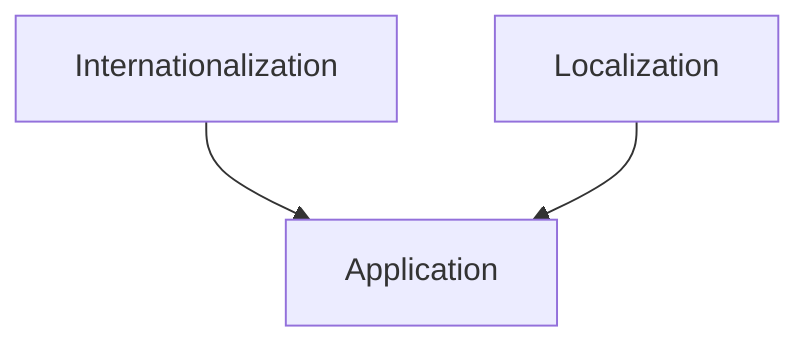

The Globalization subsystem provides both capabilities while maintaining clear architectural separation.

---

# Architectural Vision

The vision of the Globalization subsystem is to make every component of **KUKULCAN.SharedKernel** culture-aware while ensuring that business logic remains completely independent of any specific language or regional implementation.

Rather than scattering localization logic throughout the codebase, the subsystem centralizes all globalization concerns into a cohesive and reusable architectural model.

---

# Design Philosophy

Globalization is treated as a first-class architectural concern rather than an implementation detail.

This philosophy leads to several important principles:

- culture awareness should exist throughout the entire architecture;
- business logic should never contain translated text;
- localization resources should remain external to business rules;
- formatting should always be culture aware;
- resource resolution should be deterministic;
- globalization services should remain framework independent.

---

# Architectural Scope

The Globalization subsystem is responsible for:

- culture identification;
- language management;
- localized resources;
- culture resolution;
- formatting services;
- regional conventions;
- resource providers;
- resource management;
- culture contexts;
- globalization infrastructure.

The subsystem intentionally excludes user interface localization mechanisms, which belong to higher architectural layers.

---

# Architectural Boundaries

The Globalization subsystem collaborates with multiple SharedKernel components while preserving strict separation of responsibilities.

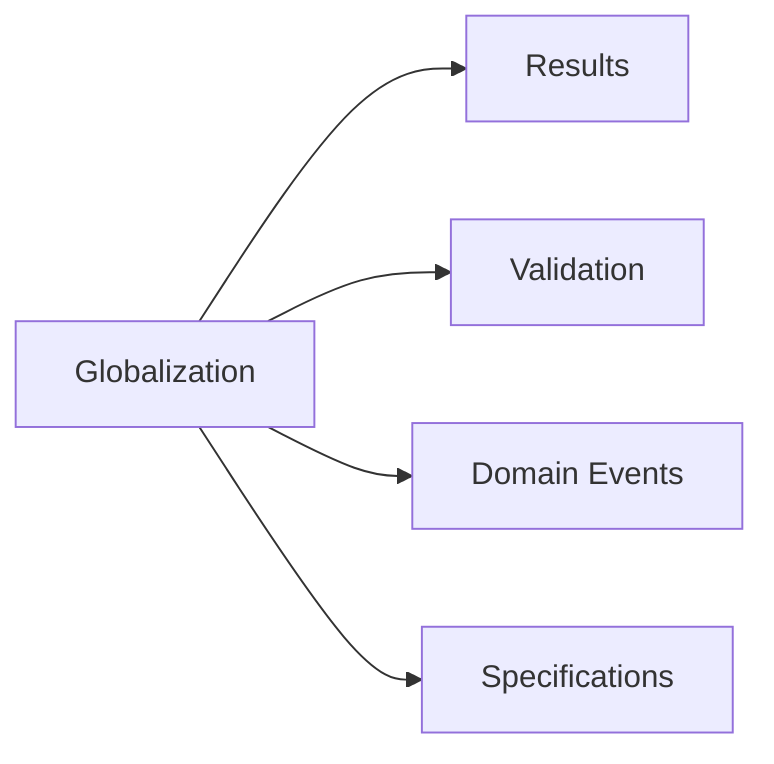

Globalization provides culture-aware services without introducing dependencies upon application-specific frameworks.

---

# Domain Independence

The subsystem is intentionally designed so that Domain Models never depend upon:

- ASP.NET Core localization;
- WPF resources;
- MAUI localization;
- Blazor localization;
- operating system settings;
- dependency injection frameworks.

Instead, Domain Models interact only with abstractions defined inside **KUKULCAN.SharedKernel**.

---

# Enterprise Objectives

The Globalization subsystem is designed to satisfy enterprise software requirements including:

- worldwide deployment;
- multilingual support;
- regional customization;
- extensibility;
- maintainability;
- deterministic behavior;
- thread safety;
- cloud-native scalability.

These objectives ensure that applications built upon KUKULCAN.SharedKernel can evolve internationally without architectural redesign.

---

# Guiding Principles

The subsystem follows several core principles.

## Culture Independence

Business logic should execute correctly regardless of the user's language or country.

---

## Resource Externalization

All user-visible text should originate from localization resources rather than business code.

---

## Deterministic Resolution

Given identical culture information and resource identifiers, resource resolution should always produce identical results.

---

## Extensibility

Adding support for a new language or culture should require minimal changes to existing code.

---

## Framework Independence

The subsystem should remain portable across any .NET application model.

---

# Intended Audience

This document is intended for:

- software architects;
- framework developers;
- backend developers;
- enterprise application developers;
- maintainers of KUKULCAN.SharedKernel.

Readers are expected to have a working knowledge of:

- Domain-Driven Design (DDD);
- Clean Architecture;
- object-oriented programming;
- .NET development.

---

# Document Organization

This document progressively explores the entire Globalization subsystem.

Beginning with its architectural philosophy and design goals, it continues through its core components, culture management, resource resolution, formatting services, caching strategies, thread safety, best practices, antipatterns, versioning strategy, implementation examples, and architectural references.

Each chapter builds upon the previous one, resulting in a complete architectural specification for globalization within **KUKULCAN.SharedKernel**.

---

# Architectural Invariant

> **The Globalization subsystem of KUKULCAN.SharedKernel shall provide a framework-independent, culture-aware, deterministic, extensible, and reusable architecture for internationalization and localization, ensuring that business logic remains independent of language, regional settings, formatting conventions, and localization technologies while supporting worldwide deployment in accordance with the principles of Domain-Driven Design and Clean Architecture.**

This invariant governs every architectural decision described throughout this document.

# 2. Philosophy

The philosophy of the **Globalization** subsystem is founded upon a simple architectural principle:

> **Business logic should be globally applicable, while cultural behavior should remain externally configurable.**

Globalization is not considered a presentation concern, nor merely a collection of translated resources. Instead, it is treated as a fundamental architectural capability that enables software to operate consistently across languages, cultures, regions, and legal jurisdictions without modifying the Domain Model.

Within **KUKULCAN.SharedKernel**, globalization is therefore regarded as a first-class architectural service.

---

## Globalization as a Domain Capability

Business software increasingly operates across multiple countries and regions.

Customers may:

- speak different languages;
- use different currencies;
- follow different calendars;
- format numbers differently;
- interpret dates differently;
- require country-specific legal identifiers.

Despite these differences, the underlying business model should remain stable.

The Domain should express business concepts—not regional implementations.

---

# Separation Between Business and Culture

One of the most important philosophical principles is the separation between:

- business semantics;
- cultural representation.

For example:

The business concept:

```text
Invoice Total
```

is universal.

Its representation may differ:

```text
United States

$1,250.75
```

```text
Spain

1.250,75 €
```

The business value never changes.

Only its representation changes.

---

# Internationalization Before Localization

The subsystem prioritizes **internationalization** over **localization**.

Internationalization provides the architectural foundation.

Localization provides culture-specific content.

Conceptually:

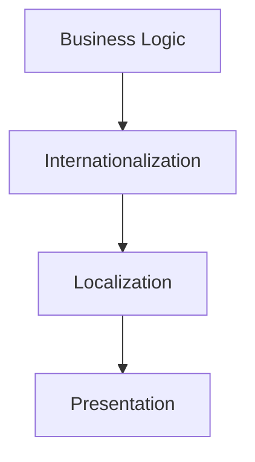

Localization depends on internationalization—not the opposite.

---

# Business Language Remains Universal

The Domain should never be translated.

Business concepts remain expressed using the project's ubiquitous language.

For example:

```text
Customer
```

does not become:

```text
Cliente
```

inside the Domain Model.

Translations belong exclusively to localized resources.

---

# Culture Is Context

Culture is considered contextual information.

It influences:

- formatting;
- resource resolution;
- user interaction.

It should never redefine business behavior unless explicitly modeled as a business rule.

Examples:

Formatting:

```text
31/12/2026
```

versus

```text
12/31/2026
```

Business meaning remains identical.

---

# Localization Data Is Not Business Logic

Localized resources should contain:

- messages;
- labels;
- descriptions;
- UI text;
- documentation.

They should never contain business rules.

Incorrect:

```text
Premium customers receive 15% discount.
```

Correct:

```text
Premium Discount
```

Business calculations belong to the Domain.

---

# Domain Independence

The Globalization subsystem intentionally avoids dependencies upon:

- ASP.NET Core localization;
- ResourceManager implementations;
- web frameworks;
- UI technologies.

Instead, higher architectural layers consume the abstractions provided by **KUKULCAN.SharedKernel**.

---

# Configuration Over Hardcoding

Culture-specific behavior should always be configurable.

Avoid:

```text
if (Country == "Spain")
```

Prefer:

```text
Culture Resolver

↓

Culture Context

↓

Formatting Service
```

Configuration replaces conditional logic.

---

# Resource Externalization

Every user-visible string should originate from a resource provider.

Business code should never contain:

```text
"Customer not found."
```

Instead:

```text
Resource Key

↓

Localized Resource

↓

Displayed Text
```

This approach improves maintainability and enables multilingual support.

---

# Explicit Culture Resolution

Culture selection should never rely upon hidden global state.

Instead, culture should be resolved explicitly through well-defined services.

Conceptually:

```text
Request

↓

Culture Resolver

↓

Culture Context
```

This produces deterministic behavior across all execution environments.

---

# Consistency Across Layers

Every architectural layer should observe the same culture context.

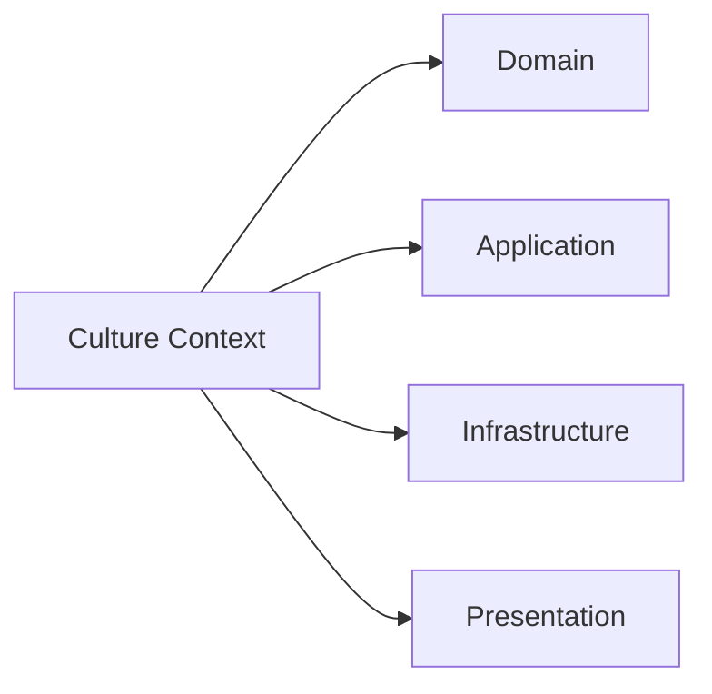

A single culture context promotes consistent behavior throughout the application.

---

# Deterministic Resource Resolution

Resource lookup should always produce identical results given identical inputs.

Inputs include:

- culture;
- resource identifier;
- fallback policy.

The resolution process must never depend upon mutable global state.

---

# Immutability

Globalization objects should generally remain immutable.

Examples include:

- `SupportedCulture`
- `CultureIdentifier`
- `LocalizedString`

Immutability provides:

- thread safety;
- predictability;
- safe reuse.

---

# Extensibility

Supporting additional cultures should require:

- new resource files;
- optional formatting implementations;
- configuration updates.

Existing business logic should remain unchanged.

This philosophy minimizes maintenance costs.

---

# Framework Independence

Globalization services should be portable across:

- ASP.NET Core;
- Console applications;
- Windows Services;
- Background Workers;
- MAUI;
- Blazor;
- Desktop applications.

The Domain should remain unaware of the hosting environment.

---

# Performance Through Simplicity

Performance is achieved through:

- immutable objects;
- lightweight abstractions;
- deterministic algorithms;
- reusable components.

Complex optimization should never compromise architectural clarity.

---

# Architectural Characteristics

The philosophy of the Globalization subsystem promotes:

- culture independence;
- business purity;
- framework independence;
- deterministic behavior;
- reusable abstractions;
- centralized resource management;
- extensibility;
- maintainability.

Together these characteristics establish a robust foundation for international software systems.

---

# Architectural Constraints

The Globalization subsystem shall satisfy the following constraints.

- Business logic remains culture independent.
- User-visible text originates from resources.
- Culture resolution remains deterministic.
- Formatting remains culture aware.
- Localization remains external to the Domain.
- Framework dependencies remain outside the SharedKernel.
- Globalization objects remain immutable whenever practical.

Violating these constraints compromises architectural consistency.

---

# Philosophical Model

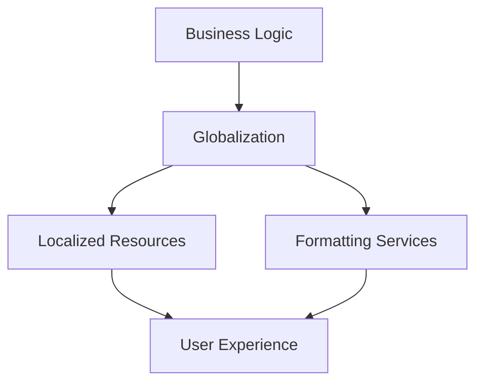

Business logic remains constant.

Globalization adapts its presentation to each culture.

---

# Architectural Invariant

> **The philosophy of the Globalization subsystem within KUKULCAN.SharedKernel shall preserve complete separation between business semantics and cultural representation, ensuring that business logic remains universally applicable while localization, formatting, resource resolution, and regional behavior are provided through immutable, deterministic, framework-independent abstractions that support worldwide deployment in accordance with the principles of Domain-Driven Design and Clean Architecture.**

This invariant defines the philosophical foundation upon which the entire Globalization subsystem is built.

# 3. Design Goals

The Globalization subsystem has been designed to provide a complete, reusable, and technology-independent foundation for internationalization and localization throughout **KUKULCAN.SharedKernel**.

Its objectives extend beyond simple language translation. The subsystem aims to establish a unified globalization model that can be consistently applied across every architectural layer while preserving Domain purity and long-term maintainability.

The design goals described in this chapter guide every architectural decision within the subsystem.

---

## Architectural Principle

Globalization should enable worldwide software without introducing worldwide complexity into the Domain.

> **Business models should remain universal while cultural behavior remains configurable.**

---

# Primary Objectives

The Globalization subsystem has the following primary objectives:

- provide culture-aware services;
- isolate localization from business logic;
- centralize globalization concerns;
- maximize reuse;
- preserve framework independence;
- support worldwide deployment.

These objectives collectively define the architectural direction of the subsystem.

---

# Goal 1 — Culture Independence

Business logic should never depend upon a particular:

- language;
- country;
- locale;
- regional convention.

Instead, cultural behavior should be resolved dynamically.

Conceptually:

```text
Business Logic

↓

Culture Context

↓

Localized Representation
```

The Domain remains globally applicable.

---

# Goal 2 — Framework Independence

The subsystem must remain independent of:

- ASP.NET Core localization;
- desktop localization frameworks;
- UI resource managers;
- dependency injection containers;
- operating system APIs.

All globalization services should be expressed through SharedKernel abstractions.

---

# Goal 3 — Centralized Resource Management

Every localized resource should be resolved through a unified architecture.

Instead of multiple independent resource mechanisms:

```text
Application

↓

Resource Provider

↓

Localized Resource
```

This centralization improves:

- consistency;
- maintainability;
- extensibility.

---

# Goal 4 — Deterministic Behavior

Resource resolution should always produce identical results given identical:

- resource identifiers;
- cultures;
- fallback rules.

Determinism improves:

- testing;
- debugging;
- caching;
- predictability.

---

# Goal 5 — Immutable Globalization Objects

Globalization value objects should remain immutable.

Examples include:

- `SupportedCulture`
- `CultureIdentifier`
- `LocalizedString`

Immutability provides:

- thread safety;
- safe reuse;
- simpler reasoning.

---

# Goal 6 — Extensibility

Supporting additional cultures should require minimal effort.

Ideally:

```text
New Culture

↓

New Resources

↓

Configuration

↓

Ready
```

Business logic should remain unchanged.

---

# Goal 7 — Consistent Culture Resolution

Every component within the application should observe the same culture context.


Consistency prevents conflicting cultural behavior.

---

# Goal 8 — Resource Reuse

The same localized resource should be reusable across:

- APIs;
- background services;
- domain services;
- validation;
- user interfaces.

Duplicate translations should be avoided.

---

# Goal 9 — Separation of Concerns

Responsibilities remain clearly separated.

| Component          | Responsibility           |
|--------------------|--------------------------|
| Resource Provider  | Resource retrieval       |
| Culture Resolver   | Culture selection        |
| Formatting Service | Culture-aware formatting |
| Domain             | Business logic           |

Each component owns a single architectural concern.

---

# Goal 10 — Culture-Aware Formatting

Formatting should always respect the active culture.

Examples include:

- dates;
- times;
- numbers;
- percentages;
- currencies;
- measurements.

Formatting should never rely upon hardcoded conventions.

---

# Goal 11 — Fallback Support

The subsystem should support deterministic fallback behavior.

Conceptually:

```text
Requested Culture

↓

Resource Exists?

↓

Yes → Return Resource

↓

No → Fallback Culture
```

Fallback behavior should be configurable and predictable.

---

# Goal 12 — Technology Agnostic Design

The subsystem should function identically within:

- Web APIs;
- Console applications;
- Windows Services;
- Worker Services;
- MAUI;
- Blazor;
- desktop applications.

Hosting technology must not affect globalization behavior.

---

# Goal 13 — High Reusability

Globalization components should be reusable throughout the entire ecosystem.

Examples:

- `LocalizedString`
- `CultureContext`
- `SupportedCulture`

Reusable abstractions reduce maintenance effort.

---

# Goal 14 — Enterprise Scalability

The architecture should support:

- dozens of languages;
- hundreds of cultures;
- thousands of localized resources.

Scalability should not require architectural redesign.

---

# Goal 15 — Performance

The subsystem should remain lightweight.

Performance is achieved through:

- immutable objects;
- reusable resources;
- deterministic resolution;
- optional caching.

Optimization should never compromise architectural clarity.

---

# Goal 16 — Testability

Every globalization component should be independently testable.

Examples include:

- culture resolution;
- resource lookup;
- formatting;
- fallback behavior.

Deterministic behavior simplifies automated testing.

---

# Goal 17 — Long-Term Evolution

The architecture should evolve through:

- additive features;
- backward compatibility;
- stable public contracts.

Breaking changes should remain exceptional.

---

# Design Strategy

The overall design strategy is illustrated below.

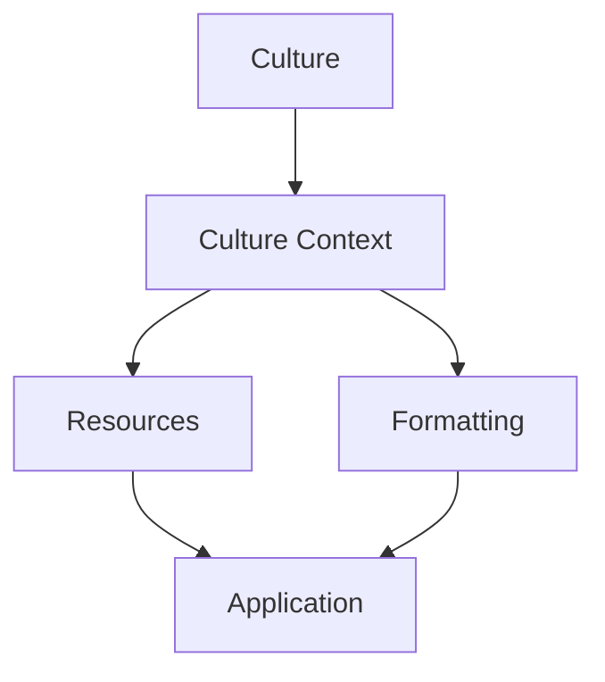

The Culture Context coordinates globalization behavior throughout the application.

---

# Architectural Characteristics

The design goals collectively promote:

- framework independence;
- deterministic execution;
- immutable abstractions;
- centralized resource management;
- extensibility;
- maintainability;
- scalability;
- worldwide usability.

These characteristics define the architectural quality of the subsystem.

---

# Architectural Constraints

The Globalization subsystem shall satisfy the following constraints.

- Business logic remains culture independent.
- Resource management remains centralized.
- Formatting remains culture aware.
- Globalization objects remain immutable.
- Resource resolution remains deterministic.
- Components remain framework independent.
- Public contracts remain stable.

Violating these constraints reduces portability and maintainability.

---

# Architectural Invariant

> **The design of the Globalization subsystem within KUKULCAN.SharedKernel shall provide a centralized, immutable, deterministic, reusable, extensible, framework-independent, and culture-aware architecture that separates business semantics from cultural representation while enabling consistent internationalization and localization across every architectural layer in accordance with the principles of Domain-Driven Design and Clean Architecture.**

This invariant governs every design decision within the Globalization subsystem.

# 4. Architectural Goals

The architectural goals of the **Globalization** subsystem define the long-term structural objectives that guide its evolution within **KUKULCAN.SharedKernel**.

While the previous chapter described the functional design goals, this chapter focuses on the architectural qualities that ensure the subsystem remains maintainable, extensible, scalable, and technology-independent throughout its lifecycle.

These goals establish the role of the Globalization subsystem as a shared architectural service that supports every layer of the application without compromising the integrity of the Domain Model.

---

## Architectural Principle

Globalization should be a foundational capability of the architecture rather than a feature of the user interface.

> **Culture belongs to the application context—not to the Domain Model.**

---

# Goal 1 — Preserve Domain Purity

The highest architectural priority is preserving the purity of the Domain.

Business entities, Value Objects, Aggregates, Specifications, and Domain Services must never contain:

- translated text;
- UI resources;
- framework localization APIs;
- culture-specific formatting logic.

Instead, the Domain consumes only culture-independent abstractions.

---

# Goal 2 — Establish a Single Globalization Model

Every component within **KUKULCAN.SharedKernel** should rely upon a unified globalization architecture.

Rather than allowing each subsystem to implement its own localization mechanism, all globalization services are centralized.

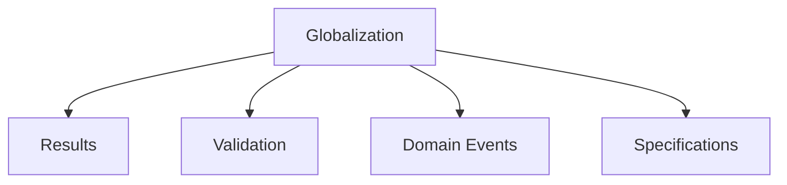

This prevents architectural fragmentation.

---

# Goal 3 — Minimize Coupling

Globalization should introduce minimal dependencies.

The subsystem should expose only lightweight abstractions.

Consumers should never depend directly upon:

- localization frameworks;
- operating system APIs;
- resource file implementations;
- UI technologies.

Low coupling improves portability.

---

# Goal 4 — Maximize Cohesion

Every globalization component should own exactly one architectural responsibility.

Examples:

| Component           | Responsibility                         |
|---------------------|----------------------------------------|
| `CultureResolver`   | Determine the active culture           |
| `ResourceProvider`  | Retrieve localized resources           |
| `ResourceManager`   | Coordinate resource lookup             |
| `FormattingService` | Format culture-sensitive values        |
| `CultureContext`    | Represent the active execution culture |

High cohesion simplifies maintenance.

---

# Goal 5 — Support Worldwide Deployment

The architecture should support deployment in any geographical region.

Examples include:

- North America;
- South America;
- Europe;
- Asia;
- Africa;
- Oceania.

Adding support for a new region should not require redesigning the subsystem.

---

# Goal 6 — Technology Independence

The Globalization subsystem should function consistently regardless of hosting technology.

Supported environments include:

- ASP.NET Core;
- Worker Services;
- Console applications;
- MAUI;
- Blazor;
- Desktop applications.

Hosting technology should never influence globalization behavior.

---

# Goal 7 — Culture Context Propagation

The active culture should propagate consistently throughout the entire application.

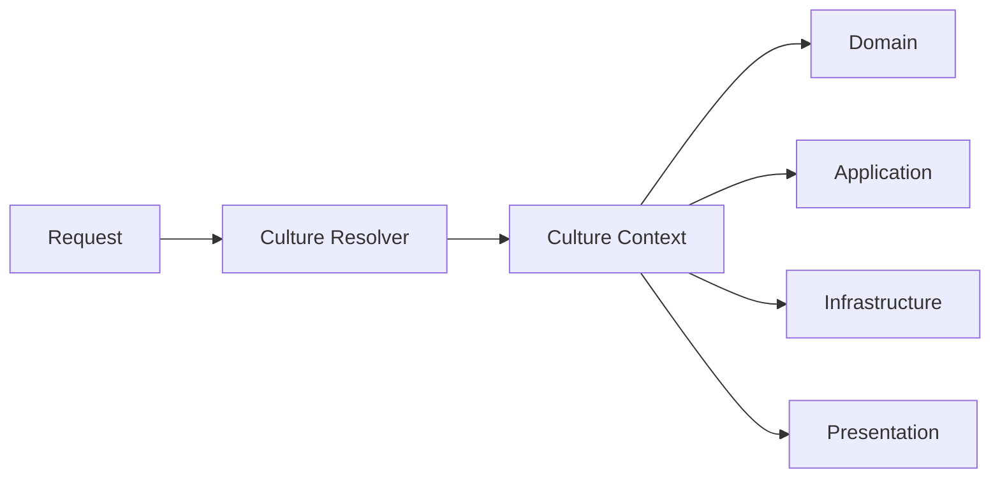

A single execution context guarantees consistent behavior.

---

# Goal 8 — Deterministic Resource Resolution

Resource lookup should always produce predictable results.

Given:

- identical culture;
- identical resource identifier;
- identical fallback policy;

the subsystem should always resolve the same localized resource.

Predictability simplifies testing and caching.

---

# Goal 9 — Stable Public Contracts

Public globalization APIs should evolve conservatively.

Core abstractions such as:

- `SupportedCulture`;
- `LocalizedString`;
- `CultureContext`;
- `CultureResolver`;

are considered architectural contracts.

Breaking changes should be reserved for major releases.

---

# Goal 10 — Extensible Resource Providers

The subsystem should support multiple resource implementations without modifying consumer code.

Examples include:

- embedded resources;
- JSON resources;
- XML resources;
- database-backed resources;
- remote localization services.

Consumers interact only with abstractions.

---

# Goal 11 — Consistent Formatting

Formatting behavior should remain consistent across all architectural layers.

Supported formatting includes:

- dates;
- times;
- currencies;
- numbers;
- percentages;
- measurements.

Formatting services should produce identical results regardless of where they are invoked.

---

# Goal 12 — High Testability

Every globalization component should be independently testable.

Deterministic abstractions enable straightforward unit testing without requiring:

- UI frameworks;
- operating system configuration;
- network services.

Testability is achieved through architectural simplicity.

---

# Goal 13 — Scalability

The architecture should scale naturally as the number of:

- supported cultures;
- localized resources;
- formatting providers;
- applications;

continues to grow.

Scalability should be achieved through extensibility rather than redesign.

---

# Goal 14 — Thread Safety

Globalization services should safely support concurrent execution.

This is primarily achieved through:

- immutable objects;
- stateless services;
- deterministic resource resolution.

Concurrency should require minimal synchronization.

---

# Goal 15 — Performance

Performance should result from sound architectural design.

The subsystem favors:

- immutable objects;
- reusable components;
- optional caching;
- lightweight abstractions;
- deterministic algorithms.

Optimization must never compromise maintainability.

---

# Goal 16 — Long-Term Maintainability

The architecture should remain understandable after many years of evolution.

Maintainability is promoted through:

- explicit responsibilities;
- stable abstractions;
- centralized globalization logic;
- clear dependency direction.

Architectural simplicity is preferred over clever implementations.

---

# Goal 17 — Enterprise Readiness

The subsystem is intended for enterprise software operating across multiple jurisdictions.

The architecture therefore emphasizes:

- stability;
- portability;
- extensibility;
- predictability;
- maintainability.

Enterprise readiness is a primary architectural objective.

---

# Architectural Strategy

The overall architectural strategy is illustrated below.

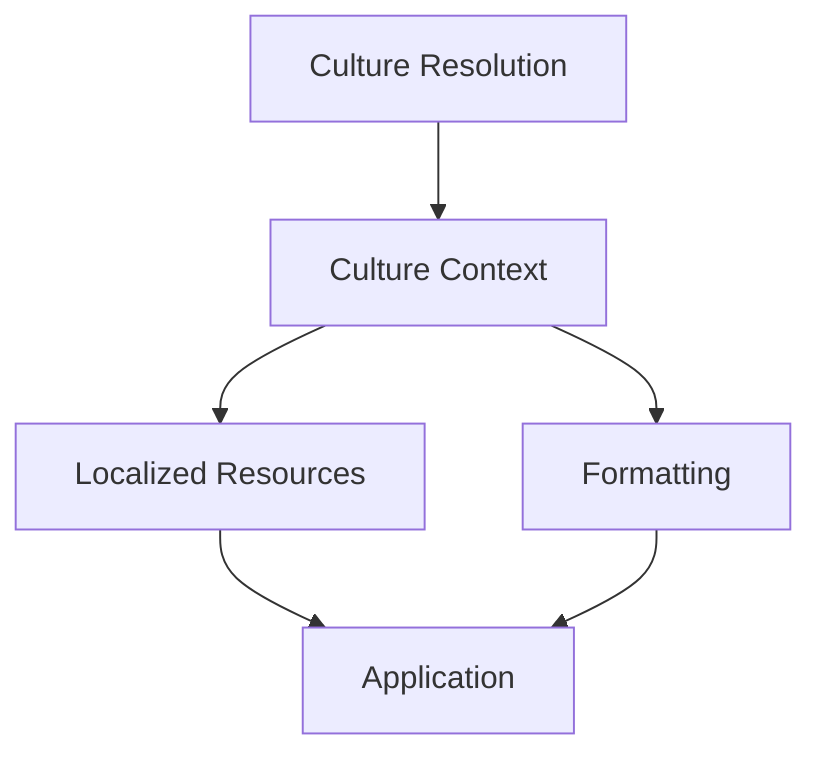

Culture drives every globalization service while remaining external to the Domain.

---

# Architectural Characteristics

The architectural goals establish a subsystem that is:

- framework independent;
- culture aware;
- deterministic;
- reusable;
- extensible;
- scalable;
- thread safe;
- maintainable;
- enterprise ready.

Together these characteristics define the architectural identity of the Globalization subsystem.

---

# Architectural Constraints

The Globalization subsystem shall satisfy the following constraints.

- Preserve Domain purity.
- Centralize globalization services.
- Maintain low coupling.
- Promote high cohesion.
- Support worldwide deployment.
- Preserve stable public contracts.
- Ensure deterministic behavior.
- Remain framework independent.

Violating these constraints weakens the architectural foundation of the SharedKernel.

---

# Architectural Invariant

> **The Globalization subsystem within KUKULCAN.SharedKernel shall function as a centralized, framework-independent architectural service that provides deterministic culture management, resource resolution, formatting, and localization capabilities while preserving Domain purity, maintaining stable public abstractions, supporting worldwide deployment, and ensuring complete separation between business semantics and cultural representation in accordance with the principles of Domain-Driven Design and Clean Architecture.**

This invariant defines the long-term architectural objectives of the Globalization subsystem.

# 5. Globalization Fundamentals

The Globalization subsystem is built upon a small set of architectural concepts that together provide a complete foundation for culture-aware enterprise applications.

These concepts define how culture information is represented, propagated, resolved, and consumed throughout **KUKULCAN.SharedKernel**.

Rather than treating globalization as a UI feature, the subsystem models it as a cross-cutting architectural capability that enables every layer of the application to operate consistently regardless of language, country, or regional conventions.

---

## Architectural Principle

Globalization should be expressed through explicit architectural abstractions rather than implicit platform behavior.

> **Culture should be modeled, propagated, and consumed intentionally—not discovered accidentally.**

---

# Definition of Globalization

Within **KUKULCAN.SharedKernel**, **Globalization** is defined as the architectural capability that allows software to operate correctly across multiple:

- languages;
- countries;
- regions;
- calendars;
- currencies;
- numbering systems;
- cultural conventions.

Globalization is therefore broader than localization alone.

---

# Fundamental Concepts

The subsystem is composed of several core concepts.

| Concept              | Purpose                                                |
|----------------------|--------------------------------------------------------|
| Culture              | Represents a language and regional convention.         |
| Localization         | Provides culture-specific resources.                   |
| Internationalization | Enables culture-independent software architecture.     |
| Formatting           | Converts values into culture-specific representations. |
| Resource Resolution  | Locates localized resources.                           |
| Culture Context      | Represents the active execution culture.               |

These concepts collectively define the globalization model.

---

# Culture

A **Culture** represents the linguistic and regional characteristics of an execution environment.

Examples include:

```text
en-US
```

```text
en-GB
```

```text
es-ES
```

```text
es-MX
```

A culture influences:

- formatting;
- localization;
- calendars;
- currency;
- sorting;
- comparison.

It does not alter business semantics.

---

# Language

Language identifies the human language used to communicate with users.

Examples:

```text
English
```

```text
Spanish
```

```text
French
```

Language alone is insufficient to determine formatting behavior.

For example:

```text
English

↓

United States
```

and

```text
English

↓

United Kingdom
```

share a language but differ culturally.

---

# Region

A region defines geographical conventions.

Examples include:

- currency;
- measurement systems;
- date formats;
- legal identifiers;
- postal formats.

Language and region together form a complete culture.

---

# Internationalization (i18n)

Internationalization prepares software for multiple cultures without changing business logic.

Its responsibilities include:

- abstraction;
- resource externalization;
- Unicode support;
- culture-aware formatting;
- configurable localization.

Internationalization is implemented before localization.

---

# Localization (l10n)

Localization adapts software to a particular culture.

Examples include:

- translated resources;
- localized messages;
- regional symbols;
- formatting conventions.

Localization consumes the infrastructure established by internationalization.

---

# Culture Context

Every execution occurs within a **Culture Context**.

The Culture Context determines:

- active culture;
- formatting rules;
- resource selection;
- fallback behavior.

Conceptually:

```text
Execution

↓

Culture Context

↓

Localized Behavior
```

The context remains explicit throughout the architecture.

---

# Resource

A **Resource** represents a localized piece of information.

Examples include:

- messages;
- labels;
- descriptions;
- error text;
- documentation.

Resources never contain business logic.

---

# Resource Identifier

Resources are referenced through stable identifiers.

Example:

```text
Customer.NotFound
```

rather than:

```text
Customer not found.
```

Stable identifiers enable:

- translation;
- caching;
- maintenance;
- consistency.

---

# Resource Resolution

Resource resolution converts:

```text
Resource Identifier

+

Culture

↓

Localized Resource
```

The process remains deterministic and framework independent.

---

# Formatting

Formatting converts internal values into culture-aware representations.

Examples include:

- numbers;
- dates;
- currencies;
- percentages;
- measurements.

Formatting affects presentation only.

Business values remain unchanged.

---

# Fallback Culture

Requested resources may not always exist.

The subsystem therefore supports fallback behavior.

Conceptually:

```text
Requested Culture

↓

Resource Exists?

↓

Yes

↓

Return Resource

↓

No

↓

Fallback Culture
```

Fallback rules remain configurable.

---

# Neutral vs Specific Cultures

The subsystem distinguishes between:

## Neutral Culture

Example:

```text
en
```

Neutral cultures describe language only.

---

## Specific Culture

Example:

```text
en-US
```

Specific cultures describe both language and regional behavior.

Specific cultures provide more precise formatting.

---

# Resource Hierarchy

Localized resources naturally form a hierarchy.

Example:

```text
Default

↓

English

↓

English (United States)
```

This hierarchy supports graceful fallback.

---

# Cultural Representation

Business information remains culture independent.

Representation becomes culture aware.

Example:

Business value:

```text
1250.75
```

Representations:

```text
en-US

1,250.75
```

```text
es-ES

1.250,75
```

Only presentation changes.

---

# Explicit Resolution

The subsystem avoids implicit platform behavior.

Preferred model:

```text
Request

↓

Culture Resolver

↓

Culture Context
```

Explicit resolution improves predictability.

---

# Globalization Pipeline

The overall globalization workflow is illustrated below.

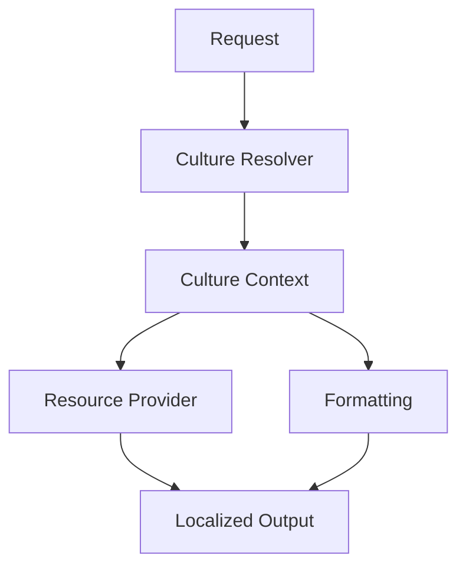

Every globalization service operates through the active Culture Context.

---

# Architectural Characteristics

The Globalization Fundamentals establish:

- explicit culture modeling;
- centralized resource management;
- deterministic resolution;
- framework independence;
- culture-aware formatting;
- immutable globalization objects.

These characteristics provide the foundation for the remaining chapters.

---

# Architectural Constraints

The Globalization subsystem shall satisfy the following constraints.

- Culture remains explicit.
- Business logic remains culture independent.
- Resources remain externalized.
- Formatting remains culture aware.
- Resource identifiers remain stable.
- Resolution remains deterministic.
- Localization remains configurable.

Violating these constraints weakens the globalization architecture.

---

# Architectural Invariant

> **The Globalization Fundamentals of KUKULCAN.SharedKernel shall define globalization through explicit, immutable, deterministic, and framework-independent architectural abstractions that separate business semantics from cultural representation, centralize resource management, standardize culture resolution, and provide a consistent foundation for internationalization and localization across every architectural layer in accordance with the principles of Domain-Driven Design and Clean Architecture.**

This invariant establishes the conceptual foundation upon which the entire Globalization subsystem is constructed.

# 6. Localization Taxonomy

The Localization Taxonomy defines the conceptual classification of all localization-related elements within the **Globalization** subsystem of **KUKULCAN.SharedKernel**.

Rather than treating localization as a collection of unrelated services, the subsystem organizes every localization concern into clearly defined architectural categories.

This taxonomy establishes a common vocabulary that promotes consistency across the Domain, Application, Infrastructure, and Presentation layers while preserving complete separation of responsibilities.

---

## Architectural Principle

Every localization concept should belong to one—and only one—architectural category.

> **Clear classification leads to clear responsibilities.**

---

# Purpose

The Localization Taxonomy exists to:

- standardize terminology;
- classify localization concepts;
- eliminate architectural ambiguity;
- simplify subsystem evolution;
- promote consistent implementation;
- improve maintainability.

A well-defined taxonomy reduces conceptual complexity.

---

# High-Level Classification

The Globalization subsystem classifies localization into six major categories.

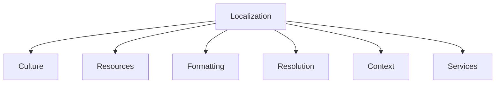

Each category owns a distinct architectural concern.

---

# Category 1 — Culture

Culture defines the linguistic and regional identity of an execution environment.

Representative concepts include:

- `SupportedCulture`
- `CultureIdentifier`
- neutral cultures
- specific cultures
- culture metadata

Responsibilities include:

- identifying cultures;
- representing locales;
- defining regional behavior.

Culture describes **who** the user is.

---

# Category 2 — Resources

Resources represent localized information.

Examples include:

- translated text;
- labels;
- descriptions;
- messages;
- documentation.

Representative components include:

- `LocalizedResource`
- `LocalizedString`
- resource identifiers

Resources describe **what** should be displayed.

---

# Category 3 — Formatting

Formatting converts internal values into culture-specific representations.

Examples include:

- numbers;
- currencies;
- percentages;
- dates;
- times;
- measurements.

Formatting answers:

```text
How should this value appear?
```

Formatting never changes business values.

---

# Category 4 — Resolution

Resolution determines which localized resource should be used.

Representative services include:

- `CultureResolver`
- `ResourceProvider`
- `ResourceManager`

Responsibilities include:

- culture selection;
- fallback evaluation;
- resource lookup;
- deterministic resolution.

Resolution determines **which** resource is returned.

---

# Category 5 — Context

Context represents the active globalization environment.

Representative component:

- `CultureContext`

Responsibilities include:

- current culture;
- current region;
- formatting configuration;
- execution scope.

Context defines **where** globalization decisions occur.

---

# Category 6 — Services

Services coordinate globalization operations.

Examples include:

- formatting services;
- resource services;
- localization providers;
- culture services.

Services perform globalization operations while remaining stateless whenever possible.

---

# Taxonomy Relationships

The categories collaborate while maintaining architectural independence.

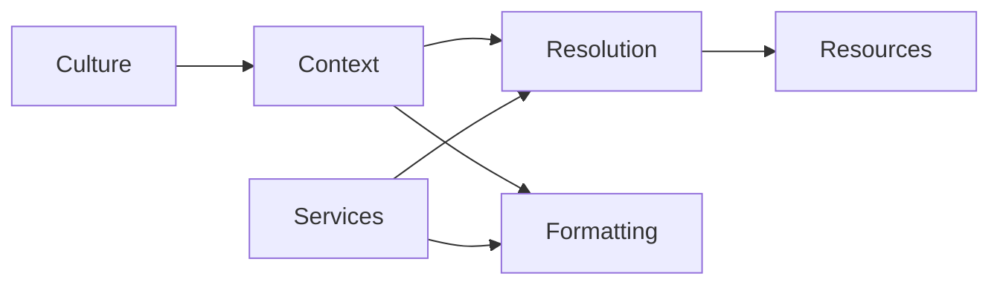

Each dependency follows a single direction.

---

# Culture Taxonomy

Culture itself can be further classified.

```text
Culture

├── Neutral Culture

└── Specific Culture
```

Examples:

Neutral:

```text
en
```

Specific:

```text
en-US
```

Specific cultures inherit language while defining regional behavior.

---

# Resource Taxonomy

Resources may also be categorized.

```text
Localized Resource

├── Messages

├── Labels

├── Descriptions

├── Errors

└── Documentation
```

Each resource type serves a different communication purpose.

---

# Formatting Taxonomy

Formatting responsibilities include:

```text
Formatting

├── Date

├── Time

├── Number

├── Currency

├── Percentage

└── Measurement
```

Every formatting operation remains culture aware.

---

# Resolution Taxonomy

Resource resolution consists of several logical stages.

```text
Resolution

├── Culture Resolution

├── Resource Lookup

├── Fallback Evaluation

└── Localized Result
```

Each stage remains deterministic.

---

# Service Taxonomy

Globalization services may be classified as:

```text
Services

├── Resource Services

├── Formatting Services

├── Culture Services

└── Resolution Services
```

Each service category owns a single architectural responsibility.

---

# Architectural Separation

The taxonomy intentionally separates:

- representation;
- behavior;
- coordination.

For example:

| Category   | Owns              |
|------------|-------------------|
| Culture    | Identity          |
| Resources  | Localized content |
| Formatting | Representation    |
| Resolution | Selection         |
| Context    | Execution state   |
| Services   | Coordination      |

Responsibilities never overlap.

---

# Layer Independence

Every taxonomy category remains usable throughout:

- Domain;
- Application;
- Infrastructure;
- Presentation.

No category depends upon presentation technology.

---

# Extensibility

The taxonomy supports future expansion.

Examples include:

- additional formatting providers;
- new resource sources;
- custom cultures;
- specialized localization services.

New categories should rarely be required.

Instead, existing categories should grow through extension.

---

# Scalability

Because each concept belongs to a well-defined category, the subsystem naturally scales to:

- hundreds of cultures;
- thousands of localized resources;
- multiple resource providers;
- enterprise deployments.

The taxonomy remains stable as the system grows.

---

# Architectural Characteristics

The Localization Taxonomy provides:

- conceptual clarity;
- explicit responsibilities;
- low coupling;
- high cohesion;
- deterministic organization;
- scalable architecture.

These characteristics improve both implementation and maintenance.

---

# Architectural Constraints

The Localization Taxonomy shall satisfy the following constraints.

- Every concept belongs to exactly one category.
- Categories remain cohesive.
- Dependencies remain directional.
- Categories remain framework independent.
- Responsibilities remain explicit.
- Categories remain extensible.
- Architectural terminology remains consistent.

Violating these constraints introduces ambiguity and unnecessary complexity.

---

# Localization Taxonomy Model

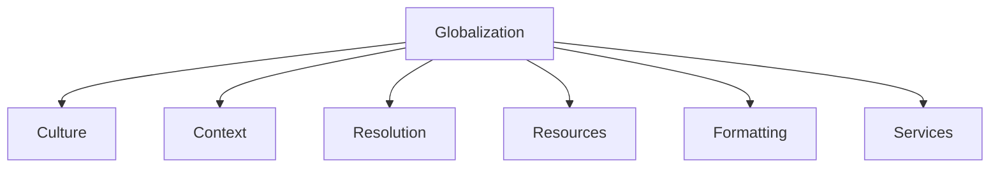

This taxonomy serves as the conceptual map of the Globalization subsystem.

---

# Architectural Invariant

> **Every localization concept within the Globalization subsystem of KUKULCAN.SharedKernel shall belong to a single well-defined architectural category with explicit responsibilities, deterministic relationships, and framework-independent abstractions, ensuring conceptual consistency, architectural cohesion, extensibility, and long-term maintainability while preserving the principles of Domain-Driven Design and Clean Architecture.**

This invariant governs the conceptual organization of the Globalization subsystem.

# 7. Core Components

The **Core Components** of the Globalization subsystem define the primary architectural building blocks responsible for implementing internationalization and localization throughout **KUKULCAN.SharedKernel**.

Each component has a clearly defined responsibility and collaborates with the others through stable, framework-independent abstractions.

Together, these components establish a cohesive globalization architecture that supports:

- culture management;
- localized resources;
- formatting;
- deterministic resource resolution;
- worldwide deployment.

---

## Architectural Principle

Every globalization component should own exactly one architectural responsibility.

> **Small, cohesive components produce a predictable and maintainable globalization architecture.**

---

# Purpose

The Core Components exist to provide:

- explicit architectural boundaries;
- reusable globalization abstractions;
- centralized culture management;
- deterministic localization;
- technology-independent services.

Each component contributes one specific capability to the overall globalization model.

---

# Component Overview

The Globalization subsystem consists of the following primary components.

| Component           | Primary Responsibility                            |
|---------------------|---------------------------------------------------|
| `SupportedCulture`  | Represents a supported culture within the system. |
| `CultureIdentifier` | Provides a strongly typed culture identifier.     |
| `LocalizedString`   | Represents localized textual content.             |
| `LocalizedResource` | Encapsulates a localized resource entry.          |
| `ResourceProvider`  | Retrieves localized resources.                    |
| `ResourceManager`   | Coordinates resource lookup and fallback.         |
| `CultureResolver`   | Determines the active culture.                    |
| `CultureContext`    | Represents the active globalization context.      |

Each component remains focused on a single architectural concern.

---

# Component Relationships

The components collaborate according to the following dependency model.

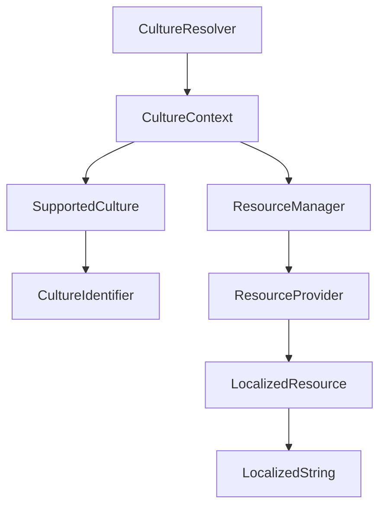

Dependencies always flow toward more specialized responsibilities.

---

# Component Responsibilities

The responsibilities of each component are intentionally isolated.

---

## SupportedCulture

Represents a culture officially supported by the application.

Responsibilities include:

- culture metadata;
- language information;
- regional information;
- formatting capabilities.

---

## CultureIdentifier

Provides a strongly typed representation of a culture identifier.

Examples:

```text
en-US
```

```text
es-ES
```

The identifier removes reliance upon raw strings throughout the Domain.

---

## LocalizedString

Represents localized textual content.

Responsibilities include:

- localized value;
- originating culture;
- optional fallback metadata.

It is the primary value object returned to consumers.

---

## LocalizedResource

Represents a resource entry before conversion into a localized string.

Responsibilities include:

- resource identifier;
- localized value;
- culture metadata;
- version information.

---

## ResourceProvider

Responsible for obtaining localized resources from an underlying source.

Potential implementations include:

- embedded resources;
- JSON;
- XML;
- database;
- remote services.

Consumers remain unaware of the implementation.

---

## ResourceManager

Coordinates the complete resource resolution process.

Responsibilities include:

- provider selection;
- fallback evaluation;
- resource lookup;
- caching coordination.

It serves as the orchestration layer of localization.

---

## CultureResolver

Determines which culture should be active for the current execution.

Possible inputs include:

- HTTP headers;
- user preferences;
- configuration;
- application defaults.

Resolution remains deterministic.

---

## CultureContext

Represents the active globalization environment.

It contains:

- current culture;
- formatting configuration;
- localization context.

The Culture Context is consumed throughout the architecture.

---

# Architectural Separation

Each component performs a distinct role.

```text
Culture

↓

Context

↓

Resolution

↓

Resource

↓

Localized String
```

No component duplicates another's responsibility.

---

# Component Lifecycle

The typical execution flow is shown below.

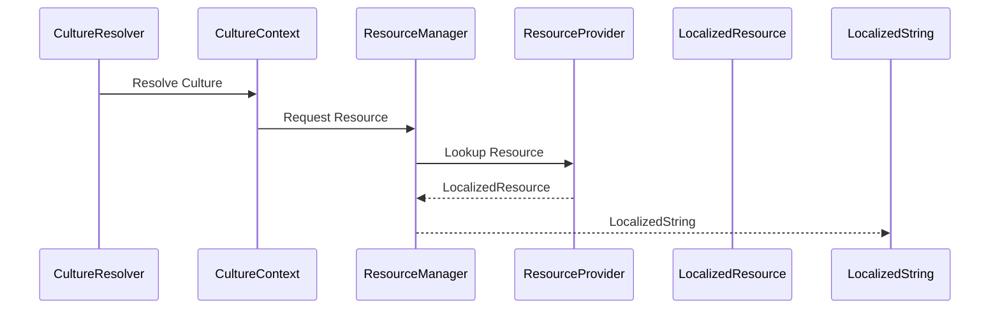

The resulting localized value is then consumed by the application.

---

# Layer Placement

The Core Components belong to different conceptual layers within the SharedKernel.

| Layer               | Components                                                 |
|---------------------|------------------------------------------------------------|
| Domain Abstractions | `SupportedCulture`, `CultureIdentifier`, `LocalizedString` |
| Coordination        | `CultureContext`, `CultureResolver`, `ResourceManager`     |
| Resource Access     | `ResourceProvider`, `LocalizedResource`                    |

This separation promotes low coupling.

---

# Immutability

Core globalization objects should remain immutable whenever possible.

Examples include:

- `SupportedCulture`
- `CultureIdentifier`
- `LocalizedString`
- `LocalizedResource`

Immutable objects naturally provide:

- thread safety;
- predictability;
- reuse.

---

# Framework Independence

None of the Core Components should depend upon:

- ASP.NET Core;
- MAUI;
- WPF;
- Blazor;
- operating system APIs.

All interactions occur through SharedKernel abstractions.

---

# Extensibility

Each component supports extension through composition.

Examples:

- custom `ResourceProvider`;
- custom `CultureResolver`;
- specialized formatting services.

Existing public contracts remain unchanged.

---

# Scalability

The component model naturally supports:

- multiple cultures;
- multiple providers;
- multiple applications;
- enterprise deployments.

Scaling the subsystem does not require structural redesign.

---

# Architectural Characteristics

The Core Components collectively provide:

- explicit responsibilities;
- immutable abstractions;
- deterministic behavior;
- centralized coordination;
- framework independence;
- extensibility;
- enterprise scalability.

These characteristics define the structural foundation of the Globalization subsystem.

---

# Architectural Constraints

The Core Components shall satisfy the following constraints.

- One responsibility per component.
- Immutable value objects whenever practical.
- Framework-independent abstractions.
- Stable public contracts.
- Deterministic collaboration.
- Explicit dependency direction.
- Technology-agnostic implementation.

Violating these constraints weakens architectural cohesion.

---

# Component Architecture


This architecture remains stable regardless of the underlying localization technology.

---

# Architectural Invariant

> **Every Core Component of the Globalization subsystem within KUKULCAN.SharedKernel shall own exactly one architectural responsibility, collaborate exclusively through stable framework-independent abstractions, preserve deterministic behavior, maintain explicit dependency direction, and collectively provide a reusable, extensible, immutable, and enterprise-ready foundation for internationalization and localization in accordance with the principles of Domain-Driven Design and Clean Architecture.**

This invariant defines the structural contract of the Globalization subsystem.

# 7.1. SupportedCulture

`SupportedCulture` is the foundational value object that represents a culture officially supported by **KUKULCAN.SharedKernel**.

It provides a strongly typed, immutable representation of a culture that can safely participate in Domain logic, resource resolution, formatting services, and application configuration without exposing implementation details from the underlying platform.

Unlike `System.Globalization.CultureInfo`, `SupportedCulture` is a Domain abstraction.

It represents only the information required by the architecture while remaining completely independent of any framework-specific globalization implementation.

---

## Architectural Principle

Supported cultures are business-supported capabilities rather than platform objects.

> **A SupportedCulture represents what the application supports—not what the operating system provides.**

---

# Purpose

`SupportedCulture` exists to:

- represent supported cultures;
- eliminate raw culture strings;
- centralize culture metadata;
- simplify resource resolution;
- support deterministic formatting;
- improve Domain readability.

The object becomes the canonical representation of culture throughout the SharedKernel.

---

# Architectural Position

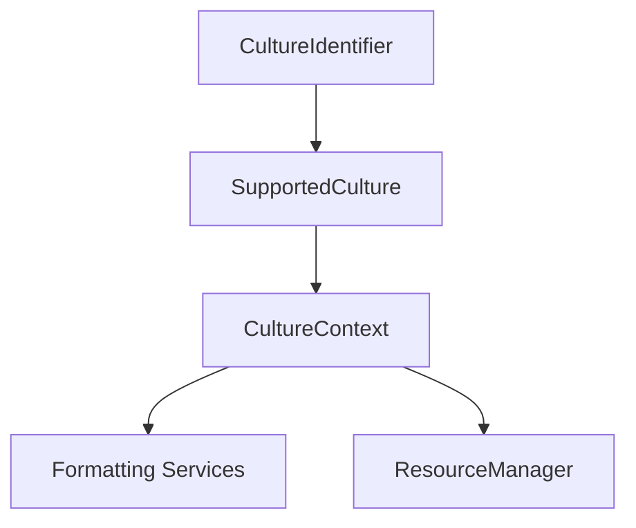

`SupportedCulture` serves as the bridge between culture identification and globalization services.

---

# Responsibilities

`SupportedCulture` is responsible for:

- representing a supported culture;
- exposing language information;
- exposing regional information;
- indicating whether the culture is neutral or specific;
- providing immutable culture metadata.

It is **not** responsible for:

- resolving cultures;
- formatting values;
- retrieving resources;
- managing execution context.

---

# Conceptual Structure

Conceptually, a `SupportedCulture` contains:

```text
SupportedCulture

├── Culture Identifier

├── Language

├── Region

├── Display Name

├── Native Name

├── Is Neutral

└── Is Default
```

All properties remain immutable.

---

# Identity

Every `SupportedCulture` is uniquely identified by its `CultureIdentifier`.

Examples:

```text
en-US
```

```text
es-ES
```

```text
es-MX
```

Two cultures with the same identifier are considered equal.

---

# Neutral vs Specific Cultures

A culture may be classified as either:

## Neutral

Represents language only.

Example:

```text
en
```

---

## Specific

Represents language and regional conventions.

Example:

```text
en-US
```

Specific cultures provide complete formatting behavior.

---

# Language

Every supported culture exposes its primary language.

Examples:

```text
English
```

```text
Spanish
```

Language information assists:

- localization;
- display;
- resource grouping.

---

# Region

Specific cultures also expose regional information.

Examples:

```text
United States
```

```text
Spain
```

```text
Mexico
```

Regional information influences formatting behavior but not business semantics.

---

# Display Name

A supported culture may expose a human-readable display name.

Examples:

```text
English (United States)
```

```text
Spanish (Spain)
```

Display names are intended for user-facing scenarios.

---

# Native Name

The native name represents how the culture identifies itself.

Examples:

```text
English (United States)
```

```text
Español (España)
```

Native names improve multilingual user experiences.

---

# Default Culture

One supported culture may be designated as the application's default culture.

The default culture participates in:

- fallback resolution;
- initial application configuration;
- missing resource handling.

Only one default culture should exist.

---

# Immutability

`SupportedCulture` is immutable.

Once created:

- identifier;
- language;
- region;
- display information;

never change.

Immutability provides:

- thread safety;
- deterministic behavior;
- safe reuse.

---

# Equality

Equality is determined exclusively by the culture identifier.

Conceptually:

```text
Culture Identifier

↓

Equality
```

Display names do not affect equality.

---

# Thread Safety

Because every instance is immutable:

```text
SupportedCulture
```

is inherently thread safe.

Instances may safely be shared across:

- requests;
- threads;
- background workers;
- repositories;
- formatting services.

No synchronization is required.

---

# Collaboration

`SupportedCulture` collaborates with:

- `CultureIdentifier`
- `CultureContext`
- `CultureResolver`
- `ResourceManager`
- formatting services

It never depends upon higher-level architectural components.

---

# Typical Lifecycle

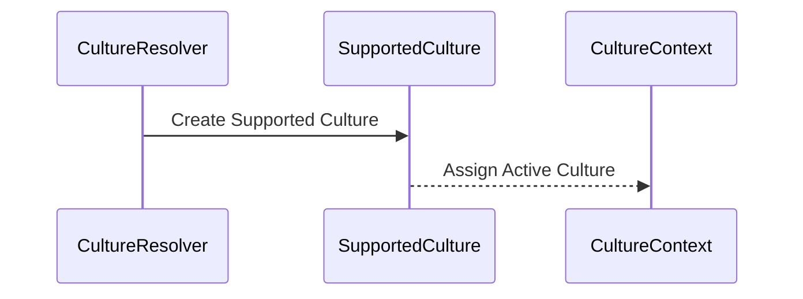

After construction, the object remains unchanged.

---

# Layer Placement

`SupportedCulture` belongs to the Domain abstraction layer.

It may safely be consumed by:

- Domain;
- Application;
- Infrastructure;
- Presentation.

The abstraction remains stable across every architectural layer.

---

# Extensibility

Future versions may extend `SupportedCulture` with additional metadata.

Examples include:

- calendar preferences;
- numbering systems;
- measurement systems;
- writing direction.

Such additions should remain backward compatible.

---

# Performance

Instances should be lightweight.

Typical usage favors:

- singleton instances;
- cached culture collections;
- immutable reuse.

Repeated allocations should generally be unnecessary.

---

# Architectural Characteristics

`SupportedCulture` provides:

- immutable representation;
- strong typing;
- explicit identity;
- deterministic equality;
- framework independence;
- thread safety;
- enterprise scalability.

These characteristics make it suitable as the canonical culture abstraction.

---

# Architectural Constraints

`SupportedCulture` shall satisfy the following constraints.

- Immutable after construction.
- Uniquely identified by `CultureIdentifier`.
- Framework independent.
- Thread safe.
- Value-object semantics.
- No formatting behavior.
- No resource resolution behavior.

Violating these constraints compromises architectural consistency.

---

# Architectural Model

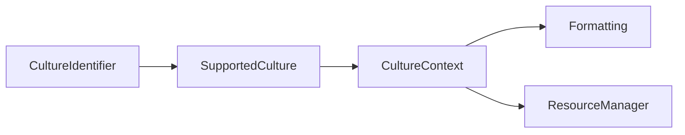

The culture abstraction becomes the central building block of globalization.

---

# Architectural Invariant

> **Every SupportedCulture within KUKULCAN.SharedKernel shall be an immutable, framework-independent value object uniquely identified by a CultureIdentifier and responsible exclusively for representing a supported culture together with its language, regional, and descriptive metadata, while remaining free of formatting logic, resource resolution behavior, mutable state, and infrastructure dependencies in accordance with the principles of Domain-Driven Design and Clean Architecture.**

This invariant defines the architectural contract of `SupportedCulture`.

# 7.2. CultureIdentifier

`CultureIdentifier` is the strongly typed Value Object that uniquely identifies a culture within the Globalization subsystem of **KUKULCAN.SharedKernel**.

Rather than allowing arbitrary strings to represent cultures throughout the application, `CultureIdentifier` encapsulates the culture code inside an immutable Domain abstraction that provides validation, type safety, and semantic clarity.

It is the canonical identifier used by every globalization component.

---

## Architectural Principle

Culture identifiers are part of the Domain language and should never be represented by primitive strings.

> **Replace primitive culture codes with an immutable Value Object.**

---

# Purpose

`CultureIdentifier` exists to:

- uniquely identify cultures;
- eliminate primitive string usage;
- validate culture identifiers;
- improve readability;
- provide deterministic equality;
- centralize culture semantics.

It becomes the unique identity of every `SupportedCulture`.

---

# Architectural Position

```mermaid
flowchart TD
    IDENTIFIER["CultureIdentifier"]
    CULTURE["SupportedCulture"]
    CONTEXT["CultureContext"]
    RESOLVER["CultureResolver"]

    IDENTIFIER --> CULTURE
    CULTURE --> CONTEXT
    RESOLVER --> CULTURE
```

The identifier forms the foundation upon which the entire culture model is built.

---

# Responsibilities

`CultureIdentifier` is responsible for:

- representing a culture identifier;
- validating identifier syntax;
- exposing the canonical identifier value;
- supporting deterministic equality.

It is **not** responsible for:

- culture resolution;
- formatting;
- localization;
- resource management;
- globalization services.

---

# Conceptual Structure

Conceptually, a `CultureIdentifier` contains only a single logical value.

```text
CultureIdentifier

└── Value
```

Examples:

```text
en
```

```text
en-US
```

```text
es
```

```text
es-ES
```

```text
es-MX
```

The identifier itself is sufficient to uniquely distinguish cultures.

---

# Identifier Format

The subsystem adopts the standard BCP 47 language tag format.

Typical examples include:

Neutral cultures:

```text
en
```

```text
es
```

Specific cultures:

```text
en-US
```

```text
en-GB
```

```text
es-ES
```

```text
es-MX
```

Although the internal implementation may leverage platform validation, the Domain model depends only on the abstraction itself.

---

# Canonical Representation

Each identifier has a single canonical representation.

Examples:

Correct:

```text
en-US
```

Incorrect:

```text
EN-us
```

Canonical normalization ensures:

- consistent equality;
- reliable caching;
- deterministic serialization.

---

# Validation

Construction should validate that the identifier:

- is not null;
- is not empty;
- follows the accepted syntax;
- represents a supported culture format.

Invalid identifiers should never produce valid instances.

---

# Identity

`CultureIdentifier` is itself the identity of a culture.

Conceptually:

```text
CultureIdentifier

↓

SupportedCulture
```

Every supported culture possesses exactly one identifier.

---

# Equality

Equality depends exclusively upon the canonical identifier value.

Examples:

```text
en-US == en-US
```

True

---

```text
en-US == en-GB
```

False

---

```text
es == es
```

True

No additional metadata influences equality.

---

# Immutability

`CultureIdentifier` is immutable.

After creation:

- the value never changes;
- equality never changes;
- hash codes remain stable.

Immutability guarantees:

- thread safety;
- deterministic behavior;
- safe caching.

---

# Thread Safety

Because instances are immutable, they may safely be shared across:

- threads;
- requests;
- background workers;
- repositories;
- globalization services.

No synchronization is required.

---

# Collaboration

`CultureIdentifier` collaborates directly with:

- `SupportedCulture`
- `CultureResolver`
- `CultureContext`

Other components reference cultures through higher-level abstractions.

---

# Serialization

The identifier should serialize using its canonical textual representation.

Example:

```json
{
  "culture": "es-ES"
}
```

Serialization remains stable across framework implementations.

---

# Parsing

Construction may occur through parsing operations.

Conceptually:

```text
String

↓

Validation

↓

CultureIdentifier
```

Invalid values should fail immediately.

---

# Value Object Semantics

`CultureIdentifier` fully embraces Value Object semantics.

Characteristics include:

- immutable;
- equality by value;
- no identity beyond contained value;
- deterministic behavior.

It contains no mutable state.

---

# Layer Placement

`CultureIdentifier` belongs to the Domain abstraction layer.

It may safely participate in:

- Domain;
- Application;
- Infrastructure;
- Presentation.

The abstraction remains framework independent.

---

# Extensibility

Future versions may support:

- script identifiers;
- extended BCP 47 tags;
- custom enterprise cultures.

Such enhancements should preserve backward compatibility.

---

# Performance

Instances should remain lightweight.

Typical usage favors:

- immutable reuse;
- efficient hashing;
- low allocation overhead.

The object should remain inexpensive to create and compare.

---

# Architectural Characteristics

`CultureIdentifier` provides:

- strong typing;
- immutable representation;
- deterministic equality;
- canonical normalization;
- framework independence;
- thread safety.

These characteristics establish it as the foundational globalization identifier.

---

# Architectural Constraints

`CultureIdentifier` shall satisfy the following constraints.

- Immutable after construction.
- Equality determined solely by value.
- Canonical representation.
- Framework independent.
- Thread safe.
- Value-object semantics.
- No globalization behavior beyond identification.

Violating these constraints weakens the globalization model.

---

# Architectural Model

```mermaid
flowchart LR
    STRING["Culture Code"]
    IDENTIFIER["CultureIdentifier"]
    CULTURE["SupportedCulture"]
    CONTEXT["CultureContext"]

    STRING --> IDENTIFIER
    IDENTIFIER --> CULTURE
    CULTURE --> CONTEXT
```

The identifier serves as the immutable foundation of culture representation.

---

# Architectural Invariant

> **Every CultureIdentifier within KUKULCAN.SharedKernel shall be an immutable, framework-independent Value Object that uniquely identifies a culture through its canonical representation, validates its own construction, provides deterministic equality based exclusively on its normalized value, and serves as the unique identifier for SupportedCulture while remaining free of localization, formatting, resource management, and infrastructure responsibilities in accordance with the principles of Domain-Driven Design and Clean Architecture.**

This invariant defines the architectural contract of `CultureIdentifier`.

# 7.3. LocalizedString

`LocalizedString` is the immutable Value Object that represents textual content that has already been resolved for a specific culture within the **Globalization** subsystem of **KUKULCAN.SharedKernel**.

Unlike a raw `string`, a `LocalizedString` carries semantic meaning. It not only contains the localized text, but also preserves the contextual information that produced that text, allowing applications to reason about localization in a deterministic and framework-independent manner.

It is the primary object returned by the localization infrastructure.

---

## Architectural Principle

Localized text should always be represented as a domain concept rather than a primitive string.

> **A localized value is more than text—it is the result of a deterministic localization process.**

---

# Purpose

`LocalizedString` exists to:

- encapsulate localized text;
- preserve localization context;
- eliminate anonymous strings;
- support deterministic localization;
- improve readability;
- enable future extensibility.

It is the final product of resource resolution.

---

# Architectural Position

```mermaid
flowchart TD
    RESOURCE["LocalizedResource"]
    STRING["LocalizedString"]
    CONTEXT["CultureContext"]
    UI["Presentation"]

    RESOURCE --> STRING
    CONTEXT --> STRING
    STRING --> UI
```

`LocalizedString` represents the final localized value consumed by higher architectural layers.

---

# Responsibilities

`LocalizedString` is responsible for:

- representing localized text;
- exposing the localized value;
- identifying the originating culture;
- indicating fallback usage (optional);
- remaining immutable.

It is **not** responsible for:

- translating text;
- resolving resources;
- formatting values;
- managing localization providers.

---

# Conceptual Structure

Conceptually, a `LocalizedString` contains:

```text
LocalizedString

├── Value

├── Culture

├── Resource Identifier

└── Is Fallback
```

The exact implementation may evolve, but these concepts remain stable.

---

# Localized Value

The primary responsibility of the object is to expose the resolved text.

Examples:

```text
Customer
```

```text
Cliente
```

```text
Cliente (México)
```

The value is always associated with a specific culture.

---

# Associated Culture

Every localized string originates from exactly one culture.

Examples:

```text
en-US
```

```text
es-ES
```

```text
es-MX
```

This association allows applications to reason about the origin of localized content.

---

# Resource Origin

Optionally, the object may preserve the resource identifier that produced the localized value.

Example:

```text
Customer.NotFound
```

Preserving the identifier enables:

- diagnostics;
- tracing;
- logging;
- debugging.

---

# Fallback Awareness

Resource resolution may require fallback behavior.

Example:

Requested:

```text
es-AR
```

Resolved:

```text
es
```

The `LocalizedString` may indicate that fallback occurred.

This information is valuable for diagnostics but should not affect business behavior.

---

# Immutability

`LocalizedString` is immutable.

After construction:

- value never changes;
- culture never changes;
- metadata never changes.

Immutability guarantees:

- thread safety;
- deterministic behavior;
- safe reuse.

---

# Equality

Equality should be based upon:

- localized value;
- originating culture.

Two identical texts originating from different cultures are not necessarily equivalent.

Example:

```text
"Color"

Culture:

en-US
```

versus

```text
"Color"

Culture:

en-GB
```

Although the displayed value is identical, the localization context differs.

---

# Thread Safety

Because every instance is immutable, `LocalizedString` is inherently thread safe.

Instances may safely be reused across:

- requests;
- threads;
- services;
- caches.

No synchronization is required.

---

# Collaboration

`LocalizedString` collaborates with:

- `LocalizedResource`
- `ResourceManager`
- `CultureContext`

It is consumed throughout the application but owns no localization behavior itself.

---

# Serialization

The object should serialize predictably.

Example:

```json
{
  "value": "Customer",
  "culture": "en-US"
}
```

Additional metadata may be serialized when appropriate.

---

# Value Object Semantics

`LocalizedString` follows full Value Object semantics.

Characteristics include:

- immutable;
- equality by value;
- no independent identity;
- deterministic behavior.

The object represents data rather than behavior.

---

# Layer Placement

`LocalizedString` belongs to the Domain abstraction layer.

It may safely be consumed by:

- Domain;
- Application;
- Infrastructure;
- Presentation.

The abstraction remains independent of UI frameworks.

---

# Extensibility

Future versions may include additional metadata such as:

- pluralization information;
- grammatical gender;
- formatting hints;
- source provider.

Such additions should preserve existing public contracts.

---

# Performance

`LocalizedString` should remain lightweight.

Typical characteristics include:

- immutable allocation;
- inexpensive comparison;
- safe caching.

Large applications may reuse frequently requested instances.

---

# Architectural Characteristics

`LocalizedString` provides:

- immutable representation;
- explicit localization context;
- deterministic equality;
- framework independence;
- thread safety;
- Value Object semantics.

These characteristics make it the preferred representation of localized textual content.

---

# Architectural Constraints

`LocalizedString` shall satisfy the following constraints.

- Immutable after construction.
- Represent already localized text.
- Preserve originating culture.
- Behave as a Value Object.
- Framework independent.
- Thread safe.
- Contain no localization logic.

Violating these constraints compromises architectural clarity.

---

# Architectural Model

```mermaid
flowchart LR
    RESOURCE["LocalizedResource"]
    STRING["LocalizedString"]
    PRESENTATION["Presentation"]

    RESOURCE --> STRING
    STRING --> PRESENTATION
```

The object serves as the immutable result of localization.

---

# Architectural Invariant

> **Every LocalizedString within KUKULCAN.SharedKernel shall be an immutable, framework-independent Value Object representing text that has already been deterministically localized for a specific culture, preserving its localization context while remaining free of resource resolution, translation, formatting, mutable state, and infrastructure dependencies in accordance with the principles of Domain-Driven Design and Clean Architecture.**

This invariant defines the architectural contract of `LocalizedString`.

# 7.4. LocalizedResource

`LocalizedResource` is the immutable Value Object that represents a localization resource before it is transformed into a `LocalizedString`.

It encapsulates the information retrieved from a localization source (embedded resources, JSON files, databases, remote services, etc.) while remaining completely independent of the mechanism used to obtain it.

Unlike `LocalizedString`, which is intended for application consumption, `LocalizedResource` belongs to the localization infrastructure and represents the raw resource entry resolved for a specific culture.

---

## Architectural Principle

Localization resources should be represented as immutable Domain abstractions rather than provider-specific objects.

> **A localized resource represents the source of localized information, while a LocalizedString represents its consumption.**

---

# Purpose

`LocalizedResource` exists to:

- represent a localized resource entry;
- encapsulate resource metadata;
- preserve resource identity;
- decouple providers from consumers;
- support deterministic localization;
- provide a stable intermediate representation.

It forms the bridge between resource providers and localization consumers.

---

# Architectural Position

```mermaid
flowchart TD
    PROVIDER["ResourceProvider"]
    RESOURCE["LocalizedResource"]
    STRING["LocalizedString"]

    PROVIDER --> RESOURCE
    RESOURCE --> STRING
```

The resource is retrieved first and later transformed into a localized value.

---

# Responsibilities

`LocalizedResource` is responsible for:

- representing a resolved resource;
- exposing the resource key;
- exposing the localized value;
- identifying its originating culture;
- optionally preserving metadata.

It is **not** responsible for:

- locating resources;
- formatting values;
- translating content;
- resolving fallback chains.

---

# Conceptual Structure

Conceptually, a `LocalizedResource` contains:

```text
LocalizedResource

├── Resource Key

├── Value

├── Culture

├── Provider

└── Metadata
```

The exact implementation may vary while preserving the same conceptual model.

---

# Resource Key

Every resource possesses a stable identifier.

Examples:

```text
Customer.NotFound
```

```text
Validation.Required
```

```text
Common.Yes
```

The key uniquely identifies the resource independently of its localized value.

---

# Localized Value

The resource contains the culture-specific text associated with its key.

Example:

Key:

```text
Customer.NotFound
```

English:

```text
Customer not found.
```

Spanish:

```text
Cliente no encontrado.
```

The value itself is immutable.

---

# Associated Culture

Each resource belongs to exactly one culture.

Examples:

```text
en-US
```

```text
es-ES
```

```text
es-MX
```

The culture determines which localized content the resource represents.

---

# Provider Information

Optionally, the resource may retain information about its origin.

Examples:

```text
Embedded Resources
```

```text
JSON Provider
```

```text
Database Provider
```

```text
Remote Localization Service
```

This information is primarily intended for diagnostics and tracing.

---

# Metadata

Implementations may optionally preserve additional metadata.

Examples include:

- version;
- last update;
- namespace;
- module;
- resource group.

Metadata should remain immutable.

---

# Immutability

`LocalizedResource` is immutable.

Once created:

- key never changes;
- value never changes;
- culture never changes;
- metadata never changes.

Immutability provides:

- thread safety;
- deterministic behavior;
- reliable caching.

---

# Equality

Equality should normally depend upon:

- resource key;
- culture;
- value.

Two resources with identical keys but different cultures are distinct.

Example:

```text
Customer.NotFound

en-US
```

≠

```text
Customer.NotFound

es-ES
```

---

# Thread Safety

Because every instance is immutable, `LocalizedResource` is inherently thread safe.

Instances may safely participate in:

- caches;
- concurrent requests;
- background workers;
- singleton services.

No synchronization is required.

---

# Collaboration

`LocalizedResource` collaborates with:

- `ResourceProvider`
- `ResourceManager`
- `LocalizedString`

It remains independent of application services.

---

# Conversion

The typical localization flow is:

```text
Resource Provider

↓

LocalizedResource

↓

LocalizedString
```

This separation isolates infrastructure concerns from application consumption.

---

# Serialization

A resource may serialize as:

```json
{
  "key": "Customer.NotFound",
  "value": "Customer not found.",
  "culture": "en-US"
}
```

Provider-specific details remain optional.

---

# Value Object Semantics

`LocalizedResource` fully follows Value Object semantics.

Characteristics include:

- immutable;
- equality by value;
- no independent identity;
- deterministic behavior.

It models data rather than behavior.

---

# Layer Placement

`LocalizedResource` belongs conceptually to the globalization infrastructure but is defined within the SharedKernel to preserve provider independence.

It may safely participate in:

- Infrastructure;
- Application;
- Globalization services.

Presentation layers should generally consume `LocalizedString` instead.

---

# Extensibility

Future versions may introduce additional metadata such as:

- pluralization rules;
- grammatical context;
- provider version;
- checksum;
- resource namespace.

Such extensions should remain backward compatible.

---

# Performance

`LocalizedResource` should remain lightweight.

Typical characteristics include:

- immutable allocation;
- inexpensive comparison;
- safe reuse;
- efficient caching.

Resource providers should favor reuse whenever possible.

---

# Architectural Characteristics

`LocalizedResource` provides:

- immutable representation;
- explicit resource identity;
- deterministic equality;
- framework independence;
- provider abstraction;
- thread safety.

These characteristics make it the canonical representation of localization resources.

---

# Architectural Constraints

`LocalizedResource` shall satisfy the following constraints.

- Immutable after construction.
- Represent exactly one localized resource.
- Preserve resource identity.
- Preserve originating culture.
- Behave as a Value Object.
- Framework independent.
- Contain no provider logic.

Violating these constraints weakens the localization architecture.

---

# Architectural Model

```mermaid
flowchart LR
    PROVIDER["ResourceProvider"]
    RESOURCE["LocalizedResource"]
    STRING["LocalizedString"]

    PROVIDER --> RESOURCE
    RESOURCE --> STRING
```

The resource abstraction cleanly separates resource retrieval from resource consumption.

---

# Architectural Invariant

> **Every LocalizedResource within KUKULCAN.SharedKernel shall be an immutable, framework-independent Value Object representing a single resolved localization resource together with its stable resource identifier, localized value, originating culture, and optional metadata, while remaining free of provider behavior, resource resolution logic, translation responsibilities, mutable state, and infrastructure dependencies beyond its role as an architectural abstraction in accordance with the principles of Domain-Driven Design and Clean Architecture.**

This invariant defines the architectural contract of `LocalizedResource`.

# 7.5. ResourceProvider

`ResourceProvider` is the primary abstraction responsible for retrieving localized resources within the **Globalization** subsystem of **KUKULCAN.SharedKernel**.

It defines the contract between the localization infrastructure and the resource storage mechanism, allowing the application to consume localized resources without knowing whether they originate from embedded files, JSON documents, databases, remote APIs, or any other persistence technology.

`ResourceProvider` is an architectural service, not a storage implementation.

---

## Architectural Principle

The source of localized resources should remain completely transparent to consumers.

> **Applications request localized resources—not storage technologies.**

---

# Purpose

`ResourceProvider` exists to:

- retrieve localized resources;
- abstract resource storage;
- isolate persistence technologies;
- support multiple providers;
- enable extensibility;
- preserve framework independence.

It becomes the entry point into the localization infrastructure.

---

# Architectural Position

```mermaid
flowchart TD
    MANAGER["ResourceManager"]
    PROVIDER["ResourceProvider"]
    STORAGE["Localization Storage"]
    RESOURCE["LocalizedResource"]

    MANAGER --> PROVIDER
    PROVIDER --> STORAGE
    PROVIDER --> RESOURCE
```

Consumers interact exclusively with the provider abstraction.

---

# Responsibilities

`ResourceProvider` is responsible for:

- retrieving localized resources;
- querying resource storage;
- returning immutable `LocalizedResource` instances;
- supporting culture-aware lookup.

It is **not** responsible for:

- fallback policies;
- culture resolution;
- formatting;
- caching orchestration;
- localization context.

These concerns belong to higher architectural services.

---

# Conceptual Model

Conceptually, the provider performs the following operation.

```text
Resource Key

+

Culture

↓

ResourceProvider

↓

LocalizedResource
```

The provider retrieves exactly one localized resource for a given request.

---

# Resource Sources

The abstraction supports multiple storage implementations.

Examples include:

```text
Embedded Resources
```

```text
JSON Files
```

```text
XML Files
```

```text
Database
```

```text
REST API
```

```text
Distributed Cache
```

Consumers remain unaware of the implementation.

---

# Lookup Operation

The typical lookup process is:

```mermaid
sequenceDiagram
    participant Manager as ResourceManager
    participant Provider as ResourceProvider
    participant Storage as Resource Store

    Manager->>Provider: Request Resource
    Provider->>Storage: Lookup
    Storage-->>Provider: Resource Data
    Provider-->>Manager: LocalizedResource
```

The provider returns a fully populated resource abstraction.

---

# Deterministic Behavior

For identical:

- resource key;
- culture;
- provider configuration;

the provider should always return the same result.

Deterministic behavior enables:

- testing;
- caching;
- reproducibility.

---

# Provider Independence

Consumers never know whether the resource originates from:

- files;
- memory;
- databases;
- cloud services.

All implementations expose the same contract.

---

# Error Handling

Resource providers should never expose storage-specific exceptions directly.

Instead, failures should be represented through:

- Result objects;
- standardized errors;
- deterministic failure contracts.

Infrastructure details remain encapsulated.

---

# Culture Awareness

Every lookup is culture aware.

Example:

Key:

```text
Customer.NotFound
```

Requested culture:

```text
es-MX
```

Returned resource:

```text
Cliente no encontrado.
```

Culture participation is explicit.

---

# Thread Safety

Provider implementations should be thread safe whenever possible.

Stateless implementations are preferred.

When mutable state is unavoidable, synchronization remains an implementation concern rather than an architectural requirement.

---

# Lifetime

Typical provider lifetime:

```text
Application Startup

↓

Provider Construction

↓

Multiple Resource Requests

↓

Application Shutdown
```

Providers are typically reusable services.

---

# Collaboration

`ResourceProvider` collaborates directly with:

- `ResourceManager`
- `LocalizedResource`

It does not communicate directly with:

- UI;
- Domain entities;
- formatting services.

Dependency direction remains explicit.

---

# Layer Placement

`ResourceProvider` belongs to the Infrastructure abstraction layer while its contract resides within the SharedKernel.

Implementations belong outside the Domain.

This separation preserves Clean Architecture.

---

# Extensibility

New providers may be introduced without modifying existing consumers.

Examples include:

- SQL provider;
- PostgreSQL provider;
- Azure provider;
- Redis provider;
- HTTP provider.

Open/Closed Principle is preserved.

---

# Performance

Provider implementations should favor:

- minimal allocations;
- asynchronous I/O;
- batching where appropriate;
- optional caching.

Performance optimizations must remain invisible to consumers.

---

# Testing

The abstraction simplifies testing.

Typical test doubles include:

- fake providers;
- in-memory providers;
- mock providers.

Tests remain independent of physical storage.

---

# Architectural Characteristics

`ResourceProvider` provides:

- provider abstraction;
- storage independence;
- deterministic lookup;
- framework independence;
- extensibility;
- testability.

These characteristics establish the provider as the primary localization abstraction.

---

# Architectural Constraints

`ResourceProvider` shall satisfy the following constraints.

- Framework independent contract.
- Technology-independent abstraction.
- Deterministic behavior.
- Culture-aware lookup.
- Return immutable resources.
- No fallback logic.
- No formatting behavior.

Violating these constraints compromises architectural separation.

---

# Architectural Model

```mermaid
flowchart LR
    KEY["Resource Key"]
    PROVIDER["ResourceProvider"]
    STORE["Localization Storage"]
    RESOURCE["LocalizedResource"]

    KEY --> PROVIDER
    PROVIDER --> STORE
    STORE --> PROVIDER
    PROVIDER --> RESOURCE
```

The provider abstracts every localization storage technology behind a stable contract.

---

# Architectural Invariant

> **Every ResourceProvider within KUKULCAN.SharedKernel shall define a framework-independent architectural abstraction responsible exclusively for retrieving immutable LocalizedResource instances from an underlying localization source using deterministic, culture-aware lookup semantics while remaining independent of storage technology, fallback policies, formatting behavior, execution context, and application infrastructure in accordance with the principles of Domain-Driven Design and Clean Architecture.**

This invariant defines the architectural contract of `ResourceProvider`.

# 7.6. ResourceManager

`ResourceManager` is the central orchestration service of the **Globalization** subsystem within **KUKULCAN.SharedKernel**.

While a `ResourceProvider` is responsible for retrieving localized resources from a specific source, the `ResourceManager` coordinates the complete localization process, including provider selection, fallback evaluation, resource resolution, optional caching coordination, and transformation of resources into `LocalizedString` instances.

It represents the primary façade through which the application interacts with localization services.

---

## Architectural Principle

Localization orchestration should be centralized in a single service.

> **Consumers request localized content—not localization workflows.**

---

# Purpose

`ResourceManager` exists to:

- coordinate localization;
- resolve localized resources;
- manage provider interaction;
- evaluate fallback strategies;
- transform resources into localized values;
- centralize localization behavior.

It serves as the façade of the localization subsystem.

---

# Architectural Position

```mermaid
flowchart TD
    APPLICATION["Application"]
    MANAGER["ResourceManager"]
    PROVIDER["ResourceProvider"]
    RESOURCE["LocalizedResource"]
    STRING["LocalizedString"]

    APPLICATION --> MANAGER
    MANAGER --> PROVIDER
    PROVIDER --> RESOURCE
    RESOURCE --> STRING
    STRING --> APPLICATION
```

Applications communicate only with the manager.

---

# Responsibilities

`ResourceManager` is responsible for:

- receiving localization requests;
- coordinating resource providers;
- applying fallback policies;
- producing localized values;
- ensuring deterministic resolution;
- optionally coordinating caching.

It is **not** responsible for:

- storing resources;
- determining the active culture;
- formatting values;
- translating content.

Those responsibilities belong elsewhere.

---

# Localization Workflow

Conceptually, the localization workflow is:

```text
Resource Key

↓

ResourceManager

↓

ResourceProvider

↓

LocalizedResource

↓

LocalizedString
```

The manager encapsulates the complete workflow.

---

# Resource Resolution

The manager receives:

- resource identifier;
- culture;
- optional localization options.

It returns:

```text
LocalizedString
```

Consumers never interact directly with provider implementations.

---

# Fallback Coordination

If the requested culture cannot provide the requested resource, the manager evaluates fallback policies.

Conceptually:

```text
Requested Culture

↓

Resource Exists?

↓

Yes

↓

Return Resource

↓

No

↓

Fallback Culture

↓

Return Resource
```

Fallback behavior remains deterministic.

---

# Provider Coordination

The manager delegates retrieval to one or more providers.

```mermaid
flowchart LR
    MANAGER["ResourceManager"]
    PROVIDER["ResourceProvider"]
    STORAGE["Localization Storage"]

    MANAGER --> PROVIDER
    PROVIDER --> STORAGE
```

The provider implementation remains transparent to consumers.

---

# LocalizedString Creation

After obtaining a `LocalizedResource`, the manager constructs the final application-facing representation.

```text
LocalizedResource

↓

LocalizedString
```

This conversion isolates infrastructure concerns from application code.

---

# Deterministic Behavior

Given identical:

- resource key;
- culture;
- provider configuration;
- fallback rules;

the manager shall always produce the same localized result.

Determinism improves:

- testing;
- diagnostics;
- caching.

---

# Caching Coordination

The manager may coordinate caching.

Typical flow:

```text
Request

↓

Cache?

↓

Hit

↓

Return

↓

Miss

↓

Provider

↓

Cache

↓

Return
```

Caching itself remains an implementation concern.

---

# Thread Safety

`ResourceManager` should support concurrent access.

Typical implementations are:

- stateless;
- immutable;
- reusable.

Shared mutable state should be avoided.

---

# Collaboration

`ResourceManager` collaborates with:

- `CultureContext`
- `ResourceProvider`
- `LocalizedResource`
- `LocalizedString`

It does not depend directly upon presentation technologies.

---

# Layer Placement

The manager belongs to the globalization coordination layer.

Its public contract resides within the SharedKernel.

Concrete implementations belong to Infrastructure.

This preserves dependency inversion.

---

# Lifetime

Typical lifetime:

```text
Application Startup

↓

ResourceManager

↓

Thousands of Requests

↓

Application Shutdown
```

Managers are intended to be long-lived services.

---

# Error Handling

Failures should be represented using standardized Result types.

Storage-specific exceptions should never leak outside the provider implementation.

Consumers receive consistent failure contracts.

---

# Extensibility

Future enhancements may include:

- multiple providers;
- distributed resource stores;
- cache hierarchies;
- telemetry;
- diagnostics.

These additions should remain transparent to consumers.

---

# Testing

The manager is straightforward to test.

Dependencies may be replaced with:

- fake providers;
- mock providers;
- in-memory providers.

Tests remain deterministic.

---

# Performance

Performance goals include:

- minimal allocations;
- provider reuse;
- asynchronous operations;
- optional caching;
- deterministic execution.

Performance optimizations should never alter public behavior.

---

# Architectural Characteristics

`ResourceManager` provides:

- centralized orchestration;
- deterministic localization;
- provider abstraction;
- fallback coordination;
- framework independence;
- enterprise scalability.

These characteristics establish it as the primary localization façade.

---

# Architectural Constraints

`ResourceManager` shall satisfy the following constraints.

- Centralize localization orchestration.
- Remain framework independent.
- Delegate storage to providers.
- Apply deterministic fallback.
- Return immutable localized values.
- Avoid storage-specific behavior.
- Preserve dependency inversion.

Violating these constraints compromises architectural cohesion.

---

# Architectural Model

```mermaid
flowchart LR
    REQUEST["Localization Request"]
    MANAGER["ResourceManager"]
    PROVIDER["ResourceProvider"]
    RESOURCE["LocalizedResource"]
    STRING["LocalizedString"]

    REQUEST --> MANAGER
    MANAGER --> PROVIDER
    PROVIDER --> RESOURCE
    RESOURCE --> STRING
```

The manager orchestrates every localization operation while hiding implementation complexity.

---

# Architectural Invariant

> **Every ResourceManager within KUKULCAN.SharedKernel shall function as the centralized, framework-independent orchestration service responsible for coordinating deterministic localization workflows by delegating resource retrieval to ResourceProvider implementations, applying fallback policies, producing immutable LocalizedString instances, and preserving complete separation between application code and localization infrastructure in accordance with the principles of Domain-Driven Design and Clean Architecture.**

This invariant defines the architectural contract of `ResourceManager`.

# 7.7. CultureResolver

`CultureResolver` is the architectural service responsible for determining the active culture of the current execution context within the **Globalization** subsystem of **KUKULCAN.SharedKernel**.

It centralizes all culture resolution logic and provides a single, deterministic mechanism for identifying which `SupportedCulture` should be used by the application.

The resolver isolates culture discovery from every other globalization concern, ensuring that localization, formatting, and resource management remain completely independent of how a culture is selected.

---

## Architectural Principle

Culture should be resolved exactly once and consumed everywhere.

> **Applications should never discover cultures directly—they should request them from the CultureResolver.**

---

# Purpose

`CultureResolver` exists to:

- determine the active culture;
- centralize culture selection;
- abstract resolution strategies;
- support deterministic behavior;
- isolate infrastructure concerns;
- simplify testing.

It becomes the authoritative source of culture information.

---

# Architectural Position

```mermaid
flowchart TD
    REQUEST["Execution Context"]
    RESOLVER["CultureResolver"]
    CULTURE["SupportedCulture"]
    CONTEXT["CultureContext"]

    REQUEST --> RESOLVER
    RESOLVER --> CULTURE
    CULTURE --> CONTEXT
```

Every execution begins by resolving the active culture.

---

# Responsibilities

`CultureResolver` is responsible for:

- determining the active culture;
- applying culture selection rules;
- validating resolved cultures;
- returning a `SupportedCulture`;
- remaining deterministic.

It is **not** responsible for:

- formatting;
- localization;
- resource retrieval;
- fallback resolution;
- resource caching.

---

# Resolution Process

Conceptually:

```text
Execution Context

↓

CultureResolver

↓

SupportedCulture

↓

CultureContext
```

The resolver converts environmental information into a strongly typed culture.

---

# Resolution Sources

Implementations may inspect multiple information sources.

Examples include:

- user preferences;
- HTTP headers;
- authentication profile;
- application configuration;
- operating system settings;
- default application culture.

The architecture does not prescribe the priority order.

---

# Resolution Strategy

Typical resolution strategy:

```mermaid
flowchart TD
    START["Resolve Culture"]
    USER["User Preference"]
    HEADER["Request Header"]
    CONFIG["Configuration"]
    DEFAULT["Default Culture"]
    RESULT["SupportedCulture"]

    START --> USER
    USER --> RESULT
    USER --> HEADER
    HEADER --> RESULT
    HEADER --> CONFIG
    CONFIG --> RESULT
    CONFIG --> DEFAULT
    DEFAULT --> RESULT
```

Exactly one culture should be produced.

---

# Deterministic Resolution

Given identical inputs, the resolver shall always produce the same `SupportedCulture`.

Deterministic behavior enables:

- reproducible tests;
- predictable localization;
- stable formatting;
- reliable diagnostics.

---

# Validation

Resolved cultures should always be validated.

Invalid cultures should never propagate into the application.

If resolution fails, the resolver should return the configured default culture or a standardized failure result.

---

# Default Culture

Every resolver should support a default culture.

Example:

```text
en-US
```

or

```text
es-ES
```

The default guarantees that the application always possesses a valid culture.

---

# Collaboration

`CultureResolver` collaborates with:

- `SupportedCulture`
- `CultureIdentifier`
- `CultureContext`

It does not communicate directly with:

- `ResourceProvider`
- `ResourceManager`
- formatting services.

Dependency direction remains explicit.

---

# CultureContext Creation

After resolution:

```text
SupportedCulture

↓

CultureContext
```

The resolver itself does not own the execution context.

It only supplies the culture used to construct it.

---

# Thread Safety

Resolver implementations should be thread safe.

Preferred characteristics include:

- stateless implementation;
- immutable configuration;
- deterministic execution.

This enables reuse across concurrent requests.

---

# Layer Placement

The resolver belongs to the globalization coordination layer.

Its contract resides within the SharedKernel.

Concrete implementations belong to Infrastructure.

This preserves dependency inversion.

---

# Lifetime

Typical lifetime:

```text
Application Startup

↓

CultureResolver

↓

Many Resolution Requests

↓

Application Shutdown
```

Resolvers are typically reusable singleton services.

---

# Testing

The abstraction enables deterministic testing.

Test implementations may include:

- fake resolvers;
- fixed-culture resolvers;
- mock resolvers.

Application tests remain independent of HTTP or operating system configuration.

---

# Extensibility

Future implementations may support:

- tenant-specific cultures;
- organization preferences;
- geolocation;
- custom policies;
- AI-assisted language detection.

Such extensions require no changes to consumer code.

---

# Performance

Culture resolution should remain lightweight.

Typical implementations require:

- minimal allocations;
- deterministic logic;
- optional caching of immutable configuration.

Resolution occurs frequently and should remain inexpensive.

---

# Architectural Characteristics

`CultureResolver` provides:

- centralized culture selection;
- deterministic behavior;
- framework independence;
- extensibility;
- thread safety;
- testability.

These characteristics establish it as the authoritative culture discovery service.

---

# Architectural Constraints

`CultureResolver` shall satisfy the following constraints.

- Resolve exactly one active culture.
- Return `SupportedCulture`.
- Remain framework independent.
- Be deterministic.
- Perform validation.
- Contain no localization logic.
- Contain no formatting behavior.

Violating these constraints compromises globalization consistency.

---

# Architectural Model

```mermaid
flowchart LR
    CONTEXT["Execution Context"]
    RESOLVER["CultureResolver"]
    CULTURE["SupportedCulture"]
    EXECUTION["CultureContext"]

    CONTEXT --> RESOLVER
    RESOLVER --> CULTURE
    CULTURE --> EXECUTION
```

The resolver transforms execution information into an immutable culture abstraction.

---

# Architectural Invariant

> **Every CultureResolver within KUKULCAN.SharedKernel shall define a centralized, framework-independent, deterministic architectural service responsible exclusively for resolving the active SupportedCulture from the current execution context through validated culture selection strategies while remaining independent of localization, formatting, resource management, execution state, and infrastructure implementation details in accordance with the principles of Domain-Driven Design and Clean Architecture.**

This invariant defines the architectural contract of `CultureResolver`.

# 7.8. CultureContext

`CultureContext` is the immutable execution context that encapsulates all globalization information required during the lifetime of a logical operation within **KUKULCAN.SharedKernel**.

It represents the active cultural environment under which localization, formatting, resource resolution, and other globalization services operate.

Rather than allowing each service to independently determine the current culture, the `CultureContext` provides a single, consistent, strongly typed representation of the active globalization state.

It becomes the cornerstone of deterministic globalization.

---

## Architectural Principle

Globalization should operate against an explicit execution context rather than implicit ambient state.

> **Every globalization operation executes within a well-defined CultureContext.**

---

# Purpose

`CultureContext` exists to:

- encapsulate the active culture;
- centralize globalization state;
- eliminate implicit culture access;
- provide deterministic execution;
- simplify testing;
- improve architectural consistency.

It represents the globalization environment for a single logical execution.

---

# Architectural Position

```mermaid
flowchart TD
    RESOLVER["CultureResolver"]
    CULTURE["SupportedCulture"]
    CONTEXT["CultureContext"]
    FORMAT["Formatting"]
    RESOURCES["ResourceManager"]

    RESOLVER --> CULTURE
    CULTURE --> CONTEXT
    CONTEXT --> FORMAT
    CONTEXT --> RESOURCES
```

Every globalization service depends upon the current context.

---

# Responsibilities

`CultureContext` is responsible for:

- representing the active culture;
- exposing globalization configuration;
- providing execution consistency;
- remaining immutable.

It is **not** responsible for:

- resolving cultures;
- formatting values;
- retrieving resources;
- translating text;
- storing localized resources.

It represents state—not behavior.

---

# Conceptual Structure

Conceptually, a `CultureContext` contains:

```text
CultureContext

├── SupportedCulture

├── CultureIdentifier

├── Formatting Configuration

├── Localization Configuration

└── Execution Metadata
```

The exact implementation may evolve while preserving this conceptual model.

---

# Active Culture

Every context contains exactly one active `SupportedCulture`.

Example:

```text
es-ES
```

The active culture governs every globalization operation performed within the context.

---

# Execution Scope

A `CultureContext` belongs to a single logical execution.

Examples include:

- HTTP request;
- background job;
- command execution;
- scheduled task;
- domain operation.

Different executions may possess different contexts.

---

# Explicit Context

Rather than relying upon:

```text
CurrentCulture
```

or

```text
Thread.CurrentCulture
```

services receive:

```text
CultureContext
```

Explicit context improves:

- readability;
- testing;
- predictability;
- portability.

---

# Immutability

`CultureContext` is immutable.

Once created:

- culture never changes;
- configuration never changes;
- metadata never changes.

A different execution requires a different context.

---

# Thread Safety

Because the context is immutable, it is inherently thread safe.

Instances may safely be:

- shared;
- cached;
- reused;
- passed across asynchronous operations.

No synchronization is required.

---

# Consistency

Every globalization operation within a logical execution observes the same context.

Conceptually:

```text
Execution

↓

CultureContext

↓

Formatting

↓

Localization

↓

Resources
```

This guarantees consistent behavior throughout the execution.

---

# Collaboration

`CultureContext` collaborates with:

- `SupportedCulture`
- `CultureIdentifier`
- `ResourceManager`
- formatting services
- localization services

It does not resolve cultures itself.

---

# Lifecycle

Typical lifecycle:

```mermaid
sequenceDiagram
    participant Resolver as CultureResolver
    participant Context as CultureContext
    participant Services as Globalization Services

    Resolver->>Context: Create Context
    Context->>Services: Execute Operations
    Services-->>Context: Read Culture
```

After construction, the context remains unchanged.

---

# Dependency Direction

The dependency direction remains explicit.

```text
CultureResolver

↓

CultureContext

↓

Globalization Services
```

Services never depend upon the resolver.

---

# Serialization

Contexts are generally execution-scoped and need not always be serialized.

When serialization is required, only immutable metadata should be preserved.

Example:

```json
{
  "culture": "es-ES"
}
```

Implementation details remain excluded.

---

# Layer Placement

`CultureContext` belongs to the SharedKernel globalization abstractions.

It may safely participate in:

- Domain;
- Application;
- Infrastructure.

Presentation frameworks should consume it through dependency injection or explicit parameters rather than ambient globals.

---

# Testing

The context greatly simplifies testing.

Example:

```text
CultureContext

↓

es-MX
```

Every globalization service behaves deterministically under the supplied context.

No operating system configuration is required.

---

# Extensibility

Future versions may include additional immutable metadata.

Examples include:

- calendar preferences;
- numbering system;
- measurement system;
- time zone;
- custom globalization policies.

These additions should remain backward compatible.

---

# Performance

`CultureContext` should remain lightweight.

Typical characteristics include:

- immutable allocation;
- inexpensive copying;
- efficient sharing;
- no mutable synchronization.

It is expected to be created once per execution.

---

# Architectural Characteristics

`CultureContext` provides:

- immutable execution state;
- explicit globalization context;
- deterministic behavior;
- framework independence;
- thread safety;
- architectural consistency.

These characteristics establish it as the execution foundation of the globalization subsystem.

---

# Architectural Constraints

`CultureContext` shall satisfy the following constraints.

- Immutable after construction.
- Contain exactly one active culture.
- Represent execution state only.
- Be framework independent.
- Be thread safe.
- Contain no localization behavior.
- Contain no formatting logic.
- Contain no culture resolution logic.

Violating these constraints compromises execution consistency.

---

# Architectural Model

```mermaid
flowchart LR
    RESOLVER["CultureResolver"]
    CONTEXT["CultureContext"]
    LOCALIZATION["Localization Services"]
    FORMATTING["Formatting Services"]

    RESOLVER --> CONTEXT
    CONTEXT --> LOCALIZATION
    CONTEXT --> FORMATTING
```

The execution context provides a single source of globalization truth for every service.

---

# Architectural Invariant

> **Every CultureContext within KUKULCAN.SharedKernel shall be an immutable, framework-independent execution context encapsulating exactly one active SupportedCulture together with its associated globalization configuration, providing a deterministic and explicit foundation for localization, formatting, and globalization services while remaining free of culture resolution logic, localization behavior, mutable state, storage concerns, and infrastructure dependencies in accordance with the principles of Domain-Driven Design and Clean Architecture.**

This invariant defines the architectural contract of `CultureContext`.

# 8. Resource Lifecycle

The **Resource Lifecycle** defines the complete lifecycle of a localization resource within the **Globalization** subsystem of **KUKULCAN.SharedKernel**.

It describes how a localized resource is identified, resolved, retrieved, transformed, consumed, and ultimately discarded during the execution of an application.

Understanding this lifecycle ensures deterministic localization behavior, predictable execution, and proper separation of responsibilities across the architecture.

---

## Architectural Principle

A localization resource follows a deterministic and immutable lifecycle.

> **Every localized value is produced through a well-defined sequence of architectural stages.**

---

# Purpose

The Resource Lifecycle exists to:

- standardize localization behavior;
- define resource flow;
- separate architectural responsibilities;
- support deterministic execution;
- improve maintainability;
- facilitate extensibility.

Every localized value follows exactly the same conceptual lifecycle.

---

# Lifecycle Overview

The complete lifecycle consists of seven stages.

```mermaid
flowchart LR
    REQUEST["Localization Request"]
    CONTEXT["CultureContext"]
    RESOLUTION["Resource Resolution"]
    PROVIDER["ResourceProvider"]
    RESOURCE["LocalizedResource"]
    STRING["LocalizedString"]
    CONSUMER["Application"]

    REQUEST --> CONTEXT
    CONTEXT --> RESOLUTION
    RESOLUTION --> PROVIDER
    PROVIDER --> RESOURCE
    RESOURCE --> STRING
    STRING --> CONSUMER
```

Each stage has a single architectural responsibility.

---

# Stage 1 — Localization Request

The lifecycle begins when an application requests localized content.

Typical request information includes:

- resource key;
- requested culture;
- optional formatting parameters.

Example:

```text
Customer.NotFound
```

The request itself contains no localization logic.

---

# Stage 2 — Culture Context

The localization request executes within a `CultureContext`.

The context determines:

- active culture;
- globalization configuration;
- localization environment.

Every subsequent stage relies upon this context.

---

# Stage 3 — Resource Resolution

The `ResourceManager` receives the request and begins the resolution process.

Responsibilities include:

- validating the request;
- selecting providers;
- evaluating fallback policies;
- coordinating localization.

No storage operations occur yet.

---

# Stage 4 — Resource Retrieval

The `ResourceProvider` retrieves the requested resource.

Conceptually:

```text
Resource Key

+

Culture

↓

LocalizedResource
```

The provider abstracts all storage technologies.

---

# Stage 5 — Localized Resource

The retrieved resource is represented as a `LocalizedResource`.

Conceptually:

```text
LocalizedResource

├── Resource Key

├── Localized Value

├── Culture

└── Metadata
```

The resource remains immutable.

---

# Stage 6 — Localized String

The resource is transformed into the application-facing representation.

```text
LocalizedResource

↓

LocalizedString
```

Consumers receive only the localized value abstraction.

---

# Stage 7 — Application Consumption

The resulting `LocalizedString` is consumed by:

- Domain;
- Application;
- Presentation;
- APIs.

The application never interacts directly with localization storage.

---

# Lifecycle Sequence

The complete execution sequence is illustrated below.

```mermaid
sequenceDiagram
    participant App as Application
    participant Manager as ResourceManager
    participant Provider as ResourceProvider
    participant Resource as LocalizedResource
    participant String as LocalizedString

    App->>Manager: Request Resource
    Manager->>Provider: Retrieve Resource
    Provider-->>Manager: LocalizedResource
    Manager-->>String: Create LocalizedString
    String-->>App: Localized Value
```

The process remains deterministic.

---

# Fallback Participation

Fallback evaluation occurs during resource resolution.

Conceptually:

```text
Requested Culture

↓

Resource Exists?

↓

Yes

↓

Return Resource

↓

No

↓

Fallback Culture

↓

Return Resource
```

Fallback never modifies the original request.

---

# Immutability Throughout the Lifecycle

Every object created during the lifecycle remains immutable.

Objects include:

- `SupportedCulture`
- `CultureContext`
- `LocalizedResource`
- `LocalizedString`

Immutability guarantees:

- deterministic execution;
- thread safety;
- reproducibility.

---

# Thread Safety

The lifecycle naturally supports concurrent execution because:

- contexts are immutable;
- resources are immutable;
- localized strings are immutable;
- providers are preferably stateless.

Multiple requests may execute simultaneously without interference.

---

# Error Handling

Failures may occur during:

- resource lookup;
- provider communication;
- fallback evaluation.

Errors should be represented through standardized Result objects.

Storage-specific exceptions remain encapsulated.

---

# Resource Disposal

Localized resources contain no unmanaged resources.

Therefore:

- explicit disposal is unnecessary;
- garbage collection manages lifecycle termination.

Objects naturally expire after request completion.

---

# Scalability

The lifecycle supports:

- multiple providers;
- distributed localization;
- enterprise deployments;
- cloud-native execution.

Scaling affects implementation, not architecture.

---

# Architectural Separation

Responsibilities remain clearly separated.

| Stage           | Responsibility       |
|-----------------|----------------------|
| Request         | Localization request |
| Context         | Active culture       |
| Resolution      | Coordination         |
| Provider        | Retrieval            |
| Resource        | Representation       |
| LocalizedString | Consumption          |
| Application     | Usage                |

Each stage owns exactly one concern.

---

# Lifecycle Characteristics

The Resource Lifecycle provides:

- deterministic execution;
- immutable objects;
- provider independence;
- centralized orchestration;
- framework independence;
- thread safety.

These characteristics ensure predictable localization behavior.

---

# Architectural Constraints

The Resource Lifecycle shall satisfy the following constraints.

- Deterministic execution.
- Immutable resource objects.
- Explicit lifecycle stages.
- Single responsibility per stage.
- Framework-independent abstractions.
- Provider transparency.
- No mutable execution state.

Violating these constraints weakens localization consistency.

---

# Lifecycle Model

```mermaid
flowchart TD
    REQUEST["Localization Request"]
    CONTEXT["CultureContext"]
    MANAGER["ResourceManager"]
    PROVIDER["ResourceProvider"]
    RESOURCE["LocalizedResource"]
    STRING["LocalizedString"]
    APPLICATION["Application"]

    REQUEST --> CONTEXT
    CONTEXT --> MANAGER
    MANAGER --> PROVIDER
    PROVIDER --> RESOURCE
    RESOURCE --> STRING
    STRING --> APPLICATION
```

This lifecycle represents the complete architectural flow of localization resources.

---

# Architectural Invariant

> **Every localization resource within KUKULCAN.SharedKernel shall progress through a deterministic lifecycle beginning with an explicit localization request, executing within an immutable CultureContext, being coordinated by the ResourceManager, retrieved through a ResourceProvider, represented as an immutable LocalizedResource, transformed into an immutable LocalizedString, and finally consumed by the application while preserving framework independence, provider transparency, thread safety, and the principles of Domain-Driven Design and Clean Architecture.**

This invariant governs the complete lifecycle of localization resources.

# 9. Resource Resolution

**Resource Resolution** defines the deterministic process through which the **Globalization** subsystem locates, validates, and returns the appropriate localized resource for a given request.

It is one of the central responsibilities of the `ResourceManager` and represents the decision-making phase of localization.

Unlike resource retrieval, which is delegated to a `ResourceProvider`, resource resolution determines **what** should be retrieved before deciding **where** it is obtained.

---

## Architectural Principle

Resource resolution is a deterministic orchestration process, not a storage operation.

> **Resolve the correct resource first; retrieve it second.**

---

# Purpose

Resource Resolution exists to:

- locate the correct localized resource;
- coordinate localization providers;
- apply fallback policies;
- ensure deterministic behavior;
- isolate lookup strategies;
- provide consistent localization.

Every localization request follows the same resolution process.

---

# Resolution Overview

The complete resolution workflow is illustrated below.

```mermaid
flowchart LR
    REQUEST["Localization Request"]
    CONTEXT["CultureContext"]
    MANAGER["ResourceManager"]
    PROVIDER["ResourceProvider"]
    RESOURCE["LocalizedResource"]

    REQUEST --> CONTEXT
    CONTEXT --> MANAGER
    MANAGER --> PROVIDER
    PROVIDER --> RESOURCE
```

Resolution always precedes resource retrieval.

---

# Resolution Inputs

Every localization request consists of:

- resource key;
- active culture;
- optional localization options.

Example:

```text
Key:

Customer.NotFound

Culture:

es-MX
```

These inputs uniquely determine the expected localized resource.

---

# Resolution Responsibilities

The resolution process is responsible for:

- validating requests;
- selecting providers;
- applying fallback policies;
- determining the effective culture;
- coordinating retrieval.

It is **not** responsible for:

- storing resources;
- translating text;
- formatting values.

---

# Resource Identification

Every lookup begins with a stable resource identifier.

Example:

```text
Validation.Required
```

The identifier remains independent of:

- language;
- provider;
- storage technology.

Only the localized value changes.

---

# Resolution Process

Conceptually:

```text
Localization Request

↓

Validate Request

↓

Determine Culture

↓

Apply Fallback

↓

Retrieve Resource

↓

Return Resource
```

Each stage performs one architectural responsibility.

---

# Culture Participation

Resource resolution always occurs within a valid `CultureContext`.

Example:

```text
Culture:

es-ES
```

The context governs every lookup operation.

---

# Fallback Resolution

If the requested culture cannot satisfy the request, fallback policies are evaluated.

Example:

```text
Requested

↓

es-AR

↓

Unavailable

↓

Fallback

↓

es

↓

Resource Found
```

Fallback remains deterministic.

---

# Provider Coordination

The `ResourceManager` delegates storage operations to a `ResourceProvider`.

```mermaid
sequenceDiagram
    participant Manager as ResourceManager
    participant Provider as ResourceProvider

    Manager->>Provider: Retrieve Resource
    Provider-->>Manager: LocalizedResource
```

The manager remains unaware of storage implementation details.

---

# Resolution Determinism

For identical:

- resource key;
- culture;
- provider configuration;
- fallback configuration;

the same resource shall always be returned.

Deterministic behavior enables:

- reproducible execution;
- stable testing;
- reliable caching.

---

# Missing Resources

If no suitable resource can be located:

Possible outcomes include:

- fallback success;
- default culture lookup;
- standardized failure result.

Resource resolution should never expose provider-specific failures directly.

---

# Error Representation

Failures should be represented through standardized Result objects.

Examples include:

```text
ResourceNotFound
```

```text
CultureNotSupported
```

Infrastructure exceptions remain encapsulated.

---

# Thread Safety

Resource resolution naturally supports concurrent execution because:

- contexts are immutable;
- resource identifiers are immutable;
- providers are preferably stateless.

Multiple requests may resolve resources simultaneously.

---

# Resolution Sequence

Complete execution flow:

```mermaid
sequenceDiagram
    participant App as Application
    participant Context as CultureContext
    participant Manager as ResourceManager
    participant Provider as ResourceProvider

    App->>Context: Active Culture
    Context->>Manager: Resolve Resource
    Manager->>Provider: Retrieve Resource
    Provider-->>Manager: LocalizedResource
    Manager-->>App: LocalizedString
```

The application receives only the final localized value.

---

# Layer Placement

Resource Resolution belongs to the globalization coordination layer.

Responsibilities are distributed as follows:

| Component         | Responsibility   |
|-------------------|------------------|
| CultureContext    | Active culture   |
| ResourceManager   | Resolution       |
| ResourceProvider  | Retrieval        |
| LocalizedResource | Representation   |

Each component owns exactly one concern.

---

# Extensibility

Future resolution strategies may support:

- tenant-specific localization;
- provider prioritization;
- distributed localization;
- region-aware lookup;
- AI-assisted localization.

These additions should remain transparent to consumers.

---

# Performance

Resolution should remain efficient.

Typical optimizations include:

- cached provider selection;
- immutable culture reuse;
- deterministic fallback evaluation;
- lightweight orchestration.

Performance improvements must not alter observable behavior.

---

# Architectural Characteristics

Resource Resolution provides:

- deterministic execution;
- centralized orchestration;
- provider abstraction;
- fallback coordination;
- framework independence;
- enterprise scalability.

These characteristics establish a predictable localization workflow.

---

# Architectural Constraints

Resource Resolution shall satisfy the following constraints.

- Deterministic behavior.
- Framework-independent orchestration.
- Explicit fallback evaluation.
- Stable provider abstraction.
- No storage implementation knowledge.
- No formatting behavior.
- No mutable execution state.

Violating these constraints weakens architectural consistency.

---

# Resolution Model

```mermaid
flowchart TD
    REQUEST["Localization Request"]
    VALIDATE["Validate"]
    CULTURE["Determine Culture"]
    FALLBACK["Evaluate Fallback"]
    PROVIDER["ResourceProvider"]
    RESOURCE["LocalizedResource"]

    REQUEST --> VALIDATE
    VALIDATE --> CULTURE
    CULTURE --> FALLBACK
    FALLBACK --> PROVIDER
    PROVIDER --> RESOURCE
```

The resolution model guarantees a deterministic localization process.

---

# Architectural Invariant

> **Every localization request within KUKULCAN.SharedKernel shall be resolved through a deterministic resource resolution process coordinated by the ResourceManager, executed within a valid CultureContext, utilizing stable resource identifiers, applying explicit fallback policies when required, delegating retrieval exclusively to ResourceProvider implementations, and producing immutable localization abstractions while remaining independent of storage technologies, formatting behavior, mutable execution state, and infrastructure implementation details in accordance with the principles of Domain-Driven Design and Clean Architecture.**

This invariant defines the architectural contract of Resource Resolution.

# 10. Culture Resolution

**Culture Resolution** is the deterministic process by which the **Globalization** subsystem identifies the `SupportedCulture` that governs the execution of a logical operation.

It is performed by the `CultureResolver` before any localization, formatting, or globalization service executes.

The result of culture resolution becomes the foundation of the `CultureContext`, ensuring that every globalization operation executes under a single, explicit, and immutable cultural environment.

---

## Architectural Principle

Every execution must operate under exactly one explicitly resolved culture.

> **Resolve the culture once; use it everywhere.**

---

# Purpose

Culture Resolution exists to:

- determine the active culture;
- establish execution consistency;
- centralize culture selection;
- eliminate implicit culture discovery;
- support deterministic globalization;
- simplify testing.

Every globalization operation depends upon a previously resolved culture.

---

# Resolution Overview

The complete culture resolution workflow is illustrated below.

```mermaid
flowchart LR
    REQUEST["Execution Context"]
    RESOLVER["CultureResolver"]
    CULTURE["SupportedCulture"]
    CONTEXT["CultureContext"]

    REQUEST --> RESOLVER
    RESOLVER --> CULTURE
    CULTURE --> CONTEXT
```

Culture resolution always precedes localization.

---

# Resolution Inputs

The resolver may evaluate one or more information sources.

Examples include:

- authenticated user preferences;
- HTTP headers;
- application configuration;
- tenant configuration;
- operating system settings;
- default application culture.

The architecture defines **what** may be considered, not **how** priorities are implemented.

---

# Resolution Responsibilities

The resolution process is responsible for:

- collecting culture information;
- validating candidate cultures;
- selecting one supported culture;
- producing deterministic results.

It is **not** responsible for:

- localization;
- formatting;
- resource retrieval;
- fallback resource resolution.

---

# Resolution Workflow

Conceptually:

```text
Execution Context

↓

Collect Candidates

↓

Validate

↓

Select Supported Culture

↓

Create CultureContext
```

Each stage performs exactly one architectural responsibility.

---

# Candidate Evaluation

Potential cultures are evaluated according to implementation-specific policies.

Typical candidates may include:

```text
User Preference
```

```text
Accept-Language Header
```

```text
Application Default
```

Unsupported cultures are discarded.

---

# Validation

Every candidate culture should be validated.

Validation ensures:

- correct identifier format;
- supported culture;
- deterministic normalization.

Invalid cultures never become active cultures.

---

# Supported Culture Selection

After validation, exactly one `SupportedCulture` is selected.

Example:

Requested:

```text
es-MX
```

Resolved:

```text
es-MX
```

If unavailable:

```text
es
```

or

```text
Default Culture
```

Selection must remain deterministic.

---

# Default Culture

Every implementation should define a default culture.

Examples:

```text
en-US
```

```text
es-ES
```

The default guarantees successful globalization even when no valid candidate exists.

---

# Deterministic Behavior

Given identical:

- execution context;
- configuration;
- supported cultures;

the resolver shall always return the same `SupportedCulture`.

Determinism enables:

- reproducible testing;
- predictable localization;
- stable formatting.

---

# Context Creation

Once the culture has been resolved:

```text
SupportedCulture

↓

CultureContext
```

The resulting context remains immutable for the duration of the logical execution.

---

# Thread Safety

Culture resolution supports concurrent execution because:

- supported cultures are immutable;
- identifiers are immutable;
- resolver implementations should be stateless.

No shared mutable state is required.

---

# Resolution Sequence

Complete execution flow:

```mermaid
sequenceDiagram
    participant App as Application
    participant Resolver as CultureResolver
    participant Culture as SupportedCulture
    participant Context as CultureContext

    App->>Resolver: Resolve Culture
    Resolver-->>Culture: SupportedCulture
    Culture-->>Context: Create Context
    Context-->>App: Active Culture
```

Every globalization service consumes the same context.

---

# Failure Handling

If no valid culture can be resolved:

Possible outcomes include:

- default culture;
- standardized failure result.

Infrastructure-specific exceptions should never escape the resolver.

---

# Layer Placement

Culture Resolution belongs to the globalization coordination layer.

Responsibilities remain separated.

| Component        | Responsibility    |
|------------------|-------------------|
| CultureResolver  | Resolution        |
| SupportedCulture | Representation    |
| CultureContext   | Execution context |

Each component owns exactly one concern.

---

# Extensibility

Future implementations may support:

- tenant-aware culture selection;
- organization policies;
- geolocation;
- custom resolution pipelines;
- language negotiation algorithms.

These enhancements require no modifications to consumers.

---

# Performance

Culture resolution should remain lightweight.

Typical optimizations include:

- immutable supported culture collections;
- normalized identifiers;
- cached configuration;
- stateless execution.

Resolution occurs frequently and should therefore be inexpensive.

---

# Architectural Characteristics

Culture Resolution provides:

- deterministic execution;
- centralized culture selection;
- explicit execution context;
- framework independence;
- thread safety;
- extensibility.

These characteristics establish a predictable globalization environment.

---

# Architectural Constraints

Culture Resolution shall satisfy the following constraints.

- Resolve exactly one supported culture.
- Validate all candidates.
- Be deterministic.
- Remain framework independent.
- Produce immutable execution context.
- Contain no localization logic.
- Contain no formatting behavior.

Violating these constraints weakens globalization consistency.

---

# Resolution Model

```mermaid
flowchart TD
    INPUT["Execution Context"]
    CANDIDATES["Candidate Cultures"]
    VALIDATE["Validation"]
    SELECT["SupportedCulture"]
    CONTEXT["CultureContext"]

    INPUT --> CANDIDATES
    CANDIDATES --> VALIDATE
    VALIDATE --> SELECT
    SELECT --> CONTEXT
```

The model guarantees that every execution operates under a single, validated culture.

---

# Architectural Invariant

> **Every logical execution within KUKULCAN.SharedKernel shall begin with a deterministic Culture Resolution process that evaluates the available cultural information, validates candidate culture identifiers, selects exactly one SupportedCulture, constructs an immutable CultureContext, and provides a consistent globalization environment for all subsequent localization and formatting operations while remaining independent of localization services, resource management, mutable execution state, and infrastructure implementation details in accordance with the principles of Domain-Driven Design and Clean Architecture.**

This invariant defines the architectural contract of Culture Resolution.

# 11. Formatting Services

**Formatting Services** define the architectural layer responsible for converting domain values into culture-specific textual representations within the **Globalization** subsystem of **KUKULCAN.SharedKernel**.

Formatting is independent of localization.

Localization determines **which language** should be presented, whereas formatting determines **how values are represented** according to the active culture.

Formatting services always operate using the current immutable `CultureContext`.

---

## Architectural Principle

Formatting is a globalization concern, not a business concern.

> **Business objects remain culture-neutral; formatting services provide culture-specific representations.**

---

# Purpose

Formatting Services exist to:

- provide culture-aware formatting;
- centralize formatting logic;
- eliminate duplicated formatting code;
- ensure deterministic representations;
- support internationalization;
- preserve domain purity.

Business entities never perform formatting themselves.

---

# Architectural Position

```mermaid
flowchart TD
    CONTEXT["CultureContext"]
    FORMATTER["Formatting Services"]
    VALUE["Domain Value"]
    TEXT["Formatted Text"]

    CONTEXT --> FORMATTER
    VALUE --> FORMATTER
    FORMATTER --> TEXT
```

Formatting occurs after culture resolution.

---

# Responsibilities

Formatting Services are responsible for:

- formatting dates;
- formatting numbers;
- formatting currencies;
- formatting percentages;
- formatting times;
- formatting measurements;
- formatting culture-sensitive values.

They are **not** responsible for:

- localization;
- translation;
- resource lookup;
- business validation.

---

# Formatting Workflow

Conceptually:

```text
Domain Value

+

CultureContext

↓

Formatting Service

↓

Formatted Text
```

Formatting always depends upon the active culture.

---

# Date Formatting

Date formatting adapts to regional conventions.

Example:

Culture:

```text
en-US
```

Output:

```text
12/31/2026
```

---

Culture:

```text
es-ES
```

Output:

```text
31/12/2026
```

The underlying date value remains unchanged.

---

# Time Formatting

Time formatting follows the conventions of the active culture.

Examples:

```text
09:30
```

```text
9:30 AM
```

Representation changes without modifying the underlying value.

---

# Number Formatting

Numeric formatting is culture dependent.

Example:

```text
12345.67
```

English:

```text
12,345.67
```

Spanish:

```text
12.345,67
```

Formatting affects presentation only.

---

# Currency Formatting

Currency formatting combines:

- culture;
- currency conventions;
- numeric formatting.

Examples:

```text
€1.234,50
```

```text
$1,234.50
```

Formatting services remain independent of financial business rules.

---

# Percentage Formatting

Percentage formatting follows culture-specific conventions.

Example:

```text
25%
```

or

```text
25 %
```

Spacing and separators depend upon the active culture.

---

# Measurement Formatting

Formatting services may also represent:

- distances;
- weights;
- temperatures;
- volumes;
- other measurable quantities.

Formatting adapts to cultural conventions while preserving numeric accuracy.

---

# Deterministic Behavior

Given identical:

- value;
- formatting options;
- `CultureContext`;

the resulting formatted representation shall always be identical.

Determinism enables:

- reproducibility;
- testing;
- predictable user interfaces.

---

# CultureContext Dependency

Every formatting operation depends upon the active `CultureContext`.

```mermaid
flowchart LR
    VALUE["Domain Value"]
    CONTEXT["CultureContext"]
    FORMATTER["Formatting Service"]

    VALUE --> FORMATTER
    CONTEXT --> FORMATTER
```

Formatting services never resolve cultures themselves.

---

# Domain Neutrality

Domain entities always preserve invariant values.

Example:

```text
DateOnly
```

remains:

```text
DateOnly
```

Formatting occurs only when values leave the Domain layer.

---

# Thread Safety

Formatting services should support concurrent execution.

Preferred characteristics include:

- stateless implementation;
- immutable configuration;
- deterministic algorithms.

Shared mutable state should be avoided.

---

# Layer Placement

Formatting Services belong to the globalization infrastructure.

Their contracts reside within the SharedKernel.

Concrete implementations belong to Infrastructure.

This preserves dependency inversion.

---

# Testing

Formatting abstractions greatly simplify testing.

Example:

```text
Value

↓

CultureContext

↓

Expected Representation
```

Tests remain independent of operating system culture settings.

---

# Extensibility

Future services may support:

- engineering notation;
- scientific notation;
- custom measurement systems;
- business-specific formatting;
- regional conventions.

Extensions should not modify existing contracts.

---

# Performance

Formatting operations should remain lightweight.

Typical optimizations include:

- immutable culture information;
- cached formatting patterns;
- reusable formatter instances.

Performance improvements should remain transparent.

---

# Architectural Characteristics

Formatting Services provide:

- deterministic formatting;
- culture-aware representation;
- framework independence;
- thread safety;
- domain isolation;
- enterprise scalability.

These characteristics establish a consistent globalization experience.

---

# Architectural Constraints

Formatting Services shall satisfy the following constraints.

- Operate exclusively on immutable values.
- Depend upon `CultureContext`.
- Remain framework independent.
- Be deterministic.
- Contain no localization logic.
- Contain no business rules.
- Contain no mutable execution state.

Violating these constraints compromises architectural purity.

---

# Formatting Model

```mermaid
flowchart TD
    VALUE["Domain Value"]
    CONTEXT["CultureContext"]
    FORMATTER["Formatting Service"]
    OUTPUT["Formatted Text"]

    VALUE --> FORMATTER
    CONTEXT --> FORMATTER
    FORMATTER --> OUTPUT
```

Formatting transforms invariant domain values into culture-specific textual representations.

---

# Architectural Invariant

> **Every Formatting Service within KUKULCAN.SharedKernel shall provide deterministic, culture-aware formatting of invariant domain values by operating exclusively within an immutable CultureContext, producing textual representations appropriate for the active SupportedCulture while remaining independent of localization, resource management, business rules, mutable execution state, and infrastructure implementation details in accordance with the principles of Domain-Driven Design and Clean Architecture.**

This invariant defines the architectural contract of Formatting Services.

# 12. Number Formatting

**Number Formatting** defines the architectural rules governing the culture-aware representation of numeric values within the **Globalization** subsystem of **KUKULCAN.SharedKernel**.

Numeric values stored by the Domain are always culture-neutral. Number Formatting transforms those invariant values into human-readable textual representations according to the active `CultureContext`.

Formatting affects only presentation and never modifies the underlying numeric value.

---

## Architectural Principle

Numeric values are invariant; only their textual representation depends upon culture.

> **Store numbers invariantly. Present them culturally.**

---

# Purpose

Number Formatting exists to:

- provide culture-aware numeric representation;
- separate presentation from business logic;
- eliminate duplicated formatting rules;
- ensure deterministic output;
- support internationalization;
- preserve domain purity.

Numeric formatting belongs exclusively to the globalization layer.

---

# Architectural Position

```mermaid
flowchart TD
    VALUE["Numeric Value"]
    CONTEXT["CultureContext"]
    FORMATTER["Number Formatter"]
    OUTPUT["Formatted Number"]

    VALUE --> FORMATTER
    CONTEXT --> FORMATTER
    FORMATTER --> OUTPUT
```

Formatting depends upon both the value and the active culture.

---

# Responsibilities

Number Formatting is responsible for:

- decimal separator formatting;
- thousands separator formatting;
- grouping conventions;
- precision formatting;
- sign formatting;
- culture-specific numeric representation.

It is **not** responsible for:

- arithmetic;
- rounding business rules;
- currency formatting;
- unit conversion;
- localization.

---

# Formatting Workflow

Conceptually:

```text
Numeric Value

+

CultureContext

↓

Number Formatter

↓

Formatted Text
```

Formatting is always culture dependent.

---

# Decimal Separators

Different cultures use different decimal separators.

Example value:

```text
1234.56
```

English:

```text
1,234.56
```

Spanish:

```text
1.234,56
```

The numeric value remains identical.

---

# Thousands Separators

Grouping separators vary by culture.

Examples:

English:

```text
1,000,000
```

Spanish:

```text
1.000.000
```

French:

```text
1 000 000
```

Only representation changes.

---

# Precision

Formatting services may specify presentation precision.

Example:

Value:

```text
1234.56789
```

Formatted:

```text
1234.57
```

Precision affects presentation only.

The stored value remains unchanged.

---

# Negative Numbers

Negative values follow cultural conventions.

Examples:

```text
-1,234.56
```

or

```text
−1.234,56
```

Representation depends upon formatting rules.

---

# Large Numbers

Formatting services support large numeric values consistently.

Example:

```text
1000000000
```

English:

```text
1,000,000,000
```

Spanish:

```text
1.000.000.000
```

Grouping remains deterministic.

---

# Floating Point Values

Floating-point values are formatted using the active culture.

Example:

```text
3.1415926535
```

English:

```text
3.1415926535
```

Spanish:

```text
3,1415926535
```

The mathematical value is unchanged.

---

# Integer Formatting

Integers follow the same grouping rules.

Example:

```text
250000
```

English:

```text
250,000
```

Spanish:

```text
250.000
```

No decimal portion is introduced unless explicitly requested.

---

# Deterministic Behavior

Given identical:

- numeric value;
- formatting options;
- `CultureContext`;

the formatted result shall always be identical.

Deterministic formatting enables:

- reproducible testing;
- stable APIs;
- predictable user interfaces.

---

# Domain Neutrality

The Domain always stores:

```text
1234.56
```

The Domain never stores:

```text
1.234,56
```

or

```text
1,234.56
```

Presentation formatting occurs outside the Domain.

---

# CultureContext Dependency

Number formatting always depends upon the current context.

```mermaid
flowchart LR
    NUMBER["Numeric Value"]
    CONTEXT["CultureContext"]
    FORMATTER["Number Formatter"]

    NUMBER --> FORMATTER
    CONTEXT --> FORMATTER
```

The formatter never resolves cultures.

---

# Thread Safety

Number formatting services should support concurrent execution.

Preferred characteristics include:

- immutable configuration;
- stateless implementation;
- deterministic algorithms.

Concurrent requests remain isolated.

---

# Layer Placement

Number Formatting belongs to the globalization infrastructure.

Contracts reside within the SharedKernel.

Implementations belong to Infrastructure.

The Domain remains formatting independent.

---

# Testing

Formatting becomes straightforward to test.

Example:

```text
Value

↓

CultureContext

↓

Expected Representation
```

Tests remain independent of operating system settings.

---

# Extensibility

Future versions may support:

- engineering notation;
- scientific notation;
- compact notation;
- custom grouping rules;
- enterprise-specific formatting.

Such enhancements should preserve existing contracts.

---

# Performance

Number formatting should remain lightweight.

Typical optimizations include:

- cached formatting patterns;
- immutable culture information;
- reusable formatter instances.

Performance improvements must remain transparent.

---

# Architectural Characteristics

Number Formatting provides:

- deterministic formatting;
- culture-aware representation;
- framework independence;
- thread safety;
- domain isolation;
- enterprise scalability.

These characteristics establish predictable numeric presentation.

---

# Architectural Constraints

Number Formatting shall satisfy the following constraints.

- Operate only on invariant numeric values.
- Depend upon `CultureContext`.
- Be deterministic.
- Remain framework independent.
- Contain no arithmetic logic.
- Contain no business rules.
- Contain no mutable execution state.

Violating these constraints compromises architectural consistency.

---

# Formatting Model

```mermaid
flowchart TD
    VALUE["Invariant Numeric Value"]
    CONTEXT["CultureContext"]
    FORMATTER["Number Formatter"]
    OUTPUT["Formatted Number"]

    VALUE --> FORMATTER
    CONTEXT --> FORMATTER
    FORMATTER --> OUTPUT
```

Formatting transforms invariant numeric values into culturally appropriate textual representations.

---

# Architectural Invariant

> **Every Number Formatting operation within KUKULCAN.SharedKernel shall transform invariant numeric values into deterministic, culture-aware textual representations by operating exclusively within an immutable CultureContext while remaining independent of arithmetic operations, business rules, localization services, mutable execution state, and infrastructure implementation details in accordance with the principles of Domain-Driven Design and Clean Architecture.**

This invariant defines the architectural contract of Number Formatting.

# 13. Date and Time Formatting

**Date and Time Formatting** defines the architectural rules governing the culture-aware representation of temporal values within the **Globalization** subsystem of **KUKULCAN.SharedKernel**.

Temporal values stored by the Domain remain invariant and culture-neutral. Date and Time Formatting transforms those values into textual representations that conform to the conventions of the active `CultureContext`.

Formatting affects presentation only and never alters the underlying temporal value.

---

## Architectural Principle

Temporal values are invariant; only their representation varies across cultures.

> **Store time consistently. Present time culturally.**

---

# Purpose

Date and Time Formatting exists to:

- provide culture-aware temporal representations;
- separate presentation from business logic;
- centralize formatting behavior;
- ensure deterministic output;
- support internationalization;
- preserve domain purity.

Formatting belongs exclusively to the globalization layer.

---

# Architectural Position

```mermaid
flowchart TD
    VALUE["Temporal Value"]
    CONTEXT["CultureContext"]
    FORMATTER["DateTime Formatter"]
    OUTPUT["Formatted Date/Time"]

    VALUE --> FORMATTER
    CONTEXT --> FORMATTER
    FORMATTER --> OUTPUT
```

Formatting depends upon both the temporal value and the active culture.

---

# Responsibilities

Date and Time Formatting is responsible for:

- date formatting;
- time formatting;
- combined date-time formatting;
- calendar conventions;
- separator conventions;
- culture-specific textual representation.

It is **not** responsible for:

- time calculations;
- time zone conversion;
- scheduling;
- localization;
- business rules.

---

# Formatting Workflow

Conceptually:

```text
Temporal Value

+

CultureContext

↓

DateTime Formatter

↓

Formatted Text
```

Formatting is always culture dependent.

---

# Date Formatting

Different cultures represent dates differently.

Example value:

```text
2026-12-31
```

English (United States):

```text
12/31/2026
```

Spanish (Spain):

```text
31/12/2026
```

German:

```text
31.12.2026
```

The stored date remains identical.

---

# Time Formatting

Time representation varies by culture.

Examples:

24-hour format:

```text
21:45
```

12-hour format:

```text
9:45 PM
```

Formatting changes only the textual representation.

---

# Date-Time Formatting

Combined values follow the conventions of the active culture.

Example:

Invariant value:

```text
2026-12-31T21:45:00
```

English:

```text
12/31/2026 9:45 PM
```

Spanish:

```text
31/12/2026 21:45
```

---

# Month Representation

Months may be represented numerically or textually.

Examples:

```text
31 December 2026
```

```text
31 diciembre 2026
```

The formatter applies the appropriate cultural convention.

---

# Weekday Representation

Weekday names are culture dependent.

Examples:

English:

```text
Monday
```

Spanish:

```text
Lunes
```

French:

```text
Lundi
```

The underlying day remains unchanged.

---

# Calendar Awareness

Formatting services should support the calendar system associated with the active culture.

Typical implementations rely upon the calendar configured for the selected culture while remaining independent of business logic.

---

# Deterministic Behavior

Given identical:

- temporal value;
- formatting options;
- `CultureContext`;

the formatted representation shall always be identical.

Deterministic formatting enables:

- reproducible testing;
- stable APIs;
- predictable user interfaces.

---

# Domain Neutrality

The Domain stores invariant temporal values.

Example:

```text
DateOnly
```

```text
TimeOnly
```

```text
DateTimeOffset
```

The Domain never stores formatted text.

Formatting occurs outside the Domain.

---

# Time Zone Independence

Formatting should not implicitly change the represented instant.

Time zone conversion, when required, is a separate architectural concern.

Formatting assumes the supplied temporal value is already the correct value for presentation.

---

# CultureContext Dependency

Every formatting operation depends upon the current context.

```mermaid
flowchart LR
    VALUE["Temporal Value"]
    CONTEXT["CultureContext"]
    FORMATTER["DateTime Formatter"]

    VALUE --> FORMATTER
    CONTEXT --> FORMATTER
```

The formatter never resolves cultures.

---

# Thread Safety

Date and Time Formatting services should support concurrent execution.

Preferred characteristics include:

- immutable configuration;
- stateless implementation;
- deterministic algorithms.

Concurrent formatting operations remain isolated.

---

# Layer Placement

Date and Time Formatting belongs to the globalization infrastructure.

Contracts reside within the SharedKernel.

Implementations belong to Infrastructure.

The Domain remains formatting independent.

---

# Testing

Formatting becomes straightforward to test.

Example:

```text
Temporal Value

↓

CultureContext

↓

Expected Representation
```

Tests remain independent of operating system regional settings.

---

# Extensibility

Future versions may support:

- custom calendars;
- ISO formatting profiles;
- business-specific formatting templates;
- regional conventions;
- configurable formatting styles.

Extensions should preserve existing public contracts.

---

# Performance

Formatting should remain lightweight.

Typical optimizations include:

- cached formatting patterns;
- immutable culture information;
- reusable formatter instances.

Performance improvements must remain transparent.

---

# Architectural Characteristics

Date and Time Formatting provides:

- deterministic formatting;
- culture-aware representation;
- framework independence;
- thread safety;
- domain isolation;
- enterprise scalability.

These characteristics establish predictable temporal presentation.

---

# Architectural Constraints

Date and Time Formatting shall satisfy the following constraints.

- Operate only on invariant temporal values.
- Depend upon `CultureContext`.
- Be deterministic.
- Remain framework independent.
- Contain no localization logic.
- Contain no business rules.
- Contain no implicit time zone conversion.
- Contain no mutable execution state.

Violating these constraints compromises architectural consistency.

---

# Formatting Model

```mermaid
flowchart TD
    VALUE["Invariant Temporal Value"]
    CONTEXT["CultureContext"]
    FORMATTER["DateTime Formatter"]
    OUTPUT["Formatted Date/Time"]

    VALUE --> FORMATTER
    CONTEXT --> FORMATTER
    FORMATTER --> OUTPUT
```

Formatting transforms invariant temporal values into culturally appropriate textual representations.

---

# Architectural Invariant

> **Every Date and Time Formatting operation within KUKULCAN.SharedKernel shall transform invariant temporal values into deterministic, culture-aware textual representations by operating exclusively within an immutable CultureContext while remaining independent of time calculations, time zone conversion, localization services, business rules, mutable execution state, and infrastructure implementation details in accordance with the principles of Domain-Driven Design and Clean Architecture.**

This invariant defines the architectural contract of Date and Time Formatting.

# 14. Currency Formatting

**Currency Formatting** defines the architectural rules governing the culture-aware representation of monetary values within the **Globalization** subsystem of **KUKULCAN.SharedKernel**.

Monetary values stored by the Domain remain invariant and independent of presentation concerns. Currency Formatting transforms those invariant values into culturally appropriate textual representations using the active `CultureContext`.

Currency formatting concerns **presentation only**. It does not perform exchange-rate conversion, currency calculations, rounding policies, or financial business logic.

---

## Architectural Principle

Money is a business concept; currency formatting is a presentation concern.

> **Store monetary values invariantly. Present them according to culture.**

---

# Purpose

Currency Formatting exists to:

- provide culture-aware monetary representation;
- centralize currency formatting;
- eliminate duplicated formatting logic;
- ensure deterministic presentation;
- support internationalization;
- preserve domain purity.

Currency formatting belongs exclusively to the globalization layer.

---

# Architectural Position

```mermaid
flowchart TD
    MONEY["Monetary Value"]
    CONTEXT["CultureContext"]
    FORMATTER["Currency Formatter"]
    OUTPUT["Formatted Currency"]

    MONEY --> FORMATTER
    CONTEXT --> FORMATTER
    FORMATTER --> OUTPUT
```

Formatting depends upon both the monetary value and the active culture.

---

# Responsibilities

Currency Formatting is responsible for:

- currency symbol placement;
- decimal separators;
- grouping separators;
- precision presentation;
- negative currency representation;
- culture-specific monetary formatting.

It is **not** responsible for:

- currency conversion;
- exchange rates;
- accounting rules;
- tax calculations;
- localization;
- financial business logic.

---

# Formatting Workflow

Conceptually:

```text
Monetary Value

+

CultureContext

↓

Currency Formatter

↓

Formatted Text
```

Formatting is always culture dependent.

---

# Currency Symbols

Different cultures use different currency symbols.

Examples:

Euro:

```text
€
```

US Dollar:

```text
$
```

British Pound:

```text
£
```

Japanese Yen:

```text
¥
```

The monetary value remains unchanged.

---

# Symbol Placement

Different cultures place the currency symbol differently.

Example value:

```text
1234.50
```

United States:

```text
$1,234.50
```

Spain:

```text
1.234,50 €
```

France:

```text
1 234,50 €
```

Only the textual representation changes.

---

# Decimal Representation

Currency formatting follows cultural decimal conventions.

Example:

English:

```text
$12,345.67
```

Spanish:

```text
12.345,67 €
```

The numeric value remains identical.

---

# Precision

Most currencies use two decimal places.

Example:

```text
€125,30
```

Some currencies may require different precision.

The formatter applies presentation rules without modifying the stored value.

---

# Negative Currency Values

Negative monetary values follow cultural conventions.

Examples:

```text
-$123.45
```

```text
-123,45 €
```

```text
($123.45)
```

The representation depends upon formatting rules.

---

# Currency Independence

Formatting does not determine the business currency.

The monetary object itself should already identify the currency.

Example:

```text
Money

Amount:

100.00

Currency:

EUR
```

Formatting merely determines how that information is displayed.

---

# Deterministic Behavior

Given identical:

- monetary value;
- currency;
- formatting options;
- `CultureContext`;

the formatted result shall always be identical.

Deterministic behavior enables:

- reproducible testing;
- predictable user interfaces;
- stable APIs.

---

# Domain Neutrality

The Domain stores:

```text
Money

↓

Amount

↓

Currency
```

The Domain never stores:

```text
€1.234,50
```

or

```text
$1,234.50
```

Formatted values belong exclusively to presentation.

---

# Currency Conversion

Currency Formatting performs **no** conversion.

Example:

```text
USD

↓

EUR
```

is **not** a formatting operation.

Exchange-rate calculations belong to specialized financial services.

---

# CultureContext Dependency

Currency formatting always depends upon the current context.

```mermaid
flowchart LR
    MONEY["Money"]
    CONTEXT["CultureContext"]
    FORMATTER["Currency Formatter"]

    MONEY --> FORMATTER
    CONTEXT --> FORMATTER
```

The formatter never resolves cultures.

---

# Thread Safety

Currency Formatting services should support concurrent execution.

Preferred characteristics include:

- immutable configuration;
- stateless implementation;
- deterministic algorithms.

Concurrent formatting operations remain isolated.

---

# Layer Placement

Currency Formatting belongs to the globalization infrastructure.

Contracts reside within the SharedKernel.

Implementations belong to Infrastructure.

The Domain remains formatting independent.

---

# Testing

Formatting becomes straightforward to test.

Example:

```text
Money

↓

CultureContext

↓

Expected Representation
```

Tests remain independent of operating system regional settings.

---

# Extensibility

Future versions may support:

- accounting formats;
- custom currency symbols;
- regional business conventions;
- enterprise-specific formatting profiles;
- configurable precision policies.

Extensions should preserve existing public contracts.

---

# Performance

Currency formatting should remain lightweight.

Typical optimizations include:

- cached culture information;
- reusable formatter instances;
- immutable formatting patterns.

Performance improvements remain transparent.

---

# Architectural Characteristics

Currency Formatting provides:

- deterministic formatting;
- culture-aware monetary representation;
- framework independence;
- thread safety;
- domain isolation;
- enterprise scalability.

These characteristics establish predictable monetary presentation.

---

# Architectural Constraints

Currency Formatting shall satisfy the following constraints.

- Operate only on invariant monetary values.
- Depend upon `CultureContext`.
- Be deterministic.
- Remain framework independent.
- Perform no currency conversion.
- Contain no financial business rules.
- Contain no mutable execution state.

Violating these constraints compromises architectural consistency.

---

# Formatting Model

```mermaid
flowchart TD
    MONEY["Invariant Money Value"]
    CONTEXT["CultureContext"]
    FORMATTER["Currency Formatter"]
    OUTPUT["Formatted Currency"]

    MONEY --> FORMATTER
    CONTEXT --> FORMATTER
    FORMATTER --> OUTPUT
```

Formatting transforms invariant monetary values into culturally appropriate textual representations.

---

# Architectural Invariant

> **Every Currency Formatting operation within KUKULCAN.SharedKernel shall transform invariant monetary values into deterministic, culture-aware textual representations by operating exclusively within an immutable CultureContext while remaining independent of currency conversion, exchange-rate calculations, accounting rules, localization services, financial business logic, mutable execution state, and infrastructure implementation details in accordance with the principles of Domain-Driven Design and Clean Architecture.**

This invariant defines the architectural contract of Currency Formatting.

# 15. Time Zone Integration

**Time Zone Integration** defines the architectural principles governing the handling of time zones within the **Globalization** subsystem of **KUKULCAN.SharedKernel**.

While culture determines **how temporal values are presented**, time zones determine **which instant in time is represented**.

These are two distinct concerns and must remain architecturally separated.

Time Zone Integration provides the mechanisms required to transform invariant temporal values into the appropriate local time before any formatting operation occurs.

---

## Architectural Principle

Culture and time zone are independent globalization concepts.

> **Resolve the correct instant first; format it second.**

---

# Purpose

Time Zone Integration exists to:

- support global applications;
- separate time zones from formatting;
- centralize temporal conversion;
- preserve deterministic execution;
- eliminate duplicated conversion logic;
- maintain domain neutrality.

Time zone conversion belongs to the globalization infrastructure.

---

# Architectural Position

```mermaid
flowchart TD
    UTC["UTC DateTimeOffset"]
    TIMEZONE["Time Zone Service"]
    LOCAL["Local DateTimeOffset"]
    CONTEXT["CultureContext"]
    FORMATTER["DateTime Formatter"]
    OUTPUT["Formatted Text"]

    UTC --> TIMEZONE
    TIMEZONE --> LOCAL
    LOCAL --> FORMATTER
    CONTEXT --> FORMATTER
    FORMATTER --> OUTPUT
```

Time zone conversion always precedes formatting.

---

# Responsibilities

Time Zone Integration is responsible for:

- converting UTC values;
- resolving local times;
- applying time zone rules;
- supporting daylight saving transitions;
- producing presentation-ready temporal values.

It is **not** responsible for:

- localization;
- formatting;
- scheduling;
- business calendars;
- temporal business rules.

---

# Architectural Separation

Time zone conversion and formatting remain distinct.

```text
UTC

↓

Time Zone Conversion

↓

Local Time

↓

Culture Formatting

↓

Formatted Text
```

Neither concern should depend upon the other.

---

# UTC as Canonical Representation

All persistent temporal values should be stored in UTC.

Example:

```text
2026-12-31T20:00:00Z
```

The stored instant remains invariant.

---

# Local Time Conversion

Presentation requires conversion into the user's time zone.

Example:

Stored:

```text
2026-12-31T20:00:00Z
```

Time Zone:

```text
Europe/Madrid
```

Result:

```text
2026-12-31T21:00:00+01:00
```

Only after conversion should be formatting occur.

---

# Time Zone Resolution

Time zone selection may originate from:

- user profile;
- tenant configuration;
- application settings;
- execution context;
- explicit request.

The architecture does not prescribe a specific resolution strategy.

---

# Daylight Saving Time

Time zone services should correctly apply daylight saving rules.

Conceptually:

```text
UTC

↓

Time Zone Rules

↓

DST Evaluation

↓

Local Time
```

Applications should never manually implement daylight saving calculations.

---

# Deterministic Behavior

Given identical:

- UTC instant;
- time zone;
- time zone database version;

the resulting local time shall always be identical.

Determinism enables:

- reproducible testing;
- reliable scheduling;
- predictable presentation.

---

# Culture Independence

Time zones do not determine formatting.

Example:

```text
Europe/Madrid
```

may be formatted as:

```text
31/12/2026
```

or

```text
December 31, 2026
```

depending upon the active culture.

Time zone and culture remain independent.

---

# CultureContext Relationship

`CultureContext` defines culture.

Time zone information may exist alongside it or within a broader execution context.

Conceptually:

```text
Execution Context

├── Culture

└── Time Zone
```

Each component has a distinct responsibility.

---

# Thread Safety

Time Zone Integration should support concurrent execution.

Preferred characteristics include:

- immutable time zone information;
- stateless services;
- deterministic algorithms.

Concurrent operations remain isolated.

---

# Layer Placement

Time Zone Integration belongs to the globalization infrastructure.

Contracts reside within the SharedKernel.

Implementations belong to Infrastructure.

The Domain remains completely independent of time zone mechanics.

---

# Testing

Time zone conversion is straightforward to test.

Example:

```text
UTC Instant

↓

Time Zone

↓

Expected Local Time
```

Tests remain deterministic when supplied with a fixed time zone database.

---

# Extensibility

Future versions may support:

- custom time zone providers;
- distributed time services;
- historical time zone databases;
- organization-specific policies;
- configurable daylight saving behavior.

Extensions should preserve existing contracts.

---

# Performance

Time zone conversion should remain efficient.

Typical optimizations include:

- cached time zone metadata;
- immutable rule tables;
- reusable conversion services.

Performance improvements remain transparent.

---

# Architectural Characteristics

Time Zone Integration provides:

- deterministic temporal conversion;
- UTC-based persistence;
- culture independence;
- framework independence;
- thread safety;
- enterprise scalability.

These characteristics establish predictable temporal behavior across global applications.

---

# Architectural Constraints

Time Zone Integration shall satisfy the following constraints.

- Store temporal values in UTC.
- Convert before formatting.
- Remain independent of culture.
- Be deterministic.
- Remain framework independent.
- Contain no formatting logic.
- Contain no business scheduling rules.
- Contain no mutable execution state.

Violating these constraints compromises globalization consistency.

---

# Integration Model

```mermaid
flowchart TD
    UTC["UTC Instant"]
    TZ["Time Zone Service"]
    LOCAL["Local Instant"]
    FORMAT["Formatting Service"]
    TEXT["Formatted Output"]

    UTC --> TZ
    TZ --> LOCAL
    LOCAL --> FORMAT
    FORMAT --> TEXT
```

Time zone conversion and culture-aware formatting remain independent but sequential operations.

---

# Architectural Invariant

> **Every temporal value within KUKULCAN.SharedKernel shall be persisted as an invariant UTC instant and, when intended for presentation, shall first undergo deterministic time zone conversion before any culture-dependent formatting occurs, thereby preserving strict separation between temporal conversion and cultural representation while remaining independent of localization services, business scheduling rules, mutable execution state, and infrastructure implementation details in accordance with the principles of Domain-Driven Design and Clean Architecture.**

This invariant defines the architectural contract of Time Zone Integration.

# 16. Resource Caching

**Resource Caching** defines the architectural principles governing the temporary storage and reuse of localization resources within the **Globalization** subsystem of **KUKULCAN.SharedKernel**.

Caching is a performance optimization whose objective is to reduce repeated resource retrieval while preserving deterministic localization behavior.

Resource Caching is entirely transparent to consumers. Applications continue interacting with the `ResourceManager` without knowing whether a localized resource originated from cache or from its underlying provider.

---

## Architectural Principle

Caching optimizes localization performance without changing localization behavior.

> **A cached resource shall be indistinguishable from a freshly retrieved resource.**

---

# Purpose

Resource Caching exists to:

- reduce repeated resource lookups;
- improve localization performance;
- minimize provider access;
- reduce infrastructure load;
- preserve deterministic behavior;
- remain transparent to consumers.

Caching is an implementation optimization rather than an architectural dependency.

---

# Architectural Position

```mermaid
flowchart TD
    APPLICATION["Application"]
    MANAGER["ResourceManager"]
    CACHE["Resource Cache"]
    PROVIDER["ResourceProvider"]
    RESOURCE["LocalizedResource"]

    APPLICATION --> MANAGER
    MANAGER --> CACHE
    CACHE --> PROVIDER
    PROVIDER --> RESOURCE
    CACHE --> RESOURCE
```

The cache participates transparently in resource retrieval.

---

# Responsibilities

Resource Caching is responsible for:

- storing localized resources;
- retrieving cached resources;
- reducing provider access;
- preserving immutable resource instances;
- improving response time.

It is **not** responsible for:

- localization;
- formatting;
- culture resolution;
- fallback policies;
- translation.

---

# Caching Workflow

Conceptually:

```text
Localization Request

↓

Cache Lookup

↓

Hit?

↓

Yes

↓

Return Cached Resource

↓

No

↓

Provider

↓

Cache Resource

↓

Return Resource
```

Caching remains transparent throughout the workflow.

---

# Cache Key

Each cached resource should be uniquely identified.

A typical cache key consists of:

```text
Resource Key

+

Culture
```

Example:

```text
Customer.NotFound

es-ES
```

This uniquely identifies a localized resource.

---

# Cache Hit

When a cached resource exists:

```text
Request

↓

Cache

↓

Hit

↓

LocalizedResource
```

No provider interaction is required.

---

# Cache Miss

When the resource is not cached:

```text
Request

↓

Cache

↓

Miss

↓

Provider

↓

LocalizedResource

↓

Cache

↓

Return
```

The cache is populated for subsequent requests.

---

# Immutability

Only immutable objects should be cached.

Examples include:

- `LocalizedResource`
- `LocalizedString`
- `SupportedCulture`

Immutable caching eliminates synchronization concerns.

---

# Deterministic Behavior

Caching must never alter localization results.

Given identical:

- resource key;
- culture;
- provider configuration;

the returned resource shall always be identical regardless of whether it originated from cache or provider.

---

# Transparency

Consumers remain unaware of caching.

Applications always interact with:

```text
ResourceManager
```

never directly with:

```text
Resource Cache
```

Caching is an internal implementation detail.

---

# Cache Invalidation

Resource invalidation strategies are implementation specific.

Possible strategies include:

- expiration;
- version updates;
- manual invalidation;
- deployment refresh;
- provider synchronization.

The architecture does not mandate a specific policy.

---

# Thread Safety

Resource Caching should support concurrent execution.

Preferred characteristics include:

- immutable cached objects;
- lock-free read operations;
- thread-safe cache implementations.

Concurrent localization requests remain isolated.

---

# Layer Placement

Caching belongs to the globalization infrastructure.

The SharedKernel defines the architectural abstraction.

Concrete cache implementations belong to Infrastructure.

The Domain remains cache independent.

---

# Collaboration

Resource Caching collaborates with:

- `ResourceManager`
- `ResourceProvider`
- `LocalizedResource`

It does not communicate directly with application code.

---

# Distributed Caching

Enterprise deployments may introduce distributed cache implementations.

Examples include:

- Redis;
- distributed memory caches;
- cloud cache services.

Such implementations remain transparent to consumers.

---

# Testing

Caching should be replaceable during testing.

Typical implementations include:

- no-cache provider;
- in-memory cache;
- fake cache.

Tests remain deterministic regardless of caching strategy.

---

# Performance

Caching significantly reduces:

- provider access;
- storage operations;
- localization latency;
- infrastructure load.

Performance optimization must never change observable behavior.

---

# Extensibility

Future implementations may support:

- distributed caching;
- cache hierarchies;
- intelligent invalidation;
- telemetry;
- adaptive expiration policies.

Extensions should preserve existing public contracts.

---

# Architectural Characteristics

Resource Caching provides:

- transparent optimization;
- deterministic behavior;
- immutable storage;
- framework independence;
- thread safety;
- enterprise scalability.

These characteristics establish predictable high-performance localization.

---

# Architectural Constraints

Resource Caching shall satisfy the following constraints.

- Cache only immutable objects.
- Remain transparent to consumers.
- Preserve deterministic behavior.
- Remain framework independent.
- Contain no localization logic.
- Contain no formatting behavior.
- Support concurrent execution.
- Never modify cached resources.

Violating these constraints compromises localization correctness.

---

# Caching Model

```mermaid
flowchart LR
    REQUEST["Localization Request"]
    CACHE["Resource Cache"]
    PROVIDER["ResourceProvider"]
    RESOURCE["LocalizedResource"]

    REQUEST --> CACHE
    CACHE -->|Hit| RESOURCE
    CACHE -->|Miss| PROVIDER
    PROVIDER --> RESOURCE
    RESOURCE --> CACHE
```

Caching optimizes retrieval while preserving identical localization behavior.

---

# Architectural Invariant

> **Every Resource Caching mechanism within KUKULCAN.SharedKernel shall transparently optimize localization performance by storing and reusing immutable localization resources without modifying their observable behavior, ensuring deterministic retrieval, provider independence, thread safety, framework independence, and complete separation from localization logic, formatting behavior, business rules, mutable execution state, and infrastructure implementation details in accordance with the principles of Domain-Driven Design and Clean Architecture.**

This invariant defines the architectural contract of Resource Caching.

# 17. Thread Safety

**Thread Safety** defines the architectural principles that guarantee safe concurrent execution of the **Globalization** subsystem within **KUKULCAN.SharedKernel**.

Globalization services are expected to operate correctly in highly concurrent environments such as web applications, cloud-native services, background workers, message processors, and distributed systems.

The subsystem achieves thread safety primarily through immutability, stateless services, deterministic execution, and explicit execution context.

---

## Architectural Principle

Globalization services should be inherently safe for concurrent execution.

> **Thread safety is achieved through immutability rather than synchronization whenever possible.**

---

# Purpose

Thread Safety exists to:

- support concurrent execution;
- eliminate race conditions;
- preserve deterministic behavior;
- simplify scalability;
- reduce synchronization requirements;
- improve reliability.

Concurrency should never affect globalization behavior.

---

# Architectural Position

```mermaid
flowchart TD
    THREAD1["Thread A"]
    THREAD2["Thread B"]
    THREAD3["Thread C"]
    SERVICES["Globalization Services"]

    THREAD1 --> SERVICES
    THREAD2 --> SERVICES
    THREAD3 --> SERVICES
```

Multiple execution contexts safely share the same globalization services.

---

# Architectural Strategy

The globalization subsystem achieves thread safety through:

- immutable objects;
- stateless services;
- explicit execution context;
- deterministic algorithms;
- absence of shared mutable state.

These principles minimize synchronization requirements.

---

# Immutable Components

The following abstractions should be immutable:

- `SupportedCulture`
- `CultureIdentifier`
- `LocalizedResource`
- `LocalizedString`
- `CultureContext`

Immutable objects may safely be shared between threads.

---

# Stateless Services

The following services should preferably remain stateless:

- `CultureResolver`
- `ResourceManager`
- `ResourceProvider`
- formatting services

Stateless services naturally support concurrent execution.

---

# Explicit Context

Globalization operations rely upon an explicit `CultureContext`.

Conceptually:

```text
Thread

↓

CultureContext

↓

Globalization Services
```

The context is supplied explicitly rather than stored globally.

---

# Shared Resources

Shared resources should remain immutable.

Examples include:

- supported culture collections;
- localization metadata;
- formatting patterns;
- resource definitions.

Immutable sharing removes synchronization concerns.

---

# Resource Caching

Cached objects should never be modified.

Example:

```text
LocalizedResource

↓

Cache

↓

Read Only
```

All consumers observe identical immutable instances.

---

# Concurrent Localization

Multiple requests may localize simultaneously.

```mermaid
sequenceDiagram
    participant A as Thread A
    participant B as Thread B
    participant Manager as ResourceManager

    A->>Manager: Resolve Resource
    B->>Manager: Resolve Resource
    Manager-->>A: LocalizedString
    Manager-->>B: LocalizedString
```

Concurrent execution produces deterministic results.

---

# Deterministic Execution

Concurrency shall never change observable behavior.

Given identical:

- culture;
- resource key;
- configuration;

every thread shall receive identical localized results.

---

# Mutable State

Mutable shared state should be avoided.

If mutable state becomes necessary, it should remain encapsulated within infrastructure implementations and never leak into SharedKernel abstractions.

---

# Synchronization

Explicit synchronization should be minimized.

Preferred order of architectural techniques:

1. immutability;
2. stateless services;
3. immutable caches;
4. synchronization only when unavoidable.

Synchronization is an implementation concern.

---

# Thread Isolation

Each logical execution owns its own context.

Conceptually:

```text
Thread A

↓

CultureContext A
```

```text
Thread B

↓

CultureContext B
```

Contexts remain completely independent.

---

# Dependency Injection

Globalization services are suitable for singleton lifetimes provided they remain stateless.

Examples include:

- `CultureResolver`
- `ResourceManager`
- formatting services

The absence of mutable state enables safe reuse.

---

# Asynchronous Execution

Asynchronous execution follows the same principles.

```mermaid
flowchart LR
    REQUEST["Async Request"]
    CONTEXT["CultureContext"]
    SERVICES["Globalization Services"]

    REQUEST --> CONTEXT
    CONTEXT --> SERVICES
```

Awaiting asynchronous operations never changes the active context.

---

# Testing

Thread safety should be verifiable through concurrent tests.

Typical scenarios include:

- parallel localization;
- simultaneous formatting;
- concurrent cache access;
- multiple execution contexts.

Results should remain deterministic.

---

# Scalability

Thread-safe globalization naturally supports:

- multi-core execution;
- cloud-native applications;
- distributed services;
- high-throughput APIs.

Scalability requires no architectural changes.

---

# Performance

Thread safety should avoid unnecessary locking.

Preferred optimizations include:

- immutable objects;
- lock-free reads;
- reusable stateless services;
- cached immutable resources.

Performance improvements must preserve deterministic behavior.

---

# Architectural Characteristics

Thread Safety provides:

- concurrent execution;
- deterministic behavior;
- immutable abstractions;
- stateless services;
- framework independence;
- enterprise scalability.

These characteristics establish reliable globalization under heavy concurrency.

---

# Architectural Constraints

Thread Safety shall satisfy the following constraints.

- Prefer immutability to synchronization.
- Share only immutable objects.
- Keep services stateless.
- Avoid shared mutable state.
- Preserve deterministic behavior.
- Remain framework independent.
- Support concurrent execution.

Violating these constraints compromises reliability.

---

# Thread Safety Model

```mermaid
flowchart TD
    THREADS["Concurrent Threads"]
    CONTEXTS["Immutable CultureContext"]
    SERVICES["Stateless Globalization Services"]
    RESOURCES["Immutable Resources"]

    THREADS --> CONTEXTS
    CONTEXTS --> SERVICES
    SERVICES --> RESOURCES
```

Thread safety is achieved through immutable execution contexts and stateless architectural services.

---

# Architectural Invariant

> **Every component within the Globalization subsystem of KUKULCAN.SharedKernel shall support deterministic concurrent execution by relying on immutable value objects, explicit immutable CultureContext instances, stateless architectural services, immutable shared resources, and the avoidance of shared mutable state, ensuring framework independence, enterprise scalability, and full compliance with the principles of Domain-Driven Design and Clean Architecture.**

This invariant defines the architectural contract for Thread Safety within the Globalization subsystem.

# 18. Best Practices

The following best practices define the recommended architectural guidelines for implementing and using the **Globalization** subsystem within **KUKULCAN.SharedKernel**.

These practices reinforce the principles of Domain-Driven Design, Clean Architecture, SOLID, and enterprise software design while ensuring that globalization remains deterministic, maintainable, scalable, and independent of infrastructure technologies.

They are recommendations rather than mandatory architectural constraints.

---

## Architectural Principle

Globalization should be predictable, explicit, and independent of business logic.

> **Treat globalization as infrastructure, not as domain behavior.**

---

# Prefer Explicit CultureContext

Always use an explicit `CultureContext`.

Preferred:

```text
CultureContext

↓

Formatting

↓

Localization
```

Avoid:

```text
Thread.CurrentCulture
```

or any other implicit global state.

Explicit contexts improve readability, testing, and determinism.

---

# Keep the Domain Culture-Neutral

Domain entities should never contain:

- localized strings;
- formatted numbers;
- formatted dates;
- translated messages.

The Domain stores invariant values only.

---

# Store Invariant Values

Persist invariant values rather than formatted text.

Preferred:

```text
DateTimeOffset

Decimal

Money

Guid
```

Avoid storing:

```text
31/12/2026

€1.234,50

1,234.50
```

Presentation formatting belongs outside persistence.

---

# Use UTC for Temporal Values

Persist dates and times using UTC.

Preferred:

```text
DateTimeOffset (UTC)
```

Convert to local time only when presenting information.

---

# Resolve Culture Once

Resolve the culture at the beginning of the execution.

Preferred:

```text
Request

↓

CultureResolver

↓

CultureContext

↓

Entire Execution
```

Avoid repeatedly resolving the culture during the same operation.

---

# Keep Services Stateless

Globalization services should preferably remain stateless.

Examples include:

- `CultureResolver`
- `ResourceManager`
- formatting services

Stateless services simplify scalability and testing.

---

# Prefer Immutability

Whenever possible, use immutable objects.

Examples:

- `LocalizedResource`
- `LocalizedString`
- `SupportedCulture`
- `CultureContext`

Immutability naturally improves thread safety.

---

# Centralize Localization

All localization should pass through the `ResourceManager`.

Preferred:

```text
Application

↓

ResourceManager

↓

LocalizedString
```

Avoid direct provider access.

---

# Centralize Formatting

Formatting should always use dedicated formatting services.

Avoid formatting values directly inside:

- controllers;
- domain entities;
- repositories.

Centralized formatting ensures consistency.

---

# Separate Formatting from Localization

Formatting and localization are distinct concerns.

Correct sequence:

```text
Resolve Culture

↓

Convert Time Zone

↓

Format Value

↓

Localize Text
```

Avoid combining these responsibilities within a single component.

---

# Use Stable Resource Keys

Resource identifiers should remain stable over time.

Preferred:

```text
Customer.NotFound
```

Avoid:

```text
Customer Error Message
```

Stable keys simplify maintenance and versioning.

---

# Cache Immutable Resources

Only immutable localization objects should be cached.

Examples:

- `LocalizedResource`
- `LocalizedString`

Never cache mutable objects.

---

# Avoid Infrastructure Leakage

SharedKernel abstractions should never expose:

- database types;
- web framework types;
- operating system APIs;
- localization engine internals.

Framework independence must always be preserved.

---

# Test with Explicit Cultures

Unit tests should always specify the culture explicitly.

Preferred:

```text
CultureContext

↓

Expected Result
```

Avoid relying on the operating system's regional configuration.

---

# Prefer Dependency Injection

Globalization services should be obtained through dependency injection.

Avoid creating service instances manually.

Dependency injection simplifies testing and extensibility.

---

# Keep Business Logic Independent

Business rules should never depend upon:

- localized text;
- formatted values;
- culture-specific representations.

Business logic operates exclusively on invariant values.

---

# Document Resource Keys

Localization keys should follow a consistent naming convention.

Example:

```text
Validation.Required

Customer.NotFound

Orders.Created
```

Consistent naming improves discoverability and maintenance.

---

# Design for Extensibility

Globalization components should remain open for extension.

Future additions may include:

- new cultures;
- additional providers;
- new formatting strategies;
- enterprise localization policies.

Existing consumers should remain unaffected.

---

# Architectural Summary

Recommended architectural practices include:

- explicit execution context;
- immutable globalization objects;
- stateless services;
- centralized localization;
- centralized formatting;
- UTC persistence;
- deterministic execution;
- dependency inversion;
- framework independence.

These practices collectively establish a robust globalization architecture.

---

# Best Practice Checklist

| Practice                    | Recommendation   |
|-----------------------------|------------------|
| Use `CultureContext`        | ✔               |
| Persist UTC values          | ✔               |
| Store invariant values      | ✔               |
| Centralize localization     | ✔               |
| Centralize formatting       | ✔               |
| Keep services stateless     | ✔               |
| Prefer immutability         | ✔               |
| Use dependency injection    | ✔               |
| Cache immutable resources   | ✔               |
| Keep Domain culture-neutral | ✔               |

---

# Architectural Characteristics

Applying these practices promotes:

- maintainability;
- scalability;
- deterministic behavior;
- thread safety;
- portability;
- enterprise readiness.

They represent the preferred architectural approach for globalization within KUKULCAN.SharedKernel.

---

# Architectural Guideline

The globalization subsystem should continuously evolve while preserving these architectural practices.

Whenever new functionality is introduced, it should reinforce—not weaken—the principles of:

- explicit execution context;
- immutability;
- provider abstraction;
- framework independence;
- deterministic execution;
- separation of concerns.

---

# Architectural Recommendation

> **Every implementation of the Globalization subsystem within KUKULCAN.SharedKernel should favor explicit execution context, immutable value objects, stateless architectural services, centralized localization, centralized formatting, invariant persistence, deterministic behavior, and complete separation between business logic and presentation concerns in order to maximize maintainability, scalability, portability, and compliance with the principles of Domain-Driven Design and Clean Architecture.**

This recommendation summarizes the preferred architectural practices for the Globalization subsystem.

# 19. Anti-Patterns

The following antipatterns describe architectural practices that should be avoided when implementing or consuming the **Globalization** subsystem within **KUKULCAN.SharedKernel**.

Each antipattern introduces unnecessary coupling, reduces maintainability, compromises deterministic behavior, or violates the architectural principles of Domain-Driven Design, Clean Architecture, and SOLID.

Recognizing these antipatterns is essential for preserving a robust globalization architecture.

---

## Architectural Principle

Globalization should remain explicit, deterministic, and infrastructure-independent.

> **Avoid hidden globalization behavior and implicit dependencies.**

---

# Using Thread.CurrentCulture Directly

One of the most common antipatterns is relying directly on ambient thread culture.

Avoid:

```csharp
Thread.CurrentCulture
```

or

```csharp
CultureInfo.CurrentCulture
```

inside business or application code.

Preferred:

```text
CultureContext

↓

Formatting

↓

Localization
```

Explicit execution context produces deterministic behavior.

---

# Localizing Inside the Domain

Domain entities should never perform localization.

Avoid:

```text
Entity

↓

Localized Message
```

Preferred:

```text
Entity

↓

Invariant Data

↓

Application

↓

Localization
```

The Domain remains language independent.

---

# Formatting Inside Business Logic

Business services should not format:

- dates;
- numbers;
- currencies;
- percentages.

Avoid mixing business rules with presentation concerns.

Formatting belongs to globalization services.

---

# Persisting Formatted Values

Never persist culturally formatted text.

Avoid:

```text
€1.234,50
```

or

```text
31/12/2026
```

Persist invariant values instead.

Preferred:

```text
Decimal

DateTimeOffset (UTC)
```

---

# Storing Local Time

Persisting local time introduces ambiguity.

Avoid:

```text
2026-12-31 21:00
```

without time zone information.

Preferred:

```text
2026-12-31T20:00:00Z
```

using UTC.

---

# Mixing Time Zones with Formatting

Time zone conversion and formatting are separate concerns.

Avoid:

```text
Format

↓

Convert Time Zone
```

Preferred:

```text
Convert Time Zone

↓

Format
```

Conversion always precedes formatting.

---

# Business Logic Depending on Localized Text

Business rules should never compare localized strings.

Avoid:

```text
if(message == "Cliente")
```

Business logic operates exclusively on invariant identifiers and values.

---

# Mutable Globalization Objects

Globalization objects should never expose mutable state.

Avoid mutable:

- `CultureContext`
- `LocalizedResource`
- `SupportedCulture`

Immutable objects improve thread safety and predictability.

---

# Multiple Culture Resolutions

Resolving the culture repeatedly during one execution introduces inconsistency.

Avoid:

```text
Resolve

↓

Work

↓

Resolve Again
```

Preferred:

```text
Resolve Once

↓

CultureContext

↓

Entire Execution
```

---

# Bypassing ResourceManager

Applications should never communicate directly with providers.

Avoid:

```text
Application

↓

ResourceProvider
```

Preferred:

```text
Application

↓

ResourceManager

↓

ResourceProvider
```

The manager centralizes orchestration.

---

# Duplicated Formatting Logic

Avoid repeating formatting logic throughout the application.

Examples include:

- controllers;
- services;
- repositories;
- UI components.

Formatting should remain centralized.

---

# Hardcoded Culture Names

Avoid scattering culture identifiers throughout the codebase.

Avoid:

```text
es-ES

en-US

fr-FR
```

Hardcoded in multiple locations.

Prefer centralized culture abstractions.

---

# Ignoring Fallback Policies

Localization should never assume every resource exists.

Avoid:

```text
Resource Exists

↓

Always
```

Preferred:

```text
Resource Lookup

↓

Fallback

↓

Result
```

Fallback handling belongs to the localization infrastructure.

---

# Infrastructure Leakage

SharedKernel abstractions should never expose:

- ASP.NET types;
- Entity Framework types;
- operating system APIs;
- localization framework implementations.

Framework independence must always be preserved.

---

# Shared Mutable Caches

Caches should never expose mutable objects.

Avoid:

```text
Cache

↓

Mutable Resource
```

Prefer immutable cached resources.

---

# Hidden Dependencies

Avoid services that implicitly discover globalization state.

Preferred dependency flow:

```text
CultureContext

↓

Formatting Service
```

Hidden dependencies reduce predictability.

---

# Excessive Synchronization

Avoid unnecessary locking.

Preferred strategy:

1. immutability;
2. stateless services;
3. immutable caches.

Synchronization should be the final option.

---

# Business Validation Based on Formatting

Validation should always operate on invariant values.

Avoid validating:

```text
Formatted Currency

Formatted Date
```

Validate:

```text
Decimal

DateTimeOffset
```

Presentation formatting is irrelevant to validation.

---

# Architectural Consequences

These antipatterns typically result in:

- inconsistent localization;
- race conditions;
- poor testability;
- duplicated logic;
- infrastructure coupling;
- unpredictable behavior.

Avoiding them improves architectural quality.

---

# Anti-Pattern Summary

| Anti-Pattern                  | Preferred Practice         |
|-------------------------------|----------------------------|
| `Thread.CurrentCulture`       | `CultureContext`           |
| Domain localization           | Application localization   |
| Local time persistence        | UTC persistence            |
| Formatted persistence         | Invariant persistence      |
| Mutable globalization objects | Immutable objects          |
| Direct provider access        | `ResourceManager`          |
| Hardcoded cultures            | Centralized abstractions   |
| Duplicated formatting         | Formatting services        |
| Hidden globalization state    | Explicit execution context |
| Mutable caches                | Immutable cached resources |

---

# Architectural Characteristics

Avoiding these antipatterns promotes:

- deterministic execution;
- maintainability;
- scalability;
- framework independence;
- thread safety;
- enterprise readiness.

These qualities define a robust globalization architecture.

---

# Architectural Recommendation

Every architectural decision regarding globalization should be evaluated against the following question:

> **Does this increase explicitness, determinism, immutability, and separation of concerns?**

If the answer is **no**, the design should be reconsidered.

---

# Architectural Guideline

The Globalization subsystem should evolve by eliminating hidden dependencies, mutable state, duplicated formatting logic, infrastructure leakage, and implicit cultural behavior while reinforcing explicit execution context, invariant persistence, centralized localization, centralized formatting, immutable abstractions, and deterministic execution.

This guideline summarizes the antipatterns that should be avoided throughout the evolution of KUKULCAN.SharedKernel.

# 20. Versioning

**Versioning** defines the architectural evolution strategy for the **Globalization** subsystem within **KUKULCAN.SharedKernel**.

The objective of versioning is to allow the subsystem to evolve over time while preserving backward compatibility, architectural consistency, deterministic behavior, and long-term maintainability.

Versioning applies to public contracts, globalization abstractions, resource definitions, formatting behavior, supported cultures, and extension mechanisms.

---

## Architectural Principle

Globalization should evolve without breaking existing consumers.

> **New capabilities should extend the architecture, not invalidate previous implementations.**

---

# Purpose

Versioning exists to:

- preserve backward compatibility;
- support incremental evolution;
- stabilize public contracts;
- simplify upgrades;
- reduce migration costs;
- maintain architectural consistency.

Versioning protects consumers from unnecessary breaking changes.

---

# Scope

Versioning applies to:

- public interfaces;
- abstract base classes;
- globalization services;
- resource identifiers;
- formatting abstractions;
- culture abstractions;
- provider contracts.

Internal implementation details are excluded.

---

# Semantic Versioning

The Globalization subsystem should follow Semantic Versioning.

```text
MAJOR.MINOR.PATCH
```

Example:

```text
1.0.0
```

Each component of the version conveys architectural meaning.

---

# Major Version

A major version indicates breaking architectural changes.

Examples include:

- incompatible interface changes;
- removed public contracts;
- incompatible execution models;
- behavioral incompatibilities.

Major versions require consumer migration.

---

# Minor Version

A minor version introduces new capabilities while preserving compatibility.

Examples include:

- additional formatting services;
- new providers;
- additional supported cultures;
- new extension points.

Existing consumers continue functioning unchanged.

---

# Patch Version

Patch releases contain:

- bug fixes;
- performance improvements;
- documentation updates;
- internal optimizations.

Patch versions never introduce breaking behavior.

---

# Contract Stability

Public contracts should remain stable.

Examples:

- `CultureContext`
- `SupportedCulture`
- `LocalizedString`
- `ResourceManager`

Breaking these contracts should require a new major version.

---

# Interface Evolution

Interfaces should evolve through extension rather than modification.

Preferred:

```text
New Interface

↓

Additional Capability
```

Avoid modifying existing interfaces when backward compatibility can be preserved.

---

# Resource Key Stability

Localization resource identifiers should remain stable across versions.

Preferred:

```text
Validation.Required
```

Avoid renaming resource keys unnecessarily.

Stable keys simplify maintenance and localization management.

---

# Supported Culture Evolution

New cultures may be added without affecting existing ones.

Example:

Version 1:

```text
en-US

es-ES
```

Version 2:

```text
en-US

es-ES

fr-FR
```

Adding cultures is considered a backward-compatible enhancement.

---

# Formatting Evolution

New formatting capabilities should extend existing services.

Examples include:

- engineering notation;
- scientific notation;
- additional measurement formats.

Existing formatting behavior should remain unchanged unless explicitly versioned.

---

# Provider Evolution

New provider implementations should not modify provider contracts.

Preferred:

```text
Existing Interface

↓

New Implementation
```

Consumers remain unaffected.

---

# Backward Compatibility

The preferred compatibility strategy is:

```text
Old Consumer

↓

New Library

↓

Works Without Changes
```

Compatibility should be preserved whenever reasonably possible.

---

# Deprecation

Obsolete APIs should be deprecated before removal.

Typical lifecycle:

```text
Supported

↓

Deprecated

↓

Removed (Major Version)
```

Consumers receive sufficient migration time.

---

# Migration Strategy

Breaking changes should always be accompanied by:

- migration guidance;
- documentation;
- compatibility notes;
- replacement recommendations.

Migration should remain predictable.

---

# Testing

Version compatibility should be verified through regression testing.

Typical validation includes:

- existing consumers;
- previous contracts;
- formatting behavior;
- localization behavior.

Behavior should remain deterministic.

---

# Extensibility

Versioning should encourage future growth.

Examples include:

- new cultures;
- additional providers;
- new formatting services;
- distributed localization;
- enterprise globalization policies.

Extensions should require minimal architectural disruption.

---

# Architectural Characteristics

Versioning provides:

- backward compatibility;
- predictable evolution;
- stable public contracts;
- deterministic behavior;
- maintainability;
- enterprise readiness.

These characteristics support long-term architectural stability.

---

# Versioning Constraints

The Globalization subsystem shall satisfy the following constraints.

- Preserve public contract stability.
- Follow Semantic Versioning.
- Prefer extension to modification.
- Preserve deterministic behavior.
- Maintain backward compatibility whenever possible.
- Deprecate before removing public APIs.
- Keep resource identifiers stable.

Violating these constraints increases migration complexity and architectural risk.

---

# Version Evolution Model

```mermaid
flowchart LR
    V1["Version 1"]
    V2["Version 2"]
    V3["Version 3"]

    V1 --> V2
    V2 --> V3
```

Each version extends the architecture while preserving compatibility whenever possible.

---

# Architectural Invariant

> **Every evolution of the Globalization subsystem within KUKULCAN.SharedKernel shall preserve stable public contracts, deterministic behavior, framework independence, and backward compatibility whenever reasonably possible by following Semantic Versioning, extending existing abstractions instead of modifying them, maintaining stable localization resources, providing explicit deprecation paths for obsolete functionality, and ensuring that architectural growth remains consistent with the principles of Domain-Driven Design and Clean Architecture.**

This invariant defines the architectural contract governing Versioning within the Globalization subsystem.

# 21. Examples

This section presents practical examples demonstrating how the architectural components of the **Globalization** subsystem collaborate during typical application execution.

These examples are conceptual and intentionally independent of any specific framework or implementation technology.

Their objective is to illustrate the architectural interaction between globalization components rather than provide production-ready code.

---

# Example 1 — Resolving the Active Culture

## Scenario

A user sends a request with Spanish (Spain) configured as the preferred language.

### Execution Flow

```text
Execution Request

↓

CultureResolver

↓

SupportedCulture (es-ES)

↓

CultureContext
```

### Architectural Sequence

```mermaid
sequenceDiagram
    participant Request
    participant Resolver as CultureResolver
    participant Culture as SupportedCulture
    participant Context as CultureContext

    Request->>Resolver: Resolve Culture
    Resolver-->>Culture: es-ES
    Culture-->>Context: Create Context
```

The resulting `CultureContext` becomes the globalization environment for the remainder of the execution.

---

# Example 2 — Resource Localization

## Scenario

The application requests the localized message:

```text
Customer.NotFound
```

### Execution Flow

```text
Application

↓

ResourceManager

↓

ResourceProvider

↓

LocalizedResource

↓

LocalizedString
```

### Architectural Diagram

```mermaid
flowchart LR
    APP["Application"]
    MANAGER["ResourceManager"]
    PROVIDER["ResourceProvider"]
    RESOURCE["LocalizedResource"]
    STRING["LocalizedString"]

    APP --> MANAGER
    MANAGER --> PROVIDER
    PROVIDER --> RESOURCE
    RESOURCE --> STRING
```

Consumers receive only the resulting `LocalizedString`.

---

# Example 3 — Date Formatting

## Scenario

A UTC timestamp is displayed for a Spanish user.

Stored value:

```text
2026-12-31T20:00:00Z
```

Time zone:

```text
Europe/Madrid
```

Culture:

```text
es-ES
```

Result:

```text
31/12/2026 21:00
```

### Workflow

```text
UTC

↓

Time Zone Conversion

↓

Culture Formatting

↓

Presentation
```

---

# Example 4 — Currency Formatting

## Scenario

Invariant value:

```text
1234.50 EUR
```

English presentation:

```text
€1,234.50
```

Spanish presentation:

```text
1.234,50 €
```

### Architectural Flow

```mermaid
flowchart TD
    MONEY["Money"]
    CONTEXT["CultureContext"]
    FORMATTER["Currency Formatter"]
    OUTPUT["Formatted Currency"]

    MONEY --> FORMATTER
    CONTEXT --> FORMATTER
    FORMATTER --> OUTPUT
```

The monetary value itself remains unchanged.

---

# Example 5 — Number Formatting

Invariant number:

```text
1234567.89
```

English:

```text
1,234,567.89
```

Spanish:

```text
1.234.567,89
```

Only presentation changes.

---

# Example 6 — Thread-Safe Localization

Several concurrent requests execute simultaneously.

```mermaid
sequenceDiagram
    participant A as Request A
    participant B as Request B
    participant Manager as ResourceManager

    A->>Manager: Localize
    B->>Manager: Localize
    Manager-->>A: LocalizedString
    Manager-->>B: LocalizedString
```

Because all shared objects are immutable, concurrent execution produces identical deterministic results.

---

# Example 7 — Resource Caching

The first request loads a resource.

Subsequent requests reuse it.

```mermaid
flowchart LR
    REQUEST["Localization Request"]
    CACHE["Resource Cache"]
    PROVIDER["ResourceProvider"]
    RESOURCE["LocalizedResource"]

    REQUEST --> CACHE
    CACHE -->|Hit| RESOURCE
    CACHE -->|Miss| PROVIDER
    PROVIDER --> RESOURCE
    RESOURCE --> CACHE
```

Caching remains transparent to consumers.

---

# Example 8 — Culture Fallback

Requested culture:

```text
es-AR
```

Available cultures:

```text
es

en-US
```

Resolution:

```text
es-AR

↓

Unavailable

↓

Fallback

↓

es
```

Localization continues without failure.

---

# Example 9 — Complete Globalization Flow

The complete globalization pipeline.

```mermaid
flowchart TD
    REQUEST["Execution Request"]
    RESOLVER["CultureResolver"]
    CONTEXT["CultureContext"]
    RESOURCE["ResourceManager"]
    FORMAT["Formatting Services"]
    RESULT["Localized Output"]

    REQUEST --> RESOLVER
    RESOLVER --> CONTEXT
    CONTEXT --> RESOURCE
    CONTEXT --> FORMAT
    RESOURCE --> RESULT
    FORMAT --> RESULT
```

Every globalization operation depends upon the same immutable execution context.

---

# Example 10 — Domain Independence

Correct architectural dependency.

```text
Domain

↓

Invariant Values

↓

Application

↓

Globalization

↓

Presentation
```

Incorrect dependency.

```text
Domain

↓

Formatting

↓

Localization
```

The Domain never performs globalization.

---

# Example 11 — End-to-End Request

A complete request lifecycle.

```mermaid
sequenceDiagram
    participant Client
    participant Resolver as CultureResolver
    participant Context as CultureContext
    participant Manager as ResourceManager
    participant Formatter as Formatting Service
    participant UI

    Client->>Resolver: Request
    Resolver-->>Context: Active Culture
    Context->>Manager: Localize
    Context->>Formatter: Format Values
    Manager-->>UI: LocalizedString
    Formatter-->>UI: Formatted Values
```

Localization and formatting execute independently while sharing the same `CultureContext`.

---

# Example Summary

These examples demonstrate the following architectural principles:

- explicit culture resolution;
- immutable execution context;
- centralized localization;
- centralized formatting;
- UTC persistence;
- independent time zone conversion;
- deterministic execution;
- transparent caching;
- thread safety;
- Domain independence.

Collectively, these examples illustrate the intended usage patterns of the Globalization subsystem while preserving the principles of Domain-Driven Design and Clean Architecture.

# 22. References

The Globalization subsystem of **KUKULCAN.SharedKernel** is based upon well-established software engineering principles, international standards, and architectural patterns that promote deterministic behavior, maintainability, scalability, and framework independence.

The following references provide the conceptual foundation upon which this subsystem has been designed.

---

# Architectural References

## Domain-Driven Design

Eric Evans

> *Domain-Driven Design: Tackling Complexity in the Heart of Software*

Primary concepts adopted:

- Ubiquitous Language
- Value Objects
- Shared Kernel
- Domain Services
- Bounded Contexts
- Explicit Modeling

---

## Implementing Domain-Driven Design

Vaughn Vernon

Primary concepts adopted:

- Shared Kernel design
- Strategic Design
- Tactical Patterns
- Aggregate consistency
- Context boundaries

---

## Clean Architecture

Robert C. Martin

Primary concepts adopted:

- Dependency Rule
- Layered Architecture
- Framework Independence
- Stable Abstractions
- SOLID principles

---

## SOLID Principles

Robert C. Martin

Applied principles include:

- Single Responsibility Principle
- Open/Closed Principle
- Liskov Substitution Principle
- Interface Segregation Principle
- Dependency Inversion Principle

---

# Internationalization References

## Unicode Standard

Unicode Consortium

Primary concepts:

- Unicode character representation
- Multilingual text
- Character normalization
- International text processing

Reference:

https://www.unicode.org/

---

## BCP 47 — Language Tags

IETF Best Current Practice

Defines standardized language identifiers.

Examples:

```text
en-US

es-ES

fr-FR
```

Reference:

https://www.rfc-editor.org/rfc/bcp/bcp47.txt

---

## ISO 639

International Organization for Standardization

Defines language codes.

Examples:

```text
en

es

fr

de
```

---

## ISO 3166

International Organization for Standardization

Defines country and region identifiers.

Examples:

```text
US

ES

FR

MX
```

---

## ISO 4217

International Organization for Standardization

Defines currency identifiers.

Examples:

```text
EUR

USD

GBP

JPY
```

---

## ISO 8601

International Organization for Standardization

Defines standardized date and time representations.

Example:

```text
2026-12-31T20:00:00Z
```

Used as the preferred invariant temporal representation.

---

# Time References

## IANA Time Zone Database

Provides standardized time zone definitions.

Examples:

```text
Europe/Madrid

America/New_York

Asia/Tokyo
```

Reference:

https://www.iana.org/time-zones

---

# .NET References

## Microsoft Globalization Documentation

Microsoft Learn

Topics include:

- CultureInfo
- DateTimeFormatInfo
- NumberFormatInfo
- ResourceManager
- Globalization APIs

Reference:

https://learn.microsoft.com/dotnet/core/extensions/globalization

---

## .NET Localization

Microsoft Learn

Topics include:

- Localization
- Resource files
- Culture handling
- Formatting

Reference:

https://learn.microsoft.com/aspnet/core/fundamentals/localization

---

# Design References

## Immutable Objects

Joshua Bloch

Concepts adopted:

- immutable state
- thread safety
- deterministic behavior

---

## Enterprise Integration Patterns

Gregor Hohpe

Relevant concepts:

- message localization
- distributed execution
- deterministic communication

---

## Patterns of Enterprise Application Architecture

Martin Fowler

Relevant concepts:

- Repository
- Service Layer
- Separation of Concerns
- Dependency Management

---

# SharedKernel References

The following KUKULCAN architectural documents complement this specification.

- `architecture.md`
- `sharedkernel.md`
- `results.md`
- `validation.md`
- `events.md`
- `specifications.md`
- `time.md`
- `primitives.md`
- `valueobjects.md`

These documents collectively define the architectural standards of **KUKULCAN.SharedKernel**.

---

# Architectural Principles Referenced

The Globalization subsystem directly applies the following architectural principles:

- Explicit execution context.
- Immutability.
- Deterministic execution.
- Separation of concerns.
- Dependency inversion.
- Framework independence.
- Stateless services.
- Provider abstraction.
- Stable public contracts.
- Enterprise scalability.

---

# Standards Summary

| Standard   | Purpose                      |
|------------|------------------------------|
| Unicode    | Character encoding           |
| ISO 639    | Language identifiers         |
| ISO 3166   | Country identifiers          |
| ISO 4217   | Currency identifiers         |
| ISO 8601   | Date and time representation |
| BCP 47     | Language tags                |
| IANA TZDB  | Time zone definitions        |

---

# Recommended Reading

Readers interested in extending or maintaining the Globalization subsystem should be familiar with:

- Domain-Driven Design
- Clean Architecture
- SOLID
- Unicode
- BCP 47
- ISO 8601
- ISO 4217
- IANA Time Zone Database
- Microsoft .NET Globalization documentation

A solid understanding of these references greatly simplifies future architectural evolution.

---

# Reference Philosophy

The Globalization subsystem intentionally relies upon internationally recognized standards and proven architectural patterns instead of framework-specific behaviors.

This approach ensures:

- long-term maintainability;
- interoperability;
- predictable behavior;
- portability;
- enterprise readiness.

These references collectively define the conceptual foundation upon which the Globalization subsystem of **KUKULCAN.SharedKernel** has been designed.

# 23. Summary

The **Globalization** subsystem of **KUKULCAN.SharedKernel** provides a complete architectural foundation for building multilingual, multicultural, and globally distributed applications while preserving the principles of **Domain-Driven Design**, **Clean Architecture**, and **SOLID**.

Rather than being limited to localization, the subsystem establishes a unified architectural model for handling cultures, formatting, resources, temporal representation, and internationalization concerns across the entire platform.

Globalization is treated as an infrastructure capability that remains completely independent of business logic.

---

# Architectural Vision

The primary objective of the subsystem is to ensure
