# Results

---

# Table of Contents

1. [Introduction](#1-introduction)
2. [Design Philosophy](#2-design-philosophy)
3. [Architectural Goals](#3-architectural-goals)
4. [The Result Pattern](#4-the-result-pattern)
5. [Architectural Principles](#5-architectural-principles)
6. [Result Taxonomy](#6-result-taxonomy)
7. [Core Components](#7-core-components)
    1. [Result](#71-result)
    2. [Result<T>](#72-resultt)
    3. [Error](#73-error)
    4. [Error Metadata](#74-error-metadata)
    5. [CommonErrors](#75-commonerrors)
    6. [CommonErrorCodes](#76-commonerrorcodes)
    7. [ErrorFactory](#77-errorfactory)
    8. [ResultExtensions](#78-resultextensions)
8. [Success Model](#8-success-model)
9. [Failure Model](#9-failure-model)
10. [Error Taxonomy](#10-error-taxonomy)
11. [Error Metadata Model](#11-error-metadata-model)
12. [Result Composition](#12-result-composition)
13. [Functional Operations](#13-functional-operations)
14. [Result Pipelines](#14-result-pipelines)
15. [Validation Integration](#15-validation-integration)
16. [Exception Integration](#16-exception-integration)
17. [Asynchronous Results](#17-asynchronous-results)
18. [Performance Philosophy](#18-performance-philosophy)
19. [Thread Safety](#19-thread-safety)
20. [Best Practices](#20-best-practices)
21. [Anti-Patterns](#21-anti-patterns)
22. [Versioning](#22-versioning)
23. [Examples](#23-examples)
24. [References](#24-references)
25. [Summary](#25-summary)

---

# 1. Introduction

Error handling is one of the most fundamental responsibilities of every software system.

How failures are represented, propagated and consumed has a profound impact on code readability, architectural consistency, maintainability and long-term evolution.

Traditional exception-based approaches are well suited for unexpected technical failures, but they often become problematic when used to represent expected business outcomes.

For this reason, **KUKULCAN.SharedKernel** adopts the **Result Pattern** as its primary mechanism for representing business operation outcomes.

Rather than relying on exceptions to model predictable failures, operations explicitly return an object describing either a successful outcome or a well-defined failure.

This approach transforms error handling from an implicit runtime mechanism into an explicit part of the domain model.

The Result subsystem is therefore not merely a utility library.

It is a fundamental architectural building block upon which the entire Shared Kernel is constructed.

---

## Purpose of this Document

This document defines the complete architecture of the **Results** subsystem.

It describes:

- the philosophy behind the Result Pattern;
- its architectural goals;
- the responsibilities of each component;
- error modelling;
- composition mechanisms;
- integration with validation;
- interaction with exceptions;
- performance considerations;
- thread safety;
- recommended usage patterns.

It serves as the definitive reference for every developer contributing to or consuming **KUKULCAN.SharedKernel**.

---

## Relationship with the Architecture Guide

The Architecture Guide introduced the Result Pattern through:

- **ADR-005 — Result Pattern**

That Architectural Decision Record explains **why** the framework adopts the Result Pattern.

This document explains **how** the subsystem is designed and **how it should be used**.

Both documents complement each other.

---

## Scope

The Results subsystem includes every architectural component related to explicit operation outcomes, including:

- Result
- Result<T>
- Error
- Error Metadata
- CommonErrors
- CommonErrorCodes
- ErrorFactory
- ResultExtensions

Together these components define a consistent, type-safe and extensible error-handling model.

---

## Intended Audience

This document is intended for:

- framework architects;
- Shared Kernel contributors;
- application developers;
- library maintainers;
- software architects;
- technical reviewers.

Readers are expected to have basic familiarity with:

- C#
- .NET
- Domain-Driven Design
- Clean Architecture

although no prior knowledge of the Result Pattern is assumed.

---

## Architectural Context

Within **KUKULCAN.SharedKernel**, virtually every business operation returns either:

- a successful result; or
- an explicit failure.

This philosophy replaces ambiguous return values such as:

- `null`
- magic numbers
- Boolean success flags

with a strongly typed and semantically rich model.

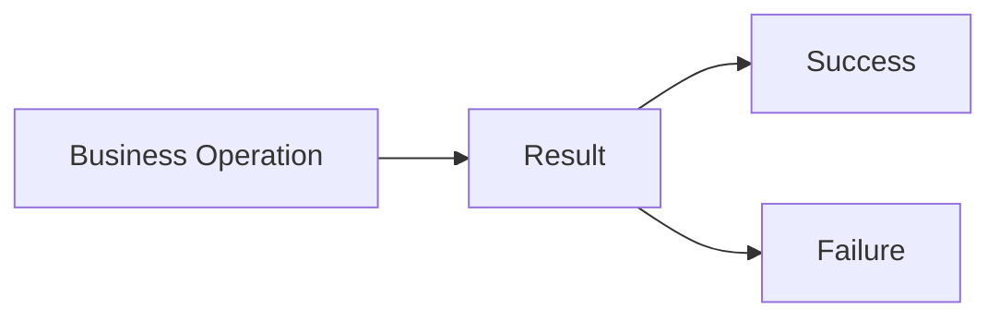

This architectural model ensures that every operation communicates its outcome explicitly.

---

## Architectural Principle

> **Every expected business outcome shall be represented explicitly through the Result Pattern rather than implicitly through exceptions or special return values.**

---

## Long-Term Vision

The Results subsystem is expected to become the standard error-handling model for every framework built upon **KUKULCAN.SharedKernel**.

Its architectural goals include:

- consistency;
- predictability;
- composability;
- extensibility;
- long-term stability.

As the ecosystem grows, every additional library should naturally integrate with the Result Pattern rather than introducing alternative error-handling mechanisms.

---

## Summary

The Results subsystem establishes a unified architectural model for representing operation outcomes throughout **KUKULCAN.SharedKernel**.

By replacing implicit failure mechanisms with explicit domain concepts, the framework achieves clearer APIs, more maintainable code and stronger architectural consistency.

The following chapters describe the philosophy, design principles and implementation model that make this possible.

# 2. Design Philosophy

The Result subsystem is founded upon a simple but fundamental architectural observation:

> **Business operations communicate outcomes, not execution mechanisms.**

Every operation performed within a software system has a semantic meaning from the perspective of the business domain.

The purpose of an operation is therefore not merely to execute code, but to produce an outcome that can be understood, evaluated and acted upon.

For this reason, **KUKULCAN.SharedKernel** models operation outcomes explicitly through the Result Pattern rather than relying on implicit runtime mechanisms such as exceptions, sentinel values or undocumented conventions.

This philosophy transforms error handling into an integral part of the domain model.

---

## Core Philosophy

The Result subsystem is guided by the following principle:

> **Every business outcome should be represented as data rather than control flow.**

Success and failure are both legitimate outcomes of a business operation.

Neither should require hidden execution paths.

Both should be represented explicitly.

---

## Explicitness Over Implicit Behavior

One of the primary goals of the Result Pattern is to eliminate ambiguity.

Consider the following method signature:

```csharp
Customer FindCustomer(CustomerId id)
```

Several questions immediately arise.

- Can it return `null`?
- Can it throw an exception?
- Which exception?
- Is "customer not found" considered exceptional?
- How should the caller react?

Now compare it with:

```csharp
Result<Customer> FindCustomer(CustomerId id)
```

The second signature communicates immediately that:

- the operation may succeed;
- the operation may fail;
- failures are expected;
- failures are represented explicitly.

The contract becomes self-documenting.

---

## Business Failures Are Normal

Many failures are part of normal business execution.

Examples include:

- customer not found;
- invalid credentials;
- duplicate registration;
- insufficient stock;
- validation failures;
- business rule violations.

These situations are neither exceptional nor unexpected.

They are ordinary business outcomes.

Treating them as exceptions obscures the domain model and unnecessarily complicates control flow.

The Result Pattern recognizes these situations as first-class business concepts.

---

## Exceptions Remain Exceptional

The philosophy of the Result subsystem is not anti-exception.

Exceptions remain essential for reporting unexpected technical failures.

Examples include:

- database connectivity loss;
- file system failures;
- network interruptions;
- serialization errors;
- programming defects;
- corrupted application state.

These situations cannot normally be recovered from through ordinary business logic.

They therefore remain the responsibility of the exception mechanism.

This clear separation greatly improves architectural consistency.

---

## Outcome-Oriented Design

The Result Pattern encourages developers to think in terms of outcomes rather than execution.

Instead of asking:

> "Did the method complete?"

developers ask:

> "What was the outcome?"

Every operation therefore becomes a conversation between producer and consumer.

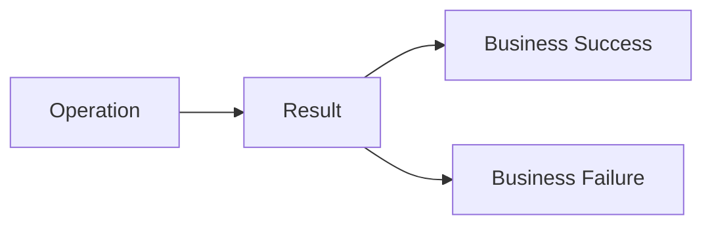

The operation never hides its outcome.

---

## Domain-Driven Communication

Within Domain-Driven Design, software should communicate using concepts that belong to the business language.

Returning:

- `null`
- `true`
- `false`
- `-1`

communicates implementation details.

Returning:

```text
Result<Customer>
```

communicates a business concept.

The Result Pattern therefore reinforces the Ubiquitous Language rather than weakening it.

---

## Predictability

Predictability is one of the most important qualities of an architectural framework.

Consumers should always know:

- how operations report success;
- how operations report failure;
- where errors are located;
- how outcomes are propagated.

The Result subsystem provides a single, uniform mechanism for every business operation throughout the framework.

This consistency significantly reduces cognitive load.

---

## Composability

Business operations rarely exist in isolation.

Instead, they participate in larger workflows.

Examples include:

- validation;
- authorization;
- domain calculations;
- persistence;
- event publication.

The Result Pattern is intentionally designed so that individual operation outcomes can be composed into larger processing pipelines.

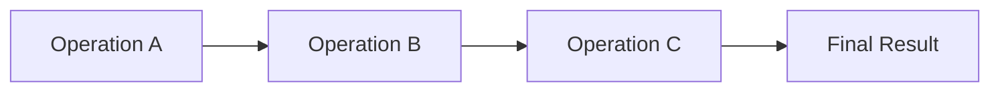

Every stage communicates using the same architectural language.

---

## Simplicity

The philosophy deliberately avoids unnecessary complexity.

The Result subsystem should be:

- simple to understand;
- simple to consume;
- simple to extend;
- simple to maintain.

Architectural consistency is considered more valuable than providing dozens of specialized Result variants.

One coherent abstraction is preferable to many partially overlapping abstractions.

---

## Immutability

Operation outcomes should never change after creation.

A Result represents a historical fact.

Once an operation has completed:

- success remains success;
- failure remains failure;
- associated errors remain immutable.

Immutability improves:

- correctness;
- thread safety;
- predictability;
- composability.

---

## Strong Typing

The philosophy strongly favors explicit types over implicit conventions.

For example:

Instead of:

```text
null
```

the framework prefers:

```text
Result<Customer>
```

Instead of:

```text
bool
```

the framework prefers:

```text
Result
```

Instead of:

```text
Exception
```

the framework prefers:

```text
Error
```

Types communicate intent far better than conventions.

---

## Architectural Consistency

Every Shared Kernel component should speak the same architectural language.

Validation returns Results.

Specifications produce Results.

Application services return Results.

Domain services return Results.

Cross-Cutting Services return Results.

This uniformity is intentional.

The framework should never require developers to switch between multiple incompatible error-handling models.

---

## Relationship with Clean Architecture

The Result subsystem aligns naturally with Clean Architecture.

It enables:

- framework-independent domain logic;
- explicit application boundaries;
- dependency inversion;
- stable public contracts.

The domain remains free from infrastructure-specific exception hierarchies.

Instead, it communicates using business-oriented outcomes.

---

## Long-Term Philosophy

The Result subsystem is designed not only for today's implementation but for the long-term evolution of the framework.

Its philosophy values:

- clarity over cleverness;
- explicitness over convention;
- consistency over variety;
- predictability over surprise.

These values are expected to remain valid regardless of future technologies or programming paradigms.

---

## Architectural Invariant

> **Every expected business operation within KUKULCAN.SharedKernel shall communicate its outcome explicitly through immutable, strongly typed Result objects, ensuring that business semantics always take precedence over execution mechanics.**

This invariant defines the philosophical foundation upon which the entire Results subsystem is built.

---

## Summary

The philosophy of the Result subsystem is centred on one fundamental idea: **business outcomes deserve first-class representation**.

By replacing implicit error signaling with explicit, immutable and strongly typed operation outcomes, **KUKULCAN.SharedKernel** achieves a more expressive, predictable and maintainable architectural model.

The next chapter defines the architectural goals that translate this philosophy into concrete design decisions.

# 3. Architectural Goals

The Results subsystem is one of the fundamental architectural pillars of **KUKULCAN.SharedKernel**.

Its purpose extends far beyond providing a convenient mechanism for returning success or failure from methods.

Instead, it establishes a unified architectural language through which every component of the Shared Kernel communicates operational outcomes.

The architectural goals presented in this chapter define the qualities that the subsystem must preserve throughout its lifetime.

Every future enhancement, optimization or extension of the Results subsystem shall be evaluated against these goals.

---

## Architectural Principle

The Results subsystem shall provide a single, coherent and framework-independent model for representing business operation outcomes across the entire architecture.

> **Architectural consistency shall always take precedence over implementation convenience.**

---

# Primary Architectural Goals

The Results subsystem has been designed to achieve the following architectural objectives.

- Explicit communication
- Architectural consistency
- Domain alignment
- Framework independence
- Strong typing
- Immutability
- Composability
- Extensibility
- Long-term stability
- Predictable evolution

Each objective contributes to the overall architectural integrity of the Shared Kernel.

---

# Goal 1 — Establish a Unified Outcome Model

Every operation throughout the framework should communicate its outcome using exactly the same architectural abstraction.

Regardless of whether the operation belongs to:

- the Domain Layer;
- Validation;
- Specifications;
- Cross-Cutting Services;
- Application Services;

its result should always be represented using the Result Pattern.

This eliminates multiple competing error-handling strategies.

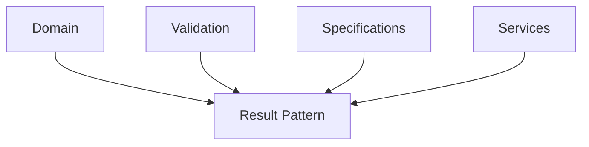

The Result Pattern becomes the common language of the framework.

---

# Goal 2 — Make Business Outcomes Explicit

Business outcomes should never be hidden behind implementation mechanisms.

Consumers should immediately understand whether an operation:

- succeeded;
- failed;
- produced business errors;
- returned a value.

The outcome forms part of the architectural contract.

Nothing should need to be inferred.

---

# Goal 3 — Separate Business Failures from Technical Failures

The architecture makes a clear distinction between two categories of failures.

Business failures are expected.

Examples include:

- validation failures;
- business rule violations;
- duplicated entities;
- missing resources.

Technical failures are unexpected.

Examples include:

- network failures;
- corrupted files;
- infrastructure outages;
- runtime defects.

The Results subsystem models only the first category.

Unexpected failures remain the responsibility of exceptions.

This separation significantly improves architectural clarity.

---

# Goal 4 — Preserve Domain Purity

The Domain Model should remain independent of technical infrastructure.

Business rules should communicate using domain concepts rather than infrastructure-specific exception types.

The Result Pattern enables the domain to remain:

- expressive;
- framework-independent;
- deterministic;
- reusable.

This goal directly supports Clean Architecture.

---

# Goal 5 — Improve Public API Quality

Public APIs should communicate every possible business outcome through their signatures.

Instead of returning:

```text
bool
```

or

```text
null
```

they return:

```text
Result

Result<T>
```

This improves:

- discoverability;
- readability;
- maintainability;
- API documentation.

The contract becomes self-describing.

---

# Goal 6 — Encourage Functional Composition

Business operations rarely execute in isolation.

The Result subsystem therefore encourages composition of operations into larger workflows.

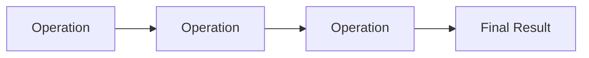

Each operation communicates using the same architectural abstraction.

This greatly simplifies workflow construction.

---

# Goal 7 — Preserve Architectural Consistency

The Shared Kernel should expose a single architectural model for representing operation outcomes.

Introducing multiple competing approaches would increase:

- cognitive complexity;
- maintenance costs;
- inconsistency between modules.

The Result Pattern therefore becomes the standard architectural contract throughout the framework.

---

# Goal 8 — Support Long-Term Evolution

The Results subsystem is expected to remain stable for many years.

Future enhancements should extend the architecture without changing its conceptual model.

Examples include:

- additional Error metadata;
- new Result extension methods;
- richer composition operators;
- improved diagnostics.

The architectural foundations should remain unchanged.

---

# Goal 9 — Enable Framework Independence

The Results subsystem must remain completely independent of external technologies.

It should not depend upon:

- ASP.NET Core;
- Entity Framework;
- logging frameworks;
- messaging frameworks;
- dependency injection containers.

As a consequence, it may be reused by:

- APIs;
- desktop applications;
- console applications;
- background services;
- cloud-native applications.

Framework independence is a permanent architectural objective.

---

# Goal 10 — Preserve Predictability

Consumers should never have to guess how operations communicate.

Every operation should behave consistently.

Expected outcomes include:

- Success
- Failure
- Associated Errors
- Optional Value

No hidden execution paths should exist.

Predictability improves both developer experience and long-term maintainability.

---

# Goal Relationships

The architectural goals reinforce one another.

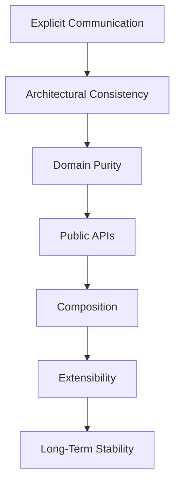

Together they define the architectural identity of the Results subsystem.

---

# Relationship with the Architecture Guide

These goals directly implement several Architectural Decision Records defined in **Architecture.md**, including:

- ADR-005 — Result Pattern
- ADR-006 — Validation Architecture
- ADR-016 — Uniform Building Block Design

They also reinforce the principles established in:

- Public API Philosophy;
- Extensibility Model;
- Stability Model;
- Performance Philosophy;
- Thread Safety.

The Results subsystem is therefore fully aligned with the architectural vision of **KUKULCAN.SharedKernel**.

---

# Architectural Constraints

Every future modification of the Results subsystem shall satisfy the following constraints.

- Preserve explicit communication.
- Preserve immutability.
- Preserve strong typing.
- Preserve framework independence.
- Preserve composability.
- Preserve backward compatibility whenever practical.

Architectural quality shall always take precedence over implementation convenience.

---

# Architectural Invariant

> **The Results subsystem shall provide the single authoritative architectural model for representing expected business operation outcomes throughout KUKULCAN.SharedKernel, ensuring explicit communication, architectural consistency and long-term stability.**

This invariant governs every component within the subsystem and serves as the foundation for its future evolution.

---

# Summary

The architectural goals of the Results subsystem define **what the subsystem must achieve**, independently of its implementation.

By establishing a unified outcome model, separating business failures from technical failures, preserving framework independence and enabling long-term evolution, the Results subsystem becomes one of the most important architectural building blocks of **KUKULCAN.SharedKernel**.

The following chapter introduces **The Result Pattern**, describing the conceptual model that fulfils these architectural goals and underpins every operation outcome within the framework.

# 4. The Result Pattern

The **Result Pattern** is the architectural foundation upon which the entire Results subsystem is built.

It provides a simple, explicit and type-safe mechanism for representing the outcome of business operations without relying on exceptions to communicate expected failures.

Within **KUKULCAN.SharedKernel**, the Result Pattern is considered a **first-class architectural concept**, not merely a programming technique.

Its purpose is to model business outcomes in a way that is:

- explicit;
- deterministic;
- composable;
- immutable;
- framework-independent.

By making operation outcomes part of the public contract, the Result Pattern improves readability, architectural consistency and long-term maintainability.

---

## Architectural Principle

Every business operation shall communicate its outcome explicitly.

> **The outcome of an operation is part of its contract, not an implementation detail.**

---

# Why the Result Pattern Exists

Every operation ultimately produces one of two outcomes.

- The operation succeeds.
- The operation cannot be completed.

The Result Pattern represents these possibilities as explicit objects rather than hidden execution paths.


This architectural model eliminates ambiguity.

Consumers always know how an operation communicates.

---

# Traditional Error Handling

Historically, software has relied on several mechanisms for representing failures.

Examples include:

- Exceptions
- Boolean return values
- Null references
- Error codes
- Sentinel values

Each approach introduces limitations.

| Technique       | Typical Problems       |
|-----------------|------------------------|
| Exceptions      | Hidden control flow    |
| Null            | Ambiguous meaning      |
| Boolean         | No failure information |
| Error Codes     | Weak typing            |
| Sentinel Values | Poor readability       |

The Result Pattern addresses these limitations through explicit modeling.

---

# Explicit Outcome Model

The Result Pattern models every business operation as an explicit outcome.

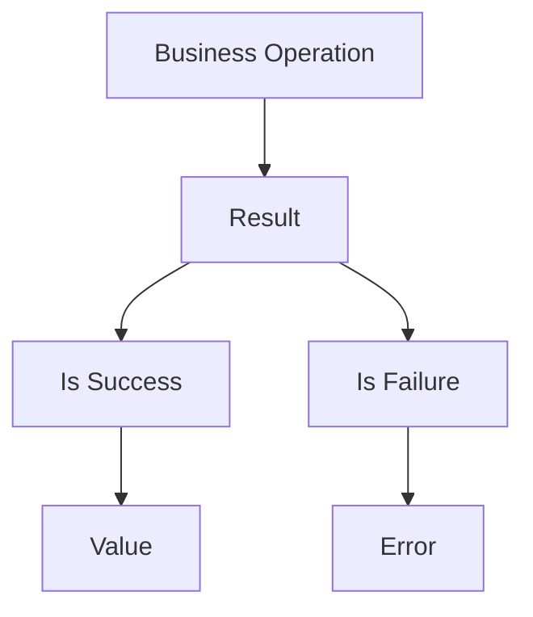

No hidden execution mechanism exists.

Everything required by the consumer is available through the Result itself.

---

# Success

A successful Result indicates that the requested business operation completed successfully.

Characteristics include:

- valid outcome;
- no associated Error;
- optional returned value;
- immutable state.

Success represents the normal completion of a business operation.

---

# Failure

A failed Result represents an expected business outcome that prevented successful completion.

Examples include:

- validation errors;
- missing entities;
- business rule violations;
- authorization failures;
- conflicts.

Failures are not exceptional situations.

They are part of the normal behavior of business software.

---

# Result as an Architectural Contract

Rather than documenting possible failures separately, the Result Pattern embeds them directly into the public API.

Instead of:

```csharp
Customer Find(CustomerId id)
```

the framework exposes:

```csharp
Result<Customer> Find(CustomerId id)
```

The method signature now communicates:

- an operation exists;
- the operation may fail;
- failures are expected;
- failures are explicitly represented.

The contract becomes self-documenting.

---

# Result Is Not an Exception Wrapper

One common misconception is that Result simply wraps exceptions.

This is not the case.

Exceptions represent unexpected technical failures.

Results represent expected business outcomes.

The architecture intentionally separates these responsibilities.

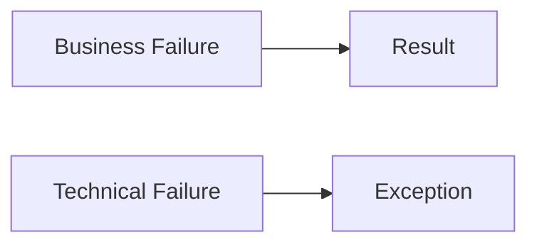

Each mechanism has its own clearly defined responsibility.

---

# The Result Pattern and Domain-Driven Design

The Result Pattern aligns naturally with Domain-Driven Design.

Business operations communicate business outcomes.

Business rules return business errors.

Nothing in the domain depends upon infrastructure-specific exception hierarchies.

This preserves the purity of the Domain Model.

---

# The Result Pattern and Clean Architecture

The Result Pattern supports Clean Architecture by allowing the Domain Layer to communicate independently of technical infrastructure.

No dependency exists upon:

- ASP.NET;
- Entity Framework;
- HTTP;
- Logging frameworks;
- Database providers.

Result remains a pure architectural abstraction.

---

# Result Lifecycle

Every Result follows a simple lifecycle.

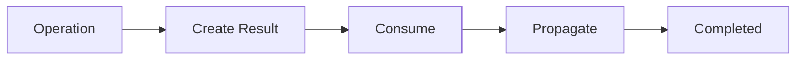

Because Results are immutable, no state transitions occur after creation.

---

# Result Characteristics

Every Result produced by the framework satisfies the following characteristics.

| Characteristic        | Description                     |
|-----------------------|---------------------------------|
| Immutable             | Cannot change after creation    |
| Explicit              | Outcome is always visible       |
| Strongly Typed        | Compiler enforces correctness   |
| Deterministic         | Same input produces same Result |
| Composable            | Results can be combined         |
| Framework Independent | No external dependencies        |

These characteristics define the architectural identity of the subsystem.

---

# Relationship with Other Components

The Result Pattern forms the center of the Results subsystem.

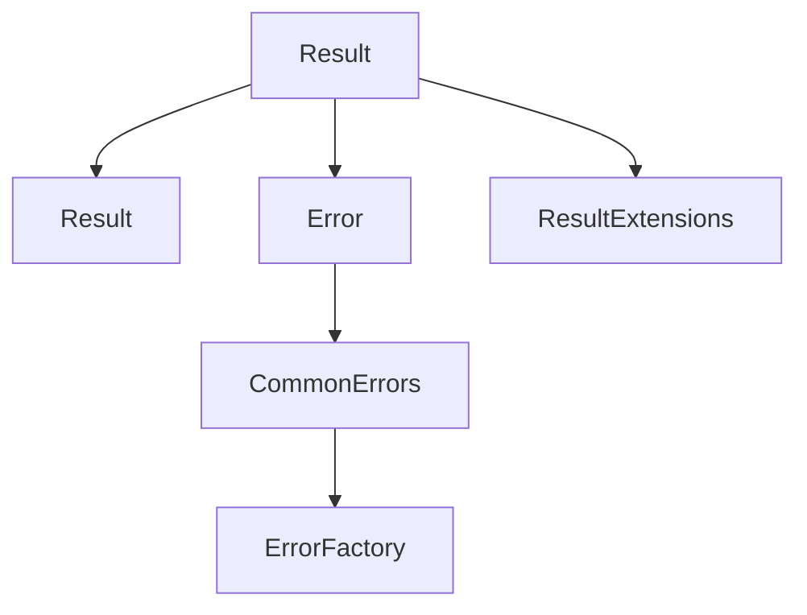

Every component within the subsystem exists to support or enrich the Result Pattern.

---

# Architectural Advantages

The Result Pattern provides numerous architectural benefits.

## Explicit APIs

Operation outcomes become part of the public contract.

---

## Predictable Behavior

Consumers always know how failures are communicated.

---

## Better Readability

Business logic becomes easier to follow because outcomes are represented directly.

---

## Better Composition

Multiple operations can be chained together without introducing nested exception handling.

---

## Framework Independence

The pattern remains completely independent of any specific application framework.

---

## Improved Testability

Result objects are deterministic and immutable, making them straightforward to verify in automated tests.

---

# Architectural Constraints

Every implementation of the Result Pattern shall satisfy the following rules.

- Success and Failure are mutually exclusive.
- Every Failure contains an Error.
- Every Success contains no Error.
- Results are immutable.
- Results never represent unexpected technical failures.
- Result behavior remains deterministic.

These constraints guarantee architectural consistency across the entire framework.

---

# Architectural Invariant

> **The Result Pattern shall remain the single architectural mechanism used by KUKULCAN.SharedKernel to represent expected business operation outcomes, ensuring explicit communication, strong typing, composability and framework independence.**

This invariant is fundamental to the architecture of the Shared Kernel.

---

# Summary

The Result Pattern is considerably more than a replacement for exceptions.

It establishes the architectural language through which every business operation communicates its outcome.

By modeling success and failure explicitly, the framework achieves clearer APIs, stronger domain modeling, improved composability and long-term architectural consistency.

The following chapter introduces the architectural principles that govern every implementation of the Result Pattern within **KUKULCAN.SharedKernel**.

# 5. Architectural Principles

The Result Pattern is more than a programming construct.

It is an architectural mechanism that defines how business operations communicate throughout **KUKULCAN.SharedKernel**.

To ensure consistency across the entire framework, every implementation of the Result subsystem follows a common set of architectural principles.

These principles are mandatory.

They define the expected behavior of every Result-related component and establish the architectural invariants that guarantee predictability, composability and long-term maintainability.

Rather than describing implementation details, these principles define the architectural philosophy that governs the entire subsystem.

---

## Architectural Principle

Every Result produced by the framework shall communicate business outcomes in a predictable, explicit and deterministic manner.

> **Architectural consistency always takes precedence over implementation convenience.**

---

# Principle 1 — Explicitness

The outcome of every business operation shall be explicitly represented.

Consumers must never infer success or failure from:

- `null`;
- Boolean values;
- magic numbers;
- undocumented conventions;
- exception hierarchies.

Instead, every operation returns an explicit Result.


Every operation has exactly one clearly defined outcome.

---

# Principle 2 — Strong Typing

Business semantics should be represented through types rather than conventions.

For example:

Instead of:

```text
bool
```

the architecture prefers:

```text
Result
```

Instead of:

```text
Customer?
```

it prefers:

```text
Result<Customer>
```

Strong typing improves:

- readability;
- discoverability;
- compiler validation;
- API documentation.

---

# Principle 3 — Immutability

Results represent completed facts.

Once created, they shall never change.

Every Result object therefore remains immutable throughout its lifetime.

Immutability provides:

- thread safety;
- deterministic behaviour;
- easier testing;
- simpler reasoning;
- safer composition.

---

# Principle 4 — Determinism

Given the same operation and the same business state, a Result should always represent the same outcome.

A Result must never depend upon:

- execution timing;
- hidden mutable state;
- environmental side effects;
- internal randomness.

Predictable behavior is essential for reliable software.

---

# Principle 5 — Separation of Concerns

The Result subsystem represents **business outcomes**.

It does **not** represent:

- infrastructure failures;
- runtime defects;
- programming errors.

Those concerns belong to the exception mechanism.

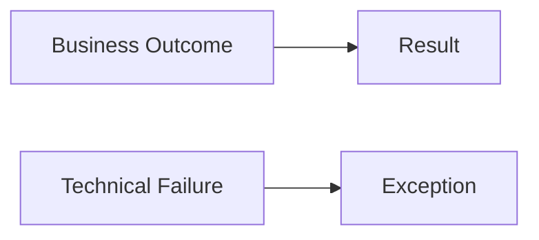

The architectural boundary between Results and Exceptions must remain clear.

---

# Principle 6 — Composability

Individual Results should naturally combine into larger business workflows.

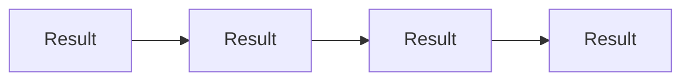

Composition should preserve:

- explicitness;
- readability;
- type safety.

Business pipelines should remain linear and predictable.

---

# Principle 7 — Framework Independence

The Result subsystem shall remain completely independent of external technologies.

It shall not depend upon:

- ASP.NET Core;
- Entity Framework;
- dependency injection containers;
- logging frameworks;
- HTTP;
- databases.

The Result Pattern is a pure architectural abstraction.

---

# Principle 8 — Domain Orientation

Results communicate business meaning.

Errors therefore represent business concepts rather than technical implementation details.

Examples include:

- CustomerNotFound
- InvalidEmail
- DuplicateUser
- InsufficientBalance

Rather than:

- SqlException
- HttpException
- NullReferenceException

Business terminology improves architectural clarity.

---

# Principle 9 — Single Source of Truth

There shall be exactly one architectural representation of an operation outcome.

The framework intentionally avoids multiple competing abstractions.

For example:

- Result
- Result<T>

No additional "Outcome", "OperationResult", "ExecutionResult" or similar abstractions should exist unless explicitly approved through architectural governance.

---

# Principle 10 — Self-Describing Contracts

Public APIs should communicate every possible outcome through their signatures.

For example:

```csharp
Result<Order> CreateOrder(CreateOrderCommand command)
```

The signature immediately communicates:

- the operation returns an Order;
- the operation may fail;
- failures are expected;
- failures are explicitly represented.

No additional documentation is required to understand the contract.

---

# Principle 11 — Error-Centric Failures

A failed Result is defined by its associated Error.

Every failure shall include:

- an Error Code;
- a semantic description;
- optional metadata.

Errors are first-class architectural objects.

Failures without an Error are considered invalid.

---

# Principle 12 — Consistency

Every architectural component shall communicate using the same Result model.

Examples include:

- Validation;
- Specifications;
- Domain Services;
- Cross-Cutting Services;
- Application Services.

Consistency reduces cognitive load and improves interoperability across the framework.

---

# Principle Relationships

The architectural principles reinforce one another.

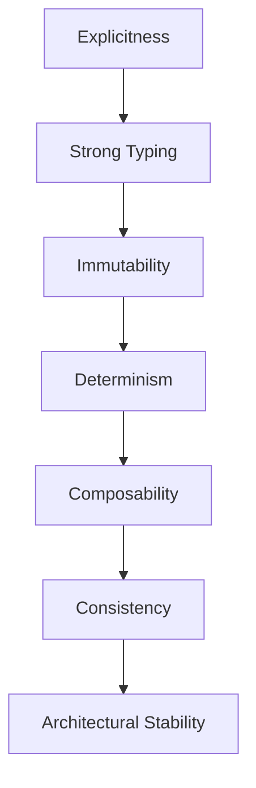

Together they define the architectural behavior of the entire subsystem.

---

# Relationship with Other Chapters

These principles implement the architectural goals defined in the previous chapter.

They also reinforce:

- ADR-005 — Result Pattern;
- ADR-006 — Validation Architecture;
- Public API Philosophy;
- Stability Model;
- Extensibility Model.

Every future enhancement of the subsystem must continue to respect these principles.

---

# Architectural Constraints

Every Result implementation shall satisfy the following constraints.

- Explicit outcome.
- Immutable state.
- Strong typing.
- Deterministic behaviour.
- Framework independence.
- Error-driven failures.
- Composable operations.

Violating any of these constraints weakens the architectural consistency of the framework.

---

# Architectural Invariant

> **Every component of the Results subsystem shall preserve explicit communication, immutability, determinism, strong typing and architectural consistency, ensuring that business outcomes remain predictable throughout the entire KUKULCAN.SharedKernel ecosystem.**

This invariant governs the design and future evolution of every Result-related component.

---

# Summary

The architectural principles presented in this chapter establish the behavioral rules that every Result implementation must follow.

Rather than describing implementation techniques, they define the permanent architectural characteristics of the subsystem.

Together, these principles ensure that the Result Pattern remains one of the most stable, expressive and reusable architectural Building Blocks within **KUKULCAN.SharedKernel**.

The following chapter introduces the **Result Taxonomy**, describing the different kinds of Result objects and their responsibilities within the framework.

# 6. Result Taxonomy

The Results subsystem is intentionally designed around a **small, well-defined family of architectural concepts** rather than a large collection of specialized result types.

Every Result-related component has a clearly defined responsibility and occupies a specific position within the overall architectural model.

This chapter defines the taxonomy of the Results subsystem, classifying each architectural element according to its purpose, responsibility and relationship with the other components.

By establishing a formal taxonomy, the framework avoids conceptual duplication and ensures that every operation outcome is represented consistently.

---

## Architectural Principle

Each Result-related component shall have a single, well-defined architectural responsibility.

> **Every architectural concept within the Results subsystem shall exist for one purpose only and shall communicate that purpose unambiguously.**

---

# Taxonomy Overview

The Results subsystem is composed of three major architectural categories.

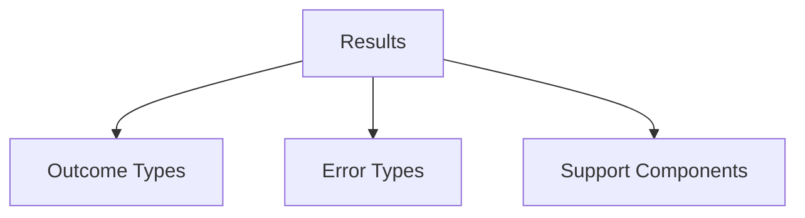

Each category fulfils a different architectural role.

---

# Category 1 — Outcome Types

Outcome Types represent the result of business operations.

These are the primary abstractions consumed by applications.

They answer one fundamental question:

> **Did the operation succeed?**

The framework currently defines two Outcome Types.

| Component   | Responsibility                                 |
|-------------|------------------------------------------------|
| `Result`    | Represents an operation with no returned value |
| `Result<T>` | Represents an operation that returns a value   |

These two abstractions are sufficient to model every expected business outcome within the framework.

---

## Result

`Result` represents the outcome of an operation that produces no business value.

Examples include:

- Delete
- Update
- Validate
- Commit
- Publish

The operation either succeeds or fails.

No additional payload is required.

---

## Result<T>

`Result<T>` represents the outcome of an operation that successfully produces a business value.

Examples include:

- Customer
- Invoice
- Product
- Address
- Version

When successful, the Result contains:

- the produced value;
- no Error.

When unsuccessful, it contains:

- an Error;
- no value.

---

# Category 2 — Error Types

Error Types describe *why* an operation failed.

They never describe implementation details.

Instead, they model business semantics.

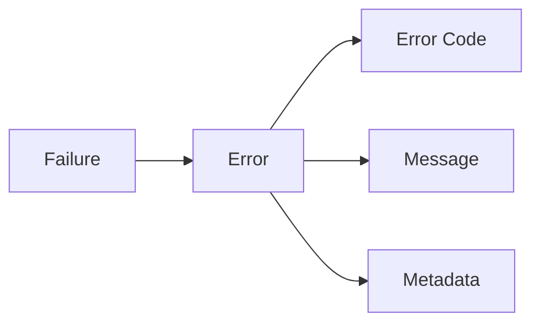

Every failed Result is associated with exactly one Error.

---

## Error

`Error` is the canonical representation of a business failure.

It encapsulates:

- unique error code;
- human-readable description;
- optional metadata.

Errors are immutable and reusable.

---

## CommonErrors

`CommonErrors` provides a catalogue of predefined Error instances representing common business situations.

Examples include:

- NotFound
- Unauthorized
- Forbidden
- Conflict
- Validation
- Timeout

Applications should reuse these predefined errors whenever appropriate.

---

## CommonErrorCodes

`CommonErrorCodes` defines the canonical identifiers used by CommonErrors.

The purpose of the code is to provide:

- machine-readable identification;
- stable references;
- interoperability;
- localization support.

Error codes remain stable across framework versions.

---

# Category 3 — Support Components

Support Components enrich or simplify the Result subsystem without representing operation outcomes themselves.

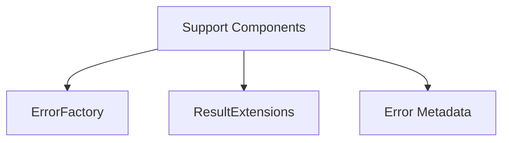

These components support construction, composition and enrichment of Results.

---

## ErrorFactory

`ErrorFactory` centralises Error creation.

Its responsibilities include:

- enforcing consistency;
- simplifying construction;
- avoiding duplicated code;
- standardising metadata.

Applications should prefer the factory over manual Error construction whenever possible.

---

## ResultExtensions

`ResultExtensions` provides convenience operations for working with Results.

Examples include:

- composition;
- mapping;
- conversion;
- chaining;
- propagation.

Extension methods enrich the Result Pattern while preserving its simplicity.

---

## Error Metadata

Metadata provides contextual information associated with an Error.

Examples include:

- property names;
- attempted values;
- validation context;
- correlation identifiers.

Metadata enriches failures without changing their semantic meaning.

---

# Taxonomy Relationships

The relationships between the architectural components are illustrated below.

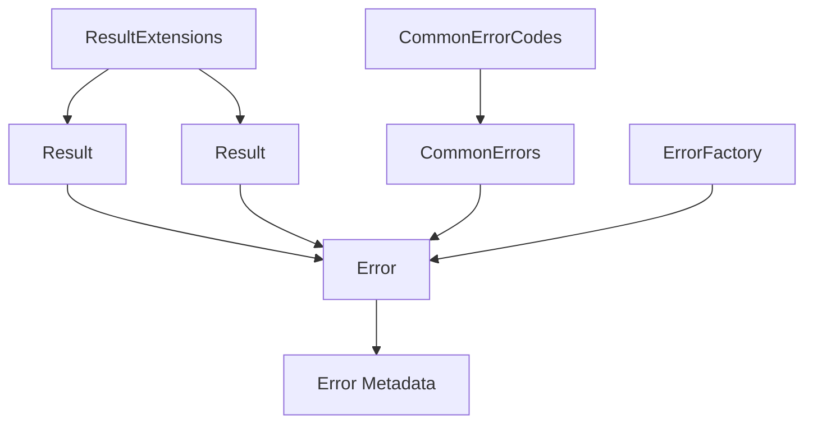

Every component occupies a clearly defined architectural position.

---

# Responsibility Matrix

| Component          | Category   | Primary Responsibility            |
|--------------------|------------|-----------------------------------|
| `Result`           | Outcome    | Operation without value           |
| `Result<T>`        | Outcome    | Operation with value              |
| `Error`            | Error      | Describe business failure         |
| `CommonErrors`     | Error      | Reusable predefined errors        |
| `CommonErrorCodes` | Error      | Stable error identifiers          |
| `ErrorFactory`     | Support    | Standardised error creation       |
| `ResultExtensions` | Support    | Result composition and enrichment |
| `Error Metadata`   | Support    | Additional contextual information |

Each component has a single architectural responsibility.

---

# Architectural Boundaries

The taxonomy deliberately avoids introducing unnecessary abstractions.

For example, the framework does **not** define:

- OperationResult
- ExecutionResult
- ServiceResult
- DomainResult
- ValidationResult (as a specialized Result subtype)

These concepts would duplicate responsibilities already fulfilled by the existing taxonomy.

Architectural simplicity is preferred over excessive specialization.

---

# Extensibility

Future versions may introduce additional support components.

However, new components should integrate naturally into the existing taxonomy.

Possible examples include:

- diagnostic helpers;
- telemetry enrichers;
- serialization adapters.

The core architectural categories should remain stable.

---

# Relationship with the Architecture Guide

The taxonomy directly implements:

- ADR-005 — Result Pattern;
- ADR-016 — Uniform Building Block Design.

It also follows the Building Block classification defined in **ARCHITECTURE.md**, ensuring that every Result-related component has a clearly defined role within the overall architecture.

---

# Architectural Constraints

Every component introduced into the Results subsystem shall satisfy the following rules.

- Belong to exactly one taxonomy category.
- Have a single architectural responsibility.
- Avoid overlapping responsibilities.
- Preserve conceptual simplicity.
- Integrate consistently with existing components.

New abstractions should only be introduced when they solve a genuinely new architectural concern.

---

# Architectural Invariant

> **Every component within the Results subsystem shall occupy a unique position within the Result Taxonomy, ensuring clear responsibilities, minimal conceptual overlap and consistent architectural communication across KUKULCAN.SharedKernel.**

This invariant preserves the conceptual integrity of the subsystem as it evolves.

---

# Summary

The Result Taxonomy defines the architectural structure of the Results subsystem.

By organizing Outcome Types, Error Types and Support Components into a coherent model, the framework achieves clarity, consistency and extensibility without unnecessary complexity.

The following chapter explores each of these architectural components in detail, beginning with the core building blocks that form the heart of the Result Pattern.

# 7. Core Components

The Results subsystem is intentionally composed of a small number of highly cohesive architectural components.

Each component has a clearly defined responsibility and collaborates with the others to provide a complete, consistent and extensible model for representing business operation outcomes.

Rather than exposing a large collection of partially overlapping abstractions, the subsystem is organized around a concise set of core building blocks.

Every operation outcome, regardless of its complexity, can be represented through the interaction of these components.

---

## Architectural Principle

Every component shall have one clearly defined architectural responsibility.

> **The Results subsystem achieves flexibility through collaboration between specialized components rather than through monolithic abstractions.**

---

# Core Component Categories

The subsystem is organized into three major groups.

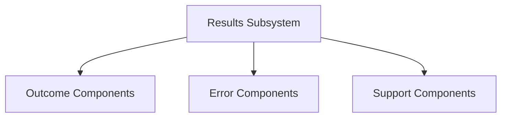

Each category fulfils a specific architectural role.

---

## Outcome Components

Outcome Components represent the result of business operations.

They answer two questions.

- Did the operation succeed?
- Did the operation produce a value?

The subsystem provides two complementary abstractions.

| Component   | Purpose                                          |
|-------------|--------------------------------------------------|
| `Result`    | Represents an operation without a returned value |
| `Result<T>` | Represents an operation that returns a value     |

These two types constitute the public contract used throughout the framework.

---

## Error Components

Error Components describe the semantic reason why an operation failed.

Unlike exceptions, Errors represent expected business situations rather than unexpected runtime conditions.

The subsystem includes:

| Component          | Responsibility                                 |
|--------------------|------------------------------------------------|
| `Error`            | Canonical representation of a business failure |
| `Error Metadata`   | Additional contextual information              |
| `CommonErrors`     | Reusable predefined Error instances            |
| `CommonErrorCodes` | Stable machine-readable identifiers            |

Together they establish a complete error model.

---

## Support Components

Support Components simplify the creation, manipulation and composition of Results.

These components enrich the subsystem without altering its architectural model.

They include:

| Component          | Responsibility                         |
|--------------------|----------------------------------------|
| `ErrorFactory`     | Standardised Error construction        |
| `ResultExtensions` | Composition and convenience operations |

These abstractions reduce duplication while preserving consistency.

---

# Component Collaboration

The core components collaborate to produce a complete operation outcome.

```mermaid
flowchart TD

    OPERATION["Business Operation"]

    RESULT["Result / Result<T>"]

    ERROR["Error"]

    METADATA["Error Metadata"]

    COMMON["CommonErrors"]

    FACTORY["ErrorFactory"]

    EXTENSIONS["ResultExtensions"]

    OPERATION --> RESULT

    RESULT --> ERROR

    ERROR --> METADATA

    COMMON --> ERROR

    FACTORY --> ERROR

    EXTENSIONS --> RESULT
```

Each component performs a single architectural role.

---

# Design Characteristics

Every core component shares a common set of architectural characteristics.

- Immutable whenever practical.
- Strongly typed.
- Framework independent.
- Explicitly modelled.
- Easily testable.
- Composable.
- Stable.
- Self-documenting.

These shared characteristics contribute to the consistency of the subsystem.

---

# Responsibility Boundaries

The subsystem deliberately separates responsibilities.

| Concern                | Responsible Component  |
|------------------------|------------------------|
| Operation outcome      | `Result` / `Result<T>` |
| Failure semantics      | `Error`                |
| Error categorisation   | `CommonErrorCodes`     |
| Error reuse            | `CommonErrors`         |
| Contextual information | `Error Metadata`       |
| Error creation         | `ErrorFactory`         |
| Composition            | `ResultExtensions`     |

No component should assume the responsibility of another.

---

# Architectural Cohesion

Although each component has an independent responsibility, none of them is intended to be used in complete isolation.

Together they form a cohesive architectural model.

This cohesion ensures:

- consistent APIs;
- predictable behaviour;
- simplified maintenance;
- long-term extensibility.

---

# Relationship with Previous Chapters

The previous chapters introduced:

- the philosophy of the subsystem;
- its architectural goals;
- the Result Pattern;
- the governing architectural principles;
- the Result Taxonomy.

The present chapter serves as the bridge between those conceptual foundations and the detailed specification of each architectural component.

The following sections describe every core component individually, including its responsibilities, design principles, public contract, architectural constraints and relationship with the rest of the subsystem.

---

# Architectural Invariant

> **The Results subsystem shall remain composed of a small, cohesive set of specialized components whose collaboration provides a complete and consistent architectural model for representing business operation outcomes.**

This invariant preserves the conceptual simplicity and long-term maintainability of the subsystem.

---

# Summary

The Core Components constitute the architectural foundation of the Results subsystem.

Each component has a clearly defined responsibility and collaborates with the others to provide a unified model for representing operation outcomes.

The following sections examine each component in detail, beginning with the fundamental abstraction upon which the entire subsystem is built: **Result**.

## 7.1 Result

The `Result` type is the fundamental building block of the Results subsystem.

It represents the outcome of a business operation that **does not produce a business value**.

Unlike exceptions, which interrupt the normal execution flow, or Boolean values, which communicate only success or failure without additional semantics, `Result` provides an explicit, strongly typed and immutable representation of an operation outcome.

Within **KUKULCAN.SharedKernel**, `Result` is considered one of the most important architectural abstractions.

Almost every business operation that performs an action without returning data communicates through this type.

---

### Architectural Responsibility

The sole responsibility of `Result` is to represent the outcome of an operation.

It answers one—and only one—question:

> **Did the operation complete successfully?**

It deliberately does **not**:

- store arbitrary business data;
- describe technical exceptions;
- contain application state;
- perform business logic;
- execute operations.

Its responsibility is purely representational.

---

### Architectural Principle

A `Result` represents a completed business operation.

Once created, its outcome cannot change.

> **A Result is an immutable representation of a historical fact.**

---

## Purpose

`Result` exists for operations whose successful completion has semantic meaning even when no value needs to be returned.

Typical examples include:

- Creating infrastructure resources
- Updating an aggregate
- Deleting an entity
- Validating an object
- Executing a command
- Publishing domain events
- Persisting changes
- Sending notifications

In all these situations, the caller is interested in **whether the operation succeeded**, not in receiving a returned object.

---

## Conceptual Model

A `Result` has only two possible states.

```mermaid
flowchart TD

    RESULT["Result"]

    SUCCESS["Success"]

    FAILURE["Failure"]

    RESULT --> SUCCESS
    RESULT --> FAILURE
```

These states are mutually exclusive.

A Result cannot be both successful and failed.

---

## State Model

The internal state of a `Result` is intentionally minimal.

| Property    | Description                                                     |
|-------------|-----------------------------------------------------------------|
| `IsSuccess` | Indicates successful completion                                 |
| `IsFailure` | Indicates unsuccessful completion                               |
| `Error`     | Contains the associated business error when the operation fails |

No additional state is required.

This simplicity is intentional.

---

## Success State

A successful Result communicates that the requested business operation completed correctly.

Characteristics of a successful Result include:

- `IsSuccess == true`
- `IsFailure == false`
- `Error == Error.None`

No additional information is required.

Success itself is the meaningful outcome.

---

## Failure State

A failed Result communicates that the operation could not be completed because of an expected business condition.

Characteristics include:

- `IsSuccess == false`
- `IsFailure == true`
- `Error != Error.None`

Every failure must contain exactly one Error.

A failed Result without an Error is considered invalid.

---

## State Invariants

The following invariants must always hold.

### Successful Result

```text
IsSuccess == true

IsFailure == false

Error == Error.None
```

---

### Failed Result

```text
IsSuccess == false

IsFailure == true

Error != Error.None
```

These invariants are fundamental to the architecture.

---

## Lifecycle

A Result follows a very simple lifecycle.

```mermaid
flowchart LR

    CREATE["Create"]

    CONSUME["Consume"]

    PROPAGATE["Propagate"]

    COMPLETE["Completed"]

    CREATE --> CONSUME
    CONSUME --> PROPAGATE
    PROPAGATE --> COMPLETE
```

Because Result objects are immutable, their lifecycle contains no state transitions after creation.

---

## Factory Methods

Result instances should be created through factory methods rather than public constructors.

Typical examples include:

```csharp
Result.Success();

Result.Failure(error);
```

This guarantees that all architectural invariants are respected.

---

## Why Public Constructors Are Avoided

Public constructors would allow invalid combinations such as:

- Success with an Error.
- Failure without an Error.
- Undefined state.

Factory methods centralize validation and preserve consistency.

---

## Immutability

Every Result instance is immutable.

Once created:

- Success cannot become Failure.
- Failure cannot become Success.
- Error cannot change.

This provides:

- thread safety;
- deterministic behaviour;
- predictable APIs;
- easier testing.

---

## Equality

Two Results are considered equal when they represent the same architectural outcome.

Examples:

Two successful Results are equivalent.

Two failed Results are equivalent when their Errors are equivalent.

Equality therefore reflects business semantics rather than object identity.

---

## Thread Safety

Because Results are immutable, they may safely be:

- shared;
- cached;
- reused;
- passed between threads.

No synchronization is required.

---

## Relationship with Result<T>

`Result` and `Result<T>` represent complementary abstractions.

```mermaid
flowchart LR

    RESULT["Result"]

    RESULTT["Result<T>"]

    RESULT --> RESULTT
```

The difference is straightforward.

| Type        | Returns Value  |
|-------------|----------------|
| `Result`    | No             |
| `Result<T>` | Yes            |

Both share the same architectural philosophy and invariants.

---

## Relationship with Error

Every failed Result owns exactly one Error.

```mermaid
flowchart LR

    RESULT["Failed Result"]

    ERROR["Error"]

    RESULT --> ERROR
```

A successful Result never owns an Error.

This relationship is mandatory.

---

## Usage Guidelines

Use `Result` whenever:

- the operation does not return business data;
- only success or failure matters;
- business failures are expected.

Avoid using `Result`:

- for unexpected technical failures;
- to replace exceptions;
- for operations that produce values (use `Result<T>` instead).

---

## Architectural Constraints

Every implementation of `Result` shall satisfy the following constraints.

- Immutable.
- Strongly typed.
- Framework independent.
- Thread-safe.
- Deterministic.
- Explicit.
- Self-consistent.

These constraints shall never be violated.

---

## Architectural Invariant

> **A Result shall always represent one—and only one—completed business outcome, preserving explicitness, immutability and architectural consistency throughout its lifetime.**

This invariant defines the architectural identity of the `Result` abstraction.

---

## Summary

`Result` is the smallest and most fundamental operation outcome within **KUKULCAN.SharedKernel**.

Its deliberately minimal design enables every business operation to communicate success or failure explicitly while remaining immutable, predictable and framework independent.

The following section introduces **`Result<T>`**, which extends this model to operations that successfully produce business values.

## 7.2 Result<T>

While `Result` represents the outcome of an operation that produces no business value, many operations are expected to return domain objects when they complete successfully.

Examples include:

- loading a Customer;
- creating an Order;
- calculating a Price;
- generating an Invoice;
- retrieving a Configuration.

For these scenarios, **KUKULCAN.SharedKernel** provides the generic type `Result<T>`.

`Result<T>` extends the architectural model introduced by `Result` by allowing successful operations to carry a strongly typed value while preserving exactly the same semantics for success and failure.

It is therefore the canonical representation of **operations that both communicate an outcome and return business data**.

---

## Architectural Responsibility

`Result<T>` has a single architectural responsibility:

> **Represent the outcome of a business operation that may produce a value.**

It does **not**:

- replace collections;
- replace Optional/Maybe types;
- wrap exceptions;
- transport arbitrary application state.

Its purpose is strictly to represent a completed business operation whose successful outcome includes a value.

---

## Architectural Principle

A `Result<T>` combines two concepts:

- an operation outcome;
- a business value.

These concepts remain independent.

The value exists **only when the operation succeeds**.

---

## Conceptual Model

```mermaid
flowchart TD

    RESULT["Result<T>"]

    SUCCESS["Success"]

    FAILURE["Failure"]

    VALUE["T Value"]

    ERROR["Error"]

    RESULT --> SUCCESS
    RESULT --> FAILURE

    SUCCESS --> VALUE
    FAILURE --> ERROR
```

A successful Result owns a value.

A failed Result owns an Error.

Never both.

---

## Purpose

`Result<T>` exists whenever successful execution produces meaningful business data.

Typical examples include:

```csharp
Result<Customer>

Result<Order>

Result<Product>

Result<Address>

Result<Money>

Result<Invoice>
```

The generic parameter `T` represents the business value returned by the operation.

---

## State Model

A `Result<T>` exposes four logical concepts.

| Property    | Description                                       |
|-------------|---------------------------------------------------|
| `IsSuccess` | Indicates successful completion                   |
| `IsFailure` | Indicates unsuccessful completion                 |
| `Value`     | Business value returned by a successful operation |
| `Error`     | Business error returned by a failed operation     |

Together they completely describe the operation outcome.

---

## Success State

A successful `Result<T>` satisfies the following conditions.

```text
IsSuccess == true

IsFailure == false

Value != null (for reference types)

Error == Error.None
```

The contained value represents the successful outcome of the operation.

---

## Failure State

A failed `Result<T>` satisfies the following conditions.

```text
IsSuccess == false

IsFailure == true

Error != Error.None

Value is unavailable
```

The consumer must never attempt to access the Value of a failed Result.

---

## Value Availability

The architectural contract is intentionally strict.

A Value exists **only** when the operation succeeds.

```mermaid
flowchart LR

    SUCCESS["Success"]

    VALUE["Value"]

    FAILURE["Failure"]

    ERROR["Error"]

    SUCCESS --> VALUE
    FAILURE --> ERROR
```

There is no valid architectural state in which:

- Success has no Value;
- Failure has both Value and Error.

---

## Factory Methods

Instances should always be created through factory methods.

Typical examples include:

```csharp
Result.Success(customer);

Result.Failure<Customer>(error);
```

Factory methods guarantee that every instance satisfies the architectural invariants.

---

## Generic Type Parameter

The generic parameter may represent any business concept.

Examples include:

Primitive values:

```csharp
Result<int>

Result<Guid>

Result<string>
```

Value Objects:

```csharp
Result<Money>

Result<EmailAddress>
```

Entities:

```csharp
Result<Customer>

Result<Order>
```

Collections:

```csharp
Result<IReadOnlyCollection<Product>>
```

The Result Pattern remains identical regardless of the contained type.

---

## Immutability

`Result<T>` is immutable.

Neither the operation outcome nor the contained value may change after creation.

This guarantees:

- thread safety;
- deterministic behaviour;
- predictable APIs;
- safe reuse.

---

## Relationship with Result

`Result<T>` extends the architectural model of `Result`.

```mermaid
flowchart LR

    RESULT["Result"]

    GENERIC["Result<T>"]

    RESULT --> GENERIC
```

Conceptually they share:

- Success
- Failure
- Error
- Immutability
- Explicit outcomes

The only difference is that `Result<T>` additionally carries a business value.

---

## Relationship with Error

Every failed `Result<T>` owns exactly one Error.

```mermaid
flowchart LR

    RESULT["Failed Result<T>"]

    ERROR["Error"]

    RESULT --> ERROR
```

Errors remain independent of the generic type.

The Error explains **why** the operation failed.

The generic parameter represents **what** would have been returned if it had succeeded.

---

## Relationship with the Value

The Value is never an error indicator.

It is purely the successful outcome of the operation.

Consequently:

- `null` should not indicate failure.
- Default values should not indicate failure.
- Sentinel values should not indicate failure.

Failure is represented exclusively through the Error.

---

## Equality

Two successful Results are equal when:

- their Values are equal;
- their operation outcome is equal.

Two failed Results are equal when:

- their Errors are equal.

Equality therefore reflects business semantics rather than object identity.

---

## Usage Guidelines

Use `Result<T>` whenever:

- an operation returns domain data;
- business failures are expected;
- callers require both the outcome and the returned value.

Avoid using `Result<T>`:

- to transport technical exceptions;
- as a replacement for nullable references;
- for optional values without an operation outcome (consider a dedicated Optional abstraction if ever introduced).

---

## Examples

Successful operation:

```csharp
Result<Customer> customer = CustomerService.Find(customerId);
```

Failed operation:

```csharp
Result<Customer> customer = Result.Failure<Customer>(
    CommonErrors.NotFound()
);
```

The caller interacts with the same architectural abstraction in both cases.

---

## Architectural Constraints

Every implementation of `Result<T>` shall satisfy the following constraints.

- Immutable.
- Strongly typed.
- Framework independent.
- Thread-safe.
- Deterministic.
- Success always owns a Value.
- Failure never exposes a Value.
- Failure always owns an Error.

These constraints preserve architectural consistency.

---

## Architectural Invariant

> **A Result<T> shall always represent exactly one completed business operation whose successful outcome includes a strongly typed value and whose unsuccessful outcome includes exactly one business Error.**

This invariant defines the architectural identity of the generic Result abstraction.

---

## Summary

`Result<T>` extends the architectural capabilities of `Result` by allowing successful operations to return strongly typed business values while preserving the same explicit, immutable and deterministic representation of operation outcomes.

Together, `Result` and `Result<T>` form the foundation of every business interaction within **KUKULCAN.SharedKernel**.

The next section introduces **Error**, the architectural component responsible for describing the semantic reason behind every failed operation.

## 7.3 Error

The `Error` type is the canonical representation of an expected business failure within **KUKULCAN.SharedKernel**.

Whenever an operation cannot complete successfully because of an expected business condition, that condition is represented by an `Error`.

Unlike exceptions, which communicate unexpected technical failures, `Error` communicates **business semantics**.

It answers one fundamental question:

> **Why did the operation fail?**

For this reason, `Error` is one of the core architectural Building Blocks of the Results subsystem.

---

## Architectural Responsibility

The sole responsibility of `Error` is to describe the semantic reason why a business operation failed.

It does **not**:

- interrupt execution;
- perform logging;
- carry stack traces;
- expose infrastructure details;
- replace exceptions.

Its purpose is purely descriptive.

---

## Architectural Principle

Errors describe **business meaning**, not implementation details.

> **An Error explains the business reason for failure without exposing how that failure occurred internally.**

---

# Purpose

Every failed `Result` or `Result<T>` contains exactly one `Error`.

The Error provides enough information for consumers to:

- understand the failure;
- make business decisions;
- propagate the failure;
- display meaningful messages;
- perform diagnostics.

Without exposing infrastructure-specific concepts.

---

# Conceptual Model

```mermaid
flowchart TD

    FAILURE["Business Failure"]

    ERROR["Error"]

    CODE["Code"]

    MESSAGE["Message"]

    METADATA["Metadata"]

    FAILURE --> ERROR

    ERROR --> CODE
    ERROR --> MESSAGE
    ERROR --> METADATA
```

An Error is a structured description of a business problem.

---

# Core Properties

Every Error is composed of three conceptual elements.

| Property   | Responsibility                     |
|------------|------------------------------------|
| `Code`     | Stable machine-readable identifier |
| `Message`  | Human-readable description         |
| `Metadata` | Optional contextual information    |

Together they completely describe a business failure.

---

# Error Code

The Error Code uniquely identifies the failure.

Examples include:

```text
NotFound

Unauthorized

Validation.Required

Conflict

InvalidOperation
```

Codes are intended for:

- programmatic processing;
- localization;
- diagnostics;
- telemetry;
- API contracts.

The code should remain stable across framework versions.

---

# Message

The Message provides a human-readable explanation of the failure.

For example:

```text
Customer was not found.
```

or

```text
Email address is invalid.
```

Messages should:

- be concise;
- describe business meaning;
- avoid implementation details;
- avoid technical jargon.

Messages are intended primarily for developers and diagnostics.

User-facing applications may replace them through localization.

---

# Metadata

Metadata enriches an Error with additional contextual information.

Examples include:

- PropertyName
- AttemptedValue
- EntityId
- CorrelationId
- ValidationContext

Metadata never changes the semantic meaning of the Error.

Instead, it provides additional diagnostic information.

---

# Immutability

Errors are immutable.

Once created:

- Code never changes.
- Message never changes.
- Metadata never changes.

Immutability guarantees:

- thread safety;
- deterministic behaviour;
- reliable equality;
- safe reuse.

---

# Equality

Two Errors are considered equal when they represent the same business failure.

Typically, this means:

- identical Code;
- identical Message;
- equivalent Metadata.

Equality therefore reflects business semantics rather than object identity.

---

# Error.None

The Results subsystem defines a special Error representing the absence of failure.

```text
Error.None
```

`Error.None` is used exclusively by successful Results.

It indicates:

- no failure occurred;
- no business error exists.

It must never appear inside a failed Result.

---

# Relationship with Result

Every failed Result owns exactly one Error.

```mermaid
flowchart LR

    RESULT["Failed Result"]

    ERROR["Error"]

    RESULT --> ERROR
```

Successful Results always contain:

```text
Error.None
```

This relationship is mandatory.

---

# Relationship with Result<T>

The relationship is identical for generic Results.

```mermaid
flowchart LR

    RESULT["Failed Result<T>"]

    ERROR["Error"]

    RESULT --> ERROR
```

The generic parameter does not influence the Error.

Errors remain completely independent of returned values.

---

# Relationship with CommonErrors

Individual Error instances should rarely be constructed manually.

Instead, reusable Error definitions are centralized within `CommonErrors`.

```mermaid
flowchart LR

    COMMON["CommonErrors"]

    ERROR["Error"]

    COMMON --> ERROR
```

This guarantees:

- consistency;
- reuse;
- stable semantics.

---

# Relationship with ErrorFactory

Complex Error construction should be delegated to `ErrorFactory`.

```mermaid
flowchart LR

    FACTORY["ErrorFactory"]

    ERROR["Error"]

    FACTORY --> ERROR
```

The factory simplifies construction while preserving architectural invariants.

---

# Relationship with Metadata

Metadata enriches an Error without altering its meaning.

```mermaid
flowchart LR

    ERROR["Error"]

    METADATA["Metadata"]

    ERROR --> METADATA
```

Consumers should treat Metadata as supplementary information.

The semantic identity of the Error remains defined by its Code.

---

# Usage Guidelines

Use an Error whenever:

- a business rule prevents completion;
- validation fails;
- authorization is denied;
- a required resource does not exist;
- a conflict occurs.

Do **not** use Error:

- for programming mistakes;
- for runtime exceptions;
- for infrastructure failures;
- as a replacement for logging.

Unexpected failures remain the responsibility of exceptions.

---

# Examples

Validation failure:

```text
Validation.Required
```

Authorization failure:

```text
Forbidden
```

Missing entity:

```text
NotFound
```

Business conflict:

```text
Conflict
```

Each Error communicates business meaning independently of implementation.

---

# Architectural Constraints

Every Error implementation shall satisfy the following constraints.

- Immutable.
- Framework independent.
- Strongly typed.
- Thread-safe.
- Semantically meaningful.
- Machine-readable.
- Human-readable.
- Free from technical implementation details.

These constraints define the architectural identity of the Error abstraction.

---

# Architectural Invariant

> **Every failed business operation within KUKULCAN.SharedKernel shall be represented by exactly one immutable Error whose semantic meaning is stable, framework independent and independent of implementation details.**

This invariant guarantees that failures remain explicit, predictable and reusable across the entire framework.

---

# Summary

`Error` is the canonical representation of expected business failures within **KUKULCAN.SharedKernel**.

Rather than signaling failure through exceptions or implicit conventions, every failed operation communicates its semantic meaning explicitly through an immutable Error object.

This clear separation between operation outcomes and failure descriptions forms one of the fundamental architectural principles of the Results subsystem.

The next section introduces **Error Metadata**, the mechanism used to enrich Errors with contextual information while preserving their semantic identity.

## 7.4 Error Metadata

While an `Error` describes the semantic reason why a business operation failed, many real-world scenarios require additional contextual information.

For example:

- Which property failed validation?
- Which value was supplied?
- Which entity identifier could not be found?
- Which business rule was violated?
- Which correlation identifier should be logged?

Embedding this information directly into the Error message would make the Error unstable, difficult to localize and unsuitable for programmatic processing.

For this reason, **KUKULCAN.SharedKernel** introduces **Error Metadata**.

Metadata enriches an Error with contextual information while preserving its semantic identity.

---

## Architectural Responsibility

The sole responsibility of Error Metadata is to provide **additional contextual information** associated with an Error.

Metadata does **not**:

- define the Error;
- change the Error semantics;
- determine success or failure;
- replace business properties.

Its purpose is purely informational.

---

## Architectural Principle

Metadata enriches Errors without changing their meaning.

> **An Error is defined by its semantic identity. Metadata only provides additional context.**

---

# Purpose

Metadata allows applications to provide richer diagnostic information without modifying the Error itself.

Examples include:

- PropertyName
- AttemptedValue
- EntityId
- AggregateId
- ValidationRule
- CorrelationId
- Timestamp
- Culture
- UserId

This information assists:

- developers;
- loggers;
- diagnostics;
- monitoring systems;
- API consumers.

---

# Conceptual Model

```mermaid
flowchart TD

    ERROR["Error"]

    METADATA["Metadata"]

    ENTRY1["Key"]

    ENTRY2["Value"]

    ERROR --> METADATA

    METADATA --> ENTRY1
    METADATA --> ENTRY2
```

Metadata is associated with an Error.

It never exists independently.

---

# Metadata Characteristics

Every Metadata entry satisfies the following characteristics.

- Optional.
- Immutable.
- Key-based.
- Extensible.
- Framework independent.

Metadata is designed to remain lightweight while supporting future extensions.

---

# Typical Metadata Examples

Validation:

| Key            | Value        |
|----------------|--------------|
| Property       | Email        |
| AttemptedValue | john@example |
| ValidationRule | EmailFormat  |

---

Entity Lookup:

| Key    | Value    |
|--------|----------|
| Entity | Customer |
| Id     | 1254     |

---

Authorization:

| Key        | Value          |
|------------|----------------|
| Permission | DeleteCustomer |
| User       | Administrator  |

---

Business Rule:

| Key            | Value               |
|----------------|---------------------|
| Rule           | CreditLimitExceeded |
| CurrentBalance | 2500                |

These examples illustrate that Metadata provides context rather than semantics.

---

# Metadata Is Not the Error

A common misconception is to treat Metadata as part of the Error identity.

This is incorrect.

For example:

```text
Error:
Validation.Required
```

may appear with different metadata.

Example A:

```text
Property = Email
```

Example B:

```text
Property = Name
```

Both represent the same business Error.

Only the context differs.

---

# Relationship with Error

Every Metadata collection belongs to exactly one Error.

```mermaid
flowchart LR

    ERROR["Error"]

    METADATA["Metadata"]

    ERROR --> METADATA
```

Metadata cannot exist without its associated Error.

---

# Relationship with ErrorFactory

The preferred mechanism for attaching Metadata is through `ErrorFactory`.

```mermaid
flowchart LR

    FACTORY["ErrorFactory"]

    ERROR["Error"]

    METADATA["Metadata"]

    FACTORY --> ERROR

    ERROR --> METADATA
```

Centralizing Metadata creation ensures consistency across the framework.

---

# Relationship with Result

Metadata is never attached directly to a Result.

Instead:

```text
Result

↓

Error

↓

Metadata
```

The Result remains responsible for communicating the operation outcome.

The Error communicates the failure.

Metadata communicates additional context.

---

# Immutability

Metadata collections are immutable.

Once associated with an Error:

- entries cannot be modified;
- keys cannot be removed;
- values cannot be replaced.

Immutability preserves:

- deterministic behaviour;
- thread safety;
- architectural consistency.

---

# Extensibility

Metadata is intentionally open-ended.

Future framework modules may introduce additional keys without changing the Error model.

Possible examples include:

- TenantId
- RequestId
- OperationName
- Version
- LocalizationKey

The architecture therefore remains extensible without breaking existing consumers.

---

# Recommended Metadata

The following metadata keys are commonly useful throughout the framework.

| Key            | Purpose                |
|----------------|------------------------|
| Property       | Validation target      |
| AttemptedValue | Invalid supplied value |
| Entity         | Entity type            |
| EntityId       | Entity identifier      |
| Aggregate      | Aggregate Root         |
| Rule           | Business rule          |
| User           | User identifier        |
| CorrelationId  | Request correlation    |
| Timestamp      | Failure time           |

Applications may define additional keys when appropriate.

---

# Metadata Usage Guidelines

Metadata should be used when:

- additional diagnostic context is valuable;
- consumers require structured information;
- logging benefits from additional details;
- APIs expose machine-readable failure information.

Metadata should **not** be used to:

- redefine the Error;
- replace Error Codes;
- store large objects;
- duplicate business entities.

Metadata should remain concise and meaningful.

---

# Performance Considerations

Metadata is optional.

Successful Results normally allocate no Metadata.

Only failures requiring contextual information should create Metadata entries.

This minimizes memory allocations while preserving extensibility.

---

# Thread Safety

Because Metadata is immutable, it may safely be:

- shared;
- cached;
- propagated;
- reused between threads.

No synchronization mechanisms are required.

---

# Architectural Constraints

Every Metadata implementation shall satisfy the following constraints.

- Immutable.
- Optional.
- Framework independent.
- Independent of Error identity.
- Strongly associated with one Error.
- Lightweight.
- Extensible.

These constraints preserve both flexibility and simplicity.

---

# Architectural Invariant

> **Error Metadata shall enrich an Error with structured contextual information without altering its semantic identity, ensuring that business meaning and diagnostic context remain cleanly separated throughout KUKULCAN.SharedKernel.**

This invariant guarantees that Metadata remains an informational concern rather than becoming part of the Error itself.

---

# Summary

Error Metadata provides the contextual information required to understand business failures in greater detail while preserving the stability and semantic identity of the underlying Error.

By separating meaning from context, the Results subsystem achieves a cleaner, more extensible and more maintainable architectural model.

The following section introduces **CommonErrors**, the catalogue of predefined Error instances that standardizes business failures across the entire framework.

## 7.5 CommonErrors

Although every failed operation is represented by an `Error`, allowing every developer to create Error instances independently would inevitably lead to inconsistencies.

Examples include:

- multiple codes representing the same failure;
- different messages for identical business conditions;
- duplicated Error definitions;
- inconsistent naming conventions;
- reduced interoperability between framework modules.

To eliminate these problems, **KUKULCAN.SharedKernel** centralises reusable business failures within the **CommonErrors** component.

`CommonErrors` is the canonical catalogue of predefined Error instances shared across the entire framework.

Rather than creating identical Errors repeatedly, applications simply reuse the predefined definitions.

---

## Architectural Responsibility

The sole responsibility of `CommonErrors` is to provide a reusable catalogue of standardized business Errors.

It does **not**:

- define Error Codes;
- construct arbitrary Errors;
- contain business logic;
- replace ErrorFactory.

Its purpose is exclusively to provide reusable Error definitions.

---

## Architectural Principle

Business failures that represent common architectural concepts shall be defined once and reused everywhere.

> **A common business failure shall have exactly one canonical Error definition throughout the entire framework.**

---

# Purpose

`CommonErrors` exists to guarantee architectural consistency.

Instead of allowing developers to write:

```csharp
new Error(
    "NotFound",
    "Customer not found."
)
```

multiple times throughout the framework,

applications simply reuse:

```csharp
CommonErrors.NotFound()
```

This approach ensures:

- consistency;
- reuse;
- maintainability;
- stable API contracts.

---

# Conceptual Model

```mermaid
flowchart TD

    COMMON["CommonErrors"]

    ERROR1["NotFound"]

    ERROR2["Conflict"]

    ERROR3["Unauthorized"]

    ERROR4["Validation"]

    COMMON --> ERROR1
    COMMON --> ERROR2
    COMMON --> ERROR3
    COMMON --> ERROR4
```

`CommonErrors` serves as the central catalogue of reusable business failures.

---

# Relationship with Error

Every member of `CommonErrors` returns an immutable `Error`.

```mermaid
flowchart LR

    COMMON["CommonErrors"]

    ERROR["Error"]

    COMMON --> ERROR
```

The returned Error behaves exactly like any manually created Error.

The only difference is that its definition is centralized.

---

# Relationship with CommonErrorCodes

`CommonErrors` does not invent its own identifiers.

Instead, every predefined Error references a stable identifier defined in `CommonErrorCodes`.

```mermaid
flowchart LR

    CODES["CommonErrorCodes"]

    COMMON["CommonErrors"]

    ERROR["Error"]

    CODES --> COMMON
    COMMON --> ERROR
```

This separation provides two important advantages.

- Error Codes remain stable.
- Error definitions remain readable.

---

# Relationship with ErrorFactory

`ErrorFactory` is responsible for creating Errors.

`CommonErrors` is responsible for exposing reusable Error definitions.

```mermaid
flowchart LR

    FACTORY["ErrorFactory"]

    COMMON["CommonErrors"]

    ERROR["Error"]

    FACTORY --> COMMON
    COMMON --> ERROR
```

These responsibilities intentionally remain separate.

---

# Typical Common Errors

Examples include:

| Error        | Purpose                           |
|--------------|-----------------------------------|
| None         | Absence of failure                |
| Unknown      | Unexpected business failure       |
| NotFound     | Requested resource does not exist |
| Unauthorized | Authentication required           |
| Forbidden    | Operation not permitted           |
| Conflict     | Business conflict                 |
| Validation   | Validation failure                |
| Timeout      | Operation timed out               |
| Cancelled    | Operation cancelled               |
| Concurrency  | Concurrency conflict              |

These Errors are expected to be reused across every framework module.

---

# Validation Errors

Validation-related Errors are also exposed through `CommonErrors`.

Examples include:

- Required
- Empty
- InvalidFormat
- InvalidEmail
- InvalidPhone
- InvalidLength
- GreaterThan
- LessThan
- Between

Applications should never redefine these common validation failures.

---

# Why Centralisation Matters

Without a centralized catalogue, two developers might independently define:

Developer A:

```text
Customer.NotFound
```

Developer B:

```text
CustomerMissing
```

Developer C:

```text
EntityDoesNotExist
```

All three represent exactly the same business concept.

`CommonErrors` eliminates this duplication by providing a single canonical definition.

---

# Consistency Across Modules

Because every Shared Kernel module reuses the same catalogue:

Validation

↓

Specifications

↓

Domain Services

↓

Application Services

↓

Public APIs

all communicate identical business failures.

This dramatically improves interoperability.

---

# Localization

The semantic identity of an Error never changes.

Only its human-readable message may vary depending on localization requirements.

Consequently:

```text
CommonErrors.NotFound()
```

represents the same business concept regardless of language.

This makes the catalogue compatible with future localization mechanisms.

---

# Extensibility

Future framework versions may introduce additional predefined Errors.

Examples include:

- RateLimitExceeded
- FeatureDisabled
- ResourceLocked
- QuotaExceeded

However, existing Error definitions should remain stable.

Removing or redefining existing CommonErrors is considered a breaking architectural change.

---

# Usage Guidelines

Applications should use `CommonErrors` whenever a predefined Error already exists.

For example:

Use:

```csharp
CommonErrors.NotFound()
```

Instead of:

```csharp
new Error(...)
```

New Error definitions should only be introduced when they represent genuinely new business semantics.

---

# Thread Safety

Every Common Error is immutable.

Consequently, CommonErrors may safely expose shared reusable instances or equivalent immutable factory methods.

No synchronization mechanisms are required.

---

# Architectural Constraints

Every Common Error shall satisfy the following constraints.

- Immutable.
- Reusable.
- Framework independent.
- Backed by a stable Error Code.
- Semantically meaningful.
- Consistently named.
- Safe for reuse across the framework.

These constraints preserve the integrity of the shared catalogue.

---

# Architectural Invariant

> **Every reusable business failure within KUKULCAN.SharedKernel shall be represented by exactly one canonical definition within CommonErrors, ensuring consistency, reuse and long-term architectural stability across the entire framework.**

This invariant guarantees that common business failures remain standardized throughout the ecosystem.

---

# Summary

`CommonErrors` provides the centralized catalogue of reusable Error definitions used throughout **KUKULCAN.SharedKernel**.

By defining common business failures once and reusing them everywhere, the framework achieves greater consistency, simpler maintenance and stronger interoperability between architectural components.

The next section introduces **CommonErrorCodes**, the stable machine-readable identifiers upon which every Common Error is built.

## 7.6 CommonErrorCodes

While `CommonErrors` provides reusable business Error instances, every Error must also possess a **stable machine-readable identity**.

This identity is provided by **CommonErrorCodes**.

`CommonErrorCodes` defines the canonical set of error identifiers shared across the entire **KUKULCAN.SharedKernel** ecosystem.

Unlike Error messages, which may evolve or be localized, Error Codes are considered part of the public architectural contract and are therefore expected to remain stable over time.

---

## Architectural Responsibility

The sole responsibility of `CommonErrorCodes` is to define the canonical identifiers used by reusable Errors.

It does **not**:

- create Errors;
- contain Error messages;
- contain localization;
- perform validation;
- implement business logic.

Its responsibility is purely identificational.

---

## Architectural Principle

Every reusable business Error shall be identified by one—and only one—stable Error Code.

> **Error Codes define architectural identity. Error messages describe human meaning.**

---

# Purpose

The primary purpose of `CommonErrorCodes` is to provide a consistent vocabulary that can be understood by:

- applications;
- APIs;
- clients;
- telemetry;
- monitoring systems;
- logging frameworks;
- automated integrations.

Because the codes are stable, they may safely be used for:

- conditional logic;
- serialization;
- localization;
- documentation;
- API contracts.

---

# Conceptual Model

```mermaid
flowchart TD

    CODE["CommonErrorCode"]

    ERROR["Error"]

    RESULT["Failed Result"]

    CODE --> ERROR
    ERROR --> RESULT
```

The Error Code identifies the Error.

The Error explains the failure.

The Result communicates the outcome.

---

# Architectural Position

Within the Results subsystem, `CommonErrorCodes` occupies the lowest semantic level.

```mermaid
flowchart TD

    CODES["CommonErrorCodes"]

    ERRORS["CommonErrors"]

    ERROR["Error"]

    RESULT["Result"]

    CODES --> ERRORS
    ERRORS --> ERROR
    ERROR --> RESULT
```

Each layer builds upon the previous one.

---

# Canonical Error Categories

Although the framework exposes individual Error Codes, they naturally fall into several architectural categories.

| Category       | Examples                        |
|----------------|---------------------------------|
| General        | None, Unknown                   |
| Resource       | NotFound, AlreadyExists         |
| Authorization  | Unauthorized, Forbidden         |
| Validation     | Required, Empty, InvalidFormat  |
| Business Rules | Conflict, InvalidOperation      |
| Infrastructure | Timeout, Cancelled, Concurrency |

These categories improve discoverability without affecting the uniqueness of individual codes.

---

# Stability

Error Codes are part of the framework's public contract.

Consequently, they should remain stable across framework versions.

Changing an existing Error Code may:

- break API clients;
- invalidate integrations;
- affect telemetry;
- disrupt localization;
- invalidate persisted data.

Therefore:

- new codes may be added;
- obsolete codes may be deprecated;
- existing codes should not be renamed.

---

# Naming Guidelines

Every Error Code should satisfy the following characteristics.

- Short.
- Descriptive.
- Stable.
- Technology-independent.
- Business-oriented.
- Human-readable.

Examples:

```text
NotFound

Unauthorized

Validation.Required

Conflict

InvalidOperation
```

Poor examples include:

```text
Error001

SqlFailure

Exception42

UnknownBug
```

Error Codes should describe business meaning rather than implementation details.

---

# Relationship with CommonErrors

Every predefined Error references exactly one Common Error Code.

```mermaid
flowchart LR

    CODE["CommonErrorCode"]

    ERROR["CommonError"]

    CODE --> ERROR
```

Multiple Errors should never reuse different codes to describe the same business concept.

Likewise, a single Error Code should never represent unrelated business failures.

---

# Relationship with Localization

Error Codes remain invariant.

Messages may change.

For example:

Code:

```text
Validation.Required
```

English:

```text
The value is required.
```

Spanish:

```text
El valor es obligatorio.
```

French:

```text
La valeur est obligatoire.
```

Only the message changes.

The Error Code remains identical.

---

# Relationship with APIs

Error Codes are particularly valuable for external clients.

Rather than parsing localized messages, clients can make decisions using stable identifiers.

Example response:

```json
{
  "code": "Validation.Required",
  "message": "The Email field is required."
}
```

The client should rely on the Code rather than the Message.

---

# Telemetry and Diagnostics

Monitoring systems frequently aggregate failures by Error Code.

For example:

```text
Validation.Required

Occurrences:
12,354
```

This would not be possible if applications relied solely on free-form messages.

Stable identifiers enable meaningful operational metrics.

---

# Extensibility

New framework modules may introduce additional Common Error Codes.

Examples include:

- RateLimitExceeded
- FeatureDisabled
- ResourceLocked
- PaymentRequired

However, these additions should extend the catalogue rather than redefine existing identifiers.

Backward compatibility remains a primary architectural goal.

---

# Usage Guidelines

Applications should reference predefined Error Codes whenever available.

Avoid:

- hard-coded string literals;
- dynamically generated codes;
- technology-specific identifiers.

All reusable Error Codes should originate from `CommonErrorCodes`.

---

# Architectural Constraints

Every Common Error Code shall satisfy the following constraints.

- Unique.
- Stable.
- Framework independent.
- Business-oriented.
- Human-readable.
- Machine-readable.
- Immutable.

These constraints guarantee reliable interoperability across the framework.

---

# Architectural Invariant

> **Every reusable business Error within KUKULCAN.SharedKernel shall be identified by a unique, immutable and stable Common Error Code that remains independent of localization, implementation details and framework technologies.**

This invariant establishes Error Codes as one of the fundamental public contracts of the Results subsystem.

---

# Summary

`CommonErrorCodes` provides the stable identifiers upon which every reusable Error is built.

By separating machine-readable identity from human-readable descriptions, the framework achieves greater interoperability, localization support and long-term compatibility.

The following section introduces **ErrorFactory**, the architectural component responsible for creating Error instances while preserving the consistency and invariants defined throughout the Results subsystem.

## 7.7 ErrorFactory

Although an `Error` is a simple immutable object, creating Error instances directly throughout the framework would gradually introduce inconsistencies.

Examples include:

- duplicated construction logic;
- inconsistent metadata;
- repeated boilerplate code;
- different conventions between modules;
- accidental violation of architectural invariants.

To eliminate these problems, **KUKULCAN.SharedKernel** centralises Error creation through the **ErrorFactory**.

`ErrorFactory` provides a uniform mechanism for constructing Error instances while ensuring that every Error satisfies the architectural rules defined by the Results subsystem.

---

## Architectural Responsibility

The sole responsibility of `ErrorFactory` is to create valid Error instances.

It does **not**:

- define Error Codes;
- own reusable Error definitions;
- perform business validation;
- execute business rules;
- replace CommonErrors.

Its purpose is construction.

---

## Architectural Principle

The creation of Error objects shall be centralized whenever construction requires consistency or additional contextual information.

> **Construction logic belongs to factories, not to consumers.**

---

# Purpose

`ErrorFactory` exists to guarantee that every Error is created consistently.

Rather than repeating:

```csharp
new Error(...)
```

throughout the framework, consumers delegate construction to the factory.

This approach provides:

- consistency;
- reuse;
- maintainability;
- centralized evolution.

---

# Conceptual Model

```mermaid
flowchart TD

    CONSUMER["Consumer"]

    FACTORY["ErrorFactory"]

    ERROR["Error"]

    CONSUMER --> FACTORY

    FACTORY --> ERROR
```

Consumers request an Error.

The factory produces a valid immutable instance.

---

# Relationship with Error

`ErrorFactory` creates Error objects.

```mermaid
flowchart LR

    FACTORY["ErrorFactory"]

    ERROR["Error"]

    FACTORY --> ERROR
```

The resulting Error is indistinguishable from any other valid Error.

The factory merely standardizes its creation.

---

# Relationship with CommonErrors

The responsibilities of `ErrorFactory` and `CommonErrors` are intentionally different.

```mermaid
flowchart TD

    FACTORY["ErrorFactory"]

    COMMON["CommonErrors"]

    ERROR["Error"]

    FACTORY --> ERROR

    COMMON --> ERROR
```

| Component      | Responsibility                     |
|----------------|------------------------------------|
| `CommonErrors` | Exposes predefined reusable Errors |
| `ErrorFactory` | Creates Error instances            |

The catalogue defines.

The factory constructs.

---

# Relationship with CommonErrorCodes

Whenever appropriate, the factory uses identifiers defined in `CommonErrorCodes`.

```mermaid
flowchart LR

    CODES["CommonErrorCodes"]

    FACTORY["ErrorFactory"]

    ERROR["Error"]

    CODES --> FACTORY
    FACTORY --> ERROR
```

This guarantees consistency between generated Errors and the predefined catalogue.

---

# Relationship with Metadata

One of the primary responsibilities of the factory is attaching contextual Metadata.

```mermaid
flowchart TD

    FACTORY["ErrorFactory"]

    ERROR["Error"]

    METADATA["Metadata"]

    FACTORY --> ERROR

    ERROR --> METADATA
```

Consumers therefore avoid repetitive Metadata construction.

---

# Factory Responsibilities

Typical responsibilities include:

- creating standard Errors;
- attaching Metadata;
- validating construction parameters;
- enforcing architectural invariants;
- simplifying consumer code.

The factory should remain lightweight.

It should not contain business rules.

---

# Factory Methods

Typical factory operations include:

```csharp
Create(...)

CreateValidation(...)

CreateConflict(...)

CreateNotFound(...)
```

The exact API may evolve over time.

The architectural responsibility remains unchanged.

---

# Benefits of Centralised Construction

Centralizing construction provides several architectural advantages.

## Consistency

Every Error is created using identical rules.

---

## Reuse

Repeated construction logic disappears.

---

## Maintainability

Future changes affect only the factory implementation.

---

## Extensibility

Additional Metadata may be introduced without modifying consumers.

---

## Readability

Business code remains focused on business behavior rather than object construction.

---

# Why Not Use Constructors Everywhere?

Direct construction quickly leads to inconsistency.

For example:

Developer A:

```csharp
new Error(...)
```

Developer B:

```csharp
new Error(...)
```

Developer C:

```csharp
new Error(...)
```

Each implementation may differ slightly.

Using a factory ensures a single architectural construction model.

---

# Factory Is Not a Service Locator

`ErrorFactory` performs object construction only.

It should never:

- resolve services;
- access infrastructure;
- query databases;
- execute business logic.

Its behavior must remain deterministic.

---

# Immutability

The factory creates immutable Errors.

It does not modify existing instances.

Every invocation produces a complete immutable Error ready for immediate use.

---

# Thread Safety

Because the factory is stateless, it is naturally thread-safe.

Multiple threads may invoke the factory concurrently without synchronization.

---

# Extensibility

Future framework versions may extend the factory with specialized creation helpers.

Examples include:

- validation errors;
- authorization errors;
- localization-aware construction;
- telemetry integration.

Such additions should extend the factory without changing its architectural purpose.

---

# Usage Guidelines

Prefer `ErrorFactory` whenever:

- construction requires Metadata;
- construction logic becomes repetitive;
- consistency is important.

Prefer `CommonErrors` whenever an existing predefined Error already satisfies the requirement.

Avoid manually constructing Errors unless there is a compelling architectural reason.

---

# Architectural Constraints

Every implementation of `ErrorFactory` shall satisfy the following constraints.

- Stateless.
- Deterministic.
- Framework independent.
- Thread-safe.
- Free from business logic.
- Preserve Error immutability.
- Preserve Error invariants.

These constraints ensure that the factory remains a pure construction component.

---

# Architectural Invariant

> **ErrorFactory shall remain the single architectural component responsible for standardized Error construction, ensuring that every generated Error preserves the invariants, consistency and extensibility of the Results subsystem.**

This invariant guarantees uniform Error creation throughout **KUKULCAN.SharedKernel**.

---

# Summary

`ErrorFactory` centralizes the creation of Error instances, providing a consistent and extensible mechanism for constructing business failures while preserving the architectural invariants of the Results subsystem.

By separating construction from definition, the framework achieves cleaner business code, reduced duplication and improved maintainability.

The next section introduces **ResultExtensions**, the component responsible for enriching the Result Pattern through composition and convenience operations without altering its core architectural model.

## 7.8 ResultExtensions

While `Result` and `Result<T>` provide the fundamental abstractions for representing business operation outcomes, real-world business workflows frequently require multiple operations to be combined.

Without additional support, these workflows quickly become repetitive.

Typical patterns include:

- propagating failures;
- transforming successful values;
- chaining business operations;
- converting between Result types;
- combining multiple Results.

Embedding these behaviors directly inside `Result` would unnecessarily increase its complexity and violate the **Single Responsibility Principle**.

For this reason, **KUKULCAN.SharedKernel** introduces **ResultExtensions**.

`ResultExtensions` enriches the Result Pattern by providing compositional and convenience operations while preserving the simplicity of the core abstractions.

---

## Architectural Responsibility

The sole responsibility of `ResultExtensions` is to provide reusable operations that simplify working with `Result` and `Result<T>`.

It does **not**:

- change the Result model;
- introduce new Result states;
- execute business rules;
- create Errors.

Its purpose is to improve composition and readability.

---

## Architectural Principle

Result behavior should be extended through composition rather than by increasing the complexity of the Result types themselves.

> **Core abstractions remain minimal. Additional behavior is provided through extension methods.**

---

# Purpose

`ResultExtensions` exists to eliminate repetitive Result-handling code.

Instead of repeatedly writing:

```text
if (result.IsFailure)
    return result;
```

applications use expressive extension methods that preserve readability while maintaining architectural consistency.

---

# Conceptual Model

```mermaid
flowchart TD

    RESULT["Result"]

    EXTENSIONS["ResultExtensions"]

    WORKFLOW["Business Workflow"]

    RESULT --> EXTENSIONS

    EXTENSIONS --> WORKFLOW
```

Extensions operate on Results.

They never modify Results.

---

# Relationship with Result

`ResultExtensions` enriches the behavior of `Result`.

```mermaid
flowchart LR

    RESULT["Result"]

    EXT["Extensions"]

    RESULT --> EXT
```

The Result remains unchanged.

Extensions simply provide additional operations.

---

# Relationship with Result<T>

The same applies to generic Results.

```mermaid
flowchart LR

    RESULT["Result<T>"]

    EXT["Extensions"]

    RESULT --> EXT
```

Generic and non-generic Results are treated consistently.

---

# Relationship with Error

Extension methods never redefine Errors.

Instead, they propagate existing failures.

```mermaid
flowchart TD

    RESULT["Failed Result"]

    ERROR["Error"]

    EXT["Extension"]

    RESULT --> ERROR

    RESULT --> EXT
```

Failure information remains intact throughout composed workflows.

---

# Composition

One of the primary responsibilities of `ResultExtensions` is composing multiple operations.

```mermaid
flowchart LR

    R1["Result"]

    R2["Result"]

    R3["Result"]

    FINAL["Result"]

    R1 --> R2
    R2 --> R3
    R3 --> FINAL
```

Composition allows business workflows to remain linear, readable and predictable.

---

# Typical Extension Categories

Although the exact API may evolve, extension methods generally fall into several architectural categories.

| Category    | Purpose                      |
|-------------|------------------------------|
| Mapping     | Transform successful values  |
| Chaining    | Execute dependent operations |
| Combination | Merge multiple Results       |
| Conversion  | Convert between Result types |
| Propagation | Preserve failures            |
| Convenience | Reduce repetitive code       |

Each category improves readability without altering the underlying Result model.

---

# Mapping

Mapping transforms successful values while preserving failures.

Conceptually:

```text
Result<Customer>

↓

Result<CustomerDto>
```

If the operation succeeds:

- the value changes.

If the operation fails:

- the Error remains unchanged.

---

# Chaining

Many business operations depend on previous successful operations.

```mermaid
flowchart LR

    CUSTOMER["Customer"]

    ADDRESS["Address"]

    ORDER["Order"]

    CUSTOMER --> ADDRESS
    ADDRESS --> ORDER
```

Extensions simplify these sequential workflows while automatically propagating failures.

---

# Combination

Some workflows require several independent Results.

```mermaid
flowchart LR

    R1["Result"]

    R2["Result"]

    R3["Result"]

    COMBINED["Combined Result"]

    R1 --> COMBINED
    R2 --> COMBINED
    R3 --> COMBINED
```

Combination helpers centralize this logic and avoid repetitive failure handling.

---

# Failure Propagation

Failure propagation is one of the defining characteristics of the Result Pattern.

When one operation fails, subsequent operations should normally not execute.

```mermaid
flowchart LR

    STEP1["Success"]

    STEP2["Failure"]

    STEP3["Skipped"]

    STEP1 --> STEP2
    STEP2 --> STEP3
```

Extension methods automatically preserve this behavior.

---

# Functional Style

Although the Results subsystem is not a functional programming library, `ResultExtensions` adopts several functional composition principles.

Examples include:

- linear workflows;
- explicit outcomes;
- immutable values;
- deterministic transformations.

These principles improve readability without introducing functional complexity.

---

# Why Extension Methods?

The architecture intentionally avoids placing every convenience operation directly inside `Result`.

Doing so would cause:

- oversized core classes;
- reduced cohesion;
- more difficult maintenance;
- increased API complexity.

Using extension methods keeps the Result model minimal while allowing future growth.

---

# Framework Independence

All extension methods remain completely independent of external technologies.

They should never depend upon:

- ASP.NET Core;
- Entity Framework;
- dependency injection;
- logging frameworks;
- HTTP.

They operate exclusively on Result abstractions.

---

# Performance

Extension methods should introduce minimal overhead.

They should:

- avoid unnecessary allocations;
- avoid copying values;
- preserve Result immutability;
- remain deterministic.

Performance should never come at the expense of architectural clarity.

---

# Thread Safety

Because Results are immutable, every extension method is naturally thread-safe provided it maintains stateless behavior.

Extension methods should never:

- mutate Results;
- mutate Errors;
- modify Metadata.

---

# Usage Guidelines

Use `ResultExtensions` whenever:

- composing multiple operations;
- transforming successful values;
- reducing repetitive Result handling;
- propagating failures consistently.

Avoid using extension methods to:

- hide business logic;
- replace domain services;
- bypass architectural invariants.

Business behavior belongs to the Domain.

Composition belongs to the Results subsystem.

---

# Architectural Constraints

Every Result extension shall satisfy the following constraints.

- Stateless.
- Deterministic.
- Framework independent.
- Preserve immutability.
- Preserve Error semantics.
- Preserve Result invariants.
- Never introduce hidden execution paths.

These constraints ensure predictable behavior throughout the framework.

---

# Architectural Invariant

> **ResultExtensions shall enrich the Result Pattern exclusively through stateless composition and convenience operations, preserving the simplicity, immutability and architectural consistency of the core Result abstractions.**

This invariant guarantees that behavioral growth never compromises the architectural integrity of the Results subsystem.

---

# Summary

`ResultExtensions` provides the compositional capabilities that allow the Result Pattern to scale from individual operations to complex business workflows.

By keeping the core abstractions intentionally small while moving reusable behavior into extension methods, the framework achieves both architectural simplicity and expressive business code.

With this chapter, the complete set of **Core Components** of the Results subsystem has been defined, establishing the architectural foundation upon which the remainder of the subsystem is built.

# 8. Success Model

The primary purpose of the Results subsystem is not to represent failures.

Its primary purpose is to represent the **outcome of business operations**.

A successful operation is therefore considered the normal execution path.

Failure represents an alternative business outcome, not the default behavior.

For this reason, the architecture defines a dedicated **Success Model** that specifies how successful operations shall be represented, propagated and consumed throughout **KUKULCAN.SharedKernel**.

---

## Architectural Principle

Success shall be represented as an explicit architectural state rather than being inferred from the absence of failure.

> **Success is a first-class architectural concept, not merely the lack of an Error.**

---

# Purpose

The Success Model establishes a consistent representation for successful business operations.

It guarantees that every successful operation communicates:

- successful completion;
- deterministic behaviour;
- immutable state;
- predictable contracts.

Regardless of whether the operation returns a business value.

---

# Success States

The framework defines two success representations.

```mermaid
flowchart TD

    SUCCESS["Success"]

    RESULT["Result"]

    RESULTT["Result<T>"]

    SUCCESS --> RESULT
    SUCCESS --> RESULTT
```

These correspond to the two Result abstractions introduced previously.

---

## Success without Value

Operations that perform an action without returning business data produce a successful `Result`.

Examples include:

- DeleteCustomer
- PublishDomainEvents
- SaveChanges
- ValidateConfiguration
- CommitTransaction

The successful outcome communicates only that the operation completed correctly.

---

## Success with Value

Operations that successfully produce business information return a successful `Result<T>`.

Examples include:

- FindCustomer
- CreateInvoice
- CalculatePrice
- GenerateIdentifier
- LoadConfiguration

The operation communicates:

- successful completion;
- produced value.

---

# Conceptual Model

```mermaid
flowchart LR

    OPERATION["Business Operation"]

    SUCCESS["Success"]

    VALUE["Business Value"]

    OPERATION --> SUCCESS

    SUCCESS --> VALUE
```

If no business value exists, the Success state terminates after successful completion.

---

# Success Characteristics

Every successful Result shares the same architectural characteristics.

- Explicit.
- Immutable.
- Strongly typed.
- Deterministic.
- Framework independent.
- Thread-safe.

These characteristics remain identical for both `Result` and `Result<T>`.

---

# Success Invariants

Successful Results always satisfy the following rules.

## Result

```text
IsSuccess == true

IsFailure == false

Error == Error.None
```

---

## Result<T>

```text
IsSuccess == true

IsFailure == false

Value is available

Error == Error.None
```

These invariants shall never be violated.

---

# Error.None

A successful operation always owns the special Error:

```text
Error.None
```

This object represents the complete absence of failure.

It exists to preserve consistency across every Result instance.

```mermaid
flowchart LR

    SUCCESS["Success"]

    NONE["Error.None"]

    SUCCESS --> NONE
```

No successful Result may contain any other Error.

---

# Success Creation

Applications should create successful Results through the standard factory methods.

Examples include:

```csharp
Result.Success();
```

and

```csharp
Result.Success(customer);
```

Factory methods guarantee compliance with all architectural invariants.

---

# Value Ownership

For generic Results, the business value belongs exclusively to the Success state.

```mermaid
flowchart TD

    RESULT["Result<T>"]

    SUCCESS["Success"]

    VALUE["Value"]

    FAILURE["Failure"]

    RESULT --> SUCCESS
    RESULT --> FAILURE

    SUCCESS --> VALUE
```

Failures never expose business values.

---

# Success Propagation

Successful Results naturally propagate through composed workflows.

```mermaid
flowchart LR

    STEP1["Success"]

    STEP2["Success"]

    STEP3["Success"]

    FINAL["Success"]

    STEP1 --> STEP2
    STEP2 --> STEP3
    STEP3 --> FINAL
```

This behavior allows business pipelines to remain linear and readable.

---

# Success Is Explicit

Applications should never infer success from:

- absence of exceptions;
- null references;
- default values;
- Boolean flags.

Instead:

```text
Result.IsSuccess
```

provides the single authoritative representation of successful completion.

---

# Relationship with Failure

Success and Failure are complementary architectural states.

```mermaid
flowchart TD

    RESULT["Result"]

    SUCCESS["Success"]

    FAILURE["Failure"]

    RESULT --> SUCCESS
    RESULT --> FAILURE
```

Only one state may exist at any given time.

---

# Relationship with Business Operations

Every business operation ultimately produces one of two outcomes.

```mermaid
flowchart LR

    OPERATION["Business Operation"]

    SUCCESS["Success"]

    FAILURE["Failure"]

    OPERATION --> SUCCESS
    OPERATION --> FAILURE
```

The Results subsystem therefore provides a complete representation of business execution.

---

# Thread Safety

Successful Results are immutable.

Consequently, they may safely be:

- cached;
- reused;
- shared;
- propagated across threads.

No synchronization mechanisms are required.

---

# Performance Considerations

Successful Results represent the common execution path.

Therefore, they should remain extremely lightweight.

Typical successful Results require only:

- state flags;
- optional value;
- `Error.None`.

No additional allocations should occur unless required by the contained value itself.

---

# Usage Guidelines

Use successful Results whenever:

- the operation completed correctly;
- business rules were satisfied;
- expected data was produced.

Never use Success to hide failures.

Likewise, never encode success through arbitrary values.

The Success state should remain explicit.

---

# Architectural Constraints

Every successful Result shall satisfy the following constraints.

- Explicit success state.
- Immutable.
- Deterministic.
- Thread-safe.
- Error.None.
- Framework independent.
- Strongly typed.

These constraints define the architectural identity of Success.

---

# Architectural Invariant

> **Every successfully completed business operation within KUKULCAN.SharedKernel shall be represented by an explicit immutable Success state whose semantics remain independent of implementation details and whose associated Error is always Error.None.**

This invariant guarantees that successful outcomes remain explicit, predictable and architecturally consistent.

---

# Summary

The Success Model defines how successful business operations are represented throughout the Results subsystem.

Rather than treating success as the absence of failure, the architecture models it as an explicit, immutable and deterministic state.

This approach improves readability, simplifies composition and provides a consistent contract for every business operation.

The following chapter introduces the complementary **Failure Model**, describing how expected business failures are represented and propagated across the framework.

# 9. Failure Model

Business software operates in an environment where not every operation can succeed.

A customer may not exist.

A validation rule may be violated.

An authorization check may fail.

A business invariant may prevent an operation from continuing.

These situations are **expected business outcomes**, not exceptional runtime conditions.

For this reason, **KUKULCAN.SharedKernel** models failure as a first-class architectural concept through the **Failure Model**.

Unlike exception-based architectures, failures are represented explicitly using `Result` and `Error`, allowing applications to reason about unsuccessful operations in a predictable, composable and framework-independent manner.

---

## Architectural Principle

Business failures shall be represented explicitly rather than through exceptions or implicit conventions.

> **Failure is an expected business outcome, not an exceptional execution path.**

---

# Purpose

The Failure Model defines how expected business failures are:

- represented;
- propagated;
- consumed;
- composed;
- documented.

Its objective is to ensure that every failure communicates clear business meaning while preserving architectural consistency.

---

# Conceptual Model

Every failed operation consists of two architectural elements.

```mermaid
flowchart TD

    FAILURE["Failure"]

    RESULT["Result"]

    ERROR["Error"]

    FAILURE --> RESULT

    RESULT --> ERROR
```

The Result communicates the unsuccessful outcome.

The Error explains the business reason.

---

# Failure State

Every failed Result satisfies the following conditions.

```text
IsSuccess == false

IsFailure == true

Error != Error.None
```

For generic Results:

```text
Value is unavailable
```

These invariants are mandatory.

---

# Error Ownership

Every failure owns exactly one Error.

```mermaid
flowchart LR

    RESULT["Failed Result"]

    ERROR["Error"]

    RESULT --> ERROR
```

The Error completely describes the business failure.

There are no failures without an Error.

---

# Business Meaning

Failures communicate **business semantics**.

Examples include:

- CustomerNotFound
- Validation.Required
- Unauthorized
- Conflict
- CreditLimitExceeded

Failures should never expose:

- SQL exceptions;
- HTTP status codes;
- framework internals;
- stack traces.

The business meaning remains independent of implementation details.

---

# Expected Failures

The Failure Model is intended exclusively for expected situations.

Typical examples include:

- validation errors;
- missing resources;
- authorization failures;
- business conflicts;
- domain rule violations.

These situations are anticipated by the business model and therefore belong inside the Result Pattern.

---

# Unexpected Failures

Unexpected technical failures remain outside the Failure Model.

Examples include:

- OutOfMemoryException
- StackOverflowException
- InvalidProgramException
- corrupted process state
- hardware failures

Such situations remain the responsibility of the exception mechanism.

```mermaid
flowchart LR

    BUSINESS["Business Failure"]

    RESULT["Result"]

    TECHNICAL["Technical Failure"]

    EXCEPTION["Exception"]

    BUSINESS --> RESULT
    TECHNICAL --> EXCEPTION
```

This separation is fundamental to the architecture.

---

# Failure Propagation

Failures naturally propagate through composed workflows.

```mermaid
flowchart LR

    STEP1["Success"]

    STEP2["Failure"]

    STEP3["Skipped"]

    FINAL["Failure"]

    STEP1 --> STEP2
    STEP2 --> STEP3
    STEP3 --> FINAL
```

Once a business failure occurs, subsequent dependent operations normally do not execute.

This behavior preserves deterministic workflows.

---

# Failure Composition

Complex business processes frequently consist of several operations.

Whenever one operation fails, the composed workflow returns the same failure.

```mermaid
flowchart LR

    R1["Result"]

    R2["Result"]

    R3["Result"]

    FAILURE["Failure"]

    R1 --> R2
    R2 --> R3
    R3 --> FAILURE
```

Failure propagation remains explicit throughout the workflow.

---

# Error.None

`Error.None` shall never appear inside a failed Result.

The following state is invalid.

```text
IsFailure == true

Error == Error.None
```

Likewise:

```text
IsSuccess == false

Error == Error.None
```

is architecturally inconsistent.

---

# Failure Metadata

Additional contextual information may accompany a failure through Error Metadata.

Examples include:

- PropertyName
- AttemptedValue
- EntityId
- AggregateId
- ValidationRule

Metadata enriches failures without changing their semantic meaning.

---

# Failure Categories

Although every failure is represented uniformly, business failures naturally belong to several categories.

| Category                  | Examples                   |
|---------------------------|----------------------------|
| Validation                | Required, InvalidFormat    |
| Authorization             | Unauthorized, Forbidden    |
| Resource                  | NotFound                   |
| Business Rules            | Conflict, InvalidOperation |
| Infrastructure (expected) | Timeout, Cancelled         |

Each category shares the same architectural representation.

---

# Failure Determinism

Given identical business conditions, the same operation should always produce the same failure.

For example:

Customer does not exist

↓

NotFound

The Error should not vary because of:

- execution timing;
- thread scheduling;
- runtime environment.

Predictability is a core architectural objective.

---

# Failure Immutability

Failures represent completed business facts.

Once created:

- the Error never changes;
- Metadata never changes;
- the Result state never changes.

Immutability guarantees:

- thread safety;
- reproducibility;
- reliable diagnostics.

---

# Failure Consumption

Consumers should inspect failures through the Result contract.

Typical flow:

```text
IsFailure

↓

Error

↓

Metadata
```

Consumers should never infer failures through:

- null values;
- exceptions;
- magic constants.

The Result Pattern provides the authoritative representation.

---

# Relationship with CommonErrors

Most failures should reuse predefined Error definitions.

```mermaid
flowchart LR

    FAILURE["Failure"]

    COMMON["CommonErrors"]

    FAILURE --> COMMON
```

Reusing canonical Errors guarantees consistency across the framework.

---

# Relationship with ErrorFactory

When contextual information is required, failures should be created through `ErrorFactory`.

```mermaid
flowchart LR

    FACTORY["ErrorFactory"]

    FAILURE["Failure"]

    FACTORY --> FAILURE
```

The factory ensures consistent construction and Metadata attachment.

---

# Usage Guidelines

Use the Failure Model whenever:

- business rules reject an operation;
- validation fails;
- authorization is denied;
- expected resources are unavailable;
- business conflicts occur.

Do not use the Failure Model for:

- programming mistakes;
- runtime faults;
- infrastructure crashes.

Unexpected failures remain exceptions.

---

# Architectural Constraints

Every failed Result shall satisfy the following constraints.

- Explicit failure state.
- Exactly one Error.
- Immutable.
- Framework independent.
- Strongly typed.
- Deterministic.
- Error.None prohibited.

These constraints preserve architectural consistency throughout the subsystem.

---

# Architectural Invariant

> **Every expected business failure within KUKULCAN.SharedKernel shall be represented by an explicit immutable Failure state associated with exactly one semantic Error, ensuring deterministic behavior and complete separation from technical exceptions.**

This invariant establishes the Failure Model as one of the fundamental architectural contracts of the Results subsystem.

---

# Summary

The Failure Model provides a consistent architectural representation for expected business failures.

By treating failures as explicit business outcomes rather than exceptional execution paths, **KUKULCAN.SharedKernel** enables predictable workflows, clearer APIs and stronger separation between business concerns and technical infrastructure.

The following chapter introduces the **Error Lifecycle**, describing how Errors are created, propagated and ultimately consumed throughout the Results subsystem.

# 10. Error Taxonomy

Not all business failures are equal.

Some indicate that required information is missing.

Others represent validation failures, authorization problems, business rule violations or concurrency conflicts.

Although every failure is represented uniformly through `Error`, categorizing Errors according to their semantic meaning improves consistency, discoverability and interoperability throughout **KUKULCAN.SharedKernel**.

For this reason, the Results subsystem defines an **Error Taxonomy**.

The taxonomy classifies Errors according to the architectural concern they represent rather than according to technical implementation details.

---

## Architectural Principle

Errors shall be classified by **business semantics**, never by implementation technology.

> **Error categories describe why the business operation failed, not how the framework detected the failure.**

---

# Purpose

The Error Taxonomy provides:

- semantic consistency;
- reusable classifications;
- predictable API behavior;
- easier documentation;
- simplified diagnostics;
- stable integration contracts.

It establishes a common language for describing failures across every framework module.

---

# Taxonomy Overview

The Results subsystem organizes reusable Errors into several semantic categories.

```mermaid
flowchart TD
    ERROR["Error"]
    GENERAL["General"]
    VALIDATION["Validation"]
    AUTH["Authorization"]
    RESOURCE["Resource"]
    BUSINESS["Business Rules"]
    CONCURRENCY["Concurrency"]
    INFRA["Infrastructure"]

    ERROR --> GENERAL
    ERROR --> VALIDATION
    ERROR --> AUTH
    ERROR --> RESOURCE
    ERROR --> BUSINESS
    ERROR --> CONCURRENCY
    ERROR --> INFRA
```

Each category represents a different architectural concern.

---

# General Errors

General Errors describe failures that are not tied to a specific business domain.

Typical examples include:

| Error            | Meaning                       |
|------------------|-------------------------------|
| None             | Absence of failure            |
| Unknown          | Unknown business failure      |
| InvalidOperation | Operation cannot be completed |
| NotSupported     | Unsupported operation         |

These Errors are shared throughout the framework.

---

# Validation Errors

Validation Errors indicate that supplied data violates business constraints.

Typical examples include:

| Error         | Meaning                       |
|---------------|-------------------------------|
| Required      | Mandatory value missing       |
| Empty         | Empty value not allowed       |
| InvalidFormat | Incorrect format              |
| InvalidEmail  | Invalid email address         |
| InvalidPhone  | Invalid telephone number      |
| MinLength     | Too short                     |
| MaxLength     | Too long                      |
| Between       | Value outside permitted range |

Validation failures represent one of the most common categories within the Results subsystem.

---

# Authorization Errors

Authorization Errors indicate that an operation cannot be performed because of security constraints.

Examples include:

| Error        | Meaning                 |
|--------------|-------------------------|
| Unauthorized | Authentication required |
| Forbidden    | Operation not permitted |

These Errors communicate business security semantics independently of authentication technologies.

---

# Resource Errors

Resource Errors indicate that expected business resources cannot be located.

Examples include:

| Error         | Meaning                         |
|---------------|---------------------------------|
| NotFound      | Requested entity does not exist |
| AlreadyExists | Resource already exists         |

These Errors frequently appear in CRUD operations.

---

# Business Rule Errors

Business Rule Errors indicate violations of domain invariants.

Examples include:

| Error            | Meaning                         |
|------------------|---------------------------------|
| Conflict         | Business conflict               |
| InvalidOperation | Rule prevents execution         |
| NotSupported     | Business capability unavailable |

These failures originate from the Domain Model.

---

# Concurrency Errors

Concurrency Errors indicate that an operation cannot continue because the underlying business state has changed.

Examples include:

| Error       | Meaning                          |
|-------------|----------------------------------|
| Concurrency | Concurrent modification detected |

These Errors preserve optimistic concurrency semantics while remaining framework independent.

---

# Infrastructure Errors

Some infrastructure conditions are expected by the business model and therefore belong within the Result Pattern.

Examples include:

| Error     | Meaning             |
|-----------|---------------------|
| Timeout   | Expected timeout    |
| Cancelled | Operation cancelled |

Unexpected infrastructure failures remain exceptions.

---

# Category Relationships

```mermaid
flowchart LR

    VALIDATION["Validation"]

    BUSINESS["Business"]

    RESULT["Failed Result"]

    VALIDATION --> RESULT
    BUSINESS --> RESULT
```

Regardless of category, every failure is ultimately represented by the same architectural abstraction:

- `Result`
- `Error`

The taxonomy affects only semantic classification.

---

# Relationship with CommonErrors

Every reusable Error belongs to exactly one semantic category.

```mermaid
flowchart TD

    TAXONOMY["Error Taxonomy"]

    COMMON["CommonErrors"]

    ERROR["Error"]

    TAXONOMY --> COMMON
    COMMON --> ERROR
```

This guarantees consistency across the framework.

---

# Relationship with CommonErrorCodes

Each Error Category contains multiple stable Error Codes.

```mermaid
flowchart LR

    CATEGORY["Category"]

    CODE["CommonErrorCode"]

    CATEGORY --> CODE
```

Categories improve organization.

Codes preserve architectural identity.

---

# Extensibility

Future framework versions may introduce additional categories where justified.

Possible examples include:

- Localization
- Licensing
- Feature Management
- Quotas

However, new categories should represent genuinely new semantic concerns rather than implementation details.

---

# Classification Rules

Every newly introduced Error should satisfy the following questions.

1. Does it indicate invalid user input?
    - **Classification:** Validation.

2. Does it indicate missing permissions?
    - **Classification:** Authorization.

3. Does it indicate a missing resource?
    - **Classification:** Resource.

4. Does it indicate a violated business invariant?
    - **Classification:** Business Rules.

5. Does it indicate concurrent modification?
    - **Classification:** Concurrency.

6. Does it represent an expected operational condition?
    - **Classification:** Infrastructure.

If none of these classifications apply, reconsider whether a new Error is actually required.

---
# Architectural Constraints

Every Error category shall satisfy the following constraints.

- Semantically meaningful.
- Mutually understandable.
- Framework independent.
- Stable.
- Technology agnostic.
- Clearly documented.

These constraints preserve the clarity of the taxonomy.

---

# Architectural Invariant

> **Every reusable Error within KUKULCAN.SharedKernel shall belong to exactly one semantic category within the Error Taxonomy, ensuring consistent classification, predictable behavior and a shared architectural language across the entire framework.**

This invariant guarantees that Error classification remains coherent as the framework evolves.

---

# Summary

The Error Taxonomy organizes business failures into a coherent set of semantic categories.

By classifying Errors according to their business meaning rather than technical implementation, **KUKULCAN.SharedKernel** achieves greater consistency, clearer documentation and improved interoperability between applications, APIs and framework modules.

The following chapter examines how these Errors are created, propagated and transformed throughout the complete lifecycle of a business operation.

# 11. Error Metadata Model

The semantic identity of an `Error` is intentionally minimal.

Every Error communicates:

- **what** failed;
- **why** it failed.

However, many business scenarios require additional contextual information that is useful for diagnostics, observability and client applications without changing the meaning of the Error itself.

Examples include:

- Which property failed validation?
- Which value was supplied?
- Which entity identifier could not be found?
- Which aggregate generated the failure?
- Which business rule was violated?
- Which correlation identifier belongs to the request?

Embedding this information directly into the Error Code or Message would make Errors unstable, difficult to localize and unsuitable for long-term compatibility.

For this reason, **KUKULCAN.SharedKernel** introduces the **Error Metadata Model**.

The Error Metadata Model defines how contextual information is attached to Errors while preserving their semantic identity.

---

## Architectural Principle

Context shall be separated from semantics.

> **Metadata enriches an Error but never changes its meaning.**

---

# Purpose

The Error Metadata Model exists to provide structured contextual information that supports:

- diagnostics;
- telemetry;
- observability;
- API consumers;
- logging;
- debugging;
- business traceability.

without modifying the Error itself.

---

# Conceptual Model

```mermaid
flowchart TD

    ERROR["Error"]

    METADATA["Metadata"]

    ENTRY["Metadata Entry"]

    ERROR --> METADATA

    METADATA --> ENTRY
```

Metadata belongs to an Error.

It never exists independently.

---

# Architectural Position

Within the Results subsystem, Metadata occupies a supporting role.

```mermaid
flowchart TD

    RESULT["Result"]

    ERROR["Error"]

    METADATA["Metadata"]

    RESULT --> ERROR

    ERROR --> METADATA
```

The hierarchy is intentional.

Result communicates the outcome.

Error communicates the failure.

Metadata communicates additional context.

---

# Metadata Characteristics

Every Metadata collection satisfies the following characteristics.

- Optional.
- Immutable.
- Structured.
- Extensible.
- Framework independent.
- Machine-readable.

Metadata should remain lightweight.

---

# Metadata Structure

Conceptually, Metadata consists of a collection of key/value pairs.

```text
Key

↓

Value
```

Each entry represents one independent piece of contextual information.

Typical examples include:

```text
Property

↓

Email
```

or

```text
EntityId

↓

1254
```

---

# Semantic Independence

Metadata never contributes to the semantic identity of an Error.

For example:

```text
Validation.Required
```

with

```text
Property = Email
```

and

```text
Validation.Required
```

with

```text
Property = Password
```

represent the same Error.

Only the contextual information differs.

---

# Metadata Categories

Although Metadata is extensible, most entries naturally belong to several categories.

```mermaid
flowchart TD

    META["Metadata"]

    VALIDATION["Validation"]

    ENTITY["Entity"]

    BUSINESS["Business"]

    REQUEST["Request"]

    DIAGNOSTICS["Diagnostics"]

    META --> VALIDATION
    META --> ENTITY
    META --> BUSINESS
    META --> REQUEST
    META --> DIAGNOSTICS
```

These categories improve consistency throughout the framework.

---

# Validation Metadata

Validation failures frequently include:

| Key            | Description     |
|----------------|-----------------|
| Property       | Target property |
| AttemptedValue | Supplied value  |
| ValidationRule | Failed rule     |

Example:

```text
Property = Email

AttemptedValue = abc@

ValidationRule = EmailFormat
```

---

# Entity Metadata

Entity-related failures commonly include:

| Key       | Description       |
|-----------|-------------------|
| Entity    | Entity type       |
| EntityId  | Entity identifier |
| Aggregate | Aggregate Root    |

Example:

```text
Entity = Customer

EntityId = 12345
```

---

# Business Metadata

Business rule failures often provide:

| Key          | Description    |
|--------------|----------------|
| Rule         | Business rule  |
| CurrentValue | Existing value |
| AllowedValue | Expected value |

Example:

```text
Rule = CreditLimitExceeded
```

---

# Request Metadata

Applications frequently enrich Errors with request-related information.

Examples include:

| Key           | Description        |
|---------------|--------------------|
| CorrelationId | Request identifier |
| UserId        | Authenticated user |
| TenantId      | Tenant identifier  |
| Culture       | Current culture    |

These values improve traceability without altering Error semantics.

---

# Diagnostic Metadata

Additional information useful for diagnostics may include:

| Key       | Description           |
|-----------|-----------------------|
| Timestamp | Failure time          |
| Source    | Originating component |
| Version   | Framework version     |
| Operation | Executed operation    |

Diagnostic Metadata should remain implementation independent whenever possible.

---

# Metadata Lifecycle

Metadata follows the same immutable lifecycle as its parent Error.

```mermaid
flowchart LR

    CREATE["Created"]

    ATTACHED["Attached to Error"]

    PROPAGATED["Propagated"]

    CONSUMED["Consumed"]

    CREATE --> ATTACHED
    ATTACHED --> PROPAGATED
    PROPAGATED --> CONSUMED
```

Metadata is never modified after creation.

---

# Metadata Propagation

Whenever a failed Result propagates through multiple operations, its Metadata travels together with the associated Error.

```mermaid
flowchart LR

    STEP1["Failure"]

    STEP2["Failure"]

    STEP3["Failure"]

    STEP1 --> STEP2
    STEP2 --> STEP3
```

The Error remains identical.

Its Metadata remains identical.

---

# Metadata Ownership

Each Metadata collection belongs exclusively to one Error.

```mermaid
flowchart LR

    ERROR["Error"]

    METADATA["Metadata"]

    ERROR --> METADATA
```

Metadata must never be shared between unrelated Errors.

---

# Metadata Creation

Metadata should normally be attached during Error construction.

Preferred approaches include:

- `CommonErrors`
- `ErrorFactory`

Consumers should avoid manually assembling Metadata throughout the application.

Centralized construction guarantees consistency.

---

# Metadata Consumption

Consumers should treat Metadata as supplementary information.

Typical processing order is:

```text
Result

↓

Error

↓

Metadata
```

Business decisions should primarily depend upon the Error Code.

Metadata should enrich those decisions rather than replace them.

---

# Localization

Metadata should remain language-independent.

For example:

Correct:

```text
Property = Email
```

Incorrect:

```text
Correo electrónico obligatorio.
```

Human-readable messages belong inside localized Error Messages, not Metadata.

---

# Performance Considerations

Metadata is optional.

Successful Results typically allocate no Metadata.

Only operations requiring additional context should include Metadata entries.

This keeps the Results subsystem lightweight while remaining highly expressive.

---

# Thread Safety

Because Metadata is immutable:

- concurrent reads are safe;
- synchronization is unnecessary;
- instances may be freely shared together with their owning Error.

---

# Extensibility

The Metadata Model is intentionally open.

Future modules may introduce additional standardized keys without modifying the Error abstraction itself.

Examples include:

- Feature
- License
- Region
- Environment
- DeviceId

The model therefore evolves without breaking compatibility.

---

# Architectural Constraints

Every Metadata implementation shall satisfy the following constraints.

- Immutable.
- Optional.
- Framework independent.
- Structured.
- Semantically independent.
- Lightweight.
- Extensible.
- Strongly associated with exactly one Error.

These constraints preserve both flexibility and long-term maintainability.

---

# Architectural Invariant

> **Error Metadata shall provide structured contextual information that enriches an Error without altering its semantic identity, ensuring complete separation between business meaning and diagnostic context throughout KUKULCAN.SharedKernel.**

This invariant defines the Error Metadata Model as a complementary architectural layer rather than part of the Error's identity.

---

# Summary

The Error Metadata Model enables the Results subsystem to attach rich contextual information to business failures while preserving the stability, predictability and semantic integrity of the underlying Error.

By separating context from meaning, **KUKULCAN.SharedKernel** achieves a highly extensible architecture that supports diagnostics, observability and client integration without compromising long-term compatibility or architectural consistency.

# 12. Result Composition

Business operations rarely execute in isolation.

Most application workflows consist of multiple sequential or parallel operations that together produce a single business outcome.

For example:

- validate input;
- load an Aggregate;
- execute business rules;
- persist changes;
- publish Domain Events;
- return the final response.

If every operation manually inspected previous Results, business code would rapidly become cluttered with repetitive conditional logic.

To avoid this, **KUKULCAN.SharedKernel** defines the **Result Composition Model**.

Result Composition provides a deterministic mechanism for combining multiple business operations while preserving explicit success and failure semantics.

---

## Architectural Principle

Business operations shall compose naturally through the Result Pattern without requiring repetitive failure-handling logic.

> **Business workflows compose Results, not exceptions.**

---

# Purpose

The Result Composition Model exists to:

- simplify complex workflows;
- eliminate repetitive boilerplate;
- propagate failures automatically;
- preserve explicit operation outcomes;
- improve readability.

Composition allows developers to focus on business behavior instead of control flow.

---

# Conceptual Model

```mermaid
flowchart LR

    OP1["Operation A"]

    OP2["Operation B"]

    OP3["Operation C"]

    RESULT["Final Result"]

    OP1 --> OP2
    OP2 --> OP3
    OP3 --> RESULT
```

Each operation produces a Result.

The workflow itself also produces a Result.

---

# Composition Philosophy

Every business operation behaves as an independent unit.

Composition simply links those units together.

Each operation is responsible for:

- its own business rules;
- its own validation;
- its own Errors.

Composition never changes the meaning of an individual Result.

---

# Sequential Composition

The most common composition model is sequential execution.

```mermaid
flowchart LR

    VALIDATE["Validate"]

    LOAD["Load"]

    EXECUTE["Execute"]

    SAVE["Save"]

    VALIDATE --> LOAD
    LOAD --> EXECUTE
    EXECUTE --> SAVE
```

Each operation executes only if the previous operation succeeded.

---

# Failure Short-Circuiting

One of the defining characteristics of Result Composition is automatic short-circuiting.

```mermaid
flowchart LR

    STEP1["Success"]

    STEP2["Failure"]

    STEP3["Skipped"]

    FINAL["Failure"]

    STEP1 --> STEP2
    STEP2 --> STEP3
    STEP3 --> FINAL
```

Once a business failure occurs:

- remaining dependent operations do not execute;
- the existing Error propagates unchanged.

This behavior guarantees deterministic execution.

---

# Success Propagation

Successful operations naturally continue the workflow.

```mermaid
flowchart LR

    STEP1["Success"]

    STEP2["Success"]

    STEP3["Success"]

    FINAL["Success"]

    STEP1 --> STEP2
    STEP2 --> STEP3
    STEP3 --> FINAL
```

No additional orchestration logic is required.

---

# Generic Composition

Composition also applies to `Result<T>`.

```mermaid
flowchart LR

    CUSTOMER["Result<Customer>"]

    ORDER["Result<Order>"]

    INVOICE["Result<Invoice>"]

    CUSTOMER --> ORDER
    ORDER --> INVOICE
```

Each successful operation provides the business value required by the next operation.

---

# Transformation

Some operations transform one successful value into another.

```mermaid
flowchart LR

    CUSTOMER["Customer"]

    DTO["CustomerDto"]

    RESPONSE["ApiResponse"]

    CUSTOMER --> DTO
    DTO --> RESPONSE
```

Failures propagate unchanged throughout the transformation pipeline.

---

# Combination

Some workflows depend on multiple independent Results.

```mermaid
flowchart TD

    R1["Result A"]

    R2["Result B"]

    R3["Result C"]

    FINAL["Combined Result"]

    R1 --> FINAL
    R2 --> FINAL
    R3 --> FINAL
```

The composition model allows several Results to contribute to one business outcome.

---

# Nested Composition

Business workflows frequently compose multiple smaller workflows.

```mermaid
flowchart TD

    WORKFLOW1["Workflow A"]

    WORKFLOW2["Workflow B"]

    FINAL["Application Workflow"]

    WORKFLOW1 --> FINAL
    WORKFLOW2 --> FINAL
```

Each workflow remains independently testable.

---

# Error Propagation

Errors propagate without modification.

```mermaid
flowchart LR

    ERROR["Business Error"]

    RESULT1["Result"]

    RESULT2["Result"]

    FINAL["Result"]

    ERROR --> RESULT1
    RESULT1 --> RESULT2
    RESULT2 --> FINAL
```

The originating Error remains the authoritative explanation of the failure.

---

# Relationship with ResultExtensions

Result Composition is primarily implemented through `ResultExtensions`.

```mermaid
flowchart LR

    RESULT["Result"]

    EXT["ResultExtensions"]

    WORKFLOW["Workflow"]

    RESULT --> EXT
    EXT --> WORKFLOW
```

Extensions provide the compositional operations.

The Result model itself remains intentionally minimal.

---

# Deterministic Behavior

Composition must always remain deterministic.

Given identical inputs:

- identical operations;
- identical execution order;
- identical business state;

the workflow shall always produce the same Result.

---

# Readability

One of the primary goals of Result Composition is expressive business code.

Instead of deeply nested conditional statements, workflows should read as a sequence of business operations.

Business intent should remain more visible than technical control flow.

---

# Framework Independence

Composition remains completely independent of:

- ASP.NET Core;
- Entity Framework;
- MediatR;
- Dependency Injection;
- HTTP;
- persistence technologies.

It operates exclusively on Result abstractions.

---

# Thread Safety

Because Results are immutable, composed workflows naturally remain thread-safe provided the individual business operations are themselves thread-safe.

Composition never mutates existing Results.

---

# Performance Considerations

Result Composition should introduce minimal runtime overhead.

The composition layer should:

- avoid unnecessary allocations;
- avoid copying Errors;
- preserve immutability;
- propagate existing Results whenever possible.

The architectural goal is clarity without sacrificing efficiency.

---

# Usage Guidelines

Use Result Composition whenever:

- multiple business operations execute together;
- workflows depend on previous successes;
- failures should terminate execution;
- transformations are required.

Avoid composing unrelated operations solely for convenience.

Composition should reflect genuine business workflows.

---

# Architectural Constraints

Every Result composition mechanism shall satisfy the following constraints.

- Deterministic.
- Stateless.
- Framework independent.
- Preserve Result immutability.
- Preserve Error identity.
- Automatically propagate failures.
- Never execute dependent operations after failure.

These constraints guarantee predictable business execution.

---

# Architectural Invariant

> **Every composed business workflow within KUKULCAN.SharedKernel shall preserve the semantic integrity of each Result, automatically propagate failures, maintain deterministic execution and remain completely independent of implementation technologies.**

This invariant establishes Result Composition as the architectural mechanism through which complex business processes are built from simple business operations.

---

# Summary

The Result Composition Model enables business workflows to be constructed from independent operations while preserving explicit Success and Failure semantics.

By allowing Results to compose naturally, **KUKULCAN.SharedKernel** eliminates repetitive control-flow logic, improves readability and guarantees deterministic propagation of business outcomes throughout the entire application architecture.

The next chapter introduces the **Result Lifecycle**, describing how Results are created, propagated, transformed and ultimately consumed across the framework.

# 13. Functional Operations

The Result Pattern is fundamentally an architectural pattern rather than a functional programming library.

However, many of the principles that make functional programming expressive—such as composition, immutability and explicit state transitions—naturally complement the design goals of **KUKULCAN.SharedKernel**.

For this reason, the Results subsystem adopts a limited set of **Functional Operations** that improve readability and composability while preserving the object-oriented architecture of the framework.

These operations provide a declarative way to transform and compose business operations without introducing hidden control flow.

---

## Architectural Principle

Business operations should compose through explicit transformations rather than imperative control-flow statements.

> **Functional operations enrich the Result Pattern without changing its architectural identity.**

---

# Purpose

Functional Operations exist to:

- simplify business workflows;
- reduce repetitive conditional logic;
- improve readability;
- preserve explicit Success and Failure states;
- encourage immutable transformations.

They allow developers to describe *what* should happen instead of *how* to navigate success and failure paths.

---

# Conceptual Model

```mermaid
flowchart LR

    RESULT["Result"]

    OPERATION["Functional Operation"]

    NEWRESULT["Result"]

    RESULT --> OPERATION

    OPERATION --> NEWRESULT
```

Each operation consumes one Result and produces another.

The original Result remains unchanged.

---

# Functional Philosophy

Every functional operation follows three fundamental principles.

- Immutable input.
- Deterministic output.
- Explicit state transition.

No operation mutates existing Results.

Instead, every operation returns a new Result.

---

# Transformation Operations

Transformation converts one successful value into another while preserving failures.

```mermaid
flowchart LR

    CUSTOMER["Customer"]

    DTO["CustomerDto"]

    RESPONSE["ApiResponse"]

    CUSTOMER --> DTO
    DTO --> RESPONSE
```

Failures bypass the transformation entirely.

---

# Mapping

Mapping changes the contained value while preserving the Result state.

Conceptually:

```text
Result<Customer>

↓

Result<CustomerDto>
```

If the original Result fails:

```text
Failure

↓

Same Failure
```

No transformation occurs.

---

# Binding

Binding connects one business operation to another.

```mermaid
flowchart LR

    CUSTOMER["Customer"]

    ORDER["Order"]

    INVOICE["Invoice"]

    CUSTOMER --> ORDER
    ORDER --> INVOICE
```

Each operation executes only if the previous operation succeeded.

---

# Chaining

Business workflows naturally form chains of dependent operations.

```mermaid
flowchart LR

    VALIDATE["Validate"]

    LOAD["Load"]

    PROCESS["Process"]

    SAVE["Save"]

    VALIDATE --> LOAD
    LOAD --> PROCESS
    PROCESS --> SAVE
```

Functional chaining keeps workflows linear and easy to understand.

---

# Failure Preservation

Functional Operations never alter an existing Error.

```mermaid
flowchart LR

    FAILURE["Failure"]

    OPERATION["Functional Operation"]

    FAILURE2["Same Failure"]

    FAILURE --> OPERATION
    OPERATION --> FAILURE2
```

The original Error propagates unchanged.

---

# Short-Circuit Behaviour

Failures automatically terminate dependent operations.

```mermaid
flowchart LR

    STEP1["Success"]

    STEP2["Failure"]

    STEP3["Skipped"]

    STEP1 --> STEP2
    STEP2 --> STEP3
```

No additional conditional logic is required.

---

# Composition

Multiple Functional Operations naturally compose into larger workflows.

```mermaid
flowchart TD

    MAP["Map"]

    BIND["Bind"]

    COMBINE["Combine"]

    RESULT["Final Result"]

    MAP --> BIND
    BIND --> COMBINE
    COMBINE --> RESULT
```

Each operation remains independent and reusable.

---

# Immutability

Every Functional Operation preserves immutability.

```mermaid
flowchart LR

    ORIGINAL["Original Result"]

    OPERATION["Operation"]

    NEW["New Result"]

    ORIGINAL --> OPERATION
    OPERATION --> NEW
```

The original Result never changes.

---

# Determinism

Given identical inputs, every Functional Operation shall always produce identical outputs.

There shall be no dependence upon:

- execution order;
- thread scheduling;
- runtime state;
- hidden mutable data.

Deterministic behavior is a fundamental architectural objective.

---

# Relationship with ResultExtensions

Functional Operations are primarily exposed through `ResultExtensions`.

```mermaid
flowchart LR

    RESULT["Result"]

    EXT["ResultExtensions"]

    FUNCTIONAL["Functional Operations"]

    RESULT --> EXT
    EXT --> FUNCTIONAL
```

The core Result abstractions remain intentionally small.

---

# Relationship with Result Composition

Functional Operations provide the mechanisms that implement the Result Composition Model.

```mermaid
flowchart LR

    FUNCTIONAL["Functional Operations"]

    COMPOSITION["Result Composition"]

    FUNCTIONAL --> COMPOSITION
```

Composition is therefore built upon these reusable operations.

---

# Object-Oriented Compatibility

Although inspired by functional programming, these operations fully respect the object-oriented architecture of **KUKULCAN.SharedKernel**.

They do not introduce:

- monads as architectural concepts;
- higher-kinded types;
- immutable collections as mandatory dependencies;
- functional language features.

Instead, they adopt only those ideas that improve clarity and maintainability.

---

# Framework Independence

Functional Operations remain entirely independent of external technologies.

They should never depend upon:

- ASP.NET Core;
- Entity Framework;
- dependency injection;
- serialization frameworks;
- HTTP.

They operate exclusively on the Result abstractions.

---

# Performance Considerations

Functional Operations should remain lightweight.

They should:

- avoid unnecessary allocations;
- preserve existing Errors;
- reuse immutable Results where appropriate;
- avoid hidden performance costs.

Readability should never require sacrificing efficiency.

---

# Usage Guidelines

Functional Operations should be used whenever:

- transforming successful values;
- composing business workflows;
- eliminating repetitive conditionals;
- propagating failures consistently.

They should not be used to hide complex business rules.

Business logic remains the responsibility of the Domain Model.

---

# Architectural Constraints

Every Functional Operation shall satisfy the following constraints.

- Stateless.
- Deterministic.
- Immutable.
- Framework independent.
- Preserve Error semantics.
- Preserve Result invariants.
- Automatically propagate failures.

These constraints ensure that functional composition remains predictable and architecturally consistent.

---

# Architectural Invariant

> **Functional Operations within KUKULCAN.SharedKernel shall provide deterministic, immutable and framework-independent transformations over Results while preserving explicit Success and Failure semantics throughout every composed business workflow.**

This invariant guarantees that composability enhances the Results subsystem without compromising its architectural simplicity.

---

# Summary

Functional Operations provide the expressive mechanisms that allow Results to be transformed, chained and composed in a declarative manner.

By adopting a carefully selected subset of functional programming principles, **KUKULCAN.SharedKernel** achieves cleaner business workflows, greater readability and stronger composability while remaining fully aligned with its object-oriented architectural philosophy.

The following chapter explores how these operations interact with the complete lifecycle of a Result from creation to final consumption.

# 14. Result Pipelines

Business applications rarely execute isolated operations.

Instead, most use cases are implemented as **pipelines**: an ordered sequence of business operations where the output of one operation becomes the input of the next.

Examples include:

- validating a request;
- loading an Aggregate;
- executing domain rules;
- persisting changes;
- publishing Domain Events;
- producing an application response.

The Results subsystem provides a deterministic execution model for these workflows through **Result Pipelines**.

A Result Pipeline allows multiple business operations to execute as a single logical process while preserving explicit Success and Failure semantics.

---

## Architectural Principle

Business workflows shall be modeled as explicit Result Pipelines rather than imperative control-flow structures.

> **Pipelines describe the progression of business operations while Results describe the outcome of each operation.**

---

# Purpose

The Result Pipeline Model exists to:

- simplify business orchestration;
- eliminate repetitive error handling;
- preserve deterministic execution;
- improve readability;
- standardise workflow composition.

Pipelines transform individual business operations into cohesive application processes.

---

# Conceptual Model

```mermaid
flowchart LR

    INPUT["Input"]

    STEP1["Operation A"]

    STEP2["Operation B"]

    STEP3["Operation C"]

    OUTPUT["Result"]

    INPUT --> STEP1
    STEP1 --> STEP2
    STEP2 --> STEP3
    STEP3 --> OUTPUT
```

Every stage produces a Result.

The pipeline itself also produces a Result.

---

# Pipeline Characteristics

Every Result Pipeline is:

- sequential;
- deterministic;
- immutable;
- composable;
- framework independent.

Pipelines describe execution.

Results describe outcomes.

---

# Pipeline Stages

A pipeline consists of independent business stages.

Typical stages include:

```text
Validation

↓

Authorization

↓

Loading

↓

Business Execution

↓

Persistence

↓

Notification

↓

Response
```

Each stage is responsible only for its own business concern.

---

# Pipeline Flow

The pipeline executes from left to right.

```mermaid
flowchart LR

    VALIDATE["Validate"]

    LOAD["Load Aggregate"]

    EXECUTE["Execute Business Rule"]

    SAVE["Persist"]

    VALIDATE --> LOAD
    LOAD --> EXECUTE
    EXECUTE --> SAVE
```

Each stage executes only after the previous stage succeeds.

---

# Success Pipeline

When every stage succeeds:

```mermaid
flowchart LR

    A["Success"]

    B["Success"]

    C["Success"]

    FINAL["Success"]

    A --> B
    B --> C
    C --> FINAL
```

The pipeline completes successfully.

---

# Failure Pipeline

When a stage fails:

```mermaid
flowchart LR

    A["Success"]

    B["Failure"]

    C["Skipped"]

    FINAL["Failure"]

    A --> B
    B --> C
    C --> FINAL
```

Remaining dependent stages do not execute.

The failure propagates automatically.

---

# Short-Circuit Execution

Short-circuiting is a defining characteristic of Result Pipelines.

Once a Failure occurs:

- subsequent dependent operations are skipped;
- the original Error propagates;
- pipeline execution terminates deterministically.

No additional orchestration logic is required.

---

# Pipeline Composition

Complex application workflows frequently compose multiple pipelines.

```mermaid
flowchart TD

    PIPE1["Validation Pipeline"]

    PIPE2["Business Pipeline"]

    PIPE3["Persistence Pipeline"]

    FINAL["Application Result"]

    PIPE1 --> PIPE2
    PIPE2 --> PIPE3
    PIPE3 --> FINAL
```

Each pipeline remains independently testable and reusable.

---

# Generic Pipelines

Pipelines often transform business values.

```mermaid
flowchart LR

    REQUEST["Request"]

    CUSTOMER["Customer"]

    DTO["CustomerDto"]

    RESPONSE["ApiResponse"]

    REQUEST --> CUSTOMER
    CUSTOMER --> DTO
    DTO --> RESPONSE
```

Each transformation is represented through `Result<T>`.

---

# Error Propagation

Errors flow through the pipeline without modification.

```mermaid
flowchart LR

    ERROR["Error"]

    STEP1["Result"]

    STEP2["Result"]

    STEP3["Result"]

    ERROR --> STEP1
    STEP1 --> STEP2
    STEP2 --> STEP3
```

The originating Error remains the authoritative description of the failure.

---

# Pipeline Independence

Each pipeline stage should remain independent.

A stage should know only:

- its own input;
- its own output;
- its own business rules.

It should not understand the internal implementation of neighboring stages.

This promotes loose coupling and high cohesion.

---

# Relationship with Functional Operations

Functional Operations provide the mechanisms used to implement pipelines.

```mermaid
flowchart LR

    FUNCTIONAL["Functional Operations"]

    PIPELINE["Result Pipeline"]

    FUNCTIONAL --> PIPELINE
```

Pipelines are therefore constructed through reusable composition primitives.

---

# Relationship with Result Composition

Result Pipelines are a concrete application of the Result Composition Model.

```mermaid
flowchart LR

    COMPOSITION["Result Composition"]

    PIPELINE["Pipeline"]

    COMPOSITION --> PIPELINE
```

Composition defines the rules.

Pipelines apply them to business workflows.

---

# Framework Independence

Result Pipelines remain completely independent of:

- ASP.NET Core;
- MediatR;
- Entity Framework;
- HTTP;
- messaging frameworks;
- persistence technologies.

The pipeline describes business execution rather than application infrastructure.

---

# Deterministic Behavior

Given identical:

- input;
- business state;
- execution order;

the pipeline shall always produce the same Result.

Predictability is one of the principal architectural objectives.

---

# Performance Considerations

Pipelines should introduce minimal execution overhead.

They should:

- avoid unnecessary allocations;
- preserve immutable Results;
- reuse propagated Errors;
- execute only required stages.

The Results subsystem favors readability while maintaining efficient execution.

---

# Thread Safety

Pipelines are naturally thread-safe provided each individual stage is itself thread-safe.

Pipeline orchestration performs no mutation of shared state.

Every Result remains immutable throughout execution.

---

# Usage Guidelines

Result Pipelines should be used whenever:

- several business operations execute sequentially;
- each stage depends upon the previous one;
- failures should terminate execution;
- readability is important.

Avoid pipelines that combine unrelated responsibilities.

Pipeline stages should reflect genuine business workflows.

---

# Architectural Constraints

Every Result Pipeline shall satisfy the following constraints.

- Sequential.
- Deterministic.
- Stateless orchestration.
- Framework independent.
- Preserve Result immutability.
- Automatically propagate failures.
- Skip dependent stages after failure.

These constraints guarantee consistent execution across every application.

---

# Architectural Invariant

> **Every business workflow within KUKULCAN.SharedKernel shall be representable as a deterministic Result Pipeline composed of independent business stages whose execution preserves explicit Success and Failure semantics while automatically propagating business Errors.**

This invariant establishes the Result Pipeline as the canonical execution model for business workflows built upon the Results subsystem.

---

# Summary

Result Pipelines provide the architectural mechanism through which individual business operations are orchestrated into complete application workflows.

By combining deterministic execution, automatic failure propagation and immutable Results, **KUKULCAN.SharedKernel** achieves a highly readable and composable execution model that remains independent of any application framework or infrastructure technology.

The following chapter introduces **Result Lifecycle**, describing how Results evolve from creation through composition to final consumption.

# 15. Validation Integration

Validation is one of the most common sources of expected business failures.

Every application receives external data that must be verified before business rules are executed.

Examples include:

- API requests;
- commands;
- configuration values;
- domain object creation;
- user input.

Within **KUKULCAN.SharedKernel**, validation is **fully integrated with the Results subsystem**.

Validation failures are not represented as exceptions.

Instead, they become explicit business outcomes represented through `Result`, `Error` and Validation Metadata.

This guarantees that validation behaves consistently with every other business operation.

---

## Architectural Principle

Validation failures shall be represented as ordinary business Results rather than exceptional execution paths.

> **Validation is a business concern whose outcome is represented by the Result Pattern.**

---

# Purpose

The Validation Integration Model exists to:

- unify validation and Result handling;
- eliminate exception-based validation;
- preserve deterministic workflows;
- standardize validation failures;
- simplify API behavior.

Validation therefore becomes an integral part of the business execution pipeline.

---

# Conceptual Model

```mermaid
flowchart LR

    INPUT["Input"]

    VALIDATOR["Validator"]

    RESULT["Result"]

    INPUT --> VALIDATOR
    VALIDATOR --> RESULT
```

Validation produces a Result.

It does not throw business exceptions.

---

# Validation Lifecycle

Validation occurs before business execution.

```mermaid
flowchart LR

    REQUEST["Request"]

    VALIDATE["Validate"]

    EXECUTE["Business Logic"]

    RESPONSE["Result"]

    REQUEST --> VALIDATE
    VALIDATE --> EXECUTE
    EXECUTE --> RESPONSE
```

If validation fails, business execution does not begin.

---

# Successful Validation

Successful validation simply produces a successful Result.

```mermaid
flowchart LR

    VALIDATION["Validation"]

    SUCCESS["Success"]

    VALIDATION --> SUCCESS
```

No additional information is required.

---

# Failed Validation

Failed validation produces an explicit business failure.

```mermaid
flowchart LR

    VALIDATION["Validation"]

    ERROR["Validation Error"]

    FAILURE["Failed Result"]

    VALIDATION --> ERROR
    ERROR --> FAILURE
```

The validation error becomes part of the Result.

---

# Validation Errors

Validation failures typically reuse predefined Errors from `CommonErrors`.

Examples include:

| Error         | Description             |
|---------------|-------------------------|
| Required      | Mandatory value missing |
| Empty         | Empty value supplied    |
| InvalidFormat | Incorrect format        |
| InvalidEmail  | Invalid email           |
| InvalidPhone  | Invalid phone number    |
| MinLength     | Value too short         |
| MaxLength     | Value too long          |
| Between       | Outside allowed range   |

These Errors remain reusable across the entire framework.

---

# Validation Metadata

Validation failures frequently attach contextual Metadata.

Typical entries include:

| Metadata       | Meaning            |
|----------------|--------------------|
| Property       | Validated property |
| AttemptedValue | Supplied value     |
| ValidationRule | Violated rule      |

Example:

```text
Property = Email

AttemptedValue = abc@

ValidationRule = EmailFormat
```

Metadata enriches diagnostics without changing Error semantics.

---

# Relationship with ValidationResult

The validation subsystem may internally collect multiple failures before converting them into the Results subsystem.

```mermaid
flowchart TD

    VALIDATION["ValidationResult"]

    CONVERSION["Conversion"]

    RESULT["Failed Result"]

    VALIDATION --> CONVERSION
    CONVERSION --> RESULT
```

The conversion remains deterministic.

---

# Relationship with ValidationFailure

Each individual validation failure contributes to the final business Result.

```mermaid
flowchart LR

    FAILURE["ValidationFailure"]

    ERROR["Error"]

    RESULT["Result"]

    FAILURE --> ERROR
    ERROR --> RESULT
```

The architectural boundary remains explicit.

---

# Validation Pipeline

Validation naturally integrates into Result Pipelines.

```mermaid
flowchart LR

    VALIDATE["Validate"]

    LOAD["Load Aggregate"]

    EXECUTE["Business Logic"]

    SAVE["Persist"]

    VALIDATE --> LOAD
    LOAD --> EXECUTE
    EXECUTE --> SAVE
```

If validation fails:

```mermaid
flowchart LR

    VALIDATE["Failure"]

    LOAD["Skipped"]

    EXECUTE["Skipped"]

    VALIDATE --> LOAD
    LOAD --> EXECUTE
```

The remaining stages do not execute.

---

# Multiple Validation Errors

Some validation scenarios produce more than one failure.

Conceptually:

```text
Email → Required

Password → MinLength

Age → Between
```

The validation subsystem may collect these failures before exposing them through the Results subsystem.

The exact aggregation strategy remains an implementation detail.

---

# Framework Independence

Validation Integration remains independent of any validation framework.

It should not depend upon:

- FluentValidation;
- ASP.NET ModelState;
- DataAnnotations;
- MVC validation.

External validation technologies may participate, but the Results subsystem remains framework independent.

---

# Relationship with Exceptions

Validation failures are expected business outcomes.

Therefore, they shall **not** be represented through exceptions.

Unexpected validator failures, however, remain runtime exceptions.

```mermaid
flowchart LR

    BUSINESS["Validation Failure"]

    RESULT["Result"]

    RUNTIME["Unexpected Failure"]

    EXCEPTION["Exception"]

    BUSINESS --> RESULT
    RUNTIME --> EXCEPTION
```

This separation preserves architectural clarity.

---

# Deterministic Behavior

Given identical input, validation shall always produce identical Results.

Validation must never depend upon:

- execution timing;
- thread scheduling;
- infrastructure state.

Predictability is essential.

---

# Thread Safety

Validators should be stateless whenever possible.

Combined with immutable Results, this naturally produces thread-safe validation workflows.

---

# Performance Considerations

Validation occurs frequently.

Therefore:

- allocations should remain minimal;
- reusable Errors should be preferred;
- Metadata should be attached only when useful.

Validation should remain inexpensive while providing meaningful diagnostics.

---

# Usage Guidelines

Validation should occur:

- before business execution;
- before persistence;
- before Domain Events;
- before external integrations.

Business logic should assume that validated data satisfies all structural constraints.

---

# Architectural Constraints

Every validation integration shall satisfy the following constraints.

- Framework independent.
- Deterministic.
- Stateless.
- Explicit Result.
- Reusable Errors.
- Immutable failures.
- No business exceptions.

These constraints ensure uniform validation behavior across the framework.

---

# Architectural Invariant

> **Every expected validation failure within KUKULCAN.SharedKernel shall be represented as an explicit Result containing reusable semantic Errors and optional contextual Metadata, preserving deterministic behavior and complete integration with the Results subsystem.**

This invariant establishes validation as an integral part of the Result Pattern rather than a separate architectural concern.

---

# Summary

Validation Integration unifies the validation subsystem with the Results subsystem, ensuring that validation failures behave exactly like every other expected business outcome.

By representing validation through explicit Results instead of exceptions, **KUKULCAN.SharedKernel** achieves a consistent, deterministic and framework-independent validation model that integrates naturally with Result Composition and Result Pipelines.

# 16. Exception Integration

One of the most important architectural principles of **KUKULCAN.SharedKernel** is the clear separation between **expected business failures** and **unexpected technical failures**.

The Results subsystem is responsible for modeling expected business outcomes.

The exception mechanism remains responsible for handling unexpected runtime conditions.

These two mechanisms are complementary rather than competing.

Understanding where each one should be used is essential for maintaining a predictable and maintainable architecture.

---

## Architectural Principle

Business failures shall be represented through `Result`.

Unexpected technical failures shall be represented through exceptions.

> **Results communicate expected business outcomes. Exceptions communicate unexpected runtime failures.**

---

# Purpose

The Exception Integration Model defines:

- when Results should be used;
- when exceptions should be thrown;
- how both mechanisms coexist;
- where architectural boundaries exist.

Its purpose is to eliminate ambiguity throughout the framework.

---

# Conceptual Model

```mermaid
flowchart TD

    OPERATION["Business Operation"]

    BUSINESS["Expected Business Failure"]

    TECHNICAL["Unexpected Technical Failure"]

    RESULT["Result"]

    EXCEPTION["Exception"]

    OPERATION --> BUSINESS
    OPERATION --> TECHNICAL

    BUSINESS --> RESULT
    TECHNICAL --> EXCEPTION
```

Both mechanisms describe different kinds of outcomes.

---

# Expected Business Failures

Business failures represent situations anticipated by the business model.

Examples include:

- validation failures;
- authorization failures;
- missing entities;
- business rule violations;
- concurrency conflicts.

These conditions are represented through:

```text
Result

↓

Error
```

No exception should be thrown.

---

# Unexpected Technical Failures

Unexpected failures indicate conditions that the business model cannot reasonably recover from.

Examples include:

- OutOfMemoryException
- StackOverflowException
- InvalidProgramException
- corrupted runtime state
- hardware failures

These conditions remain exceptions.

---

# Decision Matrix

The following table summarizes the architectural decision.

| Situation                    | Representation  |
|------------------------------|-----------------|
| Validation failure           | Result          |
| Missing entity               | Result          |
| Authorization failure        | Result          |
| Business rule violation      | Result          |
| Optimistic concurrency       | Result          |
| Programming mistake          | Exception       |
| Invalid internal state       | Exception       |
| Runtime infrastructure crash | Exception       |
| CLR failure                  | Exception       |

This decision matrix should remain consistent throughout the framework.

---

# Relationship Between Results and Exceptions

Results and exceptions operate at different architectural layers.

```mermaid
flowchart LR

    BUSINESS["Business Layer"]

    RESULT["Result"]

    INFRA["Runtime"]

    EXCEPTION["Exception"]

    BUSINESS --> RESULT
    INFRA --> EXCEPTION
```

Neither mechanism replaces the other.

---

# Exception Boundaries

Exceptions should normally remain confined to technical boundaries.

Typical examples include:

- infrastructure adapters;
- serialization;
- persistence providers;
- networking;
- operating system interaction.

Whenever possible, these exceptions should be translated into business Results before crossing application boundaries.

---

# Exception Translation

Infrastructure code may convert recoverable technical situations into business failures.

```mermaid
flowchart LR

    EXCEPTION["Recoverable Exception"]

    TRANSLATION["Translation"]

    RESULT["Business Result"]

    EXCEPTION --> TRANSLATION
    TRANSLATION --> RESULT
```

For example:

- database timeout;
- optimistic concurrency conflict;
- cancelled operation.

Only recoverable situations should be translated.

---

# Exception Propagation

Unexpected exceptions should not be hidden.

```mermaid
flowchart LR

    FAILURE["Unexpected Failure"]

    EXCEPTION["Exception"]

    FAILURE --> EXCEPTION
```

Suppressing unexpected runtime failures often makes diagnosis significantly more difficult.

---

# Result Pipelines and Exceptions

Result Pipelines propagate business failures.

Unexpected exceptions immediately terminate execution.

```mermaid
flowchart LR

    STEP1["Success"]

    STEP2["Exception"]

    STEP3["Pipeline Stops"]

    STEP1 --> STEP2
    STEP2 --> STEP3
```

The pipeline model intentionally distinguishes these two behaviors.

---

# Validation vs Exceptions

Validation failures are expected.

Therefore:

```text
Validation

↓

Result
```

Not:

```text
Validation

↓

Exception
```

This distinction eliminates exception-driven control flow.

---

# Domain Model

The Domain Model communicates expected failures through Results.

It should not throw exceptions for ordinary business conditions.

Examples include:

Correct:

```text
Customer already exists

↓

Result
```

Incorrect:

```text
CustomerAlreadyExistsException
```

Business failures belong inside the Result Pattern.

---

# Programming Errors

Programming mistakes remain exceptions.

Examples include:

- null dereference caused by incorrect implementation;
- invalid internal assumptions;
- invariant violations caused by developer errors.

These indicate defects rather than business outcomes.

---

# Framework Independence

The Results subsystem never depends upon:

- exception filters;
- middleware;
- HTTP status codes;
- framework-specific exception handling.

Result behavior remains independent of runtime infrastructure.

---

# Diagnostics

Both Results and exceptions support diagnostics.

However:

Results provide:

- semantic business meaning;
- stable Error Codes;
- Metadata.

Exceptions provide:

- stack traces;
- runtime information;
- debugging context.

The two mechanisms complement one another.

---

# Performance Considerations

Exceptions are relatively expensive and should not be used for normal business control flow.

Results are lightweight and intended for expected outcomes.

Therefore:

Expected failure

↓

Result

Unexpected failure

↓

Exception

This architectural distinction also improves runtime efficiency.

---

# Thread Safety

Because Results are immutable, they remain naturally thread-safe.

Exceptions remain transient runtime objects whose lifetime ends when the exceptional condition has been handled.

The two models therefore have different lifecycle characteristics.

---

# Usage Guidelines

Use Results when:

- failure is expected;
- consumers can recover;
- business rules reject execution.

Use exceptions when:

- recovery is impossible;
- runtime integrity has been compromised;
- programming defects are detected.

This rule should remain consistent across every framework module.

---

# Architectural Constraints

Every integration between Results and exceptions shall satisfy the following constraints.

- Clear separation of responsibilities.
- No exception-driven business logic.
- No hidden runtime failures.
- Recoverable failures translated into Results when appropriate.
- Unexpected failures propagated as exceptions.
- Framework independence.

These constraints preserve architectural clarity.

---

# Architectural Invariant

> **Expected business outcomes within KUKULCAN.SharedKernel shall always be represented through the Result Pattern, while unexpected runtime failures shall remain the exclusive responsibility of the exception mechanism, ensuring complete separation between business semantics and technical execution failures.**

This invariant establishes one of the fundamental architectural boundaries of the Shared Kernel.

---

# Summary

The Exception Integration Model clearly separates business failures from technical failures.

By using Results for expected outcomes and exceptions for unexpected runtime conditions, **KUKULCAN.SharedKernel** achieves predictable business behavior, cleaner APIs, improved diagnostics and a strong architectural separation of concerns.

This distinction is one of the key principles underpinning the entire Results subsystem.

# 17. Asynchronous Results

Modern business applications are inherently asynchronous.

Operations frequently interact with:

- databases;
- remote services;
- message brokers;
- distributed caches;
- cloud infrastructure;
- external APIs.

Although the execution model becomes asynchronous, the semantic meaning of a business operation does **not** change.

An asynchronous operation still has only two possible business outcomes:

- Success
- Failure

For this reason, **KUKULCAN.SharedKernel** defines the **Asynchronous Results Model**, ensuring that asynchronous execution preserves the same architectural guarantees as synchronous execution.

---

## Architectural Principle

Asynchronous execution shall preserve the semantic behavior of the Result Pattern.

> **Asynchrony changes execution, never business semantics.**

---

# Purpose

The Asynchronous Results Model exists to:

- support asynchronous business operations;
- preserve explicit Success and Failure states;
- simplify asynchronous workflows;
- guarantee deterministic behavior;
- maintain architectural consistency across synchronous and asynchronous code.

The execution model changes.

The Result model does not.

---

# Conceptual Model

```mermaid
flowchart LR

    OPERATION["Async Operation"]

    RESULT["Result"]

    OPERATION --> RESULT
```

Whether the operation executes synchronously or asynchronously is irrelevant to the business outcome.

---

# Architectural Position

The asynchronous model extends the existing Result Pattern.

```mermaid
flowchart TD

    OPERATION["Business Operation"]

    EXECUTION["Execution Model"]

    RESULT["Result"]

    EXECUTION --> RESULT

    OPERATION --> EXECUTION
```

Execution is an implementation concern.

Result semantics remain identical.

---

# Asynchronous Success

Successful asynchronous operations behave exactly like synchronous operations.

```mermaid
flowchart LR

    OPERATION["Async Operation"]

    SUCCESS["Success"]

    OPERATION --> SUCCESS
```

The only difference is that completion occurs asynchronously.

---

# Asynchronous Failure

Expected business failures also remain unchanged.

```mermaid
flowchart LR

    OPERATION["Async Operation"]

    FAILURE["Failure"]

    OPERATION --> FAILURE
```

Failures remain explicit Results.

No business exceptions are introduced.

---

# Generic Asynchronous Results

Operations frequently return business values asynchronously.

```mermaid
flowchart LR

    REQUEST["Request"]

    CUSTOMER["Customer"]

    RESPONSE["Result<Customer>"]

    REQUEST --> CUSTOMER
    CUSTOMER --> RESPONSE
```

The contained value behaves exactly as in the synchronous model.

---

# Asynchronous Pipelines

Business workflows often compose multiple asynchronous operations.

```mermaid
flowchart LR

    STEP1["Async A"]

    STEP2["Async B"]

    STEP3["Async C"]

    RESULT["Final Result"]

    STEP1 --> STEP2
    STEP2 --> STEP3
    STEP3 --> RESULT
```

Each operation executes only after the previous operation successfully completes.

---

# Failure Propagation

Failure propagation remains identical.

```mermaid
flowchart LR

    STEP1["Success"]

    STEP2["Failure"]

    STEP3["Skipped"]

    STEP1 --> STEP2
    STEP2 --> STEP3
```

Asynchronous execution never changes propagation semantics.

---

# Functional Composition

Functional Operations naturally extend to asynchronous workflows.

```mermaid
flowchart TD

    MAP["Map"]

    BIND["Bind"]

    PIPELINE["Async Pipeline"]

    MAP --> BIND
    BIND --> PIPELINE
```

Composition remains deterministic regardless of execution timing.

---

# Deterministic Behavior

Given identical:

- inputs;
- business state;
- execution order;

an asynchronous workflow shall produce the same Result as its synchronous equivalent.

The timing of execution must never influence business semantics.

---

# Cancellation

Cancellation represents an expected operational condition.

When cancellation is part of the business contract, it should be represented through a reusable business Error such as:

```text
Cancelled
```

Unexpected runtime cancellations remain exceptions generated by the execution environment.

This distinction preserves the separation between business outcomes and runtime behavior.

---

# Timeouts

Timeouts follow the same principle.

Expected timeout conditions may be translated into:

```text
CommonErrors.Timeout
```

Unexpected infrastructure failures remain exceptions.

---

# Relationship with Exceptions

Unexpected asynchronous runtime failures continue to use exceptions.

```mermaid
flowchart LR

    RUNTIME["Unexpected Runtime Failure"]

    EXCEPTION["Exception"]

    RUNTIME --> EXCEPTION
```

Expected business failures continue to use Results.

The architectural boundary remains unchanged.

---

# Relationship with Result Composition

The Result Composition Model applies equally to asynchronous execution.

```mermaid
flowchart LR

    COMPOSITION["Result Composition"]

    ASYNC["Async Pipeline"]

    COMPOSITION --> ASYNC
```

Composition rules are execution-model independent.

---

# Relationship with ResultExtensions

`ResultExtensions` provide the compositional mechanisms used by asynchronous workflows.

The architectural responsibilities remain identical.

Only execution timing differs.

---

# Framework Independence

The asynchronous model remains independent of:

- ASP.NET Core;
- Entity Framework;
- MediatR;
- messaging frameworks;
- HTTP.

The Results subsystem depends only on the abstraction of asynchronous execution rather than any specific framework.

---

# Thread Safety

Because Results are immutable:

- asynchronous execution introduces no shared mutable state;
- propagated Results remain thread-safe;
- Errors remain immutable;
- Metadata remains immutable.

This greatly simplifies concurrent execution.

---

# Performance Considerations

Asynchronous Results should introduce no additional semantic overhead.

The asynchronous layer should:

- avoid unnecessary allocations;
- preserve existing Results;
- reuse immutable Errors;
- minimize continuation overhead.

Efficiency and readability should coexist.

---

# Usage Guidelines

Use asynchronous Results whenever:

- the underlying operation is naturally asynchronous;
- external resources are accessed;
- I/O latency exists;
- asynchronous composition improves scalability.

Do not introduce asynchronous execution solely for architectural symmetry.

The execution model should reflect the nature of the underlying operation.

---

# Architectural Constraints

Every asynchronous Result implementation shall satisfy the following constraints.

- Preserve Result semantics.
- Preserve Error semantics.
- Preserve immutability.
- Preserve deterministic behavior.
- Framework independent.
- Thread-safe.
- Execution-model agnostic.

These constraints ensure complete consistency between synchronous and asynchronous workflows.

---

# Architectural Invariant

> **Every asynchronous business operation within KUKULCAN.SharedKernel shall preserve the semantic contracts of the Result Pattern, ensuring that asynchronous execution affects only operation timing while leaving Success, Failure, Error propagation and business behavior completely unchanged.**

This invariant guarantees that asynchronous execution remains an implementation detail rather than an architectural concern.

---

# Summary

The Asynchronous Results Model extends the Result Pattern to asynchronous execution without altering its fundamental semantics.

By separating execution timing from business meaning, **KUKULCAN.SharedKernel** enables scalable asynchronous applications while preserving deterministic behavior, explicit business outcomes and complete architectural consistency across synchronous and asynchronous workflows.

# 18. Performance Philosophy

The Results subsystem is designed to become one of the most frequently used components within **KUKULCAN.SharedKernel**.

Every business operation, validation process, domain service, application service and API endpoint is expected to create, transform or consume one or more `Result` instances.

Because of this pervasive usage, performance is not an afterthought—it is an architectural concern.

However, the primary objective of the Results subsystem is **correctness and clarity**, not micro-optimization.

The Performance Philosophy establishes the architectural principles that guide performance-related decisions while preserving readability, maintainability and semantic consistency.

---

## Architectural Principle

Performance optimizations shall never compromise the semantic integrity or architectural clarity of the Result Pattern.

> **The fastest implementation is not necessarily the best architecture.**

---

# Purpose

The Performance Philosophy exists to ensure that the Results subsystem:

- remains lightweight;
- scales efficiently;
- minimizes unnecessary allocations;
- preserves immutability;
- maintains deterministic behavior;
- supports high-throughput applications.

Performance is achieved through architectural simplicity rather than implementation complexity.

---

# Performance Goals

The Results subsystem is designed to satisfy the following goals.

- Low allocation rate.
- Minimal object graph.
- Fast propagation.
- Immutable state.
- Predictable execution.
- Zero hidden side effects.

These goals influence every component of the subsystem.

---

# Architectural Priorities

Performance decisions follow a strict hierarchy.

```mermaid
flowchart TD

    CORRECTNESS["Correctness"]

    CLARITY["Architectural Clarity"]

    CONSISTENCY["Consistency"]

    PERFORMANCE["Performance"]

    CORRECTNESS --> CLARITY
    CLARITY --> CONSISTENCY
    CONSISTENCY --> PERFORMANCE
```

Correct behavior always has higher priority than raw speed.

---

# Lightweight Objects

`Result` objects are intentionally small.

Conceptually, a Result contains only:

- state;
- optional value;
- Error reference.

```mermaid
flowchart LR

    RESULT["Result"]

    STATE["State"]

    ERROR["Error"]

    VALUE["Value"]

    RESULT --> STATE
    RESULT --> ERROR
    RESULT --> VALUE
```

This compact design minimizes memory usage.

---

# Immutability

Immutability contributes directly to performance.

Immutable objects:

- require no synchronization;
- reduce defensive copying;
- simplify caching;
- improve predictability.

The Results subsystem therefore favors immutable designs throughout.

---

# Error Reuse

Common business failures should reuse predefined Error instances whenever possible.

```mermaid
flowchart LR

    COMMON["CommonErrors"]

    RESULT1["Result"]

    RESULT2["Result"]

    COMMON --> RESULT1
    COMMON --> RESULT2
```

Reusing immutable Errors reduces object creation while maintaining semantic consistency.

---

# Metadata Allocation

Metadata is optional.

Successful Results typically allocate no Metadata.

Metadata should only be attached when additional business context is genuinely valuable.

This minimizes memory consumption for the most common execution path.

---

# Failure Propagation

Failures propagate without modification.

```mermaid
flowchart LR

    ERROR["Error"]

    RESULT1["Result"]

    RESULT2["Result"]

    RESULT3["Result"]

    ERROR --> RESULT1
    RESULT1 --> RESULT2
    RESULT2 --> RESULT3
```

Propagating existing immutable Errors avoids unnecessary object creation.

---

# Functional Composition

Functional composition should remain allocation-conscious.

Transformation operations should:

- reuse existing Results when appropriate;
- avoid unnecessary intermediate objects;
- preserve immutable references.

Composition should be expressive without becoming allocation-heavy.

---

# Pipeline Efficiency

Result Pipelines execute sequentially.

When a failure occurs:

```mermaid
flowchart LR

    STEP1["Success"]

    STEP2["Failure"]

    STEP3["Skipped"]

    STEP1 --> STEP2
    STEP2 --> STEP3
```

Short-circuit execution avoids unnecessary work, improving overall throughput.

---

# Exception Avoidance

Exceptions are intentionally excluded from normal business control flow.

Using Results for expected failures avoids:

- stack trace generation;
- exception allocation;
- expensive unwinding.

This significantly improves performance in validation-heavy applications.

---

# Predictable Memory Usage

The Results subsystem favors predictable allocation patterns.

Typical successful operations allocate only:

- one Result;
- optional business value.

Typical failures allocate:

- one Result;
- one Error;
- optional Metadata.

No hidden allocations should occur.

---

# Framework Independence

Performance characteristics remain independent of:

- ASP.NET Core;
- Entity Framework;
- dependency injection;
- HTTP;
- serialization libraries.

The subsystem's efficiency derives from its own architecture rather than external optimizations.

---

# Scalability

Because Results are immutable and lightweight, they naturally support:

- highly concurrent workloads;
- cloud-native deployments;
- distributed systems;
- high-throughput APIs.

Scalability emerges from simplicity rather than specialized concurrency mechanisms.

---

# Thread Safety

Immutability eliminates synchronization overhead.

Results may safely be:

- shared;
- cached;
- propagated;
- reused across threads.

No locking is required.

---

# Micro-Optimisation Policy

The framework intentionally avoids premature optimization.

Examples include:

- obscure caching strategies;
- mutable shortcuts;
- unsafe memory manipulation;
- implementation-specific tricks.

Performance improvements should always remain measurable and justified.

---

# Benchmark Philosophy

Performance decisions should be driven by evidence.

Optimizations should only be introduced when:

- measurable bottlenecks exist;
- architectural integrity is preserved;
- maintainability remains acceptable.

Benchmarks guide optimization—not assumptions.

---

# Usage Guidelines

Developers should:

- reuse CommonErrors;
- avoid unnecessary Metadata;
- prefer composition to duplication;
- avoid exception-driven control flow.

Applications should not sacrifice readability solely for marginal performance gains.

---

# Architectural Constraints

Every performance optimization shall satisfy the following constraints.

- Preserve correctness.
- Preserve immutability.
- Preserve Error semantics.
- Preserve deterministic behavior.
- Remain framework independent.
- Maintain readability.
- Be evidence-based.

These constraints ensure that optimization never compromises architecture.

---

# Architectural Invariant

> **The Results subsystem shall achieve high performance through immutable lightweight abstractions, deterministic execution and reusable semantic components while preserving architectural clarity, correctness and long-term maintainability.**

This invariant defines performance as a consequence of sound architecture rather than aggressive optimization.

---

# Summary

The Performance Philosophy establishes the principles that allow the Results subsystem to scale efficiently without compromising its architectural goals.

By favoring immutability, lightweight objects, reusable Errors and deterministic execution, **KUKULCAN.SharedKernel** delivers a Results implementation suitable for high-performance business applications while remaining simple, predictable and maintainable.

# 19. Thread Safety

The Results subsystem is intended to be used throughout every layer of **KUKULCAN.SharedKernel**, including highly concurrent environments such as:

- ASP.NET Core applications;
- background workers;
- distributed services;
- asynchronous pipelines;
- parallel processing;
- cloud-native applications.

Because Results are frequently shared between components, thread safety is a fundamental architectural requirement.

Rather than relying on synchronization primitives, the Results subsystem achieves thread safety through **immutability**.

---

## Architectural Principle

Thread safety shall be achieved through immutable design rather than synchronization mechanisms.

> **Immutable objects are inherently safe to share across concurrent execution contexts.**

---

# Purpose

The Thread Safety Model exists to ensure that:

- Results can safely cross thread boundaries;
- Errors remain immutable;
- Metadata remains immutable;
- concurrent reads require no synchronization;
- business workflows remain deterministic.

Thread safety should emerge naturally from the architecture.

---

# Conceptual Model

```mermaid
flowchart TD

    RESULT["Immutable Result"]

    THREAD1["Thread A"]

    THREAD2["Thread B"]

    THREAD3["Thread C"]

    RESULT --> THREAD1
    RESULT --> THREAD2
    RESULT --> THREAD3
```

Multiple execution contexts safely consume the same Result instance.

---

# Architectural Foundation

Thread safety is built upon four architectural pillars.

- Immutability.
- Stateless behaviour.
- Deterministic execution.
- Shared immutable references.

These principles eliminate the need for explicit synchronization.

---

# Immutable Results

Every Result instance is immutable.

Once created:

- its state never changes;
- its Error never changes;
- its Value never changes.

This guarantees safe concurrent access.

---

# Immutable Errors

Errors are immutable value objects.

```mermaid
flowchart LR

    ERROR["Error"]

    THREAD1["Reader"]

    THREAD2["Reader"]

    ERROR --> THREAD1
    ERROR --> THREAD2
```

Multiple consumers may safely reuse the same Error instance.

---

# Immutable Metadata

Metadata follows the same design.

```mermaid
flowchart LR

    METADATA["Metadata"]

    THREAD1["Reader"]

    THREAD2["Reader"]

    THREAD3["Reader"]

    METADATA --> THREAD1
    METADATA --> THREAD2
    METADATA --> THREAD3
```

No thread may modify Metadata after creation.

---

# Result Propagation

Results frequently propagate across asynchronous workflows.

```mermaid
flowchart LR

    OP1["Operation"]

    RESULT["Result"]

    OP2["Operation"]

    OP1 --> RESULT
    RESULT --> OP2
```

Because Results are immutable, propagation requires no defensive copying.

---

# Result Pipelines

Result Pipelines naturally remain thread-safe.

```mermaid
flowchart LR

    STEP1["Stage A"]

    STEP2["Stage B"]

    STEP3["Stage C"]

    STEP1 --> STEP2
    STEP2 --> STEP3
```

Pipeline orchestration does not mutate shared state.

---

# Functional Operations

Functional Operations always produce new Results.

```mermaid
flowchart LR

    ORIGINAL["Original Result"]

    OPERATION["Functional Operation"]

    NEW["New Result"]

    ORIGINAL --> OPERATION
    OPERATION --> NEW
```

The original Result remains unchanged.

---

# Shared CommonErrors

Reusable Errors are intentionally shared.

```mermaid
flowchart LR

    COMMON["CommonErrors.NotFound"]

    RESULT1["Result"]

    RESULT2["Result"]

    RESULT3["Result"]

    COMMON --> RESULT1
    COMMON --> RESULT2
    COMMON --> RESULT3
```

Because the Error is immutable, sharing introduces no concurrency risks.

---

# No Internal Synchronization

The Results subsystem intentionally avoids:

- locks;
- mutexes;
- monitors;
- reader/writer locks;
- concurrent collections.

Thread safety derives from architectural design rather than synchronization.

---

# Stateless Extensions

Extension methods remain stateless.

They:

- receive immutable Results;
- produce immutable Results;
- maintain no shared mutable state.

Consequently, they are naturally thread-safe.

---

# Deterministic Behavior

Concurrent execution must never alter business semantics.

Given identical:

- input;
- business state;
- execution order;

every thread shall observe identical Results.

Predictability is essential.

---

# Asynchronous Execution

Asynchronous execution introduces no additional thread-safety concerns.

```mermaid
flowchart LR

    TASK1["Task A"]

    RESULT["Result"]

    TASK2["Task B"]

    RESULT --> TASK1
    RESULT --> TASK2
```

The same immutable Result may safely participate in multiple asynchronous workflows.

---

# Caching

Immutable Results may safely be cached.

Examples include:

- configuration loading;
- reference data;
- reusable Errors;
- immutable business responses.

Caching introduces no synchronization requirements because cached objects never change.

---

# Parallel Processing

Parallel execution remains safe provided individual business operations themselves avoid shared mutable state.

The Results subsystem introduces no additional concurrency constraints.

---

# Framework Independence

Thread safety remains independent of:

- ASP.NET Core;
- Task Parallel Library;
- Entity Framework;
- messaging frameworks;
- operating system primitives.

The subsystem depends only upon immutable architecture.

---

# Usage Guidelines

Developers should:

- never mutate Result state;
- never mutate Error state;
- never mutate Metadata;
- avoid shared mutable objects inside business values.

Immutability should remain the default design choice.

---

# Architectural Constraints

Every Results component shall satisfy the following constraints.

- Immutable.
- Stateless where appropriate.
- Deterministic.
- Framework independent.
- Safe for concurrent reads.
- No internal synchronization.
- Shared immutable references only.

These constraints ensure predictable behavior under concurrent execution.

---

# Architectural Invariant

> **Every component of the Results subsystem shall achieve thread safety exclusively through immutable design, deterministic behavior and stateless execution, allowing Result instances to be safely shared across concurrent and asynchronous execution contexts without requiring explicit synchronization mechanisms.**

This invariant establishes immutability as the foundation of concurrency within the Results subsystem.

---

# Summary

The Thread Safety Model guarantees that Results, Errors and Metadata can safely participate in concurrent and asynchronous applications.

By relying on immutable objects instead of synchronization primitives, **KUKULCAN.SharedKernel** achieves predictable behavior, simplified reasoning and excellent scalability while remaining completely independent of execution frameworks and runtime environments.

# 20. Best Practices

The Results subsystem provides a consistent architectural model for representing business outcomes.

However, the effectiveness of the Result Pattern depends not only on its implementation but also on how it is applied throughout the codebase.

This chapter defines the recommended practices for using `Result`, `Result<T>`, `Error` and the supporting infrastructure in a consistent, maintainable and predictable manner.

These recommendations establish a common development style across every component of **KUKULCAN.SharedKernel**.

---

## Architectural Principle

Results should be used consistently across the entire architecture.

> **Consistency is more valuable than individual coding preferences.**

---

# Purpose

The Best Practices described in this chapter aim to:

- improve readability;
- reduce implementation mistakes;
- encourage architectural consistency;
- simplify maintenance;
- maximize reuse;
- preserve long-term stability.

They complement the architectural rules presented throughout this document.

---

# Prefer Explicit Results

Every business operation should explicitly communicate its outcome.

Correct:

```text
Business Operation

↓

Result
```

Avoid implicit success or failure through:

- `null`;
- Boolean flags;
- magic values;
- exceptions for expected situations.

---

# Use Results for Business Outcomes

Use the Result Pattern whenever the caller is expected to handle the outcome.

Typical examples include:

- validation;
- authorization;
- business rules;
- entity lookup;
- conflicts;
- concurrency.

Do not use exceptions for these situations.

---

# Reserve Exceptions for Technical Failures

Unexpected runtime failures should remain exceptions.

Examples include:

- programming defects;
- corrupted runtime state;
- infrastructure failures that cannot be translated into business outcomes.

Maintain a strict separation between business semantics and technical execution failures.

---

# Reuse CommonErrors

Whenever possible, reuse predefined Errors from `CommonErrors`.

Correct:

```text
CommonErrors.NotFound
```

Avoid creating duplicate semantic Errors representing the same business concept.

Reusing canonical Errors improves consistency across the framework.

---

# Preserve Error Identity

An Error should represent one semantic business concept.

Do not modify it's meaning by attaching different business semantics through Metadata.

Metadata enriches an Error.

It never changes what the Error represents.

---

# Keep Errors Stable

Error Codes are part of the public architectural contract.

Once introduced they should remain stable.

Changing:

- codes;
- meanings;
- categories;

may introduce breaking changes across dependent applications.

---

# Attach Metadata Only When Valuable

Metadata should provide meaningful business context.

Useful examples include:

- Property
- EntityId
- AttemptedValue
- ValidationRule

Avoid attaching redundant or implementation-specific information.

---

# Prefer Result Composition

When multiple operations participate in one workflow, compose Results instead of nesting conditional statements.

Conceptually:

```text
Operation A

↓

Operation B

↓

Operation C
```

This produces clearer business workflows.

---

# Keep Pipelines Focused

Each pipeline should represent one coherent business process.

Avoid pipelines that mix unrelated concerns.

Pipeline stages should remain:

- cohesive;
- independent;
- reusable.

---

# Preserve Immutability

Never modify:

- Results;
- Errors;
- Metadata.

Create new instances instead.

Immutability guarantees:

- thread safety;
- predictability;
- simpler reasoning.

---

# Keep Functional Operations Simple

Functional transformations should remain easy to understand.

Avoid deeply nested transformations that obscure business intent.

Readability should always take precedence.

---

# Validate Early

Validation should occur before business execution.

Typical flow:

```mermaid
flowchart LR

    INPUT["Input"]

    VALIDATE["Validate"]

    EXECUTE["Business Logic"]

    INPUT --> VALIDATE
    VALIDATE --> EXECUTE
```

Early validation simplifies downstream business logic.

---

# Avoid Hidden State

Business operations should depend only on:

- input;
- business state;
- explicit Results.

Avoid hidden mutable state or implicit behavior.

Deterministic execution remains a core architectural objective.

---

# Keep Operations Small

Business operations should perform one logical responsibility.

Smaller operations compose naturally through the Result Pattern.

Large monolithic operations reduce reuse and readability.

---

# Prefer Semantic Errors

Errors should communicate business meaning.

Correct:

```text
CreditLimitExceeded
```

Avoid:

```text
Error42
```

Semantic names improve documentation and diagnostics.

---

# Maintain Framework Independence

Results should never expose framework-specific concepts.

Avoid embedding:

- HTTP status codes;
- ORM types;
- transport protocols;
- dependency injection details.

The Result Pattern belongs to the business architecture.

---

# Document Public Results

Public APIs should clearly document:

- successful outcomes;
- possible business failures;
- associated Error Codes.

This improves discoverability for framework consumers.

---

# Test Both Outcomes

Every business operation should be tested for:

- Success;
- Failure.

Both outcomes are equally important parts of the business contract.

---

# Favor Readability Over Cleverness

The Results subsystem should make business code easier to understand.

Avoid overly clever composition patterns if they reduce clarity.

Future maintainability is more valuable than short-term elegance.

---

# Architectural Checklist

Before introducing a new Result-based operation, verify the following.

- Does it return an explicit Result?
- Are expected failures represented as Errors?
- Are exceptions reserved for unexpected failures?
- Are CommonErrors reused?
- Is Metadata meaningful?
- Is the workflow deterministic?
- Is the implementation immutable?
- Is the public contract clearly documented?

If the answer to any question is **No**, reconsider the implementation.

---

# Architectural Constraints

Every Result-based implementation should satisfy the following constraints.

- Explicit outcomes.
- Immutable state.
- Reusable Errors.
- Framework independence.
- Deterministic behaviour.
- Semantic consistency.
- Readable business workflows.

These constraints preserve the architectural integrity of the Results subsystem.

---

# Architectural Invariant

> **Every use of the Results subsystem within KUKULCAN.SharedKernel shall prioritize explicit business semantics, immutable design, reusable Error definitions and consistent architectural practices over implementation convenience, ensuring long-term maintainability and predictable behavior across the entire framework.**

This invariant defines the development philosophy that governs all future evolution of the Results subsystem.

---

# Summary

The Best Practices presented in this chapter establish a consistent approach to using the Result Pattern throughout **KUKULCAN.SharedKernel**.

By following these recommendations, developers create business code that is easier to understand, easier to test, more reusable and architecturally consistent.

These practices reinforce the core principles of the Results subsystem and provide a stable foundation for future evolution of the framework.

# 21. Anti-Patterns

The Result Pattern is designed to simplify business logic, improve architectural consistency and eliminate ambiguity in the representation of business outcomes.

However, incorrect usage can undermine these benefits.

This chapter documents the most common **antipatterns** that should be avoided when using the Results subsystem.

These antipatterns are based on architectural principles rather than implementation details.

Avoiding them helps preserve the long-term maintainability, predictability and consistency of **KUKULCAN.SharedKernel**.

---

## Architectural Principle

Architectural consistency is preserved as much by avoiding incorrect patterns as by following correct ones.

> **The absence of antipatterns is a prerequisite for a healthy architecture.**

---

# Purpose

This chapter exists to:

- identify common implementation mistakes;
- clarify architectural boundaries;
- prevent inconsistent usage;
- improve maintainability;
- reinforce architectural principles.

Each antipattern includes both the incorrect approach and the recommended architectural alternative.

---

# Anti-Pattern 1 — Using Exceptions for Expected Business Failures

### Incorrect

```text
CustomerNotFoundException
```

for an expected business condition.

### Why it is wrong

Expected failures are part of normal business execution.

Using exceptions for ordinary business outcomes:

- complicates control flow;
- reduces readability;
- introduces unnecessary runtime overhead.

### Correct

```text
Result

↓

CommonErrors.NotFound
```

---

# Anti-Pattern 2 — Returning Null Instead of Result

### Incorrect

```text
Customer?

↓

null
```

### Why it is wrong

A `null` value provides no semantic information.

The caller cannot determine:

- whether the entity does not exist;
- whether an error occurred;
- whether a programming mistake exists.

### Correct

Return an explicit Result describing the business outcome.

---

# Anti-Pattern 3 — Boolean Success Flags

### Incorrect

```text
true

false
```

used to communicate business outcomes.

### Why it is wrong

Boolean values communicate only success or failure.

They do not explain:

- why the operation failed;
- how the caller should react.

### Correct

Use:

```text
Result

↓

Error
```

---

# Anti-Pattern 4 — Duplicating CommonErrors

### Incorrect

Creating multiple Errors that represent the same business concept.

Example:

```text
CustomerMissing

UserNotFound

EntityUnavailable
```

all representing the same semantic meaning.

### Why it is wrong

Duplicate Errors:

- reduce consistency;
- complicate diagnostics;
- fragment documentation.

### Correct

Reuse canonical Errors from `CommonErrors`.

---

# Anti-Pattern 5 — Encoding Business Information in Error Messages

### Incorrect

```text
Customer 4812 has exceeded the credit limit of 3500 EUR.
```

stored as the Error itself.

### Why it is wrong

Messages become:

- unstable;
- difficult to localize;
- unsuitable as identifiers.

### Correct

Semantic Error:

```text
CreditLimitExceeded
```

Context:

```text
EntityId = 4812

Limit = 3500
```

stored in Metadata.

---

# Anti-Pattern 6 — Using Metadata as Business Logic

### Incorrect

Making business decisions based on Metadata values.

### Why it is wrong

Metadata is diagnostic context.

It is **not** part of the Error's semantic identity.

### Correct

Business decisions should depend upon:

- Result state;
- Error Code.

Metadata only enriches those decisions.

---

# Anti-Pattern 7 — Mutating Results

### Incorrect

Modifying:

- Result state;
- Error;
- Metadata;
- Value.

after creation.

### Why it is wrong

Mutation breaks:

- immutability;
- thread safety;
- deterministic behaviour.

### Correct

Create a new Result instead.

---

# Anti-Pattern 8 — Ignoring Failures

### Incorrect

Continuing execution after:

```text
IsFailure == true
```

### Why it is wrong

Subsequent operations may execute using invalid business state.

### Correct

Allow Result Pipelines to short-circuit automatically.

---

# Anti-Pattern 9 — Deeply Nested Result Handling

### Incorrect

Large numbers of nested conditional statements.

```text
if

↓

if

↓

if

↓

if
```

### Why it is wrong

Nested control flow:

- reduces readability;
- complicates maintenance;
- obscures business intent.

### Correct

Compose operations through Result Composition.

---

# Anti-Pattern 10 — Mixing Framework Concerns

### Incorrect

Embedding:

- HTTP status codes;
- Entity Framework exceptions;
- MVC types;
- transport details.

inside Results.

### Why it is wrong

The Results subsystem becomes coupled to infrastructure.

### Correct

Results should remain framework independent.

---

# Anti-Pattern 11 — Creating Technology-Specific Errors

### Incorrect

Errors such as:

```text
SqlException

RedisFailure

Http500
```

### Why it is wrong

Errors should describe business semantics rather than implementation technologies.

### Correct

Translate recoverable technical conditions into business Errors where appropriate.

---

# Anti-Pattern 12 — Unstable Error Codes

### Incorrect

Changing Error Codes between framework versions.

### Why it is wrong

Consumers rely upon Error Codes as stable public contracts.

Changing them introduces breaking changes.

### Correct

Treat Error Codes as permanent architectural identifiers.

---

# Anti-Pattern 13 — Overusing Metadata

### Incorrect

Attaching every available piece of information to every Error.

### Why it is wrong

Excessive Metadata:

- increases allocations;
- complicates diagnostics;
- obscures relevant information.

### Correct

Attach only meaningful contextual information.

---

# Anti-Pattern 14 — Premature Micro-Optimisation

### Incorrect

Introducing implementation complexity solely for theoretical performance gains.

### Why it is wrong

Complexity often outweighs negligible performance improvements.

### Correct

Optimize only after measurable evidence identifies a genuine bottleneck.

---

# Anti-Pattern 15 — Hiding Exceptions

### Incorrect

Catching every exception and converting it into an Unknown Error.

### Why it is wrong

Unexpected runtime failures become invisible.

Diagnostics become significantly more difficult.

### Correct

Only translate recoverable technical conditions.

Unexpected failures should remain exceptions.

---

# Summary of Common Anti-Patterns

| Anti-Pattern                     | Recommended Practice            |
|----------------------------------|---------------------------------|
| Exceptions for business failures | Use Result                      |
| Returning null                   | Return Result                   |
| Boolean success flags            | Use Result                      |
| Duplicate Errors                 | Reuse CommonErrors              |
| Mutable Results                  | Preserve immutability           |
| Ignoring failures                | Propagate Results               |
| Nested conditionals              | Compose Results                 |
| Framework-specific Errors        | Preserve framework independence |
| Unstable Error Codes             | Maintain semantic stability     |
| Hidden exceptions                | Preserve exception boundaries   |

---

# Architectural Constraints

Every implementation of the Results subsystem shall avoid:

- mutable Results;
- duplicated Errors;
- exception-driven business logic;
- framework coupling;
- unstable Error identities;
- hidden runtime failures;
- implicit business outcomes.

Avoiding these antipatterns is essential for preserving architectural consistency.

---

# Architectural Invariant

> **Every implementation using the Results subsystem shall avoid architectural antipatterns that compromise semantic consistency, immutability, framework independence or deterministic behavior, ensuring that the Result Pattern remains a clear, explicit and reliable representation of business outcomes throughout KUKULCAN.SharedKernel.**

This invariant protects the architectural integrity of the Results subsystem over its entire lifecycle.

---

# Summary

The antipatterns described in this chapter represent the most common ways in which the Result Pattern can be misused.

By avoiding these practices and adhering to the architectural principles established throughout this document, developers ensure that **KUKULCAN.SharedKernel** remains consistent, maintainable and predictable, regardless of application size or complexity.

# 22. Versioning

The Results subsystem forms one of the fundamental architectural components of **KUKULCAN.SharedKernel**.

Its public abstractions (`Result`, `Result<T>`, `Error`, `CommonErrors`, `CommonErrorCodes`, `ResultExtensions`, and related components) are intended to be consumed by every other framework module and, potentially, by external applications.

For this reason, the evolution of the Results subsystem must be carefully controlled.

Versioning is not merely a release-management concern—it is an architectural responsibility that protects compatibility, predictability and long-term stability.

---

## Architectural Principle

Public contracts shall evolve without unnecessarily breaking existing consumers.

> **Architectural stability is achieved through disciplined evolution rather than permanent immutability.**

---

# Purpose

The Versioning Model exists to:

- preserve backward compatibility;
- protect public contracts;
- enable controlled evolution;
- minimize breaking changes;
- simplify framework adoption.

Every change to the Results subsystem should be evaluated from the perspective of long-term compatibility.

---

# Versioning Philosophy

The Results subsystem follows **Semantic Versioning (SemVer)**.

```text
MAJOR.MINOR.PATCH
```

Each component of the version number communicates the impact of the release.

---

# Major Versions

A **Major** version indicates the introduction of breaking architectural changes.

Typical examples include:

- removing public APIs;
- changing public contracts;
- modifying Error semantics;
- changing Result behavior.

Major releases require explicit migration by consumers.

---

# Minor Versions

A **Minor** version introduces new capabilities while preserving compatibility.

Examples include:

- new helper methods;
- additional `CommonErrors`;
- new `CommonErrorCodes`;
- new extension methods;
- optional metadata enhancements.

Existing applications should continue to compile and behave correctly.

---

# Patch Versions

A **Patch** version contains corrections that do not alter public behavior.

Examples include:

- documentation improvements;
- internal optimisations;
- bug fixes;
- implementation refinements;
- performance improvements.

Patch releases should never introduce breaking changes.

---

# Conceptual Model

```mermaid
flowchart TD

    MAJOR["Major"]

    MINOR["Minor"]

    PATCH["Patch"]

    MAJOR --> MINOR
    MINOR --> PATCH
```

Each level communicates a different degree of architectural impact.

---

# Public Contracts

The following components are considered stable public contracts.

- Result
- Result<T>
- Error
- CommonErrors
- CommonErrorCodes
- ErrorFactory
- ResultExtensions

Changes to these components require careful compatibility analysis.

---

# Stable Error Codes

Error Codes represent permanent semantic identifiers.

Once introduced they should:

- remain unchanged;
- preserve their meaning;
- remain unique.

Changing an existing Error Code constitutes a breaking change.

---

# Stable Error Semantics

Not only the Error Code but also its semantic meaning must remain stable.

Example:

```text
Validation.Required
```

must always represent:

> "A required value is missing."

It must never change to represent another business concept.

---

# Extending CommonErrors

New reusable Errors may be introduced in Minor releases.

However:

- existing Errors should not be removed;
- existing meanings should not change.

Extension is preferred over modification.

---

# Metadata Evolution

Metadata is intentionally extensible.

New Metadata keys may be introduced without affecting compatibility provided:

- existing keys remain valid;
- existing semantics remain unchanged.

This makes Metadata one of the safest extension points in the Results subsystem.

---

# Functional Operations

Additional Functional Operations may be introduced provided they:

- preserve existing behavior;
- remain deterministic;
- do not alter current composition semantics.

New operations extend the API without changing existing workflows.

---

# Pipeline Evolution

Result Pipelines may evolve by introducing:

- additional helper abstractions;
- composition utilities;
- orchestration improvements.

Existing pipeline behavior should remain unchanged.

---

# Deprecated APIs

Occasionally a public API may require replacement.

In such cases the recommended lifecycle is:

```mermaid
flowchart LR

    INTRODUCED["Introduced"]

    DEPRECATED["Deprecated"]

    REMOVED["Removed"]

    INTRODUCED --> DEPRECATED
    DEPRECATED --> REMOVED
```

Deprecation should precede removal whenever practical.

---

# Backward Compatibility

Backward compatibility is the default expectation.

Every proposed change should first answer the question:

> "Will existing applications continue to compile and behave correctly?"

If the answer is **No**, the change should normally require a Major version.

---

# Binary Compatibility

Whenever possible, public changes should preserve binary compatibility as well as source compatibility.

This minimizes disruption for applications consuming precompiled libraries.

---

# Documentation Versioning

Architectural documentation should evolve alongside the implementation.

Whenever new public capabilities are introduced:

- documentation;
- examples;
- diagrams;
- architectural decisions;

should be updated accordingly.

Documentation is considered part of the public contract.

---

# Performance Evolution

Performance improvements are encouraged provided they do not modify observable behavior.

Optimizations should remain transparent to framework consumers.

---

# Framework Independence

Versioning decisions shall never introduce dependencies upon:

- ASP.NET Core;
- Entity Framework;
- transport protocols;
- infrastructure frameworks.

The Results subsystem must remain framework independent throughout its evolution.

---

# Architectural Review

Any proposed change affecting public contracts should undergo architectural review before implementation.

Typical review questions include:

- Does this change break compatibility?
- Does it alter Error semantics?
- Does it preserve determinism?
- Is a new API preferable to modifying an existing one?

This review process protects long-term stability.

---

# Architectural Constraints

Every version of the Results subsystem shall satisfy the following constraints.

- Stable public contracts.
- Stable Error Codes.
- Stable Error semantics.
- Framework independence.
- Backward compatibility by default.
- Controlled evolution.
- Semantic Versioning compliance.

These constraints guide every future release.

---

# Architectural Invariant

> **The public contracts of the Results subsystem shall evolve according to Semantic Versioning while preserving the stability of Result semantics, Error identities and architectural behavior, ensuring long-term compatibility across all consumers of KUKULCAN.SharedKernel.**

This invariant establishes disciplined evolution as a core architectural responsibility.

---

# Summary

The Versioning Model defines how the Results subsystem evolves without compromising the stability of its public contracts.

By adhering to Semantic Versioning, preserving Error identities and favoring backward-compatible extensions, **KUKULCAN.SharedKernel** provides a Results implementation that can evolve over many framework releases while remaining reliable, predictable and easy to adopt.

# 23. Examples

The previous chapters described the architecture, philosophy and design principles of the Results subsystem.

This chapter illustrates those principles through representative usage scenarios.

The purpose of these examples is **not** to prescribe implementation details, but to demonstrate how the architectural concepts presented throughout this document are applied in typical business workflows.

The examples intentionally remain framework-independent and focus exclusively on the behavior of the Results subsystem.

---

## Architectural Principle

Examples should demonstrate architectural intent rather than implementation techniques.

> **Examples explain how the architecture should be used, not how specific applications should be written.**

---

# Purpose

The examples presented in this chapter aim to demonstrate:

- explicit business outcomes;
- Result composition;
- validation integration;
- functional transformations;
- pipeline execution;
- Error propagation;
- Metadata usage.

Each example reinforces one or more architectural concepts introduced in previous chapters.

---

# Example 1 — Successful Business Operation

A simple operation completes successfully.

```mermaid
flowchart LR

    REQUEST["Request"]

    EXECUTE["Business Operation"]

    SUCCESS["Success Result"]

    REQUEST --> EXECUTE
    EXECUTE --> SUCCESS
```

Business meaning:

- operation executed correctly;
- no Error exists;
- workflow continues.

---

# Example 2 — Validation Failure

Input validation detects an invalid request.

```mermaid
flowchart LR

    REQUEST["Request"]

    VALIDATE["Validation"]

    FAILURE["Validation Error"]

    REQUEST --> VALIDATE
    VALIDATE --> FAILURE
```

Business meaning:

- execution stops immediately;
- business logic is never invoked;
- validation failure becomes an explicit Result.

---

# Example 3 — Entity Not Found

A requested Aggregate cannot be located.

```mermaid
flowchart LR

    REQUEST["Request"]

    LOAD["Load Aggregate"]

    NOTFOUND["Not Found"]

    REQUEST --> LOAD
    LOAD --> NOTFOUND
```

Typical Error:

```text
CommonErrors.NotFound
```

No exception is required.

---

# Example 4 — Business Rule Violation

Business validation rejects an otherwise valid request.

```mermaid
flowchart LR

    LOAD["Aggregate"]

    RULE["Business Rule"]

    FAILURE["Business Error"]

    LOAD --> RULE
    RULE --> FAILURE
```

The failure remains part of normal business execution.

---

# Example 5 — Successful Pipeline

Multiple operations execute successfully.

```mermaid
flowchart LR

    VALIDATE["Validate"]

    LOAD["Load"]

    EXECUTE["Execute"]

    SAVE["Persist"]

    SUCCESS["Success"]

    VALIDATE --> LOAD
    LOAD --> EXECUTE
    EXECUTE --> SAVE
    SAVE --> SUCCESS
```

Every stage completes successfully.

---

# Example 6 — Pipeline Short-Circuit

One stage fails.

```mermaid
flowchart LR

    VALIDATE["Validate"]

    LOAD["Failure"]

    EXECUTE["Skipped"]

    SAVE["Skipped"]

    VALIDATE --> LOAD
    LOAD --> EXECUTE
    EXECUTE --> SAVE
```

Dependent stages are never executed.

---

# Example 7 — Functional Transformation

A successful business value is transformed.

```mermaid
flowchart LR

    CUSTOMER["Customer"]

    DTO["CustomerDto"]

    RESPONSE["ApiResponse"]

    CUSTOMER --> DTO
    DTO --> RESPONSE
```

Failures would bypass every transformation.

---

# Example 8 — Error Propagation

One Error travels through several workflow stages.

```mermaid
flowchart LR

    ERROR["Business Error"]

    RESULT1["Result"]

    RESULT2["Result"]

    RESULT3["Result"]

    ERROR --> RESULT1
    RESULT1 --> RESULT2
    RESULT2 --> RESULT3
```

The Error identity remains unchanged.

---

# Example 9 — Validation Metadata

A validation failure includes additional context.

```mermaid
flowchart TD

    ERROR["Validation Error"]

    PROPERTY["Property"]

    VALUE["Attempted Value"]

    RULE["Validation Rule"]

    ERROR --> PROPERTY
    ERROR --> VALUE
    ERROR --> RULE
```

Example Metadata:

```text
Property = Email

AttemptedValue = abc@

ValidationRule = EmailFormat
```

Metadata enriches the Error without changing its meaning.

---

# Example 10 — Asynchronous Operation

Business execution occurs asynchronously.

```mermaid
flowchart LR

    REQUEST["Request"]

    ASYNC["Async Operation"]

    RESULT["Result"]

    REQUEST --> ASYNC
    ASYNC --> RESULT
```

Business semantics remain identical to synchronous execution.

---

# Example 11 — Exception Boundary

Unexpected runtime failure.

```mermaid
flowchart LR

    INFRA["Infrastructure"]

    EXCEPTION["Exception"]

    INFRA --> EXCEPTION
```

Business Results are not used because this is not an expected business outcome.

---

# Example 12 — Recoverable Technical Failure

A recoverable infrastructure condition is translated into a business Result.

```mermaid
flowchart LR

    TECHNICAL["Recoverable Failure"]

    TRANSLATION["Translation"]

    RESULT["Business Result"]

    TECHNICAL --> TRANSLATION
    TRANSLATION --> RESULT
```

Examples include:

- timeout;
- optimistic concurrency;
- cancelled operation.

---

# Example 13 — Reusing CommonErrors

Multiple operations reuse the same semantic Error.

```mermaid
flowchart LR

    COMMON["CommonErrors.NotFound"]

    RESULT1["Result"]

    RESULT2["Result"]

    RESULT3["Result"]

    COMMON --> RESULT1
    COMMON --> RESULT2
    COMMON --> RESULT3
```

Semantic consistency is preserved across the application.

---

# Example 14 — Result Composition

Several independent operations contribute to one business workflow.

```mermaid
flowchart TD

    OP1["Operation A"]

    OP2["Operation B"]

    OP3["Operation C"]

    FINAL["Final Result"]

    OP1 --> OP2
    OP2 --> OP3
    OP3 --> FINAL
```

Each operation remains independently reusable.

---

# Example 15 — Concurrent Consumption

An immutable Result is safely shared.

```mermaid
flowchart TD

    RESULT["Immutable Result"]

    THREAD1["Thread A"]

    THREAD2["Thread B"]

    THREAD3["Thread C"]

    RESULT --> THREAD1
    RESULT --> THREAD2
    RESULT --> THREAD3
```

No synchronization is required.

---

# Common Workflow

A complete business workflow typically resembles the following.

```mermaid
flowchart LR

    REQUEST["Request"]

    VALIDATE["Validate"]

    LOAD["Load"]

    EXECUTE["Business Logic"]

    SAVE["Persist"]

    RESPONSE["Result"]

    REQUEST --> VALIDATE
    VALIDATE --> LOAD
    LOAD --> EXECUTE
    EXECUTE --> SAVE
    SAVE --> RESPONSE
```

Every stage communicates through explicit Results.

---

# Architectural Observations

Across every example, several architectural characteristics remain constant.

- Business failures are explicit.
- Errors remain immutable.
- Metadata remains optional.
- Pipelines remain deterministic.
- Functional composition preserves readability.
- Exceptions remain reserved for unexpected failures.
- Framework independence is preserved.

These characteristics define the architectural identity of the Results subsystem.

---

# Architectural Constraints

Every implementation example should satisfy the following constraints.

- Explicit Results.
- Reusable Errors.
- Immutable state.
- Deterministic execution.
- Framework independence.
- Clear business semantics.
- Readable workflows.

These constraints reinforce every architectural principle introduced throughout this document.

---

# Architectural Invariant

> **Every practical use of the Results subsystem shall preserve explicit business semantics, deterministic execution, immutable state and framework independence, ensuring that all business workflows communicate their outcomes consistently regardless of execution model or application architecture.**

This invariant demonstrates how the architectural principles described throughout the document are applied in real-world scenarios.

---

# Summary

The examples presented in this chapter illustrate how the Results subsystem supports validation, business execution, functional composition, asynchronous workflows and error propagation through a single, consistent architectural model.

Together they demonstrate that **KUKULCAN.SharedKernel** provides a Results implementation capable of representing every expected business outcome while preserving readability, determinism, thread safety and long-term architectural consistency.

# 24. References

The Results subsystem of **KUKULCAN.SharedKernel** is based upon well-established architectural principles rather than a single implementation or framework.

Its design combines concepts originating from:

- Domain-Driven Design (DDD)
- Clean Architecture
- Functional Programming
- Railway-Oriented Programming
- Enterprise Application Architecture
- SOLID Principles
- Semantic Versioning

The objective has never been to replicate any existing library, but rather to integrate proven architectural ideas into a coherent, framework-independent implementation suitable for long-lived enterprise systems.

---

## Architectural Principle

Architectural decisions should be grounded in proven engineering principles while remaining independent of any specific implementation.

> **Good architecture adopts ideas, not dependencies.**

---

# Domain-Driven Design

**Eric Evans**

> *Domain-Driven Design: Tackling Complexity in the Heart of Software*

Addison-Wesley Professional, 2003

Primary concepts adopted:

- Explicit domain modeling
- Ubiquitous Language
- Value Objects
- Aggregates
- Domain Services
- Domain Events
- Bounded Contexts

These principles strongly influence how Results represent business outcomes.

---

# Clean Architecture

**Robert C. Martin**

> *Clean Architecture: A Craftsman's Guide to Software Structure and Design*

Prentice Hall, 2017

Primary concepts adopted:

- Dependency Rule
- Framework Independence
- Stable Boundaries
- Explicit Use Cases
- Separation of Concerns

The Results subsystem remains completely independent of application frameworks.

---

# Railway-Oriented Programming

**Scott Wlaschin**

> Railway-Oriented Programming

https://fsharpforfunandprofit.com/

Primary concepts adopted:

- Explicit Success and Failure paths
- Functional composition
- Short-circuit execution
- Predictable business workflows

Although KUKULCAN.SharedKernel is object-oriented, many Result composition principles originate from this model.

---

# Functional Programming

General concepts adopted include:

- Immutable data
- Functional composition
- Deterministic behavior
- Explicit transformations
- Stateless operations

The framework intentionally adopts only those concepts that improve architectural clarity while remaining compatible with object-oriented design.

---

# Enterprise Application Architecture

**Martin Fowler**

> *Patterns of Enterprise Application Architecture*

Addison-Wesley Professional, 2002

Relevant concepts include:

- Layered Architecture
- Repository Pattern
- Service Layer
- Value Objects
- Identity Map
- Unit of Work

The Results subsystem integrates naturally with these architectural patterns.

---

# SOLID Principles

**Robert C. Martin**

The Results subsystem follows the SOLID principles throughout its design.

Particularly:

- Single Responsibility Principle
- Open/Closed Principle
- Interface Segregation Principle
- Dependency Inversion Principle

These principles influence the decomposition of Result-related components.

---

# Semantic Versioning

**Semantic Versioning 2.0.0**

https://semver.org/

Used for:

- API stability
- Public contract evolution
- Backward compatibility
- Controlled architectural evolution

The Versioning chapter of this document follows these recommendations.

---

# .NET Design Guidelines

**Framework Design Guidelines**

Cwalina & Abrams

Addison-Wesley Professional

Relevant concepts adopted:

- Public API design
- Naming conventions
- Immutability
- Exception guidelines
- Library design

These recommendations influence the public design of the Results subsystem.

---

# Microsoft .NET Documentation

Official Microsoft documentation was consulted for general framework behavior, including:

- Exception design guidelines
- Task-based asynchronous programming
- Thread safety recommendations
- Performance guidance
- Library development recommendations

The Results subsystem remains compatible with the .NET ecosystem while avoiding framework dependencies.

---

# Internal Architectural Documents

The Results subsystem is also governed by the architectural documentation contained within **KUKULCAN.SharedKernel**, including:

- ARCHITECTURAL.md
- VALIDATION.md
- TIME.md
- IDENTIFIERS.md
- VALUEOBJECTS.md
- BUILDINGBLOCKS.md
- DOMAIN.md
- EVENTS.md

Together these documents define the complete architectural model of the Shared Kernel.

---

# Design Philosophy

The Results subsystem intentionally avoids direct dependency upon third-party Result libraries.

Instead, it provides an implementation specifically designed for the architectural objectives of **KUKULCAN.SharedKernel**, including:

- Clean Architecture
- Domain-Driven Design
- Framework Independence
- Long-term API Stability
- Explicit Business Semantics
- Deterministic Behavior

This allows the framework to evolve independently while preserving complete control over its public contracts.

---

# Reference Summary

| Area                         | Primary Reference       |
|------------------------------|-------------------------|
| Domain-Driven Design         | Eric Evans              |
| Clean Architecture           | Robert C. Martin        |
| Railway-Oriented Programming | Scott Wlaschin          |
| Enterprise Patterns          | Martin Fowler           |
| SOLID Principles             | Robert C. Martin        |
| Semantic Versioning          | semver.org              |
| .NET Library Design          | Cwalina & Abrams        |
| .NET Runtime Guidance        | Microsoft Documentation |

These references collectively provide the conceptual foundation upon which the Results subsystem has been designed.

---

# Architectural Invariant

> **The Results subsystem of KUKULCAN.SharedKernel shall remain grounded in proven architectural principles while preserving complete implementation independence, ensuring that future evolution continues to be driven by architecture rather than external frameworks or libraries.**

This invariant concludes the architectural specification of the Results subsystem and establishes its long-term design philosophy.

---

# Summary

The architectural model described throughout this document is the result of integrating established software engineering principles into a unified Results implementation specifically designed for **KUKULCAN.SharedKernel**.

Rather than depending upon external libraries, the framework adopts proven ideas from Domain-Driven Design, Clean Architecture, Functional Programming and Enterprise Architecture to provide a consistent, deterministic and framework-independent mechanism for representing business outcomes across the entire platform.

# 25. Summary

The **Results subsystem** is one of the fundamental architectural pillars of **KUKULCAN.SharedKernel**.

Its purpose extends far beyond representing the outcome of individual operations.

It establishes a unified language for communicating business intent, modeling expected failures and composing business workflows in a deterministic, framework-independent manner.

Throughout this document, the Results subsystem has been defined not merely as a collection of classes, but as a complete architectural model governing how applications express and propagate business outcomes.

---

## Architectural Vision

The central objective of the Results subsystem is to make business execution **explicit**.

Every business operation communicates its outcome through a single, consistent abstraction.

Every expected failure becomes part of the business contract.

Every successful execution is represented in exactly the same manner, regardless of application layer or execution model.

This consistency simplifies both application development and long-term maintenance.

---

## Architectural Foundations

The Results subsystem is built upon several complementary architectural principles.

- Explicit business outcomes.
- Deterministic execution.
- Immutability.
- Framework independence.
- Functional composition.
- Semantic error modeling.
- Stable public contracts.

These principles work together to create a Results model that remains predictable, extensible and suitable for enterprise-scale applications.

---

## Business Semantics

One of the primary achievements of the Results subsystem is the clear separation between:

- expected business outcomes;
- unexpected technical failures.

Business failures are represented through:

```text
Result

↓

Error
```

Unexpected runtime failures continue to be represented through exceptions.

This distinction eliminates ambiguity while preserving architectural clarity.

---

## Error Model

Errors are treated as first-class architectural concepts.

Each Error represents a stable semantic business condition.

Error identity is defined by:

- Error Code;
- business meaning.

Optional Metadata enriches diagnostic information without changing semantic identity.

This allows Errors to remain reusable, composable and stable across framework versions.

---

## Functional Composition

Business workflows are constructed through composition rather than imperative control flow.

The Results subsystem enables:

- transformation;
- chaining;
- propagation;
- orchestration.

Complex workflows therefore emerge from the composition of small, focused business operations.

This improves readability while reducing accidental complexity.

---

## Deterministic Behavior

Predictability has been a recurring architectural objective throughout this document.

Given identical:

- inputs;
- business state;
- execution order;

the Results subsystem shall always produce identical outcomes.

Deterministic behavior simplifies:

- reasoning;
- debugging;
- testing;
- maintenance.

---

## Immutability

Every core component of the Results subsystem is immutable.

This design choice provides several important benefits.

- Thread safety.
- Predictable behaviour.
- Safe reuse.
- Simplified composition.
- Elimination of hidden side effects.

Immutability is therefore both a correctness and scalability mechanism.

---

## Framework Independence

The Results subsystem deliberately avoids dependencies upon:

- ASP.NET Core;
- Entity Framework;
- messaging frameworks;
- transport protocols;
- dependency injection containers.

Business semantics remain completely independent of technical infrastructure.

This ensures that the same architectural model may be reused in any execution environment.

---

## Long-Term Stability

The subsystem has been designed with long-term evolution in mind.

Stable public contracts are protected through:

- Semantic Versioning;
- immutable abstractions;
- stable Error Codes;
- reusable CommonErrors;
- disciplined architectural governance.

Future versions should extend the subsystem rather than redefine its behavior.

---

## Architectural Coherence

Every chapter of this document contributes to one coherent architectural model.

The Results subsystem integrates naturally with:

- Validation;
- Domain Model;
- Value Objects;
- Specifications;
- Domain Events;
- Time abstractions;
- Building Blocks;
- the wider Shared Kernel architecture.

This consistency enables every module of **KUKULCAN.SharedKernel** to communicate business outcomes using a common architectural language.

---

## Design Philosophy

The Results subsystem intentionally favors:

- clarity over cleverness;
- explicitness over implicit behavior;
- composition over inheritance;
- semantic modeling over implementation detail;
- architectural consistency over isolated optimization.

These principles have guided every design decision documented herein.

---

## Architectural Outcome

The resulting architecture provides a Results implementation that is:

- expressive;
- deterministic;
- immutable;
- composable;
- reusable;
- thread-safe;
- framework-independent;
- enterprise-ready.

It serves as the canonical mechanism for representing expected business outcomes throughout **KUKULCAN.SharedKernel**.

---

## Final Architectural Invariant

> **Every expected business outcome within KUKULCAN.SharedKernel shall be represented through the Results subsystem, preserving explicit semantics, deterministic execution, immutable state, framework independence and long-term architectural stability, thereby establishing a single, coherent model for business outcome representation across the entire platform.**

This invariant summarizes the architectural philosophy of the Results subsystem and serves as the definitive guideline for its future evolution.

---

# Final Summary

The Results subsystem provides far more than a mechanism for indicating success or failure.

It establishes a complete architectural language through which business operations communicate their outcomes in a consistent, predictable and framework-independent manner.

By combining explicit business semantics, immutable design, reusable Errors, deterministic execution and functional composition, **KUKULCAN.SharedKernel** delivers a robust foundation upon which every higher-level architectural component can reliably build.

Together with the architectural principles defined in **ARCHITECTURAL.md**, the Results subsystem forms one of the core building blocks of the Shared Kernel, ensuring that business behavior remains clear, stable and maintainable throughout the lifetime of the platform.
