# Specification Pattern

## Table of Contents

1. [Introduction](#1-introduction)
2. [Philosophy](#2-philosophy)
3. [Design Goals](#3-design-goals)
4. [Architectural Goals](#4-architectural-goals)
5. [Specification Fundamentals](#5-specification-fundamentals)
6. [Specification Taxonomy](#6-specification-taxonomy)

7. [Core Components](#7-core-components)
    - 7.1. [ISpecification](#71-ispecification)
    - 7.2. [Specification](#72-specification)
    - 7.3. [CompositeSpecification](#73-compositespecification)
    - 7.4. [AndSpecification](#74-andspecification)
    - 7.5. [OrSpecification](#75-orspecification)
    - 7.6. [NotSpecification](#76-notspecification)
    - 7.7. [SpecificationEvaluator](#77-specificationevaluator)
    - 7.8. [SpecificationBuilder](#78-specificationbuilder)

8. [Specification Lifecycle](#8-specification-lifecycle)
9. [Composition Model](#9-composition-model)
10. [Expression Tree Integration](#10-expression-tree-integration)
11. [LINQ Integration](#11-linq-integration)
12. [Repository Integration](#12-repository-integration)
13. [Aggregate Integration](#13-aggregate-integration)
14. [Validation Integration](#14-validation-integration)
15. [Domain Events Integration](#15-domain-events-integration)
16. [Performance Philosophy](#16-performance-philosophy)
17. [Thread Safety](#17-thread-safety)
18. [Best Practices](#18-best-practices)
19. [Anti-Patterns](#19-anti-patterns)
20. [Versioning](#20-versioning)
21. [Examples](#21-examples)
22. [References](#22-references)
23. [Summary](#23-summary)

---

# 1. Introduction

The **Specification Pattern** is one of the fundamental architectural building blocks of **KUKULCAN.SharedKernel**.

Its purpose is to encapsulate business rules into reusable, composable, and testable objects that can be evaluated consistently across the Domain layer without coupling business logic to infrastructure or persistence technologies.

Rather than scattering predicates, conditional logic, or filtering expressions throughout entities, repositories, application services, or handlers, the Specification Pattern centralizes business criteria into explicit domain concepts that can be combined, reused, and evolved independently.

Within the Shared Kernel, specifications are considered **first-class domain citizens**.

They provide a common language for expressing business intent while maintaining strict adherence to the principles of Domain-Driven Design (DDD), Clean Architecture, and SOLID.

---

## Architectural Principle

Business rules should be represented as reusable domain concepts rather than duplicated conditional expressions.

> **A business rule should exist in exactly one place and be reusable everywhere it applies.**

---

# Purpose

The Specification Pattern exists to:

- encapsulate business predicates;
- eliminate duplicated conditional logic;
- improve readability of domain models;
- promote business rule reuse;
- enable composition of complex rules from simple ones;
- isolate business criteria from infrastructure concerns;
- improve unit testing;
- facilitate long-term evolution of business logic.

Specifications are intended to express **business intent**, not implementation details.

---

# Scope

Within **KUKULCAN.SharedKernel**, the Specification subsystem provides the architectural foundation for:

- business rule evaluation;
- domain validation;
- repository filtering;
- aggregate decision-making;
- application queries;
- policy composition;
- reusable domain predicates.

It intentionally avoids introducing dependencies on:

- Entity Framework;
- LINQ providers;
- databases;
- messaging systems;
- external APIs;
- ORM implementations.

The architecture remains completely technology-agnostic.

---

# Relationship with Domain-Driven Design

In Domain-Driven Design, a Specification represents a business concept that determines whether an object satisfies a particular business rule.

Unlike validation rules, which often verify input correctness, specifications evaluate whether an existing domain object satisfies a meaningful business condition.

Examples include:

- Customer is eligible for premium membership.
- Order can be canceled.
- Invoice is overdue.
- Product can be discontinued.
- User has administrative privileges.

Each represents a business concept rather than a technical implementation.

---

# Architectural Position

Within the Shared Kernel architecture, Specifications occupy a central role between the Domain Model and business policies.

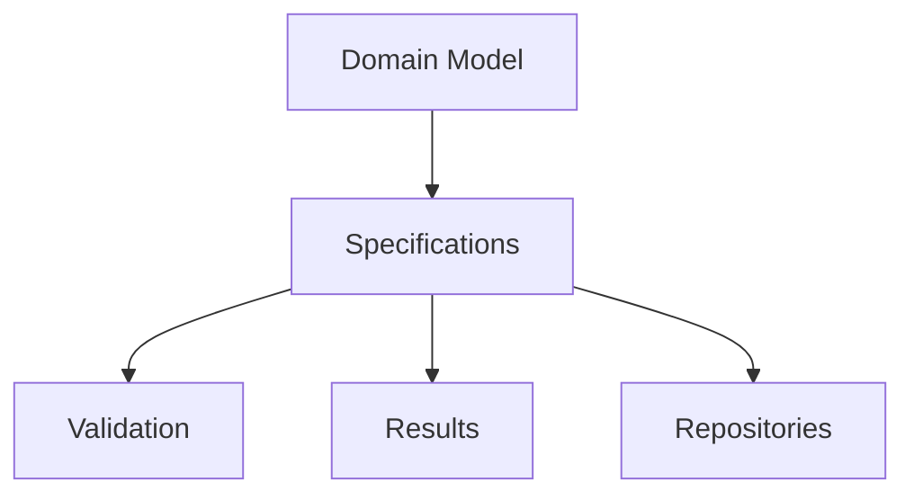

Specifications provide reusable business knowledge that may be consumed by multiple architectural components.

---

# Business-Oriented Design

Specifications should always describe business concepts rather than technical operations.

Examples of well-designed specifications include:

- ActiveCustomerSpecification
- PremiumMemberSpecification
- OverdueInvoiceSpecification
- EligibleForPromotionSpecification

Poor examples include:

- SqlCustomerFilter
- LinqWhereClause
- EntityFrameworkPredicate

Business terminology should always take precedence.

---

# Framework Independence

The Specification subsystem deliberately avoids assumptions regarding:

- LINQ providers;
- expression translators;
- ORM implementations;
- query optimizers;
- persistence engines.

Its responsibility is to express business intent independently of execution technology.

---

# Composability

One of the primary strengths of the Specification Pattern is composability.

Simple specifications can be combined into more expressive business rules.

Conceptually:

```text
Premium Customer

AND

Active Subscription

AND

No Outstanding Debt
```

becomes

```text
EligibleForPrioritySupport
```

Composition enables business complexity to emerge naturally without increasing implementation complexity.

---

# Separation of Responsibilities

The Specification subsystem focuses exclusively on evaluating business predicates.

It does not:

- modify domain state;
- execute commands;
- persist entities;
- dispatch events;
- perform validation messaging;
- manage transactions.

These responsibilities belong to other Shared Kernel modules.

---

# Relationship with Other Modules

The Specification subsystem integrates naturally with:

- **Validation**, by evaluating reusable business conditions;
- **Results**, by producing success or failure outcomes;
- **Domain Events**, by determining when business facts may occur;
- **Repositories**, by expressing reusable filtering criteria;
- **Aggregates**, by enforcing business invariants.

Each subsystem remains independent while collaborating through clearly defined abstractions.

---

# Intended Audience

This document is intended for:

- software architects;
- domain model designers;
- backend developers;
- library maintainers;
- reviewers responsible for preserving architectural consistency.

It assumes familiarity with:

- Domain-Driven Design;
- Clean Architecture;
- object-oriented programming;
- C#;
- SOLID principles.

---

# Document Organization

This document progresses from architectural concepts toward concrete implementation.

The chapters cover:

1. architectural philosophy;
2. design goals;
3. core abstractions;
4. lifecycle;
5. composition;
6. repository integration;
7. performance;
8. concurrency;
9. versioning;
10. implementation examples.

Each chapter builds upon the concepts introduced previously.

---

# Architectural Characteristics

The Specification subsystem is designed to be:

- expressive;
- composable;
- immutable;
- reusable;
- deterministic;
- framework independent;
- highly testable;
- extensible.

These characteristics guide every design decision within the subsystem.

---

# Architectural Invariant

> **Every Specification within KUKULCAN.SharedKernel shall represent a reusable and framework-independent business predicate expressed entirely in domain terminology, remaining immutable, composable, deterministic, and free of infrastructure concerns while enabling consistent evaluation of business rules across aggregates, repositories, validation workflows, and application services without duplicating business logic or compromising the principles of Domain-Driven Design and Clean Architecture.**

This invariant governs the design and evolution of every Specification within the Shared Kernel.

---

# Summary

The Specification Pattern provides the architectural mechanism through which reusable business predicates are modeled within **KUKULCAN.SharedKernel**.

By encapsulating business rules into immutable, composable, framework-independent objects, the subsystem enables consistent business rule evaluation across the Domain Model while reducing duplication, improving maintainability, increasing testability, and preserving strict separation between business intent and technical implementation, thereby establishing a robust foundation for the remaining chapters of this document.

# 2. Philosophy

The philosophy of the **Specification Pattern** within **KUKULCAN.SharedKernel** is founded on the belief that business rules are part of the Domain Model and therefore deserve to be represented as explicit domain concepts rather than hidden inside conditional statements, repository queries, or application services.

A business rule is not merely a boolean expression.

It represents knowledge about the business domain.

That knowledge should be:

- explicit;
- reusable;
- composable;
- testable;
- technology independent.

Specifications provide the architectural mechanism for achieving these goals.

---

## Architectural Principle

Business knowledge should be modeled as reusable domain abstractions rather than repeated implementation details.

> **Business rules are part of the Domain Model, not part of the infrastructure.**

---

# Business Rules as Domain Concepts

A Specification represents business intent.

Instead of asking:

> "How do I filter this collection?"

the Domain asks:

> "Does this object satisfy this business rule?"

This distinction separates business semantics from implementation mechanics.

For example:

```text
Customer.IsPremium
```

is more meaningful than:

```text
Customer.TotalPurchases > 10000
```

The Specification communicates the business concept rather than the implementation details.

---

# Declarative Rather Than Imperative

Specifications encourage a declarative programming style.

Imperative code typically focuses on *how* to evaluate a condition.

Example:

```text
if (...)
{
    ...
}
```

A Specification instead focuses on *what* business rule is being evaluated.

Conceptually:

```text
PremiumCustomerSpecification
```

This shift greatly improves readability and maintainability.

---

# Explicit Business Language

Every Specification should be named using the Ubiquitous Language of the business domain.

Correct examples:

- EligibleForPromotionSpecification
- ActiveSubscriptionSpecification
- OverdueInvoiceSpecification

Incorrect examples:

- CustomerPredicate
- QueryFilter
- SqlExpression

Specifications should always express business terminology.

---

# Encapsulation of Business Knowledge

A Specification encapsulates one coherent business rule.

Consumers do not need to know:

- how the rule is evaluated;
- which fields are involved;
- which calculations are performed.

They only need to know whether the rule is satisfied.

This reinforces encapsulation and information hiding.

---

# Reusability

Business rules frequently appear in multiple places.

For example:

- Aggregate methods;
- Validation workflows;
- Repository queries;
- Application services;
- Domain Event handlers.

Without Specifications, the same rule is often duplicated.

With Specifications:

```text
Business Rule

↓

Specification

↓

Reused Everywhere
```

One implementation serves every consumer.

---

# Composition Instead of Duplication

Business complexity should emerge through composition rather than duplicated logic.

Simple rules may be combined into richer business concepts.

Example:

```text
PremiumCustomer

AND

ActiveSubscription

AND

NoOutstandingDebt
```

Each rule remains independent while forming a larger business policy.

Composition encourages modular design.

---

# Single Responsibility

Each Specification should represent one business concept.

Avoid Specifications that evaluate unrelated rules simultaneously.

Correct:

```text
ActiveCustomerSpecification
```

Incorrect:

```text
ActiveCustomerWithValidAddressAndNoDebtSpecification
```

Complex business policies should emerge through composition rather than oversized Specifications.

---

# Technology Neutrality

Specifications describe business intent independently of execution technology.

They should not know whether evaluation occurs:

- in memory;
- against a database;
- through LINQ;
- through an ORM;
- via a distributed service.

Execution technology belongs to Infrastructure.

Business meaning belongs to the Domain.

---

# Persistence Independence

Specifications should never be designed around database capabilities.

Avoid concepts such as:

- SQL optimization;
- index usage;
- query hints;
- provider limitations.

Instead, express only business semantics.

Infrastructure remains responsible for efficient execution.

---

# Predictability

Evaluating the same Specification against the same object should always produce the same result.

Specifications should therefore be:

- deterministic;
- side-effect free;
- stable.

Deterministic behavior simplifies reasoning, testing, and maintenance.

---

# Side-Effect Free Evaluation

Evaluating a Specification should never modify state.

A Specification should not:

- update aggregates;
- create entities;
- raise Domain Events;
- call external services;
- write to databases.

Evaluation is purely observational.

---

# Relationship with Validation

Specifications complement validation rather than replace it.

Validation answers:

> "Is this input structurally correct?"

Specifications answer:

> "Does this domain object satisfy a business rule?"

Both subsystems collaborate while remaining independent.

---

# Relationship with Aggregates

Aggregate Roots frequently use Specifications to enforce business invariants.

Example:

```text
Aggregate

↓

Evaluate Specification

↓

Allow or Reject Operation
```

The Aggregate owns the decision.

The Specification owns the business predicate.

---

# Relationship with Repositories

Repositories may reuse Specifications to describe retrieval criteria.

The Repository interprets the Specification.

The Specification remains unaware of persistence.

This preserves separation of concerns.

---

# Relationship with Domain Events

Specifications often determine whether a Domain Event may be raised.

Example:

```text
Specification Satisfied

↓

Aggregate State Change

↓

Raise Domain Event
```

Specifications influence business behavior without directly producing side effects.

---

# Long-Term Maintainability

Business rules inevitably evolve.

Specifications isolate those changes.

Instead of modifying many code locations:

```text
Business Rule

↓

Specification

↓

Single Update
```

Centralizing business knowledge dramatically improves maintainability.

---

# Testability

Specifications are naturally easy to test because they are:

- deterministic;
- isolated;
- immutable;
- side-effect free.

Each Specification can be verified independently of the rest of the application.

---

# Evolution

New business requirements should generally introduce:

- new Specifications;
- composed Specifications;
- refined business policies.

Existing Specifications should remain stable whenever possible.

This preserves backward compatibility and minimizes regression risk.

---

# Architectural Characteristics

The philosophical foundation of the Specification subsystem promotes:

- explicit business language;
- reusable business knowledge;
- declarative modeling;
- deterministic behavior;
- composition;
- technology independence;
- long-term maintainability.

These characteristics define the architectural identity of the subsystem.

---

# Architectural Constraints

Every Specification should satisfy the following principles.

- Represent one business concept.
- Remain immutable.
- Remain side effect free.
- Use domain terminology.
- Be framework independent.
- Be composable.
- Be deterministic.

Violating these principles weakens the overall architecture.

---

# Architectural Invariant

> **Every Specification within KUKULCAN.SharedKernel shall encapsulate exactly one reusable business predicate expressed entirely in the Ubiquitous Language of the Domain, remaining immutable, deterministic, side effect free, composable, and independent of persistence technologies or infrastructure concerns, thereby ensuring that business knowledge remains explicit, maintainable, reusable, and consistently applicable throughout the entire Domain Model.**

This invariant defines the philosophical foundation upon which the Specification subsystem is built.

---

# Summary

The philosophy of the Specification Pattern within **KUKULCAN.SharedKernel** is centered on treating business rules as explicit domain concepts rather than hidden implementation details.

By modeling business predicates as immutable, reusable, composable, deterministic, and technology-independent objects, the Specification subsystem enables the Domain Model to express business intent with clarity while reducing duplication, improving maintainability, and preserving strict alignment with the principles of Domain-Driven Design and Clean Architecture.

# 3. Design Goals

The Specification subsystem of **KUKULCAN.SharedKernel** has been designed to provide a robust, reusable, and framework-independent mechanism for expressing business predicates throughout the Domain Model.

Its objective is not simply to encapsulate boolean expressions, but to establish a consistent architectural model through which business rules can be represented, composed, evaluated, tested, and evolved without introducing duplication or coupling.

The design goals presented in this chapter define the architectural qualities expected from every Specification implementation.

---

## Architectural Principle

A well-designed Specification should express business intent once and make it reusable everywhere.

> **Business rules should be reusable assets rather than repeated code fragments.**

---

# Primary Design Goals

The Specification subsystem has been designed to achieve the following primary objectives.

- Eliminate duplicated business predicates.
- Promote reusable business rules.
- Encourage expressive domain models.
- Support composition of complex policies.
- Preserve framework independence.
- Simplify unit testing.
- Enable long-term architectural evolution.

Each objective contributes to the overall quality of the Domain Model.

---

# Goal 1 — Express Business Intent

Every Specification should clearly communicate **what** business rule is being evaluated.

Example:

```text
EligibleForPromotionSpecification
```

communicates business intent immediately.

By contrast:

```text
Customer.TotalPurchases > 10000
```

describes only an implementation detail.

Specifications should elevate business language above technical implementation.

---

# Goal 2 — Centralize Business Rules

A business rule should have a single authoritative implementation.

Without Specifications:

```text
Service A

↓

if (...)

Service B

↓

if (...)

Repository

↓

if (...)
```

The same rule is duplicated multiple times.

With Specifications:

```text
Business Rule

↓

Specification

↓

Shared Everywhere
```

Centralization reduces maintenance costs and prevents inconsistent behavior.

---

# Goal 3 — Enable Composition

Simple Specifications should combine naturally into richer business policies.

Conceptually:

```text
Specification A

AND

Specification B

OR

Specification C
```

Composition allows complex business behavior to emerge without increasing implementation complexity.

---

# Goal 4 — Preserve Domain Purity

Specifications should remain part of the Domain.

They should never depend upon:

- databases;
- ORMs;
- repositories;
- HTTP;
- messaging;
- cloud SDKs.

Their sole responsibility is expressing business predicates.

---

# Goal 5 — Promote Reuse

The same Specification should be reusable across multiple architectural layers.

Examples include:

- Aggregate methods;
- Validation workflows;
- Repository queries;
- Domain Services;
- Application Services;
- Domain Event handlers.

Reuse reduces duplication while improving consistency.

---

# Goal 6 — Improve Readability

Specifications replace implementation details with meaningful business concepts.

Compare:

```text
if (customer.TotalPurchases > 10000 &&
    customer.IsActive &&
    !customer.HasDebt)
```

versus:

```text
EligibleForPrioritySupportSpecification
```

The latter communicates intent rather than mechanics.

---

# Goal 7 — Simplify Testing

Each Specification should be independently testable.

Testing should verify only:

- business inputs;
- expected outcomes.

No infrastructure should be required.

Example:

```text
Input

↓

Specification

↓

True / False
```

Simple tests increase confidence while reducing maintenance.

---

# Goal 8 — Encourage Determinism

Given identical input, a Specification should always produce the same result.

Specifications should therefore avoid:

- mutable state;
- random values;
- current time;
- external services;
- database access.

Deterministic behavior improves reliability and reproducibility.

---

# Goal 9 — Support Aggregate Consistency

Aggregate Roots frequently rely upon Specifications before performing state transitions.

Example:

```text
Aggregate

↓

Specification

↓

Business Decision
```

Specifications support consistency without taking ownership of aggregate behavior.

---

# Goal 10 — Enable Repository Filtering

Repositories may interpret Specifications to construct queries.

The Specification itself remains unaware of:

- SQL;
- LINQ providers;
- query optimizers;
- persistence engines.

Business meaning remains isolated from query implementation.

---

# Goal 11 — Support Future Evolution

Business rules inevitably change.

Specifications isolate these changes by providing one reusable implementation.

Instead of modifying multiple locations:

```text
Business Rule

↓

Specification

↓

Single Update
```

This greatly improves maintainability.

---

# Goal 12 — Minimize Coupling

Specifications should depend only upon:

- the Domain Model;
- business concepts;
- shared abstractions.

They should never depend upon infrastructure implementations.

Loose coupling enables architectural flexibility.

---

# Goal 13 — Maximize Cohesion

Every Specification should represent one coherent business concept.

Responsibilities should never become mixed.

Correct:

```text
PremiumCustomerSpecification
```

Incorrect:

```text
PremiumCustomerWithEmailValidationAndDiscountCalculationSpecification
```

High cohesion improves readability and reuse.

---

# Goal 14 — Encourage Declarative Modeling

Specifications encourage developers to describe business intent rather than implementation logic.

Instead of writing:

```text
if (...)
```

the Domain expresses:

```text
CustomerCanPlaceOrderSpecification
```

This produces models that are easier to understand and discuss with domain experts.

---

# Goal 15 — Preserve Architectural Independence

Specifications should remain independent of:

- execution engines;
- persistence frameworks;
- dependency injection containers;
- messaging systems;
- cloud platforms.

Technology may evolve.

Business meaning should not.

---

# Goal 16 — Support Performance Without Compromising Design

Performance considerations should never weaken architectural quality.

Preferred optimization strategies include:

- composition;
- expression reuse;
- deterministic evaluation;
- immutable objects.

Correctness always takes precedence over micro-optimization.

---

# Goal 17 — Facilitate Documentation

Well-designed Specifications become self-documenting.

Business terminology provides immediate understanding of domain behavior.

Examples:

- CanShipOrderSpecification
- InvoiceIsOverdueSpecification
- UserHasAdministrativePrivilegesSpecification

Names become part of the Ubiquitous Language.

---

# Goal 18 — Encourage Long-Term Stability

Specifications should evolve gradually.

Whenever possible:

- extend;
- compose;
- introduce new Specifications.

Avoid changing the meaning of existing business predicates unnecessarily.

Stable abstractions reduce regression risk.

---

# Architectural Characteristics

The design goals collectively promote Specifications that are:

- expressive;
- reusable;
- composable;
- deterministic;
- cohesive;
- loosely coupled;
- framework independent;
- highly testable;
- maintainable;
- scalable.

These characteristics define the architectural quality expected from the subsystem.

---

# Architectural Constraints

Every Specification implementation should satisfy the following design constraints.

- Represent one business rule.
- Remain reusable.
- Remain deterministic.
- Avoid infrastructure dependencies.
- Encourage composition.
- Preserve readability.
- Support independent testing.
- Remain technology-agnostic.

Violating these constraints diminishes the long-term value of the Specification subsystem.

---

# Architectural Invariant

> **Every Specification within KUKULCAN.SharedKernel shall be designed to express a single reusable business predicate through explicit domain language, remaining deterministic, composable, framework independent, highly cohesive, loosely coupled, independently testable, and technology-agnostic, thereby enabling consistent business rule evaluation across the Domain Model while minimizing duplication and maximizing long-term maintainability and architectural evolution.**

This invariant defines the design objectives governing every Specification implementation.

---

# Summary

The design goals of the Specification subsystem establish a clear architectural direction centered on reusable business knowledge, explicit domain language, deterministic evaluation, composability, and strict separation from infrastructure concerns.

By fulfilling these objectives, **KUKULCAN.SharedKernel** provides a Specification architecture capable of supporting complex business models while remaining maintainable, extensible, scalable, and fully aligned with the principles of Domain-Driven Design and Clean Architecture.

# 4. Architectural Goals

The Specification subsystem has been architected to become the canonical mechanism for expressing business predicates throughout **KUKULCAN.SharedKernel**.

While the previous chapter defined the functional design objectives, this chapter defines the architectural objectives that govern how the subsystem integrates with the remainder of the Shared Kernel and the overall Clean Architecture.

These goals ensure that Specifications remain reusable, technology independent, highly cohesive, and capable of evolving without compromising the integrity of the Domain Model.

---

## Architectural Principle

Architecture should preserve business knowledge while isolating implementation details.

> **Specifications express business decisions, not execution strategies.**

---

# Primary Architectural Goals

The Specification subsystem has been designed to satisfy the following architectural objectives.

- Preserve Domain purity.
- Centralize business predicates.
- Enable composition.
- Promote architectural consistency.
- Remain persistence agnostic.
- Support future evolution.
- Integrate seamlessly with the remaining Shared Kernel modules.

These goals collectively define the role of Specifications within the architecture.

---

# Goal 1 — Preserve Domain Independence

Specifications belong exclusively to the Domain layer.

They should never depend upon:

- Infrastructure;
- Application Services;
- databases;
- repositories;
- messaging systems;
- external frameworks.

The dependency direction always points inward.

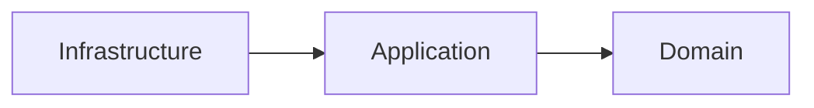

Specifications remain entirely inside the Domain.

---

# Goal 2 — Centralize Business Predicates

Every reusable business predicate should exist in one place.

Instead of repeating logic throughout the solution:

```text
Repository

↓

Aggregate

↓

Service

↓

Handler
```

the architecture becomes:

```text
Specification

↓

Shared Usage
```

Centralization improves consistency and maintainability.

---

# Goal 3 — Enable Composable Business Policies

Business policies frequently consist of multiple smaller rules.

Architecture should encourage composition.

Example:

```text
CanPurchase

=

IsActive

AND

HasCredit

AND

IsVerified
```

Composable Specifications reduce duplication while improving readability.

---

# Goal 4 — Separate Business Semantics from Execution

Specifications describe business meaning.

They do not determine:

- how evaluation occurs;
- where evaluation occurs;
- which technology performs evaluation.

Execution belongs to consumers.

Business intent belongs to the Specification.

---

# Goal 5 — Support Multiple Evaluation Contexts

A Specification should be reusable regardless of where it is evaluated.

Possible evaluation contexts include:

- Aggregate methods;
- in-memory collections;
- repositories;
- application services;
- validation workflows.

The Specification itself remains unchanged.

---

# Goal 6 — Maintain Persistence Agnosticism

The architecture intentionally avoids coupling Specifications to persistence technologies.

Specifications should never reference:

- Entity Framework;
- SQL;
- MongoDB;
- Cosmos DB;
- Dapper;
- provider-specific APIs.

Persistence interpretation belongs entirely to Infrastructure.

---

# Goal 7 — Integrate with Repositories

Repositories should consume Specifications rather than implement business rules.

Conceptually:


Repositories translate business predicates into persistence queries.

Specifications remain persistence independent.

---

# Goal 8 — Integrate with Aggregates

Aggregate Roots frequently rely upon Specifications before performing state transitions.

Conceptually:

```text
Aggregate

↓

Evaluate Specification

↓

Business Decision
```

Specifications assist aggregates without assuming ownership of business behavior.

---

# Goal 9 — Integrate with Validation

Validation and Specifications complement one another.

Validation determines:

```text
Input Correctness
```

Specifications determine:

```text
Business Eligibility
```

Together they provide complete business verification while remaining independent.

---

# Goal 10 — Integrate with Results

Specifications naturally support the Results subsystem.

Conceptually:

```text
Specification

↓

Satisfied?

↓

Result.Success

or

Result.Failure
```

Business predicates become reusable decision points throughout the Domain.

---

# Goal 11 — Integrate with Domain Events

Specifications frequently determine whether an Aggregate may raise a Domain Event.

Example:

```text
Specification Satisfied

↓

Aggregate State Change

↓

Raise Event
```

The Specification influences business behavior without producing side effects.

---

# Goal 12 — Encourage High Cohesion

Each Specification should encapsulate one coherent business concept.

Correct:

```text
EligibleForMembershipSpecification
```

Incorrect:

```text
MembershipSpecificationWithValidationAndPersistence
```

Focused responsibilities simplify maintenance.

---

# Goal 13 — Minimize Coupling

Specifications should depend only upon:

- domain abstractions;
- value objects;
- entities;
- shared domain contracts.

Avoid dependencies upon:

- repositories;
- logging;
- dependency injection;
- infrastructure services.

Loose coupling enables architectural flexibility.

---

# Goal 14 — Promote Testability

The architecture should allow every Specification to be tested independently.

Testing should require only:

- domain objects;
- expected outcomes.

No infrastructure should participate.

Simple tests encourage frequent verification.

---

# Goal 15 — Preserve Deterministic Behavior

Evaluating the same Specification with identical inputs should always produce identical results.

Specifications should therefore avoid:

- randomness;
- mutable global state;
- current time;
- network access;
- persistence.

Determinism simplifies reasoning and replay.

---

# Goal 16 — Support Long-Term Evolution

Business rules inevitably evolve.

Architecture should encourage:

- composition;
- extension;
- new Specifications.

Existing Specifications should remain stable whenever practical.

Stable abstractions reduce regression risk.

---

# Goal 17 — Enable Framework Independence

Specifications should remain usable regardless of the surrounding application stack.

Possible execution environments include:

- monolithic applications;
- microservices;
- cloud-native systems;
- desktop applications;
- background workers.

Business predicates remain identical everywhere.

---

# Goal 18 — Preserve Architectural Consistency

Every Specification should follow the same architectural conventions.

This consistency enables developers to understand new Specifications immediately.

Consistent abstractions reduce cognitive complexity across the entire Shared Kernel.

---

# Relationship with SharedKernel Modules

The Specification subsystem collaborates with multiple Shared Kernel modules.

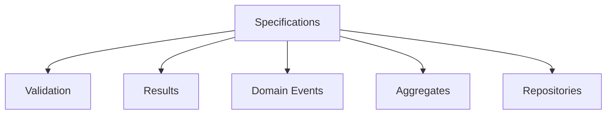

Each subsystem consumes Specifications without introducing circular dependencies.

---

# Architectural Characteristics

The architectural goals collectively promote Specifications that are:

- framework independent;
- persistence agnostic;
- highly cohesive;
- loosely coupled;
- deterministic;
- composable;
- reusable;
- scalable;
- testable;
- maintainable.

These characteristics define the architectural identity of the subsystem.

---

# Architectural Constraints

Every Specification implementation shall satisfy the following architectural constraints.

- Belong exclusively to the Domain layer.
- Avoid infrastructure dependencies.
- Express one business predicate.
- Remain deterministic.
- Support composition.
- Preserve persistence independence.
- Integrate through abstractions only.
- Maintain architectural consistency.

Violating these constraints weakens the integrity of the Shared Kernel.

---

# Architectural Invariant

> **Every Specification within KUKULCAN.SharedKernel shall function as a framework-independent architectural abstraction representing a single reusable business predicate, integrating consistently with Aggregates, Validation, Results, Domain Events, and Repositories through explicit domain contracts while preserving deterministic behavior, persistence independence, loose coupling, high cohesion, and complete adherence to the dependency rules defined by Domain-Driven Design and Clean Architecture.**

This invariant governs the architectural role of every Specification within the Shared Kernel.

---

# Summary

The architectural goals of the Specification subsystem establish its position as the central mechanism for expressing reusable business predicates throughout **KUKULCAN.SharedKernel**.

By preserving Domain independence, enabling composition, maintaining persistence agnosticism, integrating consistently with the remaining Shared Kernel modules, and enforcing deterministic, highly cohesive, and loosely coupled designs, the Specification architecture provides a robust foundation capable of supporting complex enterprise business models while remaining fully aligned with the principles of Domain-Driven Design and Clean Architecture.

# 5. Specification Fundamentals

The **Specification Pattern** is a domain modeling technique that encapsulates business predicates into explicit, reusable, and composable objects.

Within **KUKULCAN.SharedKernel**, a Specification represents a business rule that determines whether a domain object satisfies a particular business condition.

Unlike validation rules, which typically verify structural correctness, or queries, which retrieve information, Specifications express business knowledge.

They answer one fundamental question:

> **Does this domain object satisfy this business rule?**

This distinction makes Specifications an essential building block of the Domain Model.

---

## Architectural Principle

A Specification represents knowledge about the business domain, not knowledge about the underlying implementation.

> **Specifications describe what is true, never how truth is evaluated.**

---

# Definition

A Specification is an immutable object that encapsulates one business predicate.

Conceptually:

```text
Domain Object

↓

Specification

↓

Satisfied?

↓

True / False
```

The Specification owns the business criterion.

The Domain Object owns the business state.

---

# What a Specification Represents

A Specification represents a business concept.

Examples include:

- Customer is eligible for membership.
- Invoice is overdue.
- Order may be canceled.
- Employee is authorized.
- Product is available.

These concepts belong to the Domain, regardless of how they are evaluated.

---

# What a Specification Is Not

A Specification is **not**:

- a database query;
- a LINQ expression;
- a SQL filter;
- an ORM abstraction;
- a validation message;
- a command;
- a business process.

It is purely a reusable business predicate.

---

# Boolean Semantics

Every Specification ultimately evaluates to a boolean result.

Conceptually:

```text
Satisfied

↓

True
```

or

```text
Not Satisfied

↓

False
```

Although implementations may expose additional metadata, the fundamental semantic remains binary.

---

# Business-Oriented Modeling

Specifications should always describe business intent.

Correct:

```text
EligibleForPromotionSpecification
```

Incorrect:

```text
PurchasesGreaterThan10000Specification
```

The first describes the business concept.

The second exposes implementation details.

---

# Immutability

Specifications should remain immutable throughout their lifetime.

Once created, they should never modify:

- internal state;
- business criteria;
- evaluation behavior.

Immutability guarantees:

- thread safety;
- deterministic behavior;
- predictable reuse.

---

# Statelessness

Specifications should avoid mutable runtime state.

Evaluation should depend only upon:

- the Specification itself;
- the object being evaluated.

No hidden state should influence the outcome.

---

# Deterministic Evaluation

Given identical input, a Specification must always produce the same result.

Incorrect dependencies include:

- current time;
- random numbers;
- mutable global state;
- external services.

Business predicates should remain predictable.

---

# Side-Effect Free Evaluation

Evaluating a Specification should never change the Domain Model.

Evaluation should not:

- modify entities;
- raise events;
- persist data;
- invoke repositories;
- call external APIs.

Specifications observe.

They never mutate.

---

# Single Responsibility

Each Specification should represent one business concept.

Correct:

```text
PremiumCustomerSpecification
```

Incorrect:

```text
PremiumCustomerWithDebtVerificationAndEmailValidationSpecification
```

Complex business policies should emerge through composition.

---

# Reusability

One Specification should be reusable across the entire solution.

Examples:

```text
Aggregate

↓

Repository

↓

Validation

↓

Application Service
```

The business predicate remains identical regardless of the consumer.

---

# Composition

Simple Specifications may be combined into richer business policies.

Conceptually:

```text
Specification A

AND

Specification B
```

or

```text
Specification A

OR

Specification B
```

Composition enables scalable business modeling.

---

# Domain Ownership

Specifications belong to the Domain.

They should not belong to:

- Infrastructure;
- repositories;
- databases;
- ORM providers;
- messaging systems.

Business knowledge remains inside the Domain Model.

---

# Persistence Independence

Specifications intentionally avoid assumptions regarding persistence.

Whether evaluation occurs:

- in memory;
- through Entity Framework;
- using MongoDB;
- via SQL;

is irrelevant to the Specification itself.

Execution strategy belongs elsewhere.

---

# Aggregate Collaboration

Aggregate Roots frequently evaluate Specifications before performing business operations.

Example:

```text
Aggregate

↓

Specification

↓

Business Decision
```

The Aggregate remains responsible for state transitions.

The Specification remains responsible for business predicates.

---

# Validation Collaboration

Validation answers:

```text
Is the input valid?
```

Specifications answer:

```text
Does the business rule hold?
```

Both concepts complement one another without overlapping responsibilities.

---

# Repository Collaboration

Repositories may interpret Specifications to retrieve matching entities.

Conceptually:


The Repository performs interpretation.

The Specification remains technology independent.

---

# Domain Event Collaboration

Specifications frequently determine whether a Domain Event may be generated.

Example:

```text
Specification Satisfied

↓

Aggregate State Change

↓

Raise Domain Event
```

The Specification influences business decisions while remaining free of side effects.

---

# Expression of Ubiquitous Language

Specifications contribute directly to the Ubiquitous Language of the Domain.

Well-designed Specifications become recognizable business concepts shared by:

- developers;
- architects;
- domain experts;
- analysts.

This improves communication across the project.

---

# Lifecycle

The lifecycle of a Specification is intentionally simple.

```text
Create

↓

Reuse

↓

Evaluate

↓

Dispose (if applicable)
```

Because Specifications are immutable, they may safely be reused indefinitely.

---

# Architectural Characteristics

Fundamentally, every Specification should be:

- immutable;
- deterministic;
- reusable;
- composable;
- expressive;
- framework independent;
- side-effect free;
- business-oriented.

These characteristics distinguish Specifications from ordinary predicates.

---

# Architectural Constraints

Every Specification shall satisfy the following fundamental constraints.

- Represent one business predicate.
- Remain immutable.
- Be side effect free.
- Remain deterministic.
- Avoid infrastructure dependencies.
- Express business terminology.
- Support composition.
- Preserve Domain ownership.

These constraints define the core nature of the Specification Pattern.

---

# Architectural Invariant

> **Every Specification within KUKULCAN.SharedKernel shall represent exactly one immutable, deterministic, side effect free, and reusable business predicate expressed through the Ubiquitous Language of the Domain, remaining entirely independent of persistence technologies, infrastructure implementations, and execution strategies while providing a consistent architectural abstraction for evaluating business knowledge across the entire Domain Model.**

This invariant defines the fundamental nature of every Specification within the Shared Kernel.

---

# Summary

The fundamentals of the Specification Pattern establish it as the canonical mechanism for representing reusable business predicates within **KUKULCAN.SharedKernel**.

By treating business rules as immutable, deterministic, side effect free, and framework-independent domain concepts, Specifications enable the Domain Model to express business knowledge explicitly while supporting composition, reuse, architectural consistency, and long-term maintainability in full accordance with the principles of Domain-Driven Design and Clean Architecture.

# 6. Specification Taxonomy

The Specification subsystem of **KUKULCAN.SharedKernel** defines a taxonomy that classifies Specifications according to their architectural role rather than their implementation.

This taxonomy provides a common vocabulary for understanding how different kinds of Specifications collaborate to express increasingly sophisticated business policies while preserving the principles of Domain-Driven Design (DDD), Clean Architecture, and SOLID.

The classification presented in this chapter is conceptual.

Concrete implementations may vary, but every Specification should fit into one of the categories described below.

---

## Architectural Principle

Business complexity should emerge through the composition of simple, well-defined Specifications.

> **Small business predicates compose into rich business policies.**

---

# Purpose of the Taxonomy

The taxonomy serves several architectural purposes.

- Establish a common architectural vocabulary.
- Clarify responsibilities.
- Promote consistency.
- Encourage composition.
- Reduce duplication.
- Improve discoverability.
- Simplify maintenance.

A shared classification enables architects and developers to reason about business rules using the same terminology.

---

# Taxonomy Overview

The Specification subsystem classifies Specifications into the following conceptual categories.

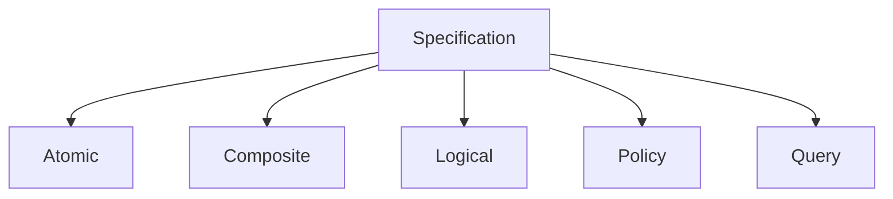

Each category fulfills a distinct architectural purpose.

---

# Atomic Specifications

An **Atomic Specification** represents one indivisible business predicate.

Examples:

- ActiveCustomerSpecification
- PremiumMemberSpecification
- InvoicePaidSpecification

Characteristics:

- one business concept;
- deterministic;
- reusable;
- immutable.

Atomic Specifications form the foundation of the subsystem.

---

# Composite Specifications

Composite Specifications combine multiple Specifications into a larger business rule.

Example:

```text
Premium Customer

AND

Active Membership
```

becomes

```text
EligibleForPrioritySupport
```

Composite Specifications should not introduce new evaluation mechanisms.

They simply orchestrate existing Specifications.

---

# Logical Specifications

Logical Specifications express boolean composition.

Typical operators include:

- AND
- OR
- NOT

Example:

```text
Specification A

AND

Specification B
```

Logical Specifications enable business rules to grow without increasing implementation complexity.

---

# Policy Specifications

Policy Specifications represent higher-level business policies.

Unlike Atomic Specifications, they usually compose several business predicates into one recognizable domain concept.

Example:

```text
LoanApprovalPolicy
```

internally may evaluate:

- credit score;
- outstanding debt;
- employment history;
- customer status.

Consumers interact only with the policy.

---

# Query Specifications

Some Specifications describe retrieval criteria.

Example:

```text
OverdueInvoicesSpecification
```

Although repositories may interpret these Specifications, the Specification itself remains persistence agnostic.

Query Specifications describe *which* business objects satisfy a condition—not *how* they are retrieved.

---

# Aggregate Specifications

Aggregate Specifications evaluate business rules related to Aggregate state.

Examples:

- CanShipOrderSpecification
- CanCancelInvoiceSpecification
- CanCloseAccountSpecification

Aggregate Specifications often participate directly in enforcing business invariants.

---

# Entity Specifications

Entity Specifications evaluate individual entities.

Examples:

- AdultCustomerSpecification
- VerifiedUserSpecification
- ActiveSubscriptionSpecification

They typically evaluate properties belonging to a single entity.

---

# Value Object Specifications

Some Specifications operate on Value Objects.

Examples:

- ValidMoneyRangeSpecification
- SupportedCurrencySpecification
- ValidPostalCodeSpecification

Although less common, they remain useful for reusable domain concepts.

---

# Cross-Aggregate Specifications

Occasionally a business rule depends upon information spanning multiple Aggregates.

Rather than allowing Aggregates to communicate directly, the architecture encourages expressing the rule through a Specification evaluated by an Application Service or Domain Service.

Example:

```text
Customer

+

Membership

↓

EligibleForRewardSpecification
```

Aggregate autonomy remains preserved.

---

# Temporal Specifications

Certain Specifications evaluate time-dependent business rules.

Examples:

- MembershipExpiredSpecification
- InvoiceOverdueSpecification
- SubscriptionRenewalDueSpecification

These Specifications should obtain time through abstractions such as `IClock` rather than directly using the system clock.

This preserves determinism and testability.

---

# Authorization Specifications

Authorization may also be represented through Specifications.

Examples:

- UserCanApproveOrderSpecification
- UserCanModifyCustomerSpecification
- UserHasAdministrativePrivilegesSpecification

Business authorization remains inside the Domain Model rather than being scattered throughout application logic.

---

# Validation-Oriented Specifications

Specifications frequently support validation workflows.

Example:

```text
CustomerEligibleSpecification
```

Validation may depend upon this Specification without duplicating business logic.

Validation verifies correctness.

Specifications verify business eligibility.

---

# Repository Specifications

Repositories consume Specifications rather than embedding business predicates.

Conceptually:


The Repository interprets.

The Specification remains unaware of persistence.

---

# Domain Event Specifications

Specifications frequently determine whether an Aggregate may raise a Domain Event.

Conceptually:

```text
Business Predicate

↓

Satisfied

↓

Raise Domain Event
```

Specifications influence business behavior without producing side effects.

---

# Composite Hierarchy

The taxonomy naturally forms a hierarchy.

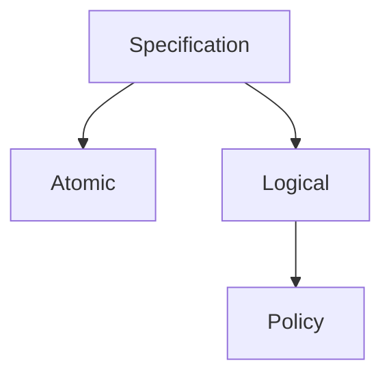

Complex policies emerge from simpler building blocks.

---

# Recommended Usage

Prefer:

- Atomic Specifications for individual rules.
- Composite Specifications for business policies.
- Logical Specifications for boolean composition.
- Policy Specifications for high-level business concepts.

Avoid oversized Specifications attempting to perform multiple unrelated responsibilities.

---

# Architectural Characteristics

The taxonomy encourages Specifications that are:

- modular;
- composable;
- reusable;
- deterministic;
- cohesive;
- loosely coupled;
- expressive;
- framework independent.

These characteristics scale naturally as business complexity increases.

---

# Architectural Constraints

Every Specification should belong conceptually to one primary category.

Specifications should not:

- mix unrelated responsibilities;
- combine infrastructure concerns;
- violate aggregate boundaries;
- duplicate existing business predicates.

The taxonomy exists to preserve conceptual clarity.

---

# Architectural Invariant

> **Every Specification within KUKULCAN.SharedKernel shall belong to a clearly identifiable architectural category that reflects its business responsibility, whether atomic, logical, composite, policy-oriented, or query-oriented, thereby ensuring consistent modeling, predictable composition, high cohesion, low coupling, and scalable representation of business knowledge while preserving complete independence from infrastructure, persistence technologies, and execution mechanisms.**

This invariant governs the conceptual classification of Specifications throughout the Shared Kernel.

---

# Summary

The Specification taxonomy defines a structured classification system that enables architects and developers to model business predicates consistently across **KUKULCAN.SharedKernel**.

By distinguishing between Atomic, Composite, Logical, Policy, Query, Aggregate, Entity, Value Object, Temporal, Authorization, Validation, and Repository-oriented Specifications, the architecture promotes modularity, reuse, composability, and long-term maintainability while preserving strict adherence to the principles of Domain-Driven Design and Clean Architecture.

# 7. Core Components

The Specification subsystem is composed of a small set of highly cohesive architectural components that collectively provide the foundation for expressing, composing, evaluating, and managing business predicates throughout **KUKULCAN.SharedKernel**.

Each component has a single, well-defined responsibility and collaborates with the others through stable abstractions.

The objective of this design is to maximize:

- readability;
- reuse;
- composability;
- maintainability;
- extensibility;
- framework independence.

Together, these components form the complete architectural model of the Specification subsystem.

---

## Architectural Principle

Each architectural component should have one responsibility and collaborate through abstractions.

> **Small, focused components produce scalable architectures.**

---

# Architectural Overview

The Specification subsystem is organized around a layered hierarchy of abstractions.

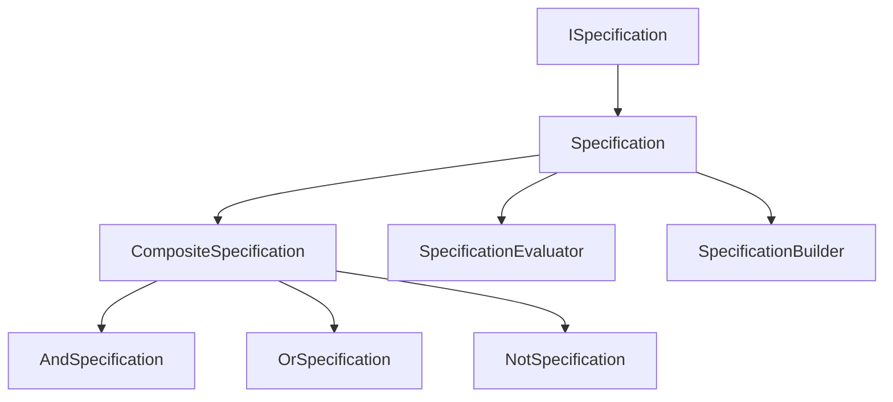

Each component extends the architectural capabilities of the previous layer without violating the Dependency Rule.

---

# Component Responsibilities

The following table summarizes the responsibility of every core component.

| Component                  | Responsibility                                       |
|----------------------------|------------------------------------------------------|
| **ISpecification**         | Defines the contract for all Specifications.         |
| **Specification**          | Base implementation of reusable business predicates. |
| **CompositeSpecification** | Base class for Specification composition.            |
| **AndSpecification**       | Logical conjunction of two Specifications.           |
| **OrSpecification**        | Logical disjunction of two Specifications.           |
| **NotSpecification**       | Logical negation of a Specification.                 |
| **SpecificationEvaluator** | Executes Specification evaluation.                   |
| **SpecificationBuilder**   | Provides fluent composition of Specifications.       |

Each component exists to solve exactly one architectural concern.

---

# Design Philosophy

The subsystem intentionally favors:

- composition over inheritance;
- abstraction over implementation;
- immutability over mutable state;
- declarative modeling over imperative logic.

Each component contributes one capability while remaining independent of infrastructure.

---

# Component Collaboration

A typical execution flow follows the sequence below.

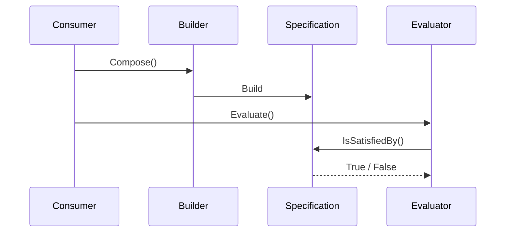

Every participant owns a single responsibility.

---

# Layered Responsibilities

Conceptually, the subsystem may be viewed as four architectural layers.

```text
Contracts

↓

Business Specifications

↓

Composition

↓

Evaluation
```

Each layer depends only upon the abstractions immediately below it.

---

# Component Characteristics

Every core component should be:

- immutable;
- deterministic;
- side-effect free;
- reusable;
- framework independent;
- highly cohesive;
- loosely coupled.

These characteristics remain consistent throughout the subsystem.

---

# Contracts

Architectural contracts define behavior without prescribing implementation.

Examples include:

- `ISpecification<T>`

Contracts promote:

- extensibility;
- testability;
- dependency inversion.

Implementations remain interchangeable.

---

# Base Implementations

Base classes eliminate duplication while preserving flexibility.

They provide:

- shared behavior;
- common abstractions;
- composition support;
- operator overloading (when appropriate).

Derived Specifications focus exclusively on business intent.

---

# Composition Components

Composition components enable increasingly sophisticated business policies without increasing implementation complexity.

Supported composition includes:

- conjunction;
- disjunction;
- negation.

Composition is the primary mechanism through which business complexity scales.

---

# Evaluation Components

Evaluation components are responsible for executing business predicates.

They do **not**:

- modify domain objects;
- persist data;
- invoke infrastructure;
- produce side effects.

Evaluation remains purely observational.

---

# Builder Components

Builders improve developer experience by providing fluent APIs for constructing Specifications.

Conceptually:

```text
Specification

↓

Builder

↓

Composite Specification
```

Builders improve readability without altering business semantics.

---

# Interaction with Aggregates

Aggregate Roots interact primarily with:

- `ISpecification`
- `Specification`

Aggregates should never depend upon:

- builders;
- evaluators;
- composition internals.

The Aggregate only requires the business predicate.

---

# Interaction with Repositories

Repositories frequently consume composed Specifications.

They typically interact with:

- `ISpecification`
- `SpecificationEvaluator`

Repositories interpret Specifications.

They do not own them.

---

# Interaction with Validation

Validation workflows frequently reuse Specifications through the public contract.

This prevents business rule duplication.

Validation remains structurally independent of the Specification subsystem.

---

# Interaction with Domain Events

Specifications frequently determine whether Aggregates may raise Domain Events.

The interaction remains indirect.

Specifications never dispatch events themselves.

---

# Extensibility

The architecture intentionally allows new Specification types to be introduced without modifying existing components.

Future additions may include:

- temporal Specifications;
- authorization Specifications;
- caching decorators;
- optimization layers.

Open/Closed Principle remains preserved.

---

# Framework Independence

None of the core components depend upon:

- Entity Framework;
- LINQ providers;
- dependency injection frameworks;
- persistence engines;
- messaging frameworks.

All technology-specific behavior remains outside the subsystem.

---

# Architectural Characteristics

Collectively, the core components provide:

- clear responsibilities;
- reusable abstractions;
- deterministic execution;
- composability;
- extensibility;
- architectural consistency.

These characteristics define the implementation foundation of the Specification subsystem.

---

# Architectural Constraints

Every core component shall satisfy the following constraints.

- One architectural responsibility.
- Framework independence.
- Immutable behavior.
- Side-effect free execution.
- Dependency inversion.
- High cohesion.
- Low coupling.
- Explicit collaboration.

These constraints preserve architectural integrity.

---

# Relationship Between Components

The following chapters describe each core component individually.

- **7.1** — ISpecification
- **7.2** — Specification
- **7.3** — CompositeSpecification
- **7.4** — AndSpecification
- **7.5** — OrSpecification
- **7.6** — NotSpecification
- **7.7** — SpecificationEvaluator
- **7.8** — SpecificationBuilder

Each chapter expands upon the responsibilities introduced here.

---

# Architectural Invariant

> **Every core component within the Specification subsystem of KUKULCAN.SharedKernel shall provide exactly one architectural responsibility through immutable, deterministic, framework-independent abstractions that collaborate exclusively through explicit contracts, thereby preserving high cohesion, low coupling, composability, extensibility, and full compliance with the Dependency Rule established by Domain-Driven Design and Clean Architecture.**

This invariant governs the architectural design of every component within the Specification subsystem.

---

# Summary

The Specification subsystem is intentionally composed of a minimal set of highly cohesive architectural components that collectively provide the infrastructure required to model reusable business predicates.

By separating contracts, implementations, composition mechanisms, evaluation services, and fluent builders into clearly defined responsibilities, **KUKULCAN.SharedKernel** achieves a Specification architecture that is scalable, extensible, deterministic, framework independent, and fully aligned with the principles of Domain-Driven Design and Clean Architecture.

# 7.1. ISpecification

`ISpecification<T>` is the foundational contract of the entire Specification subsystem.

Every concrete Specification within **KUKULCAN.SharedKernel** ultimately derives its behavior from this interface.

Rather than defining implementation details, `ISpecification<T>` establishes the architectural contract through which business predicates are represented, composed, and evaluated consistently across the Domain Model.

It is intentionally minimal.

Its purpose is to express **what a Specification is**, not **how a Specification works**.

---

## Architectural Principle

Architectural contracts should define behavior while remaining independent of implementation.

> **The Domain depends on abstractions, never on concrete Specifications.**

---

# Purpose

`ISpecification<T>` exists to:

- establish a common Specification contract;
- enable polymorphism;
- support dependency inversion;
- allow Specification composition;
- isolate business rules from implementation details;
- promote architectural consistency.

Every consumer of Specifications should depend upon this contract.

---

# Generic Type Parameter

The generic parameter `T` represents the Domain object evaluated by the Specification.

Example:

```csharp
ISpecification<Customer>
```

indicates that the Specification evaluates instances of `Customer`.

The interface remains completely independent of the evaluated type.

---

# Architectural Position

Within the subsystem hierarchy:

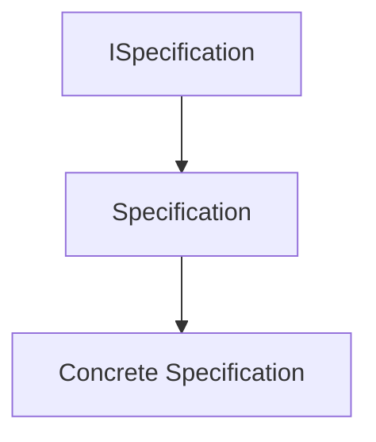

The interface defines the architectural contract.

The remaining classes provide implementation.

---

# Core Responsibility

The interface has one responsibility:

> Define whether a business object satisfies a business predicate.

It does **not**:

- compose Specifications;
- evaluate persistence queries;
- dispatch events;
- generate validation errors;
- interact with repositories.

Those concerns belong elsewhere.

---

# Minimal Contract

Conceptually, the interface exposes one fundamental capability.

```text
Object

↓

Specification

↓

Satisfied?

↓

True / False
```

Everything else builds upon this simple abstraction.

---

# Expected Operations

A typical implementation exposes a method conceptually equivalent to:

```csharp
bool IsSatisfiedBy(T candidate);
```

This operation determines whether the candidate satisfies the business rule represented by the Specification.

Evaluation must remain deterministic.

---

# Deterministic Evaluation

Calling:

```text
IsSatisfiedBy(candidate)
```

multiple times with identical input should always produce identical output.

The contract assumes:

- no hidden state;
- no randomness;
- no infrastructure dependencies;
- no side effects.

Deterministic behavior is a fundamental architectural requirement.

---

# Side-Effect Free Contract

`ISpecification<T>` must never modify:

- the evaluated object;
- global state;
- infrastructure;
- repositories;
- external services.

Evaluation is purely observational.

Specifications answer questions.

They never perform actions.

---

# Business-Oriented Abstraction

The interface represents business knowledge.

Consumers should reason in terms of business concepts.

Example:

```csharp
if (premiumCustomerSpecification.IsSatisfiedBy(customer))
{
    ...
}
```

rather than:

```csharp
if (customer.TotalPurchases > 10000)
{
    ...
}
```

The contract encourages domain language.

---

# Framework Independence

The interface intentionally avoids dependencies upon:

- LINQ;
- Entity Framework;
- SQL;
- dependency injection;
- serialization;
- messaging frameworks.

Its only concern is business evaluation.

---

# Collaboration with Aggregates

Aggregate Roots consume the interface rather than concrete implementations.

Conceptually:

```text
Aggregate

↓

ISpecification<T>

↓

Business Decision
```

This preserves loose coupling.

---

# Collaboration with Repositories

Repositories may interpret Specifications through this abstraction.

The Repository depends upon the contract.

Concrete implementations remain interchangeable.

---

# Collaboration with Validation

Validation workflows frequently reuse `ISpecification<T>`.

Validation does not require knowledge of concrete Specification implementations.

The contract enables reusable business evaluation.

---

# Collaboration with Domain Events

Specifications often determine whether an Aggregate may produce a Domain Event.

The interface itself remains unaware of event generation.

Business predicates remain independent of business consequences.

---

# Open/Closed Principle

New Specifications should be introduced by implementing the interface.

Existing consumers remain unchanged.

Example:

```text
New Business Rule

↓

New Specification

↓

Existing Consumers Continue Working
```

This supports incremental evolution.

---

# Dependency Inversion

High-level Domain components should depend only upon `ISpecification<T>`.

Concrete implementations remain replaceable.

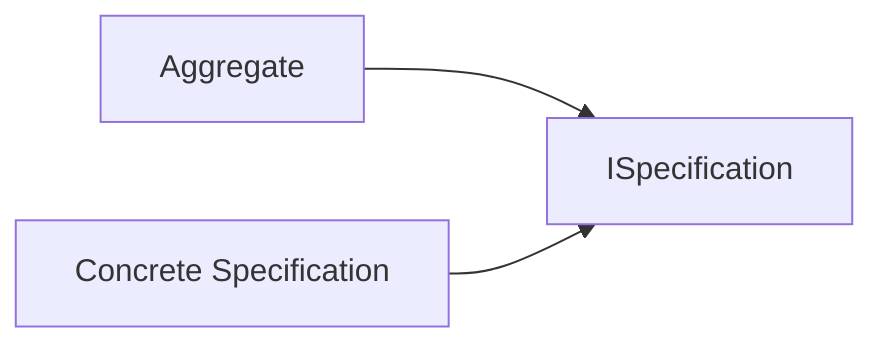

Dependency direction always points toward abstractions.

---

# Testability

Because the interface defines a minimal deterministic contract, Specifications become straightforward to test.

Typical tests verify:

- satisfied candidates;
- unsatisfied candidates;
- edge cases;
- business invariants.

No infrastructure participation is required.

---

# Extensibility

Future Specification types naturally integrate by implementing `ISpecification<T>`.

Examples:

- temporal Specifications;
- authorization Specifications;
- policy Specifications;
- composite Specifications.

The interface remains unchanged.

---

# Architectural Characteristics

`ISpecification<T>` exhibits the following characteristics.

- Generic.
- Immutable by contract.
- Deterministic.
- Framework independent.
- Business-oriented.
- Side-effect free.
- Extensible.
- Highly reusable.

These characteristics define the architectural foundation of the subsystem.

---

# Architectural Constraints

Implementations of `ISpecification<T>` shall satisfy the following constraints.

- Evaluate exactly one business predicate.
- Produce deterministic results.
- Remain side effect free.
- Avoid infrastructure dependencies.
- Preserve business terminology.
- Support composition.
- Remain immutable.

Violating these constraints breaks the architectural contract.

---

# Architectural Invariant

> **Every implementation of `ISpecification<T>` within KUKULCAN.SharedKernel shall provide a deterministic, immutable, side effect free, framework-independent evaluation of exactly one reusable business predicate expressed through the Ubiquitous Language of the Domain, thereby serving as the canonical abstraction for business rule evaluation while preserving loose coupling, dependency inversion, and full compliance with the architectural principles of Domain-Driven Design and Clean Architecture.**

This invariant governs every implementation of the `ISpecification<T>` contract.

---

# Summary

`ISpecification<T>` defines the fundamental architectural abstraction upon which the entire Specification subsystem of **KUKULCAN.SharedKernel** is built.

By providing a minimal, deterministic, framework-independent, and business-oriented contract for evaluating reusable business predicates, it enables Aggregates, Repositories, Validation workflows, Domain Services, and Application Services to collaborate through stable abstractions while maintaining strict adherence to the Dependency Rule, maximizing extensibility, and preserving the architectural integrity of the Domain Model.

# 7.2. Specification

`Specification<T>` is the abstract base implementation of the Specification subsystem.

While `ISpecification<T>` defines the architectural contract, `Specification<T>` provides the common behavior shared by all concrete Specifications within **KUKULCAN.SharedKernel**.

Its purpose is to eliminate duplicated implementation logic while preserving complete flexibility for derived Specifications.

Every business Specification should inherit from this base class rather than implementing `ISpecification<T>` directly unless a specialized implementation is explicitly required.

---

## Architectural Principle

Base classes should provide reusable behavior without constraining business semantics.

> **Specifications inherit infrastructure-neutral behavior, not business knowledge.**

---

# Purpose

`Specification<T>` exists to:

- implement the common Specification contract;
- provide reusable behavior;
- support logical composition;
- reduce duplicated code;
- simplify Specification creation;
- establish architectural consistency.

It represents the canonical implementation foundation of the Specification subsystem.

---

# Architectural Position

Within the subsystem hierarchy:

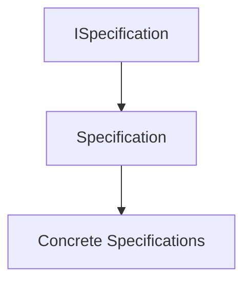

Concrete business Specifications derive from `Specification<T>`.

---

# Responsibilities

The base class is responsible for providing:

- common Specification behavior;
- composition support;
- operator overloads (when implemented);
- reusable helper methods;
- architectural consistency.

It is **not** responsible for implementing business rules.

Business semantics always belong to derived classes.

---

# Abstract Nature

`Specification<T>` should be abstract.

It represents a reusable architectural foundation rather than a business rule itself.

Conceptually:

```text
Specification<T>

↓

Business Specification

↓

CustomerEligibleSpecification
```

Only concrete Specifications represent actual business knowledge.

---

# Business Rule Ownership

The base class owns reusable behavior.

Derived classes own business predicates.

For example:

```text
Specification<T>

↓

Composition Logic

↓

CustomerCanPurchaseSpecification

↓

Business Predicate
```

This separation preserves high cohesion.

---

# Evaluation Contract

Every derived Specification ultimately provides an implementation conceptually equivalent to:

```csharp
public abstract bool IsSatisfiedBy(T candidate);
```

The base class defines the abstraction.

Derived classes define the business rule.

---

# Composition Support

One of the primary responsibilities of `Specification<T>` is enabling composition.

Typical logical operations include:

```text
Specification A

AND

Specification B
```

```text
Specification A

OR

Specification B
```

```text
NOT Specification A
```

The base class provides the architectural mechanisms for composition.

---

# Fluent Composition

When supported, the base class may expose fluent composition methods.

Examples:

```text
specificationA.And(specificationB)
```

```text
specificationA.Or(specificationB)
```

```text
specificationA.Not()
```

These methods improve readability while preserving business semantics.

---

# Operator Support

Some implementations may provide overloaded operators.

Example:

```text
A & B

A | B

!A
```

Operator support is purely syntactic.

It does not alter the architectural behavior of Specifications.

---

# Immutability

Every instance derived from `Specification<T>` should remain immutable.

Once constructed:

- business criteria remain unchanged;
- evaluation logic remains unchanged;
- composition remains unchanged.

Immutability guarantees predictable behavior.

---

# Statelessness

`Specification<T>` should not maintain mutable runtime state.

Evaluation depends only upon:

- the Specification;
- the evaluated candidate.

No hidden state should influence results.

---

# Deterministic Behavior

Repeated evaluation using identical inputs must always produce identical outputs.

Incorrect dependencies include:

- current system time;
- randomness;
- mutable globals;
- external services.

Specifications remain deterministic.

---

# Side-Effect Free Evaluation

The base implementation assumes that Specifications never produce side effects.

Evaluation should never:

- modify aggregates;
- update entities;
- write repositories;
- publish events;
- invoke infrastructure.

Specifications observe only.

---

# Collaboration with Aggregates

Aggregate Roots typically interact with `Specification<T>` rather than concrete implementations.

Conceptually:

```text
Aggregate

↓

Specification<T>

↓

Business Decision
```

The Aggregate owns the state transition.

The Specification owns the predicate.

---

# Collaboration with Repositories

Repositories frequently consume Specifications through the base abstraction.

Repositories interpret Specifications.

Specifications remain persistence agnostic.

---

# Collaboration with Validation

Validation workflows frequently reuse `Specification<T>` to evaluate business eligibility.

Business rules remain centralized.

Validation remains independent.

---

# Collaboration with Domain Events

Specifications frequently determine whether a Domain Event may be generated.

The base class itself remains unaware of event publication.

Business predicates remain independent of business consequences.

---

# Extensibility

New Specification types should inherit from `Specification<T>` whenever possible.

Examples include:

- Policy Specifications;
- Temporal Specifications;
- Authorization Specifications;
- Composite Specifications.

Inheritance promotes reuse without duplicating implementation.

---

# Reuse

The base implementation promotes reuse across:

- Aggregates;
- Repositories;
- Domain Services;
- Validation;
- Application Services.

One implementation serves many consumers.

---

# Architectural Characteristics

`Specification<T>` provides:

- reusable behavior;
- framework independence;
- deterministic execution;
- composability;
- immutability;
- side effect free evaluation;
- extensibility.

These characteristics establish the implementation foundation of the subsystem.

---

# Architectural Constraints

Every class derived from `Specification<T>` shall satisfy the following constraints.

- Represent one business predicate.
- Remain immutable.
- Be deterministic.
- Produce no side effects.
- Avoid infrastructure dependencies.
- Preserve business terminology.
- Support composition.
- Maintain high cohesion.

Violating these constraints weakens the architectural model.

---

# Recommended Inheritance Hierarchy

A typical inheritance structure appears as follows.

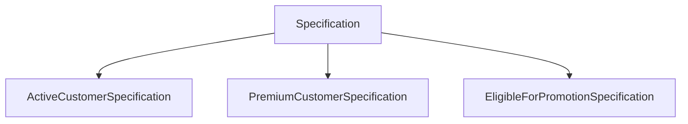

Each derived class contributes only its business predicate.

---

# Architectural Invariant

> **Every class derived from `Specification<T>` within KUKULCAN.SharedKernel shall inherit only reusable architectural behavior while encapsulating exactly one immutable, deterministic, side effect free business predicate expressed through the Ubiquitous Language of the Domain, remaining framework independent, persistence agnostic, composable, highly cohesive, and fully compliant with the architectural principles established by Domain-Driven Design and Clean Architecture.**

This invariant governs every implementation derived from `Specification<T>`.

---

# Summary

`Specification<T>` provides the reusable implementation foundation upon which all concrete business Specifications within **KUKULCAN.SharedKernel** are built.

By centralizing common behavior, enabling fluent and logical composition, preserving immutability, deterministic evaluation, framework independence, and strict separation of responsibilities, the base class allows business Specifications to focus exclusively on expressing business intent while maintaining architectural consistency and maximizing reuse across the entire Domain Model.

# 7.3. CompositeSpecification

`CompositeSpecification<T>` is the abstract architectural foundation for every Specification that combines one or more child Specifications into a larger business predicate.

Its purpose is to support the construction of increasingly sophisticated business policies while preserving the simplicity, immutability, and reusability of individual Specifications.

Rather than implementing new business rules directly, a Composite Specification coordinates existing Specifications according to well-defined logical semantics.

This enables complex business behavior to emerge through composition rather than duplication.

---

## Architectural Principle

Complex business policies should be composed of simple business predicates.

> **Composition is preferred over duplication.**

---

# Purpose

`CompositeSpecification<T>` exists to:

- combine multiple Specifications;
- promote business rule reuse;
- eliminate duplicated logic;
- simplify complex business policies;
- preserve immutability;
- maintain architectural consistency.

It serves as the common foundation for all logical Specification operators.

---

# Architectural Position

Within the Specification hierarchy:

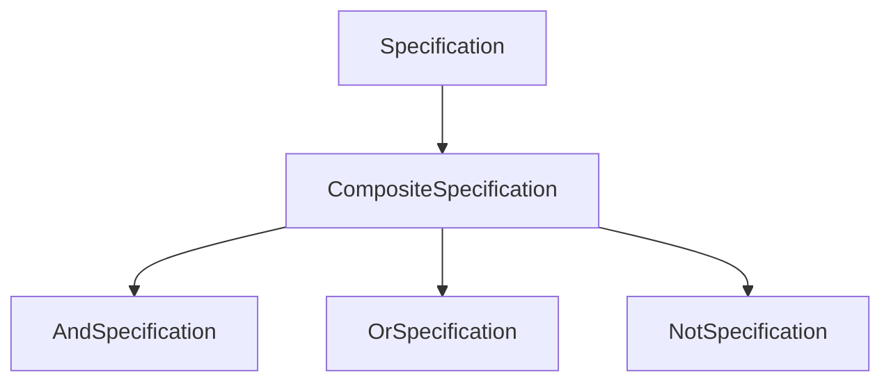

`CompositeSpecification<T>` introduces no business semantics of its own.

It exists solely to coordinate child Specifications.

---

# Conceptual Model

Conceptually, a Composite Specification acts as a business policy.

```text
Business Policy

↓

Composite Specification

↓

Child Specifications

↓

Business Predicate
```

The resulting policy behaves exactly like any other Specification.

Consumers remain unaware of its internal composition.

---

# Composition Rather Than Inheritance

Business complexity should emerge through composition rather than increasingly deep inheritance hierarchies.

Instead of creating:

```text
PremiumActiveVerifiedCustomerSpecification
```

the architecture encourages:

```text
PremiumCustomerSpecification

AND

ActiveCustomerSpecification

AND

VerifiedCustomerSpecification
```

Each business rule remains independent.

---

# Ownership

`CompositeSpecification<T>` owns:

- composition behavior;
- child Specification coordination;
- logical orchestration.

It does **not** own:

- business predicates;
- persistence;
- evaluation strategies;
- infrastructure behavior.

Business semantics remain inside child Specifications.

---

# Child Specifications

A Composite Specification contains one or more child Specifications.

Conceptually:

```text
Composite

↓

Specification A

Specification B

Specification C
```

Each child remains an independent business concept.

---

# Immutability

Once constructed, a Composite Specification should never change its child Specifications.

The collection of children should remain immutable.

Benefits include:

- thread safety;
- deterministic evaluation;
- predictable reuse.

---

# Recursive Composition

Composite Specifications naturally support recursive composition.

Example:

```text
(A AND B)

OR

(C AND D)
```

Conceptually:

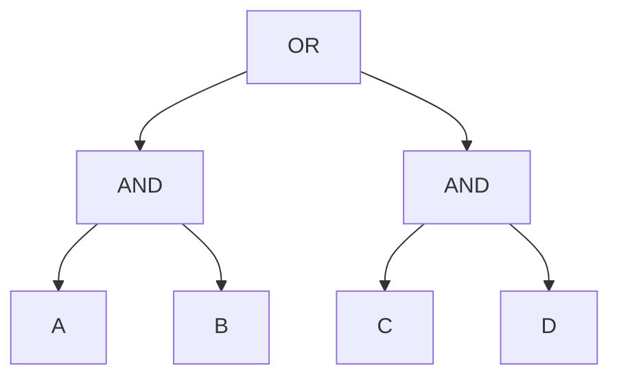

The architecture places no practical limitation on composition depth.

---

# Business Semantics

The Composite Specification represents one recognizable business policy.

Consumers interact only with the resulting Specification.

They remain unaware of:

- child hierarchy;
- evaluation order;
- implementation details.

This preserves encapsulation.

---

# Deterministic Evaluation

Given identical input, the Composite Specification must always produce identical output.

Evaluation depends exclusively upon:

- child Specifications;
- logical composition.

No external state should influence results.

---

# Side-Effect Free Evaluation

Composite Specifications remain purely observational.

Evaluation must never:

- modify aggregates;
- update entities;
- publish events;
- invoke infrastructure;
- persist data.

The composite simply combines business predicates.

---

# Collaboration with Logical Specifications

Concrete logical operators derive from `CompositeSpecification<T>`.

Examples include:

- `AndSpecification<T>`
- `OrSpecification<T>`
- `NotSpecification<T>`

Each operator contributes its own boolean semantics.

The composition infrastructure remains shared.

---

# Collaboration with Aggregates

Aggregate Roots frequently evaluate Composite Specifications representing complete business policies.

Example:

```text
Aggregate

↓

Composite Specification

↓

Business Decision
```

The Aggregate remains responsible for state changes.

The Composite Specification remains responsible for business evaluation.

---

# Collaboration with Validation

Validation workflows often reuse Composite Specifications to evaluate multi-rule business conditions.

Rather than duplicating logic, Validation simply consumes the composed business predicate.

---

# Collaboration with Repositories

Repositories may interpret Composite Specifications to construct persistence queries.

The Composite Specification itself remains completely unaware of query generation.

Business meaning remains separated from execution.

---

# Collaboration with Domain Events

Composite Specifications frequently determine whether Aggregates may produce Domain Events.

Business policy:

↓

Satisfied

↓

Aggregate State Change

↓

Domain Event

The Composite Specification itself never raises events.

---

# Encapsulation

Consumers should never inspect the internal child hierarchy.

Only the public Specification interface should be visible.

Example:

```text
Consumer

↓

Composite Specification

↓

True / False
```

Internal implementation remains hidden.

---

# Extensibility

New logical operators may derive from `CompositeSpecification<T>` without modifying existing implementations.

Possible future operators include:

- XOR
- NAND
- NOR
- implication
- exclusive business policies

The architecture remains open for extension.

---

# Performance Considerations

Composite Specifications should avoid unnecessary evaluation.

Implementations may support:

- short-circuit evaluation;
- lazy evaluation;
- cached immutable child references.

Performance optimizations should never alter business semantics.

---

# Architectural Characteristics

`CompositeSpecification<T>` provides:

- recursive composition;
- immutable structure;
- reusable business policies;
- framework independence;
- deterministic behavior;
- extensibility.

These characteristics enable scalable business modeling.

---

# Architectural Constraints

Every Composite Specification shall satisfy the following constraints.

- Contain immutable child Specifications.
- Produce deterministic results.
- Remain side effect free.
- Avoid infrastructure dependencies.
- Preserve encapsulation.
- Support recursive composition.
- Maintain framework independence.

Violating these constraints weakens the compositional model.

---

# Architectural Invariant

> **Every `CompositeSpecification<T>` within KUKULCAN.SharedKernel shall represent an immutable, deterministic, framework-independent composition of one or more child Specifications, coordinating reusable business predicates through explicit logical relationships while preserving encapsulation, recursive composability, side effect free evaluation, high cohesion, loose coupling, and complete adherence to the principles of Domain-Driven Design and Clean Architecture.**

This invariant governs every Composite Specification within the Specification subsystem.

---

# Summary

`CompositeSpecification<T>` provides the architectural mechanism through which individual business predicates become rich business policies.

By coordinating immutable child Specifications while preserving deterministic evaluation, recursive composition, framework independence, and strict separation between business semantics and implementation details, it enables **KUKULCAN.SharedKernel** to model complex business behavior through reusable and maintainable architectural abstractions fully aligned with the principles of Domain-Driven Design and Clean Architecture.

# 7.4. AndSpecification

`AndSpecification<T>` is the concrete logical composition that represents the **logical conjunction** of two Specifications.

It evaluates to **true** only when **both child Specifications** are satisfied.

Within **KUKULCAN.SharedKernel**, `AndSpecification<T>` is the most frequently used composition operator because business policies commonly require multiple business predicates to be simultaneously satisfied.

Rather than creating increasingly large business Specifications, complex business requirements are modeled through reusable conjunctions of smaller Specifications.

---

## Architectural Principle

Independent business predicates should be combined through composition rather than merged into larger implementations.

> **Business policies are built by combining independent business truths.**

---

# Purpose

`AndSpecification<T>` exists to:

- combine two business predicates;
- eliminate duplicated conditional logic;
- promote Specification reuse;
- simplify complex business policies;
- preserve readability;
- maintain deterministic evaluation.

Its responsibility is exclusively logical conjunction.

---

# Logical Semantics

Conceptually:

```text
Specification A

AND

Specification B
```

The resulting Specification evaluates according to classical boolean logic.

| Specification A  | Specification B  | Result   |
|------------------|------------------|----------|
| False            | False            | False    |
| False            | True             | False    |
| True             | False            | False    |
| True             | True             | True     |

Both child Specifications must be satisfied.

---

# Architectural Position

Within the Specification hierarchy:

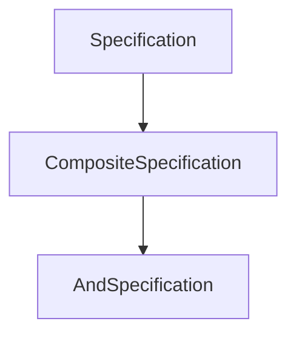

`AndSpecification<T>` inherits all compositional behavior from `CompositeSpecification<T>` and contributes only conjunction semantics.

---

# Business Interpretation

An `AndSpecification<T>` represents a business policy where **every required condition must hold simultaneously**.

Examples include:

```text
Customer Is Active

AND

Customer Is Verified
```

```text
Invoice Is Approved

AND

Invoice Is Unpaid
```

```text
Employee Is Certified

AND

Employee Has Active Contract
```

Each child Specification remains an independent business concept.

---

# Composition Model

Conceptually:

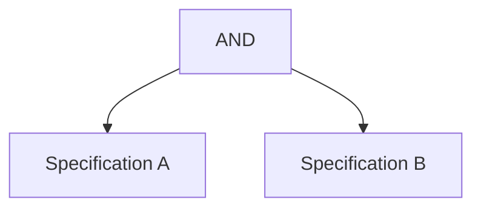

The composed Specification behaves as a single Specification from the perspective of its consumers.

---

# Evaluation Model

Evaluation proceeds conceptually as follows.

```text
Evaluate Left Specification

↓

Evaluate Right Specification

↓

Both True?

↓

Return Result
```

Only the final boolean result is exposed.

Internal evaluation remains encapsulated.

---

# Short-Circuit Evaluation

Implementations are encouraged to support **short-circuit evaluation**.

Conceptually:

```text
Left Specification

↓

False?

↓

Stop Evaluation
```

If the first Specification evaluates to **false**, evaluating the second Specification cannot change the outcome.

Benefits include:

- reduced computation;
- improved performance;
- preserved determinism.

---

# Immutability

Once created, an `AndSpecification<T>` must never change its child Specifications.

Both references remain immutable.

This guarantees:

- thread safety;
- deterministic behavior;
- safe reuse.

---

# Side-Effect Free Evaluation

Evaluating an `AndSpecification<T>` should never:

- modify entities;
- change aggregate state;
- raise Domain Events;
- invoke repositories;
- communicate with infrastructure.

Evaluation remains purely observational.

---

# Deterministic Behavior

For identical input:

```text
Specification A

AND

Specification B
```

must always produce identical output.

Evaluation should never depend upon:

- current time;
- randomness;
- external services;
- mutable state.

---

# Business Examples

Example 1

```text
Active Customer

AND

Premium Member
```

↓

```text
EligibleForPrioritySupport
```

---

Example 2

```text
Invoice Approved

AND

Invoice Unpaid
```

↓

```text
InvoiceCanBeCollected
```

---

Example 3

```text
Employee Active

AND

Security Clearance Valid
```

↓

```text
AuthorizedForRestrictedArea
```

These examples demonstrate how larger business policies emerge from reusable predicates.

---

# Nested Composition

`AndSpecification<T>` supports recursive composition.

Example:

```text
(A AND B)

AND

(C AND D)
```

Conceptually:


Recursive composition enables arbitrarily complex business policies while maintaining readability.

---

# Collaboration with Aggregates

Aggregate Roots frequently evaluate conjunctions before performing business operations.

Conceptually:

```text
Aggregate

↓

AndSpecification

↓

Business Decision
```

The Aggregate remains responsible for behavior.

The Specification remains responsible for evaluation.

---

# Collaboration with Validation

Validation workflows often reuse conjunctions representing multiple business eligibility rules.

Business logic remains centralized.

Validation simply consumes the composed Specification.

---

# Collaboration with Repositories

Repositories may interpret an `AndSpecification<T>` as multiple filtering predicates.

The Repository owns translation.

The Specification owns business meaning.

---

# Collaboration with Domain Events

An Aggregate may use an `AndSpecification<T>` to determine whether a Domain Event should be raised.

The Specification itself remains unaware of event publication.

---

# Performance Characteristics

The conjunction operator naturally supports efficient evaluation.

Recommended implementation characteristics include:

- immutable child references;
- short-circuit evaluation;
- recursive composition;
- allocation-free evaluation whenever practical.

Performance optimizations must never alter business semantics.

---

# Architectural Characteristics

`AndSpecification<T>` provides:

- logical conjunction;
- recursive composition;
- deterministic behavior;
- immutability;
- framework independence;
- reusable business policies.

These characteristics make conjunction the primary composition operator within the subsystem.

---

# Architectural Constraints

Every `AndSpecification<T>` shall satisfy the following constraints.

- Represent only logical conjunction.
- Preserve child immutability.
- Support deterministic evaluation.
- Remain side effect free.
- Support recursive composition.
- Avoid infrastructure dependencies.
- Preserve encapsulation.

Violating these constraints compromises the logical composition model.

---

# Architectural Invariant

> **Every `AndSpecification<T>` within KUKULCAN.SharedKernel shall represent the immutable logical conjunction of exactly two reusable business Specifications, evaluating to true only when every child Specification is satisfied while preserving deterministic behavior, recursive composability, short-circuit evaluation, framework independence, side effect free execution, and complete adherence to the architectural principles of Domain-Driven Design and Clean Architecture.**

This invariant governs every conjunction-based Specification within the Shared Kernel.

---

# Summary

`AndSpecification<T>` provides the canonical implementation of logical conjunction within the Specification subsystem.

By combining reusable business predicates into larger business policies while preserving immutability, deterministic evaluation, recursive composition, short-circuit execution, framework independence, and strict separation between business semantics and implementation details, it enables **KUKULCAN.SharedKernel** to model increasingly sophisticated business rules through simple, expressive, and maintainable architectural abstractions.

# 7.5. OrSpecification

`OrSpecification<T>` is the concrete logical composition that represents the **logical disjunction** of two Specifications.

It evaluates to **true** when **at least one** of its child Specifications is satisfied.

Within **KUKULCAN.SharedKernel**, `OrSpecification<T>` enables the Domain Model to express business policies that provide multiple acceptable business alternatives without duplicating conditional logic.

Rather than embedding alternative conditions throughout the application, business flexibility is encapsulated into reusable, composable Specifications.

---

## Architectural Principle

Alternative business rules should be represented through explicit composition rather than duplicated conditional branches.

> **Business alternatives belong inside the Domain Model, not inside conditional statements.**

---

# Purpose

`OrSpecification<T>` exists to:

- represent alternative business predicates;
- compose reusable business rules;
- eliminate duplicated branching logic;
- improve readability;
- preserve deterministic evaluation;
- maintain architectural consistency.

Its sole responsibility is logical disjunction.

---

# Logical Semantics

Conceptually:

```text
Specification A

OR

Specification B
```

The resulting Specification evaluates according to classical boolean logic.

| Specification A   | Specification B   | Result  |
|-------------------|-------------------|---------|
| False             | False             | False   |
| False             | True              | True    |
| True              | False             | True    |
| True              | True              | True    |

Only one child Specification must be satisfied.

---

# Architectural Position

Within the Specification hierarchy:

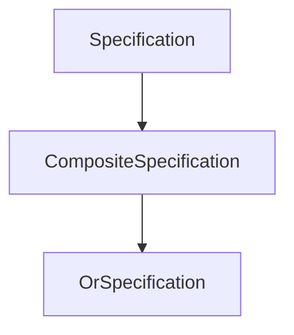

`OrSpecification<T>` inherits composition behavior from `CompositeSpecification<T>` and contributes only disjunction semantics.

---

# Business Interpretation

An `OrSpecification<T>` represents a business policy where **multiple valid business paths** exist.

Examples include:

```text
Customer Is Premium

OR

Customer Is Employee
```

```text
Invoice Is Paid

OR

Invoice Is Cancelled
```

```text
User Is Administrator

OR

User Is Auditor
```

Each child Specification remains an independent business concept.

---

# Composition Model

Conceptually:

```mermaid
flowchart TD
    ROOT["OR"]
    LEFT["Specification A"]
    RIGHT["Specification B"]

    ROOT --> LEFT
    ROOT --> RIGHT
```

Consumers interact only with the resulting Specification.

Internal composition remains encapsulated.

---

# Evaluation Model

Evaluation proceeds conceptually as follows.

```text
Evaluate Left Specification

↓

Satisfied?

↓

Yes → Return True

↓

No

↓

Evaluate Right Specification

↓

Return Result
```

The final result remains a single boolean value.

---

# Short-Circuit Evaluation

Implementations are encouraged to support **short-circuit evaluation**.

Conceptually:

```text
Left Specification

↓

True?

↓

Stop Evaluation
```

Once one child Specification evaluates to **true**, evaluating additional Specifications cannot change the outcome.

Benefits include:

- reduced computation;
- improved performance;
- predictable execution.

---

# Immutability

Once constructed, an `OrSpecification<T>` must never modify its child Specifications.

Both child references to remain immutable throughout the lifetime of the object.

Immutability guarantees:

- thread safety;
- deterministic behavior;
- safe reuse.

---

# Side-Effect Free Evaluation

Evaluating an `OrSpecification<T>` must never:

- modify aggregates;
- update entities;
- publish Domain Events;
- access repositories;
- invoke external services.

Evaluation remains purely observational.

---

# Deterministic Behavior

Given identical input, an `OrSpecification<T>` must always produce identical output.

Evaluation must not depend upon:

- current time;
- mutable state;
- randomness;
- infrastructure.

Business predicates remain stable and predictable.

---

# Business Examples

Example 1

```text
Customer Is Premium

OR

Customer Is Employee
```

↓

```text
EligibleForDiscount
```

---

Example 2

```text
Invoice Is Paid

OR

Invoice Is Written Off
```

↓

```text
InvoiceCanBeClosed
```

---

Example 3

```text
User Has Administrative Role

OR

User Has Auditor Role
```

↓

```text
AuthorizedForFinancialReports
```

These examples demonstrate how alternative business policies can be modeled without duplicating logic.

---

# Nested Composition

`OrSpecification<T>` naturally supports recursive composition.

Example:

```text
(A OR B)

OR

(C OR D)
```

Conceptually:

```mermaid
flowchart TD
    ROOT["OR"]
    LEFT["OR"]
    RIGHT["OR"]

    A["A"]
    B["B"]
    C["C"]
    D["D"]

    ROOT --> LEFT
    ROOT --> RIGHT

    LEFT --> A
    LEFT --> B

    RIGHT --> C
    RIGHT --> D
```

Recursive composition enables expressive business policies while preserving simplicity.

---

# Collaboration with Aggregates

Aggregate Roots frequently evaluate disjunctions before allowing business operations.

Conceptually:

```text
Aggregate

↓

OrSpecification

↓

Business Decision
```

The Aggregate owns behavior.

The Specification owns business predicates.

---

# Collaboration with Validation

Validation workflows often reuse disjunctions representing multiple acceptable business conditions.

Business knowledge remains centralized.

Validation remains independent.

---

# Collaboration with Repositories

Repositories may translate an `OrSpecification<T>` into multiple persistence predicates.

Translation belongs to Infrastructure.

Business meaning remains inside the Domain.

---

# Collaboration with Domain Events

Aggregates may evaluate an `OrSpecification<T>` before raising Domain Events.

The Specification remains completely unaware of event publication.

Business predicates remain independent of business consequences.

---

# Performance Characteristics

The disjunction operator naturally supports efficient execution.

Recommended implementation characteristics include:

- immutable child references;
- short-circuit evaluation;
- recursive composition;
- allocation-free evaluation whenever practical.

Performance optimizations must never alter business semantics.

---

# Architectural Characteristics

`OrSpecification<T>` provides:

- logical disjunction;
- recursive composition;
- deterministic behavior;
- immutability;
- framework independence;
- reusable business alternatives.

These characteristics make disjunction an essential composition operator within the Specification subsystem.

---

# Architectural Constraints

Every `OrSpecification<T>` shall satisfy the following constraints.

- Represent only logical disjunction.
- Preserve child immutability.
- Support deterministic evaluation.
- Remain side effect free.
- Support recursive composition.
- Avoid infrastructure dependencies.
- Preserve encapsulation.

Violating these constraints compromises the logical consistency of the subsystem.

---

# Architectural Invariant

> **Every `OrSpecification<T>` within KUKULCAN.SharedKernel shall represent the immutable logical disjunction of exactly two reusable business Specifications, evaluating to true whenever at least one child Specification is satisfied while preserving deterministic behavior, recursive composability, short-circuit evaluation, framework independence, side effect free execution, and complete adherence to the architectural principles of Domain-Driven Design and Clean Architecture.**

This invariant governs every disjunction-based Specification within the Shared Kernel.

---

# Summary

`OrSpecification<T>` provides the canonical implementation of logical disjunction within the Specification subsystem.

By combining reusable business predicates into flexible business policies while preserving immutability, deterministic evaluation, recursive composition, short-circuit execution, framework independence, and strict separation between business semantics and implementation details, it enables **KUKULCAN.SharedKernel** to express alternative business rules through clear, reusable, and maintainable architectural abstractions.

# 7.6. NotSpecification

`NotSpecification<T>` is the concrete logical composition that represents the **logical negation** of a single Specification.

It evaluates to **true** only when its child Specification evaluates to **false**.

Within **KUKULCAN.SharedKernel**, `NotSpecification<T>` provides the architectural mechanism for expressing business rules based on the absence of a condition rather than its presence.

Instead of creating entirely new Specifications to represent inverse business concepts, the Domain Model can simply negate existing Specifications, preserving reuse, readability, and consistency.

---

## Architectural Principle

The absence of a business condition should be expressed by negating an existing business predicate rather than duplicating its implementation.

> **Business negation is composition, not duplication.**

---

# Purpose

`NotSpecification<T>` exists to:

- negate existing business predicates;
- maximize Specification reuse;
- eliminate inverse rule duplication;
- simplify business policy construction;
- preserve deterministic evaluation;
- maintain architectural consistency.

Its only responsibility is logical negation.

---

# Logical Semantics

Conceptually:

```text
NOT Specification A
```

The resulting Specification follows classical boolean logic.

| Specification A   | Result   |
|-------------------|----------|
| False             | True     |
| True              | False    |

The outcome is always the inverse of the child Specification.

---

# Architectural Position

Within the Specification hierarchy:

```mermaid
flowchart TD
    SPEC["Specification<T>"]
    COMPOSITE["CompositeSpecification<T>"]
    NOT["NotSpecification<T>"]

    SPEC --> COMPOSITE
    COMPOSITE --> NOT
```

`NotSpecification<T>` inherits composition behavior from `CompositeSpecification<T>` while providing logical negation semantics.

---

# Business Interpretation

`NotSpecification<T>` represents a business policy stating that **a particular business condition must not hold**.

Examples include:

```text
NOT Premium Customer
```

↓

```text
Standard Customer
```

---

```text
NOT Invoice Paid
```

↓

```text
Outstanding Invoice
```

---

```text
NOT User Locked
```

↓

```text
User Can Authenticate
```

The original business predicate remains reusable.

Only its interpretation changes.

---

# Composition Model

Conceptually:

```mermaid
flowchart TD
    ROOT["NOT"]
    CHILD["Specification"]

    ROOT --> CHILD
```

The negated Specification behaves exactly like any other Specification.

Consumers remain unaware of the internal inversion.

---

# Evaluation Model

Evaluation proceeds conceptually as follows.

```text
Evaluate Child Specification

↓

Invert Boolean Result

↓

Return Result
```

No additional business logic is introduced.

Only the boolean outcome is inverted.

---

# Immutability

A `NotSpecification<T>` is immutable.

Once constructed:

- the child Specification cannot change;
- the negation semantics remain fixed.

Immutability guarantees:

- predictable evaluation;
- safe reuse;
- thread safety.

---

# Side-Effect Free Evaluation

Evaluating a `NotSpecification<T>` must never:

- modify entities;
- change Aggregate state;
- publish Domain Events;
- access repositories;
- invoke infrastructure.

Logical negation is purely observational.

---

# Deterministic Behavior

Given identical input, a `NotSpecification<T>` must always return the identical inverted result.

Evaluation should never depend upon:

- mutable state;
- current time;
- random values;
- infrastructure.

Predictability is mandatory.

---

# Business Examples

Example 1

```text
NOT PremiumCustomerSpecification
```

↓

```text
StandardCustomerSpecification
```

---

Example 2

```text
NOT InvoicePaidSpecification
```

↓

```text
InvoiceRequiresPayment
```

---

Example 3

```text
NOT AccountLockedSpecification
```

↓

```text
AccountCanAuthenticate
```

Negation allows existing business knowledge to be reused instead of duplicated.

---

# Nested Composition

`NotSpecification<T>` naturally participates in recursive composition.

Example:

```text
NOT

(A AND B)
```

Conceptually:

```mermaid
flowchart TD
    ROOT["NOT"]
    AND["AND"]

    A["A"]
    B["B"]

    ROOT --> AND

    AND --> A
    AND --> B
```

Likewise:

```text
NOT

(A OR B)
```

Recursive composition enables expressive business policies while preserving architectural simplicity.

---

# Collaboration with Aggregates

Aggregate Roots frequently negate Specifications before permitting business operations.

Conceptually:

```text
Aggregate

↓

NotSpecification

↓

Business Decision
```

The Aggregate owns state transitions.

The Specification owns business evaluation.

---

# Collaboration with Validation

Validation workflows often reuse negated Specifications to represent invalid business conditions.

Business predicates remain centralized.

Validation consumes the resulting Specification.

---

# Collaboration with Repositories

Repositories may interpret negated Specifications when constructing persistence queries.

The Repository owns translation.

The Specification owns business meaning.

---

# Collaboration with Domain Events

Aggregates may evaluate a `NotSpecification<T>` before deciding whether to raise a Domain Event.

The Specification itself remains unaware of event publication.

Business evaluation and business consequences remain separated.

---

# Performance Characteristics

Logical negation introduces virtually no computational overhead.

Recommended implementation characteristics include:

- immutable child reference;
- allocation-free evaluation whenever practical;
- deterministic execution;
- direct boolean inversion.

Optimizations must never alter business semantics.

---

# Architectural Characteristics

`NotSpecification<T>` provides:

- logical negation;
- Specification reuse;
- deterministic behavior;
- immutability;
- recursive composition;
- framework independence.

These characteristics make negation an essential operator within the Specification subsystem.

---

# Architectural Constraints

Every `NotSpecification<T>` shall satisfy the following constraints.

- Negate exactly one child Specification.
- Preserve child immutability.
- Produce deterministic results.
- Remain side effect free.
- Support recursive composition.
- Avoid infrastructure dependencies.
- Preserve encapsulation.

Violating these constraints compromises the logical composition model.

---

# Relationship with Other Logical Operators

`NotSpecification<T>` complements the remaining logical operators.

```mermaid
flowchart LR
    A["Specification"]
    AND["AND"]
    OR["OR"]
    NOT["NOT"]

    A --> AND
    A --> OR
    A --> NOT
```

Together they form the complete set of logical composition primitives used throughout the Specification subsystem.

---

# Architectural Invariant

> **Every `NotSpecification<T>` within KUKULCAN.SharedKernel shall represent the immutable logical negation of exactly one reusable business Specification, evaluating to the inverse boolean result of its child Specification while preserving deterministic behavior, recursive composability, framework independence, side effect free execution, Specification reuse, and complete adherence to the architectural principles of Domain-Driven Design and Clean Architecture.**

This invariant governs every negation-based Specification within the Shared Kernel.

---

# Summary

`NotSpecification<T>` provides the canonical implementation of logical negation within the Specification subsystem.

By inverting existing business predicates rather than introducing duplicated inverse implementations, it enables **KUKULCAN.SharedKernel** to model negative business conditions through reusable, immutable, deterministic, framework-independent, and recursively composable architectural abstractions fully aligned with the principles of Domain-Driven Design and Clean Architecture.

# 7.7. SpecificationEvaluator

`SpecificationEvaluator<T>` is the architectural component responsible for executing Specifications in a consistent, deterministic, and technology-independent manner.

Although every Specification exposes its own evaluation contract, the evaluator centralizes the execution process whenever a unified evaluation mechanism is desirable.

The evaluator is intentionally lightweight.

It does **not** own business rules.

It does **not** interpret business semantics.

Its sole responsibility is to execute an existing Specification against one or more candidates while preserving the architectural principles of the Specification subsystem.

---

## Architectural Principle

Business predicates define business knowledge.

Evaluators execute business knowledge.

> **Specifications own business semantics; evaluators own execution.**

---

# Purpose

`SpecificationEvaluator<T>` exists to:

- provide a centralized evaluation mechanism;
- standardize Specification execution;
- improve consistency;
- simplify reuse;
- isolate execution from business predicates;
- support future extensibility.

It is an execution service, never a business component.

---

# Architectural Position

Within the Specification subsystem:

```mermaid
flowchart TD

    SPEC["Specification<T>"]

    EVALUATOR["SpecificationEvaluator<T>"]

    CONSUMER["Consumers"]

    CONSUMER --> EVALUATOR
    EVALUATOR --> SPEC
```

Consumers delegate evaluation to the evaluator.

The evaluator delegates business decisions to the Specification.

---

# Responsibility

The evaluator has exactly one responsibility:

> Execute a Specification against one or more candidates.

It never:

- creates Specifications;
- modifies Specifications;
- owns business rules;
- translates persistence queries;
- raises Domain Events.

Its behavior is intentionally minimal.

---

# Separation of Responsibilities

The architectural responsibilities are clearly divided.

| Component              | Responsibility                  |
|------------------------|---------------------------------|
| Specification          | Defines the business predicate. |
| SpecificationEvaluator | Executes the predicate.         |
| Consumer               | Uses the evaluation result.     |

This separation follows the Single Responsibility Principle.

---

# Evaluation Flow

A typical evaluation sequence follows the process below.

```mermaid
sequenceDiagram

    participant Consumer

    participant Evaluator

    participant Specification

    participant Candidate

    Consumer->>Evaluator: Evaluate(specification, candidate)

    Evaluator->>Specification: IsSatisfiedBy(candidate)

    Specification-->>Evaluator: True / False

    Evaluator-->>Consumer: Result
```

The evaluator never interprets the result.

It simply returns it.

---

# Single Candidate Evaluation

The most common operation evaluates a single candidate.

Conceptually:

```text
Candidate

↓

Specification

↓

True / False
```

The evaluator standardizes this interaction.

---

# Collection Evaluation

The evaluator may also execute Specifications against collections.

Conceptually:

```text
Collection

↓

Specification

↓

Matching Elements
```

Typical operations include:

- filtering;
- existence checks;
- universal evaluation.

Business semantics remain unchanged.

---

# Predicate Delegation

The evaluator delegates all business decisions to the Specification.

Conceptually:

```text
Evaluator

↓

Specification

↓

Business Predicate

↓

Boolean Result
```

The evaluator contains **no business logic**.

---

# Deterministic Execution

Given identical:

- Specification;
- candidate;

the evaluator must always return identical results.

It must never introduce:

- randomness;
- timing dependencies;
- infrastructure behavior;
- mutable state.

The evaluator preserves determinism.

---

# Side-Effect Free Execution

Executing a Specification must never:

- modify domain entities;
- publish events;
- write repositories;
- update aggregates;
- invoke infrastructure services.

Evaluation is purely observational.

---

# Stateless Design

`SpecificationEvaluator<T>` should remain stateless.

Every evaluation is independent.

No execution context should be retained between evaluations.

Benefits include:

- thread safety;
- scalability;
- predictable behavior.

---

# Framework Independence

The evaluator intentionally avoids dependencies upon:

- Entity Framework;
- LINQ providers;
- dependency injection frameworks;
- ORM APIs;
- messaging frameworks.

Execution remains entirely framework independent.

---

# Collaboration with Aggregates

Aggregate Roots may delegate complex evaluation to the evaluator.

Conceptually:

```text
Aggregate

↓

SpecificationEvaluator

↓

Specification

↓

Business Decision
```

The Aggregate remains responsible for business behavior.

The evaluator remains responsible for execution.

---

# Collaboration with Repositories

Repositories may reuse the evaluator when performing in-memory evaluation.

Persistence translation remains outside the evaluator's responsibilities.

Repositories own query generation.

---

# Collaboration with Validation

Validation workflows frequently use the evaluator to execute business Specifications.

Validation remains structurally independent.

Business predicates remain centralized.

---

# Collaboration with Domain Events

The evaluator never publishes Domain Events.

It simply returns evaluation results.

Aggregates determine whether those results should trigger business behavior.

---

# Extensibility

Future evaluator implementations may support:

- asynchronous evaluation;
- cached execution;
- distributed evaluation;
- diagnostic instrumentation.

These extensions should not alter the evaluation contract.

---

# Performance Considerations

A Specification evaluator should introduce negligible overhead.

Recommended characteristics include:

- allocation-free execution whenever practical;
- stateless implementation;
- direct delegation;
- no reflection;
- no runtime code generation.

Business correctness always takes precedence over micro-optimization.

---

# Error Handling

The evaluator should not attempt to recover from invalid Specifications.

Architectural assumptions include:

- valid Specification instance;
- valid candidate;
- deterministic evaluation.

Error handling belongs to the consumer.

---

# Architectural Characteristics

`SpecificationEvaluator<T>` provides:

- centralized execution;
- deterministic behavior;
- stateless operation;
- framework independence;
- side effect free evaluation;
- reusable execution services.

These characteristics ensure consistent execution throughout the subsystem.

---

# Architectural Constraints

Every `SpecificationEvaluator<T>` shall satisfy the following constraints.

- Execute but never define business predicates.
- Remain stateless.
- Produce deterministic results.
- Remain side effect free.
- Avoid infrastructure dependencies.
- Preserve framework independence.
- Delegate all business semantics to Specifications.

Violating these constraints would blur the separation between business knowledge and execution.

---

# Architectural Invariant

> **Every `SpecificationEvaluator<T>` within KUKULCAN.SharedKernel shall function exclusively as a stateless, deterministic, framework-independent execution service that delegates all business semantics to reusable Specifications while producing side effect free evaluation results, preserving complete separation between business knowledge and execution mechanics, and maintaining full compliance with the architectural principles of Domain-Driven Design and Clean Architecture.**

This invariant governs every Specification evaluator within the Shared Kernel.

---

# Summary

`SpecificationEvaluator<T>` provides the standardized execution mechanism for the Specification subsystem.

By remaining stateless, deterministic, framework independent, and completely free of business semantics, it enables **KUKULCAN.SharedKernel** to execute reusable business predicates consistently across Aggregates, Validation workflows, Repositories, Domain Services, and Application Services while preserving strict separation of concerns and full adherence to the principles of Domain-Driven Design and Clean Architecture.

# 7.8. SpecificationBuilder

`SpecificationBuilder<T>` is the fluent composition component of the Specification subsystem.

Its purpose is to simplify the construction of complex business Specifications by providing a readable, expressive, and type-safe API for composing multiple business predicates.

The builder does **not** define business rules.

The builder does **not** evaluate Specifications.

Instead, it constructs new composed Specifications by orchestrating existing ones.

This separation keeps business knowledge inside Specifications while making their composition significantly easier to read and maintain.

---

## Architectural Principle

Business composition should be expressive, declarative, and independent of implementation details.

> **Builders improve readability without changing business semantics.**

---

# Purpose

`SpecificationBuilder<T>` exists to:

- simplify Specification composition;
- improve readability;
- reduce nested constructor calls;
- promote fluent APIs;
- encourage Specification reuse;
- preserve immutability.

Its only responsibility is composition.

---

# Architectural Position

Within the Specification subsystem:

```mermaid
flowchart TD

    SPEC["Specification<T>"]

    BUILDER["SpecificationBuilder<T>"]

    COMPOSITE["Composite Specifications"]

    SPEC --> BUILDER
    BUILDER --> COMPOSITE
```

The builder consumes Specifications.

It produces new Specifications.

---

# Responsibility

The builder has exactly one responsibility:

> Construct composed Specifications through a fluent API.

It never:

- evaluates Specifications;
- owns business predicates;
- modifies child Specifications;
- communicates with infrastructure;
- performs persistence operations.

Composition is its only concern.

---

# Motivation

Without a builder, composition may become difficult to read.

Example:

```text
And(

    Active,

    Or(

        Premium,

        Employee

    )

)
```

The builder provides a clearer alternative.

---

# Fluent Composition

Conceptually:

```text
Builder

↓

Add Specification

↓

Compose

↓

Build
```

The resulting object is a standard Specification.

Consumers remain unaware of the builder.

---

# Typical Composition Flow

```mermaid
sequenceDiagram

    participant Consumer

    participant Builder

    participant Specification

    Consumer->>Builder: Begin()

    Consumer->>Builder: And()

    Consumer->>Builder: Or()

    Consumer->>Builder: Not()

    Builder-->>Consumer: Composite Specification
```

The builder performs no evaluation.

It merely assembles the composition.

---

# Readability

The primary objective of the builder is improving readability.

Instead of deeply nested composition trees, business intent becomes sequential and easier to understand.

Example:

```text
Premium

AND

Verified

OR

Employee
```

Business meaning becomes immediately recognizable.

---

# Immutability

The builder should never modify existing Specifications.

Instead, every composition operation produces a **new immutable Specification**.

Conceptually:

```text
Specification A

↓

Builder

↓

New Composite Specification
```

Original Specifications remain unchanged.

---

# Stateless vs Stateful Builders

A builder may be implemented as:

- stateless;
- transient;
- immutable.

Stateful implementations should be avoided whenever practical.

Stateless builders naturally provide:

- thread safety;
- predictability;
- simpler reasoning.

---

# Collaboration with Specifications

The builder collaborates exclusively with existing Specifications.

Conceptually:

```text
Specification

↓

Builder

↓

Composite Specification
```

Business knowledge always remains inside the child Specifications.

---

# Collaboration with Composite Specifications

The builder typically produces:

- `AndSpecification<T>`
- `OrSpecification<T>`
- `NotSpecification<T>`

The resulting object behaves exactly like any other Specification.

---

# Collaboration with Aggregates

Aggregates generally do **not** use the builder directly.

Builders are primarily intended for:

- Application Services;
- Domain Services;
- Repository construction;
- business policy configuration.

Aggregates consume completed Specifications.

---

# Collaboration with Validation

Validation workflows may use builders to assemble reusable business policies before execution.

Validation itself remains unaware of the composition process.

---

# Collaboration with Repositories

Repositories may receive composed Specifications produced by the builder.

The Repository remains responsible for interpretation.

The builder remains responsible for construction.

---

# Collaboration with Domain Events

Builders never participate in Domain Event publication.

Their responsibility ends once the composed Specification has been created.

---

# Extensibility

Future builder capabilities may include:

- conditional composition;
- predefined policy templates;
- Specification catalogs;
- reusable composition profiles.

Such extensions should never alter business semantics.

---

# Deterministic Construction

Given identical input Specifications, the builder should always produce identical composed Specifications.

Construction should never depend upon:

- mutable state;
- infrastructure;
- execution order;
- external services.

Composition remains deterministic.

---

# Side-Effect Free Construction

Builder operations should never:

- modify existing Specifications;
- update Domain objects;
- persist data;
- invoke repositories;
- publish events.

Construction remains purely functional.

---

# Performance Considerations

The builder should introduce minimal overhead.

Recommended implementation characteristics include:

- immutable construction;
- allocation only for new composite objects;
- no reflection;
- no runtime code generation;
- direct object composition.

Performance should never compromise readability.

---

# Architectural Characteristics

`SpecificationBuilder<T>` provides:

- fluent composition;
- improved readability;
- immutable construction;
- framework independence;
- deterministic behavior;
- reusable composition services.

These characteristics improve developer productivity while preserving architectural integrity.

---

# Architectural Constraints

Every `SpecificationBuilder<T>` shall satisfy the following constraints.

- Construct Specifications only.
- Never evaluate Specifications.
- Never own business predicates.
- Preserve immutability.
- Produce deterministic compositions.
- Remain side effect free.
- Avoid infrastructure dependencies.

Violating these constraints blurs the separation between composition and execution.

---

# Relationship with Other Components

The builder collaborates with the remaining Specification components as follows.

```mermaid
flowchart LR
    BUILDER["SpecificationBuilder"]
    SPEC["Specification"]
    AND["And"]
    OR["Or"]
    NOT["Not"]

    BUILDER --> SPEC
    BUILDER --> AND
    BUILDER --> OR
    BUILDER --> NOT
```

The builder never bypasses the Specification hierarchy.

---

# Architectural Invariant

> **Every `SpecificationBuilder<T>` within KUKULCAN.SharedKernel shall function exclusively as a fluent, deterministic, framework-independent composition service that constructs new immutable Specifications from existing reusable business predicates without evaluating them, modifying them, introducing business semantics, or producing side effects, thereby preserving complete separation between business rule definition, composition, and execution in full accordance with the architectural principles of Domain-Driven Design and Clean Architecture.**

This invariant governs every Specification builder within the Shared Kernel.

---

# Summary

`SpecificationBuilder<T>` provides the fluent composition mechanism for the Specification subsystem.

By constructing immutable composite Specifications through expressive, readable, deterministic, and framework-independent APIs, it enables **KUKULCAN.SharedKernel** to assemble sophisticated business policies without introducing duplication, preserving strict separation between business knowledge, composition, and execution while maintaining complete alignment with the principles of Domain-Driven Design and Clean Architecture.

# 8. Specification Lifecycle

The Specification Lifecycle describes the complete lifecycle of a Specification within **KUKULCAN.SharedKernel**, from its creation to its final evaluation and disposal.

Although Specifications are intentionally lightweight and immutable, they participate in a well-defined architectural lifecycle that guarantees deterministic behavior, thread safety, and complete independence from infrastructure.

Understanding this lifecycle helps ensure that Specifications remain reusable, composable, and consistent across Aggregates, Domain Services, Validation workflows, Repositories, and Application Services.

---

## Architectural Principle

A Specification should behave as an immutable business predicate throughout its entire lifetime.

> **A Specification is created once, composed if necessary, evaluated many times, and never modified.**

---

# Lifecycle Overview

The lifecycle consists of five conceptual stages.

```mermaid
flowchart LR

    CREATE["Creation"]

    COMPOSE["Composition"]

    STORE["Reuse"]

    EVALUATE["Evaluation"]

    DISCARD["End of Lifetime"]

    CREATE --> COMPOSE
    COMPOSE --> STORE
    STORE --> EVALUATE
    EVALUATE --> DISCARD
```

Each stage has a clearly defined architectural responsibility.

---

# Stage 1 — Creation

The lifecycle begins when a concrete Specification is instantiated.

Examples:

```text
ActiveCustomerSpecification
```

```text
PremiumCustomerSpecification
```

During creation:

- business rules become immutable;
- dependencies are validated;
- internal state is initialized.

No business evaluation occurs at this stage.

---

# Characteristics of Creation

Specification creation should be:

- lightweight;
- deterministic;
- framework independent;
- side-effect free.

Construction must never:

- access repositories;
- query databases;
- invoke external services;
- modify Domain objects.

Creation only prepares the Specification for future evaluation.

---

# Stage 2 — Composition

Individual Specifications may be combined into larger business policies.

Typical composition includes:

```text
AND
```

```text
OR
```

```text
NOT
```

Composition produces **new immutable Specifications**.

Existing Specifications remain unchanged.

---

# Composition Model

Conceptually:

```mermaid
flowchart TD

    A["Specification A"]

    B["Specification B"]

    C["Composite Specification"]

    A --> C
    B --> C
```

Business complexity grows through composition rather than inheritance.

---

# Stage 3 — Reuse

After construction, Specifications may be reused indefinitely.

Examples include:

- multiple Aggregates;
- Validation workflows;
- Domain Services;
- Application Services;
- Repository queries.

A single Specification instance may safely participate in many independent business operations.

---

# Reuse Characteristics

Safe reuse is possible because Specifications are:

- immutable;
- deterministic;
- stateless;
- side-effect free.

No internal state changes during evaluation.

---

# Stage 4 — Evaluation

Evaluation is the primary operational stage.

Conceptually:

```text
Candidate

↓

Specification

↓

Business Predicate

↓

True / False
```

The evaluation process answers one question:

> Does this business object satisfy this business rule?

Nothing more.

---

# Evaluation Flow

```mermaid
sequenceDiagram

    participant Consumer

    participant Specification

    participant Candidate

    Consumer->>Specification: Evaluate(candidate)

    Specification-->>Consumer: True / False
```

Evaluation never modifies either the Specification or the candidate.

---

# Evaluation Characteristics

Every evaluation must be:

- deterministic;
- repeatable;
- side-effect free;
- framework independent.

Evaluation should never depend upon:

- mutable state;
- infrastructure;
- current time (unless explicitly injected);
- randomness.

---

# Multiple Evaluations

A Specification may evaluate thousands of candidates throughout its lifetime.

Conceptually:

```text
Specification

↓

Candidate 1

↓

Candidate 2

↓

Candidate 3

↓

...
```

The Specification itself never changes.

---

# Nested Evaluation

Composite Specifications recursively evaluate child Specifications.

Example:

```text
(A AND B)

↓

Evaluate A

↓

Evaluate B

↓

Combine Results
```

The lifecycle remains identical regardless of composition depth.

---

# Stage 5 — End of Lifetime

Eventually the Specification is no longer referenced.

Because Specifications own no unmanaged resources, their lifecycle naturally ends through normal memory management.

There is no cleanup phase.

Specifications do not require:

- disposal;
- shutdown;
- resource release.

---

# Memory Characteristics

Specifications are intentionally lightweight.

Typical implementations contain only:

- immutable configuration;
- child Specifications;
- business predicates.

No runtime state accumulates during execution.

---

# Interaction with Aggregates

Aggregate Roots typically interact with Specifications during the evaluation stage.

Conceptually:

```text
Aggregate

↓

Specification

↓

Business Decision
```

The Specification participates in business decisions without becoming part of Aggregate state.

---

# Interaction with Validation

Validation frequently evaluates the same Specification multiple times.

Lifecycle:

```text
Validation

↓

Specification

↓

Result
```

The Specification remains reusable after validation completes.

---

# Interaction with Repositories

Repositories may reuse existing Specifications throughout multiple queries.

Repository interpretation does not alter the Specification lifecycle.

Specifications remain persistence agnostic.

---

# Interaction with Domain Events

Specifications frequently determine whether an Aggregate may produce a Domain Event.

Their lifecycle remains unchanged.

They evaluate.

They never publish.

---

# Thread Safety Throughout the Lifecycle

Because Specifications remain immutable from creation through disposal, they are naturally thread safe.

Multiple threads may evaluate the same Specification concurrently without synchronization.

Conceptually:

```text
Thread A

↓

Specification

↑

Thread B

↓

Specification
```

Concurrent evaluation introduces no architectural risk.

---

# Lifecycle State Model

Conceptually:

```mermaid
stateDiagram-v2

    [*] --> Created

    Created --> Composed

    Composed --> Reused

    Reused --> Evaluated

    Evaluated --> Reused

    Reused --> Destroyed

    Destroyed --> [*]
```

Notice that evaluation may occur repeatedly during the reuse stage.

---

# Architectural Characteristics

The Specification lifecycle guarantees:

- immutability;
- deterministic execution;
- unlimited reuse;
- recursive composition;
- framework independence;
- side effect free evaluation;
- thread safety.

These characteristics remain valid throughout every stage.

---

# Architectural Constraints

Every Specification shall follow the same lifecycle.

- Created once.
- Composed immutably.
- Reused safely.
- Evaluated repeatedly.
- Never modified.
- Naturally discarded.

No stage should introduce mutable behavior.

---

# Architectural Invariant

> **Every Specification within KUKULCAN.SharedKernel shall follow a deterministic lifecycle consisting of immutable creation, optional composition, unlimited safe reuse, side effect free evaluation, and natural disposal through ordinary memory management, without ever modifying its internal state, depending upon infrastructure, accumulating execution context, or violating the architectural principles of Domain-Driven Design and Clean Architecture.**

This invariant governs the lifecycle of every Specification throughout the Shared Kernel.

---

# Summary

The Specification Lifecycle defines the complete behavioral model for every Specification in **KUKULCAN.SharedKernel**.

By ensuring immutable creation, compositional growth, unlimited reuse, deterministic evaluation, framework independence, natural thread safety, and side effect free execution, the lifecycle enables Specifications to function as reliable and reusable business predicates that can safely participate in every layer of the Domain Model while preserving the architectural integrity required by Domain-Driven Design and Clean Architecture.

# 9. Composition Model

The Composition Model defines how individual Specifications are combined into increasingly sophisticated business policies while preserving immutability, determinism, and separation of responsibilities.

Composition is the defining capability of the Specification Pattern.

Rather than creating monolithic business rules, the Domain constructs larger business policies by combining small, reusable Specifications through explicit logical operators.

This approach dramatically improves maintainability, readability, reuse, and long-term scalability.

---

## Architectural Principle

Complex business policies should emerge through the composition of simple business predicates.

> **Business complexity grows through composition, not through implementation size.**

---

# Purpose

The Composition Model exists to:

- maximize Specification reuse;
- eliminate duplicated business rules;
- simplify business policy construction;
- improve readability;
- preserve immutability;
- enable recursive business modeling.

Composition transforms individual Specifications into complete business policies.

---

# Fundamental Concept

Every Specification represents exactly one business predicate.

Composition combines those predicates into a larger one.

Conceptually:

```text
Business Predicate

+

Business Predicate

↓

Business Policy
```

The resulting policy behaves exactly like any other Specification.

---

# Architectural Overview

```mermaid
flowchart TD

    A["Specification A"]

    B["Specification B"]

    C["Composite Specification"]

    A --> C
    B --> C
```

Consumers interact only with the resulting Specification.

Internal composition remains completely encapsulated.

---

# Composition Operators

The Specification subsystem supports three fundamental logical operators.

| Operator   | Meaning                                             |
|------------|-----------------------------------------------------|
| **AND**    | Every child Specification must be satisfied.        |
| **OR**     | At least one child Specification must be satisfied. |
| **NOT**    | The child Specification must not be satisfied.      |

These operators are sufficient to model virtually every business policy.

---

# Composition Hierarchy

```mermaid
flowchart TD

    ISPEC["ISpecification"]

    SPEC["Specification"]

    COMPOSITE["CompositeSpecification"]

    AND["AndSpecification"]

    OR["OrSpecification"]

    NOT["NotSpecification"]

    ISPEC --> SPEC
    SPEC --> COMPOSITE

    COMPOSITE --> AND
    COMPOSITE --> OR
    COMPOSITE --> NOT
```

Every composed Specification remains an `ISpecification<T>`.

Composition never changes the public abstraction.

---

# Simple Composition

Example:

```text
Customer Is Active

AND

Customer Is Verified
```

↓

```text
Customer May Purchase
```

Both child Specifications remain reusable elsewhere.

---

# Alternative Composition

Example:

```text
Customer Is Employee

OR

Customer Is Premium
```

↓

```text
Customer Receives Discount
```

Business flexibility is modeled without duplicated logic.

---

# Negated Composition

Example:

```text
NOT Account Locked
```

↓

```text
Account Can Authenticate
```

Negation promotes reuse by avoiding inverse Specifications.

---

# Recursive Composition

Composition is recursive by design.

Example:

```text
(A AND B)

OR

(C AND D)
```

Conceptually:

```mermaid
flowchart TD

    ROOT["OR"]

    LEFT["AND"]

    RIGHT["AND"]

    A["A"]

    B["B"]

    C["C"]

    D["D"]

    ROOT --> LEFT
    ROOT --> RIGHT

    LEFT --> A
    LEFT --> B

    RIGHT --> C
    RIGHT --> D
```

There is no architectural limit to composition depth.

---

# Nested Business Policies

Large business policies are constructed by layering smaller ones.

Conceptually:

```text
Eligibility

↓

Authorization

↓

Compliance

↓

Final Decision
```

Each level remains independently reusable.

---

# Composition Immutability

Every composition operation creates a **new immutable Specification**.

Original Specifications are never modified.

Conceptually:

```text
Specification A

+

Specification B

↓

New Composite Specification
```

The source Specifications remain unchanged.

---

# Composition Transparency

Consumers should never know whether a Specification is:

- concrete;
- composite;
- nested.

Every composed Specification behaves exactly like any other Specification.

This is an application of the Composite Pattern.

---

# Evaluation Transparency

Regardless of composition complexity:

```text
Candidate

↓

Specification

↓

True / False
```

The evaluation contract never changes.

Consumers remain unaware of internal recursion.

---

# Short-Circuit Composition

Logical operators may support short-circuit evaluation.

Examples:

```text
False

AND

Anything

↓

False
```

```text
True

OR

Anything

↓

True
```

Short-circuit behavior improves performance while preserving business semantics.

---

# Business Examples

Example 1

```text
Active

AND

Verified

AND

Premium
```

↓

```text
Eligible For Exclusive Benefits
```

---

Example 2

```text
Employee

OR

Contractor
```

↓

```text
May Access Internal Portal
```

---

Example 3

```text
NOT Suspended

AND

Email Verified

AND

Password Valid
```

↓

```text
Authentication Successful
```

These examples demonstrate how rich business policies emerge from small reusable Specifications.

---

# Collaboration with SpecificationBuilder

The Composition Model is frequently constructed through `SpecificationBuilder<T>`.

Conceptually:

```text
Specifications

↓

Builder

↓

Composite Specification
```

Builders improve readability while preserving identical composition semantics.

---

# Collaboration with Aggregates

Aggregates consume composed Specifications as complete business policies.

They remain unaware of:

- composition depth;
- logical operators;
- child hierarchy.

The Aggregate receives a single business predicate.

---

# Collaboration with Validation

Validation workflows frequently reuse composite Specifications to evaluate complex business conditions.

Business rules remain centralized.

Validation remains independent.

---

# Collaboration with Repositories

Repositories may interpret composite Specifications when constructing persistence queries.

The Composition Model remains persistence agnostic.

Translation belongs exclusively to Infrastructure.

---

# Collaboration with Domain Events

Composite Specifications frequently determine whether Aggregates may transition into states that generate Domain Events.

Composition participates in business decisions.

It never performs business actions.

---

# Framework Independence

Composition is entirely independent of:

- LINQ;
- Entity Framework;
- SQL;
- dependency injection;
- messaging frameworks;
- persistence technologies.

Business policies remain pure Domain abstractions.

---

# Architectural Characteristics

The Composition Model guarantees:

- recursive composition;
- immutable Specifications;
- deterministic behavior;
- reusable business predicates;
- framework independence;
- unlimited extensibility;
- side effect free evaluation.

These characteristics define the architecture of composed business policies.

---

# Architectural Constraints

Every composed Specification shall satisfy the following constraints.

- Preserve immutability.
- Support recursion.
- Produce deterministic results.
- Remain side effect free.
- Avoid infrastructure dependencies.
- Preserve business terminology.
- Behave exactly like every other Specification.

Composition should never introduce observable behavioral differences.

---

# Architectural Invariant

> **Every composed Specification within KUKULCAN.SharedKernel shall represent an immutable, recursively composable, deterministic, framework-independent business policy constructed exclusively from reusable business Specifications through explicit logical operators while preserving evaluation transparency, side effect free execution, unlimited reusability, and complete compliance with the architectural principles of Domain-Driven Design, the Composite Pattern, and Clean Architecture.**

This invariant governs the Composition Model of the Specification subsystem.

---

# Summary

The Composition Model is the architectural foundation that enables the Specification subsystem to scale from simple business predicates to sophisticated business policies.

By combining immutable Specifications through recursive logical composition while preserving evaluation transparency, deterministic execution, framework independence, and strict separation of responsibilities, **KUKULCAN.SharedKernel** achieves a Specification architecture that remains expressive, reusable, maintainable, and fully aligned with the principles of Domain-Driven Design and Clean Architecture.

# 10. Expression Tree Integration

Expression Tree Integration defines how the Specification subsystem interoperates with **System.Linq.Expressions** to enable the translation of business predicates into executable expression trees.

While a Specification fundamentally represents a business rule, many infrastructure technologies—such as Entity Framework Core, LINQ providers, document databases, and in-memory query engines—require business predicates to be represented as `Expression<Func<T, bool>>`.

The Specification subsystem therefore supports expression trees as an **integration mechanism**, never as the primary business abstraction.

Business semantics always belong to the Specification.

Expression trees simply provide a transport format that infrastructure can understand.

---

## Architectural Principle

Business rules are expressed as Specifications.

Expression trees expose those rules to infrastructure without leaking infrastructure concerns into the Domain.

> **The Domain owns business predicates. Infrastructure consumes expression trees.**

---

# Purpose

Expression Tree Integration exists to:

- enable LINQ integration;
- support ORM query translation;
- allow in-memory filtering;
- maximize repository interoperability;
- preserve Domain purity;
- avoid duplicated business logic.

Expression trees serve as an interoperability layer.

---

# Architectural Position

```mermaid
flowchart TD

    SPEC["Specification<T>"]

    EXP["Expression<Func<T,bool>>"]

    REPO["Repository"]

    ORM["ORM / LINQ Provider"]

    SPEC --> EXP
    EXP --> REPO
    REPO --> ORM
```

Specifications remain inside the Domain.

Expression trees bridge the Domain and Infrastructure.

---

# Why Expression Trees?

Infrastructure technologies cannot execute arbitrary business objects.

Instead, they require executable expression trees.

For example:

```csharp
Expression<Func<Customer, bool>>
```

can be translated into:

- SQL;
- LINQ queries;
- NoSQL queries;
- in-memory delegates.

The Specification itself remains unchanged.

---

# Business Ownership

Business meaning belongs to:

```text
Specification
```

Never to:

```text
Expression Tree
```

The expression is merely another representation of an existing business predicate.

---

# Typical Flow

```mermaid
sequenceDiagram

    participant Domain

    participant Specification

    participant Expression

    participant Repository

    participant Database

    Domain->>Specification: Business Rule

    Specification-->>Expression: Expression Tree

    Repository->>Database: Query Translation
```

Notice that the Domain never communicates directly with the database.

---

# Expression Generation

A Specification may expose an expression conceptually equivalent to:

```csharp
Expression<Func<T, bool>>
```

This expression should faithfully represent the same business semantics as:

```csharp
IsSatisfiedBy(...)
```

Both representations must remain behaviorally identical.

---

# Semantic Equivalence

The following representations should always produce identical results.

```text
Specification

↓

IsSatisfiedBy(candidate)
```

and

```text
Expression Tree

↓

Compiled Delegate

↓

Candidate
```

Business correctness must never depend upon the chosen representation.

---

# Deterministic Translation

Generating an expression tree must always produce identical output for identical Specifications.

Expression generation must never depend upon:

- runtime state;
- mutable values;
- infrastructure;
- execution order.

Translation remains deterministic.

---

# Repository Integration

Repositories frequently consume expression trees.

Conceptually:

```text
Specification

↓

Expression Tree

↓

Repository

↓

Query Provider
```

Repositories interpret the expression.

Specifications remain persistence agnostic.

---

# LINQ Integration

Expression trees naturally integrate with LINQ.

Conceptually:

```text
Collection

↓

Where(Expression)

↓

Filtered Collection
```

The Specification subsystem remains independent of LINQ itself.

Only the expression representation participates.

---

# ORM Integration

ORM frameworks translate expression trees into optimized persistence queries.

Example targets include:

- SQL Server;
- PostgreSQL;
- SQLite;
- Cosmos DB.

The Specification never knows which provider executes the query.

---

# In-Memory Evaluation

Expression trees may also be compiled into delegates.

Conceptually:

```text
Expression Tree

↓

Compiled Delegate

↓

Boolean Evaluation
```

This allows identical business rules to execute both:

- inside repositories;
- inside memory.

---

# Composite Expression Trees

Composite Specifications naturally produce composite expression trees.

Example:

```text
A AND B
```

↓

```text
Expression A

AND

Expression B
```

Recursive composition remains identical to Specification composition.

---

# Expression Composition

Conceptually:

```mermaid
flowchart TD

    A["Expression A"]

    B["Expression B"]

    C["Combined Expression"]

    A --> C
    B --> C
```

Logical operators remain unchanged.

Only the representation differs.

---

# Domain Independence

The Domain Model must never depend upon:

- Entity Framework;
- IQueryable;
- LINQ Providers;
- SQL generation.

It depends only upon:

```text
System.Linq.Expressions
```

which is part of the .NET Base Class Library.

---

# Side-Effect Free Translation

Generating an expression tree must never:

- query a database;
- modify entities;
- publish events;
- invoke repositories;
- communicate with infrastructure.

Expression generation is purely structural.

---

# Immutability

Generated expression trees should be immutable.

Each generated expression represents the immutable business predicate of its Specification.

Subsequent evaluations should never alter the expression.

---

# Performance Considerations

Expression generation should be lightweight.

Recommended implementation characteristics include:

- immutable expressions;
- lazy generation when appropriate;
- optional expression caching;
- allocation minimization.

Performance optimizations must never alter business semantics.

---

# Validation Integration

Validation workflows may execute either:

- `IsSatisfiedBy()`
- compiled expression delegates

Both mechanisms should remain semantically identical.

---

# Domain Event Integration

Expression trees never participate in Domain Event publication.

They simply provide executable representations of business predicates.

Business consequences remain outside their scope.

---

# Architectural Characteristics

Expression Tree Integration provides:

- repository interoperability;
- ORM compatibility;
- LINQ compatibility;
- deterministic translation;
- immutable expressions;
- framework-independent Domain logic.

These characteristics make Specifications reusable across multiple execution environments.

---

# Architectural Constraints

Expression Tree Integration shall satisfy the following constraints.

- Preserve business semantics.
- Produce deterministic expressions.
- Remain side effect free.
- Avoid infrastructure dependencies.
- Support recursive composition.
- Preserve immutability.
- Maintain semantic equivalence with `IsSatisfiedBy()`.

Violating these constraints creates inconsistencies between business rules and persistence behavior.

---

# Architectural Invariant

> **Every expression tree generated within KUKULCAN.SharedKernel shall represent an immutable, deterministic, semantically equivalent projection of an existing Specification, exposing reusable business predicates to infrastructure technologies without introducing infrastructure dependencies, modifying business behavior, producing side effects, or violating the architectural separation required by Domain-Driven Design and Clean Architecture.**

This invariant governs all expression-based integrations within the Specification subsystem.

---

# Summary

Expression Tree Integration enables the Specification subsystem of **KUKULCAN.SharedKernel** to expose business predicates as reusable `Expression<Func<T, bool>>` instances suitable for LINQ providers, ORM frameworks, repositories, and in-memory execution.

By preserving semantic equivalence, deterministic translation, immutability, framework independence, and strict separation between business knowledge and infrastructure concerns, the subsystem ensures that every Specification remains a single source of business truth while remaining fully interoperable with modern .NET persistence technologies.

# 11. LINQ Integration

LINQ Integration defines how the Specification subsystem interoperates with the .NET Language Integrated Query (LINQ) ecosystem while preserving the architectural purity of the Domain Model.

Although Specifications are business abstractions and LINQ is a querying technology, both share a common objective: evaluating predicates over collections of objects.

The Specification subsystem therefore integrates with LINQ by exposing business predicates as reusable expression trees, allowing Specifications to participate naturally in LINQ queries without introducing infrastructure concerns into the Domain.

---

## Architectural Principle

Business predicates should be reusable across every execution environment.

> **A business rule should execute identically whether evaluated in memory, through LINQ, or translated into a database query.**

---

# Purpose

LINQ Integration exists to:

- reuse business predicates;
- support in-memory filtering;
- enable repository interoperability;
- avoid duplicated query logic;
- preserve business consistency;
- maintain Domain purity.

LINQ consumes Specifications.

Specifications never depend upon LINQ.

---

# Architectural Position

```mermaid
flowchart TD

    SPEC["Specification<T>"]

    EXP["Expression<Func<T,bool>>"]

    LINQ["LINQ"]

    COLLECTION["Collection"]

    SPEC --> EXP
    EXP --> LINQ
    LINQ --> COLLECTION
```

Specifications remain Domain objects.

LINQ acts as an execution mechanism.

---

# Architectural Relationship

The dependency direction is intentional.

```text
Specification

↓

Expression Tree

↓

LINQ
```

Never:

```text
LINQ

↓

Specification
```

Business rules always remain the source of truth.

---

# Integration Model

Conceptually:

```text
Business Rule

↓

Specification

↓

Expression

↓

LINQ Query

↓

Filtered Results
```

Each layer has a single responsibility.

---

# In-Memory Evaluation

One common scenario is evaluating Specifications against in-memory collections.

Conceptually:

```text
Collection

↓

Where(Expression)

↓

Matching Objects
```

The business predicate remains unchanged.

Only the execution environment differs.

---

# Repository Evaluation

Repositories frequently expose LINQ-compatible query interfaces.

Conceptually:

```text
Specification

↓

Expression

↓

Repository

↓

LINQ Provider
```

The Repository translates the query.

The Specification owns the business rule.

---

# Business Rule Reuse

Without Specifications:

```text
Validation

↓

Business Rule A
```

and

```text
Repository

↓

Business Rule A
```

would duplicate the same predicate.

With Specifications:

```text
Validation

↓

Specification

↓

Repository
```

Both workflows reuse the identical business predicate.

---

# Semantic Consistency

The following evaluations must always produce identical results.

```text
Specification

↓

IsSatisfiedBy()
```

and

```text
LINQ

↓

Expression
```

Behavioral consistency is mandatory.

---

# Predicate Translation

The Specification exposes its predicate as an expression tree.

LINQ consumes the expression directly.

No business translation occurs.

Only execution changes.

---

# Deferred Execution

LINQ naturally supports deferred execution.

Specifications remain completely unaware of execution timing.

Conceptually:

```text
Specification

↓

Expression

↓

Deferred Query

↓

Execution
```

Deferred execution belongs exclusively to LINQ.

---

# Composition Support

Composite Specifications naturally integrate with LINQ.

Example:

```text
(A AND B)

↓

Combined Expression

↓

LINQ Query
```

Recursive composition remains transparent.

---

# Recursive Query Composition

```mermaid
flowchart TD

    A["Expression A"]

    B["Expression B"]

    COMBINED["Combined LINQ Expression"]

    QUERY["LINQ Query"]

    A --> COMBINED
    B --> COMBINED
    COMBINED --> QUERY
```

Complex business policies remain expressible through standard LINQ operations.

---

# Domain Independence

Specifications never reference:

- `IQueryable`
- `IEnumerable`
- `Queryable`
- `Enumerable`
- LINQ providers

Only expression trees belong inside the Domain.

LINQ remains an Infrastructure consumer.

---

# Side-Effect Free Queries

Executing Specifications through LINQ must never:

- modify entities;
- publish events;
- update repositories;
- invoke services;
- alter aggregate state.

Filtering remains observational.

---

# Deterministic Evaluation

LINQ execution should preserve Specification determinism.

Given identical:

- Specification;
- collection;

the resulting filtered set must always be identical.

Infrastructure should never change business semantics.

---

# Thread Safety

Specifications remain immutable.

Expression trees remain immutable.

LINQ evaluation therefore becomes naturally thread safe.

Multiple threads may evaluate the same Specification concurrently without synchronization.

---

# Validation Integration

Validation workflows frequently execute Specifications using compiled expressions.

Business behavior remains identical to LINQ execution.

One Specification supports multiple execution models.

---

# Repository Integration

Repositories commonly expose LINQ-based querying interfaces.

Conceptually:

```text
Repository

↓

LINQ

↓

Specification Expression

↓

Results
```

Repositories own execution.

Specifications own business meaning.

---

# Domain Event Integration

LINQ execution never publishes Domain Events.

Specifications merely evaluate business predicates.

Business consequences remain Aggregate responsibilities.

---

# Performance Considerations

LINQ Integration should remain efficient.

Recommended characteristics include:

- expression reuse;
- deferred execution;
- immutable expression trees;
- allocation minimization;
- provider optimization.

Performance improvements must never modify business behavior.

---

# Architectural Characteristics

LINQ Integration provides:

- reusable business predicates;
- deterministic execution;
- repository interoperability;
- deferred execution compatibility;
- framework-independent Domain logic;
- immutable expressions.

These characteristics maximize reuse while preserving architectural boundaries.

---

# Architectural Constraints

LINQ Integration shall satisfy the following constraints.

- Preserve business semantics.
- Avoid Domain dependencies on LINQ APIs.
- Produce deterministic results.
- Remain side effect free.
- Support recursive composition.
- Preserve immutability.
- Maintain semantic equivalence with Specification evaluation.

Violating these constraints compromises the Specification architecture.

---

# Architectural Invariant

> **Every LINQ integration within KUKULCAN.SharedKernel shall execute immutable business Specifications exclusively through semantically equivalent expression trees while preserving deterministic behavior, deferred execution compatibility, framework-independent Domain logic, side effect free evaluation, repository interoperability, and complete adherence to the architectural principles of Domain-Driven Design and Clean Architecture.**

This invariant governs all LINQ-based integrations within the Specification subsystem.

---

# Summary

LINQ Integration enables the Specification subsystem of **KUKULCAN.SharedKernel** to reuse the same business predicates across in-memory collections, repositories, LINQ providers, and ORM technologies without duplicating logic or introducing infrastructure concerns into the Domain.

By preserving semantic equivalence, deterministic execution, immutable expression trees, deferred execution compatibility, and strict architectural separation, LINQ Integration ensures that every Specification remains the single authoritative representation of a business rule regardless of how or where it is executed.

# 12. Repository Integration

Repository Integration defines how the Specification subsystem collaborates with Domain Repositories while preserving the architectural boundaries established by Domain-Driven Design and Clean Architecture.

The Repository is responsible for retrieving and persisting Aggregate Roots.

The Specification is responsible for expressing business predicates.

Neither component should assume the responsibilities of the other.

Repositories consume Specifications in order to execute business-oriented queries without embedding business logic inside persistence infrastructure.

---

## Architectural Principle

Repositories retrieve Domain objects.

Specifications determine which Domain objects satisfy business requirements.

> **Repositories own persistence. Specifications own business filtering.**

---

# Purpose

Repository Integration exists to:

- separate persistence from business rules;
- eliminate duplicated query logic;
- maximize Specification reuse;
- preserve Domain purity;
- support multiple persistence technologies;
- improve repository consistency.

Repositories execute Specifications.

Specifications remain persistence agnostic.

---

# Architectural Position

```mermaid
flowchart TD

    DOMAIN["Domain"]

    SPEC["Specification<T>"]

    REPO["Repository"]

    DB["Persistence"]

    DOMAIN --> SPEC
    SPEC --> REPO
    REPO --> DB
```

The Repository forms the boundary between the Domain and Infrastructure.

---

# Responsibility Separation

Responsibilities remain strictly divided.

| Component            | Responsibility                   |
|----------------------|----------------------------------|
| Specification        | Defines the business predicate.  |
| Repository           | Executes persistence operations. |
| Persistence Provider | Retrieves data.                  |

No responsibility overlaps.

---

# Conceptual Flow

```text
Business Requirement

↓

Specification

↓

Repository

↓

Persistence

↓

Aggregate
```

Business semantics remain entirely within the Specification.

---

# Repository Consumption

Repositories should accept Specifications rather than primitive filtering parameters whenever business predicates are involved.

Conceptually:

```text
Repository

↓

Specification

↓

Results
```

The Repository interprets the Specification.

The Specification defines the business intent.

---

# Business-Oriented Queries

Instead of:

```text
FindCustomers(

    active,

    premium,

    verified

)
```

Repositories should conceptually receive:

```text
CustomerEligibilitySpecification
```

Business terminology replaces technical filtering.

---

# Expression Translation

Repositories typically translate Specifications into expression trees before query execution.

Conceptually:

```text
Specification

↓

Expression Tree

↓

Persistence Query
```

Translation belongs exclusively to the Repository.

---

# Persistence Independence

Specifications remain completely unaware of:

- SQL;
- Entity Framework;
- MongoDB;
- Cosmos DB;
- Dapper;
- Elasticsearch;
- REST APIs.

Business predicates remain unchanged regardless of persistence technology.

---

# Multiple Persistence Providers

The same Specification may be executed by completely different repositories.

Example:

```text
Specification

↓

SQL Repository
```

or

```text
Specification

↓

Mongo Repository
```

or

```text
Specification

↓

In-Memory Repository
```

The business rule remains identical.

---

# Aggregate-Centric Design

Repositories always return Aggregate Roots or Domain objects.

Specifications determine which Aggregates qualify.

Conceptually:

```text
Repository

↓

Aggregate

↓

Business Rule
```

The Repository never returns business predicates.

---

# Query Reuse

A Specification may participate in multiple repository operations.

Examples include:

- search;
- existence checks;
- counting;
- pagination;
- projections.

One Specification supports many repository behaviors.

---

# Deterministic Execution

Repository execution should never alter Specification semantics.

Given identical:

- Specification;
- persistence state;

the Repository should always produce identical Domain results.

Persistence translation must remain semantically faithful.

---

# Side-Effect Free Filtering

Executing a Specification within a Repository must never:

- modify Aggregates;
- publish Domain Events;
- invoke business services;
- alter Specifications.

Filtering remains purely observational.

---

# Collaboration with LINQ

Repositories frequently translate Specifications into LINQ expressions.

Conceptually:

```text
Specification

↓

Expression

↓

LINQ

↓

Persistence Provider
```

The Repository owns the translation.

The Specification remains unchanged.

---

# Collaboration with Validation

Validation workflows may reuse the exact same Specification independently of Repository execution.

Business knowledge remains centralized.

Repositories and Validation simply consume it.

---

# Collaboration with Aggregates

Aggregates should not communicate directly with Repositories.

Instead:

```text
Application Service

↓

Repository

↓

Specification

↓

Aggregate
```

Architectural boundaries remain intact.

---

# Collaboration with Domain Events

Repositories never raise Domain Events because of Specification execution.

They merely retrieve Domain objects.

Aggregates determine whether business actions generate events.

---

# Thread Safety

Repositories may safely execute immutable Specifications concurrently.

Specification reuse introduces no synchronization concerns.

Thread safety naturally follows from immutability.

---

# Performance Considerations

Repository implementations should strive to:

- translate Specifications efficiently;
- avoid unnecessary allocations;
- preserve deferred execution where appropriate;
- leverage provider optimizations.

Performance improvements must never alter business semantics.

---

# Architectural Characteristics

Repository Integration provides:

- persistence independence;
- reusable business predicates;
- deterministic execution;
- repository consistency;
- provider interoperability;
- clean architectural boundaries.

These characteristics preserve Domain integrity while supporting flexible Infrastructure.

---

# Architectural Constraints

Repository Integration shall satisfy the following constraints.

- Repositories execute Specifications.
- Specifications remain persistence agnostic.
- Translation preserves business semantics.
- Filtering remains side effect free.
- Infrastructure dependencies remain outside the Domain.
- Aggregates remain persistence unaware.
- Repository implementations remain interchangeable.

Violating these constraints weakens architectural separation.

---

# Repository Interaction Model

```mermaid
sequenceDiagram
    participant App as Application Service
    participant Repo as Repository
    participant Spec as Specification
    participant DB as Persistence Provider

    App->>Repo: Execute(specification)
    Repo->>Spec: Obtain Expression
    Spec-->>Repo: Expression Tree
    Repo->>DB: Query
    DB-->>Repo: Domain Objects
    Repo-->>App: Aggregates
```

The Repository owns execution.

The Specification owns business meaning.

---

# Architectural Invariant

> **Every Repository integration within KUKULCAN.SharedKernel shall execute immutable business Specifications without introducing persistence concerns into the Domain, preserving deterministic behavior, semantic equivalence, provider independence, side effect free filtering, reusable business predicates, and complete separation between business knowledge and persistence mechanisms in accordance with the principles of Domain-Driven Design and Clean Architecture.**

This invariant governs every collaboration between Specifications and Repositories.

---

# Summary

Repository Integration enables the Specification subsystem of **KUKULCAN.SharedKernel** to express business-oriented queries independently of any persistence technology.

By allowing Repositories to execute reusable Specifications while preserving business semantics, provider independence, deterministic behavior, and strict separation of responsibilities, the architecture achieves a persistence model in which business rules remain centralized inside the Domain while Infrastructure remains fully interchangeable and technology-agnostic.

# 13. Aggregate Integration

Aggregate Integration defines how Specifications collaborate with Aggregate Roots while preserving the architectural principles of Domain-Driven Design (DDD).

An Aggregate is responsible for protecting business invariants and controlling state transitions.

A Specification is responsible for expressing reusable business predicates.

Specifications assist Aggregates in making business decisions, but they never replace Aggregate behavior.

This distinction is fundamental.

Specifications answer business questions.

Aggregates perform business actions.

---

## Architectural Principle

Specifications determine whether an operation is allowed.

Aggregates decide what happens next.

> **Specifications validate business conditions. Aggregates enforce business invariants.**

---

# Purpose

Aggregate Integration exists to:

- centralize reusable business rules;
- simplify Aggregate logic;
- eliminate duplicated predicates;
- preserve Aggregate cohesion;
- maintain invariant enforcement;
- improve Domain readability.

Specifications support Aggregates without owning Aggregate behavior.

---

# Architectural Position

```mermaid
flowchart TD

    SPEC["Specification<T>"]

    AGG["Aggregate Root"]

    EVENT["Domain Events"]

    SPEC --> AGG
    AGG --> EVENT
```

Specifications influence Aggregate decisions.

Aggregates own business behavior.

---

# Responsibility Separation

Responsibilities remain strictly divided.

| Component     | Responsibility                    |
|---------------|-----------------------------------|
| Specification | Evaluates business predicates.    |
| Aggregate     | Enforces business invariants.     |
| Domain Event  | Represents business consequences. |

Each component has exactly one architectural responsibility.

---

# Conceptual Flow

```text
Business Request

↓

Specification

↓

Aggregate Decision

↓

State Change

↓

Domain Event
```

The Specification participates only in the evaluation stage.

---

# Aggregate Ownership

An Aggregate owns:

- state;
- invariants;
- behavior;
- lifecycle;
- Domain Events.

A Specification owns only:

- business predicates.

Ownership never overlaps.

---

# Business Decision Support

Specifications frequently answer questions such as:

```text
Is Customer Eligible?
```

```text
Can Invoice Be Closed?
```

```text
Is Order Cancelable?
```

The Aggregate interprets those answers and performs the appropriate business action.

---

# Invariant Enforcement

Specifications assist invariant enforcement but never replace it.

Conceptually:

```text
Specification

↓

Business Condition

↓

Aggregate

↓

Invariant Enforcement
```

The Aggregate remains the single authority over its consistency.

---

# Aggregate Behavior

Incorrect responsibility:

```text
Specification

↓

Modify Aggregate
```

Correct responsibility:

```text
Specification

↓

Evaluate

↓

Aggregate

↓

Modify State
```

Only Aggregates perform state transitions.

---

# Reusable Business Policies

Specifications enable multiple Aggregates to reuse identical business predicates.

Example:

```text
CustomerEligibilitySpecification
```

may be used by:

- Sales Aggregate;
- Subscription Aggregate;
- Loyalty Aggregate.

Business knowledge remains centralized.

---

# Aggregate Independence

Aggregates should never know:

- how a Specification is implemented;
- whether it is composite;
- whether it is expression-based.

Aggregates consume only the Specification abstraction.

---

# Composition with Aggregate Behavior

Conceptually:

```mermaid
flowchart TD

    REQUEST["Business Request"]

    SPEC["Specification"]

    AGG["Aggregate"]

    STATE["State Transition"]

    REQUEST --> SPEC
    SPEC --> AGG
    AGG --> STATE
```

The Specification answers.

The Aggregate acts.

---

# Deterministic Evaluation

Given identical Aggregate state and identical Specification:

```text
Evaluation

↓

Same Result
```

Specifications must never introduce:

- mutable behavior;
- randomness;
- infrastructure dependencies.

Predictability is essential for Aggregate consistency.

---

# Side-Effect Free Evaluation

Evaluating a Specification must never:

- modify Aggregate state;
- publish events;
- invoke repositories;
- communicate with infrastructure.

Evaluation remains observational.

---

# Aggregate State Transitions

Only the Aggregate performs transitions.

Conceptually:

```text
Current State

↓

Specification

↓

Allowed?

↓

Aggregate Transition
```

The Specification never performs the transition itself.

---

# Collaboration with Domain Events

Specifications frequently determine whether an Aggregate may enter a state that generates a Domain Event.

Conceptually:

```text
Specification

↓

Aggregate

↓

Domain Event
```

The Specification never raises the event.

The Aggregate owns that responsibility.

---

# Collaboration with Validation

Validation workflows may execute the exact same Specification before Aggregate interaction.

Business predicates remain reusable.

Validation and Aggregates consume identical business knowledge.

---

# Collaboration with Repositories

Repositories retrieve Aggregates using Specifications.

Aggregates subsequently evaluate additional Specifications during business operations.

Retrieval and behavior remain separate concerns.

---

# Collaboration with Domain Services

Domain Services frequently coordinate:

- Specifications;
- Aggregates;
- multiple business operations.

Specifications remain reusable throughout the Domain.

---

# Thread Safety

Specifications remain immutable.

Aggregates typically remain transactional.

Specification reuse therefore introduces no concurrency concerns.

Multiple Aggregates may safely evaluate the same Specification simultaneously.

---

# Performance Considerations

Aggregate integration should remain lightweight.

Recommended characteristics include:

- immutable Specifications;
- deterministic evaluation;
- no reflection;
- allocation-free execution whenever practical.

Performance optimizations must never weaken Aggregate invariants.

---

# Architectural Characteristics

Aggregate Integration provides:

- reusable business predicates;
- deterministic evaluation;
- invariant preservation;
- Aggregate cohesion;
- framework independence;
- side effect free decision support.

These characteristics strengthen the Domain Model while minimizing duplicated logic.

---

# Architectural Constraints

Aggregate Integration shall satisfy the following constraints.

- Specifications never modify Aggregates.
- Aggregates remain responsible for invariants.
- Specifications remain deterministic.
- Evaluation remains side effect free.
- Aggregates remain persistence unaware.
- Business predicates remain reusable.
- Domain Events remain Aggregate responsibilities.

Violating these constraints compromises Domain integrity.

---

# Aggregate Collaboration Model

```mermaid
sequenceDiagram
    participant App as Application Service
    participant Spec as Specification
    participant Agg as Aggregate
    participant Event as Domain Event

    App->>Spec: Evaluate()
    Spec-->>App: True / False
    App->>Agg: Execute Business Operation
    Agg->>Agg: Validate Invariants
    Agg-->>Event: Raise Domain Event
```

Specifications influence the decision.

Aggregates own the behavior.

---

# Architectural Invariant

> **Every Specification integrated with an Aggregate within KUKULCAN.SharedKernel shall function exclusively as an immutable, deterministic, side effect free business predicate that assists Aggregate decision-making without modifying Aggregate state, enforcing invariants, publishing Domain Events, or assuming behavioral responsibilities, thereby preserving Aggregate autonomy, business consistency, and complete compliance with the architectural principles of Domain-Driven Design and Clean Architecture.**

This invariant governs every interaction between Specifications and Aggregate Roots.

---

# Summary

Aggregate Integration enables **KUKULCAN.SharedKernel** to separate reusable business predicates from Aggregate behavior while preserving the Aggregate as the sole authority over business invariants and state transitions.

By allowing Specifications to provide deterministic, reusable, side effect free business decisions without assuming behavioral responsibilities, the architecture achieves a highly cohesive Domain Model that remains expressive, maintainable, reusable, and fully aligned with the principles of Domain-Driven Design and Clean Architecture.

# 14. Validation Integration

Validation Integration defines how the Specification subsystem collaborates with the Validation subsystem while preserving the architectural separation between **business validation** and **input validation**.

Although both concepts determine whether something is valid, they operate at different architectural levels.

Validation verifies that data is structurally correct.

Specifications verify that business rules are satisfied.

Keeping these responsibilities separate allows each subsystem to evolve independently while still collaborating through well-defined architectural boundaries.

---

## Architectural Principle

Structural validation and business validation are complementary but fundamentally different concerns.

> **Validation answers "Is the data valid?" Specifications answer "Is the business rule satisfied?"**

---

# Purpose

Validation Integration exists to:

- separate business validation from structural validation;
- reuse business predicates;
- eliminate duplicated validation rules;
- preserve Domain purity;
- improve maintainability;
- centralize business knowledge.

Validation consumes Specifications.

Specifications remain independent of Validation.

---

# Architectural Position

```mermaid
flowchart TD
    INPUT["Input Data"]
    VALIDATION["Validation"]
    SPEC["Specification"]
    DOMAIN["Domain"]

    INPUT --> VALIDATION
    VALIDATION --> SPEC
    SPEC --> DOMAIN
```

Validation executes first.

Specifications evaluate business semantics afterward.

---

# Responsibility Separation

Responsibilities remain clearly divided.

| Component     | Responsibility          |
|---------------|-------------------------|
| Validation    | Structural correctness. |
| Specification | Business correctness.   |
| Aggregate     | Business behavior.      |

No responsibility overlaps.

---

# Structural Validation

Validation verifies information such as:

- required values;
- string length;
- numeric ranges;
- formats;
- nullability;
- type consistency.

Examples:

```text
Email format
```

```text
Required name
```

```text
Maximum length
```

These are not business rules.

---

# Business Validation

Specifications verify conditions such as:

```text
Customer Is Eligible
```

```text
Invoice Can Be Paid
```

```text
Order Can Be Cancelled
```

These rules belong to the Domain.

---

# Conceptual Flow

```text
Input

↓

Validation

↓

Specification

↓

Aggregate
```

Each stage has a unique responsibility.

---

# Validation Workflow

```mermaid
sequenceDiagram
    participant Input
    participant Validation
    participant Specification
    participant Aggregate

    Input->>Validation: Validate Structure
    Validation->>Specification: Evaluate Business Rule
    Specification-->>Validation: Result
    Validation-->>Aggregate: Valid Request
```

The Specification never validates input structure.

The Validation subsystem never defines business rules.

---

# Business Rule Reuse

Without Specifications:

```text
Validation

↓

Business Rule A
```

and

```text
Aggregate

↓

Business Rule A
```

duplicate the same predicate.

With Specifications:

```text
Validation

↓

Specification

↓

Aggregate
```

One business predicate serves multiple consumers.

---

# Domain Independence

Specifications remain completely unaware of:

- validation frameworks;
- validators;
- validation pipelines;
- validation attributes.

Business predicates remain pure Domain objects.

---

# Validation Framework Independence

The Specification subsystem does not depend upon:

- FluentValidation;
- DataAnnotations;
- ASP.NET validation;
- MVC validation;
- Web APIs.

Validation frameworks consume Specifications.

Specifications never consume validation frameworks.

---

# Collaboration with FluentValidation

When FluentValidation is used, validators may internally execute Specifications.

Conceptually:

```text
Validator

↓

Specification

↓

Business Predicate
```

Business logic remains centralized.

---

# Collaboration with ValidationResult

Validation workflows may transform Specification failures into Validation Results.

Conceptually:

```text
Specification

↓

False

↓

Validation Failure
```

The Specification itself never creates validation objects.

---

# Collaboration with Aggregates

Aggregates frequently evaluate the same Specification after Validation succeeds.

Validation prevents invalid requests.

Aggregates protect business invariants.

The same Specification may participate in both stages.

---

# Collaboration with Repositories

Validation may execute Specifications before Repository interaction.

Repositories later reuse the identical Specification during retrieval.

Business semantics remain consistent.

---

# Collaboration with Domain Events

Validation never publishes Domain Events.

Specifications never publish Domain Events.

Only Aggregates generate business consequences.

---

# Deterministic Behavior

Specifications executed during Validation must always produce deterministic results.

Given identical:

- input;
- business state;

the outcome must always remain identical.

---

# Side-Effect Free Evaluation

Executing Specifications during Validation must never:

- modify entities;
- invoke repositories;
- publish events;
- communicate with infrastructure.

Evaluation remains observational.

---

# Performance Considerations

Validation Integration should remain lightweight.

Recommended characteristics include:

- immutable Specifications;
- reusable business predicates;
- allocation minimization;
- deterministic execution;
- optional caching of reusable Specifications.

Performance improvements must never alter business behavior.

---

# Architectural Characteristics

Validation Integration provides:

- reusable business predicates;
- framework independence;
- deterministic evaluation;
- centralized business knowledge;
- side effect free validation;
- clear architectural separation.

These characteristics prevent duplicated business logic throughout the system.

---

# Architectural Constraints

Validation Integration shall satisfy the following constraints.

- Validation performs structural verification.
- Specifications perform business verification.
- Specifications remain framework independent.
- Evaluation remains deterministic.
- Validation remains side-effect free.
- Business predicates remain reusable.
- Aggregates retain invariant ownership.

Violating these constraints weakens Domain consistency.

---

# Validation Collaboration Model

```mermaid
flowchart LR
    INPUT["Input"]
    VALIDATOR["Validator"]
    SPEC["Specification"]
    RESULT["Validation Result"]

    INPUT --> VALIDATOR
    VALIDATOR --> SPEC
    SPEC --> RESULT
```

Validation orchestrates.

Specifications evaluate.

---

# Architectural Invariant

> **Every Validation integration within KUKULCAN.SharedKernel shall execute immutable business Specifications exclusively as reusable business predicates while preserving complete separation between structural validation and business validation, maintaining deterministic behavior, framework independence, side-effect free evaluation, centralized business knowledge, and full compliance with the architectural principles of Domain-Driven Design and Clean Architecture.**

This invariant governs every interaction between the Validation subsystem and the Specification subsystem.

---

# Summary

Validation Integration enables **KUKULCAN.SharedKernel** to distinguish structural correctness from business correctness while allowing both subsystems to collaborate through reusable Specifications.

By centralizing business predicates inside the Specification subsystem and allowing Validation frameworks to consume them without introducing architectural dependencies, the system achieves consistent business behavior, reduced duplication, deterministic execution, and strict adherence to the principles of Domain-Driven Design and Clean Architecture.

# 15. Domain Events Integration

Domain Events Integration defines how the Specification subsystem collaborates with the Domain Events subsystem while preserving the fundamental architectural separation between **business decision-making** and **business event publication**.

Specifications determine whether a business condition is satisfied.

Aggregates decide whether a business operation should occur.

Domain Events communicate that the operation has already occurred.

These three responsibilities are intentionally independent.

Specifications never publish Domain Events.

Instead, they assist Aggregates in deciding whether a state transition that produces a Domain Event is permitted.

---

## Architectural Principle

Business predicates enable business decisions.

Business decisions produce business events.

> **Specifications decide. Aggregates act. Domain Events communicate.**

---

# Purpose

Domain Events Integration exists to:

- reuse business predicates;
- simplify Aggregate decision-making;
- centralize business rules;
- preserve Aggregate autonomy;
- avoid duplicated business conditions;
- maintain event consistency.

Specifications influence Domain Events indirectly.

They never publish them.

---

# Architectural Position

```mermaid
flowchart TD

    SPEC["Specification"]

    AGG["Aggregate"]

    EVENT["Domain Event"]

    SPEC --> AGG
    AGG --> EVENT
```

The Aggregate forms the bridge between business predicates and business events.

---

# Responsibility Separation

Architectural responsibilities remain explicit.

| Component     | Responsibility                     |
|---------------|------------------------------------|
| Specification | Evaluate business predicates.      |
| Aggregate     | Execute business behavior.         |
| Domain Event  | Describe completed business facts. |

Each component owns exactly one concern.

---

# Conceptual Flow

```text
Business Request

↓

Specification

↓

Aggregate Decision

↓

State Transition

↓

Domain Event
```

The Specification participates only in the evaluation phase.

---

# Business Decision Support

Specifications commonly answer questions such as:

```text
Can Customer Upgrade?
```

```text
Can Subscription Renew?
```

```text
Can Order Ship?
```

The Aggregate uses those answers to determine whether the requested operation is permitted.

---

# Domain Event Trigger

A successful Specification evaluation does **not** produce a Domain Event.

Instead:

```text
Specification

↓

True

↓

Aggregate Operation

↓

State Change

↓

Domain Event
```

Business behavior always precedes event publication.

---

# Incorrect Responsibility

The following architectural flow is incorrect.

```text
Specification

↓

Publish Domain Event
```

Specifications never communicate business facts.

Only Aggregates own that responsibility.

---

# Correct Responsibility

```text
Specification

↓

Aggregate

↓

Domain Event
```

The Specification enables the decision.

The Aggregate performs the action.

The Domain Event reports the result.

---

# Aggregate Ownership

Only Aggregates determine:

- whether an operation executes;
- whether state changes;
- whether Domain Events are raised.

Specifications merely contribute business knowledge.

---

# Event Consistency

Because Specifications are deterministic, Aggregates receive consistent business decisions.

This guarantees consistent Domain Event generation.

Conceptually:

```text
Specification

↓

Deterministic Result

↓

Consistent Aggregate Behavior

↓

Consistent Domain Events
```

---

# Event Ordering

Specifications never participate in Domain Event ordering.

Ordering belongs entirely to:

- Aggregate execution;
- transaction completion;
- Domain Event dispatcher.

Specifications remain independent of event sequencing.

---

# Side-Effect Free Evaluation

Evaluating a Specification must never:

- publish events;
- enqueue events;
- modify event collections;
- notify handlers.

Evaluation remains purely observational.

---

# Collaboration with AggregateRoot

The Aggregate Root commonly evaluates one or more Specifications before deciding whether to raise a Domain Event.

Conceptually:

```mermaid
sequenceDiagram

    participant App as Application Service
    participant Spec as Specification
    participant Agg as Aggregate
    participant Events as Domain Events

    App->>Spec: Evaluate()

    Spec-->>App: True

    App->>Agg: Execute()

    Agg-->>Events: Publish Event
```

The Specification never interacts directly with the event collection.

---

# Collaboration with Domain Services

Domain Services may coordinate:

- multiple Specifications;
- multiple Aggregates;
- multiple Domain Events.

Specifications remain reusable throughout the workflow.

---

# Collaboration with Validation

Validation may evaluate Specifications before Aggregate execution.

Successful validation does not generate Domain Events.

Business operations generate Domain Events.

---

# Collaboration with Repositories

Repositories retrieve Aggregates using Specifications.

Repositories never publish Domain Events because of Specification evaluation.

Event generation remains a Domain concern.

---

# Deterministic Behavior

Given identical:

- Aggregate state;
- Specification;
- business request;

Domain Event generation should remain completely deterministic.

Specifications contribute predictability to the Domain Event pipeline.

---

# Thread Safety

Specifications remain immutable.

Domain Events remain transactional.

Specification reuse therefore introduces no concurrency concerns.

Multiple Aggregates may safely evaluate the same Specification simultaneously.

---

# Performance Considerations

Domain Event Integration should remain lightweight.

Recommended characteristics include:

- immutable Specifications;
- deterministic evaluation;
- no reflection;
- allocation minimization;
- no event-related state.

Specifications should never become part of the event infrastructure.

---

# Architectural Characteristics

Domain Events Integration provides:

- reusable business predicates;
- deterministic Aggregate decisions;
- consistent event generation;
- framework independence;
- side effect free evaluation;
- strict responsibility separation.

These characteristics strengthen Domain consistency while preserving architectural clarity.

---

# Architectural Constraints

Domain Events Integration shall satisfy the following constraints.

- Specifications never publish Domain Events.
- Specifications never modify Aggregate state.
- Aggregates remain responsible for event generation.
- Evaluation remains deterministic.
- Evaluation remains side effect free.
- Domain Events describe completed business facts.
- Specifications remain reusable across multiple Aggregates.

Violating these constraints weakens Aggregate autonomy and Domain consistency.

---

# Domain Collaboration Model

```mermaid
flowchart LR

    REQUEST["Business Request"]

    SPEC["Specification"]

    AGG["Aggregate"]

    EVENT["Domain Event"]

    REQUEST --> SPEC
    SPEC --> AGG
    AGG --> EVENT
```

Each architectural component participates in exactly one stage.

---

# Architectural Invariant

> **Every integration between the Specification subsystem and the Domain Events subsystem within KUKULCAN.SharedKernel shall preserve complete separation between business predicate evaluation, Aggregate behavior, and Domain Event publication, ensuring that immutable Specifications function exclusively as deterministic, reusable, side effect free business decision components while Aggregate Roots remain the sole authority responsible for enforcing business invariants, performing state transitions, and publishing Domain Events in accordance with the architectural principles of Domain-Driven Design and Clean Architecture.**

This invariant governs every collaboration between Specifications and Domain Events.

---

# Summary

Domain Events Integration enables the Specification subsystem of **KUKULCAN.SharedKernel** to participate in business decision-making without assuming responsibility for business behavior or event publication.

By allowing Specifications to provide deterministic, reusable, side effect free business predicates while Aggregate Roots retain exclusive ownership of state transitions and Domain Event generation, the architecture preserves business consistency, Aggregate autonomy, event integrity, and complete compliance with the principles of Domain-Driven Design and Clean Architecture.

# 16. Performance Philosophy

The Performance Philosophy of the Specification subsystem defines the architectural principles that guide performance-related decisions throughout **KUKULCAN.SharedKernel**.

Performance is considered an important quality attribute, but it is never allowed to compromise correctness, readability, maintainability, or Domain integrity.

The primary objective of the Specification subsystem is to provide expressive, reusable, deterministic business predicates.

Performance optimizations are applied only when they preserve these architectural goals.

---

## Architectural Principle

Correctness always precedes optimization.

> **A Specification should be correct first, reusable second, and optimized third.**

---

# Performance Objectives

The Specification subsystem is designed to achieve:

- predictable execution;
- minimal allocations;
- reusable business predicates;
- efficient composition;
- scalable evaluation;
- framework independence.

Performance is viewed as a consequence of good architecture rather than isolated optimization.

---

# Architectural Priorities

Performance decisions follow a strict priority order.

| Priority   | Objective                 |
|------------|---------------------------|
| 1          | Business correctness      |
| 2          | Architectural consistency |
| 3          | Maintainability           |
| 4          | Reusability               |
| 5          | Performance optimization  |

Optimizations must never violate higher-priority objectives.

---

# Performance Strategy

The Specification subsystem favors:

- immutable objects;
- deterministic behavior;
- reusable instances;
- allocation minimization;
- expression reuse;
- predictable execution.

These characteristics naturally improve performance.

---

# Immutability

Immutable Specifications eliminate:

- synchronization overhead;
- defensive copying;
- mutable state management.

Conceptually:

```text
Immutable Specification

↓

Unlimited Reuse

↓

Lower Allocation Cost
```

Immutability is one of the subsystem's strongest performance characteristics.

---

# Reuse

Specifications are intentionally designed for repeated execution.

Instead of creating identical Specifications repeatedly:

```text
Create

↓

Evaluate

↓

Discard
```

the preferred model is:

```text
Create Once

↓

Reuse Many Times
```

This reduces object allocations while improving consistency.

---

# Stateless Execution

Specifications should remain stateless.

Stateless components naturally provide:

- thread safety;
- cache friendliness;
- predictable execution;
- low memory overhead.

No execution context should accumulate during evaluation.

---

# Deterministic Execution

Deterministic algorithms are generally easier to optimize.

Every evaluation should produce identical results for identical inputs.

This predictability allows:

- caching;
- query optimization;
- expression reuse.

---

# Expression Reuse

Expression trees should be reused whenever possible.

Conceptually:

```text
Specification

↓

Expression

↓

Multiple Evaluations
```

Repeated expression generation should be avoided unless necessary.

---

# Composition Efficiency

Composite Specifications should avoid unnecessary intermediate objects.

Preferred model:

```text
Specification A

+

Specification B

↓

Composite Specification
```

The composite itself remains immutable and reusable.

---

# Allocation Philosophy

The Specification subsystem strives to minimize allocations during evaluation.

Recommended characteristics include:

- immutable objects;
- reusable Specifications;
- reusable expression trees;
- lightweight composition.

Allocations should primarily occur during construction rather than execution.

---

# Evaluation Cost

Business predicates should execute with predictable complexity.

The preferred execution model is:

```text
Candidate

↓

Specification

↓

Boolean Result
```

Evaluation should never introduce hidden infrastructure costs.

---

# Short-Circuit Evaluation

Composite Specifications may leverage short-circuit evaluation.

Example:

```text
False

AND

Anything

↓

False
```

or

```text
True

OR

Anything

↓

True
```

Short-circuit evaluation improves efficiency without altering business semantics.

---

# Memory Philosophy

Specifications should contain only:

- immutable configuration;
- child Specifications;
- business predicates.

They should never accumulate:

- execution history;
- evaluation caches tied to mutable state;
- temporary business context.

Memory usage remains stable throughout the Specification lifecycle.

---

# Thread Safety

Because Specifications are immutable, multiple threads may safely evaluate the same Specification simultaneously.

No synchronization is required.

This naturally improves scalability.

---

# Repository Performance

Repository implementations may optimize:

- expression translation;
- query execution;
- provider-specific translation.

Specifications themselves remain persistence agnostic.

Optimization belongs to Infrastructure.

---

# LINQ Performance

LINQ providers may optimize generated expression trees.

The Specification subsystem simply exposes semantically correct expressions.

Execution optimization remains outside the Domain.

---

# Validation Performance

Validation workflows frequently reuse Specifications.

Business predicates should therefore avoid unnecessary object creation.

Validation benefits naturally from immutable reusable Specifications.

---

# Domain Event Performance

Specifications never interact directly with Domain Event infrastructure.

Event publication overhead therefore remains completely isolated from business predicate evaluation.

---

# Micro-Optimization Philosophy

The Specification subsystem intentionally avoids premature micro-optimizations.

Examples include:

- manual branch prediction;
- unsafe memory operations;
- reflection elimination before measurement;
- aggressive pooling without demonstrated benefit.

Optimization should always be evidence-driven.

---

# Measurement Philosophy

Architectural decisions should be guided by measurements rather than assumptions.

Performance investigations should consider:

- execution time;
- memory allocations;
- scalability;
- readability trade-offs;
- architectural impact.

Benchmarking precedes optimization.

---

# Framework Independence

Performance optimizations must never introduce dependencies upon:

- Entity Framework;
- LINQ providers;
- dependency injection containers;
- persistence technologies.

Specifications remain completely framework independent.

---

# Scalability

Because Specifications are:

- immutable;
- reusable;
- stateless;
- deterministic,

they naturally scale from:

- single Aggregate evaluations;

to

- enterprise-scale Repository queries.

The architecture scales without behavioral changes.

---

# Architectural Characteristics

The Performance Philosophy provides:

- predictable execution;
- allocation minimization;
- reusable business predicates;
- immutable components;
- deterministic evaluation;
- thread safety;
- scalable architecture.

These characteristics collectively define the subsystem's performance profile.

---

# Architectural Constraints

Performance optimizations shall satisfy the following constraints.

- Preserve business correctness.
- Preserve deterministic behavior.
- Preserve immutability.
- Preserve framework independence.
- Avoid mutable execution state.
- Avoid premature optimization.
- Maintain readability and maintainability.

Violating these constraints compromises architectural quality.

---

# Performance Model

```mermaid
flowchart TD

    CREATE["Create Once"]

    REUSE["Reuse"]

    EVALUATE["Evaluate"]

    RESULT["Boolean Result"]

    CREATE --> REUSE
    REUSE --> EVALUATE
    EVALUATE --> RESULT
```

This lifecycle minimizes allocations while maximizing reuse.

---

# Architectural Invariant

> **Every performance optimization applied to the Specification subsystem within KUKULCAN.SharedKernel shall preserve immutable business predicates, deterministic evaluation, reusable object lifecycles, framework independence, side effect free execution, architectural readability, and Domain correctness, ensuring that optimization remains a consequence of sound architecture rather than a replacement for it, in full compliance with the principles of Domain-Driven Design and Clean Architecture.**

This invariant governs every performance-related decision within the Specification subsystem.

---

# Summary

The Performance Philosophy of **KUKULCAN.SharedKernel** establishes that business correctness, architectural consistency, and maintainability always take precedence over raw execution speed.

By emphasizing immutability, stateless execution, reusable Specifications, deterministic evaluation, allocation minimization, and framework independence, the subsystem achieves a performance model that naturally scales while preserving the clarity, expressiveness, and architectural integrity expected from a modern Domain-Driven Design implementation.

# 17. Thread Safety

Thread Safety defines the concurrency guarantees provided by the Specification subsystem and establishes the architectural rules that allow Specifications to be safely reused across multiple threads without synchronization or shared mutable state.

The Specification subsystem is intentionally designed around **immutability**.

Because Specifications never modify their internal state after construction, they naturally support concurrent execution in highly parallel environments.

This characteristic allows the same Specification instance to be safely evaluated by multiple Aggregates, Repositories, Validation workflows, Application Services, and background processes simultaneously.

---

## Architectural Principle

Immutable objects are inherently thread safe.

> **A Specification should never require synchronization because it should never change after construction.**

---

# Purpose

Thread Safety exists to:

- enable concurrent evaluation;
- eliminate synchronization overhead;
- maximize Specification reuse;
- improve scalability;
- simplify reasoning about behavior;
- preserve deterministic execution.

Concurrency support is achieved through architectural design rather than runtime mechanisms.

---

# Architectural Position

```mermaid
flowchart TD
    SPEC["Immutable Specification"]
    T1["Thread A"]
    T2["Thread B"]
    T3["Thread C"]

    SPEC --> T1
    SPEC --> T2
    SPEC --> T3
```

Multiple threads safely consume the same Specification instance.

---

# Foundation of Thread Safety

The Specification subsystem derives its thread safety from three architectural characteristics:

- immutability;
- stateless execution;
- deterministic behavior.

No synchronization primitives are required.

---

# Immutability

Once created, a Specification must never change.

Conceptually:

```text
Construction

↓

Immutable State

↓

Unlimited Concurrent Evaluation
```

The internal state remains constant throughout its lifetime.

---

# Stateless Evaluation

Evaluating a Specification must never modify internal data.

Each evaluation is completely independent.

Conceptually:

```text
Candidate

↓

Specification

↓

Boolean Result
```

No execution context is retained.

---

# Deterministic Behavior

Given identical:

- Specification;
- candidate;

every thread must receive identical results.

Concurrency must never influence business outcomes.

---

# Concurrent Evaluation

Multiple threads may safely evaluate the same Specification simultaneously.

```mermaid
sequenceDiagram
    participant A as Thread A
    participant B as Thread B
    participant C as Thread C
    participant S as Specification

    A->>S: Evaluate()
    B->>S: Evaluate()
    C->>S: Evaluate()
    S-->>A: Result
    S-->>B: Result
    S-->>C: Result
```

No synchronization is necessary.

---

# Shared Instances

Specifications are intended to be shared.

Instead of:

```text
Create

↓

Evaluate

↓

Destroy
```

the preferred model is:

```text
Create Once

↓

Reuse Everywhere
```

Sharing immutable objects naturally improves scalability.

---

# Composite Specifications

Composite Specifications inherit thread safety from their children.

If every child Specification is immutable:

```text
Composite Specification
```

is also immutable.

Thread safety propagates recursively.

---

# Expression Trees

Expression trees generated by Specifications should also remain immutable.

Multiple threads may safely consume the same expression tree.

No expression mutation should ever occur after construction.

---

# Repository Integration

Repositories may safely execute the same Specification concurrently.

Example:

```text
Repository A

↓

Specification
```

and

```text
Repository B

↓

Specification
```

operate independently without contention.

---

# Validation Integration

Validation frameworks frequently execute Specifications concurrently.

Because Specifications are immutable:

- no locking is required;
- no shared state exists;
- evaluations remain deterministic.

---

# Aggregate Integration

Multiple Aggregates may simultaneously evaluate identical Specifications.

Each Aggregate owns its own transactional state.

Specifications contribute only immutable business predicates.

---

# Domain Event Integration

Specifications remain completely independent of Domain Event state.

Concurrent evaluation never interacts with:

- event queues;
- dispatchers;
- handlers.

Thread safety remains unaffected.

---

# Memory Visibility

Immutable objects naturally satisfy memory visibility requirements.

Once construction completes:

- every thread observes identical state;
- no additional synchronization is necessary.

This greatly simplifies concurrent execution.

---

# Synchronization Philosophy

The Specification subsystem intentionally avoids:

- locks;
- mutexes;
- semaphores;
- monitors;
- concurrent collections.

Architectural immutability replaces runtime synchronization.

---

# Mutable State Prohibition

Specifications must never contain mutable execution state.

Examples of prohibited state include:

- evaluation counters;
- mutable caches;
- execution timestamps;
- temporary business context;
- shared collections.

Mutable state invalidates thread safety.

---

# Caching Considerations

Caching should occur only when:

- cache entries remain immutable;
- cache initialization is thread safe;
- business semantics remain unchanged.

Caching must never compromise determinism.

---

# Scalability

Thread safety enables horizontal scalability.

Conceptually:

```text
Specification

↓

100 Threads

↓

100 Independent Evaluations
```

Business correctness remains unchanged regardless of concurrency level.

---

# Performance Benefits

Architectural thread safety naturally improves performance by eliminating:

- lock contention;
- synchronization overhead;
- defensive copying;
- duplicated Specification creation.

Concurrency becomes inexpensive.

---

# Architectural Characteristics

Thread Safety provides:

- immutable Specifications;
- stateless evaluation;
- deterministic behavior;
- unlimited concurrent reuse;
- synchronization-free execution;
- scalable architecture.

These characteristics enable safe enterprise-scale execution.

---

# Architectural Constraints

Thread Safety shall satisfy the following constraints.

- Specifications remain immutable.
- Evaluation remains stateless.
- No mutable execution context.
- No synchronization primitives.
- Deterministic evaluation.
- Safe concurrent reuse.
- Framework-independent concurrency.

Violating these constraints compromises scalability and predictability.

---

# Concurrency Model

```mermaid
flowchart LR

    SPEC["Immutable Specification"]

    A["Thread A"]

    B["Thread B"]

    C["Thread C"]

    RESULT["Independent Results"]

    SPEC --> A
    SPEC --> B
    SPEC --> C

    A --> RESULT
    B --> RESULT
    C --> RESULT
```

Every evaluation is isolated.

The Specification remains unchanged.

---

# Architectural Invariant

> **Every Specification within KUKULCAN.SharedKernel shall remain inherently thread safe through immutable construction, stateless evaluation, deterministic behavior, framework-independent execution, and the complete absence of shared mutable state, synchronization primitives, or side effects, allowing unlimited concurrent reuse across repositories, validation workflows, aggregates, application services, and background processes while maintaining full compliance with the architectural principles of Domain-Driven Design and Clean Architecture.**

This invariant governs every concurrency aspect of the Specification subsystem.

---

# Summary

The Thread Safety model of **KUKULCAN.SharedKernel** is achieved entirely through architectural immutability rather than runtime synchronization.

By ensuring that every Specification remains immutable, stateless, deterministic, reusable, and completely free of shared mutable state, the subsystem enables unlimited concurrent execution with minimal overhead while preserving business correctness, scalability, predictability, and strict adherence to the principles of Domain-Driven Design and Clean Architecture.

# 18. Best Practices

This chapter summarizes the recommended architectural practices for designing, implementing, composing, and consuming Specifications within **KUKULCAN.SharedKernel**.

These practices are derived from the principles of Domain-Driven Design (DDD), Clean Architecture, SOLID, and years of experience implementing Specification-based Domain Models.

Following these recommendations improves readability, consistency, maintainability, scalability, and long-term architectural stability.

---

## Architectural Principle

Specifications should remain small, reusable, immutable, and business-oriented.

> **A good Specification expresses exactly one business rule and can be reused everywhere.**

---

# Prefer Small Specifications

Every Specification should represent a single business concept.

Good:

```text
CustomerIsActiveSpecification
```

Good:

```text
CustomerHasVerifiedEmailSpecification
```

Avoid:

```text
CustomerValidationSpecification
```

Small Specifications are easier to:

- understand;
- reuse;
- compose;
- test.

---

# Compose Instead of Expanding

When business complexity grows, compose Specifications rather than enlarging existing ones.

Preferred:

```text
Active

AND

Premium

AND

Verified
```

Avoid:

```text
HugeSpecificationContainingEveryRule
```

Composition keeps business policies modular.

---

# Keep Specifications Immutable

Once created, a Specification should never change.

Benefits include:

- thread safety;
- deterministic behavior;
- unlimited reuse;
- easier reasoning.

Immutability is a core architectural requirement.

---

# Express Business Language

Specification names should reflect business terminology.

Preferred:

```text
OrderCanBeCancelledSpecification
```

Instead of:

```text
OrderStatusEqualsPendingSpecification
```

Business language improves communication between developers and domain experts.

---

# Reuse Existing Specifications

Before creating a new Specification, determine whether an existing one already expresses the required business predicate.

Avoid duplication.

Centralized business knowledge reduces maintenance costs.

---

# Prefer Composition to Inheritance

Specifications should generally grow through composition.

Preferred:

```text
A

AND

B
```

Rather than creating deep inheritance hierarchies.

Composition provides greater flexibility and reuse.

---

# Keep Business Logic Inside Specifications

Business predicates belong inside Specifications.

Avoid placing business conditions inside:

- repositories;
- validators;
- controllers;
- application services.

Specifications should remain the single source of business truth.

---

# Keep Infrastructure Outside Specifications

Specifications should never depend upon:

- SQL;
- Entity Framework;
- HTTP;
- dependency injection;
- messaging systems.

Business predicates remain completely independent of Infrastructure.

---

# Make Specifications Reusable

A well-designed Specification should be usable by:

- Aggregates;
- Domain Services;
- Validation;
- Repositories;
- Application Services;
- Background Jobs.

One business rule should support many workflows.

---

# Prefer Declarative Business Rules

Specifications should describe *what* is required rather than *how* it is evaluated.

Preferred:

```text
Customer Is Eligible
```

Instead of implementation-oriented terminology.

Declarative rules improve readability.

---

# Preserve Determinism

Specifications should always produce identical results for identical inputs.

Avoid dependence upon:

- current time;
- random values;
- mutable state;
- infrastructure.

Inject external information through abstractions when necessary.

---

# Avoid Side Effects

Specification evaluation must never:

- modify entities;
- publish events;
- invoke repositories;
- perform persistence;
- communicate externally.

Evaluation remains purely observational.

---

# Use Specifications Across Layers

The same Specification may participate in:

- Validation;
- Aggregate decisions;
- Repository queries;
- Domain Services.

Business rules should not be rewritten for each layer.

---

# Test Specifications Independently

Every Specification should be unit tested in isolation.

Tests should verify:

- positive cases;
- negative cases;
- boundary conditions;
- composition behavior.

Testing Specifications independently simplifies Domain testing.

---

# Keep Constructors Simple

Specification constructors should only receive immutable business parameters.

Avoid passing:

- repositories;
- services;
- infrastructure dependencies.

Construction should remain lightweight.

---

# Favor Explicit Composition

Business intent should be obvious.

Preferred:

```text
Premium

AND

Verified
```

Rather than deeply nested implementation details.

Readable composition improves maintainability.

---

# Keep Evaluation Fast

Specifications should perform only business predicate evaluation.

Avoid:

- I/O;
- network communication;
- persistence access;
- expensive computation unrelated to business logic.

Evaluation should remain lightweight.

---

# Preserve Aggregate Autonomy

Specifications assist Aggregates.

They never replace Aggregate behavior.

Aggregates remain responsible for:

- invariants;
- state transitions;
- Domain Events.

Specifications remain decision components.

---

# Maintain Consistent Naming

Adopt consistent naming conventions.

Examples:

```text
CustomerIsEligibleSpecification
```

```text
OrderCanShipSpecification
```

```text
InvoiceIsPaidSpecification
```

Consistency improves discoverability.

---

# Document Business Intent

Document the purpose of every Specification.

Documentation should explain:

- business meaning;
- expected behavior;
- usage scenarios.

Focus on business terminology rather than implementation details.

---

# Architectural Checklist

A Specification should satisfy the following checklist.

- Represents one business rule.
- Is immutable.
- Is deterministic.
- Is reusable.
- Is thread safe.
- Is framework independent.
- Produces no side effects.
- Uses business terminology.
- Supports composition.
- Can be unit tested independently.

Specifications satisfying these characteristics naturally align with the architecture.

---

# Recommended Development Workflow

```mermaid
flowchart TD

    DEFINE["Define Business Rule"]

    CREATE["Create Small Specification"]

    TEST["Unit Test"]

    COMPOSE["Compose if Needed"]

    REUSE["Reuse Everywhere"]

    DEFINE --> CREATE
    CREATE --> TEST
    TEST --> COMPOSE
    COMPOSE --> REUSE
```

This workflow encourages gradual and reusable Domain growth.

---

# Architectural Characteristics

Following these Best Practices results in:

- expressive Domain Models;
- reusable business predicates;
- simplified maintenance;
- scalable architecture;
- deterministic behavior;
- thread safety;
- strong separation of concerns.

These qualities collectively define a mature Specification implementation.

---

# Architectural Constraints

Every Specification implementation should strive to:

- remain immutable;
- express one business rule;
- avoid infrastructure dependencies;
- support composition;
- remain reusable;
- remain deterministic;
- remain side effect free.

Violating these principles gradually erodes architectural quality.

---

# Architectural Invariant

> **Every Specification implemented within KUKULCAN.SharedKernel should remain a small, immutable, deterministic, reusable, framework-independent representation of exactly one business predicate that composes naturally with other Specifications, avoids side effects, expresses ubiquitous business language, and preserves complete separation between business knowledge, infrastructure concerns, Aggregate behavior, and persistence mechanisms in accordance with the principles of Domain-Driven Design and Clean Architecture.**

This invariant summarizes the recommended implementation philosophy for every Specification.

---

# Summary

The Best Practices presented in this chapter define the recommended way to design and use Specifications throughout **KUKULCAN.SharedKernel**.

By emphasizing immutability, composition, business-oriented naming, deterministic evaluation, framework independence, side effect free execution, and extensive reuse, these practices ensure that the Specification subsystem remains expressive, maintainable, scalable, and fully aligned with the architectural principles of Domain-Driven Design and Clean Architecture.

# 19. Anti-Patterns

This chapter documents the most common implementation mistakes that should be avoided when designing or using Specifications within **KUKULCAN.SharedKernel**.

Most Specification-related problems do not arise from the pattern itself, but from violating its architectural responsibilities.

A Specification is a reusable business predicate.

It is **not** a service, repository, validator, command handler, workflow engine, or Aggregate.

Understanding these antipatterns helps preserve Domain purity, maintainability, scalability, and architectural consistency.

---

## Architectural Principle

A Specification should evaluate business predicates—nothing more.

> **Whenever a Specification begins doing work other than evaluating a business rule, the architecture starts to deteriorate.**

---

# Anti-Pattern Overview

The following mistakes are the most frequently encountered.

| Anti-Pattern                             | Consequence                  |
|------------------------------------------|------------------------------|
| Stateful Specifications                  | Loss of thread safety        |
| Repository access inside Specifications  | Infrastructure leakage       |
| Side effects during evaluation           | Non-deterministic behavior   |
| Giant Specifications                     | Poor maintainability         |
| Duplicate business rules                 | Inconsistent behavior        |
| Framework-dependent Specifications       | Broken Domain isolation      |
| Aggregate behavior inside Specifications | Responsibility inversion     |
| Validation logic inside Specifications   | Mixed architectural concerns |
| Persistence logic inside Specifications  | Tight coupling               |
| Overcomposition                          | Reduced readability          |

---

# 1. Stateful Specifications

## Incorrect

A Specification stores mutable execution state.

Conceptually:

```text
Specification

↓

Evaluation Counter

↓

Mutable State
```

Problems:

- not thread safe;
- unpredictable behavior;
- impossible reuse.

---

## Correct

Specifications remain immutable.

```text
Specification

↓

Business Predicate

↓

Boolean Result
```

Nothing changes during evaluation.

---

# 2. Repository Access

## Incorrect

A Specification queries repositories directly.

```text
Specification

↓

Repository

↓

Database
```

Problems:

- Infrastructure dependency;
- difficult testing;
- broken Clean Architecture.

---

## Correct

Repositories execute Specifications.

```text
Specification

↓

Repository
```

Dependency direction remains correct.

---

# 3. Side Effects

## Incorrect

Specification evaluation:

- publishes events;
- updates entities;
- writes logs;
- calls APIs.

Problems:

- unpredictable execution;
- broken determinism;
- hidden behavior.

---

## Correct

Evaluation returns only:

```text
True

or

False
```

Nothing else.

---

# 4. Giant Specifications

## Incorrect

One Specification contains dozens of unrelated business rules.

Example:

```text
CustomerEverythingSpecification
```

Problems:

- unreadable;
- impossible reuse;
- difficult testing.

---

## Correct

Create multiple small Specifications.

Example:

```text
CustomerIsActiveSpecification
```

```text
CustomerHasVerifiedEmailSpecification
```

Compose them when necessary.

---

# 5. Business Rule Duplication

## Incorrect

The same business predicate appears in:

- Aggregate;
- Repository;
- Validator;
- Controller.

Eventually they diverge.

---

## Correct

Place the business rule inside one Specification.

Everything else reuses it.

---

# 6. Framework Dependencies

## Incorrect

Specification depends upon:

- Entity Framework;
- ASP.NET;
- SQL;
- dependency injection.

Problems:

- Domain contamination;
- reduced portability.

---

## Correct

Depend only upon:

```text
System.Linq.Expressions
```

and Domain abstractions.

---

# 7. Aggregate Behavior

## Incorrect

Specification modifies Aggregate state.

```text
Specification

↓

Aggregate Transition
```

Problems:

- broken Aggregate autonomy;
- responsibility inversion.

---

## Correct

Specification evaluates.

Aggregate acts.

```text
Specification

↓

Aggregate

↓

State Transition
```

---

# 8. Validation Mixing

## Incorrect

Specification validates:

- required fields;
- string length;
- email format.

Problems:

- mixed responsibilities;
- duplicated validation logic.

---

## Correct

Validation performs structural verification.

Specifications perform business verification.

Responsibilities remain separate.

---

# 9. Persistence Logic

## Incorrect

Specification contains:

- SQL;
- LINQ provider logic;
- database optimization.

Problems:

- persistence coupling;
- infrastructure leakage.

---

## Correct

Repositories translate Specifications.

Specifications remain persistence agnostic.

---

# 10. Overcomposition

## Incorrect

Business policies become deeply nested.

Conceptually:

```text
((((A AND B)

OR C)

AND D)

OR E)

...
```

Problems:

- unreadable;
- difficult debugging;
- difficult maintenance.

---

## Correct

Introduce intermediate business Specifications.

Example:

```text
CustomerEligibleSpecification
```

instead of repeatedly composing dozens of predicates.

---

# 11. Procedural Specifications

## Incorrect

Specifications describe implementation.

Example:

```text
LoopCustomersSpecification
```

Business terminology disappears.

---

## Correct

Specifications describe business meaning.

Example:

```text
CustomerCanUpgradeSpecification
```

---

# 12. Hidden Dependencies

## Incorrect

Specification silently depends upon:

- current time;
- static services;
- singleton state;
- global configuration.

Problems:

- unpredictable testing;
- inconsistent behavior.

---

## Correct

Inject required abstractions explicitly.

Specifications remain deterministic.

---

# 13. Mutable Expression Trees

## Incorrect

Expression trees change after construction.

Problems:

- inconsistent repository behavior;
- concurrency issues.

---

## Correct

Generate immutable expressions.

Never modify them afterward.

---

# 14. Business Workflows

## Incorrect

Specification coordinates workflows.

Example:

```text
Specification

↓

Validation

↓

Repository

↓

Events

↓

Notifications
```

Problems:

- violates Single Responsibility Principle.

---

## Correct

Specifications answer business questions only.

Application Services coordinate workflows.

---

# 15. Premature Optimization

## Incorrect

Aggressive optimization before measuring.

Examples:

- reflection elimination;
- unsafe code;
- object pooling;
- manual caching.

Problems:

- increased complexity;
- negligible benefit.

---

## Correct

Measure first.

Optimize only proven bottlenecks.

---

# Warning Signs

A Specification probably violates the architecture if it:

- modifies data;
- calls a repository;
- raises events;
- sends messages;
- performs persistence;
- validates DTO structure;
- depends upon frameworks;
- stores mutable state.

These are immediate architectural warnings.

---

# Healthy Specification Checklist

A healthy Specification should:

- represent one business rule;
- be immutable;
- be deterministic;
- be reusable;
- support composition;
- remain thread safe;
- avoid infrastructure;
- avoid side effects.

If any item is false, reconsider the implementation.

---

# Anti-Pattern Impact

```mermaid
flowchart TD

    ANTI["Architectural Anti-Pattern"]

    COMPLEXITY["Higher Complexity"]

    DUPLICATION["Business Rule Duplication"]

    BUGS["Inconsistent Behavior"]

    MAINT["Reduced Maintainability"]

    ANTI --> COMPLEXITY
    COMPLEXITY --> DUPLICATION
    DUPLICATION --> BUGS
    BUGS --> MAINT
```

Most architectural deterioration begins with responsibility violations.

---

# Architectural Characteristics

Avoiding these antipatterns preserves:

- Domain purity;
- deterministic behavior;
- thread safety;
- reusable business predicates;
- maintainable architecture;
- framework independence.

The absence of antipatterns is itself an architectural quality.

---

# Architectural Constraints

Every Specification implementation shall avoid:

- mutable state;
- side effects;
- infrastructure dependencies;
- Aggregate behavior;
- persistence logic;
- duplicated business rules;
- oversized implementations.

Violating these constraints weakens the entire Domain Model.

---

# Architectural Invariant

> **No Specification within KUKULCAN.SharedKernel shall assume responsibilities beyond evaluating immutable business predicates. Specifications shall never perform persistence, publish Domain Events, modify Aggregate state, execute workflows, validate structural input, introduce infrastructure dependencies, maintain mutable execution state, or duplicate existing business rules, thereby preserving the architectural integrity required by Domain-Driven Design and Clean Architecture.**

This invariant defines the architectural boundaries of every Specification.

---

# Summary

The antipatterns described in this chapter represent the most common ways in which Specification implementations gradually lose their architectural value.

By avoiding mutable state, side effects, infrastructure dependencies, oversized implementations, duplicated business logic, responsibility inversion, and framework coupling, **KUKULCAN.SharedKernel** maintains a Specification subsystem that remains simple, reusable, deterministic, scalable, and fully aligned with the principles of Domain-Driven Design and Clean Architecture.

# 20. Versioning

Versioning defines the evolution strategy of the Specification subsystem throughout the lifetime of **KUKULCAN.SharedKernel**.

The primary objective of versioning is to allow the Specification API to evolve without introducing unnecessary breaking changes while preserving backward compatibility, architectural consistency, and long-term maintainability.

The Specification subsystem is considered a **core architectural component**.

Changes to its public contracts affect the entire ecosystem, including:

- Aggregates;
- Repositories;
- Validation;
- Domain Services;
- Application Services;
- Infrastructure adapters.

Consequently, its versioning strategy must be conservative, predictable, and aligned with Semantic Versioning 2.0 (SemVer).

---

## Architectural Principle

Stable abstractions should evolve slowly.

> **Public Specification contracts are architectural assets, not implementation details.**

---

# Purpose

Versioning exists to:

- preserve backward compatibility;
- enable safe evolution;
- minimize breaking changes;
- protect public APIs;
- simplify dependency management;
- support long-term maintenance.

Versioning governs the public behavior of the subsystem rather than its internal implementation.

---

# Semantic Versioning

The Specification subsystem follows **Semantic Versioning 2.0**.

```
MAJOR.MINOR.PATCH
```

Example:

```
3.2.5
```

Each component has a specific meaning.

---

# Major Version

Increment the **Major** version when introducing breaking architectural changes.

Examples include:

- removing public interfaces;
- changing public contracts;
- modifying Specification behavior incompatibly;
- changing composition semantics.

Example:

```
2.x.x

↓

3.0.0
```

Major releases require migration planning.

---

# Minor Version

Increment the **Minor** version when introducing new capabilities that remain backward compatible.

Examples:

- new Specification implementations;
- additional helper classes;
- new builders;
- new extension methods.

Example:

```
2.3.0

↓

2.4.0
```

Existing consumers continue functioning unchanged.

---

# Patch Version

Increment the **Patch** version when fixing implementation defects without changing public behavior.

Examples:

- bug fixes;
- performance improvements;
- documentation updates;
- internal refactoring.

Example:

```
2.4.1

↓

2.4.2
```

Behavior remains fully compatible.

---

# Public API Stability

The following components are considered public architectural contracts.

- `ISpecification<T>`
- `Specification<T>`
- `CompositeSpecification<T>`
- `AndSpecification<T>`
- `OrSpecification<T>`
- `NotSpecification<T>`
- `SpecificationBuilder<T>`
- `SpecificationEvaluator`

Changes to these APIs require careful compatibility analysis.

---

# Internal Implementation

Internal implementation details may evolve freely provided that public behavior remains unchanged.

Examples include:

- optimization;
- internal caching;
- expression generation improvements;
- algorithmic refinements.

Internal evolution should remain invisible to consumers.

---

# Backward Compatibility

Backward compatibility is the default policy.

A new version should continue supporting existing consumers whenever reasonably possible.

Breaking changes require explicit architectural justification.

---

# Deprecation Strategy

Public APIs should rarely be removed immediately.

Preferred lifecycle:

```text
Stable

↓

Deprecated

↓

Replacement Available

↓

Removal in Next Major Version
```

Consumers receive adequate migration time.

---

# Extension Strategy

New functionality should preferably be introduced through extension rather than modification.

Examples:

- new Specification implementations;
- new extension methods;
- new builders;
- new helper classes.

Existing contracts remain stable.

---

# Binary Compatibility

Whenever possible, new versions should preserve binary compatibility.

Consumers should not require recompilation unless:

- Major version changes;
- public contracts change.

Stable binaries reduce ecosystem disruption.

---

# Source Compatibility

Minor releases should preserve source compatibility.

Existing code should continue compiling without modification.

Any unavoidable source incompatibility belongs in a Major release.

---

# Architectural Evolution

Architectural improvements should favor:

- additive evolution;
- optional capabilities;
- compositional growth.

Avoid replacing existing abstractions when extending them is sufficient.

---

# Documentation Versioning

Documentation should evolve together with the public API.

Every architectural modification should include corresponding updates to:

- examples;
- diagrams;
- reference documentation;
- migration notes.

Documentation is part of the public contract.

---

# Migration Philosophy

Major releases should include migration guidance.

Recommended migration documentation includes:

- affected APIs;
- replacement APIs;
- compatibility notes;
- behavioral differences;
- migration examples.

Breaking changes should never surprise consumers.

---

# Specification Evolution

Existing Specifications should evolve cautiously.

Preferred changes include:

- documentation improvements;
- implementation optimization;
- additional composition support.

Avoid changing established business semantics.

---

# Expression Compatibility

Expression generation should preserve behavioral compatibility across versions.

Repositories relying on Specification expressions should continue functioning identically after compatible upgrades.

---

# Repository Compatibility

Repository implementations consuming Specifications should require modification only when:

- public Specification contracts change;
- Major version increments occur.

Infrastructure should remain stable across Minor releases.

---

# Validation Compatibility

Validation workflows should continue consuming existing Specifications after compatible upgrades.

Business predicates should remain reusable across versions.

---

# Aggregate Compatibility

Aggregates should continue evaluating existing Specifications without behavioral changes throughout Minor and Patch releases.

Business invariants should remain stable.

---

# Domain Event Compatibility

Version changes should never alter the semantic relationship between:

- Specification;
- Aggregate;
- Domain Event.

Behavioral consistency remains essential.

---

# Version Lifecycle

```mermaid
flowchart LR

    PATCH["Patch"]

    MINOR["Minor"]

    MAJOR["Major"]

    PATCH --> MINOR
    MINOR --> MAJOR
```

Each version level represents increasing architectural impact.

---

# Architectural Characteristics

The Versioning strategy provides:

- predictable evolution;
- stable APIs;
- backward compatibility;
- additive growth;
- controlled breaking changes;
- maintainable architecture.

These characteristics ensure long-term ecosystem stability.

---

# Architectural Constraints

Versioning shall satisfy the following constraints.

- Follow Semantic Versioning 2.0.
- Preserve backward compatibility whenever possible.
- Reserve breaking changes for Major releases.
- Deprecate before removal.
- Preserve public API stability.
- Update documentation together with implementation.
- Protect architectural contracts.

Violating these constraints increases maintenance costs and migration complexity.

---

# Architectural Invariant

> **Every evolution of the Specification subsystem within KUKULCAN.SharedKernel shall follow Semantic Versioning 2.0, preserving public architectural contracts, backward compatibility, deterministic behavior, reusable business predicates, and framework-independent abstractions while restricting breaking changes to explicitly documented Major releases and ensuring that every modification remains fully aligned with the principles of Domain-Driven Design and Clean Architecture.**

This invariant governs the long-term evolution of the Specification subsystem.

---

# Summary

The Versioning strategy of **KUKULCAN.SharedKernel** ensures that the Specification subsystem evolves in a predictable, stable, and maintainable manner.

By adopting Semantic Versioning, preserving public contracts, favoring additive evolution, documenting breaking changes, and protecting backward compatibility, the subsystem provides a reliable architectural foundation capable of supporting long-term enterprise development while remaining fully aligned with the principles of Domain-Driven Design and Clean Architecture.

# 21. Examples

This chapter presents representative examples illustrating how the Specification subsystem should be applied throughout **KUKULCAN.SharedKernel**.

The objective of these examples is **not** to demonstrate every possible implementation detail, but to illustrate recommended architectural usage patterns that align with Domain-Driven Design (DDD), Clean Architecture, and the design principles established throughout this document.

Every example focuses on **business intent**, **reusability**, **composition**, and **architectural separation of concerns**.

---

# Example 1 — Simple Business Specification

A Specification representing a single business rule.

```csharp
public sealed class CustomerIsActiveSpecification
    : Specification<Customer>
{
    public override bool IsSatisfiedBy(Customer customer)
        => customer.IsActive;
}
```

Characteristics:

- single responsibility;
- immutable;
- reusable;
- deterministic.

---

# Example 2 — Composite Specification

Two independent business predicates combined into a larger business policy.

```csharp
var specification =
    new CustomerIsActiveSpecification()
        .And(new CustomerHasVerifiedEmailSpecification());
```

Business meaning:

```text
Customer Is Active

AND

Customer Has Verified Email
```

The resulting Specification behaves exactly like any other Specification.

---

# Example 3 — Alternative Business Rule

```csharp
var specification =
    new CustomerIsEmployeeSpecification()
        .Or(new CustomerIsPremiumSpecification());
```

Business meaning:

```text
Employee

OR

Premium Customer
```

This creates a reusable discount eligibility policy.

---

# Example 4 — Negated Specification

```csharp
var specification =
    new CustomerIsSuspendedSpecification()
        .Not();
```

Business meaning:

```text
Customer Is NOT Suspended
```

Negation eliminates the need for duplicate inverse Specifications.

---

# Example 5 — Nested Composition

Specifications naturally support recursive composition.

```csharp
var specification =
    new CustomerIsActiveSpecification()
        .And(
            new CustomerHasVerifiedEmailSpecification()
                .Or(new CustomerIsAdministratorSpecification()));
```

Business interpretation:

```text
Customer Is Active

AND

(

Verified

OR

Administrator

)
```

Complex business policies remain readable.

---

# Example 6 — Aggregate Usage

Aggregates consume Specifications.

They never implement the business predicate themselves.

```csharp
public void Activate(
    ISpecification<Customer> specification)
{
    if (!specification.IsSatisfiedBy(this))
        throw new DomainException();

    // Business behavior...
}
```

Responsibilities remain clearly separated.

---

# Example 7 — Validation Usage

Validation workflows may reuse existing Specifications.

```csharp
if (!customerEligibilitySpecification.IsSatisfiedBy(customer))
{
    return ValidationResult.Failure();
}
```

Business rules remain centralized.

---

# Example 8 — Repository Usage

Repositories execute Specifications.

```csharp
var customers =
    repository.List(customerEligibilitySpecification);
```

The Repository owns persistence.

The Specification owns business filtering.

---

# Example 9 — LINQ Integration

Specifications may expose expression trees.

```csharp
var customers =
    collection.Where(
        customerEligibilitySpecification.ToExpression());
```

The same business predicate is reused for in-memory evaluation.

---

# Example 10 — Domain Service Usage

A Domain Service coordinates multiple Specifications.

```csharp
if (customerEligibilitySpecification.IsSatisfiedBy(customer) &&
    subscriptionSpecification.IsSatisfiedBy(subscription))
{
    // Execute business operation...
}
```

Specifications remain independent.

The Domain Service coordinates them.

---

# Example 11 — Builder Usage

Business policies may be assembled fluently.

```csharp
var specification =
    SpecificationBuilder<Customer>
        .Create()
        .And(new CustomerIsActiveSpecification())
        .And(new CustomerHasVerifiedEmailSpecification())
        .Build();
```

Builders improve readability for larger compositions.

---

# Example 12 — Reusable Business Policy

A composed Specification may itself become reusable.

```csharp
public sealed class CustomerEligibilitySpecification
    : Specification<Customer>
{
    public CustomerEligibilitySpecification()
    {
        Specification =
            new CustomerIsActiveSpecification()
                .And(new CustomerHasVerifiedEmailSpecification())
                .And(new CustomerHasAcceptedTermsSpecification());
    }
}
```

The higher-level Specification hides composition details.

---

# Example 13 — Application Service

Application Services orchestrate business operations.

```csharp
if (!customerEligibilitySpecification.IsSatisfiedBy(customer))
{
    return Result.Failure();
}

customer.Activate();
```

The Application Service coordinates.

The Aggregate performs business behavior.

---

# Example 14 — Thread-Safe Reuse

One immutable Specification may safely serve multiple concurrent requests.

```text
                CustomerEligibilitySpecification

             /          |           \
            /           |            \
      Request A    Request B    Request C
```

Because Specifications are immutable, no synchronization is required.

---

# Example 15 — Incorrect Usage

The following violates architectural boundaries.

```csharp
public sealed class CustomerSpecification
{
    private readonly IRepository<Customer> _repository;

    public bool IsSatisfiedBy(Customer customer)
    {
        return _repository.Exists(customer.Id);
    }
}
```

Problems:

- infrastructure dependency;
- hidden I/O;
- non-deterministic evaluation;
- broken Domain purity.

Specifications must never access repositories.

---

# Example 16 — Correct Responsibility

```mermaid
flowchart LR

    SPEC["Specification"]

    AGG["Aggregate"]

    EVENT["Domain Event"]

    SPEC --> AGG
    AGG --> EVENT
```

Business predicates remain independent of business behavior.

---

# Example 17 — Repository Architecture

```mermaid
flowchart TD

    SPEC["Specification"]

    EXP["Expression"]

    REPO["Repository"]

    DB["Persistence"]

    SPEC --> EXP
    EXP --> REPO
    REPO --> DB
```

Repositories interpret Specifications.

Specifications remain persistence agnostic.

---

# Example 18 — Validation Architecture

```mermaid
flowchart TD

    INPUT["Input"]

    VALIDATOR["Validator"]

    SPEC["Specification"]

    RESULT["Validation Result"]

    INPUT --> VALIDATOR
    VALIDATOR --> SPEC
    SPEC --> RESULT
```

Validation consumes Specifications.

Specifications remain framework independent.

---

# Example 19 — Business Policy Composition

```mermaid
flowchart TD

    ACTIVE["Active"]

    VERIFIED["Verified"]

    PREMIUM["Premium"]

    POLICY["Customer Eligibility"]

    ACTIVE --> POLICY
    VERIFIED --> POLICY
    PREMIUM --> POLICY
```

Complex policies emerge through composition.

---

# Example 20 — Complete Lifecycle

```mermaid
sequenceDiagram

    participant App as Application Service
    participant Spec as Specification
    participant Agg as Aggregate
    participant Repo as Repository
    participant Event as Domain Event

    App->>Repo: Load Aggregate

    Repo-->>App: Aggregate

    App->>Spec: Evaluate

    Spec-->>App: True

    App->>Agg: Execute

    Agg-->>Event: Raise Event
```

Each architectural component performs exactly one responsibility.

---

# Example Summary

These examples demonstrate the intended architectural usage of the Specification subsystem.

Correct implementations consistently exhibit the following characteristics:

- immutable Specifications;
- reusable business predicates;
- deterministic evaluation;
- side-effect free execution;
- composition over duplication;
- framework independence;
- clear separation between Specifications, Aggregates, Repositories, Validation, and Domain Events.

Collectively, these examples illustrate how the Specification subsystem should be applied throughout **KUKULCAN.SharedKernel** while remaining fully aligned with the principles of Domain-Driven Design, Clean Architecture, and long-term enterprise software evolution.

# 22. References

This chapter lists the primary architectural references, design principles, books, standards, and official documentation that influenced the design of the Specification subsystem within **KUKULCAN.SharedKernel**.

The objective is not to reproduce these sources, but to acknowledge the architectural foundations upon which this subsystem has been designed.

The Specification subsystem intentionally combines ideas from Domain-Driven Design, Clean Architecture, Object-Oriented Design, Functional Programming, and modern .NET development practices into a cohesive and reusable architectural component.

---

# Architectural Foundations

The Specification subsystem is primarily influenced by:

- Domain-Driven Design (DDD)
- Clean Architecture
- SOLID Principles
- Specification Pattern
- Functional Composition
- Semantic Versioning
- .NET Expression Trees

These foundations complement one another.

No single reference completely defines the architecture.

---

# Domain-Driven Design

### Eric Evans

**Domain-Driven Design: Tackling Complexity in the Heart of Software**

Publisher:

```
Addison-Wesley Professional
```

Publication:

```
2003
```

Contribution to this subsystem:

- Ubiquitous Language
- Aggregates
- Domain Model
- Domain Services
- Value Objects
- Business Invariants

The Specification subsystem is fundamentally a Domain concept.

---

# Implementing Domain-Driven Design

### Vaughn Vernon

**Implementing Domain-Driven Design**

Publisher:

```
Addison-Wesley Professional
```

Publication:

```
2013
```

Contribution:

- Aggregate consistency
- Repository collaboration
- Domain Events
- Strategic composition
- Specification usage

Many integration patterns described in this document follow the principles presented in this work.

---

# Clean Architecture

### Robert C. Martin

**Clean Architecture**

Publisher:

```
Prentice Hall
```

Publication:

```
2017
```

Contribution:

- Dependency Rule
- Separation of Concerns
- Architectural boundaries
- Framework independence

The Specification subsystem fully adheres to these architectural principles.

---

# SOLID Principles

### Robert C. Martin

Primary contributions include:

- Single Responsibility Principle
- Open/Closed Principle
- Liskov Substitution Principle
- Interface Segregation Principle
- Dependency Inversion Principle

Specifications strongly benefit from these design principles.

---

# Specification Pattern

### Martin Fowler

**Specification Pattern**

Source:

```
Patterns of Enterprise Application Architecture
```

Contribution:

- reusable business predicates;
- composable rules;
- business rule encapsulation.

The original Specification Pattern inspired the conceptual foundation of this subsystem.

---

# Enterprise Application Architecture

### Martin Fowler

**Patterns of Enterprise Application Architecture**

Publisher:

```
Addison-Wesley Professional
```

Contribution:

- Repository Pattern
- Query Specification
- Domain Layer patterns
- Enterprise architecture

Several Repository integration concepts originate from this work.

---

# Object-Oriented Design

### Erich Gamma
### Richard Helm
### Ralph Johnson
### John Vlissides

**Design Patterns**

Contribution:

- Composite Pattern
- Strategy Pattern
- Builder Pattern
- Object composition

Composite Specifications directly leverage these design principles.

---

# Functional Programming

Although Specifications are object-oriented abstractions, they incorporate several functional programming concepts:

- immutability;
- pure functions;
- deterministic evaluation;
- compositional design;
- side-effect free execution.

These characteristics naturally improve maintainability and concurrency.

---

# Semantic Versioning

**Semantic Versioning 2.0**

Specification:

```
SemVer 2.0
```

Contribution:

- MAJOR versioning
- MINOR versioning
- PATCH versioning
- compatibility strategy

The Specification subsystem follows these versioning principles.

---

# .NET Runtime

The Specification subsystem relies upon capabilities provided by the .NET Base Class Library.

Primary namespaces include:

```text
System

System.Collections.Generic

System.Linq

System.Linq.Expressions
```

Only foundational .NET libraries participate in the Domain layer.

---

# Expression Trees

Microsoft .NET Expression Trees provide:

- LINQ interoperability;
- query translation;
- repository integration;
- deterministic predicate representation.

Expression Trees enable Infrastructure integration while preserving Domain purity.

---

# LINQ

Language Integrated Query (LINQ) provides:

- in-memory filtering;
- deferred execution;
- provider interoperability;
- composable querying.

The Specification subsystem exposes expression trees that naturally integrate with LINQ.

---

# Modern C# Design

The implementation philosophy aligns with modern C# development practices, including:

- immutable objects;
- expression-based programming;
- records where appropriate;
- nullable reference types;
- concise object modeling.

Language features support architectural goals rather than define them.

---

# Enterprise Architecture Principles

The subsystem intentionally follows established enterprise software principles:

- separation of concerns;
- low coupling;
- high cohesion;
- explicit dependencies;
- deterministic behavior;
- architectural stability.

These principles guide every design decision.

---

# Related KUKULCAN Documents

The Specification subsystem should be understood together with the remaining architectural documentation of **KUKULCAN.SharedKernel**.

Related documents include:

- `architecture.md`
- `results.md`
- `validation.md`
- `domain-events.md`
- `globalization.md`
- `versioning.md`

Together they define the complete architectural model.

---

# Internal Architectural Principles

The Specification subsystem also follows the architectural conventions established by **KUKULCAN.SharedKernel**, including:

- immutable Domain objects;
- deterministic execution;
- reusable business abstractions;
- framework independence;
- thread safety;
- composition over inheritance;
- Domain-first design.

These internal principles are considered authoritative for future evolution.

---

# Recommended Reading

For architects implementing enterprise Domain Models, the following reading order is recommended:

1. Domain-Driven Design
2. Implementing Domain-Driven Design
3. Clean Architecture
4. Design Patterns
5. Patterns of Enterprise Application Architecture
6. Semantic Versioning 2.0
7. Microsoft .NET Documentation

Together these references provide the theoretical background required to understand the architectural decisions made throughout **KUKULCAN.SharedKernel**.

---

# Reference Relationships

```mermaid
flowchart TD

    DDD["Domain-Driven Design"]

    CA["Clean Architecture"]

    SOLID["SOLID"]

    SPEC["Specification Subsystem"]

    LINQ["Expression Trees / LINQ"]

    SEMVER["Semantic Versioning"]

    DDD --> SPEC
    CA --> SPEC
    SOLID --> SPEC
    LINQ --> SPEC
    SEMVER --> SPEC
```

The Specification subsystem is the result of combining these complementary architectural disciplines.

---

# Architectural Characteristics

These references collectively promote:

- business-centric modeling;
- reusable abstractions;
- deterministic behavior;
- compositional design;
- framework independence;
- architectural stability.

Every major design decision presented in this document is traceable to one or more of these architectural sources.

---

# Architectural Invariant

> **Every architectural decision within the Specification subsystem of KUKULCAN.SharedKernel shall remain consistent with the principles of Domain-Driven Design, Clean Architecture, SOLID, Semantic Versioning, and modern .NET design practices, ensuring that business predicates remain immutable, reusable, deterministic, framework independent, composition-oriented, and fully aligned with long-term enterprise software architecture.**

This invariant serves as the architectural reference point for the continued evolution of the Specification subsystem.

---

# Summary

The Specification subsystem of **KUKULCAN.SharedKernel** is built upon well-established software engineering principles rather than framework-specific techniques.

By combining Domain-Driven Design, Clean Architecture, SOLID, the Specification Pattern, modern .NET capabilities, and Semantic Versioning, the subsystem provides a stable architectural foundation that promotes expressive business models, reusable business predicates, deterministic behavior, long-term maintainability, and sustainable enterprise software evolution.

# 23. Summary

The Specification subsystem is one of the fundamental architectural pillars of **KUKULCAN.SharedKernel**.

Its primary purpose is to represent business rules as reusable, immutable, deterministic, and composable objects that remain completely independent of application frameworks, persistence technologies, and infrastructure concerns.

Throughout this document, the Specification subsystem has been presented not merely as a design pattern, but as a core Domain abstraction that enables business knowledge to be expressed consistently across every layer of the system.

---

# Architectural Vision

The architectural vision of the Specification subsystem can be summarized as follows:

- Business rules belong to the Domain.
- Business predicates should be reusable.
- Specifications should remain immutable.
- Composition should replace duplication.
- Infrastructure should consume Specifications.
- Aggregates should own business behavior.
- Repositories should own persistence.
- Validation should own structural correctness.
- Domain Events should communicate completed business facts.

Each subsystem collaborates while preserving clear architectural boundaries.

---

# Core Principles

The Specification subsystem is founded upon several enduring principles.

## Domain First

Specifications represent business concepts rather than technical implementations.

They express ubiquitous language and business intent.

---

## Immutability

Every Specification should remain immutable after construction.

Immutability provides:

- thread safety;
- deterministic execution;
- unlimited reuse;
- simplified reasoning.

---

## Determinism

Given identical inputs, every Specification must always produce identical results.

Business behavior should never depend upon:

- mutable state;
- infrastructure;
- timing;
- execution environment.

---

## Composition

Complex business policies emerge through composition rather than inheritance or duplication.

Small Specifications combine naturally into expressive business models.

---

## Framework Independence

Specifications remain completely independent from:

- persistence providers;
- web frameworks;
- dependency injection containers;
- messaging systems;
- validation frameworks.

The Domain remains isolated from Infrastructure.

---

# Architectural Responsibilities

The responsibilities of the participating architectural components remain clearly defined.

| Component           | Responsibility                                    |
|---------------------|---------------------------------------------------|
| Specification       | Evaluate business predicates.                     |
| Aggregate           | Enforce business invariants and execute behavior. |
| Repository          | Retrieve and persist Aggregates.                  |
| Validation          | Verify structural correctness.                    |
| Domain Event        | Represent completed business facts.               |
| Application Service | Coordinate workflows.                             |

Maintaining these boundaries preserves architectural integrity.

---

# Collaboration Model

The Specification subsystem collaborates naturally with every major architectural subsystem.

```mermaid
flowchart TD

    SPEC["Specification"]

    AGG["Aggregate"]

    REPO["Repository"]

    VALID["Validation"]

    EVENT["Domain Events"]

    APP["Application Services"]

    SPEC --> AGG
    SPEC --> REPO
    SPEC --> VALID
    AGG --> EVENT
    APP --> SPEC
```

Each collaboration preserves clear separation of concerns.

---

# Architectural Characteristics

The completed Specification subsystem provides:

- immutable business predicates;
- deterministic evaluation;
- reusable business rules;
- composable policies;
- framework independence;
- persistence independence;
- thread safety;
- side-effect free execution;
- scalable architecture;
- enterprise maintainability.

These characteristics define the architectural identity of the subsystem.

---

# Lifecycle

The lifecycle of a Specification is intentionally simple.

```mermaid
flowchart LR

    DEFINE["Define Business Rule"]

    IMPLEMENT["Implement Specification"]

    COMPOSE["Compose"]

    EVALUATE["Evaluate"]

    REUSE["Reuse"]

    DEFINE --> IMPLEMENT
    IMPLEMENT --> COMPOSE
    COMPOSE --> EVALUATE
    EVALUATE --> REUSE
```

A Specification is created once and reused repeatedly throughout the Domain.

---

# Long-Term Evolution

The Specification subsystem is designed to evolve conservatively.

Future enhancements should prioritize:

- additive evolution;
- backward compatibility;
- architectural consistency;
- reusable abstractions;
- stable public contracts.

Breaking changes should remain exceptional.

---

# Enterprise Readiness

The architecture supports enterprise-scale software systems by providing:

- predictable behavior;
- low coupling;
- high cohesion;
- explicit business models;
- reusable abstractions;
- technology independence.

These qualities enable long-term sustainability across evolving business domains.

---

# Key Architectural Lessons

The Specification subsystem demonstrates several important architectural lessons.

## Business Knowledge Should Exist Once

Duplicated business rules inevitably diverge.

Centralized Specifications eliminate this problem.

---

## Composition Scales Better Than Duplication

Small reusable components produce simpler systems than large monolithic implementations.

---

## Correctness Comes Before Optimization

Performance improvements should preserve business correctness and architectural clarity.

---

## Stable Abstractions Reduce Maintenance

Well-designed public contracts evolve slowly.

Stable Specifications become long-term architectural assets.

---

## Immutability Simplifies Everything

Immutability simultaneously improves:

- concurrency;
- testing;
- reuse;
- reasoning;
- scalability.

It is one of the most valuable design decisions in the subsystem.

---

# Architectural Philosophy

The philosophy of the Specification subsystem can be summarized as:

> Express business knowledge once.
>
> Keep it immutable.
>
> Compose it naturally.
>
> Reuse it everywhere.
>
> Never mix business intent with infrastructure concerns.

This philosophy permeates every design decision described throughout this document.

---

# Final Architectural Invariant

> **Every Specification within KUKULCAN.SharedKernel shall remain an immutable, deterministic, reusable, framework-independent representation of a single business predicate that composes naturally with other Specifications, executes without side effects, preserves complete separation between business knowledge and infrastructure concerns, supports long-term architectural evolution through stable public contracts, and consistently upholds the principles of Domain-Driven Design, Clean Architecture, SOLID, and enterprise software engineering.**

This invariant represents the definitive architectural contract of the Specification subsystem.

---

# Final Summary

The Specification subsystem provides a comprehensive architectural solution for expressing business rules as reusable Domain abstractions.

By combining immutability, deterministic evaluation, compositional design, framework independence, repository interoperability, validation integration, Aggregate collaboration, and enterprise-grade architectural principles, **KUKULCAN.SharedKernel** establishes a Specification model that is robust, scalable, maintainable, and capable of supporting complex business domains over many years of continuous evolution.

Rather than being a simple implementation of the Specification Pattern, this subsystem serves as a foundational Domain capability that promotes a ubiquitous language, minimizes duplication, protects business invariants, simplifies testing, enables technology independence, and reinforces the long-term architectural integrity of the entire KUKULCAN ecosystem.
