# Specification Pattern

## Table of Contents

1. [Introduction](#1-introduction)
2. [Philosophy](#2-philosophy)
3. [Design Goals](#3-design-goals)
4. [Architectural Goals](#4-architectural-goals)
5. [Specification Fundamentals](#5-specification-fundamentals)
6. [Specification Taxonomy](#6-specification-taxonomy)

7. [Core Components](#7-core-components)
    - 7.1. [ISpecification](#71-ispecification)
    - 7.2. [Specification](#72-specification)
    - 7.3. [CompositeSpecification](#73-compositespecification)
    - 7.4. [AndSpecification](#74-andspecification)
    - 7.5. [OrSpecification](#75-orspecification)
    - 7.6. [NotSpecification](#76-notspecification)
    - 7.7. [SpecificationEvaluator](#77-specificationevaluator)
    - 7.8. [SpecificationBuilder](#78-specificationbuilder)

8. [Specification Lifecycle](#8-specification-lifecycle)
9. [Composition Model](#9-composition-model)
10. [Expression Tree Integration](#10-expression-tree-integration)
11. [LINQ Integration](#11-linq-integration)
12. [Repository Integration](#12-repository-integration)
13. [Aggregate Integration](#13-aggregate-integration)
14. [Validation Integration](#14-validation-integration)
15. [Domain Events Integration](#15-domain-events-integration)
16. [Performance Philosophy](#16-performance-philosophy)
17. [Thread Safety](#17-thread-safety)
18. [Best Practices](#18-best-practices)
19. [Anti-Patterns](#19-anti-patterns)
20. [Versioning](#20-versioning)
21. [Examples](#21-examples)
22. [References](#22-references)
23. [Summary](#23-summary)

---

# 1. Introduction

The **Specification Pattern** is one of the fundamental architectural building blocks of **KUKULCAN.SharedKernel**.

Its purpose is to encapsulate business rules into reusable, composable, and testable objects that can be evaluated consistently across the Domain layer without coupling business logic to infrastructure or persistence technologies.

Rather than scattering predicates, conditional logic, or filtering expressions throughout entities, repositories, application services, or handlers, the Specification Pattern centralizes business criteria into explicit domain concepts that can be combined, reused, and evolved independently.

Within the Shared Kernel, specifications are considered **first-class domain citizens**.

They provide a common language for expressing business intent while maintaining strict adherence to the principles of Domain-Driven Design (DDD), Clean Architecture, and SOLID.

---

## Architectural Principle

Business rules should be represented as reusable domain concepts rather than duplicated conditional expressions.

> **A business rule should exist in exactly one place and be reusable everywhere it applies.**

---

# Purpose

The Specification Pattern exists to:

- encapsulate business predicates;
- eliminate duplicated conditional logic;
- improve readability of domain models;
- promote business rule reuse;
- enable composition of complex rules from simple ones;
- isolate business criteria from infrastructure concerns;
- improve unit testing;
- facilitate long-term evolution of business logic.

Specifications are intended to express **business intent**, not implementation details.

---

# Scope

Within **KUKULCAN.SharedKernel**, the Specification subsystem provides the architectural foundation for:

- business rule evaluation;
- domain validation;
- repository filtering;
- aggregate decision-making;
- application queries;
- policy composition;
- reusable domain predicates.

It intentionally avoids introducing dependencies on:

- Entity Framework;
- LINQ providers;
- databases;
- messaging systems;
- external APIs;
- ORM implementations.

The architecture remains completely technology-agnostic.

---

# Relationship with Domain-Driven Design

In Domain-Driven Design, a Specification represents a business concept that determines whether an object satisfies a particular business rule.

Unlike validation rules, which often verify input correctness, specifications evaluate whether an existing domain object satisfies a meaningful business condition.

Examples include:

- Customer is eligible for premium membership.
- Order can be canceled.
- Invoice is overdue.
- Product can be discontinued.
- User has administrative privileges.

Each represents a business concept rather than a technical implementation.

---

# Architectural Position

Within the Shared Kernel architecture, Specifications occupy a central role between the Domain Model and business policies.

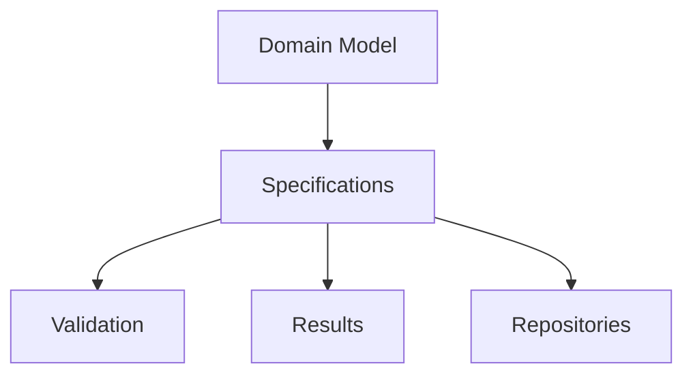

Specifications provide reusable business knowledge that may be consumed by multiple architectural components.

---

# Business-Oriented Design

Specifications should always describe business concepts rather than technical operations.

Examples of well-designed specifications include:

- ActiveCustomerSpecification
- PremiumMemberSpecification
- OverdueInvoiceSpecification
- EligibleForPromotionSpecification

Poor examples include:

- SqlCustomerFilter
- LinqWhereClause
- EntityFrameworkPredicate

Business terminology should always take precedence.

---

# Framework Independence

The Specification subsystem deliberately avoids assumptions regarding:

- LINQ providers;
- expression translators;
- ORM implementations;
- query optimizers;
- persistence engines.

Its responsibility is to express business intent independently of execution technology.

---

# Composability

One of the primary strengths of the Specification Pattern is composability.

Simple specifications can be combined into more expressive business rules.

Conceptually:

```text
Premium Customer

AND

Active Subscription

AND

No Outstanding Debt
```

becomes

```text
EligibleForPrioritySupport
```

Composition enables business complexity to emerge naturally without increasing implementation complexity.

---

# Separation of Responsibilities

The Specification subsystem focuses exclusively on evaluating business predicates.

It does not:

- modify domain state;
- execute commands;
- persist entities;
- dispatch events;
- perform validation messaging;
- manage transactions.

These responsibilities belong to other Shared Kernel modules.

---

# Relationship with Other Modules

The Specification subsystem integrates naturally with:

- **Validation**, by evaluating reusable business conditions;
- **Results**, by producing success or failure outcomes;
- **Domain Events**, by determining when business facts may occur;
- **Repositories**, by expressing reusable filtering criteria;
- **Aggregates**, by enforcing business invariants.

Each subsystem remains independent while collaborating through clearly defined abstractions.

---

# Intended Audience

This document is intended for:

- software architects;
- domain model designers;
- backend developers;
- library maintainers;
- reviewers responsible for preserving architectural consistency.

It assumes familiarity with:

- Domain-Driven Design;
- Clean Architecture;
- object-oriented programming;
- C#;
- SOLID principles.

---

# Document Organization

This document progresses from architectural concepts toward concrete implementation.

The chapters cover:

1. architectural philosophy;
2. design goals;
3. core abstractions;
4. lifecycle;
5. composition;
6. repository integration;
7. performance;
8. concurrency;
9. versioning;
10. implementation examples.

Each chapter builds upon the concepts introduced previously.

---

# Architectural Characteristics

The Specification subsystem is designed to be:

- expressive;
- composable;
- immutable;
- reusable;
- deterministic;
- framework independent;
- highly testable;
- extensible.

These characteristics guide every design decision within the subsystem.

---

# Architectural Invariant

> **Every Specification within KUKULCAN.SharedKernel shall represent a reusable and framework-independent business predicate expressed entirely in domain terminology, remaining immutable, composable, deterministic, and free of infrastructure concerns while enabling consistent evaluation of business rules across aggregates, repositories, validation workflows, and application services without duplicating business logic or compromising the principles of Domain-Driven Design and Clean Architecture.**

This invariant governs the design and evolution of every Specification within the Shared Kernel.

---

# Summary

The Specification Pattern provides the architectural mechanism through which reusable business predicates are modeled within **KUKULCAN.SharedKernel**.

By encapsulating business rules into immutable, composable, framework-independent objects, the subsystem enables consistent business rule evaluation across the Domain Model while reducing duplication, improving maintainability, increasing testability, and preserving strict separation between business intent and technical implementation, thereby establishing a robust foundation for the remaining chapters of this document.

# 2. Philosophy

The philosophy of the **Specification Pattern** within **KUKULCAN.SharedKernel** is founded on the belief that business rules are part of the Domain Model and therefore deserve to be represented as explicit domain concepts rather than hidden inside conditional statements, repository queries, or application services.

A business rule is not merely a boolean expression.

It represents knowledge about the business domain.

That knowledge should be:

- explicit;
- reusable;
- composable;
- testable;
- technology independent.

Specifications provide the architectural mechanism for achieving these goals.

---

## Architectural Principle

Business knowledge should be modeled as reusable domain abstractions rather than repeated implementation details.

> **Business rules are part of the Domain Model, not part of the infrastructure.**

---

# Business Rules as Domain Concepts

A Specification represents business intent.

Instead of asking:

> "How do I filter this collection?"

the Domain asks:

> "Does this object satisfy this business rule?"

This distinction separates business semantics from implementation mechanics.

For example:

```text
Customer.IsPremium
```

is more meaningful than:

```text
Customer.TotalPurchases > 10000
```

The Specification communicates the business concept rather than the implementation details.

---

# Declarative Rather Than Imperative

Specifications encourage a declarative programming style.

Imperative code typically focuses on *how* to evaluate a condition.

Example:

```text
if (...)
{
    ...
}
```

A Specification instead focuses on *what* business rule is being evaluated.

Conceptually:

```text
PremiumCustomerSpecification
```

This shift greatly improves readability and maintainability.

---

# Explicit Business Language

Every Specification should be named using the Ubiquitous Language of the business domain.

Correct examples:

- EligibleForPromotionSpecification
- ActiveSubscriptionSpecification
- OverdueInvoiceSpecification

Incorrect examples:

- CustomerPredicate
- QueryFilter
- SqlExpression

Specifications should always express business terminology.

---

# Encapsulation of Business Knowledge

A Specification encapsulates one coherent business rule.

Consumers do not need to know:

- how the rule is evaluated;
- which fields are involved;
- which calculations are performed.

They only need to know whether the rule is satisfied.

This reinforces encapsulation and information hiding.

---

# Reusability

Business rules frequently appear in multiple places.

For example:

- Aggregate methods;
- Validation workflows;
- Repository queries;
- Application services;
- Domain Event handlers.

Without Specifications, the same rule is often duplicated.

With Specifications:

```text
Business Rule

↓

Specification

↓

Reused Everywhere
```

One implementation serves every consumer.

---

# Composition Instead of Duplication

Business complexity should emerge through composition rather than duplicated logic.

Simple rules may be combined into richer business concepts.

Example:

```text
PremiumCustomer

AND

ActiveSubscription

AND

NoOutstandingDebt
```

Each rule remains independent while forming a larger business policy.

Composition encourages modular design.

---

# Single Responsibility

Each Specification should represent one business concept.

Avoid Specifications that evaluate unrelated rules simultaneously.

Correct:

```text
ActiveCustomerSpecification
```

Incorrect:

```text
ActiveCustomerWithValidAddressAndNoDebtSpecification
```

Complex business policies should emerge through composition rather than oversized Specifications.

---

# Technology Neutrality

Specifications describe business intent independently of execution technology.

They should not know whether evaluation occurs:

- in memory;
- against a database;
- through LINQ;
- through an ORM;
- via a distributed service.

Execution technology belongs to Infrastructure.

Business meaning belongs to the Domain.

---

# Persistence Independence

Specifications should never be designed around database capabilities.

Avoid concepts such as:

- SQL optimization;
- index usage;
- query hints;
- provider limitations.

Instead, express only business semantics.

Infrastructure remains responsible for efficient execution.

---

# Predictability

Evaluating the same Specification against the same object should always produce the same result.

Specifications should therefore be:

- deterministic;
- side-effect free;
- stable.

Deterministic behavior simplifies reasoning, testing, and maintenance.

---

# Side-Effect Free Evaluation

Evaluating a Specification should never modify state.

A Specification should not:

- update aggregates;
- create entities;
- raise Domain Events;
- call external services;
- write to databases.

Evaluation is purely observational.

---

# Relationship with Validation

Specifications complement validation rather than replace it.

Validation answers:

> "Is this input structurally correct?"

Specifications answer:

> "Does this domain object satisfy a business rule?"

Both subsystems collaborate while remaining independent.

---

# Relationship with Aggregates

Aggregate Roots frequently use Specifications to enforce business invariants.

Example:

```text
Aggregate

↓

Evaluate Specification

↓

Allow or Reject Operation
```

The Aggregate owns the decision.

The Specification owns the business predicate.

---

# Relationship with Repositories

Repositories may reuse Specifications to describe retrieval criteria.

The Repository interprets the Specification.

The Specification remains unaware of persistence.

This preserves separation of concerns.

---

# Relationship with Domain Events

Specifications often determine whether a Domain Event may be raised.

Example:

```text
Specification Satisfied

↓

Aggregate State Change

↓

Raise Domain Event
```

Specifications influence business behavior without directly producing side effects.

---

# Long-Term Maintainability

Business rules inevitably evolve.

Specifications isolate those changes.

Instead of modifying many code locations:

```text
Business Rule

↓

Specification

↓

Single Update
```

Centralizing business knowledge dramatically improves maintainability.

---

# Testability

Specifications are naturally easy to test because they are:

- deterministic;
- isolated;
- immutable;
- side-effect free.

Each Specification can be verified independently of the rest of the application.

---

# Evolution

New business requirements should generally introduce:

- new Specifications;
- composed Specifications;
- refined business policies.

Existing Specifications should remain stable whenever possible.

This preserves backward compatibility and minimizes regression risk.

---

# Architectural Characteristics

The philosophical foundation of the Specification subsystem promotes:

- explicit business language;
- reusable business knowledge;
- declarative modeling;
- deterministic behavior;
- composition;
- technology independence;
- long-term maintainability.

These characteristics define the architectural identity of the subsystem.

---

# Architectural Constraints

Every Specification should satisfy the following principles.

- Represent one business concept.
- Remain immutable.
- Remain side effect free.
- Use domain terminology.
- Be framework independent.
- Be composable.
- Be deterministic.

Violating these principles weakens the overall architecture.

---

# Architectural Invariant

> **Every Specification within KUKULCAN.SharedKernel shall encapsulate exactly one reusable business predicate expressed entirely in the Ubiquitous Language of the Domain, remaining immutable, deterministic, side effect free, composable, and independent of persistence technologies or infrastructure concerns, thereby ensuring that business knowledge remains explicit, maintainable, reusable, and consistently applicable throughout the entire Domain Model.**

This invariant defines the philosophical foundation upon which the Specification subsystem is built.

---

# Summary

The philosophy of the Specification Pattern within **KUKULCAN.SharedKernel** is centered on treating business rules as explicit domain concepts rather than hidden implementation details.

By modeling business predicates as immutable, reusable, composable, deterministic, and technology-independent objects, the Specification subsystem enables the Domain Model to express business intent with clarity while reducing duplication, improving maintainability, and preserving strict alignment with the principles of Domain-Driven Design and Clean Architecture.

# 3. Design Goals

The Specification subsystem of **KUKULCAN.SharedKernel** has been designed to provide a robust, reusable, and framework-independent mechanism for expressing business predicates throughout the Domain Model.

Its objective is not simply to encapsulate boolean expressions, but to establish a consistent architectural model through which business rules can be represented, composed, evaluated, tested, and evolved without introducing duplication or coupling.

The design goals presented in this chapter define the architectural qualities expected from every Specification implementation.

---

## Architectural Principle

A well-designed Specification should express business intent once and make it reusable everywhere.

> **Business rules should be reusable assets rather than repeated code fragments.**

---

# Primary Design Goals

The Specification subsystem has been designed to achieve the following primary objectives.

- Eliminate duplicated business predicates.
- Promote reusable business rules.
- Encourage expressive domain models.
- Support composition of complex policies.
- Preserve framework independence.
- Simplify unit testing.
- Enable long-term architectural evolution.

Each objective contributes to the overall quality of the Domain Model.

---

# Goal 1 — Express Business Intent

Every Specification should clearly communicate **what** business rule is being evaluated.

Example:

```text
EligibleForPromotionSpecification
```

communicates business intent immediately.

By contrast:

```text
Customer.TotalPurchases > 10000
```

describes only an implementation detail.

Specifications should elevate business language above technical implementation.

---

# Goal 2 — Centralize Business Rules

A business rule should have a single authoritative implementation.

Without Specifications:

```text
Service A

↓

if (...)

Service B

↓

if (...)

Repository

↓

if (...)
```

The same rule is duplicated multiple times.

With Specifications:

```text
Business Rule

↓

Specification

↓

Shared Everywhere
```

Centralization reduces maintenance costs and prevents inconsistent behavior.

---

# Goal 3 — Enable Composition

Simple Specifications should combine naturally into richer business policies.

Conceptually:

```text
Specification A

AND

Specification B

OR

Specification C
```

Composition allows complex business behavior to emerge without increasing implementation complexity.

---

# Goal 4 — Preserve Domain Purity

Specifications should remain part of the Domain.

They should never depend upon:

- databases;
- ORMs;
- repositories;
- HTTP;
- messaging;
- cloud SDKs.

Their sole responsibility is expressing business predicates.

---

# Goal 5 — Promote Reuse

The same Specification should be reusable across multiple architectural layers.

Examples include:

- Aggregate methods;
- Validation workflows;
- Repository queries;
- Domain Services;
- Application Services;
- Domain Event handlers.

Reuse reduces duplication while improving consistency.

---

# Goal 6 — Improve Readability

Specifications replace implementation details with meaningful business concepts.

Compare:

```text
if (customer.TotalPurchases > 10000 &&
    customer.IsActive &&
    !customer.HasDebt)
```

versus:

```text
EligibleForPrioritySupportSpecification
```

The latter communicates intent rather than mechanics.

---

# Goal 7 — Simplify Testing

Each Specification should be independently testable.

Testing should verify only:

- business inputs;
- expected outcomes.

No infrastructure should be required.

Example:

```text
Input

↓

Specification

↓

True / False
```

Simple tests increase confidence while reducing maintenance.

---

# Goal 8 — Encourage Determinism

Given identical input, a Specification should always produce the same result.

Specifications should therefore avoid:

- mutable state;
- random values;
- current time;
- external services;
- database access.

Deterministic behavior improves reliability and reproducibility.

---

# Goal 9 — Support Aggregate Consistency

Aggregate Roots frequently rely upon Specifications before performing state transitions.

Example:

```text
Aggregate

↓

Specification

↓

Business Decision
```

Specifications support consistency without taking ownership of aggregate behavior.

---

# Goal 10 — Enable Repository Filtering

Repositories may interpret Specifications to construct queries.

The Specification itself remains unaware of:

- SQL;
- LINQ providers;
- query optimizers;
- persistence engines.

Business meaning remains isolated from query implementation.

---

# Goal 11 — Support Future Evolution

Business rules inevitably change.

Specifications isolate these changes by providing one reusable implementation.

Instead of modifying multiple locations:

```text
Business Rule

↓

Specification

↓

Single Update
```

This greatly improves maintainability.

---

# Goal 12 — Minimize Coupling

Specifications should depend only upon:

- the Domain Model;
- business concepts;
- shared abstractions.

They should never depend upon infrastructure implementations.

Loose coupling enables architectural flexibility.

---

# Goal 13 — Maximize Cohesion

Every Specification should represent one coherent business concept.

Responsibilities should never become mixed.

Correct:

```text
PremiumCustomerSpecification
```

Incorrect:

```text
PremiumCustomerWithEmailValidationAndDiscountCalculationSpecification
```

High cohesion improves readability and reuse.

---

# Goal 14 — Encourage Declarative Modeling

Specifications encourage developers to describe business intent rather than implementation logic.

Instead of writing:

```text
if (...)
```

the Domain expresses:

```text
CustomerCanPlaceOrderSpecification
```

This produces models that are easier to understand and discuss with domain experts.

---

# Goal 15 — Preserve Architectural Independence

Specifications should remain independent of:

- execution engines;
- persistence frameworks;
- dependency injection containers;
- messaging systems;
- cloud platforms.

Technology may evolve.

Business meaning should not.

---

# Goal 16 — Support Performance Without Compromising Design

Performance considerations should never weaken architectural quality.

Preferred optimization strategies include:

- composition;
- expression reuse;
- deterministic evaluation;
- immutable objects.

Correctness always takes precedence over micro-optimization.

---

# Goal 17 — Facilitate Documentation

Well-designed Specifications become self-documenting.

Business terminology provides immediate understanding of domain behavior.

Examples:

- CanShipOrderSpecification
- InvoiceIsOverdueSpecification
- UserHasAdministrativePrivilegesSpecification

Names become part of the Ubiquitous Language.

---

# Goal 18 — Encourage Long-Term Stability

Specifications should evolve gradually.

Whenever possible:

- extend;
- compose;
- introduce new Specifications.

Avoid changing the meaning of existing business predicates unnecessarily.

Stable abstractions reduce regression risk.

---

# Architectural Characteristics

The design goals collectively promote Specifications that are:

- expressive;
- reusable;
- composable;
- deterministic;
- cohesive;
- loosely coupled;
- framework independent;
- highly testable;
- maintainable;
- scalable.

These characteristics define the architectural quality expected from the subsystem.

---

# Architectural Constraints

Every Specification implementation should satisfy the following design constraints.

- Represent one business rule.
- Remain reusable.
- Remain deterministic.
- Avoid infrastructure dependencies.
- Encourage composition.
- Preserve readability.
- Support independent testing.
- Remain technology-agnostic.

Violating these constraints diminishes the long-term value of the Specification subsystem.

---

# Architectural Invariant

> **Every Specification within KUKULCAN.SharedKernel shall be designed to express a single reusable business predicate through explicit domain language, remaining deterministic, composable, framework independent, highly cohesive, loosely coupled, independently testable, and technology-agnostic, thereby enabling consistent business rule evaluation across the Domain Model while minimizing duplication and maximizing long-term maintainability and architectural evolution.**

This invariant defines the design objectives governing every Specification implementation.

---

# Summary

The design goals of the Specification subsystem establish a clear architectural direction centered on reusable business knowledge, explicit domain language, deterministic evaluation, composability, and strict separation from infrastructure concerns.

By fulfilling these objectives, **KUKULCAN.SharedKernel** provides a Specification architecture capable of supporting complex business models while remaining maintainable, extensible, scalable, and fully aligned with the principles of Domain-Driven Design and Clean Architecture.

# 4. Architectural Goals

The Specification subsystem has been architected to become the canonical mechanism for expressing business predicates throughout **KUKULCAN.SharedKernel**.

While the previous chapter defined the functional design objectives, this chapter defines the architectural objectives that govern how the subsystem integrates with the remainder of the Shared Kernel and the overall Clean Architecture.

These goals ensure that Specifications remain reusable, technology independent, highly cohesive, and capable of evolving without compromising the integrity of the Domain Model.

---

## Architectural Principle

Architecture should preserve business knowledge while isolating implementation details.

> **Specifications express business decisions, not execution strategies.**

---

# Primary Architectural Goals

The Specification subsystem has been designed to satisfy the following architectural objectives.

- Preserve Domain purity.
- Centralize business predicates.
- Enable composition.
- Promote architectural consistency.
- Remain persistence agnostic.
- Support future evolution.
- Integrate seamlessly with the remaining Shared Kernel modules.

These goals collectively define the role of Specifications within the architecture.

---

# Goal 1 — Preserve Domain Independence

Specifications belong exclusively to the Domain layer.

They should never depend upon:

- Infrastructure;
- Application Services;
- databases;
- repositories;
- messaging systems;
- external frameworks.

The dependency direction always points inward.

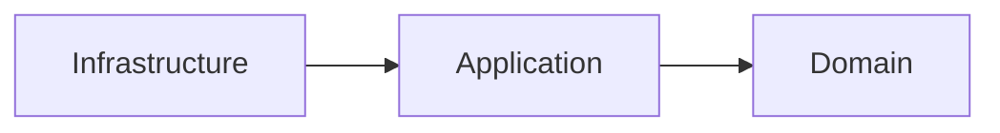

Specifications remain entirely inside the Domain.

---

# Goal 2 — Centralize Business Predicates

Every reusable business predicate should exist in one place.

Instead of repeating logic throughout the solution:

```text
Repository

↓

Aggregate

↓

Service

↓

Handler
```

the architecture becomes:

```text
Specification

↓

Shared Usage
```

Centralization improves consistency and maintainability.

---

# Goal 3 — Enable Composable Business Policies

Business policies frequently consist of multiple smaller rules.

Architecture should encourage composition.

Example:

```text
CanPurchase

=

IsActive

AND

HasCredit

AND

IsVerified
```

Composable Specifications reduce duplication while improving readability.

---

# Goal 4 — Separate Business Semantics from Execution

Specifications describe business meaning.

They do not determine:

- how evaluation occurs;
- where evaluation occurs;
- which technology performs evaluation.

Execution belongs to consumers.

Business intent belongs to the Specification.

---

# Goal 5 — Support Multiple Evaluation Contexts

A Specification should be reusable regardless of where it is evaluated.

Possible evaluation contexts include:

- Aggregate methods;
- in-memory collections;
- repositories;
- application services;
- validation workflows.

The Specification itself remains unchanged.

---

# Goal 6 — Maintain Persistence Agnosticism

The architecture intentionally avoids coupling Specifications to persistence technologies.

Specifications should never reference:

- Entity Framework;
- SQL;
- MongoDB;
- Cosmos DB;
- Dapper;
- provider-specific APIs.

Persistence interpretation belongs entirely to Infrastructure.

---

# Goal 7 — Integrate with Repositories

Repositories should consume Specifications rather than implement business rules.

Conceptually:


Repositories translate business predicates into persistence queries.

Specifications remain persistence independent.

---

# Goal 8 — Integrate with Aggregates

Aggregate Roots frequently rely upon Specifications before performing state transitions.

Conceptually:

```text
Aggregate

↓

Evaluate Specification

↓

Business Decision
```

Specifications assist aggregates without assuming ownership of business behavior.

---

# Goal 9 — Integrate with Validation

Validation and Specifications complement one another.

Validation determines:

```text
Input Correctness
```

Specifications determine:

```text
Business Eligibility
```

Together they provide complete business verification while remaining independent.

---

# Goal 10 — Integrate with Results

Specifications naturally support the Results subsystem.

Conceptually:

```text
Specification

↓

Satisfied?

↓

Result.Success

or

Result.Failure
```

Business predicates become reusable decision points throughout the Domain.

---

# Goal 11 — Integrate with Domain Events

Specifications frequently determine whether an Aggregate may raise a Domain Event.

Example:

```text
Specification Satisfied

↓

Aggregate State Change

↓

Raise Event
```

The Specification influences business behavior without producing side effects.

---

# Goal 12 — Encourage High Cohesion

Each Specification should encapsulate one coherent business concept.

Correct:

```text
EligibleForMembershipSpecification
```

Incorrect:

```text
MembershipSpecificationWithValidationAndPersistence
```

Focused responsibilities simplify maintenance.

---

# Goal 13 — Minimize Coupling

Specifications should depend only upon:

- domain abstractions;
- value objects;
- entities;
- shared domain contracts.

Avoid dependencies upon:

- repositories;
- logging;
- dependency injection;
- infrastructure services.

Loose coupling enables architectural flexibility.

---

# Goal 14 — Promote Testability

The architecture should allow every Specification to be tested independently.

Testing should require only:

- domain objects;
- expected outcomes.

No infrastructure should participate.

Simple tests encourage frequent verification.

---

# Goal 15 — Preserve Deterministic Behavior

Evaluating the same Specification with identical inputs should always produce identical results.

Specifications should therefore avoid:

- randomness;
- mutable global state;
- current time;
- network access;
- persistence.

Determinism simplifies reasoning and replay.

---

# Goal 16 — Support Long-Term Evolution

Business rules inevitably evolve.

Architecture should encourage:

- composition;
- extension;
- new Specifications.

Existing Specifications should remain stable whenever practical.

Stable abstractions reduce regression risk.

---

# Goal 17 — Enable Framework Independence

Specifications should remain usable regardless of the surrounding application stack.

Possible execution environments include:

- monolithic applications;
- microservices;
- cloud-native systems;
- desktop applications;
- background workers.

Business predicates remain identical everywhere.

---

# Goal 18 — Preserve Architectural Consistency

Every Specification should follow the same architectural conventions.

This consistency enables developers to understand new Specifications immediately.

Consistent abstractions reduce cognitive complexity across the entire Shared Kernel.

---

# Relationship with SharedKernel Modules

The Specification subsystem collaborates with multiple Shared Kernel modules.

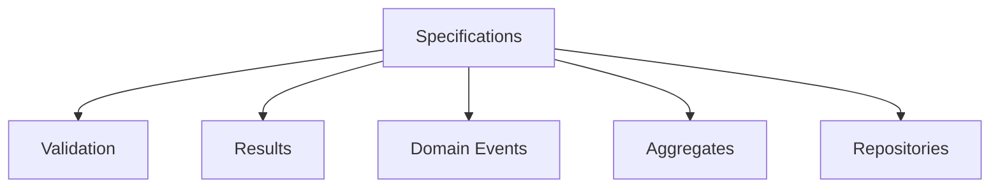

Each subsystem consumes Specifications without introducing circular dependencies.

---

# Architectural Characteristics

The architectural goals collectively promote Specifications that are:

- framework independent;
- persistence agnostic;
- highly cohesive;
- loosely coupled;
- deterministic;
- composable;
- reusable;
- scalable;
- testable;
- maintainable.

These characteristics define the architectural identity of the subsystem.

---

# Architectural Constraints

Every Specification implementation shall satisfy the following architectural constraints.

- Belong exclusively to the Domain layer.
- Avoid infrastructure dependencies.
- Express one business predicate.
- Remain deterministic.
- Support composition.
- Preserve persistence independence.
- Integrate through abstractions only.
- Maintain architectural consistency.

Violating these constraints weakens the integrity of the Shared Kernel.

---

# Architectural Invariant

> **Every Specification within KUKULCAN.SharedKernel shall function as a framework-independent architectural abstraction representing a single reusable business predicate, integrating consistently with Aggregates, Validation, Results, Domain Events, and Repositories through explicit domain contracts while preserving deterministic behavior, persistence independence, loose coupling, high cohesion, and complete adherence to the dependency rules defined by Domain-Driven Design and Clean Architecture.**

This invariant governs the architectural role of every Specification within the Shared Kernel.

---

# Summary

The architectural goals of the Specification subsystem establish its position as the central mechanism for expressing reusable business predicates throughout **KUKULCAN.SharedKernel**.

By preserving Domain independence, enabling composition, maintaining persistence agnosticism, integrating consistently with the remaining Shared Kernel modules, and enforcing deterministic, highly cohesive, and loosely coupled designs, the Specification architecture provides a robust foundation capable of supporting complex enterprise business models while remaining fully aligned with the principles of Domain-Driven Design and Clean Architecture.

# 5. Specification Fundamentals

The **Specification Pattern** is a domain modeling technique that encapsulates business predicates into explicit, reusable, and composable objects.

Within **KUKULCAN.SharedKernel**, a Specification represents a business rule that determines whether a domain object satisfies a particular business condition.

Unlike validation rules, which typically verify structural correctness, or queries, which retrieve information, Specifications express business knowledge.

They answer one fundamental question:

> **Does this domain object satisfy this business rule?**

This distinction makes Specifications an essential building block of the Domain Model.

---

## Architectural Principle

A Specification represents knowledge about the business domain, not knowledge about the underlying implementation.

> **Specifications describe what is true, never how truth is evaluated.**

---

# Definition

A Specification is an immutable object that encapsulates one business predicate.

Conceptually:

```text
Domain Object

↓

Specification

↓

Satisfied?

↓

True / False
```

The Specification owns the business criterion.

The Domain Object owns the business state.

---

# What a Specification Represents

A Specification represents a business concept.

Examples include:

- Customer is eligible for membership.
- Invoice is overdue.
- Order may be canceled.
- Employee is authorized.
- Product is available.

These concepts belong to the Domain, regardless of how they are evaluated.

---

# What a Specification Is Not

A Specification is **not**:

- a database query;
- a LINQ expression;
- a SQL filter;
- an ORM abstraction;
- a validation message;
- a command;
- a business process.

It is purely a reusable business predicate.

---

# Boolean Semantics

Every Specification ultimately evaluates to a boolean result.

Conceptually:

```text
Satisfied

↓

True
```

or

```text
Not Satisfied

↓

False
```

Although implementations may expose additional metadata, the fundamental semantic remains binary.

---

# Business-Oriented Modeling

Specifications should always describe business intent.

Correct:

```text
EligibleForPromotionSpecification
```

Incorrect:

```text
PurchasesGreaterThan10000Specification
```

The first describes the business concept.

The second exposes implementation details.

---

# Immutability

Specifications should remain immutable throughout their lifetime.

Once created, they should never modify:

- internal state;
- business criteria;
- evaluation behavior.

Immutability guarantees:

- thread safety;
- deterministic behavior;
- predictable reuse.

---

# Statelessness

Specifications should avoid mutable runtime state.

Evaluation should depend only upon:

- the Specification itself;
- the object being evaluated.

No hidden state should influence the outcome.

---

# Deterministic Evaluation

Given identical input, a Specification must always produce the same result.

Incorrect dependencies include:

- current time;
- random numbers;
- mutable global state;
- external services.

Business predicates should remain predictable.

---

# Side-Effect Free Evaluation

Evaluating a Specification should never change the Domain Model.

Evaluation should not:

- modify entities;
- raise events;
- persist data;
- invoke repositories;
- call external APIs.

Specifications observe.

They never mutate.

---

# Single Responsibility

Each Specification should represent one business concept.

Correct:

```text
PremiumCustomerSpecification
```

Incorrect:

```text
PremiumCustomerWithDebtVerificationAndEmailValidationSpecification
```

Complex business policies should emerge through composition.

---

# Reusability

One Specification should be reusable across the entire solution.

Examples:

```text
Aggregate

↓

Repository

↓

Validation

↓

Application Service
```

The business predicate remains identical regardless of the consumer.

---

# Composition

Simple Specifications may be combined into richer business policies.

Conceptually:

```text
Specification A

AND

Specification B
```

or

```text
Specification A

OR

Specification B
```

Composition enables scalable business modeling.

---

# Domain Ownership

Specifications belong to the Domain.

They should not belong to:

- Infrastructure;
- repositories;
- databases;
- ORM providers;
- messaging systems.

Business knowledge remains inside the Domain Model.

---

# Persistence Independence

Specifications intentionally avoid assumptions regarding persistence.

Whether evaluation occurs:

- in memory;
- through Entity Framework;
- using MongoDB;
- via SQL;

is irrelevant to the Specification itself.

Execution strategy belongs elsewhere.

---

# Aggregate Collaboration

Aggregate Roots frequently evaluate Specifications before performing business operations.

Example:

```text
Aggregate

↓

Specification

↓

Business Decision
```

The Aggregate remains responsible for state transitions.

The Specification remains responsible for business predicates.

---

# Validation Collaboration

Validation answers:

```text
Is the input valid?
```

Specifications answer:

```text
Does the business rule hold?
```

Both concepts complement one another without overlapping responsibilities.

---

# Repository Collaboration

Repositories may interpret Specifications to retrieve matching entities.

Conceptually:


The Repository performs interpretation.

The Specification remains technology independent.

---

# Domain Event Collaboration

Specifications frequently determine whether a Domain Event may be generated.

Example:

```text
Specification Satisfied

↓

Aggregate State Change

↓

Raise Domain Event
```

The Specification influences business decisions while remaining free of side effects.

---

# Expression of Ubiquitous Language

Specifications contribute directly to the Ubiquitous Language of the Domain.

Well-designed Specifications become recognizable business concepts shared by:

- developers;
- architects;
- domain experts;
- analysts.

This improves communication across the project.

---

# Lifecycle

The lifecycle of a Specification is intentionally simple.

```text
Create

↓

Reuse

↓

Evaluate

↓

Dispose (if applicable)
```

Because Specifications are immutable, they may safely be reused indefinitely.

---

# Architectural Characteristics

Fundamentally, every Specification should be:

- immutable;
- deterministic;
- reusable;
- composable;
- expressive;
- framework independent;
- side-effect free;
- business-oriented.

These characteristics distinguish Specifications from ordinary predicates.

---

# Architectural Constraints

Every Specification shall satisfy the following fundamental constraints.

- Represent one business predicate.
- Remain immutable.
- Be side effect free.
- Remain deterministic.
- Avoid infrastructure dependencies.
- Express business terminology.
- Support composition.
- Preserve Domain ownership.

These constraints define the core nature of the Specification Pattern.

---

# Architectural Invariant

> **Every Specification within KUKULCAN.SharedKernel shall represent exactly one immutable, deterministic, side effect free, and reusable business predicate expressed through the Ubiquitous Language of the Domain, remaining entirely independent of persistence technologies, infrastructure implementations, and execution strategies while providing a consistent architectural abstraction for evaluating business knowledge across the entire Domain Model.**

This invariant defines the fundamental nature of every Specification within the Shared Kernel.

---

# Summary

The fundamentals of the Specification Pattern establish it as the canonical mechanism for representing reusable business predicates within **KUKULCAN.SharedKernel**.

By treating business rules as immutable, deterministic, side effect free, and framework-independent domain concepts, Specifications enable the Domain Model to express business knowledge explicitly while supporting composition, reuse, architectural consistency, and long-term maintainability in full accordance with the principles of Domain-Driven Design and Clean Architecture.

# 6. Specification Taxonomy

The Specification subsystem of **KUKULCAN.SharedKernel** defines a taxonomy that classifies Specifications according to their architectural role rather than their implementation.

This taxonomy provides a common vocabulary for understanding how different kinds of Specifications collaborate to express increasingly sophisticated business policies while preserving the principles of Domain-Driven Design (DDD), Clean Architecture, and SOLID.

The classification presented in this chapter is conceptual.

Concrete implementations may vary, but every Specification should fit into one of the categories described below.

---

## Architectural Principle

Business complexity should emerge through the composition of simple, well-defined Specifications.

> **Small business predicates compose into rich business policies.**

---

# Purpose of the Taxonomy

The taxonomy serves several architectural purposes.

- Establish a common architectural vocabulary.
- Clarify responsibilities.
- Promote consistency.
- Encourage composition.
- Reduce duplication.
- Improve discoverability.
- Simplify maintenance.

A shared classification enables architects and developers to reason about business rules using the same terminology.

---

# Taxonomy Overview

The Specification subsystem classifies Specifications into the following conceptual categories.

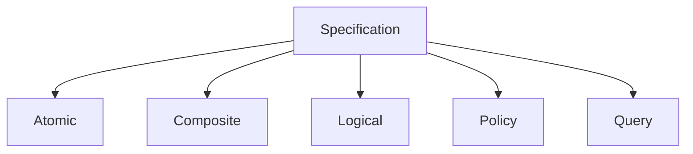

Each category fulfills a distinct architectural purpose.

---

# Atomic Specifications

An **Atomic Specification** represents one indivisible business predicate.

Examples:

- ActiveCustomerSpecification
- PremiumMemberSpecification
- InvoicePaidSpecification

Characteristics:

- one business concept;
- deterministic;
- reusable;
- immutable.

Atomic Specifications form the foundation of the subsystem.

---

# Composite Specifications

Composite Specifications combine multiple Specifications into a larger business rule.

Example:

```text
Premium Customer

AND

Active Membership
```

becomes

```text
EligibleForPrioritySupport
```

Composite Specifications should not introduce new evaluation mechanisms.

They simply orchestrate existing Specifications.

---

# Logical Specifications

Logical Specifications express boolean composition.

Typical operators include:

- AND
- OR
- NOT

Example:

```text
Specification A

AND

Specification B
```

Logical Specifications enable business rules to grow without increasing implementation complexity.

---

# Policy Specifications

Policy Specifications represent higher-level business policies.

Unlike Atomic Specifications, they usually compose several business predicates into one recognizable domain concept.

Example:

```text
LoanApprovalPolicy
```

internally may evaluate:

- credit score;
- outstanding debt;
- employment history;
- customer status.

Consumers interact only with the policy.

---

# Query Specifications

Some Specifications describe retrieval criteria.

Example:

```text
OverdueInvoicesSpecification
```

Although repositories may interpret these Specifications, the Specification itself remains persistence agnostic.

Query Specifications describe *which* business objects satisfy a condition—not *how* they are retrieved.

---

# Aggregate Specifications

Aggregate Specifications evaluate business rules related to Aggregate state.

Examples:

- CanShipOrderSpecification
- CanCancelInvoiceSpecification
- CanCloseAccountSpecification

Aggregate Specifications often participate directly in enforcing business invariants.

---

# Entity Specifications

Entity Specifications evaluate individual entities.

Examples:

- AdultCustomerSpecification
- VerifiedUserSpecification
- ActiveSubscriptionSpecification

They typically evaluate properties belonging to a single entity.

---

# Value Object Specifications

Some Specifications operate on Value Objects.

Examples:

- ValidMoneyRangeSpecification
- SupportedCurrencySpecification
- ValidPostalCodeSpecification

Although less common, they remain useful for reusable domain concepts.

---

# Cross-Aggregate Specifications

Occasionally a business rule depends upon information spanning multiple Aggregates.

Rather than allowing Aggregates to communicate directly, the architecture encourages expressing the rule through a Specification evaluated by an Application Service or Domain Service.

Example:

```text
Customer

+

Membership

↓

EligibleForRewardSpecification
```

Aggregate autonomy remains preserved.

---

# Temporal Specifications

Certain Specifications evaluate time-dependent business rules.

Examples:

- MembershipExpiredSpecification
- InvoiceOverdueSpecification
- SubscriptionRenewalDueSpecification

These Specifications should obtain time through abstractions such as `IClock` rather than directly using the system clock.

This preserves determinism and testability.

---

# Authorization Specifications

Authorization may also be represented through Specifications.

Examples:

- UserCanApproveOrderSpecification
- UserCanModifyCustomerSpecification
- UserHasAdministrativePrivilegesSpecification

Business authorization remains inside the Domain Model rather than being scattered throughout application logic.

---

# Validation-Oriented Specifications

Specifications frequently support validation workflows.

Example:

```text
CustomerEligibleSpecification
```

Validation may depend upon this Specification without duplicating business logic.

Validation verifies correctness.

Specifications verify business eligibility.

---

# Repository Specifications

Repositories consume Specifications rather than embedding business predicates.

Conceptually:


The Repository interprets.

The Specification remains unaware of persistence.

---

# Domain Event Specifications

Specifications frequently determine whether an Aggregate may raise a Domain Event.

Conceptually:

```text
Business Predicate

↓

Satisfied

↓

Raise Domain Event
```

Specifications influence business behavior without producing side effects.

---

# Composite Hierarchy

The taxonomy naturally forms a hierarchy.

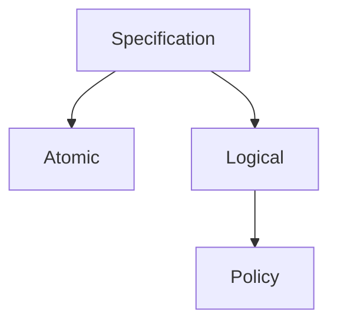

Complex policies emerge from simpler building blocks.

---

# Recommended Usage

Prefer:

- Atomic Specifications for individual rules.
- Composite Specifications for business policies.
- Logical Specifications for boolean composition.
- Policy Specifications for high-level business concepts.

Avoid oversized Specifications attempting to perform multiple unrelated responsibilities.

---

# Architectural Characteristics

The taxonomy encourages Specifications that are:

- modular;
- composable;
- reusable;
- deterministic;
- cohesive;
- loosely coupled;
- expressive;
- framework independent.

These characteristics scale naturally as business complexity increases.

---

# Architectural Constraints

Every Specification should belong conceptually to one primary category.

Specifications should not:

- mix unrelated responsibilities;
- combine infrastructure concerns;
- violate aggregate boundaries;
- duplicate existing business predicates.

The taxonomy exists to preserve conceptual clarity.

---

# Architectural Invariant

> **Every Specification within KUKULCAN.SharedKernel shall belong to a clearly identifiable architectural category that reflects its business responsibility, whether atomic, logical, composite, policy-oriented, or query-oriented, thereby ensuring consistent modeling, predictable composition, high cohesion, low coupling, and scalable representation of business knowledge while preserving complete independence from infrastructure, persistence technologies, and execution mechanisms.**

This invariant governs the conceptual classification of Specifications throughout the Shared Kernel.

---

# Summary

The Specification taxonomy defines a structured classification system that enables architects and developers to model business predicates consistently across **KUKULCAN.SharedKernel**.

By distinguishing between Atomic, Composite, Logical, Policy, Query, Aggregate, Entity, Value Object, Temporal, Authorization, Validation, and Repository-oriented Specifications, the architecture promotes modularity, reuse, composability, and long-term maintainability while preserving strict adherence to the principles of Domain-Driven Design and Clean Architecture.

# 7. Core Components

The Specification subsystem is composed of a small set of highly cohesive architectural components that collectively provide the foundation for expressing, composing, evaluating, and managing business predicates throughout **KUKULCAN.SharedKernel**.

Each component has a single, well-defined responsibility and collaborates with the others through stable abstractions.

The objective of this design is to maximize:

- readability;
- reuse;
- composability;
- maintainability;
- extensibility;
- framework independence.

Together, these components form the complete architectural model of the Specification subsystem.

---

## Architectural Principle

Each architectural component should have one responsibility and collaborate through abstractions.

> **Small, focused components produce scalable architectures.**

---

# Architectural Overview

The Specification subsystem is organized around a layered hierarchy of abstractions.

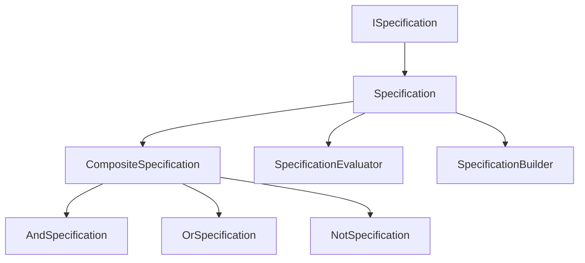

Each component extends the architectural capabilities of the previous layer without violating the Dependency Rule.

---

# Component Responsibilities

The following table summarizes the responsibility of every core component.

| Component                  | Responsibility                                       |
|----------------------------|------------------------------------------------------|
| **ISpecification**         | Defines the contract for all Specifications.         |
| **Specification**          | Base implementation of reusable business predicates. |
| **CompositeSpecification** | Base class for Specification composition.            |
| **AndSpecification**       | Logical conjunction of two Specifications.           |
| **OrSpecification**        | Logical disjunction of two Specifications.           |
| **NotSpecification**       | Logical negation of a Specification.                 |
| **SpecificationEvaluator** | Executes Specification evaluation.                   |
| **SpecificationBuilder**   | Provides fluent composition of Specifications.       |

Each component exists to solve exactly one architectural concern.

---

# Design Philosophy

The subsystem intentionally favors:

- composition over inheritance;
- abstraction over implementation;
- immutability over mutable state;
- declarative modeling over imperative logic.

Each component contributes one capability while remaining independent of infrastructure.

---

# Component Collaboration

A typical execution flow follows the sequence below.

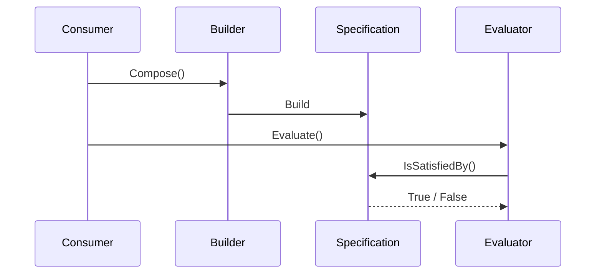

Every participant owns a single responsibility.

---

# Layered Responsibilities

Conceptually, the subsystem may be viewed as four architectural layers.

```text
Contracts

↓

Business Specifications

↓

Composition

↓

Evaluation
```

Each layer depends only upon the abstractions immediately below it.

---

# Component Characteristics

Every core component should be:

- immutable;
- deterministic;
- side-effect free;
- reusable;
- framework independent;
- highly cohesive;
- loosely coupled.

These characteristics remain consistent throughout the subsystem.

---

# Contracts

Architectural contracts define behavior without prescribing implementation.

Examples include:

- `ISpecification<T>`

Contracts promote:

- extensibility;
- testability;
- dependency inversion.

Implementations remain interchangeable.

---

# Base Implementations

Base classes eliminate duplication while preserving flexibility.

They provide:

- shared behavior;
- common abstractions;
- composition support;
- operator overloading (when appropriate).

Derived Specifications focus exclusively on business intent.

---

# Composition Components

Composition components enable increasingly sophisticated business policies without increasing implementation complexity.

Supported composition includes:

- conjunction;
- disjunction;
- negation.

Composition is the primary mechanism through which business complexity scales.

---

# Evaluation Components

Evaluation components are responsible for executing business predicates.

They do **not**:

- modify domain objects;
- persist data;
- invoke infrastructure;
- produce side effects.

Evaluation remains purely observational.

---

# Builder Components

Builders improve developer experience by providing fluent APIs for constructing Specifications.

Conceptually:

```text
Specification

↓

Builder

↓

Composite Specification
```

Builders improve readability without altering business semantics.

---

# Interaction with Aggregates

Aggregate Roots interact primarily with:

- `ISpecification`
- `Specification`

Aggregates should never depend upon:

- builders;
- evaluators;
- composition internals.

The Aggregate only requires the business predicate.

---

# Interaction with Repositories

Repositories frequently consume composed Specifications.

They typically interact with:

- `ISpecification`
- `SpecificationEvaluator`

Repositories interpret Specifications.

They do not own them.

---

# Interaction with Validation

Validation workflows frequently reuse Specifications through the public contract.

This prevents business rule duplication.

Validation remains structurally independent of the Specification subsystem.

---

# Interaction with Domain Events

Specifications frequently determine whether Aggregates may raise Domain Events.

The interaction remains indirect.

Specifications never dispatch events themselves.

---

# Extensibility

The architecture intentionally allows new Specification types to be introduced without modifying existing components.

Future additions may include:

- temporal Specifications;
- authorization Specifications;
- caching decorators;
- optimization layers.

Open/Closed Principle remains preserved.

---

# Framework Independence

None of the core components depend upon:

- Entity Framework;
- LINQ providers;
- dependency injection frameworks;
- persistence engines;
- messaging frameworks.

All technology-specific behavior remains outside the subsystem.

---

# Architectural Characteristics

Collectively, the core components provide:

- clear responsibilities;
- reusable abstractions;
- deterministic execution;
- composability;
- extensibility;
- architectural consistency.

These characteristics define the implementation foundation of the Specification subsystem.

---

# Architectural Constraints

Every core component shall satisfy the following constraints.

- One architectural responsibility.
- Framework independence.
- Immutable behavior.
- Side-effect free execution.
- Dependency inversion.
- High cohesion.
- Low coupling.
- Explicit collaboration.

These constraints preserve architectural integrity.

---

# Relationship Between Components

The following chapters describe each core component individually.

- **7.1** — ISpecification
- **7.2** — Specification
- **7.3** — CompositeSpecification
- **7.4** — AndSpecification
- **7.5** — OrSpecification
- **7.6** — NotSpecification
- **7.7** — SpecificationEvaluator
- **7.8** — SpecificationBuilder

Each chapter expands upon the responsibilities introduced here.

---

# Architectural Invariant

> **Every core component within the Specification subsystem of KUKULCAN.SharedKernel shall provide exactly one architectural responsibility through immutable, deterministic, framework-independent abstractions that collaborate exclusively through explicit contracts, thereby preserving high cohesion, low coupling, composability, extensibility, and full compliance with the Dependency Rule established by Domain-Driven Design and Clean Architecture.**

This invariant governs the architectural design of every component within the Specification subsystem.

---

# Summary

The Specification subsystem is intentionally composed of a minimal set of highly cohesive architectural components that collectively provide the infrastructure required to model reusable business predicates.

By separating contracts, implementations, composition mechanisms, evaluation services, and fluent builders into clearly defined responsibilities, **KUKULCAN.SharedKernel** achieves a Specification architecture that is scalable, extensible, deterministic, framework independent, and fully aligned with the principles of Domain-Driven Design and Clean Architecture.

# 7.1. ISpecification

`ISpecification<T>` is the foundational contract of the entire Specification subsystem.

Every concrete Specification within **KUKULCAN.SharedKernel** ultimately derives its behavior from this interface.

Rather than defining implementation details, `ISpecification<T>` establishes the architectural contract through which business predicates are represented, composed, and evaluated consistently across the Domain Model.

It is intentionally minimal.

Its purpose is to express **what a Specification is**, not **how a Specification works**.

---

## Architectural Principle

Architectural contracts should define behavior while remaining independent of implementation.

> **The Domain depends on abstractions, never on concrete Specifications.**

---

# Purpose

`ISpecification<T>` exists to:

- establish a common Specification contract;
- enable polymorphism;
- support dependency inversion;
- allow Specification composition;
- isolate business rules from implementation details;
- promote architectural consistency.

Every consumer of Specifications should depend upon this contract.

---

# Generic Type Parameter

The generic parameter `T` represents the Domain object evaluated by the Specification.

Example:

```csharp
ISpecification<Customer>
```

indicates that the Specification evaluates instances of `Customer`.

The interface remains completely independent of the evaluated type.

---

# Architectural Position

Within the subsystem hierarchy:

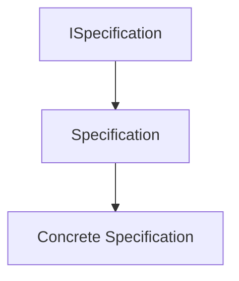

The interface defines the architectural contract.

The remaining classes provide implementation.

---

# Core Responsibility

The interface has one responsibility:

> Define whether a business object satisfies a business predicate.

It does **not**:

- compose Specifications;
- evaluate persistence queries;
- dispatch events;
- generate validation errors;
- interact with repositories.

Those concerns belong elsewhere.

---

# Minimal Contract

Conceptually, the interface exposes one fundamental capability.

```text
Object

↓

Specification

↓

Satisfied?

↓

True / False
```

Everything else builds upon this simple abstraction.

---

# Expected Operations

A typical implementation exposes a method conceptually equivalent to:

```csharp
bool IsSatisfiedBy(T candidate);
```

This operation determines whether the candidate satisfies the business rule represented by the Specification.

Evaluation must remain deterministic.

---

# Deterministic Evaluation

Calling:

```text
IsSatisfiedBy(candidate)
```

multiple times with identical input should always produce identical output.

The contract assumes:

- no hidden state;
- no randomness;
- no infrastructure dependencies;
- no side effects.

Deterministic behavior is a fundamental architectural requirement.

---

# Side-Effect Free Contract

`ISpecification<T>` must never modify:

- the evaluated object;
- global state;
- infrastructure;
- repositories;
- external services.

Evaluation is purely observational.

Specifications answer questions.

They never perform actions.

---

# Business-Oriented Abstraction

The interface represents business knowledge.

Consumers should reason in terms of business concepts.

Example:

```csharp
if (premiumCustomerSpecification.IsSatisfiedBy(customer))
{
    ...
}
```

rather than:

```csharp
if (customer.TotalPurchases > 10000)
{
    ...
}
```

The contract encourages domain language.

---

# Framework Independence

The interface intentionally avoids dependencies upon:

- LINQ;
- Entity Framework;
- SQL;
- dependency injection;
- serialization;
- messaging frameworks.

Its only concern is business evaluation.

---

# Collaboration with Aggregates

Aggregate Roots consume the interface rather than concrete implementations.

Conceptually:

```text
Aggregate

↓

ISpecification<T>

↓

Business Decision
```

This preserves loose coupling.

---

# Collaboration with Repositories

Repositories may interpret Specifications through this abstraction.

The Repository depends upon the contract.

Concrete implementations remain interchangeable.

---

# Collaboration with Validation

Validation workflows frequently reuse `ISpecification<T>`.

Validation does not require knowledge of concrete Specification implementations.

The contract enables reusable business evaluation.

---

# Collaboration with Domain Events

Specifications often determine whether an Aggregate may produce a Domain Event.

The interface itself remains unaware of event generation.

Business predicates remain independent of business consequences.

---

# Open/Closed Principle

New Specifications should be introduced by implementing the interface.

Existing consumers remain unchanged.

Example:

```text
New Business Rule

↓

New Specification

↓

Existing Consumers Continue Working
```

This supports incremental evolution.

---

# Dependency Inversion

High-level Domain components should depend only upon `ISpecification<T>`.

Concrete implementations remain replaceable.

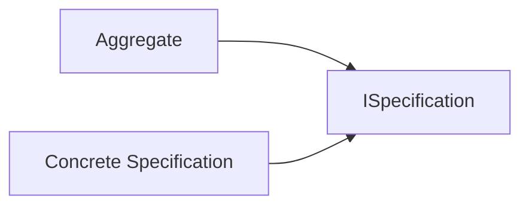

Dependency direction always points toward abstractions.

---

# Testability

Because the interface defines a minimal deterministic contract, Specifications become straightforward to test.

Typical tests verify:

- satisfied candidates;
- unsatisfied candidates;
- edge cases;
- business invariants.

No infrastructure participation is required.

---

# Extensibility

Future Specification types naturally integrate by implementing `ISpecification<T>`.

Examples:

- temporal Specifications;
- authorization Specifications;
- policy Specifications;
- composite Specifications.

The interface remains unchanged.

---

# Architectural Characteristics

`ISpecification<T>` exhibits the following characteristics.

- Generic.
- Immutable by contract.
- Deterministic.
- Framework independent.
- Business-oriented.
- Side-effect free.
- Extensible.
- Highly reusable.

These characteristics define the architectural foundation of the subsystem.

---

# Architectural Constraints

Implementations of `ISpecification<T>` shall satisfy the following constraints.

- Evaluate exactly one business predicate.
- Produce deterministic results.
- Remain side effect free.
- Avoid infrastructure dependencies.
- Preserve business terminology.
- Support composition.
- Remain immutable.

Violating these constraints breaks the architectural contract.

---

# Architectural Invariant

> **Every implementation of `ISpecification<T>` within KUKULCAN.SharedKernel shall provide a deterministic, immutable, side effect free, framework-independent evaluation of exactly one reusable business predicate expressed through the Ubiquitous Language of the Domain, thereby serving as the canonical abstraction for business rule evaluation while preserving loose coupling, dependency inversion, and full compliance with the architectural principles of Domain-Driven Design and Clean Architecture.**

This invariant governs every implementation of the `ISpecification<T>` contract.

---

# Summary

`ISpecification<T>` defines the fundamental architectural abstraction upon which the entire Specification subsystem of **KUKULCAN.SharedKernel** is built.

By providing a minimal, deterministic, framework-independent, and business-oriented contract for evaluating reusable business predicates, it enables Aggregates, Repositories, Validation workflows, Domain Services, and Application Services to collaborate through stable abstractions while maintaining strict adherence to the Dependency Rule, maximizing extensibility, and preserving the architectural integrity of the Domain Model.

# 7.2. Specification

`Specification<T>` is the abstract base implementation of the Specification subsystem.

While `ISpecification<T>` defines the architectural contract, `Specification<T>` provides the common behavior shared by all concrete Specifications within **KUKULCAN.SharedKernel**.

Its purpose is to eliminate duplicated implementation logic while preserving complete flexibility for derived Specifications.

Every business Specification should inherit from this base class rather than implementing `ISpecification<T>` directly unless a specialized implementation is explicitly required.

---

## Architectural Principle

Base classes should provide reusable behavior without constraining business semantics.

> **Specifications inherit infrastructure-neutral behavior, not business knowledge.**

---

# Purpose

`Specification<T>` exists to:

- implement the common Specification contract;
- provide reusable behavior;
- support logical composition;
- reduce duplicated code;
- simplify Specification creation;
- establish architectural consistency.

It represents the canonical implementation foundation of the Specification subsystem.

---

# Architectural Position

Within the subsystem hierarchy:

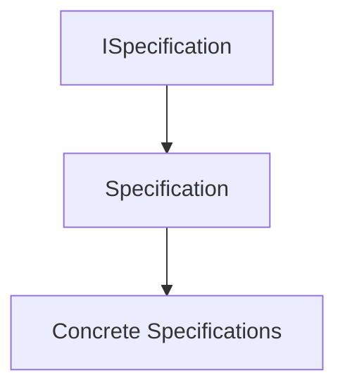

Concrete business Specifications derive from `Specification<T>`.

---

# Responsibilities

The base class is responsible for providing:

- common Specification behavior;
- composition support;
- operator overloads (when implemented);
- reusable helper methods;
- architectural consistency.

It is **not** responsible for implementing business rules.

Business semantics always belong to derived classes.

---

# Abstract Nature

`Specification<T>` should be abstract.

It represents a reusable architectural foundation rather than a business rule itself.

Conceptually:

```text
Specification<T>

↓

Business Specification

↓

CustomerEligibleSpecification
```

Only concrete Specifications represent actual business knowledge.

---

# Business Rule Ownership

The base class owns reusable behavior.

Derived classes own business predicates.

For example:

```text
Specification<T>

↓

Composition Logic

↓

CustomerCanPurchaseSpecification

↓

Business Predicate
```

This separation preserves high cohesion.

---

# Evaluation Contract

Every derived Specification ultimately provides an implementation conceptually equivalent to:

```csharp
public abstract bool IsSatisfiedBy(T candidate);
```

The base class defines the abstraction.

Derived classes define the business rule.

---

# Composition Support

One of the primary responsibilities of `Specification<T>` is enabling composition.

Typical logical operations include:

```text
Specification A

AND

Specification B
```

```text
Specification A

OR

Specification B
```

```text
NOT Specification A
```

The base class provides the architectural mechanisms for composition.

---

# Fluent Composition

When supported, the base class may expose fluent composition methods.

Examples:

```text
specificationA.And(specificationB)
```

```text
specificationA.Or(specificationB)
```

```text
specificationA.Not()
```

These methods improve readability while preserving business semantics.

---

# Operator Support

Some implementations may provide overloaded operators.

Example:

```text
A & B

A | B

!A
```

Operator support is purely syntactic.

It does not alter the architectural behavior of Specifications.

---

# Immutability

Every instance derived from `Specification<T>` should remain immutable.

Once constructed:

- business criteria remain unchanged;
- evaluation logic remains unchanged;
- composition remains unchanged.

Immutability guarantees predictable behavior.

---

# Statelessness

`Specification<T>` should not maintain mutable runtime state.

Evaluation depends only upon:

- the Specification;
- the evaluated candidate.

No hidden state should influence results.

---

# Deterministic Behavior

Repeated evaluation using identical inputs must always produce identical outputs.

Incorrect dependencies include:

- current system time;
- randomness;
- mutable globals;
- external services.

Specifications remain deterministic.

---

# Side-Effect Free Evaluation

The base implementation assumes that Specifications never produce side effects.

Evaluation should never:

- modify aggregates;
- update entities;
- write repositories;
- publish events;
- invoke infrastructure.

Specifications observe only.

---

# Collaboration with Aggregates

Aggregate Roots typically interact with `Specification<T>` rather than concrete implementations.

Conceptually:

```text
Aggregate

↓

Specification<T>

↓

Business Decision
```

The Aggregate owns the state transition.

The Specification owns the predicate.

---

# Collaboration with Repositories

Repositories frequently consume Specifications through the base abstraction.

Repositories interpret Specifications.

Specifications remain persistence agnostic.

---

# Collaboration with Validation

Validation workflows frequently reuse `Specification<T>` to evaluate business eligibility.

Business rules remain centralized.

Validation remains independent.

---

# Collaboration with Domain Events

Specifications frequently determine whether a Domain Event may be generated.

The base class itself remains unaware of event publication.

Business predicates remain independent of business consequences.

---

# Extensibility

New Specification types should inherit from `Specification<T>` whenever possible.

Examples include:

- Policy Specifications;
- Temporal Specifications;
- Authorization Specifications;
- Composite Specifications.

Inheritance promotes reuse without duplicating implementation.

---

# Reuse

The base implementation promotes reuse across:

- Aggregates;
- Repositories;
- Domain Services;
- Validation;
- Application Services.

One implementation serves many consumers.

---

# Architectural Characteristics

`Specification<T>` provides:

- reusable behavior;
- framework independence;
- deterministic execution;
- composability;
- immutability;
- side effect free evaluation;
- extensibility.

These characteristics establish the implementation foundation of the subsystem.

---

# Architectural Constraints

Every class derived from `Specification<T>` shall satisfy the following constraints.

- Represent one business predicate.
- Remain immutable.
- Be deterministic.
- Produce no side effects.
- Avoid infrastructure dependencies.
- Preserve business terminology.
- Support composition.
- Maintain high cohesion.

Violating these constraints weakens the architectural model.

---

# Recommended Inheritance Hierarchy

A typical inheritance structure appears as follows.

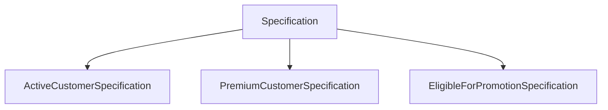

Each derived class contributes only its business predicate.

---

# Architectural Invariant

> **Every class derived from `Specification<T>` within KUKULCAN.SharedKernel shall inherit only reusable architectural behavior while encapsulating exactly one immutable, deterministic, side effect free business predicate expressed through the Ubiquitous Language of the Domain, remaining framework independent, persistence agnostic, composable, highly cohesive, and fully compliant with the architectural principles established by Domain-Driven Design and Clean Architecture.**

This invariant governs every implementation derived from `Specification<T>`.

---

# Summary

`Specification<T>` provides the reusable implementation foundation upon which all concrete business Specifications within **KUKULCAN.SharedKernel** are built.

By centralizing common behavior, enabling fluent and logical composition, preserving immutability, deterministic evaluation, framework independence, and strict separation of responsibilities, the base class allows business Specifications to focus exclusively on expressing business intent while maintaining architectural consistency and maximizing reuse across the entire Domain Model.

# 7.3. CompositeSpecification

`CompositeSpecification<T>` is the abstract architectural foundation for every Specification that combines one or more child Specifications into a larger business predicate.

Its purpose is to support the construction of increasingly sophisticated business policies while preserving the simplicity, immutability, and reusability of individual Specifications.

Rather than implementing new business rules directly, a Composite Specification coordinates existing Specifications according to well-defined logical semantics.

This enables complex business behavior to emerge through composition rather than duplication.

---

## Architectural Principle

Complex business policies should be composed of simple business predicates.

> **Composition is preferred over duplication.**

---

# Purpose

`CompositeSpecification<T>` exists to:

- combine multiple Specifications;
- promote business rule reuse;
- eliminate duplicated logic;
- simplify complex business policies;
- preserve immutability;
- maintain architectural consistency.

It serves as the common foundation for all logical Specification operators.

---

# Architectural Position

Within the Specification hierarchy:

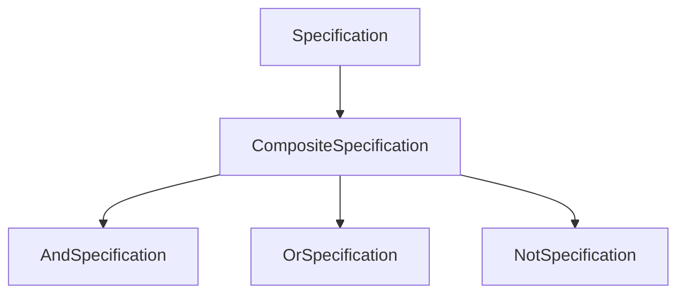

`CompositeSpecification<T>` introduces no business semantics of its own.

It exists solely to coordinate child Specifications.

---

# Conceptual Model

Conceptually, a Composite Specification acts as a business policy.

```text
Business Policy

↓

Composite Specification

↓

Child Specifications

↓

Business Predicate
```

The resulting policy behaves exactly like any other Specification.

Consumers remain unaware of its internal composition.

---

# Composition Rather Than Inheritance

Business complexity should emerge through composition rather than increasingly deep inheritance hierarchies.

Instead of creating:

```text
PremiumActiveVerifiedCustomerSpecification
```

the architecture encourages:

```text
PremiumCustomerSpecification

AND

ActiveCustomerSpecification

AND

VerifiedCustomerSpecification
```

Each business rule remains independent.

---

# Ownership

`CompositeSpecification<T>` owns:

- composition behavior;
- child Specification coordination;
- logical orchestration.

It does **not** own:

- business predicates;
- persistence;
- evaluation strategies;
- infrastructure behavior.

Business semantics remain inside child Specifications.

---

# Child Specifications

A Composite Specification contains one or more child Specifications.

Conceptually:

```text
Composite

↓

Specification A

Specification B

Specification C
```

Each child remains an independent business concept.

---

# Immutability

Once constructed, a Composite Specification should never change its child Specifications.

The collection of children should remain immutable.

Benefits include:

- thread safety;
- deterministic evaluation;
- predictable reuse.

---

# Recursive Composition

Composite Specifications naturally support recursive composition.

Example:

```text
(A AND B)

OR

(C AND D)
```

Conceptually:

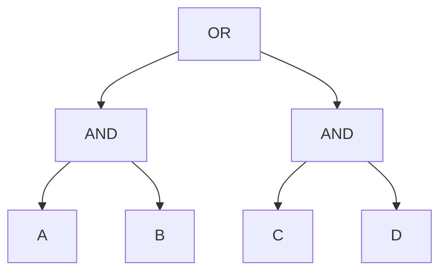

The architecture places no practical limitation on composition depth.

---

# Business Semantics

The Composite Specification represents one recognizable business policy.

Consumers interact only with the resulting Specification.

They remain unaware of:

- child hierarchy;
- evaluation order;
- implementation details.

This preserves encapsulation.

---

# Deterministic Evaluation

Given identical input, the Composite Specification must always produce identical output.

Evaluation depends exclusively upon:

- child Specifications;
- logical composition.

No external state should influence results.

---

# Side-Effect Free Evaluation

Composite Specifications remain purely observational.

Evaluation must never:

- modify aggregates;
- update entities;
- publish events;
- invoke infrastructure;
- persist data.

The composite simply combines business predicates.

---

# Collaboration with Logical Specifications

Concrete logical operators derive from `CompositeSpecification<T>`.

Examples include:

- `AndSpecification<T>`
- `OrSpecification<T>`
- `NotSpecification<T>`

Each operator contributes its own boolean semantics.

The composition infrastructure remains shared.

---

# Collaboration with Aggregates

Aggregate Roots frequently evaluate Composite Specifications representing complete business policies.

Example:

```text
Aggregate

↓

Composite Specification

↓

Business Decision
```

The Aggregate remains responsible for state changes.

The Composite Specification remains responsible for business evaluation.

---

# Collaboration with Validation

Validation workflows often reuse Composite Specifications to evaluate multi-rule business conditions.

Rather than duplicating logic, Validation simply consumes the composed business predicate.

---

# Collaboration with Repositories

Repositories may interpret Composite Specifications to construct persistence queries.

The Composite Specification itself remains completely unaware of query generation.

Business meaning remains separated from execution.

---

# Collaboration with Domain Events

Composite Specifications frequently determine whether Aggregates may produce Domain Events.

Business policy:

↓

Satisfied

↓

Aggregate State Change

↓

Domain Event

The Composite Specification itself never raises events.

---

# Encapsulation

Consumers should never inspect the internal child hierarchy.

Only the public Specification interface should be visible.

Example:

```text
Consumer

↓

Composite Specification

↓

True / False
```

Internal implementation remains hidden.

---

# Extensibility

New logical operators may derive from `CompositeSpecification<T>` without modifying existing implementations.

Possible future operators include:

- XOR
- NAND
- NOR
- implication
- exclusive business policies

The architecture remains open for extension.

---

# Performance Considerations

Composite Specifications should avoid unnecessary evaluation.

Implementations may support:

- short-circuit evaluation;
- lazy evaluation;
- cached immutable child references.

Performance optimizations should never alter business semantics.

---

# Architectural Characteristics

`CompositeSpecification<T>` provides:

- recursive composition;
- immutable structure;
- reusable business policies;
- framework independence;
- deterministic behavior;
- extensibility.

These characteristics enable scalable business modeling.

---

# Architectural Constraints

Every Composite Specification shall satisfy the following constraints.

- Contain immutable child Specifications.
- Produce deterministic results.
- Remain side effect free.
- Avoid infrastructure dependencies.
- Preserve encapsulation.
- Support recursive composition.
- Maintain framework independence.

Violating these constraints weakens the compositional model.

---

# Architectural Invariant

> **Every `CompositeSpecification<T>` within KUKULCAN.SharedKernel shall represent an immutable, deterministic, framework-independent composition of one or more child Specifications, coordinating reusable business predicates through explicit logical relationships while preserving encapsulation, recursive composability, side effect free evaluation, high cohesion, loose coupling, and complete adherence to the principles of Domain-Driven Design and Clean Architecture.**

This invariant governs every Composite Specification within the Specification subsystem.

---

# Summary

`CompositeSpecification<T>` provides the architectural mechanism through which individual business predicates become rich business policies.

By coordinating immutable child Specifications while preserving deterministic evaluation, recursive composition, framework independence, and strict separation between business semantics and implementation details, it enables **KUKULCAN.SharedKernel** to model complex business behavior through reusable and maintainable architectural abstractions fully aligned with the principles of Domain-Driven Design and Clean Architecture.

# 7.4. AndSpecification

`AndSpecification<T>` is the concrete logical composition that represents the **logical conjunction** of two Specifications.

It evaluates to **true** only when **both child Specifications** are satisfied.

Within **KUKULCAN.SharedKernel**, `AndSpecification<T>` is the most frequently used composition operator because business policies commonly require multiple business predicates to be simultaneously satisfied.

Rather than creating increasingly large business Specifications, complex business requirements are modeled through reusable conjunctions of smaller Specifications.

---

## Architectural Principle

Independent business predicates should be combined through composition rather than merged into larger implementations.

> **Business policies are built by combining independent business truths.**

---

# Purpose

`AndSpecification<T>` exists to:

- combine two business predicates;
- eliminate duplicated conditional logic;
- promote Specification reuse;
- simplify complex business policies;
- preserve readability;
- maintain deterministic evaluation.

Its responsibility is exclusively logical conjunction.

---

# Logical Semantics

Conceptually:

```text
Specification A

AND

Specification B
```

The resulting Specification evaluates according to classical boolean logic.

| Specification A  | Specification B  | Result   |
|------------------|------------------|----------|
| False            | False            | False    |
| False            | True             | False    |
| True             | False            | False    |
| True             | True             | True     |

Both child Specifications must be satisfied.

---

# Architectural Position

Within the Specification hierarchy:

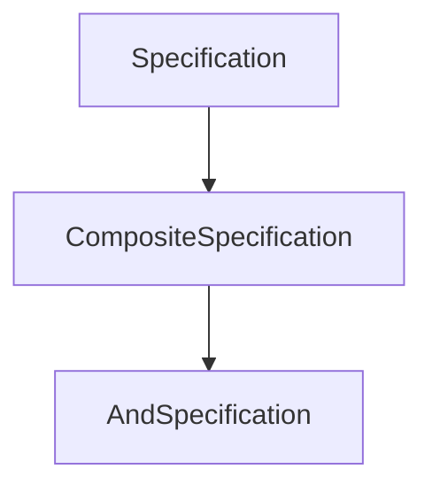

`AndSpecification<T>` inherits all compositional behavior from `CompositeSpecification<T>` and contributes only conjunction semantics.

---

# Business Interpretation

An `AndSpecification<T>` represents a business policy where **every required condition must hold simultaneously**.

Examples include:

```text
Customer Is Active

AND

Customer Is Verified
```

```text
Invoice Is Approved

AND

Invoice Is Unpaid
```

```text
Employee Is Certified

AND

Employee Has Active Contract
```

Each child Specification remains an independent business concept.

---

# Composition Model

Conceptually:

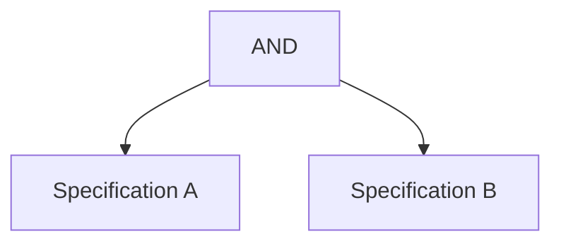

The composed Specification behaves as a single Specification from the perspective of its consumers.

---

# Evaluation Model

Evaluation proceeds conceptually as follows.

```text
Evaluate Left Specification

↓

Evaluate Right Specification

↓

Both True?

↓

Return Result
```

Only the final boolean result is exposed.

Internal evaluation remains encapsulated.

---

# Short-Circuit Evaluation

Implementations are encouraged to support **short-circuit evaluation**.

Conceptually:

```text
Left Specification

↓

False?

↓

Stop Evaluation
```

If the first Specification evaluates to **false**, evaluating the second Specification cannot change the outcome.

Benefits include:

- reduced computation;
- improved performance;
- preserved determinism.

---

# Immutability

Once created, an `AndSpecification<T>` must never change its child Specifications.

Both references remain immutable.

This guarantees:

- thread safety;
- deterministic behavior;
- safe reuse.

---

# Side-Effect Free Evaluation

Evaluating an `AndSpecification<T>` should never:

- modify entities;
- change aggregate state;
- raise Domain Events;
- invoke repositories;
- communicate with infrastructure.

Evaluation remains purely observational.

---

# Deterministic Behavior

For identical input:

```text
Specification A

AND

Specification B
```

must always produce identical output.

Evaluation should never depend upon:

- current time;
- randomness;
- external services;
- mutable state.

---

# Business Examples

Example 1

```text
Active Customer

AND

Premium Member
```

↓

```text
EligibleForPrioritySupport
```

---

Example 2

```text
Invoice Approved

AND

Invoice Unpaid
```

↓

```text
InvoiceCanBeCollected
```

---

Example 3

```text
Employee Active

AND

Security Clearance Valid
```

↓

```text
AuthorizedForRestrictedArea
```

These examples demonstrate how larger business policies emerge from reusable predicates.

---

# Nested Composition

`AndSpecification<T>` supports recursive composition.

Example:

```text
(A AND B)

AND

(C AND D)
```

Conceptually:


Recursive composition enables arbitrarily complex business policies while maintaining readability.

---

# Collaboration with Aggregates

Aggregate Roots frequently evaluate conjunctions before performing business operations.

Conceptually:

```text
Aggregate

↓

AndSpecification

↓

Business Decision
```

The Aggregate remains responsible for behavior.

The Specification remains responsible for evaluation.

---

# Collaboration with Validation

Validation workflows often reuse conjunctions representing multiple business eligibility rules.

Business logic remains centralized.

Validation simply consumes the composed Specification.

---

# Collaboration with Repositories

Repositories may interpret an `AndSpecification<T>` as multiple filtering predicates.

The Repository owns translation.

The Specification owns business meaning.

---

# Collaboration with Domain Events

An Aggregate may use an `AndSpecification<T>` to determine whether a Domain Event should be raised.

The Specification itself remains unaware of event publication.

---

# Performance Characteristics

The conjunction operator naturally supports efficient evaluation.

Recommended implementation characteristics include:

- immutable child references;
- short-circuit evaluation;
- recursive composition;
- allocation-free evaluation whenever practical.

Performance optimizations must never alter business semantics.

---

# Architectural Characteristics

`AndSpecification<T>` provides:

- logical conjunction;
- recursive composition;
- deterministic behavior;
- immutability;
- framework independence;
- reusable business policies.

These characteristics make conjunction the primary composition operator within the subsystem.

---

# Architectural Constraints

Every `AndSpecification<T>` shall satisfy the following constraints.

- Represent only logical conjunction.
- Preserve child immutability.
- Support deterministic evaluation.
- Remain side effect free.
- Support recursive composition.
- Avoid infrastructure dependencies.
- Preserve encapsulation.

Violating these constraints compromises the logical composition model.

---

# Architectural Invariant

> **Every `AndSpecification<T>` within KUKULCAN.SharedKernel shall represent the immutable logical conjunction of exactly two reusable business Specifications, evaluating to true only when every child Specification is satisfied while preserving deterministic behavior, recursive composability, short-circuit evaluation, framework independence, side effect free execution, and complete adherence to the architectural principles of Domain-Driven Design and Clean Architecture.**

This invariant governs every conjunction-based Specification within the Shared Kernel.

---

# Summary

`AndSpecification<T>` provides the canonical implementation of logical conjunction within the Specification subsystem.

By combining reusable business predicates into larger business policies while preserving immutability, deterministic evaluation, recursive composition, short-circuit execution, framework independence, and strict separation between business semantics and implementation details, it enables **KUKULCAN.SharedKernel** to model increasingly sophisticated business rules through simple, expressive, and maintainable architectural abstractions.

# 7.5. OrSpecification

`OrSpecification<T>` is the concrete logical composition that represents the **logical disjunction** of two Specifications.

It evaluates to **true** when **at least one** of its child Specifications is satisfied.

Within **KUKULCAN.SharedKernel**, `OrSpecification<T>` enables the Domain Model to express business policies that provide multiple acceptable business alternatives without duplicating conditional logic.

Rather than embedding alternative conditions throughout the application, business flexibility is encapsulated into reusable, composable Specifications.

---

## Architectural Principle

Alternative business rules should be represented through explicit composition rather than duplicated conditional branches.

> **Business alternatives belong inside the Domain Model, not inside conditional statements.**

---

# Purpose

`OrSpecification<T>` exists to:

- represent alternative business predicates;
- compose reusable business rules;
- eliminate duplicated branching logic;
- improve readability;
- preserve deterministic evaluation;
- maintain architectural consistency.

Its sole responsibility is logical disjunction.

---

# Logical Semantics

Conceptually:

```text
Specification A

OR

Specification B
```

The resulting Specification evaluates according to classical boolean logic.

| Specification A   | Specification B   | Result  |
|-------------------|-------------------|---------|
| False             | False             | False   |
| False             | True              | True    |
| True              | False             | True    |
| True              | True              | True    |

Only one child Specification must be satisfied.

---

# Architectural Position

Within the Specification hierarchy:

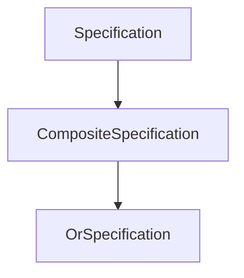

`OrSpecification<T>` inherits composition behavior from `CompositeSpecification<T>` and contributes only disjunction semantics.

---

# Business Interpretation

An `OrSpecification<T>` represents a business policy where **multiple valid business paths** exist.

Examples include:

```text
Customer Is Premium

OR

Customer Is Employee
```

```text
Invoice Is Paid

OR

Invoice Is Cancelled
```

```text
User Is Administrator

OR

User Is Auditor
```

Each child Specification remains an independent business concept.

---

# Composition Model

Conceptually:

```mermaid
flowchart TD
    ROOT["OR"]
    LEFT["Specification A"]
    RIGHT["Specification B"]

    ROOT --> LEFT
    ROOT --> RIGHT
```

Consumers interact only with the resulting Specification.

Internal composition remains encapsulated.

---

# Evaluation Model

Evaluation proceeds conceptually as follows.

```text
Evaluate Left Specification

↓

Satisfied?

↓

Yes → Return True

↓

No

↓

Evaluate Right Specification

↓

Return Result
```

The final result remains a single boolean value.

---

# Short-Circuit Evaluation

Implementations are encouraged to support **short-circuit evaluation**.

Conceptually:

```text
Left Specification

↓

True?

↓

Stop Evaluation
```

Once one child Specification evaluates to **true**, evaluating additional Specifications cannot change the outcome.

Benefits include:

- reduced computation;
- improved performance;
- predictable execution.

---

# Immutability

Once constructed, an `OrSpecification<T>` must never modify its child Specifications.

Both child references to remain immutable throughout the lifetime of the object.

Immutability guarantees:

- thread safety;
- deterministic behavior;
- safe reuse.

---

# Side-Effect Free Evaluation

Evaluating an `OrSpecification<T>` must never:

- modify aggregates;
- update entities;
- publish Domain Events;
- access repositories;
- invoke external services.

Evaluation remains purely observational.

---

# Deterministic Behavior

Given identical input, an `OrSpecification<T>` must always produce identical output.

Evaluation must not depend upon:

- current time;
- mutable state;
- randomness;
- infrastructure.

Business predicates remain stable and predictable.

---

# Business Examples

Example 1

```text
Customer Is Premium

OR

Customer Is Employee
```

↓

```text
EligibleForDiscount
```

---

Example 2

```text
Invoice Is Paid

OR

Invoice Is Written Off
```

↓

```text
InvoiceCanBeClosed
```

---

Example 3

```text
User Has Administrative Role

OR

User Has Auditor Role
```

↓

```text
AuthorizedForFinancialReports
```

These examples demonstrate how alternative business policies can be modeled without duplicating logic.

---

# Nested Composition

`OrSpecification<T>` naturally supports recursive composition.

Example:

```text
(A OR B)

OR

(C OR D)
```

Conceptually:

```mermaid
flowchart TD
    ROOT["OR"]
    LEFT["OR"]
    RIGHT["OR"]

    A["A"]
    B["B"]
    C["C"]
    D["D"]

    ROOT --> LEFT
    ROOT --> RIGHT

    LEFT --> A
    LEFT --> B

    RIGHT --> C
    RIGHT --> D
```

Recursive composition enables expressive business policies while preserving simplicity.

---

# Collaboration with Aggregates

Aggregate Roots frequently evaluate disjunctions before allowing business operations.

Conceptually:

```text
Aggregate

↓

OrSpecification

↓

Business Decision
```

The Aggregate owns behavior.

The Specification owns business predicates.

---

# Collaboration with Validation

Validation workflows often reuse disjunctions representing multiple acceptable business conditions.

Business knowledge remains centralized.

Validation remains independent.

---

# Collaboration with Repositories

Repositories may translate an `OrSpecification<T>` into multiple persistence predicates.

Translation belongs to Infrastructure.

Business meaning remains inside the Domain.

---

# Collaboration with Domain Events

Aggregates may evaluate an `OrSpecification<T>` before raising Domain Events.

The Specification remains completely unaware of event publication.

Business predicates remain independent of business consequences.

---

# Performance Characteristics

The disjunction operator naturally supports efficient execution.

Recommended implementation characteristics include:

- immutable child references;
- short-circuit evaluation;
- recursive composition;
- allocation-free evaluation whenever practical.

Performance optimizations must never alter business semantics.

---

# Architectural Characteristics

`OrSpecification<T>` provides:

- logical disjunction;
- recursive composition;
- deterministic behavior;
- immutability;
- framework independence;
- reusable business alternatives.

These characteristics make disjunction an essential composition operator within the Specification subsystem.

---

# Architectural Constraints

Every `OrSpecification<T>` shall satisfy the following constraints.

- Represent only logical disjunction.
- Preserve child immutability.
- Support deterministic evaluation.
- Remain side effect free.
- Support recursive composition.
- Avoid infrastructure dependencies.
- Preserve encapsulation.

Violating these constraints compromises the logical consistency of the subsystem.

---

# Architectural Invariant

> **Every `OrSpecification<T>` within KUKULCAN.SharedKernel shall represent the immutable logical disjunction of exactly two reusable business Specifications, evaluating to true whenever at least one child Specification is satisfied while preserving deterministic behavior, recursive composability, short-circuit evaluation, framework independence, side effect free execution, and complete adherence to the architectural principles of Domain-Driven Design and Clean Architecture.**

This invariant governs every disjunction-based Specification within the Shared Kernel.

---

# Summary

`OrSpecification<T>` provides the canonical implementation of logical disjunction within the Specification subsystem.

By combining reusable business predicates into flexible business policies while preserving immutability, deterministic evaluation, recursive composition, short-circuit execution, framework independence, and strict separation between business semantics and implementation details, it enables **KUKULCAN.SharedKernel** to express alternative business rules through clear, reusable, and maintainable architectural abstractions.

# 7.6. NotSpecification

`NotSpecification<T>` is the concrete logical composition that represents the **logical negation** of a single Specification.

It evaluates to **true** only when its child Specification evaluates to **false**.

Within **KUKULCAN.SharedKernel**, `NotSpecification<T>` provides the architectural mechanism for expressing business rules based on the absence of a condition rather than its presence.

Instead of creating entirely new Specifications to represent inverse business concepts, the Domain Model can simply negate existing Specifications, preserving reuse, readability, and consistency.

---

## Architectural Principle

The absence of a business condition should be expressed by negating an existing business predicate rather than duplicating its implementation.

> **Business negation is composition, not duplication.**

---

# Purpose

`NotSpecification<T>` exists to:

- negate existing business predicates;
- maximize Specification reuse;
- eliminate inverse rule duplication;
- simplify business policy construction;
- preserve deterministic evaluation;
- maintain architectural consistency.

Its only responsibility is logical negation.

---

# Logical Semantics

Conceptually:

```text
NOT Specification A
```

The resulting Specification follows classical boolean logic.

| Specification A   | Result   |
|-------------------|----------|
| False             | True     |
| True              | False    |

The outcome is always the inverse of the child Specification.

---

# Architectural Position

Within the Specification hierarchy:

```mermaid
flowchart TD
    SPEC["Specification<T>"]
    COMPOSITE["CompositeSpecification<T>"]
    NOT["NotSpecification<T>"]

    SPEC --> COMPOSITE
    COMPOSITE --> NOT
```

`NotSpecification<T>` inherits composition behavior from `CompositeSpecification<T>` while providing logical negation semantics.

---

# Business Interpretation

`NotSpecification<T>` represents a business policy stating that **a particular business condition must not hold**.

Examples include:

```text
NOT Premium Customer
```

↓

```text
Standard Customer
```

---

```text
NOT Invoice Paid
```

↓

```text
Outstanding Invoice
```

---

```text
NOT User Locked
```

↓

```text
User Can Authenticate
```

The original business predicate remains reusable.

Only its interpretation changes.

---

# Composition Model

Conceptually:

```mermaid
flowchart TD
    ROOT["NOT"]
    CHILD["Specification"]

    ROOT --> CHILD
```

The negated Specification behaves exactly like any other Specification.

Consumers remain unaware of the internal inversion.

---

# Evaluation Model

Evaluation proceeds conceptually as follows.

```text
Evaluate Child Specification

↓

Invert Boolean Result

↓

Return Result
```

No additional business logic is introduced.

Only the boolean outcome is inverted.

---

# Immutability

A `NotSpecification<T>` is immutable.

Once constructed:

- the child Specification cannot change;
- the negation semantics remain fixed.

Immutability guarantees:

- predictable evaluation;
- safe reuse;
- thread safety.

---

# Side-Effect Free Evaluation

Evaluating a `NotSpecification<T>` must never:

- modify entities;
- change Aggregate state;
- publish Domain Events;
- access repositories;
- invoke infrastructure.

Logical negation is purely observational.

---

# Deterministic Behavior

Given identical input, a `NotSpecification<T>` must always return the identical inverted result.

Evaluation should never depend upon:

- mutable state;
- current time;
- random values;
- infrastructure.

Predictability is mandatory.

---

# Business Examples

Example 1

```text
NOT PremiumCustomerSpecification
```

↓

```text
StandardCustomerSpecification
```

---

Example 2

```text
NOT InvoicePaidSpecification
```

↓

```text
InvoiceRequiresPayment
```

---

Example 3

```text
NOT AccountLockedSpecification
```

↓

```text
AccountCanAuthenticate
```

Negation allows existing business knowledge to be reused instead of duplicated.

---

# Nested Composition

`NotSpecification<T>` naturally participates in recursive composition.

Example:

```text
NOT

(A AND B)
```

Conceptually:

```mermaid
flowchart TD
    ROOT["NOT"]
    AND["AND"]

    A["A"]
    B["B"]

    ROOT --> AND

    AND --> A
    AND --> B
```

Likewise:

```text
NOT

(A OR B)
```

Recursive composition enables expressive business policies while preserving architectural simplicity.

---

# Collaboration with Aggregates

Aggregate Roots frequently negate Specifications before permitting business operations.

Conceptually:

```text
Aggregate

↓

NotSpecification

↓

Business Decision
```

The Aggregate owns state transitions.

The Specification owns business evaluation.

---

# Collaboration with Validation

Validation workflows often reuse negated Specifications to represent invalid business conditions.

Business predicates remain centralized.

Validation consumes the resulting Specification.

---

# Collaboration with Repositories

Repositories may interpret negated Specifications when constructing persistence queries.

The Repository owns translation.

The Specification owns business meaning.

---

# Collaboration with Domain Events

Aggregates may evaluate a `NotSpecification<T>` before deciding whether to raise a Domain Event.

The Specification itself remains unaware of event publication.

Business evaluation and business consequences remain separated.

---

# Performance Characteristics

Logical negation introduces virtually no computational overhead.

Recommended implementation characteristics include:

- immutable child reference;
- allocation-free evaluation whenever practical;
- deterministic execution;
- direct boolean inversion.

Optimizations must never alter business semantics.

---

# Architectural Characteristics

`NotSpecification<T>` provides:

- logical negation;
- Specification reuse;
- deterministic behavior;
- immutability;
- recursive composition;
- framework independence.

These characteristics make negation an essential operator within the Specification subsystem.

---

# Architectural Constraints

Every `NotSpecification<T>` shall satisfy the following constraints.

- Negate exactly one child Specification.
- Preserve child immutability.
- Produce deterministic results.
- Remain side effect free.
- Support recursive composition.
- Avoid infrastructure dependencies.
- Preserve encapsulation.

Violating these constraints compromises the logical composition model.

---

# Relationship with Other Logical Operators

`NotSpecification<T>` complements the remaining logical operators.

```mermaid
flowchart LR
    A["Specification"]
    AND["AND"]
    OR["OR"]
    NOT["NOT"]

    A --> AND
    A --> OR
    A --> NOT
```

Together they form the complete set of logical composition primitives used throughout the Specification subsystem.

---

# Architectural Invariant

> **Every `NotSpecification<T>` within KUKULCAN.SharedKernel shall represent the immutable logical negation of exactly one reusable business Specification, evaluating to the inverse boolean result of its child Specification while preserving deterministic behavior, recursive composability, framework independence, side effect free execution, Specification reuse, and complete adherence to the architectural principles of Domain-Driven Design and Clean Architecture.**

This invariant governs every negation-based Specification within the Shared Kernel.

---

# Summary

`NotSpecification<T>` provides the canonical implementation of logical negation within the Specification subsystem.

By inverting existing business predicates rather than introducing duplicated inverse implementations, it enables **KUKULCAN.SharedKernel** to model negative business conditions through reusable, immutable, deterministic, framework-independent, and recursively composable architectural abstractions fully aligned with the principles of Domain-Driven Design and Clean Architecture.

