# VALIDATION.md

> **KUKULCAN.SharedKernel**
>
> **Validation Architecture**
>
> **Status: **Stable
> Version: **1.0.0**
---

## Table of Contents

1. [Introduction](#1-introduction)
2. [Philosophy](#2-philosophy)
3. [Design Goals](#3-design-goals)
4. [Validation Architecture](#4-validation-architecture)
5. [Architectural Principles](#5-architectural-principles)
6. [Validation Taxonomy](#6-validation-taxonomy)
7. [Core Components](#7-core-components)
    - 7.1. [ValidationResult](#71-validationresult)
    - 7.2. [ValidationFailure](#72-validationfailure)
    - 7.3. [ValidationException](#73-validationexception)
    - 7.4. [ValidationMessages](#74-validationmessages)
    - 7.5. [ValidationErrors](#75-validationerrors)
    - 7.6. [ValidationConversionExtensions](#76-validationconversionextensions)
    - 7.7. [ValidationThrowExtensions](#77-validationthrowextensions)
8. [Validation Lifecycle](#8-validation-lifecycle)
9. [Validation Pipelines](#9-validation-pipelines)
10. [Validation Rule Model](#10-validation-rule-model)
11. [Validation Metadata Model](#11-validation-metadata-model)
12. [Result Integration](#12-result-integration)
13. [Exception Integration](#13-exception-integration)
14. [FluentValidation Integration](#14-fluentvalidation-integration)
15. [Asynchronous Validation](#15-asynchronous-validation)
16. [Performance Philosophy](#16-performance-philosophy)
17. [Thread Safety](#17-thread-safety)
18. [Best Practices](#18-best-practices)
19. [Anti-Patterns](#19-anti-patterns)
20. [Versioning](#20-versioning)
21. [Examples](#21-examples)
22. [References](#22-references)
23. [Summary](#23-summary)

# 1. Introduction

Validation is one of the fundamental responsibilities of every software system.

Before business rules can be executed, before state can be modified and before data can be persisted, the system must determine whether the supplied information satisfies the constraints required by the business model.

Within **KUKULCAN.SharedKernel**, validation is treated as a first-class architectural concern rather than a simple implementation detail.

The Validation subsystem provides a consistent, deterministic and framework-independent model for expressing validation rules, collecting validation failures and communicating validation outcomes throughout the entire platform.

Unlike traditional validation approaches that rely heavily on exceptions or framework-specific mechanisms, the Validation subsystem integrates directly with the **Results subsystem**, allowing validation failures to become explicit business outcomes.

Validation therefore becomes an integral part of business execution rather than an exceptional event.

---

## Architectural Vision

The Validation subsystem exists to answer one fundamental question:

> **Can this business operation continue safely?**

Every validation process produces an explicit answer.

If validation succeeds, business execution may continue.

If validation fails, the business workflow terminates gracefully, returning an explicit Result that fully describes the failure.

This approach eliminates ambiguity while providing a uniform execution model across the entire framework.

---

## Objectives

The Validation subsystem has been designed to achieve the following objectives.

- Express business validation rules explicitly.
- Keep validation independent of application frameworks.
- Integrate naturally with the Results subsystem.
- Eliminate exception-driven validation.
- Promote deterministic business workflows.
- Support reusable validation components.
- Preserve long-term architectural stability.

These objectives guide every architectural decision described throughout this document.

---

## Scope

The Validation subsystem defines the architecture for:

- validation failures;
- validation results;
- validation exceptions;
- validation messages;
- validation metadata;
- validation pipelines;
- validation composition;
- integration with business Results.

It intentionally avoids prescribing any particular validation framework or implementation technology.

---

## Relationship with the Shared Kernel

Validation is a cross-cutting architectural capability that supports every functional area of **KUKULCAN.SharedKernel**.

It collaborates closely with:

- Results
- Value Objects
- Identifiers
- Specifications
- Domain Model
- Building Blocks
- Time abstractions

Together these subsystems establish a unified architectural model for business execution.

---

## Relationship with the Results Subsystem

The Validation subsystem is built upon the architectural contracts defined by **RESULTS.md**.

Conceptually:

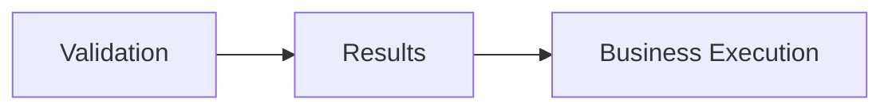

Validation determines whether execution may proceed.

Results communicate the outcome.

Business logic executes only after successful validation.

---

## Framework Independence

One of the primary architectural goals of the Validation subsystem is complete framework independence.

Validation must remain independent of technologies such as:

- ASP.NET Core
- FluentValidation
- DataAnnotations
- MVC ModelState
- Entity Framework

External frameworks may participate in validation, but the architectural model remains completely independent of them.

This allows the same validation model to be reused consistently across APIs, background services, desktop applications and any future execution environment.

---

## Deterministic Behaviour

Validation is expected to be deterministic.

Given identical:

- input;
- validation rules;
- business state;

the subsystem shall always produce the same validation outcome.

This predictability simplifies testing, debugging and long-term maintenance.

---

## Design Philosophy

The Validation subsystem follows several core architectural principles.

Validation should be:

- explicit;
- deterministic;
- immutable;
- composable;
- reusable;
- framework independent.

These principles influence every component described in the following chapters.

---

## Intended Audience

This document is intended for:

- framework architects;
- library developers;
- application developers;
- contributors to KUKULCAN.SharedKernel;
- reviewers responsible for maintaining architectural consistency.

It serves both as architectural documentation and as the authoritative specification for the Validation subsystem.

---

## Document Structure

The remaining chapters describe the Validation subsystem from progressively more detailed perspectives.

The document begins by presenting its architectural philosophy and design goals.

It then defines the architectural model, core components, lifecycle, integration with the Results subsystem and the recommended practices governing its use.

Finally, it concludes with examples, versioning guidelines and long-term architectural recommendations.

---

## Architectural Invariant

> **Every validation process within KUKULCAN.SharedKernel shall produce explicit, deterministic and framework-independent business outcomes that integrate seamlessly with the Results subsystem, ensuring that validation remains a predictable architectural capability rather than a framework-specific implementation detail.**

This invariant establishes the Validation subsystem as the canonical mechanism for expressing business validity throughout the Shared Kernel.

---

## Summary

The Validation subsystem provides the architectural foundation upon which all business validation within **KUKULCAN.SharedKernel** is built.

By combining explicit validation outcomes, deterministic behaviour, immutable models and complete integration with the Results subsystem, it establishes a consistent validation architecture that is reusable across every application layer while remaining entirely independent of external frameworks and implementation technologies.

# 2. Philosophy

Validation is not merely the process of checking whether data is syntactically correct.

Within **KUKULCAN.SharedKernel**, validation is considered a fundamental business capability whose responsibility is to determine whether a business operation may safely proceed.

The Validation subsystem therefore represents much more than a collection of validators.

It defines a coherent architectural model for expressing business constraints, communicating validation outcomes and integrating those outcomes into the execution lifecycle of the application.

Validation is treated as an integral part of business execution rather than as a peripheral technical concern.

---

## Architectural Principle

Validation is a business capability whose purpose is to protect the integrity of the domain model.

> **Business execution begins only after business validity has been established.**

---

# Architectural Vision

Every business operation starts with an assumption:

> The supplied information is valid.

The responsibility of the Validation subsystem is to verify that assumption before any business behaviour is executed.

Conceptually:

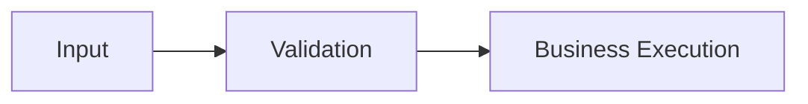

If validation fails, business execution never begins.

---

# Validation as a Business Concern

Validation belongs to the business architecture.

Its purpose is to determine whether the current operation satisfies the rules defined by the domain.

Validation therefore expresses business intent rather than implementation details.

Typical examples include:

- mandatory information;
- identifier formats;
- business ranges;
- invariant preservation;
- consistency rules.

These rules describe the business, not the application framework.

---

# Explicit Validation Outcomes

Validation should always produce explicit outcomes.

Conceptually:

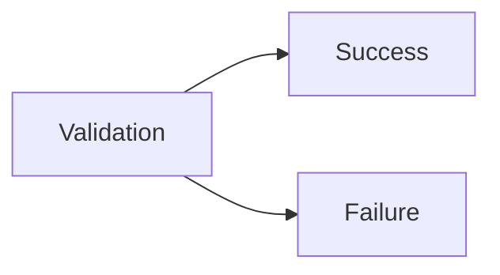

There is no ambiguous state.

Every validation process either succeeds or fails.

---

# Validation Before Business Logic

Validation precedes every business operation.

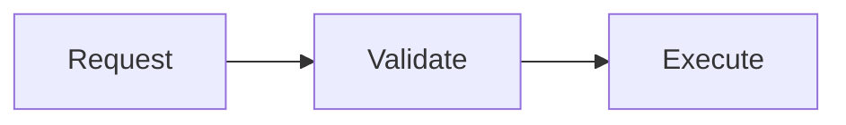

This ordering guarantees that business logic operates only on validated data.

---

# Validation is Predictable

Validation must be deterministic.

Given identical:

- input;
- validation rules;
- business context;

the subsystem shall always produce the same outcome.

Validation must never depend upon:

- execution timing;
- thread scheduling;
- infrastructure state;
- external framework behaviour.

Predictability is essential.

---

# Validation is Composable

Validation rules should compose naturally.

Complex validation emerges from combining simple rules rather than constructing monolithic validators.

Conceptually:

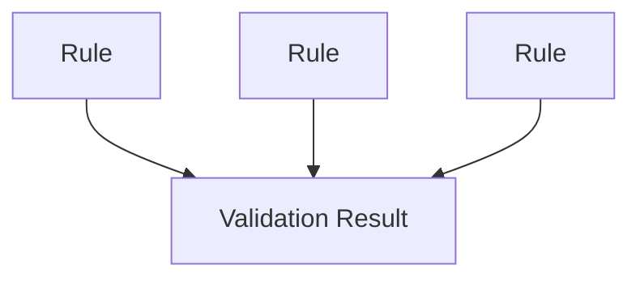

This encourages reuse and simplifies maintenance.

---

# Validation is Independent

Validation should remain independent of:

- transport protocols;
- persistence technologies;
- user interfaces;
- application frameworks.

The same validation rule should behave identically regardless of where it executes.

---

# Validation is Declarative

Validation should describe *what* must be true rather than *how* the validation is implemented.

For example:

- Email is required.
- Age must be positive.
- Identifier must be valid.

The implementation technology remains an independent concern.

---

# Validation is Reusable

Validation rules frequently appear across multiple application layers.

A single validation rule may be reused by:

- APIs;
- domain services;
- application services;
- background processes;
- integration workflows.

Centralising validation promotes consistency throughout the platform.

---

# Validation Protects the Domain

The primary responsibility of validation is protecting the integrity of the Domain Model.

Business objects should never receive data that violates known business constraints.

Validation therefore acts as the first defensive boundary surrounding the domain.

---

# Relationship with Results

Validation and Results form complementary architectural capabilities.

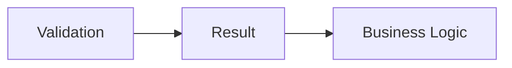

Validation determines whether execution may continue.

Results communicate that decision.

---

# Relationship with Exceptions

Expected validation failures are not exceptional events.

They are ordinary business outcomes.

Unexpected runtime failures remain exceptions.

This distinction preserves a clear separation between:

- business semantics;
- technical execution.

---

# Framework Independence

Validation rules belong to the Shared Kernel rather than any validation framework.

Consequently, the architectural model remains independent of:

- FluentValidation;
- ASP.NET Core;
- DataAnnotations;
- MVC ModelState.

Frameworks may execute validation.

They do not define validation.

---

# Long-Term Stability

Validation rules represent business knowledge.

As business concepts tend to evolve more slowly than implementation technologies, validation abstractions should remain stable over time.

Evolution should primarily consist of:

- introducing new rules;
- extending existing capabilities;
- improving diagnostics.

Existing semantic behaviour should remain predictable.

---

# Architectural Constraints

Every validation implementation should satisfy the following constraints.

- Explicit.
- Deterministic.
- Declarative.
- Composable.
- Reusable.
- Framework independent.
- Integrated with Results.

These constraints define the philosophical foundation of the Validation subsystem.

---

# Architectural Invariant

> **Validation within KUKULCAN.SharedKernel shall be treated as a deterministic business capability whose sole purpose is to establish business validity before execution, producing explicit and framework-independent outcomes that integrate seamlessly with the Results subsystem while protecting the integrity of the Domain Model.**

This invariant defines the architectural philosophy governing every validation component within the Shared Kernel.

---

# Summary

The Validation Philosophy establishes validation as a core architectural capability rather than a technical utility.

By emphasising explicit outcomes, deterministic behaviour, framework independence and close integration with the Results subsystem, **KUKULCAN.SharedKernel** ensures that validation remains consistent, reusable and aligned with the business architecture across every application built upon the platform.

# 3. Design Goals

The Validation subsystem has been designed to provide a robust, reusable and framework-independent architecture for expressing business validity across the entire **KUKULCAN.SharedKernel**.

Its objectives extend beyond verifying input data.

Validation protects the integrity of the Domain Model, guarantees predictable business execution and establishes a consistent mechanism for communicating validation outcomes.

The design goals described in this chapter define the architectural characteristics that every component of the Validation subsystem must satisfy.

---

## Architectural Principle

The Validation subsystem shall prioritise architectural consistency, determinism and business expressiveness over implementation convenience.

> **Validation exists to protect the business model, not the framework.**

---

# Primary Objectives

The Validation subsystem has been designed to achieve the following primary objectives.

- Express business validation explicitly.
- Preserve deterministic behaviour.
- Integrate naturally with the Results subsystem.
- Remain framework independent.
- Encourage reusable validation rules.
- Support composable validation workflows.
- Protect domain integrity.
- Provide long-term architectural stability.

These objectives influence every architectural decision within the subsystem.

---

# Explicit Business Validation

Validation should clearly communicate *why* an operation cannot continue.

Business constraints should never be hidden behind:

- Boolean values;
- null references;
- implementation-specific exceptions.

Every validation outcome should be explicit and understandable.

---

# Protect Domain Integrity

The Domain Model should never receive invalid business data.

Validation therefore acts as the first architectural boundary protecting:

- entities;
- value objects;
- aggregates;
- domain services.

Business execution begins only after successful validation.

---

# Framework Independence

The Validation subsystem must remain completely independent of any validation framework.

Its architecture shall not depend upon:

- FluentValidation;
- ASP.NET Core;
- MVC ModelState;
- DataAnnotations;
- transport technologies.

This guarantees that validation rules remain reusable across every execution environment.

---

# Integration with Results

Validation outcomes integrate directly with the Results subsystem.

Conceptually:

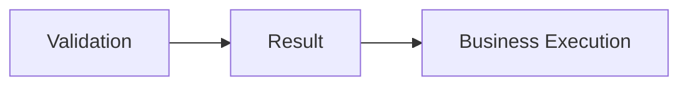

This integration establishes a single architectural model for representing expected business outcomes.

---

# Deterministic Behaviour

Validation must always be deterministic.

Given identical:

- input;
- validation rules;
- business state;

the subsystem shall always produce identical outcomes.

Deterministic execution simplifies:

- testing;
- debugging;
- reasoning;
- maintenance.

---

# Composable Validation

Complex validation should emerge through the composition of smaller validation rules.

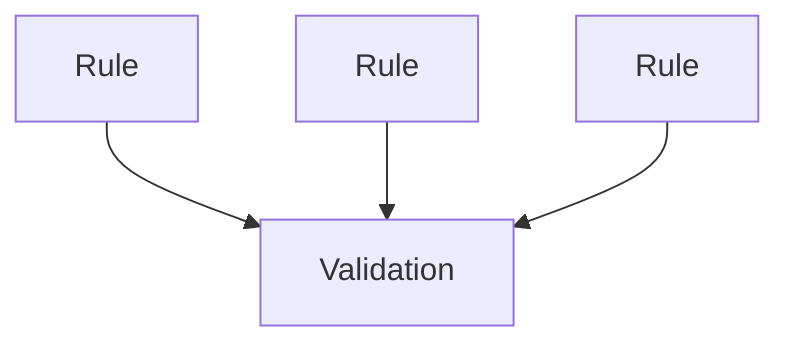

Composition promotes reuse while reducing duplication.

---

# Reusable Validation Components

Validation logic should be reusable across multiple architectural layers.

Typical consumers include:

- APIs;
- application services;
- domain services;
- background workers;
- integration processes.

Business validation should be implemented once and reused consistently.

---

# Clear Failure Communication

Validation failures should clearly identify:

- what failed;
- why it failed;
- where it failed.

This is achieved through:

- reusable Errors;
- stable Error Codes;
- optional Metadata.

Consumers should never need to infer the meaning of a validation failure.

---

# Stable Public Contracts

The Validation subsystem forms part of the public Shared Kernel.

Its public abstractions should therefore remain stable.

Examples include:

- ValidationResult;
- ValidationFailure;
- ValidationException;
- ValidationMessages.

Evolution should favour extension over modification.

---

# Thread Safety

Validation components should be safe for concurrent execution.

This objective is primarily achieved through:

- immutability;
- stateless validation;
- deterministic behaviour.

Thread safety should emerge naturally from the architectural design.

---

# Performance

Validation is expected to execute frequently.

The subsystem therefore aims to:

- minimise allocations;
- reuse immutable components;
- avoid unnecessary work;
- short-circuit execution after unrecoverable failures where appropriate.

Performance should never compromise readability or correctness.

---

# Extensibility

The Validation subsystem should support future extension without requiring architectural redesign.

Examples include:

- new validation rules;
- additional Metadata;
- new helper abstractions;
- additional integration layers.

Extension points should remain stable and predictable.

---

# Architectural Consistency

Every component of the Validation subsystem should follow the same architectural principles.

Validation should behave consistently regardless of:

- application layer;
- execution model;
- implementation technology.

Consistency improves maintainability across the framework.

---

# Architectural Goals Summary

The Validation subsystem has been designed to satisfy the following goals.

| Goal                    | Architectural Benefit     |
|-------------------------|---------------------------|
| Explicit validation     | Clear business semantics  |
| Framework independence  | Maximum portability       |
| Deterministic behaviour | Predictable execution     |
| Result integration      | Unified business outcomes |
| Composability           | Reusable workflows        |
| Domain protection       | Business integrity        |
| Stable contracts        | Long-term compatibility   |
| Thread safety           | Safe concurrent execution |
| Performance             | Efficient validation      |
| Extensibility           | Sustainable evolution     |

Together these goals define the architectural identity of the subsystem.

---

# Architectural Constraints

Every component of the Validation subsystem shall satisfy the following constraints.

- Explicit business semantics.
- Deterministic behaviour.
- Framework independence.
- Immutable outcomes.
- Reusable validation logic.
- Result integration.
- Long-term stability.

These constraints govern both current and future implementations.

---

# Architectural Invariant

> **The Validation subsystem shall provide a deterministic, reusable and framework-independent mechanism for establishing business validity, protecting the integrity of the Domain Model while integrating seamlessly with the Results subsystem through explicit and stable validation outcomes.**

This invariant defines the design objectives that guide the evolution of every validation component within **KUKULCAN.SharedKernel**.

---

# Summary

The design goals presented in this chapter establish the architectural objectives of the Validation subsystem.

By emphasising explicit business validation, deterministic execution, reusable validation components and complete framework independence, **KUKULCAN.SharedKernel** provides a validation architecture capable of supporting long-lived enterprise systems while remaining consistent with the architectural principles established throughout the Shared Kernel.

# 4. Validation Architecture

The Validation subsystem is designed as a self-contained architectural capability whose responsibility is to determine whether a business operation satisfies all required business constraints before execution begins.

It is intentionally separated from:

- business execution;
- persistence;
- transport technologies;
- user interfaces;
- infrastructure frameworks.

This separation allows validation to remain reusable, deterministic and framework-independent while integrating naturally with the Results subsystem.

Rather than acting as an isolated utility, validation participates directly in the business execution lifecycle.

---

## Architectural Principle

Validation is an independent architectural subsystem responsible for establishing business validity before any business behaviour is executed.

> **Business execution depends upon successful validation, but validation depends upon nothing except the business rules it evaluates.**

---

# Architectural Position

Within **KUKULCAN.SharedKernel**, the Validation subsystem occupies the position immediately preceding business execution.

Conceptually:

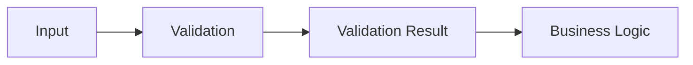

Validation acts as the gateway into the business model.

---

# Architectural Responsibilities

The Validation subsystem is responsible for:

- evaluating business constraints;
- collecting validation failures;
- producing explicit validation outcomes;
- integrating with the Results subsystem;
- protecting domain integrity.

It is **not** responsible for:

- executing business rules;
- modifying domain state;
- persistence;
- authorization;
- infrastructure concerns.

These responsibilities belong to other architectural subsystems.

---

# Architectural Layers

Validation itself follows a layered internal architecture.

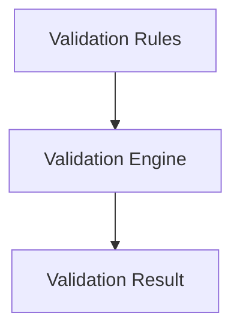

Each layer has a clearly defined responsibility.

---

# Validation Rules

Validation Rules represent the smallest executable validation unit.

Each rule answers one business question.

Examples include:

- Is the identifier valid?
- Is the value required?
- Does the value satisfy a range?
- Is the format correct?

Rules should remain:

- focused;
- deterministic;
- reusable.

---

# Validation Engine

The Validation Engine coordinates the execution of validation rules.

Its responsibilities include:

- invoking validation rules;
- collecting failures;
- determining overall validity;
- producing ValidationResult.

The engine itself contains no business semantics.

It merely orchestrates validation.

---

# Validation Result

The output of validation is always an explicit ValidationResult.

Conceptually:

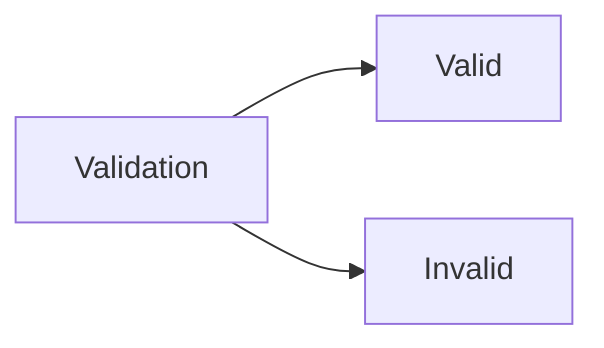

This outcome integrates directly with the Results subsystem.

---

# Relationship with Results

Validation and Results are complementary architectural subsystems.


Validation establishes whether execution may continue.

Results communicate that decision.

---

# Relationship with the Domain Model

Validation protects the Domain Model from invalid state.

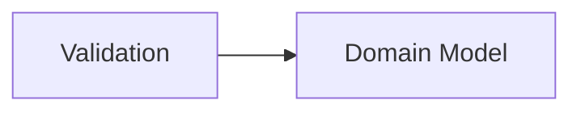

The Domain Model assumes that incoming data has already satisfied all required validation rules.

---

# Relationship with Specifications

Validation and Specifications have different responsibilities.

Validation answers:

> Is this input valid?

Specifications answer:

> Does this business object satisfy a business condition?

Although both evaluate rules, they operate at different architectural levels.

---

# Relationship with Value Objects

Value Objects frequently perform intrinsic validation during creation.

The Validation subsystem performs:

- external validation;
- workflow validation;
- cross-object validation.

The two mechanisms complement rather than replace one another.

---

# Relationship with Exceptions

Validation failures are expected business outcomes.

Unexpected runtime failures remain exceptions.

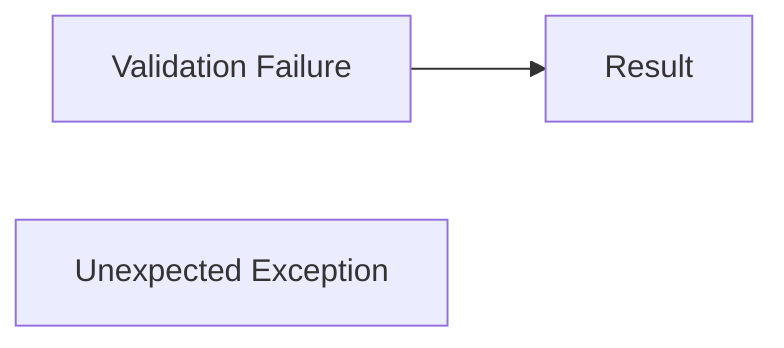

The architectural boundary remains clear.

---

# Validation Lifecycle

Every validation process follows the same lifecycle.

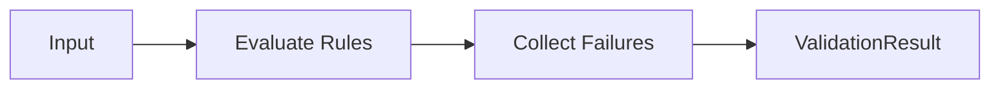

This lifecycle remains identical regardless of execution environment.

---

# Composability

Multiple validators may participate in one validation process.

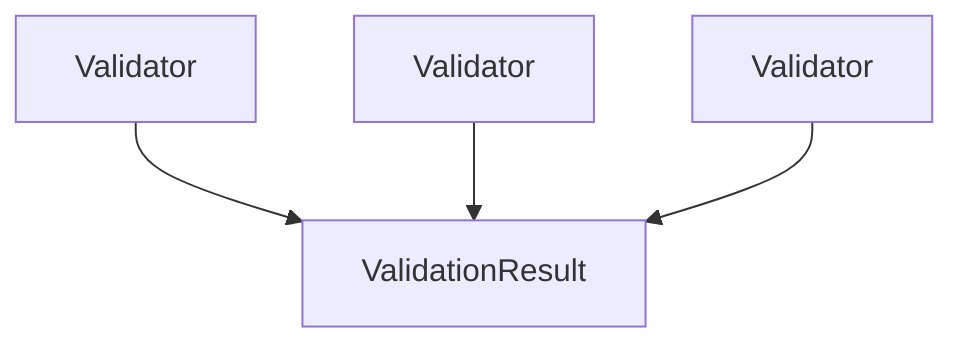

Composition allows large validation models to remain modular.

---

# Deterministic Execution

Validation execution must always remain deterministic.

Given identical:

- input;
- rules;
- business state;

the architecture guarantees identical validation outcomes.

Deterministic execution simplifies:

- testing;
- diagnostics;
- reasoning.

---

# Framework Independence

The Validation architecture remains independent of any specific implementation framework.

Frameworks may invoke validation, but they do not define:

- validation rules;
- validation outcomes;
- validation semantics.

This allows validation to remain portable across every application type.

---

# Extensibility

The architecture supports extension through:

- additional validation rules;
- reusable validators;
- metadata enrichment;
- helper abstractions.

Existing architectural contracts should remain unchanged as new capabilities are introduced.

---

# Architectural Characteristics

The Validation subsystem exhibits the following architectural characteristics.

- Explicit.
- Deterministic.
- Immutable.
- Composable.
- Reusable.
- Framework independent.
- Integrated with Results.

These characteristics define its architectural identity.

---

# Architectural Constraints

Every Validation implementation shall satisfy the following constraints.

- Validate before execution.
- Produce explicit outcomes.
- Remain deterministic.
- Preserve framework independence.
- Protect domain integrity.
- Integrate with Results.
- Avoid side effects.

These constraints govern the evolution of the Validation architecture.

---

# Architectural Invariant

> **The Validation subsystem shall operate as an independent architectural capability that establishes business validity through deterministic, composable and framework-independent validation processes, producing explicit validation outcomes before any business behaviour is allowed to execute.**

This invariant defines the architectural role of validation within **KUKULCAN.SharedKernel**.

---

# Summary

The Validation Architecture provides the structural foundation for all validation processes within **KUKULCAN.SharedKernel**.

By separating validation from business execution while integrating it tightly with the Results subsystem, the architecture ensures that every business operation begins from a known valid state, preserving domain integrity, deterministic behaviour and long-term architectural consistency.

# 5. Architectural Principles

The Validation subsystem is governed by a set of architectural principles that define **how validation should behave**, independently of any particular implementation or validation framework.

These principles provide the foundation upon which every validator, validation rule and validation workflow within **KUKULCAN.SharedKernel** is built.

Rather than describing implementation techniques, they establish the long-term architectural rules that guarantee consistency, predictability and maintainability across the entire platform.

---

## Architectural Principle

Validation shall be governed by explicit architectural principles rather than framework capabilities.

> **Frameworks execute validation; architecture defines validation.**

---

# Principle 1 — Validation Before Business Execution

Validation shall always occur before any business behaviour is executed.

Conceptually:

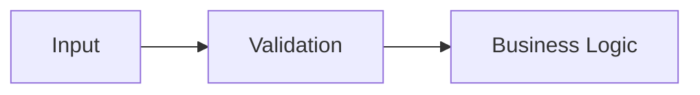

Business logic must never operate on information that has not been validated.

---

# Principle 2 — Explicit Outcomes

Every validation process shall produce an explicit outcome.

There are only two possible states:

- Valid
- Invalid


Validation must never communicate success or failure through:

- `null`;
- Boolean flags;
- hidden exceptions.

---

# Principle 3 — Deterministic Behaviour

Validation shall always be deterministic.

Given identical:

- input;
- validation rules;
- business context;

the validation outcome must always be identical.

Validation must never depend upon:

- execution timing;
- infrastructure state;
- thread scheduling;
- framework implementation details.

---

# Principle 4 — Business-Oriented Validation

Validation rules express business requirements.

Examples include:

- required information;
- identifier validity;
- business ranges;
- business formats;
- invariant preservation.

Validation is not responsible for enforcing technical infrastructure constraints.

---

# Principle 5 — Framework Independence

Validation shall remain independent of:

- FluentValidation;
- ASP.NET Core;
- MVC;
- DataAnnotations;
- serialization frameworks.

External frameworks may invoke validation but shall never define its architectural model.

---

# Principle 6 — Composition Over Duplication

Validation should be composed of reusable validation rules.


Small reusable rules are preferred over large monolithic validators.

---

# Principle 7 — Protect the Domain

Validation exists to preserve the integrity of the Domain Model.

The Domain Model assumes that all incoming information has already satisfied the required validation rules.

Validation therefore acts as the first architectural boundary protecting business state.

---

# Principle 8 — Immutability

Validation outcomes shall be immutable.

Once a ValidationResult or ValidationFailure has been created, it must never change.

Immutability provides:

- thread safety;
- predictability;
- safe reuse;
- simpler reasoning.

---

# Principle 9 — Separation of Responsibilities

Validation determines **whether** business execution may continue.

Business logic determines **what** should happen next.

These responsibilities must never be mixed.

Conceptually:

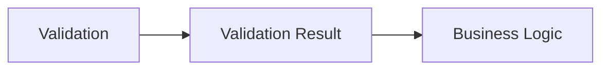

---

# Principle 10 — Explicit Failure Information

Validation failures should clearly communicate:

- what failed;
- why it failed;
- where it failed.

This information is represented through:

- ValidationFailure;
- Error;
- Error Code;
- optional Metadata.

Consumers should never need to infer validation semantics.

---

# Principle 11 — Reusability

Validation rules should be reusable across multiple application layers.

Typical consumers include:

- APIs;
- domain services;
- application services;
- background workers;
- integration processes.

Business validation should be implemented once and reused consistently.

---

# Principle 12 — Stable Contracts

Public validation abstractions shall remain stable.

Examples include:

- ValidationResult;
- ValidationFailure;
- ValidationException;
- ValidationMessages.

Architectural evolution should favour extension rather than modification.

---

# Principle 13 — Integration with Results

Validation shall integrate seamlessly with the Results subsystem.

```mermaid
flowchart LR
    VALIDATION["Validation"]
    RESULTS["Results"]
    EXECUTION["Business Execution"]

    VALIDATION --> RESULTS
    RESULTS --> EXECUTION
```

Validation establishes business validity.

Results communicate business outcomes.

Together they form a unified execution model.

---

# Principle 14 — No Side Effects

Validation shall never modify business state.

Validation may:

- evaluate;
- inspect;
- compare;
- collect failures.

Validation shall never:

- persist data;
- modify aggregates;
- publish events;
- invoke business behaviour.

Its responsibility is purely evaluative.

---

# Principle 15 — Predictable Evolution

The Validation subsystem shall evolve without compromising:

- existing validation semantics;
- public contracts;
- architectural consistency.

Future versions should extend capabilities while preserving compatibility.

---

# Architectural Principles Overview

| Principle                      | Architectural Benefit      |
|--------------------------------|----------------------------|
| Validate before execution      | Domain protection          |
| Explicit outcomes              | Predictable workflows      |
| Deterministic behaviour        | Reliable execution         |
| Business-oriented validation   | Correct business semantics |
| Framework independence         | Maximum portability        |
| Composition                    | High reuse                 |
| Domain protection              | Business integrity         |
| Immutability                   | Thread safety              |
| Separation of responsibilities | Clean architecture         |
| Explicit failures              | Better diagnostics         |
| Reusability                    | Consistency                |
| Stable contracts               | Long-term compatibility    |
| Result integration             | Unified execution model    |
| No side effects                | Predictable validation     |
| Predictable evolution          | Sustainable architecture   |

---

# Architectural Constraints

Every component of the Validation subsystem shall satisfy the following constraints.

- Explicit.
- Deterministic.
- Immutable.
- Reusable.
- Framework independent.
- Side-effect free.
- Integrated with Results.

These constraints define the architectural identity of validation.

---

# Architectural Invariant

> **Every validation process within KUKULCAN.SharedKernel shall adhere to explicit, deterministic, immutable and framework-independent architectural principles, ensuring that validation remains a reusable business capability whose sole responsibility is to establish business validity before execution while preserving the integrity of the Domain Model.**

This invariant governs the behaviour and future evolution of every validation component within the Shared Kernel.

---

# Summary

The architectural principles presented in this chapter establish the behavioural rules that define the Validation subsystem.

By enforcing explicit outcomes, deterministic execution, framework independence, immutability and close integration with the Results subsystem, **KUKULCAN.SharedKernel** provides a validation architecture that remains consistent, predictable and maintainable across every application built upon the platform.

# 6. Validation Taxonomy

Not all validation rules serve the same purpose.

Some verify simple syntactic correctness, while others protect complex business invariants or ensure consistency across multiple domain objects.

To achieve consistency throughout **KUKULCAN.SharedKernel**, validation rules are classified according to their architectural responsibility rather than their implementation.

This taxonomy provides a common vocabulary that allows developers to identify the purpose of each validation rule and determine where it belongs within the overall architecture.

---

## Architectural Principle

Validation rules shall be classified according to the business responsibility they fulfil rather than the technology used to implement them.

> **The purpose of a validation rule is more important than its implementation.**

---

# Purpose

The Validation Taxonomy exists to:

- establish a common architectural language;
- avoid duplicated validation responsibilities;
- clarify validation ownership;
- improve maintainability;
- support reusable validation components.

Every validation rule should belong to one—and only one—validation category.

---

# Architectural Classification

The Validation subsystem classifies validation into six primary categories.

```mermaid
flowchart TD
    VALIDATION["Validation"]
    INPUT["Input Validation"]
    FORMAT["Format Validation"]
    VALUE["Value Validation"]
    BUSINESS["Business Validation"]
    CONSISTENCY["Consistency Validation"]
    CROSS["Cross-Entity Validation"]

    VALIDATION --> INPUT
    VALIDATION --> FORMAT
    VALIDATION --> VALUE
    VALIDATION --> BUSINESS
    VALIDATION --> CONSISTENCY
    VALIDATION --> CROSS
```

Each category has a distinct architectural purpose.

---

# Input Validation

Input Validation verifies the presence of required information.

Typical examples include:

- required values;
- missing identifiers;
- empty collections;
- mandatory parameters.

Its objective is to ensure that sufficient information exists before business processing begins.

---

# Format Validation

Format Validation verifies that information conforms to an expected representation.

Examples include:

- email addresses;
- telephone numbers;
- document identifiers;
- postal codes;
- date formats.

Format Validation does not determine whether the information is meaningful to the business.

It only verifies structural correctness.

---

# Value Validation

Value Validation evaluates the value itself.

Typical examples include:

- minimum values;
- maximum values;
- numeric ranges;
- string lengths;
- positive quantities.

These rules ensure that values remain within acceptable business limits.

---

# Business Validation

Business Validation enforces business-specific rules.

Examples include:

- credit limit exceeded;
- duplicate customer;
- inactive account;
- prohibited operation;
- invalid business state.

These validations depend upon domain knowledge rather than simple input characteristics.

---

# Consistency Validation

Consistency Validation verifies relationships between multiple values belonging to the same business operation.

Examples include:

- start date before end date;
- total equals sum of details;
- mutually exclusive options;
- dependent fields.

These validations ensure internal coherence.

---

# Cross-Entity Validation

Some business rules require access to multiple business objects.

Examples include:

- unique customer code;
- overlapping reservations;
- inventory availability;
- duplicate business identifiers.

These validations frequently involve repositories or domain services but remain business validations rather than infrastructure concerns.

---

# Conceptual Relationships

The categories form a progression from simple validation to complex business reasoning.

```mermaid
flowchart LR
    INPUT["Input"]
    FORMAT["Format"]
    VALUE["Value"]
    BUSINESS["Business"]
    CONSISTENCY["Consistency"]
    CROSS["Cross-Entity"]

    INPUT --> FORMAT
    FORMAT --> VALUE
    VALUE --> BUSINESS
    BUSINESS --> CONSISTENCY
    CONSISTENCY --> CROSS
```

Each category builds upon the previous one.

---

# Validation Responsibilities

Each category answers a different business question.

| Category                | Primary Question                                            |
|-------------------------|-------------------------------------------------------------|
| Input Validation        | Is the required information present?                        |
| Format Validation       | Is the representation correct?                              |
| Value Validation        | Is the value acceptable?                                    |
| Business Validation     | Does the business allow this?                               |
| Consistency Validation  | Are the supplied values coherent?                           |
| Cross-Entity Validation | Is the operation valid within the broader business context? |

Together these categories cover the full validation spectrum.

---

# Classification Rules

Every new validation rule should satisfy the following questions.

1. Does it verify the presence of required information?
    - **Classification:** Input Validation.

2. Does it verify the structure or representation of information?
    - **Classification:** Format Validation.

3. Does it verify that a value falls within acceptable limits?
    - **Classification:** Value Validation.

4. Does it enforce a business rule or invariant?
    - **Classification:** Business Validation.

5. Does it verify the relationship between multiple values?
    - **Classification:** Consistency Validation.

6. Does it require information from multiple business entities?
    - **Classification:** Cross-Entity Validation.

If none of these classifications apply, reconsider whether the rule truly belongs in the Validation subsystem.

---

# Relationship with Results

Regardless of category, every validation rule produces the same architectural outcome.

```mermaid
flowchart LR
    VALIDATION["Validation Rule"]
    RESULT["ValidationResult"]

    VALIDATION --> RESULT
```

The taxonomy influences the nature of the rule, not the structure of its outcome.

---

# Relationship with Error Taxonomy

Each validation category typically maps to one or more Validation Errors.

Examples include:

| Validation Category     | Typical Errors                    |
|-------------------------|-----------------------------------|
| Input Validation        | Required, Empty                   |
| Format Validation       | InvalidFormat, InvalidEmail       |
| Value Validation        | GreaterThan, LessThan             |
| Business Validation     | BusinessRuleViolation             |
| Consistency Validation  | InconsistentState                 |
| Cross-Entity Validation | DuplicateEntity, ResourceConflict |

This mapping keeps validation semantics consistent across the framework.

---

# Framework Independence

The taxonomy is entirely independent of validation frameworks.

Whether validation is implemented using:

- FluentValidation;
- custom validators;
- domain services;
- specifications;

the architectural classification remains identical.

---

# Extensibility

The taxonomy may evolve as the framework grows.

However, new categories should only be introduced when they represent a genuinely distinct architectural responsibility.

Additional implementation techniques should not create new validation categories.

---

# Architectural Constraints

Every validation rule shall satisfy the following constraints.

- Belong to exactly one primary validation category.
- Express one architectural responsibility.
- Remain deterministic.
- Integrate with ValidationResult.
- Remain framework independent.
- Preserve explicit business semantics.

These constraints prevent overlap between validation categories.

---

# Architectural Invariant

> **Every validation rule within KUKULCAN.SharedKernel shall belong to a clearly defined architectural validation category, ensuring that validation responsibilities remain explicit, reusable, deterministic and independent of implementation technologies while collectively protecting the integrity of the Domain Model.**

This invariant establishes the Validation Taxonomy as the canonical classification model for every validation rule within the Shared Kernel.

---

# Summary

The Validation Taxonomy provides a structured classification of validation responsibilities based on business intent rather than implementation details.

By distinguishing between input, format, value, business, consistency and cross-entity validation, **KUKULCAN.SharedKernel** establishes a common architectural language that simplifies reasoning, promotes reuse and ensures consistent validation behaviour throughout the entire platform.

# 7. Core Components

The Validation subsystem is composed of a small set of highly cohesive architectural components.

Each component has a single, clearly defined responsibility and collaborates with the others to provide a complete validation model.

Rather than exposing a large collection of loosely related types, the subsystem defines a minimal and stable set of abstractions that collectively represent:

- validation outcomes;
- validation failures;
- validation exceptions;
- reusable validation messages;
- reusable validation errors;
- conversion mechanisms;
- execution helpers.

Together these components establish the public API of the Validation subsystem.

---

## Architectural Principle

Each Validation component shall have one architectural responsibility and one responsibility only.

> **Small, cohesive components create stable architectures.**

---

# Component Overview

The Validation subsystem consists of the following core components.

```mermaid
flowchart TD
    VALIDATION["Validation"]
    RESULT["ValidationResult"]
    FAILURE["ValidationFailure"]
    EXCEPTION["ValidationException"]
    MESSAGES["ValidationMessages"]
    ERRORS["ValidationErrors"]
    CONVERSION["ValidationConversionExtensions"]
    THROW["ValidationThrowExtensions"]

    VALIDATION --> RESULT
    VALIDATION --> FAILURE
    VALIDATION --> EXCEPTION
    VALIDATION --> MESSAGES
    VALIDATION --> ERRORS
    VALIDATION --> CONVERSION
    VALIDATION --> THROW
```

Each component fulfils a distinct architectural role.

---

# Component Responsibilities

| Component                      | Primary Responsibility                                                                 |
|--------------------------------|----------------------------------------------------------------------------------------|
| ValidationResult               | Represents the overall outcome of a validation process.                                |
| ValidationFailure              | Represents a single validation failure.                                                |
| ValidationException            | Represents exceptional validation termination when exceptions are explicitly required. |
| ValidationMessages             | Provides reusable validation message templates.                                        |
| ValidationErrors               | Provides reusable validation Error definitions integrated with the Results subsystem.  |
| ValidationConversionExtensions | Converts validation outcomes into Results.                                             |
| ValidationThrowExtensions      | Bridges explicit validation with exception-based execution when necessary.             |

Together these components define the architectural surface of the Validation subsystem.

---

# Collaboration Model

The core components collaborate through a predictable execution flow.

```mermaid
flowchart LR
    RULES["Validation Rules"]
    FAILURE["ValidationFailure"]
    RESULT["ValidationResult"]
    CONVERSION["Conversion"]
    BUSINESS["Result"]

    RULES --> FAILURE
    FAILURE --> RESULT
    RESULT --> CONVERSION
    CONVERSION --> BUSINESS
```

Each stage transforms information without altering its semantic meaning.

---

# Integration with Results

Validation is not an isolated subsystem.

Its primary consumer is the Results subsystem.

```mermaid
flowchart LR
    VALIDATION["Validation"]
    RESULT["ValidationResult"]
    RESULTS["Result"]

    VALIDATION --> RESULT
    RESULT --> RESULTS
```

This integration ensures that validation outcomes become explicit business outcomes.

---

# Architectural Characteristics

Every core component shares the same architectural characteristics.

- Explicit.
- Immutable.
- Deterministic.
- Reusable.
- Framework independent.
- Stable.

These characteristics remain consistent throughout the subsystem.

---

# Public API Surface

The components described in this chapter collectively define the public Validation API.

Applications should interact with these abstractions rather than implementation details.

Stable public contracts simplify:

- framework evolution;
- application maintenance;
- long-term compatibility.

---

# Component Dependencies

The Validation subsystem maintains a strict dependency structure.

```mermaid
flowchart TD
    VALIDATION["Validation"]
    RESULTS["Results"]

    VALIDATION --> RESULTS
```

Validation depends upon Results.

Results do **not** depend upon Validation.

This preserves the architectural dependency direction established in **ARCHITECTURAL.md**.

---

# Framework Independence

None of the core components depend upon:

- FluentValidation;
- ASP.NET Core;
- MVC;
- DataAnnotations;
- serialization frameworks.

External frameworks may create or consume these components, but they do not define them.

---

# Extensibility

Future framework versions may introduce:

- additional helper abstractions;
- additional extension methods;
- new conversion mechanisms.

However, the architectural responsibilities of the existing core components should remain unchanged.

Extension is preferred over modification.

---

# Relationship Between Components

The responsibilities remain clearly separated.

```mermaid
flowchart TD
    RULES["Rules"]
    FAILURE["ValidationFailure"]
    RESULT["ValidationResult"]
    ERROR["ValidationErrors"]
    EXCEPTION["ValidationException"]

    RULES --> FAILURE
    FAILURE --> RESULT
    RESULT --> ERROR
    RESULT --> EXCEPTION
```

No component performs multiple architectural responsibilities.

---

# Architectural Constraints

Every core component shall satisfy the following constraints.

- Single Responsibility.
- Immutable state.
- Stable public contract.
- Explicit semantics.
- Framework independence.
- Deterministic behaviour.
- Integration with Results.

These constraints govern every component described in the following sections.

---

# Architectural Invariant

> **The Validation subsystem shall be composed of a small set of cohesive, immutable and framework-independent components, each fulfilling one clearly defined architectural responsibility while collaborating to provide a complete and deterministic validation model fully integrated with the Results subsystem.**

This invariant governs the design and future evolution of every Validation component.

---

# Component Details

The following sections describe each architectural component individually.

- **7.1 ValidationResult**
- **7.2 ValidationFailure**
- **7.3 ValidationException**
- **7.4 ValidationMessages**
- **7.5 ValidationErrors**
- **7.6 ValidationConversionExtensions**
- **7.7 ValidationThrowExtensions**

Each section explains the architectural role, responsibilities, relationships and design principles of the corresponding component.

---

# Summary

The Validation subsystem intentionally exposes only a small number of carefully designed architectural components.

Together they provide a consistent and extensible model for representing validation outcomes, integrating with the Results subsystem and protecting the integrity of the Domain Model while remaining independent of any particular validation framework or implementation technology.

## 7.1 ValidationResult

`ValidationResult` represents the complete outcome of a validation process.

It is the primary output produced by the Validation subsystem and acts as the canonical representation of validation state within **KUKULCAN.SharedKernel**.

Unlike a Boolean value, a `ValidationResult` communicates not only whether validation succeeded or failed, but also provides the complete collection of validation failures generated during execution.

This makes validation outcomes explicit, deterministic and suitable for further architectural composition.

---

## Architectural Principle

A validation process shall always produce an explicit ValidationResult.

> **Validation never answers "true" or "false"; it describes the complete validation state.**

---

# Purpose

The purpose of `ValidationResult` is to:

- represent validation success;
- represent validation failure;
- aggregate multiple validation failures;
- provide deterministic validation outcomes;
- integrate with the Results subsystem.

It serves as the bridge between validation and business execution.

---

# Architectural Responsibility

`ValidationResult` has exactly one responsibility:

> Represent the outcome of a validation process.

It does **not**:

- perform validation;
- execute business rules;
- throw exceptions;
- modify domain state.

Those responsibilities belong to other components.

---

# Conceptual Model

```mermaid
flowchart TD
    VALIDATION["Validation"]
    RESULT["ValidationResult"]
    SUCCESS["Valid"]
    FAILURES["Validation Failures"]

    VALIDATION --> RESULT
    RESULT --> SUCCESS
    RESULT --> FAILURES
```

Every validation execution produces exactly one `ValidationResult`.

---

# Validation States

Architecturally, a `ValidationResult` has only two possible states.

```mermaid
flowchart LR
    RESULT["ValidationResult"]
    VALID["Valid"]
    INVALID["Invalid"]

    RESULT --> VALID
    RESULT --> INVALID
```

These states are mutually exclusive.

---

# Success State

A successful `ValidationResult` indicates that every validation rule has been satisfied.

Characteristics include:

- no validation failures;
- business execution may continue;
- deterministic outcome.

Conceptually:

```text
ValidationResult

↓

Valid = true

Failures = Ø
```

---

# Failure State

A failed `ValidationResult` indicates that one or more validation rules have been violated.

Characteristics include:

- one or more ValidationFailure objects;
- business execution should not continue;
- complete failure information.

Conceptually:

```text
ValidationResult

↓

Valid = false

Failures = [...]
```

---

# Failure Collection

A validation process may produce multiple failures simultaneously.

```mermaid
flowchart TD
    RULE1["Rule"]
    RULE2["Rule"]
    RULE3["Rule"]
    FAILURE1["Failure"]
    FAILURE2["Failure"]
    RESULT["ValidationResult"]

    RULE1 --> FAILURE1
    RULE2 --> FAILURE2

    FAILURE1 --> RESULT
    FAILURE2 --> RESULT
```

This enables comprehensive validation reporting.

---

# Immutability

`ValidationResult` is immutable.

Once created:

- validity cannot change;
- failures cannot change;
- ordering cannot change.

Immutability guarantees:

- thread safety;
- deterministic behaviour;
- predictable execution.

---

# Relationship with ValidationFailure

`ValidationResult` owns the collection of `ValidationFailure` objects.

```mermaid
flowchart LR
    FAILURE["ValidationFailure"]
    RESULT["ValidationResult"]

    FAILURE --> RESULT
```

The failures describe **why** validation failed.

The result describes **whether** validation succeeded.

---

# Relationship with Results

`ValidationResult` integrates directly with the Results subsystem.

```mermaid
flowchart LR
    VALIDATION["ValidationResult"]
    RESULT["Result"]
    BUSINESS["Business Execution"]

    VALIDATION --> RESULT
    RESULT --> BUSINESS
```

Successful validation allows execution to continue.

Failed validation becomes an explicit business Result.

---

# Relationship with Exceptions

`ValidationResult` is the preferred mechanism for communicating validation outcomes.

Exceptions are only introduced when explicitly required.

```mermaid
flowchart LR
    VALIDATION["ValidationResult"]
    EXCEPTION["ValidationException"]

    VALIDATION --> EXCEPTION
```

The architectural model remains exception-free by default.

---

# Lifecycle

The lifecycle of a `ValidationResult` is straightforward.

```mermaid
flowchart LR
    CREATE["Create"]
    CONSUME["Consume"]
    CONVERT["Convert"]
    COMPLETE["Complete"]

    CREATE --> CONSUME
    CONSUME --> CONVERT
    CONVERT --> COMPLETE
```

The object is never modified after creation.

---

# Architectural Characteristics

`ValidationResult` exhibits the following characteristics.

- Explicit.
- Immutable.
- Deterministic.
- Reusable.
- Framework independent.
- Thread safe.

These characteristics remain invariant throughout its lifetime.

---

# Public Contract

`ValidationResult` forms part of the public Shared Kernel API.

Its observable behaviour should remain stable across framework versions.

Future evolution should favour:

- additional helper methods;
- new extension methods;

rather than behavioural changes.

---

# Architectural Constraints

Every implementation of `ValidationResult` shall satisfy the following constraints.

- Represent one validation outcome.
- Preserve immutability.
- Aggregate ValidationFailure objects.
- Remain deterministic.
- Integrate with Results.
- Remain framework independent.

These constraints define its architectural identity.

---

# Architectural Invariant

> **ValidationResult shall be the unique architectural representation of validation outcomes within KUKULCAN.SharedKernel, providing an immutable, deterministic and framework-independent aggregation of validation failures that integrates seamlessly with the Results subsystem while preserving explicit business semantics.**

This invariant defines the role of `ValidationResult` within the Validation architecture.

---

# Summary

`ValidationResult` is the central output of the Validation subsystem.

It provides a single, explicit and immutable representation of validation outcomes, allowing validation to integrate naturally with business execution while preserving deterministic behaviour, framework independence and long-term architectural stability.

## 7.2 ValidationFailure

`ValidationFailure` represents a single validation rule violation.

It is the fundamental unit of information produced by the Validation subsystem and provides a complete description of one validation problem detected during the execution of a validation process.

A `ValidationResult` may contain zero, one or many `ValidationFailure` instances.

Each instance describes one—and only one—validation failure.

---

## Architectural Principle

Each violated validation rule shall be represented by exactly one ValidationFailure.

> **A ValidationFailure describes one validation problem and one validation problem only.**

---

# Purpose

The purpose of `ValidationFailure` is to:

- describe a validation rule violation;
- identify the affected element;
- explain the reason for the failure;
- preserve validation semantics;
- provide optional diagnostic information.

It represents the smallest architectural building block of validation.

---

# Architectural Responsibility

`ValidationFailure` has one architectural responsibility:

> Describe a single validation failure.

It does **not**:

- perform validation;
- aggregate failures;
- execute business logic;
- convert itself into Results;
- throw exceptions.

Those responsibilities belong to other components.

---

# Conceptual Model

```mermaid
flowchart TD
    RULE["Validation Rule"]
    FAILURE["ValidationFailure"]
    PROPERTY["Affected Property"]
    MESSAGE["Validation Message"]

    RULE --> FAILURE
    FAILURE --> PROPERTY
    FAILURE --> MESSAGE
```

Every failed validation rule produces one `ValidationFailure`.

---

# Core Information

A `ValidationFailure` typically contains enough information to describe:

- the affected member;
- the validation message;
- the associated Error;
- the attempted value (when appropriate);
- optional metadata.

This information allows consumers to understand exactly why validation failed.

---

# One Failure per Rule

Each validation rule violation generates its own `ValidationFailure`.

```mermaid
flowchart TD
    RULE1["Rule A"]
    RULE2["Rule B"]
    FAILURE1["Failure A"]
    FAILURE2["Failure B"]

    RULE1 --> FAILURE1
    RULE2 --> FAILURE2
```

Multiple failures are represented as multiple objects rather than a single combined description.

---

# Explicit Semantics

A `ValidationFailure` is a business concept.

It communicates:

- what failed;
- why it failed;
- where it failed.

Consumers should never need to infer this information.

---

# Relationship with ValidationResult

`ValidationFailure` is aggregated by `ValidationResult`.

```mermaid
flowchart LR
    FAILURE["ValidationFailure"]
    RESULT["ValidationResult"]

    FAILURE --> RESULT
```

`ValidationResult` owns the collection.

`ValidationFailure` describes the individual elements within that collection.

---

# Relationship with ValidationMessages

Validation messages provide reusable textual descriptions.

```mermaid
flowchart LR
    MESSAGE["ValidationMessages"]
    FAILURE["ValidationFailure"]

    MESSAGE --> FAILURE
```

Separating reusable messages from failures promotes consistency throughout the framework.

---

# Relationship with ValidationErrors

Validation failures are closely associated with reusable Validation Errors.

```mermaid
flowchart LR
    ERROR["ValidationErrors"]
    FAILURE["ValidationFailure"]

    ERROR --> FAILURE
```

The Error communicates the semantic meaning.

The Failure identifies where it occurred.

---

# Attempted Value

When appropriate, a validation failure may include the value that failed validation.

Examples include:

- invalid email address;
- negative quantity;
- unsupported identifier;
- malformed telephone number.

Providing the attempted value improves diagnostics without altering the semantic meaning of the failure.

---

# Metadata

Additional information may be attached through optional metadata.

Typical metadata includes:

- minimum value;
- maximum value;
- comparison target;
- validation rule;
- culture information.

Metadata enriches diagnostics while preserving semantic identity.

---

# Immutability

`ValidationFailure` is immutable.

Once created:

- property information cannot change;
- messages cannot change;
- associated Errors cannot change;
- metadata remains immutable.

Immutability guarantees:

- thread safety;
- deterministic behaviour;
- safe reuse.

---

# Lifecycle

The lifecycle of a `ValidationFailure` is intentionally simple.

```mermaid
flowchart LR
    CREATE["Create"]
    COLLECT["Collect"]
    CONSUME["Consume"]
    COMPLETE["Complete"]

    CREATE --> COLLECT
    COLLECT --> CONSUME
    CONSUME --> COMPLETE
```

The object is never modified after construction.

---

# Architectural Characteristics

`ValidationFailure` exhibits the following characteristics.

- Explicit.
- Immutable.
- Deterministic.
- Lightweight.
- Reusable.
- Framework independent.

These characteristics remain constant regardless of the validation framework used.

---

# Public Contract

`ValidationFailure` is part of the public Validation API.

Its observable behaviour should remain stable across framework versions.

Future evolution should primarily consist of:

- optional metadata additions;
- helper APIs;
- diagnostic improvements.

Existing semantics should never change.

---

# Architectural Constraints

Every `ValidationFailure` shall satisfy the following constraints.

- Represent exactly one validation rule violation.
- Preserve explicit semantics.
- Remain immutable.
- Reference reusable ValidationErrors where appropriate.
- Support optional metadata.
- Remain framework independent.

These constraints define its architectural role.

---

# Architectural Invariant

> **ValidationFailure shall represent exactly one violated validation rule within KUKULCAN.SharedKernel, preserving explicit business semantics through an immutable, deterministic and framework-independent model that identifies the affected element, the reason for failure and any associated diagnostic context without performing validation itself.**

This invariant defines the architectural identity of `ValidationFailure`.

---

# Summary

`ValidationFailure` is the atomic unit of the Validation subsystem.

Each instance represents one validation rule violation, providing explicit information about the affected element, the associated business error and any optional diagnostic metadata.

By remaining immutable, deterministic and framework independent, `ValidationFailure` provides the stable foundation upon which `ValidationResult` communicates complete validation outcomes throughout **KUKULCAN.SharedKernel**.

## 7.3 ValidationException

`ValidationException` represents the exceptional termination of a validation process when an exception-based execution model is explicitly required.

Within **KUKULCAN.SharedKernel**, validation failures are normally communicated through `ValidationResult` and the Results subsystem. Consequently, `ValidationException` is **not** the primary validation mechanism.

Instead, it exists as an interoperability component that allows applications or frameworks requiring exception-driven execution to participate in the architectural validation model without altering its semantics.

The preferred architectural model remains explicit validation outcomes rather than exception-based control flow.

---

## Architectural Principle

Validation exceptions shall exist only to support interoperability with exception-based execution models.

> **Validation failures are expected business outcomes; exceptions are exceptional execution mechanisms.**

---

# Purpose

The purpose of `ValidationException` is to:

- bridge explicit validation with exception-based execution;
- preserve validation information when exceptions are required;
- expose validation failures to external frameworks;
- support legacy integration scenarios;
- maintain architectural consistency.

It is not intended to replace `ValidationResult`.

---

# Architectural Responsibility

`ValidationException` has exactly one responsibility.

> Represent validation failure as an exception when an exception-based contract explicitly requires it.

It does **not**:

- perform validation;
- aggregate validation rules;
- execute business logic;
- replace the Results subsystem.

Those responsibilities remain elsewhere.

---

# Architectural Position

Conceptually, `ValidationException` sits at the boundary between explicit validation and exception-driven execution.

```mermaid
flowchart LR
    VALIDATION["Validation"]
    RESULT["ValidationResult"]
    EXCEPTION["ValidationException"]
    FRAMEWORK["External Framework"]

    VALIDATION --> RESULT
    RESULT --> EXCEPTION
    EXCEPTION --> FRAMEWORK
```

It acts as an adapter rather than a primary validation mechanism.

---

# Preferred Execution Model

The Validation architecture always favours explicit outcomes.

```mermaid
flowchart LR
    VALIDATION["Validation"]
    RESULT["ValidationResult"]
    BUSINESS["Business Execution"]

    VALIDATION --> RESULT
    RESULT --> BUSINESS
```

This remains the canonical workflow.

---

# Exceptional Execution Model

Some environments require validation failures to be expressed as exceptions.

In those situations:

```mermaid
flowchart LR
    VALIDATION["Validation"]
    RESULT["ValidationResult"]
    THROW["Throw ValidationException"]

    VALIDATION --> RESULT
    RESULT --> THROW
```

The semantic meaning of the validation failure remains unchanged.

---

# Relationship with ValidationResult

`ValidationException` originates from a failed `ValidationResult`.

```mermaid
flowchart LR
    RESULT["ValidationResult"]
    EXCEPTION["ValidationException"]

    RESULT --> EXCEPTION
```

The exception should preserve the validation information rather than creating new semantics.

---

# Relationship with ValidationFailure

A `ValidationException` typically exposes the same collection of `ValidationFailure` objects that caused validation to fail.

```mermaid
flowchart LR
    FAILURE["ValidationFailure"]
    EXCEPTION["ValidationException"]

    FAILURE --> EXCEPTION
```

This guarantees that no validation information is lost during conversion.

---

# Relationship with Results

The Results subsystem remains the preferred communication mechanism.

```mermaid
flowchart LR
    VALIDATION["Validation"]
    RESULTS["Result"]
    EXCEPTION["ValidationException"]

    VALIDATION --> RESULTS
    RESULTS -. Optional Conversion .-> EXCEPTION
```

Exceptions are derived from Results—not the other way around.

---

# Exception Semantics

`ValidationException` represents:

- expected validation failure;
- exceptional execution contract.

It does **not** represent:

- infrastructure failures;
- programming errors;
- runtime faults;
- unexpected business conditions.

Its meaning is intentionally narrow.

---

# Typical Usage

Typical scenarios include:

- framework middleware;
- MVC filters;
- automatic request validation;
- legacy exception-based APIs;
- external integration layers.

These scenarios require exceptions due to external contracts rather than architectural preference.

---

# Immutability

Like every validation component, `ValidationException` should expose immutable validation information.

Once created:

- validation failures do not change;
- messages do not change;
- associated metadata remains stable.

This preserves deterministic behaviour.

---

# Lifecycle

The lifecycle of a `ValidationException` is intentionally simple.

```mermaid
flowchart LR
    RESULT["ValidationResult"]
    CREATE["Create Exception"]
    THROW["Throw"]
    HANDLE["Handle"]

    RESULT --> CREATE
    CREATE --> THROW
    THROW --> HANDLE
```

The exception merely transports existing validation information.

---

# Framework Independence

Although exceptions are commonly associated with application frameworks, `ValidationException` itself remains framework independent.

It has no dependency upon:

- ASP.NET Core;
- MVC;
- FluentValidation;
- middleware;
- transport technologies.

Frameworks may consume it, but they do not define it.

---

# Architectural Characteristics

`ValidationException` exhibits the following characteristics.

- Explicit.
- Immutable.
- Deterministic.
- Interoperable.
- Framework independent.
- Derived from ValidationResult.

These characteristics distinguish it from traditional validation exceptions.

---

# Architectural Constraints

Every `ValidationException` shall satisfy the following constraints.

- Represent failed validation only.
- Preserve ValidationFailure information.
- Remain immutable.
- Never replace ValidationResult.
- Support framework interoperability.
- Preserve explicit business semantics.

These constraints ensure that exception-based execution never compromises the architectural model.

---

# Architectural Invariant

> **ValidationException shall serve exclusively as an interoperability mechanism for exception-based execution models, preserving the complete semantic information of a failed ValidationResult without replacing the explicit validation architecture defined by KUKULCAN.SharedKernel.**

This invariant defines the architectural role of `ValidationException` within the Validation subsystem.

---

# Summary

`ValidationException` provides a controlled bridge between the explicit validation architecture of **KUKULCAN.SharedKernel** and external environments that require exception-driven execution.

By preserving the information contained within `ValidationResult` while remaining framework independent and semantically consistent, it enables interoperability without compromising the architectural principle that validation failures are expected business outcomes rather than exceptional business events.

## 7.4 ValidationMessages

`ValidationMessages` provides the centralised repository of reusable validation message templates used throughout the Validation subsystem.

Its purpose is to ensure that validation messages remain:

- consistent;
- reusable;
- maintainable;
- independent of individual validators.

Rather than allowing validators to embed literal text, `ValidationMessages` defines a canonical vocabulary for describing validation failures across the entire **KUKULCAN.SharedKernel**.

The class is intentionally focused on reusable message definitions and does not contain validation logic.

---

## Architectural Principle

Validation messages shall be centralised and reusable.

> **Validation semantics belong to validators; validation wording belongs to ValidationMessages.**

---

# Purpose

The purpose of `ValidationMessages` is to:

- eliminate duplicated validation text;
- standardise validation wording;
- improve maintainability;
- simplify localization;
- provide a stable messaging vocabulary.

It acts as the authoritative source for validation message templates.

---

# Architectural Responsibility

`ValidationMessages` has one architectural responsibility.

> Provide reusable validation message templates.

It does **not**:

- perform validation;
- create validation failures;
- construct Errors;
- determine validation outcomes.

Those responsibilities belong to other components.

---

# Architectural Position

Conceptually, `ValidationMessages` supplies message templates to validation failures.

```mermaid
flowchart LR
    MESSAGES["ValidationMessages"]
    FAILURE["ValidationFailure"]
    RESULT["ValidationResult"]

    MESSAGES --> FAILURE
    FAILURE --> RESULT
```

It provides language, not behaviour.

---

# Centralized Message Repository

Without centralised messages:

```text
Validator A
    "Email is required."

Validator B
    "Email required."

Validator C
    "The email cannot be empty."
```

Over time, wording becomes inconsistent.

With `ValidationMessages`:

```text
ValidationMessages.Required
```

Every validator communicates the same business concept using identical terminology.

---

# Message Templates

`ValidationMessages` contains reusable templates rather than operation-specific text.

Examples include concepts such as:

- Required
- Empty
- Invalid Format
- Minimum Length
- Maximum Length
- Greater Than
- Less Than
- Between

The exact wording may evolve, while the semantic meaning remains stable.

---

# Relationship with ValidationFailure

Every `ValidationFailure` may reference a message supplied by `ValidationMessages`.

```mermaid
flowchart LR

    TEMPLATE["ValidationMessages"]

    FAILURE["ValidationFailure"]

    TEMPLATE --> FAILURE
```

The failure identifies the violated rule.

The message explains it.

---

# Relationship with ValidationErrors

Validation messages complement Validation Errors.

```mermaid
flowchart LR
    ERRORS["ValidationErrors"]
    MESSAGES["ValidationMessages"]
    FAILURE["ValidationFailure"]

    ERRORS --> FAILURE
    MESSAGES --> FAILURE
```

Their responsibilities remain distinct.

| Component          | Responsibility             |
|--------------------|----------------------------|
| ValidationErrors   | Semantic identity          |
| ValidationMessages | Human-readable description |

---

# Localization Support

One of the principal architectural reasons for centralising validation messages is future localisation.

Validators should never assume:

- language;
- culture;
- region.

`ValidationMessages` provides a single integration point for localisation mechanisms without changing validator implementations.

---

# Consistency

A centralised message repository ensures that identical validation conditions are described consistently across:

- APIs;
- background services;
- desktop applications;
- integration services.

Consistency improves both user experience and diagnostics.

---

# Framework Independence

`ValidationMessages` is completely independent of:

- FluentValidation;
- ASP.NET Core;
- MVC;
- localization frameworks.

Frameworks may consume the messages, but they do not define them.

---

# Extensibility

New validation message templates may be introduced as new validation concepts emerge.

Existing templates should remain semantically stable to preserve consistency across framework versions.

Extension is preferred over modification.

---

# Immutability

Validation message templates should be treated as immutable.

Once published:

- identifiers remain stable;
- semantic meaning remains stable;
- usage remains predictable.

This stability supports long-term API evolution.

---

# Architectural Characteristics

`ValidationMessages` exhibits the following characteristics.

- Centralized.
- Reusable.
- Immutable.
- Framework independent.
- Localization-ready.
- Semantically stable.

These characteristics define its architectural role.

---

# Architectural Constraints

Every implementation of `ValidationMessages` shall satisfy the following constraints.

- Provide reusable message templates.
- Avoid duplicated wording.
- Remain framework independent.
- Support localization.
- Preserve semantic consistency.
- Avoid embedding business logic.

These constraints ensure that messages remain a shared architectural resource.

---

# Architectural Invariant

> **ValidationMessages shall provide the canonical repository of reusable validation message templates within KUKULCAN.SharedKernel, ensuring consistent, immutable and localisation-ready validation wording while remaining completely independent of validation execution, business logic and implementation frameworks.**

This invariant defines the architectural identity of `ValidationMessages`.

---

# Summary

`ValidationMessages` centralizes the human-readable descriptions used throughout the Validation subsystem.

By separating validation wording from validation behaviour, **KUKULCAN.SharedKernel** promotes consistency, maintainability and future localisation while ensuring that every validation failure communicates business meaning through a common and reusable architectural vocabulary.

## 7.5 ValidationErrors

`ValidationErrors` provides the centralised repository of reusable validation `Error` definitions used by the Validation subsystem.

Unlike `ValidationMessages`, which supply human-readable text, `ValidationErrors` defines the **semantic identity** of validation failures.

Each validation error represents a stable business concept that can be reused consistently throughout **KUKULCAN.SharedKernel**.

Validators should reference reusable validation errors rather than constructing new `Error` instances during execution.

This guarantees semantic consistency across every application built upon the Shared Kernel.

---

## Architectural Principle

Validation errors shall represent reusable business semantics rather than validator-specific implementation details.

> **A validation error identifies what happened; a validation message explains it.**

---

# Purpose

The purpose of `ValidationErrors` is to:

- provide reusable validation `Error` instances;
- eliminate duplicated error definitions;
- preserve semantic consistency;
- integrate validation with the Results subsystem;
- support long-term API stability.

It is the canonical source of validation-related Errors.

---

# Architectural Responsibility

`ValidationErrors` has exactly one responsibility.

> Provide reusable validation Error definitions.

It does **not**:

- perform validation;
- generate validation messages;
- create ValidationResult;
- execute business rules.

Those responsibilities belong to other architectural components.

---

# Architectural Position

Conceptually:

```mermaid
flowchart LR
    VALIDATION["Validation Rule"]
    ERRORS["ValidationErrors"]
    FAILURE["ValidationFailure"]
    RESULT["ValidationResult"]

    VALIDATION --> ERRORS
    ERRORS --> FAILURE
    FAILURE --> RESULT
```

ValidationErrors supplies semantic identity to ValidationFailure.

---

# Semantic Identity

Every reusable validation error represents a stable business meaning.

Examples include concepts such as:

- Required
- Empty
- InvalidFormat
- InvalidEmail
- InvalidPhone
- InvalidIdentifier
- MinLength
- MaxLength
- ExactLength
- GreaterThan
- LessThan
- Between

These represent business semantics rather than textual descriptions.

---

# Relationship with CommonErrorCodes

Every reusable validation error should be backed by a stable error code.

```mermaid
flowchart LR
    CODES["CommonErrorCodes"]
    ERRORS["ValidationErrors"]
    FAILURE["ValidationFailure"]

    CODES --> ERRORS
    ERRORS --> FAILURE
```

Error codes establish long-term semantic identity across framework versions.

---

# Relationship with ValidationMessages

ValidationErrors and ValidationMessages complement one another.

```mermaid
flowchart LR
    ERRORS["ValidationErrors"]
    MESSAGES["ValidationMessages"]
    FAILURE["ValidationFailure"]

    ERRORS --> FAILURE
    MESSAGES --> FAILURE
```

Their responsibilities remain intentionally separate.

| Component          | Responsibility         |
|--------------------|------------------------|
| ValidationErrors   | Business semantics     |
| ValidationMessages | Human-readable wording |

---

# Relationship with Results

ValidationErrors are built upon the Error model defined in **RESULTS.md**.

```mermaid
flowchart LR
    ERROR["Error"]
    VALIDATION["ValidationErrors"]
    RESULT["Result"]

    ERROR --> VALIDATION
    VALIDATION --> RESULT
```

This allows validation failures to integrate naturally with the Results subsystem.

---

# Reusability

Validators should never construct identical Errors repeatedly.

Instead, they reuse predefined ValidationErrors.

Benefits include:

- semantic consistency;
- reduced duplication;
- stable diagnostics;
- simplified maintenance.

---

# Immutability

Every reusable validation error is immutable.

Once defined:

- Error Code remains unchanged;
- semantic meaning remains unchanged;
- metadata identity remains unchanged.

Immutability guarantees predictable behaviour throughout the framework.

---

# Framework Independence

ValidationErrors remains completely independent of:

- FluentValidation;
- ASP.NET Core;
- MVC;
- transport protocols;
- serialization frameworks.

Frameworks may consume validation errors but never define them.

---

# Extensibility

New reusable validation errors may be introduced as new validation concepts emerge.

Existing error definitions should remain semantically stable.

Evolution should favour:

- additional reusable Errors;
- additional helper methods;

rather than changing existing semantic behaviour.

---

# Architectural Characteristics

ValidationErrors exhibits the following characteristics.

- Reusable.
- Immutable.
- Explicit.
- Framework independent.
- Semantically stable.
- Integrated with Results.

These characteristics define its architectural identity.

---

# Architectural Constraints

Every implementation of ValidationErrors shall satisfy the following constraints.

- Reuse Error instances.
- Preserve semantic identity.
- Reference stable CommonErrorCodes.
- Remain immutable.
- Remain framework independent.
- Avoid validator-specific behaviour.

These constraints ensure that validation semantics remain consistent across the Shared Kernel.

---

# Architectural Invariant

> **ValidationErrors shall provide the canonical repository of reusable validation Error definitions within KUKULCAN.SharedKernel, ensuring stable semantic identity, immutability and seamless integration with the Results subsystem while remaining completely independent of validation execution, messaging and implementation frameworks.**

This invariant defines the architectural role of ValidationErrors.

---

# Summary

ValidationErrors centralizes the reusable Error definitions used throughout the Validation subsystem.

By separating semantic identity from validation behaviour and human-readable messages, **KUKULCAN.SharedKernel** guarantees that every validation failure communicates a stable business concept while integrating consistently with the Results architecture and preserving long-term compatibility across framework versions.

## 7.6 ValidationConversionExtensions

`ValidationConversionExtensions` provides the architectural bridge between the Validation subsystem and the Results subsystem.

Its responsibility is to transform explicit validation outcomes into explicit business outcomes without altering their semantic meaning.

Rather than allowing application code to perform repetitive conversion logic, this component centralises the conversion mechanisms required to integrate validation with the execution model defined in **RESULTS.md**.

The conversion process is deterministic, lossless and framework-independent.

---

## Architectural Principle

Validation outcomes shall be converted into business outcomes through standardised conversion mechanisms.

> **Conversion preserves semantics; it never creates new semantics.**

---

# Purpose

The purpose of `ValidationConversionExtensions` is to:

- convert `ValidationResult` into `Result`;
- preserve validation failures;
- eliminate duplicated conversion logic;
- simplify business workflows;
- provide seamless integration between Validation and Results.

It exists solely to support interoperability between architectural subsystems.

---

# Architectural Responsibility

`ValidationConversionExtensions` has exactly one responsibility.

> Convert Validation abstractions into Results abstractions.

It does **not**:

- perform validation;
- modify validation failures;
- create validation rules;
- execute business logic.

Those responsibilities remain elsewhere.

---

# Architectural Position

Conceptually:

```mermaid
flowchart LR
    VALIDATION["ValidationResult"]
    CONVERSION["ValidationConversionExtensions"]
    RESULT["Result"]

    VALIDATION --> CONVERSION
    CONVERSION --> RESULT
```

It acts as an adapter between two architectural models.

---

# Conversion Philosophy

The conversion process should never reinterpret validation information.

It simply transforms one architectural representation into another.

For example:

```text
ValidationResult

↓

Result
```

The business meaning remains identical.

---

# Semantic Preservation

A conversion must preserve:

- validation success;
- validation failures;
- associated Errors;
- metadata;
- business intent.

Nothing should be lost during conversion.

---

# Successful Conversion

Successful validation produces a successful business result.

Conceptually:

```mermaid
flowchart LR
    VALID["ValidationResult"]
    SUCCESS["Result.Success"]

    VALID --> SUCCESS
```

No additional processing is required.

---

# Failed Conversion

Failed validation produces a failed business result.

```mermaid
flowchart LR
    INVALID["ValidationResult"]
    FAILURE["Result.Failure"]

    INVALID --> FAILURE
```

Validation failures become business failures without changing their semantic meaning.

---

# Relationship with ValidationResult

`ValidationConversionExtensions` consumes `ValidationResult`.

```mermaid
flowchart LR
    VALIDATION["ValidationResult"]
    CONVERSION["ValidationConversionExtensions"]

    VALIDATION --> CONVERSION
```

The Validation subsystem remains the authoritative source of validation state.

---

# Relationship with Results

The conversion produces Results that participate naturally in business workflows.

```mermaid
flowchart LR
    CONVERSION["Conversion"]
    RESULT["Result"]
    BUSINESS["Business Logic"]

    CONVERSION --> RESULT
    RESULT --> BUSINESS
```

This allows validation to become part of the normal execution pipeline.

---

# Reusability

Centralizing conversion logic eliminates repetitive code.

Instead of every application implementing identical conversion behaviour, one reusable mechanism serves the entire platform.

Benefits include:

- consistency;
- maintainability;
- reduced duplication;
- predictable behaviour.

---

# Deterministic Behaviour

Conversions are deterministic.

Given identical validation input, the produced Result shall always be identical.

Conversion must never depend upon:

- infrastructure state;
- execution timing;
- framework behaviour.

---

# Framework Independence

`ValidationConversionExtensions` has no dependency upon:

- ASP.NET Core;
- FluentValidation;
- MVC;
- middleware;
- transport technologies.

It operates entirely upon Shared Kernel abstractions.

---

# Extensibility

Future framework versions may introduce additional conversion helpers.

Examples include conversions to:

- `Result<T>`;
- asynchronous Results;
- pipeline abstractions.

Existing conversion semantics should remain unchanged.

---

# Architectural Characteristics

`ValidationConversionExtensions` exhibits the following characteristics.

- Deterministic.
- Stateless.
- Reusable.
- Framework independent.
- Lossless.
- Integrated with Results.

These characteristics define its architectural role.

---

# Architectural Constraints

Every conversion implementation shall satisfy the following constraints.

- Preserve semantic meaning.
- Preserve validation failures.
- Preserve associated Errors.
- Avoid side effects.
- Remain deterministic.
- Remain framework independent.

These constraints guarantee reliable subsystem interoperability.

---

# Architectural Invariant

> **ValidationConversionExtensions shall provide deterministic, lossless and framework-independent transformations between Validation and Results abstractions, preserving the complete semantic meaning of validation outcomes while enabling seamless integration with the business execution model defined by KUKULCAN.SharedKernel.**

This invariant defines the architectural identity of `ValidationConversionExtensions`.

---

# Summary

`ValidationConversionExtensions` provides the standardised conversion mechanisms that connect the Validation subsystem with the Results subsystem.

By preserving validation semantics while eliminating duplicated conversion logic, it enables validation outcomes to participate naturally in business workflows, ensuring that **KUKULCAN.SharedKernel** maintains a single, coherent and deterministic model for representing expected business outcomes.

## 7.7 ValidationThrowExtensions

`ValidationThrowExtensions` provides the optional interoperability layer that converts explicit validation outcomes into exception-based execution.

Within **KUKULCAN.SharedKernel**, validation is designed around explicit outcomes represented by `ValidationResult` and integrated with the Results subsystem.

However, certain frameworks, legacy applications or integration scenarios require validation failures to be expressed through exceptions.

`ValidationThrowExtensions` centralizes this behaviour while preserving the architectural principles of the Validation subsystem.

Rather than encouraging exception-driven validation, these extensions provide a controlled mechanism for crossing the boundary between explicit validation and exception-oriented execution models.

---

## Architectural Principle

Throwing validation exceptions shall be an explicit architectural decision rather than the default validation behaviour.

> **Validation produces results by default; exceptions are an optional interoperability mechanism.**

---

# Purpose

The purpose of `ValidationThrowExtensions` is to:

- simplify exception-based validation workflows;
- eliminate duplicated throw logic;
- preserve validation semantics;
- integrate with `ValidationException`;
- support framework interoperability.

It exists purely as a convenience layer.

---

# Architectural Responsibility

`ValidationThrowExtensions` has one architectural responsibility.

> Transform failed validation outcomes into `ValidationException` when explicitly requested.

It does **not**:

- execute validation;
- modify validation results;
- perform business logic;
- replace the Results subsystem.

Those responsibilities remain elsewhere.

---

# Architectural Position

Conceptually:

```mermaid
flowchart LR
    VALIDATION["ValidationResult"]
    THROW["ValidationThrowExtensions"]
    EXCEPTION["ValidationException"]

    VALIDATION --> THROW
    THROW --> EXCEPTION
```

The extension methods operate entirely after validation has completed.

---

# Preferred Execution Model

The preferred execution model remains explicit validation outcomes.

```mermaid
flowchart LR
    VALIDATION["Validation"]
    RESULT["ValidationResult"]
    BUSINESS["Business Logic"]

    VALIDATION --> RESULT
    RESULT --> BUSINESS
```

This is the architectural default.

---

# Exception-Based Execution

When an exception contract is explicitly required:

```mermaid
flowchart LR
    VALIDATION["ValidationResult"]
    THROW["ThrowIfInvalid"]
    EXCEPTION["ValidationException"]

    VALIDATION --> THROW
    THROW --> EXCEPTION
```

The conversion is intentional and explicit.

---

# Relationship with ValidationException

`ValidationThrowExtensions` creates or throws `ValidationException`.

```mermaid
flowchart LR
    RESULT["ValidationResult"]
    THROW["ValidationThrowExtensions"]
    EXCEPTION["ValidationException"]

    RESULT --> THROW
    THROW --> EXCEPTION
```

The exception preserves the complete validation information.

---

# Relationship with ValidationResult

The extensions consume `ValidationResult` without modifying it.

The validation result remains immutable.

The exception merely exposes the same semantic information through a different execution model.

---

# Relationship with Results

The Results subsystem remains the canonical execution model.

```mermaid
flowchart LR
    VALIDATION["Validation"]
    RESULTS["Results"]
    THROW["ThrowExtensions"]

    VALIDATION --> RESULTS
    RESULTS -. Optional .-> THROW
```

Throw extensions supplement Results rather than replacing them.

---

# Explicit Behaviour

Throwing must always be explicit.

Architecturally preferred:

```text
Validate

↓

ValidationResult

↓

Business Execution
```

Optional:

```text
Validate

↓

ValidationResult

↓

ThrowIfInvalid()
```

The caller decides which execution model to use.

---

# No Semantic Transformation

Throw extensions must never reinterpret validation outcomes.

They preserve:

- validation failures;
- associated Errors;
- metadata;
- validation semantics.

Only the execution mechanism changes.

---

# Framework Independence

Although primarily intended for framework interoperability, `ValidationThrowExtensions` remains independent of:

- ASP.NET Core;
- MVC;
- FluentValidation;
- middleware;
- transport protocols.

It operates entirely upon Shared Kernel abstractions.

---

# Reusability

Centralising throw logic avoids duplicated patterns such as:

```text
if (!validation.IsValid)
{
    throw ...
}
```

Instead, applications rely upon a consistent architectural mechanism.

---

# Deterministic Behaviour

Throw behaviour is deterministic.

Given identical validation outcomes, identical exceptions shall be produced.

No additional business logic is introduced during throwing.

---

# Architectural Characteristics

`ValidationThrowExtensions` exhibits the following characteristics.

- Stateless.
- Deterministic.
- Reusable.
- Framework independent.
- Explicit.
- Exception-oriented.

These characteristics define its architectural role.

---

# Architectural Constraints

Every implementation of `ValidationThrowExtensions` shall satisfy the following constraints.

- Operate only on completed validation outcomes.
- Preserve validation semantics.
- Preserve validation failures.
- Throw only `ValidationException`.
- Avoid business logic.
- Remain framework independent.

These constraints ensure predictable exception behaviour.

---

# Architectural Invariant

> **ValidationThrowExtensions shall provide an explicit, deterministic and framework-independent interoperability mechanism for converting failed ValidationResult instances into ValidationException without modifying validation semantics or replacing the explicit validation model defined by KUKULCAN.SharedKernel.**

This invariant defines the architectural identity of `ValidationThrowExtensions`.

---

# Summary

`ValidationThrowExtensions` completes the Validation subsystem by providing an optional bridge to exception-based execution models.

By centralising throw behaviour while preserving explicit validation semantics, **KUKULCAN.SharedKernel** enables seamless interoperability with frameworks and legacy systems without compromising the architectural principle that validation failures are expected business outcomes communicated primarily through `ValidationResult` and the Results subsystem.

# 8. Validation Lifecycle

Validation is not a single operation but a well-defined architectural process.

Within **KUKULCAN.SharedKernel**, every validation follows the same deterministic lifecycle regardless of:

- the validation framework;
- the application type;
- the transport protocol;
- the execution environment.

This lifecycle guarantees that validation behaves consistently throughout the entire platform.

The objective of the lifecycle is to transform business input into an explicit validation outcome that can safely determine whether business execution may continue.

---

## Architectural Principle

Every validation process shall follow a deterministic lifecycle consisting of clearly separated stages.

> **Validation is a process with a predictable beginning, progression and outcome.**

---

# Lifecycle Overview

Every validation operation progresses through the following stages.

```mermaid
flowchart LR
    INPUT["Input"]
    PREPARE["Preparation"]
    EXECUTE["Rule Evaluation"]
    COLLECT["Failure Collection"]
    RESULT["ValidationResult"]
    CONVERT["Optional Result Conversion"]

    INPUT --> PREPARE
    PREPARE --> EXECUTE
    EXECUTE --> COLLECT
    COLLECT --> RESULT
    RESULT --> CONVERT
```

Each stage has one architectural responsibility.

---

# Stage 1 — Input Acquisition

The lifecycle begins when a business operation receives information that requires validation.

Typical sources include:

- API requests;
- commands;
- events;
- domain services;
- integration messages.

At this stage no validation has yet occurred.

---

# Stage 2 — Validation Preparation

Before validation begins, the required validation context is prepared.

This may include:

- creating validator instances;
- preparing validation context;
- loading reusable rules;
- preparing localisation resources.

Preparation should not execute validation logic.

Its purpose is solely to prepare the validation environment.

---

# Stage 3 — Rule Evaluation

Each validation rule is evaluated independently.

Conceptually:

```mermaid
flowchart TD
    RULE1["Rule"]
    RULE2["Rule"]
    RULE3["Rule"]
    
    RULE1 --> RESULT["Evaluation"]
    RULE2 --> RESULT
    RULE3 --> RESULT
```

Each rule determines whether its own business condition has been satisfied.

Rules should remain:

- deterministic;
- independent;
- side-effect free.

---

# Stage 4 — Failure Collection

Whenever a rule fails, a corresponding `ValidationFailure` is created.

```mermaid
flowchart TD
    RULE["Rule"]
    FAILURE["ValidationFailure"]
    COLLECTION["Failure Collection"]

    RULE --> FAILURE
    FAILURE --> COLLECTION
```

Each failed rule contributes one validation failure.

Successful rules contribute nothing.

---

# Stage 5 — Validation Result Construction

After every rule has completed, the subsystem produces a single immutable `ValidationResult`.

```mermaid
flowchart LR
    FAILURES["Validation Failures"]
    RESULT["ValidationResult"]

    FAILURES --> RESULT
```

The result represents the complete validation state.

---

# Stage 6 — Optional Conversion

Once validation has completed, the outcome may optionally be transformed into another architectural representation.

Typical examples include:

- `Result`;
- `Result<T>`;
- `ValidationException`.

Conceptually:

```mermaid
flowchart LR
    VALIDATION["ValidationResult"]
    RESULT["Result"]
    EXCEPTION["ValidationException"]

    VALIDATION --> RESULT
    VALIDATION --> EXCEPTION
```

These conversions preserve semantic meaning.

---

# Success Lifecycle

When no validation failures are produced, the lifecycle completes successfully.

```mermaid
flowchart LR
    INPUT["Input"]
    VALIDATE["Validation"]
    VALID["ValidationResult (Valid)"]
    BUSINESS["Business Execution"]

    INPUT --> VALIDATE
    VALIDATE --> VALID
    VALID --> BUSINESS
```

Business execution may now safely begin.

---

# Failure Lifecycle

When one or more validation failures are produced:

```mermaid
flowchart LR
    INPUT["Input"]
    VALIDATE["Validation"]
    INVALID["ValidationResult (Invalid)"]
    RESULT["Business Failure"]

    INPUT --> VALIDATE
    VALIDATE --> INVALID
    INVALID --> RESULT
```

Business execution terminates gracefully.

---

# Architectural Characteristics

The validation lifecycle exhibits the following characteristics.

- Deterministic.
- Explicit.
- Immutable.
- Repeatable.
- Framework independent.
- Side-effect free.

These characteristics remain invariant regardless of implementation technology.

---

# Separation of Responsibilities

Each lifecycle stage owns exactly one responsibility.

| Stage               | Responsibility                       |
|---------------------|--------------------------------------|
| Input Acquisition   | Receive business input               |
| Preparation         | Build validation context             |
| Rule Evaluation     | Execute validation rules             |
| Failure Collection  | Produce ValidationFailure objects    |
| Result Construction | Create ValidationResult              |
| Optional Conversion | Integrate with Results or Exceptions |

This separation promotes maintainability and architectural clarity.

---

# Thread Safety

The lifecycle naturally supports concurrent execution because:

- validation rules are independent;
- validation failures are immutable;
- validation results are immutable;
- no shared mutable state exists.

Thread safety emerges from the architectural design rather than synchronisation.

---

# Deterministic Behaviour

Every stage of the lifecycle is deterministic.

Given identical:

- business input;
- validation rules;
- business context;

the lifecycle shall always produce the same validation outcome.

This property greatly simplifies:

- automated testing;
- debugging;
- reproducibility;
- reasoning about business behaviour.

---

# Architectural Constraints

Every validation lifecycle shall satisfy the following constraints.

- Execute validation before business logic.
- Evaluate rules independently.
- Collect every validation failure.
- Produce exactly one ValidationResult.
- Preserve immutability.
- Avoid side effects.
- Remain framework independent.

These constraints define the canonical validation process.

---

# Architectural Invariant

> **Every validation operation within KUKULCAN.SharedKernel shall progress through a deterministic lifecycle that evaluates business rules, collects validation failures and produces exactly one immutable ValidationResult before any business behaviour is allowed to execute, ensuring predictable, reusable and framework-independent validation across the entire platform.**

This invariant governs every validation workflow within the Shared Kernel.

---

# Summary

The Validation Lifecycle defines the canonical execution process of the Validation subsystem.

By separating validation into clearly defined stages—from input acquisition through rule evaluation, failure collection and result construction—**KUKULCAN.SharedKernel** guarantees that every validation process remains deterministic, immutable and fully aligned with the architectural principles established throughout the Shared Kernel.

# 9. Validation Pipelines

Validation rarely consists of a single isolated rule.

Real-world business operations usually require multiple validation stages that must execute in a well-defined sequence before business logic is allowed to begin.

The Validation Pipeline defines the architectural mechanism through which multiple validation steps are composed into a single deterministic validation workflow.

Within **KUKULCAN.SharedKernel**, pipelines are responsible for orchestration—not validation itself.

Each validator remains independent, while the pipeline coordinates their execution and aggregates their outcomes.

---

## Architectural Principle

Validation pipelines shall orchestrate validation components without owning validation logic.

> **Pipelines coordinate validation; validators perform validation.**

---

# Purpose

The purpose of a Validation Pipeline is to:

- coordinate multiple validators;
- preserve execution order;
- aggregate validation failures;
- produce a single validation outcome;
- simplify business workflows.

Pipelines improve architectural composition while maintaining validator independence.

---

# Architectural Responsibility

A Validation Pipeline has one responsibility.

> Execute validation components in a deterministic sequence and aggregate their outcomes.

It does **not**:

- implement business rules;
- create validation messages;
- execute business logic;
- replace validators.

Those responsibilities remain delegated to the participating validators.

---

# Conceptual Model

```mermaid
flowchart LR
    INPUT["Input"]
    VALIDATOR1["Validator A"]
    VALIDATOR2["Validator B"]
    VALIDATOR3["Validator C"]
    RESULT["ValidationResult"]

    INPUT --> VALIDATOR1
    VALIDATOR1 --> VALIDATOR2
    VALIDATOR2 --> VALIDATOR3
    VALIDATOR3 --> RESULT
```

Each validator contributes independently to the final validation outcome.

---

# Sequential Execution

The default execution model is sequential.

Each validator executes after the previous one has completed.

Benefits include:

- predictable behaviour;
- deterministic execution;
- easier diagnostics;
- consistent ordering.

Sequential execution is the architectural baseline.

---

# Failure Aggregation

Each validator may produce zero or more `ValidationFailure` objects.

The pipeline aggregates every failure into a single `ValidationResult`.

```mermaid
flowchart TD
    VALIDATOR1["Validator"]
    VALIDATOR2["Validator"]
    FAILURE1["Failure"]
    FAILURE2["Failure"]
    RESULT["ValidationResult"]

    VALIDATOR1 --> FAILURE1
    VALIDATOR2 --> FAILURE2
    FAILURE1 --> RESULT
    FAILURE2 --> RESULT
```

No information is lost during aggregation.

---

# Pipeline Outcome

Regardless of the number of validators involved, every pipeline produces exactly one outcome.

```mermaid
flowchart LR
    PIPELINE["Validation Pipeline"]
    RESULT["ValidationResult"]

    PIPELINE --> RESULT
```

This maintains a simple and predictable execution model.

---

# Pipeline Composition

Pipelines are composable.

Larger validation workflows may be constructed from smaller reusable pipelines.

```mermaid
flowchart TD
    PIPELINE1["Pipeline"]
    PIPELINE2["Pipeline"]
    PIPELINE3["Pipeline"]
    RESULT["ValidationResult"]

    PIPELINE1 --> RESULT
    PIPELINE2 --> RESULT
    PIPELINE3 --> RESULT
```

Composition promotes modularity and reuse.

---

# Pipeline Independence

Validators should remain completely independent of the pipeline.

A validator should never know:

- whether it participates in a pipeline;
- how many validators exist;
- execution order.

The pipeline owns orchestration.

Validators own validation.

---

# Short-Circuiting

The architectural model permits short-circuit execution when appropriate.

Typical scenarios include:

- unrecoverable validation failure;
- missing mandatory data;
- invalid object construction.

However, the default behaviour should favour complete failure collection whenever practical, allowing consumers to receive comprehensive diagnostic information.

The choice between short-circuiting and full aggregation should remain explicit and predictable.

---

# Relationship with ValidationResult

Every pipeline ultimately produces one immutable `ValidationResult`.

```mermaid
flowchart LR
    PIPELINE["Pipeline"]
    RESULT["ValidationResult"]

    PIPELINE --> RESULT
```

This preserves the architectural contract of the Validation subsystem.

---

# Relationship with Results

Validation pipelines integrate naturally with the Results subsystem.

```mermaid
flowchart LR
    PIPELINE["Validation Pipeline"]
    VALIDATION["ValidationResult"]
    RESULT["Result"]

    PIPELINE --> VALIDATION
    VALIDATION --> RESULT
```

The pipeline never communicates directly with business execution.

---

# Relationship with Business Execution

Business execution begins only after successful pipeline completion.

```mermaid
flowchart LR
    PIPELINE["Validation Pipeline"]
    VALID["ValidationResult"]
    BUSINESS["Business Logic"]

    PIPELINE --> VALID
    VALID --> BUSINESS
```

Failed validation terminates the workflow before business behaviour begins.

---

# Framework Independence

Validation Pipelines remain independent of:

- MediatR;
- ASP.NET Core;
- FluentValidation;
- middleware pipelines;
- transport protocols.

Frameworks may execute validation pipelines but do not define their architecture.

---

# Deterministic Behaviour

Pipeline execution is deterministic.

Given identical:

- validators;
- execution order;
- business input;

the pipeline shall always produce the same `ValidationResult`.

This guarantees reproducibility across executions.

---

# Architectural Characteristics

Validation Pipelines exhibit the following characteristics.

- Deterministic.
- Composable.
- Reusable.
- Stateless.
- Framework independent.
- Integrated with Results.

These characteristics define their architectural role.

---

# Architectural Constraints

Every Validation Pipeline shall satisfy the following constraints.

- Coordinate validators only.
- Preserve validator independence.
- Produce one ValidationResult.
- Aggregate failures consistently.
- Avoid business logic.
- Remain framework independent.
- Preserve deterministic execution.

These constraints ensure predictable orchestration behaviour.

---

# Architectural Invariant

> **Every Validation Pipeline within KUKULCAN.SharedKernel shall orchestrate independent validation components through a deterministic, reusable and framework-independent execution model, producing exactly one immutable ValidationResult while preserving validator independence and ensuring that business execution begins only after successful pipeline completion.**

This invariant governs every validation pipeline implemented within the Shared Kernel.

---

# Summary

Validation Pipelines provide the orchestration layer of the Validation subsystem.

By coordinating independent validators, aggregating failures and producing a single immutable `ValidationResult`, they enable complex validation workflows while preserving modularity, deterministic behaviour and complete integration with the Results subsystem, without compromising the architectural separation between validation and business execution.

# 10. Validation Rule Model

The Validation Rule Model defines the smallest executable unit of behaviour within the Validation subsystem.

Every validator is ultimately composed of one or more validation rules.

A validation rule expresses a single business constraint that can be evaluated independently of every other rule.

This architectural model encourages:

- high cohesion;
- low coupling;
- composability;
- reuse;
- deterministic execution.

Rather than constructing large monolithic validators, **KUKULCAN.SharedKernel** promotes the composition of many small, focused validation rules.

---

## Architectural Principle

A validation rule shall represent one business constraint and one business constraint only.

> **One rule. One responsibility. One business decision.**

---

# Purpose

The Validation Rule Model exists to:

- express business constraints explicitly;
- encourage reusable validation logic;
- simplify validator composition;
- improve maintainability;
- preserve deterministic execution.

Every validation rule should answer exactly one business question.

---

# Architectural Responsibility

A Validation Rule has one responsibility.

> Evaluate one business constraint.

It does **not**:

- coordinate validation;
- aggregate failures;
- execute business logic;
- create validation pipelines.

Those responsibilities belong to higher-level components.

---

# Conceptual Model

```mermaid
flowchart LR
    INPUT["Business Input"]
    RULE["Validation Rule"]
    RESULT["Rule Outcome"]

    INPUT --> RULE
    RULE --> RESULT
```

Each rule evaluates one condition and produces one outcome.

---

# Rule Characteristics

Every validation rule should be:

- explicit;
- deterministic;
- side-effect free;
- reusable;
- independent;
- easily testable.

These characteristics allow rules to be composed into larger validation workflows.

---

# Single Responsibility

A rule should evaluate one—and only one—business constraint.

Good examples:

- Email is required.
- Age must be greater than zero.
- Start date must precede end date.

Poor examples:

- Validate customer.

Large business concepts should be decomposed into multiple smaller rules.

---

# Independent Evaluation

Validation rules should not depend upon one another.

Conceptually:

```mermaid
flowchart TD
    RULE1["Rule"]
    RULE2["Rule"]
    RULE3["Rule"]
    RESULT["ValidationResult"]

    RULE1 --> RESULT
    RULE2 --> RESULT
    RULE3 --> RESULT
```

Each rule evaluates its own condition independently.

---

# Deterministic Behaviour

A validation rule shall always produce identical results when given identical:

- input;
- business context;
- configuration.

Rules must never depend upon:

- execution timing;
- thread scheduling;
- mutable shared state.

---

# Side-Effect Free

Validation rules evaluate information.

They never modify it.

Rules shall never:

- persist data;
- update entities;
- publish events;
- invoke business operations.

Their responsibility is purely evaluative.

---

# Rule Outcome

Every validation rule produces one of two outcomes.

```mermaid
flowchart LR
    RULE["Validation Rule"]
    SUCCESS["Satisfied"]
    FAILURE["ValidationFailure"]

    RULE --> SUCCESS
    RULE --> FAILURE
```

There is no intermediate state.

---

# Rule Composition

Complex validators are built by composing multiple simple rules.

```mermaid
flowchart TD
    RULE1["Rule"]
    RULE2["Rule"]
    RULE3["Rule"]
    VALIDATOR["Validator"]

    RULE1 --> VALIDATOR
    RULE2 --> VALIDATOR
    RULE3 --> VALIDATOR
```

Composition improves reuse while reducing duplication.

---

# Rule Granularity

Validation rules should remain intentionally small.

A rule should normally:

- evaluate one condition;
- produce one failure;
- expose one business meaning.

Smaller rules are easier to:

- reuse;
- test;
- compose;
- evolve.

---

# Relationship with ValidationFailure

Each violated rule produces one `ValidationFailure`.

```mermaid
flowchart LR
    RULE["Validation Rule"]
    FAILURE["ValidationFailure"]

    RULE --> FAILURE
```

The failure represents the violated constraint.

---

# Relationship with ValidationResult

ValidationResult aggregates the outcomes of multiple rules.

```mermaid
flowchart LR
    RULE["Validation Rules"]
    RESULT["ValidationResult"]

    RULE --> RESULT
```

Rules never aggregate themselves.

---

# Relationship with Validators

Validators orchestrate validation rules.

```mermaid
flowchart TD
    RULE1["Rule"]
    RULE2["Rule"]
    RULE3["Rule"]
    VALIDATOR["Validator"]

    RULE1 --> VALIDATOR
    RULE2 --> VALIDATOR
    RULE3 --> VALIDATOR
```

Validators coordinate.

Rules evaluate.

---

# Reusability

Validation rules should be reusable across multiple business operations.

Examples include:

- Required values;
- Length constraints;
- Numeric ranges;
- Identifier validation;
- Email validation.

Reuse promotes architectural consistency.

---

# Framework Independence

Validation rules are business concepts.

They remain independent of:

- FluentValidation;
- ASP.NET Core;
- MVC;
- DataAnnotations;
- serialization frameworks.

Frameworks may execute rules but never define them.

---

# Architectural Characteristics

Validation Rules exhibit the following characteristics.

- Explicit.
- Deterministic.
- Independent.
- Reusable.
- Side-effect free.
- Framework independent.

These characteristics define the Rule Model.

---

# Architectural Constraints

Every Validation Rule shall satisfy the following constraints.

- Evaluate one business constraint.
- Produce at most one ValidationFailure.
- Remain deterministic.
- Avoid side effects.
- Remain reusable.
- Remain framework independent.

These constraints define the canonical rule model.

---

# Architectural Invariant

> **Every Validation Rule within KUKULCAN.SharedKernel shall represent exactly one independent business constraint, evaluating it through deterministic and side-effect-free execution while producing at most one ValidationFailure and remaining fully reusable, composable and independent of implementation frameworks.**

This invariant governs every validation rule implemented within the Shared Kernel.

---

# Summary

The Validation Rule Model establishes the fundamental execution unit of the Validation subsystem.

By ensuring that each rule evaluates exactly one business constraint while remaining deterministic, reusable and framework independent, **KUKULCAN.SharedKernel** enables complex validation behaviour to emerge naturally through composition, preserving architectural clarity and long-term maintainability.

# 11. Validation Metadata Model

Validation failures frequently require more information than a simple message or error code.

Additional contextual information—such as expected ranges, comparison values or formatting requirements—greatly improves diagnostics while preserving the semantic identity of the validation error.

The Validation Metadata Model defines how supplementary validation information is attached to validation outcomes without altering their business meaning.

Metadata enriches validation results but never changes the outcome of validation itself.

---

## Architectural Principle

Validation metadata shall enrich validation information without changing validation semantics.

> **Metadata explains a validation failure; it never defines it.**

---

# Purpose

The Validation Metadata Model exists to:

- enrich validation diagnostics;
- provide structured contextual information;
- support user interfaces;
- support localization;
- improve automated processing.

Metadata complements validation errors rather than replacing them.

---

# Architectural Responsibility

Validation metadata has one responsibility.

> Provide additional structured context for a validation failure.

It does **not**:

- determine whether validation succeeds;
- replace validation messages;
- replace error codes;
- modify validation outcomes.

Those responsibilities belong to other components.

---

# Conceptual Model

```mermaid
flowchart LR
    FAILURE["ValidationFailure"]
    METADATA["Metadata"]

    FAILURE --> METADATA
```

Metadata extends a validation failure with additional information.

---

# Semantic Separation

Validation information is divided into distinct architectural concerns.

| Component          | Responsibility                |
|--------------------|-------------------------------|
| ValidationError    | Semantic identity             |
| ValidationMessage  | Human-readable explanation    |
| ValidationMetadata | Additional structured context |

Each component has a unique role.

---

# Typical Metadata

Examples of validation metadata include:

- minimum value;
- maximum value;
- expected length;
- actual length;
- comparison target;
- invalid value;
- accepted format;
- culture information;
- validation rule identifier.

These values improve diagnostics while remaining independent of validation semantics.

---

# Example Concept

Conceptually:

```text
ValidationError

↓

Required

↓

Metadata

Property = Email

AttemptedValue = ""
```

The validation error remains **Required** regardless of the attached metadata.

---

# Metadata Characteristics

Validation metadata should be:

- optional;
- structured;
- immutable;
- deterministic;
- serializable.

Metadata should never become mandatory for interpreting validation semantics.

---

# Relationship with ValidationFailure

Metadata belongs to individual validation failures.

```mermaid
flowchart LR
    FAILURE["ValidationFailure"]
    METADATA["Metadata"]

    FAILURE --> METADATA
```

Each failure owns its own contextual information.

---

# Relationship with Results

Validation metadata naturally flows into the Results subsystem.

```mermaid
flowchart LR
    FAILURE["ValidationFailure"]
    RESULT["Result"]

    FAILURE --> RESULT
```

No contextual information should be lost during conversion.

---

# Relationship with Error Metadata

The Validation Metadata Model complements the generic Error Metadata model described in **RESULTS.md**.

```mermaid
flowchart LR
    ERRORMETA["Error Metadata"]
    VALIDATIONMETA["Validation Metadata"]
    FAILURE["ValidationFailure"]

    ERRORMETA --> VALIDATIONMETA
    VALIDATIONMETA --> FAILURE
```

Validation metadata represents a specialised application of the broader metadata architecture.

---

# Immutability

Validation metadata is immutable.

Once associated with a validation failure:

- keys remain unchanged;
- values remain unchanged;
- semantic meaning remains unchanged.

Immutability guarantees reproducible validation diagnostics.

---

# Structured Information

Metadata should remain structured rather than textual.

Preferred:

```text
MinimumLength = 5
MaximumLength = 20
ActualLength = 3
```

Avoid embedding structured information inside free-form messages.

Structured metadata enables automation.

---

# Localization

Metadata should remain language-neutral.

Messages may be localised.

Metadata should remain invariant across cultures.

Example:

```text
MinimumLength = 8
```

instead of:

```text
"The password must contain at least eight characters."
```

This separation improves internationalisation.

---

# Framework Independence

The metadata model is independent of:

- FluentValidation;
- ASP.NET Core;
- MVC;
- serialization frameworks.

Frameworks may consume metadata but never define its semantics.

---

# Extensibility

New metadata fields may be introduced without changing existing validation semantics.

Future examples might include:

- regular expression identifiers;
- business rule identifiers;
- localization keys;
- severity information.

Extension is preferred over modification.

---

# Architectural Characteristics

Validation Metadata exhibits the following characteristics.

- Optional.
- Immutable.
- Structured.
- Deterministic.
- Framework independent.
- Serializable.

These characteristics define its architectural role.

---

# Architectural Constraints

Every Validation Metadata implementation shall satisfy the following constraints.

- Enrich validation information.
- Preserve semantic identity.
- Remain immutable.
- Remain language-neutral.
- Remain deterministic.
- Remain framework independent.

These constraints ensure long-term architectural consistency.

---

# Architectural Invariant

> **Validation metadata within KUKULCAN.SharedKernel shall provide optional, immutable and structured contextual information that enriches ValidationFailure instances without modifying their semantic meaning, enabling diagnostics, localisation and automated processing while remaining completely independent of validation execution and implementation frameworks.**

This invariant defines the architectural identity of the Validation Metadata Model.

---

# Summary

The Validation Metadata Model enriches validation failures with structured contextual information while preserving the semantic identity established by validation errors.

By separating metadata from messages and error semantics, **KUKULCAN.SharedKernel** provides a flexible, deterministic and localisation-ready model that supports both human-readable diagnostics and automated processing without compromising the architectural principles of the Validation subsystem.

# 12. Result Integration

The Validation subsystem is designed to integrate seamlessly with the Results subsystem.

Rather than introducing an independent execution model, validation contributes directly to the business outcome model defined by **Result** and **Result<T>**.

This integration establishes a unified architectural approach for representing expected business outcomes across the entire **KUKULCAN.SharedKernel**.

Validation determines whether business execution may proceed.

Results communicate that decision.

Together they form a single, coherent execution model.

---

## Architectural Principle

Validation outcomes shall integrate directly with the Results subsystem through explicit, deterministic and lossless transformations.

> **Validation determines validity; Results communicate the outcome.**

---

# Purpose

The integration between Validation and Results exists to:

- unify business outcome representation;
- eliminate duplicated execution models;
- preserve validation semantics;
- simplify business workflows;
- establish a consistent programming model.

Applications should not need to distinguish between validation failures and other expected business outcomes.

---

# Architectural Relationship

The Validation subsystem is positioned immediately before business execution.

```mermaid
flowchart LR
    VALIDATION["Validation"]
    VALIDATIONRESULT["ValidationResult"]
    RESULT["Result"]
    BUSINESS["Business Logic"]

    VALIDATION --> VALIDATIONRESULT
    VALIDATIONRESULT --> RESULT
    RESULT --> BUSINESS
```

Validation establishes correctness.

Results expose correctness.

---

# Unified Execution Model

Every business operation follows the same architectural pattern.

```mermaid
flowchart LR
    INPUT["Input"]
    VALIDATE["Validate"]
    RESULT["Result"]
    EXECUTE["Business Execution"]

    INPUT --> VALIDATE
    VALIDATE --> RESULT
    RESULT --> EXECUTE
```

Regardless of success or failure, the execution model remains explicit.

---

# Successful Integration

When validation succeeds:

```mermaid
flowchart LR
    VALID["ValidationResult"]
    SUCCESS["Result.Success"]
    VALID["ValidationResult"] --> SUCCESS
```

Business execution continues normally.

No information is discarded.

---

# Failed Integration

When validation fails:

```mermaid
flowchart LR
    INVALID["ValidationResult"]
    FAILURE["Result.Failure"]

    INVALID --> FAILURE
```

Validation failures become explicit business failures.

The semantic meaning remains unchanged.

---

# Semantic Preservation

Result integration must preserve:

- validation success;
- validation failures;
- validation errors;
- metadata;
- business intent.

Conversion changes representation—not meaning.

---

# Relationship with ValidationFailure

Each `ValidationFailure` contributes to the resulting business outcome.

```mermaid
flowchart LR
    FAILURE["ValidationFailure"]
    RESULT["Result"]

    FAILURE --> RESULT
```

Validation information remains available after conversion.

---

# Relationship with Error

Validation integrates through the shared `Error` abstraction defined by the Results subsystem.

```mermaid
flowchart LR
    ERROR["Error"]
    VALIDATION["ValidationFailure"]
    RESULT["Result"]

    ERROR --> VALIDATION
    VALIDATION --> RESULT
```

This common error model ensures architectural consistency across subsystems.

---

# Relationship with Result<T>

The integration model is identical for generic Results.

```mermaid
flowchart LR
    VALIDATION["ValidationResult"]
    RESULT["Result<T>"]

    VALIDATION --> RESULT
```

Validation concerns remain independent of the business payload.

---

# Conversion Responsibilities

Result integration is performed through dedicated conversion mechanisms.

Conceptually:

```mermaid
flowchart LR
    VALIDATION["ValidationResult"]
    CONVERSION["ValidationConversionExtensions"]
    RESULT["Result"]

    VALIDATION --> CONVERSION
    CONVERSION --> RESULT
```

The conversion layer isolates interoperability concerns.

---

# Deterministic Behaviour

Result integration is deterministic.

Given identical validation outcomes, identical business Results shall always be produced.

Integration must never introduce:

- additional business rules;
- additional validation;
- infrastructure behaviour.

---

# Exception Independence

Result integration does not require exceptions.

Exceptions remain optional interoperability mechanisms.

```mermaid
flowchart LR
    VALIDATION["ValidationResult"]
    RESULT["Result"]
    EXCEPTION["ValidationException"]

    VALIDATION --> RESULT
    RESULT -. Optional .-> EXCEPTION
```

The explicit Result model remains the architectural default.

---

# Architectural Benefits

The unified execution model provides several architectural advantages.

- Explicit business outcomes.
- Consistent error handling.
- Reduced exception usage.
- Simplified application workflows.
- Improved testability.
- Stable architectural contracts.

These benefits apply uniformly across every application using the Shared Kernel.

---

# Framework Independence

The integration model remains independent of:

- ASP.NET Core;
- MediatR;
- FluentValidation;
- MVC;
- transport protocols.

Frameworks consume Results but do not define their architecture.

---

# Architectural Characteristics

Result Integration exhibits the following characteristics.

- Explicit.
- Deterministic.
- Lossless.
- Reusable.
- Framework independent.
- Semantically consistent.

These characteristics define the integration model.

---

# Architectural Constraints

Every Validation-to-Result integration shall satisfy the following constraints.

- Preserve validation semantics.
- Preserve validation failures.
- Preserve associated Errors.
- Avoid side effects.
- Produce explicit Results.
- Remain framework independent.

These constraints guarantee predictable subsystem interoperability.

---

# Architectural Invariant

> **The Validation subsystem shall integrate with the Results subsystem through deterministic and lossless transformations that preserve the complete semantic meaning of validation outcomes, establishing a unified execution model in which validation determines business validity and Results communicate expected business outcomes without relying on exceptions.**

This invariant defines the architectural relationship between Validation and Results.

---

# Summary

Result Integration establishes the architectural connection between the Validation subsystem and the Results subsystem.

By transforming validation outcomes into explicit business Results while preserving semantic meaning, **KUKULCAN.SharedKernel** provides a unified execution model that simplifies application development, reduces exception-driven workflows and maintains consistent business outcome representation across the entire platform.

# 13. Exception Integration

Although **KUKULCAN.SharedKernel** adopts an explicit outcome model based on `ValidationResult` and `Result`, there are situations where validation must participate in an exception-based execution flow.

Examples include:

- framework middleware;
- legacy applications;
- third-party libraries;
- integration layers.

The purpose of Exception Integration is not to redefine validation semantics, but to provide a controlled interoperability mechanism between the explicit validation model and environments that expect exceptions.

Validation remains an expected business outcome.

Exceptions remain an execution strategy.

---

## Architectural Principle

Exceptions shall be used only as an interoperability mechanism, never as the primary validation model.

> **Validation failures are expected outcomes; exceptions are optional transport mechanisms.**

---

# Purpose

Exception Integration exists to:

- support exception-based frameworks;
- preserve validation semantics;
- eliminate duplicated exception logic;
- centralise exception conversion;
- maintain architectural consistency.

Its goal is compatibility rather than architectural preference.

---

# Architectural Relationship

The Validation subsystem remains the authoritative source of validation outcomes.

```mermaid
flowchart LR
    VALIDATION["Validation"]
    RESULT["ValidationResult"]
    EXCEPTION["ValidationException"]

    VALIDATION --> RESULT
    RESULT --> EXCEPTION
```

Exceptions originate from validation outcomes.

They never replace them.

---

# Preferred Execution Model

The canonical execution model is explicit.

```mermaid
flowchart LR
    INPUT["Input"]
    VALIDATE["Validation"]
    RESULT["ValidationResult"]
    BUSINESS["Business Execution"]

    INPUT --> VALIDATE
    VALIDATE --> RESULT
    RESULT --> BUSINESS
```

Business execution proceeds only after successful validation.

---

# Exception-Based Execution

When an exception-oriented contract is required:

```mermaid
flowchart LR
    VALIDATE["Validation"]
    RESULT["ValidationResult"]
    THROW["ValidationException"]

    VALIDATE --> RESULT
    RESULT --> THROW
```

The execution mechanism changes.

The business meaning does not.

---

# ValidationException

Exception Integration relies upon the dedicated `ValidationException`.

Its responsibility is to transport validation information through an exception-based execution model.

It should never introduce:

- additional business meaning;
- additional validation;
- additional failures.

It simply exposes the existing validation outcome.

---

# Relationship with ValidationThrowExtensions

Throwing is centralised through `ValidationThrowExtensions`.

```mermaid
flowchart LR
    RESULT["ValidationResult"]
    THROW["ValidationThrowExtensions"]
    EXCEPTION["ValidationException"]

    RESULT --> THROW
    THROW --> EXCEPTION
```

This avoids duplicated exception creation logic throughout applications.

---

# Semantic Preservation

Exception Integration must preserve:

- validation failures;
- validation errors;
- metadata;
- validation messages;
- business semantics.

Nothing should be lost during conversion.

---

# Explicit Behaviour

Exception-based execution should always be intentional.

Preferred:

```text
ValidationResult

↓

Result
```

Optional:

```text
ValidationResult

↓

Throw ValidationException
```

The caller explicitly selects the execution strategy.

---

# Framework Interoperability

Exception Integration primarily supports environments such as:

- ASP.NET middleware;
- MVC filters;
- dependency injection pipelines;
- legacy service layers;
- third-party libraries.

These environments often expect exceptions as their execution contract.

---

# Separation of Concerns

Validation remains responsible for determining correctness.

Exception Integration remains responsible for adapting execution.

```mermaid
flowchart TD
    VALIDATION["Validation"]
    INTEGRATION["Exception Integration"]
    FRAMEWORK["Framework"]

    VALIDATION --> INTEGRATION
    INTEGRATION --> FRAMEWORK
```

Responsibilities remain clearly separated.

---

# Deterministic Behaviour

Exception Integration is deterministic.

Given identical validation outcomes, identical exceptions shall always be produced.

The integration layer introduces no new business logic.

---

# Framework Independence

Although exceptions are widely used by frameworks, the integration model itself remains framework independent.

It depends only upon Shared Kernel abstractions.

This ensures that the architecture remains portable across application types.

---

# Architectural Characteristics

Exception Integration exhibits the following characteristics.

- Explicit.
- Deterministic.
- Stateless.
- Reusable.
- Framework independent.
- Semantically lossless.

These characteristics define its architectural role.

---

# Architectural Constraints

Every Exception Integration mechanism shall satisfy the following constraints.

- Operate only on completed validation outcomes.
- Preserve validation semantics.
- Preserve validation failures.
- Avoid introducing business logic.
- Throw only ValidationException.
- Remain framework independent.

These constraints ensure predictable interoperability.

---

# Architectural Invariant

> **Exception Integration within KUKULCAN.SharedKernel shall provide a deterministic and framework-independent interoperability mechanism that converts explicit validation outcomes into ValidationException only when an exception-based execution contract explicitly requires it, while preserving the complete semantic meaning of validation and maintaining the Results-based execution model as the architectural default.**

This invariant governs every exception-based validation workflow.

---

# Summary

Exception Integration enables the Validation subsystem to participate in exception-oriented environments without compromising its architectural principles.

By treating exceptions as an interoperability mechanism rather than a validation model, **KUKULCAN.SharedKernel** preserves explicit business outcomes, deterministic behaviour and framework independence while remaining fully compatible with applications and frameworks that require exception-driven execution.

# 14. FluentValidation Integration

**KUKULCAN.SharedKernel** is intentionally independent of any specific validation framework.

However, modern .NET applications frequently adopt **FluentValidation** as the implementation technology for expressing validation rules.

This chapter defines how FluentValidation integrates with the Shared Kernel architecture without becoming part of its domain model or public contracts.

FluentValidation is an implementation detail.

The Validation subsystem defines the architecture.

---

## Architectural Principle

Validation frameworks shall implement the Shared Kernel validation model without defining it.

> **Frameworks execute validation; the Shared Kernel defines validation.**

---

# Purpose

FluentValidation integration exists to:

- implement validation rules efficiently;
- simplify validator development;
- leverage FluentValidation's rule engine;
- preserve framework independence;
- maintain architectural consistency.

The objective is to benefit from FluentValidation while preventing architectural coupling.

---

# Architectural Position

FluentValidation belongs to the implementation layer.

```mermaid
flowchart TD
    SHARED["Shared Kernel"]
    VALIDATION["Validation Model"]
    FLUENT["FluentValidation"]
    APPLICATION["Application"]

    SHARED --> VALIDATION
    VALIDATION --> FLUENT
    FLUENT --> APPLICATION
```

The dependency direction always points away from the Shared Kernel.

---

# Separation of Responsibilities

Responsibilities remain clearly separated.

| Component        | Responsibility                  |
|------------------|---------------------------------|
| Shared Kernel    | Defines validation architecture |
| FluentValidation | Executes validation rules       |
| Validators       | Express business constraints    |
| ValidationResult | Represents validation outcome   |

This separation preserves architectural independence.

---

# Validation Flow

A typical validation workflow follows this sequence.

```mermaid
flowchart LR
    INPUT["Input"]
    VALIDATOR["FluentValidator"]
    RULES["Validation Rules"]
    RESULT["ValidationResult"]

    INPUT --> VALIDATOR
    VALIDATOR --> RULES
    RULES --> RESULT
```

FluentValidation evaluates the rules.

The Shared Kernel owns the validation outcome.

---

# Validators

Validators should focus exclusively on expressing business constraints.

They should:

- define rules;
- reuse ValidationMessages;
- reuse ValidationErrors;
- avoid business behaviour;
- remain deterministic.

Validators should never contain application orchestration logic.

---

# Relationship with ValidationFailure

Validation failures produced by FluentValidation are converted into the Shared Kernel representation.

```mermaid
flowchart LR
    FLUENT["FluentValidation"]
    FAILURE["ValidationFailure"]
    RESULT["ValidationResult"]

    FLUENT --> FAILURE
    FAILURE --> RESULT
```

The architectural model remains unchanged.

---

# Relationship with ValidationConversionExtensions

Framework-specific validation outcomes should be converted through the standard conversion layer.

```mermaid
flowchart LR
    FLUENT["Framework Result"]
    CONVERSION["ValidationConversionExtensions"]
    RESULT["Result"]

    FLUENT --> CONVERSION
    CONVERSION --> RESULT
```

This guarantees consistent behaviour across all validation technologies.

---

# Validation Messages

Validators should use reusable message templates supplied by:

```text
ValidationMessages
```

instead of embedding literal strings.

Benefits include:

- consistency;
- maintainability;
- localization readiness.

---

# Validation Errors

Likewise, validators should reference reusable validation errors.

```text
ValidationErrors.Required

ValidationErrors.InvalidEmail

ValidationErrors.MinLength
```

This guarantees semantic consistency throughout the platform.

---

# Dependency Direction

The dependency graph must remain stable.

```mermaid
flowchart TD
    SHARED["Shared Kernel"]
    FLUENT["FluentValidation"]
    APPLICATION["Application"]

    SHARED --> FLUENT
    FLUENT --> APPLICATION
```

The Shared Kernel never depends on FluentValidation.

Only application or infrastructure layers introduce the framework dependency.

---

# Framework Independence

The public API of **KUKULCAN.SharedKernel** shall never expose FluentValidation types.

Public contracts should expose only Shared Kernel abstractions such as:

- ValidationResult
- ValidationFailure
- ValidationException
- Result
- Error

This ensures that FluentValidation can be replaced in the future without affecting consumers.

---

# Replacement Capability

Because FluentValidation is isolated behind the Shared Kernel abstractions, another validation framework could replace it.

For example:

```text
FluentValidation

↓

Custom Validator Engine

↓

Generated Validators
```

The architectural model remains identical.

Only the implementation changes.

---

# Architectural Characteristics

FluentValidation Integration exhibits the following characteristics.

- Optional.
- Replaceable.
- Framework independent.
- Deterministic.
- Non-invasive.
- Architecturally isolated.

These characteristics preserve long-term maintainability.

---

# Architectural Constraints

Every FluentValidation integration shall satisfy the following constraints.

- Preserve Shared Kernel abstractions.
- Avoid exposing FluentValidation publicly.
- Reuse ValidationMessages.
- Reuse ValidationErrors.
- Preserve deterministic behaviour.
- Remain replaceable.

These constraints prevent framework leakage into the architecture.

---

# Architectural Invariant

> **FluentValidation shall be treated as an interchangeable implementation technology that executes the validation model defined by KUKULCAN.SharedKernel without influencing its public contracts, architectural abstractions or business semantics, thereby preserving complete framework independence and long-term replaceability.**

This invariant governs every integration with FluentValidation.

---

# Summary

FluentValidation provides a powerful implementation mechanism for expressing validation rules, but it does not define the architecture of the Validation subsystem.

By isolating FluentValidation behind the abstractions of **KUKULCAN.SharedKernel**, the platform preserves framework independence, semantic consistency and long-term maintainability while allowing applications to benefit from FluentValidation's mature rule engine without introducing architectural coupling.

# 15. Asynchronous Validation

Modern business applications frequently require validation that depends upon asynchronous operations.

Typical examples include:

- repository lookups;
- external service validation;
- distributed systems;
- identity providers;
- remote business rules.

The Validation subsystem supports asynchronous validation while preserving the same architectural principles that govern synchronous validation.

Asynchrony changes the execution mechanism.

It does **not** change the validation model.

---

## Architectural Principle

Asynchronous validation shall preserve the same semantics, contracts and architectural behaviour as synchronous validation.

> **Only execution becomes asynchronous; validation semantics remain identical.**

---

# Purpose

Asynchronous validation exists to:

- support I/O-bound validation;
- integrate with external systems;
- avoid blocking threads;
- preserve scalability;
- maintain architectural consistency.

Its objective is efficient execution without altering business meaning.

---

# Architectural Responsibility

Asynchronous validation has one responsibility.

> Evaluate validation rules whose execution requires asynchronous operations.

It does **not**:

- change validation semantics;
- redefine validation outcomes;
- alter the ValidationResult model;
- replace synchronous validation.

---

# Architectural Position

Conceptually:

```mermaid
flowchart LR

    INPUT["Input"]

    ASYNC["Async Validator"]

    RESULT["ValidationResult"]

    INPUT --> ASYNC
    ASYNC --> RESULT
```

Regardless of execution style, the outcome remains the same.

---

# Synchronous vs Asynchronous

Architecturally, both execution models are equivalent.

```mermaid
flowchart LR

    SYNC["Synchronous"]

    RESULT1["ValidationResult"]

    ASYNC["Asynchronous"]

    RESULT2["ValidationResult"]

    SYNC --> RESULT1
    ASYNC --> RESULT2
```

Both produce identical validation semantics.

---

# Appropriate Usage

Asynchronous validation should be reserved for operations that genuinely require asynchronous execution.

Typical examples include:

- database queries;
- HTTP requests;
- distributed caches;
- external identity providers;
- remote validation services.

Purely computational rules should remain synchronous.

---

# Rule Independence

Asynchronous validation rules remain independent.

```mermaid
flowchart TD

    RULE1["Async Rule"]

    RULE2["Async Rule"]

    RULE3["Async Rule"]

    RESULT["ValidationResult"]

    RULE1 --> RESULT
    RULE2 --> RESULT
    RULE3 --> RESULT
```

Asynchrony does not alter architectural decomposition.

---

# Failure Collection

Asynchronous rules produce the same `ValidationFailure` objects as synchronous rules.

```mermaid
flowchart LR

    ASYNC["Async Rule"]

    FAILURE["ValidationFailure"]

    RESULT["ValidationResult"]

    ASYNC --> FAILURE
    FAILURE --> RESULT
```

The failure model remains unchanged.

---

# Result Integration

Once asynchronous validation completes, integration with the Results subsystem proceeds normally.

```mermaid
flowchart LR

    ASYNC["Async Validation"]

    VALIDATION["ValidationResult"]

    RESULT["Result"]

    ASYNC --> VALIDATION
    VALIDATION --> RESULT
```

No special integration behaviour is required.

---

# Exception Integration

Asynchronous validation also integrates naturally with exception-based workflows when explicitly requested.

```mermaid
flowchart LR

    ASYNC["Async Validation"]

    RESULT["ValidationResult"]

    EXCEPTION["ValidationException"]

    ASYNC --> RESULT
    RESULT --> EXCEPTION
```

The architectural rules remain identical.

---

# Deterministic Behaviour

Asynchronous execution must remain deterministic.

Given identical:

- business input;
- external state;
- business context;

the resulting `ValidationResult` shall be identical.

Timing must never influence business semantics.

---

# Thread Safety

Asynchronous validation naturally benefits from the immutable design of the Validation subsystem.

Because:

- ValidationFailure is immutable;
- ValidationResult is immutable;
- Error objects are immutable;

concurrent execution remains safe without shared mutable state.

---

# Scalability

Proper asynchronous validation improves scalability by avoiding unnecessary thread blocking during I/O-bound operations.

This enables applications to:

- process more concurrent requests;
- reduce resource consumption;
- improve responsiveness.

These benefits arise without changing the architectural model.

---

# Framework Independence

The asynchronous validation model remains independent of:

- ASP.NET Core;
- FluentValidation;
- MediatR;
- Task schedulers;
- hosting environments.

Frameworks execute asynchronous validation.

The Shared Kernel defines its architecture.

---

# Architectural Characteristics

Asynchronous Validation exhibits the following characteristics.

- Deterministic.
- Scalable.
- Thread-safe.
- Immutable.
- Framework independent.
- Semantically equivalent to synchronous validation.

These characteristics define its architectural role.

---

# Architectural Constraints

Every asynchronous validation implementation shall satisfy the following constraints.

- Preserve ValidationResult semantics.
- Preserve ValidationFailure semantics.
- Avoid blocking operations where asynchronous execution is appropriate.
- Maintain deterministic behaviour.
- Preserve thread safety.
- Remain framework independent.

These constraints ensure predictable asynchronous execution.

---

# Architectural Invariant

> **Asynchronous validation within KUKULCAN.SharedKernel shall preserve the complete semantic behaviour of synchronous validation while supporting scalable, deterministic and framework-independent execution of I/O-bound validation rules, producing identical ValidationResult instances regardless of the underlying execution mechanism.**

This invariant governs every asynchronous validation workflow.

---

# Summary

Asynchronous Validation extends the Validation subsystem to support modern, scalable applications without altering its architectural foundations.

By treating asynchronous execution purely as an implementation concern, **KUKULCAN.SharedKernel** preserves explicit validation outcomes, deterministic behaviour and seamless integration with the Results subsystem while enabling efficient execution of validation rules that depend upon external resources.

# 16. Performance Philosophy

Performance within the Validation subsystem is not measured solely by execution speed.

The primary objective is to achieve predictable, scalable and deterministic validation while preserving architectural correctness.

Validation is executed before business behaviour.

Consequently, its performance characteristics directly influence the responsiveness of every application built upon **KUKULCAN.SharedKernel**.

The architecture therefore emphasises efficient execution without sacrificing readability, maintainability or semantic clarity.

---

## Architectural Principle

Validation shall be architecturally efficient before it is computationally optimised.

> **Predictable performance is more valuable than isolated micro-optimisations.**

---

# Purpose

The Performance Philosophy exists to:

- promote scalable validation;
- minimise unnecessary allocations;
- reduce duplicated work;
- preserve deterministic execution;
- support high-throughput applications.

Performance is treated as an architectural quality rather than an isolated implementation concern.

---

# Architectural Objectives

The Validation subsystem aims to achieve:

- low memory allocation;
- minimal object creation;
- predictable execution time;
- reusable validation components;
- efficient composition.

These objectives guide implementation decisions throughout the subsystem.

---

# Deterministic Performance

Validation should exhibit deterministic execution characteristics.

Given identical:

- input;
- validation rules;
- business context;

execution cost should remain predictable.

Unexpected performance variations should not arise from the validation architecture itself.

---

# Rule Granularity

Small validation rules improve both maintainability and performance.

Benefits include:

- reduced complexity;
- selective reuse;
- simpler testing;
- easier optimization.

Large monolithic validators are more difficult to optimise effectively.

---

# Reusability

Reusable validation components reduce repeated allocations.

Examples include:

- ValidationErrors;
- ValidationMessages;
- reusable validators;
- reusable rule definitions.

Architectural reuse naturally improves runtime efficiency.

---

# Immutable Objects

Immutability contributes to performance by enabling safe sharing of objects.

Reusable immutable objects include:

- ValidationFailure
- ValidationResult
- Error
- ValidationErrors
- ValidationMessages

These objects may safely be reused without synchronisation.

---

# Allocation Strategy

Validation should avoid unnecessary allocations.

Examples include avoiding:

- duplicate Error instances;
- duplicated message templates;
- temporary collections where unnecessary;
- redundant conversions.

Allocation should occur only when required by the validation outcome.

---

# Failure Collection

Validation should collect failures efficiently.

Conceptually:

```mermaid
flowchart LR

    RULES["Rules"]

    FAILURES["Validation Failures"]

    RESULT["ValidationResult"]

    RULES --> FAILURES
    FAILURES --> RESULT
```

Collection should scale linearly with the number of failed rules.

---

# Asynchronous Performance

Asynchronous validation should be used only when it improves scalability.

Appropriate scenarios include:

- database lookups;
- HTTP services;
- distributed caches;
- remote identity providers.

Pure computational validation should remain synchronous.

Unnecessary asynchronous execution increases complexity without improving performance.

---

# Short-Circuiting

Some validation scenarios benefit from short-circuit execution.

Typical examples include:

- missing mandatory objects;
- invalid aggregate construction;
- unrecoverable prerequisites.

However, comprehensive failure collection generally provides better diagnostics.

Applications should choose the strategy that best fits their business requirements.

---

# Framework Independence

Performance characteristics should not depend upon a particular validation framework.

Whether validation is implemented using:

- FluentValidation;
- custom validators;
- generated validators;

the architectural model remains unchanged.

Implementation technologies may optimise execution, but they do not redefine the architecture.

---

# Scalability

The Validation subsystem is designed to scale through:

- immutable objects;
- stateless validators;
- deterministic execution;
- reusable components;
- asynchronous support where appropriate.

These architectural choices allow validation to remain efficient under increasing workloads.

---

# Avoid Premature Optimization

The architecture deliberately avoids premature optimisation.

Priority is given to:

1. Correctness.
2. Determinism.
3. Readability.
4. Reusability.
5. Performance optimization.

Optimization should always be supported by measurable evidence.

---

# Architectural Characteristics

The Validation subsystem exhibits the following performance characteristics.

- Predictable.
- Deterministic.
- Allocation conscious.
- Immutable.
- Reusable.
- Scalable.

These characteristics define the performance philosophy.

---

# Architectural Constraints

Every validation implementation shall satisfy the following constraints.

- Avoid unnecessary allocations.
- Reuse immutable components.
- Preserve deterministic execution.
- Avoid redundant validation.
- Use asynchronous execution only when appropriate.
- Remain framework independent.

These constraints promote sustainable long-term performance.

---

# Architectural Invariant

> **The Validation subsystem within KUKULCAN.SharedKernel shall prioritise deterministic, scalable and allocation-conscious execution through immutable, reusable and framework-independent components, ensuring that performance improvements never compromise validation semantics, architectural clarity or long-term maintainability.**

This invariant governs every performance-related decision within the Validation architecture.

---

# Summary

The Performance Philosophy of the Validation subsystem emphasises predictable execution, architectural simplicity and scalable design rather than isolated micro-optimisations.

By relying on immutable objects, reusable validation components and deterministic execution, **KUKULCAN.SharedKernel** provides a validation architecture capable of supporting both small applications and large-scale distributed systems while maintaining consistent business semantics and long-term maintainability.

# 17. Thread Safety

The Validation subsystem is designed to be inherently thread-safe through its architectural design rather than through synchronisation mechanisms.

Instead of relying on locks, mutable shared state or concurrent collections, **KUKULCAN.SharedKernel** achieves thread safety by combining:

- immutable value objects;
- stateless validators;
- deterministic execution;
- isolated validation contexts.

This approach allows validation to execute safely in highly concurrent environments while remaining simple, predictable and scalable.

---

## Architectural Principle

Thread safety shall emerge naturally from immutable and stateless architectural components.

> **Correct architecture eliminates the need for synchronisation.**

---

# Purpose

The Thread Safety model exists to:

- support concurrent request processing;
- eliminate shared mutable state;
- simplify reasoning about validation;
- improve scalability;
- reduce synchronisation overhead.

Thread safety is considered a fundamental architectural property rather than an implementation feature.

---

# Architectural Strategy

The Validation subsystem achieves thread safety through four fundamental principles:

1. Immutability.
2. Stateless execution.
3. Context isolation.
4. Deterministic behaviour.

Together these principles eliminate the need for explicit synchronisation.

---

# Immutable Components

The following validation components are immutable by design:

- ValidationResult
- ValidationFailure
- Error
- ValidationErrors
- ValidationMessages
- ValidationException

Because they cannot change after creation, they may safely be shared across threads.

---

# Stateless Validators

Validators should not maintain mutable internal state.

Conceptually:

```mermaid
flowchart LR

    INPUT1["Request A"]

    INPUT2["Request B"]

    VALIDATOR["Validator"]

    INPUT1 --> VALIDATOR
    INPUT2 --> VALIDATOR
```

The validator behaves identically for every request because it retains no execution state.

---

# Validation Context Isolation

Each validation execution owns its own context.

```mermaid
flowchart LR

    REQUEST1["Request A"]

    CONTEXT1["Validation Context"]

    REQUEST2["Request B"]

    CONTEXT2["Validation Context"]

    REQUEST1 --> CONTEXT1
    REQUEST2 --> CONTEXT2
```

Contexts are never shared between concurrent executions.

---

# Independent Rule Evaluation

Validation rules should not communicate with one another.

```mermaid
flowchart TD

    RULE1["Rule"]

    RULE2["Rule"]

    RULE3["Rule"]

    RESULT["ValidationResult"]

    RULE1 --> RESULT
    RULE2 --> RESULT
    RULE3 --> RESULT
```

Because rules remain independent, concurrent evaluation is naturally safe when supported by the execution environment.

---

# No Shared Mutable State

Validation components should never rely upon:

- static mutable fields;
- global collections;
- cached mutable objects;
- shared execution variables.

Shared mutable state is the primary source of concurrency defects.

The architecture deliberately avoids it.

---

# Asynchronous Safety

The asynchronous validation model preserves the same thread-safety guarantees.

Because validation outcomes are immutable:

- asynchronous continuations;
- thread switches;
- scheduler changes;

do not affect validation correctness.

Execution may move between threads while validation semantics remain unchanged.

---

# Reusable Components

Reusable validation resources are safe because they are immutable.

Examples include:

- ValidationMessages;
- ValidationErrors;
- CommonErrorCodes.

These components may be reused by every validation operation simultaneously.

---

# Deterministic Execution

Thread safety also depends upon deterministic behaviour.

Given identical:

- input;
- rules;
- validation context;

validation produces identical results regardless of:

- execution order;
- scheduling;
- concurrency level.

Business semantics remain unaffected by threading.

---

# External Dependencies

When validators depend upon external services, those services become responsible for their own thread safety.

The Validation subsystem assumes that injected dependencies honour their published concurrency guarantees.

The Shared Kernel itself does not compensate for thread-unsafe external implementations.

---

# Scalability

The absence of synchronisation enables validation to scale efficiently across:

- web applications;
- background workers;
- distributed services;
- cloud-native environments.

Multiple validation operations may execute concurrently without architectural contention.

---

# Framework Independence

Thread safety does not depend upon:

- ASP.NET Core;
- FluentValidation;
- Task Parallel Library;
- dependency injection containers;
- hosting environments.

It is a property of the Validation architecture itself.

---

# Architectural Characteristics

The Validation subsystem exhibits the following thread-safety characteristics.

- Immutable.
- Stateless.
- Deterministic.
- Context isolated.
- Lock-free.
- Framework independent.

These characteristics collectively provide safe concurrent execution.

---

# Architectural Constraints

Every validation implementation shall satisfy the following constraints.

- Avoid shared mutable state.
- Keep validators stateless.
- Preserve immutable validation outcomes.
- Isolate validation contexts.
- Avoid synchronisation unless absolutely necessary.
- Preserve deterministic behaviour.

These constraints ensure reliable concurrent execution.

---

# Architectural Invariant

> **The Validation subsystem within KUKULCAN.SharedKernel shall achieve thread safety through immutable validation objects, stateless validators, isolated execution contexts and deterministic behaviour, ensuring safe concurrent execution without relying on locks, shared mutable state or framework-specific synchronisation mechanisms.**

This invariant governs every concurrency-related aspect of the Validation architecture.

---

# Summary

Thread Safety within the Validation subsystem is achieved through architectural design rather than defensive programming techniques.

By combining immutable objects, stateless validators, isolated validation contexts and deterministic execution, **KUKULCAN.SharedKernel** provides a validation architecture that scales naturally across concurrent environments while preserving correctness, predictability and complete framework independence.

# 18. Best Practices

The Validation subsystem establishes a set of architectural practices intended to maximise consistency, maintainability and long-term evolution.

These practices are not implementation rules imposed by a particular framework.

Instead, they describe the recommended architectural style for building validation components within **KUKULCAN.SharedKernel**.

Following these practices ensures that validation remains predictable, reusable and fully aligned with the principles defined throughout this document.

---

## Architectural Principle

Validation should be explicit, deterministic and reusable before it is concise.

> **Readable and predictable validation is preferable to clever validation.**

---

# Purpose

The Best Practices described in this chapter exist to:

- encourage architectural consistency;
- improve maintainability;
- reduce duplication;
- simplify testing;
- preserve framework independence.

These recommendations should guide every validation implementation.

---

# Prefer Small Validators

Validators should remain focused on a single business concept.

Preferred:

- CustomerValidator
- AddressValidator
- EmailValidator

Avoid:

- BusinessValidator
- GlobalValidator
- ApplicationValidator

Smaller validators are easier to:

- understand;
- reuse;
- test;
- evolve.

---

# Prefer Small Validation Rules

Each validation rule should evaluate one business constraint.

Good example:

```text
Email is required.
```

Poor example:

```text
Validate customer registration.
```

Complex business behaviour should emerge through rule composition rather than large rules.

---

# Reuse ValidationErrors

Validators should reuse centralised validation errors.

Preferred:

```text
ValidationErrors.Required
```

Avoid:

```text
new Error(...)
```

Centralized errors guarantee semantic consistency throughout the platform.

---

# Reuse ValidationMessages

Validators should reference reusable validation message templates.

Preferred:

```text
ValidationMessages.Required
```

Avoid embedding literal text inside validators.

Centralization simplifies maintenance and localization.

---

# Prefer Explicit Validation

Validation should always produce explicit outcomes.

Preferred:

```text
ValidationResult
```

Avoid hidden validation behaviour that silently modifies execution.

Explicit outcomes improve readability and diagnostics.

---

# Preserve Immutability

Validation objects should never be modified after creation.

Examples include:

- ValidationResult
- ValidationFailure
- Error

Immutability guarantees predictable behaviour across all execution environments.

---

# Separate Validation from Business Logic

Validation determines whether execution may continue.

Business logic performs the work.

These responsibilities should never be mixed.

Preferred architecture:

```mermaid
flowchart LR

    VALIDATION["Validation"]

    RESULT["ValidationResult"]

    BUSINESS["Business Logic"]

    VALIDATION --> RESULT
    RESULT --> BUSINESS
```

---

# Prefer Composition

Large validators should be assembled from reusable validation components.

```mermaid
flowchart TD

    EMAIL["Email"]

    ADDRESS["Address"]

    CUSTOMER["Customer"]

    VALIDATOR["Customer Validator"]

    EMAIL --> VALIDATOR
    ADDRESS --> VALIDATOR
    CUSTOMER --> VALIDATOR
```

Composition promotes reuse while reducing duplication.

---

# Avoid Hidden Dependencies

Validators should receive every required dependency explicitly.

Avoid:

- global state;
- service locators;
- static mutable resources.

Explicit dependencies simplify testing and improve maintainability.

---

# Keep Validation Deterministic

Validation should never depend upon:

- execution timing;
- thread scheduling;
- random values;
- hidden state.

Identical input should always produce identical output.

---

# Prefer Framework Independence

Business validation should depend only upon Shared Kernel abstractions.

Framework-specific concepts should remain isolated within implementation layers.

This preserves replaceability.

---

# Use Asynchronous Validation Carefully

Asynchronous validation should be reserved for genuine I/O-bound work.

Appropriate examples include:

- repositories;
- HTTP services;
- distributed caches.

Avoid asynchronous execution for purely computational rules.

---

# Aggregate Failures

When practical, validators should report every validation failure.

Returning multiple failures improves:

- user experience;
- diagnostics;
- client-side correction.

Short-circuiting should be reserved for exceptional scenarios.

---

# Write Testable Validators

Validation components should be easy to test.

Characteristics include:

- deterministic behaviour;
- explicit dependencies;
- isolated rules;
- immutable outcomes.

Simple validators naturally become highly testable.

---

# Avoid Exceptions

Validation should normally communicate through:

- ValidationResult;
- Result;
- Result<T>.

Exceptions should only be used when an external execution contract explicitly requires them.

---

# Document Validation Behaviour

Complex validation rules should clearly document:

- business purpose;
- assumptions;
- constraints;
- expected behaviour.

Documentation improves maintainability over time.

---

# Architectural Characteristics

Well-designed validation components exhibit the following characteristics.

- Explicit.
- Reusable.
- Deterministic.
- Stateless.
- Immutable.
- Framework independent.

These characteristics define high-quality validation implementations.

---

# Best Practice Summary

The following principles summarise the recommended architectural style.

| Recommendation                          | Objective            |
|-----------------------------------------|----------------------|
| Small validators                        | Maintainability      |
| Small rules                             | Clarity              |
| Reuse ValidationErrors                  | Semantic consistency |
| Reuse ValidationMessages                | Consistent wording   |
| Prefer composition                      | Reusability          |
| Preserve immutability                   | Thread safety        |
| Separate validation from business logic | Architectural purity |
| Prefer explicit outcomes                | Predictability       |
| Avoid exceptions                        | Explicit execution   |
| Preserve framework independence         | Long-term evolution  |

---

# Architectural Invariant

> **Validation implementations within KUKULCAN.SharedKernel shall prioritise explicit outcomes, deterministic behaviour, immutable validation objects, reusable validation components and complete framework independence, ensuring that every validator remains maintainable, composable and architecturally consistent throughout the lifetime of the platform.**

This invariant summarises the recommended architectural practices for the Validation subsystem.

---

# Summary

The Best Practices described in this chapter represent the recommended architectural style for implementing validation within **KUKULCAN.SharedKernel**.

By favouring small validators, reusable components, immutable validation objects and explicit execution models, the Validation subsystem remains scalable, maintainable and predictable while preserving the architectural principles that govern the Shared Kernel as a whole.

# 19. Anti-Patterns

This chapter describes architectural practices that should be avoided when implementing validation within **KUKULCAN.SharedKernel**.

These antipatterns typically introduce one or more of the following problems:

- duplicated business logic;
- architectural coupling;
- reduced maintainability;
- unpredictable behaviour;
- poor scalability.

Avoiding these practices helps preserve the architectural integrity of the Validation subsystem and ensures that validation remains deterministic, reusable and framework independent.

---

## Architectural Principle

Validation should remain explicit, deterministic and isolated from unrelated concerns.

> **Every architectural shortcut eventually becomes technical debt.**

---

# Purpose

The Anti-Patterns described in this chapter exist to:

- identify common architectural mistakes;
- preserve subsystem consistency;
- prevent framework leakage;
- improve maintainability;
- encourage reusable validation design.

Understanding what **not** to do is as important as understanding the recommended practices.

---

# Monolithic Validators

One of the most common antipatterns is creating validators responsible for large portions of the business domain.

Example:

```text
ApplicationValidator

BusinessValidator

EverythingValidator
```

Problems include:

- poor readability;
- difficult testing;
- low reuse;
- excessive coupling.

Validators should remain focused on a single business concept.

---

# Multiple Responsibilities

A validation rule should never perform more than one business decision.

Poor example:

```text
Validate customer registration.
```

Preferred:

- Validate email.
- Validate password.
- Validate age.

One rule should evaluate one business constraint.

---

# Mixing Validation with Business Logic

Validators should determine validity only.

They should never:

- modify entities;
- persist data;
- publish events;
- execute business workflows.

Incorrect architecture:

```mermaid
flowchart LR

    VALIDATOR["Validator"]

    DATABASE["Database"]

    VALIDATOR --> DATABASE
```

Correct architecture:

```mermaid
flowchart LR

    VALIDATOR["Validator"]

    RESULT["ValidationResult"]

    VALIDATOR --> RESULT
```

---

# Throwing Exceptions by Default

Validation failures are expected business outcomes.

Using exceptions as the primary validation mechanism introduces:

- hidden execution paths;
- reduced readability;
- higher runtime cost;
- inconsistent APIs.

Preferred:

```text
ValidationResult
```

Avoid:

```text
throw ValidationException
```

unless an external contract explicitly requires it.

---

# Creating Errors Inline

Repeatedly constructing identical validation errors inside validators leads to duplication.

Avoid:

```text
new Error(...)
```

Preferred:

```text
ValidationErrors.Required
```

Centralized reusable errors improve semantic consistency.

---

# Hard-Coded Messages

Literal validation messages scattered across validators complicate maintenance and localisation.

Avoid:

```text
"The email address is required."
```

Preferred:

```text
ValidationMessages.Required
```

Message templates should remain centralised.

---

# Shared Mutable State

Validators should never depend upon mutable shared resources.

Avoid:

- mutable static fields;
- global collections;
- shared caches without synchronisation.

These introduce unpredictable behaviour and compromise thread safety.

---

# Hidden Dependencies

Validators should never retrieve dependencies indirectly.

Avoid:

- service locators;
- global containers;
- static dependency access.

Preferred:

- constructor injection;
- explicit dependency declaration.

Explicit dependencies simplify testing and improve readability.

---

# Framework Leakage

Business validation should never expose framework-specific types.

Avoid returning:

- FluentValidation results;
- ASP.NET model state;
- MVC validation objects.

Preferred public abstractions include:

- ValidationResult;
- ValidationFailure;
- Result.

This preserves framework independence.

---

# Large Validation Rules

Validation rules should remain intentionally small.

Avoid rules that simultaneously evaluate:

- formatting;
- business invariants;
- permissions;
- repository access.

Smaller rules are:

- easier to test;
- easier to reuse;
- easier to maintain.

---

# Unnecessary Asynchronous Validation

Not every validation rule should be asynchronous.

Avoid asynchronous execution for:

- string comparisons;
- numeric ranges;
- format checks;
- in-memory calculations.

Reserve asynchronous validation for genuine I/O-bound operations.

---

# Ignoring Validation Metadata

Validation failures should preserve useful contextual information.

Avoid creating failures that expose only generic messages.

Metadata greatly improves:

- diagnostics;
- client feedback;
- automated processing.

---

# Duplicated Validation Logic

Identical validation behaviour should never be implemented repeatedly.

Preferred architecture:

```mermaid
flowchart TD

    RULE["Reusable Rule"]

    VALIDATOR1["Validator A"]

    VALIDATOR2["Validator B"]

    RULE --> VALIDATOR1
    RULE --> VALIDATOR2
```

Reuse improves both correctness and maintainability.

---

# Tight Coupling Between Validators

Validators should never depend directly upon one another.

Instead, orchestration should be performed by:

- validation pipelines;
- validator composition;
- higher-level coordinators.

Validator independence promotes modularity.

---

# Architectural Characteristics

The antipatterns described above generally introduce one or more of the following undesirable characteristics.

- Hidden behaviour.
- Shared mutable state.
- Tight coupling.
- Reduced reuse.
- Framework dependence.
- Low maintainability.

These characteristics contradict the architectural principles of the Validation subsystem.

---

# Anti-Pattern Summary

| Anti-Pattern                     | Consequence              |
|----------------------------------|--------------------------|
| Monolithic validators            | Poor maintainability     |
| Mixed responsibilities           | Architectural coupling   |
| Business logic inside validators | Responsibility violation |
| Exceptions as default flow       | Hidden execution         |
| Inline Error creation            | Duplication              |
| Hard-coded messages              | Poor localization        |
| Shared mutable state             | Concurrency defects      |
| Hidden dependencies              | Difficult testing        |
| Framework leakage                | Reduced portability      |
| Large validation rules           | Reduced reuse            |
| Unnecessary async validation     | Unneeded complexity      |
| Ignoring metadata                | Poor diagnostics         |
| Duplicated validation            | Maintenance overhead     |
| Validator coupling               | Reduced modularity       |

---

# Architectural Invariant

> **Validation implementations within KUKULCAN.SharedKernel shall avoid architectural practices that introduce hidden behaviour, mutable shared state, duplicated validation logic, framework coupling or responsibility violations, ensuring that every validation component remains explicit, deterministic, reusable and independently evolvable throughout the lifetime of the platform.**

This invariant defines the architectural boundaries that every validation implementation must respect.

---

# Summary

The Anti-Patterns described in this chapter identify the most common architectural mistakes encountered when designing validation systems.

By avoiding these practices and adhering to the architectural principles established throughout this document, **KUKULCAN.SharedKernel** maintains a Validation subsystem that is consistent, reusable, scalable and fully independent of implementation frameworks, providing a solid foundation for long-term evolution.

# 20. Versioning

The Validation subsystem is intended to evolve continuously throughout the lifetime of **KUKULCAN.SharedKernel**.

New business requirements, additional validation rules and new execution environments will inevitably require extensions to the validation architecture.

Versioning provides the architectural rules that allow this evolution to occur without compromising compatibility, stability or semantic consistency.

The objective is to ensure that validation can grow while existing applications continue to function correctly.

---

## Architectural Principle

Validation shall evolve through extension rather than modification.

> **Backward compatibility is an architectural responsibility, not an implementation detail.**

---

# Purpose

Versioning exists to:

- preserve compatibility;
- support incremental evolution;
- prevent breaking changes;
- maintain semantic stability;
- simplify long-term maintenance.

Applications should be able to adopt newer versions without unnecessary rewrites.

---

# Architectural Stability

The Validation subsystem defines several architectural contracts that are considered stable.

These include:

- ValidationResult
- ValidationFailure
- ValidationException
- ValidationMessages
- ValidationErrors
- ValidationConversionExtensions
- ValidationThrowExtensions

These abstractions form the public contract of the subsystem.

---

# Backward Compatibility

New versions should remain compatible with previous versions whenever possible.

Typical examples include:

- adding new validation rules;
- adding new ValidationErrors;
- adding new ValidationMessages;
- introducing additional metadata.

Existing consumers should continue to operate unchanged.

---

# Extension over Modification

New functionality should be introduced through extension.

Preferred:

```text
New Validator

New Validation Rule

New Validation Message
```

Avoid modifying existing semantic behaviour unless absolutely necessary.

Extension minimises breaking changes.

---

# Semantic Stability

Existing validation semantics should never change unexpectedly.

For example:

```text
ValidationErrors.Required
```

should continue to represent the same business meaning across versions.

Semantic consistency is more important than implementation changes.

---

# Validation Messages

Existing validation messages should remain stable.

New message templates may be introduced without modifying existing ones.

This preserves:

- documentation;
- localization;
- client behaviour.

---

# Validation Errors

Validation error codes represent long-lived business contracts.

New error codes may be added.

Existing error codes should never change semantic meaning.

Changing an existing error code constitutes a breaking change.

---

# Metadata Evolution

Validation metadata may evolve safely by adding new optional fields.

Preferred evolution:

```text
Metadata

↓

Additional Optional Properties
```

Avoid removing or renaming existing metadata whenever possible.

---

# Validator Evolution

Validators should evolve incrementally.

Preferred evolution includes:

- new reusable validators;
- additional validation rules;
- specialized validators.

Avoid expanding existing validators beyond their original business responsibility.

---

# Result Integration

Future versions should preserve compatibility with the Results subsystem.

The integration model described in **RESULTS.md** should remain stable.

Validation should continue producing:

- ValidationResult;
- Result;
- Result<T>.

---

# Framework Evolution

Implementation technologies may change over time.

Examples include replacing:

```text
FluentValidation

↓

Another Validation Framework
```

Because the Shared Kernel exposes only its own abstractions, framework replacement should not affect consumers.

---

# Documentation Evolution

Documentation should evolve alongside the architecture.

Every architectural change should update:

- validation concepts;
- diagrams;
- examples;
- invariants.

Architecture and documentation should remain synchronised.

---

# Version Categories

Validation changes generally fall into three categories.

| Change Type            | Compatibility        |
|------------------------|----------------------|
| New validators         | Compatible           |
| New validation rules   | Compatible           |
| New ValidationErrors   | Compatible           |
| New ValidationMessages | Compatible           |
| New metadata fields    | Compatible           |
| Behaviour modification | Potentially breaking |
| Semantic change        | Breaking             |

This classification should guide architectural evolution.

---

# Deprecation Strategy

When an architectural element must eventually be removed:

1. Mark it as deprecated.
2. Provide an alternative.
3. Maintain compatibility for an appropriate period.
4. Remove it only in a major version.

Deprecation should always be gradual.

---

# Architectural Characteristics

The Versioning strategy exhibits the following characteristics.

- Backward compatible.
- Incremental.
- Predictable.
- Extensible.
- Stable.
- Framework independent.

These characteristics define the long-term evolution model.

---

# Architectural Constraints

Every evolution of the Validation subsystem shall satisfy the following constraints.

- Preserve public contracts.
- Preserve validation semantics.
- Prefer extension to modification.
- Maintain compatibility whenever possible.
- Document architectural changes.
- Preserve framework independence.

These constraints ensure controlled evolution.

---

# Architectural Invariant

> **The Validation subsystem within KUKULCAN.SharedKernel shall evolve through backward-compatible extensions that preserve public contracts, validation semantics and architectural consistency, ensuring that new capabilities may be introduced without compromising existing applications or coupling the subsystem to implementation-specific technologies.**

This invariant governs the long-term evolution of the Validation architecture.

---

# Summary

Versioning provides the architectural strategy that enables the Validation subsystem to evolve safely over time.

By preserving semantic stability, extending rather than modifying existing abstractions and maintaining compatibility with the Results subsystem, **KUKULCAN.SharedKernel** ensures that validation remains a reliable and future-proof foundation for business applications throughout successive platform versions.

# 21. Examples

This chapter illustrates how the architectural concepts described throughout this document are applied in real validation scenarios.

The examples are intentionally conceptual.

Their objective is to demonstrate architectural relationships rather than concrete implementation syntax.

Actual implementations may use FluentValidation, custom validators or other technologies while preserving the same architectural model.

---

## Architectural Principle

Examples should reinforce architectural concepts rather than implementation details.

> **Architecture should remain recognisable regardless of implementation technology.**

---

# Example 1 — Simple Validation

A business operation receives an object requiring validation.

```mermaid
flowchart LR

    INPUT["Customer"]

    VALIDATOR["Customer Validator"]

    RESULT["ValidationResult"]

    INPUT --> VALIDATOR
    VALIDATOR --> RESULT
```

The validator evaluates the business constraints and produces exactly one `ValidationResult`.

---

# Example 2 — Successful Validation

When every validation rule succeeds:

```mermaid
flowchart LR

    INPUT["Request"]

    VALIDATE["Validation"]

    VALID["ValidationResult (Valid)"]

    BUSINESS["Business Logic"]

    INPUT --> VALIDATE
    VALIDATE --> VALID
    VALID --> BUSINESS
```

Business execution begins only after successful validation.

---

# Example 3 — Failed Validation

When one or more rules fail:

```mermaid
flowchart LR

    INPUT["Request"]

    VALIDATE["Validation"]

    INVALID["ValidationResult (Invalid)"]

    RESULT["Business Failure"]

    INPUT --> VALIDATE
    VALIDATE --> INVALID
    INVALID --> RESULT
```

Business execution does not proceed.

---

# Example 4 — Multiple Validation Rules

A validator is composed of several independent rules.

```mermaid
flowchart TD

    EMAIL["Email Rule"]

    PASSWORD["Password Rule"]

    AGE["Age Rule"]

    VALIDATOR["Customer Validator"]

    EMAIL --> VALIDATOR
    PASSWORD --> VALIDATOR
    AGE --> VALIDATOR
```

Each rule evaluates one business constraint.

---

# Example 5 — Validation Pipeline

Several validators cooperate within a validation pipeline.

```mermaid
flowchart LR

    INPUT["Request"]

    VALIDATOR1["Identity Validator"]

    VALIDATOR2["Business Validator"]

    VALIDATOR3["Security Validator"]

    RESULT["ValidationResult"]

    INPUT --> VALIDATOR1
    VALIDATOR1 --> VALIDATOR2
    VALIDATOR2 --> VALIDATOR3
    VALIDATOR3 --> RESULT
```

The pipeline produces one aggregated validation outcome.

---

# Example 6 — ValidationResult to Result

Validation integrates directly with the Results subsystem.

```mermaid
flowchart LR

    VALIDATION["ValidationResult"]

    CONVERSION["ValidationConversionExtensions"]

    RESULT["Result"]

    VALIDATION --> CONVERSION
    CONVERSION --> RESULT
```

Business logic consumes Results rather than raw validation information.

---

# Example 7 — Exception Integration

When an exception-based execution model is required:

```mermaid
flowchart LR

    VALIDATION["ValidationResult"]

    THROW["ValidationThrowExtensions"]

    EXCEPTION["ValidationException"]

    VALIDATION --> THROW
    THROW --> EXCEPTION
```

The semantic meaning of validation remains unchanged.

---

# Example 8 — Validation Metadata

Validation failures may include additional contextual information.

```mermaid
flowchart LR

    FAILURE["ValidationFailure"]

    METADATA["Validation Metadata"]

    FAILURE --> METADATA
```

Metadata enriches diagnostics without altering validation semantics.

---

# Example 9 — Validator Composition

Reusable validators build more complex validation behaviour.

```mermaid
flowchart TD

    ADDRESS["Address Validator"]

    EMAIL["Email Validator"]

    CUSTOMER["Customer Validator"]

    ADDRESS --> CUSTOMER
    EMAIL --> CUSTOMER
```

Composition encourages reuse while preserving modularity.

---

# Example 10 — Asynchronous Validation

Validation requiring external resources executes asynchronously.

```mermaid
flowchart LR

    INPUT["Request"]

    ASYNC["Async Validator"]

    RESULT["ValidationResult"]

    INPUT --> ASYNC
    ASYNC --> RESULT
```

The resulting validation model remains identical to synchronous validation.

---

# Example 11 — Thread-Safe Execution

Multiple validation operations execute concurrently.

```mermaid
flowchart LR

    REQUEST1["Request A"]

    REQUEST2["Request B"]

    VALIDATOR["Stateless Validator"]

    REQUEST1 --> VALIDATOR
    REQUEST2 --> VALIDATOR
```

Because validators are stateless, concurrent execution remains safe.

---

# Example 12 — Framework Independence

The Shared Kernel architecture remains independent of implementation technologies.

```mermaid
flowchart TD

    SHARED["Shared Kernel"]

    FLUENT["FluentValidation"]

    APPLICATION["Application"]

    SHARED --> FLUENT
    FLUENT --> APPLICATION
```

Replacing the validation framework does not affect the Validation architecture.

---

# Example 13 — Complete Validation Lifecycle

The complete validation process.

```mermaid
flowchart LR

    INPUT["Input"]

    PREPARE["Preparation"]

    RULES["Rule Evaluation"]

    FAILURES["Failure Collection"]

    RESULT["ValidationResult"]

    BUSINESS["Business Execution"]

    INPUT --> PREPARE
    PREPARE --> RULES
    RULES --> FAILURES
    FAILURES --> RESULT
    RESULT --> BUSINESS
```

Every validation follows the same architectural lifecycle.

---

# Architectural Lessons

The examples demonstrate several recurring architectural themes.

- Validation is explicit.
- Rules remain independent.
- Validators remain reusable.
- Results communicate outcomes.
- Exceptions remain optional.
- Metadata enriches diagnostics.
- Frameworks implement rather than define validation.

Together these concepts establish a coherent validation architecture.

---

# Architectural Characteristics

The examples consistently exhibit the following characteristics.

- Deterministic.
- Immutable.
- Explicit.
- Reusable.
- Composable.
- Framework independent.

These characteristics should be recognisable throughout every validation implementation.

---

# Architectural Invariant

> **Every practical implementation of the Validation subsystem within KUKULCAN.SharedKernel shall remain consistent with the architectural principles demonstrated in these examples, preserving explicit validation outcomes, deterministic execution, reusable validation components and complete independence from implementation frameworks regardless of application complexity.**

This invariant ensures that the examples remain representative of the intended architecture.

---

# Summary

The examples presented in this chapter demonstrate how the architectural principles of the Validation subsystem combine to form a consistent and scalable validation model.

Although actual implementations may vary in syntax or framework, every compliant implementation of **KUKULCAN.SharedKernel** should exhibit the same fundamental characteristics: explicit validation outcomes, reusable validation components, deterministic execution, immutable validation objects and seamless integration with the Results subsystem.

# 22. References

The Validation subsystem of **KUKULCAN.SharedKernel** is based upon widely accepted principles from software architecture, Domain-Driven Design, enterprise validation models and modern .NET development practices.

The objective of these references is not to prescribe a specific implementation technology, but to acknowledge the architectural foundations that influenced the design of this subsystem.

The Validation architecture intentionally combines concepts from several mature disciplines while remaining implementation independent.

---

## Architectural Principle

Architecture should be guided by proven principles rather than implementation frameworks.

> **Frameworks evolve; architectural principles endure.**

---

# Domain-Driven Design (DDD)

Many concepts within the Validation subsystem originate from the principles described by Eric Evans.

Relevant influences include:

- explicit business rules;
- ubiquitous language;
- separation of responsibilities;
- domain integrity;
- model consistency.

Reference:

- Eric Evans — *Domain-Driven Design: Tackling Complexity in the Heart of Software*

---

# Clean Architecture

The subsystem follows the dependency principles described by Robert C. Martin.

Important influences include:

- framework independence;
- dependency inversion;
- explicit boundaries;
- separation of concerns;
- business-centric architecture.

Reference:

- Robert C. Martin — *Clean Architecture*

---

# SOLID Principles

Validation components are intentionally aligned with SOLID design principles.

Examples include:

- Single Responsibility Principle;
- Open/Closed Principle;
- Dependency Inversion Principle.

These principles guide the decomposition of validators, validation rules and supporting components.

Reference:

- Robert C. Martin — *Agile Software Development, Principles, Patterns, and Practices*

---

# Result Pattern

The Validation subsystem integrates directly with the Result pattern described throughout **RESULTS.md**.

Key architectural concepts include:

- explicit business outcomes;
- expected failure representation;
- exception avoidance;
- deterministic execution.

The Validation subsystem adopts these principles as its canonical execution model.

---

# FluentValidation

Although FluentValidation is not part of the Shared Kernel architecture, it serves as a common implementation technology.

Its influence is limited to:

- expressive rule definitions;
- validator composition;
- rule organization.

The architectural model remains independent of the framework.

Reference:

- FluentValidation Documentation  
  https://docs.fluentvalidation.net

---

# Microsoft .NET Design Guidelines

General .NET design practices influenced several implementation decisions, including:

- immutable object design;
- exception usage;
- asynchronous programming;
- thread safety;
- API consistency.

Reference:

- Microsoft Learn  
  https://learn.microsoft.com/dotnet/

---

# Enterprise Validation Patterns

The subsystem also reflects common enterprise validation practices such as:

- reusable validation components;
- centralised validation messages;
- centralised validation errors;
- validation pipelines;
- explicit validation outcomes.

These concepts have become common across modern enterprise software architectures.

---

# Immutability

The architectural preference for immutable validation objects is influenced by functional programming principles and modern concurrent software design.

Benefits include:

- thread safety;
- deterministic execution;
- simplified reasoning;
- scalability.

These principles are widely adopted throughout contemporary software architecture.

---

# Explicit Error Modelling

The use of explicit validation failures rather than exceptions reflects modern enterprise application design.

Advantages include:

- predictable execution;
- improved diagnostics;
- simpler testing;
- reduced hidden control flow.

This philosophy is shared by many Result-oriented architectural styles.

---

# Framework Independence

A central design objective throughout the Validation subsystem is complete framework independence.

This principle is strongly influenced by:

- Hexagonal Architecture;
- Clean Architecture;
- Onion Architecture.

Although implementation technologies may change over time, the architectural model remains stable.

---

# Internal Documentation

The Validation subsystem should be interpreted together with the other architectural documents contained within **KUKULCAN.SharedKernel**.

In particular:

- **ARCHITECTURAL.md**
- **RESULTS.md**

These documents define the broader architectural context in which validation operates.

---

# Conceptual References

The Validation subsystem incorporates architectural ideas inspired by:

- Domain-Driven Design.
- Clean Architecture.
- SOLID.
- Functional error handling.
- Immutable object design.
- Explicit business outcomes.
- Enterprise validation models.

These concepts collectively shape the validation architecture.

---

# Architectural Independence

None of the referenced publications or technologies define the architecture of **KUKULCAN.SharedKernel** directly.

Instead, they provide conceptual guidance that has been adapted to satisfy the specific architectural objectives of this platform.

The resulting Validation subsystem is therefore an independent architectural model informed by established engineering practices rather than an implementation of any single external methodology.

---

# Architectural Invariant

> **The Validation subsystem within KUKULCAN.SharedKernel shall remain grounded in established software engineering principles—including Domain-Driven Design, Clean Architecture, explicit business outcomes and immutable architectural models—while preserving complete independence from any individual framework, library or implementation technology.**

This invariant defines the conceptual foundations upon which the Validation architecture is built.

---

# Summary

The Validation subsystem draws inspiration from several mature architectural disciplines while remaining an independent architectural model.

By combining explicit validation outcomes, reusable validation components, immutable objects, framework independence and deterministic execution, **KUKULCAN.SharedKernel** establishes a Validation architecture that is both theoretically grounded and practically applicable across a wide variety of modern enterprise applications.

# 23. Summary

The Validation subsystem constitutes one of the fundamental architectural pillars of **KUKULCAN.SharedKernel**.

Its responsibility extends beyond verifying input data.

Validation establishes the contractual boundary that determines whether business behaviour is allowed to execute.

Throughout this document, validation has been defined as an explicit, deterministic and framework-independent architectural model that integrates seamlessly with the Results subsystem while remaining completely decoupled from implementation technologies.

---

## Architectural Vision

The Validation subsystem is founded upon a simple architectural idea:

> **Business correctness should be represented explicitly, consistently and deterministically before business behaviour begins.**

Every architectural decision presented in this document reinforces this principle.

---

# Architectural Objectives Achieved

The Validation architecture satisfies the primary objectives established at the beginning of this document.

It provides:

- explicit validation outcomes;
- reusable validation components;
- immutable validation objects;
- deterministic execution;
- framework independence;
- seamless integration with Results;
- scalable asynchronous validation;
- thread-safe execution;
- long-term maintainability.

These objectives collectively define the architectural identity of the subsystem.

---

# Architectural Building Blocks

The Validation subsystem is composed of a coherent set of reusable architectural components.

Core abstractions include:

- ValidationResult
- ValidationFailure
- ValidationException
- ValidationMessages
- ValidationErrors
- ValidationConversionExtensions
- ValidationThrowExtensions

Each component owns one clearly defined architectural responsibility.

Together they provide a complete validation model.

---

# Architectural Characteristics

The Validation subsystem consistently exhibits the following characteristics.

- Explicit.
- Deterministic.
- Immutable.
- Stateless.
- Reusable.
- Composable.
- Framework independent.
- Thread-safe.
- Scalable.

These characteristics distinguish the architecture from framework-specific validation implementations.

---

# Relationship with the Results Subsystem

Validation does not operate in isolation.

It integrates directly with the Results architecture.

Conceptually:

```mermaid
flowchart LR

    VALIDATION["Validation"]

    VALIDATIONRESULT["ValidationResult"]

    RESULT["Result"]

    BUSINESS["Business Logic"]

    VALIDATION --> VALIDATIONRESULT
    VALIDATIONRESULT --> RESULT
    RESULT --> BUSINESS
```

This unified execution model ensures that expected business outcomes are represented consistently throughout the platform.

---

# Framework Independence

One of the defining characteristics of the Validation subsystem is its independence from implementation technologies.

Frameworks such as:

- FluentValidation;
- ASP.NET Core;
- MVC;
- MediatR;

may execute validation, but they do not define the architecture.

The Shared Kernel owns every public validation abstraction.

This separation ensures long-term portability and replaceability.

---

# Long-Term Evolution

The subsystem has been designed to evolve safely over time.

Future versions may introduce:

- additional validators;
- new validation rules;
- richer metadata;
- improved conversion mechanisms;
- additional asynchronous capabilities.

Such evolution should occur through extension rather than modification, preserving backward compatibility whenever possible.

---

# Architectural Consistency

Every chapter in this document contributes to a single architectural model.

The following concepts remain consistent throughout the subsystem:

- explicit validation;
- deterministic execution;
- immutable validation objects;
- reusable validation components;
- separation of responsibilities;
- framework independence.

This consistency simplifies both implementation and long-term maintenance.

---

# Expected Benefits

Applications adopting the Validation subsystem gain several long-term advantages.

These include:

- predictable business behaviour;
- consistent validation semantics;
- simplified testing;
- improved diagnostics;
- reduced architectural coupling;
- scalable execution;
- maintainable validation logic.

These benefits arise from the architecture itself rather than from any specific implementation framework.

---

# Relationship with the Shared Kernel

Validation should be interpreted as one architectural subsystem within the broader **KUKULCAN.SharedKernel**.

Together with:

- Results;
- Architectural Building Blocks;
- Shared abstractions;

it contributes to a unified enterprise architecture designed to support business applications across multiple domains, services and countries.

---

# Final Architectural Statement

The Validation subsystem deliberately avoids treating validation as a framework feature.

Instead, validation is elevated to an architectural concern that governs the correctness of every business operation.

This architectural perspective enables the subsystem to remain:

- stable;
- reusable;
- technology-independent;
- future-proof.

---

# Architectural Invariant

> **The Validation subsystem within KUKULCAN.SharedKernel shall remain the authoritative architectural model for representing business correctness, providing explicit, deterministic and immutable validation outcomes through reusable and framework-independent abstractions that integrate seamlessly with the Results subsystem while preserving long-term compatibility, scalability and architectural consistency across every application built upon the Shared Kernel.**

This invariant summarizes the architectural identity of the Validation subsystem.

---

# Conclusion

The Validation subsystem completes the architectural foundation of **KUKULCAN.SharedKernel** by establishing a unified model for representing business correctness before execution.

By combining explicit validation outcomes, immutable architectural components, deterministic execution and seamless integration with the Results subsystem, it provides a robust, scalable and future-proof validation architecture capable of supporting enterprise applications over many years of evolution without sacrificing consistency, maintainability or technological independence.
