# Versioning

## KUKULCAN.SharedKernel

> **Versioning Architecture**
>
> **Status: **Stable
> Version: **1.0.0**
---

# Table of Contents

1. [Introduction](#1-introduction)
2. [Philosophy](#2-philosophy)
3. [Design Goals](#3-design-goals)
4. [Architectural Goals](#4-architectural-goals)
5. [Versioning Fundamentals](#5-versioning-fundamentals)
6. [Versioning Taxonomy](#6-versioning-taxonomy)
7. [Core Components](#7-core-components)
    - 7.1. [Version](#71-version)
    - 7.2. [SemanticVersion](#72-semanticversion)
    - 7.3. [VersionRange](#73-versionrange)
    - 7.4. [VersionIdentifier](#74-versionidentifier)
    - 7.5. [CompatibilityLevel](#75-compatibilitylevel)
    - 7.6. [VersionPolicy](#76-versionpolicy)
    - 7.7. [VersionComparer](#77-versioncomparer)
    - 7.8. [VersionParser](#78-versionparser)
8. [Version Lifecycle](#8-version-lifecycle)
9. [Semantic Versioning Model](#9-semantic-versioning-model)
10. [Compatibility Rules](#10-compatibility-rules)
11. [Breaking Changes](#11-breaking-changes)
12. [Backward Compatibility](#12-backward-compatibility)
13. [Forward Compatibility](#13-forward-compatibility)
14. [Dependency Versioning](#14-dependency-versioning)
15. [Assembly Versioning](#15-assembly-versioning)
16. [Package Versioning](#16-package-versioning)
17. [Thread Safety](#17-thread-safety)
18. [Best Practices](#18-best-practices)
19. [Anti-Patterns](#19-anti-patterns)
20. [Evolution Strategy](#20-evolution-strategy)
21. [Examples](#21-examples)
22. [References](#22-references)
23. [Summary](#23-summary)

# 1. Introduction

The **Versioning** subsystem defines the architectural standards governing the identification, evolution, compatibility, and lifecycle management of software versions within **KUKULCAN.SharedKernel**.

Versioning is a fundamental architectural concern in enterprise software. It provides the mechanisms required to evolve software safely while preserving compatibility, ensuring predictable deployments, and minimizing disruption for dependent systems.

Within KUKULCAN.SharedKernel, versioning is treated as a first-class architectural capability rather than a build-time artifact. It establishes a consistent model for representing versions, comparing them, defining compatibility policies, and supporting long-term evolution across all SharedKernel modules.

The subsystem follows the principles of **Semantic Versioning (SemVer)** while remaining extensible enough to support future enterprise-specific versioning strategies.

---

## Architectural Role

The Versioning subsystem provides the infrastructure required to:

- uniquely identify software versions;
- compare versions deterministically;
- define compatibility boundaries;
- support controlled software evolution;
- preserve backward compatibility whenever possible;
- coordinate dependency versions across modules.

It does **not** manage deployment pipelines, package publication, or source control. Those responsibilities belong to external systems.

---

## Scope

The subsystem applies to every reusable component within **KUKULCAN.SharedKernel**, including:

- assemblies;
- NuGet packages;
- APIs;
- contracts;
- modules;
- shared libraries;
- public abstractions.

Its purpose is to ensure that every published component evolves according to a consistent architectural strategy.

---

## Architectural Position

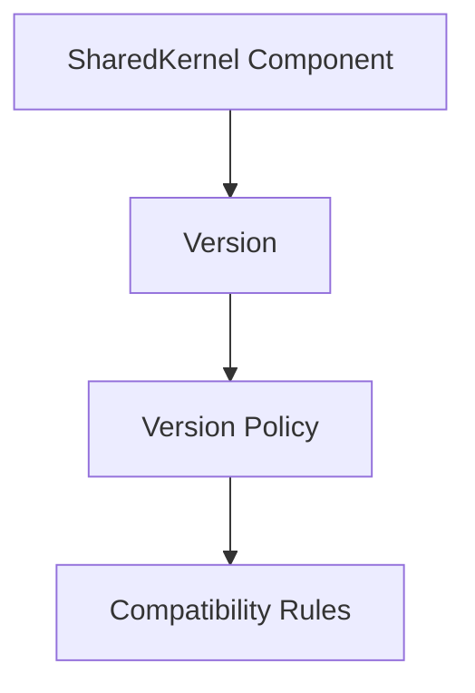

Versioning provides the architectural contract governing software evolution.

---

## Guiding Principles

The Versioning subsystem is based upon the following principles:

- deterministic version comparison;
- explicit compatibility policies;
- semantic version evolution;
- immutable version representations;
- framework independence;
- backward compatibility by default;
- predictable architectural growth.

These principles ensure that software evolution remains safe and understandable.

---

## Relationship with Other SharedKernel Modules

The Versioning subsystem complements several other architectural modules, including:

- `Results`
- `Validation`
- `Events`
- `Specifications`
- `Globalization`
- `Time`

Each module evolves independently while following the same versioning strategy.

---

## Architectural Importance

Without a standardized versioning model, software evolution quickly becomes inconsistent.

The Versioning subsystem establishes:

- common version semantics;
- stable compatibility rules;
- predictable upgrade paths;
- long-term maintainability.

It therefore becomes one of the foundational architectural services of KUKULCAN.SharedKernel.

---

## Intended Audience

This document is intended for:

- software architects;
- framework developers;
- SharedKernel maintainers;
- library authors;
- API designers;
- enterprise application developers.

It serves as the authoritative specification for version management within KUKULCAN.SharedKernel.

---

## Expected Outcomes

After implementing this subsystem, every SharedKernel component should:

- expose a consistent version representation;
- evolve predictably;
- preserve compatibility whenever possible;
- communicate breaking changes explicitly;
- support deterministic version comparison;
- remain extensible for future architectural evolution.

These capabilities collectively provide a robust and sustainable foundation for long-term software evolution.

# 2. Philosophy

The **Versioning** subsystem is founded on the principle that software evolves continuously, but that evolution must occur in a **controlled, predictable, and deterministic** manner.

In enterprise systems, change is inevitable. New features are introduced, defects are corrected, architectural improvements are implemented, and obsolete functionality is removed. Without a clear versioning strategy, these changes become difficult to understand, impossible to predict, and costly to maintain.

Versioning provides the architectural language that describes software evolution.

---

## Architectural Philosophy

Software should evolve without surprising its consumers.

> **Every version communicates intent, compatibility, and architectural evolution.**

A version number is not merely metadata—it is a contract between a component and every system that depends upon it.

---

# Predictable Evolution

Every released version should communicate exactly what has changed.

Consumers should be able to determine whether upgrading is:

- completely safe;
- potentially impactful;
- architecturally breaking.

Version identifiers therefore become part of the public API.

---

# Explicit Compatibility

Compatibility must never be inferred.

Instead, compatibility should be explicitly communicated through version semantics.

For example:

```text
1.4.2

↓

Safe Bug Fix
```

```text
1.5.0

↓

Backward-Compatible Feature
```

```text
2.0.0

↓

Breaking Change
```

Consumers can make informed upgrade decisions.

---

# Stability Before Innovation

The architecture prioritizes stability over rapid change.

Existing consumers should continue functioning whenever reasonably possible.

New functionality should extend existing behavior instead of replacing it.

Architectural evolution should therefore be incremental.

---

# Version as a Contract

A published version represents a commitment.

Once released:

- public contracts become stable;
- documented behavior becomes expected behavior;
- compatibility becomes part of the architecture.

Changing public behavior without changing the version violates this contract.

---

# Deterministic Comparison

Versions should always compare deterministically.

Given two versions:

```text
1.2.0

1.10.0
```

Every implementation should produce the same ordering.

Version comparison must never depend on:

- operating system;
- culture;
- framework;
- implementation details.

---

# Immutability

Versions are immutable value objects.

Once created:

```text
Version

↓

Immutable
```

Its components never change.

Immutability guarantees:

- thread safety;
- deterministic comparison;
- reproducible execution.

---

# Framework Independence

Versioning should never depend upon:

- .NET runtime behavior;
- NuGet implementation;
- package managers;
- CI/CD platforms;
- operating systems.

Those systems may consume version information, but they do not define its architecture.

---

# Backward Compatibility

Backward compatibility is the preferred evolution strategy.

Whenever possible:

```text
Existing Consumer

↓

New Version

↓

No Code Changes
```

Breaking changes should remain exceptional rather than routine.

---

# Explicit Breaking Changes

Architectural breaking changes should never be hidden.

Instead:

```text
Breaking Change

↓

Major Version

↓

Migration Guidance
```

Consumers should always understand why a major version exists.

---

# Incremental Growth

Software should evolve gradually.

Preferred evolution:

```text
1.0

↓

1.1

↓

1.2

↓

2.0
```

rather than:

```text
1.0

↓

3.0
```

Small incremental evolution minimizes migration complexity.

---

# Long-Term Maintainability

Versioning exists to support software over many years.

It should simplify:

- maintenance;
- upgrades;
- dependency management;
- compatibility analysis;
- architectural governance.

Good versioning reduces long-term technical debt.

---

# Shared Understanding

Every architect and developer should interpret version numbers identically.

For example:

```text
MAJOR

↓

Breaking Change
```

```text
MINOR

↓

New Compatible Feature
```

```text
PATCH

↓

Bug Fix
```

This shared understanding improves communication across teams.

---

# Architectural Consistency

Every SharedKernel module follows the same versioning philosophy.

Examples include:

- Results
- Validation
- Events
- Specifications
- Globalization
- Time
- Versioning

A consistent strategy simplifies dependency management across the platform.

---

# Evolution Without Chaos

Versioning enables continuous improvement while preventing uncontrolled architectural drift.

Each new release should answer three questions:

- What changed?
- Is it compatible?
- Should consumers upgrade?

If these answers are unclear, the versioning strategy has failed.

---

# Architectural Characteristics

The philosophy of Versioning emphasizes:

- predictability;
- determinism;
- explicit compatibility;
- immutable representations;
- controlled evolution;
- architectural stability;
- framework independence.

These principles provide the foundation upon which every subsequent section of this specification is built.

---

# Guiding to Statement

The Versioning subsystem exists to ensure that software evolution is communicated as clearly as software functionality itself.

A version is therefore not merely an identifier—it is an architectural promise that defines compatibility, communicates intent, and enables sustainable long-term evolution throughout the KUKULCAN.SharedKernel ecosystem.

# 3. Design Goals

The **Versioning** subsystem has been designed to provide a consistent, deterministic, and extensible architectural model for software version management throughout **KUKULCAN.SharedKernel**.

These design goals establish the criteria that every versioning component should satisfy and guide all future evolution of the subsystem.

---

## Architectural Principle

Versioning should communicate architectural intent while remaining simple, deterministic, and extensible.

> **A version should describe both identity and compatibility.**

---

# Primary Objectives

The Versioning subsystem has the following primary objectives:

- represent software versions consistently;
- support deterministic comparison;
- preserve backward compatibility;
- simplify architectural evolution;
- minimize migration costs;
- provide framework-independent abstractions.

Every architectural decision within the subsystem supports one or more of these objectives.

---

# Consistency

Every SharedKernel component should represent versions using the same architectural model.

Examples include:

- assemblies;
- packages;
- APIs;
- contracts;
- modules.

Consistency simplifies:

- dependency management;
- maintenance;
- documentation;
- interoperability.

---

# Deterministic Comparison

Version comparison should always produce identical results.

Given identical versions:

```text
1.2.5

↓

Compare

↓

1.10.0
```

every implementation should produce the same ordering.

Comparison must never depend upon:

- operating system;
- runtime;
- culture;
- implementation details.

---

# Semantic Evolution

The subsystem adopts semantic versioning as its default evolution strategy.

Each component of a version communicates architectural intent.

```text
MAJOR

↓

Breaking Change
```

```text
MINOR

↓

Backward-Compatible Feature
```

```text
PATCH

↓

Bug Fix
```

Semantic evolution improves predictability.

---

# Backward Compatibility

Backward compatibility should be preserved whenever reasonably possible.

Preferred evolution:

```text
Consumer

↓

New Version

↓

Works
```

Breaking changes should require explicit architectural justification.

---

# Extensibility

The subsystem should support future growth without requiring modifications to existing public contracts.

Future extensions may include:

- custom version policies;
- enterprise version schemes;
- build metadata;
- release channels;
- compatibility profiles.

Extensions should remain additive.

---

# Immutability

Version representations should be immutable.

Once created:

```text
Version

↓

Immutable
```

its components never change.

Immutability guarantees:

- deterministic behavior;
- thread safety;
- reproducible execution.

---

# Framework Independence

Versioning abstractions should remain independent of:

- .NET runtime features;
- NuGet;
- package repositories;
- build systems;
- deployment pipelines.

External tools may consume version information but should never define its architecture.

---

# Explicit Compatibility

Compatibility should be expressed through architectural rules rather than inferred.

Consumers should immediately understand whether a version change is:

- compatible;
- partially compatible;
- breaking.

Explicit compatibility reduces upgrade uncertainty.

---

# Stable Public Contracts

Public versioning contracts should remain stable across releases.

Examples include:

- `Version`
- `SemanticVersion`
- `VersionRange`
- `VersionPolicy`

Stable contracts simplify long-term maintenance.

---

# Dependency Management

The subsystem should simplify dependency resolution.

Architectural support includes:

- version comparison;
- compatibility evaluation;
- version ranges;
- policy validation.

Dependency management should remain deterministic.

---

# Readability

Version information should be easy for both humans and software to understand.

Examples:

```text
1.0.0
```

```text
2.3.5
```

Readable versions improve communication between teams.

---

# Performance

Version operations should remain lightweight.

Typical operations include:

- parsing;
- comparison;
- ordering;
- compatibility evaluation.

These operations should require minimal computational overhead.

---

# Testability

Every component should be independently testable.

Version behavior should be verifiable through deterministic unit tests.

Tests should never depend upon:

- operating system;
- runtime configuration;
- external services.

---

# Long-Term Maintainability

The subsystem should remain maintainable over many years.

Its architecture should support:

- incremental enhancement;
- predictable upgrades;
- minimal breaking changes;
- architectural stability.

Long-term sustainability is a primary design objective.

---

# Enterprise Scalability

The Versioning subsystem should support:

- single applications;
- modular systems;
- distributed architectures;
- microservices;
- enterprise platforms.

Its abstractions should scale without architectural redesign.

---

# Architectural Characteristics

The design goals emphasize:

- consistency;
- determinism;
- semantic evolution;
- backward compatibility;
- immutability;
- extensibility;
- framework independence;
- enterprise scalability.

These characteristics define the expected quality of every Versioning component.

---

# Design Constraints

The subsystem should satisfy the following design constraints.

- Use immutable value objects.
- Preserve deterministic comparison.
- Follow Semantic Versioning by default.
- Prefer extension to modification.
- Preserve stable public contracts.
- Remain framework independent.
- Support future architectural evolution.

These constraints guide every implementation within the subsystem.

---

# Design Philosophy Summary

The Versioning subsystem is intentionally designed to make software evolution:

- understandable;
- predictable;
- compatible;
- maintainable;
- extensible.

Every version becomes an architectural statement describing both the identity of a component and the expectations surrounding its evolution throughout the KUKULCAN.SharedKernel ecosystem.

# 4. Architectural Goals

The **Versioning** subsystem establishes the architectural objectives that govern the evolution of every reusable component within **KUKULCAN.SharedKernel**.

These goals extend beyond simple version numbering. They define how software should evolve over time while preserving stability, compatibility, maintainability, and predictability across the entire platform.

Every architectural decision within this subsystem should contribute to one or more of these goals.

---

## Architectural Principle

Software evolution should be predictable, measurable, and architecturally controlled.

> **Versioning exists to manage change without sacrificing stability.**

---

# Architectural Vision

The Versioning subsystem aims to provide a unified architectural model capable of supporting:

- independent module evolution;
- long-term maintainability;
- stable public contracts;
- enterprise-scale dependency management;
- deterministic compatibility analysis.

The subsystem becomes the architectural authority for software evolution.

---

# Goal 1 — Standardize Version Representation

Every SharedKernel component should represent versions identically.

Examples include:

- libraries;
- APIs;
- contracts;
- packages;
- modules.

A unified representation eliminates ambiguity and simplifies interoperability.

---

# Goal 2 — Preserve Architectural Stability

Architectural stability should always take precedence over rapid change.

The preferred evolution model is:

```text
Stable Contract

↓

Incremental Evolution

↓

Stable Contract
```

Consumers should experience minimal disruption across releases.

---

# Goal 3 — Enable Predictable Evolution

Every version should communicate the nature of the change.

Example:

```text
PATCH

↓

Correction
```

```text
MINOR

↓

Compatible Feature
```

```text
MAJOR

↓

Breaking Change
```

Consumers should understand upgrade implications without inspecting source code.

---

# Goal 4 — Minimize Breaking Changes

Breaking changes should remain exceptional.

Whenever possible:

```text
Existing Consumer

↓

New Version

↓

No Changes Required
```

Major versions should occur only when architectural compatibility cannot reasonably be preserved.

---

# Goal 5 — Support Independent Module Evolution

Each SharedKernel module should evolve independently.

Examples:

- Results
- Validation
- Events
- Globalization
- Specifications
- Time

Independent evolution reduces unnecessary coupling between modules.

---

# Goal 6 — Establish Deterministic Compatibility

Compatibility evaluation should always produce identical results.

Given:

```text
Version A

↓

Compatibility Rules

↓

Version B
```

every implementation should produce the same compatibility decision.

---

# Goal 7 — Maintain Stable Public Contracts

Public abstractions should remain stable over time.

Examples include:

- interfaces;
- abstract classes;
- immutable value objects;
- service contracts.

Stable contracts reduce migration costs.

---

# Goal 8 — Encourage Extension

Architectural evolution should favor extension over modification.

Preferred:

```text
Existing Contract

↓

Additional Capability
```

Avoid replacing established abstractions unless absolutely necessary.

---

# Goal 9 — Support Enterprise Dependency Management

Versioning should simplify dependency analysis.

Architectural support includes:

- version comparison;
- compatibility evaluation;
- version ranges;
- policy enforcement.

Dependency resolution should remain deterministic and transparent.

---

# Goal 10 — Preserve Framework Independence

Versioning should remain independent of:

- package managers;
- CI/CD systems;
- deployment pipelines;
- operating systems;
- runtime implementations.

The architectural model remains valid regardless of infrastructure technology.

---

# Goal 11 — Promote Long-Term Sustainability

The subsystem should remain maintainable throughout many years of software evolution.

It should support:

- incremental releases;
- predictable migrations;
- compatibility preservation;
- architectural governance.

Long-term sustainability is a fundamental objective.

---

# Goal 12 — Simplify Testing

Every versioning component should be independently testable.

Version comparison and compatibility evaluation should produce deterministic results without requiring external infrastructure.

Testing should remain simple and reproducible.

---

# Goal 13 — Improve Communication

Version numbers should communicate architectural intent.

Rather than merely identifying releases, versions should describe:

- compatibility;
- stability;
- evolution;
- architectural impact.

Version identifiers become part of the ubiquitous language of the platform.

---

# Goal 14 — Enable Future Growth

The subsystem should remain sufficiently flexible to support future architectural requirements.

Examples include:

- enterprise version policies;
- release channels;
- compatibility profiles;
- custom metadata;
- alternative version schemes.

Future capabilities should require minimal architectural disruption.

---

# Architectural Characteristics

The Versioning subsystem strives to provide:

- deterministic behavior;
- architectural stability;
- semantic evolution;
- explicit compatibility;
- immutable abstractions;
- framework independence;
- enterprise scalability.

These characteristics collectively define the quality objectives of the subsystem.

---

# Architectural Alignment

The Versioning subsystem aligns with the architectural principles adopted throughout **KUKULCAN.SharedKernel**:

- Domain-Driven Design;
- Clean Architecture;
- SOLID;
- Separation of Concerns;
- Dependency Inversion;
- Explicit Modeling.

This alignment ensures consistency across every SharedKernel module.

---

# Architectural Goals Summary

| Goal            | Objective                           |
|-----------------|-------------------------------------|
| Standardization | Uniform version representation      |
| Stability       | Preserve architectural consistency  |
| Predictability  | Semantic software evolution         |
| Compatibility   | Minimize breaking changes           |
| Independence    | Framework-neutral abstractions      |
| Extensibility   | Future architectural growth         |
| Determinism     | Consistent compatibility evaluation |
| Scalability     | Enterprise-ready evolution          |

---

# Architectural Objective

The ultimate objective of the Versioning subsystem is to provide a deterministic architectural foundation that enables software to evolve continuously while preserving compatibility, stability, maintainability, and consumer confidence throughout the entire lifecycle of the KUKULCAN.SharedKernel ecosystem.

# 5. Versioning Fundamentals

**Versioning Fundamentals** define the core architectural concepts upon which the **Versioning** subsystem of **KUKULCAN.SharedKernel** is built.

These concepts establish a common language for describing software evolution, compatibility, and identity. They provide the conceptual framework required to implement deterministic version comparison, semantic evolution, and long-term architectural stability.

Every subsequent component of the subsystem builds upon these fundamentals.

---

## Architectural Principle

A version is an immutable architectural identifier that communicates both identity and compatibility.

> **Versions describe software evolution, not merely software releases.**

---

# What Is a Version?

A version is a structured identifier representing a specific state of a software component.

Conceptually:

```text
Component

↓

Version

↓

Architectural Identity
```

The version uniquely identifies the published behavior of the component.

---

# Version Identity

Each published component should possess exactly one version.

For example:

```text
KUKULCAN.SharedKernel.Validation

↓

1.4.2
```

The version identifies the component independently of its implementation.

---

# Version as a Contract

A published version represents an architectural contract.

That contract defines:

- observable behavior;
- compatibility expectations;
- supported public APIs;
- architectural guarantees.

Consumers depend upon this contract rather than internal implementation details.

---

# Immutable Representation

Versions are immutable.

Once published:

```text
Version

↓

Immutable
```

its value never changes.

Any modification to software behavior results in a new version rather than changing an existing one.

---

# Semantic Meaning

Every version conveys architectural meaning.

For Semantic Versioning:

```text
MAJOR.MINOR.PATCH
```

each component communicates:

- compatibility;
- scope of change;
- expected migration effort.

Versions therefore carry semantic information in addition to identity.

---

# Ordered Evolution

Software versions form an ordered sequence.

Example:

```text
1.0.0

↓

1.1.0

↓

1.2.3

↓

2.0.0
```

Each version represents a later stage in architectural evolution.

---

# Deterministic Comparison

Two versions must always compare consistently.

Example:

```text
1.9.0

↓

Less Than

↓

1.10.0
```

Comparison results must remain identical across:

- operating systems;
- cultures;
- frameworks;
- implementations.

---

# Compatibility

Versions define compatibility relationships.

Conceptually:

```text
Version A

↓

Compatibility Rules

↓

Version B
```

Compatibility evaluation should always be deterministic and explicit.

---

# Stability

Once released, a version becomes stable.

Its observable behavior should never change.

Corrections and enhancements require publishing a new version rather than modifying an existing release.

---

# Evolution

Software evolves by publishing successive versions.

Each version represents one architectural milestone.

Preferred evolution:

```text
Version

↓

Enhancement

↓

New Version
```

rather than replacing an existing release.

---

# Public Versus Internal Changes

Not every implementation change requires a version change.

Examples of internal modifications include:

- performance improvements;
- refactoring;
- implementation optimization.

Only changes affecting observable behavior influence version semantics.

---

# Backward Compatibility

Backward compatibility remains the preferred evolution strategy.

Conceptually:

```text
Existing Consumer

↓

New Compatible Version

↓

Continues Working
```

Maintaining compatibility minimizes migration effort.

---

# Breaking Changes

Breaking changes alter published contracts.

Examples include:

- removed APIs;
- incompatible signatures;
- changed observable behavior.

Breaking changes require explicit architectural communication.

---

# Version Independence

A version should remain independent of:

- deployment environments;
- package repositories;
- build systems;
- runtime implementations.

The version identifies software, not infrastructure.

---

# Explicit Version Policies

Every published component should follow an explicit versioning policy.

Typical policies define:

- compatibility rules;
- release strategy;
- deprecation lifecycle;
- evolution guidelines.

Explicit policies improve architectural consistency.

---

# Traceability

Versions enable architectural traceability.

They allow teams to identify:

- when functionality changed;
- which contracts evolved;
- compatibility boundaries;
- migration paths.

Traceability supports long-term maintenance.

---

# Architectural Characteristics

Versioning Fundamentals establish:

- immutable version identity;
- deterministic comparison;
- semantic evolution;
- explicit compatibility;
- architectural traceability;
- framework independence.

These characteristics define the conceptual foundation of the subsystem.

---

# Fundamental Constraints

The Versioning subsystem shall satisfy the following fundamental constraints.

- Represent versions as immutable value objects.
- Preserve deterministic ordering.
- Communicate semantic architectural intent.
- Maintain explicit compatibility rules.
- Separate identity from implementation.
- Remain framework independent.

Violating these constraints compromises architectural predictability.

---

# Fundamental Model

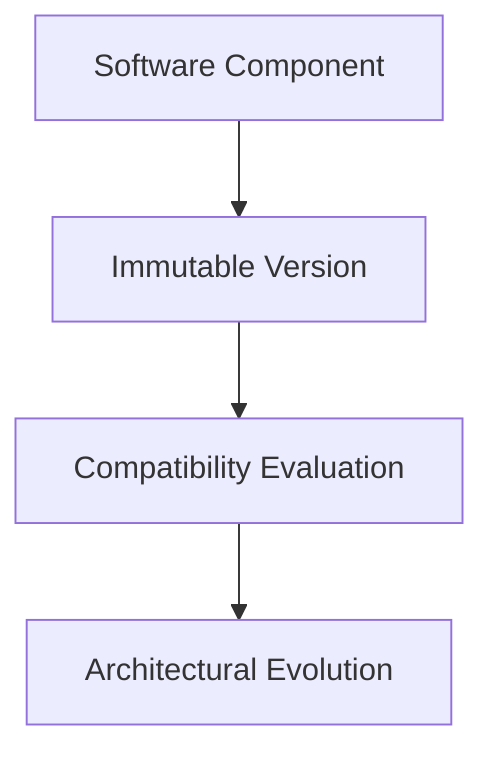

The version becomes the architectural foundation for compatibility and evolution.

---

# Architectural Invariant

> **Every software component within KUKULCAN.SharedKernel shall possess exactly one immutable architectural version that uniquely identifies its published behavior, communicates explicit semantic compatibility, participates in deterministic comparison, supports traceable architectural evolution, and remains completely independent of implementation details, deployment environments, runtime technologies, and infrastructure concerns in accordance with the principles of Domain-Driven Design and Clean Architecture.**

This invariant defines the architectural foundation of Versioning.

# 6. Versioning Taxonomy

The **Versioning Taxonomy** defines the conceptual classification of all architectural elements that participate in software version management within **KUKULCAN.SharedKernel**.

Rather than treating versioning as a single value, the subsystem separates version-related responsibilities into distinct concepts. This separation improves clarity, extensibility, maintainability, and long-term architectural evolution.

Each concept represents a specific responsibility within the overall versioning model.

---

## Architectural Principle

Different versioning responsibilities should be represented by different architectural abstractions.

> **A versioning concept should have exactly one architectural responsibility.**

---

# Taxonomy Overview

The Versioning subsystem is organized into the following conceptual categories.

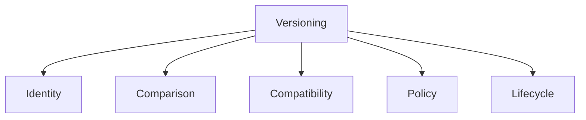

Each category defines one aspect of software evolution.

---

# Identity

Identity uniquely identifies a published software version.

Representative abstractions include:

- `Version`
- `SemanticVersion`
- `VersionIdentifier`

Identity answers the question:

> **Which version is this?**

Identity never evaluates compatibility.

---

# Comparison

Comparison determines the ordering between versions.

Representative abstractions include:

- `VersionComparer`

Comparison answers:

> **Which version is newer?**

Comparison never determines compatibility.

Example:

```text
1.4.0

↓

Less Than

↓

1.5.0
```

---

# Compatibility

Compatibility determines whether two versions may safely interact.

Representative abstractions include:

- `CompatibilityLevel`
- `VersionRange`

Compatibility answers:

> **Can these versions work together?**

Compatibility differs from ordering.

---

# Policy

Policies define architectural rules governing version evolution.

Representative abstractions include:

- `VersionPolicy`

Policies answer:

> **How should versions evolve?**

Typical rules include:

- Semantic Versioning
- Compatibility requirements
- Deprecation strategy

---

# Lifecycle

Lifecycle describes the progression of software releases.

Typical stages include:

```text
Development

↓

Preview

↓

Stable

↓

Deprecated

↓

Retired
```

Lifecycle concerns evolution rather than version identity.

---

# Parsing

Parsing transforms textual representations into immutable version objects.

Representative abstraction:

- `VersionParser`

Example:

```text
"1.5.2"

↓

SemanticVersion
```

Parsing should always be deterministic.

---

# Representation

Version representation defines how versions are expressed.

Typical representations include:

```text
1.0.0
```

```text
2.4.1-beta
```

```text
3.0.0+build.42
```

Representation is independent of comparison.

---

# Ordering

Ordering establishes a total order among versions.

Conceptually:

```text
1.0.0

↓

1.1.0

↓

2.0.0
```

Ordering is deterministic and transitive.

---

# Evolution

Evolution describes architectural growth over time.

Conceptually:

```text
Version

↓

Enhancement

↓

New Version
```

Evolution is governed by explicit policies.

---

# Stability

Stability indicates the maturity of a version.

Typical classifications include:

- preview;
- release candidate;
- stable;
- deprecated.

Stability does not alter version identity.

---

# Compatibility Levels

Compatibility may be classified into several levels.

Typical examples:

```text
Fully Compatible
```

```text
Partially Compatible
```

```text
Incompatible
```

Compatibility evaluation should remain deterministic.

---

# Dependency Relationships

Versions participate in dependency graphs.

Example:

```text
Library A

↓

Depends On

↓

Library B

↓

Version Range
```

Dependency evaluation belongs to compatibility analysis.

---

# Semantic Classification

Semantic Versioning introduces three architectural dimensions.

```text
Major
```

Architectural compatibility.

```text
Minor
```

Feature evolution.

```text
Patch
```

Corrective evolution.

These dimensions collectively describe software growth.

---

# Architectural Independence

Each taxonomy category remains independent.

For example:

- comparison does not parse versions;
- parsing does not evaluate compatibility;
- lifecycle does not compare versions;
- identity does not define policy.

Single Responsibility Principle is preserved.

---

# Extensibility

Future taxonomy categories may include:

- release channels;
- feature flags;
- support windows;
- compatibility matrices;
- enterprise version profiles.

New concepts should extend the taxonomy rather than modify existing categories.

---

# Architectural Characteristics

The Versioning Taxonomy provides:

- conceptual clarity;
- explicit responsibilities;
- deterministic behavior;
- extensibility;
- maintainability;
- framework independence.

These characteristics simplify long-term architectural evolution.

---

# Taxonomy Summary

| Category       | Responsibility             |
|----------------|----------------------------|
| Identity       | Identify a version         |
| Comparison     | Order versions             |
| Compatibility  | Evaluate interoperability  |
| Policy         | Define evolution rules     |
| Lifecycle      | Describe release stages    |
| Parsing        | Convert text into versions |
| Representation | Express version values     |

Each category addresses a distinct architectural concern.

---

# Architectural Guideline

Every version-related abstraction within KUKULCAN.SharedKernel should belong to exactly one taxonomy category.

If a component simultaneously performs:

- parsing;
- comparison;
- compatibility evaluation;
- lifecycle management;

it should be decomposed into separate architectural responsibilities.

---

# Architectural Invariant

> **Every version-related abstraction within KUKULCAN.SharedKernel shall belong to a single well-defined conceptual category whose responsibility is limited to one aspect of software version management—such as identity, comparison, compatibility, policy, parsing, representation, or lifecycle—thereby preserving deterministic behavior, conceptual clarity, extensibility, framework independence, and compliance with the principles of Domain-Driven Design, Clean Architecture, and the Single Responsibility Principle.**

This invariant defines the conceptual organization of the Versioning subsystem.

# 7. Core Components

The **Core Components** define the fundamental architectural building blocks of the **Versioning** subsystem within **KUKULCAN.SharedKernel**.

Together, these components provide the complete infrastructure required to represent software versions, compare them, evaluate compatibility, parse textual representations, and govern architectural evolution.

Each component has a single, clearly defined responsibility and collaborates with the others through immutable contracts and deterministic behavior.

---

## Architectural Principle

Every core component should represent one architectural responsibility.

> **Versioning is achieved through collaboration between small, immutable, and specialized components.**

---

# Architectural Overview

The Versioning subsystem is composed of the following core abstractions.

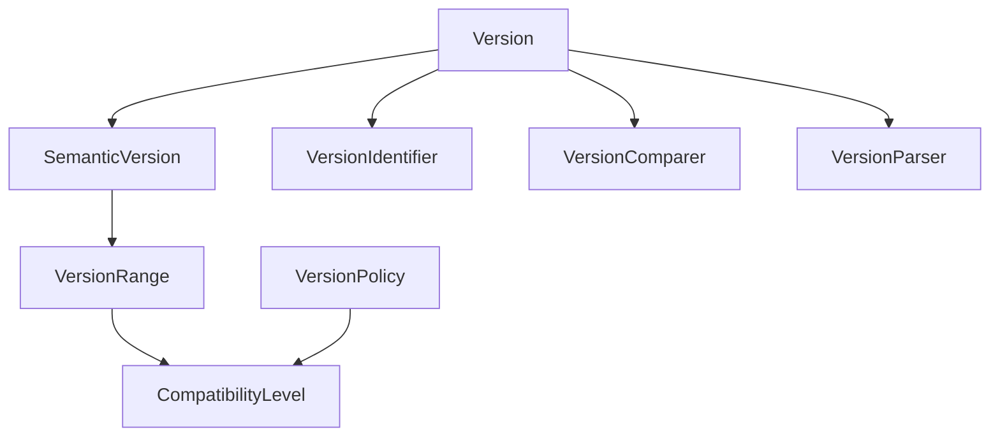

Each abstraction fulfills one architectural role.

---

# Component Responsibilities

The subsystem consists of eight primary components.

| Component            | Responsibility                                        |
|----------------------|-------------------------------------------------------|
| `Version`            | Represents an immutable software version              |
| `SemanticVersion`    | Implements Semantic Versioning semantics              |
| `VersionRange`       | Represents acceptable version intervals               |
| `VersionIdentifier`  | Uniquely identifies a versioned artifact              |
| `CompatibilityLevel` | Describes compatibility relationships                 |
| `VersionPolicy`      | Defines architectural evolution rules                 |
| `VersionComparer`    | Performs deterministic version comparison             |
| `VersionParser`      | Converts textual representations into version objects |

Each responsibility is intentionally isolated.

---

# Component Collaboration

The components collaborate while remaining loosely coupled.

Typical workflow:

```text
Text

↓

VersionParser

↓

SemanticVersion

↓

VersionComparer

↓

CompatibilityLevel

↓

VersionPolicy
```

No component performs multiple unrelated responsibilities.

---

# Immutability

Every value-oriented component should be immutable.

Examples include:

- `Version`
- `SemanticVersion`
- `VersionRange`
- `VersionIdentifier`

Once created, these objects never change.

Immutability guarantees:

- deterministic behavior;
- thread safety;
- reproducible comparisons.

---

# Deterministic Behavior

Every component should produce deterministic results.

Given identical inputs:

```text
Input

↓

Component

↓

Result
```

the output shall always be identical.

Determinism is fundamental to reliable dependency management.

---

# Independence

Core components should remain independent of:

- package managers;
- deployment systems;
- source control;
- build pipelines;
- runtime implementations.

They represent architectural concepts rather than infrastructure services.

---

# Explicit Collaboration

Components collaborate explicitly.

Example:

```text
VersionParser

↓

SemanticVersion

↓

VersionComparer
```

rather than hidden internal dependencies.

Explicit collaboration simplifies testing and maintenance.

---

# Extensibility

The architecture allows future components to be introduced without modifying existing ones.

Potential future additions include:

- `ReleaseChannel`
- `VersionMetadata`
- `CompatibilityMatrix`
- `SupportPolicy`

New abstractions should extend the subsystem without breaking existing contracts.

---

# Layer Placement

The Versioning subsystem belongs entirely to the SharedKernel.

Conceptually:

```text
SharedKernel

└── Versioning

    ├── Version

    ├── SemanticVersion

    ├── VersionRange

    ├── VersionIdentifier

    ├── CompatibilityLevel

    ├── VersionPolicy

    ├── VersionComparer

    └── VersionParser
```

The subsystem contains only architectural abstractions and supporting logic.

---

# Dependency Direction

Dependencies should always point toward stable abstractions.

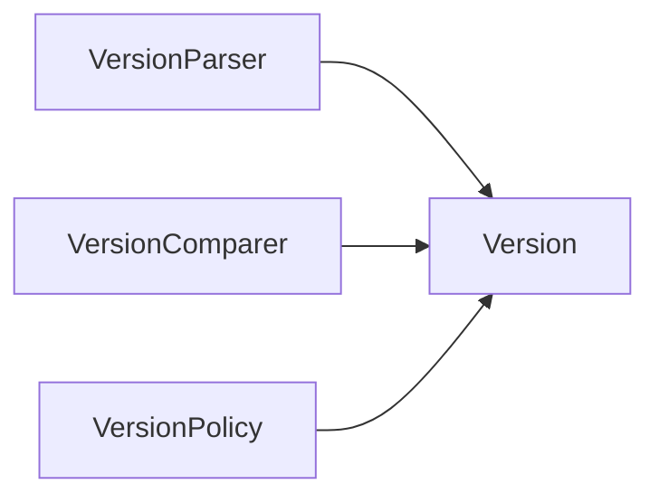

The `Version` abstraction remains the central concept.

---

# Thread Safety

Because the core components are immutable or stateless, they naturally support concurrent execution.

Preferred characteristics include:

- immutable value objects;
- stateless services;
- deterministic algorithms.

No shared mutable state should exist.

---

# Testing

Each component should be independently testable.

Typical unit tests verify:

- parsing;
- comparison;
- ordering;
- compatibility evaluation;
- range validation.

Tests remain deterministic and isolated.

---

# Architectural Characteristics

The Core Components provide:

- immutable version representations;
- deterministic comparison;
- explicit compatibility evaluation;
- semantic evolution;
- framework independence;
- enterprise scalability.

These characteristics define the architectural foundation of the Versioning subsystem.

---

# Component Summary

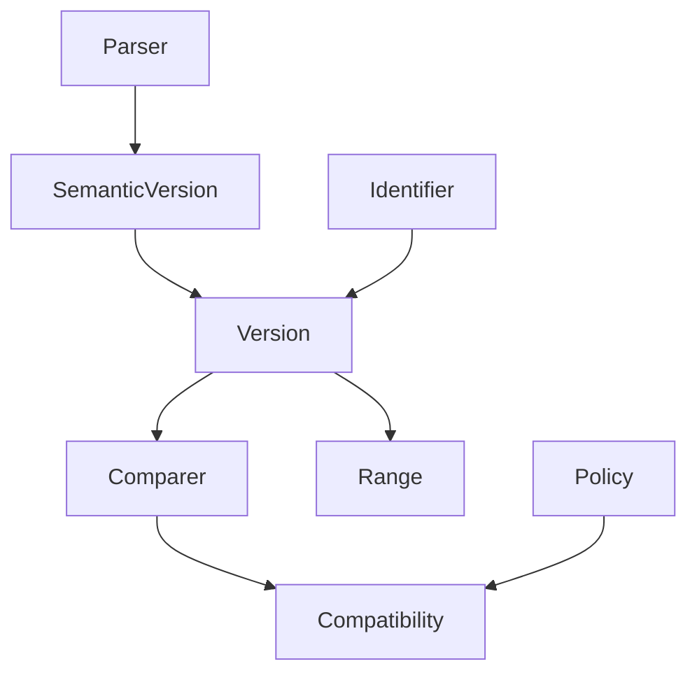

The subsystem consists of small, focused components collaborating through stable architectural contracts.

---

# Architectural Invariant

> **The Versioning subsystem of KUKULCAN.SharedKernel shall be composed of a collection of immutable value objects and stateless architectural services, each responsible for exactly one aspect of software version management—such as representation, parsing, comparison, compatibility, policy, or identification—thereby ensuring deterministic behavior, framework independence, extensibility, maintainability, and full compliance with the principles of Domain-Driven Design, Clean Architecture, and the Single Responsibility Principle.**

This invariant defines the architectural composition of the Versioning subsystem.

# 7.1. Version

The **Version** class is the fundamental value object of the **Versioning** subsystem.

It represents the immutable identity of a published software component and provides the common abstraction upon which all versioning operations are based.

Every version-aware component within **KUKULCAN.SharedKernel** ultimately depends upon this abstraction.

The `Version` class intentionally represents the architectural concept of a version rather than any specific versioning scheme. Specialized models such as `SemanticVersion` extend this abstraction by introducing additional semantics.

---

## Architectural Principle

A version is an immutable value object that uniquely identifies the published state of a software component.

> **A version describes identity before it describes compatibility.**

---

# Purpose

The `Version` abstraction exists to:

- uniquely identify published software;
- provide deterministic comparison;
- support immutable version representation;
- serve as the base abstraction for specialized version models;
- enable compatibility evaluation;
- provide architectural stability.

It is the cornerstone of the Versioning subsystem.

---

# Architectural Position

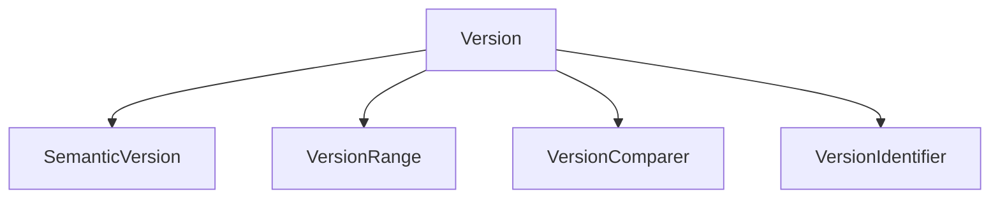

`Version` occupies the central position within the subsystem.

---

# Responsibilities

The `Version` abstraction is responsible for:

- representing version identity;
- exposing immutable version components;
- supporting deterministic ordering;
- participating in equality comparison;
- providing stable textual representation.

It is **not** responsible for:

- compatibility policies;
- parsing text;
- dependency resolution;
- release management;
- package publication.

Those concerns belong to specialized components.

---

# Value Object

`Version` is a Value Object.

Its identity is determined exclusively by its contents.

Conceptually:

```text
Version

↓

Immutable Components

↓

Equality
```

No external identity exists.

---

# Immutability

Instances are immutable.

Once created:

```text
Version

↓

Immutable
```

their values never change.

Any modification produces a new instance rather than mutating an existing one.

---

# Identity

Each instance uniquely identifies one published software state.

Example:

```text
1.4.2
```

This identifier remains stable throughout the lifetime of the published artifact.

---

# Equality

Two versions are equal when all version components are equal.

Example:

```text
1.2.3

=

1.2.3
```

Equality never depends upon:

- reference identity;
- runtime;
- framework;
- memory location.

---

# Ordering

Versions support deterministic ordering.

Example:

```text
1.2.0

↓

Less Than

↓

1.3.0
```

Ordering remains transitive and culture independent.

---

# Comparison

The comparison model should satisfy:

- reflexivity;
- antisymmetry;
- transitivity;
- total ordering.

These mathematical properties guarantee deterministic sorting.

---

# Representation

Every version possesses a canonical textual representation.

Example:

```text
2.1.4
```

The textual representation should be stable and deterministic.

---

# Framework Independence

`Version` should not depend upon:

- `System.Version`;
- NuGet;
- package managers;
- build systems;
- runtime-specific version models.

It represents an architectural abstraction rather than a framework implementation.

---

# Collaboration

`Version` collaborates with:

- `SemanticVersion`
- `VersionComparer`
- `VersionRange`
- `VersionIdentifier`

It remains independent of parsing and policy evaluation.

---

# Thread Safety

Because `Version` is immutable, it is naturally thread-safe.

Multiple concurrent threads may safely share the same instance.

No synchronization is required.

---

# Testing

Typical tests verify:

- equality;
- ordering;
- immutability;
- textual representation;
- comparison consistency.

Tests remain deterministic and isolated.

---

# Extensibility

The abstraction allows specialized version models.

Examples include:

- `SemanticVersion`
- enterprise version models;
- custom version identifiers.

Extensions should preserve the immutable nature of the base abstraction.

---

# Architectural Characteristics

The `Version` abstraction provides:

- immutable identity;
- deterministic ordering;
- value semantics;
- framework independence;
- thread safety;
- extensibility.

These characteristics make it the foundation of every version-aware component.

---

# Architectural Constraints

The `Version` abstraction shall satisfy the following constraints.

- Be immutable.
- Behave as a Value Object.
- Support deterministic comparison.
- Support deterministic equality.
- Remain framework independent.
- Contain no compatibility rules.
- Contain no parsing logic.

Violating these constraints compromises architectural consistency.

---

# Conceptual Model

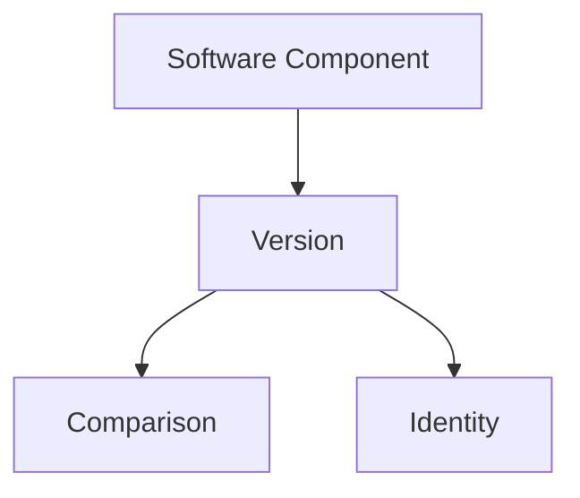

`Version` represents the immutable architectural identity of a published component.

---

# Architectural Invariant

> **Every `Version` instance within KUKULCAN.SharedKernel shall behave as an immutable Value Object that uniquely identifies the published state of a software component through deterministic equality, deterministic ordering, stable textual representation, framework-independent semantics, and explicit architectural identity while remaining free of compatibility policies, parsing behavior, mutable state, infrastructure dependencies, and implementation-specific concerns in accordance with the principles of Domain-Driven Design and Clean Architecture.**

This invariant defines the architectural contract of the `Version` abstraction.

# 7.2. SemanticVersion

The **SemanticVersion** class is the canonical implementation of the **Semantic Versioning (SemVer)** specification within the **Versioning** subsystem of **KUKULCAN.SharedKernel**.

It extends the general `Version` abstraction by introducing the semantics required to communicate software evolution, compatibility expectations, and release intent through the well-established **MAJOR.MINOR.PATCH** model.

`SemanticVersion` is the preferred version representation for every public component published by **KUKULCAN.SharedKernel**.

---

## Architectural Principle

A semantic version communicates both software identity and architectural evolution.

> **A SemanticVersion describes not only what software is published, but also how consumers should interpret its evolution.**

---

# Purpose

The `SemanticVersion` abstraction exists to:

- implement Semantic Versioning;
- communicate compatibility expectations;
- represent software evolution;
- support deterministic comparison;
- provide immutable version identity;
- standardize public version representation.

It serves as the default version model throughout the SharedKernel.

---

# Architectural Position

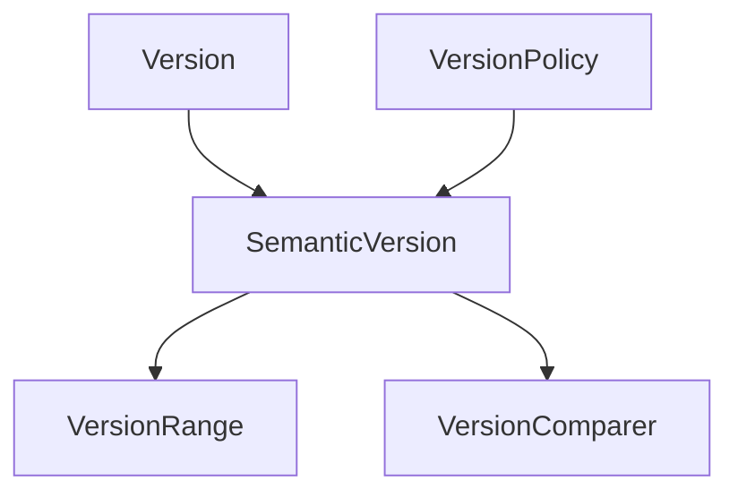

`SemanticVersion` specializes the generic `Version` abstraction.

---

# Semantic Structure

A semantic version consists of three mandatory numeric components.

```text
MAJOR.MINOR.PATCH
```

Example:

```text
2.5.3
```

Each component conveys architectural meaning.

---

# Major Version

The **Major** component represents breaking architectural changes.

Incrementing the major version indicates that previously compatible consumers may require modification.

Example:

```text
1.x.x

↓

2.0.0
```

Typical causes include:

- incompatible APIs;
- removed functionality;
- behavioral incompatibilities.

---

# Minor Version

The **Minor** component represents backward-compatible functionality.

Example:

```text
1.2.0

↓

1.3.0
```

Typical additions include:

- new features;
- additional extension points;
- new public capabilities.

Existing consumers continue functioning without modification.

---

# Patch Version

The **Patch** component represents corrective evolution.

Example:

```text
1.4.2

↓

1.4.3
```

Typical changes include:

- bug fixes;
- internal optimizations;
- documentation corrections.

Patch releases preserve compatibility.

---

# Release Metadata

Implementations may optionally support:

```text
Pre-release

Build metadata
```

Examples:

```text
2.0.0-beta
```

```text
2.0.0+build.42
```

These values provide additional release information without changing semantic compatibility.

---

# Immutability

Every `SemanticVersion` instance is immutable.

Once created:

```text
SemanticVersion

↓

Immutable
```

its components never change.

New software states require new instances.

---

# Equality

Two semantic versions are equal when all semantic components are equal.

Example:

```text
1.5.2

=

1.5.2
```

Equality is determined solely by value.

---

# Ordering

Semantic versions support deterministic ordering.

Example:

```text
1.9.0

↓

Less Than

↓

1.10.0
```

Ordering remains independent of:

- operating system;
- runtime;
- culture;
- framework.

---

# Compatibility

SemanticVersion communicates compatibility through version semantics.

Conceptually:

```text
Major

↓

Compatibility Boundary
```

```text
Minor

↓

Compatible Evolution
```

```text
Patch

↓

Corrective Evolution
```

Compatibility evaluation itself belongs to `VersionPolicy`.

---

# Collaboration

`SemanticVersion` collaborates with:

- `Version`
- `VersionComparer`
- `VersionRange`
- `VersionParser`
- `VersionPolicy`

It remains independent of parsing and policy implementation.

---

# Framework Independence

`SemanticVersion` should not depend upon:

- NuGet;
- package managers;
- build systems;
- deployment environments;
- runtime-specific version types.

It represents an architectural abstraction.

---

# Thread Safety

Because every instance is immutable, concurrent sharing is inherently safe.

No synchronization is required.

---

# Testing

Typical tests verify:

- semantic ordering;
- equality;
- immutability;
- textual representation;
- major/minor/patch comparison.

Every test should remain deterministic.

---

# Extensibility

Future enhancements may include:

- additional metadata;
- enterprise version extensions;
- release channels;
- compatibility annotations.

Extensions should preserve existing semantic behavior.

---

# Architectural Characteristics

`SemanticVersion` provides:

- semantic software evolution;
- immutable identity;
- deterministic comparison;
- framework independence;
- explicit compatibility communication;
- enterprise scalability.

These characteristics establish it as the preferred version model.

---

# Architectural Constraints

The `SemanticVersion` abstraction shall satisfy the following constraints.

- Behave as an immutable Value Object.
- Preserve Semantic Versioning semantics.
- Support deterministic ordering.
- Support deterministic equality.
- Remain framework independent.
- Contain no parsing logic.
- Contain no compatibility policy implementation.

Violating these constraints compromises architectural consistency.

---

# Conceptual Model

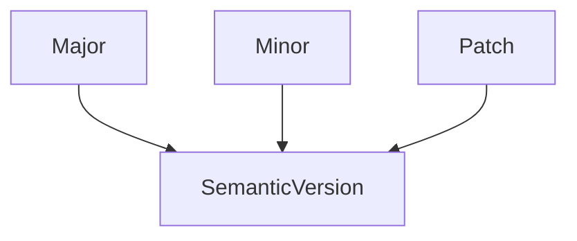

The semantic components collectively define the architectural meaning of a published version.

---

# Architectural Invariant

> **Every `SemanticVersion` instance within KUKULCAN.SharedKernel shall represent an immutable semantic software version composed of Major, Minor, and Patch components whose values uniquely identify the published state of a software component, communicate architectural evolution, preserve deterministic ordering and equality, remain framework independent, and support Semantic Versioning without embedding parsing behavior, compatibility policies, mutable state, infrastructure dependencies, or implementation-specific concerns in accordance with the principles of Domain-Driven Design and Clean Architecture.**

This invariant defines the architectural contract of the `SemanticVersion` abstraction.

# 7.3. VersionRange

The **VersionRange** class represents an immutable interval of acceptable software versions within the **Versioning** subsystem of **KUKULCAN.SharedKernel**.

Rather than identifying a single version, a `VersionRange` defines a set of versions that satisfy a particular compatibility requirement. It is primarily used for dependency management, compatibility validation, package constraints, and architectural policy enforcement.

A version range does **not** determine whether versions are compatible—that responsibility belongs to `VersionPolicy`. Instead, it answers whether a specific version lies within a predefined interval.

---

## Architectural Principle

A version range represents an immutable compatibility boundary rather than an individual software version.

> **A VersionRange defines what versions are acceptable, not how compatibility is evaluated.**

---

# Purpose

The `VersionRange` abstraction exists to:

- represent acceptable version intervals;
- constrain dependency versions;
- support deterministic range evaluation;
- simplify compatibility validation;
- provide immutable version boundaries;
- enable architectural dependency policies.

It models intervals rather than individual releases.

---

# Architectural Position

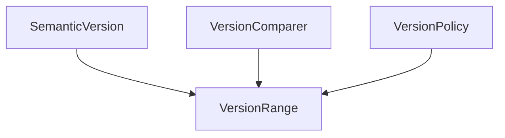

`VersionRange` collaborates with versions but does not replace them.

---

# Concept

A version range represents an interval.

Conceptually:

```text
Minimum Version

↓

Acceptable Versions

↓

Maximum Version
```

Only versions inside the interval satisfy the range.

---

# Typical Examples

Examples include:

```text
>=1.0.0
```

```text
>=1.2.0 <2.0.0
```

```text
2.x
```

```text
>=3.1.4
```

Each expression defines a different acceptable interval.

---

# Boundaries

A range may define:

- lower boundary;
- upper boundary;
- both boundaries;
- unbounded interval.

Conceptually:

```text
Lower

↓

Range

↓

Upper
```

Each boundary is immutable.

---

# Inclusive Boundaries

An inclusive boundary accepts the specified version.

Example:

```text
>=1.5.0
```

Version:

```text
1.5.0
```

is accepted.

---

# Exclusive Boundaries

An exclusive boundary excludes the specified version.

Example:

```text
<2.0.0
```

Version:

```text
2.0.0
```

is rejected.

---

# Open Ranges

Some ranges omit one boundary.

Examples:

```text
>=1.0.0
```

or

```text
<5.0.0
```

Open ranges remain valid architectural constructs.

---

# Closed Ranges

Closed ranges specify both boundaries.

Example:

```text
>=1.2.0

AND

<2.0.0
```

Only versions inside the interval satisfy the constraint.

---

# Immutable Representation

Every `VersionRange` instance is immutable.

Once constructed:

```text
VersionRange

↓

Immutable
```

its boundaries never change.

New constraints require new instances.

---

# Deterministic Evaluation

Evaluating a version against a range must always produce identical results.

Conceptually:

```text
Version

↓

VersionRange

↓

Inside / Outside
```

Evaluation is independent of:

- operating system;
- framework;
- culture;
- runtime.

---

# Equality

Two ranges are equal when:

- lower boundaries are equal;
- upper boundaries are equal;
- inclusiveness rules are identical.

Equality depends entirely on value.

---

# Collaboration

`VersionRange` collaborates with:

- `SemanticVersion`
- `VersionComparer`
- `VersionPolicy`

It never performs parsing or semantic interpretation itself.

---

# Framework Independence

`VersionRange` should remain independent of:

- NuGet version ranges;
- package managers;
- deployment platforms;
- runtime-specific dependency systems.

It models architectural constraints rather than infrastructure.

---

# Thread Safety

Because every range is immutable, instances may be safely shared between concurrent executions.

No synchronization is required.

---

# Testing

Typical unit tests verify:

- inclusive boundaries;
- exclusive boundaries;
- open intervals;
- closed intervals;
- equality;
- deterministic evaluation.

Tests should remain deterministic and reproducible.

---

# Extensibility

Future enhancements may include:

- composite ranges;
- union ranges;
- intersection ranges;
- enterprise compatibility profiles.

Extensions should preserve existing semantics.

---

# Architectural Characteristics

`VersionRange` provides:

- immutable interval representation;
- deterministic evaluation;
- framework independence;
- explicit dependency constraints;
- enterprise scalability.

These characteristics make it suitable for long-term dependency management.

---

# Architectural Constraints

The `VersionRange` abstraction shall satisfy the following constraints.

- Be immutable.
- Represent version intervals only.
- Support deterministic evaluation.
- Support deterministic equality.
- Remain framework independent.
- Contain no parsing logic.
- Contain no compatibility policy implementation.

Violating these constraints compromises architectural consistency.

---

# Conceptual Model

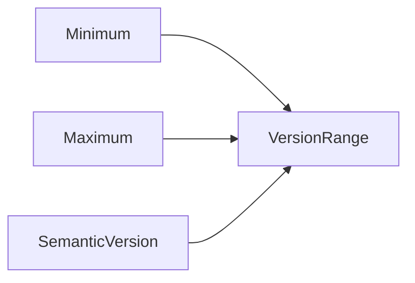

The range determines whether a version falls within its immutable boundaries.

---

# Architectural Invariant

> **Every `VersionRange` instance within KUKULCAN.SharedKernel shall represent an immutable interval of acceptable software versions whose lower and upper boundaries, inclusiveness rules, and deterministic evaluation collectively define a stable architectural constraint for dependency management while remaining independent of parsing behavior, compatibility policy implementation, infrastructure technologies, mutable state, and framework-specific versioning mechanisms in accordance with the principles of Domain-Driven Design and Clean Architecture.**

This invariant defines the architectural contract of the `VersionRange` abstraction.

# 7.4. VersionIdentifier

The **VersionIdentifier** class represents the immutable identifier that associates a software version with a specific versioned artifact within the **Versioning** subsystem of **KUKULCAN.SharedKernel**.

While a `Version` describes *which version* exists, a `VersionIdentifier` describes *which component that version belongs to*. It establishes the relationship between an artifact and its published version without introducing deployment, packaging, or infrastructure concerns.

The `VersionIdentifier` abstraction enables consistent identification of versioned entities across the SharedKernel while preserving architectural independence.

---

## Architectural Principle

A software version should always identify a specific artifact.

> **A VersionIdentifier binds an immutable version to an immutable software identity.**

---

# Purpose

The `VersionIdentifier` abstraction exists to:

- uniquely identify versioned artifacts;
- associate software identity with version information;
- support dependency analysis;
- provide deterministic artifact identification;
- remain immutable;
- remain independent of deployment technology.

It represents **artifact identity**, not compatibility.

---

# Architectural Position

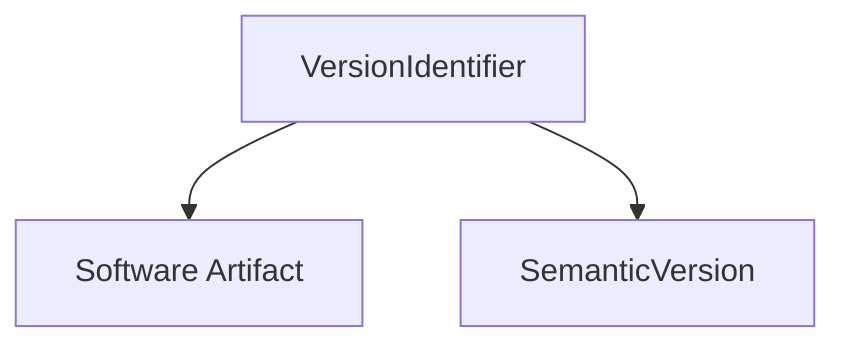

A `VersionIdentifier` connects an artifact with its published version.

---

# Concept

Conceptually:

```text
Artifact Identity

+

Version

↓

VersionIdentifier
```

The resulting object uniquely identifies one published artifact.

---

# Software Artifact

A software artifact may represent:

- SharedKernel module;
- assembly;
- package;
- API;
- reusable component;
- public library.

The abstraction intentionally avoids infrastructure-specific terminology.

---

# Identity

A `VersionIdentifier` uniquely identifies one published software artifact.

Example:

```text
KUKULCAN.SharedKernel.Validation

↓

2.3.1
```

Together they form one immutable identifier.

---

# Immutability

Every `VersionIdentifier` instance is immutable.

Once created:

```text
VersionIdentifier

↓

Immutable
```

its artifact identity and version never change.

Publishing a new version creates a new identifier.

---

# Equality

Two identifiers are equal when both:

- artifact identities;
- versions;

are equal.

Example:

```text
Validation 2.1.0

=

Validation 2.1.0
```

but

```text
Validation 2.1.0

≠

Results 2.1.0
```

Artifact identity participates in equality.

---

# Separation of Concerns

`VersionIdentifier` intentionally separates:

```text
Artifact Identity
```

from

```text
Compatibility
```

Compatibility belongs to:

- `VersionPolicy`
- `VersionRange`

The identifier merely establishes identity.

---

# Deterministic Representation

Every identifier should possess a deterministic textual representation.

Example:

```text
KUKULCAN.SharedKernel.Validation@2.3.1
```

The exact formatting may vary, but representation should remain stable.

---

# Collaboration

`VersionIdentifier` collaborates with:

- `SemanticVersion`
- `Version`
- `VersionRange`
- `VersionPolicy`

It remains independent of parsing and compatibility evaluation.

---

# Framework Independence

The abstraction should not depend upon:

- NuGet package identifiers;
- assembly metadata;
- deployment manifests;
- package repositories;
- runtime identifiers.

It models architectural identity rather than infrastructure.

---

# Thread Safety

Because every identifier is immutable, concurrent sharing is naturally safe.

No synchronization mechanisms are required.

---

# Testing

Typical tests verify:

- equality;
- immutability;
- deterministic representation;
- artifact/version association.

Every test should remain deterministic.

---

# Extensibility

Future extensions may include:

- publisher identifiers;
- organizational namespaces;
- component categories;
- repository references.

These additions should preserve the immutable nature of the abstraction.

---

# Architectural Characteristics

`VersionIdentifier` provides:

- immutable artifact identity;
- deterministic equality;
- deterministic representation;
- framework independence;
- explicit software identification;
- enterprise scalability.

These characteristics support reliable dependency analysis.

---

# Architectural Constraints

The `VersionIdentifier` abstraction shall satisfy the following constraints.

- Behave as an immutable Value Object.
- Associate exactly one artifact with exactly one version.
- Support deterministic equality.
- Support deterministic representation.
- Remain framework independent.
- Contain no compatibility logic.
- Contain no parsing behavior.

Violating these constraints compromises architectural consistency.

---

# Conceptual Model

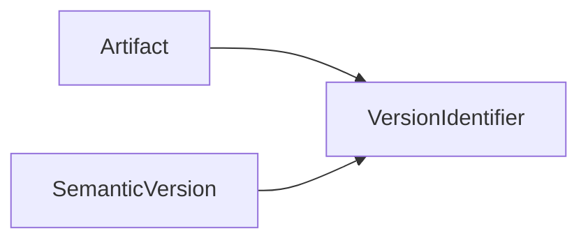

The identifier uniquely represents one published version of one software artifact.

---

# Architectural Invariant

> **Every `VersionIdentifier` instance within KUKULCAN.SharedKernel shall behave as an immutable Value Object that uniquely associates one software artifact with one immutable software version through deterministic equality, deterministic textual representation, explicit architectural identity, and framework-independent semantics while remaining free of compatibility policies, parsing behavior, mutable state, deployment-specific metadata, infrastructure dependencies, and implementation-specific concerns in accordance with the principles of Domain-Driven Design and Clean Architecture.**

This invariant defines the architectural contract of the `VersionIdentifier` abstraction.

# 7.5. CompatibilityLevel

The **CompatibilityLevel** abstraction defines the architectural classification of the compatibility relationship between two software versions within the **Versioning** subsystem of **KUKULCAN.SharedKernel**.

Unlike `VersionComparer`, which determines ordering, or `VersionRange`, which defines acceptable intervals, `CompatibilityLevel` expresses the **result** of compatibility analysis. It communicates whether two versions can safely interoperate according to the active versioning policy.

It is therefore a semantic outcome rather than a comparison algorithm.

---

## Architectural Principle

Compatibility should be represented explicitly rather than inferred.

> **Compatibility is an architectural classification, not a numerical comparison.**

---

# Purpose

The `CompatibilityLevel` abstraction exists to:

- classify compatibility relationships;
- communicate upgrade safety;
- support dependency validation;
- simplify architectural decision-making;
- standardize compatibility outcomes;
- remain independent of comparison algorithms.

It represents the conclusion of compatibility analysis.

---

# Architectural Position

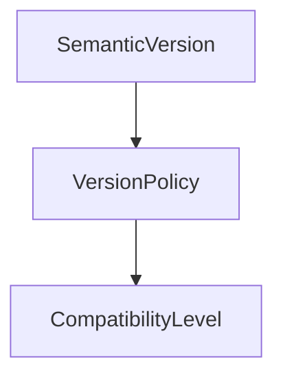

`CompatibilityLevel` is produced by policy evaluation.

---

# Concept

Conceptually:

```text
Version A

+

Version B

↓

Compatibility Evaluation

↓

CompatibilityLevel
```

The abstraction communicates the relationship between two versions.

---

# Typical Compatibility Levels

A typical implementation may define levels such as:

```text
Fully Compatible
```

```text
Backward Compatible
```

```text
Forward Compatible
```

```text
Partially Compatible
```

```text
Incompatible
```

The exact enumeration is implementation-specific, but the architectural purpose remains unchanged.

---

# Fully Compatible

Indicates that two versions may interoperate without behavioral differences.

Conceptually:

```text
Consumer

↓

Upgrade

↓

No Changes
```

This is the preferred outcome.

---

# Backward Compatible

Indicates that newer software continues supporting existing consumers.

Example:

```text
Consumer v1

↓

Library v2

↓

Works
```

Backward compatibility minimizes migration effort.

---

# Forward Compatible

Indicates that older software can understand or tolerate newer artifacts.

Although less common, some systems intentionally support forward compatibility.

---

# Partially Compatible

Indicates limited interoperability.

Typical scenarios include:

- optional features;
- degraded functionality;
- feature negotiation.

Partial compatibility requires explicit architectural documentation.

---

# Incompatible

Indicates that two versions cannot safely interoperate.

Example:

```text
Version 1.x

↓

Major Breaking Change

↓

Version 2.x
```

Consumers require migration before adoption.

---

# Explicit Classification

Compatibility should never be inferred solely from version ordering.

For example:

```text
2.1.0

>

2.0.0
```

does **not** automatically imply compatibility.

Compatibility requires explicit evaluation.

---

# Immutability

Compatibility classifications are immutable.

Once determined:

```text
CompatibilityLevel

↓

Immutable
```

the result remains unchanged.

---

# Separation of Concerns

`CompatibilityLevel` intentionally contains **no evaluation logic**.

Evaluation belongs to:

- `VersionPolicy`

The abstraction merely represents the outcome.

---

# Collaboration

`CompatibilityLevel` collaborates with:

- `SemanticVersion`
- `VersionPolicy`
- `VersionRange`

It does not collaborate directly with parsing components.

---

# Framework Independence

The abstraction remains independent of:

- package managers;
- dependency resolution frameworks;
- runtime loaders;
- deployment technologies.

It represents architectural semantics only.

---

# Thread Safety

Because compatibility levels are immutable classifications, they are naturally thread-safe.

Instances may be freely shared across concurrent executions.

---

# Testing

Typical tests verify:

- deterministic classification;
- equality;
- immutability;
- serialization;
- representation.

Evaluation algorithms are tested separately.

---

# Extensibility

Future compatibility classifications may include:

- binary compatibility;
- source compatibility;
- protocol compatibility;
- API compatibility;
- enterprise-specific compatibility profiles.

Extensions should remain additive.

---

# Architectural Characteristics

`CompatibilityLevel` provides:

- explicit compatibility semantics;
- immutable classification;
- deterministic representation;
- framework independence;
- architectural clarity.

These characteristics simplify dependency management.

---

# Architectural Constraints

The `CompatibilityLevel` abstraction shall satisfy the following constraints.

- Represent compatibility only.
- Be immutable.
- Contain no evaluation logic.
- Support deterministic equality.
- Remain framework independent.
- Preserve explicit architectural meaning.

Violating these constraints mixes policy with representation.

---

# Conceptual Model

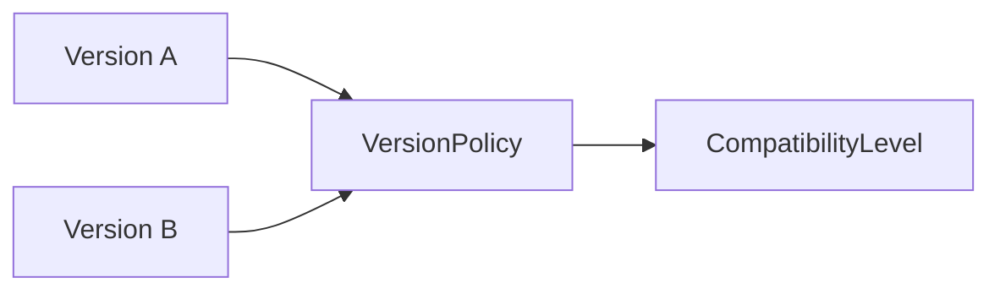

Compatibility is produced through policy evaluation and represented explicitly.

---

# Architectural Invariant

> **Every `CompatibilityLevel` instance within KUKULCAN.SharedKernel shall represent an immutable architectural classification describing the compatibility relationship between software versions, providing deterministic semantic meaning while remaining independent of comparison algorithms, version parsing, mutable state, infrastructure technologies, deployment mechanisms, and compatibility policy implementation in accordance with the principles of Domain-Driven Design and Clean Architecture.**

This invariant defines the architectural contract of the `CompatibilityLevel` abstraction.

# 7.6. VersionPolicy

The **VersionPolicy** abstraction defines the architectural rules that govern software version evolution and compatibility within the **Versioning** subsystem of **KUKULCAN.SharedKernel**.

While `SemanticVersion` represents version identity and `CompatibilityLevel` represents the result of compatibility evaluation, `VersionPolicy` defines **how that evaluation is performed**. It encapsulates the organization's versioning strategy and provides a deterministic mechanism for deciding whether two versions are considered compatible.

`VersionPolicy` therefore represents the architectural authority responsible for version compatibility.

---

## Architectural Principle

Compatibility should be determined by explicit policy rather than implicit assumptions.

> **Version evolution is governed by architectural rules, not by version numbers alone.**

---

# Purpose

The `VersionPolicy` abstraction exists to:

- define version evolution rules;
- evaluate software compatibility;
- centralize architectural versioning decisions;
- support multiple versioning strategies;
- enforce deterministic compatibility analysis;
- isolate compatibility logic from version representation.

It represents the decision-making component of the Versioning subsystem.

---

# Architectural Position

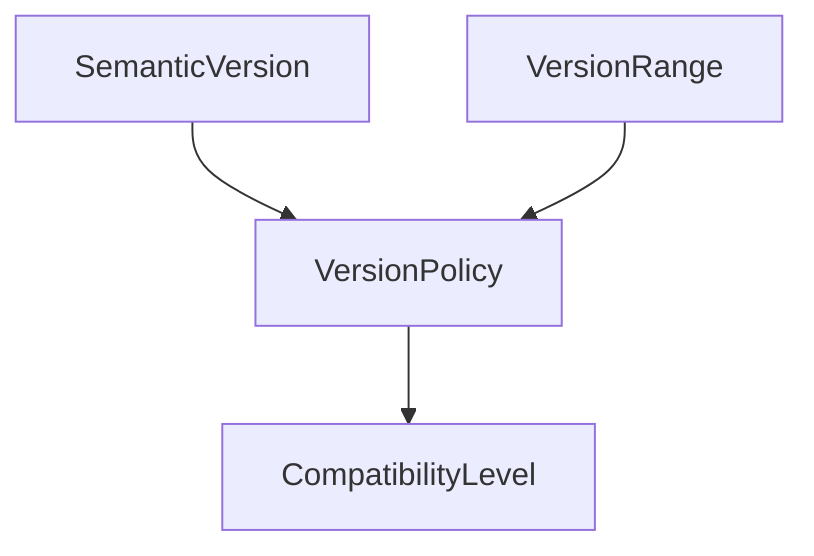

`VersionPolicy` evaluates versions and produces compatibility classifications.

---

# Responsibilities

The `VersionPolicy` abstraction is responsible for:

- evaluating compatibility;
- interpreting semantic version rules;
- enforcing architectural versioning policies;
- validating version transitions;
- determining upgrade safety.

It is **not** responsible for:

- storing versions;
- parsing versions;
- comparing versions numerically;
- representing version ranges.

Those concerns belong to specialized components.

---

# Compatibility Evaluation

Conceptually:

```text
Version A

+

Version B

↓

VersionPolicy

↓

CompatibilityLevel
```

The policy determines whether the versions may safely interoperate.

---

# Policy Independence

Different systems may adopt different compatibility strategies.

Examples include:

- strict Semantic Versioning;
- enterprise compatibility policies;
- legacy compatibility models;
- long-term support policies.

The abstraction should allow these strategies without changing the public API.

---

# Deterministic Behavior

Given identical inputs:

```text
Version A

Version B

↓

VersionPolicy

↓

Result
```

the compatibility result shall always be identical.

Deterministic behavior is essential for reproducible dependency analysis.

---

# Encapsulation

All compatibility rules belong exclusively to the policy.

Examples include:

- major version compatibility;
- minor version evolution;
- patch acceptance;
- release qualification.

Other components should never duplicate these rules.

---

# Separation of Concerns

The Versioning subsystem intentionally separates:

```text
Version

↓

Identity
```

```text
VersionComparer

↓

Ordering
```

```text
VersionPolicy

↓

Compatibility
```

Each responsibility remains isolated.

---

# Extensibility

The architecture allows multiple policy implementations.

Examples include:

```text
SemanticVersionPolicy
```

```text
EnterpriseVersionPolicy
```

```text
LegacyCompatibilityPolicy
```

Additional strategies should require no modification to existing consumers.

---

# Immutability

A policy should be stateless.

It should contain:

- no mutable configuration;
- no execution state;
- no cached compatibility results.

This guarantees deterministic execution.

---

# Collaboration

`VersionPolicy` collaborates with:

- `SemanticVersion`
- `VersionRange`
- `CompatibilityLevel`
- `VersionComparer`

It does not collaborate directly with parsing or artifact identification.

---

# Framework Independence

The abstraction remains independent of:

- NuGet dependency resolution;
- package managers;
- deployment systems;
- runtime version negotiation.

It models architectural compatibility rather than infrastructure behavior.

---

# Thread Safety

Because policy implementations are expected to be stateless, they naturally support concurrent execution.

Multiple threads may safely share the same policy instance.

---

# Testing

Typical unit tests verify:

- deterministic compatibility evaluation;
- major version behavior;
- minor version behavior;
- patch compatibility;
- policy consistency.

Tests should remain deterministic and independent.

---

# Architectural Characteristics

`VersionPolicy` provides:

- centralized compatibility logic;
- deterministic decision-making;
- framework independence;
- extensibility;
- stateless execution;
- architectural consistency.

These characteristics make it the governing component of the Versioning subsystem.

---

# Architectural Constraints

The `VersionPolicy` abstraction shall satisfy the following constraints.

- Be stateless.
- Encapsulate all compatibility rules.
- Produce deterministic results.
- Remain framework independent.
- Support extensibility.
- Contain no parsing logic.
- Contain no version storage.

Violating these constraints compromises separation of concerns.

---

# Conceptual Model

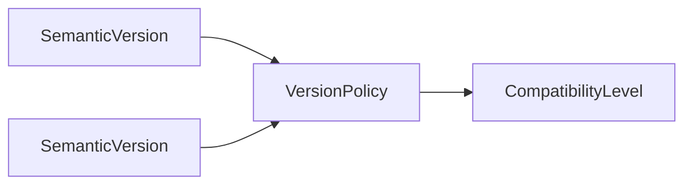

The policy transforms version relationships into explicit compatibility classifications.

---

# Architectural Invariant

> **Every `VersionPolicy` implementation within KUKULCAN.SharedKernel shall behave as a stateless architectural service responsible exclusively for evaluating software version compatibility through deterministic rules that transform immutable version representations into explicit compatibility classifications while remaining independent of parsing behavior, version storage, mutable state, infrastructure technologies, deployment mechanisms, runtime implementations, and framework-specific dependency management in accordance with the principles of Domain-Driven Design, Clean Architecture, and the Single Responsibility Principle.**

This invariant defines the architectural contract of the `VersionPolicy` abstraction.

# 7.7. VersionComparer

The **VersionComparer** is the stateless architectural service responsible for performing deterministic ordering of software versions within the **Versioning** subsystem of **KUKULCAN.SharedKernel**.

Its sole responsibility is to determine the relative ordering between two version instances. It does **not** determine compatibility, validate version policies, parse version strings, or manage version ranges.

`VersionComparer` provides the canonical comparison algorithm used throughout the SharedKernel, ensuring that every component evaluates version ordering in exactly the same way.

---

## Architectural Principle

Version ordering should be deterministic, centralized, and independent of compatibility policies.

> **Ordering determines sequence; compatibility determines interoperability.**

---

# Purpose

The `VersionComparer` exists to:

- compare version instances;
- establish deterministic ordering;
- support sorting operations;
- provide reusable comparison logic;
- eliminate duplicated comparison algorithms;
- remain independent of compatibility evaluation.

It is the authoritative comparison service of the Versioning subsystem.

---

# Architectural Position

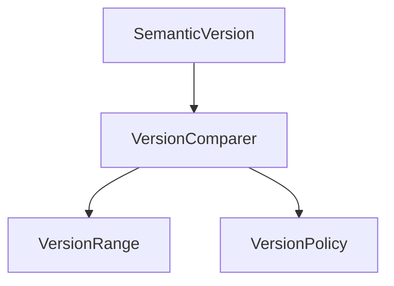

Multiple components rely on the comparer to obtain consistent ordering.

---

# Responsibilities

The `VersionComparer` is responsible for:

- comparing versions;
- determining ordering;
- supporting equality checks through ordering;
- providing deterministic comparison semantics.

It is **not** responsible for:

- compatibility evaluation;
- version parsing;
- dependency validation;
- version policy enforcement;
- version storage.

These responsibilities belong to other abstractions.

---

# Comparison Model

Conceptually:

```text
Version A

↓

VersionComparer

↓

Version B

↓

Ordering Result
```

The comparison result establishes only relative ordering.

---

# Ordering Semantics

Typical outcomes include:

```text
Version A

<

Version B
```

```text
Version A

=

Version B
```

```text
Version A

>

Version B
```

These outcomes are deterministic.

---

# Deterministic Behavior

Given identical inputs:

```text
Version A

Version B

↓

VersionComparer

↓

Result
```

the result shall always be identical.

Comparison must never depend upon:

- runtime;
- operating system;
- locale;
- framework implementation.

---

# Mathematical Properties

The comparison algorithm should satisfy:

### Reflexivity

```text
A = A
```

---

### Antisymmetry

If

```text
A < B
```

then

```text
B > A
```

---

### Transitivity

If

```text
A < B

and

B < C
```

then

```text
A < C
```

---

### Total Ordering

Every pair of versions must produce exactly one ordering relationship.

These properties guarantee predictable sorting.

---

# Separation of Concerns

`VersionComparer` intentionally performs **ordering only**.

It never answers questions such as:

```text
Can these versions interoperate?
```

That responsibility belongs to `VersionPolicy`.

---

# Stateless Design

The comparer should be completely stateless.

It contains:

- no configuration;
- no mutable fields;
- no cached results;
- no runtime state.

Stateless behavior guarantees reproducibility.

---

# Collaboration

`VersionComparer` collaborates with:

- `SemanticVersion`
- `VersionRange`
- `VersionPolicy`

It does not collaborate with parsing components.

---

# Framework Independence

The abstraction remains independent of:

- `System.Version`;
- NuGet comparison logic;
- package managers;
- runtime-specific ordering implementations.

Ordering is defined architecturally rather than by external frameworks.

---

# Thread Safety

Because the comparer is stateless, it is naturally thread-safe.

The same instance may safely serve unlimited concurrent requests.

---

# Testing

Typical tests verify:

- equality;
- greater-than comparisons;
- less-than comparisons;
- transitivity;
- total ordering;
- deterministic execution.

Every test should remain reproducible.

---

# Extensibility

Future comparison strategies may include:

- semantic comparison;
- enterprise comparison rules;
- pre-release ordering;
- metadata-aware ordering.

Extensions should preserve deterministic behavior.

---

# Architectural Characteristics

`VersionComparer` provides:

- centralized comparison logic;
- deterministic ordering;
- stateless execution;
- framework independence;
- reusable comparison algorithms;
- enterprise scalability.

These characteristics ensure consistent version ordering across the SharedKernel.

---

# Architectural Constraints

The `VersionComparer` abstraction shall satisfy the following constraints.

- Be stateless.
- Perform ordering only.
- Produce deterministic results.
- Support total ordering.
- Remain framework independent.
- Contain no parsing logic.
- Contain no compatibility rules.

Violating these constraints compromises architectural consistency.

---

# Conceptual Model

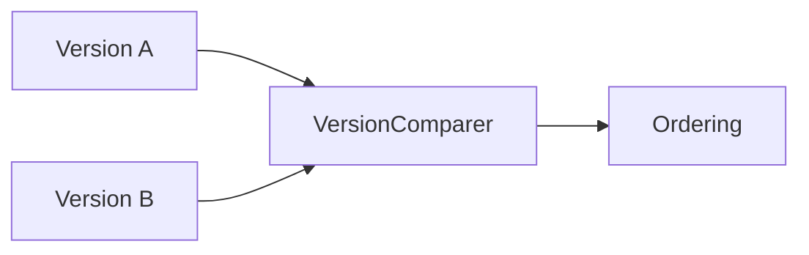

The comparer establishes the relative ordering between two immutable versions.

---

# Architectural Invariant

> **Every `VersionComparer` implementation within KUKULCAN.SharedKernel shall behave as a stateless architectural service responsible exclusively for deterministic ordering of immutable version representations, satisfying the mathematical properties of reflexivity, antisymmetry, transitivity, and total ordering while remaining independent of compatibility evaluation, version parsing, mutable state, infrastructure technologies, deployment mechanisms, runtime implementations, and framework-specific comparison algorithms in accordance with the principles of Domain-Driven Design, Clean Architecture, and the Single Responsibility Principle.**

This invariant defines the architectural contract of the `VersionComparer` abstraction.

# 7.8. VersionParser

The **VersionParser** is the stateless architectural service responsible for transforming external textual version representations into immutable version objects within the **Versioning** subsystem of **KUKULCAN.SharedKernel**.

Its sole responsibility is to interpret a textual representation and produce the corresponding `Version` (typically a `SemanticVersion`) according to the supported versioning format.

The parser performs **syntactic interpretation only**. It does not compare versions, evaluate compatibility, enforce versioning policies, or manage dependency constraints.

---

## Architectural Principle

Parsing should transform external representations into immutable domain objects without introducing business semantics.

> **A parser understands syntax, not compatibility.**

---

# Purpose

The `VersionParser` exists to:

- convert textual representations into version objects;
- validate version syntax;
- create immutable version instances;
- centralize parsing logic;
- eliminate duplicated parsing algorithms;
- remain independent of version policies.

It is the canonical entry point for transforming external version data into domain abstractions.

---

# Architectural Position

```mermaid
flowchart TD

    TEXT["Version String"]

    PARSER["VersionParser"]

    VERSION["SemanticVersion"]

    COMPARER["VersionComparer"]

    POLICY["VersionPolicy"]

    TEXT --> PARSER
    PARSER --> VERSION
    VERSION --> COMPARER
    VERSION --> POLICY
```

The parser is responsible only for object creation.

---

# Responsibilities

The `VersionParser` is responsible for:

- parsing version strings;
- validating syntactic correctness;
- constructing immutable version objects;
- rejecting malformed input.

It is **not** responsible for:

- compatibility evaluation;
- version comparison;
- dependency management;
- version policy enforcement;
- lifecycle management.

Those responsibilities belong to other architectural components.

---

# Parsing Model

Conceptually:

```text
Text

↓

VersionParser

↓

SemanticVersion
```

The parser transforms an external representation into an internal immutable object.

---

# Supported Representations

Typical supported representations include:

```text
1.0.0
```

```text
2.3.5
```

```text
3.1.0-beta
```

```text
4.0.0+build.42
```

The supported syntax depends on the active version specification.

---

# Syntax Validation

The parser validates structural correctness.

Examples of invalid input include:

```text
1
```

```text
1.a.0
```

```text
1..2
```

```text
alpha
```

Malformed input should never produce partially valid objects.

---

# Deterministic Parsing

Given identical input:

```text
"2.4.1"

↓

VersionParser

↓

SemanticVersion
```

the resulting object shall always be identical.

Parsing must never depend upon:

- culture;
- operating system;
- runtime implementation;
- localization settings.

---

# Error Handling

Invalid syntax should produce explicit parsing failures.

The parser should never silently correct malformed input.

Preferred behavior:

```text
Invalid Text

↓

Parsing Failure

↓

Explicit Error
```

This ensures predictable behavior.

---

# Separation of Concerns

`VersionParser` intentionally performs **syntax interpretation only**.

It never answers questions such as:

```text
Is this version compatible?
```

or

```text
Is this version newer?
```

Those responsibilities belong to:

- `VersionComparer`
- `VersionPolicy`

---

# Stateless Design

The parser should be completely stateless.

It contains:

- no mutable fields;
- no execution state;
- no cached parsing results;
- no runtime configuration.

Statelessness guarantees deterministic execution.

---

# Collaboration

`VersionParser` collaborates with:

- `Version`
- `SemanticVersion`

It remains independent from:

- `VersionComparer`
- `VersionPolicy`
- `CompatibilityLevel`

---

# Framework Independence

The abstraction remains independent of:

- `System.Version`;
- NuGet parsing utilities;
- package managers;
- deployment tools;
- runtime-specific parsers.

The parsing model belongs entirely to the SharedKernel architecture.

---

# Thread Safety

Because the parser is stateless, concurrent execution is naturally safe.

The same parser instance may be reused indefinitely.

---

# Testing

Typical unit tests verify:

- valid version parsing;
- invalid syntax detection;
- deterministic object creation;
- malformed input handling;
- parsing consistency.

Every test should remain deterministic.

---

# Extensibility

Future parser implementations may support:

- enterprise version formats;
- legacy version syntax;
- custom metadata;
- alternate semantic specifications.

Extensions should preserve the public parsing contract.

---

# Architectural Characteristics

`VersionParser` provides:

- centralized parsing logic;
- deterministic object creation;
- explicit syntax validation;
- stateless execution;
- framework independence;
- reusable transformation logic.

These characteristics establish it as the canonical translation service between textual representations and domain objects.

---

# Architectural Constraints

The `VersionParser` abstraction shall satisfy the following constraints.

- Be stateless.
- Parse textual representations only.
- Produce immutable version objects.
- Validate syntax explicitly.
- Produce deterministic results.
- Remain framework independent.
- Contain no comparison logic.
- Contain no compatibility rules.

Violating these constraints compromises separation of concerns.

---

# Conceptual Model

```mermaid
flowchart LR

    TEXT["Version Text"]

    PARSER["VersionParser"]

    VERSION["SemanticVersion"]

    TEXT --> PARSER
    PARSER --> VERSION
```

The parser serves as the translation layer between external representations and immutable domain objects.

---

# Architectural Invariant

> **Every `VersionParser` implementation within KUKULCAN.SharedKernel shall behave as a stateless architectural service responsible exclusively for transforming valid textual version representations into immutable version objects through deterministic syntax interpretation and explicit validation while remaining independent of comparison algorithms, compatibility evaluation, version policies, mutable state, infrastructure technologies, deployment mechanisms, runtime implementations, and framework-specific parsing utilities in accordance with the principles of Domain-Driven Design, Clean Architecture, and the Single Responsibility Principle.**

This invariant defines the architectural contract of the `VersionParser` abstraction.

# 8. Version Lifecycle

The **Version Lifecycle** describes the architectural progression of a software version from its initial creation through its eventual retirement within the **Versioning** subsystem of **KUKULCAN.SharedKernel**.

A version is not merely a numeric identifier. It represents a published architectural contract whose state evolves throughout the lifetime of a software component. The lifecycle provides a structured model for understanding this evolution while preserving stability, compatibility, and long-term maintainability.

The lifecycle itself is independent of deployment pipelines, package repositories, or release automation. It models architectural evolution rather than operational processes.

---

## Architectural Principle

Every published version progresses through a well-defined lifecycle.

> **Software evolves through successive immutable versions rather than by modifying existing releases.**

---

# Purpose

The Version Lifecycle exists to:

- describe software evolution;
- preserve architectural stability;
- support predictable releases;
- simplify compatibility management;
- communicate software maturity;
- guide long-term maintenance.

It provides the conceptual framework for software evolution.

---

# Lifecycle Overview

Conceptually:

```mermaid
flowchart LR

    DEVELOPMENT["Development"]

    PREVIEW["Preview"]

    RELEASE["Stable Release"]

    DEPRECATED["Deprecated"]

    RETIRED["Retired"]

    DEVELOPMENT --> PREVIEW
    PREVIEW --> RELEASE
    RELEASE --> DEPRECATED
    DEPRECATED --> RETIRED
```

Each stage represents a distinct architectural state.

---

# Development

The Development stage represents versions that are still under construction.

Characteristics include:

- incomplete functionality;
- unstable APIs;
- frequent architectural changes;
- internal validation.

Development versions should never be considered stable contracts.

---

# Preview

Preview versions provide early access for evaluation.

Typical characteristics include:

- feature completeness;
- limited stability;
- possible breaking changes;
- community feedback.

Preview releases prepare the transition toward production stability.

---

# Stable Release

A Stable Release represents the official published architectural contract.

Characteristics include:

- deterministic behavior;
- supported public APIs;
- documented compatibility;
- long-term maintainability.

Stable releases constitute the primary lifecycle state.

---

# Deprecated

A Deprecated version remains supported but is scheduled for replacement.

Typical characteristics include:

- maintenance mode;
- migration recommendations;
- compatibility preservation;
- planned retirement.

Deprecation communicates future architectural direction without immediate disruption.

---

# Retired

A Retired version is no longer supported.

Characteristics include:

- no active maintenance;
- no compatibility guarantees;
- replacement by newer versions.

Retirement concludes the lifecycle of a published version.

---

# Immutability Throughout the Lifecycle

The lifecycle never modifies an existing version.

Conceptually:

```text
Version

↓

Immutable

↓

Lifecycle Changes

↓

Status Changes
```

The version itself remains unchanged.

Only its lifecycle state evolves.

---

# Architectural Evolution

Software evolves through new versions rather than mutation.

Preferred progression:

```text
1.2.0

↓

1.3.0

↓

2.0.0
```

Each published version remains immutable.

---

# Compatibility Preservation

Stable lifecycle progression should preserve compatibility whenever possible.

Typical evolution:

```text
Stable

↓

Minor Enhancement

↓

Stable
```

Breaking changes require explicit architectural justification.

---

# Release Independence

The lifecycle remains independent of:

- CI/CD pipelines;
- package publication;
- deployment automation;
- infrastructure tooling.

It represents architectural evolution rather than operational workflows.

---

# Traceability

Lifecycle stages improve architectural traceability.

They allow teams to understand:

- current maturity;
- migration strategy;
- maintenance expectations;
- support status.

Traceability simplifies long-term governance.

---

# Collaboration

The Version Lifecycle collaborates conceptually with:

- `SemanticVersion`
- `VersionPolicy`
- `CompatibilityLevel`

It does not replace or duplicate their responsibilities.

---

# Thread Safety

Lifecycle concepts are immutable architectural descriptions.

No mutable execution state is required.

Consequently, lifecycle metadata is naturally thread-safe.

---

# Extensibility

Future lifecycle stages may include:

- Long-Term Support (LTS);
- Maintenance;
- Archived;
- Experimental.

Additional stages should extend the lifecycle without altering existing semantics.

---

# Architectural Characteristics

The Version Lifecycle provides:

- predictable software evolution;
- immutable version history;
- explicit maturity levels;
- architectural traceability;
- framework independence;
- enterprise scalability.

These characteristics support sustainable software evolution.

---

# Lifecycle Summary

| Stage          | Architectural Meaning                   |
|----------------|-----------------------------------------|
| Development    | Internal implementation                 |
| Preview        | Evaluation release                      |
| Stable Release | Official architectural contract         |
| Deprecated     | Supported but scheduled for replacement |
| Retired        | No longer supported                     |

Each stage communicates software maturity rather than software identity.

---

# Architectural Constraints

The Version Lifecycle shall satisfy the following constraints.

- Never modify published versions.
- Represent architectural evolution only.
- Preserve immutable version identity.
- Remain independent of deployment infrastructure.
- Support deterministic lifecycle progression.
- Encourage backward compatibility.
- Promote explicit deprecation.

Violating these constraints compromises architectural governance.

---

# Conceptual Model

```mermaid
flowchart TD

    VERSION["SemanticVersion"]

    LIFECYCLE["Lifecycle State"]

    SUPPORT["Support Status"]

    VERSION --> LIFECYCLE
    LIFECYCLE --> SUPPORT
```

The lifecycle describes the maturity and support expectations associated with an immutable version.

---

# Architectural Invariant

> **Every published software version within KUKULCAN.SharedKernel shall progress through a well-defined architectural lifecycle whose stages describe software maturity, maintenance expectations, and support status without ever modifying the immutable identity of the version itself, thereby ensuring deterministic evolution, explicit governance, compatibility preservation, long-term maintainability, framework independence, and full compliance with the principles of Domain-Driven Design and Clean Architecture.**

This invariant defines the architectural foundation of the Version Lifecycle.

# 9. Semantic Versioning Model

The **Semantic Versioning Model** defines the architectural interpretation of software version numbers within the **Versioning** subsystem of **KUKULCAN.SharedKernel**.

Rather than treating a version as a simple numerical identifier, the Semantic Versioning Model assigns explicit architectural meaning to each version component. This enables consumers, developers, and automated tooling to understand the expected impact of software evolution without inspecting implementation details.

The SharedKernel adopts **Semantic Versioning (SemVer)** as its canonical versioning model.

---

## Architectural Principle

Version numbers should communicate architectural intent.

> **Every version increment conveys information about compatibility, evolution, and expected consumer impact.**

---

# Purpose

The Semantic Versioning Model exists to:

- standardize software evolution;
- communicate compatibility expectations;
- simplify upgrade decisions;
- support deterministic version comparison;
- minimize breaking changes;
- establish a common architectural language.

It defines how software versions evolve over time.

---

# Semantic Structure

Every semantic version is composed of three mandatory components.

```text
MAJOR.MINOR.PATCH
```

Example:

```text
3.4.7
```

Each component has a distinct architectural responsibility.

---

# Major Version

The **Major** component represents architectural compatibility boundaries.

Incrementing the major version indicates that one or more breaking changes have been introduced.

Example:

```text
1.x.x

↓

2.0.0
```

Typical causes include:

- incompatible APIs;
- removed functionality;
- behavioral changes;
- contract modifications.

Major version increments should be infrequent and intentional.

---

# Minor Version

The **Minor** component represents backward-compatible functional evolution.

Example:

```text
2.3.0

↓

2.4.0
```

Typical additions include:

- new features;
- additional APIs;
- optional capabilities;
- extensibility improvements.

Existing consumers should continue operating without modification.

---

# Patch Version

The **Patch** component represents corrective evolution.

Example:

```text
2.4.5

↓

2.4.6
```

Typical changes include:

- bug fixes;
- performance improvements;
- documentation corrections;
- implementation refinements.

Patch releases should preserve complete compatibility.

---

# Evolution Rules

Software should evolve according to predictable rules.

```mermaid
flowchart TD

    PATCH["Patch"]

    MINOR["Minor"]

    MAJOR["Major"]

    PATCH --> MINOR
    MINOR --> MAJOR
```

Each successive level represents increasing architectural impact.

---

# Compatibility Interpretation

Semantic versions communicate compatibility.

Typical interpretation:

| Version Change   | Compatibility            |
|------------------|--------------------------|
| Patch            | Fully compatible         |
| Minor            | Backward compatible      |
| Major            | Potentially incompatible |

These rules guide both human and automated decision-making.

---

# Architectural Meaning

The semantic components represent:

```text
Major

↓

Compatibility
```

```text
Minor

↓

Capabilities
```

```text
Patch

↓

Corrections
```

Together they describe software evolution.

---

# Release Progression

A typical release sequence may appear as:

```text
1.0.0

↓

1.0.1

↓

1.1.0

↓

1.2.0

↓

2.0.0
```

Each transition communicates increasing architectural impact.

---

# Breaking Changes

Breaking changes should trigger a major version increment.

Examples include:

- removed public members;
- incompatible behavioral changes;
- modified contracts;
- unsupported migration paths.

Breaking changes should never appear in patch releases.

---

# Backward-Compatible Evolution

Backward-compatible enhancements should increment the minor version.

Typical examples include:

- additional overloads;
- new optional interfaces;
- new extension methods;
- additive APIs.

Consumers should not require source modifications.

---

# Corrective Evolution

Corrections should increment only the patch version.

Typical examples include:

- defect corrections;
- optimization;
- documentation improvements.

Patch releases should remain transparent to consumers.

---

# Deterministic Interpretation

Given any semantic version:

```text
MAJOR.MINOR.PATCH
```

every consumer should derive the same architectural interpretation.

Deterministic interpretation is fundamental to predictable software evolution.

---

# Independence from Infrastructure

Semantic Versioning remains independent of:

- package repositories;
- deployment pipelines;
- operating systems;
- runtime implementations;
- source control systems.

The model describes architecture rather than infrastructure.

---

# Collaboration

The Semantic Versioning Model collaborates conceptually with:

- `SemanticVersion`
- `VersionComparer`
- `VersionPolicy`
- `CompatibilityLevel`

Each component contributes one aspect of semantic version management.

---

# Thread Safety

Semantic version representations are immutable.

Consequently, interpretation remains deterministic and inherently thread-safe.

---

# Extensibility

Future extensions may include:

- pre-release identifiers;
- build metadata;
- release channels;
- enterprise version annotations.

These additions should preserve existing semantic rules.

---

# Architectural Characteristics

The Semantic Versioning Model provides:

- explicit architectural meaning;
- predictable evolution;
- deterministic compatibility communication;
- framework independence;
- enterprise scalability;
- long-term maintainability.

These characteristics make Semantic Versioning suitable for the SharedKernel.

---

# Semantic Model Summary

| Component   | Architectural Meaning   |
|-------------|-------------------------|
| Major       | Compatibility boundary  |
| Minor       | Functional evolution    |
| Patch       | Corrective evolution    |

Together they define the architectural language of software evolution.

---

# Architectural Constraints

The Semantic Versioning Model shall satisfy the following constraints.

- Preserve deterministic interpretation.
- Communicate compatibility explicitly.
- Separate breaking and non-breaking evolution.
- Remain framework independent.
- Support immutable version identity.
- Encourage backward compatibility.
- Minimize unnecessary major releases.

Violating these constraints weakens architectural predictability.

---

# Conceptual Model

```mermaid
flowchart LR

    MAJOR["Major"]

    MINOR["Minor"]

    PATCH["Patch"]

    VERSION["Semantic Version"]

    MAJOR --> VERSION
    MINOR --> VERSION
    PATCH --> VERSION
```

The semantic components collectively describe the architectural significance of a published version.

---

# Architectural Invariant

> **Every semantic version within KUKULCAN.SharedKernel shall communicate the architectural significance of software evolution through immutable Major, Minor, and Patch components whose values explicitly describe compatibility boundaries, functional evolution, and corrective changes while preserving deterministic interpretation, framework independence, predictable upgrade behavior, and long-term maintainability in accordance with the principles of Semantic Versioning, Domain-Driven Design, and Clean Architecture.**

This invariant defines the architectural foundation of the Semantic Versioning Model.

# 10. Compatibility Rules

The **Compatibility Rules** define the architectural principles used to determine whether two software versions may safely coexist or interoperate within the **Versioning** subsystem of **KUKULCAN.SharedKernel**.

These rules provide a deterministic interpretation of version evolution based on the adopted **Semantic Versioning Model**. They ensure that compatibility decisions are explicit, predictable, and independent of implementation details or deployment technologies.

Compatibility is evaluated by the `VersionPolicy` and expressed through `CompatibilityLevel`, but the rules described here establish the conceptual foundation for those evaluations.

---

## Architectural Principle

Compatibility must be governed by explicit architectural rules rather than assumptions.

> **Software compatibility is determined by defined policies, not by numerical proximity of version numbers.**

---

# Purpose

The Compatibility Rules exist to:

- establish deterministic compatibility decisions;
- define upgrade expectations;
- minimize breaking changes;
- support dependency management;
- communicate architectural stability;
- standardize version evolution.

They provide a consistent interpretation of version relationships.

---

# Compatibility Model

Conceptually:

```mermaid
flowchart TD

    VERSIONA["Version A"]

    VERSIONB["Version B"]

    POLICY["Version Policy"]

    RESULT["Compatibility Level"]

    VERSIONA --> POLICY
    VERSIONB --> POLICY
    POLICY --> RESULT
```

Compatibility is always evaluated through explicit policy.

---

# General Rule

Compatibility should favor stability.

Preferred evolution:

```text
Existing Consumer

↓

New Version

↓

Still Works
```

Backward compatibility should be preserved whenever practical.

---

# Major Version Rule

Changing the **Major** version indicates that compatibility may be broken.

Example:

```text
1.8.0

↓

2.0.0
```

Typical consequences include:

- API changes;
- removed functionality;
- behavioral incompatibilities.

Major version increments require explicit migration.

---

# Minor Version Rule

Changing the **Minor** version indicates backward-compatible evolution.

Example:

```text
2.3.0

↓

2.4.0
```

Consumers targeting version:

```text
2.3.x
```

should continue functioning without modification.

---

# Patch Version Rule

Changing the **Patch** version represents corrective evolution only.

Example:

```text
2.4.5

↓

2.4.6
```

Patch releases should remain completely compatible.

---

# Breaking Changes

Breaking changes include examples such as:

- removing public APIs;
- changing method signatures;
- modifying observable behavior;
- altering public contracts.

Breaking changes should never occur in:

- minor releases;
- patch releases.

---

# Backward Compatibility

Backward compatibility means:

```text
Old Consumer

↓

New Library

↓

Works
```

This is the preferred compatibility model for SharedKernel components.

---

# Forward Compatibility

Forward compatibility means:

```text
New Consumer

↓

Old Library

↓

Works
```

Forward compatibility is desirable but not guaranteed.

---

# Dependency Compatibility

Dependencies should specify explicit compatibility expectations.

Example:

```text
>=2.1.0

<3.0.0
```

Version ranges should communicate supported compatibility boundaries.

---

# Compatibility Evaluation

Compatibility should always be deterministic.

Given:

```text
Version A

Version B
```

the same compatibility decision shall always be produced regardless of:

- runtime;
- operating system;
- culture;
- deployment environment.

---

# Semantic Interpretation

Compatibility is interpreted according to semantic version components.

| Version Change   | Expected Compatibility   |
|------------------|--------------------------|
| Patch            | Fully compatible         |
| Minor            | Backward compatible      |
| Major            | Potentially incompatible |

This interpretation provides predictable upgrade behavior.

---

# Stable Contracts

Published APIs represent architectural contracts.

Compatibility analysis should always evaluate the public contract rather than implementation details.

Internal refactoring should not affect compatibility.

---

# Deprecation

Deprecation should precede incompatible removal whenever feasible.

Preferred progression:

```text
Supported

↓

Deprecated

↓

Removed
```

This provides consumers with sufficient migration time.

---

# Framework Independence

Compatibility rules remain independent of:

- package repositories;
- deployment pipelines;
- runtime environments;
- package managers;
- infrastructure technologies.

They describe architectural relationships only.

---

# Collaboration

The Compatibility Rules are implemented conceptually through:

- `SemanticVersion`
- `VersionPolicy`
- `VersionRange`
- `CompatibilityLevel`

Each abstraction contributes one aspect of compatibility evaluation.

---

# Architectural Characteristics

The Compatibility Rules provide:

- deterministic evaluation;
- explicit compatibility boundaries;
- predictable upgrades;
- framework independence;
- architectural stability;
- enterprise scalability.

These characteristics simplify long-term software evolution.

---

# Compatibility Summary

| Version Increment   | Compatibility Expectation   |
|---------------------|-----------------------------|
| Patch               | Compatible                  |
| Minor               | Backward compatible         |
| Major               | Migration required          |

These rules establish the default compatibility model for KUKULCAN.SharedKernel.

---

# Architectural Constraints

The Compatibility Rules shall satisfy the following constraints.

- Preserve deterministic evaluation.
- Favor backward compatibility.
- Require explicit major-version changes for breaking modifications.
- Keep patch releases fully compatible.
- Keep minor releases backward compatible.
- Remain framework independent.
- Evaluate architectural contracts rather than implementation details.

Violating these constraints compromises software evolution and consumer confidence.

---

# Conceptual Model

```mermaid
flowchart LR

    PATCH["Patch"]

    MINOR["Minor"]

    MAJOR["Major"]

    COMPATIBILITY["Compatibility"]

    PATCH --> COMPATIBILITY
    MINOR --> COMPATIBILITY
    MAJOR --> COMPATIBILITY
```

Each semantic version component contributes differently to compatibility evaluation.

---

# Architectural Invariant

> **Every compatibility decision within KUKULCAN.SharedKernel shall be derived from explicit architectural rules that deterministically evaluate immutable semantic versions according to the principles of Semantic Versioning, preserving backward compatibility whenever possible, restricting breaking changes to major version increments, maintaining framework independence, and communicating upgrade expectations consistently in accordance with the principles of Domain-Driven Design and Clean Architecture.**

This invariant defines the architectural foundation of the Compatibility Rules.

# 11. Breaking Changes

Breaking Changes represent intentional modifications to the public architectural contract of a software component that may require existing consumers to modify their code, configuration, or integration behavior.

Within **KUKULCAN.SharedKernel**, breaking changes are considered exceptional architectural events. They are carefully controlled through the **Semantic Versioning Model** and are only introduced when the long-term benefits of the change outweigh the migration cost imposed on consumers.

A breaking change is not determined by implementation details, but by its observable impact on consumers.

---

## Architectural Principle

Breaking changes must always be explicit, intentional, and traceable.

> **A breaking change modifies the architectural contract, not merely the implementation.**

---

# Purpose

The Breaking Changes policy exists to:

- protect consumers from unexpected regressions;
- preserve architectural stability;
- establish predictable upgrade behavior;
- define when a Major version increment is required;
- encourage additive evolution;
- minimize migration costs.

It governs architectural evolution rather than implementation strategy.

---

# Definition

A breaking change is any modification that prevents an existing consumer from continuing to operate correctly without adaptation.

Conceptually:

```text
Existing Consumer

↓

Upgrade

↓

Compilation Failure
```

or

```text
Existing Consumer

↓

Upgrade

↓

Behavioral Failure
```

Both situations represent breaking changes.

---

# Architectural Contract

Compatibility is evaluated against the **public architectural contract**.

The contract includes:

- public APIs;
- public interfaces;
- observable behavior;
- documented semantics;
- externally visible data structures.

Internal implementation details are **not** part of the compatibility contract.

---

# Major Version Requirement

Every breaking change requires a **Major** version increment.

Example:

```text
2.8.4

↓

3.0.0
```

A breaking change shall never be released as:

- a Minor version;
- a Patch version.

---

# Typical Breaking Changes

Examples include:

- removing a public method;
- renaming a public type;
- changing method signatures;
- modifying interface members;
- changing inheritance hierarchies;
- removing extension points;
- altering serialization contracts;
- changing observable runtime behavior.

Each of these modifies the architectural contract.

---

# Behavioral Breaking Changes

Breaking changes are not limited to compilation failures.

Example:

```text
Same API

↓

Different Behavior

↓

Consumer Failure
```

Behavioral incompatibility is equally significant.

---

# Non-Breaking Changes

The following are generally **not** considered breaking changes:

- bug fixes;
- internal refactoring;
- performance improvements;
- additional overloads;
- new optional APIs;
- implementation optimizations;
- documentation updates.

These modifications preserve the public contract.

---

# Deprecation Strategy

Breaking changes should normally follow a deprecation cycle.

Preferred evolution:

```mermaid
flowchart LR

    SUPPORTED["Supported"]

    DEPRECATED["Deprecated"]

    REMOVED["Removed"]

    SUPPORTED --> DEPRECATED
    DEPRECATED --> REMOVED
```

Deprecation provides consumers with sufficient migration time.

---

# Consumer Impact

Every breaking change should be evaluated from the consumer's perspective.

Questions include:

- Must existing code change?
- Must configuration change?
- Must deployment change?
- Will observable behavior change?
- Will integrations fail?

If the answer is **yes**, the change is potentially breaking.

---

# Documentation

Every breaking change should be documented.

Documentation should include:

- the affected APIs;
- migration guidance;
- replacement mechanisms;
- rationale for the change;
- compatibility implications.

Documentation reduces upgrade risk.

---

# Migration

Whenever feasible, migration paths should be provided.

Typical strategies include:

- replacement APIs;
- compatibility adapters;
- transitional overloads;
- deprecation warnings.

Migration should be as predictable as possible.

---

# Compatibility Evaluation

Breaking changes are evaluated through `VersionPolicy`.

Conceptually:

```text
Old Version

+

New Version

↓

VersionPolicy

↓

Incompatible
```

The policy determines the compatibility classification.

---

# Framework Independence

Breaking Changes are architectural concepts.

They remain independent of:

- programming language;
- runtime;
- package manager;
- deployment platform;
- build tooling.

The focus is always on the public contract.

---

# Collaboration

Breaking Changes interact conceptually with:

- `SemanticVersion`
- `VersionPolicy`
- `CompatibilityLevel`
- `VersionRange`

Each abstraction contributes to compatibility governance.

---

# Architectural Characteristics

The Breaking Changes policy provides:

- explicit compatibility governance;
- predictable version evolution;
- consumer protection;
- architectural stability;
- deterministic upgrade expectations;
- enterprise maintainability.

These characteristics support long-term software evolution.

---

# Breaking Change Summary

| Change Type                   | Major Version Required   |
|-------------------------------|--------------------------|
| Public API removal            | Yes                      |
| Interface modification        | Yes                      |
| Behavioral incompatibility    | Yes                      |
| Serialization contract change | Yes                      |
| Internal refactoring          | No                       |
| Bug fix                       | No                       |
| Performance improvement       | No                       |
| Additional optional API       | No                       |

Only modifications affecting the architectural contract require a Major version increment.

---

# Architectural Constraints

The Breaking Changes policy shall satisfy the following constraints.

- Treat the public contract as the compatibility boundary.
- Require a Major version increment for every breaking change.
- Encourage deprecation before removal.
- Preserve backward compatibility whenever possible.
- Provide migration guidance.
- Remain framework independent.
- Document every breaking change explicitly.

Violating these constraints undermines architectural stability and consumer confidence.

---

# Conceptual Model

```mermaid
flowchart TD

    CONTRACT["Public Contract"]

    CHANGE["Breaking Change"]

    VERSION["Major Version"]

    CONTRACT --> CHANGE
    CHANGE --> VERSION
```

Breaking changes modify the public contract and therefore require a Major version increment.

---

# Architectural Invariant

> **Every breaking change within KUKULCAN.SharedKernel shall be treated as an explicit modification of the public architectural contract that requires a Major version increment, comprehensive documentation, deterministic compatibility evaluation, and, whenever reasonably possible, a defined migration path, while preserving framework independence, architectural traceability, consumer protection, and long-term maintainability in accordance with the principles of Semantic Versioning, Domain-Driven Design, and Clean Architecture.**

This invariant defines the architectural foundation of Breaking Changes.

# 12. Backward Compatibility

Backward Compatibility is the architectural principle that allows software built against an earlier published version to continue functioning correctly when executed against a newer compatible version.

Within **KUKULCAN.SharedKernel**, backward compatibility is considered the default evolution strategy. New releases should preserve the existing public architectural contract whenever reasonably possible, allowing consumers to adopt improvements without requiring source code modifications.

Maintaining backward compatibility minimizes upgrade costs, simplifies dependency management, and contributes to long-term architectural stability.

---

## Architectural Principle

Software should evolve by extending existing contracts rather than invalidating them.

> **The preferred upgrade path is one in which existing consumers continue to work without modification.**

---

# Purpose

Backward Compatibility exists to:

- preserve architectural stability;
- reduce upgrade risk;
- minimize migration effort;
- protect existing consumers;
- simplify dependency evolution;
- encourage additive software growth.

It represents the preferred compatibility model for SharedKernel components.

---

# Definition

Backward compatibility means:

```text
Old Consumer

↓

New Library

↓

Works Correctly
```

The consumer was developed against an earlier version but operates correctly with the newer release.

---

# Architectural Contract

Compatibility is evaluated against the **published architectural contract**.

This contract includes:

- public APIs;
- public interfaces;
- documented behavior;
- externally observable semantics;
- serialization contracts.

Internal implementation details do not affect backward compatibility.

---

# Compatible Evolution

Preferred software evolution follows an additive model.

Conceptually:

```mermaid
flowchart LR

    API1["Existing API"]

    API2["Extended API"]

    API1 --> API2
```

The original contract remains valid while new capabilities are introduced.

---

# Typical Compatible Changes

Examples include:

- adding new methods;
- adding optional parameters (where appropriate);
- introducing new extension methods;
- adding new interfaces;
- improving performance;
- correcting defects;
- extending functionality.

These changes preserve existing consumers.

---

# Behavioral Stability

Backward compatibility includes behavioral consistency.

Example:

```text
Same API

↓

Same Observable Behavior
```

Unexpected behavioral changes may violate compatibility even when signatures remain unchanged.

---

# Binary Compatibility

When applicable, binary compatibility should also be preserved.

Existing compiled applications should continue functioning without recompilation whenever feasible.

Binary compatibility is desirable but remains subordinate to architectural correctness.

---

# Source Compatibility

Source compatibility means:

```text
Existing Source Code

↓

Recompile

↓

No Changes Required
```

Consumers should not modify code merely to adopt compatible releases.

---

# Semantic Versioning

Backward-compatible changes correspond to:

```text
Minor Version

or

Patch Version
```

Major version increments indicate that backward compatibility may no longer be preserved.

---

# Consumer Expectations

Consumers should be able to assume:

- existing APIs remain available;
- existing behaviors remain valid;
- documented contracts remain unchanged;
- migration is unnecessary.

These expectations build long-term confidence.

---

# Deprecation

Features should normally be deprecated before removal.

Preferred lifecycle:

```mermaid
flowchart LR

    ACTIVE["Supported"]

    DEPRECATED["Deprecated"]

    REMOVED["Removed"]

    ACTIVE --> DEPRECATED
    DEPRECATED --> REMOVED
```

Deprecation preserves compatibility while preparing future evolution.

---

# Compatibility Evaluation

Backward compatibility is evaluated through `VersionPolicy`.

Conceptually:

```text
Old Version

+

New Version

↓

Compatible
```

The evaluation remains deterministic.

---

# Framework Independence

Backward Compatibility remains independent of:

- runtime implementation;
- deployment technology;
- package managers;
- operating systems;
- programming languages.

It is an architectural concept rather than a technical mechanism.

---

# Collaboration

Backward Compatibility is closely related to:

- `SemanticVersion`
- `VersionPolicy`
- `CompatibilityLevel`
- `VersionRange`

Each abstraction contributes to compatibility governance.

---

# Architectural Characteristics

Backward Compatibility provides:

- predictable upgrades;
- architectural stability;
- consumer confidence;
- additive software evolution;
- reduced migration cost;
- enterprise scalability.

These characteristics are fundamental to long-lived software ecosystems.

---

# Compatibility Summary

| Change                     | Backward Compatible   |
|----------------------------|-----------------------|
| Add new API                | Yes                   |
| Add extension method       | Yes                   |
| Improve performance        | Yes                   |
| Fix defect                 | Yes                   |
| Remove public API          | No                    |
| Modify public contract     | No                    |
| Change observable behavior | No                    |

Only additive and non-disruptive changes preserve backward compatibility.

---

# Architectural Constraints

Backward Compatibility shall satisfy the following constraints.

- Preserve published architectural contracts.
- Favor additive evolution.
- Avoid unnecessary breaking changes.
- Preserve documented behavior.
- Encourage deprecation before removal.
- Remain framework independent.
- Support deterministic compatibility evaluation.

Violating these constraints weakens software stability and consumer trust.

---

# Conceptual Model

```mermaid
flowchart TD

    OLD["Old Consumer"]

    NEW["New Version"]

    RESULT["Continues Working"]

    OLD --> NEW
    NEW --> RESULT
```

Backward compatibility allows existing consumers to adopt newer versions without modification.

---

# Architectural Invariant

> **Every backward-compatible evolution within KUKULCAN.SharedKernel shall preserve the published architectural contract, maintain observable behavior, support deterministic compatibility evaluation, favor additive software growth, minimize consumer migration effort, remain independent of implementation details and infrastructure technologies, and uphold the principles of Semantic Versioning, Domain-Driven Design, and Clean Architecture by ensuring that existing consumers continue operating correctly against newer compatible releases whenever reasonably possible.**

This invariant defines the architectural foundation of Backward Compatibility.

# 13. Forward Compatibility

Forward Compatibility is the architectural capability of an existing software component to safely interact with artifacts or data produced by newer software versions without requiring immediate modification.

Unlike **Backward Compatibility**, which focuses on allowing existing consumers to adopt newer libraries, Forward Compatibility focuses on ensuring that older components can tolerate future evolution without catastrophic failure.

Within **KUKULCAN.SharedKernel**, forward compatibility is considered a desirable architectural property whenever it can be achieved without compromising correctness, determinism, or maintainability. However, unlike backward compatibility, it is **not** guaranteed by default.

---

## Architectural Principle

Software should tolerate future evolution whenever it can do so safely.

> **Unknown future information should be ignored rather than causing unnecessary failure whenever architectural correctness can be preserved.**

---

# Purpose

Forward Compatibility exists to:

- improve long-term interoperability;
- reduce deployment dependencies;
- support gradual system evolution;
- simplify distributed upgrades;
- minimize coupling between software generations;
- encourage resilient architectures.

It complements—but does not replace—backward compatibility.

---

# Definition

Forward compatibility means:

```text
New Producer

↓

Old Consumer

↓

Continues Working
```

The consumer predates the producer yet is still capable of operating correctly.

---

# Architectural Perspective

Forward compatibility emphasizes resilience.

Conceptually:

```mermaid
flowchart LR

    FUTURE["Future Version"]

    CURRENT["Current Consumer"]

    RESULT["Graceful Operation"]

    FUTURE --> CURRENT
    CURRENT --> RESULT
```

The current consumer safely tolerates future evolution.

---

# Typical Scenarios

Forward compatibility is valuable in scenarios such as:

- distributed systems;
- message contracts;
- serialized data;
- API evolution;
- event-driven architectures;
- long-lived integrations.

These environments often evolve incrementally.

---

# Unknown Information

Forward-compatible systems should tolerate information they do not understand.

Example:

```text
Known Fields

+

Unknown Fields

↓

Ignore Unknown Fields
```

Ignoring unsupported information is generally preferable to failure when correctness is preserved.

---

# Additive Evolution

Forward compatibility favors additive changes.

Examples include:

- additional properties;
- optional metadata;
- new message fields;
- extensible payloads.

Existing consumers continue processing the information they recognize.

---

# Behavioral Stability

Forward compatibility does **not** imply behavioral equivalence.

Older software simply continues operating within its own supported feature set.

New capabilities may remain unavailable until the consumer is upgraded.

---

# Contract Evolution

Architectural contracts should evolve carefully.

Preferred progression:

```mermaid
flowchart LR

    CONTRACT1["Current Contract"]

    CONTRACT2["Extended Contract"]

    CONTRACT1 --> CONTRACT2
```

Extensions preserve interoperability by avoiding destructive modifications.

---

# Limitations

Forward compatibility cannot always be achieved.

Examples include:

- removed mandatory fields;
- incompatible protocols;
- fundamental behavioral changes;
- architectural redesign.

Such situations require coordinated upgrades.

---

# Relationship to Semantic Versioning

Semantic Versioning primarily guarantees **backward compatibility**.

Forward compatibility is an architectural design goal rather than a semantic versioning guarantee.

Consequently:

```text
Minor Release

↓

May Improve Forward Compatibility
```

but

```text
Major Release

↓

May Eliminate It
```

---

# Compatibility Evaluation

Forward compatibility is evaluated through architectural policy.

Conceptually:

```text
Future Version

+

Current Consumer

↓

VersionPolicy

↓

Compatibility Result
```

The result depends on the adopted compatibility strategy.

---

# Framework Independence

Forward Compatibility remains independent of:

- serialization libraries;
- messaging frameworks;
- package managers;
- deployment platforms;
- runtime implementations.

It describes architectural resilience rather than infrastructure behavior.

---

# Collaboration

Forward Compatibility relates conceptually to:

- `SemanticVersion`
- `VersionPolicy`
- `CompatibilityLevel`
- `VersionRange`

Together they provide a complete compatibility model.

---

# Architectural Characteristics

Forward Compatibility provides:

- resilient software evolution;
- graceful handling of future extensions;
- reduced deployment coupling;
- long-term interoperability;
- enterprise scalability;
- architectural flexibility.

These characteristics are especially valuable in distributed environments.

---

# Forward Compatibility Summary

| Evolution Type                 | Forward Compatible    |
|--------------------------------|-----------------------|
| Additional optional fields     | Usually               |
| Additional optional APIs       | Usually               |
| Additional metadata            | Usually               |
| Removed required members       | No                    |
| Protocol redesign              | No                    |
| Breaking architectural changes | No                    |

Forward compatibility favors extension rather than replacement.

---

# Architectural Constraints

Forward Compatibility shall satisfy the following constraints.

- Favor additive evolution.
- Tolerate unknown information whenever safe.
- Preserve architectural correctness.
- Avoid assumptions about future implementations.
- Remain framework independent.
- Support deterministic behavior.
- Never compromise data integrity for compatibility.

Violating these constraints reduces architectural resilience.

---

# Conceptual Model

```mermaid
flowchart TD

    FUTURE["Future Version"]

    CURRENT["Current Consumer"]

    OPTIONAL["Unknown Extensions"]

    RESULT["Graceful Processing"]

    FUTURE --> OPTIONAL
    OPTIONAL --> CURRENT
    CURRENT --> RESULT
```

Older consumers continue operating by safely ignoring future extensions they do not understand.

---

# Architectural Invariant

> **Every forward-compatible evolution within KUKULCAN.SharedKernel shall preserve architectural correctness while enabling existing software components to tolerate future additive extensions through deterministic behavior, graceful handling of unknown information, framework-independent design, and resilient contract evolution without introducing assumptions about future implementations or compromising the integrity, consistency, or maintainability of the system in accordance with the principles of Domain-Driven Design and Clean Architecture.**

This invariant defines the architectural foundation of Forward Compatibility.

# 14. Dependency Versioning

Dependency Versioning defines the architectural principles governing how software components declare, consume, validate, and evolve versioned dependencies within the **Versioning** subsystem of **KUKULCAN.SharedKernel**.

Rather than treating dependencies as arbitrary implementation details, the SharedKernel considers them explicit architectural relationships governed by deterministic version constraints. Proper dependency versioning enables predictable upgrades, minimizes compatibility risks, and preserves long-term maintainability across complex systems.

Dependency versioning is therefore an architectural governance mechanism rather than a package management feature.

---

## Architectural Principle

Dependencies should be governed by explicit version contracts rather than implicit assumptions.

> **Every dependency represents an architectural relationship whose compatibility must be explicitly defined.**

---

# Purpose

Dependency Versioning exists to:

- define explicit dependency contracts;
- prevent accidental incompatibilities;
- support deterministic dependency resolution;
- simplify software evolution;
- reduce upgrade risk;
- improve architectural governance.

It establishes predictable relationships between independently evolving components.

---

# Architectural Perspective

A dependency represents a relationship between two versioned artifacts.

Conceptually:

```mermaid
flowchart LR

    CONSUMER["Consumer"]

    RANGE["Version Range"]

    PROVIDER["Provider"]

    CONSUMER --> RANGE
    RANGE --> PROVIDER
```

The relationship is governed by version constraints rather than implementation details.

---

# Explicit Version Contracts

Every dependency should define an explicit compatibility contract.

Example:

```text
>=2.1.0

<3.0.0
```

This communicates precisely which provider versions are considered acceptable.

---

# Deterministic Resolution

Dependency resolution should be deterministic.

Given identical dependency declarations:

```text
Dependency Set

↓

Resolution

↓

Same Result
```

the resulting dependency graph shall always be identical.

Resolution must never depend upon runtime state or execution order.

---

# Version Ranges

Dependencies should normally reference **version ranges** rather than individual versions.

Example:

```text
>=1.5.0

<2.0.0
```

Version ranges permit safe evolution while preserving compatibility boundaries.

---

# Exact Versions

Exact versions may be appropriate when:

- deterministic reproducibility is essential;
- compatibility requirements are extremely strict;
- regulatory constraints exist;
- reproducible builds are mandatory.

Example:

```text
2.4.7
```

Exact versions reduce flexibility but maximize predictability.

---

# Compatible Evolution

When a provider releases:

```text
2.3.0

↓

2.4.0
```

a compatible dependency range should continue accepting the newer version.

Consumers benefit from improvements without modifying dependency declarations.

---

# Major Version Boundaries

Major version transitions should be treated cautiously.

Example:

```text
>=2.0.0

<3.0.0
```

Version:

```text
3.0.0
```

falls outside the accepted compatibility boundary and therefore requires explicit review.

---

# Transitive Dependencies

Dependencies often introduce additional dependencies.

Conceptually:

```mermaid
flowchart TD

    A["Component A"]

    B["Component B"]

    C["Component C"]

    A --> B
    B --> C
```

Architectural compatibility should remain predictable across the complete dependency graph.

---

# Dependency Stability

Dependencies should evolve more slowly than their consumers.

Stable foundational libraries reduce:

- upgrade frequency;
- migration effort;
- compatibility risk.

SharedKernel components should prioritize long-term stability.

---

# Circular Dependencies

Circular version dependencies should be avoided.

Undesirable structure:

```text
A

↓

B

↓

A
```

Circular relationships complicate dependency resolution and weaken architectural boundaries.

---

# Semantic Versioning

Dependency Versioning relies upon the Semantic Versioning Model.

Typical interpretation:

| Dependency Update  | Expected Action  |
|--------------------|------------------|
| Patch              | Safe update      |
| Minor              | Normally safe    |
| Major              | Explicit review  |

These expectations simplify dependency management.

---

# Compatibility Validation

Compatibility should be validated through architectural policy.

Conceptually:

```text
Declared Range

+

Resolved Version

↓

VersionPolicy

↓

Compatible / Incompatible
```

Validation remains deterministic.

---

# Framework Independence

Dependency Versioning remains independent of:

- NuGet;
- Maven;
- npm;
- package repositories;
- deployment tooling.

The architectural model applies regardless of implementation technology.

---

# Collaboration

Dependency Versioning collaborates conceptually with:

- `SemanticVersion`
- `VersionRange`
- `VersionPolicy`
- `CompatibilityLevel`
- `VersionIdentifier`

Each abstraction contributes one aspect of dependency governance.

---

# Architectural Characteristics

Dependency Versioning provides:

- deterministic dependency contracts;
- predictable upgrades;
- explicit compatibility boundaries;
- framework independence;
- enterprise scalability;
- long-term maintainability.

These characteristics improve software reliability across large systems.

---

# Dependency Strategy Summary

| Dependency Strategy   | Recommended Usage      |
|-----------------------|------------------------|
| Version Range         | Default                |
| Exact Version         | Reproducible scenarios |
| Open Range            | Rare                   |
| Unbounded Dependency  | Discouraged            |

Explicit compatibility boundaries should always be preferred.

---

# Architectural Constraints

Dependency Versioning shall satisfy the following constraints.

- Declare explicit compatibility boundaries.
- Favor version ranges over unrestricted dependencies.
- Preserve deterministic dependency resolution.
- Avoid circular dependency graphs.
- Require explicit review for major-version upgrades.
- Remain framework independent.
- Support long-term architectural stability.

Violating these constraints increases dependency risk and weakens architectural governance.

---

# Conceptual Model

```mermaid
flowchart LR

    CONSUMER["Consumer"]

    CONTRACT["Version Contract"]

    PROVIDER["Provider"]

    CONSUMER --> CONTRACT
    CONTRACT --> PROVIDER
```

Every dependency is governed by an explicit version contract.

---

# Architectural Invariant

> **Every dependency relationship within KUKULCAN.SharedKernel shall be governed by an explicit version contract that deterministically defines acceptable provider versions through immutable compatibility boundaries, supports predictable software evolution, discourages unrestricted or circular dependency graphs, remains independent of package management technologies and deployment infrastructures, and preserves architectural stability, maintainability, and consumer confidence in accordance with the principles of Semantic Versioning, Domain-Driven Design, and Clean Architecture.**

This invariant defines the architectural foundation of Dependency Versioning.

# 15. Assembly Versioning

Assembly Versioning defines the architectural principles governing the version identity of compiled software artifacts within **KUKULCAN.SharedKernel**.

Although the Versioning subsystem is intentionally independent of any particular runtime or compiler, most software platforms eventually produce compiled artifacts (assemblies, libraries, modules, packages, binaries, etc.). This section describes the architectural relationship between semantic software versions and those compiled artifacts without coupling the SharedKernel to a specific technology such as .NET.

Assembly versioning is therefore treated as a deployment concern that must remain consistent with, but separate from, the architectural version model.

---

## Architectural Principle

The version of a compiled artifact should faithfully represent the architectural version of the software it contains.

> **A compiled artifact reflects an architectural version; it does not define it.**

---

# Purpose

Assembly Versioning exists to:

- associate compiled artifacts with architectural versions;
- provide traceability between source and binary artifacts;
- support deterministic software identification;
- simplify deployment governance;
- preserve consistency across releases;
- separate architecture from implementation technology.

It bridges architectural versioning and compiled deliverables.

---

# Architectural Perspective

Conceptually:

```mermaid
flowchart LR

    SOFTWARE["Software Version"]

    ASSEMBLY["Compiled Artifact"]

    SOFTWARE --> ASSEMBLY
```

The compiled artifact inherits the architectural identity of the software version.

---

# Architectural Identity

The architectural version remains the authoritative identity.

Conceptually:

```text
SemanticVersion

↓

Compiled Artifact
```

The compiled artifact should never invent an independent versioning strategy.

---

# Consistency

Every published artifact should remain consistent with the corresponding semantic version.

Example:

```text
Semantic Version

2.4.1

↓

Compiled Artifact

2.4.1
```

Consumers should never observe conflicting version identities.

---

# Immutable Releases

Published compiled artifacts are immutable.

Once released:

```text
Artifact

↓

Immutable
```

its contents and version identity should never change.

Corrections require publishing a new artifact with a new version.

---

# Artifact Traceability

Version identity enables complete traceability.

Conceptually:

```text
Source

↓

Build

↓

Artifact

↓

Version
```

Every artifact can be traced back to the software version that produced it.

---

# Reproducibility

Equivalent source code should produce artifacts representing the same architectural version.

Reproducibility supports:

- deterministic builds;
- auditing;
- compliance;
- long-term maintenance.

---

# Version Synchronization

When multiple artifacts belong to the same logical release, they should share a consistent architectural version.

Example:

```text
SharedKernel.Core

2.3.0
```

```text
SharedKernel.Validation

2.3.0
```

Version synchronization simplifies dependency management.

---

# Binary Compatibility

Assembly Versioning should accurately communicate binary compatibility expectations.

Conceptually:

```text
Compatible Binary

↓

Same Major Version
```

Major version changes should clearly indicate potential binary incompatibility.

---

# Independent Evolution

Different software components may evolve independently.

Example:

```text
Component A

3.1.0
```

```text
Component B

2.8.4
```

Each artifact maintains its own version identity while respecting architectural compatibility.

---

# Separation from Runtime

Assembly Versioning is independent of:

- CLR metadata;
- JVM manifests;
- native executable headers;
- package repositories;
- deployment descriptors.

The architectural model applies regardless of runtime technology.

---

# Collaboration

Assembly Versioning collaborates conceptually with:

- `SemanticVersion`
- `VersionIdentifier`
- `VersionPolicy`

These abstractions provide the architectural identity represented by compiled artifacts.

---

# Framework Independence

The SharedKernel intentionally avoids assumptions about:

- .NET AssemblyVersion;
- AssemblyFileVersion;
- Maven coordinates;
- npm package versions;
- operating system metadata.

Those mechanisms are implementation-specific mappings of the architectural version.

---

# Enterprise Governance

Organizations should define consistent policies for:

- artifact naming;
- version synchronization;
- release numbering;
- build reproducibility;
- artifact retention.

These governance policies complement architectural versioning.

---

# Architectural Characteristics

Assembly Versioning provides:

- traceable software artifacts;
- deterministic release identity;
- version consistency;
- framework independence;
- deployment neutrality;
- enterprise governance.

These characteristics simplify software distribution and maintenance.

---

# Assembly Versioning Summary

| Architectural Concept   | Compiled Artifact          |
|-------------------------|----------------------------|
| SemanticVersion         | Artifact version identity  |
| VersionIdentifier       | Artifact identification    |
| VersionPolicy           | Compatibility expectations |

Compiled artifacts should faithfully represent the architectural version.

---

# Architectural Constraints

Assembly Versioning shall satisfy the following constraints.

- Preserve semantic version identity.
- Maintain immutable published artifacts.
- Support deterministic traceability.
- Synchronize related artifacts appropriately.
- Remain independent of runtime technologies.
- Avoid technology-specific assumptions.
- Never redefine architectural version semantics.

Violating these constraints weakens software governance and traceability.

---

# Conceptual Model

```mermaid
flowchart TD

    SOURCE["Source Code"]

    VERSION["Semantic Version"]

    BUILD["Build Process"]

    ARTIFACT["Compiled Artifact"]

    SOURCE --> VERSION
    VERSION --> BUILD
    BUILD --> ARTIFACT
```

The compiled artifact derives its identity from the architectural version established before the build process.

---

# Architectural Invariant

> **Every compiled software artifact produced from KUKULCAN.SharedKernel shall faithfully represent the immutable architectural version of the software from which it was generated, preserving deterministic identity, complete traceability, version consistency, binary compatibility expectations, deployment neutrality, and framework independence while avoiding technology-specific assumptions and maintaining a clear separation between architectural version semantics and runtime implementation details in accordance with the principles of Semantic Versioning, Domain-Driven Design, and Clean Architecture.**

This invariant defines the architectural foundation of Assembly Versioning.

# 16. Package Versioning

Package Versioning defines the architectural principles governing the identification, publication, evolution, and consumption of distributable software packages within **KUKULCAN.SharedKernel**.

A package represents a deployable unit that groups one or more compiled artifacts into a reusable distribution. While package managers (NuGet, Maven, npm, Cargo, etc.) implement technology-specific mechanisms, the architectural concepts described here remain platform independent.

Within KUKULCAN.SharedKernel, package versioning is treated as a distribution concern that must remain fully aligned with the architectural versioning model.

---

## Architectural Principle

Every published package should represent one immutable architectural release.

> **A package distributes an architectural version; it does not redefine it.**

---

# Purpose

Package Versioning exists to:

- uniquely identify published packages;
- preserve release traceability;
- communicate compatibility expectations;
- simplify dependency management;
- support deterministic package resolution;
- enable long-term software maintenance.

It governs software distribution rather than software implementation.

---

# Architectural Perspective

Conceptually:

```mermaid
flowchart LR

    VERSION["Semantic Version"]

    PACKAGE["Published Package"]

    VERSION --> PACKAGE
```

A package inherits its identity from the architectural version it distributes.

---

# Package Identity

Every package should be uniquely identified by:

- package identity;
- semantic version.

Conceptually:

```text
Package Name

+

Semantic Version

↓

Published Package
```

Together they uniquely identify one release.

---

# Immutable Publications

Published packages are immutable.

Once released:

```text
Package

↓

Immutable
```

its contents must never change.

Corrections require publishing a new package with a new version.

---

# Version Consistency

The package version should always correspond to the architectural version.

Example:

```text
Semantic Version

3.2.1

↓

Package Version

3.2.1
```

Conflicting version identities should never exist.

---

# Deterministic Distribution

Publishing identical source code should produce the same package version.

Deterministic publication supports:

- reproducibility;
- auditing;
- governance;
- compliance.

---

# Package Evolution

Software evolves through successive immutable packages.

Conceptually:

```mermaid
flowchart LR

    P1["1.0.0"]

    P2["1.1.0"]

    P3["2.0.0"]

    P1 --> P2
    P2 --> P3
```

Each package represents one distinct architectural state.

---

# Dependency Contracts

Packages should expose explicit compatibility boundaries.

Typical dependency declaration:

```text
>=2.3.0

<3.0.0
```

Version contracts improve predictability across distributed systems.

---

# Stable Package Identity

The package identity should remain stable across compatible releases.

Example:

```text
KUKULCAN.SharedKernel.Validation

1.0.0

↓

1.1.0

↓

1.2.0
```

Only the version evolves.

---

# Package Replacement

Breaking architectural evolution results in a new package version rather than modifying an existing package.

Preferred progression:

```text
2.8.0

↓

3.0.0
```

Older packages remain available for consumers requiring them.

---

# Traceability

Every package should support complete release traceability.

Conceptually:

```text
Source

↓

Build

↓

Package

↓

Version
```

Every published package can be associated with its originating software version.

---

# Separation from Package Managers

Package Versioning remains independent of:

- NuGet;
- Maven;
- npm;
- Cargo;
- pip;
- package repositories.

The architectural principles remain identical regardless of implementation technology.

---

# Collaboration

Package Versioning collaborates conceptually with:

- `SemanticVersion`
- `VersionIdentifier`
- `VersionRange`
- `VersionPolicy`

These abstractions define the architectural identity represented by the package.

---

# Enterprise Governance

Organizations should establish policies governing:

- package naming;
- version synchronization;
- publication approval;
- retention;
- reproducibility;
- signing;
- release auditing.

These policies complement architectural versioning.

---

# Architectural Characteristics

Package Versioning provides:

- immutable releases;
- deterministic package identity;
- explicit compatibility expectations;
- framework independence;
- deployment neutrality;
- enterprise governance.

These characteristics support reliable software distribution.

---

# Package Versioning Summary

| Concept          | Responsibility           |
|------------------|--------------------------|
| Semantic Version | Architectural identity   |
| Package          | Distribution unit        |
| Version Range    | Dependency constraints   |
| Version Policy   | Compatibility evaluation |

The package distributes, but does not redefine, the architectural version.

---

# Architectural Constraints

Package Versioning shall satisfy the following constraints.

- Publish immutable packages.
- Preserve semantic version identity.
- Support deterministic package generation.
- Maintain explicit dependency contracts.
- Remain framework independent.
- Avoid technology-specific assumptions.
- Preserve release traceability.

Violating these constraints weakens software governance and distribution consistency.

---

# Conceptual Model

```mermaid
flowchart TD

    SOURCE["Source Code"]

    VERSION["Semantic Version"]

    BUILD["Build"]

    PACKAGE["Published Package"]

    SOURCE --> VERSION
    VERSION --> BUILD
    BUILD --> PACKAGE
```

The published package is the distributable representation of one immutable architectural version.

---

# Architectural Invariant

> **Every package published from KUKULCAN.SharedKernel shall represent one immutable architectural release uniquely identified by its package identity and semantic version, preserving deterministic traceability, version consistency, explicit dependency contracts, deployment neutrality, framework independence, and long-term maintainability while remaining independent of technology-specific package management implementations in accordance with the principles of Semantic Versioning, Domain-Driven Design, and Clean Architecture.**

This invariant defines the architectural foundation of Package Versioning.

# 17. Thread Safety

Thread Safety defines the architectural principles that guarantee safe concurrent execution of the **Versioning** subsystem within **KUKULCAN.SharedKernel**.

The Versioning subsystem is designed around immutable value objects and stateless services. As a consequence, its components naturally support concurrent access without requiring synchronization mechanisms such as locks, semaphores, or shared mutable state.

Thread safety is therefore achieved by architectural design rather than runtime coordination.

---

## Architectural Principle

Concurrent execution should be achieved through immutability and statelessness rather than synchronization.

> **The safest shared object is an immutable object.**

---

# Purpose

Thread Safety exists to:

- guarantee deterministic concurrent behavior;
- eliminate race conditions;
- simplify software reasoning;
- improve scalability;
- reduce synchronization overhead;
- support highly concurrent applications.

These objectives are achieved through architectural discipline.

---

# Architectural Model

The Versioning subsystem consists primarily of:

- immutable value objects;
- stateless services;
- deterministic algorithms.

Conceptually:

```mermaid
flowchart TD

    IMMUTABLE["Immutable Objects"]

    STATELESS["Stateless Services"]

    THREADSAFE["Thread Safe"]

    IMMUTABLE --> THREADSAFE
    STATELESS --> THREADSAFE
```

Thread safety emerges naturally from these characteristics.

---

# Immutable Value Objects

The following abstractions are immutable:

- `Version`
- `SemanticVersion`
- `VersionRange`
- `VersionIdentifier`
- `CompatibilityLevel`

Once created:

```text
Object

↓

Immutable
```

their observable state never changes.

---

# Stateless Services

The following services should remain stateless:

- `VersionParser`
- `VersionComparer`
- `VersionPolicy`

Stateless services contain:

- no mutable fields;
- no execution state;
- no cached mutable data.

Every invocation is independent.

---

# Deterministic Execution

Concurrent execution should always produce identical results.

Conceptually:

```text
Input

↓

Concurrent Execution

↓

Same Output
```

Thread scheduling must never influence observable behavior.

---

# Shared Instances

Immutable objects may safely be shared.

Example:

```text
Thread A

↓

SemanticVersion

↑

Thread B
```

No synchronization is required because the object cannot change.

---

# Synchronization

The Versioning subsystem should not require:

- locks;
- mutexes;
- monitors;
- semaphores;
- critical sections.

Architectural design eliminates the need for synchronization.

---

# Race Conditions

Because mutable shared state does not exist, race conditions cannot arise within the Versioning subsystem.

This significantly simplifies reasoning about concurrent execution.

---

# Memory Visibility

Immutable objects guarantee stable observable state.

Once constructed:

```text
Construction

↓

Publication

↓

Read
```

all threads observe identical values.

---

# Caching

Read-only caches are acceptably provided that:

- cached objects are immutable;
- cache state does not alter observable behavior;
- cache failures do not affect correctness.

Caching should optimize performance rather than define semantics.

---

# Exception Safety

Concurrent execution should not introduce inconsistent states.

Failures during parsing, comparison, or compatibility evaluation affect only the current operation.

No global state is modified.

---

# Framework Independence

Thread Safety remains independent from:

- threading libraries;
- runtime schedulers;
- operating systems;
- execution environments;
- synchronization primitives.

The guarantees derive from architecture rather than infrastructure.

---

# Collaboration

Thread Safety applies across:

- `SemanticVersion`
- `VersionRange`
- `VersionComparer`
- `VersionParser`
- `VersionPolicy`

Every component contributes to the subsystem's concurrency guarantees.

---

# Scalability

Because synchronization is unnecessary, the subsystem scales naturally with increasing concurrency.

Multiple threads may safely:

- parse versions;
- compare versions;
- evaluate compatibility;
- validate version ranges;

without coordination.

---

# Architectural Characteristics

Thread Safety provides:

- deterministic concurrency;
- lock-free execution;
- immutable shared state;
- stateless services;
- framework independence;
- enterprise scalability.

These characteristics support high-performance concurrent systems.

---

# Thread Safety Summary

| Component Type          | Thread Safe  |
|-------------------------|--------------|
| Immutable Value Objects | Yes          |
| Stateless Services      | Yes          |
| Mutable Shared State    | Not Allowed  |
| Synchronization         | Not Required |

Thread safety results directly from the architectural design.

---

# Architectural Constraints

Thread Safety shall satisfy the following constraints.

- Favor immutable value objects.
- Favor stateless services.
- Avoid mutable shared state.
- Avoid synchronization primitives whenever possible.
- Preserve deterministic execution.
- Remain framework independent.
- Guarantee safe concurrent access.

Violating these constraints introduces unnecessary concurrency risks.

---

# Conceptual Model

```mermaid
flowchart LR

    THREAD1["Thread A"]

    OBJECT["Immutable Version Object"]

    THREAD2["Thread B"]

    THREAD1 --> OBJECT
    THREAD2 --> OBJECT
```

Multiple concurrent threads safely share immutable objects without synchronization.

---

# Architectural Invariant

> **Every component within the Versioning subsystem of KUKULCAN.SharedKernel shall guarantee safe concurrent execution through immutable value objects, stateless architectural services, deterministic algorithms, and the complete absence of mutable shared state, thereby eliminating the need for synchronization primitives while preserving correctness, scalability, framework independence, and long-term maintainability in accordance with the principles of Domain-Driven Design and Clean Architecture.**

This invariant defines the architectural foundation of Thread Safety for the Versioning subsystem.

# 18. Best Practices

The **Best Practices** described in this section summarize the architectural recommendations for designing, evolving, publishing, and maintaining versioned software within the **Versioning** subsystem of **KUKULCAN.SharedKernel**.

These practices are derived from the principles of **Semantic Versioning**, **Domain-Driven Design**, **Clean Architecture**, and long-term software maintenance. Their objective is to maximize architectural stability while minimizing upgrade costs and compatibility risks.

They are recommendations rather than implementation rules, but consistent adherence significantly improves the quality and longevity of versioned software.

---

## Architectural Principle

Versioning should communicate architectural intent clearly and predictably.

> **Good versioning reduces uncertainty for every software consumer.**

---

# Purpose

These practices exist to:

- encourage predictable software evolution;
- preserve compatibility;
- simplify upgrades;
- reduce technical debt;
- improve maintainability;
- establish consistent architectural governance.

They promote disciplined software evolution.

---

# Prefer Semantic Versioning

Always adopt Semantic Versioning as the canonical version model.

Preferred format:

```text
MAJOR.MINOR.PATCH
```

Avoid inventing alternative numbering schemes unless absolutely necessary.

---

# Preserve Backward Compatibility

Favor additive evolution.

Preferred progression:

```text
Existing API

↓

Extended API
```

Consumers should continue operating without modification whenever possible.

---

# Minimize Breaking Changes

Breaking changes should be rare.

Before introducing one, evaluate:

- long-term benefits;
- migration cost;
- architectural necessity;
- alternative approaches.

If compatibility can be preserved, it usually should be.

---

# Deprecate Before Removing

Prefer the following evolution:

```mermaid
flowchart LR

    ACTIVE["Supported"]

    DEPRECATED["Deprecated"]

    REMOVED["Removed"]

    ACTIVE --> DEPRECATED
    DEPRECATED --> REMOVED
```

Deprecation provides consumers with sufficient migration time.

---

# Keep Versions Immutable

Published versions should never be modified.

Incorrect:

```text
Publish

↓

Modify

↓

Republish
```

Correct:

```text
Publish

↓

New Version

↓

Publish Again
```

Every release represents an immutable historical artifact.

---

# Prefer Version Ranges

Dependencies should normally specify explicit compatibility ranges.

Example:

```text
>=2.3.0

<3.0.0
```

Ranges balance flexibility and stability.

---

# Avoid Unbounded Dependencies

Avoid declarations such as:

```text
Latest
```

or

```text
*
```

Unrestricted dependencies reduce determinism and increase compatibility risk.

---

# Centralize Compatibility Logic

Compatibility should always be evaluated through `VersionPolicy`.

Avoid duplicating compatibility rules throughout the codebase.

Centralized policies improve consistency.

---

# Separate Responsibilities

Maintain clear separation between:

- version representation;
- comparison;
- parsing;
- compatibility evaluation;
- dependency management.

Each abstraction should have exactly one architectural responsibility.

---

# Prefer Immutable Objects

Version-related objects should remain immutable.

Examples include:

- `SemanticVersion`
- `VersionRange`
- `VersionIdentifier`

Immutability simplifies correctness and concurrency.

---

# Use Stateless Services

Architectural services should remain stateless.

Examples:

- `VersionParser`
- `VersionComparer`
- `VersionPolicy`

Stateless services improve scalability and testability.

---

# Document Breaking Changes

Every breaking change should include:

- architectural rationale;
- migration guidance;
- affected APIs;
- compatibility implications.

Good documentation reduces upgrade friction.

---

# Keep Public Contracts Stable

Public APIs represent architectural commitments.

Changes to those contracts should always be deliberate and well justified.

Stability increases consumer confidence.

---

# Favor Additive Evolution

Prefer:

```text
Add

↓

Extend

↓

Preserve
```

rather than:

```text
Replace

↓

Remove
```

Additive evolution generally minimizes compatibility problems.

---

# Validate Dependency Compatibility

Always verify dependency compatibility explicitly.

Never assume that a newer version is automatically compatible.

Compatibility must be evaluated through policy.

---

# Preserve Determinism

Version-related operations should always produce deterministic results.

Examples include:

- parsing;
- comparison;
- compatibility evaluation;
- dependency resolution.

Determinism simplifies debugging and governance.

---

# Maintain Framework Independence

Avoid embedding assumptions about:

- package managers;
- runtime environments;
- operating systems;
- deployment technologies.

Architectural principles should remain portable.

---

# Review Version Policies

Compatibility policies should be reviewed periodically to ensure they continue supporting the organization's architectural goals.

Policy evolution should remain explicit and well documented.

---

# Architectural Characteristics

Following these practices promotes:

- architectural stability;
- predictable software evolution;
- deterministic behavior;
- consumer confidence;
- enterprise scalability;
- long-term maintainability.

These qualities are essential for reusable software platforms.

---

# Best Practice Summary

| Recommendation                    | Purpose               |
|-----------------------------------|-----------------------|
| Use Semantic Versioning           | Predictable evolution |
| Preserve backward compatibility   | Consumer stability    |
| Minimize breaking changes         | Lower migration cost  |
| Deprecate before removal          | Safe transitions      |
| Publish immutable versions        | Historical integrity  |
| Prefer version ranges             | Flexible dependencies |
| Centralize compatibility policies | Consistency           |
| Favor immutable objects           | Reliability           |
| Favor stateless services          | Scalability           |
| Document breaking changes         | Easier upgrades       |

Together these practices establish disciplined architectural versioning.

---

# Architectural Constraints

Best Practices shall encourage the following principles.

- Preserve backward compatibility whenever practical.
- Keep releases immutable.
- Prefer additive evolution.
- Centralize compatibility policies.
- Avoid unrestricted dependencies.
- Maintain deterministic behavior.
- Remain framework independent.
- Document architectural evolution explicitly.

Ignoring these recommendations increases long-term maintenance costs.

---

# Conceptual Model

```mermaid
flowchart TD

    STABILITY["Architectural Stability"]

    VERSIONING["Disciplined Versioning"]

    EVOLUTION["Predictable Evolution"]

    STABILITY --> VERSIONING
    VERSIONING --> EVOLUTION
```

Good versioning practices create stable architectures that evolve predictably over time.

---

# Architectural Invariant

> **Every versioning decision within KUKULCAN.SharedKernel should prioritize architectural stability, deterministic behavior, immutable releases, explicit compatibility contracts, additive evolution, centralized compatibility policies, framework independence, and comprehensive documentation, thereby enabling predictable software evolution, minimizing consumer migration effort, and preserving long-term maintainability in accordance with the principles of Semantic Versioning, Domain-Driven Design, and Clean Architecture.**

This invariant defines the architectural foundation of the recommended Best Practices.

# 19. Anti-Patterns

The **Anti-Patterns** described in this section identify architectural practices that should be avoided when designing, evolving, and maintaining versioned software within the **Versioning** subsystem of **KUKULCAN.SharedKernel**.

These antipatterns commonly lead to unstable APIs, unpredictable dependency graphs, incompatible software evolution, and increased maintenance costs. Recognizing and avoiding them is essential for preserving architectural consistency over the lifetime of a software platform.

The purpose of this section is preventive rather than prescriptive.

---

## Architectural Principle

Poor versioning decisions accumulate architectural debt.

> **Every incorrect versioning practice eventually becomes a compatibility problem.**

---

# Purpose

This section exists to:

- identify harmful versioning practices;
- reduce architectural instability;
- improve compatibility management;
- prevent consumer disruption;
- encourage disciplined software evolution;
- minimize long-term maintenance costs.

Avoiding these antipatterns contributes directly to sustainable architecture.

---

# Modifying Published Versions

One of the most harmful practices is changing a version after publication.

Incorrect:

```text
Publish

↓

Modify

↓

Republish

↓

Same Version
```

Published versions must always remain immutable.

Corrections require publishing a new version.

---

# Ignoring Semantic Versioning

Treating version numbers as arbitrary labels destroys their architectural meaning.

Incorrect:

```text
1.0.0

↓

1.0.1

↓

Breaking API
```

Breaking changes always require a Major version increment.

---

# Hidden Breaking Changes

Introducing breaking changes without changing the Major version misleads consumers.

Example:

```text
Method Removed

↓

Minor Version
```

Consumers lose confidence in version semantics.

---

# Version Inflation

Incrementing major versions unnecessarily weakens version significance.

Incorrect:

```text
1.0.0

↓

2.0.0

↓

Documentation Fix
```

Major versions should communicate genuine architectural incompatibility.

---

# Unbounded Dependencies

Declaring unrestricted dependencies introduces unpredictable behavior.

Examples:

```text
*
```

```text
Latest
```

```text
Any Version
```

Dependency contracts should always specify explicit compatibility boundaries.

---

# Duplicated Compatibility Logic

Compatibility rules should never be implemented independently across multiple components.

Incorrect:

```text
Module A

↓

Own Rules

+

Module B

↓

Different Rules
```

Compatibility belongs exclusively to `VersionPolicy`.

---

# Mutable Version Objects

Version objects should never expose mutable state.

Incorrect:

```text
Version

↓

Modify Major

↓

Modify Minor
```

Version representations should always remain immutable.

---

# Stateful Comparison Services

Comparison services should not maintain execution state.

Incorrect:

```text
Comparer

↓

Cache Mutable Results

↓

Behavior Changes
```

Comparison must remain deterministic and stateless.

---

# Technology-Coupled Versioning

Architectural versioning should never depend directly upon:

- NuGet semantics;
- AssemblyVersion;
- package manager behavior;
- deployment tools.

Versioning belongs to the architecture rather than the infrastructure.

---

# Ignoring Deprecation

Removing functionality without a deprecation period unnecessarily increases migration cost.

Incorrect progression:

```text
Supported

↓

Removed
```

Preferred progression:

```text
Supported

↓

Deprecated

↓

Removed
```

---

# Behavioral Incompatibility

Changing observable behavior while preserving the same version contract creates hidden compatibility failures.

Example:

```text
Same API

↓

Different Result
```

Behavior is part of the architectural contract.

---

# Version Number Guessing

Consumers should never infer compatibility solely from numerical proximity.

Incorrect assumption:

```text
2.8

↓

2.9

↓

Automatically Compatible
```

Compatibility must always be evaluated explicitly.

---

# Ignoring Documentation

Breaking architectural changes without documentation increase upgrade risk.

Every compatibility-impacting modification should include:

- rationale;
- migration guidance;
- affected APIs;
- version implications.

---

# Circular Dependency Evolution

Circular dependency graphs complicate version evolution.

Undesirable structure:

```text
Component A

↓

Component B

↓

Component A
```

Circular dependencies weaken architectural boundaries.

---

# Framework Assumptions

Avoid embedding assumptions regarding:

- runtime versions;
- operating systems;
- package repositories;
- deployment platforms.

Architectural versioning should remain platform neutral.

---

# Architectural Consequences

These antipatterns commonly produce:

- unstable APIs;
- inconsistent dependency graphs;
- consumer migration failures;
- architectural debt;
- unpredictable releases;
- increased maintenance effort.

Avoiding them significantly improves software longevity.

---

# Anti-Pattern Summary

| Anti-Pattern                   | Architectural Consequence   |
|--------------------------------|-----------------------------|
| Modify published versions      | Loss of reproducibility     |
| Hidden breaking changes        | Consumer failures           |
| Ignore Semantic Versioning     | Unpredictable evolution     |
| Unbounded dependencies         | Non-deterministic builds    |
| Mutable version objects        | Concurrency issues          |
| Duplicated compatibility rules | Inconsistent behavior       |
| Ignore deprecation             | Difficult migrations        |
| Behavioral incompatibility     | Hidden breaking changes     |
| Circular dependencies          | Architectural coupling      |
| Technology-coupled versioning  | Reduced portability         |

Each antipattern weakens long-term architectural stability.

---

# Architectural Constraints

The Versioning subsystem shall avoid the following practices.

- Modifying published versions.
- Introducing hidden breaking changes.
- Ignoring Semantic Versioning.
- Using unrestricted dependency declarations.
- Duplicating compatibility logic.
- Creating mutable version representations.
- Introducing stateful comparison services.
- Coupling architecture to package management technologies.
- Removing features without deprecation.
- Ignoring behavioral compatibility.

Avoiding these antipatterns preserves deterministic software evolution.

---

# Conceptual Model

```mermaid
flowchart TD

    ANTIPATTERNS["Architectural Anti-Patterns"]

    INSTABILITY["Architectural Instability"]

    MAINTENANCE["Higher Maintenance Cost"]

    ANTIPATTERNS --> INSTABILITY
    INSTABILITY --> MAINTENANCE
```

Poor versioning practices accumulate architectural debt and increase maintenance effort over time.

---

# Architectural Invariant

> **Every versioning decision within KUKULCAN.SharedKernel shall actively avoid architectural practices that compromise deterministic evolution, immutable releases, explicit compatibility contracts, consumer trust, framework independence, and long-term maintainability, including hidden breaking changes, mutable version representations, unrestricted dependency declarations, duplicated compatibility logic, undocumented architectural changes, and technology-coupled versioning strategies, in accordance with the principles of Semantic Versioning, Domain-Driven Design, and Clean Architecture.**

This invariant defines the architectural foundation of the Versioning Anti-Patterns.

# 20. Evolution Strategy

The **Evolution Strategy** defines the architectural principles that govern how the **Versioning** subsystem of **KUKULCAN.SharedKernel** evolves over time while preserving stability, compatibility, and long-term maintainability.

Software inevitably evolves. The objective of the Evolution Strategy is not to prevent change, but to ensure that change occurs in a controlled, predictable, and architecturally consistent manner. Evolution should maximize consumer stability while enabling continuous improvement of the platform.

The strategy described here applies to the Versioning subsystem itself as well as to software components governed by it.

---

## Architectural Principle

Software should evolve through controlled extension rather than disruptive replacement.

> **Architectural evolution favors continuity over disruption.**

---

# Purpose

The Evolution Strategy exists to:

- guide long-term software evolution;
- preserve architectural stability;
- minimize breaking changes;
- simplify upgrades;
- encourage additive development;
- protect existing consumers.

It provides a disciplined model for continuous architectural improvement.

---

# Evolution Model

Conceptually:

```mermaid
flowchart LR

    CURRENT["Current Release"]

    EXTEND["Additive Evolution"]

    NEXT["Next Release"]

    CURRENT --> EXTEND
    EXTEND --> NEXT
```

Every release builds upon the previous one whenever possible.

---

# Incremental Evolution

Software should evolve incrementally.

Preferred progression:

```text
1.0.0

↓

1.1.0

↓

1.2.0

↓

2.0.0
```

Small, controlled improvements reduce migration risk.

---

# Additive Growth

The preferred evolution mechanism is extension.

Conceptually:

```text
Existing Contract

↓

New Capabilities

↓

Extended Contract
```

Existing consumers continue functioning while new functionality becomes available.

---

# Compatibility First

Compatibility should remain the default objective.

Before introducing change, evaluate:

- can the contract be extended?
- can the existing API remain valid?
- can migration be avoided?

Breaking changes should always be the last resort.

---

# Controlled Breaking Changes

When breaking changes become unavoidable:

- increment the Major version;
- document the change;
- provide migration guidance;
- communicate compatibility implications.

Architectural evolution should remain predictable.

---

# Deprecation Lifecycle

Preferred lifecycle:

```mermaid
flowchart LR

    ACTIVE["Supported"]

    DEPRECATED["Deprecated"]

    REMOVED["Removed"]

    ACTIVE --> DEPRECATED
    DEPRECATED --> REMOVED
```

Deprecation enables gradual migration instead of abrupt disruption.

---

# Long-Term Stability

Core architectural abstractions should evolve more slowly than higher-level functionality.

Examples include:

- `SemanticVersion`
- `VersionRange`
- `VersionPolicy`

Stable foundations simplify ecosystem evolution.

---

# Independent Component Evolution

Components should evolve independently whenever architectural boundaries allow.

Example:

```text
Validation

2.4.0
```

```text
Results

3.1.0
```

Independent evolution reduces unnecessary coupling.

---

# Continuous Refactoring

Internal implementation may evolve continuously provided that the public architectural contract remains unchanged.

Example:

```text
Refactoring

↓

Same Public Contract
```

Consumers should not observe implementation changes.

---

# Version Governance

Architectural evolution should always be governed by:

- Semantic Versioning;
- Version Policy;
- Compatibility Rules;
- Dependency Contracts.

Governance ensures consistent decision-making.

---

# Consumer-Centered Evolution

Architectural decisions should always consider consumer impact.

Questions include:

- Will upgrades remain simple?
- Can migration be avoided?
- Is compatibility preserved?
- Is the change justified?

Consumer stability remains the primary objective.

---

# Architectural Review

Significant architectural evolution should undergo explicit review.

Review criteria include:

- compatibility impact;
- migration complexity;
- long-term maintainability;
- architectural consistency.

Governance reduces unnecessary disruption.

---

# Framework Independence

The Evolution Strategy remains independent from:

- programming languages;
- runtime implementations;
- deployment technologies;
- package managers;
- CI/CD pipelines.

It governs architectural evolution rather than implementation processes.

---

# Collaboration

The Evolution Strategy relies conceptually upon:

- `SemanticVersion`
- `VersionPolicy`
- `CompatibilityLevel`
- `VersionRange`
- `VersionIdentifier`

These abstractions collectively enable predictable evolution.

---

# Architectural Characteristics

The Evolution Strategy provides:

- predictable software evolution;
- additive architectural growth;
- minimized breaking changes;
- consumer stability;
- framework independence;
- enterprise scalability.

These characteristics enable sustainable long-term software development.

---

# Evolution Strategy Summary

| Principle                   | Objective                 |
|-----------------------------|---------------------------|
| Incremental evolution       | Predictability            |
| Additive changes            | Compatibility             |
| Controlled breaking changes | Stability                 |
| Deprecation                 | Safe migration            |
| Stable foundations          | Long-term maintainability |
| Independent evolution       | Reduced coupling          |

Together these principles define sustainable architectural evolution.

---

# Architectural Constraints

The Evolution Strategy shall satisfy the following constraints.

- Favor additive evolution.
- Preserve backward compatibility whenever practical.
- Minimize breaking changes.
- Require explicit governance for incompatible evolution.
- Encourage deprecation before removal.
- Preserve immutable releases.
- Remain framework independent.
- Prioritize consumer stability.

Violating these constraints increases architectural instability and migration costs.

---

# Conceptual Model

```mermaid
flowchart TD

    VERSION["Current Version"]

    GOVERNANCE["Version Governance"]

    EVOLUTION["Next Version"]

    VERSION --> GOVERNANCE
    GOVERNANCE --> EVOLUTION
```

Architectural governance directs controlled software evolution.

---

# Architectural Invariant

> **Every evolution of the Versioning subsystem within KUKULCAN.SharedKernel shall follow a controlled, incremental, and consumer-oriented strategy that prioritizes additive architectural growth, backward compatibility, immutable releases, explicit governance of breaking changes, framework independence, deterministic version semantics, and long-term maintainability while minimizing migration effort and preserving architectural stability in accordance with the principles of Semantic Versioning, Domain-Driven Design, and Clean Architecture.**

This invariant defines the architectural foundation of the Evolution Strategy.
# 21. Examples

This section provides conceptual examples illustrating the architectural principles presented throughout the **Versioning** subsystem documentation.

The examples are intentionally implementation-independent. Their objective is to demonstrate correct architectural behavior rather than language-specific syntax. They should be interpreted as conceptual models that apply equally across different programming languages, runtimes, and deployment technologies.

---

## Architectural Principle

Examples should reinforce architectural concepts rather than prescribe implementation details.

> **Architecture defines behavior; examples illustrate it.**

---

# Purpose

The examples exist to:

- clarify architectural concepts;
- demonstrate recommended evolution patterns;
- illustrate compatibility rules;
- reinforce Semantic Versioning;
- show correct dependency relationships;
- summarize subsystem behavior.

They serve as architectural guidance rather than executable specifications.

---

# Example 1 — Initial Release

The first stable release begins with:

```text
1.0.0
```

This version establishes the initial public architectural contract.

---

# Example 2 — Bug Fix

A defect is corrected without modifying the public contract.

Version evolution:

```text
1.2.3

↓

1.2.4
```

Classification:

- Patch release
- Fully compatible
- No migration required

---

# Example 3 — New Feature

A backward-compatible feature is introduced.

Version evolution:

```text
2.3.0

↓

2.4.0
```

Classification:

- Minor release
- Existing APIs preserved
- Existing consumers continue functioning

---

# Example 4 — Breaking Change

An incompatible API modification becomes necessary.

Version evolution:

```text
2.9.0

↓

3.0.0
```

Classification:

- Major release
- Compatibility boundary crossed
- Migration required

---

# Example 5 — Dependency Range

A component declares compatibility with every version within the current major release.

Example:

```text
>=2.1.0

<3.0.0
```

This dependency accepts:

```text
2.2.0
```

```text
2.7.5
```

but rejects:

```text
3.0.0
```

---

# Example 6 — Version Comparison

Two semantic versions are compared.

```text
2.4.0

>

2.3.7
```

The comparison establishes ordering only.

Compatibility remains the responsibility of `VersionPolicy`.

---

# Example 7 — Compatible Upgrade

A consumer upgrades from:

```text
2.1.0
```

to:

```text
2.4.0
```

Expected result:

```text
Existing Consumer

↓

Upgrade

↓

Still Works
```

This illustrates backward compatibility.

---

# Example 8 — Deprecation Lifecycle

Preferred architectural progression:

```mermaid
flowchart LR

    SUPPORTED["Supported"]

    DEPRECATED["Deprecated"]

    REMOVED["Removed"]

    SUPPORTED --> DEPRECATED
    DEPRECATED --> REMOVED
```

Consumers receive sufficient migration time before removal.

---

# Example 9 — Immutable Releases

Incorrect:

```text
Publish

↓

Modify

↓

Republish Same Version
```

Correct:

```text
Publish

↓

Create New Version

↓

Publish Again
```

Published releases remain immutable.

---

# Example 10 — Forward Compatibility

A future producer introduces optional information.

```text
Known Data

+

Optional Data

↓

Older Consumer

↓

Ignore Unknown Information
```

The consumer continues operating correctly.

---

# Example 11 — Dependency Evolution

A package evolves within a compatible range.

```text
2.3.0

↓

2.4.0

↓

2.5.1
```

Consumers declaring:

```text
>=2.3.0

<3.0.0
```

continue functioning without modification.

---

# Example 12 — Assembly and Package Identity

One architectural version produces one corresponding package.

```text
Semantic Version

3.1.2

↓

Compiled Artifact

↓

Published Package

3.1.2
```

Version identity remains consistent throughout the release process.

---

# Example 13 — Thread Safety

Two concurrent threads compare the same versions.

```text
Thread A

↓

VersionComparer

↑

Thread B
```

Because the comparer is stateless and the versions are immutable, synchronization is unnecessary.

---

# Example 14 — Evolution Strategy

Preferred software evolution:

```mermaid
flowchart LR

    V1["1.0.0"]

    V2["1.1.0"]

    V3["1.2.0"]

    V4["2.0.0"]

    V1 --> V2
    V2 --> V3
    V3 --> V4
```

The architecture evolves incrementally while preserving stability whenever possible.

---

# Example 15 — Architectural Responsibilities

Each abstraction has a distinct responsibility.

| Component          | Responsibility               |
|--------------------|------------------------------|
| SemanticVersion    | Version representation       |
| VersionParser      | Syntax interpretation        |
| VersionComparer    | Ordering                     |
| VersionPolicy      | Compatibility evaluation     |
| CompatibilityLevel | Compatibility classification |
| VersionRange       | Acceptable versions          |

The subsystem maintains strict separation of concerns.

---

# Common Architectural Workflow

A typical version evaluation proceeds conceptually as follows.

```mermaid
flowchart TD

    TEXT["Version Text"]

    PARSER["VersionParser"]

    VERSION["SemanticVersion"]

    POLICY["VersionPolicy"]

    RESULT["CompatibilityLevel"]

    TEXT --> PARSER
    PARSER --> VERSION
    VERSION --> POLICY
    POLICY --> RESULT
```

Every stage has a single architectural responsibility.

---

# Lessons Illustrated

The examples demonstrate that:

- versions are immutable;
- compatibility is explicit;
- ordering differs from compatibility;
- additive evolution is preferred;
- breaking changes require major versions;
- dependencies use explicit version contracts;
- published releases never change;
- thread safety results from architectural design.

Together they summarize the architectural philosophy of the Versioning subsystem.

---

# Architectural Characteristics

These examples reinforce:

- deterministic behavior;
- framework independence;
- semantic versioning;
- explicit compatibility;
- architectural stability;
- long-term maintainability.

They illustrate how the subsystem should evolve over time.

---

# Architectural Invariant

> **Every architectural example presented for the Versioning subsystem of KUKULCAN.SharedKernel shall reinforce immutable version identity, deterministic behavior, explicit compatibility evaluation, additive software evolution, framework independence, separation of concerns, and long-term architectural stability while remaining implementation-independent and fully consistent with the principles of Semantic Versioning, Domain-Driven Design, and Clean Architecture.**

This invariant defines the architectural purpose of the Versioning examples.

# 22. References

The **Versioning** subsystem of **KUKULCAN.SharedKernel** is founded upon internationally recognized software engineering principles and architectural practices. The references listed in this section identify the conceptual sources that influenced the architectural decisions documented throughout this specification.

These references are informative rather than normative. They provide additional context for readers who wish to explore the theoretical foundations of software versioning, compatibility management, architectural evolution, and long-term software maintenance.

The Versioning subsystem remains implementation-independent and does not require familiarity with any specific technology or runtime.

---

## Architectural Principle

Architectural decisions should be supported by proven engineering principles.

> **Good architecture builds upon established knowledge rather than isolated implementation techniques.**

---

# Semantic Versioning

The primary conceptual foundation of this subsystem is **Semantic Versioning (SemVer)**.

Semantic Versioning defines the architectural meaning of version numbers through the three-part version format:

```text
MAJOR.MINOR.PATCH
```

It establishes predictable software evolution by distinguishing:

- breaking changes;
- backward-compatible enhancements;
- corrective releases.

Reference:

- Preston-Werner, T. **Semantic Versioning Specification (SemVer)**.

Official specification:

https://semver.org/

---

# Domain-Driven Design

The Versioning subsystem follows the principles of **Domain-Driven Design (DDD)** by modeling versions as immutable domain concepts rather than infrastructure artifacts.

Relevant concepts include:

- Value Objects;
- Ubiquitous Language;
- Explicit Domain Modeling;
- Bounded Contexts.

Reference:

- Eric Evans — *Domain-Driven Design: Tackling Complexity in the Heart of Software*.

---

# Clean Architecture

The subsystem follows **Clean Architecture** principles by separating:

- representation;
- parsing;
- comparison;
- compatibility evaluation;
- dependency management.

Business rules remain independent of frameworks and infrastructure.

Reference:

- Robert C. Martin — *Clean Architecture: A Craftsman's Guide to Software Structure and Design*.

---

# SOLID Principles

The architectural design follows the SOLID principles, particularly:

- Single Responsibility Principle (SRP);
- Open/Closed Principle (OCP);
- Dependency Inversion Principle (DIP).

Examples include:

- stateless services;
- immutable value objects;
- extensible compatibility policies.

Reference:

- Robert C. Martin — *Agile Software Development: Principles, Patterns, and Practices*.

---

# Immutability

The subsystem adopts immutability as the preferred strategy for:

- version objects;
- version ranges;
- compatibility classifications;
- identifiers.

Immutability provides:

- thread safety;
- deterministic behavior;
- architectural simplicity.

This principle is broadly recognized in functional programming and concurrent system design.

---

# Software Compatibility

Compatibility management is influenced by established software engineering practices regarding:

- API evolution;
- binary compatibility;
- source compatibility;
- contract stability;
- long-term maintenance.

These concepts are common across modern software ecosystems.

---

# API Evolution

The subsystem adopts industry-standard guidance for evolving public APIs through:

- additive changes;
- deprecation;
- controlled breaking changes;
- explicit migration paths.

These practices maximize consumer stability while allowing continuous improvement.

---

# Dependency Management

Dependency versioning follows widely accepted dependency management principles including:

- explicit version constraints;
- deterministic resolution;
- compatibility ranges;
- immutable releases.

Although package-manager independent, these concepts are consistent across modern ecosystems.

---

# Concurrent Software Design

Thread Safety recommendations are based upon established concurrency principles including:

- immutable shared state;
- stateless services;
- deterministic execution;
- lock-free architectural design.

These concepts are widely recognized as best practices for highly concurrent systems.

---

# Long-Term Maintainability

The Evolution Strategy reflects established software maintenance practices including:

- incremental evolution;
- architectural governance;
- controlled compatibility;
- additive growth;
- consumer-centered design.

These principles support sustainable software development over long lifecycles.

---

# Architectural Independence

The Versioning subsystem intentionally avoids dependence upon:

- programming languages;
- runtime implementations;
- package managers;
- deployment technologies;
- build systems.

This architectural independence aligns with the principles of Clean Architecture and Domain-Driven Design.

---

# Recommended Reading

Readers interested in deeper study may consult:

- *Semantic Versioning Specification* — Tom Preston-Werner
- *Domain-Driven Design* — Eric Evans
- *Implementing Domain-Driven Design* — Vaughn Vernon
- *Clean Architecture* — Robert C. Martin
- *Agile Software Development: Principles, Patterns, and Practices* — Robert C. Martin
- *Design Patterns: Elements of Reusable Object-Oriented Software* — Gamma, Helm, Johnson, Vlissides

These works provide broader architectural context for the concepts presented throughout this document.

---

# Conceptual Foundation

The Versioning subsystem combines concepts from:

```mermaid
flowchart TD

    SEMVER["Semantic Versioning"]

    DDD["Domain-Driven Design"]

    CLEAN["Clean Architecture"]

    SOLID["SOLID Principles"]

    VERSIONING["Versioning Subsystem"]

    SEMVER --> VERSIONING
    DDD --> VERSIONING
    CLEAN --> VERSIONING
    SOLID --> VERSIONING
```

Each discipline contributes complementary architectural principles.

---

# Architectural Characteristics

The references collectively reinforce:

- deterministic software evolution;
- explicit compatibility;
- immutable version identity;
- architectural separation of concerns;
- framework independence;
- enterprise maintainability.

Together they form the theoretical foundation of the Versioning subsystem.

---

# Architectural Invariant

> **Every architectural decision within the Versioning subsystem of KUKULCAN.SharedKernel shall remain consistent with the principles of Semantic Versioning, Domain-Driven Design, Clean Architecture, SOLID, immutable domain modeling, deterministic software evolution, explicit compatibility management, and long-term maintainability while remaining independent of specific implementation technologies, runtime environments, deployment mechanisms, and package management platforms.**

This invariant defines the conceptual foundation of the Versioning subsystem.

# 23. Summary

The **Versioning** subsystem of **KUKULCAN.SharedKernel** establishes the architectural foundation for representing, comparing, interpreting, evolving, and governing software versions throughout the platform.

Rather than treating version numbers as simple numeric identifiers, the subsystem models versioning as a first-class architectural concern. Every version communicates explicit information regarding compatibility, software evolution, stability, and long-term maintenance.

The architectural objective is to enable predictable software evolution while preserving consumer confidence and minimizing unnecessary migration costs.

---

## Architectural Principle

Versioning is an architectural contract between software producers and software consumers.

> **A version communicates the expected evolution of software, not merely its chronological order.**

---

# Architectural Objectives

The Versioning subsystem achieves the following objectives:

- explicit software identity;
- deterministic version comparison;
- semantic interpretation;
- compatibility governance;
- dependency management;
- controlled software evolution;
- immutable releases;
- long-term maintainability.

Together these objectives establish a consistent architectural versioning model.

---

# Core Architectural Components

The subsystem is organized around several independent abstractions.

| Component            | Responsibility                  |
|----------------------|---------------------------------|
| `Version`            | Base version abstraction        |
| `SemanticVersion`    | Semantic version representation |
| `VersionRange`       | Compatibility boundaries        |
| `VersionIdentifier`  | Unique version identity         |
| `CompatibilityLevel` | Compatibility classification    |
| `VersionPolicy`      | Compatibility evaluation        |
| `VersionComparer`    | Deterministic ordering          |
| `VersionParser`      | Syntax interpretation           |

Each abstraction has a single architectural responsibility.

---

# Architectural Characteristics

The Versioning subsystem is characterized by:

- immutable value objects;
- stateless services;
- deterministic behavior;
- framework independence;
- explicit compatibility;
- additive evolution;
- enterprise scalability.

These characteristics support reusable and long-lived software platforms.

---

# Software Evolution

The subsystem promotes predictable evolution through:

- Semantic Versioning;
- backward compatibility;
- controlled breaking changes;
- explicit dependency contracts;
- immutable releases;
- incremental architectural growth.

Evolution becomes deliberate rather than accidental.

---

# Compatibility Model

Compatibility is governed through explicit architectural rules.

Conceptually:

```mermaid
flowchart TD

    VERSIONA["Version A"]

    VERSIONB["Version B"]

    POLICY["Version Policy"]

    RESULT["Compatibility"]

    VERSIONA --> POLICY
    VERSIONB --> POLICY
    POLICY --> RESULT
```

Compatibility is never inferred implicitly.

---

# Architectural Governance

The subsystem encourages disciplined governance through:

- explicit version policies;
- deprecation before removal;
- documented breaking changes;
- deterministic dependency resolution;
- centralized compatibility evaluation.

Governance improves long-term software quality.

---

# Thread Safety

Thread safety results naturally from the architectural design.

The subsystem relies upon:

- immutable objects;
- stateless services;
- deterministic algorithms.

No synchronization primitives are required for normal operation.

---

# Framework Independence

The Versioning subsystem intentionally avoids assumptions regarding:

- programming languages;
- runtime environments;
- package managers;
- deployment platforms;
- operating systems.

Its architectural principles remain portable across technology stacks.

---

# Long-Term Maintainability

Maintainability is achieved through:

- explicit architectural contracts;
- stable public APIs;
- additive software evolution;
- immutable releases;
- centralized version governance.

These principles reduce technical debt over time.

---

# Architectural Philosophy

The subsystem is founded upon the following principles:

- Semantic Versioning;
- Domain-Driven Design;
- Clean Architecture;
- SOLID;
- immutable domain modeling;
- deterministic software evolution.

These principles provide a coherent architectural foundation.

---

# Conceptual Overview

```mermaid
flowchart LR

    VERSION["Semantic Version"]

    COMPATIBILITY["Compatibility"]

    DEPENDENCIES["Dependencies"]

    EVOLUTION["Evolution"]

    VERSION --> COMPATIBILITY
    COMPATIBILITY --> DEPENDENCIES
    DEPENDENCIES --> EVOLUTION
```

Every architectural concern contributes to predictable software evolution.

---

# Key Recommendations

Architectural guidance throughout this document can be summarized as follows:

- Use Semantic Versioning consistently.
- Preserve backward compatibility whenever practical.
- Minimize breaking changes.
- Deprecate before removing functionality.
- Publish immutable releases.
- Prefer version ranges over unrestricted dependencies.
- Centralize compatibility policies.
- Keep version-related abstractions immutable.
- Keep version services stateless.
- Document architectural evolution explicitly.

Following these recommendations significantly improves long-term software stability.

---

# Architectural Vision

The Versioning subsystem enables software to evolve continuously without sacrificing stability.

Its architecture encourages:

- predictable upgrades;
- explicit compatibility;
- deterministic behavior;
- resilient dependency management;
- sustainable software evolution.

Versioning therefore becomes an integral part of architectural governance rather than an isolated implementation detail.

---

# Final Architectural Invariant

> **The Versioning subsystem of KUKULCAN.SharedKernel shall provide a complete, deterministic, immutable, framework-independent, and semantically meaningful architectural model for representing, interpreting, comparing, governing, and evolving software versions while preserving explicit compatibility contracts, additive software evolution, consumer confidence, enterprise scalability, and long-term maintainability in accordance with the principles of Semantic Versioning, Domain-Driven Design, SOLID, and Clean Architecture.**

This invariant summarizes the architectural philosophy and permanent design goals of the Versioning subsystem.
