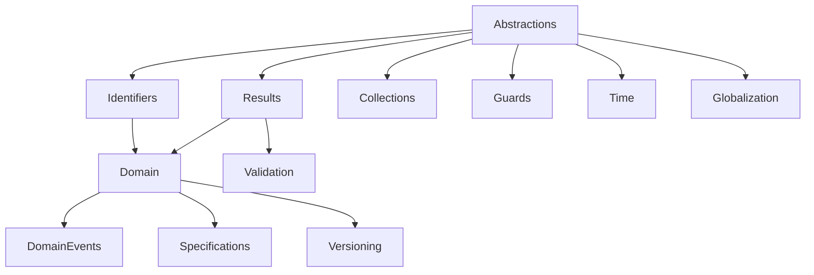

 # KUKULCAN.SharedKernel

> A lightweight, domain-driven Shared Kernel for building enterprise-grade .NET applications.


---

# Overview

**KUKULCAN.SharedKernel** is a lightweight, highly cohesive, and dependency-minimal framework designed to provide the fundamental building blocks required by modern Domain-Driven Design (DDD) applications.

Unlike traditional utility libraries, this project is **not** intended to become a miscellaneous collection of helpers.

Its primary goal is to establish a **stable architectural foundation** shared by every bounded context of an enterprise solution.

The framework follows these principles:

- Domain-Driven Design (DDD)
- Clean Architecture
- SOLID Principles
- Immutability by default
- Explicit Domain Modeling
- Framework Independence
- High Testability
- Minimal Dependencies
- Semantic Versioning

---

# Philosophy

KUKULCAN.SharedKernel is built around a very strict design philosophy.

The framework intentionally avoids:

- Helper classes
- Manager classes
- God objects
- Static business logic
- Hidden dependencies
- Infrastructure coupling
- Framework-specific abstractions

Instead, every component has **one single responsibility** and belongs to a clearly defined architectural module.

The result is a Shared Kernel that remains:

- Predictable
- Maintainable
- Extensible
- Easy to understand
- Easy to evolve

---

# Main Features

- Strongly Typed Identifiers
- Rich Value Objects
- Aggregate Roots
- Domain Events
- Specification Pattern
- Result Pattern
- Maybe Pattern
- Validation Model
- Time Abstractions
- Globalization Support
- Semantic Versioning
- Guard Clauses
- Collection Utilities

---

# Table of Contents

- [Overview](#overview)
- [Philosophy](#philosophy)
- [Main Features](#main-features)
- [Installation](#installation)
- [Quick Start](#quick-start)
- [Architecture](#architecture)
- [Results](#results)
- [Validation](#validation)
- [Domain Events](#domain-events)
- [Specifications](#specifications)
- [Time](#time)
- [Globalization](#globalization)
- [Versioning](#versioning)
- [Best Practices](#best-practices)
- [Roadmap](#roadmap)
- [Contributing](#contributing)
- [License](#license)

---

# Installation

Install the NuGet package.

```bash
dotnet add package KUKULCAN.SharedKernel
```

Or using the Package Manager.

```powershell
Install-Package KUKULCAN.SharedKernel
```

---

# Requirements

- .NET 10
- C# 13
- Nullable Reference Types enabled

---

# Quick Start

The following example demonstrates the creation of a strongly typed identifier.

```csharp
public sealed class CustomerId : EntityId<CustomerId>
{
    public CustomerId(Guid value)
        : base(value)
    {
    }
}

CustomerId id = new(Guid.NewGuid());
```

Creating a Result.

```csharp
Result result = Result.Success();

Result<Customer> customer =
    Result.Success(new Customer(...));
```

Returning an error.

```csharp
return Result.Failure(
    CommonErrors.NotFound(
        nameof(Customer),
        customerId));
```

Creating a Value Object.

```csharp
public sealed class Email : ValueObject
{
    public Email(string value)
    {
        ArgumentException.ThrowIfNullOrWhiteSpace(value);

        Value = value;
    }

    public string Value { get; }

    protected override IEnumerable<object?> GetEqualityComponents()
    {
        yield return Value;
    }
}
```

Working with Specifications.

```csharp
public sealed class ActiveCustomerSpecification
    : Specification<Customer>
{
    public override Expression<Func<Customer, bool>> ToExpression()
        => customer => customer.IsActive;
}
```

Using Domain Events.

```csharp
public sealed class CustomerCreatedEvent : DomainEvent
{
    public CustomerCreatedEvent(CustomerId customerId)
    {
        CustomerId = customerId;
    }

    public CustomerId CustomerId { get; }
}
```

Publishing the event from an Aggregate Root.

```csharp
AddDomainEvent(
    new CustomerCreatedEvent(Id));
```

---

# Design Goals

KUKULCAN.SharedKernel has been designed around the following architectural goals.

| Goal                   | Description                                               |
|------------------------|-----------------------------------------------------------|
| Cohesion               | Every module has a single responsibility.                 |
| Low Coupling           | Modules have minimal dependencies.                        |
| Testability            | Every component can be tested independently.              |
| Immutability           | Value Objects are immutable by design.                    |
| Extensibility          | New modules can be added without modifying existing ones. |
| Framework Independence | Domain model never depends on infrastructure.             |
| Maintainability        | Every module can evolve independently.                    |

---

# Architectural Principles

The framework follows these rules.

- Domain first.
- Infrastructure last.
- No cyclic dependencies.
- Explicit models.
- Immutable Value Objects.
- Aggregate consistency.
- Rich domain model.
- Strong typing over primitive obsession.
- Public API kept intentionally small.
- Internal implementation hidden whenever possible.

---

# Architecture

KUKULCAN.SharedKernel has been designed as a true architectural foundation rather than as a collection of utility classes.

Every public type belongs to a well-defined architectural module with a single responsibility.

The framework follows the principles of:

- Domain-Driven Design (DDD)
- Clean Architecture
- SOLID
- Explicit Domain Modeling
- Low Coupling
- High Cohesion

One of the main goals of the project is to guarantee long-term maintainability by keeping module responsibilities clearly separated.

---

# High-Level Architecture



---

# Architectural Rules

The framework follows a strict dependency model.

## Rule 1

Dependencies always point towards lower-level modules.

Higher-level modules never introduce cyclic dependencies.

---

## Rule 2

Domain code never depends on infrastructure.

The Domain layer only knows:

- Abstractions
- Identifiers
- Results

---

## Rule 3

Infrastructure concerns are represented only through contracts.

Concrete implementations belong to the application or infrastructure layers.

---

## Rule 4

Every module has a single responsibility.

Examples:

| Module         | Responsibility                        |
|----------------|---------------------------------------|
| Results        | Functional result model               |
| Validation     | Validation model                      |
| Domain         | Domain base classes                   |
| DomainEvents   | Domain Event infrastructure           |
| Specifications | Specification Pattern                 |
| Globalization  | Culture and localization abstractions |
| Versioning     | Semantic Version model                |
| Time           | Time abstractions                     |

---

# Module Organization

The project is intentionally divided into small independent modules.

```text
KUKULCAN.SharedKernel
│
├── Abstractions
├── Attributes
├── Collections
├── Domain
├── DomainEvents
├── Exceptions
├── Globalization
├── Guards
├── Identifiers
├── Internals
├── Maybe
├── Results
├── Specifications
├── Time
├── Validation
└── Versioning
```

Each module exposes only the public types required by consumers.

Implementation details remain internal.

---

# Module Responsibilities

## Abstractions

Contains the fundamental contracts used across the framework.

Examples:

- IEntity
- IEntityId
- IAggregateRoot
- IClock
- ILocalizationProvider

---

## Domain

Provides the building blocks for Domain-Driven Design.

Includes:

- Entity
- AggregateRoot
- AuditableEntity
- ValueObject
- Enumeration

---

## Domain Events

Implements the Domain Event pattern.

Includes:

- DomainEvent
- IDomainEvent
- IDomainEventDispatcher

Aggregate roots own and publish domain events while remaining infrastructure independent.

---

## Results

Implements a functional result model inspired by railway-oriented programming.

Includes:

- Error
- Result
- Result<T>
- CommonErrors
- CommonErrorCodes

Exceptions are reserved for programming errors.

Business failures are represented as Result objects.

---

## Validation

Provides a lightweight validation model independent of any external validation framework.

Includes:

- ValidationResult
- ValidationFailure
- ValidationExtensions
- ValidationThrowExtensions

---

## Specifications

Implements the Specification Pattern.

Specifications are composable and can be translated into LINQ expressions.

---

## Time

Provides testable abstractions over system time.

Includes:

- IClock
- SystemClock
- FakeClock

---

## Globalization

Provides culture-aware abstractions without depending on any localization framework.

Includes:

- SupportedCulture
- ICurrentCultureProvider
- ILocalizationProvider
- ITextLocalizer

---

## Versioning

Provides Semantic Versioning support.

Includes:

- SemanticVersion

The implementation follows Semantic Versioning 2.0.

---

# Public API Philosophy

The framework intentionally exposes a very small public surface.

Only concepts representing part of the domain language become public.

Everything else remains internal.

This minimizes breaking changes and simplifies long-term maintenance.

---

# Design Decisions

Several architectural decisions intentionally differentiate this framework from traditional Shared Kernels.

## Rich Domain Model

Entities contain behavior.

Business rules belong inside the domain model.

---

## Strong Typing

Primitive obsession is avoided through strongly typed identifiers and value objects.

---

## Immutability

Value Objects are immutable by design.

---

## Explicit Errors

Business failures never rely on exceptions.

Instead, they use Result and Error.

---

## Infrastructure Independence

The Shared Kernel contains no infrastructure implementations.

Only abstractions are provided.

---

# Internal Components

Some components are intentionally hidden from consumers.

Examples:

- StructuralComparer
- ObjectFormatter
- DictionaryComparer
- EnumerableComparer

These classes exist solely to support the public API and are not considered part of the framework contract.

---

# Stability Policy

Every module is individually audited before being frozen.

Once a module is frozen, breaking changes are avoided unless required by a critical architectural reason.

This policy guarantees long-term API stability while allowing the framework to evolve incrementally.

# Using the Shared Kernel

This chapter demonstrates how the different components of **KUKULCAN.SharedKernel** work together to build a rich domain model.

Rather than describing every individual class, the following examples illustrate the recommended usage patterns.

---

# Results

The framework follows a functional approach for representing business outcomes.

Business failures are represented using `Result` rather than exceptions.

## Successful Result

```csharp
Result result = Result.Success();

if (result.IsSuccess)
{
    Console.WriteLine("Operation completed.");
}
```

---

## Failed Result

```csharp
Result result =
    Result.Failure(
        CommonErrors.NotFound(
            nameof(Customer),
            customerId));

if (result.IsFailure)
{
    Console.WriteLine(result.Error.Description);
}
```

---

## Returning Values

```csharp
Result<Customer> customer =
    Result.Success(
        new Customer(customerId));
```

---

## Returning Errors

```csharp
Result<Customer> customer =
    Result.Failure<Customer>(
        CommonErrors.NotFound(
            nameof(Customer),
            customerId));
```

---

## Chaining Results

```csharp
Result<Customer> customer =
    repository.Get(customerId);

if (customer.IsFailure)
{
    return customer;
}

customer.Value.Activate();

return Result.Success(customer.Value);
```

---

# Maybe

Some operations may legitimately return "no value".

Instead of returning null, use `Maybe<T>`.

---

## Creating a Value

```csharp
Maybe<Customer> customer =
    Maybe.From(existingCustomer);
```

---

## Empty Value

```csharp
Maybe<Customer> customer =
    Maybe.None<Customer>();
```

---

## Pattern

```csharp
if (customer.HasValue)
{
    Console.WriteLine(customer.Value.Name);
}
```

---

# Validation

Validation is completely independent of any external validation framework.

---

## Creating a Validation Result

```csharp
ValidationResult validation =
    ValidationResult.Success();
```

---

## Adding Errors

```csharp
validation.AddFailure(
    ValidationFailure.Create(
        nameof(Customer.Name),
        "Customer name is required."));
```

---

## Returning Result

```csharp
if (!validation.IsValid)
{
    return validation.ToResult();
}
```

---

## Throwing Validation Exceptions

```csharp
validation.ThrowIfInvalid();
```

---

# Guard Clauses

Guard clauses simplify argument validation.

---

## Null Validation

```csharp
Guard.NotNull(customer);
```

---

## String Validation

```csharp
Guard.NotNullOrWhiteSpace(name);
```

---

## Range Validation

```csharp
Guard.Positive(quantity);
```

---

## Collection Validation

```csharp
Guard.NotEmpty(customers);
```

---

# Strongly Typed Identifiers

Primitive identifiers should never be exposed throughout the domain.

Instead, create strongly typed identifiers.

---

```csharp
public sealed class CustomerId
    : EntityId<CustomerId>
{
    public CustomerId(Guid value)
        : base(value)
    {
    }
}
```

Usage:

```csharp
CustomerId id =
    new(Guid.NewGuid());
```

---

# Value Objects

Value Objects represent immutable concepts.

---

```csharp
public sealed class Email
    : ValueObject
{
    public Email(string value)
    {
        ArgumentException.ThrowIfNullOrWhiteSpace(value);

        Value = value;
    }

    public string Value { get; }

    protected override IEnumerable<object?> GetEqualityComponents()
    {
        yield return Value;
    }
}
```

Comparison becomes automatic.

```csharp
Email first =
    new("[email protected]");

Email second =
    new("[email protected]");

bool equals = first == second;
```

---

# Entities

Entities are identified by identity rather than value.

---

```csharp
public sealed class Customer
    : Entity<CustomerId>
{
    public Customer(CustomerId id)
        : base(id)
    {
    }

    public string Name { get; private set; } = string.Empty;

    public void Rename(string name)
    {
        Guard.NotNullOrWhiteSpace(name);

        Name = name;
    }
}
```

---

# Aggregate Roots

Aggregate Roots encapsulate consistency boundaries.

---

```csharp
public sealed class Customer
    : AggregateRoot<CustomerId>
{
    public Customer(CustomerId id)
        : base(id)
    {
    }

    public void Activate()
    {
        AddDomainEvent(
            new CustomerActivatedEvent(Id));
    }
}
```

---

# Domain Events

Domain Events capture something that happened inside the domain.

---

```csharp
public sealed class CustomerActivatedEvent
    : DomainEvent
{
    public CustomerActivatedEvent(
        CustomerId customerId)
    {
        CustomerId = customerId;
    }

    public CustomerId CustomerId { get; }
}
```

---

Publishing events.

```csharp
customer.Activate();

foreach (IDomainEvent domainEvent in customer.DomainEvents)
{
    await dispatcher.DispatchAsync(
        domainEvent,
        cancellationToken);
}

customer.ClearDomainEvents();
```

---

# Specifications

Specifications encapsulate business rules.

---

```csharp
public sealed class ActiveCustomerSpecification
    : Specification<Customer>
{
    public override Expression<Func<Customer, bool>>
        ToExpression()
    {
        return customer => customer.IsActive;
    }
}
```

Using specifications.

```csharp
Specification<Customer> specification =
    new ActiveCustomerSpecification();

IEnumerable<Customer> customers =
    repository.Find(specification);
```

Specifications are composable.

```csharp
Specification<Customer> specification =
    new ActiveCustomerSpecification()
        .And(new PremiumCustomerSpecification())
        .AndNot(new DeletedCustomerSpecification());
```

---

# Putting Everything Together

A typical application service may look like this.

```csharp
public async Task<Result<CustomerDto>> Handle(
    ActivateCustomerCommand request,
    CancellationToken cancellationToken)
{
    Guard.NotNull(request);

    Result<Customer> customer =
        await repository.GetAsync(
            request.CustomerId,
            cancellationToken);

    if (customer.IsFailure)
    {
        return customer.Error;
    }

    customer.Value.Activate();

    await repository.SaveAsync(
        customer.Value,
        cancellationToken);

    return mapper.Map(customer.Value);
}
```

The application code remains:

- Explicit
- Strongly typed
- Easy to test
- Infrastructure independent
- Domain driven

# Cross-Cutting Concerns

Modern enterprise applications require more than a rich domain model.

They also require a consistent approach for handling:

- Time
- Culture
- Localization
- Semantic Versioning

KUKULCAN.SharedKernel provides abstractions for each of these concerns while remaining completely independent of infrastructure frameworks.

---

# Time

One of the most common problems in enterprise applications is the direct usage of `DateTime.UtcNow`.

This creates hidden dependencies and makes automated testing considerably harder.

Instead, every application should depend on the `IClock` abstraction.

---

## IClock

```csharp
public sealed class Customer
{
    private readonly IClock _clock;

    public Customer(IClock clock)
    {
        _clock = clock;
    }

    public DateTimeOffset CreatedOn =>
        _clock.UtcNow;
}
```

The domain no longer depends on the operating system clock.

---

## SystemClock

Production code should normally use `SystemClock`.

```csharp
IClock clock =
    new SystemClock();

DateTimeOffset now =
    clock.UtcNow;
```

---

## FakeClock

Unit tests should never depend on real time.

Instead, use `FakeClock`.

```csharp
FakeClock clock =
    new(
        new DateTimeOffset(
            2026,
            7,
            29,
            10,
            0,
            0,
            TimeSpan.Zero));
```

---

## Advancing Time

```csharp
clock.AdvanceHours(4);

clock.AdvanceMinutes(30);

clock.AdvanceDays(2);
```

---

## Rewinding Time

```csharp
clock.RewindHours(1);

clock.RewindMinutes(15);

clock.RewindDays(7);
```

---

## Example

```csharp
FakeClock clock =
    new(DateTimeOffset.UtcNow);

Customer customer =
    new(clock);

clock.AdvanceDays(30);

Assert.True(
    customer.HasExpired());
```

Time-dependent behavior becomes fully deterministic.

---

# Globalization

Applications frequently need to support multiple cultures.

The Shared Kernel models culture as an explicit domain concept.

Rather than depending directly on `CultureInfo`, applications interact through abstractions.

---

## SupportedCulture

```csharp
SupportedCulture culture =
    SupportedCulture.Parse("en-US");
```

or

```csharp
SupportedCulture culture =
    SupportedCulture.Parse("es-ES");
```

---

## TryParse

```csharp
if (SupportedCulture.TryParse(
    "fr-FR",
    out SupportedCulture? culture))
{
    ...
}
```

---

## Current Culture

Applications should depend on `ICurrentCultureProvider`.

```csharp
public sealed class CustomerService
{
    private readonly ICurrentCultureProvider
        _cultureProvider;

    public CustomerService(
        ICurrentCultureProvider cultureProvider)
    {
        _cultureProvider = cultureProvider;
    }

    public SupportedCulture Culture =>
        _cultureProvider.CurrentCulture;
}
```

---

## Localization

Localization is represented by abstractions.

```csharp
public interface ITextLocalizer
{
    string Get(
        string key);
}
```

The Shared Kernel intentionally provides no implementation.

Infrastructure remains responsible for loading translations.

---

## Localized Resources

```csharp
LocalizedString title =
    new(
        "Customer.Name",
        "Customer");
```

or

```csharp
LocalizedText text =
    new(
        "Customer.Name",
        "Customer",
        SupportedCulture.Parse("en-US"));
```

---

# Versioning

Versioning is represented as a first-class Value Object.

The implementation follows the Semantic Versioning 2.0 specification.

---

## Creating Versions

```csharp
SemanticVersion version =
    new(
        1,
        0,
        0);
```

---

## Parsing

```csharp
SemanticVersion version =
    SemanticVersion.Parse(
        "2.3.1");
```

---

## TryParse

```csharp
if (SemanticVersion.TryParse(
    "1.4.0-beta.1",
    out SemanticVersion? version))
{
    ...
}
```

---

## Comparison

```csharp
SemanticVersion stable =
    SemanticVersion.Parse(
        "1.0.0");

SemanticVersion beta =
    SemanticVersion.Parse(
        "1.0.0-beta");

bool newer =
    stable > beta;
```

---

## Equality

```csharp
SemanticVersion first =
    SemanticVersion.Parse(
        "2.1.0");

SemanticVersion second =
    SemanticVersion.Parse(
        "2.1.0");

bool equals =
    first == second;
```

---

# Why These Components Belong in the Shared Kernel

Although these modules are not part of the domain model itself, they represent concepts that are shared across every bounded context.

Keeping them inside the Shared Kernel guarantees:

- Consistent behavior
- Consistent APIs
- Testability
- Framework independence

---

# Recommended Practices

## Always

✔ Depend on `IClock`

✔ Use `SupportedCulture`

✔ Represent versions using `SemanticVersion`

✔ Inject localization through abstractions

---

## Avoid

❌ DateTime.UtcNow

❌ CultureInfo.CurrentCulture inside the domain

❌ String comparisons for versions

❌ Infrastructure dependencies inside entities

---

# Example

The following example combines all three modules.

```csharp
public sealed class ApplicationInfo
{
    public ApplicationInfo(
        IClock clock,
        ICurrentCultureProvider cultures)
    {
        StartedAt =
            clock.UtcNow;

        Culture =
            cultures.CurrentCulture;

        Version =
            SemanticVersion.Parse(
                "1.0.0");
    }

    public DateTimeOffset StartedAt { get; }

    public SupportedCulture Culture { get; }

    public SemanticVersion Version { get; }
}
```

This object remains:

- deterministic
- testable
- immutable
- infrastructure independent
- fully aligned with Clean Architecture

# Extending the Framework

KUKULCAN.SharedKernel has been designed to be extended rather than modified.

Applications should rarely need to change the framework itself.

Instead, they should extend it by creating new domain types that inherit from the existing abstractions.

This chapter demonstrates the recommended extension points.

---

# Creating Strongly Typed Identifiers

Every aggregate should expose its own strongly typed identifier.

Avoid using primitive types such as `Guid`, `int` or `string` directly throughout the domain model.

Instead, derive from `EntityId<T>`.

```csharp
public sealed class CustomerId
    : EntityId<CustomerId>
{
    public CustomerId(Guid value)
        : base(value)
    {
    }
}
```

Usage

```csharp
CustomerId customerId =
    new(Guid.NewGuid());
```

Benefits

- Compile-time safety
- Explicit intent
- No primitive obsession
- Better readability

---

# Creating Value Objects

Value Objects should always be immutable.

Example

```csharp
public sealed class EmailAddress
    : ValueObject
{
    public EmailAddress(string value)
    {
        ArgumentException.ThrowIfNullOrWhiteSpace(value);

        Value = value;
    }

    public string Value { get; }

    protected override IEnumerable<object?> GetEqualityComponents()
    {
        yield return Value;
    }
}
```

Usage

```csharp
EmailAddress email =
    new("[email protected]");
```

---

# Creating Enumerations

Business concepts that behave like enumerations but require richer semantics should inherit from `Enumeration`.

```csharp
public sealed class CustomerType
    : Enumeration
{
    public static readonly CustomerType Standard =
        new(1, "Standard");

    public static readonly CustomerType Premium =
        new(2, "Premium");

    public static readonly CustomerType Vip =
        new(3, "VIP");

    private CustomerType(
        int id,
        string name)
        : base(id, name)
    {
    }
}
```

Usage

```csharp
CustomerType customerType =
    CustomerType.Premium;
```

Unlike standard enums, enumerations support:

- Methods
- Validation
- Rich behaviour
- Metadata

---

# Creating Entities

Entities should inherit from `Entity<TId>`.

```csharp
public sealed class Customer
    : Entity<CustomerId>
{
    public Customer(CustomerId id)
        : base(id)
    {
    }

    public string Name { get; private set; } = string.Empty;

    public void Rename(string name)
    {
        Guard.NotNullOrWhiteSpace(name);

        Name = name;
    }
}
```

---

# Creating Aggregate Roots

Aggregate Roots inherit from `AggregateRoot<TId>`.

```csharp
public sealed class Customer
    : AggregateRoot<CustomerId>
{
    public Customer(CustomerId id)
        : base(id)
    {
    }

    public void Activate()
    {
        AddDomainEvent(
            new CustomerActivatedEvent(Id));
    }
}
```

Aggregate Roots own consistency boundaries.

---

# Creating Domain Events

Domain Events should inherit from `DomainEvent`.

```csharp
public sealed class CustomerActivatedEvent
    : DomainEvent
{
    public CustomerActivatedEvent(
        CustomerId customerId)
    {
        CustomerId = customerId;
    }

    public CustomerId CustomerId { get; }
}
```

Raise the event from the Aggregate Root.

```csharp
AddDomainEvent(
    new CustomerActivatedEvent(Id));
```

---

# Creating Specifications

Business rules should be encapsulated inside specifications.

```csharp
public sealed class PremiumCustomerSpecification
    : Specification<Customer>
{
    public override Expression<Func<Customer, bool>>
        ToExpression()
    {
        return customer => customer.Type ==
               CustomerType.Premium;
    }
}
```

Specifications may be combined.

```csharp
Specification<Customer> specification =
    new ActiveCustomerSpecification()
        .And(new PremiumCustomerSpecification());
```

---

# Creating Validation Rules

Validation should remain independent of infrastructure frameworks.

```csharp
ValidationResult validation =
    ValidationResult.Success();

if (string.IsNullOrWhiteSpace(customer.Name))
{
    validation.AddFailure(
        ValidationFailure.Create(
            nameof(Customer.Name),
            ValidationMessages.Required));
}
```

Return

```csharp
return validation.ToResult();
```

instead of throwing exceptions for business failures.

---

# Creating New Supported Cultures

Applications may register additional cultures by extending the globalization layer.

```csharp
SupportedCulture culture =
    SupportedCulture.Parse("es-MX");
```

The Shared Kernel intentionally separates culture modeling from localization implementation.

---

# Extending Semantic Versioning

Applications normally should not derive from `SemanticVersion`.

Instead, compose it.

```csharp
public sealed class ApplicationVersion
{
    public ApplicationVersion(
        SemanticVersion version)
    {
        Version = version;
    }

    public SemanticVersion Version { get; }
}
```

---

# Adding New Modules

When introducing a completely new module, follow these architectural rules.

Every module must:

- Have a single responsibility.
- Be independent of infrastructure.
- Avoid cyclic dependencies.
- Expose the smallest possible public API.
- Prefer immutable models.
- Keep implementation details internal.

---

# Dependency Rules

The following dependency graph must always be respected.

```text
Abstractions
        │
        ▼
Identifiers
        │
        ▼
Results
        │
        ▼
Domain
        │
        ├───────────────┐
        ▼               ▼
DomainEvents     Specifications
        │
        ▼
Validation

Time

Globalization

Versioning
```

Dependencies should always point downwards.

---

# What Should NOT Be Extended

Some framework components are intentionally internal.

Applications should never depend directly on:

- StructuralComparer
- DictionaryComparer
- EnumerableComparer
- ObjectFormatter

These classes exist exclusively to support the framework implementation.

---

# Design Guidelines

When extending the framework, follow these recommendations.

✔ Prefer composition to inheritance.

✔ Create rich domain models.

✔ Keep Value Objects immutable.

✔ Raise Domain Events from Aggregate Roots only.

✔ Use Result for business failures.

✔ Reserve exceptions for programming errors.

✔ Keep infrastructure outside the domain.

✔ Minimize the public API.

---

# Anti-Patterns

Avoid the following practices.

❌ Primitive obsession

❌ Anemic domain models

❌ Static business logic

❌ God objects

❌ Infrastructure dependencies inside entities

❌ Mutable Value Objects

❌ Returning null instead of Maybe

❌ Throwing exceptions for business validation

---

# Summary

The Shared Kernel is intended to evolve by extension rather than modification.

Applications should build upon its abstractions while preserving the architectural principles that guarantee long-term maintainability and stability.

# Best Practices

KUKULCAN.SharedKernel has been designed to provide a stable architectural foundation for enterprise applications following Domain-Driven Design and Clean Architecture.

The following recommendations should be considered mandatory for achieving the highest level of maintainability.

---

## Keep the Domain Pure

The domain model should never depend on infrastructure concerns.

Avoid references to:

- Entity Framework
- ASP.NET Core
- HTTP
- Serialization frameworks
- Dependency Injection frameworks
- Logging frameworks

The Domain should only depend on the abstractions provided by the Shared Kernel.

---

## Prefer Rich Domain Models

Entities should contain behavior.

Avoid anemic models such as:

```csharp
public class Customer
{
    public string Name { get; set; }
}
```

Prefer:

```csharp
public sealed class Customer
    : AggregateRoot<CustomerId>
{
    public void Rename(string newName)
    {
        Guard.NotNullOrWhiteSpace(newName);

        Name = newName;
    }
}
```

---

## Avoid Primitive Obsession

Do not expose primitive identifiers across the domain.

Instead of

```csharp
Guid CustomerId
```

prefer

```csharp
CustomerId CustomerId
```

---

## Use Value Objects

Whenever a concept is identified by its value instead of its identity, implement it as a Value Object.

Examples:

- Email
- Address
- Money
- PhoneNumber
- TaxIdentifier

---

## Use Result for Business Failures

Business rules should return Result.

```csharp
return Result.Failure(
    CommonErrors.NotFound(
        nameof(Customer),
        customerId));
```

Programming errors should continue throwing exceptions.

---

## Never Return Null

Prefer

```csharp
Maybe<Customer>
```

instead of

```csharp
Customer?
```

This makes the API explicit.

---

## Raise Domain Events

Aggregate Roots should communicate state changes through Domain Events.

```csharp
AddDomainEvent(
    new CustomerCreatedEvent(Id));
```

Avoid directly invoking external services from entities.

---

## Keep Aggregate Boundaries Small

Aggregate Roots should enforce consistency.

Do not create aggregates containing dozens of entities.

---

## Use Specifications

Business rules that are reusable should become Specifications.

Avoid duplicating LINQ expressions throughout the application.

---

## Depend on IClock

Never use

```csharp
DateTime.UtcNow
```

inside the domain.

Instead

```csharp
IClock
```

---

## Prefer Immutability

Value Objects should always be immutable.

Aggregate state should change only through explicit behavior.

---

## Keep the Public API Small

Every public type becomes part of the framework contract.

If a class is not intended for consumers, make it internal.

---

## Minimize Dependencies

The Shared Kernel intentionally depends only on the .NET Base Class Library.

Avoid introducing external dependencies unless they provide significant architectural value.

---

## Preserve Module Independence

Each module should have a single responsibility.

Do not create cross-module shortcuts.

---

## Write Self-Documenting Code

Prefer expressive names to comments.

Good code should explain itself.

---

## Keep Breaking Changes Rare

Once a module is frozen, breaking changes should only occur for critical architectural reasons.

Stable APIs create stable applications.

---

# Roadmap

The following roadmap describes the expected evolution of the framework.

## Version 1.0.0-beta1

- Initial public beta
- Stable public API
- Complete Shared Kernel
- Full XML Documentation
- GitHub Documentation
- NuGet Packaging

---

## Version 1.0.0

- Production-ready release
- Performance review
- Roslyn analyzers
- Additional unit tests
- SourceLink support

---

## Version 1.1

Possible improvements under evaluation.

- Additional Value Objects
- Additional Specifications
- Performance optimizations
- Additional globalization features
- More domain primitives

No breaking changes are planned.

---

## Long-Term Vision

The Shared Kernel is expected to become the architectural foundation for all KUKULCAN products.

Its evolution will prioritize:

- Stability
- Simplicity
- Predictability
- Long-term maintainability

---

# Contributing

Contributions are welcome.

Before submitting any contribution, please read the following guidelines.

---

## General Principles

Every contribution should preserve the architectural principles of the framework.

New code should be:

- Simple
- Cohesive
- Well documented
- Fully tested

---

## Pull Requests

Every Pull Request should:

- Address a single concern.
- Preserve backward compatibility whenever possible.
- Include XML documentation.
- Include unit tests.
- Respect the existing coding style.

---

## Coding Guidelines

Follow the existing conventions.

- PascalCase for public members.
- Nullable Reference Types enabled.
- File-scoped namespaces.
- One public type per file.
- Prefer readonly.
- Prefer sealed.
- Prefer immutable models.

---

## Architecture

Contributors should avoid introducing:

- Helper classes
- Utility classes
- God Objects
- Static business logic
- Infrastructure dependencies

Every new abstraction should have a clearly defined responsibility.

---

## Breaking Changes

Breaking changes require explicit discussion before implementation.

The framework prioritizes API stability.

---

# Version Policy

KUKULCAN.SharedKernel follows Semantic Versioning 2.0.

https://semver.org

---

## MAJOR

Incremented when incompatible API changes are introduced.

Example

```
2.0.0
```

---

## MINOR

Incremented when new functionality is added in a backward-compatible manner.

Example

```
1.4.0
```

---

## PATCH

Incremented for backward-compatible bug fixes.

Example

```
1.4.2
```

---

## Pre-release Versions

Examples

```
1.0.0-alpha1

1.0.0-beta1

1.0.0-rc1
```

---

## Compatibility Policy

Public APIs remain stable once a module has been frozen.

Breaking changes are exceptional.

---

# License

MIT License

Copyright (c) 2026 KUKULCAN

Permission is hereby granted, free of charge, to any person obtaining a copy of this software and associated documentation files (the "Software"), to deal in the Software without restriction, including without limitation the rights to:

- use
- copy
- modify
- merge
- publish
- distribute
- sublicense
- sell copies

subject to the conditions described in the LICENSE file.

---

# GitHub Metadata

The following files are recommended for a professional GitHub repository.

```
/
├── .editorconfig
├── .gitattributes
├── .gitignore
├── CHANGELOG.md
├── CODE_OF_CONDUCT.md
├── CONTRIBUTING.md
├── LICENSE
├── README.md
├── SECURITY.md
├── SUPPORT.md
└── logo.png
```

---

# Recommended NuGet Metadata

The project file should contain metadata similar to the following.

```xml
<PropertyGroup>

  <PackageId>KUKULCAN.SharedKernel</PackageId>

  <Title>KUKULCAN Shared Kernel</Title>

  <Authors>KUKULCAN</Authors>

  <Company>KUKULCAN</Company>

  <Product>KUKULCAN.SharedKernel</Product>

  <Description>
    Lightweight Shared Kernel for Domain-Driven Design and Clean Architecture.
  </Description>

  <PackageTags>
    ddd;clean-architecture;sharedkernel;domain-driven-design;
    value-object;result;specification;domain-events
  </PackageTags>

  <PackageLicenseExpression>MIT</PackageLicenseExpression>

  <PackageReadmeFile>README.md</PackageReadmeFile>

  <RepositoryType>git</RepositoryType>

  <RepositoryUrl>https://github.com/KUKULCAN/KUKULCAN.SharedKernel</RepositoryUrl>

  <PackageProjectUrl>https://github.com/KUKULCAN/KUKULCAN.SharedKernel</PackageProjectUrl>

  <PublishRepositoryUrl>true</PublishRepositoryUrl>

  <EmbedUntrackedSources>true</EmbedUntrackedSources>

  <IncludeSymbols>true</IncludeSymbols>

  <SymbolPackageFormat>snupkg</SymbolPackageFormat>

  <GenerateDocumentationFile>true</GenerateDocumentationFile>

  <GeneratePackageOnBuild>true</GeneratePackageOnBuild>

  <ContinuousIntegrationBuild>true</ContinuousIntegrationBuild>

</PropertyGroup>
```

---

# Repository Structure

```
KUKULCAN.SharedKernel
│
├── src/
│   └── KUKULCAN.SharedKernel
│
├── tests/
│   └── KUKULCAN.SharedKernel.Tests
│
├── docs/
│
├── README.md
├── CHANGELOG.md
├── LICENSE
└── CONTRIBUTING.md
```

---

# Support

For questions, bug reports and feature requests, please use the GitHub Issues section.

---

# Final Notes

KUKULCAN.SharedKernel is intended to provide a stable, expressive and long-lived foundation for enterprise software.

The project favors architectural consistency over feature accumulation and prioritizes simplicity, explicitness and maintainability above all else.
